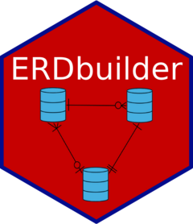

<!-- README.md is generated from README.Rmd. Please edit that file -->

```{r, include = FALSE}
knitr::opts_chunk$set(
  collapse = TRUE,
  comment = "#>",
  fig.path = "man/figures/README-",
  out.width = "100%"
)
```

# ERDbuilder <a href="https://gbasulto.github.io/ERDbuilder/"></a>

<!-- badges: start -->

[](https://app.codecov.io/gh/gbasulto/ERDbuilder)
[](https://CRAN.R-project.org/package=ERDbuilder)
[](https://github.com/gbasulto/ERDbuilder/actions/workflows/R-CMD-check.yaml)
[](https://github.com/gbasulto/ERDbuilder/actions/workflows/pkgdown.yaml)
<!-- badges: end -->

`ERDbuilder` creates Entity-Relationship Diagrams (ERDs) directly from R data frames.

The package provides tools to:

* inspect a named list of data frames and suggest possible relationships;
* create an ERD specification using table names, join columns, and cardinalities;
* validate the ERD structure and compare declared relationships with the observed data;
* render the ERD as an interactive diagram; and
* join tables using the relationships stored in the ERD.

## Installation

You can install the development version of `ERDbuilder` from GitHub:

```{r, eval = FALSE}
remotes::install_github("gbasulto/ERDbuilder")
```

Then load the package:

```{r}
library(ERDbuilder)
```

## Recommended workflow

A typical `ERDbuilder` workflow consists of six steps:

1. Place the data frames in a named list.
2. Use `suggest_relationships()` to identify likely relationships.
3. Review and, when necessary, edit the suggested relationships.
4. Create an ERD object with `create_erd()`.
5. Check the ERD with `validate_erd()`.
6. Render the ERD or use it to join tables.

Define dataframes for example:
```{r}

# Create dataframe "employees"
employees <- data.frame(
  emp_id = c(1, 2, 3),
  name = c("Alice", "Bob", "Charlie")
)

# Create dataframe "departments"
departments <- data.frame(
  dept_id = c(1, 2),
  dept_name = c("HR", "Engineering")
)

# Create dataframe "assignments"
assignments <- data.frame(
  emp_id = c(1, 3),
  dept_id = c(1, 2)
)

```


```{r}
df_list <- list(
  employees = employees,
  departments = departments,
  assignments = assignments
)

relationships <- suggest_relationships(df_list)

erd_object <- create_erd(
  df_list = df_list,
  relationships = relationships
)

validate_erd(erd_object)
```

```{r, eval = FALSE}
render_erd(erd_object)
```

Relationship suggestions are based on the available data and should always be reviewed before they are treated as database constraints.

## Main functions

| Function                  | Purpose                                                                  |
| :------------------------ | :----------------------------------------------------------------------- |
| `suggest_relationships()` | Suggest relationships between data frames                                |
| `format_relationships()`  | Convert a relationship specification into paste-ready R code             |
| `create_erd()`            | Create an ERD object                                                     |
| `validate_erd()`          | Validate the ERD structure and optionally inspect observed cardinalities |
| `is_valid_erd()`          | Return whether an ERD passes validation                                  |
| `render_erd()`            | Render an ERD                                                            |
| `perform_join()`          | Join tables using relationships stored in an ERD                         |

## Suggesting relationships

`suggest_relationships()` examines pairs of data frames and evaluates possible join columns using information such as:

* matching or similar column names;
* columns with names that resemble identifiers;
* uniqueness of potential keys; and
* coverage of values between tables.

Start by creating a named list of data frames:

```{r suggest-example}
employees <- data.frame(
  emp_id = c(1, 2, 3),
  name = c("Alice", "Bob", "Charlie")
)

departments <- data.frame(
  dept_id = c(1, 2),
  dept_name = c("Human Resources", "Engineering")
)

assignments <- data.frame(
  assignment_id = 1:3,
  emp_id = c(1, 1, 3),
  dept_id = c(1, 2, 2)
)

df_list <- list(
  employees = employees,
  departments = departments,
  assignments = assignments
)
```

Generate the suggested relationships:

```{r suggest-relationships}
relationships <- suggest_relationships(
  df_list,
  quiet = TRUE
)

relationships
```

The returned object uses the same relationship structure expected by `create_erd()`.

Diagnostic information about the suggestions is stored in the `"suggestions"` attribute:

```{r inspect-suggestions}
attr(relationships, "suggestions")
```

These diagnostics can be used to review the proposed join columns, relationship direction, key uniqueness, value coverage, and confidence score.

### Creating paste-ready relationship code

Use `format_relationships()` to convert the suggested object into R code:

```{r format-suggestions}
cat(format_relationships(relationships))
```

To copy that code directly to the system clipboard during an interactive R session, use:

```{r clipboard-example, eval = FALSE}
relationships <- suggest_relationships(
  df_list,
  copy = TRUE
)
```

Clipboard support requires the optional `clipr` package:

```{r install-clipr, eval = FALSE}
install.packages("clipr")
```


## Creating and validating an ERD

After reviewing the suggested relationships, create the ERD object:

```{r create-and-validate}
erd_object <- create_erd(
  df_list = df_list,
  relationships = relationships
)

validation <- validate_erd(erd_object)

validation
```

The validation result contains an issue table:

```{r validation-issues}
validation$issues
```

It also contains a logical indicator of whether the ERD is valid:

```{r validation-status}
validation$valid
```

For a direct logical result, use:

```{r is-valid}
is_valid_erd(erd_object)
```

### Structural and data validation

By default, `validate_erd()` distinguishes between structural errors and warnings based on the observed data.

Structural errors include problems such as:

* references to tables that do not exist;
* references to columns that do not exist;
* malformed relationship specifications;
* invalid cardinality symbols;
* incompatible join-column types; and
* duplicate definitions of the same relationship.

When `check_data = TRUE`, the function also compares the declared cardinalities with the values observed in the data:

```{r}
validate_erd(
  erd_object,
  check_data = TRUE
)
```

Observed cardinality violations are warnings by default because a data sample may not fully represent the intended database constraints.

Use `strict = TRUE` to treat warnings as validation failures:

```{r}
validate_erd(
  erd_object,
  check_data = TRUE,
  strict = TRUE
)
```

During progressive ERD construction, incomplete relationships can be permitted explicitly:

```{r}
validate_erd(
  erd_object,
  check_data = FALSE,
  allow_incomplete = TRUE
)
```

## Example 1: Basic ERD

The following example manually defines the relationships among employees, departments, and assignments.

```{r basic-example}
library(ERDbuilder)

employees <- data.frame(
  emp_id = c(1, 2, 3),
  name = c("Alice", "Bob", "Charlie")
)

departments <- data.frame(
  dept_id = c(1, 2),
  dept_name = c("Human Resources", "Engineering")
)

assignments <- data.frame(
  assignment_id = 1:3,
  emp_id = c(1, 1, 3),
  dept_id = c(1, 2, 2)
)

relationships <- list(
  assignments = list(
    employees = list(
      emp_id = "emp_id",
      relationship = c(">|", "||")
    ),
    departments = list(
      dept_id = "dept_id",
      relationship = c(">0", "||")
    )
  )
)

erd_object <- create_erd(
  df_list = list(
    employees = employees,
    departments = departments,
    assignments = assignments
  ),
  relationships = relationships
)

validation <- validate_erd(
  erd_object,
  check_data = TRUE
)

validation
```

Render the ERD:

```{r render-basic}
erd_plot <- render_erd(
  erd_object,
  label_distance = 0,
  label_angle = -25
)

# erd_plot
```

To export the diagram, packages such as `DiagrammeRsvg`, `rsvg`, and `tiff` can be used:

```{r, eval=FALSE}
library(DiagrammeRsvg)
library(rsvg)
library(tiff)

dpi <- 600
width_cm <- 38
height_cm <- 38

erd_plot |>
  DiagrammeRsvg::export_svg() |>
  charToRaw() |>
  rsvg::rsvg(
    width = width_cm * (dpi / 2.54),
    height = height_cm * (dpi / 2.54)
  ) |>
  tiff::writeTIFF("erd_plot.tiff")
```

## Example 2: Crash, vehicle, occupant, and distraction data

This example creates a larger ERD and uses it to join four related tables.

```{r crash-example, eval = FALSE}
library(ERDbuilder)
library(readr)

data_url <- paste0(
  "https://raw.githubusercontent.com/",
  "jwood-iastate/DataFiles/main/"
)

occupant_tbl <- read_csv(
  paste0(data_url, "OCC.csv"),
  show_col_types = FALSE
)

crash_tbl <- read_csv(
  paste0(data_url, "CRASH.csv"),
  show_col_types = FALSE
)

distract_tbl <- read_csv(
  paste0(data_url, "DISTRACT.csv"),
  show_col_types = FALSE
)

vehicle_tbl <- read_csv(
  paste0(data_url, "GV.csv"),
  show_col_types = FALSE
)

df_list <- list(
  Crash = crash_tbl,
  Vehicle = vehicle_tbl,
  Occupant = occupant_tbl,
  Distract = distract_tbl
)
```

The relationships can be suggested initially:

```{r crash-suggestions, eval = FALSE}
suggested_relationships <- suggest_relationships(df_list)

attr(suggested_relationships, "suggestions")
```

For this example, the reviewed relationship specification is:

```{r crash-relationships, eval = FALSE}
relationships <- list(
  Crash = list(
    Vehicle = list(
      CASENUMBER = "CASENUMBER",
      relationship = c("||", "|<")
    ),
    Occupant = list(
      CASENUMBER = "CASENUMBER",
      relationship = c("||", "|<")
    ),
    Distract = list(
      CASENUMBER = "CASENUMBER",
      relationship = c("||", "0<")
    )
  ),
  Vehicle = list(
    Occupant = list(
      CASENUMBER = "CASENUMBER",
      VEHNO = "VEHNO",
      relationship = c("|0", "0<")
    ),
    Distract = list(
      CASENUMBER = "CASENUMBER",
      VEHNO = "VEHNO",
      relationship = c("||", "0<")
    )
  )
)
```

Create and validate the ERD:

```{r crash-create, eval = FALSE}
erd_object <- create_erd(
  df_list = df_list,
  relationships = relationships
)

validate_erd(
  erd_object,
  check_data = TRUE
)
```

Join the tables:

```{r crash-join, eval = FALSE}
# A many-to-many relationship may arise when Distract is joined after Crash,
# Vehicle, and Occupant have already been combined.

joined_data <- perform_join(
  erd_object,
  c("Crash", "Vehicle", "Occupant", "Distract")
)
```

Render the ERD:

```{r crash-render, eval = FALSE}
erd_plot <- render_erd(
  erd_object,
  label_distance = 0,
  label_angle = 15,
  n = 20
)

erd_plot
```

## Additional documentation

More detailed examples are available in the package vignettes:

```r
browseVignettes("ERDbuilder")
```

The package website is available at:

https://gbasulto.github.io/ERDbuilder/
