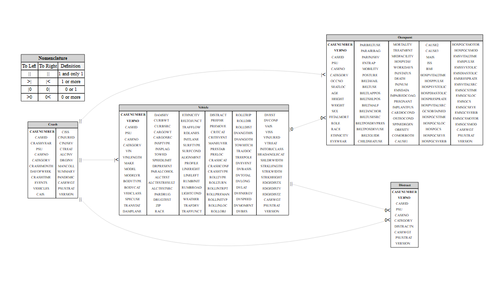

<!-- README.md is generated from README.Rmd. Please edit that file -->

# ERDbuilder

<!-- badges: start -->
<!-- badges: end -->

The goal of ERDbuilder is to build Entity Relationship Diagrams.

## Installation

You can install the development version of ERDbuilder like so:

``` r
# FILL THIS IN! HOW CAN PEOPLE INSTALL YOUR DEV PACKAGE?
```

## Function and Object List

| Name             | Class    | Purpose           |
|------------------|----------|-------------------|
| `render_erd()`   | Function |                   |
| `perform_join()` | Function |                   |
| `create_erd()`   | Function | Create ERD object |

Functions and Objects in “ERDbuilder” package

## Example 1

``` r

url <- "https://static.nhtsa.gov/nhtsa/downloads/CISS/2020/CISS_2020_CSV_files.zip"
download.file(url,"CISS.zip", mode = 'wb')
unzip("CISS.zip")
Occupant <- read.csv('OCC.csv') # Occupant Data
Vehicle <- read.csv('GV.csv') # Vehicle data
Crash <- read.csv('CRASH.csv') # Crash data
Distract <- read.csv('DISTRACT.csv') # Crash data

# Define relationships
relationships <- list(
  "Crash" = list(
    "Vehicle" = list("CASENUMBER" = "CASENUMBER", "relationship" = c("||", "|<")),
    "Occupant" = list("CASENUMBER" = "CASENUMBER",  "relationship" = c("||", "|<")),
    "Distract" = list("CASENUMBER" = "CASENUMBER",  "relationship" = c("||", "0<"))

  ),
  "Vehicle" = list(
    "Crash" = list("CASENUMBER" = "CASENUMBER", "relationship" = c("|<", "||")),
    "Occupant" = list("CASENUMBER" = "CASENUMBER", "VEHNO" = "VEHNO", "relationship" = c("|0", "0<")),
    "Distract" = list("CASENUMBER" = "CASENUMBER", "VEHNO" = "VEHNO", "relationship" = c("||", "0<"))
  )
)

# Create the ERD object
erd_object <- create_erd(list(Crash=Crash, Vehicle=Vehicle, Occupant=Occupant, Distract=Distract), relationships)

# Perform joins. Note that there will be a many-to-many relationship when joining the Distract table since the Crash, Vehicle, and Occupant tables will have already been joined.
joined_data <- perform_join(erd_object, c("Vehicle", "Crash",  "Occupant", "Distract"))

# Render the ERD graphically, save as a .tiff, then include in rendered files
library(rsvg)
library(DiagrammeRsvg)
edr_plot <- render_erd(erd_object, label_distance = 3.0, label_angle = 15, n=20)

DPI = 600
WidthCM = 38
HeightCM = 38

edr_plot %>% 
  export_svg %>% 
  charToRaw %>% 
  rsvg(width = WidthCM *(DPI/2.54), height = HeightCM *(DPI/2.54)) %>% tiff::writeTIFF("edr_plot.tiff")

edr_plot
```

``` r

## Load packages _______________________________________________________________
library(ERDbuilder)
library(dplyr)
library(readr)

# Render the ERD graphically, save as a .tiff, then include in rendered files
library(rsvg)
library(DiagrammeRsvg)


## Set URLs ____________________________________________________________________
data_url <- "https://raw.githubusercontent.com/jwood-iastate/DataFiles/main/"
occ_url <- paste0(data_url, "OCC.csv")
crash_url <- paste0(data_url, "CRASH.csv")
distract_url <- paste0(data_url, "DISTRACT.csv")
vehicle_url <- paste0(data_url, "GV.csv")
  
## Load data ___________________________________________________________________
occupant_tbl <- read_csv(occ_url, show_col_types = FALSE)     # Occupant Data
crash_tbl <- read_csv(crash_url, show_col_types = FALSE)      # Crash data
distract_tbl <- read_csv(distract_url, show_col_types = FALSE)# Distraction data
vehicle_tbl <- read_csv(vehicle_url, show_col_types = FALSE)  # Vehicle data

# Define relationships _________________________________________________________

relationships <- list(
  Crash = list(
    Vehicle = list(
      CASENUMBER = "CASENUMBER", relationship = c("||", "|<")),
    Occupant = list(
      CASENUMBER = "CASENUMBER", relationship = c("||", "|<")),
    Distract = list(
      CASENUMBER = "CASENUMBER", relationship = c("||", "0<"))
  ),
  Vehicle = list(
    Crash = list(
      CASENUMBER = "CASENUMBER", relationship = c("|<", "||")),
    Occupant = list(
      CASENUMBER = "CASENUMBER", VEHNO = "VEHNO", relationship = c("|0", "0<")),
    Distract = list(
      CASENUMBER = "CASENUMBER", VEHNO = "VEHNO", relationship = c("||", "0<"))
  )
)

# Create the ERD object
erd_object <- 
  create_erd(
    list(
      Crash = crash_tbl, 
      Vehicle = vehicle_tbl, 
      Occupant = occupant_tbl, 
      Distract= distract_tbl), 
    relationships)

# Perform joins. Note that there will be a many-to-many relationship when
# joining the Distract table since the Crash, Vehicle, and Occupant tables will
# have already been joined.
joined_data <- 
  perform_join(erd_object, c("Vehicle", "Crash",  "Occupant", "Distract"))
#> Performing join: Using inner_join for table Crash 
#> Performing join: Using inner_join for table Occupant 
#> Performing join: Using inner_join for table Distract


edr_plot <- render_erd(erd_object, label_distance = 3.0, label_angle = 15, n=20)

DPI <- 600
WidthCM <- 38
HeightCM <- 38
 
# edr_plot %>% 
#   export_svg %>% 
#   charToRaw %>% 
#   rsvg(width = WidthCM *(DPI/2.54), height = HeightCM *(DPI/2.54)) %>% tiff::writeTIFF("edr_plot.tiff")

edr_plot
```



``` r

edr_plot %>%
  export_svg() %>%
  charToRaw() %>%
  rsvg(width = WidthCM *(DPI/2.54), height = HeightCM *(DPI/2.54))
#> , , 1
#> 
#>              [,1]      [,2]      [,3]      [,4]      [,5]      [,6]      [,7]
#>    [1,] 0.0000000 0.0000000 0.0000000 0.0000000 0.0000000 0.0000000 0.0000000
#>    [2,] 0.0000000 0.0000000 0.0000000 0.0000000 0.0000000 0.0000000 0.0000000
#>    [3,] 0.0000000 0.0000000 0.0000000 0.0000000 0.0000000 0.0000000 0.0000000
#>    [4,] 0.0000000 0.0000000 0.0000000 0.0000000 0.0000000 0.0000000 0.0000000
#>    [5,] 0.0000000 0.0000000 0.0000000 0.0000000 0.0000000 0.0000000 0.0000000
#>    [6,] 0.0000000 0.0000000 0.0000000 0.0000000 0.0000000 0.0000000 0.0000000
#>    [7,] 0.0000000 0.0000000 0.0000000 0.0000000 0.0000000 0.0000000 0.0000000
#>    [8,] 0.0000000 0.0000000 0.0000000 0.0000000 0.0000000 0.0000000 0.0000000
#>    [9,] 0.0000000 0.0000000 0.0000000 0.0000000 0.0000000 0.0000000 0.0000000
#>   [10,] 0.0000000 0.0000000 0.0000000 0.0000000 0.0000000 0.0000000 0.0000000
#>   [11,] 0.0000000 0.0000000 0.0000000 0.0000000 0.0000000 0.0000000 0.0000000
#>              [,8]      [,9]     [,10]     [,11]     [,12]     [,13]     [,14]
#>    [1,] 0.0000000 0.0000000 0.0000000 0.0000000 0.0000000 0.0000000 0.0000000
#>    [2,] 0.0000000 0.0000000 0.0000000 0.0000000 0.0000000 0.0000000 0.0000000
#>    [3,] 0.0000000 0.0000000 0.0000000 0.0000000 0.0000000 0.0000000 0.0000000
#>    [4,] 0.0000000 0.0000000 0.0000000 0.0000000 0.0000000 0.0000000 0.0000000
#>    [5,] 0.0000000 0.0000000 0.0000000 0.0000000 0.0000000 0.0000000 0.0000000
#>    [6,] 0.0000000 0.0000000 0.0000000 0.0000000 0.0000000 0.0000000 0.0000000
#>    [7,] 0.0000000 0.0000000 0.0000000 0.0000000 0.0000000 0.0000000 0.0000000
#>    [8,] 0.0000000 0.0000000 0.0000000 0.0000000 0.0000000 0.0000000 0.0000000
#>    [9,] 0.0000000 0.0000000 0.0000000 0.0000000 0.0000000 0.0000000 0.0000000
#>   [10,] 0.0000000 0.0000000 0.0000000 0.0000000 0.0000000 0.0000000 0.0000000
#>   [11,] 0.0000000 0.0000000 0.0000000 0.0000000 0.0000000 0.0000000 0.0000000
#>             [,15]     [,16]     [,17]     [,18]     [,19]     [,20]     [,21]
#>    [1,] 0.0000000 0.0000000 0.0000000 0.0000000 0.0000000 0.0000000 0.0000000
#>    [2,] 0.0000000 0.0000000 0.0000000 0.0000000 0.0000000 0.0000000 0.0000000
#>    [3,] 0.0000000 0.0000000 0.0000000 0.0000000 0.0000000 0.0000000 0.0000000
#>    [4,] 0.0000000 0.0000000 0.0000000 0.0000000 0.0000000 0.0000000 0.0000000
#>    [5,] 0.0000000 0.0000000 0.0000000 0.0000000 0.0000000 0.0000000 0.0000000
#>    [6,] 0.0000000 0.0000000 0.0000000 0.0000000 0.0000000 0.0000000 0.0000000
#>    [7,] 0.0000000 0.0000000 0.0000000 0.0000000 0.0000000 0.0000000 0.0000000
#>    [8,] 0.0000000 0.0000000 0.0000000 0.0000000 0.0000000 0.0000000 0.0000000
#>    [9,] 0.0000000 0.0000000 0.0000000 0.0000000 0.0000000 0.0000000 0.0000000
#>   [10,] 0.0000000 0.0000000 0.0000000 0.0000000 0.0000000 0.0000000 0.0000000
#>   [11,] 0.0000000 0.0000000 0.0000000 0.0000000 0.0000000 0.0000000 0.0000000
#>             [,22]     [,23]     [,24]     [,25]     [,26]     [,27]     [,28]
#>    [1,] 0.0000000 0.0000000 0.0000000 0.0000000 0.0000000 0.0000000 0.0000000
#>    [2,] 0.0000000 0.0000000 0.0000000 0.0000000 0.0000000 0.0000000 0.0000000
#>    [3,] 0.0000000 0.0000000 0.0000000 0.0000000 0.0000000 0.0000000 0.0000000
#>    [4,] 0.0000000 0.0000000 0.0000000 0.0000000 0.0000000 0.0000000 0.0000000
#>    [5,] 0.0000000 0.0000000 0.0000000 0.0000000 0.0000000 0.0000000 0.0000000
#>    [6,] 0.0000000 0.0000000 0.0000000 0.0000000 0.0000000 0.0000000 0.0000000
#>    [7,] 0.0000000 0.0000000 0.0000000 0.0000000 0.0000000 0.0000000 0.0000000
#>    [8,] 0.0000000 0.0000000 0.0000000 0.0000000 0.0000000 0.0000000 0.0000000
#>    [9,] 0.0000000 0.0000000 0.0000000 0.0000000 0.0000000 0.0000000 0.0000000
#>   [10,] 0.0000000 0.0000000 0.0000000 0.0000000 0.0000000 0.0000000 0.0000000
#>   [11,] 0.0000000 0.0000000 0.0000000 0.0000000 0.0000000 0.0000000 0.0000000
#>             [,29]     [,30]     [,31]     [,32]     [,33]       [,34]
#>    [1,] 0.0000000 0.0000000 0.0000000 0.0000000 0.0000000 0.000000000
#>    [2,] 0.0000000 0.0000000 0.0000000 0.0000000 0.0000000 0.000000000
#>    [3,] 0.0000000 0.0000000 0.0000000 0.0000000 0.0000000 0.000000000
#>    [4,] 0.0000000 0.0000000 0.0000000 0.0000000 0.0000000 0.000000000
#>    [5,] 0.0000000 0.0000000 0.0000000 0.0000000 0.0000000 0.000000000
#>    [6,] 0.0000000 0.0000000 0.0000000 0.0000000 0.0000000 0.000000000
#>    [7,] 0.0000000 0.0000000 0.0000000 0.0000000 0.0000000 0.000000000
#>    [8,] 0.0000000 0.0000000 0.0000000 0.0000000 0.0000000 0.000000000
#>    [9,] 0.0000000 0.0000000 0.0000000 0.0000000 0.0000000 0.000000000
#>   [10,] 0.0000000 0.0000000 0.0000000 0.0000000 0.0000000 0.000000000
#>   [11,] 0.0000000 0.0000000 0.0000000 0.0000000 0.0000000 0.000000000
#>               [,35]       [,36]       [,37]       [,38]       [,39]       [,40]
#>    [1,] 0.000000000 0.000000000 0.000000000 0.000000000 0.000000000 0.000000000
#>    [2,] 0.000000000 0.000000000 0.000000000 0.000000000 0.000000000 0.000000000
#>    [3,] 0.000000000 0.000000000 0.000000000 0.000000000 0.000000000 0.000000000
#>    [4,] 0.000000000 0.000000000 0.000000000 0.000000000 0.000000000 0.000000000
#>    [5,] 0.000000000 0.000000000 0.000000000 0.000000000 0.000000000 0.000000000
#>    [6,] 0.000000000 0.000000000 0.000000000 0.000000000 0.000000000 0.000000000
#>    [7,] 0.000000000 0.000000000 0.000000000 0.000000000 0.000000000 0.000000000
#>    [8,] 0.000000000 0.000000000 0.000000000 0.000000000 0.000000000 0.000000000
#>    [9,] 0.000000000 0.000000000 0.000000000 0.000000000 0.000000000 0.000000000
#>   [10,] 0.000000000 0.000000000 0.000000000 0.000000000 0.000000000 0.000000000
#>   [11,] 0.000000000 0.000000000 0.000000000 0.000000000 0.000000000 0.000000000
#>               [,41]       [,42]       [,43]       [,44]       [,45]       [,46]
#>    [1,] 0.000000000 0.000000000 0.000000000 0.000000000 0.000000000 0.000000000
#>    [2,] 0.000000000 0.000000000 0.000000000 0.000000000 0.000000000 0.000000000
#>    [3,] 0.000000000 0.000000000 0.000000000 0.000000000 0.000000000 0.000000000
#>    [4,] 0.000000000 0.000000000 0.000000000 0.000000000 0.000000000 0.000000000
#>    [5,] 0.000000000 0.000000000 0.000000000 0.000000000 0.000000000 0.000000000
#>    [6,] 0.000000000 0.000000000 0.000000000 0.000000000 0.000000000 0.000000000
#>    [7,] 0.000000000 0.000000000 0.000000000 0.000000000 0.000000000 0.000000000
#>    [8,] 0.000000000 0.000000000 0.000000000 0.000000000 0.000000000 0.000000000
#>    [9,] 0.000000000 0.000000000 0.000000000 0.000000000 0.000000000 0.000000000
#>   [10,] 0.000000000 0.000000000 0.000000000 0.000000000 0.000000000 0.000000000
#>   [11,] 0.000000000 0.000000000 0.000000000 0.000000000 0.000000000 0.000000000
#>               [,47]       [,48]       [,49]       [,50]       [,51]       [,52]
#>    [1,] 0.000000000 0.000000000 0.000000000 0.000000000 0.000000000 0.000000000
#>    [2,] 0.000000000 0.000000000 0.000000000 0.000000000 0.000000000 0.000000000
#>    [3,] 0.000000000 0.000000000 0.000000000 0.000000000 0.000000000 0.000000000
#>    [4,] 0.000000000 0.000000000 0.000000000 0.000000000 0.000000000 0.000000000
#>    [5,] 0.000000000 0.000000000 0.000000000 0.000000000 0.000000000 0.000000000
#>    [6,] 0.000000000 0.000000000 0.000000000 0.000000000 0.000000000 0.000000000
#>    [7,] 0.000000000 0.000000000 0.000000000 0.000000000 0.000000000 0.000000000
#>    [8,] 0.000000000 0.000000000 0.000000000 0.000000000 0.000000000 0.000000000
#>    [9,] 0.000000000 0.000000000 0.000000000 0.000000000 0.000000000 0.000000000
#>   [10,] 0.000000000 0.000000000 0.000000000 0.000000000 0.000000000 0.000000000
#>   [11,] 0.000000000 0.000000000 0.000000000 0.000000000 0.000000000 0.000000000
#>               [,53]       [,54]       [,55]       [,56]       [,57]       [,58]
#>    [1,] 0.000000000 0.000000000 0.000000000 0.000000000 0.000000000 0.000000000
#>    [2,] 0.000000000 0.000000000 0.000000000 0.000000000 0.000000000 0.000000000
#>    [3,] 0.000000000 0.000000000 0.000000000 0.000000000 0.000000000 0.000000000
#>    [4,] 0.000000000 0.000000000 0.000000000 0.000000000 0.000000000 0.000000000
#>    [5,] 0.000000000 0.000000000 0.000000000 0.000000000 0.000000000 0.000000000
#>    [6,] 0.000000000 0.000000000 0.000000000 0.000000000 0.000000000 0.000000000
#>    [7,] 0.000000000 0.000000000 0.000000000 0.000000000 0.000000000 0.000000000
#>    [8,] 0.000000000 0.000000000 0.000000000 0.000000000 0.000000000 0.000000000
#>    [9,] 0.000000000 0.000000000 0.000000000 0.000000000 0.000000000 0.000000000
#>   [10,] 0.000000000 0.000000000 0.000000000 0.000000000 0.000000000 0.000000000
#>   [11,] 0.000000000 0.000000000 0.000000000 0.000000000 0.000000000 0.000000000
#>               [,59]       [,60]       [,61]       [,62]       [,63]       [,64]
#>    [1,] 0.000000000 0.000000000 0.000000000 0.000000000 0.000000000 0.000000000
#>    [2,] 0.000000000 0.000000000 0.000000000 0.000000000 0.000000000 0.000000000
#>    [3,] 0.000000000 0.000000000 0.000000000 0.000000000 0.000000000 0.000000000
#>    [4,] 0.000000000 0.000000000 0.000000000 0.000000000 0.000000000 0.000000000
#>    [5,] 0.000000000 0.000000000 0.000000000 0.000000000 0.000000000 0.000000000
#>    [6,] 0.000000000 0.000000000 0.000000000 0.000000000 0.000000000 0.000000000
#>    [7,] 0.000000000 0.000000000 0.000000000 0.000000000 0.000000000 0.000000000
#>    [8,] 0.000000000 0.000000000 0.000000000 0.000000000 0.000000000 0.000000000
#>    [9,] 0.000000000 0.000000000 0.000000000 0.000000000 0.000000000 0.000000000
#>   [10,] 0.000000000 0.000000000 0.000000000 0.000000000 0.000000000 0.000000000
#>   [11,] 0.000000000 0.000000000 0.000000000 0.000000000 0.000000000 0.000000000
#>               [,65]       [,66]       [,67]       [,68]       [,69]       [,70]
#>    [1,] 0.000000000 0.000000000 0.000000000 0.000000000 0.000000000 0.000000000
#>    [2,] 0.000000000 0.000000000 0.000000000 0.000000000 0.000000000 0.000000000
#>    [3,] 0.000000000 0.000000000 0.000000000 0.000000000 0.000000000 0.000000000
#>    [4,] 0.000000000 0.000000000 0.000000000 0.000000000 0.000000000 0.000000000
#>    [5,] 0.000000000 0.000000000 0.000000000 0.000000000 0.000000000 0.000000000
#>    [6,] 0.000000000 0.000000000 0.000000000 0.000000000 0.000000000 0.000000000
#>    [7,] 0.000000000 0.000000000 0.000000000 0.000000000 0.000000000 0.000000000
#>    [8,] 0.000000000 0.000000000 0.000000000 0.000000000 0.000000000 0.000000000
#>    [9,] 0.000000000 0.000000000 0.000000000 0.000000000 0.000000000 0.000000000
#>   [10,] 0.000000000 0.000000000 0.000000000 0.000000000 0.000000000 0.000000000
#>   [11,] 0.000000000 0.000000000 0.000000000 0.000000000 0.000000000 0.000000000
#>               [,71]       [,72]       [,73]       [,74]       [,75]       [,76]
#>    [1,] 0.000000000 0.000000000 0.000000000 0.000000000 0.000000000 0.000000000
#>    [2,] 0.000000000 0.000000000 0.000000000 0.000000000 0.000000000 0.000000000
#>    [3,] 0.000000000 0.000000000 0.000000000 0.000000000 0.000000000 0.000000000
#>    [4,] 0.000000000 0.000000000 0.000000000 0.000000000 0.000000000 0.000000000
#>    [5,] 0.000000000 0.000000000 0.000000000 0.000000000 0.000000000 0.000000000
#>    [6,] 0.000000000 0.000000000 0.000000000 0.000000000 0.000000000 0.000000000
#>    [7,] 0.000000000 0.000000000 0.000000000 0.000000000 0.000000000 0.000000000
#>    [8,] 0.000000000 0.000000000 0.000000000 0.000000000 0.000000000 0.000000000
#>    [9,] 0.000000000 0.000000000 0.000000000 0.000000000 0.000000000 0.000000000
#>   [10,] 0.000000000 0.000000000 0.000000000 0.000000000 0.000000000 0.000000000
#>   [11,] 0.000000000 0.000000000 0.000000000 0.000000000 0.000000000 0.000000000
#>               [,77]       [,78]       [,79]       [,80]       [,81]       [,82]
#>    [1,] 0.000000000 0.000000000 0.000000000 0.000000000 0.000000000 0.000000000
#>    [2,] 0.000000000 0.000000000 0.000000000 0.000000000 0.000000000 0.000000000
#>    [3,] 0.000000000 0.000000000 0.000000000 0.000000000 0.000000000 0.000000000
#>    [4,] 0.000000000 0.000000000 0.000000000 0.000000000 0.000000000 0.000000000
#>    [5,] 0.000000000 0.000000000 0.000000000 0.000000000 0.000000000 0.000000000
#>    [6,] 0.000000000 0.000000000 0.000000000 0.000000000 0.000000000 0.000000000
#>    [7,] 0.000000000 0.000000000 0.000000000 0.000000000 0.000000000 0.000000000
#>    [8,] 0.000000000 0.000000000 0.000000000 0.000000000 0.000000000 0.000000000
#>    [9,] 0.000000000 0.000000000 0.000000000 0.000000000 0.000000000 0.000000000
#>   [10,] 0.000000000 0.000000000 0.000000000 0.000000000 0.000000000 0.000000000
#>   [11,] 0.000000000 0.000000000 0.000000000 0.000000000 0.000000000 0.000000000
#>               [,83]       [,84]       [,85]       [,86]       [,87]       [,88]
#>    [1,] 0.000000000 0.000000000 0.000000000 0.000000000 0.000000000 0.000000000
#>    [2,] 0.000000000 0.000000000 0.000000000 0.000000000 0.000000000 0.000000000
#>    [3,] 0.000000000 0.000000000 0.000000000 0.000000000 0.000000000 0.000000000
#>    [4,] 0.000000000 0.000000000 0.000000000 0.000000000 0.000000000 0.000000000
#>    [5,] 0.000000000 0.000000000 0.000000000 0.000000000 0.000000000 0.000000000
#>    [6,] 0.000000000 0.000000000 0.000000000 0.000000000 0.000000000 0.000000000
#>    [7,] 0.000000000 0.000000000 0.000000000 0.000000000 0.000000000 0.000000000
#>    [8,] 0.000000000 0.000000000 0.000000000 0.000000000 0.000000000 0.000000000
#>    [9,] 0.000000000 0.000000000 0.000000000 0.000000000 0.000000000 0.000000000
#>   [10,] 0.000000000 0.000000000 0.000000000 0.000000000 0.000000000 0.000000000
#>   [11,] 0.000000000 0.000000000 0.000000000 0.000000000 0.000000000 0.000000000
#>               [,89]       [,90]       [,91]       [,92]       [,93]       [,94]
#>    [1,] 0.000000000 0.000000000 0.000000000 0.000000000 0.000000000 0.000000000
#>    [2,] 0.000000000 0.000000000 0.000000000 0.000000000 0.000000000 0.000000000
#>    [3,] 0.000000000 0.000000000 0.000000000 0.000000000 0.000000000 0.000000000
#>    [4,] 0.000000000 0.000000000 0.000000000 0.000000000 0.000000000 0.000000000
#>    [5,] 0.000000000 0.000000000 0.000000000 0.000000000 0.000000000 0.000000000
#>    [6,] 0.000000000 0.000000000 0.000000000 0.000000000 0.000000000 0.000000000
#>    [7,] 0.000000000 0.000000000 0.000000000 0.000000000 0.000000000 0.000000000
#>    [8,] 0.000000000 0.000000000 0.000000000 0.000000000 0.000000000 0.000000000
#>    [9,] 0.000000000 0.000000000 0.000000000 0.000000000 0.000000000 0.000000000
#>   [10,] 0.000000000 0.000000000 0.000000000 0.000000000 0.000000000 0.000000000
#>   [11,] 0.000000000 0.000000000 0.000000000 0.000000000 0.000000000 0.000000000
#>               [,95]       [,96]       [,97]       [,98]       [,99]      [,100]
#>    [1,] 0.000000000 0.000000000 0.000000000 0.000000000 0.000000000 0.000000000
#>    [2,] 0.000000000 0.000000000 0.000000000 0.000000000 0.000000000 0.000000000
#>    [3,] 0.000000000 0.000000000 0.000000000 0.000000000 0.000000000 0.000000000
#>    [4,] 0.000000000 0.000000000 0.000000000 0.000000000 0.000000000 0.000000000
#>    [5,] 0.000000000 0.000000000 0.000000000 0.000000000 0.000000000 0.000000000
#>    [6,] 0.000000000 0.000000000 0.000000000 0.000000000 0.000000000 0.000000000
#>    [7,] 0.000000000 0.000000000 0.000000000 0.000000000 0.000000000 0.000000000
#>    [8,] 0.000000000 0.000000000 0.000000000 0.000000000 0.000000000 0.000000000
#>    [9,] 0.000000000 0.000000000 0.000000000 0.000000000 0.000000000 0.000000000
#>   [10,] 0.000000000 0.000000000 0.000000000 0.000000000 0.000000000 0.000000000
#>   [11,] 0.000000000 0.000000000 0.000000000 0.000000000 0.000000000 0.000000000
#>              [,101]      [,102]      [,103]      [,104]      [,105]      [,106]
#>    [1,] 0.000000000 0.000000000 0.000000000 0.000000000 0.000000000 0.000000000
#>    [2,] 0.000000000 0.000000000 0.000000000 0.000000000 0.000000000 0.000000000
#>    [3,] 0.000000000 0.000000000 0.000000000 0.000000000 0.000000000 0.000000000
#>    [4,] 0.000000000 0.000000000 0.000000000 0.000000000 0.000000000 0.000000000
#>    [5,] 0.000000000 0.000000000 0.000000000 0.000000000 0.000000000 0.000000000
#>    [6,] 0.000000000 0.000000000 0.000000000 0.000000000 0.000000000 0.000000000
#>    [7,] 0.000000000 0.000000000 0.000000000 0.000000000 0.000000000 0.000000000
#>    [8,] 0.000000000 0.000000000 0.000000000 0.000000000 0.000000000 0.000000000
#>    [9,] 0.000000000 0.000000000 0.000000000 0.000000000 0.000000000 0.000000000
#>   [10,] 0.000000000 0.000000000 0.000000000 0.000000000 0.000000000 0.000000000
#>   [11,] 0.000000000 0.000000000 0.000000000 0.000000000 0.000000000 0.000000000
#>              [,107]      [,108]      [,109]      [,110]      [,111]      [,112]
#>    [1,] 0.000000000 0.000000000 0.000000000 0.000000000 0.000000000 0.000000000
#>    [2,] 0.000000000 0.000000000 0.000000000 0.000000000 0.000000000 0.000000000
#>    [3,] 0.000000000 0.000000000 0.000000000 0.000000000 0.000000000 0.000000000
#>    [4,] 0.000000000 0.000000000 0.000000000 0.000000000 0.000000000 0.000000000
#>    [5,] 0.000000000 0.000000000 0.000000000 0.000000000 0.000000000 0.000000000
#>    [6,] 0.000000000 0.000000000 0.000000000 0.000000000 0.000000000 0.000000000
#>    [7,] 0.000000000 0.000000000 0.000000000 0.000000000 0.000000000 0.000000000
#>    [8,] 0.000000000 0.000000000 0.000000000 0.000000000 0.000000000 0.000000000
#>    [9,] 0.000000000 0.000000000 0.000000000 0.000000000 0.000000000 0.000000000
#>   [10,] 0.000000000 0.000000000 0.000000000 0.000000000 0.000000000 0.000000000
#>   [11,] 0.000000000 0.000000000 0.000000000 0.000000000 0.000000000 0.000000000
#>              [,113]      [,114]      [,115]      [,116]      [,117]      [,118]
#>    [1,] 0.000000000 0.000000000 0.000000000 0.000000000 0.000000000 0.000000000
#>    [2,] 0.000000000 0.000000000 0.000000000 0.000000000 0.000000000 0.000000000
#>    [3,] 0.000000000 0.000000000 0.000000000 0.000000000 0.000000000 0.000000000
#>    [4,] 0.000000000 0.000000000 0.000000000 0.000000000 0.000000000 0.000000000
#>    [5,] 0.000000000 0.000000000 0.000000000 0.000000000 0.000000000 0.000000000
#>    [6,] 0.000000000 0.000000000 0.000000000 0.000000000 0.000000000 0.000000000
#>    [7,] 0.000000000 0.000000000 0.000000000 0.000000000 0.000000000 0.000000000
#>    [8,] 0.000000000 0.000000000 0.000000000 0.000000000 0.000000000 0.000000000
#>    [9,] 0.000000000 0.000000000 0.000000000 0.000000000 0.000000000 0.000000000
#>   [10,] 0.000000000 0.000000000 0.000000000 0.000000000 0.000000000 0.000000000
#>   [11,] 0.000000000 0.000000000 0.000000000 0.000000000 0.000000000 0.000000000
#>              [,119]      [,120]      [,121]      [,122]      [,123]      [,124]
#>    [1,] 0.000000000 0.000000000 0.000000000 0.000000000 0.000000000 0.000000000
#>    [2,] 0.000000000 0.000000000 0.000000000 0.000000000 0.000000000 0.000000000
#>    [3,] 0.000000000 0.000000000 0.000000000 0.000000000 0.000000000 0.000000000
#>    [4,] 0.000000000 0.000000000 0.000000000 0.000000000 0.000000000 0.000000000
#>    [5,] 0.000000000 0.000000000 0.000000000 0.000000000 0.000000000 0.000000000
#>    [6,] 0.000000000 0.000000000 0.000000000 0.000000000 0.000000000 0.000000000
#>    [7,] 0.000000000 0.000000000 0.000000000 0.000000000 0.000000000 0.000000000
#>    [8,] 0.000000000 0.000000000 0.000000000 0.000000000 0.000000000 0.000000000
#>    [9,] 0.000000000 0.000000000 0.000000000 0.000000000 0.000000000 0.000000000
#>   [10,] 0.000000000 0.000000000 0.000000000 0.000000000 0.000000000 0.000000000
#>   [11,] 0.000000000 0.000000000 0.000000000 0.000000000 0.000000000 0.000000000
#>              [,125]      [,126]      [,127]      [,128]      [,129]      [,130]
#>    [1,] 0.000000000 0.000000000 0.000000000 0.000000000 0.000000000 0.000000000
#>    [2,] 0.000000000 0.000000000 0.000000000 0.000000000 0.000000000 0.000000000
#>    [3,] 0.000000000 0.000000000 0.000000000 0.000000000 0.000000000 0.000000000
#>    [4,] 0.000000000 0.000000000 0.000000000 0.000000000 0.000000000 0.000000000
#>    [5,] 0.000000000 0.000000000 0.000000000 0.000000000 0.000000000 0.000000000
#>    [6,] 0.000000000 0.000000000 0.000000000 0.000000000 0.000000000 0.000000000
#>    [7,] 0.000000000 0.000000000 0.000000000 0.000000000 0.000000000 0.000000000
#>    [8,] 0.000000000 0.000000000 0.000000000 0.000000000 0.000000000 0.000000000
#>    [9,] 0.000000000 0.000000000 0.000000000 0.000000000 0.000000000 0.000000000
#>   [10,] 0.000000000 0.000000000 0.000000000 0.000000000 0.000000000 0.000000000
#>   [11,] 0.000000000 0.000000000 0.000000000 0.000000000 0.000000000 0.000000000
#>              [,131]      [,132]      [,133]      [,134]      [,135]      [,136]
#>    [1,] 0.000000000 0.000000000 0.000000000 0.000000000 0.000000000 0.000000000
#>    [2,] 0.000000000 0.000000000 0.000000000 0.000000000 0.000000000 0.000000000
#>    [3,] 0.000000000 0.000000000 0.000000000 0.000000000 0.000000000 0.000000000
#>    [4,] 0.000000000 0.000000000 0.000000000 0.000000000 0.000000000 0.000000000
#>    [5,] 0.000000000 0.000000000 0.000000000 0.000000000 0.000000000 0.000000000
#>    [6,] 0.000000000 0.000000000 0.000000000 0.000000000 0.000000000 0.000000000
#>    [7,] 0.000000000 0.000000000 0.000000000 0.000000000 0.000000000 0.000000000
#>    [8,] 0.000000000 0.000000000 0.000000000 0.000000000 0.000000000 0.000000000
#>    [9,] 0.000000000 0.000000000 0.000000000 0.000000000 0.000000000 0.000000000
#>   [10,] 0.000000000 0.000000000 0.000000000 0.000000000 0.000000000 0.000000000
#>   [11,] 0.000000000 0.000000000 0.000000000 0.000000000 0.000000000 0.000000000
#>              [,137]      [,138]      [,139]      [,140]      [,141]      [,142]
#>    [1,] 0.000000000 0.000000000 0.000000000 0.000000000 0.000000000 0.000000000
#>    [2,] 0.000000000 0.000000000 0.000000000 0.000000000 0.000000000 0.000000000
#>    [3,] 0.000000000 0.000000000 0.000000000 0.000000000 0.000000000 0.000000000
#>    [4,] 0.000000000 0.000000000 0.000000000 0.000000000 0.000000000 0.000000000
#>    [5,] 0.000000000 0.000000000 0.000000000 0.000000000 0.000000000 0.000000000
#>    [6,] 0.000000000 0.000000000 0.000000000 0.000000000 0.000000000 0.000000000
#>    [7,] 0.000000000 0.000000000 0.000000000 0.000000000 0.000000000 0.000000000
#>    [8,] 0.000000000 0.000000000 0.000000000 0.000000000 0.000000000 0.000000000
#>    [9,] 0.000000000 0.000000000 0.000000000 0.000000000 0.000000000 0.000000000
#>   [10,] 0.000000000 0.000000000 0.000000000 0.000000000 0.000000000 0.000000000
#>   [11,] 0.000000000 0.000000000 0.000000000 0.000000000 0.000000000 0.000000000
#>              [,143]      [,144]      [,145]      [,146]      [,147]      [,148]
#>    [1,] 0.000000000 0.000000000 0.000000000 0.000000000 0.000000000 0.000000000
#>    [2,] 0.000000000 0.000000000 0.000000000 0.000000000 0.000000000 0.000000000
#>    [3,] 0.000000000 0.000000000 0.000000000 0.000000000 0.000000000 0.000000000
#>    [4,] 0.000000000 0.000000000 0.000000000 0.000000000 0.000000000 0.000000000
#>    [5,] 0.000000000 0.000000000 0.000000000 0.000000000 0.000000000 0.000000000
#>    [6,] 0.000000000 0.000000000 0.000000000 0.000000000 0.000000000 0.000000000
#>    [7,] 0.000000000 0.000000000 0.000000000 0.000000000 0.000000000 0.000000000
#>    [8,] 0.000000000 0.000000000 0.000000000 0.000000000 0.000000000 0.000000000
#>    [9,] 0.000000000 0.000000000 0.000000000 0.000000000 0.000000000 0.000000000
#>   [10,] 0.000000000 0.000000000 0.000000000 0.000000000 0.000000000 0.000000000
#>   [11,] 0.000000000 0.000000000 0.000000000 0.000000000 0.000000000 0.000000000
#>              [,149]      [,150]      [,151]      [,152]      [,153]      [,154]
#>    [1,] 0.000000000 0.000000000 0.000000000 0.000000000 0.000000000 0.000000000
#>    [2,] 0.000000000 0.000000000 0.000000000 0.000000000 0.000000000 0.000000000
#>    [3,] 0.000000000 0.000000000 0.000000000 0.000000000 0.000000000 0.000000000
#>    [4,] 0.000000000 0.000000000 0.000000000 0.000000000 0.000000000 0.000000000
#>    [5,] 0.000000000 0.000000000 0.000000000 0.000000000 0.000000000 0.000000000
#>    [6,] 0.000000000 0.000000000 0.000000000 0.000000000 0.000000000 0.000000000
#>    [7,] 0.000000000 0.000000000 0.000000000 0.000000000 0.000000000 0.000000000
#>    [8,] 0.000000000 0.000000000 0.000000000 0.000000000 0.000000000 0.000000000
#>    [9,] 0.000000000 0.000000000 0.000000000 0.000000000 0.000000000 0.000000000
#>   [10,] 0.000000000 0.000000000 0.000000000 0.000000000 0.000000000 0.000000000
#>   [11,] 0.000000000 0.000000000 0.000000000 0.000000000 0.000000000 0.000000000
#>              [,155]      [,156]      [,157]      [,158]      [,159]      [,160]
#>    [1,] 0.000000000 0.000000000 0.000000000 0.000000000 0.000000000 0.000000000
#>    [2,] 0.000000000 0.000000000 0.000000000 0.000000000 0.000000000 0.000000000
#>    [3,] 0.000000000 0.000000000 0.000000000 0.000000000 0.000000000 0.000000000
#>    [4,] 0.000000000 0.000000000 0.000000000 0.000000000 0.000000000 0.000000000
#>    [5,] 0.000000000 0.000000000 0.000000000 0.000000000 0.000000000 0.000000000
#>    [6,] 0.000000000 0.000000000 0.000000000 0.000000000 0.000000000 0.000000000
#>    [7,] 0.000000000 0.000000000 0.000000000 0.000000000 0.000000000 0.000000000
#>    [8,] 0.000000000 0.000000000 0.000000000 0.000000000 0.000000000 0.000000000
#>    [9,] 0.000000000 0.000000000 0.000000000 0.000000000 0.000000000 0.000000000
#>   [10,] 0.000000000 0.000000000 0.000000000 0.000000000 0.000000000 0.000000000
#>   [11,] 0.000000000 0.000000000 0.000000000 0.000000000 0.000000000 0.000000000
#>              [,161]      [,162]      [,163]      [,164]      [,165]      [,166]
#>    [1,] 0.000000000 0.000000000 0.000000000 0.000000000 0.000000000 0.000000000
#>    [2,] 0.000000000 0.000000000 0.000000000 0.000000000 0.000000000 0.000000000
#>    [3,] 0.000000000 0.000000000 0.000000000 0.000000000 0.000000000 0.000000000
#>    [4,] 0.000000000 0.000000000 0.000000000 0.000000000 0.000000000 0.000000000
#>    [5,] 0.000000000 0.000000000 0.000000000 0.000000000 0.000000000 0.000000000
#>    [6,] 0.000000000 0.000000000 0.000000000 0.000000000 0.000000000 0.000000000
#>    [7,] 0.000000000 0.000000000 0.000000000 0.000000000 0.000000000 0.000000000
#>    [8,] 0.000000000 0.000000000 0.000000000 0.000000000 0.000000000 0.000000000
#>    [9,] 0.000000000 0.000000000 0.000000000 0.000000000 0.000000000 0.000000000
#>   [10,] 0.000000000 0.000000000 0.000000000 0.000000000 0.000000000 0.000000000
#>   [11,] 0.000000000 0.000000000 0.000000000 0.000000000 0.000000000 0.000000000
#>              [,167]      [,168]      [,169]      [,170]      [,171]      [,172]
#>    [1,] 0.000000000 0.000000000 0.000000000 0.000000000 0.000000000 0.000000000
#>    [2,] 0.000000000 0.000000000 0.000000000 0.000000000 0.000000000 0.000000000
#>    [3,] 0.000000000 0.000000000 0.000000000 0.000000000 0.000000000 0.000000000
#>    [4,] 0.000000000 0.000000000 0.000000000 0.000000000 0.000000000 0.000000000
#>    [5,] 0.000000000 0.000000000 0.000000000 0.000000000 0.000000000 0.000000000
#>    [6,] 0.000000000 0.000000000 0.000000000 0.000000000 0.000000000 0.000000000
#>    [7,] 0.000000000 0.000000000 0.000000000 0.000000000 0.000000000 0.000000000
#>    [8,] 0.000000000 0.000000000 0.000000000 0.000000000 0.000000000 0.000000000
#>    [9,] 0.000000000 0.000000000 0.000000000 0.000000000 0.000000000 0.000000000
#>   [10,] 0.000000000 0.000000000 0.000000000 0.000000000 0.000000000 0.000000000
#>   [11,] 0.000000000 0.000000000 0.000000000 0.000000000 0.000000000 0.000000000
#>              [,173]      [,174]      [,175]      [,176]      [,177]      [,178]
#>    [1,] 0.000000000 0.000000000 0.000000000 0.000000000 0.000000000 0.000000000
#>    [2,] 0.000000000 0.000000000 0.000000000 0.000000000 0.000000000 0.000000000
#>    [3,] 0.000000000 0.000000000 0.000000000 0.000000000 0.000000000 0.000000000
#>    [4,] 0.000000000 0.000000000 0.000000000 0.000000000 0.000000000 0.000000000
#>    [5,] 0.000000000 0.000000000 0.000000000 0.000000000 0.000000000 0.000000000
#>    [6,] 0.000000000 0.000000000 0.000000000 0.000000000 0.000000000 0.000000000
#>    [7,] 0.000000000 0.000000000 0.000000000 0.000000000 0.000000000 0.000000000
#>    [8,] 0.000000000 0.000000000 0.000000000 0.000000000 0.000000000 0.000000000
#>    [9,] 0.000000000 0.000000000 0.000000000 0.000000000 0.000000000 0.000000000
#>   [10,] 0.000000000 0.000000000 0.000000000 0.000000000 0.000000000 0.000000000
#>   [11,] 0.000000000 0.000000000 0.000000000 0.000000000 0.000000000 0.000000000
#>              [,179]      [,180]      [,181]      [,182]      [,183]      [,184]
#>    [1,] 0.000000000 0.000000000 0.000000000 0.000000000 0.000000000 0.000000000
#>    [2,] 0.000000000 0.000000000 0.000000000 0.000000000 0.000000000 0.000000000
#>    [3,] 0.000000000 0.000000000 0.000000000 0.000000000 0.000000000 0.000000000
#>    [4,] 0.000000000 0.000000000 0.000000000 0.000000000 0.000000000 0.000000000
#>    [5,] 0.000000000 0.000000000 0.000000000 0.000000000 0.000000000 0.000000000
#>    [6,] 0.000000000 0.000000000 0.000000000 0.000000000 0.000000000 0.000000000
#>    [7,] 0.000000000 0.000000000 0.000000000 0.000000000 0.000000000 0.000000000
#>    [8,] 0.000000000 0.000000000 0.000000000 0.000000000 0.000000000 0.000000000
#>    [9,] 0.000000000 0.000000000 0.000000000 0.000000000 0.000000000 0.000000000
#>   [10,] 0.000000000 0.000000000 0.000000000 0.000000000 0.000000000 0.000000000
#>   [11,] 0.000000000 0.000000000 0.000000000 0.000000000 0.000000000 0.000000000
#>              [,185]      [,186]      [,187]      [,188]      [,189]      [,190]
#>    [1,] 0.000000000 0.000000000 0.000000000 0.000000000 0.000000000 0.000000000
#>    [2,] 0.000000000 0.000000000 0.000000000 0.000000000 0.000000000 0.000000000
#>    [3,] 0.000000000 0.000000000 0.000000000 0.000000000 0.000000000 0.000000000
#>    [4,] 0.000000000 0.000000000 0.000000000 0.000000000 0.000000000 0.000000000
#>    [5,] 0.000000000 0.000000000 0.000000000 0.000000000 0.000000000 0.000000000
#>    [6,] 0.000000000 0.000000000 0.000000000 0.000000000 0.000000000 0.000000000
#>    [7,] 0.000000000 0.000000000 0.000000000 0.000000000 0.000000000 0.000000000
#>    [8,] 0.000000000 0.000000000 0.000000000 0.000000000 0.000000000 0.000000000
#>    [9,] 0.000000000 0.000000000 0.000000000 0.000000000 0.000000000 0.000000000
#>   [10,] 0.000000000 0.000000000 0.000000000 0.000000000 0.000000000 0.000000000
#>   [11,] 0.000000000 0.000000000 0.000000000 0.000000000 0.000000000 0.000000000
#>              [,191]      [,192]      [,193]      [,194]      [,195]      [,196]
#>    [1,] 0.000000000 0.000000000 0.000000000 0.000000000 0.000000000 0.000000000
#>    [2,] 0.000000000 0.000000000 0.000000000 0.000000000 0.000000000 0.000000000
#>    [3,] 0.000000000 0.000000000 0.000000000 0.000000000 0.000000000 0.000000000
#>    [4,] 0.000000000 0.000000000 0.000000000 0.000000000 0.000000000 0.000000000
#>    [5,] 0.000000000 0.000000000 0.000000000 0.000000000 0.000000000 0.000000000
#>    [6,] 0.000000000 0.000000000 0.000000000 0.000000000 0.000000000 0.000000000
#>    [7,] 0.000000000 0.000000000 0.000000000 0.000000000 0.000000000 0.000000000
#>    [8,] 0.000000000 0.000000000 0.000000000 0.000000000 0.000000000 0.000000000
#>    [9,] 0.000000000 0.000000000 0.000000000 0.000000000 0.000000000 0.000000000
#>   [10,] 0.000000000 0.000000000 0.000000000 0.000000000 0.000000000 0.000000000
#>   [11,] 0.000000000 0.000000000 0.000000000 0.000000000 0.000000000 0.000000000
#>              [,197]      [,198]      [,199]      [,200]      [,201]      [,202]
#>    [1,] 0.000000000 0.000000000 0.000000000 0.000000000 0.000000000 0.000000000
#>    [2,] 0.000000000 0.000000000 0.000000000 0.000000000 0.000000000 0.000000000
#>    [3,] 0.000000000 0.000000000 0.000000000 0.000000000 0.000000000 0.000000000
#>    [4,] 0.000000000 0.000000000 0.000000000 0.000000000 0.000000000 0.000000000
#>    [5,] 0.000000000 0.000000000 0.000000000 0.000000000 0.000000000 0.000000000
#>    [6,] 0.000000000 0.000000000 0.000000000 0.000000000 0.000000000 0.000000000
#>    [7,] 0.000000000 0.000000000 0.000000000 0.000000000 0.000000000 0.000000000
#>    [8,] 0.000000000 0.000000000 0.000000000 0.000000000 0.000000000 0.000000000
#>    [9,] 0.000000000 0.000000000 0.000000000 0.000000000 0.000000000 0.000000000
#>   [10,] 0.000000000 0.000000000 0.000000000 0.000000000 0.000000000 0.000000000
#>   [11,] 0.000000000 0.000000000 0.000000000 0.000000000 0.000000000 0.000000000
#>              [,203]      [,204]      [,205]      [,206]      [,207]      [,208]
#>    [1,] 0.000000000 0.000000000 0.000000000 0.000000000 0.000000000 0.000000000
#>    [2,] 0.000000000 0.000000000 0.000000000 0.000000000 0.000000000 0.000000000
#>    [3,] 0.000000000 0.000000000 0.000000000 0.000000000 0.000000000 0.000000000
#>    [4,] 0.000000000 0.000000000 0.000000000 0.000000000 0.000000000 0.000000000
#>    [5,] 0.000000000 0.000000000 0.000000000 0.000000000 0.000000000 0.000000000
#>    [6,] 0.000000000 0.000000000 0.000000000 0.000000000 0.000000000 0.000000000
#>    [7,] 0.000000000 0.000000000 0.000000000 0.000000000 0.000000000 0.000000000
#>    [8,] 0.000000000 0.000000000 0.000000000 0.000000000 0.000000000 0.000000000
#>    [9,] 0.000000000 0.000000000 0.000000000 0.000000000 0.000000000 0.000000000
#>   [10,] 0.000000000 0.000000000 0.000000000 0.000000000 0.000000000 0.000000000
#>   [11,] 0.000000000 0.000000000 0.000000000 0.000000000 0.000000000 0.000000000
#>              [,209]      [,210]      [,211]      [,212]      [,213]      [,214]
#>    [1,] 0.000000000 0.000000000 0.000000000 0.000000000 0.000000000 0.000000000
#>    [2,] 0.000000000 0.000000000 0.000000000 0.000000000 0.000000000 0.000000000
#>    [3,] 0.000000000 0.000000000 0.000000000 0.000000000 0.000000000 0.000000000
#>    [4,] 0.000000000 0.000000000 0.000000000 0.000000000 0.000000000 0.000000000
#>    [5,] 0.000000000 0.000000000 0.000000000 0.000000000 0.000000000 0.000000000
#>    [6,] 0.000000000 0.000000000 0.000000000 0.000000000 0.000000000 0.000000000
#>    [7,] 0.000000000 0.000000000 0.000000000 0.000000000 0.000000000 0.000000000
#>    [8,] 0.000000000 0.000000000 0.000000000 0.000000000 0.000000000 0.000000000
#>    [9,] 0.000000000 0.000000000 0.000000000 0.000000000 0.000000000 0.000000000
#>   [10,] 0.000000000 0.000000000 0.000000000 0.000000000 0.000000000 0.000000000
#>   [11,] 0.000000000 0.000000000 0.000000000 0.000000000 0.000000000 0.000000000
#>              [,215]      [,216]      [,217]      [,218]      [,219]      [,220]
#>    [1,] 0.000000000 0.000000000 0.000000000 0.000000000 0.000000000 0.000000000
#>    [2,] 0.000000000 0.000000000 0.000000000 0.000000000 0.000000000 0.000000000
#>    [3,] 0.000000000 0.000000000 0.000000000 0.000000000 0.000000000 0.000000000
#>    [4,] 0.000000000 0.000000000 0.000000000 0.000000000 0.000000000 0.000000000
#>    [5,] 0.000000000 0.000000000 0.000000000 0.000000000 0.000000000 0.000000000
#>    [6,] 0.000000000 0.000000000 0.000000000 0.000000000 0.000000000 0.000000000
#>    [7,] 0.000000000 0.000000000 0.000000000 0.000000000 0.000000000 0.000000000
#>    [8,] 0.000000000 0.000000000 0.000000000 0.000000000 0.000000000 0.000000000
#>    [9,] 0.000000000 0.000000000 0.000000000 0.000000000 0.000000000 0.000000000
#>   [10,] 0.000000000 0.000000000 0.000000000 0.000000000 0.000000000 0.000000000
#>   [11,] 0.000000000 0.000000000 0.000000000 0.000000000 0.000000000 0.000000000
#>              [,221]      [,222]      [,223]      [,224]      [,225]      [,226]
#>    [1,] 0.000000000 0.000000000 0.000000000 0.000000000 0.000000000 0.000000000
#>    [2,] 0.000000000 0.000000000 0.000000000 0.000000000 0.000000000 0.000000000
#>    [3,] 0.000000000 0.000000000 0.000000000 0.000000000 0.000000000 0.000000000
#>    [4,] 0.000000000 0.000000000 0.000000000 0.000000000 0.000000000 0.000000000
#>    [5,] 0.000000000 0.000000000 0.000000000 0.000000000 0.000000000 0.000000000
#>    [6,] 0.000000000 0.000000000 0.000000000 0.000000000 0.000000000 0.000000000
#>    [7,] 0.000000000 0.000000000 0.000000000 0.000000000 0.000000000 0.000000000
#>    [8,] 0.000000000 0.000000000 0.000000000 0.000000000 0.000000000 0.000000000
#>    [9,] 0.000000000 0.000000000 0.000000000 0.000000000 0.000000000 0.000000000
#>   [10,] 0.000000000 0.000000000 0.000000000 0.000000000 0.000000000 0.000000000
#>   [11,] 0.000000000 0.000000000 0.000000000 0.000000000 0.000000000 0.000000000
#>              [,227]      [,228]      [,229]      [,230]      [,231]      [,232]
#>    [1,] 0.000000000 0.000000000 0.000000000 0.000000000 0.000000000 0.000000000
#>    [2,] 0.000000000 0.000000000 0.000000000 0.000000000 0.000000000 0.000000000
#>    [3,] 0.000000000 0.000000000 0.000000000 0.000000000 0.000000000 0.000000000
#>    [4,] 0.000000000 0.000000000 0.000000000 0.000000000 0.000000000 0.000000000
#>    [5,] 0.000000000 0.000000000 0.000000000 0.000000000 0.000000000 0.000000000
#>    [6,] 0.000000000 0.000000000 0.000000000 0.000000000 0.000000000 0.000000000
#>    [7,] 0.000000000 0.000000000 0.000000000 0.000000000 0.000000000 0.000000000
#>    [8,] 0.000000000 0.000000000 0.000000000 0.000000000 0.000000000 0.000000000
#>    [9,] 0.000000000 0.000000000 0.000000000 0.000000000 0.000000000 0.000000000
#>   [10,] 0.000000000 0.000000000 0.000000000 0.000000000 0.000000000 0.000000000
#>   [11,] 0.000000000 0.000000000 0.000000000 0.000000000 0.000000000 0.000000000
#>              [,233]      [,234]      [,235]      [,236]      [,237]      [,238]
#>    [1,] 0.000000000 0.000000000 0.000000000 0.000000000 0.000000000 0.000000000
#>    [2,] 0.000000000 0.000000000 0.000000000 0.000000000 0.000000000 0.000000000
#>    [3,] 0.000000000 0.000000000 0.000000000 0.000000000 0.000000000 0.000000000
#>    [4,] 0.000000000 0.000000000 0.000000000 0.000000000 0.000000000 0.000000000
#>    [5,] 0.000000000 0.000000000 0.000000000 0.000000000 0.000000000 0.000000000
#>    [6,] 0.000000000 0.000000000 0.000000000 0.000000000 0.000000000 0.000000000
#>    [7,] 0.000000000 0.000000000 0.000000000 0.000000000 0.000000000 0.000000000
#>    [8,] 0.000000000 0.000000000 0.000000000 0.000000000 0.000000000 0.000000000
#>    [9,] 0.000000000 0.000000000 0.000000000 0.000000000 0.000000000 0.000000000
#>   [10,] 0.000000000 0.000000000 0.000000000 0.000000000 0.000000000 0.000000000
#>   [11,] 0.000000000 0.000000000 0.000000000 0.000000000 0.000000000 0.000000000
#>              [,239]      [,240]      [,241]      [,242]      [,243]      [,244]
#>    [1,] 0.000000000 0.000000000 0.000000000 0.000000000 0.000000000 0.000000000
#>    [2,] 0.000000000 0.000000000 0.000000000 0.000000000 0.000000000 0.000000000
#>    [3,] 0.000000000 0.000000000 0.000000000 0.000000000 0.000000000 0.000000000
#>    [4,] 0.000000000 0.000000000 0.000000000 0.000000000 0.000000000 0.000000000
#>    [5,] 0.000000000 0.000000000 0.000000000 0.000000000 0.000000000 0.000000000
#>    [6,] 0.000000000 0.000000000 0.000000000 0.000000000 0.000000000 0.000000000
#>    [7,] 0.000000000 0.000000000 0.000000000 0.000000000 0.000000000 0.000000000
#>    [8,] 0.000000000 0.000000000 0.000000000 0.000000000 0.000000000 0.000000000
#>    [9,] 0.000000000 0.000000000 0.000000000 0.000000000 0.000000000 0.000000000
#>   [10,] 0.000000000 0.000000000 0.000000000 0.000000000 0.000000000 0.000000000
#>   [11,] 0.000000000 0.000000000 0.000000000 0.000000000 0.000000000 0.000000000
#>              [,245]      [,246]      [,247]      [,248]      [,249]      [,250]
#>    [1,] 0.000000000 0.000000000 0.000000000 0.000000000 0.000000000 0.000000000
#>    [2,] 0.000000000 0.000000000 0.000000000 0.000000000 0.000000000 0.000000000
#>    [3,] 0.000000000 0.000000000 0.000000000 0.000000000 0.000000000 0.000000000
#>    [4,] 0.000000000 0.000000000 0.000000000 0.000000000 0.000000000 0.000000000
#>    [5,] 0.000000000 0.000000000 0.000000000 0.000000000 0.000000000 0.000000000
#>    [6,] 0.000000000 0.000000000 0.000000000 0.000000000 0.000000000 0.000000000
#>    [7,] 0.000000000 0.000000000 0.000000000 0.000000000 0.000000000 0.000000000
#>    [8,] 0.000000000 0.000000000 0.000000000 0.000000000 0.000000000 0.000000000
#>    [9,] 0.000000000 0.000000000 0.000000000 0.000000000 0.000000000 0.000000000
#>   [10,] 0.000000000 0.000000000 0.000000000 0.000000000 0.000000000 0.000000000
#>   [11,] 0.000000000 0.000000000 0.000000000 0.000000000 0.000000000 0.000000000
#>              [,251]      [,252]      [,253]      [,254]      [,255]      [,256]
#>    [1,] 0.000000000 0.000000000 0.000000000 0.000000000 0.000000000 0.000000000
#>    [2,] 0.000000000 0.000000000 0.000000000 0.000000000 0.000000000 0.000000000
#>    [3,] 0.000000000 0.000000000 0.000000000 0.000000000 0.000000000 0.000000000
#>    [4,] 0.000000000 0.000000000 0.000000000 0.000000000 0.000000000 0.000000000
#>    [5,] 0.000000000 0.000000000 0.000000000 0.000000000 0.000000000 0.000000000
#>    [6,] 0.000000000 0.000000000 0.000000000 0.000000000 0.000000000 0.000000000
#>    [7,] 0.000000000 0.000000000 0.000000000 0.000000000 0.000000000 0.000000000
#>    [8,] 0.000000000 0.000000000 0.000000000 0.000000000 0.000000000 0.000000000
#>    [9,] 0.000000000 0.000000000 0.000000000 0.000000000 0.000000000 0.000000000
#>   [10,] 0.000000000 0.000000000 0.000000000 0.000000000 0.000000000 0.000000000
#>   [11,] 0.000000000 0.000000000 0.000000000 0.000000000 0.000000000 0.000000000
#>              [,257]      [,258]      [,259]      [,260]      [,261]      [,262]
#>    [1,] 0.000000000 0.000000000 0.000000000 0.000000000 0.000000000 0.000000000
#>    [2,] 0.000000000 0.000000000 0.000000000 0.000000000 0.000000000 0.000000000
#>    [3,] 0.000000000 0.000000000 0.000000000 0.000000000 0.000000000 0.000000000
#>    [4,] 0.000000000 0.000000000 0.000000000 0.000000000 0.000000000 0.000000000
#>    [5,] 0.000000000 0.000000000 0.000000000 0.000000000 0.000000000 0.000000000
#>    [6,] 0.000000000 0.000000000 0.000000000 0.000000000 0.000000000 0.000000000
#>    [7,] 0.000000000 0.000000000 0.000000000 0.000000000 0.000000000 0.000000000
#>    [8,] 0.000000000 0.000000000 0.000000000 0.000000000 0.000000000 0.000000000
#>    [9,] 0.000000000 0.000000000 0.000000000 0.000000000 0.000000000 0.000000000
#>   [10,] 0.000000000 0.000000000 0.000000000 0.000000000 0.000000000 0.000000000
#>   [11,] 0.000000000 0.000000000 0.000000000 0.000000000 0.000000000 0.000000000
#>              [,263]      [,264]      [,265]      [,266]      [,267]      [,268]
#>    [1,] 0.000000000 0.000000000 0.000000000 0.000000000 0.000000000 0.000000000
#>    [2,] 0.000000000 0.000000000 0.000000000 0.000000000 0.000000000 0.000000000
#>    [3,] 0.000000000 0.000000000 0.000000000 0.000000000 0.000000000 0.000000000
#>    [4,] 0.000000000 0.000000000 0.000000000 0.000000000 0.000000000 0.000000000
#>    [5,] 0.000000000 0.000000000 0.000000000 0.000000000 0.000000000 0.000000000
#>    [6,] 0.000000000 0.000000000 0.000000000 0.000000000 0.000000000 0.000000000
#>    [7,] 0.000000000 0.000000000 0.000000000 0.000000000 0.000000000 0.000000000
#>    [8,] 0.000000000 0.000000000 0.000000000 0.000000000 0.000000000 0.000000000
#>    [9,] 0.000000000 0.000000000 0.000000000 0.000000000 0.000000000 0.000000000
#>   [10,] 0.000000000 0.000000000 0.000000000 0.000000000 0.000000000 0.000000000
#>   [11,] 0.000000000 0.000000000 0.000000000 0.000000000 0.000000000 0.000000000
#>              [,269]      [,270]      [,271]      [,272]      [,273]      [,274]
#>    [1,] 0.000000000 0.000000000 0.000000000 0.000000000 0.000000000 0.000000000
#>    [2,] 0.000000000 0.000000000 0.000000000 0.000000000 0.000000000 0.000000000
#>    [3,] 0.000000000 0.000000000 0.000000000 0.000000000 0.000000000 0.000000000
#>    [4,] 0.000000000 0.000000000 0.000000000 0.000000000 0.000000000 0.000000000
#>    [5,] 0.000000000 0.000000000 0.000000000 0.000000000 0.000000000 0.000000000
#>    [6,] 0.000000000 0.000000000 0.000000000 0.000000000 0.000000000 0.000000000
#>    [7,] 0.000000000 0.000000000 0.000000000 0.000000000 0.000000000 0.000000000
#>    [8,] 0.000000000 0.000000000 0.000000000 0.000000000 0.000000000 0.000000000
#>    [9,] 0.000000000 0.000000000 0.000000000 0.000000000 0.000000000 0.000000000
#>   [10,] 0.000000000 0.000000000 0.000000000 0.000000000 0.000000000 0.000000000
#>   [11,] 0.000000000 0.000000000 0.000000000 0.000000000 0.000000000 0.000000000
#>              [,275]      [,276]      [,277]      [,278]      [,279]      [,280]
#>    [1,] 0.000000000 0.000000000 0.000000000 0.000000000 0.000000000 0.000000000
#>    [2,] 0.000000000 0.000000000 0.000000000 0.000000000 0.000000000 0.000000000
#>    [3,] 0.000000000 0.000000000 0.000000000 0.000000000 0.000000000 0.000000000
#>    [4,] 0.000000000 0.000000000 0.000000000 0.000000000 0.000000000 0.000000000
#>    [5,] 0.000000000 0.000000000 0.000000000 0.000000000 0.000000000 0.000000000
#>    [6,] 0.000000000 0.000000000 0.000000000 0.000000000 0.000000000 0.000000000
#>    [7,] 0.000000000 0.000000000 0.000000000 0.000000000 0.000000000 0.000000000
#>    [8,] 0.000000000 0.000000000 0.000000000 0.000000000 0.000000000 0.000000000
#>    [9,] 0.000000000 0.000000000 0.000000000 0.000000000 0.000000000 0.000000000
#>   [10,] 0.000000000 0.000000000 0.000000000 0.000000000 0.000000000 0.000000000
#>   [11,] 0.000000000 0.000000000 0.000000000 0.000000000 0.000000000 0.000000000
#>              [,281]      [,282]      [,283]      [,284]      [,285]      [,286]
#>    [1,] 0.000000000 0.000000000 0.000000000 0.000000000 0.000000000 0.000000000
#>    [2,] 0.000000000 0.000000000 0.000000000 0.000000000 0.000000000 0.000000000
#>    [3,] 0.000000000 0.000000000 0.000000000 0.000000000 0.000000000 0.000000000
#>    [4,] 0.000000000 0.000000000 0.000000000 0.000000000 0.000000000 0.000000000
#>    [5,] 0.000000000 0.000000000 0.000000000 0.000000000 0.000000000 0.000000000
#>    [6,] 0.000000000 0.000000000 0.000000000 0.000000000 0.000000000 0.000000000
#>    [7,] 0.000000000 0.000000000 0.000000000 0.000000000 0.000000000 0.000000000
#>    [8,] 0.000000000 0.000000000 0.000000000 0.000000000 0.000000000 0.000000000
#>    [9,] 0.000000000 0.000000000 0.000000000 0.000000000 0.000000000 0.000000000
#>   [10,] 0.000000000 0.000000000 0.000000000 0.000000000 0.000000000 0.000000000
#>   [11,] 0.000000000 0.000000000 0.000000000 0.000000000 0.000000000 0.000000000
#>              [,287]      [,288]      [,289]      [,290]      [,291]      [,292]
#>    [1,] 0.000000000 0.000000000 0.000000000 0.000000000 0.000000000 0.000000000
#>    [2,] 0.000000000 0.000000000 0.000000000 0.000000000 0.000000000 0.000000000
#>    [3,] 0.000000000 0.000000000 0.000000000 0.000000000 0.000000000 0.000000000
#>    [4,] 0.000000000 0.000000000 0.000000000 0.000000000 0.000000000 0.000000000
#>    [5,] 0.000000000 0.000000000 0.000000000 0.000000000 0.000000000 0.000000000
#>    [6,] 0.000000000 0.000000000 0.000000000 0.000000000 0.000000000 0.000000000
#>    [7,] 0.000000000 0.000000000 0.000000000 0.000000000 0.000000000 0.000000000
#>    [8,] 0.000000000 0.000000000 0.000000000 0.000000000 0.000000000 0.000000000
#>    [9,] 0.000000000 0.000000000 0.000000000 0.000000000 0.000000000 0.000000000
#>   [10,] 0.000000000 0.000000000 0.000000000 0.000000000 0.000000000 0.000000000
#>   [11,] 0.000000000 0.000000000 0.000000000 0.000000000 0.000000000 0.000000000
#>              [,293]      [,294]      [,295]      [,296]      [,297]      [,298]
#>    [1,] 0.000000000 0.000000000 0.000000000 0.000000000 0.000000000 0.000000000
#>    [2,] 0.000000000 0.000000000 0.000000000 0.000000000 0.000000000 0.000000000
#>    [3,] 0.000000000 0.000000000 0.000000000 0.000000000 0.000000000 0.000000000
#>    [4,] 0.000000000 0.000000000 0.000000000 0.000000000 0.000000000 0.000000000
#>    [5,] 0.000000000 0.000000000 0.000000000 0.000000000 0.000000000 0.000000000
#>    [6,] 0.000000000 0.000000000 0.000000000 0.000000000 0.000000000 0.000000000
#>    [7,] 0.000000000 0.000000000 0.000000000 0.000000000 0.000000000 0.000000000
#>    [8,] 0.000000000 0.000000000 0.000000000 0.000000000 0.000000000 0.000000000
#>    [9,] 0.000000000 0.000000000 0.000000000 0.000000000 0.000000000 0.000000000
#>   [10,] 0.000000000 0.000000000 0.000000000 0.000000000 0.000000000 0.000000000
#>   [11,] 0.000000000 0.000000000 0.000000000 0.000000000 0.000000000 0.000000000
#>              [,299]      [,300]      [,301]      [,302]      [,303]      [,304]
#>    [1,] 0.000000000 0.000000000 0.000000000 0.000000000 0.000000000 0.000000000
#>    [2,] 0.000000000 0.000000000 0.000000000 0.000000000 0.000000000 0.000000000
#>    [3,] 0.000000000 0.000000000 0.000000000 0.000000000 0.000000000 0.000000000
#>    [4,] 0.000000000 0.000000000 0.000000000 0.000000000 0.000000000 0.000000000
#>    [5,] 0.000000000 0.000000000 0.000000000 0.000000000 0.000000000 0.000000000
#>    [6,] 0.000000000 0.000000000 0.000000000 0.000000000 0.000000000 0.000000000
#>    [7,] 0.000000000 0.000000000 0.000000000 0.000000000 0.000000000 0.000000000
#>    [8,] 0.000000000 0.000000000 0.000000000 0.000000000 0.000000000 0.000000000
#>    [9,] 0.000000000 0.000000000 0.000000000 0.000000000 0.000000000 0.000000000
#>   [10,] 0.000000000 0.000000000 0.000000000 0.000000000 0.000000000 0.000000000
#>   [11,] 0.000000000 0.000000000 0.000000000 0.000000000 0.000000000 0.000000000
#>              [,305]      [,306]      [,307]      [,308]      [,309]      [,310]
#>    [1,] 0.000000000 0.000000000 0.000000000 0.000000000 0.000000000 0.000000000
#>    [2,] 0.000000000 0.000000000 0.000000000 0.000000000 0.000000000 0.000000000
#>    [3,] 0.000000000 0.000000000 0.000000000 0.000000000 0.000000000 0.000000000
#>    [4,] 0.000000000 0.000000000 0.000000000 0.000000000 0.000000000 0.000000000
#>    [5,] 0.000000000 0.000000000 0.000000000 0.000000000 0.000000000 0.000000000
#>    [6,] 0.000000000 0.000000000 0.000000000 0.000000000 0.000000000 0.000000000
#>    [7,] 0.000000000 0.000000000 0.000000000 0.000000000 0.000000000 0.000000000
#>    [8,] 0.000000000 0.000000000 0.000000000 0.000000000 0.000000000 0.000000000
#>    [9,] 0.000000000 0.000000000 0.000000000 0.000000000 0.000000000 0.000000000
#>   [10,] 0.000000000 0.000000000 0.000000000 0.000000000 0.000000000 0.000000000
#>   [11,] 0.000000000 0.000000000 0.000000000 0.000000000 0.000000000 0.000000000
#>              [,311]      [,312]      [,313]      [,314]      [,315]      [,316]
#>    [1,] 0.000000000 0.000000000 0.000000000 0.000000000 0.000000000 0.000000000
#>    [2,] 0.000000000 0.000000000 0.000000000 0.000000000 0.000000000 0.000000000
#>    [3,] 0.000000000 0.000000000 0.000000000 0.000000000 0.000000000 0.000000000
#>    [4,] 0.000000000 0.000000000 0.000000000 0.000000000 0.000000000 0.000000000
#>    [5,] 0.000000000 0.000000000 0.000000000 0.000000000 0.000000000 0.000000000
#>    [6,] 0.000000000 0.000000000 0.000000000 0.000000000 0.000000000 0.000000000
#>    [7,] 0.000000000 0.000000000 0.000000000 0.000000000 0.000000000 0.000000000
#>    [8,] 0.000000000 0.000000000 0.000000000 0.000000000 0.000000000 0.000000000
#>    [9,] 0.000000000 0.000000000 0.000000000 0.000000000 0.000000000 0.000000000
#>   [10,] 0.000000000 0.000000000 0.000000000 0.000000000 0.000000000 0.000000000
#>   [11,] 0.000000000 0.000000000 0.000000000 0.000000000 0.000000000 0.000000000
#>              [,317]      [,318]      [,319]      [,320]      [,321]      [,322]
#>    [1,] 0.000000000 0.000000000 0.000000000 0.000000000 0.000000000 0.000000000
#>    [2,] 0.000000000 0.000000000 0.000000000 0.000000000 0.000000000 0.000000000
#>    [3,] 0.000000000 0.000000000 0.000000000 0.000000000 0.000000000 0.000000000
#>    [4,] 0.000000000 0.000000000 0.000000000 0.000000000 0.000000000 0.000000000
#>    [5,] 0.000000000 0.000000000 0.000000000 0.000000000 0.000000000 0.000000000
#>    [6,] 0.000000000 0.000000000 0.000000000 0.000000000 0.000000000 0.000000000
#>    [7,] 0.000000000 0.000000000 0.000000000 0.000000000 0.000000000 0.000000000
#>    [8,] 0.000000000 0.000000000 0.000000000 0.000000000 0.000000000 0.000000000
#>    [9,] 0.000000000 0.000000000 0.000000000 0.000000000 0.000000000 0.000000000
#>   [10,] 0.000000000 0.000000000 0.000000000 0.000000000 0.000000000 0.000000000
#>   [11,] 0.000000000 0.000000000 0.000000000 0.000000000 0.000000000 0.000000000
#>              [,323]      [,324]      [,325]      [,326]      [,327]      [,328]
#>    [1,] 0.000000000 0.000000000 0.000000000 0.000000000 0.000000000 0.000000000
#>    [2,] 0.000000000 0.000000000 0.000000000 0.000000000 0.000000000 0.000000000
#>    [3,] 0.000000000 0.000000000 0.000000000 0.000000000 0.000000000 0.000000000
#>    [4,] 0.000000000 0.000000000 0.000000000 0.000000000 0.000000000 0.000000000
#>    [5,] 0.000000000 0.000000000 0.000000000 0.000000000 0.000000000 0.000000000
#>    [6,] 0.000000000 0.000000000 0.000000000 0.000000000 0.000000000 0.000000000
#>    [7,] 0.000000000 0.000000000 0.000000000 0.000000000 0.000000000 0.000000000
#>    [8,] 0.000000000 0.000000000 0.000000000 0.000000000 0.000000000 0.000000000
#>    [9,] 0.000000000 0.000000000 0.000000000 0.000000000 0.000000000 0.000000000
#>   [10,] 0.000000000 0.000000000 0.000000000 0.000000000 0.000000000 0.000000000
#>   [11,] 0.000000000 0.000000000 0.000000000 0.000000000 0.000000000 0.000000000
#>              [,329]      [,330]      [,331]      [,332]      [,333]      [,334]
#>    [1,] 0.000000000 0.000000000 0.000000000 0.000000000 0.000000000 0.000000000
#>    [2,] 0.000000000 0.000000000 0.000000000 0.000000000 0.000000000 0.000000000
#>    [3,] 0.000000000 0.000000000 0.000000000 0.000000000 0.000000000 0.000000000
#>    [4,] 0.000000000 0.000000000 0.000000000 0.000000000 0.000000000 0.000000000
#>    [5,] 0.000000000 0.000000000 0.000000000 0.000000000 0.000000000 0.000000000
#>    [6,] 0.000000000 0.000000000 0.000000000 0.000000000 0.000000000 0.000000000
#>    [7,] 0.000000000 0.000000000 0.000000000 0.000000000 0.000000000 0.000000000
#>    [8,] 0.000000000 0.000000000 0.000000000 0.000000000 0.000000000 0.000000000
#>    [9,] 0.000000000 0.000000000 0.000000000 0.000000000 0.000000000 0.000000000
#>   [10,] 0.000000000 0.000000000 0.000000000 0.000000000 0.000000000 0.000000000
#>   [11,] 0.000000000 0.000000000 0.000000000 0.000000000 0.000000000 0.000000000
#>              [,335]      [,336]      [,337]      [,338]      [,339]      [,340]
#>    [1,] 0.000000000 0.000000000 0.000000000 0.000000000 0.000000000 0.000000000
#>    [2,] 0.000000000 0.000000000 0.000000000 0.000000000 0.000000000 0.000000000
#>    [3,] 0.000000000 0.000000000 0.000000000 0.000000000 0.000000000 0.000000000
#>    [4,] 0.000000000 0.000000000 0.000000000 0.000000000 0.000000000 0.000000000
#>    [5,] 0.000000000 0.000000000 0.000000000 0.000000000 0.000000000 0.000000000
#>    [6,] 0.000000000 0.000000000 0.000000000 0.000000000 0.000000000 0.000000000
#>    [7,] 0.000000000 0.000000000 0.000000000 0.000000000 0.000000000 0.000000000
#>    [8,] 0.000000000 0.000000000 0.000000000 0.000000000 0.000000000 0.000000000
#>    [9,] 0.000000000 0.000000000 0.000000000 0.000000000 0.000000000 0.000000000
#>   [10,] 0.000000000 0.000000000 0.000000000 0.000000000 0.000000000 0.000000000
#>   [11,] 0.000000000 0.000000000 0.000000000 0.000000000 0.000000000 0.000000000
#>              [,341]      [,342]      [,343]      [,344]      [,345]      [,346]
#>    [1,] 0.000000000 0.000000000 0.000000000 0.000000000 0.000000000 0.000000000
#>    [2,] 0.000000000 0.000000000 0.000000000 0.000000000 0.000000000 0.000000000
#>    [3,] 0.000000000 0.000000000 0.000000000 0.000000000 0.000000000 0.000000000
#>    [4,] 0.000000000 0.000000000 0.000000000 0.000000000 0.000000000 0.000000000
#>    [5,] 0.000000000 0.000000000 0.000000000 0.000000000 0.000000000 0.000000000
#>    [6,] 0.000000000 0.000000000 0.000000000 0.000000000 0.000000000 0.000000000
#>    [7,] 0.000000000 0.000000000 0.000000000 0.000000000 0.000000000 0.000000000
#>    [8,] 0.000000000 0.000000000 0.000000000 0.000000000 0.000000000 0.000000000
#>    [9,] 0.000000000 0.000000000 0.000000000 0.000000000 0.000000000 0.000000000
#>   [10,] 0.000000000 0.000000000 0.000000000 0.000000000 0.000000000 0.000000000
#>   [11,] 0.000000000 0.000000000 0.000000000 0.000000000 0.000000000 0.000000000
#>              [,347]      [,348]      [,349]      [,350]      [,351]      [,352]
#>    [1,] 0.000000000 0.000000000 0.000000000 0.000000000 0.000000000 0.000000000
#>    [2,] 0.000000000 0.000000000 0.000000000 0.000000000 0.000000000 0.000000000
#>    [3,] 0.000000000 0.000000000 0.000000000 0.000000000 0.000000000 0.000000000
#>    [4,] 0.000000000 0.000000000 0.000000000 0.000000000 0.000000000 0.000000000
#>    [5,] 0.000000000 0.000000000 0.000000000 0.000000000 0.000000000 0.000000000
#>    [6,] 0.000000000 0.000000000 0.000000000 0.000000000 0.000000000 0.000000000
#>    [7,] 0.000000000 0.000000000 0.000000000 0.000000000 0.000000000 0.000000000
#>    [8,] 0.000000000 0.000000000 0.000000000 0.000000000 0.000000000 0.000000000
#>    [9,] 0.000000000 0.000000000 0.000000000 0.000000000 0.000000000 0.000000000
#>   [10,] 0.000000000 0.000000000 0.000000000 0.000000000 0.000000000 0.000000000
#>   [11,] 0.000000000 0.000000000 0.000000000 0.000000000 0.000000000 0.000000000
#>              [,353]      [,354]      [,355]      [,356]      [,357]      [,358]
#>    [1,] 0.000000000 0.000000000 0.000000000 0.000000000 0.000000000 0.000000000
#>    [2,] 0.000000000 0.000000000 0.000000000 0.000000000 0.000000000 0.000000000
#>    [3,] 0.000000000 0.000000000 0.000000000 0.000000000 0.000000000 0.000000000
#>    [4,] 0.000000000 0.000000000 0.000000000 0.000000000 0.000000000 0.000000000
#>    [5,] 0.000000000 0.000000000 0.000000000 0.000000000 0.000000000 0.000000000
#>    [6,] 0.000000000 0.000000000 0.000000000 0.000000000 0.000000000 0.000000000
#>    [7,] 0.000000000 0.000000000 0.000000000 0.000000000 0.000000000 0.000000000
#>    [8,] 0.000000000 0.000000000 0.000000000 0.000000000 0.000000000 0.000000000
#>    [9,] 0.000000000 0.000000000 0.000000000 0.000000000 0.000000000 0.000000000
#>   [10,] 0.000000000 0.000000000 0.000000000 0.000000000 0.000000000 0.000000000
#>   [11,] 0.000000000 0.000000000 0.000000000 0.000000000 0.000000000 0.000000000
#>              [,359]      [,360]      [,361]      [,362]      [,363]      [,364]
#>    [1,] 0.000000000 0.000000000 0.000000000 0.000000000 0.000000000 0.000000000
#>    [2,] 0.000000000 0.000000000 0.000000000 0.000000000 0.000000000 0.000000000
#>    [3,] 0.000000000 0.000000000 0.000000000 0.000000000 0.000000000 0.000000000
#>    [4,] 0.000000000 0.000000000 0.000000000 0.000000000 0.000000000 0.000000000
#>    [5,] 0.000000000 0.000000000 0.000000000 0.000000000 0.000000000 0.000000000
#>    [6,] 0.000000000 0.000000000 0.000000000 0.000000000 0.000000000 0.000000000
#>    [7,] 0.000000000 0.000000000 0.000000000 0.000000000 0.000000000 0.000000000
#>    [8,] 0.000000000 0.000000000 0.000000000 0.000000000 0.000000000 0.000000000
#>    [9,] 0.000000000 0.000000000 0.000000000 0.000000000 0.000000000 0.000000000
#>   [10,] 0.000000000 0.000000000 0.000000000 0.000000000 0.000000000 0.000000000
#>   [11,] 0.000000000 0.000000000 0.000000000 0.000000000 0.000000000 0.000000000
#>              [,365]      [,366]      [,367]      [,368]      [,369]      [,370]
#>    [1,] 0.000000000 0.000000000 0.000000000 0.000000000 0.000000000 0.000000000
#>    [2,] 0.000000000 0.000000000 0.000000000 0.000000000 0.000000000 0.000000000
#>    [3,] 0.000000000 0.000000000 0.000000000 0.000000000 0.000000000 0.000000000
#>    [4,] 0.000000000 0.000000000 0.000000000 0.000000000 0.000000000 0.000000000
#>    [5,] 0.000000000 0.000000000 0.000000000 0.000000000 0.000000000 0.000000000
#>    [6,] 0.000000000 0.000000000 0.000000000 0.000000000 0.000000000 0.000000000
#>    [7,] 0.000000000 0.000000000 0.000000000 0.000000000 0.000000000 0.000000000
#>    [8,] 0.000000000 0.000000000 0.000000000 0.000000000 0.000000000 0.000000000
#>    [9,] 0.000000000 0.000000000 0.000000000 0.000000000 0.000000000 0.000000000
#>   [10,] 0.000000000 0.000000000 0.000000000 0.000000000 0.000000000 0.000000000
#>   [11,] 0.000000000 0.000000000 0.000000000 0.000000000 0.000000000 0.000000000
#>              [,371]      [,372]      [,373]      [,374]      [,375]      [,376]
#>    [1,] 0.000000000 0.000000000 0.000000000 0.000000000 0.000000000 0.000000000
#>    [2,] 0.000000000 0.000000000 0.000000000 0.000000000 0.000000000 0.000000000
#>    [3,] 0.000000000 0.000000000 0.000000000 0.000000000 0.000000000 0.000000000
#>    [4,] 0.000000000 0.000000000 0.000000000 0.000000000 0.000000000 0.000000000
#>    [5,] 0.000000000 0.000000000 0.000000000 0.000000000 0.000000000 0.000000000
#>    [6,] 0.000000000 0.000000000 0.000000000 0.000000000 0.000000000 0.000000000
#>    [7,] 0.000000000 0.000000000 0.000000000 0.000000000 0.000000000 0.000000000
#>    [8,] 0.000000000 0.000000000 0.000000000 0.000000000 0.000000000 0.000000000
#>    [9,] 0.000000000 0.000000000 0.000000000 0.000000000 0.000000000 0.000000000
#>   [10,] 0.000000000 0.000000000 0.000000000 0.000000000 0.000000000 0.000000000
#>   [11,] 0.000000000 0.000000000 0.000000000 0.000000000 0.000000000 0.000000000
#>              [,377]      [,378]      [,379]      [,380]      [,381]      [,382]
#>    [1,] 0.000000000 0.000000000 0.000000000 0.000000000 0.000000000 0.000000000
#>    [2,] 0.000000000 0.000000000 0.000000000 0.000000000 0.000000000 0.000000000
#>    [3,] 0.000000000 0.000000000 0.000000000 0.000000000 0.000000000 0.000000000
#>    [4,] 0.000000000 0.000000000 0.000000000 0.000000000 0.000000000 0.000000000
#>    [5,] 0.000000000 0.000000000 0.000000000 0.000000000 0.000000000 0.000000000
#>    [6,] 0.000000000 0.000000000 0.000000000 0.000000000 0.000000000 0.000000000
#>    [7,] 0.000000000 0.000000000 0.000000000 0.000000000 0.000000000 0.000000000
#>    [8,] 0.000000000 0.000000000 0.000000000 0.000000000 0.000000000 0.000000000
#>    [9,] 0.000000000 0.000000000 0.000000000 0.000000000 0.000000000 0.000000000
#>   [10,] 0.000000000 0.000000000 0.000000000 0.000000000 0.000000000 0.000000000
#>   [11,] 0.000000000 0.000000000 0.000000000 0.000000000 0.000000000 0.000000000
#>              [,383]      [,384]      [,385]      [,386]      [,387]      [,388]
#>    [1,] 0.000000000 0.000000000 0.000000000 0.000000000 0.000000000 0.000000000
#>    [2,] 0.000000000 0.000000000 0.000000000 0.000000000 0.000000000 0.000000000
#>    [3,] 0.000000000 0.000000000 0.000000000 0.000000000 0.000000000 0.000000000
#>    [4,] 0.000000000 0.000000000 0.000000000 0.000000000 0.000000000 0.000000000
#>    [5,] 0.000000000 0.000000000 0.000000000 0.000000000 0.000000000 0.000000000
#>    [6,] 0.000000000 0.000000000 0.000000000 0.000000000 0.000000000 0.000000000
#>    [7,] 0.000000000 0.000000000 0.000000000 0.000000000 0.000000000 0.000000000
#>    [8,] 0.000000000 0.000000000 0.000000000 0.000000000 0.000000000 0.000000000
#>    [9,] 0.000000000 0.000000000 0.000000000 0.000000000 0.000000000 0.000000000
#>   [10,] 0.000000000 0.000000000 0.000000000 0.000000000 0.000000000 0.000000000
#>   [11,] 0.000000000 0.000000000 0.000000000 0.000000000 0.000000000 0.000000000
#>              [,389]      [,390]      [,391]      [,392]      [,393]      [,394]
#>    [1,] 0.000000000 0.000000000 0.000000000 0.000000000 0.000000000 0.000000000
#>    [2,] 0.000000000 0.000000000 0.000000000 0.000000000 0.000000000 0.000000000
#>    [3,] 0.000000000 0.000000000 0.000000000 0.000000000 0.000000000 0.000000000
#>    [4,] 0.000000000 0.000000000 0.000000000 0.000000000 0.000000000 0.000000000
#>    [5,] 0.000000000 0.000000000 0.000000000 0.000000000 0.000000000 0.000000000
#>    [6,] 0.000000000 0.000000000 0.000000000 0.000000000 0.000000000 0.000000000
#>    [7,] 0.000000000 0.000000000 0.000000000 0.000000000 0.000000000 0.000000000
#>    [8,] 0.000000000 0.000000000 0.000000000 0.000000000 0.000000000 0.000000000
#>    [9,] 0.000000000 0.000000000 0.000000000 0.000000000 0.000000000 0.000000000
#>   [10,] 0.000000000 0.000000000 0.000000000 0.000000000 0.000000000 0.000000000
#>   [11,] 0.000000000 0.000000000 0.000000000 0.000000000 0.000000000 0.000000000
#>              [,395]      [,396]      [,397]      [,398]      [,399]      [,400]
#>    [1,] 0.000000000 0.000000000 0.000000000 0.000000000 0.000000000 0.000000000
#>    [2,] 0.000000000 0.000000000 0.000000000 0.000000000 0.000000000 0.000000000
#>    [3,] 0.000000000 0.000000000 0.000000000 0.000000000 0.000000000 0.000000000
#>    [4,] 0.000000000 0.000000000 0.000000000 0.000000000 0.000000000 0.000000000
#>    [5,] 0.000000000 0.000000000 0.000000000 0.000000000 0.000000000 0.000000000
#>    [6,] 0.000000000 0.000000000 0.000000000 0.000000000 0.000000000 0.000000000
#>    [7,] 0.000000000 0.000000000 0.000000000 0.000000000 0.000000000 0.000000000
#>    [8,] 0.000000000 0.000000000 0.000000000 0.000000000 0.000000000 0.000000000
#>    [9,] 0.000000000 0.000000000 0.000000000 0.000000000 0.000000000 0.000000000
#>   [10,] 0.000000000 0.000000000 0.000000000 0.000000000 0.000000000 0.000000000
#>   [11,] 0.000000000 0.000000000 0.000000000 0.000000000 0.000000000 0.000000000
#>              [,401]      [,402]      [,403]      [,404]      [,405]      [,406]
#>    [1,] 0.000000000 0.000000000 0.000000000 0.000000000 0.000000000 0.000000000
#>    [2,] 0.000000000 0.000000000 0.000000000 0.000000000 0.000000000 0.000000000
#>    [3,] 0.000000000 0.000000000 0.000000000 0.000000000 0.000000000 0.000000000
#>    [4,] 0.000000000 0.000000000 0.000000000 0.000000000 0.000000000 0.000000000
#>    [5,] 0.000000000 0.000000000 0.000000000 0.000000000 0.000000000 0.000000000
#>    [6,] 0.000000000 0.000000000 0.000000000 0.000000000 0.000000000 0.000000000
#>    [7,] 0.000000000 0.000000000 0.000000000 0.000000000 0.000000000 0.000000000
#>    [8,] 0.000000000 0.000000000 0.000000000 0.000000000 0.000000000 0.000000000
#>    [9,] 0.000000000 0.000000000 0.000000000 0.000000000 0.000000000 0.000000000
#>   [10,] 0.000000000 0.000000000 0.000000000 0.000000000 0.000000000 0.000000000
#>   [11,] 0.000000000 0.000000000 0.000000000 0.000000000 0.000000000 0.000000000
#>              [,407]      [,408]      [,409]      [,410]      [,411]      [,412]
#>    [1,] 0.000000000 0.000000000 0.000000000 0.000000000 0.000000000 0.000000000
#>    [2,] 0.000000000 0.000000000 0.000000000 0.000000000 0.000000000 0.000000000
#>    [3,] 0.000000000 0.000000000 0.000000000 0.000000000 0.000000000 0.000000000
#>    [4,] 0.000000000 0.000000000 0.000000000 0.000000000 0.000000000 0.000000000
#>    [5,] 0.000000000 0.000000000 0.000000000 0.000000000 0.000000000 0.000000000
#>    [6,] 0.000000000 0.000000000 0.000000000 0.000000000 0.000000000 0.000000000
#>    [7,] 0.000000000 0.000000000 0.000000000 0.000000000 0.000000000 0.000000000
#>    [8,] 0.000000000 0.000000000 0.000000000 0.000000000 0.000000000 0.000000000
#>    [9,] 0.000000000 0.000000000 0.000000000 0.000000000 0.000000000 0.000000000
#>   [10,] 0.000000000 0.000000000 0.000000000 0.000000000 0.000000000 0.000000000
#>   [11,] 0.000000000 0.000000000 0.000000000 0.000000000 0.000000000 0.000000000
#>              [,413]      [,414]      [,415]      [,416]      [,417]      [,418]
#>    [1,] 0.000000000 0.000000000 0.000000000 0.000000000 0.000000000 0.000000000
#>    [2,] 0.000000000 0.000000000 0.000000000 0.000000000 0.000000000 0.000000000
#>    [3,] 0.000000000 0.000000000 0.000000000 0.000000000 0.000000000 0.000000000
#>    [4,] 0.000000000 0.000000000 0.000000000 0.000000000 0.000000000 0.000000000
#>    [5,] 0.000000000 0.000000000 0.000000000 0.000000000 0.000000000 0.000000000
#>    [6,] 0.000000000 0.000000000 0.000000000 0.000000000 0.000000000 0.000000000
#>    [7,] 0.000000000 0.000000000 0.000000000 0.000000000 0.000000000 0.000000000
#>    [8,] 0.000000000 0.000000000 0.000000000 0.000000000 0.000000000 0.000000000
#>    [9,] 0.000000000 0.000000000 0.000000000 0.000000000 0.000000000 0.000000000
#>   [10,] 0.000000000 0.000000000 0.000000000 0.000000000 0.000000000 0.000000000
#>   [11,] 0.000000000 0.000000000 0.000000000 0.000000000 0.000000000 0.000000000
#>              [,419]      [,420]      [,421]      [,422]      [,423]      [,424]
#>    [1,] 0.000000000 0.000000000 0.000000000 0.000000000 0.000000000 0.000000000
#>    [2,] 0.000000000 0.000000000 0.000000000 0.000000000 0.000000000 0.000000000
#>    [3,] 0.000000000 0.000000000 0.000000000 0.000000000 0.000000000 0.000000000
#>    [4,] 0.000000000 0.000000000 0.000000000 0.000000000 0.000000000 0.000000000
#>    [5,] 0.000000000 0.000000000 0.000000000 0.000000000 0.000000000 0.000000000
#>    [6,] 0.000000000 0.000000000 0.000000000 0.000000000 0.000000000 0.000000000
#>    [7,] 0.000000000 0.000000000 0.000000000 0.000000000 0.000000000 0.000000000
#>    [8,] 0.000000000 0.000000000 0.000000000 0.000000000 0.000000000 0.000000000
#>    [9,] 0.000000000 0.000000000 0.000000000 0.000000000 0.000000000 0.000000000
#>   [10,] 0.000000000 0.000000000 0.000000000 0.000000000 0.000000000 0.000000000
#>   [11,] 0.000000000 0.000000000 0.000000000 0.000000000 0.000000000 0.000000000
#>              [,425]      [,426]      [,427]      [,428]      [,429]      [,430]
#>    [1,] 0.000000000 0.000000000 0.000000000 0.000000000 0.000000000 0.000000000
#>    [2,] 0.000000000 0.000000000 0.000000000 0.000000000 0.000000000 0.000000000
#>    [3,] 0.000000000 0.000000000 0.000000000 0.000000000 0.000000000 0.000000000
#>    [4,] 0.000000000 0.000000000 0.000000000 0.000000000 0.000000000 0.000000000
#>    [5,] 0.000000000 0.000000000 0.000000000 0.000000000 0.000000000 0.000000000
#>    [6,] 0.000000000 0.000000000 0.000000000 0.000000000 0.000000000 0.000000000
#>    [7,] 0.000000000 0.000000000 0.000000000 0.000000000 0.000000000 0.000000000
#>    [8,] 0.000000000 0.000000000 0.000000000 0.000000000 0.000000000 0.000000000
#>    [9,] 0.000000000 0.000000000 0.000000000 0.000000000 0.000000000 0.000000000
#>   [10,] 0.000000000 0.000000000 0.000000000 0.000000000 0.000000000 0.000000000
#>   [11,] 0.000000000 0.000000000 0.000000000 0.000000000 0.000000000 0.000000000
#>              [,431]      [,432]      [,433]      [,434]      [,435]      [,436]
#>    [1,] 0.000000000 0.000000000 0.000000000 0.000000000 0.000000000 0.000000000
#>    [2,] 0.000000000 0.000000000 0.000000000 0.000000000 0.000000000 0.000000000
#>    [3,] 0.000000000 0.000000000 0.000000000 0.000000000 0.000000000 0.000000000
#>    [4,] 0.000000000 0.000000000 0.000000000 0.000000000 0.000000000 0.000000000
#>    [5,] 0.000000000 0.000000000 0.000000000 0.000000000 0.000000000 0.000000000
#>    [6,] 0.000000000 0.000000000 0.000000000 0.000000000 0.000000000 0.000000000
#>    [7,] 0.000000000 0.000000000 0.000000000 0.000000000 0.000000000 0.000000000
#>    [8,] 0.000000000 0.000000000 0.000000000 0.000000000 0.000000000 0.000000000
#>    [9,] 0.000000000 0.000000000 0.000000000 0.000000000 0.000000000 0.000000000
#>   [10,] 0.000000000 0.000000000 0.000000000 0.000000000 0.000000000 0.000000000
#>   [11,] 0.000000000 0.000000000 0.000000000 0.000000000 0.000000000 0.000000000
#>              [,437]      [,438]      [,439]      [,440]      [,441]      [,442]
#>    [1,] 0.000000000 0.000000000 0.000000000 0.000000000 0.000000000 0.000000000
#>    [2,] 0.000000000 0.000000000 0.000000000 0.000000000 0.000000000 0.000000000
#>    [3,] 0.000000000 0.000000000 0.000000000 0.000000000 0.000000000 0.000000000
#>    [4,] 0.000000000 0.000000000 0.000000000 0.000000000 0.000000000 0.000000000
#>    [5,] 0.000000000 0.000000000 0.000000000 0.000000000 0.000000000 0.000000000
#>    [6,] 0.000000000 0.000000000 0.000000000 0.000000000 0.000000000 0.000000000
#>    [7,] 0.000000000 0.000000000 0.000000000 0.000000000 0.000000000 0.000000000
#>    [8,] 0.000000000 0.000000000 0.000000000 0.000000000 0.000000000 0.000000000
#>    [9,] 0.000000000 0.000000000 0.000000000 0.000000000 0.000000000 0.000000000
#>   [10,] 0.000000000 0.000000000 0.000000000 0.000000000 0.000000000 0.000000000
#>   [11,] 0.000000000 0.000000000 0.000000000 0.000000000 0.000000000 0.000000000
#>              [,443]      [,444]      [,445]      [,446]      [,447]      [,448]
#>    [1,] 0.000000000 0.000000000 0.000000000 0.000000000 0.000000000 0.000000000
#>    [2,] 0.000000000 0.000000000 0.000000000 0.000000000 0.000000000 0.000000000
#>    [3,] 0.000000000 0.000000000 0.000000000 0.000000000 0.000000000 0.000000000
#>    [4,] 0.000000000 0.000000000 0.000000000 0.000000000 0.000000000 0.000000000
#>    [5,] 0.000000000 0.000000000 0.000000000 0.000000000 0.000000000 0.000000000
#>    [6,] 0.000000000 0.000000000 0.000000000 0.000000000 0.000000000 0.000000000
#>    [7,] 0.000000000 0.000000000 0.000000000 0.000000000 0.000000000 0.000000000
#>    [8,] 0.000000000 0.000000000 0.000000000 0.000000000 0.000000000 0.000000000
#>    [9,] 0.000000000 0.000000000 0.000000000 0.000000000 0.000000000 0.000000000
#>   [10,] 0.000000000 0.000000000 0.000000000 0.000000000 0.000000000 0.000000000
#>   [11,] 0.000000000 0.000000000 0.000000000 0.000000000 0.000000000 0.000000000
#>              [,449]      [,450]      [,451]      [,452]      [,453]      [,454]
#>    [1,] 0.000000000 0.000000000 0.000000000 0.000000000 0.000000000 0.000000000
#>    [2,] 0.000000000 0.000000000 0.000000000 0.000000000 0.000000000 0.000000000
#>    [3,] 0.000000000 0.000000000 0.000000000 0.000000000 0.000000000 0.000000000
#>    [4,] 0.000000000 0.000000000 0.000000000 0.000000000 0.000000000 0.000000000
#>    [5,] 0.000000000 0.000000000 0.000000000 0.000000000 0.000000000 0.000000000
#>    [6,] 0.000000000 0.000000000 0.000000000 0.000000000 0.000000000 0.000000000
#>    [7,] 0.000000000 0.000000000 0.000000000 0.000000000 0.000000000 0.000000000
#>    [8,] 0.000000000 0.000000000 0.000000000 0.000000000 0.000000000 0.000000000
#>    [9,] 0.000000000 0.000000000 0.000000000 0.000000000 0.000000000 0.000000000
#>   [10,] 0.000000000 0.000000000 0.000000000 0.000000000 0.000000000 0.000000000
#>   [11,] 0.000000000 0.000000000 0.000000000 0.000000000 0.000000000 0.000000000
#>              [,455]      [,456]      [,457]      [,458]      [,459]      [,460]
#>    [1,] 0.000000000 0.000000000 0.000000000 0.000000000 0.000000000 0.000000000
#>    [2,] 0.000000000 0.000000000 0.000000000 0.000000000 0.000000000 0.000000000
#>    [3,] 0.000000000 0.000000000 0.000000000 0.000000000 0.000000000 0.000000000
#>    [4,] 0.000000000 0.000000000 0.000000000 0.000000000 0.000000000 0.000000000
#>    [5,] 0.000000000 0.000000000 0.000000000 0.000000000 0.000000000 0.000000000
#>    [6,] 0.000000000 0.000000000 0.000000000 0.000000000 0.000000000 0.000000000
#>    [7,] 0.000000000 0.000000000 0.000000000 0.000000000 0.000000000 0.000000000
#>    [8,] 0.000000000 0.000000000 0.000000000 0.000000000 0.000000000 0.000000000
#>    [9,] 0.000000000 0.000000000 0.000000000 0.000000000 0.000000000 0.000000000
#>   [10,] 0.000000000 0.000000000 0.000000000 0.000000000 0.000000000 0.000000000
#>   [11,] 0.000000000 0.000000000 0.000000000 0.000000000 0.000000000 0.000000000
#>              [,461]      [,462]      [,463]      [,464]      [,465]      [,466]
#>    [1,] 0.000000000 0.000000000 0.000000000 0.000000000 0.000000000 0.000000000
#>    [2,] 0.000000000 0.000000000 0.000000000 0.000000000 0.000000000 0.000000000
#>    [3,] 0.000000000 0.000000000 0.000000000 0.000000000 0.000000000 0.000000000
#>    [4,] 0.000000000 0.000000000 0.000000000 0.000000000 0.000000000 0.000000000
#>    [5,] 0.000000000 0.000000000 0.000000000 0.000000000 0.000000000 0.000000000
#>    [6,] 0.000000000 0.000000000 0.000000000 0.000000000 0.000000000 0.000000000
#>    [7,] 0.000000000 0.000000000 0.000000000 0.000000000 0.000000000 0.000000000
#>    [8,] 0.000000000 0.000000000 0.000000000 0.000000000 0.000000000 0.000000000
#>    [9,] 0.000000000 0.000000000 0.000000000 0.000000000 0.000000000 0.000000000
#>   [10,] 0.000000000 0.000000000 0.000000000 0.000000000 0.000000000 0.000000000
#>   [11,] 0.000000000 0.000000000 0.000000000 0.000000000 0.000000000 0.000000000
#>              [,467]      [,468]      [,469]      [,470]      [,471]      [,472]
#>    [1,] 0.000000000 0.000000000 0.000000000 0.000000000 0.000000000 0.000000000
#>    [2,] 0.000000000 0.000000000 0.000000000 0.000000000 0.000000000 0.000000000
#>    [3,] 0.000000000 0.000000000 0.000000000 0.000000000 0.000000000 0.000000000
#>    [4,] 0.000000000 0.000000000 0.000000000 0.000000000 0.000000000 0.000000000
#>    [5,] 0.000000000 0.000000000 0.000000000 0.000000000 0.000000000 0.000000000
#>    [6,] 0.000000000 0.000000000 0.000000000 0.000000000 0.000000000 0.000000000
#>    [7,] 0.000000000 0.000000000 0.000000000 0.000000000 0.000000000 0.000000000
#>    [8,] 0.000000000 0.000000000 0.000000000 0.000000000 0.000000000 0.000000000
#>    [9,] 0.000000000 0.000000000 0.000000000 0.000000000 0.000000000 0.000000000
#>   [10,] 0.000000000 0.000000000 0.000000000 0.000000000 0.000000000 0.000000000
#>   [11,] 0.000000000 0.000000000 0.000000000 0.000000000 0.000000000 0.000000000
#>              [,473]      [,474]      [,475]      [,476]      [,477]      [,478]
#>    [1,] 0.000000000 0.000000000 0.000000000 0.000000000 0.000000000 0.000000000
#>    [2,] 0.000000000 0.000000000 0.000000000 0.000000000 0.000000000 0.000000000
#>    [3,] 0.000000000 0.000000000 0.000000000 0.000000000 0.000000000 0.000000000
#>    [4,] 0.000000000 0.000000000 0.000000000 0.000000000 0.000000000 0.000000000
#>    [5,] 0.000000000 0.000000000 0.000000000 0.000000000 0.000000000 0.000000000
#>    [6,] 0.000000000 0.000000000 0.000000000 0.000000000 0.000000000 0.000000000
#>    [7,] 0.000000000 0.000000000 0.000000000 0.000000000 0.000000000 0.000000000
#>    [8,] 0.000000000 0.000000000 0.000000000 0.000000000 0.000000000 0.000000000
#>    [9,] 0.000000000 0.000000000 0.000000000 0.000000000 0.000000000 0.000000000
#>   [10,] 0.000000000 0.000000000 0.000000000 0.000000000 0.000000000 0.000000000
#>   [11,] 0.000000000 0.000000000 0.000000000 0.000000000 0.000000000 0.000000000
#>              [,479]      [,480]      [,481]      [,482]      [,483]      [,484]
#>    [1,] 0.000000000 0.000000000 0.000000000 0.000000000 0.000000000 0.000000000
#>    [2,] 0.000000000 0.000000000 0.000000000 0.000000000 0.000000000 0.000000000
#>    [3,] 0.000000000 0.000000000 0.000000000 0.000000000 0.000000000 0.000000000
#>    [4,] 0.000000000 0.000000000 0.000000000 0.000000000 0.000000000 0.000000000
#>    [5,] 0.000000000 0.000000000 0.000000000 0.000000000 0.000000000 0.000000000
#>    [6,] 0.000000000 0.000000000 0.000000000 0.000000000 0.000000000 0.000000000
#>    [7,] 0.000000000 0.000000000 0.000000000 0.000000000 0.000000000 0.000000000
#>    [8,] 0.000000000 0.000000000 0.000000000 0.000000000 0.000000000 0.000000000
#>    [9,] 0.000000000 0.000000000 0.000000000 0.000000000 0.000000000 0.000000000
#>   [10,] 0.000000000 0.000000000 0.000000000 0.000000000 0.000000000 0.000000000
#>   [11,] 0.000000000 0.000000000 0.000000000 0.000000000 0.000000000 0.000000000
#>              [,485]      [,486]      [,487]      [,488]      [,489]      [,490]
#>    [1,] 0.000000000 0.000000000 0.000000000 0.000000000 0.000000000 0.000000000
#>    [2,] 0.000000000 0.000000000 0.000000000 0.000000000 0.000000000 0.000000000
#>    [3,] 0.000000000 0.000000000 0.000000000 0.000000000 0.000000000 0.000000000
#>    [4,] 0.000000000 0.000000000 0.000000000 0.000000000 0.000000000 0.000000000
#>    [5,] 0.000000000 0.000000000 0.000000000 0.000000000 0.000000000 0.000000000
#>    [6,] 0.000000000 0.000000000 0.000000000 0.000000000 0.000000000 0.000000000
#>    [7,] 0.000000000 0.000000000 0.000000000 0.000000000 0.000000000 0.000000000
#>    [8,] 0.000000000 0.000000000 0.000000000 0.000000000 0.000000000 0.000000000
#>    [9,] 0.000000000 0.000000000 0.000000000 0.000000000 0.000000000 0.000000000
#>   [10,] 0.000000000 0.000000000 0.000000000 0.000000000 0.000000000 0.000000000
#>   [11,] 0.000000000 0.000000000 0.000000000 0.000000000 0.000000000 0.000000000
#>              [,491]      [,492]      [,493]      [,494]      [,495]      [,496]
#>    [1,] 0.000000000 0.000000000 0.000000000 0.000000000 0.000000000 0.000000000
#>    [2,] 0.000000000 0.000000000 0.000000000 0.000000000 0.000000000 0.000000000
#>    [3,] 0.000000000 0.000000000 0.000000000 0.000000000 0.000000000 0.000000000
#>    [4,] 0.000000000 0.000000000 0.000000000 0.000000000 0.000000000 0.000000000
#>    [5,] 0.000000000 0.000000000 0.000000000 0.000000000 0.000000000 0.000000000
#>    [6,] 0.000000000 0.000000000 0.000000000 0.000000000 0.000000000 0.000000000
#>    [7,] 0.000000000 0.000000000 0.000000000 0.000000000 0.000000000 0.000000000
#>    [8,] 0.000000000 0.000000000 0.000000000 0.000000000 0.000000000 0.000000000
#>    [9,] 0.000000000 0.000000000 0.000000000 0.000000000 0.000000000 0.000000000
#>   [10,] 0.000000000 0.000000000 0.000000000 0.000000000 0.000000000 0.000000000
#>   [11,] 0.000000000 0.000000000 0.000000000 0.000000000 0.000000000 0.000000000
#>              [,497]      [,498]      [,499]      [,500]      [,501]      [,502]
#>    [1,] 0.000000000 0.000000000 0.000000000 0.000000000 0.000000000 0.000000000
#>    [2,] 0.000000000 0.000000000 0.000000000 0.000000000 0.000000000 0.000000000
#>    [3,] 0.000000000 0.000000000 0.000000000 0.000000000 0.000000000 0.000000000
#>    [4,] 0.000000000 0.000000000 0.000000000 0.000000000 0.000000000 0.000000000
#>    [5,] 0.000000000 0.000000000 0.000000000 0.000000000 0.000000000 0.000000000
#>    [6,] 0.000000000 0.000000000 0.000000000 0.000000000 0.000000000 0.000000000
#>    [7,] 0.000000000 0.000000000 0.000000000 0.000000000 0.000000000 0.000000000
#>    [8,] 0.000000000 0.000000000 0.000000000 0.000000000 0.000000000 0.000000000
#>    [9,] 0.000000000 0.000000000 0.000000000 0.000000000 0.000000000 0.000000000
#>   [10,] 0.000000000 0.000000000 0.000000000 0.000000000 0.000000000 0.000000000
#>   [11,] 0.000000000 0.000000000 0.000000000 0.000000000 0.000000000 0.000000000
#>              [,503]      [,504]      [,505]      [,506]      [,507]      [,508]
#>    [1,] 0.000000000 0.000000000 0.000000000 0.000000000 0.000000000 0.000000000
#>    [2,] 0.000000000 0.000000000 0.000000000 0.000000000 0.000000000 0.000000000
#>    [3,] 0.000000000 0.000000000 0.000000000 0.000000000 0.000000000 0.000000000
#>    [4,] 0.000000000 0.000000000 0.000000000 0.000000000 0.000000000 0.000000000
#>    [5,] 0.000000000 0.000000000 0.000000000 0.000000000 0.000000000 0.000000000
#>    [6,] 0.000000000 0.000000000 0.000000000 0.000000000 0.000000000 0.000000000
#>    [7,] 0.000000000 0.000000000 0.000000000 0.000000000 0.000000000 0.000000000
#>    [8,] 0.000000000 0.000000000 0.000000000 0.000000000 0.000000000 0.000000000
#>    [9,] 0.000000000 0.000000000 0.000000000 0.000000000 0.000000000 0.000000000
#>   [10,] 0.000000000 0.000000000 0.000000000 0.000000000 0.000000000 0.000000000
#>   [11,] 0.000000000 0.000000000 0.000000000 0.000000000 0.000000000 0.000000000
#>              [,509]      [,510]      [,511]      [,512]      [,513]      [,514]
#>    [1,] 0.000000000 0.000000000 0.000000000 0.000000000 0.000000000 0.000000000
#>    [2,] 0.000000000 0.000000000 0.000000000 0.000000000 0.000000000 0.000000000
#>    [3,] 0.000000000 0.000000000 0.000000000 0.000000000 0.000000000 0.000000000
#>    [4,] 0.000000000 0.000000000 0.000000000 0.000000000 0.000000000 0.000000000
#>    [5,] 0.000000000 0.000000000 0.000000000 0.000000000 0.000000000 0.000000000
#>    [6,] 0.000000000 0.000000000 0.000000000 0.000000000 0.000000000 0.000000000
#>    [7,] 0.000000000 0.000000000 0.000000000 0.000000000 0.000000000 0.000000000
#>    [8,] 0.000000000 0.000000000 0.000000000 0.000000000 0.000000000 0.000000000
#>    [9,] 0.000000000 0.000000000 0.000000000 0.000000000 0.000000000 0.000000000
#>   [10,] 0.000000000 0.000000000 0.000000000 0.000000000 0.000000000 0.000000000
#>   [11,] 0.000000000 0.000000000 0.000000000 0.000000000 0.000000000 0.000000000
#>              [,515]      [,516]      [,517]      [,518]      [,519]      [,520]
#>    [1,] 0.000000000 0.000000000 0.000000000 0.000000000 0.000000000 0.000000000
#>    [2,] 0.000000000 0.000000000 0.000000000 0.000000000 0.000000000 0.000000000
#>    [3,] 0.000000000 0.000000000 0.000000000 0.000000000 0.000000000 0.000000000
#>    [4,] 0.000000000 0.000000000 0.000000000 0.000000000 0.000000000 0.000000000
#>    [5,] 0.000000000 0.000000000 0.000000000 0.000000000 0.000000000 0.000000000
#>    [6,] 0.000000000 0.000000000 0.000000000 0.000000000 0.000000000 0.000000000
#>    [7,] 0.000000000 0.000000000 0.000000000 0.000000000 0.000000000 0.000000000
#>    [8,] 0.000000000 0.000000000 0.000000000 0.000000000 0.000000000 0.000000000
#>    [9,] 0.000000000 0.000000000 0.000000000 0.000000000 0.000000000 0.000000000
#>   [10,] 0.000000000 0.000000000 0.000000000 0.000000000 0.000000000 0.000000000
#>   [11,] 0.000000000 0.000000000 0.000000000 0.000000000 0.000000000 0.000000000
#>              [,521]      [,522]      [,523]      [,524]      [,525]      [,526]
#>    [1,] 0.000000000 0.000000000 0.000000000 0.000000000 0.000000000 0.000000000
#>    [2,] 0.000000000 0.000000000 0.000000000 0.000000000 0.000000000 0.000000000
#>    [3,] 0.000000000 0.000000000 0.000000000 0.000000000 0.000000000 0.000000000
#>    [4,] 0.000000000 0.000000000 0.000000000 0.000000000 0.000000000 0.000000000
#>    [5,] 0.000000000 0.000000000 0.000000000 0.000000000 0.000000000 0.000000000
#>    [6,] 0.000000000 0.000000000 0.000000000 0.000000000 0.000000000 0.000000000
#>    [7,] 0.000000000 0.000000000 0.000000000 0.000000000 0.000000000 0.000000000
#>    [8,] 0.000000000 0.000000000 0.000000000 0.000000000 0.000000000 0.000000000
#>    [9,] 0.000000000 0.000000000 0.000000000 0.000000000 0.000000000 0.000000000
#>   [10,] 0.000000000 0.000000000 0.000000000 0.000000000 0.000000000 0.000000000
#>   [11,] 0.000000000 0.000000000 0.000000000 0.000000000 0.000000000 0.000000000
#>              [,527]      [,528]      [,529]      [,530]      [,531]      [,532]
#>    [1,] 0.000000000 0.000000000 0.000000000 0.000000000 0.000000000 0.000000000
#>    [2,] 0.000000000 0.000000000 0.000000000 0.000000000 0.000000000 0.000000000
#>    [3,] 0.000000000 0.000000000 0.000000000 0.000000000 0.000000000 0.000000000
#>    [4,] 0.000000000 0.000000000 0.000000000 0.000000000 0.000000000 0.000000000
#>    [5,] 0.000000000 0.000000000 0.000000000 0.000000000 0.000000000 0.000000000
#>    [6,] 0.000000000 0.000000000 0.000000000 0.000000000 0.000000000 0.000000000
#>    [7,] 0.000000000 0.000000000 0.000000000 0.000000000 0.000000000 0.000000000
#>    [8,] 0.000000000 0.000000000 0.000000000 0.000000000 0.000000000 0.000000000
#>    [9,] 0.000000000 0.000000000 0.000000000 0.000000000 0.000000000 0.000000000
#>   [10,] 0.000000000 0.000000000 0.000000000 0.000000000 0.000000000 0.000000000
#>   [11,] 0.000000000 0.000000000 0.000000000 0.000000000 0.000000000 0.000000000
#>              [,533]      [,534]      [,535]      [,536]      [,537]      [,538]
#>    [1,] 0.000000000 0.000000000 0.000000000 0.000000000 0.000000000 0.000000000
#>    [2,] 0.000000000 0.000000000 0.000000000 0.000000000 0.000000000 0.000000000
#>    [3,] 0.000000000 0.000000000 0.000000000 0.000000000 0.000000000 0.000000000
#>    [4,] 0.000000000 0.000000000 0.000000000 0.000000000 0.000000000 0.000000000
#>    [5,] 0.000000000 0.000000000 0.000000000 0.000000000 0.000000000 0.000000000
#>    [6,] 0.000000000 0.000000000 0.000000000 0.000000000 0.000000000 0.000000000
#>    [7,] 0.000000000 0.000000000 0.000000000 0.000000000 0.000000000 0.000000000
#>    [8,] 0.000000000 0.000000000 0.000000000 0.000000000 0.000000000 0.000000000
#>    [9,] 0.000000000 0.000000000 0.000000000 0.000000000 0.000000000 0.000000000
#>   [10,] 0.000000000 0.000000000 0.000000000 0.000000000 0.000000000 0.000000000
#>   [11,] 0.000000000 0.000000000 0.000000000 0.000000000 0.000000000 0.000000000
#>              [,539]      [,540]      [,541]      [,542]      [,543]      [,544]
#>    [1,] 0.000000000 0.000000000 0.000000000 0.000000000 0.000000000 0.000000000
#>    [2,] 0.000000000 0.000000000 0.000000000 0.000000000 0.000000000 0.000000000
#>    [3,] 0.000000000 0.000000000 0.000000000 0.000000000 0.000000000 0.000000000
#>    [4,] 0.000000000 0.000000000 0.000000000 0.000000000 0.000000000 0.000000000
#>    [5,] 0.000000000 0.000000000 0.000000000 0.000000000 0.000000000 0.000000000
#>    [6,] 0.000000000 0.000000000 0.000000000 0.000000000 0.000000000 0.000000000
#>    [7,] 0.000000000 0.000000000 0.000000000 0.000000000 0.000000000 0.000000000
#>    [8,] 0.000000000 0.000000000 0.000000000 0.000000000 0.000000000 0.000000000
#>    [9,] 0.000000000 0.000000000 0.000000000 0.000000000 0.000000000 0.000000000
#>   [10,] 0.000000000 0.000000000 0.000000000 0.000000000 0.000000000 0.000000000
#>   [11,] 0.000000000 0.000000000 0.000000000 0.000000000 0.000000000 0.000000000
#>              [,545]      [,546]      [,547]      [,548]      [,549]      [,550]
#>    [1,] 0.000000000 0.000000000 0.000000000 0.000000000 0.000000000 0.000000000
#>    [2,] 0.000000000 0.000000000 0.000000000 0.000000000 0.000000000 0.000000000
#>    [3,] 0.000000000 0.000000000 0.000000000 0.000000000 0.000000000 0.000000000
#>    [4,] 0.000000000 0.000000000 0.000000000 0.000000000 0.000000000 0.000000000
#>    [5,] 0.000000000 0.000000000 0.000000000 0.000000000 0.000000000 0.000000000
#>    [6,] 0.000000000 0.000000000 0.000000000 0.000000000 0.000000000 0.000000000
#>    [7,] 0.000000000 0.000000000 0.000000000 0.000000000 0.000000000 0.000000000
#>    [8,] 0.000000000 0.000000000 0.000000000 0.000000000 0.000000000 0.000000000
#>    [9,] 0.000000000 0.000000000 0.000000000 0.000000000 0.000000000 0.000000000
#>   [10,] 0.000000000 0.000000000 0.000000000 0.000000000 0.000000000 0.000000000
#>   [11,] 0.000000000 0.000000000 0.000000000 0.000000000 0.000000000 0.000000000
#>              [,551]      [,552]      [,553]      [,554]      [,555]      [,556]
#>    [1,] 0.000000000 0.000000000 0.000000000 0.000000000 0.000000000 0.000000000
#>    [2,] 0.000000000 0.000000000 0.000000000 0.000000000 0.000000000 0.000000000
#>    [3,] 0.000000000 0.000000000 0.000000000 0.000000000 0.000000000 0.000000000
#>    [4,] 0.000000000 0.000000000 0.000000000 0.000000000 0.000000000 0.000000000
#>    [5,] 0.000000000 0.000000000 0.000000000 0.000000000 0.000000000 0.000000000
#>    [6,] 0.000000000 0.000000000 0.000000000 0.000000000 0.000000000 0.000000000
#>    [7,] 0.000000000 0.000000000 0.000000000 0.000000000 0.000000000 0.000000000
#>    [8,] 0.000000000 0.000000000 0.000000000 0.000000000 0.000000000 0.000000000
#>    [9,] 0.000000000 0.000000000 0.000000000 0.000000000 0.000000000 0.000000000
#>   [10,] 0.000000000 0.000000000 0.000000000 0.000000000 0.000000000 0.000000000
#>   [11,] 0.000000000 0.000000000 0.000000000 0.000000000 0.000000000 0.000000000
#>              [,557]      [,558]      [,559]      [,560]      [,561]      [,562]
#>    [1,] 0.000000000 0.000000000 0.000000000 0.000000000 0.000000000 0.000000000
#>    [2,] 0.000000000 0.000000000 0.000000000 0.000000000 0.000000000 0.000000000
#>    [3,] 0.000000000 0.000000000 0.000000000 0.000000000 0.000000000 0.000000000
#>    [4,] 0.000000000 0.000000000 0.000000000 0.000000000 0.000000000 0.000000000
#>    [5,] 0.000000000 0.000000000 0.000000000 0.000000000 0.000000000 0.000000000
#>    [6,] 0.000000000 0.000000000 0.000000000 0.000000000 0.000000000 0.000000000
#>    [7,] 0.000000000 0.000000000 0.000000000 0.000000000 0.000000000 0.000000000
#>    [8,] 0.000000000 0.000000000 0.000000000 0.000000000 0.000000000 0.000000000
#>    [9,] 0.000000000 0.000000000 0.000000000 0.000000000 0.000000000 0.000000000
#>   [10,] 0.000000000 0.000000000 0.000000000 0.000000000 0.000000000 0.000000000
#>   [11,] 0.000000000 0.000000000 0.000000000 0.000000000 0.000000000 0.000000000
#>              [,563]      [,564]      [,565]      [,566]      [,567]      [,568]
#>    [1,] 0.000000000 0.000000000 0.000000000 0.000000000 0.000000000 0.000000000
#>    [2,] 0.000000000 0.000000000 0.000000000 0.000000000 0.000000000 0.000000000
#>    [3,] 0.000000000 0.000000000 0.000000000 0.000000000 0.000000000 0.000000000
#>    [4,] 0.000000000 0.000000000 0.000000000 0.000000000 0.000000000 0.000000000
#>    [5,] 0.000000000 0.000000000 0.000000000 0.000000000 0.000000000 0.000000000
#>    [6,] 0.000000000 0.000000000 0.000000000 0.000000000 0.000000000 0.000000000
#>    [7,] 0.000000000 0.000000000 0.000000000 0.000000000 0.000000000 0.000000000
#>    [8,] 0.000000000 0.000000000 0.000000000 0.000000000 0.000000000 0.000000000
#>    [9,] 0.000000000 0.000000000 0.000000000 0.000000000 0.000000000 0.000000000
#>   [10,] 0.000000000 0.000000000 0.000000000 0.000000000 0.000000000 0.000000000
#>   [11,] 0.000000000 0.000000000 0.000000000 0.000000000 0.000000000 0.000000000
#>              [,569]      [,570]      [,571]      [,572]      [,573]      [,574]
#>    [1,] 0.000000000 0.000000000 0.000000000 0.000000000 0.000000000 0.000000000
#>    [2,] 0.000000000 0.000000000 0.000000000 0.000000000 0.000000000 0.000000000
#>    [3,] 0.000000000 0.000000000 0.000000000 0.000000000 0.000000000 0.000000000
#>    [4,] 0.000000000 0.000000000 0.000000000 0.000000000 0.000000000 0.000000000
#>    [5,] 0.000000000 0.000000000 0.000000000 0.000000000 0.000000000 0.000000000
#>    [6,] 0.000000000 0.000000000 0.000000000 0.000000000 0.000000000 0.000000000
#>    [7,] 0.000000000 0.000000000 0.000000000 0.000000000 0.000000000 0.000000000
#>    [8,] 0.000000000 0.000000000 0.000000000 0.000000000 0.000000000 0.000000000
#>    [9,] 0.000000000 0.000000000 0.000000000 0.000000000 0.000000000 0.000000000
#>   [10,] 0.000000000 0.000000000 0.000000000 0.000000000 0.000000000 0.000000000
#>   [11,] 0.000000000 0.000000000 0.000000000 0.000000000 0.000000000 0.000000000
#>              [,575]      [,576]      [,577]      [,578]      [,579]      [,580]
#>    [1,] 0.000000000 0.000000000 0.000000000 0.000000000 0.000000000 0.000000000
#>    [2,] 0.000000000 0.000000000 0.000000000 0.000000000 0.000000000 0.000000000
#>    [3,] 0.000000000 0.000000000 0.000000000 0.000000000 0.000000000 0.000000000
#>    [4,] 0.000000000 0.000000000 0.000000000 0.000000000 0.000000000 0.000000000
#>    [5,] 0.000000000 0.000000000 0.000000000 0.000000000 0.000000000 0.000000000
#>    [6,] 0.000000000 0.000000000 0.000000000 0.000000000 0.000000000 0.000000000
#>    [7,] 0.000000000 0.000000000 0.000000000 0.000000000 0.000000000 0.000000000
#>    [8,] 0.000000000 0.000000000 0.000000000 0.000000000 0.000000000 0.000000000
#>    [9,] 0.000000000 0.000000000 0.000000000 0.000000000 0.000000000 0.000000000
#>   [10,] 0.000000000 0.000000000 0.000000000 0.000000000 0.000000000 0.000000000
#>   [11,] 0.000000000 0.000000000 0.000000000 0.000000000 0.000000000 0.000000000
#>              [,581]      [,582]      [,583]      [,584]      [,585]      [,586]
#>    [1,] 0.000000000 0.000000000 0.000000000 0.000000000 0.000000000 0.000000000
#>    [2,] 0.000000000 0.000000000 0.000000000 0.000000000 0.000000000 0.000000000
#>    [3,] 0.000000000 0.000000000 0.000000000 0.000000000 0.000000000 0.000000000
#>    [4,] 0.000000000 0.000000000 0.000000000 0.000000000 0.000000000 0.000000000
#>    [5,] 0.000000000 0.000000000 0.000000000 0.000000000 0.000000000 0.000000000
#>    [6,] 0.000000000 0.000000000 0.000000000 0.000000000 0.000000000 0.000000000
#>    [7,] 0.000000000 0.000000000 0.000000000 0.000000000 0.000000000 0.000000000
#>    [8,] 0.000000000 0.000000000 0.000000000 0.000000000 0.000000000 0.000000000
#>    [9,] 0.000000000 0.000000000 0.000000000 0.000000000 0.000000000 0.000000000
#>   [10,] 0.000000000 0.000000000 0.000000000 0.000000000 0.000000000 0.000000000
#>   [11,] 0.000000000 0.000000000 0.000000000 0.000000000 0.000000000 0.000000000
#>              [,587]      [,588]      [,589]      [,590]      [,591]      [,592]
#>    [1,] 0.000000000 0.000000000 0.000000000 0.000000000 0.000000000 0.000000000
#>    [2,] 0.000000000 0.000000000 0.000000000 0.000000000 0.000000000 0.000000000
#>    [3,] 0.000000000 0.000000000 0.000000000 0.000000000 0.000000000 0.000000000
#>    [4,] 0.000000000 0.000000000 0.000000000 0.000000000 0.000000000 0.000000000
#>    [5,] 0.000000000 0.000000000 0.000000000 0.000000000 0.000000000 0.000000000
#>    [6,] 0.000000000 0.000000000 0.000000000 0.000000000 0.000000000 0.000000000
#>    [7,] 0.000000000 0.000000000 0.000000000 0.000000000 0.000000000 0.000000000
#>    [8,] 0.000000000 0.000000000 0.000000000 0.000000000 0.000000000 0.000000000
#>    [9,] 0.000000000 0.000000000 0.000000000 0.000000000 0.000000000 0.000000000
#>   [10,] 0.000000000 0.000000000 0.000000000 0.000000000 0.000000000 0.000000000
#>   [11,] 0.000000000 0.000000000 0.000000000 0.000000000 0.000000000 0.000000000
#>              [,593]      [,594]      [,595]      [,596]      [,597]      [,598]
#>    [1,] 0.000000000 0.000000000 0.000000000 0.000000000 0.000000000 0.000000000
#>    [2,] 0.000000000 0.000000000 0.000000000 0.000000000 0.000000000 0.000000000
#>    [3,] 0.000000000 0.000000000 0.000000000 0.000000000 0.000000000 0.000000000
#>    [4,] 0.000000000 0.000000000 0.000000000 0.000000000 0.000000000 0.000000000
#>    [5,] 0.000000000 0.000000000 0.000000000 0.000000000 0.000000000 0.000000000
#>    [6,] 0.000000000 0.000000000 0.000000000 0.000000000 0.000000000 0.000000000
#>    [7,] 0.000000000 0.000000000 0.000000000 0.000000000 0.000000000 0.000000000
#>    [8,] 0.000000000 0.000000000 0.000000000 0.000000000 0.000000000 0.000000000
#>    [9,] 0.000000000 0.000000000 0.000000000 0.000000000 0.000000000 0.000000000
#>   [10,] 0.000000000 0.000000000 0.000000000 0.000000000 0.000000000 0.000000000
#>   [11,] 0.000000000 0.000000000 0.000000000 0.000000000 0.000000000 0.000000000
#>              [,599]      [,600]      [,601]      [,602]      [,603]      [,604]
#>    [1,] 0.000000000 0.000000000 0.000000000 0.000000000 0.000000000 0.000000000
#>    [2,] 0.000000000 0.000000000 0.000000000 0.000000000 0.000000000 0.000000000
#>    [3,] 0.000000000 0.000000000 0.000000000 0.000000000 0.000000000 0.000000000
#>    [4,] 0.000000000 0.000000000 0.000000000 0.000000000 0.000000000 0.000000000
#>    [5,] 0.000000000 0.000000000 0.000000000 0.000000000 0.000000000 0.000000000
#>    [6,] 0.000000000 0.000000000 0.000000000 0.000000000 0.000000000 0.000000000
#>    [7,] 0.000000000 0.000000000 0.000000000 0.000000000 0.000000000 0.000000000
#>    [8,] 0.000000000 0.000000000 0.000000000 0.000000000 0.000000000 0.000000000
#>    [9,] 0.000000000 0.000000000 0.000000000 0.000000000 0.000000000 0.000000000
#>   [10,] 0.000000000 0.000000000 0.000000000 0.000000000 0.000000000 0.000000000
#>   [11,] 0.000000000 0.000000000 0.000000000 0.000000000 0.000000000 0.000000000
#>              [,605]      [,606]      [,607]      [,608]      [,609]      [,610]
#>    [1,] 0.000000000 0.000000000 0.000000000 0.000000000 0.000000000 0.000000000
#>    [2,] 0.000000000 0.000000000 0.000000000 0.000000000 0.000000000 0.000000000
#>    [3,] 0.000000000 0.000000000 0.000000000 0.000000000 0.000000000 0.000000000
#>    [4,] 0.000000000 0.000000000 0.000000000 0.000000000 0.000000000 0.000000000
#>    [5,] 0.000000000 0.000000000 0.000000000 0.000000000 0.000000000 0.000000000
#>    [6,] 0.000000000 0.000000000 0.000000000 0.000000000 0.000000000 0.000000000
#>    [7,] 0.000000000 0.000000000 0.000000000 0.000000000 0.000000000 0.000000000
#>    [8,] 0.000000000 0.000000000 0.000000000 0.000000000 0.000000000 0.000000000
#>    [9,] 0.000000000 0.000000000 0.000000000 0.000000000 0.000000000 0.000000000
#>   [10,] 0.000000000 0.000000000 0.000000000 0.000000000 0.000000000 0.000000000
#>   [11,] 0.000000000 0.000000000 0.000000000 0.000000000 0.000000000 0.000000000
#>              [,611]      [,612]      [,613]      [,614]      [,615]      [,616]
#>    [1,] 0.000000000 0.000000000 0.000000000 0.000000000 0.000000000 0.000000000
#>    [2,] 0.000000000 0.000000000 0.000000000 0.000000000 0.000000000 0.000000000
#>    [3,] 0.000000000 0.000000000 0.000000000 0.000000000 0.000000000 0.000000000
#>    [4,] 0.000000000 0.000000000 0.000000000 0.000000000 0.000000000 0.000000000
#>    [5,] 0.000000000 0.000000000 0.000000000 0.000000000 0.000000000 0.000000000
#>    [6,] 0.000000000 0.000000000 0.000000000 0.000000000 0.000000000 0.000000000
#>    [7,] 0.000000000 0.000000000 0.000000000 0.000000000 0.000000000 0.000000000
#>    [8,] 0.000000000 0.000000000 0.000000000 0.000000000 0.000000000 0.000000000
#>    [9,] 0.000000000 0.000000000 0.000000000 0.000000000 0.000000000 0.000000000
#>   [10,] 0.000000000 0.000000000 0.000000000 0.000000000 0.000000000 0.000000000
#>   [11,] 0.000000000 0.000000000 0.000000000 0.000000000 0.000000000 0.000000000
#>              [,617]      [,618]      [,619]      [,620]      [,621]      [,622]
#>    [1,] 0.000000000 0.000000000 0.000000000 0.000000000 0.000000000 0.000000000
#>    [2,] 0.000000000 0.000000000 0.000000000 0.000000000 0.000000000 0.000000000
#>    [3,] 0.000000000 0.000000000 0.000000000 0.000000000 0.000000000 0.000000000
#>    [4,] 0.000000000 0.000000000 0.000000000 0.000000000 0.000000000 0.000000000
#>    [5,] 0.000000000 0.000000000 0.000000000 0.000000000 0.000000000 0.000000000
#>    [6,] 0.000000000 0.000000000 0.000000000 0.000000000 0.000000000 0.000000000
#>    [7,] 0.000000000 0.000000000 0.000000000 0.000000000 0.000000000 0.000000000
#>    [8,] 0.000000000 0.000000000 0.000000000 0.000000000 0.000000000 0.000000000
#>    [9,] 0.000000000 0.000000000 0.000000000 0.000000000 0.000000000 0.000000000
#>   [10,] 0.000000000 0.000000000 0.000000000 0.000000000 0.000000000 0.000000000
#>   [11,] 0.000000000 0.000000000 0.000000000 0.000000000 0.000000000 0.000000000
#>              [,623]      [,624]      [,625]      [,626]      [,627]      [,628]
#>    [1,] 0.000000000 0.000000000 0.000000000 0.000000000 0.000000000 0.000000000
#>    [2,] 0.000000000 0.000000000 0.000000000 0.000000000 0.000000000 0.000000000
#>    [3,] 0.000000000 0.000000000 0.000000000 0.000000000 0.000000000 0.000000000
#>    [4,] 0.000000000 0.000000000 0.000000000 0.000000000 0.000000000 0.000000000
#>    [5,] 0.000000000 0.000000000 0.000000000 0.000000000 0.000000000 0.000000000
#>    [6,] 0.000000000 0.000000000 0.000000000 0.000000000 0.000000000 0.000000000
#>    [7,] 0.000000000 0.000000000 0.000000000 0.000000000 0.000000000 0.000000000
#>    [8,] 0.000000000 0.000000000 0.000000000 0.000000000 0.000000000 0.000000000
#>    [9,] 0.000000000 0.000000000 0.000000000 0.000000000 0.000000000 0.000000000
#>   [10,] 0.000000000 0.000000000 0.000000000 0.000000000 0.000000000 0.000000000
#>   [11,] 0.000000000 0.000000000 0.000000000 0.000000000 0.000000000 0.000000000
#>              [,629]      [,630]      [,631]      [,632]      [,633]      [,634]
#>    [1,] 0.000000000 0.000000000 0.000000000 0.000000000 0.000000000 0.000000000
#>    [2,] 0.000000000 0.000000000 0.000000000 0.000000000 0.000000000 0.000000000
#>    [3,] 0.000000000 0.000000000 0.000000000 0.000000000 0.000000000 0.000000000
#>    [4,] 0.000000000 0.000000000 0.000000000 0.000000000 0.000000000 0.000000000
#>    [5,] 0.000000000 0.000000000 0.000000000 0.000000000 0.000000000 0.000000000
#>    [6,] 0.000000000 0.000000000 0.000000000 0.000000000 0.000000000 0.000000000
#>    [7,] 0.000000000 0.000000000 0.000000000 0.000000000 0.000000000 0.000000000
#>    [8,] 0.000000000 0.000000000 0.000000000 0.000000000 0.000000000 0.000000000
#>    [9,] 0.000000000 0.000000000 0.000000000 0.000000000 0.000000000 0.000000000
#>   [10,] 0.000000000 0.000000000 0.000000000 0.000000000 0.000000000 0.000000000
#>   [11,] 0.000000000 0.000000000 0.000000000 0.000000000 0.000000000 0.000000000
#>              [,635]      [,636]      [,637]      [,638]      [,639]      [,640]
#>    [1,] 0.000000000 0.000000000 0.000000000 0.000000000 0.000000000 0.000000000
#>    [2,] 0.000000000 0.000000000 0.000000000 0.000000000 0.000000000 0.000000000
#>    [3,] 0.000000000 0.000000000 0.000000000 0.000000000 0.000000000 0.000000000
#>    [4,] 0.000000000 0.000000000 0.000000000 0.000000000 0.000000000 0.000000000
#>    [5,] 0.000000000 0.000000000 0.000000000 0.000000000 0.000000000 0.000000000
#>    [6,] 0.000000000 0.000000000 0.000000000 0.000000000 0.000000000 0.000000000
#>    [7,] 0.000000000 0.000000000 0.000000000 0.000000000 0.000000000 0.000000000
#>    [8,] 0.000000000 0.000000000 0.000000000 0.000000000 0.000000000 0.000000000
#>    [9,] 0.000000000 0.000000000 0.000000000 0.000000000 0.000000000 0.000000000
#>   [10,] 0.000000000 0.000000000 0.000000000 0.000000000 0.000000000 0.000000000
#>   [11,] 0.000000000 0.000000000 0.000000000 0.000000000 0.000000000 0.000000000
#>              [,641]      [,642]      [,643]      [,644]      [,645]      [,646]
#>    [1,] 0.000000000 0.000000000 0.000000000 0.000000000 0.000000000 0.000000000
#>    [2,] 0.000000000 0.000000000 0.000000000 0.000000000 0.000000000 0.000000000
#>    [3,] 0.000000000 0.000000000 0.000000000 0.000000000 0.000000000 0.000000000
#>    [4,] 0.000000000 0.000000000 0.000000000 0.000000000 0.000000000 0.000000000
#>    [5,] 0.000000000 0.000000000 0.000000000 0.000000000 0.000000000 0.000000000
#>    [6,] 0.000000000 0.000000000 0.000000000 0.000000000 0.000000000 0.000000000
#>    [7,] 0.000000000 0.000000000 0.000000000 0.000000000 0.000000000 0.000000000
#>    [8,] 0.000000000 0.000000000 0.000000000 0.000000000 0.000000000 0.000000000
#>    [9,] 0.000000000 0.000000000 0.000000000 0.000000000 0.000000000 0.000000000
#>   [10,] 0.000000000 0.000000000 0.000000000 0.000000000 0.000000000 0.000000000
#>   [11,] 0.000000000 0.000000000 0.000000000 0.000000000 0.000000000 0.000000000
#>              [,647]      [,648]      [,649]      [,650]      [,651]      [,652]
#>    [1,] 0.000000000 0.000000000 0.000000000 0.000000000 0.000000000 0.000000000
#>    [2,] 0.000000000 0.000000000 0.000000000 0.000000000 0.000000000 0.000000000
#>    [3,] 0.000000000 0.000000000 0.000000000 0.000000000 0.000000000 0.000000000
#>    [4,] 0.000000000 0.000000000 0.000000000 0.000000000 0.000000000 0.000000000
#>    [5,] 0.000000000 0.000000000 0.000000000 0.000000000 0.000000000 0.000000000
#>    [6,] 0.000000000 0.000000000 0.000000000 0.000000000 0.000000000 0.000000000
#>    [7,] 0.000000000 0.000000000 0.000000000 0.000000000 0.000000000 0.000000000
#>    [8,] 0.000000000 0.000000000 0.000000000 0.000000000 0.000000000 0.000000000
#>    [9,] 0.000000000 0.000000000 0.000000000 0.000000000 0.000000000 0.000000000
#>   [10,] 0.000000000 0.000000000 0.000000000 0.000000000 0.000000000 0.000000000
#>   [11,] 0.000000000 0.000000000 0.000000000 0.000000000 0.000000000 0.000000000
#>              [,653]      [,654]      [,655]      [,656]      [,657]      [,658]
#>    [1,] 0.000000000 0.000000000 0.000000000 0.000000000 0.000000000 0.000000000
#>    [2,] 0.000000000 0.000000000 0.000000000 0.000000000 0.000000000 0.000000000
#>    [3,] 0.000000000 0.000000000 0.000000000 0.000000000 0.000000000 0.000000000
#>    [4,] 0.000000000 0.000000000 0.000000000 0.000000000 0.000000000 0.000000000
#>    [5,] 0.000000000 0.000000000 0.000000000 0.000000000 0.000000000 0.000000000
#>    [6,] 0.000000000 0.000000000 0.000000000 0.000000000 0.000000000 0.000000000
#>    [7,] 0.000000000 0.000000000 0.000000000 0.000000000 0.000000000 0.000000000
#>    [8,] 0.000000000 0.000000000 0.000000000 0.000000000 0.000000000 0.000000000
#>    [9,] 0.000000000 0.000000000 0.000000000 0.000000000 0.000000000 0.000000000
#>   [10,] 0.000000000 0.000000000 0.000000000 0.000000000 0.000000000 0.000000000
#>   [11,] 0.000000000 0.000000000 0.000000000 0.000000000 0.000000000 0.000000000
#>              [,659]      [,660]      [,661]      [,662]      [,663]      [,664]
#>    [1,] 0.000000000 0.000000000 0.000000000 0.000000000 0.000000000 0.000000000
#>    [2,] 0.000000000 0.000000000 0.000000000 0.000000000 0.000000000 0.000000000
#>    [3,] 0.000000000 0.000000000 0.000000000 0.000000000 0.000000000 0.000000000
#>    [4,] 0.000000000 0.000000000 0.000000000 0.000000000 0.000000000 0.000000000
#>    [5,] 0.000000000 0.000000000 0.000000000 0.000000000 0.000000000 0.000000000
#>    [6,] 0.000000000 0.000000000 0.000000000 0.000000000 0.000000000 0.000000000
#>    [7,] 0.000000000 0.000000000 0.000000000 0.000000000 0.000000000 0.000000000
#>    [8,] 0.000000000 0.000000000 0.000000000 0.000000000 0.000000000 0.000000000
#>    [9,] 0.000000000 0.000000000 0.000000000 0.000000000 0.000000000 0.000000000
#>   [10,] 0.000000000 0.000000000 0.000000000 0.000000000 0.000000000 0.000000000
#>   [11,] 0.000000000 0.000000000 0.000000000 0.000000000 0.000000000 0.000000000
#>              [,665]      [,666]      [,667]      [,668]      [,669]      [,670]
#>    [1,] 0.000000000 0.000000000 0.000000000 0.000000000 0.000000000 0.000000000
#>    [2,] 0.000000000 0.000000000 0.000000000 0.000000000 0.000000000 0.000000000
#>    [3,] 0.000000000 0.000000000 0.000000000 0.000000000 0.000000000 0.000000000
#>    [4,] 0.000000000 0.000000000 0.000000000 0.000000000 0.000000000 0.000000000
#>    [5,] 0.000000000 0.000000000 0.000000000 0.000000000 0.000000000 0.000000000
#>    [6,] 0.000000000 0.000000000 0.000000000 0.000000000 0.000000000 0.000000000
#>    [7,] 0.000000000 0.000000000 0.000000000 0.000000000 0.000000000 0.000000000
#>    [8,] 0.000000000 0.000000000 0.000000000 0.000000000 0.000000000 0.000000000
#>    [9,] 0.000000000 0.000000000 0.000000000 0.000000000 0.000000000 0.000000000
#>   [10,] 0.000000000 0.000000000 0.000000000 0.000000000 0.000000000 0.000000000
#>   [11,] 0.000000000 0.000000000 0.000000000 0.000000000 0.000000000 0.000000000
#>              [,671]      [,672]      [,673]      [,674]      [,675]      [,676]
#>    [1,] 0.000000000 0.000000000 0.000000000 0.000000000 0.000000000 0.000000000
#>    [2,] 0.000000000 0.000000000 0.000000000 0.000000000 0.000000000 0.000000000
#>    [3,] 0.000000000 0.000000000 0.000000000 0.000000000 0.000000000 0.000000000
#>    [4,] 0.000000000 0.000000000 0.000000000 0.000000000 0.000000000 0.000000000
#>    [5,] 0.000000000 0.000000000 0.000000000 0.000000000 0.000000000 0.000000000
#>    [6,] 0.000000000 0.000000000 0.000000000 0.000000000 0.000000000 0.000000000
#>    [7,] 0.000000000 0.000000000 0.000000000 0.000000000 0.000000000 0.000000000
#>    [8,] 0.000000000 0.000000000 0.000000000 0.000000000 0.000000000 0.000000000
#>    [9,] 0.000000000 0.000000000 0.000000000 0.000000000 0.000000000 0.000000000
#>   [10,] 0.000000000 0.000000000 0.000000000 0.000000000 0.000000000 0.000000000
#>   [11,] 0.000000000 0.000000000 0.000000000 0.000000000 0.000000000 0.000000000
#>              [,677]      [,678]      [,679]      [,680]      [,681]      [,682]
#>    [1,] 0.000000000 0.000000000 0.000000000 0.000000000 0.000000000 0.000000000
#>    [2,] 0.000000000 0.000000000 0.000000000 0.000000000 0.000000000 0.000000000
#>    [3,] 0.000000000 0.000000000 0.000000000 0.000000000 0.000000000 0.000000000
#>    [4,] 0.000000000 0.000000000 0.000000000 0.000000000 0.000000000 0.000000000
#>    [5,] 0.000000000 0.000000000 0.000000000 0.000000000 0.000000000 0.000000000
#>    [6,] 0.000000000 0.000000000 0.000000000 0.000000000 0.000000000 0.000000000
#>    [7,] 0.000000000 0.000000000 0.000000000 0.000000000 0.000000000 0.000000000
#>    [8,] 0.000000000 0.000000000 0.000000000 0.000000000 0.000000000 0.000000000
#>    [9,] 0.000000000 0.000000000 0.000000000 0.000000000 0.000000000 0.000000000
#>   [10,] 0.000000000 0.000000000 0.000000000 0.000000000 0.000000000 0.000000000
#>   [11,] 0.000000000 0.000000000 0.000000000 0.000000000 0.000000000 0.000000000
#>              [,683]      [,684]      [,685]      [,686]      [,687]      [,688]
#>    [1,] 0.000000000 0.000000000 0.000000000 0.000000000 0.000000000 0.000000000
#>    [2,] 0.000000000 0.000000000 0.000000000 0.000000000 0.000000000 0.000000000
#>    [3,] 0.000000000 0.000000000 0.000000000 0.000000000 0.000000000 0.000000000
#>    [4,] 0.000000000 0.000000000 0.000000000 0.000000000 0.000000000 0.000000000
#>    [5,] 0.000000000 0.000000000 0.000000000 0.000000000 0.000000000 0.000000000
#>    [6,] 0.000000000 0.000000000 0.000000000 0.000000000 0.000000000 0.000000000
#>    [7,] 0.000000000 0.000000000 0.000000000 0.000000000 0.000000000 0.000000000
#>    [8,] 0.000000000 0.000000000 0.000000000 0.000000000 0.000000000 0.000000000
#>    [9,] 0.000000000 0.000000000 0.000000000 0.000000000 0.000000000 0.000000000
#>   [10,] 0.000000000 0.000000000 0.000000000 0.000000000 0.000000000 0.000000000
#>   [11,] 0.000000000 0.000000000 0.000000000 0.000000000 0.000000000 0.000000000
#>              [,689]      [,690]      [,691]      [,692]      [,693]      [,694]
#>    [1,] 0.000000000 0.000000000 0.000000000 0.000000000 0.000000000 0.000000000
#>    [2,] 0.000000000 0.000000000 0.000000000 0.000000000 0.000000000 0.000000000
#>    [3,] 0.000000000 0.000000000 0.000000000 0.000000000 0.000000000 0.000000000
#>    [4,] 0.000000000 0.000000000 0.000000000 0.000000000 0.000000000 0.000000000
#>    [5,] 0.000000000 0.000000000 0.000000000 0.000000000 0.000000000 0.000000000
#>    [6,] 0.000000000 0.000000000 0.000000000 0.000000000 0.000000000 0.000000000
#>    [7,] 0.000000000 0.000000000 0.000000000 0.000000000 0.000000000 0.000000000
#>    [8,] 0.000000000 0.000000000 0.000000000 0.000000000 0.000000000 0.000000000
#>    [9,] 0.000000000 0.000000000 0.000000000 0.000000000 0.000000000 0.000000000
#>   [10,] 0.000000000 0.000000000 0.000000000 0.000000000 0.000000000 0.000000000
#>   [11,] 0.000000000 0.000000000 0.000000000 0.000000000 0.000000000 0.000000000
#>              [,695]      [,696]      [,697]      [,698]      [,699]      [,700]
#>    [1,] 0.000000000 0.000000000 0.000000000 0.000000000 0.000000000 0.000000000
#>    [2,] 0.000000000 0.000000000 0.000000000 0.000000000 0.000000000 0.000000000
#>    [3,] 0.000000000 0.000000000 0.000000000 0.000000000 0.000000000 0.000000000
#>    [4,] 0.000000000 0.000000000 0.000000000 0.000000000 0.000000000 0.000000000
#>    [5,] 0.000000000 0.000000000 0.000000000 0.000000000 0.000000000 0.000000000
#>    [6,] 0.000000000 0.000000000 0.000000000 0.000000000 0.000000000 0.000000000
#>    [7,] 0.000000000 0.000000000 0.000000000 0.000000000 0.000000000 0.000000000
#>    [8,] 0.000000000 0.000000000 0.000000000 0.000000000 0.000000000 0.000000000
#>    [9,] 0.000000000 0.000000000 0.000000000 0.000000000 0.000000000 0.000000000
#>   [10,] 0.000000000 0.000000000 0.000000000 0.000000000 0.000000000 0.000000000
#>   [11,] 0.000000000 0.000000000 0.000000000 0.000000000 0.000000000 0.000000000
#>              [,701]      [,702]      [,703]      [,704]      [,705]      [,706]
#>    [1,] 0.000000000 0.000000000 0.000000000 0.000000000 0.000000000 0.000000000
#>    [2,] 0.000000000 0.000000000 0.000000000 0.000000000 0.000000000 0.000000000
#>    [3,] 0.000000000 0.000000000 0.000000000 0.000000000 0.000000000 0.000000000
#>    [4,] 0.000000000 0.000000000 0.000000000 0.000000000 0.000000000 0.000000000
#>    [5,] 0.000000000 0.000000000 0.000000000 0.000000000 0.000000000 0.000000000
#>    [6,] 0.000000000 0.000000000 0.000000000 0.000000000 0.000000000 0.000000000
#>    [7,] 0.000000000 0.000000000 0.000000000 0.000000000 0.000000000 0.000000000
#>    [8,] 0.000000000 0.000000000 0.000000000 0.000000000 0.000000000 0.000000000
#>    [9,] 0.000000000 0.000000000 0.000000000 0.000000000 0.000000000 0.000000000
#>   [10,] 0.000000000 0.000000000 0.000000000 0.000000000 0.000000000 0.000000000
#>   [11,] 0.000000000 0.000000000 0.000000000 0.000000000 0.000000000 0.000000000
#>              [,707]      [,708]      [,709]      [,710]      [,711]      [,712]
#>    [1,] 0.000000000 0.000000000 0.000000000 0.000000000 0.000000000 0.000000000
#>    [2,] 0.000000000 0.000000000 0.000000000 0.000000000 0.000000000 0.000000000
#>    [3,] 0.000000000 0.000000000 0.000000000 0.000000000 0.000000000 0.000000000
#>    [4,] 0.000000000 0.000000000 0.000000000 0.000000000 0.000000000 0.000000000
#>    [5,] 0.000000000 0.000000000 0.000000000 0.000000000 0.000000000 0.000000000
#>    [6,] 0.000000000 0.000000000 0.000000000 0.000000000 0.000000000 0.000000000
#>    [7,] 0.000000000 0.000000000 0.000000000 0.000000000 0.000000000 0.000000000
#>    [8,] 0.000000000 0.000000000 0.000000000 0.000000000 0.000000000 0.000000000
#>    [9,] 0.000000000 0.000000000 0.000000000 0.000000000 0.000000000 0.000000000
#>   [10,] 0.000000000 0.000000000 0.000000000 0.000000000 0.000000000 0.000000000
#>   [11,] 0.000000000 0.000000000 0.000000000 0.000000000 0.000000000 0.000000000
#>              [,713]      [,714]      [,715]      [,716]      [,717]      [,718]
#>    [1,] 0.000000000 0.000000000 0.000000000 0.000000000 0.000000000 0.000000000
#>    [2,] 0.000000000 0.000000000 0.000000000 0.000000000 0.000000000 0.000000000
#>    [3,] 0.000000000 0.000000000 0.000000000 0.000000000 0.000000000 0.000000000
#>    [4,] 0.000000000 0.000000000 0.000000000 0.000000000 0.000000000 0.000000000
#>    [5,] 0.000000000 0.000000000 0.000000000 0.000000000 0.000000000 0.000000000
#>    [6,] 0.000000000 0.000000000 0.000000000 0.000000000 0.000000000 0.000000000
#>    [7,] 0.000000000 0.000000000 0.000000000 0.000000000 0.000000000 0.000000000
#>    [8,] 0.000000000 0.000000000 0.000000000 0.000000000 0.000000000 0.000000000
#>    [9,] 0.000000000 0.000000000 0.000000000 0.000000000 0.000000000 0.000000000
#>   [10,] 0.000000000 0.000000000 0.000000000 0.000000000 0.000000000 0.000000000
#>   [11,] 0.000000000 0.000000000 0.000000000 0.000000000 0.000000000 0.000000000
#>              [,719]      [,720]      [,721]      [,722]      [,723]      [,724]
#>    [1,] 0.000000000 0.000000000 0.000000000 0.000000000 0.000000000 0.000000000
#>    [2,] 0.000000000 0.000000000 0.000000000 0.000000000 0.000000000 0.000000000
#>    [3,] 0.000000000 0.000000000 0.000000000 0.000000000 0.000000000 0.000000000
#>    [4,] 0.000000000 0.000000000 0.000000000 0.000000000 0.000000000 0.000000000
#>    [5,] 0.000000000 0.000000000 0.000000000 0.000000000 0.000000000 0.000000000
#>    [6,] 0.000000000 0.000000000 0.000000000 0.000000000 0.000000000 0.000000000
#>    [7,] 0.000000000 0.000000000 0.000000000 0.000000000 0.000000000 0.000000000
#>    [8,] 0.000000000 0.000000000 0.000000000 0.000000000 0.000000000 0.000000000
#>    [9,] 0.000000000 0.000000000 0.000000000 0.000000000 0.000000000 0.000000000
#>   [10,] 0.000000000 0.000000000 0.000000000 0.000000000 0.000000000 0.000000000
#>   [11,] 0.000000000 0.000000000 0.000000000 0.000000000 0.000000000 0.000000000
#>              [,725]      [,726]      [,727]      [,728]      [,729]      [,730]
#>    [1,] 0.000000000 0.000000000 0.000000000 0.000000000 0.000000000 0.000000000
#>    [2,] 0.000000000 0.000000000 0.000000000 0.000000000 0.000000000 0.000000000
#>    [3,] 0.000000000 0.000000000 0.000000000 0.000000000 0.000000000 0.000000000
#>    [4,] 0.000000000 0.000000000 0.000000000 0.000000000 0.000000000 0.000000000
#>    [5,] 0.000000000 0.000000000 0.000000000 0.000000000 0.000000000 0.000000000
#>    [6,] 0.000000000 0.000000000 0.000000000 0.000000000 0.000000000 0.000000000
#>    [7,] 0.000000000 0.000000000 0.000000000 0.000000000 0.000000000 0.000000000
#>    [8,] 0.000000000 0.000000000 0.000000000 0.000000000 0.000000000 0.000000000
#>    [9,] 0.000000000 0.000000000 0.000000000 0.000000000 0.000000000 0.000000000
#>   [10,] 0.000000000 0.000000000 0.000000000 0.000000000 0.000000000 0.000000000
#>   [11,] 0.000000000 0.000000000 0.000000000 0.000000000 0.000000000 0.000000000
#>              [,731]      [,732]      [,733]      [,734]      [,735]      [,736]
#>    [1,] 0.000000000 0.000000000 0.000000000 0.000000000 0.000000000 0.000000000
#>    [2,] 0.000000000 0.000000000 0.000000000 0.000000000 0.000000000 0.000000000
#>    [3,] 0.000000000 0.000000000 0.000000000 0.000000000 0.000000000 0.000000000
#>    [4,] 0.000000000 0.000000000 0.000000000 0.000000000 0.000000000 0.000000000
#>    [5,] 0.000000000 0.000000000 0.000000000 0.000000000 0.000000000 0.000000000
#>    [6,] 0.000000000 0.000000000 0.000000000 0.000000000 0.000000000 0.000000000
#>    [7,] 0.000000000 0.000000000 0.000000000 0.000000000 0.000000000 0.000000000
#>    [8,] 0.000000000 0.000000000 0.000000000 0.000000000 0.000000000 0.000000000
#>    [9,] 0.000000000 0.000000000 0.000000000 0.000000000 0.000000000 0.000000000
#>   [10,] 0.000000000 0.000000000 0.000000000 0.000000000 0.000000000 0.000000000
#>   [11,] 0.000000000 0.000000000 0.000000000 0.000000000 0.000000000 0.000000000
#>              [,737]      [,738]      [,739]      [,740]      [,741]      [,742]
#>    [1,] 0.000000000 0.000000000 0.000000000 0.000000000 0.000000000 0.000000000
#>    [2,] 0.000000000 0.000000000 0.000000000 0.000000000 0.000000000 0.000000000
#>    [3,] 0.000000000 0.000000000 0.000000000 0.000000000 0.000000000 0.000000000
#>    [4,] 0.000000000 0.000000000 0.000000000 0.000000000 0.000000000 0.000000000
#>    [5,] 0.000000000 0.000000000 0.000000000 0.000000000 0.000000000 0.000000000
#>    [6,] 0.000000000 0.000000000 0.000000000 0.000000000 0.000000000 0.000000000
#>    [7,] 0.000000000 0.000000000 0.000000000 0.000000000 0.000000000 0.000000000
#>    [8,] 0.000000000 0.000000000 0.000000000 0.000000000 0.000000000 0.000000000
#>    [9,] 0.000000000 0.000000000 0.000000000 0.000000000 0.000000000 0.000000000
#>   [10,] 0.000000000 0.000000000 0.000000000 0.000000000 0.000000000 0.000000000
#>   [11,] 0.000000000 0.000000000 0.000000000 0.000000000 0.000000000 0.000000000
#>              [,743]      [,744]      [,745]      [,746]      [,747]      [,748]
#>    [1,] 0.000000000 0.000000000 0.000000000 0.000000000 0.000000000 0.000000000
#>    [2,] 0.000000000 0.000000000 0.000000000 0.000000000 0.000000000 0.000000000
#>    [3,] 0.000000000 0.000000000 0.000000000 0.000000000 0.000000000 0.000000000
#>    [4,] 0.000000000 0.000000000 0.000000000 0.000000000 0.000000000 0.000000000
#>    [5,] 0.000000000 0.000000000 0.000000000 0.000000000 0.000000000 0.000000000
#>    [6,] 0.000000000 0.000000000 0.000000000 0.000000000 0.000000000 0.000000000
#>    [7,] 0.000000000 0.000000000 0.000000000 0.000000000 0.000000000 0.000000000
#>    [8,] 0.000000000 0.000000000 0.000000000 0.000000000 0.000000000 0.000000000
#>    [9,] 0.000000000 0.000000000 0.000000000 0.000000000 0.000000000 0.000000000
#>   [10,] 0.000000000 0.000000000 0.000000000 0.000000000 0.000000000 0.000000000
#>   [11,] 0.000000000 0.000000000 0.000000000 0.000000000 0.000000000 0.000000000
#>              [,749]      [,750]      [,751]      [,752]      [,753]      [,754]
#>    [1,] 0.000000000 0.000000000 0.000000000 0.000000000 0.000000000 0.000000000
#>    [2,] 0.000000000 0.000000000 0.000000000 0.000000000 0.000000000 0.000000000
#>    [3,] 0.000000000 0.000000000 0.000000000 0.000000000 0.000000000 0.000000000
#>    [4,] 0.000000000 0.000000000 0.000000000 0.000000000 0.000000000 0.000000000
#>    [5,] 0.000000000 0.000000000 0.000000000 0.000000000 0.000000000 0.000000000
#>    [6,] 0.000000000 0.000000000 0.000000000 0.000000000 0.000000000 0.000000000
#>    [7,] 0.000000000 0.000000000 0.000000000 0.000000000 0.000000000 0.000000000
#>    [8,] 0.000000000 0.000000000 0.000000000 0.000000000 0.000000000 0.000000000
#>    [9,] 0.000000000 0.000000000 0.000000000 0.000000000 0.000000000 0.000000000
#>   [10,] 0.000000000 0.000000000 0.000000000 0.000000000 0.000000000 0.000000000
#>   [11,] 0.000000000 0.000000000 0.000000000 0.000000000 0.000000000 0.000000000
#>              [,755]      [,756]      [,757]      [,758]      [,759]      [,760]
#>    [1,] 0.000000000 0.000000000 0.000000000 0.000000000 0.000000000 0.000000000
#>    [2,] 0.000000000 0.000000000 0.000000000 0.000000000 0.000000000 0.000000000
#>    [3,] 0.000000000 0.000000000 0.000000000 0.000000000 0.000000000 0.000000000
#>    [4,] 0.000000000 0.000000000 0.000000000 0.000000000 0.000000000 0.000000000
#>    [5,] 0.000000000 0.000000000 0.000000000 0.000000000 0.000000000 0.000000000
#>    [6,] 0.000000000 0.000000000 0.000000000 0.000000000 0.000000000 0.000000000
#>    [7,] 0.000000000 0.000000000 0.000000000 0.000000000 0.000000000 0.000000000
#>    [8,] 0.000000000 0.000000000 0.000000000 0.000000000 0.000000000 0.000000000
#>    [9,] 0.000000000 0.000000000 0.000000000 0.000000000 0.000000000 0.000000000
#>   [10,] 0.000000000 0.000000000 0.000000000 0.000000000 0.000000000 0.000000000
#>   [11,] 0.000000000 0.000000000 0.000000000 0.000000000 0.000000000 0.000000000
#>              [,761]      [,762]      [,763]      [,764]      [,765]      [,766]
#>    [1,] 0.000000000 0.000000000 0.000000000 0.000000000 0.000000000 0.000000000
#>    [2,] 0.000000000 0.000000000 0.000000000 0.000000000 0.000000000 0.000000000
#>    [3,] 0.000000000 0.000000000 0.000000000 0.000000000 0.000000000 0.000000000
#>    [4,] 0.000000000 0.000000000 0.000000000 0.000000000 0.000000000 0.000000000
#>    [5,] 0.000000000 0.000000000 0.000000000 0.000000000 0.000000000 0.000000000
#>    [6,] 0.000000000 0.000000000 0.000000000 0.000000000 0.000000000 0.000000000
#>    [7,] 0.000000000 0.000000000 0.000000000 0.000000000 0.000000000 0.000000000
#>    [8,] 0.000000000 0.000000000 0.000000000 0.000000000 0.000000000 0.000000000
#>    [9,] 0.000000000 0.000000000 0.000000000 0.000000000 0.000000000 0.000000000
#>   [10,] 0.000000000 0.000000000 0.000000000 0.000000000 0.000000000 0.000000000
#>   [11,] 0.000000000 0.000000000 0.000000000 0.000000000 0.000000000 0.000000000
#>              [,767]      [,768]      [,769]      [,770]      [,771]      [,772]
#>    [1,] 0.000000000 0.000000000 0.000000000 0.000000000 0.000000000 0.000000000
#>    [2,] 0.000000000 0.000000000 0.000000000 0.000000000 0.000000000 0.000000000
#>    [3,] 0.000000000 0.000000000 0.000000000 0.000000000 0.000000000 0.000000000
#>    [4,] 0.000000000 0.000000000 0.000000000 0.000000000 0.000000000 0.000000000
#>    [5,] 0.000000000 0.000000000 0.000000000 0.000000000 0.000000000 0.000000000
#>    [6,] 0.000000000 0.000000000 0.000000000 0.000000000 0.000000000 0.000000000
#>    [7,] 0.000000000 0.000000000 0.000000000 0.000000000 0.000000000 0.000000000
#>    [8,] 0.000000000 0.000000000 0.000000000 0.000000000 0.000000000 0.000000000
#>    [9,] 0.000000000 0.000000000 0.000000000 0.000000000 0.000000000 0.000000000
#>   [10,] 0.000000000 0.000000000 0.000000000 0.000000000 0.000000000 0.000000000
#>   [11,] 0.000000000 0.000000000 0.000000000 0.000000000 0.000000000 0.000000000
#>              [,773]      [,774]      [,775]      [,776]      [,777]      [,778]
#>    [1,] 0.000000000 0.000000000 0.000000000 0.000000000 0.000000000 0.000000000
#>    [2,] 0.000000000 0.000000000 0.000000000 0.000000000 0.000000000 0.000000000
#>    [3,] 0.000000000 0.000000000 0.000000000 0.000000000 0.000000000 0.000000000
#>    [4,] 0.000000000 0.000000000 0.000000000 0.000000000 0.000000000 0.000000000
#>    [5,] 0.000000000 0.000000000 0.000000000 0.000000000 0.000000000 0.000000000
#>    [6,] 0.000000000 0.000000000 0.000000000 0.000000000 0.000000000 0.000000000
#>    [7,] 0.000000000 0.000000000 0.000000000 0.000000000 0.000000000 0.000000000
#>    [8,] 0.000000000 0.000000000 0.000000000 0.000000000 0.000000000 0.000000000
#>    [9,] 0.000000000 0.000000000 0.000000000 0.000000000 0.000000000 0.000000000
#>   [10,] 0.000000000 0.000000000 0.000000000 0.000000000 0.000000000 0.000000000
#>   [11,] 0.000000000 0.000000000 0.000000000 0.000000000 0.000000000 0.000000000
#>              [,779]      [,780]      [,781]      [,782]      [,783]      [,784]
#>    [1,] 0.000000000 0.000000000 0.000000000 0.000000000 0.000000000 0.000000000
#>    [2,] 0.000000000 0.000000000 0.000000000 0.000000000 0.000000000 0.000000000
#>    [3,] 0.000000000 0.000000000 0.000000000 0.000000000 0.000000000 0.000000000
#>    [4,] 0.000000000 0.000000000 0.000000000 0.000000000 0.000000000 0.000000000
#>    [5,] 0.000000000 0.000000000 0.000000000 0.000000000 0.000000000 0.000000000
#>    [6,] 0.000000000 0.000000000 0.000000000 0.000000000 0.000000000 0.000000000
#>    [7,] 0.000000000 0.000000000 0.000000000 0.000000000 0.000000000 0.000000000
#>    [8,] 0.000000000 0.000000000 0.000000000 0.000000000 0.000000000 0.000000000
#>    [9,] 0.000000000 0.000000000 0.000000000 0.000000000 0.000000000 0.000000000
#>   [10,] 0.000000000 0.000000000 0.000000000 0.000000000 0.000000000 0.000000000
#>   [11,] 0.000000000 0.000000000 0.000000000 0.000000000 0.000000000 0.000000000
#>              [,785]      [,786]      [,787]      [,788]      [,789]      [,790]
#>    [1,] 0.000000000 0.000000000 0.000000000 0.000000000 0.000000000 0.000000000
#>    [2,] 0.000000000 0.000000000 0.000000000 0.000000000 0.000000000 0.000000000
#>    [3,] 0.000000000 0.000000000 0.000000000 0.000000000 0.000000000 0.000000000
#>    [4,] 0.000000000 0.000000000 0.000000000 0.000000000 0.000000000 0.000000000
#>    [5,] 0.000000000 0.000000000 0.000000000 0.000000000 0.000000000 0.000000000
#>    [6,] 0.000000000 0.000000000 0.000000000 0.000000000 0.000000000 0.000000000
#>    [7,] 0.000000000 0.000000000 0.000000000 0.000000000 0.000000000 0.000000000
#>    [8,] 0.000000000 0.000000000 0.000000000 0.000000000 0.000000000 0.000000000
#>    [9,] 0.000000000 0.000000000 0.000000000 0.000000000 0.000000000 0.000000000
#>   [10,] 0.000000000 0.000000000 0.000000000 0.000000000 0.000000000 0.000000000
#>   [11,] 0.000000000 0.000000000 0.000000000 0.000000000 0.000000000 0.000000000
#>              [,791]      [,792]      [,793]      [,794]      [,795]      [,796]
#>    [1,] 0.000000000 0.000000000 0.000000000 0.000000000 0.000000000 0.000000000
#>    [2,] 0.000000000 0.000000000 0.000000000 0.000000000 0.000000000 0.000000000
#>    [3,] 0.000000000 0.000000000 0.000000000 0.000000000 0.000000000 0.000000000
#>    [4,] 0.000000000 0.000000000 0.000000000 0.000000000 0.000000000 0.000000000
#>    [5,] 0.000000000 0.000000000 0.000000000 0.000000000 0.000000000 0.000000000
#>    [6,] 0.000000000 0.000000000 0.000000000 0.000000000 0.000000000 0.000000000
#>    [7,] 0.000000000 0.000000000 0.000000000 0.000000000 0.000000000 0.000000000
#>    [8,] 0.000000000 0.000000000 0.000000000 0.000000000 0.000000000 0.000000000
#>    [9,] 0.000000000 0.000000000 0.000000000 0.000000000 0.000000000 0.000000000
#>   [10,] 0.000000000 0.000000000 0.000000000 0.000000000 0.000000000 0.000000000
#>   [11,] 0.000000000 0.000000000 0.000000000 0.000000000 0.000000000 0.000000000
#>              [,797]      [,798]      [,799]      [,800]      [,801]      [,802]
#>    [1,] 0.000000000 0.000000000 0.000000000 0.000000000 0.000000000 0.000000000
#>    [2,] 0.000000000 0.000000000 0.000000000 0.000000000 0.000000000 0.000000000
#>    [3,] 0.000000000 0.000000000 0.000000000 0.000000000 0.000000000 0.000000000
#>    [4,] 0.000000000 0.000000000 0.000000000 0.000000000 0.000000000 0.000000000
#>    [5,] 0.000000000 0.000000000 0.000000000 0.000000000 0.000000000 0.000000000
#>    [6,] 0.000000000 0.000000000 0.000000000 0.000000000 0.000000000 0.000000000
#>    [7,] 0.000000000 0.000000000 0.000000000 0.000000000 0.000000000 0.000000000
#>    [8,] 0.000000000 0.000000000 0.000000000 0.000000000 0.000000000 0.000000000
#>    [9,] 0.000000000 0.000000000 0.000000000 0.000000000 0.000000000 0.000000000
#>   [10,] 0.000000000 0.000000000 0.000000000 0.000000000 0.000000000 0.000000000
#>   [11,] 0.000000000 0.000000000 0.000000000 0.000000000 0.000000000 0.000000000
#>              [,803]      [,804]      [,805]      [,806]      [,807]      [,808]
#>    [1,] 0.000000000 0.000000000 0.000000000 0.000000000 0.000000000 0.000000000
#>    [2,] 0.000000000 0.000000000 0.000000000 0.000000000 0.000000000 0.000000000
#>    [3,] 0.000000000 0.000000000 0.000000000 0.000000000 0.000000000 0.000000000
#>    [4,] 0.000000000 0.000000000 0.000000000 0.000000000 0.000000000 0.000000000
#>    [5,] 0.000000000 0.000000000 0.000000000 0.000000000 0.000000000 0.000000000
#>    [6,] 0.000000000 0.000000000 0.000000000 0.000000000 0.000000000 0.000000000
#>    [7,] 0.000000000 0.000000000 0.000000000 0.000000000 0.000000000 0.000000000
#>    [8,] 0.000000000 0.000000000 0.000000000 0.000000000 0.000000000 0.000000000
#>    [9,] 0.000000000 0.000000000 0.000000000 0.000000000 0.000000000 0.000000000
#>   [10,] 0.000000000 0.000000000 0.000000000 0.000000000 0.000000000 0.000000000
#>   [11,] 0.000000000 0.000000000 0.000000000 0.000000000 0.000000000 0.000000000
#>              [,809]      [,810]      [,811]      [,812]      [,813]      [,814]
#>    [1,] 0.000000000 0.000000000 0.000000000 0.000000000 0.000000000 0.000000000
#>    [2,] 0.000000000 0.000000000 0.000000000 0.000000000 0.000000000 0.000000000
#>    [3,] 0.000000000 0.000000000 0.000000000 0.000000000 0.000000000 0.000000000
#>    [4,] 0.000000000 0.000000000 0.000000000 0.000000000 0.000000000 0.000000000
#>    [5,] 0.000000000 0.000000000 0.000000000 0.000000000 0.000000000 0.000000000
#>    [6,] 0.000000000 0.000000000 0.000000000 0.000000000 0.000000000 0.000000000
#>    [7,] 0.000000000 0.000000000 0.000000000 0.000000000 0.000000000 0.000000000
#>    [8,] 0.000000000 0.000000000 0.000000000 0.000000000 0.000000000 0.000000000
#>    [9,] 0.000000000 0.000000000 0.000000000 0.000000000 0.000000000 0.000000000
#>   [10,] 0.000000000 0.000000000 0.000000000 0.000000000 0.000000000 0.000000000
#>   [11,] 0.000000000 0.000000000 0.000000000 0.000000000 0.000000000 0.000000000
#>              [,815]      [,816]      [,817]      [,818]      [,819]      [,820]
#>    [1,] 0.000000000 0.000000000 0.000000000 0.000000000 0.000000000 0.000000000
#>    [2,] 0.000000000 0.000000000 0.000000000 0.000000000 0.000000000 0.000000000
#>    [3,] 0.000000000 0.000000000 0.000000000 0.000000000 0.000000000 0.000000000
#>    [4,] 0.000000000 0.000000000 0.000000000 0.000000000 0.000000000 0.000000000
#>    [5,] 0.000000000 0.000000000 0.000000000 0.000000000 0.000000000 0.000000000
#>    [6,] 0.000000000 0.000000000 0.000000000 0.000000000 0.000000000 0.000000000
#>    [7,] 0.000000000 0.000000000 0.000000000 0.000000000 0.000000000 0.000000000
#>    [8,] 0.000000000 0.000000000 0.000000000 0.000000000 0.000000000 0.000000000
#>    [9,] 0.000000000 0.000000000 0.000000000 0.000000000 0.000000000 0.000000000
#>   [10,] 0.000000000 0.000000000 0.000000000 0.000000000 0.000000000 0.000000000
#>   [11,] 0.000000000 0.000000000 0.000000000 0.000000000 0.000000000 0.000000000
#>              [,821]      [,822]      [,823]      [,824]      [,825]      [,826]
#>    [1,] 0.000000000 0.000000000 0.000000000 0.000000000 0.000000000 0.000000000
#>    [2,] 0.000000000 0.000000000 0.000000000 0.000000000 0.000000000 0.000000000
#>    [3,] 0.000000000 0.000000000 0.000000000 0.000000000 0.000000000 0.000000000
#>    [4,] 0.000000000 0.000000000 0.000000000 0.000000000 0.000000000 0.000000000
#>    [5,] 0.000000000 0.000000000 0.000000000 0.000000000 0.000000000 0.000000000
#>    [6,] 0.000000000 0.000000000 0.000000000 0.000000000 0.000000000 0.000000000
#>    [7,] 0.000000000 0.000000000 0.000000000 0.000000000 0.000000000 0.000000000
#>    [8,] 0.000000000 0.000000000 0.000000000 0.000000000 0.000000000 0.000000000
#>    [9,] 0.000000000 0.000000000 0.000000000 0.000000000 0.000000000 0.000000000
#>   [10,] 0.000000000 0.000000000 0.000000000 0.000000000 0.000000000 0.000000000
#>   [11,] 0.000000000 0.000000000 0.000000000 0.000000000 0.000000000 0.000000000
#>              [,827]      [,828]      [,829]      [,830]      [,831]      [,832]
#>    [1,] 0.000000000 0.000000000 0.000000000 0.000000000 0.000000000 0.000000000
#>    [2,] 0.000000000 0.000000000 0.000000000 0.000000000 0.000000000 0.000000000
#>    [3,] 0.000000000 0.000000000 0.000000000 0.000000000 0.000000000 0.000000000
#>    [4,] 0.000000000 0.000000000 0.000000000 0.000000000 0.000000000 0.000000000
#>    [5,] 0.000000000 0.000000000 0.000000000 0.000000000 0.000000000 0.000000000
#>    [6,] 0.000000000 0.000000000 0.000000000 0.000000000 0.000000000 0.000000000
#>    [7,] 0.000000000 0.000000000 0.000000000 0.000000000 0.000000000 0.000000000
#>    [8,] 0.000000000 0.000000000 0.000000000 0.000000000 0.000000000 0.000000000
#>    [9,] 0.000000000 0.000000000 0.000000000 0.000000000 0.000000000 0.000000000
#>   [10,] 0.000000000 0.000000000 0.000000000 0.000000000 0.000000000 0.000000000
#>   [11,] 0.000000000 0.000000000 0.000000000 0.000000000 0.000000000 0.000000000
#>              [,833]      [,834]      [,835]      [,836]      [,837]      [,838]
#>    [1,] 0.000000000 0.000000000 0.000000000 0.000000000 0.000000000 0.000000000
#>    [2,] 0.000000000 0.000000000 0.000000000 0.000000000 0.000000000 0.000000000
#>    [3,] 0.000000000 0.000000000 0.000000000 0.000000000 0.000000000 0.000000000
#>    [4,] 0.000000000 0.000000000 0.000000000 0.000000000 0.000000000 0.000000000
#>    [5,] 0.000000000 0.000000000 0.000000000 0.000000000 0.000000000 0.000000000
#>    [6,] 0.000000000 0.000000000 0.000000000 0.000000000 0.000000000 0.000000000
#>    [7,] 0.000000000 0.000000000 0.000000000 0.000000000 0.000000000 0.000000000
#>    [8,] 0.000000000 0.000000000 0.000000000 0.000000000 0.000000000 0.000000000
#>    [9,] 0.000000000 0.000000000 0.000000000 0.000000000 0.000000000 0.000000000
#>   [10,] 0.000000000 0.000000000 0.000000000 0.000000000 0.000000000 0.000000000
#>   [11,] 0.000000000 0.000000000 0.000000000 0.000000000 0.000000000 0.000000000
#>              [,839]      [,840]      [,841]      [,842]      [,843]      [,844]
#>    [1,] 0.000000000 0.000000000 0.000000000 0.000000000 0.000000000 0.000000000
#>    [2,] 0.000000000 0.000000000 0.000000000 0.000000000 0.000000000 0.000000000
#>    [3,] 0.000000000 0.000000000 0.000000000 0.000000000 0.000000000 0.000000000
#>    [4,] 0.000000000 0.000000000 0.000000000 0.000000000 0.000000000 0.000000000
#>    [5,] 0.000000000 0.000000000 0.000000000 0.000000000 0.000000000 0.000000000
#>    [6,] 0.000000000 0.000000000 0.000000000 0.000000000 0.000000000 0.000000000
#>    [7,] 0.000000000 0.000000000 0.000000000 0.000000000 0.000000000 0.000000000
#>    [8,] 0.000000000 0.000000000 0.000000000 0.000000000 0.000000000 0.000000000
#>    [9,] 0.000000000 0.000000000 0.000000000 0.000000000 0.000000000 0.000000000
#>   [10,] 0.000000000 0.000000000 0.000000000 0.000000000 0.000000000 0.000000000
#>   [11,] 0.000000000 0.000000000 0.000000000 0.000000000 0.000000000 0.000000000
#>              [,845]      [,846]      [,847]      [,848]      [,849]      [,850]
#>    [1,] 0.000000000 0.000000000 0.000000000 0.000000000 0.000000000 0.000000000
#>    [2,] 0.000000000 0.000000000 0.000000000 0.000000000 0.000000000 0.000000000
#>    [3,] 0.000000000 0.000000000 0.000000000 0.000000000 0.000000000 0.000000000
#>    [4,] 0.000000000 0.000000000 0.000000000 0.000000000 0.000000000 0.000000000
#>    [5,] 0.000000000 0.000000000 0.000000000 0.000000000 0.000000000 0.000000000
#>    [6,] 0.000000000 0.000000000 0.000000000 0.000000000 0.000000000 0.000000000
#>    [7,] 0.000000000 0.000000000 0.000000000 0.000000000 0.000000000 0.000000000
#>    [8,] 0.000000000 0.000000000 0.000000000 0.000000000 0.000000000 0.000000000
#>    [9,] 0.000000000 0.000000000 0.000000000 0.000000000 0.000000000 0.000000000
#>   [10,] 0.000000000 0.000000000 0.000000000 0.000000000 0.000000000 0.000000000
#>   [11,] 0.000000000 0.000000000 0.000000000 0.000000000 0.000000000 0.000000000
#>              [,851]      [,852]      [,853]      [,854]      [,855]      [,856]
#>    [1,] 0.000000000 0.000000000 0.000000000 0.000000000 0.000000000 0.000000000
#>    [2,] 0.000000000 0.000000000 0.000000000 0.000000000 0.000000000 0.000000000
#>    [3,] 0.000000000 0.000000000 0.000000000 0.000000000 0.000000000 0.000000000
#>    [4,] 0.000000000 0.000000000 0.000000000 0.000000000 0.000000000 0.000000000
#>    [5,] 0.000000000 0.000000000 0.000000000 0.000000000 0.000000000 0.000000000
#>    [6,] 0.000000000 0.000000000 0.000000000 0.000000000 0.000000000 0.000000000
#>    [7,] 0.000000000 0.000000000 0.000000000 0.000000000 0.000000000 0.000000000
#>    [8,] 0.000000000 0.000000000 0.000000000 0.000000000 0.000000000 0.000000000
#>    [9,] 0.000000000 0.000000000 0.000000000 0.000000000 0.000000000 0.000000000
#>   [10,] 0.000000000 0.000000000 0.000000000 0.000000000 0.000000000 0.000000000
#>   [11,] 0.000000000 0.000000000 0.000000000 0.000000000 0.000000000 0.000000000
#>              [,857]      [,858]      [,859]      [,860]      [,861]      [,862]
#>    [1,] 0.000000000 0.000000000 0.000000000 0.000000000 0.000000000 0.000000000
#>    [2,] 0.000000000 0.000000000 0.000000000 0.000000000 0.000000000 0.000000000
#>    [3,] 0.000000000 0.000000000 0.000000000 0.000000000 0.000000000 0.000000000
#>    [4,] 0.000000000 0.000000000 0.000000000 0.000000000 0.000000000 0.000000000
#>    [5,] 0.000000000 0.000000000 0.000000000 0.000000000 0.000000000 0.000000000
#>    [6,] 0.000000000 0.000000000 0.000000000 0.000000000 0.000000000 0.000000000
#>    [7,] 0.000000000 0.000000000 0.000000000 0.000000000 0.000000000 0.000000000
#>    [8,] 0.000000000 0.000000000 0.000000000 0.000000000 0.000000000 0.000000000
#>    [9,] 0.000000000 0.000000000 0.000000000 0.000000000 0.000000000 0.000000000
#>   [10,] 0.000000000 0.000000000 0.000000000 0.000000000 0.000000000 0.000000000
#>   [11,] 0.000000000 0.000000000 0.000000000 0.000000000 0.000000000 0.000000000
#>              [,863]      [,864]      [,865]      [,866]      [,867]      [,868]
#>    [1,] 0.000000000 0.000000000 0.000000000 0.000000000 0.000000000 0.000000000
#>    [2,] 0.000000000 0.000000000 0.000000000 0.000000000 0.000000000 0.000000000
#>    [3,] 0.000000000 0.000000000 0.000000000 0.000000000 0.000000000 0.000000000
#>    [4,] 0.000000000 0.000000000 0.000000000 0.000000000 0.000000000 0.000000000
#>    [5,] 0.000000000 0.000000000 0.000000000 0.000000000 0.000000000 0.000000000
#>    [6,] 0.000000000 0.000000000 0.000000000 0.000000000 0.000000000 0.000000000
#>    [7,] 0.000000000 0.000000000 0.000000000 0.000000000 0.000000000 0.000000000
#>    [8,] 0.000000000 0.000000000 0.000000000 0.000000000 0.000000000 0.000000000
#>    [9,] 0.000000000 0.000000000 0.000000000 0.000000000 0.000000000 0.000000000
#>   [10,] 0.000000000 0.000000000 0.000000000 0.000000000 0.000000000 0.000000000
#>   [11,] 0.000000000 0.000000000 0.000000000 0.000000000 0.000000000 0.000000000
#>              [,869]      [,870]      [,871]      [,872]      [,873]      [,874]
#>    [1,] 0.000000000 0.000000000 0.000000000 0.000000000 0.000000000 0.000000000
#>    [2,] 0.000000000 0.000000000 0.000000000 0.000000000 0.000000000 0.000000000
#>    [3,] 0.000000000 0.000000000 0.000000000 0.000000000 0.000000000 0.000000000
#>    [4,] 0.000000000 0.000000000 0.000000000 0.000000000 0.000000000 0.000000000
#>    [5,] 0.000000000 0.000000000 0.000000000 0.000000000 0.000000000 0.000000000
#>    [6,] 0.000000000 0.000000000 0.000000000 0.000000000 0.000000000 0.000000000
#>    [7,] 0.000000000 0.000000000 0.000000000 0.000000000 0.000000000 0.000000000
#>    [8,] 0.000000000 0.000000000 0.000000000 0.000000000 0.000000000 0.000000000
#>    [9,] 0.000000000 0.000000000 0.000000000 0.000000000 0.000000000 0.000000000
#>   [10,] 0.000000000 0.000000000 0.000000000 0.000000000 0.000000000 0.000000000
#>   [11,] 0.000000000 0.000000000 0.000000000 0.000000000 0.000000000 0.000000000
#>              [,875]      [,876]      [,877]      [,878]      [,879]      [,880]
#>    [1,] 0.000000000 0.000000000 0.000000000 0.000000000 0.000000000 0.000000000
#>    [2,] 0.000000000 0.000000000 0.000000000 0.000000000 0.000000000 0.000000000
#>    [3,] 0.000000000 0.000000000 0.000000000 0.000000000 0.000000000 0.000000000
#>    [4,] 0.000000000 0.000000000 0.000000000 0.000000000 0.000000000 0.000000000
#>    [5,] 0.000000000 0.000000000 0.000000000 0.000000000 0.000000000 0.000000000
#>    [6,] 0.000000000 0.000000000 0.000000000 0.000000000 0.000000000 0.000000000
#>    [7,] 0.000000000 0.000000000 0.000000000 0.000000000 0.000000000 0.000000000
#>    [8,] 0.000000000 0.000000000 0.000000000 0.000000000 0.000000000 0.000000000
#>    [9,] 0.000000000 0.000000000 0.000000000 0.000000000 0.000000000 0.000000000
#>   [10,] 0.000000000 0.000000000 0.000000000 0.000000000 0.000000000 0.000000000
#>   [11,] 0.000000000 0.000000000 0.000000000 0.000000000 0.000000000 0.000000000
#>              [,881]      [,882]      [,883]      [,884]      [,885]      [,886]
#>    [1,] 0.000000000 0.000000000 0.000000000 0.000000000 0.000000000 0.000000000
#>    [2,] 0.000000000 0.000000000 0.000000000 0.000000000 0.000000000 0.000000000
#>    [3,] 0.000000000 0.000000000 0.000000000 0.000000000 0.000000000 0.000000000
#>    [4,] 0.000000000 0.000000000 0.000000000 0.000000000 0.000000000 0.000000000
#>    [5,] 0.000000000 0.000000000 0.000000000 0.000000000 0.000000000 0.000000000
#>    [6,] 0.000000000 0.000000000 0.000000000 0.000000000 0.000000000 0.000000000
#>    [7,] 0.000000000 0.000000000 0.000000000 0.000000000 0.000000000 0.000000000
#>    [8,] 0.000000000 0.000000000 0.000000000 0.000000000 0.000000000 0.000000000
#>    [9,] 0.000000000 0.000000000 0.000000000 0.000000000 0.000000000 0.000000000
#>   [10,] 0.000000000 0.000000000 0.000000000 0.000000000 0.000000000 0.000000000
#>   [11,] 0.000000000 0.000000000 0.000000000 0.000000000 0.000000000 0.000000000
#>              [,887]      [,888]      [,889]      [,890]      [,891]      [,892]
#>    [1,] 0.000000000 0.000000000 0.000000000 0.000000000 0.000000000 0.000000000
#>    [2,] 0.000000000 0.000000000 0.000000000 0.000000000 0.000000000 0.000000000
#>    [3,] 0.000000000 0.000000000 0.000000000 0.000000000 0.000000000 0.000000000
#>    [4,] 0.000000000 0.000000000 0.000000000 0.000000000 0.000000000 0.000000000
#>    [5,] 0.000000000 0.000000000 0.000000000 0.000000000 0.000000000 0.000000000
#>    [6,] 0.000000000 0.000000000 0.000000000 0.000000000 0.000000000 0.000000000
#>    [7,] 0.000000000 0.000000000 0.000000000 0.000000000 0.000000000 0.000000000
#>    [8,] 0.000000000 0.000000000 0.000000000 0.000000000 0.000000000 0.000000000
#>    [9,] 0.000000000 0.000000000 0.000000000 0.000000000 0.000000000 0.000000000
#>   [10,] 0.000000000 0.000000000 0.000000000 0.000000000 0.000000000 0.000000000
#>   [11,] 0.000000000 0.000000000 0.000000000 0.000000000 0.000000000 0.000000000
#>              [,893]      [,894]      [,895]      [,896]      [,897]      [,898]
#>    [1,] 0.000000000 0.000000000 0.000000000 0.000000000 0.000000000 0.000000000
#>    [2,] 0.000000000 0.000000000 0.000000000 0.000000000 0.000000000 0.000000000
#>    [3,] 0.000000000 0.000000000 0.000000000 0.000000000 0.000000000 0.000000000
#>    [4,] 0.000000000 0.000000000 0.000000000 0.000000000 0.000000000 0.000000000
#>    [5,] 0.000000000 0.000000000 0.000000000 0.000000000 0.000000000 0.000000000
#>    [6,] 0.000000000 0.000000000 0.000000000 0.000000000 0.000000000 0.000000000
#>    [7,] 0.000000000 0.000000000 0.000000000 0.000000000 0.000000000 0.000000000
#>    [8,] 0.000000000 0.000000000 0.000000000 0.000000000 0.000000000 0.000000000
#>    [9,] 0.000000000 0.000000000 0.000000000 0.000000000 0.000000000 0.000000000
#>   [10,] 0.000000000 0.000000000 0.000000000 0.000000000 0.000000000 0.000000000
#>   [11,] 0.000000000 0.000000000 0.000000000 0.000000000 0.000000000 0.000000000
#>              [,899]      [,900]      [,901]      [,902]      [,903]      [,904]
#>    [1,] 0.000000000 0.000000000 0.000000000 0.000000000 0.000000000 0.000000000
#>    [2,] 0.000000000 0.000000000 0.000000000 0.000000000 0.000000000 0.000000000
#>    [3,] 0.000000000 0.000000000 0.000000000 0.000000000 0.000000000 0.000000000
#>    [4,] 0.000000000 0.000000000 0.000000000 0.000000000 0.000000000 0.000000000
#>    [5,] 0.000000000 0.000000000 0.000000000 0.000000000 0.000000000 0.000000000
#>    [6,] 0.000000000 0.000000000 0.000000000 0.000000000 0.000000000 0.000000000
#>    [7,] 0.000000000 0.000000000 0.000000000 0.000000000 0.000000000 0.000000000
#>    [8,] 0.000000000 0.000000000 0.000000000 0.000000000 0.000000000 0.000000000
#>    [9,] 0.000000000 0.000000000 0.000000000 0.000000000 0.000000000 0.000000000
#>   [10,] 0.000000000 0.000000000 0.000000000 0.000000000 0.000000000 0.000000000
#>   [11,] 0.000000000 0.000000000 0.000000000 0.000000000 0.000000000 0.000000000
#>              [,905]      [,906]      [,907]      [,908]      [,909]      [,910]
#>    [1,] 0.000000000 0.000000000 0.000000000 0.000000000 0.000000000 0.000000000
#>    [2,] 0.000000000 0.000000000 0.000000000 0.000000000 0.000000000 0.000000000
#>    [3,] 0.000000000 0.000000000 0.000000000 0.000000000 0.000000000 0.000000000
#>    [4,] 0.000000000 0.000000000 0.000000000 0.000000000 0.000000000 0.000000000
#>    [5,] 0.000000000 0.000000000 0.000000000 0.000000000 0.000000000 0.000000000
#>    [6,] 0.000000000 0.000000000 0.000000000 0.000000000 0.000000000 0.000000000
#>    [7,] 0.000000000 0.000000000 0.000000000 0.000000000 0.000000000 0.000000000
#>    [8,] 0.000000000 0.000000000 0.000000000 0.000000000 0.000000000 0.000000000
#>    [9,] 0.000000000 0.000000000 0.000000000 0.000000000 0.000000000 0.000000000
#>   [10,] 0.000000000 0.000000000 0.000000000 0.000000000 0.000000000 0.000000000
#>   [11,] 0.000000000 0.000000000 0.000000000 0.000000000 0.000000000 0.000000000
#>              [,911]      [,912]      [,913]      [,914]      [,915]      [,916]
#>    [1,] 0.000000000 0.000000000 0.000000000 0.000000000 0.000000000 0.000000000
#>    [2,] 0.000000000 0.000000000 0.000000000 0.000000000 0.000000000 0.000000000
#>    [3,] 0.000000000 0.000000000 0.000000000 0.000000000 0.000000000 0.000000000
#>    [4,] 0.000000000 0.000000000 0.000000000 0.000000000 0.000000000 0.000000000
#>    [5,] 0.000000000 0.000000000 0.000000000 0.000000000 0.000000000 0.000000000
#>    [6,] 0.000000000 0.000000000 0.000000000 0.000000000 0.000000000 0.000000000
#>    [7,] 0.000000000 0.000000000 0.000000000 0.000000000 0.000000000 0.000000000
#>    [8,] 0.000000000 0.000000000 0.000000000 0.000000000 0.000000000 0.000000000
#>    [9,] 0.000000000 0.000000000 0.000000000 0.000000000 0.000000000 0.000000000
#>   [10,] 0.000000000 0.000000000 0.000000000 0.000000000 0.000000000 0.000000000
#>   [11,] 0.000000000 0.000000000 0.000000000 0.000000000 0.000000000 0.000000000
#>              [,917]      [,918]      [,919]      [,920]      [,921]      [,922]
#>    [1,] 0.000000000 0.000000000 0.000000000 0.000000000 0.000000000 0.000000000
#>    [2,] 0.000000000 0.000000000 0.000000000 0.000000000 0.000000000 0.000000000
#>    [3,] 0.000000000 0.000000000 0.000000000 0.000000000 0.000000000 0.000000000
#>    [4,] 0.000000000 0.000000000 0.000000000 0.000000000 0.000000000 0.000000000
#>    [5,] 0.000000000 0.000000000 0.000000000 0.000000000 0.000000000 0.000000000
#>    [6,] 0.000000000 0.000000000 0.000000000 0.000000000 0.000000000 0.000000000
#>    [7,] 0.000000000 0.000000000 0.000000000 0.000000000 0.000000000 0.000000000
#>    [8,] 0.000000000 0.000000000 0.000000000 0.000000000 0.000000000 0.000000000
#>    [9,] 0.000000000 0.000000000 0.000000000 0.000000000 0.000000000 0.000000000
#>   [10,] 0.000000000 0.000000000 0.000000000 0.000000000 0.000000000 0.000000000
#>   [11,] 0.000000000 0.000000000 0.000000000 0.000000000 0.000000000 0.000000000
#>              [,923]      [,924]      [,925]      [,926]      [,927]      [,928]
#>    [1,] 0.000000000 0.000000000 0.000000000 0.000000000 0.000000000 0.000000000
#>    [2,] 0.000000000 0.000000000 0.000000000 0.000000000 0.000000000 0.000000000
#>    [3,] 0.000000000 0.000000000 0.000000000 0.000000000 0.000000000 0.000000000
#>    [4,] 0.000000000 0.000000000 0.000000000 0.000000000 0.000000000 0.000000000
#>    [5,] 0.000000000 0.000000000 0.000000000 0.000000000 0.000000000 0.000000000
#>    [6,] 0.000000000 0.000000000 0.000000000 0.000000000 0.000000000 0.000000000
#>    [7,] 0.000000000 0.000000000 0.000000000 0.000000000 0.000000000 0.000000000
#>    [8,] 0.000000000 0.000000000 0.000000000 0.000000000 0.000000000 0.000000000
#>    [9,] 0.000000000 0.000000000 0.000000000 0.000000000 0.000000000 0.000000000
#>   [10,] 0.000000000 0.000000000 0.000000000 0.000000000 0.000000000 0.000000000
#>   [11,] 0.000000000 0.000000000 0.000000000 0.000000000 0.000000000 0.000000000
#>              [,929]      [,930]      [,931]      [,932]      [,933]      [,934]
#>    [1,] 0.000000000 0.000000000 0.000000000 0.000000000 0.000000000 0.000000000
#>    [2,] 0.000000000 0.000000000 0.000000000 0.000000000 0.000000000 0.000000000
#>    [3,] 0.000000000 0.000000000 0.000000000 0.000000000 0.000000000 0.000000000
#>    [4,] 0.000000000 0.000000000 0.000000000 0.000000000 0.000000000 0.000000000
#>    [5,] 0.000000000 0.000000000 0.000000000 0.000000000 0.000000000 0.000000000
#>    [6,] 0.000000000 0.000000000 0.000000000 0.000000000 0.000000000 0.000000000
#>    [7,] 0.000000000 0.000000000 0.000000000 0.000000000 0.000000000 0.000000000
#>    [8,] 0.000000000 0.000000000 0.000000000 0.000000000 0.000000000 0.000000000
#>    [9,] 0.000000000 0.000000000 0.000000000 0.000000000 0.000000000 0.000000000
#>   [10,] 0.000000000 0.000000000 0.000000000 0.000000000 0.000000000 0.000000000
#>   [11,] 0.000000000 0.000000000 0.000000000 0.000000000 0.000000000 0.000000000
#>              [,935]      [,936]      [,937]      [,938]      [,939]      [,940]
#>    [1,] 0.000000000 0.000000000 0.000000000 0.000000000 0.000000000 0.000000000
#>    [2,] 0.000000000 0.000000000 0.000000000 0.000000000 0.000000000 0.000000000
#>    [3,] 0.000000000 0.000000000 0.000000000 0.000000000 0.000000000 0.000000000
#>    [4,] 0.000000000 0.000000000 0.000000000 0.000000000 0.000000000 0.000000000
#>    [5,] 0.000000000 0.000000000 0.000000000 0.000000000 0.000000000 0.000000000
#>    [6,] 0.000000000 0.000000000 0.000000000 0.000000000 0.000000000 0.000000000
#>    [7,] 0.000000000 0.000000000 0.000000000 0.000000000 0.000000000 0.000000000
#>    [8,] 0.000000000 0.000000000 0.000000000 0.000000000 0.000000000 0.000000000
#>    [9,] 0.000000000 0.000000000 0.000000000 0.000000000 0.000000000 0.000000000
#>   [10,] 0.000000000 0.000000000 0.000000000 0.000000000 0.000000000 0.000000000
#>   [11,] 0.000000000 0.000000000 0.000000000 0.000000000 0.000000000 0.000000000
#>              [,941]      [,942]      [,943]      [,944]      [,945]      [,946]
#>    [1,] 0.000000000 0.000000000 0.000000000 0.000000000 0.000000000 0.000000000
#>    [2,] 0.000000000 0.000000000 0.000000000 0.000000000 0.000000000 0.000000000
#>    [3,] 0.000000000 0.000000000 0.000000000 0.000000000 0.000000000 0.000000000
#>    [4,] 0.000000000 0.000000000 0.000000000 0.000000000 0.000000000 0.000000000
#>    [5,] 0.000000000 0.000000000 0.000000000 0.000000000 0.000000000 0.000000000
#>    [6,] 0.000000000 0.000000000 0.000000000 0.000000000 0.000000000 0.000000000
#>    [7,] 0.000000000 0.000000000 0.000000000 0.000000000 0.000000000 0.000000000
#>    [8,] 0.000000000 0.000000000 0.000000000 0.000000000 0.000000000 0.000000000
#>    [9,] 0.000000000 0.000000000 0.000000000 0.000000000 0.000000000 0.000000000
#>   [10,] 0.000000000 0.000000000 0.000000000 0.000000000 0.000000000 0.000000000
#>   [11,] 0.000000000 0.000000000 0.000000000 0.000000000 0.000000000 0.000000000
#>              [,947]      [,948]      [,949]      [,950]      [,951]      [,952]
#>    [1,] 0.000000000 0.000000000 0.000000000 0.000000000 0.000000000 0.000000000
#>    [2,] 0.000000000 0.000000000 0.000000000 0.000000000 0.000000000 0.000000000
#>    [3,] 0.000000000 0.000000000 0.000000000 0.000000000 0.000000000 0.000000000
#>    [4,] 0.000000000 0.000000000 0.000000000 0.000000000 0.000000000 0.000000000
#>    [5,] 0.000000000 0.000000000 0.000000000 0.000000000 0.000000000 0.000000000
#>    [6,] 0.000000000 0.000000000 0.000000000 0.000000000 0.000000000 0.000000000
#>    [7,] 0.000000000 0.000000000 0.000000000 0.000000000 0.000000000 0.000000000
#>    [8,] 0.000000000 0.000000000 0.000000000 0.000000000 0.000000000 0.000000000
#>    [9,] 0.000000000 0.000000000 0.000000000 0.000000000 0.000000000 0.000000000
#>   [10,] 0.000000000 0.000000000 0.000000000 0.000000000 0.000000000 0.000000000
#>   [11,] 0.000000000 0.000000000 0.000000000 0.000000000 0.000000000 0.000000000
#>              [,953]      [,954]      [,955]      [,956]      [,957]      [,958]
#>    [1,] 0.000000000 0.000000000 0.000000000 0.000000000 0.000000000 0.000000000
#>    [2,] 0.000000000 0.000000000 0.000000000 0.000000000 0.000000000 0.000000000
#>    [3,] 0.000000000 0.000000000 0.000000000 0.000000000 0.000000000 0.000000000
#>    [4,] 0.000000000 0.000000000 0.000000000 0.000000000 0.000000000 0.000000000
#>    [5,] 0.000000000 0.000000000 0.000000000 0.000000000 0.000000000 0.000000000
#>    [6,] 0.000000000 0.000000000 0.000000000 0.000000000 0.000000000 0.000000000
#>    [7,] 0.000000000 0.000000000 0.000000000 0.000000000 0.000000000 0.000000000
#>    [8,] 0.000000000 0.000000000 0.000000000 0.000000000 0.000000000 0.000000000
#>    [9,] 0.000000000 0.000000000 0.000000000 0.000000000 0.000000000 0.000000000
#>   [10,] 0.000000000 0.000000000 0.000000000 0.000000000 0.000000000 0.000000000
#>   [11,] 0.000000000 0.000000000 0.000000000 0.000000000 0.000000000 0.000000000
#>              [,959]      [,960]      [,961]      [,962]      [,963]      [,964]
#>    [1,] 0.000000000 0.000000000 0.000000000 0.000000000 0.000000000 0.000000000
#>    [2,] 0.000000000 0.000000000 0.000000000 0.000000000 0.000000000 0.000000000
#>    [3,] 0.000000000 0.000000000 0.000000000 0.000000000 0.000000000 0.000000000
#>    [4,] 0.000000000 0.000000000 0.000000000 0.000000000 0.000000000 0.000000000
#>    [5,] 0.000000000 0.000000000 0.000000000 0.000000000 0.000000000 0.000000000
#>    [6,] 0.000000000 0.000000000 0.000000000 0.000000000 0.000000000 0.000000000
#>    [7,] 0.000000000 0.000000000 0.000000000 0.000000000 0.000000000 0.000000000
#>    [8,] 0.000000000 0.000000000 0.000000000 0.000000000 0.000000000 0.000000000
#>    [9,] 0.000000000 0.000000000 0.000000000 0.000000000 0.000000000 0.000000000
#>   [10,] 0.000000000 0.000000000 0.000000000 0.000000000 0.000000000 0.000000000
#>   [11,] 0.000000000 0.000000000 0.000000000 0.000000000 0.000000000 0.000000000
#>              [,965]      [,966]      [,967]      [,968]      [,969]      [,970]
#>    [1,] 0.000000000 0.000000000 0.000000000 0.000000000 0.000000000 0.000000000
#>    [2,] 0.000000000 0.000000000 0.000000000 0.000000000 0.000000000 0.000000000
#>    [3,] 0.000000000 0.000000000 0.000000000 0.000000000 0.000000000 0.000000000
#>    [4,] 0.000000000 0.000000000 0.000000000 0.000000000 0.000000000 0.000000000
#>    [5,] 0.000000000 0.000000000 0.000000000 0.000000000 0.000000000 0.000000000
#>    [6,] 0.000000000 0.000000000 0.000000000 0.000000000 0.000000000 0.000000000
#>    [7,] 0.000000000 0.000000000 0.000000000 0.000000000 0.000000000 0.000000000
#>    [8,] 0.000000000 0.000000000 0.000000000 0.000000000 0.000000000 0.000000000
#>    [9,] 0.000000000 0.000000000 0.000000000 0.000000000 0.000000000 0.000000000
#>   [10,] 0.000000000 0.000000000 0.000000000 0.000000000 0.000000000 0.000000000
#>   [11,] 0.000000000 0.000000000 0.000000000 0.000000000 0.000000000 0.000000000
#>              [,971]      [,972]      [,973]      [,974]      [,975]      [,976]
#>    [1,] 0.000000000 0.000000000 0.000000000 0.000000000 0.000000000 0.000000000
#>    [2,] 0.000000000 0.000000000 0.000000000 0.000000000 0.000000000 0.000000000
#>    [3,] 0.000000000 0.000000000 0.000000000 0.000000000 0.000000000 0.000000000
#>    [4,] 0.000000000 0.000000000 0.000000000 0.000000000 0.000000000 0.000000000
#>    [5,] 0.000000000 0.000000000 0.000000000 0.000000000 0.000000000 0.000000000
#>    [6,] 0.000000000 0.000000000 0.000000000 0.000000000 0.000000000 0.000000000
#>    [7,] 0.000000000 0.000000000 0.000000000 0.000000000 0.000000000 0.000000000
#>    [8,] 0.000000000 0.000000000 0.000000000 0.000000000 0.000000000 0.000000000
#>    [9,] 0.000000000 0.000000000 0.000000000 0.000000000 0.000000000 0.000000000
#>   [10,] 0.000000000 0.000000000 0.000000000 0.000000000 0.000000000 0.000000000
#>   [11,] 0.000000000 0.000000000 0.000000000 0.000000000 0.000000000 0.000000000
#>              [,977]      [,978]      [,979]      [,980]      [,981]      [,982]
#>    [1,] 0.000000000 0.000000000 0.000000000 0.000000000 0.000000000 0.000000000
#>    [2,] 0.000000000 0.000000000 0.000000000 0.000000000 0.000000000 0.000000000
#>    [3,] 0.000000000 0.000000000 0.000000000 0.000000000 0.000000000 0.000000000
#>    [4,] 0.000000000 0.000000000 0.000000000 0.000000000 0.000000000 0.000000000
#>    [5,] 0.000000000 0.000000000 0.000000000 0.000000000 0.000000000 0.000000000
#>    [6,] 0.000000000 0.000000000 0.000000000 0.000000000 0.000000000 0.000000000
#>    [7,] 0.000000000 0.000000000 0.000000000 0.000000000 0.000000000 0.000000000
#>    [8,] 0.000000000 0.000000000 0.000000000 0.000000000 0.000000000 0.000000000
#>    [9,] 0.000000000 0.000000000 0.000000000 0.000000000 0.000000000 0.000000000
#>   [10,] 0.000000000 0.000000000 0.000000000 0.000000000 0.000000000 0.000000000
#>   [11,] 0.000000000 0.000000000 0.000000000 0.000000000 0.000000000 0.000000000
#>              [,983]      [,984]      [,985]      [,986]      [,987]      [,988]
#>    [1,] 0.000000000 0.000000000 0.000000000 0.000000000 0.000000000 0.000000000
#>    [2,] 0.000000000 0.000000000 0.000000000 0.000000000 0.000000000 0.000000000
#>    [3,] 0.000000000 0.000000000 0.000000000 0.000000000 0.000000000 0.000000000
#>    [4,] 0.000000000 0.000000000 0.000000000 0.000000000 0.000000000 0.000000000
#>    [5,] 0.000000000 0.000000000 0.000000000 0.000000000 0.000000000 0.000000000
#>    [6,] 0.000000000 0.000000000 0.000000000 0.000000000 0.000000000 0.000000000
#>    [7,] 0.000000000 0.000000000 0.000000000 0.000000000 0.000000000 0.000000000
#>    [8,] 0.000000000 0.000000000 0.000000000 0.000000000 0.000000000 0.000000000
#>    [9,] 0.000000000 0.000000000 0.000000000 0.000000000 0.000000000 0.000000000
#>   [10,] 0.000000000 0.000000000 0.000000000 0.000000000 0.000000000 0.000000000
#>   [11,] 0.000000000 0.000000000 0.000000000 0.000000000 0.000000000 0.000000000
#>              [,989]      [,990]      [,991]      [,992]      [,993]      [,994]
#>    [1,] 0.000000000 0.000000000 0.000000000 0.000000000 0.000000000 0.000000000
#>    [2,] 0.000000000 0.000000000 0.000000000 0.000000000 0.000000000 0.000000000
#>    [3,] 0.000000000 0.000000000 0.000000000 0.000000000 0.000000000 0.000000000
#>    [4,] 0.000000000 0.000000000 0.000000000 0.000000000 0.000000000 0.000000000
#>    [5,] 0.000000000 0.000000000 0.000000000 0.000000000 0.000000000 0.000000000
#>    [6,] 0.000000000 0.000000000 0.000000000 0.000000000 0.000000000 0.000000000
#>    [7,] 0.000000000 0.000000000 0.000000000 0.000000000 0.000000000 0.000000000
#>    [8,] 0.000000000 0.000000000 0.000000000 0.000000000 0.000000000 0.000000000
#>    [9,] 0.000000000 0.000000000 0.000000000 0.000000000 0.000000000 0.000000000
#>   [10,] 0.000000000 0.000000000 0.000000000 0.000000000 0.000000000 0.000000000
#>   [11,] 0.000000000 0.000000000 0.000000000 0.000000000 0.000000000 0.000000000
#>              [,995]      [,996]      [,997]      [,998]      [,999]     [,1000]
#>    [1,] 0.000000000 0.000000000 0.000000000 0.000000000 0.000000000 0.000000000
#>    [2,] 0.000000000 0.000000000 0.000000000 0.000000000 0.000000000 0.000000000
#>    [3,] 0.000000000 0.000000000 0.000000000 0.000000000 0.000000000 0.000000000
#>    [4,] 0.000000000 0.000000000 0.000000000 0.000000000 0.000000000 0.000000000
#>    [5,] 0.000000000 0.000000000 0.000000000 0.000000000 0.000000000 0.000000000
#>    [6,] 0.000000000 0.000000000 0.000000000 0.000000000 0.000000000 0.000000000
#>    [7,] 0.000000000 0.000000000 0.000000000 0.000000000 0.000000000 0.000000000
#>    [8,] 0.000000000 0.000000000 0.000000000 0.000000000 0.000000000 0.000000000
#>    [9,] 0.000000000 0.000000000 0.000000000 0.000000000 0.000000000 0.000000000
#>   [10,] 0.000000000 0.000000000 0.000000000 0.000000000 0.000000000 0.000000000
#>   [11,] 0.000000000 0.000000000 0.000000000 0.000000000 0.000000000 0.000000000
#>             [,1001]     [,1002]     [,1003]     [,1004]     [,1005]     [,1006]
#>    [1,] 0.000000000 0.000000000 0.000000000 0.000000000 0.000000000 0.000000000
#>    [2,] 0.000000000 0.000000000 0.000000000 0.000000000 0.000000000 0.000000000
#>    [3,] 0.000000000 0.000000000 0.000000000 0.000000000 0.000000000 0.000000000
#>    [4,] 0.000000000 0.000000000 0.000000000 0.000000000 0.000000000 0.000000000
#>    [5,] 0.000000000 0.000000000 0.000000000 0.000000000 0.000000000 0.000000000
#>    [6,] 0.000000000 0.000000000 0.000000000 0.000000000 0.000000000 0.000000000
#>    [7,] 0.000000000 0.000000000 0.000000000 0.000000000 0.000000000 0.000000000
#>    [8,] 0.000000000 0.000000000 0.000000000 0.000000000 0.000000000 0.000000000
#>    [9,] 0.000000000 0.000000000 0.000000000 0.000000000 0.000000000 0.000000000
#>   [10,] 0.000000000 0.000000000 0.000000000 0.000000000 0.000000000 0.000000000
#>   [11,] 0.000000000 0.000000000 0.000000000 0.000000000 0.000000000 0.000000000
#>             [,1007]     [,1008]     [,1009]     [,1010]     [,1011]     [,1012]
#>    [1,] 0.000000000 0.000000000 0.000000000 0.000000000 0.000000000 0.000000000
#>    [2,] 0.000000000 0.000000000 0.000000000 0.000000000 0.000000000 0.000000000
#>    [3,] 0.000000000 0.000000000 0.000000000 0.000000000 0.000000000 0.000000000
#>    [4,] 0.000000000 0.000000000 0.000000000 0.000000000 0.000000000 0.000000000
#>    [5,] 0.000000000 0.000000000 0.000000000 0.000000000 0.000000000 0.000000000
#>    [6,] 0.000000000 0.000000000 0.000000000 0.000000000 0.000000000 0.000000000
#>    [7,] 0.000000000 0.000000000 0.000000000 0.000000000 0.000000000 0.000000000
#>    [8,] 0.000000000 0.000000000 0.000000000 0.000000000 0.000000000 0.000000000
#>    [9,] 0.000000000 0.000000000 0.000000000 0.000000000 0.000000000 0.000000000
#>   [10,] 0.000000000 0.000000000 0.000000000 0.000000000 0.000000000 0.000000000
#>   [11,] 0.000000000 0.000000000 0.000000000 0.000000000 0.000000000 0.000000000
#>             [,1013]     [,1014]     [,1015]     [,1016]     [,1017]     [,1018]
#>    [1,] 0.000000000 0.000000000 0.000000000 0.000000000 0.000000000 0.000000000
#>    [2,] 0.000000000 0.000000000 0.000000000 0.000000000 0.000000000 0.000000000
#>    [3,] 0.000000000 0.000000000 0.000000000 0.000000000 0.000000000 0.000000000
#>    [4,] 0.000000000 0.000000000 0.000000000 0.000000000 0.000000000 0.000000000
#>    [5,] 0.000000000 0.000000000 0.000000000 0.000000000 0.000000000 0.000000000
#>    [6,] 0.000000000 0.000000000 0.000000000 0.000000000 0.000000000 0.000000000
#>    [7,] 0.000000000 0.000000000 0.000000000 0.000000000 0.000000000 0.000000000
#>    [8,] 0.000000000 0.000000000 0.000000000 0.000000000 0.000000000 0.000000000
#>    [9,] 0.000000000 0.000000000 0.000000000 0.000000000 0.000000000 0.000000000
#>   [10,] 0.000000000 0.000000000 0.000000000 0.000000000 0.000000000 0.000000000
#>   [11,] 0.000000000 0.000000000 0.000000000 0.000000000 0.000000000 0.000000000
#>             [,1019]     [,1020]     [,1021]     [,1022]     [,1023]     [,1024]
#>    [1,] 0.000000000 0.000000000 0.000000000 0.000000000 0.000000000 0.000000000
#>    [2,] 0.000000000 0.000000000 0.000000000 0.000000000 0.000000000 0.000000000
#>    [3,] 0.000000000 0.000000000 0.000000000 0.000000000 0.000000000 0.000000000
#>    [4,] 0.000000000 0.000000000 0.000000000 0.000000000 0.000000000 0.000000000
#>    [5,] 0.000000000 0.000000000 0.000000000 0.000000000 0.000000000 0.000000000
#>    [6,] 0.000000000 0.000000000 0.000000000 0.000000000 0.000000000 0.000000000
#>    [7,] 0.000000000 0.000000000 0.000000000 0.000000000 0.000000000 0.000000000
#>    [8,] 0.000000000 0.000000000 0.000000000 0.000000000 0.000000000 0.000000000
#>    [9,] 0.000000000 0.000000000 0.000000000 0.000000000 0.000000000 0.000000000
#>   [10,] 0.000000000 0.000000000 0.000000000 0.000000000 0.000000000 0.000000000
#>   [11,] 0.000000000 0.000000000 0.000000000 0.000000000 0.000000000 0.000000000
#>             [,1025]     [,1026]     [,1027]     [,1028]     [,1029]     [,1030]
#>    [1,] 0.000000000 0.000000000 0.000000000 0.000000000 0.000000000 0.000000000
#>    [2,] 0.000000000 0.000000000 0.000000000 0.000000000 0.000000000 0.000000000
#>    [3,] 0.000000000 0.000000000 0.000000000 0.000000000 0.000000000 0.000000000
#>    [4,] 0.000000000 0.000000000 0.000000000 0.000000000 0.000000000 0.000000000
#>    [5,] 0.000000000 0.000000000 0.000000000 0.000000000 0.000000000 0.000000000
#>    [6,] 0.000000000 0.000000000 0.000000000 0.000000000 0.000000000 0.000000000
#>    [7,] 0.000000000 0.000000000 0.000000000 0.000000000 0.000000000 0.000000000
#>    [8,] 0.000000000 0.000000000 0.000000000 0.000000000 0.000000000 0.000000000
#>    [9,] 0.000000000 0.000000000 0.000000000 0.000000000 0.000000000 0.000000000
#>   [10,] 0.000000000 0.000000000 0.000000000 0.000000000 0.000000000 0.000000000
#>   [11,] 0.000000000 0.000000000 0.000000000 0.000000000 0.000000000 0.000000000
#>             [,1031]     [,1032]     [,1033]     [,1034]     [,1035]     [,1036]
#>    [1,] 0.000000000 0.000000000 0.000000000 0.000000000 0.000000000 0.000000000
#>    [2,] 0.000000000 0.000000000 0.000000000 0.000000000 0.000000000 0.000000000
#>    [3,] 0.000000000 0.000000000 0.000000000 0.000000000 0.000000000 0.000000000
#>    [4,] 0.000000000 0.000000000 0.000000000 0.000000000 0.000000000 0.000000000
#>    [5,] 0.000000000 0.000000000 0.000000000 0.000000000 0.000000000 0.000000000
#>    [6,] 0.000000000 0.000000000 0.000000000 0.000000000 0.000000000 0.000000000
#>    [7,] 0.000000000 0.000000000 0.000000000 0.000000000 0.000000000 0.000000000
#>    [8,] 0.000000000 0.000000000 0.000000000 0.000000000 0.000000000 0.000000000
#>    [9,] 0.000000000 0.000000000 0.000000000 0.000000000 0.000000000 0.000000000
#>   [10,] 0.000000000 0.000000000 0.000000000 0.000000000 0.000000000 0.000000000
#>   [11,] 0.000000000 0.000000000 0.000000000 0.000000000 0.000000000 0.000000000
#>             [,1037]     [,1038]     [,1039]     [,1040]     [,1041]     [,1042]
#>    [1,] 0.000000000 0.000000000 0.000000000 0.000000000 0.000000000 0.000000000
#>    [2,] 0.000000000 0.000000000 0.000000000 0.000000000 0.000000000 0.000000000
#>    [3,] 0.000000000 0.000000000 0.000000000 0.000000000 0.000000000 0.000000000
#>    [4,] 0.000000000 0.000000000 0.000000000 0.000000000 0.000000000 0.000000000
#>    [5,] 0.000000000 0.000000000 0.000000000 0.000000000 0.000000000 0.000000000
#>    [6,] 0.000000000 0.000000000 0.000000000 0.000000000 0.000000000 0.000000000
#>    [7,] 0.000000000 0.000000000 0.000000000 0.000000000 0.000000000 0.000000000
#>    [8,] 0.000000000 0.000000000 0.000000000 0.000000000 0.000000000 0.000000000
#>    [9,] 0.000000000 0.000000000 0.000000000 0.000000000 0.000000000 0.000000000
#>   [10,] 0.000000000 0.000000000 0.000000000 0.000000000 0.000000000 0.000000000
#>   [11,] 0.000000000 0.000000000 0.000000000 0.000000000 0.000000000 0.000000000
#>             [,1043]     [,1044]     [,1045]     [,1046]     [,1047]     [,1048]
#>    [1,] 0.000000000 0.000000000 0.000000000 0.000000000 0.000000000 0.000000000
#>    [2,] 0.000000000 0.000000000 0.000000000 0.000000000 0.000000000 0.000000000
#>    [3,] 0.000000000 0.000000000 0.000000000 0.000000000 0.000000000 0.000000000
#>    [4,] 0.000000000 0.000000000 0.000000000 0.000000000 0.000000000 0.000000000
#>    [5,] 0.000000000 0.000000000 0.000000000 0.000000000 0.000000000 0.000000000
#>    [6,] 0.000000000 0.000000000 0.000000000 0.000000000 0.000000000 0.000000000
#>    [7,] 0.000000000 0.000000000 0.000000000 0.000000000 0.000000000 0.000000000
#>    [8,] 0.000000000 0.000000000 0.000000000 0.000000000 0.000000000 0.000000000
#>    [9,] 0.000000000 0.000000000 0.000000000 0.000000000 0.000000000 0.000000000
#>   [10,] 0.000000000 0.000000000 0.000000000 0.000000000 0.000000000 0.000000000
#>   [11,] 0.000000000 0.000000000 0.000000000 0.000000000 0.000000000 0.000000000
#>             [,1049]     [,1050]     [,1051]     [,1052]     [,1053]     [,1054]
#>    [1,] 0.000000000 0.000000000 0.000000000 0.000000000 0.000000000 0.000000000
#>    [2,] 0.000000000 0.000000000 0.000000000 0.000000000 0.000000000 0.000000000
#>    [3,] 0.000000000 0.000000000 0.000000000 0.000000000 0.000000000 0.000000000
#>    [4,] 0.000000000 0.000000000 0.000000000 0.000000000 0.000000000 0.000000000
#>    [5,] 0.000000000 0.000000000 0.000000000 0.000000000 0.000000000 0.000000000
#>    [6,] 0.000000000 0.000000000 0.000000000 0.000000000 0.000000000 0.000000000
#>    [7,] 0.000000000 0.000000000 0.000000000 0.000000000 0.000000000 0.000000000
#>    [8,] 0.000000000 0.000000000 0.000000000 0.000000000 0.000000000 0.000000000
#>    [9,] 0.000000000 0.000000000 0.000000000 0.000000000 0.000000000 0.000000000
#>   [10,] 0.000000000 0.000000000 0.000000000 0.000000000 0.000000000 0.000000000
#>   [11,] 0.000000000 0.000000000 0.000000000 0.000000000 0.000000000 0.000000000
#>             [,1055]     [,1056]     [,1057]     [,1058]     [,1059]     [,1060]
#>    [1,] 0.000000000 0.000000000 0.000000000 0.000000000 0.000000000 0.000000000
#>    [2,] 0.000000000 0.000000000 0.000000000 0.000000000 0.000000000 0.000000000
#>    [3,] 0.000000000 0.000000000 0.000000000 0.000000000 0.000000000 0.000000000
#>    [4,] 0.000000000 0.000000000 0.000000000 0.000000000 0.000000000 0.000000000
#>    [5,] 0.000000000 0.000000000 0.000000000 0.000000000 0.000000000 0.000000000
#>    [6,] 0.000000000 0.000000000 0.000000000 0.000000000 0.000000000 0.000000000
#>    [7,] 0.000000000 0.000000000 0.000000000 0.000000000 0.000000000 0.000000000
#>    [8,] 0.000000000 0.000000000 0.000000000 0.000000000 0.000000000 0.000000000
#>    [9,] 0.000000000 0.000000000 0.000000000 0.000000000 0.000000000 0.000000000
#>   [10,] 0.000000000 0.000000000 0.000000000 0.000000000 0.000000000 0.000000000
#>   [11,] 0.000000000 0.000000000 0.000000000 0.000000000 0.000000000 0.000000000
#>             [,1061]     [,1062]     [,1063]     [,1064]     [,1065]     [,1066]
#>    [1,] 0.000000000 0.000000000 0.000000000 0.000000000 0.000000000 0.000000000
#>    [2,] 0.000000000 0.000000000 0.000000000 0.000000000 0.000000000 0.000000000
#>    [3,] 0.000000000 0.000000000 0.000000000 0.000000000 0.000000000 0.000000000
#>    [4,] 0.000000000 0.000000000 0.000000000 0.000000000 0.000000000 0.000000000
#>    [5,] 0.000000000 0.000000000 0.000000000 0.000000000 0.000000000 0.000000000
#>    [6,] 0.000000000 0.000000000 0.000000000 0.000000000 0.000000000 0.000000000
#>    [7,] 0.000000000 0.000000000 0.000000000 0.000000000 0.000000000 0.000000000
#>    [8,] 0.000000000 0.000000000 0.000000000 0.000000000 0.000000000 0.000000000
#>    [9,] 0.000000000 0.000000000 0.000000000 0.000000000 0.000000000 0.000000000
#>   [10,] 0.000000000 0.000000000 0.000000000 0.000000000 0.000000000 0.000000000
#>   [11,] 0.000000000 0.000000000 0.000000000 0.000000000 0.000000000 0.000000000
#>             [,1067]     [,1068]     [,1069]     [,1070]     [,1071]     [,1072]
#>    [1,] 0.000000000 0.000000000 0.000000000 0.000000000 0.000000000 0.000000000
#>    [2,] 0.000000000 0.000000000 0.000000000 0.000000000 0.000000000 0.000000000
#>    [3,] 0.000000000 0.000000000 0.000000000 0.000000000 0.000000000 0.000000000
#>    [4,] 0.000000000 0.000000000 0.000000000 0.000000000 0.000000000 0.000000000
#>    [5,] 0.000000000 0.000000000 0.000000000 0.000000000 0.000000000 0.000000000
#>    [6,] 0.000000000 0.000000000 0.000000000 0.000000000 0.000000000 0.000000000
#>    [7,] 0.000000000 0.000000000 0.000000000 0.000000000 0.000000000 0.000000000
#>    [8,] 0.000000000 0.000000000 0.000000000 0.000000000 0.000000000 0.000000000
#>    [9,] 0.000000000 0.000000000 0.000000000 0.000000000 0.000000000 0.000000000
#>   [10,] 0.000000000 0.000000000 0.000000000 0.000000000 0.000000000 0.000000000
#>   [11,] 0.000000000 0.000000000 0.000000000 0.000000000 0.000000000 0.000000000
#>             [,1073]     [,1074]     [,1075]     [,1076]     [,1077]     [,1078]
#>    [1,] 0.000000000 0.000000000 0.000000000 0.000000000 0.000000000 0.000000000
#>    [2,] 0.000000000 0.000000000 0.000000000 0.000000000 0.000000000 0.000000000
#>    [3,] 0.000000000 0.000000000 0.000000000 0.000000000 0.000000000 0.000000000
#>    [4,] 0.000000000 0.000000000 0.000000000 0.000000000 0.000000000 0.000000000
#>    [5,] 0.000000000 0.000000000 0.000000000 0.000000000 0.000000000 0.000000000
#>    [6,] 0.000000000 0.000000000 0.000000000 0.000000000 0.000000000 0.000000000
#>    [7,] 0.000000000 0.000000000 0.000000000 0.000000000 0.000000000 0.000000000
#>    [8,] 0.000000000 0.000000000 0.000000000 0.000000000 0.000000000 0.000000000
#>    [9,] 0.000000000 0.000000000 0.000000000 0.000000000 0.000000000 0.000000000
#>   [10,] 0.000000000 0.000000000 0.000000000 0.000000000 0.000000000 0.000000000
#>   [11,] 0.000000000 0.000000000 0.000000000 0.000000000 0.000000000 0.000000000
#>             [,1079]     [,1080]     [,1081]     [,1082]     [,1083]     [,1084]
#>    [1,] 0.000000000 0.000000000 0.000000000 0.000000000 0.000000000 0.000000000
#>    [2,] 0.000000000 0.000000000 0.000000000 0.000000000 0.000000000 0.000000000
#>    [3,] 0.000000000 0.000000000 0.000000000 0.000000000 0.000000000 0.000000000
#>    [4,] 0.000000000 0.000000000 0.000000000 0.000000000 0.000000000 0.000000000
#>    [5,] 0.000000000 0.000000000 0.000000000 0.000000000 0.000000000 0.000000000
#>    [6,] 0.000000000 0.000000000 0.000000000 0.000000000 0.000000000 0.000000000
#>    [7,] 0.000000000 0.000000000 0.000000000 0.000000000 0.000000000 0.000000000
#>    [8,] 0.000000000 0.000000000 0.000000000 0.000000000 0.000000000 0.000000000
#>    [9,] 0.000000000 0.000000000 0.000000000 0.000000000 0.000000000 0.000000000
#>   [10,] 0.000000000 0.000000000 0.000000000 0.000000000 0.000000000 0.000000000
#>   [11,] 0.000000000 0.000000000 0.000000000 0.000000000 0.000000000 0.000000000
#>             [,1085]     [,1086]     [,1087]     [,1088]     [,1089]     [,1090]
#>    [1,] 0.000000000 0.000000000 0.000000000 0.000000000 0.000000000 0.000000000
#>    [2,] 0.000000000 0.000000000 0.000000000 0.000000000 0.000000000 0.000000000
#>    [3,] 0.000000000 0.000000000 0.000000000 0.000000000 0.000000000 0.000000000
#>    [4,] 0.000000000 0.000000000 0.000000000 0.000000000 0.000000000 0.000000000
#>    [5,] 0.000000000 0.000000000 0.000000000 0.000000000 0.000000000 0.000000000
#>    [6,] 0.000000000 0.000000000 0.000000000 0.000000000 0.000000000 0.000000000
#>    [7,] 0.000000000 0.000000000 0.000000000 0.000000000 0.000000000 0.000000000
#>    [8,] 0.000000000 0.000000000 0.000000000 0.000000000 0.000000000 0.000000000
#>    [9,] 0.000000000 0.000000000 0.000000000 0.000000000 0.000000000 0.000000000
#>   [10,] 0.000000000 0.000000000 0.000000000 0.000000000 0.000000000 0.000000000
#>   [11,] 0.000000000 0.000000000 0.000000000 0.000000000 0.000000000 0.000000000
#>             [,1091]     [,1092]     [,1093]     [,1094]     [,1095]     [,1096]
#>    [1,] 0.000000000 0.000000000 0.000000000 0.000000000 0.000000000 0.000000000
#>    [2,] 0.000000000 0.000000000 0.000000000 0.000000000 0.000000000 0.000000000
#>    [3,] 0.000000000 0.000000000 0.000000000 0.000000000 0.000000000 0.000000000
#>    [4,] 0.000000000 0.000000000 0.000000000 0.000000000 0.000000000 0.000000000
#>    [5,] 0.000000000 0.000000000 0.000000000 0.000000000 0.000000000 0.000000000
#>    [6,] 0.000000000 0.000000000 0.000000000 0.000000000 0.000000000 0.000000000
#>    [7,] 0.000000000 0.000000000 0.000000000 0.000000000 0.000000000 0.000000000
#>    [8,] 0.000000000 0.000000000 0.000000000 0.000000000 0.000000000 0.000000000
#>    [9,] 0.000000000 0.000000000 0.000000000 0.000000000 0.000000000 0.000000000
#>   [10,] 0.000000000 0.000000000 0.000000000 0.000000000 0.000000000 0.000000000
#>   [11,] 0.000000000 0.000000000 0.000000000 0.000000000 0.000000000 0.000000000
#>             [,1097]     [,1098]     [,1099]     [,1100]     [,1101]     [,1102]
#>    [1,] 0.000000000 0.000000000 0.000000000 0.000000000 0.000000000 0.000000000
#>    [2,] 0.000000000 0.000000000 0.000000000 0.000000000 0.000000000 0.000000000
#>    [3,] 0.000000000 0.000000000 0.000000000 0.000000000 0.000000000 0.000000000
#>    [4,] 0.000000000 0.000000000 0.000000000 0.000000000 0.000000000 0.000000000
#>    [5,] 0.000000000 0.000000000 0.000000000 0.000000000 0.000000000 0.000000000
#>    [6,] 0.000000000 0.000000000 0.000000000 0.000000000 0.000000000 0.000000000
#>    [7,] 0.000000000 0.000000000 0.000000000 0.000000000 0.000000000 0.000000000
#>    [8,] 0.000000000 0.000000000 0.000000000 0.000000000 0.000000000 0.000000000
#>    [9,] 0.000000000 0.000000000 0.000000000 0.000000000 0.000000000 0.000000000
#>   [10,] 0.000000000 0.000000000 0.000000000 0.000000000 0.000000000 0.000000000
#>   [11,] 0.000000000 0.000000000 0.000000000 0.000000000 0.000000000 0.000000000
#>             [,1103]     [,1104]     [,1105]     [,1106]     [,1107]     [,1108]
#>    [1,] 0.000000000 0.000000000 0.000000000 0.000000000 0.000000000 0.000000000
#>    [2,] 0.000000000 0.000000000 0.000000000 0.000000000 0.000000000 0.000000000
#>    [3,] 0.000000000 0.000000000 0.000000000 0.000000000 0.000000000 0.000000000
#>    [4,] 0.000000000 0.000000000 0.000000000 0.000000000 0.000000000 0.000000000
#>    [5,] 0.000000000 0.000000000 0.000000000 0.000000000 0.000000000 0.000000000
#>    [6,] 0.000000000 0.000000000 0.000000000 0.000000000 0.000000000 0.000000000
#>    [7,] 0.000000000 0.000000000 0.000000000 0.000000000 0.000000000 0.000000000
#>    [8,] 0.000000000 0.000000000 0.000000000 0.000000000 0.000000000 0.000000000
#>    [9,] 0.000000000 0.000000000 0.000000000 0.000000000 0.000000000 0.000000000
#>   [10,] 0.000000000 0.000000000 0.000000000 0.000000000 0.000000000 0.000000000
#>   [11,] 0.000000000 0.000000000 0.000000000 0.000000000 0.000000000 0.000000000
#>             [,1109]     [,1110]     [,1111]     [,1112]     [,1113]     [,1114]
#>    [1,] 0.000000000 0.000000000 0.000000000 0.000000000 0.000000000 0.000000000
#>    [2,] 0.000000000 0.000000000 0.000000000 0.000000000 0.000000000 0.000000000
#>    [3,] 0.000000000 0.000000000 0.000000000 0.000000000 0.000000000 0.000000000
#>    [4,] 0.000000000 0.000000000 0.000000000 0.000000000 0.000000000 0.000000000
#>    [5,] 0.000000000 0.000000000 0.000000000 0.000000000 0.000000000 0.000000000
#>    [6,] 0.000000000 0.000000000 0.000000000 0.000000000 0.000000000 0.000000000
#>    [7,] 0.000000000 0.000000000 0.000000000 0.000000000 0.000000000 0.000000000
#>    [8,] 0.000000000 0.000000000 0.000000000 0.000000000 0.000000000 0.000000000
#>    [9,] 0.000000000 0.000000000 0.000000000 0.000000000 0.000000000 0.000000000
#>   [10,] 0.000000000 0.000000000 0.000000000 0.000000000 0.000000000 0.000000000
#>   [11,] 0.000000000 0.000000000 0.000000000 0.000000000 0.000000000 0.000000000
#>             [,1115]     [,1116]     [,1117]     [,1118]     [,1119]     [,1120]
#>    [1,] 0.000000000 0.000000000 0.000000000 0.000000000 0.000000000 0.000000000
#>    [2,] 0.000000000 0.000000000 0.000000000 0.000000000 0.000000000 0.000000000
#>    [3,] 0.000000000 0.000000000 0.000000000 0.000000000 0.000000000 0.000000000
#>    [4,] 0.000000000 0.000000000 0.000000000 0.000000000 0.000000000 0.000000000
#>    [5,] 0.000000000 0.000000000 0.000000000 0.000000000 0.000000000 0.000000000
#>    [6,] 0.000000000 0.000000000 0.000000000 0.000000000 0.000000000 0.000000000
#>    [7,] 0.000000000 0.000000000 0.000000000 0.000000000 0.000000000 0.000000000
#>    [8,] 0.000000000 0.000000000 0.000000000 0.000000000 0.000000000 0.000000000
#>    [9,] 0.000000000 0.000000000 0.000000000 0.000000000 0.000000000 0.000000000
#>   [10,] 0.000000000 0.000000000 0.000000000 0.000000000 0.000000000 0.000000000
#>   [11,] 0.000000000 0.000000000 0.000000000 0.000000000 0.000000000 0.000000000
#>             [,1121]     [,1122]     [,1123]     [,1124]     [,1125]     [,1126]
#>    [1,] 0.000000000 0.000000000 0.000000000 0.000000000 0.000000000 0.000000000
#>    [2,] 0.000000000 0.000000000 0.000000000 0.000000000 0.000000000 0.000000000
#>    [3,] 0.000000000 0.000000000 0.000000000 0.000000000 0.000000000 0.000000000
#>    [4,] 0.000000000 0.000000000 0.000000000 0.000000000 0.000000000 0.000000000
#>    [5,] 0.000000000 0.000000000 0.000000000 0.000000000 0.000000000 0.000000000
#>    [6,] 0.000000000 0.000000000 0.000000000 0.000000000 0.000000000 0.000000000
#>    [7,] 0.000000000 0.000000000 0.000000000 0.000000000 0.000000000 0.000000000
#>    [8,] 0.000000000 0.000000000 0.000000000 0.000000000 0.000000000 0.000000000
#>    [9,] 0.000000000 0.000000000 0.000000000 0.000000000 0.000000000 0.000000000
#>   [10,] 0.000000000 0.000000000 0.000000000 0.000000000 0.000000000 0.000000000
#>   [11,] 0.000000000 0.000000000 0.000000000 0.000000000 0.000000000 0.000000000
#>             [,1127]     [,1128]     [,1129]     [,1130]     [,1131]     [,1132]
#>    [1,] 0.000000000 0.000000000 0.000000000 0.000000000 0.000000000 0.000000000
#>    [2,] 0.000000000 0.000000000 0.000000000 0.000000000 0.000000000 0.000000000
#>    [3,] 0.000000000 0.000000000 0.000000000 0.000000000 0.000000000 0.000000000
#>    [4,] 0.000000000 0.000000000 0.000000000 0.000000000 0.000000000 0.000000000
#>    [5,] 0.000000000 0.000000000 0.000000000 0.000000000 0.000000000 0.000000000
#>    [6,] 0.000000000 0.000000000 0.000000000 0.000000000 0.000000000 0.000000000
#>    [7,] 0.000000000 0.000000000 0.000000000 0.000000000 0.000000000 0.000000000
#>    [8,] 0.000000000 0.000000000 0.000000000 0.000000000 0.000000000 0.000000000
#>    [9,] 0.000000000 0.000000000 0.000000000 0.000000000 0.000000000 0.000000000
#>   [10,] 0.000000000 0.000000000 0.000000000 0.000000000 0.000000000 0.000000000
#>   [11,] 0.000000000 0.000000000 0.000000000 0.000000000 0.000000000 0.000000000
#>             [,1133]     [,1134]     [,1135]     [,1136]     [,1137]     [,1138]
#>    [1,] 0.000000000 0.000000000 0.000000000 0.000000000 0.000000000 0.000000000
#>    [2,] 0.000000000 0.000000000 0.000000000 0.000000000 0.000000000 0.000000000
#>    [3,] 0.000000000 0.000000000 0.000000000 0.000000000 0.000000000 0.000000000
#>    [4,] 0.000000000 0.000000000 0.000000000 0.000000000 0.000000000 0.000000000
#>    [5,] 0.000000000 0.000000000 0.000000000 0.000000000 0.000000000 0.000000000
#>    [6,] 0.000000000 0.000000000 0.000000000 0.000000000 0.000000000 0.000000000
#>    [7,] 0.000000000 0.000000000 0.000000000 0.000000000 0.000000000 0.000000000
#>    [8,] 0.000000000 0.000000000 0.000000000 0.000000000 0.000000000 0.000000000
#>    [9,] 0.000000000 0.000000000 0.000000000 0.000000000 0.000000000 0.000000000
#>   [10,] 0.000000000 0.000000000 0.000000000 0.000000000 0.000000000 0.000000000
#>   [11,] 0.000000000 0.000000000 0.000000000 0.000000000 0.000000000 0.000000000
#>             [,1139]     [,1140]     [,1141]     [,1142]     [,1143]     [,1144]
#>    [1,] 0.000000000 0.000000000 0.000000000 0.000000000 0.000000000 0.000000000
#>    [2,] 0.000000000 0.000000000 0.000000000 0.000000000 0.000000000 0.000000000
#>    [3,] 0.000000000 0.000000000 0.000000000 0.000000000 0.000000000 0.000000000
#>    [4,] 0.000000000 0.000000000 0.000000000 0.000000000 0.000000000 0.000000000
#>    [5,] 0.000000000 0.000000000 0.000000000 0.000000000 0.000000000 0.000000000
#>    [6,] 0.000000000 0.000000000 0.000000000 0.000000000 0.000000000 0.000000000
#>    [7,] 0.000000000 0.000000000 0.000000000 0.000000000 0.000000000 0.000000000
#>    [8,] 0.000000000 0.000000000 0.000000000 0.000000000 0.000000000 0.000000000
#>    [9,] 0.000000000 0.000000000 0.000000000 0.000000000 0.000000000 0.000000000
#>   [10,] 0.000000000 0.000000000 0.000000000 0.000000000 0.000000000 0.000000000
#>   [11,] 0.000000000 0.000000000 0.000000000 0.000000000 0.000000000 0.000000000
#>             [,1145]     [,1146]     [,1147]     [,1148]     [,1149]     [,1150]
#>    [1,] 0.000000000 0.000000000 0.000000000 0.000000000 0.000000000 0.000000000
#>    [2,] 0.000000000 0.000000000 0.000000000 0.000000000 0.000000000 0.000000000
#>    [3,] 0.000000000 0.000000000 0.000000000 0.000000000 0.000000000 0.000000000
#>    [4,] 0.000000000 0.000000000 0.000000000 0.000000000 0.000000000 0.000000000
#>    [5,] 0.000000000 0.000000000 0.000000000 0.000000000 0.000000000 0.000000000
#>    [6,] 0.000000000 0.000000000 0.000000000 0.000000000 0.000000000 0.000000000
#>    [7,] 0.000000000 0.000000000 0.000000000 0.000000000 0.000000000 0.000000000
#>    [8,] 0.000000000 0.000000000 0.000000000 0.000000000 0.000000000 0.000000000
#>    [9,] 0.000000000 0.000000000 0.000000000 0.000000000 0.000000000 0.000000000
#>   [10,] 0.000000000 0.000000000 0.000000000 0.000000000 0.000000000 0.000000000
#>   [11,] 0.000000000 0.000000000 0.000000000 0.000000000 0.000000000 0.000000000
#>             [,1151]     [,1152]     [,1153]     [,1154]     [,1155]     [,1156]
#>    [1,] 0.000000000 0.000000000 0.000000000 0.000000000 0.000000000 0.000000000
#>    [2,] 0.000000000 0.000000000 0.000000000 0.000000000 0.000000000 0.000000000
#>    [3,] 0.000000000 0.000000000 0.000000000 0.000000000 0.000000000 0.000000000
#>    [4,] 0.000000000 0.000000000 0.000000000 0.000000000 0.000000000 0.000000000
#>    [5,] 0.000000000 0.000000000 0.000000000 0.000000000 0.000000000 0.000000000
#>    [6,] 0.000000000 0.000000000 0.000000000 0.000000000 0.000000000 0.000000000
#>    [7,] 0.000000000 0.000000000 0.000000000 0.000000000 0.000000000 0.000000000
#>    [8,] 0.000000000 0.000000000 0.000000000 0.000000000 0.000000000 0.000000000
#>    [9,] 0.000000000 0.000000000 0.000000000 0.000000000 0.000000000 0.000000000
#>   [10,] 0.000000000 0.000000000 0.000000000 0.000000000 0.000000000 0.000000000
#>   [11,] 0.000000000 0.000000000 0.000000000 0.000000000 0.000000000 0.000000000
#>             [,1157]     [,1158]     [,1159]     [,1160]     [,1161]     [,1162]
#>    [1,] 0.000000000 0.000000000 0.000000000 0.000000000 0.000000000 0.000000000
#>    [2,] 0.000000000 0.000000000 0.000000000 0.000000000 0.000000000 0.000000000
#>    [3,] 0.000000000 0.000000000 0.000000000 0.000000000 0.000000000 0.000000000
#>    [4,] 0.000000000 0.000000000 0.000000000 0.000000000 0.000000000 0.000000000
#>    [5,] 0.000000000 0.000000000 0.000000000 0.000000000 0.000000000 0.000000000
#>    [6,] 0.000000000 0.000000000 0.000000000 0.000000000 0.000000000 0.000000000
#>    [7,] 0.000000000 0.000000000 0.000000000 0.000000000 0.000000000 0.000000000
#>    [8,] 0.000000000 0.000000000 0.000000000 0.000000000 0.000000000 0.000000000
#>    [9,] 0.000000000 0.000000000 0.000000000 0.000000000 0.000000000 0.000000000
#>   [10,] 0.000000000 0.000000000 0.000000000 0.000000000 0.000000000 0.000000000
#>   [11,] 0.000000000 0.000000000 0.000000000 0.000000000 0.000000000 0.000000000
#>             [,1163]     [,1164]     [,1165]     [,1166]     [,1167]     [,1168]
#>    [1,] 0.000000000 0.000000000 0.000000000 0.000000000 0.000000000 0.000000000
#>    [2,] 0.000000000 0.000000000 0.000000000 0.000000000 0.000000000 0.000000000
#>    [3,] 0.000000000 0.000000000 0.000000000 0.000000000 0.000000000 0.000000000
#>    [4,] 0.000000000 0.000000000 0.000000000 0.000000000 0.000000000 0.000000000
#>    [5,] 0.000000000 0.000000000 0.000000000 0.000000000 0.000000000 0.000000000
#>    [6,] 0.000000000 0.000000000 0.000000000 0.000000000 0.000000000 0.000000000
#>    [7,] 0.000000000 0.000000000 0.000000000 0.000000000 0.000000000 0.000000000
#>    [8,] 0.000000000 0.000000000 0.000000000 0.000000000 0.000000000 0.000000000
#>    [9,] 0.000000000 0.000000000 0.000000000 0.000000000 0.000000000 0.000000000
#>   [10,] 0.000000000 0.000000000 0.000000000 0.000000000 0.000000000 0.000000000
#>   [11,] 0.000000000 0.000000000 0.000000000 0.000000000 0.000000000 0.000000000
#>             [,1169]     [,1170]     [,1171]     [,1172]     [,1173]     [,1174]
#>    [1,] 0.000000000 0.000000000 0.000000000 0.000000000 0.000000000 0.000000000
#>    [2,] 0.000000000 0.000000000 0.000000000 0.000000000 0.000000000 0.000000000
#>    [3,] 0.000000000 0.000000000 0.000000000 0.000000000 0.000000000 0.000000000
#>    [4,] 0.000000000 0.000000000 0.000000000 0.000000000 0.000000000 0.000000000
#>    [5,] 0.000000000 0.000000000 0.000000000 0.000000000 0.000000000 0.000000000
#>    [6,] 0.000000000 0.000000000 0.000000000 0.000000000 0.000000000 0.000000000
#>    [7,] 0.000000000 0.000000000 0.000000000 0.000000000 0.000000000 0.000000000
#>    [8,] 0.000000000 0.000000000 0.000000000 0.000000000 0.000000000 0.000000000
#>    [9,] 0.000000000 0.000000000 0.000000000 0.000000000 0.000000000 0.000000000
#>   [10,] 0.000000000 0.000000000 0.000000000 0.000000000 0.000000000 0.000000000
#>   [11,] 0.000000000 0.000000000 0.000000000 0.000000000 0.000000000 0.000000000
#>             [,1175]     [,1176]     [,1177]     [,1178]     [,1179]     [,1180]
#>    [1,] 0.000000000 0.000000000 0.000000000 0.000000000 0.000000000 0.000000000
#>    [2,] 0.000000000 0.000000000 0.000000000 0.000000000 0.000000000 0.000000000
#>    [3,] 0.000000000 0.000000000 0.000000000 0.000000000 0.000000000 0.000000000
#>    [4,] 0.000000000 0.000000000 0.000000000 0.000000000 0.000000000 0.000000000
#>    [5,] 0.000000000 0.000000000 0.000000000 0.000000000 0.000000000 0.000000000
#>    [6,] 0.000000000 0.000000000 0.000000000 0.000000000 0.000000000 0.000000000
#>    [7,] 0.000000000 0.000000000 0.000000000 0.000000000 0.000000000 0.000000000
#>    [8,] 0.000000000 0.000000000 0.000000000 0.000000000 0.000000000 0.000000000
#>    [9,] 0.000000000 0.000000000 0.000000000 0.000000000 0.000000000 0.000000000
#>   [10,] 0.000000000 0.000000000 0.000000000 0.000000000 0.000000000 0.000000000
#>   [11,] 0.000000000 0.000000000 0.000000000 0.000000000 0.000000000 0.000000000
#>             [,1181]     [,1182]     [,1183]     [,1184]     [,1185]     [,1186]
#>    [1,] 0.000000000 0.000000000 0.000000000 0.000000000 0.000000000 0.000000000
#>    [2,] 0.000000000 0.000000000 0.000000000 0.000000000 0.000000000 0.000000000
#>    [3,] 0.000000000 0.000000000 0.000000000 0.000000000 0.000000000 0.000000000
#>    [4,] 0.000000000 0.000000000 0.000000000 0.000000000 0.000000000 0.000000000
#>    [5,] 0.000000000 0.000000000 0.000000000 0.000000000 0.000000000 0.000000000
#>    [6,] 0.000000000 0.000000000 0.000000000 0.000000000 0.000000000 0.000000000
#>    [7,] 0.000000000 0.000000000 0.000000000 0.000000000 0.000000000 0.000000000
#>    [8,] 0.000000000 0.000000000 0.000000000 0.000000000 0.000000000 0.000000000
#>    [9,] 0.000000000 0.000000000 0.000000000 0.000000000 0.000000000 0.000000000
#>   [10,] 0.000000000 0.000000000 0.000000000 0.000000000 0.000000000 0.000000000
#>   [11,] 0.000000000 0.000000000 0.000000000 0.000000000 0.000000000 0.000000000
#>             [,1187]     [,1188]     [,1189]     [,1190]     [,1191]     [,1192]
#>    [1,] 0.000000000 0.000000000 0.000000000 0.000000000 0.000000000 0.000000000
#>    [2,] 0.000000000 0.000000000 0.000000000 0.000000000 0.000000000 0.000000000
#>    [3,] 0.000000000 0.000000000 0.000000000 0.000000000 0.000000000 0.000000000
#>    [4,] 0.000000000 0.000000000 0.000000000 0.000000000 0.000000000 0.000000000
#>    [5,] 0.000000000 0.000000000 0.000000000 0.000000000 0.000000000 0.000000000
#>    [6,] 0.000000000 0.000000000 0.000000000 0.000000000 0.000000000 0.000000000
#>    [7,] 0.000000000 0.000000000 0.000000000 0.000000000 0.000000000 0.000000000
#>    [8,] 0.000000000 0.000000000 0.000000000 0.000000000 0.000000000 0.000000000
#>    [9,] 0.000000000 0.000000000 0.000000000 0.000000000 0.000000000 0.000000000
#>   [10,] 0.000000000 0.000000000 0.000000000 0.000000000 0.000000000 0.000000000
#>   [11,] 0.000000000 0.000000000 0.000000000 0.000000000 0.000000000 0.000000000
#>             [,1193]     [,1194]     [,1195]     [,1196]     [,1197]     [,1198]
#>    [1,] 0.000000000 0.000000000 0.000000000 0.000000000 0.000000000 0.000000000
#>    [2,] 0.000000000 0.000000000 0.000000000 0.000000000 0.000000000 0.000000000
#>    [3,] 0.000000000 0.000000000 0.000000000 0.000000000 0.000000000 0.000000000
#>    [4,] 0.000000000 0.000000000 0.000000000 0.000000000 0.000000000 0.000000000
#>    [5,] 0.000000000 0.000000000 0.000000000 0.000000000 0.000000000 0.000000000
#>    [6,] 0.000000000 0.000000000 0.000000000 0.000000000 0.000000000 0.000000000
#>    [7,] 0.000000000 0.000000000 0.000000000 0.000000000 0.000000000 0.000000000
#>    [8,] 0.000000000 0.000000000 0.000000000 0.000000000 0.000000000 0.000000000
#>    [9,] 0.000000000 0.000000000 0.000000000 0.000000000 0.000000000 0.000000000
#>   [10,] 0.000000000 0.000000000 0.000000000 0.000000000 0.000000000 0.000000000
#>   [11,] 0.000000000 0.000000000 0.000000000 0.000000000 0.000000000 0.000000000
#>             [,1199]     [,1200]     [,1201]     [,1202]     [,1203]     [,1204]
#>    [1,] 0.000000000 0.000000000 0.000000000 0.000000000 0.000000000 0.000000000
#>    [2,] 0.000000000 0.000000000 0.000000000 0.000000000 0.000000000 0.000000000
#>    [3,] 0.000000000 0.000000000 0.000000000 0.000000000 0.000000000 0.000000000
#>    [4,] 0.000000000 0.000000000 0.000000000 0.000000000 0.000000000 0.000000000
#>    [5,] 0.000000000 0.000000000 0.000000000 0.000000000 0.000000000 0.000000000
#>    [6,] 0.000000000 0.000000000 0.000000000 0.000000000 0.000000000 0.000000000
#>    [7,] 0.000000000 0.000000000 0.000000000 0.000000000 0.000000000 0.000000000
#>    [8,] 0.000000000 0.000000000 0.000000000 0.000000000 0.000000000 0.000000000
#>    [9,] 0.000000000 0.000000000 0.000000000 0.000000000 0.000000000 0.000000000
#>   [10,] 0.000000000 0.000000000 0.000000000 0.000000000 0.000000000 0.000000000
#>   [11,] 0.000000000 0.000000000 0.000000000 0.000000000 0.000000000 0.000000000
#>             [,1205]     [,1206]     [,1207]     [,1208]     [,1209]     [,1210]
#>    [1,] 0.000000000 0.000000000 0.000000000 0.000000000 0.000000000 0.000000000
#>    [2,] 0.000000000 0.000000000 0.000000000 0.000000000 0.000000000 0.000000000
#>    [3,] 0.000000000 0.000000000 0.000000000 0.000000000 0.000000000 0.000000000
#>    [4,] 0.000000000 0.000000000 0.000000000 0.000000000 0.000000000 0.000000000
#>    [5,] 0.000000000 0.000000000 0.000000000 0.000000000 0.000000000 0.000000000
#>    [6,] 0.000000000 0.000000000 0.000000000 0.000000000 0.000000000 0.000000000
#>    [7,] 0.000000000 0.000000000 0.000000000 0.000000000 0.000000000 0.000000000
#>    [8,] 0.000000000 0.000000000 0.000000000 0.000000000 0.000000000 0.000000000
#>    [9,] 0.000000000 0.000000000 0.000000000 0.000000000 0.000000000 0.000000000
#>   [10,] 0.000000000 0.000000000 0.000000000 0.000000000 0.000000000 0.000000000
#>   [11,] 0.000000000 0.000000000 0.000000000 0.000000000 0.000000000 0.000000000
#>             [,1211]     [,1212]     [,1213]     [,1214]     [,1215]     [,1216]
#>    [1,] 0.000000000 0.000000000 0.000000000 0.000000000 0.000000000 0.000000000
#>    [2,] 0.000000000 0.000000000 0.000000000 0.000000000 0.000000000 0.000000000
#>    [3,] 0.000000000 0.000000000 0.000000000 0.000000000 0.000000000 0.000000000
#>    [4,] 0.000000000 0.000000000 0.000000000 0.000000000 0.000000000 0.000000000
#>    [5,] 0.000000000 0.000000000 0.000000000 0.000000000 0.000000000 0.000000000
#>    [6,] 0.000000000 0.000000000 0.000000000 0.000000000 0.000000000 0.000000000
#>    [7,] 0.000000000 0.000000000 0.000000000 0.000000000 0.000000000 0.000000000
#>    [8,] 0.000000000 0.000000000 0.000000000 0.000000000 0.000000000 0.000000000
#>    [9,] 0.000000000 0.000000000 0.000000000 0.000000000 0.000000000 0.000000000
#>   [10,] 0.000000000 0.000000000 0.000000000 0.000000000 0.000000000 0.000000000
#>   [11,] 0.000000000 0.000000000 0.000000000 0.000000000 0.000000000 0.000000000
#>             [,1217]     [,1218]     [,1219]     [,1220]     [,1221]     [,1222]
#>    [1,] 0.000000000 0.000000000 0.000000000 0.000000000 0.000000000 0.000000000
#>    [2,] 0.000000000 0.000000000 0.000000000 0.000000000 0.000000000 0.000000000
#>    [3,] 0.000000000 0.000000000 0.000000000 0.000000000 0.000000000 0.000000000
#>    [4,] 0.000000000 0.000000000 0.000000000 0.000000000 0.000000000 0.000000000
#>    [5,] 0.000000000 0.000000000 0.000000000 0.000000000 0.000000000 0.000000000
#>    [6,] 0.000000000 0.000000000 0.000000000 0.000000000 0.000000000 0.000000000
#>    [7,] 0.000000000 0.000000000 0.000000000 0.000000000 0.000000000 0.000000000
#>    [8,] 0.000000000 0.000000000 0.000000000 0.000000000 0.000000000 0.000000000
#>    [9,] 0.000000000 0.000000000 0.000000000 0.000000000 0.000000000 0.000000000
#>   [10,] 0.000000000 0.000000000 0.000000000 0.000000000 0.000000000 0.000000000
#>   [11,] 0.000000000 0.000000000 0.000000000 0.000000000 0.000000000 0.000000000
#>             [,1223]     [,1224]     [,1225]     [,1226]     [,1227]     [,1228]
#>    [1,] 0.000000000 0.000000000 0.000000000 0.000000000 0.000000000 0.000000000
#>    [2,] 0.000000000 0.000000000 0.000000000 0.000000000 0.000000000 0.000000000
#>    [3,] 0.000000000 0.000000000 0.000000000 0.000000000 0.000000000 0.000000000
#>    [4,] 0.000000000 0.000000000 0.000000000 0.000000000 0.000000000 0.000000000
#>    [5,] 0.000000000 0.000000000 0.000000000 0.000000000 0.000000000 0.000000000
#>    [6,] 0.000000000 0.000000000 0.000000000 0.000000000 0.000000000 0.000000000
#>    [7,] 0.000000000 0.000000000 0.000000000 0.000000000 0.000000000 0.000000000
#>    [8,] 0.000000000 0.000000000 0.000000000 0.000000000 0.000000000 0.000000000
#>    [9,] 0.000000000 0.000000000 0.000000000 0.000000000 0.000000000 0.000000000
#>   [10,] 0.000000000 0.000000000 0.000000000 0.000000000 0.000000000 0.000000000
#>   [11,] 0.000000000 0.000000000 0.000000000 0.000000000 0.000000000 0.000000000
#>             [,1229]     [,1230]     [,1231]     [,1232]     [,1233]     [,1234]
#>    [1,] 0.000000000 0.000000000 0.000000000 0.000000000 0.000000000 0.000000000
#>    [2,] 0.000000000 0.000000000 0.000000000 0.000000000 0.000000000 0.000000000
#>    [3,] 0.000000000 0.000000000 0.000000000 0.000000000 0.000000000 0.000000000
#>    [4,] 0.000000000 0.000000000 0.000000000 0.000000000 0.000000000 0.000000000
#>    [5,] 0.000000000 0.000000000 0.000000000 0.000000000 0.000000000 0.000000000
#>    [6,] 0.000000000 0.000000000 0.000000000 0.000000000 0.000000000 0.000000000
#>    [7,] 0.000000000 0.000000000 0.000000000 0.000000000 0.000000000 0.000000000
#>    [8,] 0.000000000 0.000000000 0.000000000 0.000000000 0.000000000 0.000000000
#>    [9,] 0.000000000 0.000000000 0.000000000 0.000000000 0.000000000 0.000000000
#>   [10,] 0.000000000 0.000000000 0.000000000 0.000000000 0.000000000 0.000000000
#>   [11,] 0.000000000 0.000000000 0.000000000 0.000000000 0.000000000 0.000000000
#>             [,1235]     [,1236]     [,1237]     [,1238]     [,1239]     [,1240]
#>    [1,] 0.000000000 0.000000000 0.000000000 0.000000000 0.000000000 0.000000000
#>    [2,] 0.000000000 0.000000000 0.000000000 0.000000000 0.000000000 0.000000000
#>    [3,] 0.000000000 0.000000000 0.000000000 0.000000000 0.000000000 0.000000000
#>    [4,] 0.000000000 0.000000000 0.000000000 0.000000000 0.000000000 0.000000000
#>    [5,] 0.000000000 0.000000000 0.000000000 0.000000000 0.000000000 0.000000000
#>    [6,] 0.000000000 0.000000000 0.000000000 0.000000000 0.000000000 0.000000000
#>    [7,] 0.000000000 0.000000000 0.000000000 0.000000000 0.000000000 0.000000000
#>    [8,] 0.000000000 0.000000000 0.000000000 0.000000000 0.000000000 0.000000000
#>    [9,] 0.000000000 0.000000000 0.000000000 0.000000000 0.000000000 0.000000000
#>   [10,] 0.000000000 0.000000000 0.000000000 0.000000000 0.000000000 0.000000000
#>   [11,] 0.000000000 0.000000000 0.000000000 0.000000000 0.000000000 0.000000000
#>             [,1241]     [,1242]     [,1243]     [,1244]     [,1245]     [,1246]
#>    [1,] 0.000000000 0.000000000 0.000000000 0.000000000 0.000000000 0.000000000
#>    [2,] 0.000000000 0.000000000 0.000000000 0.000000000 0.000000000 0.000000000
#>    [3,] 0.000000000 0.000000000 0.000000000 0.000000000 0.000000000 0.000000000
#>    [4,] 0.000000000 0.000000000 0.000000000 0.000000000 0.000000000 0.000000000
#>    [5,] 0.000000000 0.000000000 0.000000000 0.000000000 0.000000000 0.000000000
#>    [6,] 0.000000000 0.000000000 0.000000000 0.000000000 0.000000000 0.000000000
#>    [7,] 0.000000000 0.000000000 0.000000000 0.000000000 0.000000000 0.000000000
#>    [8,] 0.000000000 0.000000000 0.000000000 0.000000000 0.000000000 0.000000000
#>    [9,] 0.000000000 0.000000000 0.000000000 0.000000000 0.000000000 0.000000000
#>   [10,] 0.000000000 0.000000000 0.000000000 0.000000000 0.000000000 0.000000000
#>   [11,] 0.000000000 0.000000000 0.000000000 0.000000000 0.000000000 0.000000000
#>             [,1247]     [,1248]     [,1249]     [,1250]     [,1251]     [,1252]
#>    [1,] 0.000000000 0.000000000 0.000000000 0.000000000 0.000000000 0.000000000
#>    [2,] 0.000000000 0.000000000 0.000000000 0.000000000 0.000000000 0.000000000
#>    [3,] 0.000000000 0.000000000 0.000000000 0.000000000 0.000000000 0.000000000
#>    [4,] 0.000000000 0.000000000 0.000000000 0.000000000 0.000000000 0.000000000
#>    [5,] 0.000000000 0.000000000 0.000000000 0.000000000 0.000000000 0.000000000
#>    [6,] 0.000000000 0.000000000 0.000000000 0.000000000 0.000000000 0.000000000
#>    [7,] 0.000000000 0.000000000 0.000000000 0.000000000 0.000000000 0.000000000
#>    [8,] 0.000000000 0.000000000 0.000000000 0.000000000 0.000000000 0.000000000
#>    [9,] 0.000000000 0.000000000 0.000000000 0.000000000 0.000000000 0.000000000
#>   [10,] 0.000000000 0.000000000 0.000000000 0.000000000 0.000000000 0.000000000
#>   [11,] 0.000000000 0.000000000 0.000000000 0.000000000 0.000000000 0.000000000
#>             [,1253]     [,1254]     [,1255]     [,1256]     [,1257]     [,1258]
#>    [1,] 0.000000000 0.000000000 0.000000000 0.000000000 0.000000000 0.000000000
#>    [2,] 0.000000000 0.000000000 0.000000000 0.000000000 0.000000000 0.000000000
#>    [3,] 0.000000000 0.000000000 0.000000000 0.000000000 0.000000000 0.000000000
#>    [4,] 0.000000000 0.000000000 0.000000000 0.000000000 0.000000000 0.000000000
#>    [5,] 0.000000000 0.000000000 0.000000000 0.000000000 0.000000000 0.000000000
#>    [6,] 0.000000000 0.000000000 0.000000000 0.000000000 0.000000000 0.000000000
#>    [7,] 0.000000000 0.000000000 0.000000000 0.000000000 0.000000000 0.000000000
#>    [8,] 0.000000000 0.000000000 0.000000000 0.000000000 0.000000000 0.000000000
#>    [9,] 0.000000000 0.000000000 0.000000000 0.000000000 0.000000000 0.000000000
#>   [10,] 0.000000000 0.000000000 0.000000000 0.000000000 0.000000000 0.000000000
#>   [11,] 0.000000000 0.000000000 0.000000000 0.000000000 0.000000000 0.000000000
#>             [,1259]     [,1260]     [,1261]     [,1262]     [,1263]     [,1264]
#>    [1,] 0.000000000 0.000000000 0.000000000 0.000000000 0.000000000 0.000000000
#>    [2,] 0.000000000 0.000000000 0.000000000 0.000000000 0.000000000 0.000000000
#>    [3,] 0.000000000 0.000000000 0.000000000 0.000000000 0.000000000 0.000000000
#>    [4,] 0.000000000 0.000000000 0.000000000 0.000000000 0.000000000 0.000000000
#>    [5,] 0.000000000 0.000000000 0.000000000 0.000000000 0.000000000 0.000000000
#>    [6,] 0.000000000 0.000000000 0.000000000 0.000000000 0.000000000 0.000000000
#>    [7,] 0.000000000 0.000000000 0.000000000 0.000000000 0.000000000 0.000000000
#>    [8,] 0.000000000 0.000000000 0.000000000 0.000000000 0.000000000 0.000000000
#>    [9,] 0.000000000 0.000000000 0.000000000 0.000000000 0.000000000 0.000000000
#>   [10,] 0.000000000 0.000000000 0.000000000 0.000000000 0.000000000 0.000000000
#>   [11,] 0.000000000 0.000000000 0.000000000 0.000000000 0.000000000 0.000000000
#>             [,1265]     [,1266]     [,1267]     [,1268]     [,1269]     [,1270]
#>    [1,] 0.000000000 0.000000000 0.000000000 0.000000000 0.000000000 0.000000000
#>    [2,] 0.000000000 0.000000000 0.000000000 0.000000000 0.000000000 0.000000000
#>    [3,] 0.000000000 0.000000000 0.000000000 0.000000000 0.000000000 0.000000000
#>    [4,] 0.000000000 0.000000000 0.000000000 0.000000000 0.000000000 0.000000000
#>    [5,] 0.000000000 0.000000000 0.000000000 0.000000000 0.000000000 0.000000000
#>    [6,] 0.000000000 0.000000000 0.000000000 0.000000000 0.000000000 0.000000000
#>    [7,] 0.000000000 0.000000000 0.000000000 0.000000000 0.000000000 0.000000000
#>    [8,] 0.000000000 0.000000000 0.000000000 0.000000000 0.000000000 0.000000000
#>    [9,] 0.000000000 0.000000000 0.000000000 0.000000000 0.000000000 0.000000000
#>   [10,] 0.000000000 0.000000000 0.000000000 0.000000000 0.000000000 0.000000000
#>   [11,] 0.000000000 0.000000000 0.000000000 0.000000000 0.000000000 0.000000000
#>             [,1271]     [,1272]     [,1273]     [,1274]     [,1275]     [,1276]
#>    [1,] 0.000000000 0.000000000 0.000000000 0.000000000 0.000000000 0.000000000
#>    [2,] 0.000000000 0.000000000 0.000000000 0.000000000 0.000000000 0.000000000
#>    [3,] 0.000000000 0.000000000 0.000000000 0.000000000 0.000000000 0.000000000
#>    [4,] 0.000000000 0.000000000 0.000000000 0.000000000 0.000000000 0.000000000
#>    [5,] 0.000000000 0.000000000 0.000000000 0.000000000 0.000000000 0.000000000
#>    [6,] 0.000000000 0.000000000 0.000000000 0.000000000 0.000000000 0.000000000
#>    [7,] 0.000000000 0.000000000 0.000000000 0.000000000 0.000000000 0.000000000
#>    [8,] 0.000000000 0.000000000 0.000000000 0.000000000 0.000000000 0.000000000
#>    [9,] 0.000000000 0.000000000 0.000000000 0.000000000 0.000000000 0.000000000
#>   [10,] 0.000000000 0.000000000 0.000000000 0.000000000 0.000000000 0.000000000
#>   [11,] 0.000000000 0.000000000 0.000000000 0.000000000 0.000000000 0.000000000
#>             [,1277]     [,1278]     [,1279]     [,1280]     [,1281]     [,1282]
#>    [1,] 0.000000000 0.000000000 0.000000000 0.000000000 0.000000000 0.000000000
#>    [2,] 0.000000000 0.000000000 0.000000000 0.000000000 0.000000000 0.000000000
#>    [3,] 0.000000000 0.000000000 0.000000000 0.000000000 0.000000000 0.000000000
#>    [4,] 0.000000000 0.000000000 0.000000000 0.000000000 0.000000000 0.000000000
#>    [5,] 0.000000000 0.000000000 0.000000000 0.000000000 0.000000000 0.000000000
#>    [6,] 0.000000000 0.000000000 0.000000000 0.000000000 0.000000000 0.000000000
#>    [7,] 0.000000000 0.000000000 0.000000000 0.000000000 0.000000000 0.000000000
#>    [8,] 0.000000000 0.000000000 0.000000000 0.000000000 0.000000000 0.000000000
#>    [9,] 0.000000000 0.000000000 0.000000000 0.000000000 0.000000000 0.000000000
#>   [10,] 0.000000000 0.000000000 0.000000000 0.000000000 0.000000000 0.000000000
#>   [11,] 0.000000000 0.000000000 0.000000000 0.000000000 0.000000000 0.000000000
#>             [,1283]     [,1284]     [,1285]     [,1286]     [,1287]     [,1288]
#>    [1,] 0.000000000 0.000000000 0.000000000 0.000000000 0.000000000 0.000000000
#>    [2,] 0.000000000 0.000000000 0.000000000 0.000000000 0.000000000 0.000000000
#>    [3,] 0.000000000 0.000000000 0.000000000 0.000000000 0.000000000 0.000000000
#>    [4,] 0.000000000 0.000000000 0.000000000 0.000000000 0.000000000 0.000000000
#>    [5,] 0.000000000 0.000000000 0.000000000 0.000000000 0.000000000 0.000000000
#>    [6,] 0.000000000 0.000000000 0.000000000 0.000000000 0.000000000 0.000000000
#>    [7,] 0.000000000 0.000000000 0.000000000 0.000000000 0.000000000 0.000000000
#>    [8,] 0.000000000 0.000000000 0.000000000 0.000000000 0.000000000 0.000000000
#>    [9,] 0.000000000 0.000000000 0.000000000 0.000000000 0.000000000 0.000000000
#>   [10,] 0.000000000 0.000000000 0.000000000 0.000000000 0.000000000 0.000000000
#>   [11,] 0.000000000 0.000000000 0.000000000 0.000000000 0.000000000 0.000000000
#>             [,1289]     [,1290]     [,1291]     [,1292]     [,1293]     [,1294]
#>    [1,] 0.000000000 0.000000000 0.000000000 0.000000000 0.000000000 0.000000000
#>    [2,] 0.000000000 0.000000000 0.000000000 0.000000000 0.000000000 0.000000000
#>    [3,] 0.000000000 0.000000000 0.000000000 0.000000000 0.000000000 0.000000000
#>    [4,] 0.000000000 0.000000000 0.000000000 0.000000000 0.000000000 0.000000000
#>    [5,] 0.000000000 0.000000000 0.000000000 0.000000000 0.000000000 0.000000000
#>    [6,] 0.000000000 0.000000000 0.000000000 0.000000000 0.000000000 0.000000000
#>    [7,] 0.000000000 0.000000000 0.000000000 0.000000000 0.000000000 0.000000000
#>    [8,] 0.000000000 0.000000000 0.000000000 0.000000000 0.000000000 0.000000000
#>    [9,] 0.000000000 0.000000000 0.000000000 0.000000000 0.000000000 0.000000000
#>   [10,] 0.000000000 0.000000000 0.000000000 0.000000000 0.000000000 0.000000000
#>   [11,] 0.000000000 0.000000000 0.000000000 0.000000000 0.000000000 0.000000000
#>             [,1295]     [,1296]     [,1297]     [,1298]     [,1299]     [,1300]
#>    [1,] 0.000000000 0.000000000 0.000000000 0.000000000 0.000000000 0.000000000
#>    [2,] 0.000000000 0.000000000 0.000000000 0.000000000 0.000000000 0.000000000
#>    [3,] 0.000000000 0.000000000 0.000000000 0.000000000 0.000000000 0.000000000
#>    [4,] 0.000000000 0.000000000 0.000000000 0.000000000 0.000000000 0.000000000
#>    [5,] 0.000000000 0.000000000 0.000000000 0.000000000 0.000000000 0.000000000
#>    [6,] 0.000000000 0.000000000 0.000000000 0.000000000 0.000000000 0.000000000
#>    [7,] 0.000000000 0.000000000 0.000000000 0.000000000 0.000000000 0.000000000
#>    [8,] 0.000000000 0.000000000 0.000000000 0.000000000 0.000000000 0.000000000
#>    [9,] 0.000000000 0.000000000 0.000000000 0.000000000 0.000000000 0.000000000
#>   [10,] 0.000000000 0.000000000 0.000000000 0.000000000 0.000000000 0.000000000
#>   [11,] 0.000000000 0.000000000 0.000000000 0.000000000 0.000000000 0.000000000
#>             [,1301]     [,1302]     [,1303]     [,1304]     [,1305]     [,1306]
#>    [1,] 0.000000000 0.000000000 0.000000000 0.000000000 0.000000000 0.000000000
#>    [2,] 0.000000000 0.000000000 0.000000000 0.000000000 0.000000000 0.000000000
#>    [3,] 0.000000000 0.000000000 0.000000000 0.000000000 0.000000000 0.000000000
#>    [4,] 0.000000000 0.000000000 0.000000000 0.000000000 0.000000000 0.000000000
#>    [5,] 0.000000000 0.000000000 0.000000000 0.000000000 0.000000000 0.000000000
#>    [6,] 0.000000000 0.000000000 0.000000000 0.000000000 0.000000000 0.000000000
#>    [7,] 0.000000000 0.000000000 0.000000000 0.000000000 0.000000000 0.000000000
#>    [8,] 0.000000000 0.000000000 0.000000000 0.000000000 0.000000000 0.000000000
#>    [9,] 0.000000000 0.000000000 0.000000000 0.000000000 0.000000000 0.000000000
#>   [10,] 0.000000000 0.000000000 0.000000000 0.000000000 0.000000000 0.000000000
#>   [11,] 0.000000000 0.000000000 0.000000000 0.000000000 0.000000000 0.000000000
#>             [,1307]     [,1308]     [,1309]     [,1310]     [,1311]     [,1312]
#>    [1,] 0.000000000 0.000000000 0.000000000 0.000000000 0.000000000 0.000000000
#>    [2,] 0.000000000 0.000000000 0.000000000 0.000000000 0.000000000 0.000000000
#>    [3,] 0.000000000 0.000000000 0.000000000 0.000000000 0.000000000 0.000000000
#>    [4,] 0.000000000 0.000000000 0.000000000 0.000000000 0.000000000 0.000000000
#>    [5,] 0.000000000 0.000000000 0.000000000 0.000000000 0.000000000 0.000000000
#>    [6,] 0.000000000 0.000000000 0.000000000 0.000000000 0.000000000 0.000000000
#>    [7,] 0.000000000 0.000000000 0.000000000 0.000000000 0.000000000 0.000000000
#>    [8,] 0.000000000 0.000000000 0.000000000 0.000000000 0.000000000 0.000000000
#>    [9,] 0.000000000 0.000000000 0.000000000 0.000000000 0.000000000 0.000000000
#>   [10,] 0.000000000 0.000000000 0.000000000 0.000000000 0.000000000 0.000000000
#>   [11,] 0.000000000 0.000000000 0.000000000 0.000000000 0.000000000 0.000000000
#>             [,1313]     [,1314]     [,1315]     [,1316]     [,1317]     [,1318]
#>    [1,] 0.000000000 0.000000000 0.000000000 0.000000000 0.000000000 0.000000000
#>    [2,] 0.000000000 0.000000000 0.000000000 0.000000000 0.000000000 0.000000000
#>    [3,] 0.000000000 0.000000000 0.000000000 0.000000000 0.000000000 0.000000000
#>    [4,] 0.000000000 0.000000000 0.000000000 0.000000000 0.000000000 0.000000000
#>    [5,] 0.000000000 0.000000000 0.000000000 0.000000000 0.000000000 0.000000000
#>    [6,] 0.000000000 0.000000000 0.000000000 0.000000000 0.000000000 0.000000000
#>    [7,] 0.000000000 0.000000000 0.000000000 0.000000000 0.000000000 0.000000000
#>    [8,] 0.000000000 0.000000000 0.000000000 0.000000000 0.000000000 0.000000000
#>    [9,] 0.000000000 0.000000000 0.000000000 0.000000000 0.000000000 0.000000000
#>   [10,] 0.000000000 0.000000000 0.000000000 0.000000000 0.000000000 0.000000000
#>   [11,] 0.000000000 0.000000000 0.000000000 0.000000000 0.000000000 0.000000000
#>             [,1319]     [,1320]     [,1321]    [,1322]    [,1323]    [,1324]
#>    [1,] 0.000000000 0.000000000 0.000000000 0.00000000 0.00000000 0.00000000
#>    [2,] 0.000000000 0.000000000 0.000000000 0.00000000 0.00000000 0.00000000
#>    [3,] 0.000000000 0.000000000 0.000000000 0.00000000 0.00000000 0.00000000
#>    [4,] 0.000000000 0.000000000 0.000000000 0.00000000 0.00000000 0.00000000
#>    [5,] 0.000000000 0.000000000 0.000000000 0.00000000 0.00000000 0.00000000
#>    [6,] 0.000000000 0.000000000 0.000000000 0.00000000 0.00000000 0.00000000
#>    [7,] 0.000000000 0.000000000 0.000000000 0.00000000 0.00000000 0.00000000
#>    [8,] 0.000000000 0.000000000 0.000000000 0.00000000 0.00000000 0.00000000
#>    [9,] 0.000000000 0.000000000 0.000000000 0.00000000 0.00000000 0.00000000
#>   [10,] 0.000000000 0.000000000 0.000000000 0.00000000 0.00000000 0.00000000
#>   [11,] 0.000000000 0.000000000 0.000000000 0.00000000 0.00000000 0.00000000
#>            [,1325]    [,1326]    [,1327]    [,1328]     [,1329]    [,1330]
#>    [1,] 0.00000000 0.00000000 0.00000000 0.00000000 0.000000000 0.00000000
#>    [2,] 0.00000000 0.00000000 0.00000000 0.00000000 0.000000000 0.00000000
#>    [3,] 0.00000000 0.00000000 0.00000000 0.00000000 0.000000000 0.00000000
#>    [4,] 0.00000000 0.00000000 0.00000000 0.00000000 0.000000000 0.00000000
#>    [5,] 0.00000000 0.00000000 0.00000000 0.00000000 0.000000000 0.00000000
#>    [6,] 0.00000000 0.00000000 0.00000000 0.00000000 0.000000000 0.00000000
#>    [7,] 0.00000000 0.00000000 0.00000000 0.00000000 0.000000000 0.00000000
#>    [8,] 0.00000000 0.00000000 0.00000000 0.00000000 0.000000000 0.00000000
#>    [9,] 0.00000000 0.00000000 0.00000000 0.00000000 0.000000000 0.00000000
#>   [10,] 0.00000000 0.00000000 0.00000000 0.00000000 0.000000000 0.00000000
#>   [11,] 0.00000000 0.00000000 0.00000000 0.00000000 0.000000000 0.00000000
#>           [,1331]    [,1332]    [,1333]     [,1334]     [,1335]     [,1336]
#>    [1,] 0.0000000 0.00000000 0.00000000 0.000000000 0.000000000 0.000000000
#>    [2,] 0.0000000 0.00000000 0.00000000 0.000000000 0.000000000 0.000000000
#>    [3,] 0.0000000 0.00000000 0.00000000 0.000000000 0.000000000 0.000000000
#>    [4,] 0.0000000 0.00000000 0.00000000 0.000000000 0.000000000 0.000000000
#>    [5,] 0.0000000 0.00000000 0.00000000 0.000000000 0.000000000 0.000000000
#>    [6,] 0.0000000 0.00000000 0.00000000 0.000000000 0.000000000 0.000000000
#>    [7,] 0.0000000 0.00000000 0.00000000 0.000000000 0.000000000 0.000000000
#>    [8,] 0.0000000 0.00000000 0.00000000 0.000000000 0.000000000 0.000000000
#>    [9,] 0.0000000 0.00000000 0.00000000 0.000000000 0.000000000 0.000000000
#>   [10,] 0.0000000 0.00000000 0.00000000 0.000000000 0.000000000 0.000000000
#>   [11,] 0.0000000 0.00000000 0.00000000 0.000000000 0.000000000 0.000000000
#>            [,1337]    [,1338]    [,1339]    [,1340]    [,1341]     [,1342]
#>    [1,] 0.00000000 0.00000000 0.00000000 0.00000000 0.00000000 0.000000000
#>    [2,] 0.00000000 0.00000000 0.00000000 0.00000000 0.00000000 0.000000000
#>    [3,] 0.00000000 0.00000000 0.00000000 0.00000000 0.00000000 0.000000000
#>    [4,] 0.00000000 0.00000000 0.00000000 0.00000000 0.00000000 0.000000000
#>    [5,] 0.00000000 0.00000000 0.00000000 0.00000000 0.00000000 0.000000000
#>    [6,] 0.00000000 0.00000000 0.00000000 0.00000000 0.00000000 0.000000000
#>    [7,] 0.00000000 0.00000000 0.00000000 0.00000000 0.00000000 0.000000000
#>    [8,] 0.00000000 0.00000000 0.00000000 0.00000000 0.00000000 0.000000000
#>    [9,] 0.00000000 0.00000000 0.00000000 0.00000000 0.00000000 0.000000000
#>   [10,] 0.00000000 0.00000000 0.00000000 0.00000000 0.00000000 0.000000000
#>   [11,] 0.00000000 0.00000000 0.00000000 0.00000000 0.00000000 0.000000000
#>            [,1343]     [,1344]     [,1345]     [,1346]    [,1347]    [,1348]
#>    [1,] 0.00000000 0.000000000 0.000000000 0.000000000 0.00000000 0.00000000
#>    [2,] 0.00000000 0.000000000 0.000000000 0.000000000 0.00000000 0.00000000
#>    [3,] 0.00000000 0.000000000 0.000000000 0.000000000 0.00000000 0.00000000
#>    [4,] 0.00000000 0.000000000 0.000000000 0.000000000 0.00000000 0.00000000
#>    [5,] 0.00000000 0.000000000 0.000000000 0.000000000 0.00000000 0.00000000
#>    [6,] 0.00000000 0.000000000 0.000000000 0.000000000 0.00000000 0.00000000
#>    [7,] 0.00000000 0.000000000 0.000000000 0.000000000 0.00000000 0.00000000
#>    [8,] 0.00000000 0.000000000 0.000000000 0.000000000 0.00000000 0.00000000
#>    [9,] 0.00000000 0.000000000 0.000000000 0.000000000 0.00000000 0.00000000
#>   [10,] 0.00000000 0.000000000 0.000000000 0.000000000 0.00000000 0.00000000
#>   [11,] 0.00000000 0.000000000 0.000000000 0.000000000 0.00000000 0.00000000
#>             [,1349]     [,1350]    [,1351]     [,1352]     [,1353]    [,1354]
#>    [1,] 0.000000000 0.000000000 0.00000000 0.000000000 0.000000000 0.00000000
#>    [2,] 0.000000000 0.000000000 0.00000000 0.000000000 0.000000000 0.00000000
#>    [3,] 0.000000000 0.000000000 0.00000000 0.000000000 0.000000000 0.00000000
#>    [4,] 0.000000000 0.000000000 0.00000000 0.000000000 0.000000000 0.00000000
#>    [5,] 0.000000000 0.000000000 0.00000000 0.000000000 0.000000000 0.00000000
#>    [6,] 0.000000000 0.000000000 0.00000000 0.000000000 0.000000000 0.00000000
#>    [7,] 0.000000000 0.000000000 0.00000000 0.000000000 0.000000000 0.00000000
#>    [8,] 0.000000000 0.000000000 0.00000000 0.000000000 0.000000000 0.00000000
#>    [9,] 0.000000000 0.000000000 0.00000000 0.000000000 0.000000000 0.00000000
#>   [10,] 0.000000000 0.000000000 0.00000000 0.000000000 0.000000000 0.00000000
#>   [11,] 0.000000000 0.000000000 0.00000000 0.000000000 0.000000000 0.00000000
#>             [,1355]    [,1356]     [,1357]     [,1358]     [,1359]    [,1360]
#>    [1,] 0.000000000 0.00000000 0.000000000 0.000000000 0.000000000 0.00000000
#>    [2,] 0.000000000 0.00000000 0.000000000 0.000000000 0.000000000 0.00000000
#>    [3,] 0.000000000 0.00000000 0.000000000 0.000000000 0.000000000 0.00000000
#>    [4,] 0.000000000 0.00000000 0.000000000 0.000000000 0.000000000 0.00000000
#>    [5,] 0.000000000 0.00000000 0.000000000 0.000000000 0.000000000 0.00000000
#>    [6,] 0.000000000 0.00000000 0.000000000 0.000000000 0.000000000 0.00000000
#>    [7,] 0.000000000 0.00000000 0.000000000 0.000000000 0.000000000 0.00000000
#>    [8,] 0.000000000 0.00000000 0.000000000 0.000000000 0.000000000 0.00000000
#>    [9,] 0.000000000 0.00000000 0.000000000 0.000000000 0.000000000 0.00000000
#>   [10,] 0.000000000 0.00000000 0.000000000 0.000000000 0.000000000 0.00000000
#>   [11,] 0.000000000 0.00000000 0.000000000 0.000000000 0.000000000 0.00000000
#>             [,1361]    [,1362]    [,1363]    [,1364]     [,1365]     [,1366]
#>    [1,] 0.000000000 0.00000000 0.00000000 0.00000000 0.000000000 0.000000000
#>    [2,] 0.000000000 0.00000000 0.00000000 0.00000000 0.000000000 0.000000000
#>    [3,] 0.000000000 0.00000000 0.00000000 0.00000000 0.000000000 0.000000000
#>    [4,] 0.000000000 0.00000000 0.00000000 0.00000000 0.000000000 0.000000000
#>    [5,] 0.000000000 0.00000000 0.00000000 0.00000000 0.000000000 0.000000000
#>    [6,] 0.000000000 0.00000000 0.00000000 0.00000000 0.000000000 0.000000000
#>    [7,] 0.000000000 0.00000000 0.00000000 0.00000000 0.000000000 0.000000000
#>    [8,] 0.000000000 0.00000000 0.00000000 0.00000000 0.000000000 0.000000000
#>    [9,] 0.000000000 0.00000000 0.00000000 0.00000000 0.000000000 0.000000000
#>   [10,] 0.000000000 0.00000000 0.00000000 0.00000000 0.000000000 0.000000000
#>   [11,] 0.000000000 0.00000000 0.00000000 0.00000000 0.000000000 0.000000000
#>            [,1367]    [,1368]    [,1369]    [,1370]    [,1371]     [,1372]
#>    [1,] 0.00000000 0.00000000 0.00000000 0.00000000 0.00000000 0.000000000
#>    [2,] 0.00000000 0.00000000 0.00000000 0.00000000 0.00000000 0.000000000
#>    [3,] 0.00000000 0.00000000 0.00000000 0.00000000 0.00000000 0.000000000
#>    [4,] 0.00000000 0.00000000 0.00000000 0.00000000 0.00000000 0.000000000
#>    [5,] 0.00000000 0.00000000 0.00000000 0.00000000 0.00000000 0.000000000
#>    [6,] 0.00000000 0.00000000 0.00000000 0.00000000 0.00000000 0.000000000
#>    [7,] 0.00000000 0.00000000 0.00000000 0.00000000 0.00000000 0.000000000
#>    [8,] 0.00000000 0.00000000 0.00000000 0.00000000 0.00000000 0.000000000
#>    [9,] 0.00000000 0.00000000 0.00000000 0.00000000 0.00000000 0.000000000
#>   [10,] 0.00000000 0.00000000 0.00000000 0.00000000 0.00000000 0.000000000
#>   [11,] 0.00000000 0.00000000 0.00000000 0.00000000 0.00000000 0.000000000
#>             [,1373]    [,1374]    [,1375]    [,1376]     [,1377]    [,1378]
#>    [1,] 0.000000000 0.00000000 0.00000000 0.00000000 0.000000000 0.00000000
#>    [2,] 0.000000000 0.00000000 0.00000000 0.00000000 0.000000000 0.00000000
#>    [3,] 0.000000000 0.00000000 0.00000000 0.00000000 0.000000000 0.00000000
#>    [4,] 0.000000000 0.00000000 0.00000000 0.00000000 0.000000000 0.00000000
#>    [5,] 0.000000000 0.00000000 0.00000000 0.00000000 0.000000000 0.00000000
#>    [6,] 0.000000000 0.00000000 0.00000000 0.00000000 0.000000000 0.00000000
#>    [7,] 0.000000000 0.00000000 0.00000000 0.00000000 0.000000000 0.00000000
#>    [8,] 0.000000000 0.00000000 0.00000000 0.00000000 0.000000000 0.00000000
#>    [9,] 0.000000000 0.00000000 0.00000000 0.00000000 0.000000000 0.00000000
#>   [10,] 0.000000000 0.00000000 0.00000000 0.00000000 0.000000000 0.00000000
#>   [11,] 0.000000000 0.00000000 0.00000000 0.00000000 0.000000000 0.00000000
#>             [,1379]    [,1380]    [,1381]    [,1382]    [,1383]    [,1384]
#>    [1,] 0.000000000 0.00000000 0.00000000 0.00000000 0.00000000 0.00000000
#>    [2,] 0.000000000 0.00000000 0.00000000 0.00000000 0.00000000 0.00000000
#>    [3,] 0.000000000 0.00000000 0.00000000 0.00000000 0.00000000 0.00000000
#>    [4,] 0.000000000 0.00000000 0.00000000 0.00000000 0.00000000 0.00000000
#>    [5,] 0.000000000 0.00000000 0.00000000 0.00000000 0.00000000 0.00000000
#>    [6,] 0.000000000 0.00000000 0.00000000 0.00000000 0.00000000 0.00000000
#>    [7,] 0.000000000 0.00000000 0.00000000 0.00000000 0.00000000 0.00000000
#>    [8,] 0.000000000 0.00000000 0.00000000 0.00000000 0.00000000 0.00000000
#>    [9,] 0.000000000 0.00000000 0.00000000 0.00000000 0.00000000 0.00000000
#>   [10,] 0.000000000 0.00000000 0.00000000 0.00000000 0.00000000 0.00000000
#>   [11,] 0.000000000 0.00000000 0.00000000 0.00000000 0.00000000 0.00000000
#>             [,1385]    [,1386]    [,1387]    [,1388]     [,1389]     [,1390]
#>    [1,] 0.000000000 0.00000000 0.00000000 0.00000000 0.000000000 0.000000000
#>    [2,] 0.000000000 0.00000000 0.00000000 0.00000000 0.000000000 0.000000000
#>    [3,] 0.000000000 0.00000000 0.00000000 0.00000000 0.000000000 0.000000000
#>    [4,] 0.000000000 0.00000000 0.00000000 0.00000000 0.000000000 0.000000000
#>    [5,] 0.000000000 0.00000000 0.00000000 0.00000000 0.000000000 0.000000000
#>    [6,] 0.000000000 0.00000000 0.00000000 0.00000000 0.000000000 0.000000000
#>    [7,] 0.000000000 0.00000000 0.00000000 0.00000000 0.000000000 0.000000000
#>    [8,] 0.000000000 0.00000000 0.00000000 0.00000000 0.000000000 0.000000000
#>    [9,] 0.000000000 0.00000000 0.00000000 0.00000000 0.000000000 0.000000000
#>   [10,] 0.000000000 0.00000000 0.00000000 0.00000000 0.000000000 0.000000000
#>   [11,] 0.000000000 0.00000000 0.00000000 0.00000000 0.000000000 0.000000000
#>            [,1391]    [,1392]    [,1393]     [,1394]     [,1395]    [,1396]
#>    [1,] 0.00000000 0.00000000 0.00000000 0.000000000 0.000000000 0.00000000
#>    [2,] 0.00000000 0.00000000 0.00000000 0.000000000 0.000000000 0.00000000
#>    [3,] 0.00000000 0.00000000 0.00000000 0.000000000 0.000000000 0.00000000
#>    [4,] 0.00000000 0.00000000 0.00000000 0.000000000 0.000000000 0.00000000
#>    [5,] 0.00000000 0.00000000 0.00000000 0.000000000 0.000000000 0.00000000
#>    [6,] 0.00000000 0.00000000 0.00000000 0.000000000 0.000000000 0.00000000
#>    [7,] 0.00000000 0.00000000 0.00000000 0.000000000 0.000000000 0.00000000
#>    [8,] 0.00000000 0.00000000 0.00000000 0.000000000 0.000000000 0.00000000
#>    [9,] 0.00000000 0.00000000 0.00000000 0.000000000 0.000000000 0.00000000
#>   [10,] 0.00000000 0.00000000 0.00000000 0.000000000 0.000000000 0.00000000
#>   [11,] 0.00000000 0.00000000 0.00000000 0.000000000 0.000000000 0.00000000
#>            [,1397]    [,1398]     [,1399]     [,1400]    [,1401]    [,1402]
#>    [1,] 0.00000000 0.00000000 0.000000000 0.000000000 0.00000000 0.00000000
#>    [2,] 0.00000000 0.00000000 0.000000000 0.000000000 0.00000000 0.00000000
#>    [3,] 0.00000000 0.00000000 0.000000000 0.000000000 0.00000000 0.00000000
#>    [4,] 0.00000000 0.00000000 0.000000000 0.000000000 0.00000000 0.00000000
#>    [5,] 0.00000000 0.00000000 0.000000000 0.000000000 0.00000000 0.00000000
#>    [6,] 0.00000000 0.00000000 0.000000000 0.000000000 0.00000000 0.00000000
#>    [7,] 0.00000000 0.00000000 0.000000000 0.000000000 0.00000000 0.00000000
#>    [8,] 0.00000000 0.00000000 0.000000000 0.000000000 0.00000000 0.00000000
#>    [9,] 0.00000000 0.00000000 0.000000000 0.000000000 0.00000000 0.00000000
#>   [10,] 0.00000000 0.00000000 0.000000000 0.000000000 0.00000000 0.00000000
#>   [11,] 0.00000000 0.00000000 0.000000000 0.000000000 0.00000000 0.00000000
#>            [,1403]    [,1404]     [,1405]    [,1406]   [,1407]     [,1408]
#>    [1,] 0.00000000 0.00000000 0.000000000 0.00000000 0.0000000 0.000000000
#>    [2,] 0.00000000 0.00000000 0.000000000 0.00000000 0.0000000 0.000000000
#>    [3,] 0.00000000 0.00000000 0.000000000 0.00000000 0.0000000 0.000000000
#>    [4,] 0.00000000 0.00000000 0.000000000 0.00000000 0.0000000 0.000000000
#>    [5,] 0.00000000 0.00000000 0.000000000 0.00000000 0.0000000 0.000000000
#>    [6,] 0.00000000 0.00000000 0.000000000 0.00000000 0.0000000 0.000000000
#>    [7,] 0.00000000 0.00000000 0.000000000 0.00000000 0.0000000 0.000000000
#>    [8,] 0.00000000 0.00000000 0.000000000 0.00000000 0.0000000 0.000000000
#>    [9,] 0.00000000 0.00000000 0.000000000 0.00000000 0.0000000 0.000000000
#>   [10,] 0.00000000 0.00000000 0.000000000 0.00000000 0.0000000 0.000000000
#>   [11,] 0.00000000 0.00000000 0.000000000 0.00000000 0.0000000 0.000000000
#>            [,1409]    [,1410]    [,1411]     [,1412]    [,1413]    [,1414]
#>    [1,] 0.00000000 0.00000000 0.00000000 0.000000000 0.00000000 0.00000000
#>    [2,] 0.00000000 0.00000000 0.00000000 0.000000000 0.00000000 0.00000000
#>    [3,] 0.00000000 0.00000000 0.00000000 0.000000000 0.00000000 0.00000000
#>    [4,] 0.00000000 0.00000000 0.00000000 0.000000000 0.00000000 0.00000000
#>    [5,] 0.00000000 0.00000000 0.00000000 0.000000000 0.00000000 0.00000000
#>    [6,] 0.00000000 0.00000000 0.00000000 0.000000000 0.00000000 0.00000000
#>    [7,] 0.00000000 0.00000000 0.00000000 0.000000000 0.00000000 0.00000000
#>    [8,] 0.00000000 0.00000000 0.00000000 0.000000000 0.00000000 0.00000000
#>    [9,] 0.00000000 0.00000000 0.00000000 0.000000000 0.00000000 0.00000000
#>   [10,] 0.00000000 0.00000000 0.00000000 0.000000000 0.00000000 0.00000000
#>   [11,] 0.00000000 0.00000000 0.00000000 0.000000000 0.00000000 0.00000000
#>            [,1415]     [,1416]     [,1417]     [,1418]   [,1419]    [,1420]
#>    [1,] 0.00000000 0.000000000 0.000000000 0.000000000 0.0000000 0.00000000
#>    [2,] 0.00000000 0.000000000 0.000000000 0.000000000 0.0000000 0.00000000
#>    [3,] 0.00000000 0.000000000 0.000000000 0.000000000 0.0000000 0.00000000
#>    [4,] 0.00000000 0.000000000 0.000000000 0.000000000 0.0000000 0.00000000
#>    [5,] 0.00000000 0.000000000 0.000000000 0.000000000 0.0000000 0.00000000
#>    [6,] 0.00000000 0.000000000 0.000000000 0.000000000 0.0000000 0.00000000
#>    [7,] 0.00000000 0.000000000 0.000000000 0.000000000 0.0000000 0.00000000
#>    [8,] 0.00000000 0.000000000 0.000000000 0.000000000 0.0000000 0.00000000
#>    [9,] 0.00000000 0.000000000 0.000000000 0.000000000 0.0000000 0.00000000
#>   [10,] 0.00000000 0.000000000 0.000000000 0.000000000 0.0000000 0.00000000
#>   [11,] 0.00000000 0.000000000 0.000000000 0.000000000 0.0000000 0.00000000
#>             [,1421]     [,1422]    [,1423]    [,1424]    [,1425]    [,1426]
#>    [1,] 0.000000000 0.000000000 0.00000000 0.00000000 0.00000000 0.00000000
#>    [2,] 0.000000000 0.000000000 0.00000000 0.00000000 0.00000000 0.00000000
#>    [3,] 0.000000000 0.000000000 0.00000000 0.00000000 0.00000000 0.00000000
#>    [4,] 0.000000000 0.000000000 0.00000000 0.00000000 0.00000000 0.00000000
#>    [5,] 0.000000000 0.000000000 0.00000000 0.00000000 0.00000000 0.00000000
#>    [6,] 0.000000000 0.000000000 0.00000000 0.00000000 0.00000000 0.00000000
#>    [7,] 0.000000000 0.000000000 0.00000000 0.00000000 0.00000000 0.00000000
#>    [8,] 0.000000000 0.000000000 0.00000000 0.00000000 0.00000000 0.00000000
#>    [9,] 0.000000000 0.000000000 0.00000000 0.00000000 0.00000000 0.00000000
#>   [10,] 0.000000000 0.000000000 0.00000000 0.00000000 0.00000000 0.00000000
#>   [11,] 0.000000000 0.000000000 0.00000000 0.00000000 0.00000000 0.00000000
#>           [,1427]    [,1428]    [,1429]     [,1430]   [,1431]    [,1432]
#>    [1,] 0.0000000 0.00000000 0.00000000 0.000000000 0.0000000 0.00000000
#>    [2,] 0.0000000 0.00000000 0.00000000 0.000000000 0.0000000 0.00000000
#>    [3,] 0.0000000 0.00000000 0.00000000 0.000000000 0.0000000 0.00000000
#>    [4,] 0.0000000 0.00000000 0.00000000 0.000000000 0.0000000 0.00000000
#>    [5,] 0.0000000 0.00000000 0.00000000 0.000000000 0.0000000 0.00000000
#>    [6,] 0.0000000 0.00000000 0.00000000 0.000000000 0.0000000 0.00000000
#>    [7,] 0.0000000 0.00000000 0.00000000 0.000000000 0.0000000 0.00000000
#>    [8,] 0.0000000 0.00000000 0.00000000 0.000000000 0.0000000 0.00000000
#>    [9,] 0.0000000 0.00000000 0.00000000 0.000000000 0.0000000 0.00000000
#>   [10,] 0.0000000 0.00000000 0.00000000 0.000000000 0.0000000 0.00000000
#>   [11,] 0.0000000 0.00000000 0.00000000 0.000000000 0.0000000 0.00000000
#>            [,1433]     [,1434]    [,1435]     [,1436]     [,1437]    [,1438]
#>    [1,] 0.00000000 0.000000000 0.00000000 0.000000000 0.000000000 0.00000000
#>    [2,] 0.00000000 0.000000000 0.00000000 0.000000000 0.000000000 0.00000000
#>    [3,] 0.00000000 0.000000000 0.00000000 0.000000000 0.000000000 0.00000000
#>    [4,] 0.00000000 0.000000000 0.00000000 0.000000000 0.000000000 0.00000000
#>    [5,] 0.00000000 0.000000000 0.00000000 0.000000000 0.000000000 0.00000000
#>    [6,] 0.00000000 0.000000000 0.00000000 0.000000000 0.000000000 0.00000000
#>    [7,] 0.00000000 0.000000000 0.00000000 0.000000000 0.000000000 0.00000000
#>    [8,] 0.00000000 0.000000000 0.00000000 0.000000000 0.000000000 0.00000000
#>    [9,] 0.00000000 0.000000000 0.00000000 0.000000000 0.000000000 0.00000000
#>   [10,] 0.00000000 0.000000000 0.00000000 0.000000000 0.000000000 0.00000000
#>   [11,] 0.00000000 0.000000000 0.00000000 0.000000000 0.000000000 0.00000000
#>            [,1439]    [,1440]    [,1441]    [,1442]     [,1443]     [,1444]
#>    [1,] 0.00000000 0.00000000 0.00000000 0.00000000 0.000000000 0.000000000
#>    [2,] 0.00000000 0.00000000 0.00000000 0.00000000 0.000000000 0.000000000
#>    [3,] 0.00000000 0.00000000 0.00000000 0.00000000 0.000000000 0.000000000
#>    [4,] 0.00000000 0.00000000 0.00000000 0.00000000 0.000000000 0.000000000
#>    [5,] 0.00000000 0.00000000 0.00000000 0.00000000 0.000000000 0.000000000
#>    [6,] 0.00000000 0.00000000 0.00000000 0.00000000 0.000000000 0.000000000
#>    [7,] 0.00000000 0.00000000 0.00000000 0.00000000 0.000000000 0.000000000
#>    [8,] 0.00000000 0.00000000 0.00000000 0.00000000 0.000000000 0.000000000
#>    [9,] 0.00000000 0.00000000 0.00000000 0.00000000 0.000000000 0.000000000
#>   [10,] 0.00000000 0.00000000 0.00000000 0.00000000 0.000000000 0.000000000
#>   [11,] 0.00000000 0.00000000 0.00000000 0.00000000 0.000000000 0.000000000
#>            [,1445]    [,1446]    [,1447]    [,1448]   [,1449]    [,1450]
#>    [1,] 0.00000000 0.00000000 0.00000000 0.00000000 0.0000000 0.00000000
#>    [2,] 0.00000000 0.00000000 0.00000000 0.00000000 0.0000000 0.00000000
#>    [3,] 0.00000000 0.00000000 0.00000000 0.00000000 0.0000000 0.00000000
#>    [4,] 0.00000000 0.00000000 0.00000000 0.00000000 0.0000000 0.00000000
#>    [5,] 0.00000000 0.00000000 0.00000000 0.00000000 0.0000000 0.00000000
#>    [6,] 0.00000000 0.00000000 0.00000000 0.00000000 0.0000000 0.00000000
#>    [7,] 0.00000000 0.00000000 0.00000000 0.00000000 0.0000000 0.00000000
#>    [8,] 0.00000000 0.00000000 0.00000000 0.00000000 0.0000000 0.00000000
#>    [9,] 0.00000000 0.00000000 0.00000000 0.00000000 0.0000000 0.00000000
#>   [10,] 0.00000000 0.00000000 0.00000000 0.00000000 0.0000000 0.00000000
#>   [11,] 0.00000000 0.00000000 0.00000000 0.00000000 0.0000000 0.00000000
#>             [,1451]     [,1452]    [,1453]    [,1454]     [,1455]     [,1456]
#>    [1,] 0.000000000 0.000000000 0.00000000 0.00000000 0.000000000 0.000000000
#>    [2,] 0.000000000 0.000000000 0.00000000 0.00000000 0.000000000 0.000000000
#>    [3,] 0.000000000 0.000000000 0.00000000 0.00000000 0.000000000 0.000000000
#>    [4,] 0.000000000 0.000000000 0.00000000 0.00000000 0.000000000 0.000000000
#>    [5,] 0.000000000 0.000000000 0.00000000 0.00000000 0.000000000 0.000000000
#>    [6,] 0.000000000 0.000000000 0.00000000 0.00000000 0.000000000 0.000000000
#>    [7,] 0.000000000 0.000000000 0.00000000 0.00000000 0.000000000 0.000000000
#>    [8,] 0.000000000 0.000000000 0.00000000 0.00000000 0.000000000 0.000000000
#>    [9,] 0.000000000 0.000000000 0.00000000 0.00000000 0.000000000 0.000000000
#>   [10,] 0.000000000 0.000000000 0.00000000 0.00000000 0.000000000 0.000000000
#>   [11,] 0.000000000 0.000000000 0.00000000 0.00000000 0.000000000 0.000000000
#>            [,1457]    [,1458]    [,1459]    [,1460]    [,1461]    [,1462]
#>    [1,] 0.00000000 0.00000000 0.00000000 0.00000000 0.00000000 0.00000000
#>    [2,] 0.00000000 0.00000000 0.00000000 0.00000000 0.00000000 0.00000000
#>    [3,] 0.00000000 0.00000000 0.00000000 0.00000000 0.00000000 0.00000000
#>    [4,] 0.00000000 0.00000000 0.00000000 0.00000000 0.00000000 0.00000000
#>    [5,] 0.00000000 0.00000000 0.00000000 0.00000000 0.00000000 0.00000000
#>    [6,] 0.00000000 0.00000000 0.00000000 0.00000000 0.00000000 0.00000000
#>    [7,] 0.00000000 0.00000000 0.00000000 0.00000000 0.00000000 0.00000000
#>    [8,] 0.00000000 0.00000000 0.00000000 0.00000000 0.00000000 0.00000000
#>    [9,] 0.00000000 0.00000000 0.00000000 0.00000000 0.00000000 0.00000000
#>   [10,] 0.00000000 0.00000000 0.00000000 0.00000000 0.00000000 0.00000000
#>   [11,] 0.00000000 0.00000000 0.00000000 0.00000000 0.00000000 0.00000000
#>            [,1463]    [,1464]    [,1465]    [,1466]    [,1467]     [,1468]
#>    [1,] 0.00000000 0.00000000 0.00000000 0.00000000 0.00000000 0.000000000
#>    [2,] 0.00000000 0.00000000 0.00000000 0.00000000 0.00000000 0.000000000
#>    [3,] 0.00000000 0.00000000 0.00000000 0.00000000 0.00000000 0.000000000
#>    [4,] 0.00000000 0.00000000 0.00000000 0.00000000 0.00000000 0.000000000
#>    [5,] 0.00000000 0.00000000 0.00000000 0.00000000 0.00000000 0.000000000
#>    [6,] 0.00000000 0.00000000 0.00000000 0.00000000 0.00000000 0.000000000
#>    [7,] 0.00000000 0.00000000 0.00000000 0.00000000 0.00000000 0.000000000
#>    [8,] 0.00000000 0.00000000 0.00000000 0.00000000 0.00000000 0.000000000
#>    [9,] 0.00000000 0.00000000 0.00000000 0.00000000 0.00000000 0.000000000
#>   [10,] 0.00000000 0.00000000 0.00000000 0.00000000 0.00000000 0.000000000
#>   [11,] 0.00000000 0.00000000 0.00000000 0.00000000 0.00000000 0.000000000
#>            [,1469]     [,1470]    [,1471]    [,1472]    [,1473]     [,1474]
#>    [1,] 0.00000000 0.000000000 0.00000000 0.00000000 0.00000000 0.000000000
#>    [2,] 0.00000000 0.000000000 0.00000000 0.00000000 0.00000000 0.000000000
#>    [3,] 0.00000000 0.000000000 0.00000000 0.00000000 0.00000000 0.000000000
#>    [4,] 0.00000000 0.000000000 0.00000000 0.00000000 0.00000000 0.000000000
#>    [5,] 0.00000000 0.000000000 0.00000000 0.00000000 0.00000000 0.000000000
#>    [6,] 0.00000000 0.000000000 0.00000000 0.00000000 0.00000000 0.000000000
#>    [7,] 0.00000000 0.000000000 0.00000000 0.00000000 0.00000000 0.000000000
#>    [8,] 0.00000000 0.000000000 0.00000000 0.00000000 0.00000000 0.000000000
#>    [9,] 0.00000000 0.000000000 0.00000000 0.00000000 0.00000000 0.000000000
#>   [10,] 0.00000000 0.000000000 0.00000000 0.00000000 0.00000000 0.000000000
#>   [11,] 0.00000000 0.000000000 0.00000000 0.00000000 0.00000000 0.000000000
#>            [,1475]     [,1476]    [,1477]   [,1478]    [,1479]    [,1480]
#>    [1,] 0.00000000 0.000000000 0.00000000 0.0000000 0.00000000 0.00000000
#>    [2,] 0.00000000 0.000000000 0.00000000 0.0000000 0.00000000 0.00000000
#>    [3,] 0.00000000 0.000000000 0.00000000 0.0000000 0.00000000 0.00000000
#>    [4,] 0.00000000 0.000000000 0.00000000 0.0000000 0.00000000 0.00000000
#>    [5,] 0.00000000 0.000000000 0.00000000 0.0000000 0.00000000 0.00000000
#>    [6,] 0.00000000 0.000000000 0.00000000 0.0000000 0.00000000 0.00000000
#>    [7,] 0.00000000 0.000000000 0.00000000 0.0000000 0.00000000 0.00000000
#>    [8,] 0.00000000 0.000000000 0.00000000 0.0000000 0.00000000 0.00000000
#>    [9,] 0.00000000 0.000000000 0.00000000 0.0000000 0.00000000 0.00000000
#>   [10,] 0.00000000 0.000000000 0.00000000 0.0000000 0.00000000 0.00000000
#>   [11,] 0.00000000 0.000000000 0.00000000 0.0000000 0.00000000 0.00000000
#>             [,1481]    [,1482]    [,1483]    [,1484]    [,1485]     [,1486]
#>    [1,] 0.000000000 0.00000000 0.00000000 0.00000000 0.00000000 0.000000000
#>    [2,] 0.000000000 0.00000000 0.00000000 0.00000000 0.00000000 0.000000000
#>    [3,] 0.000000000 0.00000000 0.00000000 0.00000000 0.00000000 0.000000000
#>    [4,] 0.000000000 0.00000000 0.00000000 0.00000000 0.00000000 0.000000000
#>    [5,] 0.000000000 0.00000000 0.00000000 0.00000000 0.00000000 0.000000000
#>    [6,] 0.000000000 0.00000000 0.00000000 0.00000000 0.00000000 0.000000000
#>    [7,] 0.000000000 0.00000000 0.00000000 0.00000000 0.00000000 0.000000000
#>    [8,] 0.000000000 0.00000000 0.00000000 0.00000000 0.00000000 0.000000000
#>    [9,] 0.000000000 0.00000000 0.00000000 0.00000000 0.00000000 0.000000000
#>   [10,] 0.000000000 0.00000000 0.00000000 0.00000000 0.00000000 0.000000000
#>   [11,] 0.000000000 0.00000000 0.00000000 0.00000000 0.00000000 0.000000000
#>             [,1487]    [,1488]    [,1489]    [,1490]     [,1491]    [,1492]
#>    [1,] 0.000000000 0.00000000 0.00000000 0.00000000 0.000000000 0.00000000
#>    [2,] 0.000000000 0.00000000 0.00000000 0.00000000 0.000000000 0.00000000
#>    [3,] 0.000000000 0.00000000 0.00000000 0.00000000 0.000000000 0.00000000
#>    [4,] 0.000000000 0.00000000 0.00000000 0.00000000 0.000000000 0.00000000
#>    [5,] 0.000000000 0.00000000 0.00000000 0.00000000 0.000000000 0.00000000
#>    [6,] 0.000000000 0.00000000 0.00000000 0.00000000 0.000000000 0.00000000
#>    [7,] 0.000000000 0.00000000 0.00000000 0.00000000 0.000000000 0.00000000
#>    [8,] 0.000000000 0.00000000 0.00000000 0.00000000 0.000000000 0.00000000
#>    [9,] 0.000000000 0.00000000 0.00000000 0.00000000 0.000000000 0.00000000
#>   [10,] 0.000000000 0.00000000 0.00000000 0.00000000 0.000000000 0.00000000
#>   [11,] 0.000000000 0.00000000 0.00000000 0.00000000 0.000000000 0.00000000
#>            [,1493]   [,1494]    [,1495]    [,1496]    [,1497]    [,1498]
#>    [1,] 0.00000000 0.0000000 0.00000000 0.00000000 0.00000000 0.00000000
#>    [2,] 0.00000000 0.0000000 0.00000000 0.00000000 0.00000000 0.00000000
#>    [3,] 0.00000000 0.0000000 0.00000000 0.00000000 0.00000000 0.00000000
#>    [4,] 0.00000000 0.0000000 0.00000000 0.00000000 0.00000000 0.00000000
#>    [5,] 0.00000000 0.0000000 0.00000000 0.00000000 0.00000000 0.00000000
#>    [6,] 0.00000000 0.0000000 0.00000000 0.00000000 0.00000000 0.00000000
#>    [7,] 0.00000000 0.0000000 0.00000000 0.00000000 0.00000000 0.00000000
#>    [8,] 0.00000000 0.0000000 0.00000000 0.00000000 0.00000000 0.00000000
#>    [9,] 0.00000000 0.0000000 0.00000000 0.00000000 0.00000000 0.00000000
#>   [10,] 0.00000000 0.0000000 0.00000000 0.00000000 0.00000000 0.00000000
#>   [11,] 0.00000000 0.0000000 0.00000000 0.00000000 0.00000000 0.00000000
#>            [,1499]    [,1500]    [,1501]    [,1502]    [,1503]    [,1504]
#>    [1,] 0.00000000 0.00000000 0.00000000 0.00000000 0.00000000 0.00000000
#>    [2,] 0.00000000 0.00000000 0.00000000 0.00000000 0.00000000 0.00000000
#>    [3,] 0.00000000 0.00000000 0.00000000 0.00000000 0.00000000 0.00000000
#>    [4,] 0.00000000 0.00000000 0.00000000 0.00000000 0.00000000 0.00000000
#>    [5,] 0.00000000 0.00000000 0.00000000 0.00000000 0.00000000 0.00000000
#>    [6,] 0.00000000 0.00000000 0.00000000 0.00000000 0.00000000 0.00000000
#>    [7,] 0.00000000 0.00000000 0.00000000 0.00000000 0.00000000 0.00000000
#>    [8,] 0.00000000 0.00000000 0.00000000 0.00000000 0.00000000 0.00000000
#>    [9,] 0.00000000 0.00000000 0.00000000 0.00000000 0.00000000 0.00000000
#>   [10,] 0.00000000 0.00000000 0.00000000 0.00000000 0.00000000 0.00000000
#>   [11,] 0.00000000 0.00000000 0.00000000 0.00000000 0.00000000 0.00000000
#>            [,1505]    [,1506]    [,1507]    [,1508]    [,1509]   [,1510]
#>    [1,] 0.00000000 0.00000000 0.00000000 0.00000000 0.00000000 0.0000000
#>    [2,] 0.00000000 0.00000000 0.00000000 0.00000000 0.00000000 0.0000000
#>    [3,] 0.00000000 0.00000000 0.00000000 0.00000000 0.00000000 0.0000000
#>    [4,] 0.00000000 0.00000000 0.00000000 0.00000000 0.00000000 0.0000000
#>    [5,] 0.00000000 0.00000000 0.00000000 0.00000000 0.00000000 0.0000000
#>    [6,] 0.00000000 0.00000000 0.00000000 0.00000000 0.00000000 0.0000000
#>    [7,] 0.00000000 0.00000000 0.00000000 0.00000000 0.00000000 0.0000000
#>    [8,] 0.00000000 0.00000000 0.00000000 0.00000000 0.00000000 0.0000000
#>    [9,] 0.00000000 0.00000000 0.00000000 0.00000000 0.00000000 0.0000000
#>   [10,] 0.00000000 0.00000000 0.00000000 0.00000000 0.00000000 0.0000000
#>   [11,] 0.00000000 0.00000000 0.00000000 0.00000000 0.00000000 0.0000000
#>            [,1511]    [,1512]    [,1513]    [,1514]    [,1515]    [,1516]
#>    [1,] 0.00000000 0.00000000 0.00000000 0.00000000 0.00000000 0.00000000
#>    [2,] 0.00000000 0.00000000 0.00000000 0.00000000 0.00000000 0.00000000
#>    [3,] 0.00000000 0.00000000 0.00000000 0.00000000 0.00000000 0.00000000
#>    [4,] 0.00000000 0.00000000 0.00000000 0.00000000 0.00000000 0.00000000
#>    [5,] 0.00000000 0.00000000 0.00000000 0.00000000 0.00000000 0.00000000
#>    [6,] 0.00000000 0.00000000 0.00000000 0.00000000 0.00000000 0.00000000
#>    [7,] 0.00000000 0.00000000 0.00000000 0.00000000 0.00000000 0.00000000
#>    [8,] 0.00000000 0.00000000 0.00000000 0.00000000 0.00000000 0.00000000
#>    [9,] 0.00000000 0.00000000 0.00000000 0.00000000 0.00000000 0.00000000
#>   [10,] 0.00000000 0.00000000 0.00000000 0.00000000 0.00000000 0.00000000
#>   [11,] 0.00000000 0.00000000 0.00000000 0.00000000 0.00000000 0.00000000
#>             [,1517]    [,1518]   [,1519]    [,1520]     [,1521]    [,1522]
#>    [1,] 0.000000000 0.00000000 0.0000000 0.00000000 0.000000000 0.00000000
#>    [2,] 0.000000000 0.00000000 0.0000000 0.00000000 0.000000000 0.00000000
#>    [3,] 0.000000000 0.00000000 0.0000000 0.00000000 0.000000000 0.00000000
#>    [4,] 0.000000000 0.00000000 0.0000000 0.00000000 0.000000000 0.00000000
#>    [5,] 0.000000000 0.00000000 0.0000000 0.00000000 0.000000000 0.00000000
#>    [6,] 0.000000000 0.00000000 0.0000000 0.00000000 0.000000000 0.00000000
#>    [7,] 0.000000000 0.00000000 0.0000000 0.00000000 0.000000000 0.00000000
#>    [8,] 0.000000000 0.00000000 0.0000000 0.00000000 0.000000000 0.00000000
#>    [9,] 0.000000000 0.00000000 0.0000000 0.00000000 0.000000000 0.00000000
#>   [10,] 0.000000000 0.00000000 0.0000000 0.00000000 0.000000000 0.00000000
#>   [11,] 0.000000000 0.00000000 0.0000000 0.00000000 0.000000000 0.00000000
#>           [,1523]   [,1524]    [,1525]     [,1526]    [,1527]   [,1528]
#>    [1,] 0.0000000 0.0000000 0.00000000 0.000000000 0.00000000 0.0000000
#>    [2,] 0.0000000 0.0000000 0.00000000 0.000000000 0.00000000 0.0000000
#>    [3,] 0.0000000 0.0000000 0.00000000 0.000000000 0.00000000 0.0000000
#>    [4,] 0.0000000 0.0000000 0.00000000 0.000000000 0.00000000 0.0000000
#>    [5,] 0.0000000 0.0000000 0.00000000 0.000000000 0.00000000 0.0000000
#>    [6,] 0.0000000 0.0000000 0.00000000 0.000000000 0.00000000 0.0000000
#>    [7,] 0.0000000 0.0000000 0.00000000 0.000000000 0.00000000 0.0000000
#>    [8,] 0.0000000 0.0000000 0.00000000 0.000000000 0.00000000 0.0000000
#>    [9,] 0.0000000 0.0000000 0.00000000 0.000000000 0.00000000 0.0000000
#>   [10,] 0.0000000 0.0000000 0.00000000 0.000000000 0.00000000 0.0000000
#>   [11,] 0.0000000 0.0000000 0.00000000 0.000000000 0.00000000 0.0000000
#>            [,1529]    [,1530]    [,1531]    [,1532]    [,1533]   [,1534]
#>    [1,] 0.00000000 0.00000000 0.00000000 0.00000000 0.00000000 0.0000000
#>    [2,] 0.00000000 0.00000000 0.00000000 0.00000000 0.00000000 0.0000000
#>    [3,] 0.00000000 0.00000000 0.00000000 0.00000000 0.00000000 0.0000000
#>    [4,] 0.00000000 0.00000000 0.00000000 0.00000000 0.00000000 0.0000000
#>    [5,] 0.00000000 0.00000000 0.00000000 0.00000000 0.00000000 0.0000000
#>    [6,] 0.00000000 0.00000000 0.00000000 0.00000000 0.00000000 0.0000000
#>    [7,] 0.00000000 0.00000000 0.00000000 0.00000000 0.00000000 0.0000000
#>    [8,] 0.00000000 0.00000000 0.00000000 0.00000000 0.00000000 0.0000000
#>    [9,] 0.00000000 0.00000000 0.00000000 0.00000000 0.00000000 0.0000000
#>   [10,] 0.00000000 0.00000000 0.00000000 0.00000000 0.00000000 0.0000000
#>   [11,] 0.00000000 0.00000000 0.00000000 0.00000000 0.00000000 0.0000000
#>             [,1535]    [,1536]   [,1537]   [,1538]    [,1539]    [,1540]
#>    [1,] 0.000000000 0.00000000 0.0000000 0.0000000 0.00000000 0.00000000
#>    [2,] 0.000000000 0.00000000 0.0000000 0.0000000 0.00000000 0.00000000
#>    [3,] 0.000000000 0.00000000 0.0000000 0.0000000 0.00000000 0.00000000
#>    [4,] 0.000000000 0.00000000 0.0000000 0.0000000 0.00000000 0.00000000
#>    [5,] 0.000000000 0.00000000 0.0000000 0.0000000 0.00000000 0.00000000
#>    [6,] 0.000000000 0.00000000 0.0000000 0.0000000 0.00000000 0.00000000
#>    [7,] 0.000000000 0.00000000 0.0000000 0.0000000 0.00000000 0.00000000
#>    [8,] 0.000000000 0.00000000 0.0000000 0.0000000 0.00000000 0.00000000
#>    [9,] 0.000000000 0.00000000 0.0000000 0.0000000 0.00000000 0.00000000
#>   [10,] 0.000000000 0.00000000 0.0000000 0.0000000 0.00000000 0.00000000
#>   [11,] 0.000000000 0.00000000 0.0000000 0.0000000 0.00000000 0.00000000
#>           [,1541]   [,1542]    [,1543]     [,1544]   [,1545]   [,1546]
#>    [1,] 0.0000000 0.0000000 0.00000000 0.000000000 0.0000000 0.0000000
#>    [2,] 0.0000000 0.0000000 0.00000000 0.000000000 0.0000000 0.0000000
#>    [3,] 0.0000000 0.0000000 0.00000000 0.000000000 0.0000000 0.0000000
#>    [4,] 0.0000000 0.0000000 0.00000000 0.000000000 0.0000000 0.0000000
#>    [5,] 0.0000000 0.0000000 0.00000000 0.000000000 0.0000000 0.0000000
#>    [6,] 0.0000000 0.0000000 0.00000000 0.000000000 0.0000000 0.0000000
#>    [7,] 0.0000000 0.0000000 0.00000000 0.000000000 0.0000000 0.0000000
#>    [8,] 0.0000000 0.0000000 0.00000000 0.000000000 0.0000000 0.0000000
#>    [9,] 0.0000000 0.0000000 0.00000000 0.000000000 0.0000000 0.0000000
#>   [10,] 0.0000000 0.0000000 0.00000000 0.000000000 0.0000000 0.0000000
#>   [11,] 0.0000000 0.0000000 0.00000000 0.000000000 0.0000000 0.0000000
#>            [,1547]     [,1548]    [,1549]   [,1550]    [,1551]     [,1552]
#>    [1,] 0.00000000 0.000000000 0.00000000 0.0000000 0.00000000 0.000000000
#>    [2,] 0.00000000 0.000000000 0.00000000 0.0000000 0.00000000 0.000000000
#>    [3,] 0.00000000 0.000000000 0.00000000 0.0000000 0.00000000 0.000000000
#>    [4,] 0.00000000 0.000000000 0.00000000 0.0000000 0.00000000 0.000000000
#>    [5,] 0.00000000 0.000000000 0.00000000 0.0000000 0.00000000 0.000000000
#>    [6,] 0.00000000 0.000000000 0.00000000 0.0000000 0.00000000 0.000000000
#>    [7,] 0.00000000 0.000000000 0.00000000 0.0000000 0.00000000 0.000000000
#>    [8,] 0.00000000 0.000000000 0.00000000 0.0000000 0.00000000 0.000000000
#>    [9,] 0.00000000 0.000000000 0.00000000 0.0000000 0.00000000 0.000000000
#>   [10,] 0.00000000 0.000000000 0.00000000 0.0000000 0.00000000 0.000000000
#>   [11,] 0.00000000 0.000000000 0.00000000 0.0000000 0.00000000 0.000000000
#>            [,1553]   [,1554]   [,1555]     [,1556]    [,1557]   [,1558]
#>    [1,] 0.00000000 0.0000000 0.0000000 0.000000000 0.00000000 0.0000000
#>    [2,] 0.00000000 0.0000000 0.0000000 0.000000000 0.00000000 0.0000000
#>    [3,] 0.00000000 0.0000000 0.0000000 0.000000000 0.00000000 0.0000000
#>    [4,] 0.00000000 0.0000000 0.0000000 0.000000000 0.00000000 0.0000000
#>    [5,] 0.00000000 0.0000000 0.0000000 0.000000000 0.00000000 0.0000000
#>    [6,] 0.00000000 0.0000000 0.0000000 0.000000000 0.00000000 0.0000000
#>    [7,] 0.00000000 0.0000000 0.0000000 0.000000000 0.00000000 0.0000000
#>    [8,] 0.00000000 0.0000000 0.0000000 0.000000000 0.00000000 0.0000000
#>    [9,] 0.00000000 0.0000000 0.0000000 0.000000000 0.00000000 0.0000000
#>   [10,] 0.00000000 0.0000000 0.0000000 0.000000000 0.00000000 0.0000000
#>   [11,] 0.00000000 0.0000000 0.0000000 0.000000000 0.00000000 0.0000000
#>            [,1559]    [,1560]    [,1561]   [,1562]   [,1563]     [,1564]
#>    [1,] 0.00000000 0.00000000 0.00000000 0.0000000 0.0000000 0.000000000
#>    [2,] 0.00000000 0.00000000 0.00000000 0.0000000 0.0000000 0.000000000
#>    [3,] 0.00000000 0.00000000 0.00000000 0.0000000 0.0000000 0.000000000
#>    [4,] 0.00000000 0.00000000 0.00000000 0.0000000 0.0000000 0.000000000
#>    [5,] 0.00000000 0.00000000 0.00000000 0.0000000 0.0000000 0.000000000
#>    [6,] 0.00000000 0.00000000 0.00000000 0.0000000 0.0000000 0.000000000
#>    [7,] 0.00000000 0.00000000 0.00000000 0.0000000 0.0000000 0.000000000
#>    [8,] 0.00000000 0.00000000 0.00000000 0.0000000 0.0000000 0.000000000
#>    [9,] 0.00000000 0.00000000 0.00000000 0.0000000 0.0000000 0.000000000
#>   [10,] 0.00000000 0.00000000 0.00000000 0.0000000 0.0000000 0.000000000
#>   [11,] 0.00000000 0.00000000 0.00000000 0.0000000 0.0000000 0.000000000
#>            [,1565]   [,1566]    [,1567]     [,1568]    [,1569]    [,1570]
#>    [1,] 0.00000000 0.0000000 0.00000000 0.000000000 0.00000000 0.00000000
#>    [2,] 0.00000000 0.0000000 0.00000000 0.000000000 0.00000000 0.00000000
#>    [3,] 0.00000000 0.0000000 0.00000000 0.000000000 0.00000000 0.00000000
#>    [4,] 0.00000000 0.0000000 0.00000000 0.000000000 0.00000000 0.00000000
#>    [5,] 0.00000000 0.0000000 0.00000000 0.000000000 0.00000000 0.00000000
#>    [6,] 0.00000000 0.0000000 0.00000000 0.000000000 0.00000000 0.00000000
#>    [7,] 0.00000000 0.0000000 0.00000000 0.000000000 0.00000000 0.00000000
#>    [8,] 0.00000000 0.0000000 0.00000000 0.000000000 0.00000000 0.00000000
#>    [9,] 0.00000000 0.0000000 0.00000000 0.000000000 0.00000000 0.00000000
#>   [10,] 0.00000000 0.0000000 0.00000000 0.000000000 0.00000000 0.00000000
#>   [11,] 0.00000000 0.0000000 0.00000000 0.000000000 0.00000000 0.00000000
#>            [,1571]     [,1572]    [,1573]   [,1574]    [,1575]    [,1576]
#>    [1,] 0.00000000 0.000000000 0.00000000 0.0000000 0.00000000 0.00000000
#>    [2,] 0.00000000 0.000000000 0.00000000 0.0000000 0.00000000 0.00000000
#>    [3,] 0.00000000 0.000000000 0.00000000 0.0000000 0.00000000 0.00000000
#>    [4,] 0.00000000 0.000000000 0.00000000 0.0000000 0.00000000 0.00000000
#>    [5,] 0.00000000 0.000000000 0.00000000 0.0000000 0.00000000 0.00000000
#>    [6,] 0.00000000 0.000000000 0.00000000 0.0000000 0.00000000 0.00000000
#>    [7,] 0.00000000 0.000000000 0.00000000 0.0000000 0.00000000 0.00000000
#>    [8,] 0.00000000 0.000000000 0.00000000 0.0000000 0.00000000 0.00000000
#>    [9,] 0.00000000 0.000000000 0.00000000 0.0000000 0.00000000 0.00000000
#>   [10,] 0.00000000 0.000000000 0.00000000 0.0000000 0.00000000 0.00000000
#>   [11,] 0.00000000 0.000000000 0.00000000 0.0000000 0.00000000 0.00000000
#>           [,1577]   [,1578]     [,1579]    [,1580]   [,1581]   [,1582]
#>    [1,] 0.0000000 0.0000000 0.000000000 0.00000000 0.0000000 0.0000000
#>    [2,] 0.0000000 0.0000000 0.000000000 0.00000000 0.0000000 0.0000000
#>    [3,] 0.0000000 0.0000000 0.000000000 0.00000000 0.0000000 0.0000000
#>    [4,] 0.0000000 0.0000000 0.000000000 0.00000000 0.0000000 0.0000000
#>    [5,] 0.0000000 0.0000000 0.000000000 0.00000000 0.0000000 0.0000000
#>    [6,] 0.0000000 0.0000000 0.000000000 0.00000000 0.0000000 0.0000000
#>    [7,] 0.0000000 0.0000000 0.000000000 0.00000000 0.0000000 0.0000000
#>    [8,] 0.0000000 0.0000000 0.000000000 0.00000000 0.0000000 0.0000000
#>    [9,] 0.0000000 0.0000000 0.000000000 0.00000000 0.0000000 0.0000000
#>   [10,] 0.0000000 0.0000000 0.000000000 0.00000000 0.0000000 0.0000000
#>   [11,] 0.0000000 0.0000000 0.000000000 0.00000000 0.0000000 0.0000000
#>            [,1583]     [,1584]    [,1585]    [,1586]     [,1587]    [,1588]
#>    [1,] 0.00000000 0.000000000 0.00000000 0.00000000 0.000000000 0.00000000
#>    [2,] 0.00000000 0.000000000 0.00000000 0.00000000 0.000000000 0.00000000
#>    [3,] 0.00000000 0.000000000 0.00000000 0.00000000 0.000000000 0.00000000
#>    [4,] 0.00000000 0.000000000 0.00000000 0.00000000 0.000000000 0.00000000
#>    [5,] 0.00000000 0.000000000 0.00000000 0.00000000 0.000000000 0.00000000
#>    [6,] 0.00000000 0.000000000 0.00000000 0.00000000 0.000000000 0.00000000
#>    [7,] 0.00000000 0.000000000 0.00000000 0.00000000 0.000000000 0.00000000
#>    [8,] 0.00000000 0.000000000 0.00000000 0.00000000 0.000000000 0.00000000
#>    [9,] 0.00000000 0.000000000 0.00000000 0.00000000 0.000000000 0.00000000
#>   [10,] 0.00000000 0.000000000 0.00000000 0.00000000 0.000000000 0.00000000
#>   [11,] 0.00000000 0.000000000 0.00000000 0.00000000 0.000000000 0.00000000
#>            [,1589]    [,1590]    [,1591]   [,1592]   [,1593]    [,1594]
#>    [1,] 0.00000000 0.00000000 0.00000000 0.0000000 0.0000000 0.00000000
#>    [2,] 0.00000000 0.00000000 0.00000000 0.0000000 0.0000000 0.00000000
#>    [3,] 0.00000000 0.00000000 0.00000000 0.0000000 0.0000000 0.00000000
#>    [4,] 0.00000000 0.00000000 0.00000000 0.0000000 0.0000000 0.00000000
#>    [5,] 0.00000000 0.00000000 0.00000000 0.0000000 0.0000000 0.00000000
#>    [6,] 0.00000000 0.00000000 0.00000000 0.0000000 0.0000000 0.00000000
#>    [7,] 0.00000000 0.00000000 0.00000000 0.0000000 0.0000000 0.00000000
#>    [8,] 0.00000000 0.00000000 0.00000000 0.0000000 0.0000000 0.00000000
#>    [9,] 0.00000000 0.00000000 0.00000000 0.0000000 0.0000000 0.00000000
#>   [10,] 0.00000000 0.00000000 0.00000000 0.0000000 0.0000000 0.00000000
#>   [11,] 0.00000000 0.00000000 0.00000000 0.0000000 0.0000000 0.00000000
#>             [,1595]    [,1596]    [,1597]    [,1598]    [,1599]    [,1600]
#>    [1,] 0.000000000 0.00000000 0.00000000 0.00000000 0.00000000 0.00000000
#>    [2,] 0.000000000 0.00000000 0.00000000 0.00000000 0.00000000 0.00000000
#>    [3,] 0.000000000 0.00000000 0.00000000 0.00000000 0.00000000 0.00000000
#>    [4,] 0.000000000 0.00000000 0.00000000 0.00000000 0.00000000 0.00000000
#>    [5,] 0.000000000 0.00000000 0.00000000 0.00000000 0.00000000 0.00000000
#>    [6,] 0.000000000 0.00000000 0.00000000 0.00000000 0.00000000 0.00000000
#>    [7,] 0.000000000 0.00000000 0.00000000 0.00000000 0.00000000 0.00000000
#>    [8,] 0.000000000 0.00000000 0.00000000 0.00000000 0.00000000 0.00000000
#>    [9,] 0.000000000 0.00000000 0.00000000 0.00000000 0.00000000 0.00000000
#>   [10,] 0.000000000 0.00000000 0.00000000 0.00000000 0.00000000 0.00000000
#>   [11,] 0.000000000 0.00000000 0.00000000 0.00000000 0.00000000 0.00000000
#>            [,1601]    [,1602]   [,1603]     [,1604]    [,1605]   [,1606]
#>    [1,] 0.00000000 0.00000000 0.0000000 0.000000000 0.00000000 0.0000000
#>    [2,] 0.00000000 0.00000000 0.0000000 0.000000000 0.00000000 0.0000000
#>    [3,] 0.00000000 0.00000000 0.0000000 0.000000000 0.00000000 0.0000000
#>    [4,] 0.00000000 0.00000000 0.0000000 0.000000000 0.00000000 0.0000000
#>    [5,] 0.00000000 0.00000000 0.0000000 0.000000000 0.00000000 0.0000000
#>    [6,] 0.00000000 0.00000000 0.0000000 0.000000000 0.00000000 0.0000000
#>    [7,] 0.00000000 0.00000000 0.0000000 0.000000000 0.00000000 0.0000000
#>    [8,] 0.00000000 0.00000000 0.0000000 0.000000000 0.00000000 0.0000000
#>    [9,] 0.00000000 0.00000000 0.0000000 0.000000000 0.00000000 0.0000000
#>   [10,] 0.00000000 0.00000000 0.0000000 0.000000000 0.00000000 0.0000000
#>   [11,] 0.00000000 0.00000000 0.0000000 0.000000000 0.00000000 0.0000000
#>           [,1607]    [,1608]    [,1609]   [,1610]    [,1611]    [,1612]
#>    [1,] 0.0000000 0.00000000 0.00000000 0.0000000 0.00000000 0.00000000
#>    [2,] 0.0000000 0.00000000 0.00000000 0.0000000 0.00000000 0.00000000
#>    [3,] 0.0000000 0.00000000 0.00000000 0.0000000 0.00000000 0.00000000
#>    [4,] 0.0000000 0.00000000 0.00000000 0.0000000 0.00000000 0.00000000
#>    [5,] 0.0000000 0.00000000 0.00000000 0.0000000 0.00000000 0.00000000
#>    [6,] 0.0000000 0.00000000 0.00000000 0.0000000 0.00000000 0.00000000
#>    [7,] 0.0000000 0.00000000 0.00000000 0.0000000 0.00000000 0.00000000
#>    [8,] 0.0000000 0.00000000 0.00000000 0.0000000 0.00000000 0.00000000
#>    [9,] 0.0000000 0.00000000 0.00000000 0.0000000 0.00000000 0.00000000
#>   [10,] 0.0000000 0.00000000 0.00000000 0.0000000 0.00000000 0.00000000
#>   [11,] 0.0000000 0.00000000 0.00000000 0.0000000 0.00000000 0.00000000
#>           [,1613]    [,1614]     [,1615]     [,1616]   [,1617]    [,1618]
#>    [1,] 0.0000000 0.00000000 0.000000000 0.000000000 0.0000000 0.00000000
#>    [2,] 0.0000000 0.00000000 0.000000000 0.000000000 0.0000000 0.00000000
#>    [3,] 0.0000000 0.00000000 0.000000000 0.000000000 0.0000000 0.00000000
#>    [4,] 0.0000000 0.00000000 0.000000000 0.000000000 0.0000000 0.00000000
#>    [5,] 0.0000000 0.00000000 0.000000000 0.000000000 0.0000000 0.00000000
#>    [6,] 0.0000000 0.00000000 0.000000000 0.000000000 0.0000000 0.00000000
#>    [7,] 0.0000000 0.00000000 0.000000000 0.000000000 0.0000000 0.00000000
#>    [8,] 0.0000000 0.00000000 0.000000000 0.000000000 0.0000000 0.00000000
#>    [9,] 0.0000000 0.00000000 0.000000000 0.000000000 0.0000000 0.00000000
#>   [10,] 0.0000000 0.00000000 0.000000000 0.000000000 0.0000000 0.00000000
#>   [11,] 0.0000000 0.00000000 0.000000000 0.000000000 0.0000000 0.00000000
#>            [,1619]    [,1620]    [,1621]    [,1622]   [,1623]    [,1624]
#>    [1,] 0.00000000 0.00000000 0.00000000 0.00000000 0.0000000 0.00000000
#>    [2,] 0.00000000 0.00000000 0.00000000 0.00000000 0.0000000 0.00000000
#>    [3,] 0.00000000 0.00000000 0.00000000 0.00000000 0.0000000 0.00000000
#>    [4,] 0.00000000 0.00000000 0.00000000 0.00000000 0.0000000 0.00000000
#>    [5,] 0.00000000 0.00000000 0.00000000 0.00000000 0.0000000 0.00000000
#>    [6,] 0.00000000 0.00000000 0.00000000 0.00000000 0.0000000 0.00000000
#>    [7,] 0.00000000 0.00000000 0.00000000 0.00000000 0.0000000 0.00000000
#>    [8,] 0.00000000 0.00000000 0.00000000 0.00000000 0.0000000 0.00000000
#>    [9,] 0.00000000 0.00000000 0.00000000 0.00000000 0.0000000 0.00000000
#>   [10,] 0.00000000 0.00000000 0.00000000 0.00000000 0.0000000 0.00000000
#>   [11,] 0.00000000 0.00000000 0.00000000 0.00000000 0.0000000 0.00000000
#>           [,1625]     [,1626]     [,1627]     [,1628]    [,1629]   [,1630]
#>    [1,] 0.0000000 0.000000000 0.000000000 0.000000000 0.00000000 0.0000000
#>    [2,] 0.0000000 0.000000000 0.000000000 0.000000000 0.00000000 0.0000000
#>    [3,] 0.0000000 0.000000000 0.000000000 0.000000000 0.00000000 0.0000000
#>    [4,] 0.0000000 0.000000000 0.000000000 0.000000000 0.00000000 0.0000000
#>    [5,] 0.0000000 0.000000000 0.000000000 0.000000000 0.00000000 0.0000000
#>    [6,] 0.0000000 0.000000000 0.000000000 0.000000000 0.00000000 0.0000000
#>    [7,] 0.0000000 0.000000000 0.000000000 0.000000000 0.00000000 0.0000000
#>    [8,] 0.0000000 0.000000000 0.000000000 0.000000000 0.00000000 0.0000000
#>    [9,] 0.0000000 0.000000000 0.000000000 0.000000000 0.00000000 0.0000000
#>   [10,] 0.0000000 0.000000000 0.000000000 0.000000000 0.00000000 0.0000000
#>   [11,] 0.0000000 0.000000000 0.000000000 0.000000000 0.00000000 0.0000000
#>            [,1631]    [,1632]   [,1633]    [,1634]    [,1635]   [,1636]
#>    [1,] 0.00000000 0.00000000 0.0000000 0.00000000 0.00000000 0.0000000
#>    [2,] 0.00000000 0.00000000 0.0000000 0.00000000 0.00000000 0.0000000
#>    [3,] 0.00000000 0.00000000 0.0000000 0.00000000 0.00000000 0.0000000
#>    [4,] 0.00000000 0.00000000 0.0000000 0.00000000 0.00000000 0.0000000
#>    [5,] 0.00000000 0.00000000 0.0000000 0.00000000 0.00000000 0.0000000
#>    [6,] 0.00000000 0.00000000 0.0000000 0.00000000 0.00000000 0.0000000
#>    [7,] 0.00000000 0.00000000 0.0000000 0.00000000 0.00000000 0.0000000
#>    [8,] 0.00000000 0.00000000 0.0000000 0.00000000 0.00000000 0.0000000
#>    [9,] 0.00000000 0.00000000 0.0000000 0.00000000 0.00000000 0.0000000
#>   [10,] 0.00000000 0.00000000 0.0000000 0.00000000 0.00000000 0.0000000
#>   [11,] 0.00000000 0.00000000 0.0000000 0.00000000 0.00000000 0.0000000
#>            [,1637]    [,1638]   [,1639]    [,1640]     [,1641]     [,1642]
#>    [1,] 0.00000000 0.00000000 0.0000000 0.00000000 0.000000000 0.000000000
#>    [2,] 0.00000000 0.00000000 0.0000000 0.00000000 0.000000000 0.000000000
#>    [3,] 0.00000000 0.00000000 0.0000000 0.00000000 0.000000000 0.000000000
#>    [4,] 0.00000000 0.00000000 0.0000000 0.00000000 0.000000000 0.000000000
#>    [5,] 0.00000000 0.00000000 0.0000000 0.00000000 0.000000000 0.000000000
#>    [6,] 0.00000000 0.00000000 0.0000000 0.00000000 0.000000000 0.000000000
#>    [7,] 0.00000000 0.00000000 0.0000000 0.00000000 0.000000000 0.000000000
#>    [8,] 0.00000000 0.00000000 0.0000000 0.00000000 0.000000000 0.000000000
#>    [9,] 0.00000000 0.00000000 0.0000000 0.00000000 0.000000000 0.000000000
#>   [10,] 0.00000000 0.00000000 0.0000000 0.00000000 0.000000000 0.000000000
#>   [11,] 0.00000000 0.00000000 0.0000000 0.00000000 0.000000000 0.000000000
#>            [,1643]     [,1644]    [,1645]    [,1646]   [,1647]    [,1648]
#>    [1,] 0.00000000 0.000000000 0.00000000 0.00000000 0.0000000 0.00000000
#>    [2,] 0.00000000 0.000000000 0.00000000 0.00000000 0.0000000 0.00000000
#>    [3,] 0.00000000 0.000000000 0.00000000 0.00000000 0.0000000 0.00000000
#>    [4,] 0.00000000 0.000000000 0.00000000 0.00000000 0.0000000 0.00000000
#>    [5,] 0.00000000 0.000000000 0.00000000 0.00000000 0.0000000 0.00000000
#>    [6,] 0.00000000 0.000000000 0.00000000 0.00000000 0.0000000 0.00000000
#>    [7,] 0.00000000 0.000000000 0.00000000 0.00000000 0.0000000 0.00000000
#>    [8,] 0.00000000 0.000000000 0.00000000 0.00000000 0.0000000 0.00000000
#>    [9,] 0.00000000 0.000000000 0.00000000 0.00000000 0.0000000 0.00000000
#>   [10,] 0.00000000 0.000000000 0.00000000 0.00000000 0.0000000 0.00000000
#>   [11,] 0.00000000 0.000000000 0.00000000 0.00000000 0.0000000 0.00000000
#>            [,1649]    [,1650]    [,1651]    [,1652]    [,1653]    [,1654]
#>    [1,] 0.00000000 0.00000000 0.00000000 0.00000000 0.00000000 0.00000000
#>    [2,] 0.00000000 0.00000000 0.00000000 0.00000000 0.00000000 0.00000000
#>    [3,] 0.00000000 0.00000000 0.00000000 0.00000000 0.00000000 0.00000000
#>    [4,] 0.00000000 0.00000000 0.00000000 0.00000000 0.00000000 0.00000000
#>    [5,] 0.00000000 0.00000000 0.00000000 0.00000000 0.00000000 0.00000000
#>    [6,] 0.00000000 0.00000000 0.00000000 0.00000000 0.00000000 0.00000000
#>    [7,] 0.00000000 0.00000000 0.00000000 0.00000000 0.00000000 0.00000000
#>    [8,] 0.00000000 0.00000000 0.00000000 0.00000000 0.00000000 0.00000000
#>    [9,] 0.00000000 0.00000000 0.00000000 0.00000000 0.00000000 0.00000000
#>   [10,] 0.00000000 0.00000000 0.00000000 0.00000000 0.00000000 0.00000000
#>   [11,] 0.00000000 0.00000000 0.00000000 0.00000000 0.00000000 0.00000000
#>            [,1655]   [,1656]    [,1657]    [,1658]   [,1659]    [,1660]
#>    [1,] 0.00000000 0.0000000 0.00000000 0.00000000 0.0000000 0.00000000
#>    [2,] 0.00000000 0.0000000 0.00000000 0.00000000 0.0000000 0.00000000
#>    [3,] 0.00000000 0.0000000 0.00000000 0.00000000 0.0000000 0.00000000
#>    [4,] 0.00000000 0.0000000 0.00000000 0.00000000 0.0000000 0.00000000
#>    [5,] 0.00000000 0.0000000 0.00000000 0.00000000 0.0000000 0.00000000
#>    [6,] 0.00000000 0.0000000 0.00000000 0.00000000 0.0000000 0.00000000
#>    [7,] 0.00000000 0.0000000 0.00000000 0.00000000 0.0000000 0.00000000
#>    [8,] 0.00000000 0.0000000 0.00000000 0.00000000 0.0000000 0.00000000
#>    [9,] 0.00000000 0.0000000 0.00000000 0.00000000 0.0000000 0.00000000
#>   [10,] 0.00000000 0.0000000 0.00000000 0.00000000 0.0000000 0.00000000
#>   [11,] 0.00000000 0.0000000 0.00000000 0.00000000 0.0000000 0.00000000
#>            [,1661]    [,1662]    [,1663]    [,1664]    [,1665]    [,1666]
#>    [1,] 0.00000000 0.00000000 0.00000000 0.00000000 0.00000000 0.00000000
#>    [2,] 0.00000000 0.00000000 0.00000000 0.00000000 0.00000000 0.00000000
#>    [3,] 0.00000000 0.00000000 0.00000000 0.00000000 0.00000000 0.00000000
#>    [4,] 0.00000000 0.00000000 0.00000000 0.00000000 0.00000000 0.00000000
#>    [5,] 0.00000000 0.00000000 0.00000000 0.00000000 0.00000000 0.00000000
#>    [6,] 0.00000000 0.00000000 0.00000000 0.00000000 0.00000000 0.00000000
#>    [7,] 0.00000000 0.00000000 0.00000000 0.00000000 0.00000000 0.00000000
#>    [8,] 0.00000000 0.00000000 0.00000000 0.00000000 0.00000000 0.00000000
#>    [9,] 0.00000000 0.00000000 0.00000000 0.00000000 0.00000000 0.00000000
#>   [10,] 0.00000000 0.00000000 0.00000000 0.00000000 0.00000000 0.00000000
#>   [11,] 0.00000000 0.00000000 0.00000000 0.00000000 0.00000000 0.00000000
#>            [,1667]     [,1668]     [,1669]    [,1670]     [,1671]     [,1672]
#>    [1,] 0.00000000 0.000000000 0.000000000 0.00000000 0.000000000 0.000000000
#>    [2,] 0.00000000 0.000000000 0.000000000 0.00000000 0.000000000 0.000000000
#>    [3,] 0.00000000 0.000000000 0.000000000 0.00000000 0.000000000 0.000000000
#>    [4,] 0.00000000 0.000000000 0.000000000 0.00000000 0.000000000 0.000000000
#>    [5,] 0.00000000 0.000000000 0.000000000 0.00000000 0.000000000 0.000000000
#>    [6,] 0.00000000 0.000000000 0.000000000 0.00000000 0.000000000 0.000000000
#>    [7,] 0.00000000 0.000000000 0.000000000 0.00000000 0.000000000 0.000000000
#>    [8,] 0.00000000 0.000000000 0.000000000 0.00000000 0.000000000 0.000000000
#>    [9,] 0.00000000 0.000000000 0.000000000 0.00000000 0.000000000 0.000000000
#>   [10,] 0.00000000 0.000000000 0.000000000 0.00000000 0.000000000 0.000000000
#>   [11,] 0.00000000 0.000000000 0.000000000 0.00000000 0.000000000 0.000000000
#>            [,1673]    [,1674]    [,1675]    [,1676]    [,1677]     [,1678]
#>    [1,] 0.00000000 0.00000000 0.00000000 0.00000000 0.00000000 0.000000000
#>    [2,] 0.00000000 0.00000000 0.00000000 0.00000000 0.00000000 0.000000000
#>    [3,] 0.00000000 0.00000000 0.00000000 0.00000000 0.00000000 0.000000000
#>    [4,] 0.00000000 0.00000000 0.00000000 0.00000000 0.00000000 0.000000000
#>    [5,] 0.00000000 0.00000000 0.00000000 0.00000000 0.00000000 0.000000000
#>    [6,] 0.00000000 0.00000000 0.00000000 0.00000000 0.00000000 0.000000000
#>    [7,] 0.00000000 0.00000000 0.00000000 0.00000000 0.00000000 0.000000000
#>    [8,] 0.00000000 0.00000000 0.00000000 0.00000000 0.00000000 0.000000000
#>    [9,] 0.00000000 0.00000000 0.00000000 0.00000000 0.00000000 0.000000000
#>   [10,] 0.00000000 0.00000000 0.00000000 0.00000000 0.00000000 0.000000000
#>   [11,] 0.00000000 0.00000000 0.00000000 0.00000000 0.00000000 0.000000000
#>           [,1679]    [,1680]    [,1681]    [,1682]     [,1683]    [,1684]
#>    [1,] 0.0000000 0.00000000 0.00000000 0.00000000 0.000000000 0.00000000
#>    [2,] 0.0000000 0.00000000 0.00000000 0.00000000 0.000000000 0.00000000
#>    [3,] 0.0000000 0.00000000 0.00000000 0.00000000 0.000000000 0.00000000
#>    [4,] 0.0000000 0.00000000 0.00000000 0.00000000 0.000000000 0.00000000
#>    [5,] 0.0000000 0.00000000 0.00000000 0.00000000 0.000000000 0.00000000
#>    [6,] 0.0000000 0.00000000 0.00000000 0.00000000 0.000000000 0.00000000
#>    [7,] 0.0000000 0.00000000 0.00000000 0.00000000 0.000000000 0.00000000
#>    [8,] 0.0000000 0.00000000 0.00000000 0.00000000 0.000000000 0.00000000
#>    [9,] 0.0000000 0.00000000 0.00000000 0.00000000 0.000000000 0.00000000
#>   [10,] 0.0000000 0.00000000 0.00000000 0.00000000 0.000000000 0.00000000
#>   [11,] 0.0000000 0.00000000 0.00000000 0.00000000 0.000000000 0.00000000
#>             [,1685]    [,1686]     [,1687]    [,1688]     [,1689]   [,1690]
#>    [1,] 0.000000000 0.00000000 0.000000000 0.00000000 0.000000000 0.0000000
#>    [2,] 0.000000000 0.00000000 0.000000000 0.00000000 0.000000000 0.0000000
#>    [3,] 0.000000000 0.00000000 0.000000000 0.00000000 0.000000000 0.0000000
#>    [4,] 0.000000000 0.00000000 0.000000000 0.00000000 0.000000000 0.0000000
#>    [5,] 0.000000000 0.00000000 0.000000000 0.00000000 0.000000000 0.0000000
#>    [6,] 0.000000000 0.00000000 0.000000000 0.00000000 0.000000000 0.0000000
#>    [7,] 0.000000000 0.00000000 0.000000000 0.00000000 0.000000000 0.0000000
#>    [8,] 0.000000000 0.00000000 0.000000000 0.00000000 0.000000000 0.0000000
#>    [9,] 0.000000000 0.00000000 0.000000000 0.00000000 0.000000000 0.0000000
#>   [10,] 0.000000000 0.00000000 0.000000000 0.00000000 0.000000000 0.0000000
#>   [11,] 0.000000000 0.00000000 0.000000000 0.00000000 0.000000000 0.0000000
#>            [,1691]    [,1692]   [,1693]    [,1694]    [,1695]     [,1696]
#>    [1,] 0.00000000 0.00000000 0.0000000 0.00000000 0.00000000 0.000000000
#>    [2,] 0.00000000 0.00000000 0.0000000 0.00000000 0.00000000 0.000000000
#>    [3,] 0.00000000 0.00000000 0.0000000 0.00000000 0.00000000 0.000000000
#>    [4,] 0.00000000 0.00000000 0.0000000 0.00000000 0.00000000 0.000000000
#>    [5,] 0.00000000 0.00000000 0.0000000 0.00000000 0.00000000 0.000000000
#>    [6,] 0.00000000 0.00000000 0.0000000 0.00000000 0.00000000 0.000000000
#>    [7,] 0.00000000 0.00000000 0.0000000 0.00000000 0.00000000 0.000000000
#>    [8,] 0.00000000 0.00000000 0.0000000 0.00000000 0.00000000 0.000000000
#>    [9,] 0.00000000 0.00000000 0.0000000 0.00000000 0.00000000 0.000000000
#>   [10,] 0.00000000 0.00000000 0.0000000 0.00000000 0.00000000 0.000000000
#>   [11,] 0.00000000 0.00000000 0.0000000 0.00000000 0.00000000 0.000000000
#>            [,1697]    [,1698]    [,1699]    [,1700]    [,1701]    [,1702]
#>    [1,] 0.00000000 0.00000000 0.00000000 0.00000000 0.00000000 0.00000000
#>    [2,] 0.00000000 0.00000000 0.00000000 0.00000000 0.00000000 0.00000000
#>    [3,] 0.00000000 0.00000000 0.00000000 0.00000000 0.00000000 0.00000000
#>    [4,] 0.00000000 0.00000000 0.00000000 0.00000000 0.00000000 0.00000000
#>    [5,] 0.00000000 0.00000000 0.00000000 0.00000000 0.00000000 0.00000000
#>    [6,] 0.00000000 0.00000000 0.00000000 0.00000000 0.00000000 0.00000000
#>    [7,] 0.00000000 0.00000000 0.00000000 0.00000000 0.00000000 0.00000000
#>    [8,] 0.00000000 0.00000000 0.00000000 0.00000000 0.00000000 0.00000000
#>    [9,] 0.00000000 0.00000000 0.00000000 0.00000000 0.00000000 0.00000000
#>   [10,] 0.00000000 0.00000000 0.00000000 0.00000000 0.00000000 0.00000000
#>   [11,] 0.00000000 0.00000000 0.00000000 0.00000000 0.00000000 0.00000000
#>            [,1703]     [,1704]    [,1705]   [,1706]     [,1707]     [,1708]
#>    [1,] 0.00000000 0.000000000 0.00000000 0.0000000 0.000000000 0.000000000
#>    [2,] 0.00000000 0.000000000 0.00000000 0.0000000 0.000000000 0.000000000
#>    [3,] 0.00000000 0.000000000 0.00000000 0.0000000 0.000000000 0.000000000
#>    [4,] 0.00000000 0.000000000 0.00000000 0.0000000 0.000000000 0.000000000
#>    [5,] 0.00000000 0.000000000 0.00000000 0.0000000 0.000000000 0.000000000
#>    [6,] 0.00000000 0.000000000 0.00000000 0.0000000 0.000000000 0.000000000
#>    [7,] 0.00000000 0.000000000 0.00000000 0.0000000 0.000000000 0.000000000
#>    [8,] 0.00000000 0.000000000 0.00000000 0.0000000 0.000000000 0.000000000
#>    [9,] 0.00000000 0.000000000 0.00000000 0.0000000 0.000000000 0.000000000
#>   [10,] 0.00000000 0.000000000 0.00000000 0.0000000 0.000000000 0.000000000
#>   [11,] 0.00000000 0.000000000 0.00000000 0.0000000 0.000000000 0.000000000
#>           [,1709]    [,1710]     [,1711]    [,1712]    [,1713]   [,1714]
#>    [1,] 0.0000000 0.00000000 0.000000000 0.00000000 0.00000000 0.0000000
#>    [2,] 0.0000000 0.00000000 0.000000000 0.00000000 0.00000000 0.0000000
#>    [3,] 0.0000000 0.00000000 0.000000000 0.00000000 0.00000000 0.0000000
#>    [4,] 0.0000000 0.00000000 0.000000000 0.00000000 0.00000000 0.0000000
#>    [5,] 0.0000000 0.00000000 0.000000000 0.00000000 0.00000000 0.0000000
#>    [6,] 0.0000000 0.00000000 0.000000000 0.00000000 0.00000000 0.0000000
#>    [7,] 0.0000000 0.00000000 0.000000000 0.00000000 0.00000000 0.0000000
#>    [8,] 0.0000000 0.00000000 0.000000000 0.00000000 0.00000000 0.0000000
#>    [9,] 0.0000000 0.00000000 0.000000000 0.00000000 0.00000000 0.0000000
#>   [10,] 0.0000000 0.00000000 0.000000000 0.00000000 0.00000000 0.0000000
#>   [11,] 0.0000000 0.00000000 0.000000000 0.00000000 0.00000000 0.0000000
#>            [,1715]     [,1716]   [,1717]    [,1718]   [,1719]    [,1720]
#>    [1,] 0.00000000 0.000000000 0.0000000 0.00000000 0.0000000 0.00000000
#>    [2,] 0.00000000 0.000000000 0.0000000 0.00000000 0.0000000 0.00000000
#>    [3,] 0.00000000 0.000000000 0.0000000 0.00000000 0.0000000 0.00000000
#>    [4,] 0.00000000 0.000000000 0.0000000 0.00000000 0.0000000 0.00000000
#>    [5,] 0.00000000 0.000000000 0.0000000 0.00000000 0.0000000 0.00000000
#>    [6,] 0.00000000 0.000000000 0.0000000 0.00000000 0.0000000 0.00000000
#>    [7,] 0.00000000 0.000000000 0.0000000 0.00000000 0.0000000 0.00000000
#>    [8,] 0.00000000 0.000000000 0.0000000 0.00000000 0.0000000 0.00000000
#>    [9,] 0.00000000 0.000000000 0.0000000 0.00000000 0.0000000 0.00000000
#>   [10,] 0.00000000 0.000000000 0.0000000 0.00000000 0.0000000 0.00000000
#>   [11,] 0.00000000 0.000000000 0.0000000 0.00000000 0.0000000 0.00000000
#>             [,1721]     [,1722]    [,1723]     [,1724]    [,1725]    [,1726]
#>    [1,] 0.000000000 0.000000000 0.00000000 0.000000000 0.00000000 0.00000000
#>    [2,] 0.000000000 0.000000000 0.00000000 0.000000000 0.00000000 0.00000000
#>    [3,] 0.000000000 0.000000000 0.00000000 0.000000000 0.00000000 0.00000000
#>    [4,] 0.000000000 0.000000000 0.00000000 0.000000000 0.00000000 0.00000000
#>    [5,] 0.000000000 0.000000000 0.00000000 0.000000000 0.00000000 0.00000000
#>    [6,] 0.000000000 0.000000000 0.00000000 0.000000000 0.00000000 0.00000000
#>    [7,] 0.000000000 0.000000000 0.00000000 0.000000000 0.00000000 0.00000000
#>    [8,] 0.000000000 0.000000000 0.00000000 0.000000000 0.00000000 0.00000000
#>    [9,] 0.000000000 0.000000000 0.00000000 0.000000000 0.00000000 0.00000000
#>   [10,] 0.000000000 0.000000000 0.00000000 0.000000000 0.00000000 0.00000000
#>   [11,] 0.000000000 0.000000000 0.00000000 0.000000000 0.00000000 0.00000000
#>            [,1727]    [,1728]     [,1729]    [,1730]    [,1731]    [,1732]
#>    [1,] 0.00000000 0.00000000 0.000000000 0.00000000 0.00000000 0.00000000
#>    [2,] 0.00000000 0.00000000 0.000000000 0.00000000 0.00000000 0.00000000
#>    [3,] 0.00000000 0.00000000 0.000000000 0.00000000 0.00000000 0.00000000
#>    [4,] 0.00000000 0.00000000 0.000000000 0.00000000 0.00000000 0.00000000
#>    [5,] 0.00000000 0.00000000 0.000000000 0.00000000 0.00000000 0.00000000
#>    [6,] 0.00000000 0.00000000 0.000000000 0.00000000 0.00000000 0.00000000
#>    [7,] 0.00000000 0.00000000 0.000000000 0.00000000 0.00000000 0.00000000
#>    [8,] 0.00000000 0.00000000 0.000000000 0.00000000 0.00000000 0.00000000
#>    [9,] 0.00000000 0.00000000 0.000000000 0.00000000 0.00000000 0.00000000
#>   [10,] 0.00000000 0.00000000 0.000000000 0.00000000 0.00000000 0.00000000
#>   [11,] 0.00000000 0.00000000 0.000000000 0.00000000 0.00000000 0.00000000
#>            [,1733]    [,1734]    [,1735]     [,1736]     [,1737]     [,1738]
#>    [1,] 0.00000000 0.00000000 0.00000000 0.000000000 0.000000000 0.000000000
#>    [2,] 0.00000000 0.00000000 0.00000000 0.000000000 0.000000000 0.000000000
#>    [3,] 0.00000000 0.00000000 0.00000000 0.000000000 0.000000000 0.000000000
#>    [4,] 0.00000000 0.00000000 0.00000000 0.000000000 0.000000000 0.000000000
#>    [5,] 0.00000000 0.00000000 0.00000000 0.000000000 0.000000000 0.000000000
#>    [6,] 0.00000000 0.00000000 0.00000000 0.000000000 0.000000000 0.000000000
#>    [7,] 0.00000000 0.00000000 0.00000000 0.000000000 0.000000000 0.000000000
#>    [8,] 0.00000000 0.00000000 0.00000000 0.000000000 0.000000000 0.000000000
#>    [9,] 0.00000000 0.00000000 0.00000000 0.000000000 0.000000000 0.000000000
#>   [10,] 0.00000000 0.00000000 0.00000000 0.000000000 0.000000000 0.000000000
#>   [11,] 0.00000000 0.00000000 0.00000000 0.000000000 0.000000000 0.000000000
#>            [,1739]     [,1740]     [,1741]    [,1742]    [,1743]    [,1744]
#>    [1,] 0.00000000 0.000000000 0.000000000 0.00000000 0.00000000 0.00000000
#>    [2,] 0.00000000 0.000000000 0.000000000 0.00000000 0.00000000 0.00000000
#>    [3,] 0.00000000 0.000000000 0.000000000 0.00000000 0.00000000 0.00000000
#>    [4,] 0.00000000 0.000000000 0.000000000 0.00000000 0.00000000 0.00000000
#>    [5,] 0.00000000 0.000000000 0.000000000 0.00000000 0.00000000 0.00000000
#>    [6,] 0.00000000 0.000000000 0.000000000 0.00000000 0.00000000 0.00000000
#>    [7,] 0.00000000 0.000000000 0.000000000 0.00000000 0.00000000 0.00000000
#>    [8,] 0.00000000 0.000000000 0.000000000 0.00000000 0.00000000 0.00000000
#>    [9,] 0.00000000 0.000000000 0.000000000 0.00000000 0.00000000 0.00000000
#>   [10,] 0.00000000 0.000000000 0.000000000 0.00000000 0.00000000 0.00000000
#>   [11,] 0.00000000 0.000000000 0.000000000 0.00000000 0.00000000 0.00000000
#>            [,1745]     [,1746]     [,1747]    [,1748]     [,1749]    [,1750]
#>    [1,] 0.00000000 0.000000000 0.000000000 0.00000000 0.000000000 0.00000000
#>    [2,] 0.00000000 0.000000000 0.000000000 0.00000000 0.000000000 0.00000000
#>    [3,] 0.00000000 0.000000000 0.000000000 0.00000000 0.000000000 0.00000000
#>    [4,] 0.00000000 0.000000000 0.000000000 0.00000000 0.000000000 0.00000000
#>    [5,] 0.00000000 0.000000000 0.000000000 0.00000000 0.000000000 0.00000000
#>    [6,] 0.00000000 0.000000000 0.000000000 0.00000000 0.000000000 0.00000000
#>    [7,] 0.00000000 0.000000000 0.000000000 0.00000000 0.000000000 0.00000000
#>    [8,] 0.00000000 0.000000000 0.000000000 0.00000000 0.000000000 0.00000000
#>    [9,] 0.00000000 0.000000000 0.000000000 0.00000000 0.000000000 0.00000000
#>   [10,] 0.00000000 0.000000000 0.000000000 0.00000000 0.000000000 0.00000000
#>   [11,] 0.00000000 0.000000000 0.000000000 0.00000000 0.000000000 0.00000000
#>            [,1751]     [,1752]    [,1753]     [,1754]    [,1755]     [,1756]
#>    [1,] 0.00000000 0.000000000 0.00000000 0.000000000 0.00000000 0.000000000
#>    [2,] 0.00000000 0.000000000 0.00000000 0.000000000 0.00000000 0.000000000
#>    [3,] 0.00000000 0.000000000 0.00000000 0.000000000 0.00000000 0.000000000
#>    [4,] 0.00000000 0.000000000 0.00000000 0.000000000 0.00000000 0.000000000
#>    [5,] 0.00000000 0.000000000 0.00000000 0.000000000 0.00000000 0.000000000
#>    [6,] 0.00000000 0.000000000 0.00000000 0.000000000 0.00000000 0.000000000
#>    [7,] 0.00000000 0.000000000 0.00000000 0.000000000 0.00000000 0.000000000
#>    [8,] 0.00000000 0.000000000 0.00000000 0.000000000 0.00000000 0.000000000
#>    [9,] 0.00000000 0.000000000 0.00000000 0.000000000 0.00000000 0.000000000
#>   [10,] 0.00000000 0.000000000 0.00000000 0.000000000 0.00000000 0.000000000
#>   [11,] 0.00000000 0.000000000 0.00000000 0.000000000 0.00000000 0.000000000
#>            [,1757]    [,1758]    [,1759]    [,1760]     [,1761]    [,1762]
#>    [1,] 0.00000000 0.00000000 0.00000000 0.00000000 0.000000000 0.00000000
#>    [2,] 0.00000000 0.00000000 0.00000000 0.00000000 0.000000000 0.00000000
#>    [3,] 0.00000000 0.00000000 0.00000000 0.00000000 0.000000000 0.00000000
#>    [4,] 0.00000000 0.00000000 0.00000000 0.00000000 0.000000000 0.00000000
#>    [5,] 0.00000000 0.00000000 0.00000000 0.00000000 0.000000000 0.00000000
#>    [6,] 0.00000000 0.00000000 0.00000000 0.00000000 0.000000000 0.00000000
#>    [7,] 0.00000000 0.00000000 0.00000000 0.00000000 0.000000000 0.00000000
#>    [8,] 0.00000000 0.00000000 0.00000000 0.00000000 0.000000000 0.00000000
#>    [9,] 0.00000000 0.00000000 0.00000000 0.00000000 0.000000000 0.00000000
#>   [10,] 0.00000000 0.00000000 0.00000000 0.00000000 0.000000000 0.00000000
#>   [11,] 0.00000000 0.00000000 0.00000000 0.00000000 0.000000000 0.00000000
#>             [,1763]    [,1764]   [,1765]    [,1766]    [,1767]    [,1768]
#>    [1,] 0.000000000 0.00000000 0.0000000 0.00000000 0.00000000 0.00000000
#>    [2,] 0.000000000 0.00000000 0.0000000 0.00000000 0.00000000 0.00000000
#>    [3,] 0.000000000 0.00000000 0.0000000 0.00000000 0.00000000 0.00000000
#>    [4,] 0.000000000 0.00000000 0.0000000 0.00000000 0.00000000 0.00000000
#>    [5,] 0.000000000 0.00000000 0.0000000 0.00000000 0.00000000 0.00000000
#>    [6,] 0.000000000 0.00000000 0.0000000 0.00000000 0.00000000 0.00000000
#>    [7,] 0.000000000 0.00000000 0.0000000 0.00000000 0.00000000 0.00000000
#>    [8,] 0.000000000 0.00000000 0.0000000 0.00000000 0.00000000 0.00000000
#>    [9,] 0.000000000 0.00000000 0.0000000 0.00000000 0.00000000 0.00000000
#>   [10,] 0.000000000 0.00000000 0.0000000 0.00000000 0.00000000 0.00000000
#>   [11,] 0.000000000 0.00000000 0.0000000 0.00000000 0.00000000 0.00000000
#>             [,1769]    [,1770]    [,1771]     [,1772]    [,1773]    [,1774]
#>    [1,] 0.000000000 0.00000000 0.00000000 0.000000000 0.00000000 0.00000000
#>    [2,] 0.000000000 0.00000000 0.00000000 0.000000000 0.00000000 0.00000000
#>    [3,] 0.000000000 0.00000000 0.00000000 0.000000000 0.00000000 0.00000000
#>    [4,] 0.000000000 0.00000000 0.00000000 0.000000000 0.00000000 0.00000000
#>    [5,] 0.000000000 0.00000000 0.00000000 0.000000000 0.00000000 0.00000000
#>    [6,] 0.000000000 0.00000000 0.00000000 0.000000000 0.00000000 0.00000000
#>    [7,] 0.000000000 0.00000000 0.00000000 0.000000000 0.00000000 0.00000000
#>    [8,] 0.000000000 0.00000000 0.00000000 0.000000000 0.00000000 0.00000000
#>    [9,] 0.000000000 0.00000000 0.00000000 0.000000000 0.00000000 0.00000000
#>   [10,] 0.000000000 0.00000000 0.00000000 0.000000000 0.00000000 0.00000000
#>   [11,] 0.000000000 0.00000000 0.00000000 0.000000000 0.00000000 0.00000000
#>             [,1775]    [,1776]    [,1777]     [,1778]    [,1779]    [,1780]
#>    [1,] 0.000000000 0.00000000 0.00000000 0.000000000 0.00000000 0.00000000
#>    [2,] 0.000000000 0.00000000 0.00000000 0.000000000 0.00000000 0.00000000
#>    [3,] 0.000000000 0.00000000 0.00000000 0.000000000 0.00000000 0.00000000
#>    [4,] 0.000000000 0.00000000 0.00000000 0.000000000 0.00000000 0.00000000
#>    [5,] 0.000000000 0.00000000 0.00000000 0.000000000 0.00000000 0.00000000
#>    [6,] 0.000000000 0.00000000 0.00000000 0.000000000 0.00000000 0.00000000
#>    [7,] 0.000000000 0.00000000 0.00000000 0.000000000 0.00000000 0.00000000
#>    [8,] 0.000000000 0.00000000 0.00000000 0.000000000 0.00000000 0.00000000
#>    [9,] 0.000000000 0.00000000 0.00000000 0.000000000 0.00000000 0.00000000
#>   [10,] 0.000000000 0.00000000 0.00000000 0.000000000 0.00000000 0.00000000
#>   [11,] 0.000000000 0.00000000 0.00000000 0.000000000 0.00000000 0.00000000
#>             [,1781]    [,1782]    [,1783]    [,1784]    [,1785]    [,1786]
#>    [1,] 0.000000000 0.00000000 0.00000000 0.00000000 0.00000000 0.00000000
#>    [2,] 0.000000000 0.00000000 0.00000000 0.00000000 0.00000000 0.00000000
#>    [3,] 0.000000000 0.00000000 0.00000000 0.00000000 0.00000000 0.00000000
#>    [4,] 0.000000000 0.00000000 0.00000000 0.00000000 0.00000000 0.00000000
#>    [5,] 0.000000000 0.00000000 0.00000000 0.00000000 0.00000000 0.00000000
#>    [6,] 0.000000000 0.00000000 0.00000000 0.00000000 0.00000000 0.00000000
#>    [7,] 0.000000000 0.00000000 0.00000000 0.00000000 0.00000000 0.00000000
#>    [8,] 0.000000000 0.00000000 0.00000000 0.00000000 0.00000000 0.00000000
#>    [9,] 0.000000000 0.00000000 0.00000000 0.00000000 0.00000000 0.00000000
#>   [10,] 0.000000000 0.00000000 0.00000000 0.00000000 0.00000000 0.00000000
#>   [11,] 0.000000000 0.00000000 0.00000000 0.00000000 0.00000000 0.00000000
#>            [,1787]    [,1788]     [,1789]    [,1790]    [,1791]    [,1792]
#>    [1,] 0.00000000 0.00000000 0.000000000 0.00000000 0.00000000 0.00000000
#>    [2,] 0.00000000 0.00000000 0.000000000 0.00000000 0.00000000 0.00000000
#>    [3,] 0.00000000 0.00000000 0.000000000 0.00000000 0.00000000 0.00000000
#>    [4,] 0.00000000 0.00000000 0.000000000 0.00000000 0.00000000 0.00000000
#>    [5,] 0.00000000 0.00000000 0.000000000 0.00000000 0.00000000 0.00000000
#>    [6,] 0.00000000 0.00000000 0.000000000 0.00000000 0.00000000 0.00000000
#>    [7,] 0.00000000 0.00000000 0.000000000 0.00000000 0.00000000 0.00000000
#>    [8,] 0.00000000 0.00000000 0.000000000 0.00000000 0.00000000 0.00000000
#>    [9,] 0.00000000 0.00000000 0.000000000 0.00000000 0.00000000 0.00000000
#>   [10,] 0.00000000 0.00000000 0.000000000 0.00000000 0.00000000 0.00000000
#>   [11,] 0.00000000 0.00000000 0.000000000 0.00000000 0.00000000 0.00000000
#>            [,1793]    [,1794]     [,1795]   [,1796]   [,1797]   [,1798]
#>    [1,] 0.00000000 0.00000000 0.000000000 0.0000000 0.0000000 0.0000000
#>    [2,] 0.00000000 0.00000000 0.000000000 0.0000000 0.0000000 0.0000000
#>    [3,] 0.00000000 0.00000000 0.000000000 0.0000000 0.0000000 0.0000000
#>    [4,] 0.00000000 0.00000000 0.000000000 0.0000000 0.0000000 0.0000000
#>    [5,] 0.00000000 0.00000000 0.000000000 0.0000000 0.0000000 0.0000000
#>    [6,] 0.00000000 0.00000000 0.000000000 0.0000000 0.0000000 0.0000000
#>    [7,] 0.00000000 0.00000000 0.000000000 0.0000000 0.0000000 0.0000000
#>    [8,] 0.00000000 0.00000000 0.000000000 0.0000000 0.0000000 0.0000000
#>    [9,] 0.00000000 0.00000000 0.000000000 0.0000000 0.0000000 0.0000000
#>   [10,] 0.00000000 0.00000000 0.000000000 0.0000000 0.0000000 0.0000000
#>   [11,] 0.00000000 0.00000000 0.000000000 0.0000000 0.0000000 0.0000000
#>           [,1799]   [,1800]   [,1801]     [,1802]     [,1803]    [,1804]
#>    [1,] 0.0000000 0.0000000 0.0000000 0.000000000 0.000000000 0.00000000
#>    [2,] 0.0000000 0.0000000 0.0000000 0.000000000 0.000000000 0.00000000
#>    [3,] 0.0000000 0.0000000 0.0000000 0.000000000 0.000000000 0.00000000
#>    [4,] 0.0000000 0.0000000 0.0000000 0.000000000 0.000000000 0.00000000
#>    [5,] 0.0000000 0.0000000 0.0000000 0.000000000 0.000000000 0.00000000
#>    [6,] 0.0000000 0.0000000 0.0000000 0.000000000 0.000000000 0.00000000
#>    [7,] 0.0000000 0.0000000 0.0000000 0.000000000 0.000000000 0.00000000
#>    [8,] 0.0000000 0.0000000 0.0000000 0.000000000 0.000000000 0.00000000
#>    [9,] 0.0000000 0.0000000 0.0000000 0.000000000 0.000000000 0.00000000
#>   [10,] 0.0000000 0.0000000 0.0000000 0.000000000 0.000000000 0.00000000
#>   [11,] 0.0000000 0.0000000 0.0000000 0.000000000 0.000000000 0.00000000
#>            [,1805]    [,1806]    [,1807]    [,1808]    [,1809]     [,1810]
#>    [1,] 0.00000000 0.00000000 0.00000000 0.00000000 0.00000000 0.000000000
#>    [2,] 0.00000000 0.00000000 0.00000000 0.00000000 0.00000000 0.000000000
#>    [3,] 0.00000000 0.00000000 0.00000000 0.00000000 0.00000000 0.000000000
#>    [4,] 0.00000000 0.00000000 0.00000000 0.00000000 0.00000000 0.000000000
#>    [5,] 0.00000000 0.00000000 0.00000000 0.00000000 0.00000000 0.000000000
#>    [6,] 0.00000000 0.00000000 0.00000000 0.00000000 0.00000000 0.000000000
#>    [7,] 0.00000000 0.00000000 0.00000000 0.00000000 0.00000000 0.000000000
#>    [8,] 0.00000000 0.00000000 0.00000000 0.00000000 0.00000000 0.000000000
#>    [9,] 0.00000000 0.00000000 0.00000000 0.00000000 0.00000000 0.000000000
#>   [10,] 0.00000000 0.00000000 0.00000000 0.00000000 0.00000000 0.000000000
#>   [11,] 0.00000000 0.00000000 0.00000000 0.00000000 0.00000000 0.000000000
#>            [,1811]     [,1812]     [,1813]    [,1814]    [,1815]    [,1816]
#>    [1,] 0.00000000 0.000000000 0.000000000 0.00000000 0.00000000 0.00000000
#>    [2,] 0.00000000 0.000000000 0.000000000 0.00000000 0.00000000 0.00000000
#>    [3,] 0.00000000 0.000000000 0.000000000 0.00000000 0.00000000 0.00000000
#>    [4,] 0.00000000 0.000000000 0.000000000 0.00000000 0.00000000 0.00000000
#>    [5,] 0.00000000 0.000000000 0.000000000 0.00000000 0.00000000 0.00000000
#>    [6,] 0.00000000 0.000000000 0.000000000 0.00000000 0.00000000 0.00000000
#>    [7,] 0.00000000 0.000000000 0.000000000 0.00000000 0.00000000 0.00000000
#>    [8,] 0.00000000 0.000000000 0.000000000 0.00000000 0.00000000 0.00000000
#>    [9,] 0.00000000 0.000000000 0.000000000 0.00000000 0.00000000 0.00000000
#>   [10,] 0.00000000 0.000000000 0.000000000 0.00000000 0.00000000 0.00000000
#>   [11,] 0.00000000 0.000000000 0.000000000 0.00000000 0.00000000 0.00000000
#>           [,1817]   [,1818]   [,1819]     [,1820]    [,1821]    [,1822]
#>    [1,] 0.0000000 0.0000000 0.0000000 0.000000000 0.00000000 0.00000000
#>    [2,] 0.0000000 0.0000000 0.0000000 0.000000000 0.00000000 0.00000000
#>    [3,] 0.0000000 0.0000000 0.0000000 0.000000000 0.00000000 0.00000000
#>    [4,] 0.0000000 0.0000000 0.0000000 0.000000000 0.00000000 0.00000000
#>    [5,] 0.0000000 0.0000000 0.0000000 0.000000000 0.00000000 0.00000000
#>    [6,] 0.0000000 0.0000000 0.0000000 0.000000000 0.00000000 0.00000000
#>    [7,] 0.0000000 0.0000000 0.0000000 0.000000000 0.00000000 0.00000000
#>    [8,] 0.0000000 0.0000000 0.0000000 0.000000000 0.00000000 0.00000000
#>    [9,] 0.0000000 0.0000000 0.0000000 0.000000000 0.00000000 0.00000000
#>   [10,] 0.0000000 0.0000000 0.0000000 0.000000000 0.00000000 0.00000000
#>   [11,] 0.0000000 0.0000000 0.0000000 0.000000000 0.00000000 0.00000000
#>             [,1823]    [,1824]    [,1825]    [,1826]   [,1827]    [,1828]
#>    [1,] 0.000000000 0.00000000 0.00000000 0.00000000 0.0000000 0.00000000
#>    [2,] 0.000000000 0.00000000 0.00000000 0.00000000 0.0000000 0.00000000
#>    [3,] 0.000000000 0.00000000 0.00000000 0.00000000 0.0000000 0.00000000
#>    [4,] 0.000000000 0.00000000 0.00000000 0.00000000 0.0000000 0.00000000
#>    [5,] 0.000000000 0.00000000 0.00000000 0.00000000 0.0000000 0.00000000
#>    [6,] 0.000000000 0.00000000 0.00000000 0.00000000 0.0000000 0.00000000
#>    [7,] 0.000000000 0.00000000 0.00000000 0.00000000 0.0000000 0.00000000
#>    [8,] 0.000000000 0.00000000 0.00000000 0.00000000 0.0000000 0.00000000
#>    [9,] 0.000000000 0.00000000 0.00000000 0.00000000 0.0000000 0.00000000
#>   [10,] 0.000000000 0.00000000 0.00000000 0.00000000 0.0000000 0.00000000
#>   [11,] 0.000000000 0.00000000 0.00000000 0.00000000 0.0000000 0.00000000
#>            [,1829]    [,1830]    [,1831]    [,1832]    [,1833]   [,1834]
#>    [1,] 0.00000000 0.00000000 0.00000000 0.00000000 0.00000000 0.0000000
#>    [2,] 0.00000000 0.00000000 0.00000000 0.00000000 0.00000000 0.0000000
#>    [3,] 0.00000000 0.00000000 0.00000000 0.00000000 0.00000000 0.0000000
#>    [4,] 0.00000000 0.00000000 0.00000000 0.00000000 0.00000000 0.0000000
#>    [5,] 0.00000000 0.00000000 0.00000000 0.00000000 0.00000000 0.0000000
#>    [6,] 0.00000000 0.00000000 0.00000000 0.00000000 0.00000000 0.0000000
#>    [7,] 0.00000000 0.00000000 0.00000000 0.00000000 0.00000000 0.0000000
#>    [8,] 0.00000000 0.00000000 0.00000000 0.00000000 0.00000000 0.0000000
#>    [9,] 0.00000000 0.00000000 0.00000000 0.00000000 0.00000000 0.0000000
#>   [10,] 0.00000000 0.00000000 0.00000000 0.00000000 0.00000000 0.0000000
#>   [11,] 0.00000000 0.00000000 0.00000000 0.00000000 0.00000000 0.0000000
#>             [,1835]    [,1836]    [,1837]    [,1838]    [,1839]    [,1840]
#>    [1,] 0.000000000 0.00000000 0.00000000 0.00000000 0.00000000 0.00000000
#>    [2,] 0.000000000 0.00000000 0.00000000 0.00000000 0.00000000 0.00000000
#>    [3,] 0.000000000 0.00000000 0.00000000 0.00000000 0.00000000 0.00000000
#>    [4,] 0.000000000 0.00000000 0.00000000 0.00000000 0.00000000 0.00000000
#>    [5,] 0.000000000 0.00000000 0.00000000 0.00000000 0.00000000 0.00000000
#>    [6,] 0.000000000 0.00000000 0.00000000 0.00000000 0.00000000 0.00000000
#>    [7,] 0.000000000 0.00000000 0.00000000 0.00000000 0.00000000 0.00000000
#>    [8,] 0.000000000 0.00000000 0.00000000 0.00000000 0.00000000 0.00000000
#>    [9,] 0.000000000 0.00000000 0.00000000 0.00000000 0.00000000 0.00000000
#>   [10,] 0.000000000 0.00000000 0.00000000 0.00000000 0.00000000 0.00000000
#>   [11,] 0.000000000 0.00000000 0.00000000 0.00000000 0.00000000 0.00000000
#>            [,1841]    [,1842]    [,1843]    [,1844]    [,1845]    [,1846]
#>    [1,] 0.00000000 0.00000000 0.00000000 0.00000000 0.00000000 0.00000000
#>    [2,] 0.00000000 0.00000000 0.00000000 0.00000000 0.00000000 0.00000000
#>    [3,] 0.00000000 0.00000000 0.00000000 0.00000000 0.00000000 0.00000000
#>    [4,] 0.00000000 0.00000000 0.00000000 0.00000000 0.00000000 0.00000000
#>    [5,] 0.00000000 0.00000000 0.00000000 0.00000000 0.00000000 0.00000000
#>    [6,] 0.00000000 0.00000000 0.00000000 0.00000000 0.00000000 0.00000000
#>    [7,] 0.00000000 0.00000000 0.00000000 0.00000000 0.00000000 0.00000000
#>    [8,] 0.00000000 0.00000000 0.00000000 0.00000000 0.00000000 0.00000000
#>    [9,] 0.00000000 0.00000000 0.00000000 0.00000000 0.00000000 0.00000000
#>   [10,] 0.00000000 0.00000000 0.00000000 0.00000000 0.00000000 0.00000000
#>   [11,] 0.00000000 0.00000000 0.00000000 0.00000000 0.00000000 0.00000000
#>            [,1847]   [,1848]    [,1849]    [,1850]    [,1851]    [,1852]
#>    [1,] 0.00000000 0.0000000 0.00000000 0.00000000 0.00000000 0.00000000
#>    [2,] 0.00000000 0.0000000 0.00000000 0.00000000 0.00000000 0.00000000
#>    [3,] 0.00000000 0.0000000 0.00000000 0.00000000 0.00000000 0.00000000
#>    [4,] 0.00000000 0.0000000 0.00000000 0.00000000 0.00000000 0.00000000
#>    [5,] 0.00000000 0.0000000 0.00000000 0.00000000 0.00000000 0.00000000
#>    [6,] 0.00000000 0.0000000 0.00000000 0.00000000 0.00000000 0.00000000
#>    [7,] 0.00000000 0.0000000 0.00000000 0.00000000 0.00000000 0.00000000
#>    [8,] 0.00000000 0.0000000 0.00000000 0.00000000 0.00000000 0.00000000
#>    [9,] 0.00000000 0.0000000 0.00000000 0.00000000 0.00000000 0.00000000
#>   [10,] 0.00000000 0.0000000 0.00000000 0.00000000 0.00000000 0.00000000
#>   [11,] 0.00000000 0.0000000 0.00000000 0.00000000 0.00000000 0.00000000
#>            [,1853]    [,1854]    [,1855]    [,1856]    [,1857]    [,1858]
#>    [1,] 0.00000000 0.00000000 0.00000000 0.00000000 0.00000000 0.00000000
#>    [2,] 0.00000000 0.00000000 0.00000000 0.00000000 0.00000000 0.00000000
#>    [3,] 0.00000000 0.00000000 0.00000000 0.00000000 0.00000000 0.00000000
#>    [4,] 0.00000000 0.00000000 0.00000000 0.00000000 0.00000000 0.00000000
#>    [5,] 0.00000000 0.00000000 0.00000000 0.00000000 0.00000000 0.00000000
#>    [6,] 0.00000000 0.00000000 0.00000000 0.00000000 0.00000000 0.00000000
#>    [7,] 0.00000000 0.00000000 0.00000000 0.00000000 0.00000000 0.00000000
#>    [8,] 0.00000000 0.00000000 0.00000000 0.00000000 0.00000000 0.00000000
#>    [9,] 0.00000000 0.00000000 0.00000000 0.00000000 0.00000000 0.00000000
#>   [10,] 0.00000000 0.00000000 0.00000000 0.00000000 0.00000000 0.00000000
#>   [11,] 0.00000000 0.00000000 0.00000000 0.00000000 0.00000000 0.00000000
#>            [,1859]    [,1860]    [,1861]     [,1862]   [,1863]     [,1864]
#>    [1,] 0.00000000 0.00000000 0.00000000 0.000000000 0.0000000 0.000000000
#>    [2,] 0.00000000 0.00000000 0.00000000 0.000000000 0.0000000 0.000000000
#>    [3,] 0.00000000 0.00000000 0.00000000 0.000000000 0.0000000 0.000000000
#>    [4,] 0.00000000 0.00000000 0.00000000 0.000000000 0.0000000 0.000000000
#>    [5,] 0.00000000 0.00000000 0.00000000 0.000000000 0.0000000 0.000000000
#>    [6,] 0.00000000 0.00000000 0.00000000 0.000000000 0.0000000 0.000000000
#>    [7,] 0.00000000 0.00000000 0.00000000 0.000000000 0.0000000 0.000000000
#>    [8,] 0.00000000 0.00000000 0.00000000 0.000000000 0.0000000 0.000000000
#>    [9,] 0.00000000 0.00000000 0.00000000 0.000000000 0.0000000 0.000000000
#>   [10,] 0.00000000 0.00000000 0.00000000 0.000000000 0.0000000 0.000000000
#>   [11,] 0.00000000 0.00000000 0.00000000 0.000000000 0.0000000 0.000000000
#>           [,1865]     [,1866]   [,1867]   [,1868]   [,1869]   [,1870]   [,1871]
#>    [1,] 0.0000000 0.000000000 0.0000000 0.0000000 0.0000000 0.0000000 0.0000000
#>    [2,] 0.0000000 0.000000000 0.0000000 0.0000000 0.0000000 0.0000000 0.0000000
#>    [3,] 0.0000000 0.000000000 0.0000000 0.0000000 0.0000000 0.0000000 0.0000000
#>    [4,] 0.0000000 0.000000000 0.0000000 0.0000000 0.0000000 0.0000000 0.0000000
#>    [5,] 0.0000000 0.000000000 0.0000000 0.0000000 0.0000000 0.0000000 0.0000000
#>    [6,] 0.0000000 0.000000000 0.0000000 0.0000000 0.0000000 0.0000000 0.0000000
#>    [7,] 0.0000000 0.000000000 0.0000000 0.0000000 0.0000000 0.0000000 0.0000000
#>    [8,] 0.0000000 0.000000000 0.0000000 0.0000000 0.0000000 0.0000000 0.0000000
#>    [9,] 0.0000000 0.000000000 0.0000000 0.0000000 0.0000000 0.0000000 0.0000000
#>   [10,] 0.0000000 0.000000000 0.0000000 0.0000000 0.0000000 0.0000000 0.0000000
#>   [11,] 0.0000000 0.000000000 0.0000000 0.0000000 0.0000000 0.0000000 0.0000000
#>             [,1872]   [,1873]    [,1874]   [,1875]    [,1876]    [,1877]
#>    [1,] 0.000000000 0.0000000 0.00000000 0.0000000 0.00000000 0.00000000
#>    [2,] 0.000000000 0.0000000 0.00000000 0.0000000 0.00000000 0.00000000
#>    [3,] 0.000000000 0.0000000 0.00000000 0.0000000 0.00000000 0.00000000
#>    [4,] 0.000000000 0.0000000 0.00000000 0.0000000 0.00000000 0.00000000
#>    [5,] 0.000000000 0.0000000 0.00000000 0.0000000 0.00000000 0.00000000
#>    [6,] 0.000000000 0.0000000 0.00000000 0.0000000 0.00000000 0.00000000
#>    [7,] 0.000000000 0.0000000 0.00000000 0.0000000 0.00000000 0.00000000
#>    [8,] 0.000000000 0.0000000 0.00000000 0.0000000 0.00000000 0.00000000
#>    [9,] 0.000000000 0.0000000 0.00000000 0.0000000 0.00000000 0.00000000
#>   [10,] 0.000000000 0.0000000 0.00000000 0.0000000 0.00000000 0.00000000
#>   [11,] 0.000000000 0.0000000 0.00000000 0.0000000 0.00000000 0.00000000
#>            [,1878]    [,1879]    [,1880]     [,1881]   [,1882]     [,1883]
#>    [1,] 0.00000000 0.00000000 0.00000000 0.000000000 0.0000000 0.000000000
#>    [2,] 0.00000000 0.00000000 0.00000000 0.000000000 0.0000000 0.000000000
#>    [3,] 0.00000000 0.00000000 0.00000000 0.000000000 0.0000000 0.000000000
#>    [4,] 0.00000000 0.00000000 0.00000000 0.000000000 0.0000000 0.000000000
#>    [5,] 0.00000000 0.00000000 0.00000000 0.000000000 0.0000000 0.000000000
#>    [6,] 0.00000000 0.00000000 0.00000000 0.000000000 0.0000000 0.000000000
#>    [7,] 0.00000000 0.00000000 0.00000000 0.000000000 0.0000000 0.000000000
#>    [8,] 0.00000000 0.00000000 0.00000000 0.000000000 0.0000000 0.000000000
#>    [9,] 0.00000000 0.00000000 0.00000000 0.000000000 0.0000000 0.000000000
#>   [10,] 0.00000000 0.00000000 0.00000000 0.000000000 0.0000000 0.000000000
#>   [11,] 0.00000000 0.00000000 0.00000000 0.000000000 0.0000000 0.000000000
#>           [,1884]     [,1885]    [,1886]    [,1887]    [,1888]    [,1889]
#>    [1,] 0.0000000 0.000000000 0.00000000 0.00000000 0.00000000 0.00000000
#>    [2,] 0.0000000 0.000000000 0.00000000 0.00000000 0.00000000 0.00000000
#>    [3,] 0.0000000 0.000000000 0.00000000 0.00000000 0.00000000 0.00000000
#>    [4,] 0.0000000 0.000000000 0.00000000 0.00000000 0.00000000 0.00000000
#>    [5,] 0.0000000 0.000000000 0.00000000 0.00000000 0.00000000 0.00000000
#>    [6,] 0.0000000 0.000000000 0.00000000 0.00000000 0.00000000 0.00000000
#>    [7,] 0.0000000 0.000000000 0.00000000 0.00000000 0.00000000 0.00000000
#>    [8,] 0.0000000 0.000000000 0.00000000 0.00000000 0.00000000 0.00000000
#>    [9,] 0.0000000 0.000000000 0.00000000 0.00000000 0.00000000 0.00000000
#>   [10,] 0.0000000 0.000000000 0.00000000 0.00000000 0.00000000 0.00000000
#>   [11,] 0.0000000 0.000000000 0.00000000 0.00000000 0.00000000 0.00000000
#>            [,1890]   [,1891]    [,1892]   [,1893]     [,1894]   [,1895]
#>    [1,] 0.00000000 0.0000000 0.00000000 0.0000000 0.000000000 0.0000000
#>    [2,] 0.00000000 0.0000000 0.00000000 0.0000000 0.000000000 0.0000000
#>    [3,] 0.00000000 0.0000000 0.00000000 0.0000000 0.000000000 0.0000000
#>    [4,] 0.00000000 0.0000000 0.00000000 0.0000000 0.000000000 0.0000000
#>    [5,] 0.00000000 0.0000000 0.00000000 0.0000000 0.000000000 0.0000000
#>    [6,] 0.00000000 0.0000000 0.00000000 0.0000000 0.000000000 0.0000000
#>    [7,] 0.00000000 0.0000000 0.00000000 0.0000000 0.000000000 0.0000000
#>    [8,] 0.00000000 0.0000000 0.00000000 0.0000000 0.000000000 0.0000000
#>    [9,] 0.00000000 0.0000000 0.00000000 0.0000000 0.000000000 0.0000000
#>   [10,] 0.00000000 0.0000000 0.00000000 0.0000000 0.000000000 0.0000000
#>   [11,] 0.00000000 0.0000000 0.00000000 0.0000000 0.000000000 0.0000000
#>            [,1896]    [,1897]    [,1898]    [,1899]   [,1900]   [,1901]
#>    [1,] 0.00000000 0.00000000 0.00000000 0.00000000 0.0000000 0.0000000
#>    [2,] 0.00000000 0.00000000 0.00000000 0.00000000 0.0000000 0.0000000
#>    [3,] 0.00000000 0.00000000 0.00000000 0.00000000 0.0000000 0.0000000
#>    [4,] 0.00000000 0.00000000 0.00000000 0.00000000 0.0000000 0.0000000
#>    [5,] 0.00000000 0.00000000 0.00000000 0.00000000 0.0000000 0.0000000
#>    [6,] 0.00000000 0.00000000 0.00000000 0.00000000 0.0000000 0.0000000
#>    [7,] 0.00000000 0.00000000 0.00000000 0.00000000 0.0000000 0.0000000
#>    [8,] 0.00000000 0.00000000 0.00000000 0.00000000 0.0000000 0.0000000
#>    [9,] 0.00000000 0.00000000 0.00000000 0.00000000 0.0000000 0.0000000
#>   [10,] 0.00000000 0.00000000 0.00000000 0.00000000 0.0000000 0.0000000
#>   [11,] 0.00000000 0.00000000 0.00000000 0.00000000 0.0000000 0.0000000
#>           [,1902]    [,1903]    [,1904]     [,1905]    [,1906]    [,1907]
#>    [1,] 0.0000000 0.00000000 0.00000000 0.000000000 0.00000000 0.00000000
#>    [2,] 0.0000000 0.00000000 0.00000000 0.000000000 0.00000000 0.00000000
#>    [3,] 0.0000000 0.00000000 0.00000000 0.000000000 0.00000000 0.00000000
#>    [4,] 0.0000000 0.00000000 0.00000000 0.000000000 0.00000000 0.00000000
#>    [5,] 0.0000000 0.00000000 0.00000000 0.000000000 0.00000000 0.00000000
#>    [6,] 0.0000000 0.00000000 0.00000000 0.000000000 0.00000000 0.00000000
#>    [7,] 0.0000000 0.00000000 0.00000000 0.000000000 0.00000000 0.00000000
#>    [8,] 0.0000000 0.00000000 0.00000000 0.000000000 0.00000000 0.00000000
#>    [9,] 0.0000000 0.00000000 0.00000000 0.000000000 0.00000000 0.00000000
#>   [10,] 0.0000000 0.00000000 0.00000000 0.000000000 0.00000000 0.00000000
#>   [11,] 0.0000000 0.00000000 0.00000000 0.000000000 0.00000000 0.00000000
#>            [,1908]   [,1909]    [,1910]    [,1911]     [,1912]    [,1913]
#>    [1,] 0.00000000 0.0000000 0.00000000 0.00000000 0.000000000 0.00000000
#>    [2,] 0.00000000 0.0000000 0.00000000 0.00000000 0.000000000 0.00000000
#>    [3,] 0.00000000 0.0000000 0.00000000 0.00000000 0.000000000 0.00000000
#>    [4,] 0.00000000 0.0000000 0.00000000 0.00000000 0.000000000 0.00000000
#>    [5,] 0.00000000 0.0000000 0.00000000 0.00000000 0.000000000 0.00000000
#>    [6,] 0.00000000 0.0000000 0.00000000 0.00000000 0.000000000 0.00000000
#>    [7,] 0.00000000 0.0000000 0.00000000 0.00000000 0.000000000 0.00000000
#>    [8,] 0.00000000 0.0000000 0.00000000 0.00000000 0.000000000 0.00000000
#>    [9,] 0.00000000 0.0000000 0.00000000 0.00000000 0.000000000 0.00000000
#>   [10,] 0.00000000 0.0000000 0.00000000 0.00000000 0.000000000 0.00000000
#>   [11,] 0.00000000 0.0000000 0.00000000 0.00000000 0.000000000 0.00000000
#>            [,1914]     [,1915]    [,1916]    [,1917]   [,1918]     [,1919]
#>    [1,] 0.00000000 0.000000000 0.00000000 0.00000000 0.0000000 0.000000000
#>    [2,] 0.00000000 0.000000000 0.00000000 0.00000000 0.0000000 0.000000000
#>    [3,] 0.00000000 0.000000000 0.00000000 0.00000000 0.0000000 0.000000000
#>    [4,] 0.00000000 0.000000000 0.00000000 0.00000000 0.0000000 0.000000000
#>    [5,] 0.00000000 0.000000000 0.00000000 0.00000000 0.0000000 0.000000000
#>    [6,] 0.00000000 0.000000000 0.00000000 0.00000000 0.0000000 0.000000000
#>    [7,] 0.00000000 0.000000000 0.00000000 0.00000000 0.0000000 0.000000000
#>    [8,] 0.00000000 0.000000000 0.00000000 0.00000000 0.0000000 0.000000000
#>    [9,] 0.00000000 0.000000000 0.00000000 0.00000000 0.0000000 0.000000000
#>   [10,] 0.00000000 0.000000000 0.00000000 0.00000000 0.0000000 0.000000000
#>   [11,] 0.00000000 0.000000000 0.00000000 0.00000000 0.0000000 0.000000000
#>            [,1920]    [,1921]     [,1922]    [,1923]    [,1924]   [,1925]
#>    [1,] 0.00000000 0.00000000 0.000000000 0.00000000 0.00000000 0.0000000
#>    [2,] 0.00000000 0.00000000 0.000000000 0.00000000 0.00000000 0.0000000
#>    [3,] 0.00000000 0.00000000 0.000000000 0.00000000 0.00000000 0.0000000
#>    [4,] 0.00000000 0.00000000 0.000000000 0.00000000 0.00000000 0.0000000
#>    [5,] 0.00000000 0.00000000 0.000000000 0.00000000 0.00000000 0.0000000
#>    [6,] 0.00000000 0.00000000 0.000000000 0.00000000 0.00000000 0.0000000
#>    [7,] 0.00000000 0.00000000 0.000000000 0.00000000 0.00000000 0.0000000
#>    [8,] 0.00000000 0.00000000 0.000000000 0.00000000 0.00000000 0.0000000
#>    [9,] 0.00000000 0.00000000 0.000000000 0.00000000 0.00000000 0.0000000
#>   [10,] 0.00000000 0.00000000 0.000000000 0.00000000 0.00000000 0.0000000
#>   [11,] 0.00000000 0.00000000 0.000000000 0.00000000 0.00000000 0.0000000
#>            [,1926]    [,1927]    [,1928]    [,1929]   [,1930]   [,1931]
#>    [1,] 0.00000000 0.00000000 0.00000000 0.00000000 0.0000000 0.0000000
#>    [2,] 0.00000000 0.00000000 0.00000000 0.00000000 0.0000000 0.0000000
#>    [3,] 0.00000000 0.00000000 0.00000000 0.00000000 0.0000000 0.0000000
#>    [4,] 0.00000000 0.00000000 0.00000000 0.00000000 0.0000000 0.0000000
#>    [5,] 0.00000000 0.00000000 0.00000000 0.00000000 0.0000000 0.0000000
#>    [6,] 0.00000000 0.00000000 0.00000000 0.00000000 0.0000000 0.0000000
#>    [7,] 0.00000000 0.00000000 0.00000000 0.00000000 0.0000000 0.0000000
#>    [8,] 0.00000000 0.00000000 0.00000000 0.00000000 0.0000000 0.0000000
#>    [9,] 0.00000000 0.00000000 0.00000000 0.00000000 0.0000000 0.0000000
#>   [10,] 0.00000000 0.00000000 0.00000000 0.00000000 0.0000000 0.0000000
#>   [11,] 0.00000000 0.00000000 0.00000000 0.00000000 0.0000000 0.0000000
#>            [,1932]     [,1933]    [,1934]    [,1935]   [,1936]   [,1937]
#>    [1,] 0.00000000 0.000000000 0.00000000 0.00000000 0.0000000 0.0000000
#>    [2,] 0.00000000 0.000000000 0.00000000 0.00000000 0.0000000 0.0000000
#>    [3,] 0.00000000 0.000000000 0.00000000 0.00000000 0.0000000 0.0000000
#>    [4,] 0.00000000 0.000000000 0.00000000 0.00000000 0.0000000 0.0000000
#>    [5,] 0.00000000 0.000000000 0.00000000 0.00000000 0.0000000 0.0000000
#>    [6,] 0.00000000 0.000000000 0.00000000 0.00000000 0.0000000 0.0000000
#>    [7,] 0.00000000 0.000000000 0.00000000 0.00000000 0.0000000 0.0000000
#>    [8,] 0.00000000 0.000000000 0.00000000 0.00000000 0.0000000 0.0000000
#>    [9,] 0.00000000 0.000000000 0.00000000 0.00000000 0.0000000 0.0000000
#>   [10,] 0.00000000 0.000000000 0.00000000 0.00000000 0.0000000 0.0000000
#>   [11,] 0.00000000 0.000000000 0.00000000 0.00000000 0.0000000 0.0000000
#>            [,1938]     [,1939]     [,1940]    [,1941]    [,1942]    [,1943]
#>    [1,] 0.00000000 0.000000000 0.000000000 0.00000000 0.00000000 0.00000000
#>    [2,] 0.00000000 0.000000000 0.000000000 0.00000000 0.00000000 0.00000000
#>    [3,] 0.00000000 0.000000000 0.000000000 0.00000000 0.00000000 0.00000000
#>    [4,] 0.00000000 0.000000000 0.000000000 0.00000000 0.00000000 0.00000000
#>    [5,] 0.00000000 0.000000000 0.000000000 0.00000000 0.00000000 0.00000000
#>    [6,] 0.00000000 0.000000000 0.000000000 0.00000000 0.00000000 0.00000000
#>    [7,] 0.00000000 0.000000000 0.000000000 0.00000000 0.00000000 0.00000000
#>    [8,] 0.00000000 0.000000000 0.000000000 0.00000000 0.00000000 0.00000000
#>    [9,] 0.00000000 0.000000000 0.000000000 0.00000000 0.00000000 0.00000000
#>   [10,] 0.00000000 0.000000000 0.000000000 0.00000000 0.00000000 0.00000000
#>   [11,] 0.00000000 0.000000000 0.000000000 0.00000000 0.00000000 0.00000000
#>            [,1944]    [,1945]    [,1946]    [,1947]   [,1948]    [,1949]
#>    [1,] 0.00000000 0.00000000 0.00000000 0.00000000 0.0000000 0.00000000
#>    [2,] 0.00000000 0.00000000 0.00000000 0.00000000 0.0000000 0.00000000
#>    [3,] 0.00000000 0.00000000 0.00000000 0.00000000 0.0000000 0.00000000
#>    [4,] 0.00000000 0.00000000 0.00000000 0.00000000 0.0000000 0.00000000
#>    [5,] 0.00000000 0.00000000 0.00000000 0.00000000 0.0000000 0.00000000
#>    [6,] 0.00000000 0.00000000 0.00000000 0.00000000 0.0000000 0.00000000
#>    [7,] 0.00000000 0.00000000 0.00000000 0.00000000 0.0000000 0.00000000
#>    [8,] 0.00000000 0.00000000 0.00000000 0.00000000 0.0000000 0.00000000
#>    [9,] 0.00000000 0.00000000 0.00000000 0.00000000 0.0000000 0.00000000
#>   [10,] 0.00000000 0.00000000 0.00000000 0.00000000 0.0000000 0.00000000
#>   [11,] 0.00000000 0.00000000 0.00000000 0.00000000 0.0000000 0.00000000
#>            [,1950]    [,1951]     [,1952]   [,1953]    [,1954]   [,1955]
#>    [1,] 0.00000000 0.00000000 0.000000000 0.0000000 0.00000000 0.0000000
#>    [2,] 0.00000000 0.00000000 0.000000000 0.0000000 0.00000000 0.0000000
#>    [3,] 0.00000000 0.00000000 0.000000000 0.0000000 0.00000000 0.0000000
#>    [4,] 0.00000000 0.00000000 0.000000000 0.0000000 0.00000000 0.0000000
#>    [5,] 0.00000000 0.00000000 0.000000000 0.0000000 0.00000000 0.0000000
#>    [6,] 0.00000000 0.00000000 0.000000000 0.0000000 0.00000000 0.0000000
#>    [7,] 0.00000000 0.00000000 0.000000000 0.0000000 0.00000000 0.0000000
#>    [8,] 0.00000000 0.00000000 0.000000000 0.0000000 0.00000000 0.0000000
#>    [9,] 0.00000000 0.00000000 0.000000000 0.0000000 0.00000000 0.0000000
#>   [10,] 0.00000000 0.00000000 0.000000000 0.0000000 0.00000000 0.0000000
#>   [11,] 0.00000000 0.00000000 0.000000000 0.0000000 0.00000000 0.0000000
#>            [,1956]    [,1957]    [,1958]    [,1959]   [,1960]     [,1961]
#>    [1,] 0.00000000 0.00000000 0.00000000 0.00000000 0.0000000 0.000000000
#>    [2,] 0.00000000 0.00000000 0.00000000 0.00000000 0.0000000 0.000000000
#>    [3,] 0.00000000 0.00000000 0.00000000 0.00000000 0.0000000 0.000000000
#>    [4,] 0.00000000 0.00000000 0.00000000 0.00000000 0.0000000 0.000000000
#>    [5,] 0.00000000 0.00000000 0.00000000 0.00000000 0.0000000 0.000000000
#>    [6,] 0.00000000 0.00000000 0.00000000 0.00000000 0.0000000 0.000000000
#>    [7,] 0.00000000 0.00000000 0.00000000 0.00000000 0.0000000 0.000000000
#>    [8,] 0.00000000 0.00000000 0.00000000 0.00000000 0.0000000 0.000000000
#>    [9,] 0.00000000 0.00000000 0.00000000 0.00000000 0.0000000 0.000000000
#>   [10,] 0.00000000 0.00000000 0.00000000 0.00000000 0.0000000 0.000000000
#>   [11,] 0.00000000 0.00000000 0.00000000 0.00000000 0.0000000 0.000000000
#>            [,1962]    [,1963]    [,1964]   [,1965]    [,1966]    [,1967]
#>    [1,] 0.00000000 0.00000000 0.00000000 0.0000000 0.00000000 0.00000000
#>    [2,] 0.00000000 0.00000000 0.00000000 0.0000000 0.00000000 0.00000000
#>    [3,] 0.00000000 0.00000000 0.00000000 0.0000000 0.00000000 0.00000000
#>    [4,] 0.00000000 0.00000000 0.00000000 0.0000000 0.00000000 0.00000000
#>    [5,] 0.00000000 0.00000000 0.00000000 0.0000000 0.00000000 0.00000000
#>    [6,] 0.00000000 0.00000000 0.00000000 0.0000000 0.00000000 0.00000000
#>    [7,] 0.00000000 0.00000000 0.00000000 0.0000000 0.00000000 0.00000000
#>    [8,] 0.00000000 0.00000000 0.00000000 0.0000000 0.00000000 0.00000000
#>    [9,] 0.00000000 0.00000000 0.00000000 0.0000000 0.00000000 0.00000000
#>   [10,] 0.00000000 0.00000000 0.00000000 0.0000000 0.00000000 0.00000000
#>   [11,] 0.00000000 0.00000000 0.00000000 0.0000000 0.00000000 0.00000000
#>            [,1968]     [,1969]   [,1970]    [,1971]   [,1972]    [,1973]
#>    [1,] 0.00000000 0.000000000 0.0000000 0.00000000 0.0000000 0.00000000
#>    [2,] 0.00000000 0.000000000 0.0000000 0.00000000 0.0000000 0.00000000
#>    [3,] 0.00000000 0.000000000 0.0000000 0.00000000 0.0000000 0.00000000
#>    [4,] 0.00000000 0.000000000 0.0000000 0.00000000 0.0000000 0.00000000
#>    [5,] 0.00000000 0.000000000 0.0000000 0.00000000 0.0000000 0.00000000
#>    [6,] 0.00000000 0.000000000 0.0000000 0.00000000 0.0000000 0.00000000
#>    [7,] 0.00000000 0.000000000 0.0000000 0.00000000 0.0000000 0.00000000
#>    [8,] 0.00000000 0.000000000 0.0000000 0.00000000 0.0000000 0.00000000
#>    [9,] 0.00000000 0.000000000 0.0000000 0.00000000 0.0000000 0.00000000
#>   [10,] 0.00000000 0.000000000 0.0000000 0.00000000 0.0000000 0.00000000
#>   [11,] 0.00000000 0.000000000 0.0000000 0.00000000 0.0000000 0.00000000
#>            [,1974]    [,1975]    [,1976]   [,1977]    [,1978]    [,1979]
#>    [1,] 0.00000000 0.00000000 0.00000000 0.0000000 0.00000000 0.00000000
#>    [2,] 0.00000000 0.00000000 0.00000000 0.0000000 0.00000000 0.00000000
#>    [3,] 0.00000000 0.00000000 0.00000000 0.0000000 0.00000000 0.00000000
#>    [4,] 0.00000000 0.00000000 0.00000000 0.0000000 0.00000000 0.00000000
#>    [5,] 0.00000000 0.00000000 0.00000000 0.0000000 0.00000000 0.00000000
#>    [6,] 0.00000000 0.00000000 0.00000000 0.0000000 0.00000000 0.00000000
#>    [7,] 0.00000000 0.00000000 0.00000000 0.0000000 0.00000000 0.00000000
#>    [8,] 0.00000000 0.00000000 0.00000000 0.0000000 0.00000000 0.00000000
#>    [9,] 0.00000000 0.00000000 0.00000000 0.0000000 0.00000000 0.00000000
#>   [10,] 0.00000000 0.00000000 0.00000000 0.0000000 0.00000000 0.00000000
#>   [11,] 0.00000000 0.00000000 0.00000000 0.0000000 0.00000000 0.00000000
#>           [,1980]     [,1981]   [,1982]    [,1983]    [,1984]   [,1985]
#>    [1,] 0.0000000 0.000000000 0.0000000 0.00000000 0.00000000 0.0000000
#>    [2,] 0.0000000 0.000000000 0.0000000 0.00000000 0.00000000 0.0000000
#>    [3,] 0.0000000 0.000000000 0.0000000 0.00000000 0.00000000 0.0000000
#>    [4,] 0.0000000 0.000000000 0.0000000 0.00000000 0.00000000 0.0000000
#>    [5,] 0.0000000 0.000000000 0.0000000 0.00000000 0.00000000 0.0000000
#>    [6,] 0.0000000 0.000000000 0.0000000 0.00000000 0.00000000 0.0000000
#>    [7,] 0.0000000 0.000000000 0.0000000 0.00000000 0.00000000 0.0000000
#>    [8,] 0.0000000 0.000000000 0.0000000 0.00000000 0.00000000 0.0000000
#>    [9,] 0.0000000 0.000000000 0.0000000 0.00000000 0.00000000 0.0000000
#>   [10,] 0.0000000 0.000000000 0.0000000 0.00000000 0.00000000 0.0000000
#>   [11,] 0.0000000 0.000000000 0.0000000 0.00000000 0.00000000 0.0000000
#>             [,1986]   [,1987]    [,1988]    [,1989]   [,1990]     [,1991]
#>    [1,] 0.000000000 0.0000000 0.00000000 0.00000000 0.0000000 0.000000000
#>    [2,] 0.000000000 0.0000000 0.00000000 0.00000000 0.0000000 0.000000000
#>    [3,] 0.000000000 0.0000000 0.00000000 0.00000000 0.0000000 0.000000000
#>    [4,] 0.000000000 0.0000000 0.00000000 0.00000000 0.0000000 0.000000000
#>    [5,] 0.000000000 0.0000000 0.00000000 0.00000000 0.0000000 0.000000000
#>    [6,] 0.000000000 0.0000000 0.00000000 0.00000000 0.0000000 0.000000000
#>    [7,] 0.000000000 0.0000000 0.00000000 0.00000000 0.0000000 0.000000000
#>    [8,] 0.000000000 0.0000000 0.00000000 0.00000000 0.0000000 0.000000000
#>    [9,] 0.000000000 0.0000000 0.00000000 0.00000000 0.0000000 0.000000000
#>   [10,] 0.000000000 0.0000000 0.00000000 0.00000000 0.0000000 0.000000000
#>   [11,] 0.000000000 0.0000000 0.00000000 0.00000000 0.0000000 0.000000000
#>           [,1992]    [,1993]    [,1994]   [,1995]     [,1996]   [,1997]
#>    [1,] 0.0000000 0.00000000 0.00000000 0.0000000 0.000000000 0.0000000
#>    [2,] 0.0000000 0.00000000 0.00000000 0.0000000 0.000000000 0.0000000
#>    [3,] 0.0000000 0.00000000 0.00000000 0.0000000 0.000000000 0.0000000
#>    [4,] 0.0000000 0.00000000 0.00000000 0.0000000 0.000000000 0.0000000
#>    [5,] 0.0000000 0.00000000 0.00000000 0.0000000 0.000000000 0.0000000
#>    [6,] 0.0000000 0.00000000 0.00000000 0.0000000 0.000000000 0.0000000
#>    [7,] 0.0000000 0.00000000 0.00000000 0.0000000 0.000000000 0.0000000
#>    [8,] 0.0000000 0.00000000 0.00000000 0.0000000 0.000000000 0.0000000
#>    [9,] 0.0000000 0.00000000 0.00000000 0.0000000 0.000000000 0.0000000
#>   [10,] 0.0000000 0.00000000 0.00000000 0.0000000 0.000000000 0.0000000
#>   [11,] 0.0000000 0.00000000 0.00000000 0.0000000 0.000000000 0.0000000
#>            [,1998]    [,1999]   [,2000]    [,2001]   [,2002]    [,2003]
#>    [1,] 0.00000000 0.00000000 0.0000000 0.00000000 0.0000000 0.00000000
#>    [2,] 0.00000000 0.00000000 0.0000000 0.00000000 0.0000000 0.00000000
#>    [3,] 0.00000000 0.00000000 0.0000000 0.00000000 0.0000000 0.00000000
#>    [4,] 0.00000000 0.00000000 0.0000000 0.00000000 0.0000000 0.00000000
#>    [5,] 0.00000000 0.00000000 0.0000000 0.00000000 0.0000000 0.00000000
#>    [6,] 0.00000000 0.00000000 0.0000000 0.00000000 0.0000000 0.00000000
#>    [7,] 0.00000000 0.00000000 0.0000000 0.00000000 0.0000000 0.00000000
#>    [8,] 0.00000000 0.00000000 0.0000000 0.00000000 0.0000000 0.00000000
#>    [9,] 0.00000000 0.00000000 0.0000000 0.00000000 0.0000000 0.00000000
#>   [10,] 0.00000000 0.00000000 0.0000000 0.00000000 0.0000000 0.00000000
#>   [11,] 0.00000000 0.00000000 0.0000000 0.00000000 0.0000000 0.00000000
#>            [,2004]   [,2005]    [,2006]   [,2007]    [,2008]    [,2009]
#>    [1,] 0.00000000 0.0000000 0.00000000 0.0000000 0.00000000 0.00000000
#>    [2,] 0.00000000 0.0000000 0.00000000 0.0000000 0.00000000 0.00000000
#>    [3,] 0.00000000 0.0000000 0.00000000 0.0000000 0.00000000 0.00000000
#>    [4,] 0.00000000 0.0000000 0.00000000 0.0000000 0.00000000 0.00000000
#>    [5,] 0.00000000 0.0000000 0.00000000 0.0000000 0.00000000 0.00000000
#>    [6,] 0.00000000 0.0000000 0.00000000 0.0000000 0.00000000 0.00000000
#>    [7,] 0.00000000 0.0000000 0.00000000 0.0000000 0.00000000 0.00000000
#>    [8,] 0.00000000 0.0000000 0.00000000 0.0000000 0.00000000 0.00000000
#>    [9,] 0.00000000 0.0000000 0.00000000 0.0000000 0.00000000 0.00000000
#>   [10,] 0.00000000 0.0000000 0.00000000 0.0000000 0.00000000 0.00000000
#>   [11,] 0.00000000 0.0000000 0.00000000 0.0000000 0.00000000 0.00000000
#>           [,2010]    [,2011]   [,2012]    [,2013]    [,2014]   [,2015]
#>    [1,] 0.0000000 0.00000000 0.0000000 0.00000000 0.00000000 0.0000000
#>    [2,] 0.0000000 0.00000000 0.0000000 0.00000000 0.00000000 0.0000000
#>    [3,] 0.0000000 0.00000000 0.0000000 0.00000000 0.00000000 0.0000000
#>    [4,] 0.0000000 0.00000000 0.0000000 0.00000000 0.00000000 0.0000000
#>    [5,] 0.0000000 0.00000000 0.0000000 0.00000000 0.00000000 0.0000000
#>    [6,] 0.0000000 0.00000000 0.0000000 0.00000000 0.00000000 0.0000000
#>    [7,] 0.0000000 0.00000000 0.0000000 0.00000000 0.00000000 0.0000000
#>    [8,] 0.0000000 0.00000000 0.0000000 0.00000000 0.00000000 0.0000000
#>    [9,] 0.0000000 0.00000000 0.0000000 0.00000000 0.00000000 0.0000000
#>   [10,] 0.0000000 0.00000000 0.0000000 0.00000000 0.00000000 0.0000000
#>   [11,] 0.0000000 0.00000000 0.0000000 0.00000000 0.00000000 0.0000000
#>            [,2016]    [,2017]    [,2018]    [,2019]     [,2020]     [,2021]
#>    [1,] 0.00000000 0.00000000 0.00000000 0.00000000 0.000000000 0.000000000
#>    [2,] 0.00000000 0.00000000 0.00000000 0.00000000 0.000000000 0.000000000
#>    [3,] 0.00000000 0.00000000 0.00000000 0.00000000 0.000000000 0.000000000
#>    [4,] 0.00000000 0.00000000 0.00000000 0.00000000 0.000000000 0.000000000
#>    [5,] 0.00000000 0.00000000 0.00000000 0.00000000 0.000000000 0.000000000
#>    [6,] 0.00000000 0.00000000 0.00000000 0.00000000 0.000000000 0.000000000
#>    [7,] 0.00000000 0.00000000 0.00000000 0.00000000 0.000000000 0.000000000
#>    [8,] 0.00000000 0.00000000 0.00000000 0.00000000 0.000000000 0.000000000
#>    [9,] 0.00000000 0.00000000 0.00000000 0.00000000 0.000000000 0.000000000
#>   [10,] 0.00000000 0.00000000 0.00000000 0.00000000 0.000000000 0.000000000
#>   [11,] 0.00000000 0.00000000 0.00000000 0.00000000 0.000000000 0.000000000
#>            [,2022]    [,2023]    [,2024]    [,2025]     [,2026]     [,2027]
#>    [1,] 0.00000000 0.00000000 0.00000000 0.00000000 0.000000000 0.000000000
#>    [2,] 0.00000000 0.00000000 0.00000000 0.00000000 0.000000000 0.000000000
#>    [3,] 0.00000000 0.00000000 0.00000000 0.00000000 0.000000000 0.000000000
#>    [4,] 0.00000000 0.00000000 0.00000000 0.00000000 0.000000000 0.000000000
#>    [5,] 0.00000000 0.00000000 0.00000000 0.00000000 0.000000000 0.000000000
#>    [6,] 0.00000000 0.00000000 0.00000000 0.00000000 0.000000000 0.000000000
#>    [7,] 0.00000000 0.00000000 0.00000000 0.00000000 0.000000000 0.000000000
#>    [8,] 0.00000000 0.00000000 0.00000000 0.00000000 0.000000000 0.000000000
#>    [9,] 0.00000000 0.00000000 0.00000000 0.00000000 0.000000000 0.000000000
#>   [10,] 0.00000000 0.00000000 0.00000000 0.00000000 0.000000000 0.000000000
#>   [11,] 0.00000000 0.00000000 0.00000000 0.00000000 0.000000000 0.000000000
#>             [,2028]    [,2029]     [,2030]    [,2031]    [,2032]   [,2033]
#>    [1,] 0.000000000 0.00000000 0.000000000 0.00000000 0.00000000 0.0000000
#>    [2,] 0.000000000 0.00000000 0.000000000 0.00000000 0.00000000 0.0000000
#>    [3,] 0.000000000 0.00000000 0.000000000 0.00000000 0.00000000 0.0000000
#>    [4,] 0.000000000 0.00000000 0.000000000 0.00000000 0.00000000 0.0000000
#>    [5,] 0.000000000 0.00000000 0.000000000 0.00000000 0.00000000 0.0000000
#>    [6,] 0.000000000 0.00000000 0.000000000 0.00000000 0.00000000 0.0000000
#>    [7,] 0.000000000 0.00000000 0.000000000 0.00000000 0.00000000 0.0000000
#>    [8,] 0.000000000 0.00000000 0.000000000 0.00000000 0.00000000 0.0000000
#>    [9,] 0.000000000 0.00000000 0.000000000 0.00000000 0.00000000 0.0000000
#>   [10,] 0.000000000 0.00000000 0.000000000 0.00000000 0.00000000 0.0000000
#>   [11,] 0.000000000 0.00000000 0.000000000 0.00000000 0.00000000 0.0000000
#>           [,2034]    [,2035]    [,2036]    [,2037]   [,2038]    [,2039]
#>    [1,] 0.0000000 0.00000000 0.00000000 0.00000000 0.0000000 0.00000000
#>    [2,] 0.0000000 0.00000000 0.00000000 0.00000000 0.0000000 0.00000000
#>    [3,] 0.0000000 0.00000000 0.00000000 0.00000000 0.0000000 0.00000000
#>    [4,] 0.0000000 0.00000000 0.00000000 0.00000000 0.0000000 0.00000000
#>    [5,] 0.0000000 0.00000000 0.00000000 0.00000000 0.0000000 0.00000000
#>    [6,] 0.0000000 0.00000000 0.00000000 0.00000000 0.0000000 0.00000000
#>    [7,] 0.0000000 0.00000000 0.00000000 0.00000000 0.0000000 0.00000000
#>    [8,] 0.0000000 0.00000000 0.00000000 0.00000000 0.0000000 0.00000000
#>    [9,] 0.0000000 0.00000000 0.00000000 0.00000000 0.0000000 0.00000000
#>   [10,] 0.0000000 0.00000000 0.00000000 0.00000000 0.0000000 0.00000000
#>   [11,] 0.0000000 0.00000000 0.00000000 0.00000000 0.0000000 0.00000000
#>            [,2040]    [,2041]     [,2042]    [,2043]    [,2044]    [,2045]
#>    [1,] 0.00000000 0.00000000 0.000000000 0.00000000 0.00000000 0.00000000
#>    [2,] 0.00000000 0.00000000 0.000000000 0.00000000 0.00000000 0.00000000
#>    [3,] 0.00000000 0.00000000 0.000000000 0.00000000 0.00000000 0.00000000
#>    [4,] 0.00000000 0.00000000 0.000000000 0.00000000 0.00000000 0.00000000
#>    [5,] 0.00000000 0.00000000 0.000000000 0.00000000 0.00000000 0.00000000
#>    [6,] 0.00000000 0.00000000 0.000000000 0.00000000 0.00000000 0.00000000
#>    [7,] 0.00000000 0.00000000 0.000000000 0.00000000 0.00000000 0.00000000
#>    [8,] 0.00000000 0.00000000 0.000000000 0.00000000 0.00000000 0.00000000
#>    [9,] 0.00000000 0.00000000 0.000000000 0.00000000 0.00000000 0.00000000
#>   [10,] 0.00000000 0.00000000 0.000000000 0.00000000 0.00000000 0.00000000
#>   [11,] 0.00000000 0.00000000 0.000000000 0.00000000 0.00000000 0.00000000
#>            [,2046]    [,2047]     [,2048]     [,2049]    [,2050]    [,2051]
#>    [1,] 0.00000000 0.00000000 0.000000000 0.000000000 0.00000000 0.00000000
#>    [2,] 0.00000000 0.00000000 0.000000000 0.000000000 0.00000000 0.00000000
#>    [3,] 0.00000000 0.00000000 0.000000000 0.000000000 0.00000000 0.00000000
#>    [4,] 0.00000000 0.00000000 0.000000000 0.000000000 0.00000000 0.00000000
#>    [5,] 0.00000000 0.00000000 0.000000000 0.000000000 0.00000000 0.00000000
#>    [6,] 0.00000000 0.00000000 0.000000000 0.000000000 0.00000000 0.00000000
#>    [7,] 0.00000000 0.00000000 0.000000000 0.000000000 0.00000000 0.00000000
#>    [8,] 0.00000000 0.00000000 0.000000000 0.000000000 0.00000000 0.00000000
#>    [9,] 0.00000000 0.00000000 0.000000000 0.000000000 0.00000000 0.00000000
#>   [10,] 0.00000000 0.00000000 0.000000000 0.000000000 0.00000000 0.00000000
#>   [11,] 0.00000000 0.00000000 0.000000000 0.000000000 0.00000000 0.00000000
#>            [,2052]     [,2053]    [,2054]   [,2055]     [,2056]    [,2057]
#>    [1,] 0.00000000 0.000000000 0.00000000 0.0000000 0.000000000 0.00000000
#>    [2,] 0.00000000 0.000000000 0.00000000 0.0000000 0.000000000 0.00000000
#>    [3,] 0.00000000 0.000000000 0.00000000 0.0000000 0.000000000 0.00000000
#>    [4,] 0.00000000 0.000000000 0.00000000 0.0000000 0.000000000 0.00000000
#>    [5,] 0.00000000 0.000000000 0.00000000 0.0000000 0.000000000 0.00000000
#>    [6,] 0.00000000 0.000000000 0.00000000 0.0000000 0.000000000 0.00000000
#>    [7,] 0.00000000 0.000000000 0.00000000 0.0000000 0.000000000 0.00000000
#>    [8,] 0.00000000 0.000000000 0.00000000 0.0000000 0.000000000 0.00000000
#>    [9,] 0.00000000 0.000000000 0.00000000 0.0000000 0.000000000 0.00000000
#>   [10,] 0.00000000 0.000000000 0.00000000 0.0000000 0.000000000 0.00000000
#>   [11,] 0.00000000 0.000000000 0.00000000 0.0000000 0.000000000 0.00000000
#>           [,2058]    [,2059]    [,2060]     [,2061]     [,2062]     [,2063]
#>    [1,] 0.0000000 0.00000000 0.00000000 0.000000000 0.000000000 0.000000000
#>    [2,] 0.0000000 0.00000000 0.00000000 0.000000000 0.000000000 0.000000000
#>    [3,] 0.0000000 0.00000000 0.00000000 0.000000000 0.000000000 0.000000000
#>    [4,] 0.0000000 0.00000000 0.00000000 0.000000000 0.000000000 0.000000000
#>    [5,] 0.0000000 0.00000000 0.00000000 0.000000000 0.000000000 0.000000000
#>    [6,] 0.0000000 0.00000000 0.00000000 0.000000000 0.000000000 0.000000000
#>    [7,] 0.0000000 0.00000000 0.00000000 0.000000000 0.000000000 0.000000000
#>    [8,] 0.0000000 0.00000000 0.00000000 0.000000000 0.000000000 0.000000000
#>    [9,] 0.0000000 0.00000000 0.00000000 0.000000000 0.000000000 0.000000000
#>   [10,] 0.0000000 0.00000000 0.00000000 0.000000000 0.000000000 0.000000000
#>   [11,] 0.0000000 0.00000000 0.00000000 0.000000000 0.000000000 0.000000000
#>             [,2064]     [,2065]    [,2066]     [,2067]     [,2068]    [,2069]
#>    [1,] 0.000000000 0.000000000 0.00000000 0.000000000 0.000000000 0.00000000
#>    [2,] 0.000000000 0.000000000 0.00000000 0.000000000 0.000000000 0.00000000
#>    [3,] 0.000000000 0.000000000 0.00000000 0.000000000 0.000000000 0.00000000
#>    [4,] 0.000000000 0.000000000 0.00000000 0.000000000 0.000000000 0.00000000
#>    [5,] 0.000000000 0.000000000 0.00000000 0.000000000 0.000000000 0.00000000
#>    [6,] 0.000000000 0.000000000 0.00000000 0.000000000 0.000000000 0.00000000
#>    [7,] 0.000000000 0.000000000 0.00000000 0.000000000 0.000000000 0.00000000
#>    [8,] 0.000000000 0.000000000 0.00000000 0.000000000 0.000000000 0.00000000
#>    [9,] 0.000000000 0.000000000 0.00000000 0.000000000 0.000000000 0.00000000
#>   [10,] 0.000000000 0.000000000 0.00000000 0.000000000 0.000000000 0.00000000
#>   [11,] 0.000000000 0.000000000 0.00000000 0.000000000 0.000000000 0.00000000
#>             [,2070]     [,2071]     [,2072]     [,2073]    [,2074]     [,2075]
#>    [1,] 0.000000000 0.000000000 0.000000000 0.000000000 0.00000000 0.000000000
#>    [2,] 0.000000000 0.000000000 0.000000000 0.000000000 0.00000000 0.000000000
#>    [3,] 0.000000000 0.000000000 0.000000000 0.000000000 0.00000000 0.000000000
#>    [4,] 0.000000000 0.000000000 0.000000000 0.000000000 0.00000000 0.000000000
#>    [5,] 0.000000000 0.000000000 0.000000000 0.000000000 0.00000000 0.000000000
#>    [6,] 0.000000000 0.000000000 0.000000000 0.000000000 0.00000000 0.000000000
#>    [7,] 0.000000000 0.000000000 0.000000000 0.000000000 0.00000000 0.000000000
#>    [8,] 0.000000000 0.000000000 0.000000000 0.000000000 0.00000000 0.000000000
#>    [9,] 0.000000000 0.000000000 0.000000000 0.000000000 0.00000000 0.000000000
#>   [10,] 0.000000000 0.000000000 0.000000000 0.000000000 0.00000000 0.000000000
#>   [11,] 0.000000000 0.000000000 0.000000000 0.000000000 0.00000000 0.000000000
#>             [,2076]    [,2077]     [,2078]     [,2079]    [,2080]    [,2081]
#>    [1,] 0.000000000 0.00000000 0.000000000 0.000000000 0.00000000 0.00000000
#>    [2,] 0.000000000 0.00000000 0.000000000 0.000000000 0.00000000 0.00000000
#>    [3,] 0.000000000 0.00000000 0.000000000 0.000000000 0.00000000 0.00000000
#>    [4,] 0.000000000 0.00000000 0.000000000 0.000000000 0.00000000 0.00000000
#>    [5,] 0.000000000 0.00000000 0.000000000 0.000000000 0.00000000 0.00000000
#>    [6,] 0.000000000 0.00000000 0.000000000 0.000000000 0.00000000 0.00000000
#>    [7,] 0.000000000 0.00000000 0.000000000 0.000000000 0.00000000 0.00000000
#>    [8,] 0.000000000 0.00000000 0.000000000 0.000000000 0.00000000 0.00000000
#>    [9,] 0.000000000 0.00000000 0.000000000 0.000000000 0.00000000 0.00000000
#>   [10,] 0.000000000 0.00000000 0.000000000 0.000000000 0.00000000 0.00000000
#>   [11,] 0.000000000 0.00000000 0.000000000 0.000000000 0.00000000 0.00000000
#>             [,2082]     [,2083]     [,2084]     [,2085]     [,2086]    [,2087]
#>    [1,] 0.000000000 0.000000000 0.000000000 0.000000000 0.000000000 0.00000000
#>    [2,] 0.000000000 0.000000000 0.000000000 0.000000000 0.000000000 0.00000000
#>    [3,] 0.000000000 0.000000000 0.000000000 0.000000000 0.000000000 0.00000000
#>    [4,] 0.000000000 0.000000000 0.000000000 0.000000000 0.000000000 0.00000000
#>    [5,] 0.000000000 0.000000000 0.000000000 0.000000000 0.000000000 0.00000000
#>    [6,] 0.000000000 0.000000000 0.000000000 0.000000000 0.000000000 0.00000000
#>    [7,] 0.000000000 0.000000000 0.000000000 0.000000000 0.000000000 0.00000000
#>    [8,] 0.000000000 0.000000000 0.000000000 0.000000000 0.000000000 0.00000000
#>    [9,] 0.000000000 0.000000000 0.000000000 0.000000000 0.000000000 0.00000000
#>   [10,] 0.000000000 0.000000000 0.000000000 0.000000000 0.000000000 0.00000000
#>   [11,] 0.000000000 0.000000000 0.000000000 0.000000000 0.000000000 0.00000000
#>             [,2088]    [,2089]     [,2090]     [,2091]     [,2092]     [,2093]
#>    [1,] 0.000000000 0.00000000 0.000000000 0.000000000 0.000000000 0.000000000
#>    [2,] 0.000000000 0.00000000 0.000000000 0.000000000 0.000000000 0.000000000
#>    [3,] 0.000000000 0.00000000 0.000000000 0.000000000 0.000000000 0.000000000
#>    [4,] 0.000000000 0.00000000 0.000000000 0.000000000 0.000000000 0.000000000
#>    [5,] 0.000000000 0.00000000 0.000000000 0.000000000 0.000000000 0.000000000
#>    [6,] 0.000000000 0.00000000 0.000000000 0.000000000 0.000000000 0.000000000
#>    [7,] 0.000000000 0.00000000 0.000000000 0.000000000 0.000000000 0.000000000
#>    [8,] 0.000000000 0.00000000 0.000000000 0.000000000 0.000000000 0.000000000
#>    [9,] 0.000000000 0.00000000 0.000000000 0.000000000 0.000000000 0.000000000
#>   [10,] 0.000000000 0.00000000 0.000000000 0.000000000 0.000000000 0.000000000
#>   [11,] 0.000000000 0.00000000 0.000000000 0.000000000 0.000000000 0.000000000
#>             [,2094]     [,2095]     [,2096]     [,2097]     [,2098]     [,2099]
#>    [1,] 0.000000000 0.000000000 0.000000000 0.000000000 0.000000000 0.000000000
#>    [2,] 0.000000000 0.000000000 0.000000000 0.000000000 0.000000000 0.000000000
#>    [3,] 0.000000000 0.000000000 0.000000000 0.000000000 0.000000000 0.000000000
#>    [4,] 0.000000000 0.000000000 0.000000000 0.000000000 0.000000000 0.000000000
#>    [5,] 0.000000000 0.000000000 0.000000000 0.000000000 0.000000000 0.000000000
#>    [6,] 0.000000000 0.000000000 0.000000000 0.000000000 0.000000000 0.000000000
#>    [7,] 0.000000000 0.000000000 0.000000000 0.000000000 0.000000000 0.000000000
#>    [8,] 0.000000000 0.000000000 0.000000000 0.000000000 0.000000000 0.000000000
#>    [9,] 0.000000000 0.000000000 0.000000000 0.000000000 0.000000000 0.000000000
#>   [10,] 0.000000000 0.000000000 0.000000000 0.000000000 0.000000000 0.000000000
#>   [11,] 0.000000000 0.000000000 0.000000000 0.000000000 0.000000000 0.000000000
#>             [,2100]    [,2101]     [,2102]     [,2103]     [,2104]     [,2105]
#>    [1,] 0.000000000 0.00000000 0.000000000 0.000000000 0.000000000 0.000000000
#>    [2,] 0.000000000 0.00000000 0.000000000 0.000000000 0.000000000 0.000000000
#>    [3,] 0.000000000 0.00000000 0.000000000 0.000000000 0.000000000 0.000000000
#>    [4,] 0.000000000 0.00000000 0.000000000 0.000000000 0.000000000 0.000000000
#>    [5,] 0.000000000 0.00000000 0.000000000 0.000000000 0.000000000 0.000000000
#>    [6,] 0.000000000 0.00000000 0.000000000 0.000000000 0.000000000 0.000000000
#>    [7,] 0.000000000 0.00000000 0.000000000 0.000000000 0.000000000 0.000000000
#>    [8,] 0.000000000 0.00000000 0.000000000 0.000000000 0.000000000 0.000000000
#>    [9,] 0.000000000 0.00000000 0.000000000 0.000000000 0.000000000 0.000000000
#>   [10,] 0.000000000 0.00000000 0.000000000 0.000000000 0.000000000 0.000000000
#>   [11,] 0.000000000 0.00000000 0.000000000 0.000000000 0.000000000 0.000000000
#>             [,2106]     [,2107]     [,2108]     [,2109]     [,2110]     [,2111]
#>    [1,] 0.000000000 0.000000000 0.000000000 0.000000000 0.000000000 0.000000000
#>    [2,] 0.000000000 0.000000000 0.000000000 0.000000000 0.000000000 0.000000000
#>    [3,] 0.000000000 0.000000000 0.000000000 0.000000000 0.000000000 0.000000000
#>    [4,] 0.000000000 0.000000000 0.000000000 0.000000000 0.000000000 0.000000000
#>    [5,] 0.000000000 0.000000000 0.000000000 0.000000000 0.000000000 0.000000000
#>    [6,] 0.000000000 0.000000000 0.000000000 0.000000000 0.000000000 0.000000000
#>    [7,] 0.000000000 0.000000000 0.000000000 0.000000000 0.000000000 0.000000000
#>    [8,] 0.000000000 0.000000000 0.000000000 0.000000000 0.000000000 0.000000000
#>    [9,] 0.000000000 0.000000000 0.000000000 0.000000000 0.000000000 0.000000000
#>   [10,] 0.000000000 0.000000000 0.000000000 0.000000000 0.000000000 0.000000000
#>   [11,] 0.000000000 0.000000000 0.000000000 0.000000000 0.000000000 0.000000000
#>             [,2112]     [,2113]     [,2114]     [,2115]     [,2116]     [,2117]
#>    [1,] 0.000000000 0.000000000 0.000000000 0.000000000 0.000000000 0.000000000
#>    [2,] 0.000000000 0.000000000 0.000000000 0.000000000 0.000000000 0.000000000
#>    [3,] 0.000000000 0.000000000 0.000000000 0.000000000 0.000000000 0.000000000
#>    [4,] 0.000000000 0.000000000 0.000000000 0.000000000 0.000000000 0.000000000
#>    [5,] 0.000000000 0.000000000 0.000000000 0.000000000 0.000000000 0.000000000
#>    [6,] 0.000000000 0.000000000 0.000000000 0.000000000 0.000000000 0.000000000
#>    [7,] 0.000000000 0.000000000 0.000000000 0.000000000 0.000000000 0.000000000
#>    [8,] 0.000000000 0.000000000 0.000000000 0.000000000 0.000000000 0.000000000
#>    [9,] 0.000000000 0.000000000 0.000000000 0.000000000 0.000000000 0.000000000
#>   [10,] 0.000000000 0.000000000 0.000000000 0.000000000 0.000000000 0.000000000
#>   [11,] 0.000000000 0.000000000 0.000000000 0.000000000 0.000000000 0.000000000
#>             [,2118]     [,2119]     [,2120]    [,2121]     [,2122]     [,2123]
#>    [1,] 0.000000000 0.000000000 0.000000000 0.00000000 0.000000000 0.000000000
#>    [2,] 0.000000000 0.000000000 0.000000000 0.00000000 0.000000000 0.000000000
#>    [3,] 0.000000000 0.000000000 0.000000000 0.00000000 0.000000000 0.000000000
#>    [4,] 0.000000000 0.000000000 0.000000000 0.00000000 0.000000000 0.000000000
#>    [5,] 0.000000000 0.000000000 0.000000000 0.00000000 0.000000000 0.000000000
#>    [6,] 0.000000000 0.000000000 0.000000000 0.00000000 0.000000000 0.000000000
#>    [7,] 0.000000000 0.000000000 0.000000000 0.00000000 0.000000000 0.000000000
#>    [8,] 0.000000000 0.000000000 0.000000000 0.00000000 0.000000000 0.000000000
#>    [9,] 0.000000000 0.000000000 0.000000000 0.00000000 0.000000000 0.000000000
#>   [10,] 0.000000000 0.000000000 0.000000000 0.00000000 0.000000000 0.000000000
#>   [11,] 0.000000000 0.000000000 0.000000000 0.00000000 0.000000000 0.000000000
#>             [,2124]     [,2125]     [,2126]     [,2127]     [,2128]     [,2129]
#>    [1,] 0.000000000 0.000000000 0.000000000 0.000000000 0.000000000 0.000000000
#>    [2,] 0.000000000 0.000000000 0.000000000 0.000000000 0.000000000 0.000000000
#>    [3,] 0.000000000 0.000000000 0.000000000 0.000000000 0.000000000 0.000000000
#>    [4,] 0.000000000 0.000000000 0.000000000 0.000000000 0.000000000 0.000000000
#>    [5,] 0.000000000 0.000000000 0.000000000 0.000000000 0.000000000 0.000000000
#>    [6,] 0.000000000 0.000000000 0.000000000 0.000000000 0.000000000 0.000000000
#>    [7,] 0.000000000 0.000000000 0.000000000 0.000000000 0.000000000 0.000000000
#>    [8,] 0.000000000 0.000000000 0.000000000 0.000000000 0.000000000 0.000000000
#>    [9,] 0.000000000 0.000000000 0.000000000 0.000000000 0.000000000 0.000000000
#>   [10,] 0.000000000 0.000000000 0.000000000 0.000000000 0.000000000 0.000000000
#>   [11,] 0.000000000 0.000000000 0.000000000 0.000000000 0.000000000 0.000000000
#>             [,2130]     [,2131]     [,2132]     [,2133]    [,2134]     [,2135]
#>    [1,] 0.000000000 0.000000000 0.000000000 0.000000000 0.00000000 0.000000000
#>    [2,] 0.000000000 0.000000000 0.000000000 0.000000000 0.00000000 0.000000000
#>    [3,] 0.000000000 0.000000000 0.000000000 0.000000000 0.00000000 0.000000000
#>    [4,] 0.000000000 0.000000000 0.000000000 0.000000000 0.00000000 0.000000000
#>    [5,] 0.000000000 0.000000000 0.000000000 0.000000000 0.00000000 0.000000000
#>    [6,] 0.000000000 0.000000000 0.000000000 0.000000000 0.00000000 0.000000000
#>    [7,] 0.000000000 0.000000000 0.000000000 0.000000000 0.00000000 0.000000000
#>    [8,] 0.000000000 0.000000000 0.000000000 0.000000000 0.00000000 0.000000000
#>    [9,] 0.000000000 0.000000000 0.000000000 0.000000000 0.00000000 0.000000000
#>   [10,] 0.000000000 0.000000000 0.000000000 0.000000000 0.00000000 0.000000000
#>   [11,] 0.000000000 0.000000000 0.000000000 0.000000000 0.00000000 0.000000000
#>             [,2136]     [,2137]     [,2138]     [,2139]     [,2140]     [,2141]
#>    [1,] 0.000000000 0.000000000 0.000000000 0.000000000 0.000000000 0.000000000
#>    [2,] 0.000000000 0.000000000 0.000000000 0.000000000 0.000000000 0.000000000
#>    [3,] 0.000000000 0.000000000 0.000000000 0.000000000 0.000000000 0.000000000
#>    [4,] 0.000000000 0.000000000 0.000000000 0.000000000 0.000000000 0.000000000
#>    [5,] 0.000000000 0.000000000 0.000000000 0.000000000 0.000000000 0.000000000
#>    [6,] 0.000000000 0.000000000 0.000000000 0.000000000 0.000000000 0.000000000
#>    [7,] 0.000000000 0.000000000 0.000000000 0.000000000 0.000000000 0.000000000
#>    [8,] 0.000000000 0.000000000 0.000000000 0.000000000 0.000000000 0.000000000
#>    [9,] 0.000000000 0.000000000 0.000000000 0.000000000 0.000000000 0.000000000
#>   [10,] 0.000000000 0.000000000 0.000000000 0.000000000 0.000000000 0.000000000
#>   [11,] 0.000000000 0.000000000 0.000000000 0.000000000 0.000000000 0.000000000
#>             [,2142]     [,2143]     [,2144]     [,2145]     [,2146]     [,2147]
#>    [1,] 0.000000000 0.000000000 0.000000000 0.000000000 0.000000000 0.000000000
#>    [2,] 0.000000000 0.000000000 0.000000000 0.000000000 0.000000000 0.000000000
#>    [3,] 0.000000000 0.000000000 0.000000000 0.000000000 0.000000000 0.000000000
#>    [4,] 0.000000000 0.000000000 0.000000000 0.000000000 0.000000000 0.000000000
#>    [5,] 0.000000000 0.000000000 0.000000000 0.000000000 0.000000000 0.000000000
#>    [6,] 0.000000000 0.000000000 0.000000000 0.000000000 0.000000000 0.000000000
#>    [7,] 0.000000000 0.000000000 0.000000000 0.000000000 0.000000000 0.000000000
#>    [8,] 0.000000000 0.000000000 0.000000000 0.000000000 0.000000000 0.000000000
#>    [9,] 0.000000000 0.000000000 0.000000000 0.000000000 0.000000000 0.000000000
#>   [10,] 0.000000000 0.000000000 0.000000000 0.000000000 0.000000000 0.000000000
#>   [11,] 0.000000000 0.000000000 0.000000000 0.000000000 0.000000000 0.000000000
#>             [,2148]     [,2149]     [,2150]     [,2151]     [,2152]    [,2153]
#>    [1,] 0.000000000 0.000000000 0.000000000 0.000000000 0.000000000 0.00000000
#>    [2,] 0.000000000 0.000000000 0.000000000 0.000000000 0.000000000 0.00000000
#>    [3,] 0.000000000 0.000000000 0.000000000 0.000000000 0.000000000 0.00000000
#>    [4,] 0.000000000 0.000000000 0.000000000 0.000000000 0.000000000 0.00000000
#>    [5,] 0.000000000 0.000000000 0.000000000 0.000000000 0.000000000 0.00000000
#>    [6,] 0.000000000 0.000000000 0.000000000 0.000000000 0.000000000 0.00000000
#>    [7,] 0.000000000 0.000000000 0.000000000 0.000000000 0.000000000 0.00000000
#>    [8,] 0.000000000 0.000000000 0.000000000 0.000000000 0.000000000 0.00000000
#>    [9,] 0.000000000 0.000000000 0.000000000 0.000000000 0.000000000 0.00000000
#>   [10,] 0.000000000 0.000000000 0.000000000 0.000000000 0.000000000 0.00000000
#>   [11,] 0.000000000 0.000000000 0.000000000 0.000000000 0.000000000 0.00000000
#>             [,2154]     [,2155]     [,2156]     [,2157]     [,2158]     [,2159]
#>    [1,] 0.000000000 0.000000000 0.000000000 0.000000000 0.000000000 0.000000000
#>    [2,] 0.000000000 0.000000000 0.000000000 0.000000000 0.000000000 0.000000000
#>    [3,] 0.000000000 0.000000000 0.000000000 0.000000000 0.000000000 0.000000000
#>    [4,] 0.000000000 0.000000000 0.000000000 0.000000000 0.000000000 0.000000000
#>    [5,] 0.000000000 0.000000000 0.000000000 0.000000000 0.000000000 0.000000000
#>    [6,] 0.000000000 0.000000000 0.000000000 0.000000000 0.000000000 0.000000000
#>    [7,] 0.000000000 0.000000000 0.000000000 0.000000000 0.000000000 0.000000000
#>    [8,] 0.000000000 0.000000000 0.000000000 0.000000000 0.000000000 0.000000000
#>    [9,] 0.000000000 0.000000000 0.000000000 0.000000000 0.000000000 0.000000000
#>   [10,] 0.000000000 0.000000000 0.000000000 0.000000000 0.000000000 0.000000000
#>   [11,] 0.000000000 0.000000000 0.000000000 0.000000000 0.000000000 0.000000000
#>             [,2160]     [,2161]     [,2162]     [,2163]     [,2164]     [,2165]
#>    [1,] 0.000000000 0.000000000 0.000000000 0.000000000 0.000000000 0.000000000
#>    [2,] 0.000000000 0.000000000 0.000000000 0.000000000 0.000000000 0.000000000
#>    [3,] 0.000000000 0.000000000 0.000000000 0.000000000 0.000000000 0.000000000
#>    [4,] 0.000000000 0.000000000 0.000000000 0.000000000 0.000000000 0.000000000
#>    [5,] 0.000000000 0.000000000 0.000000000 0.000000000 0.000000000 0.000000000
#>    [6,] 0.000000000 0.000000000 0.000000000 0.000000000 0.000000000 0.000000000
#>    [7,] 0.000000000 0.000000000 0.000000000 0.000000000 0.000000000 0.000000000
#>    [8,] 0.000000000 0.000000000 0.000000000 0.000000000 0.000000000 0.000000000
#>    [9,] 0.000000000 0.000000000 0.000000000 0.000000000 0.000000000 0.000000000
#>   [10,] 0.000000000 0.000000000 0.000000000 0.000000000 0.000000000 0.000000000
#>   [11,] 0.000000000 0.000000000 0.000000000 0.000000000 0.000000000 0.000000000
#>             [,2166]     [,2167]     [,2168]     [,2169]     [,2170]     [,2171]
#>    [1,] 0.000000000 0.000000000 0.000000000 0.000000000 0.000000000 0.000000000
#>    [2,] 0.000000000 0.000000000 0.000000000 0.000000000 0.000000000 0.000000000
#>    [3,] 0.000000000 0.000000000 0.000000000 0.000000000 0.000000000 0.000000000
#>    [4,] 0.000000000 0.000000000 0.000000000 0.000000000 0.000000000 0.000000000
#>    [5,] 0.000000000 0.000000000 0.000000000 0.000000000 0.000000000 0.000000000
#>    [6,] 0.000000000 0.000000000 0.000000000 0.000000000 0.000000000 0.000000000
#>    [7,] 0.000000000 0.000000000 0.000000000 0.000000000 0.000000000 0.000000000
#>    [8,] 0.000000000 0.000000000 0.000000000 0.000000000 0.000000000 0.000000000
#>    [9,] 0.000000000 0.000000000 0.000000000 0.000000000 0.000000000 0.000000000
#>   [10,] 0.000000000 0.000000000 0.000000000 0.000000000 0.000000000 0.000000000
#>   [11,] 0.000000000 0.000000000 0.000000000 0.000000000 0.000000000 0.000000000
#>             [,2172]     [,2173]     [,2174]     [,2175]     [,2176]     [,2177]
#>    [1,] 0.000000000 0.000000000 0.000000000 0.000000000 0.000000000 0.000000000
#>    [2,] 0.000000000 0.000000000 0.000000000 0.000000000 0.000000000 0.000000000
#>    [3,] 0.000000000 0.000000000 0.000000000 0.000000000 0.000000000 0.000000000
#>    [4,] 0.000000000 0.000000000 0.000000000 0.000000000 0.000000000 0.000000000
#>    [5,] 0.000000000 0.000000000 0.000000000 0.000000000 0.000000000 0.000000000
#>    [6,] 0.000000000 0.000000000 0.000000000 0.000000000 0.000000000 0.000000000
#>    [7,] 0.000000000 0.000000000 0.000000000 0.000000000 0.000000000 0.000000000
#>    [8,] 0.000000000 0.000000000 0.000000000 0.000000000 0.000000000 0.000000000
#>    [9,] 0.000000000 0.000000000 0.000000000 0.000000000 0.000000000 0.000000000
#>   [10,] 0.000000000 0.000000000 0.000000000 0.000000000 0.000000000 0.000000000
#>   [11,] 0.000000000 0.000000000 0.000000000 0.000000000 0.000000000 0.000000000
#>             [,2178]     [,2179]     [,2180]     [,2181]     [,2182]     [,2183]
#>    [1,] 0.000000000 0.000000000 0.000000000 0.000000000 0.000000000 0.000000000
#>    [2,] 0.000000000 0.000000000 0.000000000 0.000000000 0.000000000 0.000000000
#>    [3,] 0.000000000 0.000000000 0.000000000 0.000000000 0.000000000 0.000000000
#>    [4,] 0.000000000 0.000000000 0.000000000 0.000000000 0.000000000 0.000000000
#>    [5,] 0.000000000 0.000000000 0.000000000 0.000000000 0.000000000 0.000000000
#>    [6,] 0.000000000 0.000000000 0.000000000 0.000000000 0.000000000 0.000000000
#>    [7,] 0.000000000 0.000000000 0.000000000 0.000000000 0.000000000 0.000000000
#>    [8,] 0.000000000 0.000000000 0.000000000 0.000000000 0.000000000 0.000000000
#>    [9,] 0.000000000 0.000000000 0.000000000 0.000000000 0.000000000 0.000000000
#>   [10,] 0.000000000 0.000000000 0.000000000 0.000000000 0.000000000 0.000000000
#>   [11,] 0.000000000 0.000000000 0.000000000 0.000000000 0.000000000 0.000000000
#>             [,2184]     [,2185]     [,2186]     [,2187]     [,2188]     [,2189]
#>    [1,] 0.000000000 0.000000000 0.000000000 0.000000000 0.000000000 0.000000000
#>    [2,] 0.000000000 0.000000000 0.000000000 0.000000000 0.000000000 0.000000000
#>    [3,] 0.000000000 0.000000000 0.000000000 0.000000000 0.000000000 0.000000000
#>    [4,] 0.000000000 0.000000000 0.000000000 0.000000000 0.000000000 0.000000000
#>    [5,] 0.000000000 0.000000000 0.000000000 0.000000000 0.000000000 0.000000000
#>    [6,] 0.000000000 0.000000000 0.000000000 0.000000000 0.000000000 0.000000000
#>    [7,] 0.000000000 0.000000000 0.000000000 0.000000000 0.000000000 0.000000000
#>    [8,] 0.000000000 0.000000000 0.000000000 0.000000000 0.000000000 0.000000000
#>    [9,] 0.000000000 0.000000000 0.000000000 0.000000000 0.000000000 0.000000000
#>   [10,] 0.000000000 0.000000000 0.000000000 0.000000000 0.000000000 0.000000000
#>   [11,] 0.000000000 0.000000000 0.000000000 0.000000000 0.000000000 0.000000000
#>             [,2190]     [,2191]     [,2192]     [,2193]     [,2194]     [,2195]
#>    [1,] 0.000000000 0.000000000 0.000000000 0.000000000 0.000000000 0.000000000
#>    [2,] 0.000000000 0.000000000 0.000000000 0.000000000 0.000000000 0.000000000
#>    [3,] 0.000000000 0.000000000 0.000000000 0.000000000 0.000000000 0.000000000
#>    [4,] 0.000000000 0.000000000 0.000000000 0.000000000 0.000000000 0.000000000
#>    [5,] 0.000000000 0.000000000 0.000000000 0.000000000 0.000000000 0.000000000
#>    [6,] 0.000000000 0.000000000 0.000000000 0.000000000 0.000000000 0.000000000
#>    [7,] 0.000000000 0.000000000 0.000000000 0.000000000 0.000000000 0.000000000
#>    [8,] 0.000000000 0.000000000 0.000000000 0.000000000 0.000000000 0.000000000
#>    [9,] 0.000000000 0.000000000 0.000000000 0.000000000 0.000000000 0.000000000
#>   [10,] 0.000000000 0.000000000 0.000000000 0.000000000 0.000000000 0.000000000
#>   [11,] 0.000000000 0.000000000 0.000000000 0.000000000 0.000000000 0.000000000
#>             [,2196]     [,2197]     [,2198]     [,2199]     [,2200]     [,2201]
#>    [1,] 0.000000000 0.000000000 0.000000000 0.000000000 0.000000000 0.000000000
#>    [2,] 0.000000000 0.000000000 0.000000000 0.000000000 0.000000000 0.000000000
#>    [3,] 0.000000000 0.000000000 0.000000000 0.000000000 0.000000000 0.000000000
#>    [4,] 0.000000000 0.000000000 0.000000000 0.000000000 0.000000000 0.000000000
#>    [5,] 0.000000000 0.000000000 0.000000000 0.000000000 0.000000000 0.000000000
#>    [6,] 0.000000000 0.000000000 0.000000000 0.000000000 0.000000000 0.000000000
#>    [7,] 0.000000000 0.000000000 0.000000000 0.000000000 0.000000000 0.000000000
#>    [8,] 0.000000000 0.000000000 0.000000000 0.000000000 0.000000000 0.000000000
#>    [9,] 0.000000000 0.000000000 0.000000000 0.000000000 0.000000000 0.000000000
#>   [10,] 0.000000000 0.000000000 0.000000000 0.000000000 0.000000000 0.000000000
#>   [11,] 0.000000000 0.000000000 0.000000000 0.000000000 0.000000000 0.000000000
#>             [,2202]     [,2203]     [,2204]     [,2205]     [,2206]     [,2207]
#>    [1,] 0.000000000 0.000000000 0.000000000 0.000000000 0.000000000 0.000000000
#>    [2,] 0.000000000 0.000000000 0.000000000 0.000000000 0.000000000 0.000000000
#>    [3,] 0.000000000 0.000000000 0.000000000 0.000000000 0.000000000 0.000000000
#>    [4,] 0.000000000 0.000000000 0.000000000 0.000000000 0.000000000 0.000000000
#>    [5,] 0.000000000 0.000000000 0.000000000 0.000000000 0.000000000 0.000000000
#>    [6,] 0.000000000 0.000000000 0.000000000 0.000000000 0.000000000 0.000000000
#>    [7,] 0.000000000 0.000000000 0.000000000 0.000000000 0.000000000 0.000000000
#>    [8,] 0.000000000 0.000000000 0.000000000 0.000000000 0.000000000 0.000000000
#>    [9,] 0.000000000 0.000000000 0.000000000 0.000000000 0.000000000 0.000000000
#>   [10,] 0.000000000 0.000000000 0.000000000 0.000000000 0.000000000 0.000000000
#>   [11,] 0.000000000 0.000000000 0.000000000 0.000000000 0.000000000 0.000000000
#>             [,2208]     [,2209]     [,2210]     [,2211]     [,2212]     [,2213]
#>    [1,] 0.000000000 0.000000000 0.000000000 0.000000000 0.000000000 0.000000000
#>    [2,] 0.000000000 0.000000000 0.000000000 0.000000000 0.000000000 0.000000000
#>    [3,] 0.000000000 0.000000000 0.000000000 0.000000000 0.000000000 0.000000000
#>    [4,] 0.000000000 0.000000000 0.000000000 0.000000000 0.000000000 0.000000000
#>    [5,] 0.000000000 0.000000000 0.000000000 0.000000000 0.000000000 0.000000000
#>    [6,] 0.000000000 0.000000000 0.000000000 0.000000000 0.000000000 0.000000000
#>    [7,] 0.000000000 0.000000000 0.000000000 0.000000000 0.000000000 0.000000000
#>    [8,] 0.000000000 0.000000000 0.000000000 0.000000000 0.000000000 0.000000000
#>    [9,] 0.000000000 0.000000000 0.000000000 0.000000000 0.000000000 0.000000000
#>   [10,] 0.000000000 0.000000000 0.000000000 0.000000000 0.000000000 0.000000000
#>   [11,] 0.000000000 0.000000000 0.000000000 0.000000000 0.000000000 0.000000000
#>             [,2214]     [,2215]     [,2216]     [,2217]     [,2218]     [,2219]
#>    [1,] 0.000000000 0.000000000 0.000000000 0.000000000 0.000000000 0.000000000
#>    [2,] 0.000000000 0.000000000 0.000000000 0.000000000 0.000000000 0.000000000
#>    [3,] 0.000000000 0.000000000 0.000000000 0.000000000 0.000000000 0.000000000
#>    [4,] 0.000000000 0.000000000 0.000000000 0.000000000 0.000000000 0.000000000
#>    [5,] 0.000000000 0.000000000 0.000000000 0.000000000 0.000000000 0.000000000
#>    [6,] 0.000000000 0.000000000 0.000000000 0.000000000 0.000000000 0.000000000
#>    [7,] 0.000000000 0.000000000 0.000000000 0.000000000 0.000000000 0.000000000
#>    [8,] 0.000000000 0.000000000 0.000000000 0.000000000 0.000000000 0.000000000
#>    [9,] 0.000000000 0.000000000 0.000000000 0.000000000 0.000000000 0.000000000
#>   [10,] 0.000000000 0.000000000 0.000000000 0.000000000 0.000000000 0.000000000
#>   [11,] 0.000000000 0.000000000 0.000000000 0.000000000 0.000000000 0.000000000
#>             [,2220]    [,2221]     [,2222]     [,2223]     [,2224]     [,2225]
#>    [1,] 0.000000000 0.00000000 0.000000000 0.000000000 0.000000000 0.000000000
#>    [2,] 0.000000000 0.00000000 0.000000000 0.000000000 0.000000000 0.000000000
#>    [3,] 0.000000000 0.00000000 0.000000000 0.000000000 0.000000000 0.000000000
#>    [4,] 0.000000000 0.00000000 0.000000000 0.000000000 0.000000000 0.000000000
#>    [5,] 0.000000000 0.00000000 0.000000000 0.000000000 0.000000000 0.000000000
#>    [6,] 0.000000000 0.00000000 0.000000000 0.000000000 0.000000000 0.000000000
#>    [7,] 0.000000000 0.00000000 0.000000000 0.000000000 0.000000000 0.000000000
#>    [8,] 0.000000000 0.00000000 0.000000000 0.000000000 0.000000000 0.000000000
#>    [9,] 0.000000000 0.00000000 0.000000000 0.000000000 0.000000000 0.000000000
#>   [10,] 0.000000000 0.00000000 0.000000000 0.000000000 0.000000000 0.000000000
#>   [11,] 0.000000000 0.00000000 0.000000000 0.000000000 0.000000000 0.000000000
#>             [,2226]     [,2227]     [,2228]     [,2229]     [,2230]    [,2231]
#>    [1,] 0.000000000 0.000000000 0.000000000 0.000000000 0.000000000 0.00000000
#>    [2,] 0.000000000 0.000000000 0.000000000 0.000000000 0.000000000 0.00000000
#>    [3,] 0.000000000 0.000000000 0.000000000 0.000000000 0.000000000 0.00000000
#>    [4,] 0.000000000 0.000000000 0.000000000 0.000000000 0.000000000 0.00000000
#>    [5,] 0.000000000 0.000000000 0.000000000 0.000000000 0.000000000 0.00000000
#>    [6,] 0.000000000 0.000000000 0.000000000 0.000000000 0.000000000 0.00000000
#>    [7,] 0.000000000 0.000000000 0.000000000 0.000000000 0.000000000 0.00000000
#>    [8,] 0.000000000 0.000000000 0.000000000 0.000000000 0.000000000 0.00000000
#>    [9,] 0.000000000 0.000000000 0.000000000 0.000000000 0.000000000 0.00000000
#>   [10,] 0.000000000 0.000000000 0.000000000 0.000000000 0.000000000 0.00000000
#>   [11,] 0.000000000 0.000000000 0.000000000 0.000000000 0.000000000 0.00000000
#>             [,2232]    [,2233]     [,2234]     [,2235]     [,2236]    [,2237]
#>    [1,] 0.000000000 0.00000000 0.000000000 0.000000000 0.000000000 0.00000000
#>    [2,] 0.000000000 0.00000000 0.000000000 0.000000000 0.000000000 0.00000000
#>    [3,] 0.000000000 0.00000000 0.000000000 0.000000000 0.000000000 0.00000000
#>    [4,] 0.000000000 0.00000000 0.000000000 0.000000000 0.000000000 0.00000000
#>    [5,] 0.000000000 0.00000000 0.000000000 0.000000000 0.000000000 0.00000000
#>    [6,] 0.000000000 0.00000000 0.000000000 0.000000000 0.000000000 0.00000000
#>    [7,] 0.000000000 0.00000000 0.000000000 0.000000000 0.000000000 0.00000000
#>    [8,] 0.000000000 0.00000000 0.000000000 0.000000000 0.000000000 0.00000000
#>    [9,] 0.000000000 0.00000000 0.000000000 0.000000000 0.000000000 0.00000000
#>   [10,] 0.000000000 0.00000000 0.000000000 0.000000000 0.000000000 0.00000000
#>   [11,] 0.000000000 0.00000000 0.000000000 0.000000000 0.000000000 0.00000000
#>             [,2238]     [,2239]     [,2240]     [,2241]     [,2242]     [,2243]
#>    [1,] 0.000000000 0.000000000 0.000000000 0.000000000 0.000000000 0.000000000
#>    [2,] 0.000000000 0.000000000 0.000000000 0.000000000 0.000000000 0.000000000
#>    [3,] 0.000000000 0.000000000 0.000000000 0.000000000 0.000000000 0.000000000
#>    [4,] 0.000000000 0.000000000 0.000000000 0.000000000 0.000000000 0.000000000
#>    [5,] 0.000000000 0.000000000 0.000000000 0.000000000 0.000000000 0.000000000
#>    [6,] 0.000000000 0.000000000 0.000000000 0.000000000 0.000000000 0.000000000
#>    [7,] 0.000000000 0.000000000 0.000000000 0.000000000 0.000000000 0.000000000
#>    [8,] 0.000000000 0.000000000 0.000000000 0.000000000 0.000000000 0.000000000
#>    [9,] 0.000000000 0.000000000 0.000000000 0.000000000 0.000000000 0.000000000
#>   [10,] 0.000000000 0.000000000 0.000000000 0.000000000 0.000000000 0.000000000
#>   [11,] 0.000000000 0.000000000 0.000000000 0.000000000 0.000000000 0.000000000
#>             [,2244]     [,2245]     [,2246]     [,2247]     [,2248]     [,2249]
#>    [1,] 0.000000000 0.000000000 0.000000000 0.000000000 0.000000000 0.000000000
#>    [2,] 0.000000000 0.000000000 0.000000000 0.000000000 0.000000000 0.000000000
#>    [3,] 0.000000000 0.000000000 0.000000000 0.000000000 0.000000000 0.000000000
#>    [4,] 0.000000000 0.000000000 0.000000000 0.000000000 0.000000000 0.000000000
#>    [5,] 0.000000000 0.000000000 0.000000000 0.000000000 0.000000000 0.000000000
#>    [6,] 0.000000000 0.000000000 0.000000000 0.000000000 0.000000000 0.000000000
#>    [7,] 0.000000000 0.000000000 0.000000000 0.000000000 0.000000000 0.000000000
#>    [8,] 0.000000000 0.000000000 0.000000000 0.000000000 0.000000000 0.000000000
#>    [9,] 0.000000000 0.000000000 0.000000000 0.000000000 0.000000000 0.000000000
#>   [10,] 0.000000000 0.000000000 0.000000000 0.000000000 0.000000000 0.000000000
#>   [11,] 0.000000000 0.000000000 0.000000000 0.000000000 0.000000000 0.000000000
#>             [,2250]     [,2251]     [,2252]     [,2253]     [,2254]     [,2255]
#>    [1,] 0.000000000 0.000000000 0.000000000 0.000000000 0.000000000 0.000000000
#>    [2,] 0.000000000 0.000000000 0.000000000 0.000000000 0.000000000 0.000000000
#>    [3,] 0.000000000 0.000000000 0.000000000 0.000000000 0.000000000 0.000000000
#>    [4,] 0.000000000 0.000000000 0.000000000 0.000000000 0.000000000 0.000000000
#>    [5,] 0.000000000 0.000000000 0.000000000 0.000000000 0.000000000 0.000000000
#>    [6,] 0.000000000 0.000000000 0.000000000 0.000000000 0.000000000 0.000000000
#>    [7,] 0.000000000 0.000000000 0.000000000 0.000000000 0.000000000 0.000000000
#>    [8,] 0.000000000 0.000000000 0.000000000 0.000000000 0.000000000 0.000000000
#>    [9,] 0.000000000 0.000000000 0.000000000 0.000000000 0.000000000 0.000000000
#>   [10,] 0.000000000 0.000000000 0.000000000 0.000000000 0.000000000 0.000000000
#>   [11,] 0.000000000 0.000000000 0.000000000 0.000000000 0.000000000 0.000000000
#>             [,2256]     [,2257]     [,2258]    [,2259]     [,2260]    [,2261]
#>    [1,] 0.000000000 0.000000000 0.000000000 0.00000000 0.000000000 0.00000000
#>    [2,] 0.000000000 0.000000000 0.000000000 0.00000000 0.000000000 0.00000000
#>    [3,] 0.000000000 0.000000000 0.000000000 0.00000000 0.000000000 0.00000000
#>    [4,] 0.000000000 0.000000000 0.000000000 0.00000000 0.000000000 0.00000000
#>    [5,] 0.000000000 0.000000000 0.000000000 0.00000000 0.000000000 0.00000000
#>    [6,] 0.000000000 0.000000000 0.000000000 0.00000000 0.000000000 0.00000000
#>    [7,] 0.000000000 0.000000000 0.000000000 0.00000000 0.000000000 0.00000000
#>    [8,] 0.000000000 0.000000000 0.000000000 0.00000000 0.000000000 0.00000000
#>    [9,] 0.000000000 0.000000000 0.000000000 0.00000000 0.000000000 0.00000000
#>   [10,] 0.000000000 0.000000000 0.000000000 0.00000000 0.000000000 0.00000000
#>   [11,] 0.000000000 0.000000000 0.000000000 0.00000000 0.000000000 0.00000000
#>             [,2262]     [,2263]    [,2264]     [,2265]     [,2266]     [,2267]
#>    [1,] 0.000000000 0.000000000 0.00000000 0.000000000 0.000000000 0.000000000
#>    [2,] 0.000000000 0.000000000 0.00000000 0.000000000 0.000000000 0.000000000
#>    [3,] 0.000000000 0.000000000 0.00000000 0.000000000 0.000000000 0.000000000
#>    [4,] 0.000000000 0.000000000 0.00000000 0.000000000 0.000000000 0.000000000
#>    [5,] 0.000000000 0.000000000 0.00000000 0.000000000 0.000000000 0.000000000
#>    [6,] 0.000000000 0.000000000 0.00000000 0.000000000 0.000000000 0.000000000
#>    [7,] 0.000000000 0.000000000 0.00000000 0.000000000 0.000000000 0.000000000
#>    [8,] 0.000000000 0.000000000 0.00000000 0.000000000 0.000000000 0.000000000
#>    [9,] 0.000000000 0.000000000 0.00000000 0.000000000 0.000000000 0.000000000
#>   [10,] 0.000000000 0.000000000 0.00000000 0.000000000 0.000000000 0.000000000
#>   [11,] 0.000000000 0.000000000 0.00000000 0.000000000 0.000000000 0.000000000
#>             [,2268]     [,2269]     [,2270]     [,2271]     [,2272]     [,2273]
#>    [1,] 0.000000000 0.000000000 0.000000000 0.000000000 0.000000000 0.000000000
#>    [2,] 0.000000000 0.000000000 0.000000000 0.000000000 0.000000000 0.000000000
#>    [3,] 0.000000000 0.000000000 0.000000000 0.000000000 0.000000000 0.000000000
#>    [4,] 0.000000000 0.000000000 0.000000000 0.000000000 0.000000000 0.000000000
#>    [5,] 0.000000000 0.000000000 0.000000000 0.000000000 0.000000000 0.000000000
#>    [6,] 0.000000000 0.000000000 0.000000000 0.000000000 0.000000000 0.000000000
#>    [7,] 0.000000000 0.000000000 0.000000000 0.000000000 0.000000000 0.000000000
#>    [8,] 0.000000000 0.000000000 0.000000000 0.000000000 0.000000000 0.000000000
#>    [9,] 0.000000000 0.000000000 0.000000000 0.000000000 0.000000000 0.000000000
#>   [10,] 0.000000000 0.000000000 0.000000000 0.000000000 0.000000000 0.000000000
#>   [11,] 0.000000000 0.000000000 0.000000000 0.000000000 0.000000000 0.000000000
#>             [,2274]     [,2275]     [,2276]     [,2277]    [,2278]     [,2279]
#>    [1,] 0.000000000 0.000000000 0.000000000 0.000000000 0.00000000 0.000000000
#>    [2,] 0.000000000 0.000000000 0.000000000 0.000000000 0.00000000 0.000000000
#>    [3,] 0.000000000 0.000000000 0.000000000 0.000000000 0.00000000 0.000000000
#>    [4,] 0.000000000 0.000000000 0.000000000 0.000000000 0.00000000 0.000000000
#>    [5,] 0.000000000 0.000000000 0.000000000 0.000000000 0.00000000 0.000000000
#>    [6,] 0.000000000 0.000000000 0.000000000 0.000000000 0.00000000 0.000000000
#>    [7,] 0.000000000 0.000000000 0.000000000 0.000000000 0.00000000 0.000000000
#>    [8,] 0.000000000 0.000000000 0.000000000 0.000000000 0.00000000 0.000000000
#>    [9,] 0.000000000 0.000000000 0.000000000 0.000000000 0.00000000 0.000000000
#>   [10,] 0.000000000 0.000000000 0.000000000 0.000000000 0.00000000 0.000000000
#>   [11,] 0.000000000 0.000000000 0.000000000 0.000000000 0.00000000 0.000000000
#>             [,2280]     [,2281]     [,2282]     [,2283]     [,2284]    [,2285]
#>    [1,] 0.000000000 0.000000000 0.000000000 0.000000000 0.000000000 0.00000000
#>    [2,] 0.000000000 0.000000000 0.000000000 0.000000000 0.000000000 0.00000000
#>    [3,] 0.000000000 0.000000000 0.000000000 0.000000000 0.000000000 0.00000000
#>    [4,] 0.000000000 0.000000000 0.000000000 0.000000000 0.000000000 0.00000000
#>    [5,] 0.000000000 0.000000000 0.000000000 0.000000000 0.000000000 0.00000000
#>    [6,] 0.000000000 0.000000000 0.000000000 0.000000000 0.000000000 0.00000000
#>    [7,] 0.000000000 0.000000000 0.000000000 0.000000000 0.000000000 0.00000000
#>    [8,] 0.000000000 0.000000000 0.000000000 0.000000000 0.000000000 0.00000000
#>    [9,] 0.000000000 0.000000000 0.000000000 0.000000000 0.000000000 0.00000000
#>   [10,] 0.000000000 0.000000000 0.000000000 0.000000000 0.000000000 0.00000000
#>   [11,] 0.000000000 0.000000000 0.000000000 0.000000000 0.000000000 0.00000000
#>            [,2286]    [,2287]     [,2288]    [,2289]     [,2290]     [,2291]
#>    [1,] 0.00000000 0.00000000 0.000000000 0.00000000 0.000000000 0.000000000
#>    [2,] 0.00000000 0.00000000 0.000000000 0.00000000 0.000000000 0.000000000
#>    [3,] 0.00000000 0.00000000 0.000000000 0.00000000 0.000000000 0.000000000
#>    [4,] 0.00000000 0.00000000 0.000000000 0.00000000 0.000000000 0.000000000
#>    [5,] 0.00000000 0.00000000 0.000000000 0.00000000 0.000000000 0.000000000
#>    [6,] 0.00000000 0.00000000 0.000000000 0.00000000 0.000000000 0.000000000
#>    [7,] 0.00000000 0.00000000 0.000000000 0.00000000 0.000000000 0.000000000
#>    [8,] 0.00000000 0.00000000 0.000000000 0.00000000 0.000000000 0.000000000
#>    [9,] 0.00000000 0.00000000 0.000000000 0.00000000 0.000000000 0.000000000
#>   [10,] 0.00000000 0.00000000 0.000000000 0.00000000 0.000000000 0.000000000
#>   [11,] 0.00000000 0.00000000 0.000000000 0.00000000 0.000000000 0.000000000
#>             [,2292]     [,2293]     [,2294]     [,2295]     [,2296]     [,2297]
#>    [1,] 0.000000000 0.000000000 0.000000000 0.000000000 0.000000000 0.000000000
#>    [2,] 0.000000000 0.000000000 0.000000000 0.000000000 0.000000000 0.000000000
#>    [3,] 0.000000000 0.000000000 0.000000000 0.000000000 0.000000000 0.000000000
#>    [4,] 0.000000000 0.000000000 0.000000000 0.000000000 0.000000000 0.000000000
#>    [5,] 0.000000000 0.000000000 0.000000000 0.000000000 0.000000000 0.000000000
#>    [6,] 0.000000000 0.000000000 0.000000000 0.000000000 0.000000000 0.000000000
#>    [7,] 0.000000000 0.000000000 0.000000000 0.000000000 0.000000000 0.000000000
#>    [8,] 0.000000000 0.000000000 0.000000000 0.000000000 0.000000000 0.000000000
#>    [9,] 0.000000000 0.000000000 0.000000000 0.000000000 0.000000000 0.000000000
#>   [10,] 0.000000000 0.000000000 0.000000000 0.000000000 0.000000000 0.000000000
#>   [11,] 0.000000000 0.000000000 0.000000000 0.000000000 0.000000000 0.000000000
#>             [,2298]     [,2299]     [,2300]     [,2301]     [,2302]     [,2303]
#>    [1,] 0.000000000 0.000000000 0.000000000 0.000000000 0.000000000 0.000000000
#>    [2,] 0.000000000 0.000000000 0.000000000 0.000000000 0.000000000 0.000000000
#>    [3,] 0.000000000 0.000000000 0.000000000 0.000000000 0.000000000 0.000000000
#>    [4,] 0.000000000 0.000000000 0.000000000 0.000000000 0.000000000 0.000000000
#>    [5,] 0.000000000 0.000000000 0.000000000 0.000000000 0.000000000 0.000000000
#>    [6,] 0.000000000 0.000000000 0.000000000 0.000000000 0.000000000 0.000000000
#>    [7,] 0.000000000 0.000000000 0.000000000 0.000000000 0.000000000 0.000000000
#>    [8,] 0.000000000 0.000000000 0.000000000 0.000000000 0.000000000 0.000000000
#>    [9,] 0.000000000 0.000000000 0.000000000 0.000000000 0.000000000 0.000000000
#>   [10,] 0.000000000 0.000000000 0.000000000 0.000000000 0.000000000 0.000000000
#>   [11,] 0.000000000 0.000000000 0.000000000 0.000000000 0.000000000 0.000000000
#>            [,2304]     [,2305]     [,2306]     [,2307]     [,2308]     [,2309]
#>    [1,] 0.00000000 0.000000000 0.000000000 0.000000000 0.000000000 0.000000000
#>    [2,] 0.00000000 0.000000000 0.000000000 0.000000000 0.000000000 0.000000000
#>    [3,] 0.00000000 0.000000000 0.000000000 0.000000000 0.000000000 0.000000000
#>    [4,] 0.00000000 0.000000000 0.000000000 0.000000000 0.000000000 0.000000000
#>    [5,] 0.00000000 0.000000000 0.000000000 0.000000000 0.000000000 0.000000000
#>    [6,] 0.00000000 0.000000000 0.000000000 0.000000000 0.000000000 0.000000000
#>    [7,] 0.00000000 0.000000000 0.000000000 0.000000000 0.000000000 0.000000000
#>    [8,] 0.00000000 0.000000000 0.000000000 0.000000000 0.000000000 0.000000000
#>    [9,] 0.00000000 0.000000000 0.000000000 0.000000000 0.000000000 0.000000000
#>   [10,] 0.00000000 0.000000000 0.000000000 0.000000000 0.000000000 0.000000000
#>   [11,] 0.00000000 0.000000000 0.000000000 0.000000000 0.000000000 0.000000000
#>             [,2310]     [,2311]     [,2312]    [,2313]     [,2314]     [,2315]
#>    [1,] 0.000000000 0.000000000 0.000000000 0.00000000 0.000000000 0.000000000
#>    [2,] 0.000000000 0.000000000 0.000000000 0.00000000 0.000000000 0.000000000
#>    [3,] 0.000000000 0.000000000 0.000000000 0.00000000 0.000000000 0.000000000
#>    [4,] 0.000000000 0.000000000 0.000000000 0.00000000 0.000000000 0.000000000
#>    [5,] 0.000000000 0.000000000 0.000000000 0.00000000 0.000000000 0.000000000
#>    [6,] 0.000000000 0.000000000 0.000000000 0.00000000 0.000000000 0.000000000
#>    [7,] 0.000000000 0.000000000 0.000000000 0.00000000 0.000000000 0.000000000
#>    [8,] 0.000000000 0.000000000 0.000000000 0.00000000 0.000000000 0.000000000
#>    [9,] 0.000000000 0.000000000 0.000000000 0.00000000 0.000000000 0.000000000
#>   [10,] 0.000000000 0.000000000 0.000000000 0.00000000 0.000000000 0.000000000
#>   [11,] 0.000000000 0.000000000 0.000000000 0.00000000 0.000000000 0.000000000
#>             [,2316]     [,2317]    [,2318]     [,2319]     [,2320]     [,2321]
#>    [1,] 0.000000000 0.000000000 0.00000000 0.000000000 0.000000000 0.000000000
#>    [2,] 0.000000000 0.000000000 0.00000000 0.000000000 0.000000000 0.000000000
#>    [3,] 0.000000000 0.000000000 0.00000000 0.000000000 0.000000000 0.000000000
#>    [4,] 0.000000000 0.000000000 0.00000000 0.000000000 0.000000000 0.000000000
#>    [5,] 0.000000000 0.000000000 0.00000000 0.000000000 0.000000000 0.000000000
#>    [6,] 0.000000000 0.000000000 0.00000000 0.000000000 0.000000000 0.000000000
#>    [7,] 0.000000000 0.000000000 0.00000000 0.000000000 0.000000000 0.000000000
#>    [8,] 0.000000000 0.000000000 0.00000000 0.000000000 0.000000000 0.000000000
#>    [9,] 0.000000000 0.000000000 0.00000000 0.000000000 0.000000000 0.000000000
#>   [10,] 0.000000000 0.000000000 0.00000000 0.000000000 0.000000000 0.000000000
#>   [11,] 0.000000000 0.000000000 0.00000000 0.000000000 0.000000000 0.000000000
#>             [,2322]     [,2323]    [,2324]     [,2325]     [,2326]     [,2327]
#>    [1,] 0.000000000 0.000000000 0.00000000 0.000000000 0.000000000 0.000000000
#>    [2,] 0.000000000 0.000000000 0.00000000 0.000000000 0.000000000 0.000000000
#>    [3,] 0.000000000 0.000000000 0.00000000 0.000000000 0.000000000 0.000000000
#>    [4,] 0.000000000 0.000000000 0.00000000 0.000000000 0.000000000 0.000000000
#>    [5,] 0.000000000 0.000000000 0.00000000 0.000000000 0.000000000 0.000000000
#>    [6,] 0.000000000 0.000000000 0.00000000 0.000000000 0.000000000 0.000000000
#>    [7,] 0.000000000 0.000000000 0.00000000 0.000000000 0.000000000 0.000000000
#>    [8,] 0.000000000 0.000000000 0.00000000 0.000000000 0.000000000 0.000000000
#>    [9,] 0.000000000 0.000000000 0.00000000 0.000000000 0.000000000 0.000000000
#>   [10,] 0.000000000 0.000000000 0.00000000 0.000000000 0.000000000 0.000000000
#>   [11,] 0.000000000 0.000000000 0.00000000 0.000000000 0.000000000 0.000000000
#>            [,2328]     [,2329]     [,2330]     [,2331]     [,2332]     [,2333]
#>    [1,] 0.00000000 0.000000000 0.000000000 0.000000000 0.000000000 0.000000000
#>    [2,] 0.00000000 0.000000000 0.000000000 0.000000000 0.000000000 0.000000000
#>    [3,] 0.00000000 0.000000000 0.000000000 0.000000000 0.000000000 0.000000000
#>    [4,] 0.00000000 0.000000000 0.000000000 0.000000000 0.000000000 0.000000000
#>    [5,] 0.00000000 0.000000000 0.000000000 0.000000000 0.000000000 0.000000000
#>    [6,] 0.00000000 0.000000000 0.000000000 0.000000000 0.000000000 0.000000000
#>    [7,] 0.00000000 0.000000000 0.000000000 0.000000000 0.000000000 0.000000000
#>    [8,] 0.00000000 0.000000000 0.000000000 0.000000000 0.000000000 0.000000000
#>    [9,] 0.00000000 0.000000000 0.000000000 0.000000000 0.000000000 0.000000000
#>   [10,] 0.00000000 0.000000000 0.000000000 0.000000000 0.000000000 0.000000000
#>   [11,] 0.00000000 0.000000000 0.000000000 0.000000000 0.000000000 0.000000000
#>             [,2334]     [,2335]     [,2336]     [,2337]     [,2338]     [,2339]
#>    [1,] 0.000000000 0.000000000 0.000000000 0.000000000 0.000000000 0.000000000
#>    [2,] 0.000000000 0.000000000 0.000000000 0.000000000 0.000000000 0.000000000
#>    [3,] 0.000000000 0.000000000 0.000000000 0.000000000 0.000000000 0.000000000
#>    [4,] 0.000000000 0.000000000 0.000000000 0.000000000 0.000000000 0.000000000
#>    [5,] 0.000000000 0.000000000 0.000000000 0.000000000 0.000000000 0.000000000
#>    [6,] 0.000000000 0.000000000 0.000000000 0.000000000 0.000000000 0.000000000
#>    [7,] 0.000000000 0.000000000 0.000000000 0.000000000 0.000000000 0.000000000
#>    [8,] 0.000000000 0.000000000 0.000000000 0.000000000 0.000000000 0.000000000
#>    [9,] 0.000000000 0.000000000 0.000000000 0.000000000 0.000000000 0.000000000
#>   [10,] 0.000000000 0.000000000 0.000000000 0.000000000 0.000000000 0.000000000
#>   [11,] 0.000000000 0.000000000 0.000000000 0.000000000 0.000000000 0.000000000
#>             [,2340]     [,2341]     [,2342]     [,2343]     [,2344]     [,2345]
#>    [1,] 0.000000000 0.000000000 0.000000000 0.000000000 0.000000000 0.000000000
#>    [2,] 0.000000000 0.000000000 0.000000000 0.000000000 0.000000000 0.000000000
#>    [3,] 0.000000000 0.000000000 0.000000000 0.000000000 0.000000000 0.000000000
#>    [4,] 0.000000000 0.000000000 0.000000000 0.000000000 0.000000000 0.000000000
#>    [5,] 0.000000000 0.000000000 0.000000000 0.000000000 0.000000000 0.000000000
#>    [6,] 0.000000000 0.000000000 0.000000000 0.000000000 0.000000000 0.000000000
#>    [7,] 0.000000000 0.000000000 0.000000000 0.000000000 0.000000000 0.000000000
#>    [8,] 0.000000000 0.000000000 0.000000000 0.000000000 0.000000000 0.000000000
#>    [9,] 0.000000000 0.000000000 0.000000000 0.000000000 0.000000000 0.000000000
#>   [10,] 0.000000000 0.000000000 0.000000000 0.000000000 0.000000000 0.000000000
#>   [11,] 0.000000000 0.000000000 0.000000000 0.000000000 0.000000000 0.000000000
#>             [,2346]     [,2347]     [,2348]     [,2349]     [,2350]     [,2351]
#>    [1,] 0.000000000 0.000000000 0.000000000 0.000000000 0.000000000 0.000000000
#>    [2,] 0.000000000 0.000000000 0.000000000 0.000000000 0.000000000 0.000000000
#>    [3,] 0.000000000 0.000000000 0.000000000 0.000000000 0.000000000 0.000000000
#>    [4,] 0.000000000 0.000000000 0.000000000 0.000000000 0.000000000 0.000000000
#>    [5,] 0.000000000 0.000000000 0.000000000 0.000000000 0.000000000 0.000000000
#>    [6,] 0.000000000 0.000000000 0.000000000 0.000000000 0.000000000 0.000000000
#>    [7,] 0.000000000 0.000000000 0.000000000 0.000000000 0.000000000 0.000000000
#>    [8,] 0.000000000 0.000000000 0.000000000 0.000000000 0.000000000 0.000000000
#>    [9,] 0.000000000 0.000000000 0.000000000 0.000000000 0.000000000 0.000000000
#>   [10,] 0.000000000 0.000000000 0.000000000 0.000000000 0.000000000 0.000000000
#>   [11,] 0.000000000 0.000000000 0.000000000 0.000000000 0.000000000 0.000000000
#>             [,2352]    [,2353]     [,2354]     [,2355]     [,2356]     [,2357]
#>    [1,] 0.000000000 0.00000000 0.000000000 0.000000000 0.000000000 0.000000000
#>    [2,] 0.000000000 0.00000000 0.000000000 0.000000000 0.000000000 0.000000000
#>    [3,] 0.000000000 0.00000000 0.000000000 0.000000000 0.000000000 0.000000000
#>    [4,] 0.000000000 0.00000000 0.000000000 0.000000000 0.000000000 0.000000000
#>    [5,] 0.000000000 0.00000000 0.000000000 0.000000000 0.000000000 0.000000000
#>    [6,] 0.000000000 0.00000000 0.000000000 0.000000000 0.000000000 0.000000000
#>    [7,] 0.000000000 0.00000000 0.000000000 0.000000000 0.000000000 0.000000000
#>    [8,] 0.000000000 0.00000000 0.000000000 0.000000000 0.000000000 0.000000000
#>    [9,] 0.000000000 0.00000000 0.000000000 0.000000000 0.000000000 0.000000000
#>   [10,] 0.000000000 0.00000000 0.000000000 0.000000000 0.000000000 0.000000000
#>   [11,] 0.000000000 0.00000000 0.000000000 0.000000000 0.000000000 0.000000000
#>            [,2358]     [,2359]     [,2360]     [,2361]     [,2362]     [,2363]
#>    [1,] 0.00000000 0.000000000 0.000000000 0.000000000 0.000000000 0.000000000
#>    [2,] 0.00000000 0.000000000 0.000000000 0.000000000 0.000000000 0.000000000
#>    [3,] 0.00000000 0.000000000 0.000000000 0.000000000 0.000000000 0.000000000
#>    [4,] 0.00000000 0.000000000 0.000000000 0.000000000 0.000000000 0.000000000
#>    [5,] 0.00000000 0.000000000 0.000000000 0.000000000 0.000000000 0.000000000
#>    [6,] 0.00000000 0.000000000 0.000000000 0.000000000 0.000000000 0.000000000
#>    [7,] 0.00000000 0.000000000 0.000000000 0.000000000 0.000000000 0.000000000
#>    [8,] 0.00000000 0.000000000 0.000000000 0.000000000 0.000000000 0.000000000
#>    [9,] 0.00000000 0.000000000 0.000000000 0.000000000 0.000000000 0.000000000
#>   [10,] 0.00000000 0.000000000 0.000000000 0.000000000 0.000000000 0.000000000
#>   [11,] 0.00000000 0.000000000 0.000000000 0.000000000 0.000000000 0.000000000
#>            [,2364]     [,2365]     [,2366]     [,2367]     [,2368]     [,2369]
#>    [1,] 0.00000000 0.000000000 0.000000000 0.000000000 0.000000000 0.000000000
#>    [2,] 0.00000000 0.000000000 0.000000000 0.000000000 0.000000000 0.000000000
#>    [3,] 0.00000000 0.000000000 0.000000000 0.000000000 0.000000000 0.000000000
#>    [4,] 0.00000000 0.000000000 0.000000000 0.000000000 0.000000000 0.000000000
#>    [5,] 0.00000000 0.000000000 0.000000000 0.000000000 0.000000000 0.000000000
#>    [6,] 0.00000000 0.000000000 0.000000000 0.000000000 0.000000000 0.000000000
#>    [7,] 0.00000000 0.000000000 0.000000000 0.000000000 0.000000000 0.000000000
#>    [8,] 0.00000000 0.000000000 0.000000000 0.000000000 0.000000000 0.000000000
#>    [9,] 0.00000000 0.000000000 0.000000000 0.000000000 0.000000000 0.000000000
#>   [10,] 0.00000000 0.000000000 0.000000000 0.000000000 0.000000000 0.000000000
#>   [11,] 0.00000000 0.000000000 0.000000000 0.000000000 0.000000000 0.000000000
#>            [,2370]    [,2371]    [,2372]    [,2373]     [,2374]    [,2375]
#>    [1,] 0.00000000 0.00000000 0.00000000 0.00000000 0.000000000 0.00000000
#>    [2,] 0.00000000 0.00000000 0.00000000 0.00000000 0.000000000 0.00000000
#>    [3,] 0.00000000 0.00000000 0.00000000 0.00000000 0.000000000 0.00000000
#>    [4,] 0.00000000 0.00000000 0.00000000 0.00000000 0.000000000 0.00000000
#>    [5,] 0.00000000 0.00000000 0.00000000 0.00000000 0.000000000 0.00000000
#>    [6,] 0.00000000 0.00000000 0.00000000 0.00000000 0.000000000 0.00000000
#>    [7,] 0.00000000 0.00000000 0.00000000 0.00000000 0.000000000 0.00000000
#>    [8,] 0.00000000 0.00000000 0.00000000 0.00000000 0.000000000 0.00000000
#>    [9,] 0.00000000 0.00000000 0.00000000 0.00000000 0.000000000 0.00000000
#>   [10,] 0.00000000 0.00000000 0.00000000 0.00000000 0.000000000 0.00000000
#>   [11,] 0.00000000 0.00000000 0.00000000 0.00000000 0.000000000 0.00000000
#>            [,2376]    [,2377]     [,2378]     [,2379]     [,2380]    [,2381]
#>    [1,] 0.00000000 0.00000000 0.000000000 0.000000000 0.000000000 0.00000000
#>    [2,] 0.00000000 0.00000000 0.000000000 0.000000000 0.000000000 0.00000000
#>    [3,] 0.00000000 0.00000000 0.000000000 0.000000000 0.000000000 0.00000000
#>    [4,] 0.00000000 0.00000000 0.000000000 0.000000000 0.000000000 0.00000000
#>    [5,] 0.00000000 0.00000000 0.000000000 0.000000000 0.000000000 0.00000000
#>    [6,] 0.00000000 0.00000000 0.000000000 0.000000000 0.000000000 0.00000000
#>    [7,] 0.00000000 0.00000000 0.000000000 0.000000000 0.000000000 0.00000000
#>    [8,] 0.00000000 0.00000000 0.000000000 0.000000000 0.000000000 0.00000000
#>    [9,] 0.00000000 0.00000000 0.000000000 0.000000000 0.000000000 0.00000000
#>   [10,] 0.00000000 0.00000000 0.000000000 0.000000000 0.000000000 0.00000000
#>   [11,] 0.00000000 0.00000000 0.000000000 0.000000000 0.000000000 0.00000000
#>             [,2382]     [,2383]     [,2384]    [,2385]     [,2386]    [,2387]
#>    [1,] 0.000000000 0.000000000 0.000000000 0.00000000 0.000000000 0.00000000
#>    [2,] 0.000000000 0.000000000 0.000000000 0.00000000 0.000000000 0.00000000
#>    [3,] 0.000000000 0.000000000 0.000000000 0.00000000 0.000000000 0.00000000
#>    [4,] 0.000000000 0.000000000 0.000000000 0.00000000 0.000000000 0.00000000
#>    [5,] 0.000000000 0.000000000 0.000000000 0.00000000 0.000000000 0.00000000
#>    [6,] 0.000000000 0.000000000 0.000000000 0.00000000 0.000000000 0.00000000
#>    [7,] 0.000000000 0.000000000 0.000000000 0.00000000 0.000000000 0.00000000
#>    [8,] 0.000000000 0.000000000 0.000000000 0.00000000 0.000000000 0.00000000
#>    [9,] 0.000000000 0.000000000 0.000000000 0.00000000 0.000000000 0.00000000
#>   [10,] 0.000000000 0.000000000 0.000000000 0.00000000 0.000000000 0.00000000
#>   [11,] 0.000000000 0.000000000 0.000000000 0.00000000 0.000000000 0.00000000
#>             [,2388]     [,2389]     [,2390]     [,2391]     [,2392]     [,2393]
#>    [1,] 0.000000000 0.000000000 0.000000000 0.000000000 0.000000000 0.000000000
#>    [2,] 0.000000000 0.000000000 0.000000000 0.000000000 0.000000000 0.000000000
#>    [3,] 0.000000000 0.000000000 0.000000000 0.000000000 0.000000000 0.000000000
#>    [4,] 0.000000000 0.000000000 0.000000000 0.000000000 0.000000000 0.000000000
#>    [5,] 0.000000000 0.000000000 0.000000000 0.000000000 0.000000000 0.000000000
#>    [6,] 0.000000000 0.000000000 0.000000000 0.000000000 0.000000000 0.000000000
#>    [7,] 0.000000000 0.000000000 0.000000000 0.000000000 0.000000000 0.000000000
#>    [8,] 0.000000000 0.000000000 0.000000000 0.000000000 0.000000000 0.000000000
#>    [9,] 0.000000000 0.000000000 0.000000000 0.000000000 0.000000000 0.000000000
#>   [10,] 0.000000000 0.000000000 0.000000000 0.000000000 0.000000000 0.000000000
#>   [11,] 0.000000000 0.000000000 0.000000000 0.000000000 0.000000000 0.000000000
#>             [,2394]     [,2395]     [,2396]     [,2397]    [,2398]     [,2399]
#>    [1,] 0.000000000 0.000000000 0.000000000 0.000000000 0.00000000 0.000000000
#>    [2,] 0.000000000 0.000000000 0.000000000 0.000000000 0.00000000 0.000000000
#>    [3,] 0.000000000 0.000000000 0.000000000 0.000000000 0.00000000 0.000000000
#>    [4,] 0.000000000 0.000000000 0.000000000 0.000000000 0.00000000 0.000000000
#>    [5,] 0.000000000 0.000000000 0.000000000 0.000000000 0.00000000 0.000000000
#>    [6,] 0.000000000 0.000000000 0.000000000 0.000000000 0.00000000 0.000000000
#>    [7,] 0.000000000 0.000000000 0.000000000 0.000000000 0.00000000 0.000000000
#>    [8,] 0.000000000 0.000000000 0.000000000 0.000000000 0.00000000 0.000000000
#>    [9,] 0.000000000 0.000000000 0.000000000 0.000000000 0.00000000 0.000000000
#>   [10,] 0.000000000 0.000000000 0.000000000 0.000000000 0.00000000 0.000000000
#>   [11,] 0.000000000 0.000000000 0.000000000 0.000000000 0.00000000 0.000000000
#>             [,2400]     [,2401]     [,2402]     [,2403]     [,2404]     [,2405]
#>    [1,] 0.000000000 0.000000000 0.000000000 0.000000000 0.000000000 0.000000000
#>    [2,] 0.000000000 0.000000000 0.000000000 0.000000000 0.000000000 0.000000000
#>    [3,] 0.000000000 0.000000000 0.000000000 0.000000000 0.000000000 0.000000000
#>    [4,] 0.000000000 0.000000000 0.000000000 0.000000000 0.000000000 0.000000000
#>    [5,] 0.000000000 0.000000000 0.000000000 0.000000000 0.000000000 0.000000000
#>    [6,] 0.000000000 0.000000000 0.000000000 0.000000000 0.000000000 0.000000000
#>    [7,] 0.000000000 0.000000000 0.000000000 0.000000000 0.000000000 0.000000000
#>    [8,] 0.000000000 0.000000000 0.000000000 0.000000000 0.000000000 0.000000000
#>    [9,] 0.000000000 0.000000000 0.000000000 0.000000000 0.000000000 0.000000000
#>   [10,] 0.000000000 0.000000000 0.000000000 0.000000000 0.000000000 0.000000000
#>   [11,] 0.000000000 0.000000000 0.000000000 0.000000000 0.000000000 0.000000000
#>             [,2406]     [,2407]     [,2408]     [,2409]     [,2410]     [,2411]
#>    [1,] 0.000000000 0.000000000 0.000000000 0.000000000 0.000000000 0.000000000
#>    [2,] 0.000000000 0.000000000 0.000000000 0.000000000 0.000000000 0.000000000
#>    [3,] 0.000000000 0.000000000 0.000000000 0.000000000 0.000000000 0.000000000
#>    [4,] 0.000000000 0.000000000 0.000000000 0.000000000 0.000000000 0.000000000
#>    [5,] 0.000000000 0.000000000 0.000000000 0.000000000 0.000000000 0.000000000
#>    [6,] 0.000000000 0.000000000 0.000000000 0.000000000 0.000000000 0.000000000
#>    [7,] 0.000000000 0.000000000 0.000000000 0.000000000 0.000000000 0.000000000
#>    [8,] 0.000000000 0.000000000 0.000000000 0.000000000 0.000000000 0.000000000
#>    [9,] 0.000000000 0.000000000 0.000000000 0.000000000 0.000000000 0.000000000
#>   [10,] 0.000000000 0.000000000 0.000000000 0.000000000 0.000000000 0.000000000
#>   [11,] 0.000000000 0.000000000 0.000000000 0.000000000 0.000000000 0.000000000
#>             [,2412]    [,2413]     [,2414]    [,2415]    [,2416]     [,2417]
#>    [1,] 0.000000000 0.00000000 0.000000000 0.00000000 0.00000000 0.000000000
#>    [2,] 0.000000000 0.00000000 0.000000000 0.00000000 0.00000000 0.000000000
#>    [3,] 0.000000000 0.00000000 0.000000000 0.00000000 0.00000000 0.000000000
#>    [4,] 0.000000000 0.00000000 0.000000000 0.00000000 0.00000000 0.000000000
#>    [5,] 0.000000000 0.00000000 0.000000000 0.00000000 0.00000000 0.000000000
#>    [6,] 0.000000000 0.00000000 0.000000000 0.00000000 0.00000000 0.000000000
#>    [7,] 0.000000000 0.00000000 0.000000000 0.00000000 0.00000000 0.000000000
#>    [8,] 0.000000000 0.00000000 0.000000000 0.00000000 0.00000000 0.000000000
#>    [9,] 0.000000000 0.00000000 0.000000000 0.00000000 0.00000000 0.000000000
#>   [10,] 0.000000000 0.00000000 0.000000000 0.00000000 0.00000000 0.000000000
#>   [11,] 0.000000000 0.00000000 0.000000000 0.00000000 0.00000000 0.000000000
#>             [,2418]    [,2419]    [,2420]    [,2421]    [,2422]   [,2423]
#>    [1,] 0.000000000 0.00000000 0.00000000 0.00000000 0.00000000 0.0000000
#>    [2,] 0.000000000 0.00000000 0.00000000 0.00000000 0.00000000 0.0000000
#>    [3,] 0.000000000 0.00000000 0.00000000 0.00000000 0.00000000 0.0000000
#>    [4,] 0.000000000 0.00000000 0.00000000 0.00000000 0.00000000 0.0000000
#>    [5,] 0.000000000 0.00000000 0.00000000 0.00000000 0.00000000 0.0000000
#>    [6,] 0.000000000 0.00000000 0.00000000 0.00000000 0.00000000 0.0000000
#>    [7,] 0.000000000 0.00000000 0.00000000 0.00000000 0.00000000 0.0000000
#>    [8,] 0.000000000 0.00000000 0.00000000 0.00000000 0.00000000 0.0000000
#>    [9,] 0.000000000 0.00000000 0.00000000 0.00000000 0.00000000 0.0000000
#>   [10,] 0.000000000 0.00000000 0.00000000 0.00000000 0.00000000 0.0000000
#>   [11,] 0.000000000 0.00000000 0.00000000 0.00000000 0.00000000 0.0000000
#>             [,2424]   [,2425]    [,2426]     [,2427]    [,2428]     [,2429]
#>    [1,] 0.000000000 0.0000000 0.00000000 0.000000000 0.00000000 0.000000000
#>    [2,] 0.000000000 0.0000000 0.00000000 0.000000000 0.00000000 0.000000000
#>    [3,] 0.000000000 0.0000000 0.00000000 0.000000000 0.00000000 0.000000000
#>    [4,] 0.000000000 0.0000000 0.00000000 0.000000000 0.00000000 0.000000000
#>    [5,] 0.000000000 0.0000000 0.00000000 0.000000000 0.00000000 0.000000000
#>    [6,] 0.000000000 0.0000000 0.00000000 0.000000000 0.00000000 0.000000000
#>    [7,] 0.000000000 0.0000000 0.00000000 0.000000000 0.00000000 0.000000000
#>    [8,] 0.000000000 0.0000000 0.00000000 0.000000000 0.00000000 0.000000000
#>    [9,] 0.000000000 0.0000000 0.00000000 0.000000000 0.00000000 0.000000000
#>   [10,] 0.000000000 0.0000000 0.00000000 0.000000000 0.00000000 0.000000000
#>   [11,] 0.000000000 0.0000000 0.00000000 0.000000000 0.00000000 0.000000000
#>            [,2430]     [,2431]    [,2432]    [,2433]     [,2434]     [,2435]
#>    [1,] 0.00000000 0.000000000 0.00000000 0.00000000 0.000000000 0.000000000
#>    [2,] 0.00000000 0.000000000 0.00000000 0.00000000 0.000000000 0.000000000
#>    [3,] 0.00000000 0.000000000 0.00000000 0.00000000 0.000000000 0.000000000
#>    [4,] 0.00000000 0.000000000 0.00000000 0.00000000 0.000000000 0.000000000
#>    [5,] 0.00000000 0.000000000 0.00000000 0.00000000 0.000000000 0.000000000
#>    [6,] 0.00000000 0.000000000 0.00000000 0.00000000 0.000000000 0.000000000
#>    [7,] 0.00000000 0.000000000 0.00000000 0.00000000 0.000000000 0.000000000
#>    [8,] 0.00000000 0.000000000 0.00000000 0.00000000 0.000000000 0.000000000
#>    [9,] 0.00000000 0.000000000 0.00000000 0.00000000 0.000000000 0.000000000
#>   [10,] 0.00000000 0.000000000 0.00000000 0.00000000 0.000000000 0.000000000
#>   [11,] 0.00000000 0.000000000 0.00000000 0.00000000 0.000000000 0.000000000
#>            [,2436]    [,2437]    [,2438]    [,2439]    [,2440]    [,2441]
#>    [1,] 0.00000000 0.00000000 0.00000000 0.00000000 0.00000000 0.00000000
#>    [2,] 0.00000000 0.00000000 0.00000000 0.00000000 0.00000000 0.00000000
#>    [3,] 0.00000000 0.00000000 0.00000000 0.00000000 0.00000000 0.00000000
#>    [4,] 0.00000000 0.00000000 0.00000000 0.00000000 0.00000000 0.00000000
#>    [5,] 0.00000000 0.00000000 0.00000000 0.00000000 0.00000000 0.00000000
#>    [6,] 0.00000000 0.00000000 0.00000000 0.00000000 0.00000000 0.00000000
#>    [7,] 0.00000000 0.00000000 0.00000000 0.00000000 0.00000000 0.00000000
#>    [8,] 0.00000000 0.00000000 0.00000000 0.00000000 0.00000000 0.00000000
#>    [9,] 0.00000000 0.00000000 0.00000000 0.00000000 0.00000000 0.00000000
#>   [10,] 0.00000000 0.00000000 0.00000000 0.00000000 0.00000000 0.00000000
#>   [11,] 0.00000000 0.00000000 0.00000000 0.00000000 0.00000000 0.00000000
#>            [,2442]    [,2443]     [,2444]    [,2445]     [,2446]    [,2447]
#>    [1,] 0.00000000 0.00000000 0.000000000 0.00000000 0.000000000 0.00000000
#>    [2,] 0.00000000 0.00000000 0.000000000 0.00000000 0.000000000 0.00000000
#>    [3,] 0.00000000 0.00000000 0.000000000 0.00000000 0.000000000 0.00000000
#>    [4,] 0.00000000 0.00000000 0.000000000 0.00000000 0.000000000 0.00000000
#>    [5,] 0.00000000 0.00000000 0.000000000 0.00000000 0.000000000 0.00000000
#>    [6,] 0.00000000 0.00000000 0.000000000 0.00000000 0.000000000 0.00000000
#>    [7,] 0.00000000 0.00000000 0.000000000 0.00000000 0.000000000 0.00000000
#>    [8,] 0.00000000 0.00000000 0.000000000 0.00000000 0.000000000 0.00000000
#>    [9,] 0.00000000 0.00000000 0.000000000 0.00000000 0.000000000 0.00000000
#>   [10,] 0.00000000 0.00000000 0.000000000 0.00000000 0.000000000 0.00000000
#>   [11,] 0.00000000 0.00000000 0.000000000 0.00000000 0.000000000 0.00000000
#>            [,2448]     [,2449]   [,2450]    [,2451]    [,2452]    [,2453]
#>    [1,] 0.00000000 0.000000000 0.0000000 0.00000000 0.00000000 0.00000000
#>    [2,] 0.00000000 0.000000000 0.0000000 0.00000000 0.00000000 0.00000000
#>    [3,] 0.00000000 0.000000000 0.0000000 0.00000000 0.00000000 0.00000000
#>    [4,] 0.00000000 0.000000000 0.0000000 0.00000000 0.00000000 0.00000000
#>    [5,] 0.00000000 0.000000000 0.0000000 0.00000000 0.00000000 0.00000000
#>    [6,] 0.00000000 0.000000000 0.0000000 0.00000000 0.00000000 0.00000000
#>    [7,] 0.00000000 0.000000000 0.0000000 0.00000000 0.00000000 0.00000000
#>    [8,] 0.00000000 0.000000000 0.0000000 0.00000000 0.00000000 0.00000000
#>    [9,] 0.00000000 0.000000000 0.0000000 0.00000000 0.00000000 0.00000000
#>   [10,] 0.00000000 0.000000000 0.0000000 0.00000000 0.00000000 0.00000000
#>   [11,] 0.00000000 0.000000000 0.0000000 0.00000000 0.00000000 0.00000000
#>            [,2454]    [,2455]    [,2456]    [,2457]     [,2458]   [,2459]
#>    [1,] 0.00000000 0.00000000 0.00000000 0.00000000 0.000000000 0.0000000
#>    [2,] 0.00000000 0.00000000 0.00000000 0.00000000 0.000000000 0.0000000
#>    [3,] 0.00000000 0.00000000 0.00000000 0.00000000 0.000000000 0.0000000
#>    [4,] 0.00000000 0.00000000 0.00000000 0.00000000 0.000000000 0.0000000
#>    [5,] 0.00000000 0.00000000 0.00000000 0.00000000 0.000000000 0.0000000
#>    [6,] 0.00000000 0.00000000 0.00000000 0.00000000 0.000000000 0.0000000
#>    [7,] 0.00000000 0.00000000 0.00000000 0.00000000 0.000000000 0.0000000
#>    [8,] 0.00000000 0.00000000 0.00000000 0.00000000 0.000000000 0.0000000
#>    [9,] 0.00000000 0.00000000 0.00000000 0.00000000 0.000000000 0.0000000
#>   [10,] 0.00000000 0.00000000 0.00000000 0.00000000 0.000000000 0.0000000
#>   [11,] 0.00000000 0.00000000 0.00000000 0.00000000 0.000000000 0.0000000
#>            [,2460]    [,2461]     [,2462]    [,2463]     [,2464]    [,2465]
#>    [1,] 0.00000000 0.00000000 0.000000000 0.00000000 0.000000000 0.00000000
#>    [2,] 0.00000000 0.00000000 0.000000000 0.00000000 0.000000000 0.00000000
#>    [3,] 0.00000000 0.00000000 0.000000000 0.00000000 0.000000000 0.00000000
#>    [4,] 0.00000000 0.00000000 0.000000000 0.00000000 0.000000000 0.00000000
#>    [5,] 0.00000000 0.00000000 0.000000000 0.00000000 0.000000000 0.00000000
#>    [6,] 0.00000000 0.00000000 0.000000000 0.00000000 0.000000000 0.00000000
#>    [7,] 0.00000000 0.00000000 0.000000000 0.00000000 0.000000000 0.00000000
#>    [8,] 0.00000000 0.00000000 0.000000000 0.00000000 0.000000000 0.00000000
#>    [9,] 0.00000000 0.00000000 0.000000000 0.00000000 0.000000000 0.00000000
#>   [10,] 0.00000000 0.00000000 0.000000000 0.00000000 0.000000000 0.00000000
#>   [11,] 0.00000000 0.00000000 0.000000000 0.00000000 0.000000000 0.00000000
#>             [,2466]     [,2467]    [,2468]    [,2469]     [,2470]    [,2471]
#>    [1,] 0.000000000 0.000000000 0.00000000 0.00000000 0.000000000 0.00000000
#>    [2,] 0.000000000 0.000000000 0.00000000 0.00000000 0.000000000 0.00000000
#>    [3,] 0.000000000 0.000000000 0.00000000 0.00000000 0.000000000 0.00000000
#>    [4,] 0.000000000 0.000000000 0.00000000 0.00000000 0.000000000 0.00000000
#>    [5,] 0.000000000 0.000000000 0.00000000 0.00000000 0.000000000 0.00000000
#>    [6,] 0.000000000 0.000000000 0.00000000 0.00000000 0.000000000 0.00000000
#>    [7,] 0.000000000 0.000000000 0.00000000 0.00000000 0.000000000 0.00000000
#>    [8,] 0.000000000 0.000000000 0.00000000 0.00000000 0.000000000 0.00000000
#>    [9,] 0.000000000 0.000000000 0.00000000 0.00000000 0.000000000 0.00000000
#>   [10,] 0.000000000 0.000000000 0.00000000 0.00000000 0.000000000 0.00000000
#>   [11,] 0.000000000 0.000000000 0.00000000 0.00000000 0.000000000 0.00000000
#>            [,2472]     [,2473]   [,2474]   [,2475]     [,2476]   [,2477]
#>    [1,] 0.00000000 0.000000000 0.0000000 0.0000000 0.000000000 0.0000000
#>    [2,] 0.00000000 0.000000000 0.0000000 0.0000000 0.000000000 0.0000000
#>    [3,] 0.00000000 0.000000000 0.0000000 0.0000000 0.000000000 0.0000000
#>    [4,] 0.00000000 0.000000000 0.0000000 0.0000000 0.000000000 0.0000000
#>    [5,] 0.00000000 0.000000000 0.0000000 0.0000000 0.000000000 0.0000000
#>    [6,] 0.00000000 0.000000000 0.0000000 0.0000000 0.000000000 0.0000000
#>    [7,] 0.00000000 0.000000000 0.0000000 0.0000000 0.000000000 0.0000000
#>    [8,] 0.00000000 0.000000000 0.0000000 0.0000000 0.000000000 0.0000000
#>    [9,] 0.00000000 0.000000000 0.0000000 0.0000000 0.000000000 0.0000000
#>   [10,] 0.00000000 0.000000000 0.0000000 0.0000000 0.000000000 0.0000000
#>   [11,] 0.00000000 0.000000000 0.0000000 0.0000000 0.000000000 0.0000000
#>           [,2478]     [,2479]   [,2480]   [,2481]   [,2482]     [,2483]
#>    [1,] 0.0000000 0.000000000 0.0000000 0.0000000 0.0000000 0.000000000
#>    [2,] 0.0000000 0.000000000 0.0000000 0.0000000 0.0000000 0.000000000
#>    [3,] 0.0000000 0.000000000 0.0000000 0.0000000 0.0000000 0.000000000
#>    [4,] 0.0000000 0.000000000 0.0000000 0.0000000 0.0000000 0.000000000
#>    [5,] 0.0000000 0.000000000 0.0000000 0.0000000 0.0000000 0.000000000
#>    [6,] 0.0000000 0.000000000 0.0000000 0.0000000 0.0000000 0.000000000
#>    [7,] 0.0000000 0.000000000 0.0000000 0.0000000 0.0000000 0.000000000
#>    [8,] 0.0000000 0.000000000 0.0000000 0.0000000 0.0000000 0.000000000
#>    [9,] 0.0000000 0.000000000 0.0000000 0.0000000 0.0000000 0.000000000
#>   [10,] 0.0000000 0.000000000 0.0000000 0.0000000 0.0000000 0.000000000
#>   [11,] 0.0000000 0.000000000 0.0000000 0.0000000 0.0000000 0.000000000
#>           [,2484]   [,2485]     [,2486]    [,2487]   [,2488]   [,2489]
#>    [1,] 0.0000000 0.0000000 0.000000000 0.00000000 0.0000000 0.0000000
#>    [2,] 0.0000000 0.0000000 0.000000000 0.00000000 0.0000000 0.0000000
#>    [3,] 0.0000000 0.0000000 0.000000000 0.00000000 0.0000000 0.0000000
#>    [4,] 0.0000000 0.0000000 0.000000000 0.00000000 0.0000000 0.0000000
#>    [5,] 0.0000000 0.0000000 0.000000000 0.00000000 0.0000000 0.0000000
#>    [6,] 0.0000000 0.0000000 0.000000000 0.00000000 0.0000000 0.0000000
#>    [7,] 0.0000000 0.0000000 0.000000000 0.00000000 0.0000000 0.0000000
#>    [8,] 0.0000000 0.0000000 0.000000000 0.00000000 0.0000000 0.0000000
#>    [9,] 0.0000000 0.0000000 0.000000000 0.00000000 0.0000000 0.0000000
#>   [10,] 0.0000000 0.0000000 0.000000000 0.00000000 0.0000000 0.0000000
#>   [11,] 0.0000000 0.0000000 0.000000000 0.00000000 0.0000000 0.0000000
#>             [,2490]    [,2491]   [,2492]    [,2493]   [,2494]     [,2495]
#>    [1,] 0.000000000 0.00000000 0.0000000 0.00000000 0.0000000 0.000000000
#>    [2,] 0.000000000 0.00000000 0.0000000 0.00000000 0.0000000 0.000000000
#>    [3,] 0.000000000 0.00000000 0.0000000 0.00000000 0.0000000 0.000000000
#>    [4,] 0.000000000 0.00000000 0.0000000 0.00000000 0.0000000 0.000000000
#>    [5,] 0.000000000 0.00000000 0.0000000 0.00000000 0.0000000 0.000000000
#>    [6,] 0.000000000 0.00000000 0.0000000 0.00000000 0.0000000 0.000000000
#>    [7,] 0.000000000 0.00000000 0.0000000 0.00000000 0.0000000 0.000000000
#>    [8,] 0.000000000 0.00000000 0.0000000 0.00000000 0.0000000 0.000000000
#>    [9,] 0.000000000 0.00000000 0.0000000 0.00000000 0.0000000 0.000000000
#>   [10,] 0.000000000 0.00000000 0.0000000 0.00000000 0.0000000 0.000000000
#>   [11,] 0.000000000 0.00000000 0.0000000 0.00000000 0.0000000 0.000000000
#>           [,2496]     [,2497]   [,2498]   [,2499]   [,2500]    [,2501]
#>    [1,] 0.0000000 0.000000000 0.0000000 0.0000000 0.0000000 0.00000000
#>    [2,] 0.0000000 0.000000000 0.0000000 0.0000000 0.0000000 0.00000000
#>    [3,] 0.0000000 0.000000000 0.0000000 0.0000000 0.0000000 0.00000000
#>    [4,] 0.0000000 0.000000000 0.0000000 0.0000000 0.0000000 0.00000000
#>    [5,] 0.0000000 0.000000000 0.0000000 0.0000000 0.0000000 0.00000000
#>    [6,] 0.0000000 0.000000000 0.0000000 0.0000000 0.0000000 0.00000000
#>    [7,] 0.0000000 0.000000000 0.0000000 0.0000000 0.0000000 0.00000000
#>    [8,] 0.0000000 0.000000000 0.0000000 0.0000000 0.0000000 0.00000000
#>    [9,] 0.0000000 0.000000000 0.0000000 0.0000000 0.0000000 0.00000000
#>   [10,] 0.0000000 0.000000000 0.0000000 0.0000000 0.0000000 0.00000000
#>   [11,] 0.0000000 0.000000000 0.0000000 0.0000000 0.0000000 0.00000000
#>           [,2502]   [,2503]    [,2504]   [,2505]   [,2506]   [,2507]    [,2508]
#>    [1,] 0.0000000 0.0000000 0.00000000 0.0000000 0.0000000 0.0000000 0.00000000
#>    [2,] 0.0000000 0.0000000 0.00000000 0.0000000 0.0000000 0.0000000 0.00000000
#>    [3,] 0.0000000 0.0000000 0.00000000 0.0000000 0.0000000 0.0000000 0.00000000
#>    [4,] 0.0000000 0.0000000 0.00000000 0.0000000 0.0000000 0.0000000 0.00000000
#>    [5,] 0.0000000 0.0000000 0.00000000 0.0000000 0.0000000 0.0000000 0.00000000
#>    [6,] 0.0000000 0.0000000 0.00000000 0.0000000 0.0000000 0.0000000 0.00000000
#>    [7,] 0.0000000 0.0000000 0.00000000 0.0000000 0.0000000 0.0000000 0.00000000
#>    [8,] 0.0000000 0.0000000 0.00000000 0.0000000 0.0000000 0.0000000 0.00000000
#>    [9,] 0.0000000 0.0000000 0.00000000 0.0000000 0.0000000 0.0000000 0.00000000
#>   [10,] 0.0000000 0.0000000 0.00000000 0.0000000 0.0000000 0.0000000 0.00000000
#>   [11,] 0.0000000 0.0000000 0.00000000 0.0000000 0.0000000 0.0000000 0.00000000
#>           [,2509]   [,2510]    [,2511]   [,2512]   [,2513]     [,2514]
#>    [1,] 0.0000000 0.0000000 0.00000000 0.0000000 0.0000000 0.000000000
#>    [2,] 0.0000000 0.0000000 0.00000000 0.0000000 0.0000000 0.000000000
#>    [3,] 0.0000000 0.0000000 0.00000000 0.0000000 0.0000000 0.000000000
#>    [4,] 0.0000000 0.0000000 0.00000000 0.0000000 0.0000000 0.000000000
#>    [5,] 0.0000000 0.0000000 0.00000000 0.0000000 0.0000000 0.000000000
#>    [6,] 0.0000000 0.0000000 0.00000000 0.0000000 0.0000000 0.000000000
#>    [7,] 0.0000000 0.0000000 0.00000000 0.0000000 0.0000000 0.000000000
#>    [8,] 0.0000000 0.0000000 0.00000000 0.0000000 0.0000000 0.000000000
#>    [9,] 0.0000000 0.0000000 0.00000000 0.0000000 0.0000000 0.000000000
#>   [10,] 0.0000000 0.0000000 0.00000000 0.0000000 0.0000000 0.000000000
#>   [11,] 0.0000000 0.0000000 0.00000000 0.0000000 0.0000000 0.000000000
#>             [,2515]   [,2516]   [,2517]    [,2518]   [,2519]   [,2520]
#>    [1,] 0.000000000 0.0000000 0.0000000 0.00000000 0.0000000 0.0000000
#>    [2,] 0.000000000 0.0000000 0.0000000 0.00000000 0.0000000 0.0000000
#>    [3,] 0.000000000 0.0000000 0.0000000 0.00000000 0.0000000 0.0000000
#>    [4,] 0.000000000 0.0000000 0.0000000 0.00000000 0.0000000 0.0000000
#>    [5,] 0.000000000 0.0000000 0.0000000 0.00000000 0.0000000 0.0000000
#>    [6,] 0.000000000 0.0000000 0.0000000 0.00000000 0.0000000 0.0000000
#>    [7,] 0.000000000 0.0000000 0.0000000 0.00000000 0.0000000 0.0000000
#>    [8,] 0.000000000 0.0000000 0.0000000 0.00000000 0.0000000 0.0000000
#>    [9,] 0.000000000 0.0000000 0.0000000 0.00000000 0.0000000 0.0000000
#>   [10,] 0.000000000 0.0000000 0.0000000 0.00000000 0.0000000 0.0000000
#>   [11,] 0.000000000 0.0000000 0.0000000 0.00000000 0.0000000 0.0000000
#>           [,2521]    [,2522]   [,2523]   [,2524]   [,2525]    [,2526]   [,2527]
#>    [1,] 0.0000000 0.00000000 0.0000000 0.0000000 0.0000000 0.00000000 0.0000000
#>    [2,] 0.0000000 0.00000000 0.0000000 0.0000000 0.0000000 0.00000000 0.0000000
#>    [3,] 0.0000000 0.00000000 0.0000000 0.0000000 0.0000000 0.00000000 0.0000000
#>    [4,] 0.0000000 0.00000000 0.0000000 0.0000000 0.0000000 0.00000000 0.0000000
#>    [5,] 0.0000000 0.00000000 0.0000000 0.0000000 0.0000000 0.00000000 0.0000000
#>    [6,] 0.0000000 0.00000000 0.0000000 0.0000000 0.0000000 0.00000000 0.0000000
#>    [7,] 0.0000000 0.00000000 0.0000000 0.0000000 0.0000000 0.00000000 0.0000000
#>    [8,] 0.0000000 0.00000000 0.0000000 0.0000000 0.0000000 0.00000000 0.0000000
#>    [9,] 0.0000000 0.00000000 0.0000000 0.0000000 0.0000000 0.00000000 0.0000000
#>   [10,] 0.0000000 0.00000000 0.0000000 0.0000000 0.0000000 0.00000000 0.0000000
#>   [11,] 0.0000000 0.00000000 0.0000000 0.0000000 0.0000000 0.00000000 0.0000000
#>           [,2528]    [,2529]    [,2530]   [,2531]   [,2532]    [,2533]
#>    [1,] 0.0000000 0.00000000 0.00000000 0.0000000 0.0000000 0.00000000
#>    [2,] 0.0000000 0.00000000 0.00000000 0.0000000 0.0000000 0.00000000
#>    [3,] 0.0000000 0.00000000 0.00000000 0.0000000 0.0000000 0.00000000
#>    [4,] 0.0000000 0.00000000 0.00000000 0.0000000 0.0000000 0.00000000
#>    [5,] 0.0000000 0.00000000 0.00000000 0.0000000 0.0000000 0.00000000
#>    [6,] 0.0000000 0.00000000 0.00000000 0.0000000 0.0000000 0.00000000
#>    [7,] 0.0000000 0.00000000 0.00000000 0.0000000 0.0000000 0.00000000
#>    [8,] 0.0000000 0.00000000 0.00000000 0.0000000 0.0000000 0.00000000
#>    [9,] 0.0000000 0.00000000 0.00000000 0.0000000 0.0000000 0.00000000
#>   [10,] 0.0000000 0.00000000 0.00000000 0.0000000 0.0000000 0.00000000
#>   [11,] 0.0000000 0.00000000 0.00000000 0.0000000 0.0000000 0.00000000
#>            [,2534]    [,2535]   [,2536]    [,2537]    [,2538]   [,2539]
#>    [1,] 0.00000000 0.00000000 0.0000000 0.00000000 0.00000000 0.0000000
#>    [2,] 0.00000000 0.00000000 0.0000000 0.00000000 0.00000000 0.0000000
#>    [3,] 0.00000000 0.00000000 0.0000000 0.00000000 0.00000000 0.0000000
#>    [4,] 0.00000000 0.00000000 0.0000000 0.00000000 0.00000000 0.0000000
#>    [5,] 0.00000000 0.00000000 0.0000000 0.00000000 0.00000000 0.0000000
#>    [6,] 0.00000000 0.00000000 0.0000000 0.00000000 0.00000000 0.0000000
#>    [7,] 0.00000000 0.00000000 0.0000000 0.00000000 0.00000000 0.0000000
#>    [8,] 0.00000000 0.00000000 0.0000000 0.00000000 0.00000000 0.0000000
#>    [9,] 0.00000000 0.00000000 0.0000000 0.00000000 0.00000000 0.0000000
#>   [10,] 0.00000000 0.00000000 0.0000000 0.00000000 0.00000000 0.0000000
#>   [11,] 0.00000000 0.00000000 0.0000000 0.00000000 0.00000000 0.0000000
#>             [,2540]     [,2541]    [,2542]    [,2543]    [,2544]     [,2545]
#>    [1,] 0.000000000 0.000000000 0.00000000 0.00000000 0.00000000 0.000000000
#>    [2,] 0.000000000 0.000000000 0.00000000 0.00000000 0.00000000 0.000000000
#>    [3,] 0.000000000 0.000000000 0.00000000 0.00000000 0.00000000 0.000000000
#>    [4,] 0.000000000 0.000000000 0.00000000 0.00000000 0.00000000 0.000000000
#>    [5,] 0.000000000 0.000000000 0.00000000 0.00000000 0.00000000 0.000000000
#>    [6,] 0.000000000 0.000000000 0.00000000 0.00000000 0.00000000 0.000000000
#>    [7,] 0.000000000 0.000000000 0.00000000 0.00000000 0.00000000 0.000000000
#>    [8,] 0.000000000 0.000000000 0.00000000 0.00000000 0.00000000 0.000000000
#>    [9,] 0.000000000 0.000000000 0.00000000 0.00000000 0.00000000 0.000000000
#>   [10,] 0.000000000 0.000000000 0.00000000 0.00000000 0.00000000 0.000000000
#>   [11,] 0.000000000 0.000000000 0.00000000 0.00000000 0.00000000 0.000000000
#>            [,2546]     [,2547]     [,2548]     [,2549]    [,2550]     [,2551]
#>    [1,] 0.00000000 0.000000000 0.000000000 0.000000000 0.00000000 0.000000000
#>    [2,] 0.00000000 0.000000000 0.000000000 0.000000000 0.00000000 0.000000000
#>    [3,] 0.00000000 0.000000000 0.000000000 0.000000000 0.00000000 0.000000000
#>    [4,] 0.00000000 0.000000000 0.000000000 0.000000000 0.00000000 0.000000000
#>    [5,] 0.00000000 0.000000000 0.000000000 0.000000000 0.00000000 0.000000000
#>    [6,] 0.00000000 0.000000000 0.000000000 0.000000000 0.00000000 0.000000000
#>    [7,] 0.00000000 0.000000000 0.000000000 0.000000000 0.00000000 0.000000000
#>    [8,] 0.00000000 0.000000000 0.000000000 0.000000000 0.00000000 0.000000000
#>    [9,] 0.00000000 0.000000000 0.000000000 0.000000000 0.00000000 0.000000000
#>   [10,] 0.00000000 0.000000000 0.000000000 0.000000000 0.00000000 0.000000000
#>   [11,] 0.00000000 0.000000000 0.000000000 0.000000000 0.00000000 0.000000000
#>            [,2552]    [,2553]     [,2554]    [,2555]     [,2556]    [,2557]
#>    [1,] 0.00000000 0.00000000 0.000000000 0.00000000 0.000000000 0.00000000
#>    [2,] 0.00000000 0.00000000 0.000000000 0.00000000 0.000000000 0.00000000
#>    [3,] 0.00000000 0.00000000 0.000000000 0.00000000 0.000000000 0.00000000
#>    [4,] 0.00000000 0.00000000 0.000000000 0.00000000 0.000000000 0.00000000
#>    [5,] 0.00000000 0.00000000 0.000000000 0.00000000 0.000000000 0.00000000
#>    [6,] 0.00000000 0.00000000 0.000000000 0.00000000 0.000000000 0.00000000
#>    [7,] 0.00000000 0.00000000 0.000000000 0.00000000 0.000000000 0.00000000
#>    [8,] 0.00000000 0.00000000 0.000000000 0.00000000 0.000000000 0.00000000
#>    [9,] 0.00000000 0.00000000 0.000000000 0.00000000 0.000000000 0.00000000
#>   [10,] 0.00000000 0.00000000 0.000000000 0.00000000 0.000000000 0.00000000
#>   [11,] 0.00000000 0.00000000 0.000000000 0.00000000 0.000000000 0.00000000
#>             [,2558]     [,2559]    [,2560]     [,2561]    [,2562]     [,2563]
#>    [1,] 0.000000000 0.000000000 0.00000000 0.000000000 0.00000000 0.000000000
#>    [2,] 0.000000000 0.000000000 0.00000000 0.000000000 0.00000000 0.000000000
#>    [3,] 0.000000000 0.000000000 0.00000000 0.000000000 0.00000000 0.000000000
#>    [4,] 0.000000000 0.000000000 0.00000000 0.000000000 0.00000000 0.000000000
#>    [5,] 0.000000000 0.000000000 0.00000000 0.000000000 0.00000000 0.000000000
#>    [6,] 0.000000000 0.000000000 0.00000000 0.000000000 0.00000000 0.000000000
#>    [7,] 0.000000000 0.000000000 0.00000000 0.000000000 0.00000000 0.000000000
#>    [8,] 0.000000000 0.000000000 0.00000000 0.000000000 0.00000000 0.000000000
#>    [9,] 0.000000000 0.000000000 0.00000000 0.000000000 0.00000000 0.000000000
#>   [10,] 0.000000000 0.000000000 0.00000000 0.000000000 0.00000000 0.000000000
#>   [11,] 0.000000000 0.000000000 0.00000000 0.000000000 0.00000000 0.000000000
#>            [,2564]    [,2565]    [,2566]    [,2567]    [,2568]    [,2569]
#>    [1,] 0.00000000 0.00000000 0.00000000 0.00000000 0.00000000 0.00000000
#>    [2,] 0.00000000 0.00000000 0.00000000 0.00000000 0.00000000 0.00000000
#>    [3,] 0.00000000 0.00000000 0.00000000 0.00000000 0.00000000 0.00000000
#>    [4,] 0.00000000 0.00000000 0.00000000 0.00000000 0.00000000 0.00000000
#>    [5,] 0.00000000 0.00000000 0.00000000 0.00000000 0.00000000 0.00000000
#>    [6,] 0.00000000 0.00000000 0.00000000 0.00000000 0.00000000 0.00000000
#>    [7,] 0.00000000 0.00000000 0.00000000 0.00000000 0.00000000 0.00000000
#>    [8,] 0.00000000 0.00000000 0.00000000 0.00000000 0.00000000 0.00000000
#>    [9,] 0.00000000 0.00000000 0.00000000 0.00000000 0.00000000 0.00000000
#>   [10,] 0.00000000 0.00000000 0.00000000 0.00000000 0.00000000 0.00000000
#>   [11,] 0.00000000 0.00000000 0.00000000 0.00000000 0.00000000 0.00000000
#>            [,2570]    [,2571]    [,2572]     [,2573]     [,2574]    [,2575]
#>    [1,] 0.00000000 0.00000000 0.00000000 0.000000000 0.000000000 0.00000000
#>    [2,] 0.00000000 0.00000000 0.00000000 0.000000000 0.000000000 0.00000000
#>    [3,] 0.00000000 0.00000000 0.00000000 0.000000000 0.000000000 0.00000000
#>    [4,] 0.00000000 0.00000000 0.00000000 0.000000000 0.000000000 0.00000000
#>    [5,] 0.00000000 0.00000000 0.00000000 0.000000000 0.000000000 0.00000000
#>    [6,] 0.00000000 0.00000000 0.00000000 0.000000000 0.000000000 0.00000000
#>    [7,] 0.00000000 0.00000000 0.00000000 0.000000000 0.000000000 0.00000000
#>    [8,] 0.00000000 0.00000000 0.00000000 0.000000000 0.000000000 0.00000000
#>    [9,] 0.00000000 0.00000000 0.00000000 0.000000000 0.000000000 0.00000000
#>   [10,] 0.00000000 0.00000000 0.00000000 0.000000000 0.000000000 0.00000000
#>   [11,] 0.00000000 0.00000000 0.00000000 0.000000000 0.000000000 0.00000000
#>           [,2576]   [,2577]   [,2578]    [,2579]   [,2580]     [,2581]
#>    [1,] 0.0000000 0.0000000 0.0000000 0.00000000 0.0000000 0.000000000
#>    [2,] 0.0000000 0.0000000 0.0000000 0.00000000 0.0000000 0.000000000
#>    [3,] 0.0000000 0.0000000 0.0000000 0.00000000 0.0000000 0.000000000
#>    [4,] 0.0000000 0.0000000 0.0000000 0.00000000 0.0000000 0.000000000
#>    [5,] 0.0000000 0.0000000 0.0000000 0.00000000 0.0000000 0.000000000
#>    [6,] 0.0000000 0.0000000 0.0000000 0.00000000 0.0000000 0.000000000
#>    [7,] 0.0000000 0.0000000 0.0000000 0.00000000 0.0000000 0.000000000
#>    [8,] 0.0000000 0.0000000 0.0000000 0.00000000 0.0000000 0.000000000
#>    [9,] 0.0000000 0.0000000 0.0000000 0.00000000 0.0000000 0.000000000
#>   [10,] 0.0000000 0.0000000 0.0000000 0.00000000 0.0000000 0.000000000
#>   [11,] 0.0000000 0.0000000 0.0000000 0.00000000 0.0000000 0.000000000
#>           [,2582]    [,2583]   [,2584]    [,2585]   [,2586]    [,2587]
#>    [1,] 0.0000000 0.00000000 0.0000000 0.00000000 0.0000000 0.00000000
#>    [2,] 0.0000000 0.00000000 0.0000000 0.00000000 0.0000000 0.00000000
#>    [3,] 0.0000000 0.00000000 0.0000000 0.00000000 0.0000000 0.00000000
#>    [4,] 0.0000000 0.00000000 0.0000000 0.00000000 0.0000000 0.00000000
#>    [5,] 0.0000000 0.00000000 0.0000000 0.00000000 0.0000000 0.00000000
#>    [6,] 0.0000000 0.00000000 0.0000000 0.00000000 0.0000000 0.00000000
#>    [7,] 0.0000000 0.00000000 0.0000000 0.00000000 0.0000000 0.00000000
#>    [8,] 0.0000000 0.00000000 0.0000000 0.00000000 0.0000000 0.00000000
#>    [9,] 0.0000000 0.00000000 0.0000000 0.00000000 0.0000000 0.00000000
#>   [10,] 0.0000000 0.00000000 0.0000000 0.00000000 0.0000000 0.00000000
#>   [11,] 0.0000000 0.00000000 0.0000000 0.00000000 0.0000000 0.00000000
#>           [,2588]     [,2589]   [,2590]     [,2591]     [,2592]     [,2593]
#>    [1,] 0.0000000 0.000000000 0.0000000 0.000000000 0.000000000 0.000000000
#>    [2,] 0.0000000 0.000000000 0.0000000 0.000000000 0.000000000 0.000000000
#>    [3,] 0.0000000 0.000000000 0.0000000 0.000000000 0.000000000 0.000000000
#>    [4,] 0.0000000 0.000000000 0.0000000 0.000000000 0.000000000 0.000000000
#>    [5,] 0.0000000 0.000000000 0.0000000 0.000000000 0.000000000 0.000000000
#>    [6,] 0.0000000 0.000000000 0.0000000 0.000000000 0.000000000 0.000000000
#>    [7,] 0.0000000 0.000000000 0.0000000 0.000000000 0.000000000 0.000000000
#>    [8,] 0.0000000 0.000000000 0.0000000 0.000000000 0.000000000 0.000000000
#>    [9,] 0.0000000 0.000000000 0.0000000 0.000000000 0.000000000 0.000000000
#>   [10,] 0.0000000 0.000000000 0.0000000 0.000000000 0.000000000 0.000000000
#>   [11,] 0.0000000 0.000000000 0.0000000 0.000000000 0.000000000 0.000000000
#>            [,2594]   [,2595]    [,2596]   [,2597]    [,2598]    [,2599]
#>    [1,] 0.00000000 0.0000000 0.00000000 0.0000000 0.00000000 0.00000000
#>    [2,] 0.00000000 0.0000000 0.00000000 0.0000000 0.00000000 0.00000000
#>    [3,] 0.00000000 0.0000000 0.00000000 0.0000000 0.00000000 0.00000000
#>    [4,] 0.00000000 0.0000000 0.00000000 0.0000000 0.00000000 0.00000000
#>    [5,] 0.00000000 0.0000000 0.00000000 0.0000000 0.00000000 0.00000000
#>    [6,] 0.00000000 0.0000000 0.00000000 0.0000000 0.00000000 0.00000000
#>    [7,] 0.00000000 0.0000000 0.00000000 0.0000000 0.00000000 0.00000000
#>    [8,] 0.00000000 0.0000000 0.00000000 0.0000000 0.00000000 0.00000000
#>    [9,] 0.00000000 0.0000000 0.00000000 0.0000000 0.00000000 0.00000000
#>   [10,] 0.00000000 0.0000000 0.00000000 0.0000000 0.00000000 0.00000000
#>   [11,] 0.00000000 0.0000000 0.00000000 0.0000000 0.00000000 0.00000000
#>            [,2600]   [,2601]    [,2602]    [,2603]    [,2604]   [,2605]
#>    [1,] 0.00000000 0.0000000 0.00000000 0.00000000 0.00000000 0.0000000
#>    [2,] 0.00000000 0.0000000 0.00000000 0.00000000 0.00000000 0.0000000
#>    [3,] 0.00000000 0.0000000 0.00000000 0.00000000 0.00000000 0.0000000
#>    [4,] 0.00000000 0.0000000 0.00000000 0.00000000 0.00000000 0.0000000
#>    [5,] 0.00000000 0.0000000 0.00000000 0.00000000 0.00000000 0.0000000
#>    [6,] 0.00000000 0.0000000 0.00000000 0.00000000 0.00000000 0.0000000
#>    [7,] 0.00000000 0.0000000 0.00000000 0.00000000 0.00000000 0.0000000
#>    [8,] 0.00000000 0.0000000 0.00000000 0.00000000 0.00000000 0.0000000
#>    [9,] 0.00000000 0.0000000 0.00000000 0.00000000 0.00000000 0.0000000
#>   [10,] 0.00000000 0.0000000 0.00000000 0.00000000 0.00000000 0.0000000
#>   [11,] 0.00000000 0.0000000 0.00000000 0.00000000 0.00000000 0.0000000
#>           [,2606]    [,2607]    [,2608]    [,2609]     [,2610]    [,2611]
#>    [1,] 0.0000000 0.00000000 0.00000000 0.00000000 0.000000000 0.00000000
#>    [2,] 0.0000000 0.00000000 0.00000000 0.00000000 0.000000000 0.00000000
#>    [3,] 0.0000000 0.00000000 0.00000000 0.00000000 0.000000000 0.00000000
#>    [4,] 0.0000000 0.00000000 0.00000000 0.00000000 0.000000000 0.00000000
#>    [5,] 0.0000000 0.00000000 0.00000000 0.00000000 0.000000000 0.00000000
#>    [6,] 0.0000000 0.00000000 0.00000000 0.00000000 0.000000000 0.00000000
#>    [7,] 0.0000000 0.00000000 0.00000000 0.00000000 0.000000000 0.00000000
#>    [8,] 0.0000000 0.00000000 0.00000000 0.00000000 0.000000000 0.00000000
#>    [9,] 0.0000000 0.00000000 0.00000000 0.00000000 0.000000000 0.00000000
#>   [10,] 0.0000000 0.00000000 0.00000000 0.00000000 0.000000000 0.00000000
#>   [11,] 0.0000000 0.00000000 0.00000000 0.00000000 0.000000000 0.00000000
#>             [,2612]    [,2613]     [,2614]    [,2615]    [,2616]     [,2617]
#>    [1,] 0.000000000 0.00000000 0.000000000 0.00000000 0.00000000 0.000000000
#>    [2,] 0.000000000 0.00000000 0.000000000 0.00000000 0.00000000 0.000000000
#>    [3,] 0.000000000 0.00000000 0.000000000 0.00000000 0.00000000 0.000000000
#>    [4,] 0.000000000 0.00000000 0.000000000 0.00000000 0.00000000 0.000000000
#>    [5,] 0.000000000 0.00000000 0.000000000 0.00000000 0.00000000 0.000000000
#>    [6,] 0.000000000 0.00000000 0.000000000 0.00000000 0.00000000 0.000000000
#>    [7,] 0.000000000 0.00000000 0.000000000 0.00000000 0.00000000 0.000000000
#>    [8,] 0.000000000 0.00000000 0.000000000 0.00000000 0.00000000 0.000000000
#>    [9,] 0.000000000 0.00000000 0.000000000 0.00000000 0.00000000 0.000000000
#>   [10,] 0.000000000 0.00000000 0.000000000 0.00000000 0.00000000 0.000000000
#>   [11,] 0.000000000 0.00000000 0.000000000 0.00000000 0.00000000 0.000000000
#>            [,2618]    [,2619]     [,2620]    [,2621]     [,2622]    [,2623]
#>    [1,] 0.00000000 0.00000000 0.000000000 0.00000000 0.000000000 0.00000000
#>    [2,] 0.00000000 0.00000000 0.000000000 0.00000000 0.000000000 0.00000000
#>    [3,] 0.00000000 0.00000000 0.000000000 0.00000000 0.000000000 0.00000000
#>    [4,] 0.00000000 0.00000000 0.000000000 0.00000000 0.000000000 0.00000000
#>    [5,] 0.00000000 0.00000000 0.000000000 0.00000000 0.000000000 0.00000000
#>    [6,] 0.00000000 0.00000000 0.000000000 0.00000000 0.000000000 0.00000000
#>    [7,] 0.00000000 0.00000000 0.000000000 0.00000000 0.000000000 0.00000000
#>    [8,] 0.00000000 0.00000000 0.000000000 0.00000000 0.000000000 0.00000000
#>    [9,] 0.00000000 0.00000000 0.000000000 0.00000000 0.000000000 0.00000000
#>   [10,] 0.00000000 0.00000000 0.000000000 0.00000000 0.000000000 0.00000000
#>   [11,] 0.00000000 0.00000000 0.000000000 0.00000000 0.000000000 0.00000000
#>            [,2624]     [,2625]     [,2626]    [,2627]     [,2628]    [,2629]
#>    [1,] 0.00000000 0.000000000 0.000000000 0.00000000 0.000000000 0.00000000
#>    [2,] 0.00000000 0.000000000 0.000000000 0.00000000 0.000000000 0.00000000
#>    [3,] 0.00000000 0.000000000 0.000000000 0.00000000 0.000000000 0.00000000
#>    [4,] 0.00000000 0.000000000 0.000000000 0.00000000 0.000000000 0.00000000
#>    [5,] 0.00000000 0.000000000 0.000000000 0.00000000 0.000000000 0.00000000
#>    [6,] 0.00000000 0.000000000 0.000000000 0.00000000 0.000000000 0.00000000
#>    [7,] 0.00000000 0.000000000 0.000000000 0.00000000 0.000000000 0.00000000
#>    [8,] 0.00000000 0.000000000 0.000000000 0.00000000 0.000000000 0.00000000
#>    [9,] 0.00000000 0.000000000 0.000000000 0.00000000 0.000000000 0.00000000
#>   [10,] 0.00000000 0.000000000 0.000000000 0.00000000 0.000000000 0.00000000
#>   [11,] 0.00000000 0.000000000 0.000000000 0.00000000 0.000000000 0.00000000
#>            [,2630]     [,2631]     [,2632]     [,2633]     [,2634]    [,2635]
#>    [1,] 0.00000000 0.000000000 0.000000000 0.000000000 0.000000000 0.00000000
#>    [2,] 0.00000000 0.000000000 0.000000000 0.000000000 0.000000000 0.00000000
#>    [3,] 0.00000000 0.000000000 0.000000000 0.000000000 0.000000000 0.00000000
#>    [4,] 0.00000000 0.000000000 0.000000000 0.000000000 0.000000000 0.00000000
#>    [5,] 0.00000000 0.000000000 0.000000000 0.000000000 0.000000000 0.00000000
#>    [6,] 0.00000000 0.000000000 0.000000000 0.000000000 0.000000000 0.00000000
#>    [7,] 0.00000000 0.000000000 0.000000000 0.000000000 0.000000000 0.00000000
#>    [8,] 0.00000000 0.000000000 0.000000000 0.000000000 0.000000000 0.00000000
#>    [9,] 0.00000000 0.000000000 0.000000000 0.000000000 0.000000000 0.00000000
#>   [10,] 0.00000000 0.000000000 0.000000000 0.000000000 0.000000000 0.00000000
#>   [11,] 0.00000000 0.000000000 0.000000000 0.000000000 0.000000000 0.00000000
#>             [,2636]     [,2637]     [,2638]     [,2639]    [,2640]     [,2641]
#>    [1,] 0.000000000 0.000000000 0.000000000 0.000000000 0.00000000 0.000000000
#>    [2,] 0.000000000 0.000000000 0.000000000 0.000000000 0.00000000 0.000000000
#>    [3,] 0.000000000 0.000000000 0.000000000 0.000000000 0.00000000 0.000000000
#>    [4,] 0.000000000 0.000000000 0.000000000 0.000000000 0.00000000 0.000000000
#>    [5,] 0.000000000 0.000000000 0.000000000 0.000000000 0.00000000 0.000000000
#>    [6,] 0.000000000 0.000000000 0.000000000 0.000000000 0.00000000 0.000000000
#>    [7,] 0.000000000 0.000000000 0.000000000 0.000000000 0.00000000 0.000000000
#>    [8,] 0.000000000 0.000000000 0.000000000 0.000000000 0.00000000 0.000000000
#>    [9,] 0.000000000 0.000000000 0.000000000 0.000000000 0.00000000 0.000000000
#>   [10,] 0.000000000 0.000000000 0.000000000 0.000000000 0.00000000 0.000000000
#>   [11,] 0.000000000 0.000000000 0.000000000 0.000000000 0.00000000 0.000000000
#>            [,2642]     [,2643]     [,2644]     [,2645]     [,2646]     [,2647]
#>    [1,] 0.00000000 0.000000000 0.000000000 0.000000000 0.000000000 0.000000000
#>    [2,] 0.00000000 0.000000000 0.000000000 0.000000000 0.000000000 0.000000000
#>    [3,] 0.00000000 0.000000000 0.000000000 0.000000000 0.000000000 0.000000000
#>    [4,] 0.00000000 0.000000000 0.000000000 0.000000000 0.000000000 0.000000000
#>    [5,] 0.00000000 0.000000000 0.000000000 0.000000000 0.000000000 0.000000000
#>    [6,] 0.00000000 0.000000000 0.000000000 0.000000000 0.000000000 0.000000000
#>    [7,] 0.00000000 0.000000000 0.000000000 0.000000000 0.000000000 0.000000000
#>    [8,] 0.00000000 0.000000000 0.000000000 0.000000000 0.000000000 0.000000000
#>    [9,] 0.00000000 0.000000000 0.000000000 0.000000000 0.000000000 0.000000000
#>   [10,] 0.00000000 0.000000000 0.000000000 0.000000000 0.000000000 0.000000000
#>   [11,] 0.00000000 0.000000000 0.000000000 0.000000000 0.000000000 0.000000000
#>            [,2648]    [,2649]    [,2650]     [,2651]    [,2652]     [,2653]
#>    [1,] 0.00000000 0.00000000 0.00000000 0.000000000 0.00000000 0.000000000
#>    [2,] 0.00000000 0.00000000 0.00000000 0.000000000 0.00000000 0.000000000
#>    [3,] 0.00000000 0.00000000 0.00000000 0.000000000 0.00000000 0.000000000
#>    [4,] 0.00000000 0.00000000 0.00000000 0.000000000 0.00000000 0.000000000
#>    [5,] 0.00000000 0.00000000 0.00000000 0.000000000 0.00000000 0.000000000
#>    [6,] 0.00000000 0.00000000 0.00000000 0.000000000 0.00000000 0.000000000
#>    [7,] 0.00000000 0.00000000 0.00000000 0.000000000 0.00000000 0.000000000
#>    [8,] 0.00000000 0.00000000 0.00000000 0.000000000 0.00000000 0.000000000
#>    [9,] 0.00000000 0.00000000 0.00000000 0.000000000 0.00000000 0.000000000
#>   [10,] 0.00000000 0.00000000 0.00000000 0.000000000 0.00000000 0.000000000
#>   [11,] 0.00000000 0.00000000 0.00000000 0.000000000 0.00000000 0.000000000
#>             [,2654]     [,2655]     [,2656]     [,2657]     [,2658]     [,2659]
#>    [1,] 0.000000000 0.000000000 0.000000000 0.000000000 0.000000000 0.000000000
#>    [2,] 0.000000000 0.000000000 0.000000000 0.000000000 0.000000000 0.000000000
#>    [3,] 0.000000000 0.000000000 0.000000000 0.000000000 0.000000000 0.000000000
#>    [4,] 0.000000000 0.000000000 0.000000000 0.000000000 0.000000000 0.000000000
#>    [5,] 0.000000000 0.000000000 0.000000000 0.000000000 0.000000000 0.000000000
#>    [6,] 0.000000000 0.000000000 0.000000000 0.000000000 0.000000000 0.000000000
#>    [7,] 0.000000000 0.000000000 0.000000000 0.000000000 0.000000000 0.000000000
#>    [8,] 0.000000000 0.000000000 0.000000000 0.000000000 0.000000000 0.000000000
#>    [9,] 0.000000000 0.000000000 0.000000000 0.000000000 0.000000000 0.000000000
#>   [10,] 0.000000000 0.000000000 0.000000000 0.000000000 0.000000000 0.000000000
#>   [11,] 0.000000000 0.000000000 0.000000000 0.000000000 0.000000000 0.000000000
#>             [,2660]     [,2661]     [,2662]     [,2663]     [,2664]     [,2665]
#>    [1,] 0.000000000 0.000000000 0.000000000 0.000000000 0.000000000 0.000000000
#>    [2,] 0.000000000 0.000000000 0.000000000 0.000000000 0.000000000 0.000000000
#>    [3,] 0.000000000 0.000000000 0.000000000 0.000000000 0.000000000 0.000000000
#>    [4,] 0.000000000 0.000000000 0.000000000 0.000000000 0.000000000 0.000000000
#>    [5,] 0.000000000 0.000000000 0.000000000 0.000000000 0.000000000 0.000000000
#>    [6,] 0.000000000 0.000000000 0.000000000 0.000000000 0.000000000 0.000000000
#>    [7,] 0.000000000 0.000000000 0.000000000 0.000000000 0.000000000 0.000000000
#>    [8,] 0.000000000 0.000000000 0.000000000 0.000000000 0.000000000 0.000000000
#>    [9,] 0.000000000 0.000000000 0.000000000 0.000000000 0.000000000 0.000000000
#>   [10,] 0.000000000 0.000000000 0.000000000 0.000000000 0.000000000 0.000000000
#>   [11,] 0.000000000 0.000000000 0.000000000 0.000000000 0.000000000 0.000000000
#>             [,2666]     [,2667]     [,2668]    [,2669]     [,2670]     [,2671]
#>    [1,] 0.000000000 0.000000000 0.000000000 0.00000000 0.000000000 0.000000000
#>    [2,] 0.000000000 0.000000000 0.000000000 0.00000000 0.000000000 0.000000000
#>    [3,] 0.000000000 0.000000000 0.000000000 0.00000000 0.000000000 0.000000000
#>    [4,] 0.000000000 0.000000000 0.000000000 0.00000000 0.000000000 0.000000000
#>    [5,] 0.000000000 0.000000000 0.000000000 0.00000000 0.000000000 0.000000000
#>    [6,] 0.000000000 0.000000000 0.000000000 0.00000000 0.000000000 0.000000000
#>    [7,] 0.000000000 0.000000000 0.000000000 0.00000000 0.000000000 0.000000000
#>    [8,] 0.000000000 0.000000000 0.000000000 0.00000000 0.000000000 0.000000000
#>    [9,] 0.000000000 0.000000000 0.000000000 0.00000000 0.000000000 0.000000000
#>   [10,] 0.000000000 0.000000000 0.000000000 0.00000000 0.000000000 0.000000000
#>   [11,] 0.000000000 0.000000000 0.000000000 0.00000000 0.000000000 0.000000000
#>             [,2672]     [,2673]    [,2674]     [,2675]     [,2676]     [,2677]
#>    [1,] 0.000000000 0.000000000 0.00000000 0.000000000 0.000000000 0.000000000
#>    [2,] 0.000000000 0.000000000 0.00000000 0.000000000 0.000000000 0.000000000
#>    [3,] 0.000000000 0.000000000 0.00000000 0.000000000 0.000000000 0.000000000
#>    [4,] 0.000000000 0.000000000 0.00000000 0.000000000 0.000000000 0.000000000
#>    [5,] 0.000000000 0.000000000 0.00000000 0.000000000 0.000000000 0.000000000
#>    [6,] 0.000000000 0.000000000 0.00000000 0.000000000 0.000000000 0.000000000
#>    [7,] 0.000000000 0.000000000 0.00000000 0.000000000 0.000000000 0.000000000
#>    [8,] 0.000000000 0.000000000 0.00000000 0.000000000 0.000000000 0.000000000
#>    [9,] 0.000000000 0.000000000 0.00000000 0.000000000 0.000000000 0.000000000
#>   [10,] 0.000000000 0.000000000 0.00000000 0.000000000 0.000000000 0.000000000
#>   [11,] 0.000000000 0.000000000 0.00000000 0.000000000 0.000000000 0.000000000
#>             [,2678]     [,2679]     [,2680]     [,2681]     [,2682]     [,2683]
#>    [1,] 0.000000000 0.000000000 0.000000000 0.000000000 0.000000000 0.000000000
#>    [2,] 0.000000000 0.000000000 0.000000000 0.000000000 0.000000000 0.000000000
#>    [3,] 0.000000000 0.000000000 0.000000000 0.000000000 0.000000000 0.000000000
#>    [4,] 0.000000000 0.000000000 0.000000000 0.000000000 0.000000000 0.000000000
#>    [5,] 0.000000000 0.000000000 0.000000000 0.000000000 0.000000000 0.000000000
#>    [6,] 0.000000000 0.000000000 0.000000000 0.000000000 0.000000000 0.000000000
#>    [7,] 0.000000000 0.000000000 0.000000000 0.000000000 0.000000000 0.000000000
#>    [8,] 0.000000000 0.000000000 0.000000000 0.000000000 0.000000000 0.000000000
#>    [9,] 0.000000000 0.000000000 0.000000000 0.000000000 0.000000000 0.000000000
#>   [10,] 0.000000000 0.000000000 0.000000000 0.000000000 0.000000000 0.000000000
#>   [11,] 0.000000000 0.000000000 0.000000000 0.000000000 0.000000000 0.000000000
#>             [,2684]     [,2685]     [,2686]     [,2687]     [,2688]     [,2689]
#>    [1,] 0.000000000 0.000000000 0.000000000 0.000000000 0.000000000 0.000000000
#>    [2,] 0.000000000 0.000000000 0.000000000 0.000000000 0.000000000 0.000000000
#>    [3,] 0.000000000 0.000000000 0.000000000 0.000000000 0.000000000 0.000000000
#>    [4,] 0.000000000 0.000000000 0.000000000 0.000000000 0.000000000 0.000000000
#>    [5,] 0.000000000 0.000000000 0.000000000 0.000000000 0.000000000 0.000000000
#>    [6,] 0.000000000 0.000000000 0.000000000 0.000000000 0.000000000 0.000000000
#>    [7,] 0.000000000 0.000000000 0.000000000 0.000000000 0.000000000 0.000000000
#>    [8,] 0.000000000 0.000000000 0.000000000 0.000000000 0.000000000 0.000000000
#>    [9,] 0.000000000 0.000000000 0.000000000 0.000000000 0.000000000 0.000000000
#>   [10,] 0.000000000 0.000000000 0.000000000 0.000000000 0.000000000 0.000000000
#>   [11,] 0.000000000 0.000000000 0.000000000 0.000000000 0.000000000 0.000000000
#>             [,2690]     [,2691]     [,2692]     [,2693]     [,2694]     [,2695]
#>    [1,] 0.000000000 0.000000000 0.000000000 0.000000000 0.000000000 0.000000000
#>    [2,] 0.000000000 0.000000000 0.000000000 0.000000000 0.000000000 0.000000000
#>    [3,] 0.000000000 0.000000000 0.000000000 0.000000000 0.000000000 0.000000000
#>    [4,] 0.000000000 0.000000000 0.000000000 0.000000000 0.000000000 0.000000000
#>    [5,] 0.000000000 0.000000000 0.000000000 0.000000000 0.000000000 0.000000000
#>    [6,] 0.000000000 0.000000000 0.000000000 0.000000000 0.000000000 0.000000000
#>    [7,] 0.000000000 0.000000000 0.000000000 0.000000000 0.000000000 0.000000000
#>    [8,] 0.000000000 0.000000000 0.000000000 0.000000000 0.000000000 0.000000000
#>    [9,] 0.000000000 0.000000000 0.000000000 0.000000000 0.000000000 0.000000000
#>   [10,] 0.000000000 0.000000000 0.000000000 0.000000000 0.000000000 0.000000000
#>   [11,] 0.000000000 0.000000000 0.000000000 0.000000000 0.000000000 0.000000000
#>             [,2696]     [,2697]     [,2698]     [,2699]     [,2700]     [,2701]
#>    [1,] 0.000000000 0.000000000 0.000000000 0.000000000 0.000000000 0.000000000
#>    [2,] 0.000000000 0.000000000 0.000000000 0.000000000 0.000000000 0.000000000
#>    [3,] 0.000000000 0.000000000 0.000000000 0.000000000 0.000000000 0.000000000
#>    [4,] 0.000000000 0.000000000 0.000000000 0.000000000 0.000000000 0.000000000
#>    [5,] 0.000000000 0.000000000 0.000000000 0.000000000 0.000000000 0.000000000
#>    [6,] 0.000000000 0.000000000 0.000000000 0.000000000 0.000000000 0.000000000
#>    [7,] 0.000000000 0.000000000 0.000000000 0.000000000 0.000000000 0.000000000
#>    [8,] 0.000000000 0.000000000 0.000000000 0.000000000 0.000000000 0.000000000
#>    [9,] 0.000000000 0.000000000 0.000000000 0.000000000 0.000000000 0.000000000
#>   [10,] 0.000000000 0.000000000 0.000000000 0.000000000 0.000000000 0.000000000
#>   [11,] 0.000000000 0.000000000 0.000000000 0.000000000 0.000000000 0.000000000
#>             [,2702]     [,2703]     [,2704]     [,2705]     [,2706]     [,2707]
#>    [1,] 0.000000000 0.000000000 0.000000000 0.000000000 0.000000000 0.000000000
#>    [2,] 0.000000000 0.000000000 0.000000000 0.000000000 0.000000000 0.000000000
#>    [3,] 0.000000000 0.000000000 0.000000000 0.000000000 0.000000000 0.000000000
#>    [4,] 0.000000000 0.000000000 0.000000000 0.000000000 0.000000000 0.000000000
#>    [5,] 0.000000000 0.000000000 0.000000000 0.000000000 0.000000000 0.000000000
#>    [6,] 0.000000000 0.000000000 0.000000000 0.000000000 0.000000000 0.000000000
#>    [7,] 0.000000000 0.000000000 0.000000000 0.000000000 0.000000000 0.000000000
#>    [8,] 0.000000000 0.000000000 0.000000000 0.000000000 0.000000000 0.000000000
#>    [9,] 0.000000000 0.000000000 0.000000000 0.000000000 0.000000000 0.000000000
#>   [10,] 0.000000000 0.000000000 0.000000000 0.000000000 0.000000000 0.000000000
#>   [11,] 0.000000000 0.000000000 0.000000000 0.000000000 0.000000000 0.000000000
#>             [,2708]     [,2709]     [,2710]    [,2711]     [,2712]     [,2713]
#>    [1,] 0.000000000 0.000000000 0.000000000 0.00000000 0.000000000 0.000000000
#>    [2,] 0.000000000 0.000000000 0.000000000 0.00000000 0.000000000 0.000000000
#>    [3,] 0.000000000 0.000000000 0.000000000 0.00000000 0.000000000 0.000000000
#>    [4,] 0.000000000 0.000000000 0.000000000 0.00000000 0.000000000 0.000000000
#>    [5,] 0.000000000 0.000000000 0.000000000 0.00000000 0.000000000 0.000000000
#>    [6,] 0.000000000 0.000000000 0.000000000 0.00000000 0.000000000 0.000000000
#>    [7,] 0.000000000 0.000000000 0.000000000 0.00000000 0.000000000 0.000000000
#>    [8,] 0.000000000 0.000000000 0.000000000 0.00000000 0.000000000 0.000000000
#>    [9,] 0.000000000 0.000000000 0.000000000 0.00000000 0.000000000 0.000000000
#>   [10,] 0.000000000 0.000000000 0.000000000 0.00000000 0.000000000 0.000000000
#>   [11,] 0.000000000 0.000000000 0.000000000 0.00000000 0.000000000 0.000000000
#>            [,2714]     [,2715]     [,2716]     [,2717]     [,2718]     [,2719]
#>    [1,] 0.00000000 0.000000000 0.000000000 0.000000000 0.000000000 0.000000000
#>    [2,] 0.00000000 0.000000000 0.000000000 0.000000000 0.000000000 0.000000000
#>    [3,] 0.00000000 0.000000000 0.000000000 0.000000000 0.000000000 0.000000000
#>    [4,] 0.00000000 0.000000000 0.000000000 0.000000000 0.000000000 0.000000000
#>    [5,] 0.00000000 0.000000000 0.000000000 0.000000000 0.000000000 0.000000000
#>    [6,] 0.00000000 0.000000000 0.000000000 0.000000000 0.000000000 0.000000000
#>    [7,] 0.00000000 0.000000000 0.000000000 0.000000000 0.000000000 0.000000000
#>    [8,] 0.00000000 0.000000000 0.000000000 0.000000000 0.000000000 0.000000000
#>    [9,] 0.00000000 0.000000000 0.000000000 0.000000000 0.000000000 0.000000000
#>   [10,] 0.00000000 0.000000000 0.000000000 0.000000000 0.000000000 0.000000000
#>   [11,] 0.00000000 0.000000000 0.000000000 0.000000000 0.000000000 0.000000000
#>             [,2720]     [,2721]     [,2722]     [,2723]     [,2724]     [,2725]
#>    [1,] 0.000000000 0.000000000 0.000000000 0.000000000 0.000000000 0.000000000
#>    [2,] 0.000000000 0.000000000 0.000000000 0.000000000 0.000000000 0.000000000
#>    [3,] 0.000000000 0.000000000 0.000000000 0.000000000 0.000000000 0.000000000
#>    [4,] 0.000000000 0.000000000 0.000000000 0.000000000 0.000000000 0.000000000
#>    [5,] 0.000000000 0.000000000 0.000000000 0.000000000 0.000000000 0.000000000
#>    [6,] 0.000000000 0.000000000 0.000000000 0.000000000 0.000000000 0.000000000
#>    [7,] 0.000000000 0.000000000 0.000000000 0.000000000 0.000000000 0.000000000
#>    [8,] 0.000000000 0.000000000 0.000000000 0.000000000 0.000000000 0.000000000
#>    [9,] 0.000000000 0.000000000 0.000000000 0.000000000 0.000000000 0.000000000
#>   [10,] 0.000000000 0.000000000 0.000000000 0.000000000 0.000000000 0.000000000
#>   [11,] 0.000000000 0.000000000 0.000000000 0.000000000 0.000000000 0.000000000
#>             [,2726]     [,2727]     [,2728]    [,2729]    [,2730]     [,2731]
#>    [1,] 0.000000000 0.000000000 0.000000000 0.00000000 0.00000000 0.000000000
#>    [2,] 0.000000000 0.000000000 0.000000000 0.00000000 0.00000000 0.000000000
#>    [3,] 0.000000000 0.000000000 0.000000000 0.00000000 0.00000000 0.000000000
#>    [4,] 0.000000000 0.000000000 0.000000000 0.00000000 0.00000000 0.000000000
#>    [5,] 0.000000000 0.000000000 0.000000000 0.00000000 0.00000000 0.000000000
#>    [6,] 0.000000000 0.000000000 0.000000000 0.00000000 0.00000000 0.000000000
#>    [7,] 0.000000000 0.000000000 0.000000000 0.00000000 0.00000000 0.000000000
#>    [8,] 0.000000000 0.000000000 0.000000000 0.00000000 0.00000000 0.000000000
#>    [9,] 0.000000000 0.000000000 0.000000000 0.00000000 0.00000000 0.000000000
#>   [10,] 0.000000000 0.000000000 0.000000000 0.00000000 0.00000000 0.000000000
#>   [11,] 0.000000000 0.000000000 0.000000000 0.00000000 0.00000000 0.000000000
#>             [,2732]     [,2733]    [,2734]     [,2735]     [,2736]     [,2737]
#>    [1,] 0.000000000 0.000000000 0.00000000 0.000000000 0.000000000 0.000000000
#>    [2,] 0.000000000 0.000000000 0.00000000 0.000000000 0.000000000 0.000000000
#>    [3,] 0.000000000 0.000000000 0.00000000 0.000000000 0.000000000 0.000000000
#>    [4,] 0.000000000 0.000000000 0.00000000 0.000000000 0.000000000 0.000000000
#>    [5,] 0.000000000 0.000000000 0.00000000 0.000000000 0.000000000 0.000000000
#>    [6,] 0.000000000 0.000000000 0.00000000 0.000000000 0.000000000 0.000000000
#>    [7,] 0.000000000 0.000000000 0.00000000 0.000000000 0.000000000 0.000000000
#>    [8,] 0.000000000 0.000000000 0.00000000 0.000000000 0.000000000 0.000000000
#>    [9,] 0.000000000 0.000000000 0.00000000 0.000000000 0.000000000 0.000000000
#>   [10,] 0.000000000 0.000000000 0.00000000 0.000000000 0.000000000 0.000000000
#>   [11,] 0.000000000 0.000000000 0.00000000 0.000000000 0.000000000 0.000000000
#>             [,2738]     [,2739]     [,2740]     [,2741]     [,2742]     [,2743]
#>    [1,] 0.000000000 0.000000000 0.000000000 0.000000000 0.000000000 0.000000000
#>    [2,] 0.000000000 0.000000000 0.000000000 0.000000000 0.000000000 0.000000000
#>    [3,] 0.000000000 0.000000000 0.000000000 0.000000000 0.000000000 0.000000000
#>    [4,] 0.000000000 0.000000000 0.000000000 0.000000000 0.000000000 0.000000000
#>    [5,] 0.000000000 0.000000000 0.000000000 0.000000000 0.000000000 0.000000000
#>    [6,] 0.000000000 0.000000000 0.000000000 0.000000000 0.000000000 0.000000000
#>    [7,] 0.000000000 0.000000000 0.000000000 0.000000000 0.000000000 0.000000000
#>    [8,] 0.000000000 0.000000000 0.000000000 0.000000000 0.000000000 0.000000000
#>    [9,] 0.000000000 0.000000000 0.000000000 0.000000000 0.000000000 0.000000000
#>   [10,] 0.000000000 0.000000000 0.000000000 0.000000000 0.000000000 0.000000000
#>   [11,] 0.000000000 0.000000000 0.000000000 0.000000000 0.000000000 0.000000000
#>            [,2744]     [,2745]     [,2746]     [,2747]    [,2748]     [,2749]
#>    [1,] 0.00000000 0.000000000 0.000000000 0.000000000 0.00000000 0.000000000
#>    [2,] 0.00000000 0.000000000 0.000000000 0.000000000 0.00000000 0.000000000
#>    [3,] 0.00000000 0.000000000 0.000000000 0.000000000 0.00000000 0.000000000
#>    [4,] 0.00000000 0.000000000 0.000000000 0.000000000 0.00000000 0.000000000
#>    [5,] 0.00000000 0.000000000 0.000000000 0.000000000 0.00000000 0.000000000
#>    [6,] 0.00000000 0.000000000 0.000000000 0.000000000 0.00000000 0.000000000
#>    [7,] 0.00000000 0.000000000 0.000000000 0.000000000 0.00000000 0.000000000
#>    [8,] 0.00000000 0.000000000 0.000000000 0.000000000 0.00000000 0.000000000
#>    [9,] 0.00000000 0.000000000 0.000000000 0.000000000 0.00000000 0.000000000
#>   [10,] 0.00000000 0.000000000 0.000000000 0.000000000 0.00000000 0.000000000
#>   [11,] 0.00000000 0.000000000 0.000000000 0.000000000 0.00000000 0.000000000
#>             [,2750]     [,2751]    [,2752]     [,2753]     [,2754]     [,2755]
#>    [1,] 0.000000000 0.000000000 0.00000000 0.000000000 0.000000000 0.000000000
#>    [2,] 0.000000000 0.000000000 0.00000000 0.000000000 0.000000000 0.000000000
#>    [3,] 0.000000000 0.000000000 0.00000000 0.000000000 0.000000000 0.000000000
#>    [4,] 0.000000000 0.000000000 0.00000000 0.000000000 0.000000000 0.000000000
#>    [5,] 0.000000000 0.000000000 0.00000000 0.000000000 0.000000000 0.000000000
#>    [6,] 0.000000000 0.000000000 0.00000000 0.000000000 0.000000000 0.000000000
#>    [7,] 0.000000000 0.000000000 0.00000000 0.000000000 0.000000000 0.000000000
#>    [8,] 0.000000000 0.000000000 0.00000000 0.000000000 0.000000000 0.000000000
#>    [9,] 0.000000000 0.000000000 0.00000000 0.000000000 0.000000000 0.000000000
#>   [10,] 0.000000000 0.000000000 0.00000000 0.000000000 0.000000000 0.000000000
#>   [11,] 0.000000000 0.000000000 0.00000000 0.000000000 0.000000000 0.000000000
#>             [,2756]     [,2757]     [,2758]     [,2759]     [,2760]     [,2761]
#>    [1,] 0.000000000 0.000000000 0.000000000 0.000000000 0.000000000 0.000000000
#>    [2,] 0.000000000 0.000000000 0.000000000 0.000000000 0.000000000 0.000000000
#>    [3,] 0.000000000 0.000000000 0.000000000 0.000000000 0.000000000 0.000000000
#>    [4,] 0.000000000 0.000000000 0.000000000 0.000000000 0.000000000 0.000000000
#>    [5,] 0.000000000 0.000000000 0.000000000 0.000000000 0.000000000 0.000000000
#>    [6,] 0.000000000 0.000000000 0.000000000 0.000000000 0.000000000 0.000000000
#>    [7,] 0.000000000 0.000000000 0.000000000 0.000000000 0.000000000 0.000000000
#>    [8,] 0.000000000 0.000000000 0.000000000 0.000000000 0.000000000 0.000000000
#>    [9,] 0.000000000 0.000000000 0.000000000 0.000000000 0.000000000 0.000000000
#>   [10,] 0.000000000 0.000000000 0.000000000 0.000000000 0.000000000 0.000000000
#>   [11,] 0.000000000 0.000000000 0.000000000 0.000000000 0.000000000 0.000000000
#>             [,2762]     [,2763]     [,2764]     [,2765]     [,2766]     [,2767]
#>    [1,] 0.000000000 0.000000000 0.000000000 0.000000000 0.000000000 0.000000000
#>    [2,] 0.000000000 0.000000000 0.000000000 0.000000000 0.000000000 0.000000000
#>    [3,] 0.000000000 0.000000000 0.000000000 0.000000000 0.000000000 0.000000000
#>    [4,] 0.000000000 0.000000000 0.000000000 0.000000000 0.000000000 0.000000000
#>    [5,] 0.000000000 0.000000000 0.000000000 0.000000000 0.000000000 0.000000000
#>    [6,] 0.000000000 0.000000000 0.000000000 0.000000000 0.000000000 0.000000000
#>    [7,] 0.000000000 0.000000000 0.000000000 0.000000000 0.000000000 0.000000000
#>    [8,] 0.000000000 0.000000000 0.000000000 0.000000000 0.000000000 0.000000000
#>    [9,] 0.000000000 0.000000000 0.000000000 0.000000000 0.000000000 0.000000000
#>   [10,] 0.000000000 0.000000000 0.000000000 0.000000000 0.000000000 0.000000000
#>   [11,] 0.000000000 0.000000000 0.000000000 0.000000000 0.000000000 0.000000000
#>             [,2768]     [,2769]     [,2770]     [,2771]    [,2772]     [,2773]
#>    [1,] 0.000000000 0.000000000 0.000000000 0.000000000 0.00000000 0.000000000
#>    [2,] 0.000000000 0.000000000 0.000000000 0.000000000 0.00000000 0.000000000
#>    [3,] 0.000000000 0.000000000 0.000000000 0.000000000 0.00000000 0.000000000
#>    [4,] 0.000000000 0.000000000 0.000000000 0.000000000 0.00000000 0.000000000
#>    [5,] 0.000000000 0.000000000 0.000000000 0.000000000 0.00000000 0.000000000
#>    [6,] 0.000000000 0.000000000 0.000000000 0.000000000 0.00000000 0.000000000
#>    [7,] 0.000000000 0.000000000 0.000000000 0.000000000 0.00000000 0.000000000
#>    [8,] 0.000000000 0.000000000 0.000000000 0.000000000 0.00000000 0.000000000
#>    [9,] 0.000000000 0.000000000 0.000000000 0.000000000 0.00000000 0.000000000
#>   [10,] 0.000000000 0.000000000 0.000000000 0.000000000 0.00000000 0.000000000
#>   [11,] 0.000000000 0.000000000 0.000000000 0.000000000 0.00000000 0.000000000
#>             [,2774]     [,2775]     [,2776]     [,2777]     [,2778]     [,2779]
#>    [1,] 0.000000000 0.000000000 0.000000000 0.000000000 0.000000000 0.000000000
#>    [2,] 0.000000000 0.000000000 0.000000000 0.000000000 0.000000000 0.000000000
#>    [3,] 0.000000000 0.000000000 0.000000000 0.000000000 0.000000000 0.000000000
#>    [4,] 0.000000000 0.000000000 0.000000000 0.000000000 0.000000000 0.000000000
#>    [5,] 0.000000000 0.000000000 0.000000000 0.000000000 0.000000000 0.000000000
#>    [6,] 0.000000000 0.000000000 0.000000000 0.000000000 0.000000000 0.000000000
#>    [7,] 0.000000000 0.000000000 0.000000000 0.000000000 0.000000000 0.000000000
#>    [8,] 0.000000000 0.000000000 0.000000000 0.000000000 0.000000000 0.000000000
#>    [9,] 0.000000000 0.000000000 0.000000000 0.000000000 0.000000000 0.000000000
#>   [10,] 0.000000000 0.000000000 0.000000000 0.000000000 0.000000000 0.000000000
#>   [11,] 0.000000000 0.000000000 0.000000000 0.000000000 0.000000000 0.000000000
#>             [,2780]     [,2781]     [,2782]     [,2783]     [,2784]     [,2785]
#>    [1,] 0.000000000 0.000000000 0.000000000 0.000000000 0.000000000 0.000000000
#>    [2,] 0.000000000 0.000000000 0.000000000 0.000000000 0.000000000 0.000000000
#>    [3,] 0.000000000 0.000000000 0.000000000 0.000000000 0.000000000 0.000000000
#>    [4,] 0.000000000 0.000000000 0.000000000 0.000000000 0.000000000 0.000000000
#>    [5,] 0.000000000 0.000000000 0.000000000 0.000000000 0.000000000 0.000000000
#>    [6,] 0.000000000 0.000000000 0.000000000 0.000000000 0.000000000 0.000000000
#>    [7,] 0.000000000 0.000000000 0.000000000 0.000000000 0.000000000 0.000000000
#>    [8,] 0.000000000 0.000000000 0.000000000 0.000000000 0.000000000 0.000000000
#>    [9,] 0.000000000 0.000000000 0.000000000 0.000000000 0.000000000 0.000000000
#>   [10,] 0.000000000 0.000000000 0.000000000 0.000000000 0.000000000 0.000000000
#>   [11,] 0.000000000 0.000000000 0.000000000 0.000000000 0.000000000 0.000000000
#>             [,2786]     [,2787]     [,2788]     [,2789]     [,2790]     [,2791]
#>    [1,] 0.000000000 0.000000000 0.000000000 0.000000000 0.000000000 0.000000000
#>    [2,] 0.000000000 0.000000000 0.000000000 0.000000000 0.000000000 0.000000000
#>    [3,] 0.000000000 0.000000000 0.000000000 0.000000000 0.000000000 0.000000000
#>    [4,] 0.000000000 0.000000000 0.000000000 0.000000000 0.000000000 0.000000000
#>    [5,] 0.000000000 0.000000000 0.000000000 0.000000000 0.000000000 0.000000000
#>    [6,] 0.000000000 0.000000000 0.000000000 0.000000000 0.000000000 0.000000000
#>    [7,] 0.000000000 0.000000000 0.000000000 0.000000000 0.000000000 0.000000000
#>    [8,] 0.000000000 0.000000000 0.000000000 0.000000000 0.000000000 0.000000000
#>    [9,] 0.000000000 0.000000000 0.000000000 0.000000000 0.000000000 0.000000000
#>   [10,] 0.000000000 0.000000000 0.000000000 0.000000000 0.000000000 0.000000000
#>   [11,] 0.000000000 0.000000000 0.000000000 0.000000000 0.000000000 0.000000000
#>             [,2792]     [,2793]     [,2794]     [,2795]     [,2796]    [,2797]
#>    [1,] 0.000000000 0.000000000 0.000000000 0.000000000 0.000000000 0.00000000
#>    [2,] 0.000000000 0.000000000 0.000000000 0.000000000 0.000000000 0.00000000
#>    [3,] 0.000000000 0.000000000 0.000000000 0.000000000 0.000000000 0.00000000
#>    [4,] 0.000000000 0.000000000 0.000000000 0.000000000 0.000000000 0.00000000
#>    [5,] 0.000000000 0.000000000 0.000000000 0.000000000 0.000000000 0.00000000
#>    [6,] 0.000000000 0.000000000 0.000000000 0.000000000 0.000000000 0.00000000
#>    [7,] 0.000000000 0.000000000 0.000000000 0.000000000 0.000000000 0.00000000
#>    [8,] 0.000000000 0.000000000 0.000000000 0.000000000 0.000000000 0.00000000
#>    [9,] 0.000000000 0.000000000 0.000000000 0.000000000 0.000000000 0.00000000
#>   [10,] 0.000000000 0.000000000 0.000000000 0.000000000 0.000000000 0.00000000
#>   [11,] 0.000000000 0.000000000 0.000000000 0.000000000 0.000000000 0.00000000
#>             [,2798]     [,2799]     [,2800]     [,2801]     [,2802]    [,2803]
#>    [1,] 0.000000000 0.000000000 0.000000000 0.000000000 0.000000000 0.00000000
#>    [2,] 0.000000000 0.000000000 0.000000000 0.000000000 0.000000000 0.00000000
#>    [3,] 0.000000000 0.000000000 0.000000000 0.000000000 0.000000000 0.00000000
#>    [4,] 0.000000000 0.000000000 0.000000000 0.000000000 0.000000000 0.00000000
#>    [5,] 0.000000000 0.000000000 0.000000000 0.000000000 0.000000000 0.00000000
#>    [6,] 0.000000000 0.000000000 0.000000000 0.000000000 0.000000000 0.00000000
#>    [7,] 0.000000000 0.000000000 0.000000000 0.000000000 0.000000000 0.00000000
#>    [8,] 0.000000000 0.000000000 0.000000000 0.000000000 0.000000000 0.00000000
#>    [9,] 0.000000000 0.000000000 0.000000000 0.000000000 0.000000000 0.00000000
#>   [10,] 0.000000000 0.000000000 0.000000000 0.000000000 0.000000000 0.00000000
#>   [11,] 0.000000000 0.000000000 0.000000000 0.000000000 0.000000000 0.00000000
#>            [,2804]    [,2805]     [,2806]     [,2807]    [,2808]     [,2809]
#>    [1,] 0.00000000 0.00000000 0.000000000 0.000000000 0.00000000 0.000000000
#>    [2,] 0.00000000 0.00000000 0.000000000 0.000000000 0.00000000 0.000000000
#>    [3,] 0.00000000 0.00000000 0.000000000 0.000000000 0.00000000 0.000000000
#>    [4,] 0.00000000 0.00000000 0.000000000 0.000000000 0.00000000 0.000000000
#>    [5,] 0.00000000 0.00000000 0.000000000 0.000000000 0.00000000 0.000000000
#>    [6,] 0.00000000 0.00000000 0.000000000 0.000000000 0.00000000 0.000000000
#>    [7,] 0.00000000 0.00000000 0.000000000 0.000000000 0.00000000 0.000000000
#>    [8,] 0.00000000 0.00000000 0.000000000 0.000000000 0.00000000 0.000000000
#>    [9,] 0.00000000 0.00000000 0.000000000 0.000000000 0.00000000 0.000000000
#>   [10,] 0.00000000 0.00000000 0.000000000 0.000000000 0.00000000 0.000000000
#>   [11,] 0.00000000 0.00000000 0.000000000 0.000000000 0.00000000 0.000000000
#>             [,2810]    [,2811]     [,2812]     [,2813]    [,2814]     [,2815]
#>    [1,] 0.000000000 0.00000000 0.000000000 0.000000000 0.00000000 0.000000000
#>    [2,] 0.000000000 0.00000000 0.000000000 0.000000000 0.00000000 0.000000000
#>    [3,] 0.000000000 0.00000000 0.000000000 0.000000000 0.00000000 0.000000000
#>    [4,] 0.000000000 0.00000000 0.000000000 0.000000000 0.00000000 0.000000000
#>    [5,] 0.000000000 0.00000000 0.000000000 0.000000000 0.00000000 0.000000000
#>    [6,] 0.000000000 0.00000000 0.000000000 0.000000000 0.00000000 0.000000000
#>    [7,] 0.000000000 0.00000000 0.000000000 0.000000000 0.00000000 0.000000000
#>    [8,] 0.000000000 0.00000000 0.000000000 0.000000000 0.00000000 0.000000000
#>    [9,] 0.000000000 0.00000000 0.000000000 0.000000000 0.00000000 0.000000000
#>   [10,] 0.000000000 0.00000000 0.000000000 0.000000000 0.00000000 0.000000000
#>   [11,] 0.000000000 0.00000000 0.000000000 0.000000000 0.00000000 0.000000000
#>             [,2816]     [,2817]     [,2818]     [,2819]     [,2820]     [,2821]
#>    [1,] 0.000000000 0.000000000 0.000000000 0.000000000 0.000000000 0.000000000
#>    [2,] 0.000000000 0.000000000 0.000000000 0.000000000 0.000000000 0.000000000
#>    [3,] 0.000000000 0.000000000 0.000000000 0.000000000 0.000000000 0.000000000
#>    [4,] 0.000000000 0.000000000 0.000000000 0.000000000 0.000000000 0.000000000
#>    [5,] 0.000000000 0.000000000 0.000000000 0.000000000 0.000000000 0.000000000
#>    [6,] 0.000000000 0.000000000 0.000000000 0.000000000 0.000000000 0.000000000
#>    [7,] 0.000000000 0.000000000 0.000000000 0.000000000 0.000000000 0.000000000
#>    [8,] 0.000000000 0.000000000 0.000000000 0.000000000 0.000000000 0.000000000
#>    [9,] 0.000000000 0.000000000 0.000000000 0.000000000 0.000000000 0.000000000
#>   [10,] 0.000000000 0.000000000 0.000000000 0.000000000 0.000000000 0.000000000
#>   [11,] 0.000000000 0.000000000 0.000000000 0.000000000 0.000000000 0.000000000
#>             [,2822]     [,2823]     [,2824]     [,2825]     [,2826]     [,2827]
#>    [1,] 0.000000000 0.000000000 0.000000000 0.000000000 0.000000000 0.000000000
#>    [2,] 0.000000000 0.000000000 0.000000000 0.000000000 0.000000000 0.000000000
#>    [3,] 0.000000000 0.000000000 0.000000000 0.000000000 0.000000000 0.000000000
#>    [4,] 0.000000000 0.000000000 0.000000000 0.000000000 0.000000000 0.000000000
#>    [5,] 0.000000000 0.000000000 0.000000000 0.000000000 0.000000000 0.000000000
#>    [6,] 0.000000000 0.000000000 0.000000000 0.000000000 0.000000000 0.000000000
#>    [7,] 0.000000000 0.000000000 0.000000000 0.000000000 0.000000000 0.000000000
#>    [8,] 0.000000000 0.000000000 0.000000000 0.000000000 0.000000000 0.000000000
#>    [9,] 0.000000000 0.000000000 0.000000000 0.000000000 0.000000000 0.000000000
#>   [10,] 0.000000000 0.000000000 0.000000000 0.000000000 0.000000000 0.000000000
#>   [11,] 0.000000000 0.000000000 0.000000000 0.000000000 0.000000000 0.000000000
#>             [,2828]     [,2829]     [,2830]     [,2831]     [,2832]     [,2833]
#>    [1,] 0.000000000 0.000000000 0.000000000 0.000000000 0.000000000 0.000000000
#>    [2,] 0.000000000 0.000000000 0.000000000 0.000000000 0.000000000 0.000000000
#>    [3,] 0.000000000 0.000000000 0.000000000 0.000000000 0.000000000 0.000000000
#>    [4,] 0.000000000 0.000000000 0.000000000 0.000000000 0.000000000 0.000000000
#>    [5,] 0.000000000 0.000000000 0.000000000 0.000000000 0.000000000 0.000000000
#>    [6,] 0.000000000 0.000000000 0.000000000 0.000000000 0.000000000 0.000000000
#>    [7,] 0.000000000 0.000000000 0.000000000 0.000000000 0.000000000 0.000000000
#>    [8,] 0.000000000 0.000000000 0.000000000 0.000000000 0.000000000 0.000000000
#>    [9,] 0.000000000 0.000000000 0.000000000 0.000000000 0.000000000 0.000000000
#>   [10,] 0.000000000 0.000000000 0.000000000 0.000000000 0.000000000 0.000000000
#>   [11,] 0.000000000 0.000000000 0.000000000 0.000000000 0.000000000 0.000000000
#>             [,2834]     [,2835]     [,2836]     [,2837]     [,2838]     [,2839]
#>    [1,] 0.000000000 0.000000000 0.000000000 0.000000000 0.000000000 0.000000000
#>    [2,] 0.000000000 0.000000000 0.000000000 0.000000000 0.000000000 0.000000000
#>    [3,] 0.000000000 0.000000000 0.000000000 0.000000000 0.000000000 0.000000000
#>    [4,] 0.000000000 0.000000000 0.000000000 0.000000000 0.000000000 0.000000000
#>    [5,] 0.000000000 0.000000000 0.000000000 0.000000000 0.000000000 0.000000000
#>    [6,] 0.000000000 0.000000000 0.000000000 0.000000000 0.000000000 0.000000000
#>    [7,] 0.000000000 0.000000000 0.000000000 0.000000000 0.000000000 0.000000000
#>    [8,] 0.000000000 0.000000000 0.000000000 0.000000000 0.000000000 0.000000000
#>    [9,] 0.000000000 0.000000000 0.000000000 0.000000000 0.000000000 0.000000000
#>   [10,] 0.000000000 0.000000000 0.000000000 0.000000000 0.000000000 0.000000000
#>   [11,] 0.000000000 0.000000000 0.000000000 0.000000000 0.000000000 0.000000000
#>             [,2840]     [,2841]    [,2842]     [,2843]     [,2844]     [,2845]
#>    [1,] 0.000000000 0.000000000 0.00000000 0.000000000 0.000000000 0.000000000
#>    [2,] 0.000000000 0.000000000 0.00000000 0.000000000 0.000000000 0.000000000
#>    [3,] 0.000000000 0.000000000 0.00000000 0.000000000 0.000000000 0.000000000
#>    [4,] 0.000000000 0.000000000 0.00000000 0.000000000 0.000000000 0.000000000
#>    [5,] 0.000000000 0.000000000 0.00000000 0.000000000 0.000000000 0.000000000
#>    [6,] 0.000000000 0.000000000 0.00000000 0.000000000 0.000000000 0.000000000
#>    [7,] 0.000000000 0.000000000 0.00000000 0.000000000 0.000000000 0.000000000
#>    [8,] 0.000000000 0.000000000 0.00000000 0.000000000 0.000000000 0.000000000
#>    [9,] 0.000000000 0.000000000 0.00000000 0.000000000 0.000000000 0.000000000
#>   [10,] 0.000000000 0.000000000 0.00000000 0.000000000 0.000000000 0.000000000
#>   [11,] 0.000000000 0.000000000 0.00000000 0.000000000 0.000000000 0.000000000
#>             [,2846]     [,2847]     [,2848]     [,2849]     [,2850]    [,2851]
#>    [1,] 0.000000000 0.000000000 0.000000000 0.000000000 0.000000000 0.00000000
#>    [2,] 0.000000000 0.000000000 0.000000000 0.000000000 0.000000000 0.00000000
#>    [3,] 0.000000000 0.000000000 0.000000000 0.000000000 0.000000000 0.00000000
#>    [4,] 0.000000000 0.000000000 0.000000000 0.000000000 0.000000000 0.00000000
#>    [5,] 0.000000000 0.000000000 0.000000000 0.000000000 0.000000000 0.00000000
#>    [6,] 0.000000000 0.000000000 0.000000000 0.000000000 0.000000000 0.00000000
#>    [7,] 0.000000000 0.000000000 0.000000000 0.000000000 0.000000000 0.00000000
#>    [8,] 0.000000000 0.000000000 0.000000000 0.000000000 0.000000000 0.00000000
#>    [9,] 0.000000000 0.000000000 0.000000000 0.000000000 0.000000000 0.00000000
#>   [10,] 0.000000000 0.000000000 0.000000000 0.000000000 0.000000000 0.00000000
#>   [11,] 0.000000000 0.000000000 0.000000000 0.000000000 0.000000000 0.00000000
#>             [,2852]     [,2853]    [,2854]     [,2855]     [,2856]     [,2857]
#>    [1,] 0.000000000 0.000000000 0.00000000 0.000000000 0.000000000 0.000000000
#>    [2,] 0.000000000 0.000000000 0.00000000 0.000000000 0.000000000 0.000000000
#>    [3,] 0.000000000 0.000000000 0.00000000 0.000000000 0.000000000 0.000000000
#>    [4,] 0.000000000 0.000000000 0.00000000 0.000000000 0.000000000 0.000000000
#>    [5,] 0.000000000 0.000000000 0.00000000 0.000000000 0.000000000 0.000000000
#>    [6,] 0.000000000 0.000000000 0.00000000 0.000000000 0.000000000 0.000000000
#>    [7,] 0.000000000 0.000000000 0.00000000 0.000000000 0.000000000 0.000000000
#>    [8,] 0.000000000 0.000000000 0.00000000 0.000000000 0.000000000 0.000000000
#>    [9,] 0.000000000 0.000000000 0.00000000 0.000000000 0.000000000 0.000000000
#>   [10,] 0.000000000 0.000000000 0.00000000 0.000000000 0.000000000 0.000000000
#>   [11,] 0.000000000 0.000000000 0.00000000 0.000000000 0.000000000 0.000000000
#>             [,2858]     [,2859]     [,2860]     [,2861]     [,2862]     [,2863]
#>    [1,] 0.000000000 0.000000000 0.000000000 0.000000000 0.000000000 0.000000000
#>    [2,] 0.000000000 0.000000000 0.000000000 0.000000000 0.000000000 0.000000000
#>    [3,] 0.000000000 0.000000000 0.000000000 0.000000000 0.000000000 0.000000000
#>    [4,] 0.000000000 0.000000000 0.000000000 0.000000000 0.000000000 0.000000000
#>    [5,] 0.000000000 0.000000000 0.000000000 0.000000000 0.000000000 0.000000000
#>    [6,] 0.000000000 0.000000000 0.000000000 0.000000000 0.000000000 0.000000000
#>    [7,] 0.000000000 0.000000000 0.000000000 0.000000000 0.000000000 0.000000000
#>    [8,] 0.000000000 0.000000000 0.000000000 0.000000000 0.000000000 0.000000000
#>    [9,] 0.000000000 0.000000000 0.000000000 0.000000000 0.000000000 0.000000000
#>   [10,] 0.000000000 0.000000000 0.000000000 0.000000000 0.000000000 0.000000000
#>   [11,] 0.000000000 0.000000000 0.000000000 0.000000000 0.000000000 0.000000000
#>             [,2864]     [,2865]     [,2866]     [,2867]     [,2868]     [,2869]
#>    [1,] 0.000000000 0.000000000 0.000000000 0.000000000 0.000000000 0.000000000
#>    [2,] 0.000000000 0.000000000 0.000000000 0.000000000 0.000000000 0.000000000
#>    [3,] 0.000000000 0.000000000 0.000000000 0.000000000 0.000000000 0.000000000
#>    [4,] 0.000000000 0.000000000 0.000000000 0.000000000 0.000000000 0.000000000
#>    [5,] 0.000000000 0.000000000 0.000000000 0.000000000 0.000000000 0.000000000
#>    [6,] 0.000000000 0.000000000 0.000000000 0.000000000 0.000000000 0.000000000
#>    [7,] 0.000000000 0.000000000 0.000000000 0.000000000 0.000000000 0.000000000
#>    [8,] 0.000000000 0.000000000 0.000000000 0.000000000 0.000000000 0.000000000
#>    [9,] 0.000000000 0.000000000 0.000000000 0.000000000 0.000000000 0.000000000
#>   [10,] 0.000000000 0.000000000 0.000000000 0.000000000 0.000000000 0.000000000
#>   [11,] 0.000000000 0.000000000 0.000000000 0.000000000 0.000000000 0.000000000
#>             [,2870]     [,2871]     [,2872]     [,2873]     [,2874]    [,2875]
#>    [1,] 0.000000000 0.000000000 0.000000000 0.000000000 0.000000000 0.00000000
#>    [2,] 0.000000000 0.000000000 0.000000000 0.000000000 0.000000000 0.00000000
#>    [3,] 0.000000000 0.000000000 0.000000000 0.000000000 0.000000000 0.00000000
#>    [4,] 0.000000000 0.000000000 0.000000000 0.000000000 0.000000000 0.00000000
#>    [5,] 0.000000000 0.000000000 0.000000000 0.000000000 0.000000000 0.00000000
#>    [6,] 0.000000000 0.000000000 0.000000000 0.000000000 0.000000000 0.00000000
#>    [7,] 0.000000000 0.000000000 0.000000000 0.000000000 0.000000000 0.00000000
#>    [8,] 0.000000000 0.000000000 0.000000000 0.000000000 0.000000000 0.00000000
#>    [9,] 0.000000000 0.000000000 0.000000000 0.000000000 0.000000000 0.00000000
#>   [10,] 0.000000000 0.000000000 0.000000000 0.000000000 0.000000000 0.00000000
#>   [11,] 0.000000000 0.000000000 0.000000000 0.000000000 0.000000000 0.00000000
#>             [,2876]     [,2877]     [,2878]     [,2879]     [,2880]     [,2881]
#>    [1,] 0.000000000 0.000000000 0.000000000 0.000000000 0.000000000 0.000000000
#>    [2,] 0.000000000 0.000000000 0.000000000 0.000000000 0.000000000 0.000000000
#>    [3,] 0.000000000 0.000000000 0.000000000 0.000000000 0.000000000 0.000000000
#>    [4,] 0.000000000 0.000000000 0.000000000 0.000000000 0.000000000 0.000000000
#>    [5,] 0.000000000 0.000000000 0.000000000 0.000000000 0.000000000 0.000000000
#>    [6,] 0.000000000 0.000000000 0.000000000 0.000000000 0.000000000 0.000000000
#>    [7,] 0.000000000 0.000000000 0.000000000 0.000000000 0.000000000 0.000000000
#>    [8,] 0.000000000 0.000000000 0.000000000 0.000000000 0.000000000 0.000000000
#>    [9,] 0.000000000 0.000000000 0.000000000 0.000000000 0.000000000 0.000000000
#>   [10,] 0.000000000 0.000000000 0.000000000 0.000000000 0.000000000 0.000000000
#>   [11,] 0.000000000 0.000000000 0.000000000 0.000000000 0.000000000 0.000000000
#>            [,2882]     [,2883]    [,2884]     [,2885]     [,2886]     [,2887]
#>    [1,] 0.00000000 0.000000000 0.00000000 0.000000000 0.000000000 0.000000000
#>    [2,] 0.00000000 0.000000000 0.00000000 0.000000000 0.000000000 0.000000000
#>    [3,] 0.00000000 0.000000000 0.00000000 0.000000000 0.000000000 0.000000000
#>    [4,] 0.00000000 0.000000000 0.00000000 0.000000000 0.000000000 0.000000000
#>    [5,] 0.00000000 0.000000000 0.00000000 0.000000000 0.000000000 0.000000000
#>    [6,] 0.00000000 0.000000000 0.00000000 0.000000000 0.000000000 0.000000000
#>    [7,] 0.00000000 0.000000000 0.00000000 0.000000000 0.000000000 0.000000000
#>    [8,] 0.00000000 0.000000000 0.00000000 0.000000000 0.000000000 0.000000000
#>    [9,] 0.00000000 0.000000000 0.00000000 0.000000000 0.000000000 0.000000000
#>   [10,] 0.00000000 0.000000000 0.00000000 0.000000000 0.000000000 0.000000000
#>   [11,] 0.00000000 0.000000000 0.00000000 0.000000000 0.000000000 0.000000000
#>             [,2888]     [,2889]     [,2890]     [,2891]     [,2892]     [,2893]
#>    [1,] 0.000000000 0.000000000 0.000000000 0.000000000 0.000000000 0.000000000
#>    [2,] 0.000000000 0.000000000 0.000000000 0.000000000 0.000000000 0.000000000
#>    [3,] 0.000000000 0.000000000 0.000000000 0.000000000 0.000000000 0.000000000
#>    [4,] 0.000000000 0.000000000 0.000000000 0.000000000 0.000000000 0.000000000
#>    [5,] 0.000000000 0.000000000 0.000000000 0.000000000 0.000000000 0.000000000
#>    [6,] 0.000000000 0.000000000 0.000000000 0.000000000 0.000000000 0.000000000
#>    [7,] 0.000000000 0.000000000 0.000000000 0.000000000 0.000000000 0.000000000
#>    [8,] 0.000000000 0.000000000 0.000000000 0.000000000 0.000000000 0.000000000
#>    [9,] 0.000000000 0.000000000 0.000000000 0.000000000 0.000000000 0.000000000
#>   [10,] 0.000000000 0.000000000 0.000000000 0.000000000 0.000000000 0.000000000
#>   [11,] 0.000000000 0.000000000 0.000000000 0.000000000 0.000000000 0.000000000
#>             [,2894]     [,2895]    [,2896]     [,2897]     [,2898]     [,2899]
#>    [1,] 0.000000000 0.000000000 0.00000000 0.000000000 0.000000000 0.000000000
#>    [2,] 0.000000000 0.000000000 0.00000000 0.000000000 0.000000000 0.000000000
#>    [3,] 0.000000000 0.000000000 0.00000000 0.000000000 0.000000000 0.000000000
#>    [4,] 0.000000000 0.000000000 0.00000000 0.000000000 0.000000000 0.000000000
#>    [5,] 0.000000000 0.000000000 0.00000000 0.000000000 0.000000000 0.000000000
#>    [6,] 0.000000000 0.000000000 0.00000000 0.000000000 0.000000000 0.000000000
#>    [7,] 0.000000000 0.000000000 0.00000000 0.000000000 0.000000000 0.000000000
#>    [8,] 0.000000000 0.000000000 0.00000000 0.000000000 0.000000000 0.000000000
#>    [9,] 0.000000000 0.000000000 0.00000000 0.000000000 0.000000000 0.000000000
#>   [10,] 0.000000000 0.000000000 0.00000000 0.000000000 0.000000000 0.000000000
#>   [11,] 0.000000000 0.000000000 0.00000000 0.000000000 0.000000000 0.000000000
#>             [,2900]     [,2901]     [,2902]     [,2903]     [,2904]     [,2905]
#>    [1,] 0.000000000 0.000000000 0.000000000 0.000000000 0.000000000 0.000000000
#>    [2,] 0.000000000 0.000000000 0.000000000 0.000000000 0.000000000 0.000000000
#>    [3,] 0.000000000 0.000000000 0.000000000 0.000000000 0.000000000 0.000000000
#>    [4,] 0.000000000 0.000000000 0.000000000 0.000000000 0.000000000 0.000000000
#>    [5,] 0.000000000 0.000000000 0.000000000 0.000000000 0.000000000 0.000000000
#>    [6,] 0.000000000 0.000000000 0.000000000 0.000000000 0.000000000 0.000000000
#>    [7,] 0.000000000 0.000000000 0.000000000 0.000000000 0.000000000 0.000000000
#>    [8,] 0.000000000 0.000000000 0.000000000 0.000000000 0.000000000 0.000000000
#>    [9,] 0.000000000 0.000000000 0.000000000 0.000000000 0.000000000 0.000000000
#>   [10,] 0.000000000 0.000000000 0.000000000 0.000000000 0.000000000 0.000000000
#>   [11,] 0.000000000 0.000000000 0.000000000 0.000000000 0.000000000 0.000000000
#>             [,2906]     [,2907]     [,2908]     [,2909]     [,2910]     [,2911]
#>    [1,] 0.000000000 0.000000000 0.000000000 0.000000000 0.000000000 0.000000000
#>    [2,] 0.000000000 0.000000000 0.000000000 0.000000000 0.000000000 0.000000000
#>    [3,] 0.000000000 0.000000000 0.000000000 0.000000000 0.000000000 0.000000000
#>    [4,] 0.000000000 0.000000000 0.000000000 0.000000000 0.000000000 0.000000000
#>    [5,] 0.000000000 0.000000000 0.000000000 0.000000000 0.000000000 0.000000000
#>    [6,] 0.000000000 0.000000000 0.000000000 0.000000000 0.000000000 0.000000000
#>    [7,] 0.000000000 0.000000000 0.000000000 0.000000000 0.000000000 0.000000000
#>    [8,] 0.000000000 0.000000000 0.000000000 0.000000000 0.000000000 0.000000000
#>    [9,] 0.000000000 0.000000000 0.000000000 0.000000000 0.000000000 0.000000000
#>   [10,] 0.000000000 0.000000000 0.000000000 0.000000000 0.000000000 0.000000000
#>   [11,] 0.000000000 0.000000000 0.000000000 0.000000000 0.000000000 0.000000000
#>             [,2912]     [,2913]     [,2914]     [,2915]     [,2916]     [,2917]
#>    [1,] 0.000000000 0.000000000 0.000000000 0.000000000 0.000000000 0.000000000
#>    [2,] 0.000000000 0.000000000 0.000000000 0.000000000 0.000000000 0.000000000
#>    [3,] 0.000000000 0.000000000 0.000000000 0.000000000 0.000000000 0.000000000
#>    [4,] 0.000000000 0.000000000 0.000000000 0.000000000 0.000000000 0.000000000
#>    [5,] 0.000000000 0.000000000 0.000000000 0.000000000 0.000000000 0.000000000
#>    [6,] 0.000000000 0.000000000 0.000000000 0.000000000 0.000000000 0.000000000
#>    [7,] 0.000000000 0.000000000 0.000000000 0.000000000 0.000000000 0.000000000
#>    [8,] 0.000000000 0.000000000 0.000000000 0.000000000 0.000000000 0.000000000
#>    [9,] 0.000000000 0.000000000 0.000000000 0.000000000 0.000000000 0.000000000
#>   [10,] 0.000000000 0.000000000 0.000000000 0.000000000 0.000000000 0.000000000
#>   [11,] 0.000000000 0.000000000 0.000000000 0.000000000 0.000000000 0.000000000
#>             [,2918]     [,2919]     [,2920]    [,2921]     [,2922]     [,2923]
#>    [1,] 0.000000000 0.000000000 0.000000000 0.00000000 0.000000000 0.000000000
#>    [2,] 0.000000000 0.000000000 0.000000000 0.00000000 0.000000000 0.000000000
#>    [3,] 0.000000000 0.000000000 0.000000000 0.00000000 0.000000000 0.000000000
#>    [4,] 0.000000000 0.000000000 0.000000000 0.00000000 0.000000000 0.000000000
#>    [5,] 0.000000000 0.000000000 0.000000000 0.00000000 0.000000000 0.000000000
#>    [6,] 0.000000000 0.000000000 0.000000000 0.00000000 0.000000000 0.000000000
#>    [7,] 0.000000000 0.000000000 0.000000000 0.00000000 0.000000000 0.000000000
#>    [8,] 0.000000000 0.000000000 0.000000000 0.00000000 0.000000000 0.000000000
#>    [9,] 0.000000000 0.000000000 0.000000000 0.00000000 0.000000000 0.000000000
#>   [10,] 0.000000000 0.000000000 0.000000000 0.00000000 0.000000000 0.000000000
#>   [11,] 0.000000000 0.000000000 0.000000000 0.00000000 0.000000000 0.000000000
#>             [,2924]     [,2925]     [,2926]     [,2927]     [,2928]     [,2929]
#>    [1,] 0.000000000 0.000000000 0.000000000 0.000000000 0.000000000 0.000000000
#>    [2,] 0.000000000 0.000000000 0.000000000 0.000000000 0.000000000 0.000000000
#>    [3,] 0.000000000 0.000000000 0.000000000 0.000000000 0.000000000 0.000000000
#>    [4,] 0.000000000 0.000000000 0.000000000 0.000000000 0.000000000 0.000000000
#>    [5,] 0.000000000 0.000000000 0.000000000 0.000000000 0.000000000 0.000000000
#>    [6,] 0.000000000 0.000000000 0.000000000 0.000000000 0.000000000 0.000000000
#>    [7,] 0.000000000 0.000000000 0.000000000 0.000000000 0.000000000 0.000000000
#>    [8,] 0.000000000 0.000000000 0.000000000 0.000000000 0.000000000 0.000000000
#>    [9,] 0.000000000 0.000000000 0.000000000 0.000000000 0.000000000 0.000000000
#>   [10,] 0.000000000 0.000000000 0.000000000 0.000000000 0.000000000 0.000000000
#>   [11,] 0.000000000 0.000000000 0.000000000 0.000000000 0.000000000 0.000000000
#>             [,2930]     [,2931]     [,2932]     [,2933]     [,2934]     [,2935]
#>    [1,] 0.000000000 0.000000000 0.000000000 0.000000000 0.000000000 0.000000000
#>    [2,] 0.000000000 0.000000000 0.000000000 0.000000000 0.000000000 0.000000000
#>    [3,] 0.000000000 0.000000000 0.000000000 0.000000000 0.000000000 0.000000000
#>    [4,] 0.000000000 0.000000000 0.000000000 0.000000000 0.000000000 0.000000000
#>    [5,] 0.000000000 0.000000000 0.000000000 0.000000000 0.000000000 0.000000000
#>    [6,] 0.000000000 0.000000000 0.000000000 0.000000000 0.000000000 0.000000000
#>    [7,] 0.000000000 0.000000000 0.000000000 0.000000000 0.000000000 0.000000000
#>    [8,] 0.000000000 0.000000000 0.000000000 0.000000000 0.000000000 0.000000000
#>    [9,] 0.000000000 0.000000000 0.000000000 0.000000000 0.000000000 0.000000000
#>   [10,] 0.000000000 0.000000000 0.000000000 0.000000000 0.000000000 0.000000000
#>   [11,] 0.000000000 0.000000000 0.000000000 0.000000000 0.000000000 0.000000000
#>             [,2936]     [,2937]     [,2938]     [,2939]     [,2940]     [,2941]
#>    [1,] 0.000000000 0.000000000 0.000000000 0.000000000 0.000000000 0.000000000
#>    [2,] 0.000000000 0.000000000 0.000000000 0.000000000 0.000000000 0.000000000
#>    [3,] 0.000000000 0.000000000 0.000000000 0.000000000 0.000000000 0.000000000
#>    [4,] 0.000000000 0.000000000 0.000000000 0.000000000 0.000000000 0.000000000
#>    [5,] 0.000000000 0.000000000 0.000000000 0.000000000 0.000000000 0.000000000
#>    [6,] 0.000000000 0.000000000 0.000000000 0.000000000 0.000000000 0.000000000
#>    [7,] 0.000000000 0.000000000 0.000000000 0.000000000 0.000000000 0.000000000
#>    [8,] 0.000000000 0.000000000 0.000000000 0.000000000 0.000000000 0.000000000
#>    [9,] 0.000000000 0.000000000 0.000000000 0.000000000 0.000000000 0.000000000
#>   [10,] 0.000000000 0.000000000 0.000000000 0.000000000 0.000000000 0.000000000
#>   [11,] 0.000000000 0.000000000 0.000000000 0.000000000 0.000000000 0.000000000
#>            [,2942]     [,2943]     [,2944]     [,2945]     [,2946]     [,2947]
#>    [1,] 0.00000000 0.000000000 0.000000000 0.000000000 0.000000000 0.000000000
#>    [2,] 0.00000000 0.000000000 0.000000000 0.000000000 0.000000000 0.000000000
#>    [3,] 0.00000000 0.000000000 0.000000000 0.000000000 0.000000000 0.000000000
#>    [4,] 0.00000000 0.000000000 0.000000000 0.000000000 0.000000000 0.000000000
#>    [5,] 0.00000000 0.000000000 0.000000000 0.000000000 0.000000000 0.000000000
#>    [6,] 0.00000000 0.000000000 0.000000000 0.000000000 0.000000000 0.000000000
#>    [7,] 0.00000000 0.000000000 0.000000000 0.000000000 0.000000000 0.000000000
#>    [8,] 0.00000000 0.000000000 0.000000000 0.000000000 0.000000000 0.000000000
#>    [9,] 0.00000000 0.000000000 0.000000000 0.000000000 0.000000000 0.000000000
#>   [10,] 0.00000000 0.000000000 0.000000000 0.000000000 0.000000000 0.000000000
#>   [11,] 0.00000000 0.000000000 0.000000000 0.000000000 0.000000000 0.000000000
#>             [,2948]     [,2949]    [,2950]     [,2951]     [,2952]     [,2953]
#>    [1,] 0.000000000 0.000000000 0.00000000 0.000000000 0.000000000 0.000000000
#>    [2,] 0.000000000 0.000000000 0.00000000 0.000000000 0.000000000 0.000000000
#>    [3,] 0.000000000 0.000000000 0.00000000 0.000000000 0.000000000 0.000000000
#>    [4,] 0.000000000 0.000000000 0.00000000 0.000000000 0.000000000 0.000000000
#>    [5,] 0.000000000 0.000000000 0.00000000 0.000000000 0.000000000 0.000000000
#>    [6,] 0.000000000 0.000000000 0.00000000 0.000000000 0.000000000 0.000000000
#>    [7,] 0.000000000 0.000000000 0.00000000 0.000000000 0.000000000 0.000000000
#>    [8,] 0.000000000 0.000000000 0.00000000 0.000000000 0.000000000 0.000000000
#>    [9,] 0.000000000 0.000000000 0.00000000 0.000000000 0.000000000 0.000000000
#>   [10,] 0.000000000 0.000000000 0.00000000 0.000000000 0.000000000 0.000000000
#>   [11,] 0.000000000 0.000000000 0.00000000 0.000000000 0.000000000 0.000000000
#>             [,2954]     [,2955]     [,2956]    [,2957]     [,2958]     [,2959]
#>    [1,] 0.000000000 0.000000000 0.000000000 0.00000000 0.000000000 0.000000000
#>    [2,] 0.000000000 0.000000000 0.000000000 0.00000000 0.000000000 0.000000000
#>    [3,] 0.000000000 0.000000000 0.000000000 0.00000000 0.000000000 0.000000000
#>    [4,] 0.000000000 0.000000000 0.000000000 0.00000000 0.000000000 0.000000000
#>    [5,] 0.000000000 0.000000000 0.000000000 0.00000000 0.000000000 0.000000000
#>    [6,] 0.000000000 0.000000000 0.000000000 0.00000000 0.000000000 0.000000000
#>    [7,] 0.000000000 0.000000000 0.000000000 0.00000000 0.000000000 0.000000000
#>    [8,] 0.000000000 0.000000000 0.000000000 0.00000000 0.000000000 0.000000000
#>    [9,] 0.000000000 0.000000000 0.000000000 0.00000000 0.000000000 0.000000000
#>   [10,] 0.000000000 0.000000000 0.000000000 0.00000000 0.000000000 0.000000000
#>   [11,] 0.000000000 0.000000000 0.000000000 0.00000000 0.000000000 0.000000000
#>             [,2960]     [,2961]     [,2962]     [,2963]     [,2964]     [,2965]
#>    [1,] 0.000000000 0.000000000 0.000000000 0.000000000 0.000000000 0.000000000
#>    [2,] 0.000000000 0.000000000 0.000000000 0.000000000 0.000000000 0.000000000
#>    [3,] 0.000000000 0.000000000 0.000000000 0.000000000 0.000000000 0.000000000
#>    [4,] 0.000000000 0.000000000 0.000000000 0.000000000 0.000000000 0.000000000
#>    [5,] 0.000000000 0.000000000 0.000000000 0.000000000 0.000000000 0.000000000
#>    [6,] 0.000000000 0.000000000 0.000000000 0.000000000 0.000000000 0.000000000
#>    [7,] 0.000000000 0.000000000 0.000000000 0.000000000 0.000000000 0.000000000
#>    [8,] 0.000000000 0.000000000 0.000000000 0.000000000 0.000000000 0.000000000
#>    [9,] 0.000000000 0.000000000 0.000000000 0.000000000 0.000000000 0.000000000
#>   [10,] 0.000000000 0.000000000 0.000000000 0.000000000 0.000000000 0.000000000
#>   [11,] 0.000000000 0.000000000 0.000000000 0.000000000 0.000000000 0.000000000
#>             [,2966]     [,2967]     [,2968]     [,2969]     [,2970]     [,2971]
#>    [1,] 0.000000000 0.000000000 0.000000000 0.000000000 0.000000000 0.000000000
#>    [2,] 0.000000000 0.000000000 0.000000000 0.000000000 0.000000000 0.000000000
#>    [3,] 0.000000000 0.000000000 0.000000000 0.000000000 0.000000000 0.000000000
#>    [4,] 0.000000000 0.000000000 0.000000000 0.000000000 0.000000000 0.000000000
#>    [5,] 0.000000000 0.000000000 0.000000000 0.000000000 0.000000000 0.000000000
#>    [6,] 0.000000000 0.000000000 0.000000000 0.000000000 0.000000000 0.000000000
#>    [7,] 0.000000000 0.000000000 0.000000000 0.000000000 0.000000000 0.000000000
#>    [8,] 0.000000000 0.000000000 0.000000000 0.000000000 0.000000000 0.000000000
#>    [9,] 0.000000000 0.000000000 0.000000000 0.000000000 0.000000000 0.000000000
#>   [10,] 0.000000000 0.000000000 0.000000000 0.000000000 0.000000000 0.000000000
#>   [11,] 0.000000000 0.000000000 0.000000000 0.000000000 0.000000000 0.000000000
#>            [,2972]    [,2973]    [,2974]    [,2975]     [,2976]     [,2977]
#>    [1,] 0.00000000 0.00000000 0.00000000 0.00000000 0.000000000 0.000000000
#>    [2,] 0.00000000 0.00000000 0.00000000 0.00000000 0.000000000 0.000000000
#>    [3,] 0.00000000 0.00000000 0.00000000 0.00000000 0.000000000 0.000000000
#>    [4,] 0.00000000 0.00000000 0.00000000 0.00000000 0.000000000 0.000000000
#>    [5,] 0.00000000 0.00000000 0.00000000 0.00000000 0.000000000 0.000000000
#>    [6,] 0.00000000 0.00000000 0.00000000 0.00000000 0.000000000 0.000000000
#>    [7,] 0.00000000 0.00000000 0.00000000 0.00000000 0.000000000 0.000000000
#>    [8,] 0.00000000 0.00000000 0.00000000 0.00000000 0.000000000 0.000000000
#>    [9,] 0.00000000 0.00000000 0.00000000 0.00000000 0.000000000 0.000000000
#>   [10,] 0.00000000 0.00000000 0.00000000 0.00000000 0.000000000 0.000000000
#>   [11,] 0.00000000 0.00000000 0.00000000 0.00000000 0.000000000 0.000000000
#>            [,2978]    [,2979]    [,2980]     [,2981]     [,2982]    [,2983]
#>    [1,] 0.00000000 0.00000000 0.00000000 0.000000000 0.000000000 0.00000000
#>    [2,] 0.00000000 0.00000000 0.00000000 0.000000000 0.000000000 0.00000000
#>    [3,] 0.00000000 0.00000000 0.00000000 0.000000000 0.000000000 0.00000000
#>    [4,] 0.00000000 0.00000000 0.00000000 0.000000000 0.000000000 0.00000000
#>    [5,] 0.00000000 0.00000000 0.00000000 0.000000000 0.000000000 0.00000000
#>    [6,] 0.00000000 0.00000000 0.00000000 0.000000000 0.000000000 0.00000000
#>    [7,] 0.00000000 0.00000000 0.00000000 0.000000000 0.000000000 0.00000000
#>    [8,] 0.00000000 0.00000000 0.00000000 0.000000000 0.000000000 0.00000000
#>    [9,] 0.00000000 0.00000000 0.00000000 0.000000000 0.000000000 0.00000000
#>   [10,] 0.00000000 0.00000000 0.00000000 0.000000000 0.000000000 0.00000000
#>   [11,] 0.00000000 0.00000000 0.00000000 0.000000000 0.000000000 0.00000000
#>             [,2984]     [,2985]     [,2986]     [,2987]     [,2988]     [,2989]
#>    [1,] 0.000000000 0.000000000 0.000000000 0.000000000 0.000000000 0.000000000
#>    [2,] 0.000000000 0.000000000 0.000000000 0.000000000 0.000000000 0.000000000
#>    [3,] 0.000000000 0.000000000 0.000000000 0.000000000 0.000000000 0.000000000
#>    [4,] 0.000000000 0.000000000 0.000000000 0.000000000 0.000000000 0.000000000
#>    [5,] 0.000000000 0.000000000 0.000000000 0.000000000 0.000000000 0.000000000
#>    [6,] 0.000000000 0.000000000 0.000000000 0.000000000 0.000000000 0.000000000
#>    [7,] 0.000000000 0.000000000 0.000000000 0.000000000 0.000000000 0.000000000
#>    [8,] 0.000000000 0.000000000 0.000000000 0.000000000 0.000000000 0.000000000
#>    [9,] 0.000000000 0.000000000 0.000000000 0.000000000 0.000000000 0.000000000
#>   [10,] 0.000000000 0.000000000 0.000000000 0.000000000 0.000000000 0.000000000
#>   [11,] 0.000000000 0.000000000 0.000000000 0.000000000 0.000000000 0.000000000
#>             [,2990]    [,2991]     [,2992]     [,2993]    [,2994]     [,2995]
#>    [1,] 0.000000000 0.00000000 0.000000000 0.000000000 0.00000000 0.000000000
#>    [2,] 0.000000000 0.00000000 0.000000000 0.000000000 0.00000000 0.000000000
#>    [3,] 0.000000000 0.00000000 0.000000000 0.000000000 0.00000000 0.000000000
#>    [4,] 0.000000000 0.00000000 0.000000000 0.000000000 0.00000000 0.000000000
#>    [5,] 0.000000000 0.00000000 0.000000000 0.000000000 0.00000000 0.000000000
#>    [6,] 0.000000000 0.00000000 0.000000000 0.000000000 0.00000000 0.000000000
#>    [7,] 0.000000000 0.00000000 0.000000000 0.000000000 0.00000000 0.000000000
#>    [8,] 0.000000000 0.00000000 0.000000000 0.000000000 0.00000000 0.000000000
#>    [9,] 0.000000000 0.00000000 0.000000000 0.000000000 0.00000000 0.000000000
#>   [10,] 0.000000000 0.00000000 0.000000000 0.000000000 0.00000000 0.000000000
#>   [11,] 0.000000000 0.00000000 0.000000000 0.000000000 0.00000000 0.000000000
#>            [,2996]    [,2997]     [,2998]     [,2999]     [,3000]     [,3001]
#>    [1,] 0.00000000 0.00000000 0.000000000 0.000000000 0.000000000 0.000000000
#>    [2,] 0.00000000 0.00000000 0.000000000 0.000000000 0.000000000 0.000000000
#>    [3,] 0.00000000 0.00000000 0.000000000 0.000000000 0.000000000 0.000000000
#>    [4,] 0.00000000 0.00000000 0.000000000 0.000000000 0.000000000 0.000000000
#>    [5,] 0.00000000 0.00000000 0.000000000 0.000000000 0.000000000 0.000000000
#>    [6,] 0.00000000 0.00000000 0.000000000 0.000000000 0.000000000 0.000000000
#>    [7,] 0.00000000 0.00000000 0.000000000 0.000000000 0.000000000 0.000000000
#>    [8,] 0.00000000 0.00000000 0.000000000 0.000000000 0.000000000 0.000000000
#>    [9,] 0.00000000 0.00000000 0.000000000 0.000000000 0.000000000 0.000000000
#>   [10,] 0.00000000 0.00000000 0.000000000 0.000000000 0.000000000 0.000000000
#>   [11,] 0.00000000 0.00000000 0.000000000 0.000000000 0.000000000 0.000000000
#>            [,3002]   [,3003]    [,3004]     [,3005]    [,3006]     [,3007]
#>    [1,] 0.00000000 0.0000000 0.00000000 0.000000000 0.00000000 0.000000000
#>    [2,] 0.00000000 0.0000000 0.00000000 0.000000000 0.00000000 0.000000000
#>    [3,] 0.00000000 0.0000000 0.00000000 0.000000000 0.00000000 0.000000000
#>    [4,] 0.00000000 0.0000000 0.00000000 0.000000000 0.00000000 0.000000000
#>    [5,] 0.00000000 0.0000000 0.00000000 0.000000000 0.00000000 0.000000000
#>    [6,] 0.00000000 0.0000000 0.00000000 0.000000000 0.00000000 0.000000000
#>    [7,] 0.00000000 0.0000000 0.00000000 0.000000000 0.00000000 0.000000000
#>    [8,] 0.00000000 0.0000000 0.00000000 0.000000000 0.00000000 0.000000000
#>    [9,] 0.00000000 0.0000000 0.00000000 0.000000000 0.00000000 0.000000000
#>   [10,] 0.00000000 0.0000000 0.00000000 0.000000000 0.00000000 0.000000000
#>   [11,] 0.00000000 0.0000000 0.00000000 0.000000000 0.00000000 0.000000000
#>           [,3008]     [,3009]     [,3010]    [,3011]    [,3012]     [,3013]
#>    [1,] 0.0000000 0.000000000 0.000000000 0.00000000 0.00000000 0.000000000
#>    [2,] 0.0000000 0.000000000 0.000000000 0.00000000 0.00000000 0.000000000
#>    [3,] 0.0000000 0.000000000 0.000000000 0.00000000 0.00000000 0.000000000
#>    [4,] 0.0000000 0.000000000 0.000000000 0.00000000 0.00000000 0.000000000
#>    [5,] 0.0000000 0.000000000 0.000000000 0.00000000 0.00000000 0.000000000
#>    [6,] 0.0000000 0.000000000 0.000000000 0.00000000 0.00000000 0.000000000
#>    [7,] 0.0000000 0.000000000 0.000000000 0.00000000 0.00000000 0.000000000
#>    [8,] 0.0000000 0.000000000 0.000000000 0.00000000 0.00000000 0.000000000
#>    [9,] 0.0000000 0.000000000 0.000000000 0.00000000 0.00000000 0.000000000
#>   [10,] 0.0000000 0.000000000 0.000000000 0.00000000 0.00000000 0.000000000
#>   [11,] 0.0000000 0.000000000 0.000000000 0.00000000 0.00000000 0.000000000
#>            [,3014]    [,3015]    [,3016]     [,3017]    [,3018]    [,3019]
#>    [1,] 0.00000000 0.00000000 0.00000000 0.000000000 0.00000000 0.00000000
#>    [2,] 0.00000000 0.00000000 0.00000000 0.000000000 0.00000000 0.00000000
#>    [3,] 0.00000000 0.00000000 0.00000000 0.000000000 0.00000000 0.00000000
#>    [4,] 0.00000000 0.00000000 0.00000000 0.000000000 0.00000000 0.00000000
#>    [5,] 0.00000000 0.00000000 0.00000000 0.000000000 0.00000000 0.00000000
#>    [6,] 0.00000000 0.00000000 0.00000000 0.000000000 0.00000000 0.00000000
#>    [7,] 0.00000000 0.00000000 0.00000000 0.000000000 0.00000000 0.00000000
#>    [8,] 0.00000000 0.00000000 0.00000000 0.000000000 0.00000000 0.00000000
#>    [9,] 0.00000000 0.00000000 0.00000000 0.000000000 0.00000000 0.00000000
#>   [10,] 0.00000000 0.00000000 0.00000000 0.000000000 0.00000000 0.00000000
#>   [11,] 0.00000000 0.00000000 0.00000000 0.000000000 0.00000000 0.00000000
#>            [,3020]     [,3021]    [,3022]     [,3023]    [,3024]     [,3025]
#>    [1,] 0.00000000 0.000000000 0.00000000 0.000000000 0.00000000 0.000000000
#>    [2,] 0.00000000 0.000000000 0.00000000 0.000000000 0.00000000 0.000000000
#>    [3,] 0.00000000 0.000000000 0.00000000 0.000000000 0.00000000 0.000000000
#>    [4,] 0.00000000 0.000000000 0.00000000 0.000000000 0.00000000 0.000000000
#>    [5,] 0.00000000 0.000000000 0.00000000 0.000000000 0.00000000 0.000000000
#>    [6,] 0.00000000 0.000000000 0.00000000 0.000000000 0.00000000 0.000000000
#>    [7,] 0.00000000 0.000000000 0.00000000 0.000000000 0.00000000 0.000000000
#>    [8,] 0.00000000 0.000000000 0.00000000 0.000000000 0.00000000 0.000000000
#>    [9,] 0.00000000 0.000000000 0.00000000 0.000000000 0.00000000 0.000000000
#>   [10,] 0.00000000 0.000000000 0.00000000 0.000000000 0.00000000 0.000000000
#>   [11,] 0.00000000 0.000000000 0.00000000 0.000000000 0.00000000 0.000000000
#>           [,3026]    [,3027]     [,3028]    [,3029]   [,3030]    [,3031]
#>    [1,] 0.0000000 0.00000000 0.000000000 0.00000000 0.0000000 0.00000000
#>    [2,] 0.0000000 0.00000000 0.000000000 0.00000000 0.0000000 0.00000000
#>    [3,] 0.0000000 0.00000000 0.000000000 0.00000000 0.0000000 0.00000000
#>    [4,] 0.0000000 0.00000000 0.000000000 0.00000000 0.0000000 0.00000000
#>    [5,] 0.0000000 0.00000000 0.000000000 0.00000000 0.0000000 0.00000000
#>    [6,] 0.0000000 0.00000000 0.000000000 0.00000000 0.0000000 0.00000000
#>    [7,] 0.0000000 0.00000000 0.000000000 0.00000000 0.0000000 0.00000000
#>    [8,] 0.0000000 0.00000000 0.000000000 0.00000000 0.0000000 0.00000000
#>    [9,] 0.0000000 0.00000000 0.000000000 0.00000000 0.0000000 0.00000000
#>   [10,] 0.0000000 0.00000000 0.000000000 0.00000000 0.0000000 0.00000000
#>   [11,] 0.0000000 0.00000000 0.000000000 0.00000000 0.0000000 0.00000000
#>           [,3032]    [,3033]    [,3034]   [,3035]   [,3036]    [,3037]
#>    [1,] 0.0000000 0.00000000 0.00000000 0.0000000 0.0000000 0.00000000
#>    [2,] 0.0000000 0.00000000 0.00000000 0.0000000 0.0000000 0.00000000
#>    [3,] 0.0000000 0.00000000 0.00000000 0.0000000 0.0000000 0.00000000
#>    [4,] 0.0000000 0.00000000 0.00000000 0.0000000 0.0000000 0.00000000
#>    [5,] 0.0000000 0.00000000 0.00000000 0.0000000 0.0000000 0.00000000
#>    [6,] 0.0000000 0.00000000 0.00000000 0.0000000 0.0000000 0.00000000
#>    [7,] 0.0000000 0.00000000 0.00000000 0.0000000 0.0000000 0.00000000
#>    [8,] 0.0000000 0.00000000 0.00000000 0.0000000 0.0000000 0.00000000
#>    [9,] 0.0000000 0.00000000 0.00000000 0.0000000 0.0000000 0.00000000
#>   [10,] 0.0000000 0.00000000 0.00000000 0.0000000 0.0000000 0.00000000
#>   [11,] 0.0000000 0.00000000 0.00000000 0.0000000 0.0000000 0.00000000
#>            [,3038]     [,3039]   [,3040]   [,3041]   [,3042]    [,3043]
#>    [1,] 0.00000000 0.000000000 0.0000000 0.0000000 0.0000000 0.00000000
#>    [2,] 0.00000000 0.000000000 0.0000000 0.0000000 0.0000000 0.00000000
#>    [3,] 0.00000000 0.000000000 0.0000000 0.0000000 0.0000000 0.00000000
#>    [4,] 0.00000000 0.000000000 0.0000000 0.0000000 0.0000000 0.00000000
#>    [5,] 0.00000000 0.000000000 0.0000000 0.0000000 0.0000000 0.00000000
#>    [6,] 0.00000000 0.000000000 0.0000000 0.0000000 0.0000000 0.00000000
#>    [7,] 0.00000000 0.000000000 0.0000000 0.0000000 0.0000000 0.00000000
#>    [8,] 0.00000000 0.000000000 0.0000000 0.0000000 0.0000000 0.00000000
#>    [9,] 0.00000000 0.000000000 0.0000000 0.0000000 0.0000000 0.00000000
#>   [10,] 0.00000000 0.000000000 0.0000000 0.0000000 0.0000000 0.00000000
#>   [11,] 0.00000000 0.000000000 0.0000000 0.0000000 0.0000000 0.00000000
#>            [,3044]    [,3045]   [,3046]   [,3047]    [,3048]    [,3049]
#>    [1,] 0.00000000 0.00000000 0.0000000 0.0000000 0.00000000 0.00000000
#>    [2,] 0.00000000 0.00000000 0.0000000 0.0000000 0.00000000 0.00000000
#>    [3,] 0.00000000 0.00000000 0.0000000 0.0000000 0.00000000 0.00000000
#>    [4,] 0.00000000 0.00000000 0.0000000 0.0000000 0.00000000 0.00000000
#>    [5,] 0.00000000 0.00000000 0.0000000 0.0000000 0.00000000 0.00000000
#>    [6,] 0.00000000 0.00000000 0.0000000 0.0000000 0.00000000 0.00000000
#>    [7,] 0.00000000 0.00000000 0.0000000 0.0000000 0.00000000 0.00000000
#>    [8,] 0.00000000 0.00000000 0.0000000 0.0000000 0.00000000 0.00000000
#>    [9,] 0.00000000 0.00000000 0.0000000 0.0000000 0.00000000 0.00000000
#>   [10,] 0.00000000 0.00000000 0.0000000 0.0000000 0.00000000 0.00000000
#>   [11,] 0.00000000 0.00000000 0.0000000 0.0000000 0.00000000 0.00000000
#>             [,3050]    [,3051]   [,3052]   [,3053]   [,3054]    [,3055]
#>    [1,] 0.000000000 0.00000000 0.0000000 0.0000000 0.0000000 0.00000000
#>    [2,] 0.000000000 0.00000000 0.0000000 0.0000000 0.0000000 0.00000000
#>    [3,] 0.000000000 0.00000000 0.0000000 0.0000000 0.0000000 0.00000000
#>    [4,] 0.000000000 0.00000000 0.0000000 0.0000000 0.0000000 0.00000000
#>    [5,] 0.000000000 0.00000000 0.0000000 0.0000000 0.0000000 0.00000000
#>    [6,] 0.000000000 0.00000000 0.0000000 0.0000000 0.0000000 0.00000000
#>    [7,] 0.000000000 0.00000000 0.0000000 0.0000000 0.0000000 0.00000000
#>    [8,] 0.000000000 0.00000000 0.0000000 0.0000000 0.0000000 0.00000000
#>    [9,] 0.000000000 0.00000000 0.0000000 0.0000000 0.0000000 0.00000000
#>   [10,] 0.000000000 0.00000000 0.0000000 0.0000000 0.0000000 0.00000000
#>   [11,] 0.000000000 0.00000000 0.0000000 0.0000000 0.0000000 0.00000000
#>            [,3056]   [,3057]    [,3058]     [,3059]    [,3060]    [,3061]
#>    [1,] 0.00000000 0.0000000 0.00000000 0.000000000 0.00000000 0.00000000
#>    [2,] 0.00000000 0.0000000 0.00000000 0.000000000 0.00000000 0.00000000
#>    [3,] 0.00000000 0.0000000 0.00000000 0.000000000 0.00000000 0.00000000
#>    [4,] 0.00000000 0.0000000 0.00000000 0.000000000 0.00000000 0.00000000
#>    [5,] 0.00000000 0.0000000 0.00000000 0.000000000 0.00000000 0.00000000
#>    [6,] 0.00000000 0.0000000 0.00000000 0.000000000 0.00000000 0.00000000
#>    [7,] 0.00000000 0.0000000 0.00000000 0.000000000 0.00000000 0.00000000
#>    [8,] 0.00000000 0.0000000 0.00000000 0.000000000 0.00000000 0.00000000
#>    [9,] 0.00000000 0.0000000 0.00000000 0.000000000 0.00000000 0.00000000
#>   [10,] 0.00000000 0.0000000 0.00000000 0.000000000 0.00000000 0.00000000
#>   [11,] 0.00000000 0.0000000 0.00000000 0.000000000 0.00000000 0.00000000
#>           [,3062]   [,3063]   [,3064]    [,3065]    [,3066]   [,3067]   [,3068]
#>    [1,] 0.0000000 0.0000000 0.0000000 0.00000000 0.00000000 0.0000000 0.0000000
#>    [2,] 0.0000000 0.0000000 0.0000000 0.00000000 0.00000000 0.0000000 0.0000000
#>    [3,] 0.0000000 0.0000000 0.0000000 0.00000000 0.00000000 0.0000000 0.0000000
#>    [4,] 0.0000000 0.0000000 0.0000000 0.00000000 0.00000000 0.0000000 0.0000000
#>    [5,] 0.0000000 0.0000000 0.0000000 0.00000000 0.00000000 0.0000000 0.0000000
#>    [6,] 0.0000000 0.0000000 0.0000000 0.00000000 0.00000000 0.0000000 0.0000000
#>    [7,] 0.0000000 0.0000000 0.0000000 0.00000000 0.00000000 0.0000000 0.0000000
#>    [8,] 0.0000000 0.0000000 0.0000000 0.00000000 0.00000000 0.0000000 0.0000000
#>    [9,] 0.0000000 0.0000000 0.0000000 0.00000000 0.00000000 0.0000000 0.0000000
#>   [10,] 0.0000000 0.0000000 0.0000000 0.00000000 0.00000000 0.0000000 0.0000000
#>   [11,] 0.0000000 0.0000000 0.0000000 0.00000000 0.00000000 0.0000000 0.0000000
#>           [,3069]   [,3070]   [,3071]    [,3072]    [,3073]   [,3074]   [,3075]
#>    [1,] 0.0000000 0.0000000 0.0000000 0.00000000 0.00000000 0.0000000 0.0000000
#>    [2,] 0.0000000 0.0000000 0.0000000 0.00000000 0.00000000 0.0000000 0.0000000
#>    [3,] 0.0000000 0.0000000 0.0000000 0.00000000 0.00000000 0.0000000 0.0000000
#>    [4,] 0.0000000 0.0000000 0.0000000 0.00000000 0.00000000 0.0000000 0.0000000
#>    [5,] 0.0000000 0.0000000 0.0000000 0.00000000 0.00000000 0.0000000 0.0000000
#>    [6,] 0.0000000 0.0000000 0.0000000 0.00000000 0.00000000 0.0000000 0.0000000
#>    [7,] 0.0000000 0.0000000 0.0000000 0.00000000 0.00000000 0.0000000 0.0000000
#>    [8,] 0.0000000 0.0000000 0.0000000 0.00000000 0.00000000 0.0000000 0.0000000
#>    [9,] 0.0000000 0.0000000 0.0000000 0.00000000 0.00000000 0.0000000 0.0000000
#>   [10,] 0.0000000 0.0000000 0.0000000 0.00000000 0.00000000 0.0000000 0.0000000
#>   [11,] 0.0000000 0.0000000 0.0000000 0.00000000 0.00000000 0.0000000 0.0000000
#>             [,3076]   [,3077]    [,3078]    [,3079]    [,3080]   [,3081]
#>    [1,] 0.000000000 0.0000000 0.00000000 0.00000000 0.00000000 0.0000000
#>    [2,] 0.000000000 0.0000000 0.00000000 0.00000000 0.00000000 0.0000000
#>    [3,] 0.000000000 0.0000000 0.00000000 0.00000000 0.00000000 0.0000000
#>    [4,] 0.000000000 0.0000000 0.00000000 0.00000000 0.00000000 0.0000000
#>    [5,] 0.000000000 0.0000000 0.00000000 0.00000000 0.00000000 0.0000000
#>    [6,] 0.000000000 0.0000000 0.00000000 0.00000000 0.00000000 0.0000000
#>    [7,] 0.000000000 0.0000000 0.00000000 0.00000000 0.00000000 0.0000000
#>    [8,] 0.000000000 0.0000000 0.00000000 0.00000000 0.00000000 0.0000000
#>    [9,] 0.000000000 0.0000000 0.00000000 0.00000000 0.00000000 0.0000000
#>   [10,] 0.000000000 0.0000000 0.00000000 0.00000000 0.00000000 0.0000000
#>   [11,] 0.000000000 0.0000000 0.00000000 0.00000000 0.00000000 0.0000000
#>           [,3082]    [,3083]     [,3084]   [,3085]    [,3086]    [,3087]
#>    [1,] 0.0000000 0.00000000 0.000000000 0.0000000 0.00000000 0.00000000
#>    [2,] 0.0000000 0.00000000 0.000000000 0.0000000 0.00000000 0.00000000
#>    [3,] 0.0000000 0.00000000 0.000000000 0.0000000 0.00000000 0.00000000
#>    [4,] 0.0000000 0.00000000 0.000000000 0.0000000 0.00000000 0.00000000
#>    [5,] 0.0000000 0.00000000 0.000000000 0.0000000 0.00000000 0.00000000
#>    [6,] 0.0000000 0.00000000 0.000000000 0.0000000 0.00000000 0.00000000
#>    [7,] 0.0000000 0.00000000 0.000000000 0.0000000 0.00000000 0.00000000
#>    [8,] 0.0000000 0.00000000 0.000000000 0.0000000 0.00000000 0.00000000
#>    [9,] 0.0000000 0.00000000 0.000000000 0.0000000 0.00000000 0.00000000
#>   [10,] 0.0000000 0.00000000 0.000000000 0.0000000 0.00000000 0.00000000
#>   [11,] 0.0000000 0.00000000 0.000000000 0.0000000 0.00000000 0.00000000
#>            [,3088]    [,3089]   [,3090]    [,3091]   [,3092]    [,3093]
#>    [1,] 0.00000000 0.00000000 0.0000000 0.00000000 0.0000000 0.00000000
#>    [2,] 0.00000000 0.00000000 0.0000000 0.00000000 0.0000000 0.00000000
#>    [3,] 0.00000000 0.00000000 0.0000000 0.00000000 0.0000000 0.00000000
#>    [4,] 0.00000000 0.00000000 0.0000000 0.00000000 0.0000000 0.00000000
#>    [5,] 0.00000000 0.00000000 0.0000000 0.00000000 0.0000000 0.00000000
#>    [6,] 0.00000000 0.00000000 0.0000000 0.00000000 0.0000000 0.00000000
#>    [7,] 0.00000000 0.00000000 0.0000000 0.00000000 0.0000000 0.00000000
#>    [8,] 0.00000000 0.00000000 0.0000000 0.00000000 0.0000000 0.00000000
#>    [9,] 0.00000000 0.00000000 0.0000000 0.00000000 0.0000000 0.00000000
#>   [10,] 0.00000000 0.00000000 0.0000000 0.00000000 0.0000000 0.00000000
#>   [11,] 0.00000000 0.00000000 0.0000000 0.00000000 0.0000000 0.00000000
#>            [,3094]    [,3095]   [,3096]   [,3097]   [,3098]   [,3099]
#>    [1,] 0.00000000 0.00000000 0.0000000 0.0000000 0.0000000 0.0000000
#>    [2,] 0.00000000 0.00000000 0.0000000 0.0000000 0.0000000 0.0000000
#>    [3,] 0.00000000 0.00000000 0.0000000 0.0000000 0.0000000 0.0000000
#>    [4,] 0.00000000 0.00000000 0.0000000 0.0000000 0.0000000 0.0000000
#>    [5,] 0.00000000 0.00000000 0.0000000 0.0000000 0.0000000 0.0000000
#>    [6,] 0.00000000 0.00000000 0.0000000 0.0000000 0.0000000 0.0000000
#>    [7,] 0.00000000 0.00000000 0.0000000 0.0000000 0.0000000 0.0000000
#>    [8,] 0.00000000 0.00000000 0.0000000 0.0000000 0.0000000 0.0000000
#>    [9,] 0.00000000 0.00000000 0.0000000 0.0000000 0.0000000 0.0000000
#>   [10,] 0.00000000 0.00000000 0.0000000 0.0000000 0.0000000 0.0000000
#>   [11,] 0.00000000 0.00000000 0.0000000 0.0000000 0.0000000 0.0000000
#>             [,3100]    [,3101]   [,3102]   [,3103]   [,3104]   [,3105]
#>    [1,] 0.000000000 0.00000000 0.0000000 0.0000000 0.0000000 0.0000000
#>    [2,] 0.000000000 0.00000000 0.0000000 0.0000000 0.0000000 0.0000000
#>    [3,] 0.000000000 0.00000000 0.0000000 0.0000000 0.0000000 0.0000000
#>    [4,] 0.000000000 0.00000000 0.0000000 0.0000000 0.0000000 0.0000000
#>    [5,] 0.000000000 0.00000000 0.0000000 0.0000000 0.0000000 0.0000000
#>    [6,] 0.000000000 0.00000000 0.0000000 0.0000000 0.0000000 0.0000000
#>    [7,] 0.000000000 0.00000000 0.0000000 0.0000000 0.0000000 0.0000000
#>    [8,] 0.000000000 0.00000000 0.0000000 0.0000000 0.0000000 0.0000000
#>    [9,] 0.000000000 0.00000000 0.0000000 0.0000000 0.0000000 0.0000000
#>   [10,] 0.000000000 0.00000000 0.0000000 0.0000000 0.0000000 0.0000000
#>   [11,] 0.000000000 0.00000000 0.0000000 0.0000000 0.0000000 0.0000000
#>            [,3106]    [,3107]    [,3108]    [,3109]   [,3110]   [,3111]
#>    [1,] 0.00000000 0.00000000 0.00000000 0.00000000 0.0000000 0.0000000
#>    [2,] 0.00000000 0.00000000 0.00000000 0.00000000 0.0000000 0.0000000
#>    [3,] 0.00000000 0.00000000 0.00000000 0.00000000 0.0000000 0.0000000
#>    [4,] 0.00000000 0.00000000 0.00000000 0.00000000 0.0000000 0.0000000
#>    [5,] 0.00000000 0.00000000 0.00000000 0.00000000 0.0000000 0.0000000
#>    [6,] 0.00000000 0.00000000 0.00000000 0.00000000 0.0000000 0.0000000
#>    [7,] 0.00000000 0.00000000 0.00000000 0.00000000 0.0000000 0.0000000
#>    [8,] 0.00000000 0.00000000 0.00000000 0.00000000 0.0000000 0.0000000
#>    [9,] 0.00000000 0.00000000 0.00000000 0.00000000 0.0000000 0.0000000
#>   [10,] 0.00000000 0.00000000 0.00000000 0.00000000 0.0000000 0.0000000
#>   [11,] 0.00000000 0.00000000 0.00000000 0.00000000 0.0000000 0.0000000
#>            [,3112]    [,3113]   [,3114]   [,3115]    [,3116]   [,3117]
#>    [1,] 0.00000000 0.00000000 0.0000000 0.0000000 0.00000000 0.0000000
#>    [2,] 0.00000000 0.00000000 0.0000000 0.0000000 0.00000000 0.0000000
#>    [3,] 0.00000000 0.00000000 0.0000000 0.0000000 0.00000000 0.0000000
#>    [4,] 0.00000000 0.00000000 0.0000000 0.0000000 0.00000000 0.0000000
#>    [5,] 0.00000000 0.00000000 0.0000000 0.0000000 0.00000000 0.0000000
#>    [6,] 0.00000000 0.00000000 0.0000000 0.0000000 0.00000000 0.0000000
#>    [7,] 0.00000000 0.00000000 0.0000000 0.0000000 0.00000000 0.0000000
#>    [8,] 0.00000000 0.00000000 0.0000000 0.0000000 0.00000000 0.0000000
#>    [9,] 0.00000000 0.00000000 0.0000000 0.0000000 0.00000000 0.0000000
#>   [10,] 0.00000000 0.00000000 0.0000000 0.0000000 0.00000000 0.0000000
#>   [11,] 0.00000000 0.00000000 0.0000000 0.0000000 0.00000000 0.0000000
#>            [,3118]    [,3119]   [,3120]   [,3121]   [,3122]    [,3123]
#>    [1,] 0.00000000 0.00000000 0.0000000 0.0000000 0.0000000 0.00000000
#>    [2,] 0.00000000 0.00000000 0.0000000 0.0000000 0.0000000 0.00000000
#>    [3,] 0.00000000 0.00000000 0.0000000 0.0000000 0.0000000 0.00000000
#>    [4,] 0.00000000 0.00000000 0.0000000 0.0000000 0.0000000 0.00000000
#>    [5,] 0.00000000 0.00000000 0.0000000 0.0000000 0.0000000 0.00000000
#>    [6,] 0.00000000 0.00000000 0.0000000 0.0000000 0.0000000 0.00000000
#>    [7,] 0.00000000 0.00000000 0.0000000 0.0000000 0.0000000 0.00000000
#>    [8,] 0.00000000 0.00000000 0.0000000 0.0000000 0.0000000 0.00000000
#>    [9,] 0.00000000 0.00000000 0.0000000 0.0000000 0.0000000 0.00000000
#>   [10,] 0.00000000 0.00000000 0.0000000 0.0000000 0.0000000 0.00000000
#>   [11,] 0.00000000 0.00000000 0.0000000 0.0000000 0.0000000 0.00000000
#>            [,3124]     [,3125]   [,3126]   [,3127]   [,3128]   [,3129]
#>    [1,] 0.00000000 0.000000000 0.0000000 0.0000000 0.0000000 0.0000000
#>    [2,] 0.00000000 0.000000000 0.0000000 0.0000000 0.0000000 0.0000000
#>    [3,] 0.00000000 0.000000000 0.0000000 0.0000000 0.0000000 0.0000000
#>    [4,] 0.00000000 0.000000000 0.0000000 0.0000000 0.0000000 0.0000000
#>    [5,] 0.00000000 0.000000000 0.0000000 0.0000000 0.0000000 0.0000000
#>    [6,] 0.00000000 0.000000000 0.0000000 0.0000000 0.0000000 0.0000000
#>    [7,] 0.00000000 0.000000000 0.0000000 0.0000000 0.0000000 0.0000000
#>    [8,] 0.00000000 0.000000000 0.0000000 0.0000000 0.0000000 0.0000000
#>    [9,] 0.00000000 0.000000000 0.0000000 0.0000000 0.0000000 0.0000000
#>   [10,] 0.00000000 0.000000000 0.0000000 0.0000000 0.0000000 0.0000000
#>   [11,] 0.00000000 0.000000000 0.0000000 0.0000000 0.0000000 0.0000000
#>            [,3130]    [,3131]   [,3132]   [,3133]   [,3134]   [,3135]
#>    [1,] 0.00000000 0.00000000 0.0000000 0.0000000 0.0000000 0.0000000
#>    [2,] 0.00000000 0.00000000 0.0000000 0.0000000 0.0000000 0.0000000
#>    [3,] 0.00000000 0.00000000 0.0000000 0.0000000 0.0000000 0.0000000
#>    [4,] 0.00000000 0.00000000 0.0000000 0.0000000 0.0000000 0.0000000
#>    [5,] 0.00000000 0.00000000 0.0000000 0.0000000 0.0000000 0.0000000
#>    [6,] 0.00000000 0.00000000 0.0000000 0.0000000 0.0000000 0.0000000
#>    [7,] 0.00000000 0.00000000 0.0000000 0.0000000 0.0000000 0.0000000
#>    [8,] 0.00000000 0.00000000 0.0000000 0.0000000 0.0000000 0.0000000
#>    [9,] 0.00000000 0.00000000 0.0000000 0.0000000 0.0000000 0.0000000
#>   [10,] 0.00000000 0.00000000 0.0000000 0.0000000 0.0000000 0.0000000
#>   [11,] 0.00000000 0.00000000 0.0000000 0.0000000 0.0000000 0.0000000
#>            [,3136]     [,3137]    [,3138]    [,3139]   [,3140]   [,3141]
#>    [1,] 0.00000000 0.000000000 0.00000000 0.00000000 0.0000000 0.0000000
#>    [2,] 0.00000000 0.000000000 0.00000000 0.00000000 0.0000000 0.0000000
#>    [3,] 0.00000000 0.000000000 0.00000000 0.00000000 0.0000000 0.0000000
#>    [4,] 0.00000000 0.000000000 0.00000000 0.00000000 0.0000000 0.0000000
#>    [5,] 0.00000000 0.000000000 0.00000000 0.00000000 0.0000000 0.0000000
#>    [6,] 0.00000000 0.000000000 0.00000000 0.00000000 0.0000000 0.0000000
#>    [7,] 0.00000000 0.000000000 0.00000000 0.00000000 0.0000000 0.0000000
#>    [8,] 0.00000000 0.000000000 0.00000000 0.00000000 0.0000000 0.0000000
#>    [9,] 0.00000000 0.000000000 0.00000000 0.00000000 0.0000000 0.0000000
#>   [10,] 0.00000000 0.000000000 0.00000000 0.00000000 0.0000000 0.0000000
#>   [11,] 0.00000000 0.000000000 0.00000000 0.00000000 0.0000000 0.0000000
#>            [,3142]    [,3143]   [,3144]   [,3145]    [,3146]    [,3147]
#>    [1,] 0.00000000 0.00000000 0.0000000 0.0000000 0.00000000 0.00000000
#>    [2,] 0.00000000 0.00000000 0.0000000 0.0000000 0.00000000 0.00000000
#>    [3,] 0.00000000 0.00000000 0.0000000 0.0000000 0.00000000 0.00000000
#>    [4,] 0.00000000 0.00000000 0.0000000 0.0000000 0.00000000 0.00000000
#>    [5,] 0.00000000 0.00000000 0.0000000 0.0000000 0.00000000 0.00000000
#>    [6,] 0.00000000 0.00000000 0.0000000 0.0000000 0.00000000 0.00000000
#>    [7,] 0.00000000 0.00000000 0.0000000 0.0000000 0.00000000 0.00000000
#>    [8,] 0.00000000 0.00000000 0.0000000 0.0000000 0.00000000 0.00000000
#>    [9,] 0.00000000 0.00000000 0.0000000 0.0000000 0.00000000 0.00000000
#>   [10,] 0.00000000 0.00000000 0.0000000 0.0000000 0.00000000 0.00000000
#>   [11,] 0.00000000 0.00000000 0.0000000 0.0000000 0.00000000 0.00000000
#>            [,3148]    [,3149]   [,3150]   [,3151]   [,3152]   [,3153]
#>    [1,] 0.00000000 0.00000000 0.0000000 0.0000000 0.0000000 0.0000000
#>    [2,] 0.00000000 0.00000000 0.0000000 0.0000000 0.0000000 0.0000000
#>    [3,] 0.00000000 0.00000000 0.0000000 0.0000000 0.0000000 0.0000000
#>    [4,] 0.00000000 0.00000000 0.0000000 0.0000000 0.0000000 0.0000000
#>    [5,] 0.00000000 0.00000000 0.0000000 0.0000000 0.0000000 0.0000000
#>    [6,] 0.00000000 0.00000000 0.0000000 0.0000000 0.0000000 0.0000000
#>    [7,] 0.00000000 0.00000000 0.0000000 0.0000000 0.0000000 0.0000000
#>    [8,] 0.00000000 0.00000000 0.0000000 0.0000000 0.0000000 0.0000000
#>    [9,] 0.00000000 0.00000000 0.0000000 0.0000000 0.0000000 0.0000000
#>   [10,] 0.00000000 0.00000000 0.0000000 0.0000000 0.0000000 0.0000000
#>   [11,] 0.00000000 0.00000000 0.0000000 0.0000000 0.0000000 0.0000000
#>            [,3154]    [,3155]    [,3156]   [,3157]   [,3158]     [,3159]
#>    [1,] 0.00000000 0.00000000 0.00000000 0.0000000 0.0000000 0.000000000
#>    [2,] 0.00000000 0.00000000 0.00000000 0.0000000 0.0000000 0.000000000
#>    [3,] 0.00000000 0.00000000 0.00000000 0.0000000 0.0000000 0.000000000
#>    [4,] 0.00000000 0.00000000 0.00000000 0.0000000 0.0000000 0.000000000
#>    [5,] 0.00000000 0.00000000 0.00000000 0.0000000 0.0000000 0.000000000
#>    [6,] 0.00000000 0.00000000 0.00000000 0.0000000 0.0000000 0.000000000
#>    [7,] 0.00000000 0.00000000 0.00000000 0.0000000 0.0000000 0.000000000
#>    [8,] 0.00000000 0.00000000 0.00000000 0.0000000 0.0000000 0.000000000
#>    [9,] 0.00000000 0.00000000 0.00000000 0.0000000 0.0000000 0.000000000
#>   [10,] 0.00000000 0.00000000 0.00000000 0.0000000 0.0000000 0.000000000
#>   [11,] 0.00000000 0.00000000 0.00000000 0.0000000 0.0000000 0.000000000
#>             [,3160]    [,3161]   [,3162]    [,3163]    [,3164]    [,3165]
#>    [1,] 0.000000000 0.00000000 0.0000000 0.00000000 0.00000000 0.00000000
#>    [2,] 0.000000000 0.00000000 0.0000000 0.00000000 0.00000000 0.00000000
#>    [3,] 0.000000000 0.00000000 0.0000000 0.00000000 0.00000000 0.00000000
#>    [4,] 0.000000000 0.00000000 0.0000000 0.00000000 0.00000000 0.00000000
#>    [5,] 0.000000000 0.00000000 0.0000000 0.00000000 0.00000000 0.00000000
#>    [6,] 0.000000000 0.00000000 0.0000000 0.00000000 0.00000000 0.00000000
#>    [7,] 0.000000000 0.00000000 0.0000000 0.00000000 0.00000000 0.00000000
#>    [8,] 0.000000000 0.00000000 0.0000000 0.00000000 0.00000000 0.00000000
#>    [9,] 0.000000000 0.00000000 0.0000000 0.00000000 0.00000000 0.00000000
#>   [10,] 0.000000000 0.00000000 0.0000000 0.00000000 0.00000000 0.00000000
#>   [11,] 0.000000000 0.00000000 0.0000000 0.00000000 0.00000000 0.00000000
#>            [,3166]    [,3167]    [,3168]    [,3169]     [,3170]     [,3171]
#>    [1,] 0.00000000 0.00000000 0.00000000 0.00000000 0.000000000 0.000000000
#>    [2,] 0.00000000 0.00000000 0.00000000 0.00000000 0.000000000 0.000000000
#>    [3,] 0.00000000 0.00000000 0.00000000 0.00000000 0.000000000 0.000000000
#>    [4,] 0.00000000 0.00000000 0.00000000 0.00000000 0.000000000 0.000000000
#>    [5,] 0.00000000 0.00000000 0.00000000 0.00000000 0.000000000 0.000000000
#>    [6,] 0.00000000 0.00000000 0.00000000 0.00000000 0.000000000 0.000000000
#>    [7,] 0.00000000 0.00000000 0.00000000 0.00000000 0.000000000 0.000000000
#>    [8,] 0.00000000 0.00000000 0.00000000 0.00000000 0.000000000 0.000000000
#>    [9,] 0.00000000 0.00000000 0.00000000 0.00000000 0.000000000 0.000000000
#>   [10,] 0.00000000 0.00000000 0.00000000 0.00000000 0.000000000 0.000000000
#>   [11,] 0.00000000 0.00000000 0.00000000 0.00000000 0.000000000 0.000000000
#>             [,3172]     [,3173]     [,3174]    [,3175]     [,3176]     [,3177]
#>    [1,] 0.000000000 0.000000000 0.000000000 0.00000000 0.000000000 0.000000000
#>    [2,] 0.000000000 0.000000000 0.000000000 0.00000000 0.000000000 0.000000000
#>    [3,] 0.000000000 0.000000000 0.000000000 0.00000000 0.000000000 0.000000000
#>    [4,] 0.000000000 0.000000000 0.000000000 0.00000000 0.000000000 0.000000000
#>    [5,] 0.000000000 0.000000000 0.000000000 0.00000000 0.000000000 0.000000000
#>    [6,] 0.000000000 0.000000000 0.000000000 0.00000000 0.000000000 0.000000000
#>    [7,] 0.000000000 0.000000000 0.000000000 0.00000000 0.000000000 0.000000000
#>    [8,] 0.000000000 0.000000000 0.000000000 0.00000000 0.000000000 0.000000000
#>    [9,] 0.000000000 0.000000000 0.000000000 0.00000000 0.000000000 0.000000000
#>   [10,] 0.000000000 0.000000000 0.000000000 0.00000000 0.000000000 0.000000000
#>   [11,] 0.000000000 0.000000000 0.000000000 0.00000000 0.000000000 0.000000000
#>             [,3178]    [,3179]     [,3180]    [,3181]     [,3182]     [,3183]
#>    [1,] 0.000000000 0.00000000 0.000000000 0.00000000 0.000000000 0.000000000
#>    [2,] 0.000000000 0.00000000 0.000000000 0.00000000 0.000000000 0.000000000
#>    [3,] 0.000000000 0.00000000 0.000000000 0.00000000 0.000000000 0.000000000
#>    [4,] 0.000000000 0.00000000 0.000000000 0.00000000 0.000000000 0.000000000
#>    [5,] 0.000000000 0.00000000 0.000000000 0.00000000 0.000000000 0.000000000
#>    [6,] 0.000000000 0.00000000 0.000000000 0.00000000 0.000000000 0.000000000
#>    [7,] 0.000000000 0.00000000 0.000000000 0.00000000 0.000000000 0.000000000
#>    [8,] 0.000000000 0.00000000 0.000000000 0.00000000 0.000000000 0.000000000
#>    [9,] 0.000000000 0.00000000 0.000000000 0.00000000 0.000000000 0.000000000
#>   [10,] 0.000000000 0.00000000 0.000000000 0.00000000 0.000000000 0.000000000
#>   [11,] 0.000000000 0.00000000 0.000000000 0.00000000 0.000000000 0.000000000
#>            [,3184]    [,3185]     [,3186]    [,3187]    [,3188]    [,3189]
#>    [1,] 0.00000000 0.00000000 0.000000000 0.00000000 0.00000000 0.00000000
#>    [2,] 0.00000000 0.00000000 0.000000000 0.00000000 0.00000000 0.00000000
#>    [3,] 0.00000000 0.00000000 0.000000000 0.00000000 0.00000000 0.00000000
#>    [4,] 0.00000000 0.00000000 0.000000000 0.00000000 0.00000000 0.00000000
#>    [5,] 0.00000000 0.00000000 0.000000000 0.00000000 0.00000000 0.00000000
#>    [6,] 0.00000000 0.00000000 0.000000000 0.00000000 0.00000000 0.00000000
#>    [7,] 0.00000000 0.00000000 0.000000000 0.00000000 0.00000000 0.00000000
#>    [8,] 0.00000000 0.00000000 0.000000000 0.00000000 0.00000000 0.00000000
#>    [9,] 0.00000000 0.00000000 0.000000000 0.00000000 0.00000000 0.00000000
#>   [10,] 0.00000000 0.00000000 0.000000000 0.00000000 0.00000000 0.00000000
#>   [11,] 0.00000000 0.00000000 0.000000000 0.00000000 0.00000000 0.00000000
#>             [,3190]    [,3191]     [,3192]     [,3193]     [,3194]     [,3195]
#>    [1,] 0.000000000 0.00000000 0.000000000 0.000000000 0.000000000 0.000000000
#>    [2,] 0.000000000 0.00000000 0.000000000 0.000000000 0.000000000 0.000000000
#>    [3,] 0.000000000 0.00000000 0.000000000 0.000000000 0.000000000 0.000000000
#>    [4,] 0.000000000 0.00000000 0.000000000 0.000000000 0.000000000 0.000000000
#>    [5,] 0.000000000 0.00000000 0.000000000 0.000000000 0.000000000 0.000000000
#>    [6,] 0.000000000 0.00000000 0.000000000 0.000000000 0.000000000 0.000000000
#>    [7,] 0.000000000 0.00000000 0.000000000 0.000000000 0.000000000 0.000000000
#>    [8,] 0.000000000 0.00000000 0.000000000 0.000000000 0.000000000 0.000000000
#>    [9,] 0.000000000 0.00000000 0.000000000 0.000000000 0.000000000 0.000000000
#>   [10,] 0.000000000 0.00000000 0.000000000 0.000000000 0.000000000 0.000000000
#>   [11,] 0.000000000 0.00000000 0.000000000 0.000000000 0.000000000 0.000000000
#>             [,3196]     [,3197]     [,3198]    [,3199]     [,3200]     [,3201]
#>    [1,] 0.000000000 0.000000000 0.000000000 0.00000000 0.000000000 0.000000000
#>    [2,] 0.000000000 0.000000000 0.000000000 0.00000000 0.000000000 0.000000000
#>    [3,] 0.000000000 0.000000000 0.000000000 0.00000000 0.000000000 0.000000000
#>    [4,] 0.000000000 0.000000000 0.000000000 0.00000000 0.000000000 0.000000000
#>    [5,] 0.000000000 0.000000000 0.000000000 0.00000000 0.000000000 0.000000000
#>    [6,] 0.000000000 0.000000000 0.000000000 0.00000000 0.000000000 0.000000000
#>    [7,] 0.000000000 0.000000000 0.000000000 0.00000000 0.000000000 0.000000000
#>    [8,] 0.000000000 0.000000000 0.000000000 0.00000000 0.000000000 0.000000000
#>    [9,] 0.000000000 0.000000000 0.000000000 0.00000000 0.000000000 0.000000000
#>   [10,] 0.000000000 0.000000000 0.000000000 0.00000000 0.000000000 0.000000000
#>   [11,] 0.000000000 0.000000000 0.000000000 0.00000000 0.000000000 0.000000000
#>             [,3202]     [,3203]     [,3204]     [,3205]     [,3206]     [,3207]
#>    [1,] 0.000000000 0.000000000 0.000000000 0.000000000 0.000000000 0.000000000
#>    [2,] 0.000000000 0.000000000 0.000000000 0.000000000 0.000000000 0.000000000
#>    [3,] 0.000000000 0.000000000 0.000000000 0.000000000 0.000000000 0.000000000
#>    [4,] 0.000000000 0.000000000 0.000000000 0.000000000 0.000000000 0.000000000
#>    [5,] 0.000000000 0.000000000 0.000000000 0.000000000 0.000000000 0.000000000
#>    [6,] 0.000000000 0.000000000 0.000000000 0.000000000 0.000000000 0.000000000
#>    [7,] 0.000000000 0.000000000 0.000000000 0.000000000 0.000000000 0.000000000
#>    [8,] 0.000000000 0.000000000 0.000000000 0.000000000 0.000000000 0.000000000
#>    [9,] 0.000000000 0.000000000 0.000000000 0.000000000 0.000000000 0.000000000
#>   [10,] 0.000000000 0.000000000 0.000000000 0.000000000 0.000000000 0.000000000
#>   [11,] 0.000000000 0.000000000 0.000000000 0.000000000 0.000000000 0.000000000
#>             [,3208]    [,3209]    [,3210]     [,3211]    [,3212]     [,3213]
#>    [1,] 0.000000000 0.00000000 0.00000000 0.000000000 0.00000000 0.000000000
#>    [2,] 0.000000000 0.00000000 0.00000000 0.000000000 0.00000000 0.000000000
#>    [3,] 0.000000000 0.00000000 0.00000000 0.000000000 0.00000000 0.000000000
#>    [4,] 0.000000000 0.00000000 0.00000000 0.000000000 0.00000000 0.000000000
#>    [5,] 0.000000000 0.00000000 0.00000000 0.000000000 0.00000000 0.000000000
#>    [6,] 0.000000000 0.00000000 0.00000000 0.000000000 0.00000000 0.000000000
#>    [7,] 0.000000000 0.00000000 0.00000000 0.000000000 0.00000000 0.000000000
#>    [8,] 0.000000000 0.00000000 0.00000000 0.000000000 0.00000000 0.000000000
#>    [9,] 0.000000000 0.00000000 0.00000000 0.000000000 0.00000000 0.000000000
#>   [10,] 0.000000000 0.00000000 0.00000000 0.000000000 0.00000000 0.000000000
#>   [11,] 0.000000000 0.00000000 0.00000000 0.000000000 0.00000000 0.000000000
#>            [,3214]     [,3215]    [,3216]     [,3217]     [,3218]     [,3219]
#>    [1,] 0.00000000 0.000000000 0.00000000 0.000000000 0.000000000 0.000000000
#>    [2,] 0.00000000 0.000000000 0.00000000 0.000000000 0.000000000 0.000000000
#>    [3,] 0.00000000 0.000000000 0.00000000 0.000000000 0.000000000 0.000000000
#>    [4,] 0.00000000 0.000000000 0.00000000 0.000000000 0.000000000 0.000000000
#>    [5,] 0.00000000 0.000000000 0.00000000 0.000000000 0.000000000 0.000000000
#>    [6,] 0.00000000 0.000000000 0.00000000 0.000000000 0.000000000 0.000000000
#>    [7,] 0.00000000 0.000000000 0.00000000 0.000000000 0.000000000 0.000000000
#>    [8,] 0.00000000 0.000000000 0.00000000 0.000000000 0.000000000 0.000000000
#>    [9,] 0.00000000 0.000000000 0.00000000 0.000000000 0.000000000 0.000000000
#>   [10,] 0.00000000 0.000000000 0.00000000 0.000000000 0.000000000 0.000000000
#>   [11,] 0.00000000 0.000000000 0.00000000 0.000000000 0.000000000 0.000000000
#>             [,3220]    [,3221]     [,3222]     [,3223]     [,3224]     [,3225]
#>    [1,] 0.000000000 0.00000000 0.000000000 0.000000000 0.000000000 0.000000000
#>    [2,] 0.000000000 0.00000000 0.000000000 0.000000000 0.000000000 0.000000000
#>    [3,] 0.000000000 0.00000000 0.000000000 0.000000000 0.000000000 0.000000000
#>    [4,] 0.000000000 0.00000000 0.000000000 0.000000000 0.000000000 0.000000000
#>    [5,] 0.000000000 0.00000000 0.000000000 0.000000000 0.000000000 0.000000000
#>    [6,] 0.000000000 0.00000000 0.000000000 0.000000000 0.000000000 0.000000000
#>    [7,] 0.000000000 0.00000000 0.000000000 0.000000000 0.000000000 0.000000000
#>    [8,] 0.000000000 0.00000000 0.000000000 0.000000000 0.000000000 0.000000000
#>    [9,] 0.000000000 0.00000000 0.000000000 0.000000000 0.000000000 0.000000000
#>   [10,] 0.000000000 0.00000000 0.000000000 0.000000000 0.000000000 0.000000000
#>   [11,] 0.000000000 0.00000000 0.000000000 0.000000000 0.000000000 0.000000000
#>             [,3226]     [,3227]     [,3228]     [,3229]    [,3230]    [,3231]
#>    [1,] 0.000000000 0.000000000 0.000000000 0.000000000 0.00000000 0.00000000
#>    [2,] 0.000000000 0.000000000 0.000000000 0.000000000 0.00000000 0.00000000
#>    [3,] 0.000000000 0.000000000 0.000000000 0.000000000 0.00000000 0.00000000
#>    [4,] 0.000000000 0.000000000 0.000000000 0.000000000 0.00000000 0.00000000
#>    [5,] 0.000000000 0.000000000 0.000000000 0.000000000 0.00000000 0.00000000
#>    [6,] 0.000000000 0.000000000 0.000000000 0.000000000 0.00000000 0.00000000
#>    [7,] 0.000000000 0.000000000 0.000000000 0.000000000 0.00000000 0.00000000
#>    [8,] 0.000000000 0.000000000 0.000000000 0.000000000 0.00000000 0.00000000
#>    [9,] 0.000000000 0.000000000 0.000000000 0.000000000 0.00000000 0.00000000
#>   [10,] 0.000000000 0.000000000 0.000000000 0.000000000 0.00000000 0.00000000
#>   [11,] 0.000000000 0.000000000 0.000000000 0.000000000 0.00000000 0.00000000
#>             [,3232]     [,3233]     [,3234]    [,3235]    [,3236]     [,3237]
#>    [1,] 0.000000000 0.000000000 0.000000000 0.00000000 0.00000000 0.000000000
#>    [2,] 0.000000000 0.000000000 0.000000000 0.00000000 0.00000000 0.000000000
#>    [3,] 0.000000000 0.000000000 0.000000000 0.00000000 0.00000000 0.000000000
#>    [4,] 0.000000000 0.000000000 0.000000000 0.00000000 0.00000000 0.000000000
#>    [5,] 0.000000000 0.000000000 0.000000000 0.00000000 0.00000000 0.000000000
#>    [6,] 0.000000000 0.000000000 0.000000000 0.00000000 0.00000000 0.000000000
#>    [7,] 0.000000000 0.000000000 0.000000000 0.00000000 0.00000000 0.000000000
#>    [8,] 0.000000000 0.000000000 0.000000000 0.00000000 0.00000000 0.000000000
#>    [9,] 0.000000000 0.000000000 0.000000000 0.00000000 0.00000000 0.000000000
#>   [10,] 0.000000000 0.000000000 0.000000000 0.00000000 0.00000000 0.000000000
#>   [11,] 0.000000000 0.000000000 0.000000000 0.00000000 0.00000000 0.000000000
#>             [,3238]     [,3239]     [,3240]    [,3241]     [,3242]     [,3243]
#>    [1,] 0.000000000 0.000000000 0.000000000 0.00000000 0.000000000 0.000000000
#>    [2,] 0.000000000 0.000000000 0.000000000 0.00000000 0.000000000 0.000000000
#>    [3,] 0.000000000 0.000000000 0.000000000 0.00000000 0.000000000 0.000000000
#>    [4,] 0.000000000 0.000000000 0.000000000 0.00000000 0.000000000 0.000000000
#>    [5,] 0.000000000 0.000000000 0.000000000 0.00000000 0.000000000 0.000000000
#>    [6,] 0.000000000 0.000000000 0.000000000 0.00000000 0.000000000 0.000000000
#>    [7,] 0.000000000 0.000000000 0.000000000 0.00000000 0.000000000 0.000000000
#>    [8,] 0.000000000 0.000000000 0.000000000 0.00000000 0.000000000 0.000000000
#>    [9,] 0.000000000 0.000000000 0.000000000 0.00000000 0.000000000 0.000000000
#>   [10,] 0.000000000 0.000000000 0.000000000 0.00000000 0.000000000 0.000000000
#>   [11,] 0.000000000 0.000000000 0.000000000 0.00000000 0.000000000 0.000000000
#>             [,3244]     [,3245]     [,3246]     [,3247]     [,3248]     [,3249]
#>    [1,] 0.000000000 0.000000000 0.000000000 0.000000000 0.000000000 0.000000000
#>    [2,] 0.000000000 0.000000000 0.000000000 0.000000000 0.000000000 0.000000000
#>    [3,] 0.000000000 0.000000000 0.000000000 0.000000000 0.000000000 0.000000000
#>    [4,] 0.000000000 0.000000000 0.000000000 0.000000000 0.000000000 0.000000000
#>    [5,] 0.000000000 0.000000000 0.000000000 0.000000000 0.000000000 0.000000000
#>    [6,] 0.000000000 0.000000000 0.000000000 0.000000000 0.000000000 0.000000000
#>    [7,] 0.000000000 0.000000000 0.000000000 0.000000000 0.000000000 0.000000000
#>    [8,] 0.000000000 0.000000000 0.000000000 0.000000000 0.000000000 0.000000000
#>    [9,] 0.000000000 0.000000000 0.000000000 0.000000000 0.000000000 0.000000000
#>   [10,] 0.000000000 0.000000000 0.000000000 0.000000000 0.000000000 0.000000000
#>   [11,] 0.000000000 0.000000000 0.000000000 0.000000000 0.000000000 0.000000000
#>             [,3250]     [,3251]     [,3252]     [,3253]     [,3254]     [,3255]
#>    [1,] 0.000000000 0.000000000 0.000000000 0.000000000 0.000000000 0.000000000
#>    [2,] 0.000000000 0.000000000 0.000000000 0.000000000 0.000000000 0.000000000
#>    [3,] 0.000000000 0.000000000 0.000000000 0.000000000 0.000000000 0.000000000
#>    [4,] 0.000000000 0.000000000 0.000000000 0.000000000 0.000000000 0.000000000
#>    [5,] 0.000000000 0.000000000 0.000000000 0.000000000 0.000000000 0.000000000
#>    [6,] 0.000000000 0.000000000 0.000000000 0.000000000 0.000000000 0.000000000
#>    [7,] 0.000000000 0.000000000 0.000000000 0.000000000 0.000000000 0.000000000
#>    [8,] 0.000000000 0.000000000 0.000000000 0.000000000 0.000000000 0.000000000
#>    [9,] 0.000000000 0.000000000 0.000000000 0.000000000 0.000000000 0.000000000
#>   [10,] 0.000000000 0.000000000 0.000000000 0.000000000 0.000000000 0.000000000
#>   [11,] 0.000000000 0.000000000 0.000000000 0.000000000 0.000000000 0.000000000
#>             [,3256]     [,3257]     [,3258]     [,3259]    [,3260]     [,3261]
#>    [1,] 0.000000000 0.000000000 0.000000000 0.000000000 0.00000000 0.000000000
#>    [2,] 0.000000000 0.000000000 0.000000000 0.000000000 0.00000000 0.000000000
#>    [3,] 0.000000000 0.000000000 0.000000000 0.000000000 0.00000000 0.000000000
#>    [4,] 0.000000000 0.000000000 0.000000000 0.000000000 0.00000000 0.000000000
#>    [5,] 0.000000000 0.000000000 0.000000000 0.000000000 0.00000000 0.000000000
#>    [6,] 0.000000000 0.000000000 0.000000000 0.000000000 0.00000000 0.000000000
#>    [7,] 0.000000000 0.000000000 0.000000000 0.000000000 0.00000000 0.000000000
#>    [8,] 0.000000000 0.000000000 0.000000000 0.000000000 0.00000000 0.000000000
#>    [9,] 0.000000000 0.000000000 0.000000000 0.000000000 0.00000000 0.000000000
#>   [10,] 0.000000000 0.000000000 0.000000000 0.000000000 0.00000000 0.000000000
#>   [11,] 0.000000000 0.000000000 0.000000000 0.000000000 0.00000000 0.000000000
#>             [,3262]     [,3263]    [,3264]     [,3265]     [,3266]    [,3267]
#>    [1,] 0.000000000 0.000000000 0.00000000 0.000000000 0.000000000 0.00000000
#>    [2,] 0.000000000 0.000000000 0.00000000 0.000000000 0.000000000 0.00000000
#>    [3,] 0.000000000 0.000000000 0.00000000 0.000000000 0.000000000 0.00000000
#>    [4,] 0.000000000 0.000000000 0.00000000 0.000000000 0.000000000 0.00000000
#>    [5,] 0.000000000 0.000000000 0.00000000 0.000000000 0.000000000 0.00000000
#>    [6,] 0.000000000 0.000000000 0.00000000 0.000000000 0.000000000 0.00000000
#>    [7,] 0.000000000 0.000000000 0.00000000 0.000000000 0.000000000 0.00000000
#>    [8,] 0.000000000 0.000000000 0.00000000 0.000000000 0.000000000 0.00000000
#>    [9,] 0.000000000 0.000000000 0.00000000 0.000000000 0.000000000 0.00000000
#>   [10,] 0.000000000 0.000000000 0.00000000 0.000000000 0.000000000 0.00000000
#>   [11,] 0.000000000 0.000000000 0.00000000 0.000000000 0.000000000 0.00000000
#>             [,3268]     [,3269]     [,3270]     [,3271]     [,3272]     [,3273]
#>    [1,] 0.000000000 0.000000000 0.000000000 0.000000000 0.000000000 0.000000000
#>    [2,] 0.000000000 0.000000000 0.000000000 0.000000000 0.000000000 0.000000000
#>    [3,] 0.000000000 0.000000000 0.000000000 0.000000000 0.000000000 0.000000000
#>    [4,] 0.000000000 0.000000000 0.000000000 0.000000000 0.000000000 0.000000000
#>    [5,] 0.000000000 0.000000000 0.000000000 0.000000000 0.000000000 0.000000000
#>    [6,] 0.000000000 0.000000000 0.000000000 0.000000000 0.000000000 0.000000000
#>    [7,] 0.000000000 0.000000000 0.000000000 0.000000000 0.000000000 0.000000000
#>    [8,] 0.000000000 0.000000000 0.000000000 0.000000000 0.000000000 0.000000000
#>    [9,] 0.000000000 0.000000000 0.000000000 0.000000000 0.000000000 0.000000000
#>   [10,] 0.000000000 0.000000000 0.000000000 0.000000000 0.000000000 0.000000000
#>   [11,] 0.000000000 0.000000000 0.000000000 0.000000000 0.000000000 0.000000000
#>             [,3274]     [,3275]     [,3276]     [,3277]     [,3278]     [,3279]
#>    [1,] 0.000000000 0.000000000 0.000000000 0.000000000 0.000000000 0.000000000
#>    [2,] 0.000000000 0.000000000 0.000000000 0.000000000 0.000000000 0.000000000
#>    [3,] 0.000000000 0.000000000 0.000000000 0.000000000 0.000000000 0.000000000
#>    [4,] 0.000000000 0.000000000 0.000000000 0.000000000 0.000000000 0.000000000
#>    [5,] 0.000000000 0.000000000 0.000000000 0.000000000 0.000000000 0.000000000
#>    [6,] 0.000000000 0.000000000 0.000000000 0.000000000 0.000000000 0.000000000
#>    [7,] 0.000000000 0.000000000 0.000000000 0.000000000 0.000000000 0.000000000
#>    [8,] 0.000000000 0.000000000 0.000000000 0.000000000 0.000000000 0.000000000
#>    [9,] 0.000000000 0.000000000 0.000000000 0.000000000 0.000000000 0.000000000
#>   [10,] 0.000000000 0.000000000 0.000000000 0.000000000 0.000000000 0.000000000
#>   [11,] 0.000000000 0.000000000 0.000000000 0.000000000 0.000000000 0.000000000
#>             [,3280]     [,3281]     [,3282]     [,3283]     [,3284]     [,3285]
#>    [1,] 0.000000000 0.000000000 0.000000000 0.000000000 0.000000000 0.000000000
#>    [2,] 0.000000000 0.000000000 0.000000000 0.000000000 0.000000000 0.000000000
#>    [3,] 0.000000000 0.000000000 0.000000000 0.000000000 0.000000000 0.000000000
#>    [4,] 0.000000000 0.000000000 0.000000000 0.000000000 0.000000000 0.000000000
#>    [5,] 0.000000000 0.000000000 0.000000000 0.000000000 0.000000000 0.000000000
#>    [6,] 0.000000000 0.000000000 0.000000000 0.000000000 0.000000000 0.000000000
#>    [7,] 0.000000000 0.000000000 0.000000000 0.000000000 0.000000000 0.000000000
#>    [8,] 0.000000000 0.000000000 0.000000000 0.000000000 0.000000000 0.000000000
#>    [9,] 0.000000000 0.000000000 0.000000000 0.000000000 0.000000000 0.000000000
#>   [10,] 0.000000000 0.000000000 0.000000000 0.000000000 0.000000000 0.000000000
#>   [11,] 0.000000000 0.000000000 0.000000000 0.000000000 0.000000000 0.000000000
#>             [,3286]    [,3287]     [,3288]     [,3289]     [,3290]     [,3291]
#>    [1,] 0.000000000 0.00000000 0.000000000 0.000000000 0.000000000 0.000000000
#>    [2,] 0.000000000 0.00000000 0.000000000 0.000000000 0.000000000 0.000000000
#>    [3,] 0.000000000 0.00000000 0.000000000 0.000000000 0.000000000 0.000000000
#>    [4,] 0.000000000 0.00000000 0.000000000 0.000000000 0.000000000 0.000000000
#>    [5,] 0.000000000 0.00000000 0.000000000 0.000000000 0.000000000 0.000000000
#>    [6,] 0.000000000 0.00000000 0.000000000 0.000000000 0.000000000 0.000000000
#>    [7,] 0.000000000 0.00000000 0.000000000 0.000000000 0.000000000 0.000000000
#>    [8,] 0.000000000 0.00000000 0.000000000 0.000000000 0.000000000 0.000000000
#>    [9,] 0.000000000 0.00000000 0.000000000 0.000000000 0.000000000 0.000000000
#>   [10,] 0.000000000 0.00000000 0.000000000 0.000000000 0.000000000 0.000000000
#>   [11,] 0.000000000 0.00000000 0.000000000 0.000000000 0.000000000 0.000000000
#>             [,3292]     [,3293]    [,3294]     [,3295]     [,3296]     [,3297]
#>    [1,] 0.000000000 0.000000000 0.00000000 0.000000000 0.000000000 0.000000000
#>    [2,] 0.000000000 0.000000000 0.00000000 0.000000000 0.000000000 0.000000000
#>    [3,] 0.000000000 0.000000000 0.00000000 0.000000000 0.000000000 0.000000000
#>    [4,] 0.000000000 0.000000000 0.00000000 0.000000000 0.000000000 0.000000000
#>    [5,] 0.000000000 0.000000000 0.00000000 0.000000000 0.000000000 0.000000000
#>    [6,] 0.000000000 0.000000000 0.00000000 0.000000000 0.000000000 0.000000000
#>    [7,] 0.000000000 0.000000000 0.00000000 0.000000000 0.000000000 0.000000000
#>    [8,] 0.000000000 0.000000000 0.00000000 0.000000000 0.000000000 0.000000000
#>    [9,] 0.000000000 0.000000000 0.00000000 0.000000000 0.000000000 0.000000000
#>   [10,] 0.000000000 0.000000000 0.00000000 0.000000000 0.000000000 0.000000000
#>   [11,] 0.000000000 0.000000000 0.00000000 0.000000000 0.000000000 0.000000000
#>             [,3298]     [,3299]     [,3300]     [,3301]     [,3302]     [,3303]
#>    [1,] 0.000000000 0.000000000 0.000000000 0.000000000 0.000000000 0.000000000
#>    [2,] 0.000000000 0.000000000 0.000000000 0.000000000 0.000000000 0.000000000
#>    [3,] 0.000000000 0.000000000 0.000000000 0.000000000 0.000000000 0.000000000
#>    [4,] 0.000000000 0.000000000 0.000000000 0.000000000 0.000000000 0.000000000
#>    [5,] 0.000000000 0.000000000 0.000000000 0.000000000 0.000000000 0.000000000
#>    [6,] 0.000000000 0.000000000 0.000000000 0.000000000 0.000000000 0.000000000
#>    [7,] 0.000000000 0.000000000 0.000000000 0.000000000 0.000000000 0.000000000
#>    [8,] 0.000000000 0.000000000 0.000000000 0.000000000 0.000000000 0.000000000
#>    [9,] 0.000000000 0.000000000 0.000000000 0.000000000 0.000000000 0.000000000
#>   [10,] 0.000000000 0.000000000 0.000000000 0.000000000 0.000000000 0.000000000
#>   [11,] 0.000000000 0.000000000 0.000000000 0.000000000 0.000000000 0.000000000
#>             [,3304]     [,3305]     [,3306]     [,3307]     [,3308]    [,3309]
#>    [1,] 0.000000000 0.000000000 0.000000000 0.000000000 0.000000000 0.00000000
#>    [2,] 0.000000000 0.000000000 0.000000000 0.000000000 0.000000000 0.00000000
#>    [3,] 0.000000000 0.000000000 0.000000000 0.000000000 0.000000000 0.00000000
#>    [4,] 0.000000000 0.000000000 0.000000000 0.000000000 0.000000000 0.00000000
#>    [5,] 0.000000000 0.000000000 0.000000000 0.000000000 0.000000000 0.00000000
#>    [6,] 0.000000000 0.000000000 0.000000000 0.000000000 0.000000000 0.00000000
#>    [7,] 0.000000000 0.000000000 0.000000000 0.000000000 0.000000000 0.00000000
#>    [8,] 0.000000000 0.000000000 0.000000000 0.000000000 0.000000000 0.00000000
#>    [9,] 0.000000000 0.000000000 0.000000000 0.000000000 0.000000000 0.00000000
#>   [10,] 0.000000000 0.000000000 0.000000000 0.000000000 0.000000000 0.00000000
#>   [11,] 0.000000000 0.000000000 0.000000000 0.000000000 0.000000000 0.00000000
#>             [,3310]    [,3311]     [,3312]     [,3313]    [,3314]    [,3315]
#>    [1,] 0.000000000 0.00000000 0.000000000 0.000000000 0.00000000 0.00000000
#>    [2,] 0.000000000 0.00000000 0.000000000 0.000000000 0.00000000 0.00000000
#>    [3,] 0.000000000 0.00000000 0.000000000 0.000000000 0.00000000 0.00000000
#>    [4,] 0.000000000 0.00000000 0.000000000 0.000000000 0.00000000 0.00000000
#>    [5,] 0.000000000 0.00000000 0.000000000 0.000000000 0.00000000 0.00000000
#>    [6,] 0.000000000 0.00000000 0.000000000 0.000000000 0.00000000 0.00000000
#>    [7,] 0.000000000 0.00000000 0.000000000 0.000000000 0.00000000 0.00000000
#>    [8,] 0.000000000 0.00000000 0.000000000 0.000000000 0.00000000 0.00000000
#>    [9,] 0.000000000 0.00000000 0.000000000 0.000000000 0.00000000 0.00000000
#>   [10,] 0.000000000 0.00000000 0.000000000 0.000000000 0.00000000 0.00000000
#>   [11,] 0.000000000 0.00000000 0.000000000 0.000000000 0.00000000 0.00000000
#>             [,3316]     [,3317]    [,3318]    [,3319]     [,3320]     [,3321]
#>    [1,] 0.000000000 0.000000000 0.00000000 0.00000000 0.000000000 0.000000000
#>    [2,] 0.000000000 0.000000000 0.00000000 0.00000000 0.000000000 0.000000000
#>    [3,] 0.000000000 0.000000000 0.00000000 0.00000000 0.000000000 0.000000000
#>    [4,] 0.000000000 0.000000000 0.00000000 0.00000000 0.000000000 0.000000000
#>    [5,] 0.000000000 0.000000000 0.00000000 0.00000000 0.000000000 0.000000000
#>    [6,] 0.000000000 0.000000000 0.00000000 0.00000000 0.000000000 0.000000000
#>    [7,] 0.000000000 0.000000000 0.00000000 0.00000000 0.000000000 0.000000000
#>    [8,] 0.000000000 0.000000000 0.00000000 0.00000000 0.000000000 0.000000000
#>    [9,] 0.000000000 0.000000000 0.00000000 0.00000000 0.000000000 0.000000000
#>   [10,] 0.000000000 0.000000000 0.00000000 0.00000000 0.000000000 0.000000000
#>   [11,] 0.000000000 0.000000000 0.00000000 0.00000000 0.000000000 0.000000000
#>             [,3322]     [,3323]    [,3324]     [,3325]     [,3326]     [,3327]
#>    [1,] 0.000000000 0.000000000 0.00000000 0.000000000 0.000000000 0.000000000
#>    [2,] 0.000000000 0.000000000 0.00000000 0.000000000 0.000000000 0.000000000
#>    [3,] 0.000000000 0.000000000 0.00000000 0.000000000 0.000000000 0.000000000
#>    [4,] 0.000000000 0.000000000 0.00000000 0.000000000 0.000000000 0.000000000
#>    [5,] 0.000000000 0.000000000 0.00000000 0.000000000 0.000000000 0.000000000
#>    [6,] 0.000000000 0.000000000 0.00000000 0.000000000 0.000000000 0.000000000
#>    [7,] 0.000000000 0.000000000 0.00000000 0.000000000 0.000000000 0.000000000
#>    [8,] 0.000000000 0.000000000 0.00000000 0.000000000 0.000000000 0.000000000
#>    [9,] 0.000000000 0.000000000 0.00000000 0.000000000 0.000000000 0.000000000
#>   [10,] 0.000000000 0.000000000 0.00000000 0.000000000 0.000000000 0.000000000
#>   [11,] 0.000000000 0.000000000 0.00000000 0.000000000 0.000000000 0.000000000
#>            [,3328]     [,3329]     [,3330]     [,3331]    [,3332]     [,3333]
#>    [1,] 0.00000000 0.000000000 0.000000000 0.000000000 0.00000000 0.000000000
#>    [2,] 0.00000000 0.000000000 0.000000000 0.000000000 0.00000000 0.000000000
#>    [3,] 0.00000000 0.000000000 0.000000000 0.000000000 0.00000000 0.000000000
#>    [4,] 0.00000000 0.000000000 0.000000000 0.000000000 0.00000000 0.000000000
#>    [5,] 0.00000000 0.000000000 0.000000000 0.000000000 0.00000000 0.000000000
#>    [6,] 0.00000000 0.000000000 0.000000000 0.000000000 0.00000000 0.000000000
#>    [7,] 0.00000000 0.000000000 0.000000000 0.000000000 0.00000000 0.000000000
#>    [8,] 0.00000000 0.000000000 0.000000000 0.000000000 0.00000000 0.000000000
#>    [9,] 0.00000000 0.000000000 0.000000000 0.000000000 0.00000000 0.000000000
#>   [10,] 0.00000000 0.000000000 0.000000000 0.000000000 0.00000000 0.000000000
#>   [11,] 0.00000000 0.000000000 0.000000000 0.000000000 0.00000000 0.000000000
#>             [,3334]     [,3335]     [,3336]     [,3337]     [,3338]     [,3339]
#>    [1,] 0.000000000 0.000000000 0.000000000 0.000000000 0.000000000 0.000000000
#>    [2,] 0.000000000 0.000000000 0.000000000 0.000000000 0.000000000 0.000000000
#>    [3,] 0.000000000 0.000000000 0.000000000 0.000000000 0.000000000 0.000000000
#>    [4,] 0.000000000 0.000000000 0.000000000 0.000000000 0.000000000 0.000000000
#>    [5,] 0.000000000 0.000000000 0.000000000 0.000000000 0.000000000 0.000000000
#>    [6,] 0.000000000 0.000000000 0.000000000 0.000000000 0.000000000 0.000000000
#>    [7,] 0.000000000 0.000000000 0.000000000 0.000000000 0.000000000 0.000000000
#>    [8,] 0.000000000 0.000000000 0.000000000 0.000000000 0.000000000 0.000000000
#>    [9,] 0.000000000 0.000000000 0.000000000 0.000000000 0.000000000 0.000000000
#>   [10,] 0.000000000 0.000000000 0.000000000 0.000000000 0.000000000 0.000000000
#>   [11,] 0.000000000 0.000000000 0.000000000 0.000000000 0.000000000 0.000000000
#>             [,3340]     [,3341]     [,3342]     [,3343]    [,3344]     [,3345]
#>    [1,] 0.000000000 0.000000000 0.000000000 0.000000000 0.00000000 0.000000000
#>    [2,] 0.000000000 0.000000000 0.000000000 0.000000000 0.00000000 0.000000000
#>    [3,] 0.000000000 0.000000000 0.000000000 0.000000000 0.00000000 0.000000000
#>    [4,] 0.000000000 0.000000000 0.000000000 0.000000000 0.00000000 0.000000000
#>    [5,] 0.000000000 0.000000000 0.000000000 0.000000000 0.00000000 0.000000000
#>    [6,] 0.000000000 0.000000000 0.000000000 0.000000000 0.00000000 0.000000000
#>    [7,] 0.000000000 0.000000000 0.000000000 0.000000000 0.00000000 0.000000000
#>    [8,] 0.000000000 0.000000000 0.000000000 0.000000000 0.00000000 0.000000000
#>    [9,] 0.000000000 0.000000000 0.000000000 0.000000000 0.00000000 0.000000000
#>   [10,] 0.000000000 0.000000000 0.000000000 0.000000000 0.00000000 0.000000000
#>   [11,] 0.000000000 0.000000000 0.000000000 0.000000000 0.00000000 0.000000000
#>             [,3346]     [,3347]     [,3348]     [,3349]     [,3350]     [,3351]
#>    [1,] 0.000000000 0.000000000 0.000000000 0.000000000 0.000000000 0.000000000
#>    [2,] 0.000000000 0.000000000 0.000000000 0.000000000 0.000000000 0.000000000
#>    [3,] 0.000000000 0.000000000 0.000000000 0.000000000 0.000000000 0.000000000
#>    [4,] 0.000000000 0.000000000 0.000000000 0.000000000 0.000000000 0.000000000
#>    [5,] 0.000000000 0.000000000 0.000000000 0.000000000 0.000000000 0.000000000
#>    [6,] 0.000000000 0.000000000 0.000000000 0.000000000 0.000000000 0.000000000
#>    [7,] 0.000000000 0.000000000 0.000000000 0.000000000 0.000000000 0.000000000
#>    [8,] 0.000000000 0.000000000 0.000000000 0.000000000 0.000000000 0.000000000
#>    [9,] 0.000000000 0.000000000 0.000000000 0.000000000 0.000000000 0.000000000
#>   [10,] 0.000000000 0.000000000 0.000000000 0.000000000 0.000000000 0.000000000
#>   [11,] 0.000000000 0.000000000 0.000000000 0.000000000 0.000000000 0.000000000
#>             [,3352]     [,3353]     [,3354]     [,3355]     [,3356]     [,3357]
#>    [1,] 0.000000000 0.000000000 0.000000000 0.000000000 0.000000000 0.000000000
#>    [2,] 0.000000000 0.000000000 0.000000000 0.000000000 0.000000000 0.000000000
#>    [3,] 0.000000000 0.000000000 0.000000000 0.000000000 0.000000000 0.000000000
#>    [4,] 0.000000000 0.000000000 0.000000000 0.000000000 0.000000000 0.000000000
#>    [5,] 0.000000000 0.000000000 0.000000000 0.000000000 0.000000000 0.000000000
#>    [6,] 0.000000000 0.000000000 0.000000000 0.000000000 0.000000000 0.000000000
#>    [7,] 0.000000000 0.000000000 0.000000000 0.000000000 0.000000000 0.000000000
#>    [8,] 0.000000000 0.000000000 0.000000000 0.000000000 0.000000000 0.000000000
#>    [9,] 0.000000000 0.000000000 0.000000000 0.000000000 0.000000000 0.000000000
#>   [10,] 0.000000000 0.000000000 0.000000000 0.000000000 0.000000000 0.000000000
#>   [11,] 0.000000000 0.000000000 0.000000000 0.000000000 0.000000000 0.000000000
#>             [,3358]     [,3359]     [,3360]     [,3361]     [,3362]     [,3363]
#>    [1,] 0.000000000 0.000000000 0.000000000 0.000000000 0.000000000 0.000000000
#>    [2,] 0.000000000 0.000000000 0.000000000 0.000000000 0.000000000 0.000000000
#>    [3,] 0.000000000 0.000000000 0.000000000 0.000000000 0.000000000 0.000000000
#>    [4,] 0.000000000 0.000000000 0.000000000 0.000000000 0.000000000 0.000000000
#>    [5,] 0.000000000 0.000000000 0.000000000 0.000000000 0.000000000 0.000000000
#>    [6,] 0.000000000 0.000000000 0.000000000 0.000000000 0.000000000 0.000000000
#>    [7,] 0.000000000 0.000000000 0.000000000 0.000000000 0.000000000 0.000000000
#>    [8,] 0.000000000 0.000000000 0.000000000 0.000000000 0.000000000 0.000000000
#>    [9,] 0.000000000 0.000000000 0.000000000 0.000000000 0.000000000 0.000000000
#>   [10,] 0.000000000 0.000000000 0.000000000 0.000000000 0.000000000 0.000000000
#>   [11,] 0.000000000 0.000000000 0.000000000 0.000000000 0.000000000 0.000000000
#>            [,3364]     [,3365]     [,3366]     [,3367]     [,3368]     [,3369]
#>    [1,] 0.00000000 0.000000000 0.000000000 0.000000000 0.000000000 0.000000000
#>    [2,] 0.00000000 0.000000000 0.000000000 0.000000000 0.000000000 0.000000000
#>    [3,] 0.00000000 0.000000000 0.000000000 0.000000000 0.000000000 0.000000000
#>    [4,] 0.00000000 0.000000000 0.000000000 0.000000000 0.000000000 0.000000000
#>    [5,] 0.00000000 0.000000000 0.000000000 0.000000000 0.000000000 0.000000000
#>    [6,] 0.00000000 0.000000000 0.000000000 0.000000000 0.000000000 0.000000000
#>    [7,] 0.00000000 0.000000000 0.000000000 0.000000000 0.000000000 0.000000000
#>    [8,] 0.00000000 0.000000000 0.000000000 0.000000000 0.000000000 0.000000000
#>    [9,] 0.00000000 0.000000000 0.000000000 0.000000000 0.000000000 0.000000000
#>   [10,] 0.00000000 0.000000000 0.000000000 0.000000000 0.000000000 0.000000000
#>   [11,] 0.00000000 0.000000000 0.000000000 0.000000000 0.000000000 0.000000000
#>             [,3370]     [,3371]     [,3372]     [,3373]    [,3374]     [,3375]
#>    [1,] 0.000000000 0.000000000 0.000000000 0.000000000 0.00000000 0.000000000
#>    [2,] 0.000000000 0.000000000 0.000000000 0.000000000 0.00000000 0.000000000
#>    [3,] 0.000000000 0.000000000 0.000000000 0.000000000 0.00000000 0.000000000
#>    [4,] 0.000000000 0.000000000 0.000000000 0.000000000 0.00000000 0.000000000
#>    [5,] 0.000000000 0.000000000 0.000000000 0.000000000 0.00000000 0.000000000
#>    [6,] 0.000000000 0.000000000 0.000000000 0.000000000 0.00000000 0.000000000
#>    [7,] 0.000000000 0.000000000 0.000000000 0.000000000 0.00000000 0.000000000
#>    [8,] 0.000000000 0.000000000 0.000000000 0.000000000 0.00000000 0.000000000
#>    [9,] 0.000000000 0.000000000 0.000000000 0.000000000 0.00000000 0.000000000
#>   [10,] 0.000000000 0.000000000 0.000000000 0.000000000 0.00000000 0.000000000
#>   [11,] 0.000000000 0.000000000 0.000000000 0.000000000 0.00000000 0.000000000
#>             [,3376]     [,3377]     [,3378]     [,3379]     [,3380]     [,3381]
#>    [1,] 0.000000000 0.000000000 0.000000000 0.000000000 0.000000000 0.000000000
#>    [2,] 0.000000000 0.000000000 0.000000000 0.000000000 0.000000000 0.000000000
#>    [3,] 0.000000000 0.000000000 0.000000000 0.000000000 0.000000000 0.000000000
#>    [4,] 0.000000000 0.000000000 0.000000000 0.000000000 0.000000000 0.000000000
#>    [5,] 0.000000000 0.000000000 0.000000000 0.000000000 0.000000000 0.000000000
#>    [6,] 0.000000000 0.000000000 0.000000000 0.000000000 0.000000000 0.000000000
#>    [7,] 0.000000000 0.000000000 0.000000000 0.000000000 0.000000000 0.000000000
#>    [8,] 0.000000000 0.000000000 0.000000000 0.000000000 0.000000000 0.000000000
#>    [9,] 0.000000000 0.000000000 0.000000000 0.000000000 0.000000000 0.000000000
#>   [10,] 0.000000000 0.000000000 0.000000000 0.000000000 0.000000000 0.000000000
#>   [11,] 0.000000000 0.000000000 0.000000000 0.000000000 0.000000000 0.000000000
#>             [,3382]     [,3383]     [,3384]    [,3385]     [,3386]    [,3387]
#>    [1,] 0.000000000 0.000000000 0.000000000 0.00000000 0.000000000 0.00000000
#>    [2,] 0.000000000 0.000000000 0.000000000 0.00000000 0.000000000 0.00000000
#>    [3,] 0.000000000 0.000000000 0.000000000 0.00000000 0.000000000 0.00000000
#>    [4,] 0.000000000 0.000000000 0.000000000 0.00000000 0.000000000 0.00000000
#>    [5,] 0.000000000 0.000000000 0.000000000 0.00000000 0.000000000 0.00000000
#>    [6,] 0.000000000 0.000000000 0.000000000 0.00000000 0.000000000 0.00000000
#>    [7,] 0.000000000 0.000000000 0.000000000 0.00000000 0.000000000 0.00000000
#>    [8,] 0.000000000 0.000000000 0.000000000 0.00000000 0.000000000 0.00000000
#>    [9,] 0.000000000 0.000000000 0.000000000 0.00000000 0.000000000 0.00000000
#>   [10,] 0.000000000 0.000000000 0.000000000 0.00000000 0.000000000 0.00000000
#>   [11,] 0.000000000 0.000000000 0.000000000 0.00000000 0.000000000 0.00000000
#>             [,3388]    [,3389]    [,3390]     [,3391]     [,3392]     [,3393]
#>    [1,] 0.000000000 0.00000000 0.00000000 0.000000000 0.000000000 0.000000000
#>    [2,] 0.000000000 0.00000000 0.00000000 0.000000000 0.000000000 0.000000000
#>    [3,] 0.000000000 0.00000000 0.00000000 0.000000000 0.000000000 0.000000000
#>    [4,] 0.000000000 0.00000000 0.00000000 0.000000000 0.000000000 0.000000000
#>    [5,] 0.000000000 0.00000000 0.00000000 0.000000000 0.000000000 0.000000000
#>    [6,] 0.000000000 0.00000000 0.00000000 0.000000000 0.000000000 0.000000000
#>    [7,] 0.000000000 0.00000000 0.00000000 0.000000000 0.000000000 0.000000000
#>    [8,] 0.000000000 0.00000000 0.00000000 0.000000000 0.000000000 0.000000000
#>    [9,] 0.000000000 0.00000000 0.00000000 0.000000000 0.000000000 0.000000000
#>   [10,] 0.000000000 0.00000000 0.00000000 0.000000000 0.000000000 0.000000000
#>   [11,] 0.000000000 0.00000000 0.00000000 0.000000000 0.000000000 0.000000000
#>             [,3394]     [,3395]     [,3396]    [,3397]     [,3398]     [,3399]
#>    [1,] 0.000000000 0.000000000 0.000000000 0.00000000 0.000000000 0.000000000
#>    [2,] 0.000000000 0.000000000 0.000000000 0.00000000 0.000000000 0.000000000
#>    [3,] 0.000000000 0.000000000 0.000000000 0.00000000 0.000000000 0.000000000
#>    [4,] 0.000000000 0.000000000 0.000000000 0.00000000 0.000000000 0.000000000
#>    [5,] 0.000000000 0.000000000 0.000000000 0.00000000 0.000000000 0.000000000
#>    [6,] 0.000000000 0.000000000 0.000000000 0.00000000 0.000000000 0.000000000
#>    [7,] 0.000000000 0.000000000 0.000000000 0.00000000 0.000000000 0.000000000
#>    [8,] 0.000000000 0.000000000 0.000000000 0.00000000 0.000000000 0.000000000
#>    [9,] 0.000000000 0.000000000 0.000000000 0.00000000 0.000000000 0.000000000
#>   [10,] 0.000000000 0.000000000 0.000000000 0.00000000 0.000000000 0.000000000
#>   [11,] 0.000000000 0.000000000 0.000000000 0.00000000 0.000000000 0.000000000
#>             [,3400]    [,3401]     [,3402]    [,3403]     [,3404]     [,3405]
#>    [1,] 0.000000000 0.00000000 0.000000000 0.00000000 0.000000000 0.000000000
#>    [2,] 0.000000000 0.00000000 0.000000000 0.00000000 0.000000000 0.000000000
#>    [3,] 0.000000000 0.00000000 0.000000000 0.00000000 0.000000000 0.000000000
#>    [4,] 0.000000000 0.00000000 0.000000000 0.00000000 0.000000000 0.000000000
#>    [5,] 0.000000000 0.00000000 0.000000000 0.00000000 0.000000000 0.000000000
#>    [6,] 0.000000000 0.00000000 0.000000000 0.00000000 0.000000000 0.000000000
#>    [7,] 0.000000000 0.00000000 0.000000000 0.00000000 0.000000000 0.000000000
#>    [8,] 0.000000000 0.00000000 0.000000000 0.00000000 0.000000000 0.000000000
#>    [9,] 0.000000000 0.00000000 0.000000000 0.00000000 0.000000000 0.000000000
#>   [10,] 0.000000000 0.00000000 0.000000000 0.00000000 0.000000000 0.000000000
#>   [11,] 0.000000000 0.00000000 0.000000000 0.00000000 0.000000000 0.000000000
#>             [,3406]     [,3407]     [,3408]     [,3409]     [,3410]     [,3411]
#>    [1,] 0.000000000 0.000000000 0.000000000 0.000000000 0.000000000 0.000000000
#>    [2,] 0.000000000 0.000000000 0.000000000 0.000000000 0.000000000 0.000000000
#>    [3,] 0.000000000 0.000000000 0.000000000 0.000000000 0.000000000 0.000000000
#>    [4,] 0.000000000 0.000000000 0.000000000 0.000000000 0.000000000 0.000000000
#>    [5,] 0.000000000 0.000000000 0.000000000 0.000000000 0.000000000 0.000000000
#>    [6,] 0.000000000 0.000000000 0.000000000 0.000000000 0.000000000 0.000000000
#>    [7,] 0.000000000 0.000000000 0.000000000 0.000000000 0.000000000 0.000000000
#>    [8,] 0.000000000 0.000000000 0.000000000 0.000000000 0.000000000 0.000000000
#>    [9,] 0.000000000 0.000000000 0.000000000 0.000000000 0.000000000 0.000000000
#>   [10,] 0.000000000 0.000000000 0.000000000 0.000000000 0.000000000 0.000000000
#>   [11,] 0.000000000 0.000000000 0.000000000 0.000000000 0.000000000 0.000000000
#>             [,3412]     [,3413]     [,3414]     [,3415]     [,3416]     [,3417]
#>    [1,] 0.000000000 0.000000000 0.000000000 0.000000000 0.000000000 0.000000000
#>    [2,] 0.000000000 0.000000000 0.000000000 0.000000000 0.000000000 0.000000000
#>    [3,] 0.000000000 0.000000000 0.000000000 0.000000000 0.000000000 0.000000000
#>    [4,] 0.000000000 0.000000000 0.000000000 0.000000000 0.000000000 0.000000000
#>    [5,] 0.000000000 0.000000000 0.000000000 0.000000000 0.000000000 0.000000000
#>    [6,] 0.000000000 0.000000000 0.000000000 0.000000000 0.000000000 0.000000000
#>    [7,] 0.000000000 0.000000000 0.000000000 0.000000000 0.000000000 0.000000000
#>    [8,] 0.000000000 0.000000000 0.000000000 0.000000000 0.000000000 0.000000000
#>    [9,] 0.000000000 0.000000000 0.000000000 0.000000000 0.000000000 0.000000000
#>   [10,] 0.000000000 0.000000000 0.000000000 0.000000000 0.000000000 0.000000000
#>   [11,] 0.000000000 0.000000000 0.000000000 0.000000000 0.000000000 0.000000000
#>             [,3418]     [,3419]     [,3420]     [,3421]     [,3422]     [,3423]
#>    [1,] 0.000000000 0.000000000 0.000000000 0.000000000 0.000000000 0.000000000
#>    [2,] 0.000000000 0.000000000 0.000000000 0.000000000 0.000000000 0.000000000
#>    [3,] 0.000000000 0.000000000 0.000000000 0.000000000 0.000000000 0.000000000
#>    [4,] 0.000000000 0.000000000 0.000000000 0.000000000 0.000000000 0.000000000
#>    [5,] 0.000000000 0.000000000 0.000000000 0.000000000 0.000000000 0.000000000
#>    [6,] 0.000000000 0.000000000 0.000000000 0.000000000 0.000000000 0.000000000
#>    [7,] 0.000000000 0.000000000 0.000000000 0.000000000 0.000000000 0.000000000
#>    [8,] 0.000000000 0.000000000 0.000000000 0.000000000 0.000000000 0.000000000
#>    [9,] 0.000000000 0.000000000 0.000000000 0.000000000 0.000000000 0.000000000
#>   [10,] 0.000000000 0.000000000 0.000000000 0.000000000 0.000000000 0.000000000
#>   [11,] 0.000000000 0.000000000 0.000000000 0.000000000 0.000000000 0.000000000
#>            [,3424]     [,3425]     [,3426]     [,3427]     [,3428]     [,3429]
#>    [1,] 0.00000000 0.000000000 0.000000000 0.000000000 0.000000000 0.000000000
#>    [2,] 0.00000000 0.000000000 0.000000000 0.000000000 0.000000000 0.000000000
#>    [3,] 0.00000000 0.000000000 0.000000000 0.000000000 0.000000000 0.000000000
#>    [4,] 0.00000000 0.000000000 0.000000000 0.000000000 0.000000000 0.000000000
#>    [5,] 0.00000000 0.000000000 0.000000000 0.000000000 0.000000000 0.000000000
#>    [6,] 0.00000000 0.000000000 0.000000000 0.000000000 0.000000000 0.000000000
#>    [7,] 0.00000000 0.000000000 0.000000000 0.000000000 0.000000000 0.000000000
#>    [8,] 0.00000000 0.000000000 0.000000000 0.000000000 0.000000000 0.000000000
#>    [9,] 0.00000000 0.000000000 0.000000000 0.000000000 0.000000000 0.000000000
#>   [10,] 0.00000000 0.000000000 0.000000000 0.000000000 0.000000000 0.000000000
#>   [11,] 0.00000000 0.000000000 0.000000000 0.000000000 0.000000000 0.000000000
#>            [,3430]     [,3431]     [,3432]     [,3433]     [,3434]     [,3435]
#>    [1,] 0.00000000 0.000000000 0.000000000 0.000000000 0.000000000 0.000000000
#>    [2,] 0.00000000 0.000000000 0.000000000 0.000000000 0.000000000 0.000000000
#>    [3,] 0.00000000 0.000000000 0.000000000 0.000000000 0.000000000 0.000000000
#>    [4,] 0.00000000 0.000000000 0.000000000 0.000000000 0.000000000 0.000000000
#>    [5,] 0.00000000 0.000000000 0.000000000 0.000000000 0.000000000 0.000000000
#>    [6,] 0.00000000 0.000000000 0.000000000 0.000000000 0.000000000 0.000000000
#>    [7,] 0.00000000 0.000000000 0.000000000 0.000000000 0.000000000 0.000000000
#>    [8,] 0.00000000 0.000000000 0.000000000 0.000000000 0.000000000 0.000000000
#>    [9,] 0.00000000 0.000000000 0.000000000 0.000000000 0.000000000 0.000000000
#>   [10,] 0.00000000 0.000000000 0.000000000 0.000000000 0.000000000 0.000000000
#>   [11,] 0.00000000 0.000000000 0.000000000 0.000000000 0.000000000 0.000000000
#>            [,3436]     [,3437]     [,3438]     [,3439]     [,3440]     [,3441]
#>    [1,] 0.00000000 0.000000000 0.000000000 0.000000000 0.000000000 0.000000000
#>    [2,] 0.00000000 0.000000000 0.000000000 0.000000000 0.000000000 0.000000000
#>    [3,] 0.00000000 0.000000000 0.000000000 0.000000000 0.000000000 0.000000000
#>    [4,] 0.00000000 0.000000000 0.000000000 0.000000000 0.000000000 0.000000000
#>    [5,] 0.00000000 0.000000000 0.000000000 0.000000000 0.000000000 0.000000000
#>    [6,] 0.00000000 0.000000000 0.000000000 0.000000000 0.000000000 0.000000000
#>    [7,] 0.00000000 0.000000000 0.000000000 0.000000000 0.000000000 0.000000000
#>    [8,] 0.00000000 0.000000000 0.000000000 0.000000000 0.000000000 0.000000000
#>    [9,] 0.00000000 0.000000000 0.000000000 0.000000000 0.000000000 0.000000000
#>   [10,] 0.00000000 0.000000000 0.000000000 0.000000000 0.000000000 0.000000000
#>   [11,] 0.00000000 0.000000000 0.000000000 0.000000000 0.000000000 0.000000000
#>             [,3442]     [,3443]     [,3444]     [,3445]     [,3446]     [,3447]
#>    [1,] 0.000000000 0.000000000 0.000000000 0.000000000 0.000000000 0.000000000
#>    [2,] 0.000000000 0.000000000 0.000000000 0.000000000 0.000000000 0.000000000
#>    [3,] 0.000000000 0.000000000 0.000000000 0.000000000 0.000000000 0.000000000
#>    [4,] 0.000000000 0.000000000 0.000000000 0.000000000 0.000000000 0.000000000
#>    [5,] 0.000000000 0.000000000 0.000000000 0.000000000 0.000000000 0.000000000
#>    [6,] 0.000000000 0.000000000 0.000000000 0.000000000 0.000000000 0.000000000
#>    [7,] 0.000000000 0.000000000 0.000000000 0.000000000 0.000000000 0.000000000
#>    [8,] 0.000000000 0.000000000 0.000000000 0.000000000 0.000000000 0.000000000
#>    [9,] 0.000000000 0.000000000 0.000000000 0.000000000 0.000000000 0.000000000
#>   [10,] 0.000000000 0.000000000 0.000000000 0.000000000 0.000000000 0.000000000
#>   [11,] 0.000000000 0.000000000 0.000000000 0.000000000 0.000000000 0.000000000
#>             [,3448]     [,3449]     [,3450]     [,3451]     [,3452]     [,3453]
#>    [1,] 0.000000000 0.000000000 0.000000000 0.000000000 0.000000000 0.000000000
#>    [2,] 0.000000000 0.000000000 0.000000000 0.000000000 0.000000000 0.000000000
#>    [3,] 0.000000000 0.000000000 0.000000000 0.000000000 0.000000000 0.000000000
#>    [4,] 0.000000000 0.000000000 0.000000000 0.000000000 0.000000000 0.000000000
#>    [5,] 0.000000000 0.000000000 0.000000000 0.000000000 0.000000000 0.000000000
#>    [6,] 0.000000000 0.000000000 0.000000000 0.000000000 0.000000000 0.000000000
#>    [7,] 0.000000000 0.000000000 0.000000000 0.000000000 0.000000000 0.000000000
#>    [8,] 0.000000000 0.000000000 0.000000000 0.000000000 0.000000000 0.000000000
#>    [9,] 0.000000000 0.000000000 0.000000000 0.000000000 0.000000000 0.000000000
#>   [10,] 0.000000000 0.000000000 0.000000000 0.000000000 0.000000000 0.000000000
#>   [11,] 0.000000000 0.000000000 0.000000000 0.000000000 0.000000000 0.000000000
#>             [,3454]     [,3455]     [,3456]     [,3457]     [,3458]     [,3459]
#>    [1,] 0.000000000 0.000000000 0.000000000 0.000000000 0.000000000 0.000000000
#>    [2,] 0.000000000 0.000000000 0.000000000 0.000000000 0.000000000 0.000000000
#>    [3,] 0.000000000 0.000000000 0.000000000 0.000000000 0.000000000 0.000000000
#>    [4,] 0.000000000 0.000000000 0.000000000 0.000000000 0.000000000 0.000000000
#>    [5,] 0.000000000 0.000000000 0.000000000 0.000000000 0.000000000 0.000000000
#>    [6,] 0.000000000 0.000000000 0.000000000 0.000000000 0.000000000 0.000000000
#>    [7,] 0.000000000 0.000000000 0.000000000 0.000000000 0.000000000 0.000000000
#>    [8,] 0.000000000 0.000000000 0.000000000 0.000000000 0.000000000 0.000000000
#>    [9,] 0.000000000 0.000000000 0.000000000 0.000000000 0.000000000 0.000000000
#>   [10,] 0.000000000 0.000000000 0.000000000 0.000000000 0.000000000 0.000000000
#>   [11,] 0.000000000 0.000000000 0.000000000 0.000000000 0.000000000 0.000000000
#>             [,3460]     [,3461]     [,3462]     [,3463]     [,3464]     [,3465]
#>    [1,] 0.000000000 0.000000000 0.000000000 0.000000000 0.000000000 0.000000000
#>    [2,] 0.000000000 0.000000000 0.000000000 0.000000000 0.000000000 0.000000000
#>    [3,] 0.000000000 0.000000000 0.000000000 0.000000000 0.000000000 0.000000000
#>    [4,] 0.000000000 0.000000000 0.000000000 0.000000000 0.000000000 0.000000000
#>    [5,] 0.000000000 0.000000000 0.000000000 0.000000000 0.000000000 0.000000000
#>    [6,] 0.000000000 0.000000000 0.000000000 0.000000000 0.000000000 0.000000000
#>    [7,] 0.000000000 0.000000000 0.000000000 0.000000000 0.000000000 0.000000000
#>    [8,] 0.000000000 0.000000000 0.000000000 0.000000000 0.000000000 0.000000000
#>    [9,] 0.000000000 0.000000000 0.000000000 0.000000000 0.000000000 0.000000000
#>   [10,] 0.000000000 0.000000000 0.000000000 0.000000000 0.000000000 0.000000000
#>   [11,] 0.000000000 0.000000000 0.000000000 0.000000000 0.000000000 0.000000000
#>            [,3466]    [,3467]     [,3468]     [,3469]     [,3470]     [,3471]
#>    [1,] 0.00000000 0.00000000 0.000000000 0.000000000 0.000000000 0.000000000
#>    [2,] 0.00000000 0.00000000 0.000000000 0.000000000 0.000000000 0.000000000
#>    [3,] 0.00000000 0.00000000 0.000000000 0.000000000 0.000000000 0.000000000
#>    [4,] 0.00000000 0.00000000 0.000000000 0.000000000 0.000000000 0.000000000
#>    [5,] 0.00000000 0.00000000 0.000000000 0.000000000 0.000000000 0.000000000
#>    [6,] 0.00000000 0.00000000 0.000000000 0.000000000 0.000000000 0.000000000
#>    [7,] 0.00000000 0.00000000 0.000000000 0.000000000 0.000000000 0.000000000
#>    [8,] 0.00000000 0.00000000 0.000000000 0.000000000 0.000000000 0.000000000
#>    [9,] 0.00000000 0.00000000 0.000000000 0.000000000 0.000000000 0.000000000
#>   [10,] 0.00000000 0.00000000 0.000000000 0.000000000 0.000000000 0.000000000
#>   [11,] 0.00000000 0.00000000 0.000000000 0.000000000 0.000000000 0.000000000
#>             [,3472]     [,3473]    [,3474]     [,3475]    [,3476]    [,3477]
#>    [1,] 0.000000000 0.000000000 0.00000000 0.000000000 0.00000000 0.00000000
#>    [2,] 0.000000000 0.000000000 0.00000000 0.000000000 0.00000000 0.00000000
#>    [3,] 0.000000000 0.000000000 0.00000000 0.000000000 0.00000000 0.00000000
#>    [4,] 0.000000000 0.000000000 0.00000000 0.000000000 0.00000000 0.00000000
#>    [5,] 0.000000000 0.000000000 0.00000000 0.000000000 0.00000000 0.00000000
#>    [6,] 0.000000000 0.000000000 0.00000000 0.000000000 0.00000000 0.00000000
#>    [7,] 0.000000000 0.000000000 0.00000000 0.000000000 0.00000000 0.00000000
#>    [8,] 0.000000000 0.000000000 0.00000000 0.000000000 0.00000000 0.00000000
#>    [9,] 0.000000000 0.000000000 0.00000000 0.000000000 0.00000000 0.00000000
#>   [10,] 0.000000000 0.000000000 0.00000000 0.000000000 0.00000000 0.00000000
#>   [11,] 0.000000000 0.000000000 0.00000000 0.000000000 0.00000000 0.00000000
#>             [,3478]     [,3479]    [,3480]     [,3481]     [,3482]     [,3483]
#>    [1,] 0.000000000 0.000000000 0.00000000 0.000000000 0.000000000 0.000000000
#>    [2,] 0.000000000 0.000000000 0.00000000 0.000000000 0.000000000 0.000000000
#>    [3,] 0.000000000 0.000000000 0.00000000 0.000000000 0.000000000 0.000000000
#>    [4,] 0.000000000 0.000000000 0.00000000 0.000000000 0.000000000 0.000000000
#>    [5,] 0.000000000 0.000000000 0.00000000 0.000000000 0.000000000 0.000000000
#>    [6,] 0.000000000 0.000000000 0.00000000 0.000000000 0.000000000 0.000000000
#>    [7,] 0.000000000 0.000000000 0.00000000 0.000000000 0.000000000 0.000000000
#>    [8,] 0.000000000 0.000000000 0.00000000 0.000000000 0.000000000 0.000000000
#>    [9,] 0.000000000 0.000000000 0.00000000 0.000000000 0.000000000 0.000000000
#>   [10,] 0.000000000 0.000000000 0.00000000 0.000000000 0.000000000 0.000000000
#>   [11,] 0.000000000 0.000000000 0.00000000 0.000000000 0.000000000 0.000000000
#>             [,3484]     [,3485]     [,3486]     [,3487]     [,3488]     [,3489]
#>    [1,] 0.000000000 0.000000000 0.000000000 0.000000000 0.000000000 0.000000000
#>    [2,] 0.000000000 0.000000000 0.000000000 0.000000000 0.000000000 0.000000000
#>    [3,] 0.000000000 0.000000000 0.000000000 0.000000000 0.000000000 0.000000000
#>    [4,] 0.000000000 0.000000000 0.000000000 0.000000000 0.000000000 0.000000000
#>    [5,] 0.000000000 0.000000000 0.000000000 0.000000000 0.000000000 0.000000000
#>    [6,] 0.000000000 0.000000000 0.000000000 0.000000000 0.000000000 0.000000000
#>    [7,] 0.000000000 0.000000000 0.000000000 0.000000000 0.000000000 0.000000000
#>    [8,] 0.000000000 0.000000000 0.000000000 0.000000000 0.000000000 0.000000000
#>    [9,] 0.000000000 0.000000000 0.000000000 0.000000000 0.000000000 0.000000000
#>   [10,] 0.000000000 0.000000000 0.000000000 0.000000000 0.000000000 0.000000000
#>   [11,] 0.000000000 0.000000000 0.000000000 0.000000000 0.000000000 0.000000000
#>             [,3490]    [,3491]     [,3492]    [,3493]     [,3494]     [,3495]
#>    [1,] 0.000000000 0.00000000 0.000000000 0.00000000 0.000000000 0.000000000
#>    [2,] 0.000000000 0.00000000 0.000000000 0.00000000 0.000000000 0.000000000
#>    [3,] 0.000000000 0.00000000 0.000000000 0.00000000 0.000000000 0.000000000
#>    [4,] 0.000000000 0.00000000 0.000000000 0.00000000 0.000000000 0.000000000
#>    [5,] 0.000000000 0.00000000 0.000000000 0.00000000 0.000000000 0.000000000
#>    [6,] 0.000000000 0.00000000 0.000000000 0.00000000 0.000000000 0.000000000
#>    [7,] 0.000000000 0.00000000 0.000000000 0.00000000 0.000000000 0.000000000
#>    [8,] 0.000000000 0.00000000 0.000000000 0.00000000 0.000000000 0.000000000
#>    [9,] 0.000000000 0.00000000 0.000000000 0.00000000 0.000000000 0.000000000
#>   [10,] 0.000000000 0.00000000 0.000000000 0.00000000 0.000000000 0.000000000
#>   [11,] 0.000000000 0.00000000 0.000000000 0.00000000 0.000000000 0.000000000
#>             [,3496]     [,3497]     [,3498]    [,3499]     [,3500]     [,3501]
#>    [1,] 0.000000000 0.000000000 0.000000000 0.00000000 0.000000000 0.000000000
#>    [2,] 0.000000000 0.000000000 0.000000000 0.00000000 0.000000000 0.000000000
#>    [3,] 0.000000000 0.000000000 0.000000000 0.00000000 0.000000000 0.000000000
#>    [4,] 0.000000000 0.000000000 0.000000000 0.00000000 0.000000000 0.000000000
#>    [5,] 0.000000000 0.000000000 0.000000000 0.00000000 0.000000000 0.000000000
#>    [6,] 0.000000000 0.000000000 0.000000000 0.00000000 0.000000000 0.000000000
#>    [7,] 0.000000000 0.000000000 0.000000000 0.00000000 0.000000000 0.000000000
#>    [8,] 0.000000000 0.000000000 0.000000000 0.00000000 0.000000000 0.000000000
#>    [9,] 0.000000000 0.000000000 0.000000000 0.00000000 0.000000000 0.000000000
#>   [10,] 0.000000000 0.000000000 0.000000000 0.00000000 0.000000000 0.000000000
#>   [11,] 0.000000000 0.000000000 0.000000000 0.00000000 0.000000000 0.000000000
#>             [,3502]     [,3503]     [,3504]     [,3505]     [,3506]     [,3507]
#>    [1,] 0.000000000 0.000000000 0.000000000 0.000000000 0.000000000 0.000000000
#>    [2,] 0.000000000 0.000000000 0.000000000 0.000000000 0.000000000 0.000000000
#>    [3,] 0.000000000 0.000000000 0.000000000 0.000000000 0.000000000 0.000000000
#>    [4,] 0.000000000 0.000000000 0.000000000 0.000000000 0.000000000 0.000000000
#>    [5,] 0.000000000 0.000000000 0.000000000 0.000000000 0.000000000 0.000000000
#>    [6,] 0.000000000 0.000000000 0.000000000 0.000000000 0.000000000 0.000000000
#>    [7,] 0.000000000 0.000000000 0.000000000 0.000000000 0.000000000 0.000000000
#>    [8,] 0.000000000 0.000000000 0.000000000 0.000000000 0.000000000 0.000000000
#>    [9,] 0.000000000 0.000000000 0.000000000 0.000000000 0.000000000 0.000000000
#>   [10,] 0.000000000 0.000000000 0.000000000 0.000000000 0.000000000 0.000000000
#>   [11,] 0.000000000 0.000000000 0.000000000 0.000000000 0.000000000 0.000000000
#>             [,3508]     [,3509]     [,3510]    [,3511]     [,3512]     [,3513]
#>    [1,] 0.000000000 0.000000000 0.000000000 0.00000000 0.000000000 0.000000000
#>    [2,] 0.000000000 0.000000000 0.000000000 0.00000000 0.000000000 0.000000000
#>    [3,] 0.000000000 0.000000000 0.000000000 0.00000000 0.000000000 0.000000000
#>    [4,] 0.000000000 0.000000000 0.000000000 0.00000000 0.000000000 0.000000000
#>    [5,] 0.000000000 0.000000000 0.000000000 0.00000000 0.000000000 0.000000000
#>    [6,] 0.000000000 0.000000000 0.000000000 0.00000000 0.000000000 0.000000000
#>    [7,] 0.000000000 0.000000000 0.000000000 0.00000000 0.000000000 0.000000000
#>    [8,] 0.000000000 0.000000000 0.000000000 0.00000000 0.000000000 0.000000000
#>    [9,] 0.000000000 0.000000000 0.000000000 0.00000000 0.000000000 0.000000000
#>   [10,] 0.000000000 0.000000000 0.000000000 0.00000000 0.000000000 0.000000000
#>   [11,] 0.000000000 0.000000000 0.000000000 0.00000000 0.000000000 0.000000000
#>             [,3514]     [,3515]     [,3516]     [,3517]     [,3518]     [,3519]
#>    [1,] 0.000000000 0.000000000 0.000000000 0.000000000 0.000000000 0.000000000
#>    [2,] 0.000000000 0.000000000 0.000000000 0.000000000 0.000000000 0.000000000
#>    [3,] 0.000000000 0.000000000 0.000000000 0.000000000 0.000000000 0.000000000
#>    [4,] 0.000000000 0.000000000 0.000000000 0.000000000 0.000000000 0.000000000
#>    [5,] 0.000000000 0.000000000 0.000000000 0.000000000 0.000000000 0.000000000
#>    [6,] 0.000000000 0.000000000 0.000000000 0.000000000 0.000000000 0.000000000
#>    [7,] 0.000000000 0.000000000 0.000000000 0.000000000 0.000000000 0.000000000
#>    [8,] 0.000000000 0.000000000 0.000000000 0.000000000 0.000000000 0.000000000
#>    [9,] 0.000000000 0.000000000 0.000000000 0.000000000 0.000000000 0.000000000
#>   [10,] 0.000000000 0.000000000 0.000000000 0.000000000 0.000000000 0.000000000
#>   [11,] 0.000000000 0.000000000 0.000000000 0.000000000 0.000000000 0.000000000
#>             [,3520]    [,3521]     [,3522]     [,3523]    [,3524]     [,3525]
#>    [1,] 0.000000000 0.00000000 0.000000000 0.000000000 0.00000000 0.000000000
#>    [2,] 0.000000000 0.00000000 0.000000000 0.000000000 0.00000000 0.000000000
#>    [3,] 0.000000000 0.00000000 0.000000000 0.000000000 0.00000000 0.000000000
#>    [4,] 0.000000000 0.00000000 0.000000000 0.000000000 0.00000000 0.000000000
#>    [5,] 0.000000000 0.00000000 0.000000000 0.000000000 0.00000000 0.000000000
#>    [6,] 0.000000000 0.00000000 0.000000000 0.000000000 0.00000000 0.000000000
#>    [7,] 0.000000000 0.00000000 0.000000000 0.000000000 0.00000000 0.000000000
#>    [8,] 0.000000000 0.00000000 0.000000000 0.000000000 0.00000000 0.000000000
#>    [9,] 0.000000000 0.00000000 0.000000000 0.000000000 0.00000000 0.000000000
#>   [10,] 0.000000000 0.00000000 0.000000000 0.000000000 0.00000000 0.000000000
#>   [11,] 0.000000000 0.00000000 0.000000000 0.000000000 0.00000000 0.000000000
#>             [,3526]     [,3527]     [,3528]     [,3529]    [,3530]     [,3531]
#>    [1,] 0.000000000 0.000000000 0.000000000 0.000000000 0.00000000 0.000000000
#>    [2,] 0.000000000 0.000000000 0.000000000 0.000000000 0.00000000 0.000000000
#>    [3,] 0.000000000 0.000000000 0.000000000 0.000000000 0.00000000 0.000000000
#>    [4,] 0.000000000 0.000000000 0.000000000 0.000000000 0.00000000 0.000000000
#>    [5,] 0.000000000 0.000000000 0.000000000 0.000000000 0.00000000 0.000000000
#>    [6,] 0.000000000 0.000000000 0.000000000 0.000000000 0.00000000 0.000000000
#>    [7,] 0.000000000 0.000000000 0.000000000 0.000000000 0.00000000 0.000000000
#>    [8,] 0.000000000 0.000000000 0.000000000 0.000000000 0.00000000 0.000000000
#>    [9,] 0.000000000 0.000000000 0.000000000 0.000000000 0.00000000 0.000000000
#>   [10,] 0.000000000 0.000000000 0.000000000 0.000000000 0.00000000 0.000000000
#>   [11,] 0.000000000 0.000000000 0.000000000 0.000000000 0.00000000 0.000000000
#>             [,3532]    [,3533]     [,3534]    [,3535]     [,3536]     [,3537]
#>    [1,] 0.000000000 0.00000000 0.000000000 0.00000000 0.000000000 0.000000000
#>    [2,] 0.000000000 0.00000000 0.000000000 0.00000000 0.000000000 0.000000000
#>    [3,] 0.000000000 0.00000000 0.000000000 0.00000000 0.000000000 0.000000000
#>    [4,] 0.000000000 0.00000000 0.000000000 0.00000000 0.000000000 0.000000000
#>    [5,] 0.000000000 0.00000000 0.000000000 0.00000000 0.000000000 0.000000000
#>    [6,] 0.000000000 0.00000000 0.000000000 0.00000000 0.000000000 0.000000000
#>    [7,] 0.000000000 0.00000000 0.000000000 0.00000000 0.000000000 0.000000000
#>    [8,] 0.000000000 0.00000000 0.000000000 0.00000000 0.000000000 0.000000000
#>    [9,] 0.000000000 0.00000000 0.000000000 0.00000000 0.000000000 0.000000000
#>   [10,] 0.000000000 0.00000000 0.000000000 0.00000000 0.000000000 0.000000000
#>   [11,] 0.000000000 0.00000000 0.000000000 0.00000000 0.000000000 0.000000000
#>            [,3538]     [,3539]     [,3540]     [,3541]    [,3542]     [,3543]
#>    [1,] 0.00000000 0.000000000 0.000000000 0.000000000 0.00000000 0.000000000
#>    [2,] 0.00000000 0.000000000 0.000000000 0.000000000 0.00000000 0.000000000
#>    [3,] 0.00000000 0.000000000 0.000000000 0.000000000 0.00000000 0.000000000
#>    [4,] 0.00000000 0.000000000 0.000000000 0.000000000 0.00000000 0.000000000
#>    [5,] 0.00000000 0.000000000 0.000000000 0.000000000 0.00000000 0.000000000
#>    [6,] 0.00000000 0.000000000 0.000000000 0.000000000 0.00000000 0.000000000
#>    [7,] 0.00000000 0.000000000 0.000000000 0.000000000 0.00000000 0.000000000
#>    [8,] 0.00000000 0.000000000 0.000000000 0.000000000 0.00000000 0.000000000
#>    [9,] 0.00000000 0.000000000 0.000000000 0.000000000 0.00000000 0.000000000
#>   [10,] 0.00000000 0.000000000 0.000000000 0.000000000 0.00000000 0.000000000
#>   [11,] 0.00000000 0.000000000 0.000000000 0.000000000 0.00000000 0.000000000
#>             [,3544]     [,3545]     [,3546]     [,3547]    [,3548]     [,3549]
#>    [1,] 0.000000000 0.000000000 0.000000000 0.000000000 0.00000000 0.000000000
#>    [2,] 0.000000000 0.000000000 0.000000000 0.000000000 0.00000000 0.000000000
#>    [3,] 0.000000000 0.000000000 0.000000000 0.000000000 0.00000000 0.000000000
#>    [4,] 0.000000000 0.000000000 0.000000000 0.000000000 0.00000000 0.000000000
#>    [5,] 0.000000000 0.000000000 0.000000000 0.000000000 0.00000000 0.000000000
#>    [6,] 0.000000000 0.000000000 0.000000000 0.000000000 0.00000000 0.000000000
#>    [7,] 0.000000000 0.000000000 0.000000000 0.000000000 0.00000000 0.000000000
#>    [8,] 0.000000000 0.000000000 0.000000000 0.000000000 0.00000000 0.000000000
#>    [9,] 0.000000000 0.000000000 0.000000000 0.000000000 0.00000000 0.000000000
#>   [10,] 0.000000000 0.000000000 0.000000000 0.000000000 0.00000000 0.000000000
#>   [11,] 0.000000000 0.000000000 0.000000000 0.000000000 0.00000000 0.000000000
#>             [,3550]     [,3551]     [,3552]     [,3553]    [,3554]    [,3555]
#>    [1,] 0.000000000 0.000000000 0.000000000 0.000000000 0.00000000 0.00000000
#>    [2,] 0.000000000 0.000000000 0.000000000 0.000000000 0.00000000 0.00000000
#>    [3,] 0.000000000 0.000000000 0.000000000 0.000000000 0.00000000 0.00000000
#>    [4,] 0.000000000 0.000000000 0.000000000 0.000000000 0.00000000 0.00000000
#>    [5,] 0.000000000 0.000000000 0.000000000 0.000000000 0.00000000 0.00000000
#>    [6,] 0.000000000 0.000000000 0.000000000 0.000000000 0.00000000 0.00000000
#>    [7,] 0.000000000 0.000000000 0.000000000 0.000000000 0.00000000 0.00000000
#>    [8,] 0.000000000 0.000000000 0.000000000 0.000000000 0.00000000 0.00000000
#>    [9,] 0.000000000 0.000000000 0.000000000 0.000000000 0.00000000 0.00000000
#>   [10,] 0.000000000 0.000000000 0.000000000 0.000000000 0.00000000 0.00000000
#>   [11,] 0.000000000 0.000000000 0.000000000 0.000000000 0.00000000 0.00000000
#>             [,3556]    [,3557]    [,3558]     [,3559]     [,3560]     [,3561]
#>    [1,] 0.000000000 0.00000000 0.00000000 0.000000000 0.000000000 0.000000000
#>    [2,] 0.000000000 0.00000000 0.00000000 0.000000000 0.000000000 0.000000000
#>    [3,] 0.000000000 0.00000000 0.00000000 0.000000000 0.000000000 0.000000000
#>    [4,] 0.000000000 0.00000000 0.00000000 0.000000000 0.000000000 0.000000000
#>    [5,] 0.000000000 0.00000000 0.00000000 0.000000000 0.000000000 0.000000000
#>    [6,] 0.000000000 0.00000000 0.00000000 0.000000000 0.000000000 0.000000000
#>    [7,] 0.000000000 0.00000000 0.00000000 0.000000000 0.000000000 0.000000000
#>    [8,] 0.000000000 0.00000000 0.00000000 0.000000000 0.000000000 0.000000000
#>    [9,] 0.000000000 0.00000000 0.00000000 0.000000000 0.000000000 0.000000000
#>   [10,] 0.000000000 0.00000000 0.00000000 0.000000000 0.000000000 0.000000000
#>   [11,] 0.000000000 0.00000000 0.00000000 0.000000000 0.000000000 0.000000000
#>             [,3562]    [,3563]    [,3564]     [,3565]     [,3566]     [,3567]
#>    [1,] 0.000000000 0.00000000 0.00000000 0.000000000 0.000000000 0.000000000
#>    [2,] 0.000000000 0.00000000 0.00000000 0.000000000 0.000000000 0.000000000
#>    [3,] 0.000000000 0.00000000 0.00000000 0.000000000 0.000000000 0.000000000
#>    [4,] 0.000000000 0.00000000 0.00000000 0.000000000 0.000000000 0.000000000
#>    [5,] 0.000000000 0.00000000 0.00000000 0.000000000 0.000000000 0.000000000
#>    [6,] 0.000000000 0.00000000 0.00000000 0.000000000 0.000000000 0.000000000
#>    [7,] 0.000000000 0.00000000 0.00000000 0.000000000 0.000000000 0.000000000
#>    [8,] 0.000000000 0.00000000 0.00000000 0.000000000 0.000000000 0.000000000
#>    [9,] 0.000000000 0.00000000 0.00000000 0.000000000 0.000000000 0.000000000
#>   [10,] 0.000000000 0.00000000 0.00000000 0.000000000 0.000000000 0.000000000
#>   [11,] 0.000000000 0.00000000 0.00000000 0.000000000 0.000000000 0.000000000
#>            [,3568]    [,3569]     [,3570]     [,3571]     [,3572]     [,3573]
#>    [1,] 0.00000000 0.00000000 0.000000000 0.000000000 0.000000000 0.000000000
#>    [2,] 0.00000000 0.00000000 0.000000000 0.000000000 0.000000000 0.000000000
#>    [3,] 0.00000000 0.00000000 0.000000000 0.000000000 0.000000000 0.000000000
#>    [4,] 0.00000000 0.00000000 0.000000000 0.000000000 0.000000000 0.000000000
#>    [5,] 0.00000000 0.00000000 0.000000000 0.000000000 0.000000000 0.000000000
#>    [6,] 0.00000000 0.00000000 0.000000000 0.000000000 0.000000000 0.000000000
#>    [7,] 0.00000000 0.00000000 0.000000000 0.000000000 0.000000000 0.000000000
#>    [8,] 0.00000000 0.00000000 0.000000000 0.000000000 0.000000000 0.000000000
#>    [9,] 0.00000000 0.00000000 0.000000000 0.000000000 0.000000000 0.000000000
#>   [10,] 0.00000000 0.00000000 0.000000000 0.000000000 0.000000000 0.000000000
#>   [11,] 0.00000000 0.00000000 0.000000000 0.000000000 0.000000000 0.000000000
#>            [,3574]    [,3575]   [,3576]   [,3577]   [,3578]   [,3579]
#>    [1,] 0.00000000 0.00000000 0.0000000 0.0000000 0.0000000 0.0000000
#>    [2,] 0.00000000 0.00000000 0.0000000 0.0000000 0.0000000 0.0000000
#>    [3,] 0.00000000 0.00000000 0.0000000 0.0000000 0.0000000 0.0000000
#>    [4,] 0.00000000 0.00000000 0.0000000 0.0000000 0.0000000 0.0000000
#>    [5,] 0.00000000 0.00000000 0.0000000 0.0000000 0.0000000 0.0000000
#>    [6,] 0.00000000 0.00000000 0.0000000 0.0000000 0.0000000 0.0000000
#>    [7,] 0.00000000 0.00000000 0.0000000 0.0000000 0.0000000 0.0000000
#>    [8,] 0.00000000 0.00000000 0.0000000 0.0000000 0.0000000 0.0000000
#>    [9,] 0.00000000 0.00000000 0.0000000 0.0000000 0.0000000 0.0000000
#>   [10,] 0.00000000 0.00000000 0.0000000 0.0000000 0.0000000 0.0000000
#>   [11,] 0.00000000 0.00000000 0.0000000 0.0000000 0.0000000 0.0000000
#>            [,3580]     [,3581]     [,3582]   [,3583]   [,3584]    [,3585]
#>    [1,] 0.00000000 0.000000000 0.000000000 0.0000000 0.0000000 0.00000000
#>    [2,] 0.00000000 0.000000000 0.000000000 0.0000000 0.0000000 0.00000000
#>    [3,] 0.00000000 0.000000000 0.000000000 0.0000000 0.0000000 0.00000000
#>    [4,] 0.00000000 0.000000000 0.000000000 0.0000000 0.0000000 0.00000000
#>    [5,] 0.00000000 0.000000000 0.000000000 0.0000000 0.0000000 0.00000000
#>    [6,] 0.00000000 0.000000000 0.000000000 0.0000000 0.0000000 0.00000000
#>    [7,] 0.00000000 0.000000000 0.000000000 0.0000000 0.0000000 0.00000000
#>    [8,] 0.00000000 0.000000000 0.000000000 0.0000000 0.0000000 0.00000000
#>    [9,] 0.00000000 0.000000000 0.000000000 0.0000000 0.0000000 0.00000000
#>   [10,] 0.00000000 0.000000000 0.000000000 0.0000000 0.0000000 0.00000000
#>   [11,] 0.00000000 0.000000000 0.000000000 0.0000000 0.0000000 0.00000000
#>            [,3586]    [,3587]   [,3588]    [,3589]    [,3590]    [,3591]
#>    [1,] 0.00000000 0.00000000 0.0000000 0.00000000 0.00000000 0.00000000
#>    [2,] 0.00000000 0.00000000 0.0000000 0.00000000 0.00000000 0.00000000
#>    [3,] 0.00000000 0.00000000 0.0000000 0.00000000 0.00000000 0.00000000
#>    [4,] 0.00000000 0.00000000 0.0000000 0.00000000 0.00000000 0.00000000
#>    [5,] 0.00000000 0.00000000 0.0000000 0.00000000 0.00000000 0.00000000
#>    [6,] 0.00000000 0.00000000 0.0000000 0.00000000 0.00000000 0.00000000
#>    [7,] 0.00000000 0.00000000 0.0000000 0.00000000 0.00000000 0.00000000
#>    [8,] 0.00000000 0.00000000 0.0000000 0.00000000 0.00000000 0.00000000
#>    [9,] 0.00000000 0.00000000 0.0000000 0.00000000 0.00000000 0.00000000
#>   [10,] 0.00000000 0.00000000 0.0000000 0.00000000 0.00000000 0.00000000
#>   [11,] 0.00000000 0.00000000 0.0000000 0.00000000 0.00000000 0.00000000
#>            [,3592]    [,3593]   [,3594]   [,3595]    [,3596]   [,3597]
#>    [1,] 0.00000000 0.00000000 0.0000000 0.0000000 0.00000000 0.0000000
#>    [2,] 0.00000000 0.00000000 0.0000000 0.0000000 0.00000000 0.0000000
#>    [3,] 0.00000000 0.00000000 0.0000000 0.0000000 0.00000000 0.0000000
#>    [4,] 0.00000000 0.00000000 0.0000000 0.0000000 0.00000000 0.0000000
#>    [5,] 0.00000000 0.00000000 0.0000000 0.0000000 0.00000000 0.0000000
#>    [6,] 0.00000000 0.00000000 0.0000000 0.0000000 0.00000000 0.0000000
#>    [7,] 0.00000000 0.00000000 0.0000000 0.0000000 0.00000000 0.0000000
#>    [8,] 0.00000000 0.00000000 0.0000000 0.0000000 0.00000000 0.0000000
#>    [9,] 0.00000000 0.00000000 0.0000000 0.0000000 0.00000000 0.0000000
#>   [10,] 0.00000000 0.00000000 0.0000000 0.0000000 0.00000000 0.0000000
#>   [11,] 0.00000000 0.00000000 0.0000000 0.0000000 0.00000000 0.0000000
#>            [,3598]     [,3599]    [,3600]    [,3601]    [,3602]    [,3603]
#>    [1,] 0.00000000 0.000000000 0.00000000 0.00000000 0.00000000 0.00000000
#>    [2,] 0.00000000 0.000000000 0.00000000 0.00000000 0.00000000 0.00000000
#>    [3,] 0.00000000 0.000000000 0.00000000 0.00000000 0.00000000 0.00000000
#>    [4,] 0.00000000 0.000000000 0.00000000 0.00000000 0.00000000 0.00000000
#>    [5,] 0.00000000 0.000000000 0.00000000 0.00000000 0.00000000 0.00000000
#>    [6,] 0.00000000 0.000000000 0.00000000 0.00000000 0.00000000 0.00000000
#>    [7,] 0.00000000 0.000000000 0.00000000 0.00000000 0.00000000 0.00000000
#>    [8,] 0.00000000 0.000000000 0.00000000 0.00000000 0.00000000 0.00000000
#>    [9,] 0.00000000 0.000000000 0.00000000 0.00000000 0.00000000 0.00000000
#>   [10,] 0.00000000 0.000000000 0.00000000 0.00000000 0.00000000 0.00000000
#>   [11,] 0.00000000 0.000000000 0.00000000 0.00000000 0.00000000 0.00000000
#>             [,3604]     [,3605]     [,3606]    [,3607]    [,3608]    [,3609]
#>    [1,] 0.000000000 0.000000000 0.000000000 0.00000000 0.00000000 0.00000000
#>    [2,] 0.000000000 0.000000000 0.000000000 0.00000000 0.00000000 0.00000000
#>    [3,] 0.000000000 0.000000000 0.000000000 0.00000000 0.00000000 0.00000000
#>    [4,] 0.000000000 0.000000000 0.000000000 0.00000000 0.00000000 0.00000000
#>    [5,] 0.000000000 0.000000000 0.000000000 0.00000000 0.00000000 0.00000000
#>    [6,] 0.000000000 0.000000000 0.000000000 0.00000000 0.00000000 0.00000000
#>    [7,] 0.000000000 0.000000000 0.000000000 0.00000000 0.00000000 0.00000000
#>    [8,] 0.000000000 0.000000000 0.000000000 0.00000000 0.00000000 0.00000000
#>    [9,] 0.000000000 0.000000000 0.000000000 0.00000000 0.00000000 0.00000000
#>   [10,] 0.000000000 0.000000000 0.000000000 0.00000000 0.00000000 0.00000000
#>   [11,] 0.000000000 0.000000000 0.000000000 0.00000000 0.00000000 0.00000000
#>            [,3610]     [,3611]   [,3612]   [,3613]   [,3614]    [,3615]
#>    [1,] 0.00000000 0.000000000 0.0000000 0.0000000 0.0000000 0.00000000
#>    [2,] 0.00000000 0.000000000 0.0000000 0.0000000 0.0000000 0.00000000
#>    [3,] 0.00000000 0.000000000 0.0000000 0.0000000 0.0000000 0.00000000
#>    [4,] 0.00000000 0.000000000 0.0000000 0.0000000 0.0000000 0.00000000
#>    [5,] 0.00000000 0.000000000 0.0000000 0.0000000 0.0000000 0.00000000
#>    [6,] 0.00000000 0.000000000 0.0000000 0.0000000 0.0000000 0.00000000
#>    [7,] 0.00000000 0.000000000 0.0000000 0.0000000 0.0000000 0.00000000
#>    [8,] 0.00000000 0.000000000 0.0000000 0.0000000 0.0000000 0.00000000
#>    [9,] 0.00000000 0.000000000 0.0000000 0.0000000 0.0000000 0.00000000
#>   [10,] 0.00000000 0.000000000 0.0000000 0.0000000 0.0000000 0.00000000
#>   [11,] 0.00000000 0.000000000 0.0000000 0.0000000 0.0000000 0.00000000
#>           [,3616]   [,3617]   [,3618]    [,3619]    [,3620]    [,3621]
#>    [1,] 0.0000000 0.0000000 0.0000000 0.00000000 0.00000000 0.00000000
#>    [2,] 0.0000000 0.0000000 0.0000000 0.00000000 0.00000000 0.00000000
#>    [3,] 0.0000000 0.0000000 0.0000000 0.00000000 0.00000000 0.00000000
#>    [4,] 0.0000000 0.0000000 0.0000000 0.00000000 0.00000000 0.00000000
#>    [5,] 0.0000000 0.0000000 0.0000000 0.00000000 0.00000000 0.00000000
#>    [6,] 0.0000000 0.0000000 0.0000000 0.00000000 0.00000000 0.00000000
#>    [7,] 0.0000000 0.0000000 0.0000000 0.00000000 0.00000000 0.00000000
#>    [8,] 0.0000000 0.0000000 0.0000000 0.00000000 0.00000000 0.00000000
#>    [9,] 0.0000000 0.0000000 0.0000000 0.00000000 0.00000000 0.00000000
#>   [10,] 0.0000000 0.0000000 0.0000000 0.00000000 0.00000000 0.00000000
#>   [11,] 0.0000000 0.0000000 0.0000000 0.00000000 0.00000000 0.00000000
#>           [,3622]   [,3623]   [,3624]    [,3625]    [,3626]     [,3627]
#>    [1,] 0.0000000 0.0000000 0.0000000 0.00000000 0.00000000 0.000000000
#>    [2,] 0.0000000 0.0000000 0.0000000 0.00000000 0.00000000 0.000000000
#>    [3,] 0.0000000 0.0000000 0.0000000 0.00000000 0.00000000 0.000000000
#>    [4,] 0.0000000 0.0000000 0.0000000 0.00000000 0.00000000 0.000000000
#>    [5,] 0.0000000 0.0000000 0.0000000 0.00000000 0.00000000 0.000000000
#>    [6,] 0.0000000 0.0000000 0.0000000 0.00000000 0.00000000 0.000000000
#>    [7,] 0.0000000 0.0000000 0.0000000 0.00000000 0.00000000 0.000000000
#>    [8,] 0.0000000 0.0000000 0.0000000 0.00000000 0.00000000 0.000000000
#>    [9,] 0.0000000 0.0000000 0.0000000 0.00000000 0.00000000 0.000000000
#>   [10,] 0.0000000 0.0000000 0.0000000 0.00000000 0.00000000 0.000000000
#>   [11,] 0.0000000 0.0000000 0.0000000 0.00000000 0.00000000 0.000000000
#>            [,3628]    [,3629]    [,3630]    [,3631]    [,3632]   [,3633]
#>    [1,] 0.00000000 0.00000000 0.00000000 0.00000000 0.00000000 0.0000000
#>    [2,] 0.00000000 0.00000000 0.00000000 0.00000000 0.00000000 0.0000000
#>    [3,] 0.00000000 0.00000000 0.00000000 0.00000000 0.00000000 0.0000000
#>    [4,] 0.00000000 0.00000000 0.00000000 0.00000000 0.00000000 0.0000000
#>    [5,] 0.00000000 0.00000000 0.00000000 0.00000000 0.00000000 0.0000000
#>    [6,] 0.00000000 0.00000000 0.00000000 0.00000000 0.00000000 0.0000000
#>    [7,] 0.00000000 0.00000000 0.00000000 0.00000000 0.00000000 0.0000000
#>    [8,] 0.00000000 0.00000000 0.00000000 0.00000000 0.00000000 0.0000000
#>    [9,] 0.00000000 0.00000000 0.00000000 0.00000000 0.00000000 0.0000000
#>   [10,] 0.00000000 0.00000000 0.00000000 0.00000000 0.00000000 0.0000000
#>   [11,] 0.00000000 0.00000000 0.00000000 0.00000000 0.00000000 0.0000000
#>           [,3634]     [,3635]   [,3636]    [,3637]    [,3638]    [,3639]
#>    [1,] 0.0000000 0.000000000 0.0000000 0.00000000 0.00000000 0.00000000
#>    [2,] 0.0000000 0.000000000 0.0000000 0.00000000 0.00000000 0.00000000
#>    [3,] 0.0000000 0.000000000 0.0000000 0.00000000 0.00000000 0.00000000
#>    [4,] 0.0000000 0.000000000 0.0000000 0.00000000 0.00000000 0.00000000
#>    [5,] 0.0000000 0.000000000 0.0000000 0.00000000 0.00000000 0.00000000
#>    [6,] 0.0000000 0.000000000 0.0000000 0.00000000 0.00000000 0.00000000
#>    [7,] 0.0000000 0.000000000 0.0000000 0.00000000 0.00000000 0.00000000
#>    [8,] 0.0000000 0.000000000 0.0000000 0.00000000 0.00000000 0.00000000
#>    [9,] 0.0000000 0.000000000 0.0000000 0.00000000 0.00000000 0.00000000
#>   [10,] 0.0000000 0.000000000 0.0000000 0.00000000 0.00000000 0.00000000
#>   [11,] 0.0000000 0.000000000 0.0000000 0.00000000 0.00000000 0.00000000
#>           [,3640]    [,3641]    [,3642]    [,3643]    [,3644]    [,3645]
#>    [1,] 0.0000000 0.00000000 0.00000000 0.00000000 0.00000000 0.00000000
#>    [2,] 0.0000000 0.00000000 0.00000000 0.00000000 0.00000000 0.00000000
#>    [3,] 0.0000000 0.00000000 0.00000000 0.00000000 0.00000000 0.00000000
#>    [4,] 0.0000000 0.00000000 0.00000000 0.00000000 0.00000000 0.00000000
#>    [5,] 0.0000000 0.00000000 0.00000000 0.00000000 0.00000000 0.00000000
#>    [6,] 0.0000000 0.00000000 0.00000000 0.00000000 0.00000000 0.00000000
#>    [7,] 0.0000000 0.00000000 0.00000000 0.00000000 0.00000000 0.00000000
#>    [8,] 0.0000000 0.00000000 0.00000000 0.00000000 0.00000000 0.00000000
#>    [9,] 0.0000000 0.00000000 0.00000000 0.00000000 0.00000000 0.00000000
#>   [10,] 0.0000000 0.00000000 0.00000000 0.00000000 0.00000000 0.00000000
#>   [11,] 0.0000000 0.00000000 0.00000000 0.00000000 0.00000000 0.00000000
#>           [,3646]    [,3647]    [,3648]     [,3649]    [,3650]   [,3651]
#>    [1,] 0.0000000 0.00000000 0.00000000 0.000000000 0.00000000 0.0000000
#>    [2,] 0.0000000 0.00000000 0.00000000 0.000000000 0.00000000 0.0000000
#>    [3,] 0.0000000 0.00000000 0.00000000 0.000000000 0.00000000 0.0000000
#>    [4,] 0.0000000 0.00000000 0.00000000 0.000000000 0.00000000 0.0000000
#>    [5,] 0.0000000 0.00000000 0.00000000 0.000000000 0.00000000 0.0000000
#>    [6,] 0.0000000 0.00000000 0.00000000 0.000000000 0.00000000 0.0000000
#>    [7,] 0.0000000 0.00000000 0.00000000 0.000000000 0.00000000 0.0000000
#>    [8,] 0.0000000 0.00000000 0.00000000 0.000000000 0.00000000 0.0000000
#>    [9,] 0.0000000 0.00000000 0.00000000 0.000000000 0.00000000 0.0000000
#>   [10,] 0.0000000 0.00000000 0.00000000 0.000000000 0.00000000 0.0000000
#>   [11,] 0.0000000 0.00000000 0.00000000 0.000000000 0.00000000 0.0000000
#>            [,3652]    [,3653]    [,3654]    [,3655]   [,3656]   [,3657]
#>    [1,] 0.00000000 0.00000000 0.00000000 0.00000000 0.0000000 0.0000000
#>    [2,] 0.00000000 0.00000000 0.00000000 0.00000000 0.0000000 0.0000000
#>    [3,] 0.00000000 0.00000000 0.00000000 0.00000000 0.0000000 0.0000000
#>    [4,] 0.00000000 0.00000000 0.00000000 0.00000000 0.0000000 0.0000000
#>    [5,] 0.00000000 0.00000000 0.00000000 0.00000000 0.0000000 0.0000000
#>    [6,] 0.00000000 0.00000000 0.00000000 0.00000000 0.0000000 0.0000000
#>    [7,] 0.00000000 0.00000000 0.00000000 0.00000000 0.0000000 0.0000000
#>    [8,] 0.00000000 0.00000000 0.00000000 0.00000000 0.0000000 0.0000000
#>    [9,] 0.00000000 0.00000000 0.00000000 0.00000000 0.0000000 0.0000000
#>   [10,] 0.00000000 0.00000000 0.00000000 0.00000000 0.0000000 0.0000000
#>   [11,] 0.00000000 0.00000000 0.00000000 0.00000000 0.0000000 0.0000000
#>            [,3658]    [,3659]     [,3660]     [,3661]    [,3662]    [,3663]
#>    [1,] 0.00000000 0.00000000 0.000000000 0.000000000 0.00000000 0.00000000
#>    [2,] 0.00000000 0.00000000 0.000000000 0.000000000 0.00000000 0.00000000
#>    [3,] 0.00000000 0.00000000 0.000000000 0.000000000 0.00000000 0.00000000
#>    [4,] 0.00000000 0.00000000 0.000000000 0.000000000 0.00000000 0.00000000
#>    [5,] 0.00000000 0.00000000 0.000000000 0.000000000 0.00000000 0.00000000
#>    [6,] 0.00000000 0.00000000 0.000000000 0.000000000 0.00000000 0.00000000
#>    [7,] 0.00000000 0.00000000 0.000000000 0.000000000 0.00000000 0.00000000
#>    [8,] 0.00000000 0.00000000 0.000000000 0.000000000 0.00000000 0.00000000
#>    [9,] 0.00000000 0.00000000 0.000000000 0.000000000 0.00000000 0.00000000
#>   [10,] 0.00000000 0.00000000 0.000000000 0.000000000 0.00000000 0.00000000
#>   [11,] 0.00000000 0.00000000 0.000000000 0.000000000 0.00000000 0.00000000
#>            [,3664]    [,3665]    [,3666]    [,3667]    [,3668]    [,3669]
#>    [1,] 0.00000000 0.00000000 0.00000000 0.00000000 0.00000000 0.00000000
#>    [2,] 0.00000000 0.00000000 0.00000000 0.00000000 0.00000000 0.00000000
#>    [3,] 0.00000000 0.00000000 0.00000000 0.00000000 0.00000000 0.00000000
#>    [4,] 0.00000000 0.00000000 0.00000000 0.00000000 0.00000000 0.00000000
#>    [5,] 0.00000000 0.00000000 0.00000000 0.00000000 0.00000000 0.00000000
#>    [6,] 0.00000000 0.00000000 0.00000000 0.00000000 0.00000000 0.00000000
#>    [7,] 0.00000000 0.00000000 0.00000000 0.00000000 0.00000000 0.00000000
#>    [8,] 0.00000000 0.00000000 0.00000000 0.00000000 0.00000000 0.00000000
#>    [9,] 0.00000000 0.00000000 0.00000000 0.00000000 0.00000000 0.00000000
#>   [10,] 0.00000000 0.00000000 0.00000000 0.00000000 0.00000000 0.00000000
#>   [11,] 0.00000000 0.00000000 0.00000000 0.00000000 0.00000000 0.00000000
#>             [,3670]    [,3671]     [,3672]    [,3673]    [,3674]    [,3675]
#>    [1,] 0.000000000 0.00000000 0.000000000 0.00000000 0.00000000 0.00000000
#>    [2,] 0.000000000 0.00000000 0.000000000 0.00000000 0.00000000 0.00000000
#>    [3,] 0.000000000 0.00000000 0.000000000 0.00000000 0.00000000 0.00000000
#>    [4,] 0.000000000 0.00000000 0.000000000 0.00000000 0.00000000 0.00000000
#>    [5,] 0.000000000 0.00000000 0.000000000 0.00000000 0.00000000 0.00000000
#>    [6,] 0.000000000 0.00000000 0.000000000 0.00000000 0.00000000 0.00000000
#>    [7,] 0.000000000 0.00000000 0.000000000 0.00000000 0.00000000 0.00000000
#>    [8,] 0.000000000 0.00000000 0.000000000 0.00000000 0.00000000 0.00000000
#>    [9,] 0.000000000 0.00000000 0.000000000 0.00000000 0.00000000 0.00000000
#>   [10,] 0.000000000 0.00000000 0.000000000 0.00000000 0.00000000 0.00000000
#>   [11,] 0.000000000 0.00000000 0.000000000 0.00000000 0.00000000 0.00000000
#>             [,3676]     [,3677]     [,3678]     [,3679]    [,3680]    [,3681]
#>    [1,] 0.000000000 0.000000000 0.000000000 0.000000000 0.00000000 0.00000000
#>    [2,] 0.000000000 0.000000000 0.000000000 0.000000000 0.00000000 0.00000000
#>    [3,] 0.000000000 0.000000000 0.000000000 0.000000000 0.00000000 0.00000000
#>    [4,] 0.000000000 0.000000000 0.000000000 0.000000000 0.00000000 0.00000000
#>    [5,] 0.000000000 0.000000000 0.000000000 0.000000000 0.00000000 0.00000000
#>    [6,] 0.000000000 0.000000000 0.000000000 0.000000000 0.00000000 0.00000000
#>    [7,] 0.000000000 0.000000000 0.000000000 0.000000000 0.00000000 0.00000000
#>    [8,] 0.000000000 0.000000000 0.000000000 0.000000000 0.00000000 0.00000000
#>    [9,] 0.000000000 0.000000000 0.000000000 0.000000000 0.00000000 0.00000000
#>   [10,] 0.000000000 0.000000000 0.000000000 0.000000000 0.00000000 0.00000000
#>   [11,] 0.000000000 0.000000000 0.000000000 0.000000000 0.00000000 0.00000000
#>            [,3682]     [,3683]     [,3684]     [,3685]    [,3686]     [,3687]
#>    [1,] 0.00000000 0.000000000 0.000000000 0.000000000 0.00000000 0.000000000
#>    [2,] 0.00000000 0.000000000 0.000000000 0.000000000 0.00000000 0.000000000
#>    [3,] 0.00000000 0.000000000 0.000000000 0.000000000 0.00000000 0.000000000
#>    [4,] 0.00000000 0.000000000 0.000000000 0.000000000 0.00000000 0.000000000
#>    [5,] 0.00000000 0.000000000 0.000000000 0.000000000 0.00000000 0.000000000
#>    [6,] 0.00000000 0.000000000 0.000000000 0.000000000 0.00000000 0.000000000
#>    [7,] 0.00000000 0.000000000 0.000000000 0.000000000 0.00000000 0.000000000
#>    [8,] 0.00000000 0.000000000 0.000000000 0.000000000 0.00000000 0.000000000
#>    [9,] 0.00000000 0.000000000 0.000000000 0.000000000 0.00000000 0.000000000
#>   [10,] 0.00000000 0.000000000 0.000000000 0.000000000 0.00000000 0.000000000
#>   [11,] 0.00000000 0.000000000 0.000000000 0.000000000 0.00000000 0.000000000
#>             [,3688]     [,3689]    [,3690]     [,3691]     [,3692]     [,3693]
#>    [1,] 0.000000000 0.000000000 0.00000000 0.000000000 0.000000000 0.000000000
#>    [2,] 0.000000000 0.000000000 0.00000000 0.000000000 0.000000000 0.000000000
#>    [3,] 0.000000000 0.000000000 0.00000000 0.000000000 0.000000000 0.000000000
#>    [4,] 0.000000000 0.000000000 0.00000000 0.000000000 0.000000000 0.000000000
#>    [5,] 0.000000000 0.000000000 0.00000000 0.000000000 0.000000000 0.000000000
#>    [6,] 0.000000000 0.000000000 0.00000000 0.000000000 0.000000000 0.000000000
#>    [7,] 0.000000000 0.000000000 0.00000000 0.000000000 0.000000000 0.000000000
#>    [8,] 0.000000000 0.000000000 0.00000000 0.000000000 0.000000000 0.000000000
#>    [9,] 0.000000000 0.000000000 0.00000000 0.000000000 0.000000000 0.000000000
#>   [10,] 0.000000000 0.000000000 0.00000000 0.000000000 0.000000000 0.000000000
#>   [11,] 0.000000000 0.000000000 0.00000000 0.000000000 0.000000000 0.000000000
#>            [,3694]     [,3695]     [,3696]     [,3697]     [,3698]    [,3699]
#>    [1,] 0.00000000 0.000000000 0.000000000 0.000000000 0.000000000 0.00000000
#>    [2,] 0.00000000 0.000000000 0.000000000 0.000000000 0.000000000 0.00000000
#>    [3,] 0.00000000 0.000000000 0.000000000 0.000000000 0.000000000 0.00000000
#>    [4,] 0.00000000 0.000000000 0.000000000 0.000000000 0.000000000 0.00000000
#>    [5,] 0.00000000 0.000000000 0.000000000 0.000000000 0.000000000 0.00000000
#>    [6,] 0.00000000 0.000000000 0.000000000 0.000000000 0.000000000 0.00000000
#>    [7,] 0.00000000 0.000000000 0.000000000 0.000000000 0.000000000 0.00000000
#>    [8,] 0.00000000 0.000000000 0.000000000 0.000000000 0.000000000 0.00000000
#>    [9,] 0.00000000 0.000000000 0.000000000 0.000000000 0.000000000 0.00000000
#>   [10,] 0.00000000 0.000000000 0.000000000 0.000000000 0.000000000 0.00000000
#>   [11,] 0.00000000 0.000000000 0.000000000 0.000000000 0.000000000 0.00000000
#>             [,3700]     [,3701]     [,3702]     [,3703]     [,3704]     [,3705]
#>    [1,] 0.000000000 0.000000000 0.000000000 0.000000000 0.000000000 0.000000000
#>    [2,] 0.000000000 0.000000000 0.000000000 0.000000000 0.000000000 0.000000000
#>    [3,] 0.000000000 0.000000000 0.000000000 0.000000000 0.000000000 0.000000000
#>    [4,] 0.000000000 0.000000000 0.000000000 0.000000000 0.000000000 0.000000000
#>    [5,] 0.000000000 0.000000000 0.000000000 0.000000000 0.000000000 0.000000000
#>    [6,] 0.000000000 0.000000000 0.000000000 0.000000000 0.000000000 0.000000000
#>    [7,] 0.000000000 0.000000000 0.000000000 0.000000000 0.000000000 0.000000000
#>    [8,] 0.000000000 0.000000000 0.000000000 0.000000000 0.000000000 0.000000000
#>    [9,] 0.000000000 0.000000000 0.000000000 0.000000000 0.000000000 0.000000000
#>   [10,] 0.000000000 0.000000000 0.000000000 0.000000000 0.000000000 0.000000000
#>   [11,] 0.000000000 0.000000000 0.000000000 0.000000000 0.000000000 0.000000000
#>             [,3706]     [,3707]     [,3708]     [,3709]    [,3710]     [,3711]
#>    [1,] 0.000000000 0.000000000 0.000000000 0.000000000 0.00000000 0.000000000
#>    [2,] 0.000000000 0.000000000 0.000000000 0.000000000 0.00000000 0.000000000
#>    [3,] 0.000000000 0.000000000 0.000000000 0.000000000 0.00000000 0.000000000
#>    [4,] 0.000000000 0.000000000 0.000000000 0.000000000 0.00000000 0.000000000
#>    [5,] 0.000000000 0.000000000 0.000000000 0.000000000 0.00000000 0.000000000
#>    [6,] 0.000000000 0.000000000 0.000000000 0.000000000 0.00000000 0.000000000
#>    [7,] 0.000000000 0.000000000 0.000000000 0.000000000 0.00000000 0.000000000
#>    [8,] 0.000000000 0.000000000 0.000000000 0.000000000 0.00000000 0.000000000
#>    [9,] 0.000000000 0.000000000 0.000000000 0.000000000 0.00000000 0.000000000
#>   [10,] 0.000000000 0.000000000 0.000000000 0.000000000 0.00000000 0.000000000
#>   [11,] 0.000000000 0.000000000 0.000000000 0.000000000 0.00000000 0.000000000
#>             [,3712]     [,3713]    [,3714]     [,3715]     [,3716]     [,3717]
#>    [1,] 0.000000000 0.000000000 0.00000000 0.000000000 0.000000000 0.000000000
#>    [2,] 0.000000000 0.000000000 0.00000000 0.000000000 0.000000000 0.000000000
#>    [3,] 0.000000000 0.000000000 0.00000000 0.000000000 0.000000000 0.000000000
#>    [4,] 0.000000000 0.000000000 0.00000000 0.000000000 0.000000000 0.000000000
#>    [5,] 0.000000000 0.000000000 0.00000000 0.000000000 0.000000000 0.000000000
#>    [6,] 0.000000000 0.000000000 0.00000000 0.000000000 0.000000000 0.000000000
#>    [7,] 0.000000000 0.000000000 0.00000000 0.000000000 0.000000000 0.000000000
#>    [8,] 0.000000000 0.000000000 0.00000000 0.000000000 0.000000000 0.000000000
#>    [9,] 0.000000000 0.000000000 0.00000000 0.000000000 0.000000000 0.000000000
#>   [10,] 0.000000000 0.000000000 0.00000000 0.000000000 0.000000000 0.000000000
#>   [11,] 0.000000000 0.000000000 0.00000000 0.000000000 0.000000000 0.000000000
#>             [,3718]     [,3719]     [,3720]     [,3721]     [,3722]     [,3723]
#>    [1,] 0.000000000 0.000000000 0.000000000 0.000000000 0.000000000 0.000000000
#>    [2,] 0.000000000 0.000000000 0.000000000 0.000000000 0.000000000 0.000000000
#>    [3,] 0.000000000 0.000000000 0.000000000 0.000000000 0.000000000 0.000000000
#>    [4,] 0.000000000 0.000000000 0.000000000 0.000000000 0.000000000 0.000000000
#>    [5,] 0.000000000 0.000000000 0.000000000 0.000000000 0.000000000 0.000000000
#>    [6,] 0.000000000 0.000000000 0.000000000 0.000000000 0.000000000 0.000000000
#>    [7,] 0.000000000 0.000000000 0.000000000 0.000000000 0.000000000 0.000000000
#>    [8,] 0.000000000 0.000000000 0.000000000 0.000000000 0.000000000 0.000000000
#>    [9,] 0.000000000 0.000000000 0.000000000 0.000000000 0.000000000 0.000000000
#>   [10,] 0.000000000 0.000000000 0.000000000 0.000000000 0.000000000 0.000000000
#>   [11,] 0.000000000 0.000000000 0.000000000 0.000000000 0.000000000 0.000000000
#>            [,3724]     [,3725]     [,3726]     [,3727]     [,3728]     [,3729]
#>    [1,] 0.00000000 0.000000000 0.000000000 0.000000000 0.000000000 0.000000000
#>    [2,] 0.00000000 0.000000000 0.000000000 0.000000000 0.000000000 0.000000000
#>    [3,] 0.00000000 0.000000000 0.000000000 0.000000000 0.000000000 0.000000000
#>    [4,] 0.00000000 0.000000000 0.000000000 0.000000000 0.000000000 0.000000000
#>    [5,] 0.00000000 0.000000000 0.000000000 0.000000000 0.000000000 0.000000000
#>    [6,] 0.00000000 0.000000000 0.000000000 0.000000000 0.000000000 0.000000000
#>    [7,] 0.00000000 0.000000000 0.000000000 0.000000000 0.000000000 0.000000000
#>    [8,] 0.00000000 0.000000000 0.000000000 0.000000000 0.000000000 0.000000000
#>    [9,] 0.00000000 0.000000000 0.000000000 0.000000000 0.000000000 0.000000000
#>   [10,] 0.00000000 0.000000000 0.000000000 0.000000000 0.000000000 0.000000000
#>   [11,] 0.00000000 0.000000000 0.000000000 0.000000000 0.000000000 0.000000000
#>             [,3730]     [,3731]     [,3732]     [,3733]     [,3734]     [,3735]
#>    [1,] 0.000000000 0.000000000 0.000000000 0.000000000 0.000000000 0.000000000
#>    [2,] 0.000000000 0.000000000 0.000000000 0.000000000 0.000000000 0.000000000
#>    [3,] 0.000000000 0.000000000 0.000000000 0.000000000 0.000000000 0.000000000
#>    [4,] 0.000000000 0.000000000 0.000000000 0.000000000 0.000000000 0.000000000
#>    [5,] 0.000000000 0.000000000 0.000000000 0.000000000 0.000000000 0.000000000
#>    [6,] 0.000000000 0.000000000 0.000000000 0.000000000 0.000000000 0.000000000
#>    [7,] 0.000000000 0.000000000 0.000000000 0.000000000 0.000000000 0.000000000
#>    [8,] 0.000000000 0.000000000 0.000000000 0.000000000 0.000000000 0.000000000
#>    [9,] 0.000000000 0.000000000 0.000000000 0.000000000 0.000000000 0.000000000
#>   [10,] 0.000000000 0.000000000 0.000000000 0.000000000 0.000000000 0.000000000
#>   [11,] 0.000000000 0.000000000 0.000000000 0.000000000 0.000000000 0.000000000
#>             [,3736]    [,3737]     [,3738]     [,3739]     [,3740]     [,3741]
#>    [1,] 0.000000000 0.00000000 0.000000000 0.000000000 0.000000000 0.000000000
#>    [2,] 0.000000000 0.00000000 0.000000000 0.000000000 0.000000000 0.000000000
#>    [3,] 0.000000000 0.00000000 0.000000000 0.000000000 0.000000000 0.000000000
#>    [4,] 0.000000000 0.00000000 0.000000000 0.000000000 0.000000000 0.000000000
#>    [5,] 0.000000000 0.00000000 0.000000000 0.000000000 0.000000000 0.000000000
#>    [6,] 0.000000000 0.00000000 0.000000000 0.000000000 0.000000000 0.000000000
#>    [7,] 0.000000000 0.00000000 0.000000000 0.000000000 0.000000000 0.000000000
#>    [8,] 0.000000000 0.00000000 0.000000000 0.000000000 0.000000000 0.000000000
#>    [9,] 0.000000000 0.00000000 0.000000000 0.000000000 0.000000000 0.000000000
#>   [10,] 0.000000000 0.00000000 0.000000000 0.000000000 0.000000000 0.000000000
#>   [11,] 0.000000000 0.00000000 0.000000000 0.000000000 0.000000000 0.000000000
#>             [,3742]     [,3743]     [,3744]    [,3745]     [,3746]     [,3747]
#>    [1,] 0.000000000 0.000000000 0.000000000 0.00000000 0.000000000 0.000000000
#>    [2,] 0.000000000 0.000000000 0.000000000 0.00000000 0.000000000 0.000000000
#>    [3,] 0.000000000 0.000000000 0.000000000 0.00000000 0.000000000 0.000000000
#>    [4,] 0.000000000 0.000000000 0.000000000 0.00000000 0.000000000 0.000000000
#>    [5,] 0.000000000 0.000000000 0.000000000 0.00000000 0.000000000 0.000000000
#>    [6,] 0.000000000 0.000000000 0.000000000 0.00000000 0.000000000 0.000000000
#>    [7,] 0.000000000 0.000000000 0.000000000 0.00000000 0.000000000 0.000000000
#>    [8,] 0.000000000 0.000000000 0.000000000 0.00000000 0.000000000 0.000000000
#>    [9,] 0.000000000 0.000000000 0.000000000 0.00000000 0.000000000 0.000000000
#>   [10,] 0.000000000 0.000000000 0.000000000 0.00000000 0.000000000 0.000000000
#>   [11,] 0.000000000 0.000000000 0.000000000 0.00000000 0.000000000 0.000000000
#>             [,3748]     [,3749]     [,3750]     [,3751]     [,3752]     [,3753]
#>    [1,] 0.000000000 0.000000000 0.000000000 0.000000000 0.000000000 0.000000000
#>    [2,] 0.000000000 0.000000000 0.000000000 0.000000000 0.000000000 0.000000000
#>    [3,] 0.000000000 0.000000000 0.000000000 0.000000000 0.000000000 0.000000000
#>    [4,] 0.000000000 0.000000000 0.000000000 0.000000000 0.000000000 0.000000000
#>    [5,] 0.000000000 0.000000000 0.000000000 0.000000000 0.000000000 0.000000000
#>    [6,] 0.000000000 0.000000000 0.000000000 0.000000000 0.000000000 0.000000000
#>    [7,] 0.000000000 0.000000000 0.000000000 0.000000000 0.000000000 0.000000000
#>    [8,] 0.000000000 0.000000000 0.000000000 0.000000000 0.000000000 0.000000000
#>    [9,] 0.000000000 0.000000000 0.000000000 0.000000000 0.000000000 0.000000000
#>   [10,] 0.000000000 0.000000000 0.000000000 0.000000000 0.000000000 0.000000000
#>   [11,] 0.000000000 0.000000000 0.000000000 0.000000000 0.000000000 0.000000000
#>             [,3754]     [,3755]     [,3756]     [,3757]     [,3758]     [,3759]
#>    [1,] 0.000000000 0.000000000 0.000000000 0.000000000 0.000000000 0.000000000
#>    [2,] 0.000000000 0.000000000 0.000000000 0.000000000 0.000000000 0.000000000
#>    [3,] 0.000000000 0.000000000 0.000000000 0.000000000 0.000000000 0.000000000
#>    [4,] 0.000000000 0.000000000 0.000000000 0.000000000 0.000000000 0.000000000
#>    [5,] 0.000000000 0.000000000 0.000000000 0.000000000 0.000000000 0.000000000
#>    [6,] 0.000000000 0.000000000 0.000000000 0.000000000 0.000000000 0.000000000
#>    [7,] 0.000000000 0.000000000 0.000000000 0.000000000 0.000000000 0.000000000
#>    [8,] 0.000000000 0.000000000 0.000000000 0.000000000 0.000000000 0.000000000
#>    [9,] 0.000000000 0.000000000 0.000000000 0.000000000 0.000000000 0.000000000
#>   [10,] 0.000000000 0.000000000 0.000000000 0.000000000 0.000000000 0.000000000
#>   [11,] 0.000000000 0.000000000 0.000000000 0.000000000 0.000000000 0.000000000
#>             [,3760]     [,3761]    [,3762]     [,3763]     [,3764]     [,3765]
#>    [1,] 0.000000000 0.000000000 0.00000000 0.000000000 0.000000000 0.000000000
#>    [2,] 0.000000000 0.000000000 0.00000000 0.000000000 0.000000000 0.000000000
#>    [3,] 0.000000000 0.000000000 0.00000000 0.000000000 0.000000000 0.000000000
#>    [4,] 0.000000000 0.000000000 0.00000000 0.000000000 0.000000000 0.000000000
#>    [5,] 0.000000000 0.000000000 0.00000000 0.000000000 0.000000000 0.000000000
#>    [6,] 0.000000000 0.000000000 0.00000000 0.000000000 0.000000000 0.000000000
#>    [7,] 0.000000000 0.000000000 0.00000000 0.000000000 0.000000000 0.000000000
#>    [8,] 0.000000000 0.000000000 0.00000000 0.000000000 0.000000000 0.000000000
#>    [9,] 0.000000000 0.000000000 0.00000000 0.000000000 0.000000000 0.000000000
#>   [10,] 0.000000000 0.000000000 0.00000000 0.000000000 0.000000000 0.000000000
#>   [11,] 0.000000000 0.000000000 0.00000000 0.000000000 0.000000000 0.000000000
#>             [,3766]     [,3767]     [,3768]     [,3769]     [,3770]     [,3771]
#>    [1,] 0.000000000 0.000000000 0.000000000 0.000000000 0.000000000 0.000000000
#>    [2,] 0.000000000 0.000000000 0.000000000 0.000000000 0.000000000 0.000000000
#>    [3,] 0.000000000 0.000000000 0.000000000 0.000000000 0.000000000 0.000000000
#>    [4,] 0.000000000 0.000000000 0.000000000 0.000000000 0.000000000 0.000000000
#>    [5,] 0.000000000 0.000000000 0.000000000 0.000000000 0.000000000 0.000000000
#>    [6,] 0.000000000 0.000000000 0.000000000 0.000000000 0.000000000 0.000000000
#>    [7,] 0.000000000 0.000000000 0.000000000 0.000000000 0.000000000 0.000000000
#>    [8,] 0.000000000 0.000000000 0.000000000 0.000000000 0.000000000 0.000000000
#>    [9,] 0.000000000 0.000000000 0.000000000 0.000000000 0.000000000 0.000000000
#>   [10,] 0.000000000 0.000000000 0.000000000 0.000000000 0.000000000 0.000000000
#>   [11,] 0.000000000 0.000000000 0.000000000 0.000000000 0.000000000 0.000000000
#>            [,3772]    [,3773]    [,3774]     [,3775]     [,3776]     [,3777]
#>    [1,] 0.00000000 0.00000000 0.00000000 0.000000000 0.000000000 0.000000000
#>    [2,] 0.00000000 0.00000000 0.00000000 0.000000000 0.000000000 0.000000000
#>    [3,] 0.00000000 0.00000000 0.00000000 0.000000000 0.000000000 0.000000000
#>    [4,] 0.00000000 0.00000000 0.00000000 0.000000000 0.000000000 0.000000000
#>    [5,] 0.00000000 0.00000000 0.00000000 0.000000000 0.000000000 0.000000000
#>    [6,] 0.00000000 0.00000000 0.00000000 0.000000000 0.000000000 0.000000000
#>    [7,] 0.00000000 0.00000000 0.00000000 0.000000000 0.000000000 0.000000000
#>    [8,] 0.00000000 0.00000000 0.00000000 0.000000000 0.000000000 0.000000000
#>    [9,] 0.00000000 0.00000000 0.00000000 0.000000000 0.000000000 0.000000000
#>   [10,] 0.00000000 0.00000000 0.00000000 0.000000000 0.000000000 0.000000000
#>   [11,] 0.00000000 0.00000000 0.00000000 0.000000000 0.000000000 0.000000000
#>             [,3778]     [,3779]     [,3780]     [,3781]     [,3782]     [,3783]
#>    [1,] 0.000000000 0.000000000 0.000000000 0.000000000 0.000000000 0.000000000
#>    [2,] 0.000000000 0.000000000 0.000000000 0.000000000 0.000000000 0.000000000
#>    [3,] 0.000000000 0.000000000 0.000000000 0.000000000 0.000000000 0.000000000
#>    [4,] 0.000000000 0.000000000 0.000000000 0.000000000 0.000000000 0.000000000
#>    [5,] 0.000000000 0.000000000 0.000000000 0.000000000 0.000000000 0.000000000
#>    [6,] 0.000000000 0.000000000 0.000000000 0.000000000 0.000000000 0.000000000
#>    [7,] 0.000000000 0.000000000 0.000000000 0.000000000 0.000000000 0.000000000
#>    [8,] 0.000000000 0.000000000 0.000000000 0.000000000 0.000000000 0.000000000
#>    [9,] 0.000000000 0.000000000 0.000000000 0.000000000 0.000000000 0.000000000
#>   [10,] 0.000000000 0.000000000 0.000000000 0.000000000 0.000000000 0.000000000
#>   [11,] 0.000000000 0.000000000 0.000000000 0.000000000 0.000000000 0.000000000
#>             [,3784]     [,3785]     [,3786]     [,3787]     [,3788]     [,3789]
#>    [1,] 0.000000000 0.000000000 0.000000000 0.000000000 0.000000000 0.000000000
#>    [2,] 0.000000000 0.000000000 0.000000000 0.000000000 0.000000000 0.000000000
#>    [3,] 0.000000000 0.000000000 0.000000000 0.000000000 0.000000000 0.000000000
#>    [4,] 0.000000000 0.000000000 0.000000000 0.000000000 0.000000000 0.000000000
#>    [5,] 0.000000000 0.000000000 0.000000000 0.000000000 0.000000000 0.000000000
#>    [6,] 0.000000000 0.000000000 0.000000000 0.000000000 0.000000000 0.000000000
#>    [7,] 0.000000000 0.000000000 0.000000000 0.000000000 0.000000000 0.000000000
#>    [8,] 0.000000000 0.000000000 0.000000000 0.000000000 0.000000000 0.000000000
#>    [9,] 0.000000000 0.000000000 0.000000000 0.000000000 0.000000000 0.000000000
#>   [10,] 0.000000000 0.000000000 0.000000000 0.000000000 0.000000000 0.000000000
#>   [11,] 0.000000000 0.000000000 0.000000000 0.000000000 0.000000000 0.000000000
#>             [,3790]     [,3791]     [,3792]     [,3793]     [,3794]     [,3795]
#>    [1,] 0.000000000 0.000000000 0.000000000 0.000000000 0.000000000 0.000000000
#>    [2,] 0.000000000 0.000000000 0.000000000 0.000000000 0.000000000 0.000000000
#>    [3,] 0.000000000 0.000000000 0.000000000 0.000000000 0.000000000 0.000000000
#>    [4,] 0.000000000 0.000000000 0.000000000 0.000000000 0.000000000 0.000000000
#>    [5,] 0.000000000 0.000000000 0.000000000 0.000000000 0.000000000 0.000000000
#>    [6,] 0.000000000 0.000000000 0.000000000 0.000000000 0.000000000 0.000000000
#>    [7,] 0.000000000 0.000000000 0.000000000 0.000000000 0.000000000 0.000000000
#>    [8,] 0.000000000 0.000000000 0.000000000 0.000000000 0.000000000 0.000000000
#>    [9,] 0.000000000 0.000000000 0.000000000 0.000000000 0.000000000 0.000000000
#>   [10,] 0.000000000 0.000000000 0.000000000 0.000000000 0.000000000 0.000000000
#>   [11,] 0.000000000 0.000000000 0.000000000 0.000000000 0.000000000 0.000000000
#>             [,3796]     [,3797]     [,3798]     [,3799]     [,3800]     [,3801]
#>    [1,] 0.000000000 0.000000000 0.000000000 0.000000000 0.000000000 0.000000000
#>    [2,] 0.000000000 0.000000000 0.000000000 0.000000000 0.000000000 0.000000000
#>    [3,] 0.000000000 0.000000000 0.000000000 0.000000000 0.000000000 0.000000000
#>    [4,] 0.000000000 0.000000000 0.000000000 0.000000000 0.000000000 0.000000000
#>    [5,] 0.000000000 0.000000000 0.000000000 0.000000000 0.000000000 0.000000000
#>    [6,] 0.000000000 0.000000000 0.000000000 0.000000000 0.000000000 0.000000000
#>    [7,] 0.000000000 0.000000000 0.000000000 0.000000000 0.000000000 0.000000000
#>    [8,] 0.000000000 0.000000000 0.000000000 0.000000000 0.000000000 0.000000000
#>    [9,] 0.000000000 0.000000000 0.000000000 0.000000000 0.000000000 0.000000000
#>   [10,] 0.000000000 0.000000000 0.000000000 0.000000000 0.000000000 0.000000000
#>   [11,] 0.000000000 0.000000000 0.000000000 0.000000000 0.000000000 0.000000000
#>             [,3802]     [,3803]     [,3804]     [,3805]     [,3806]     [,3807]
#>    [1,] 0.000000000 0.000000000 0.000000000 0.000000000 0.000000000 0.000000000
#>    [2,] 0.000000000 0.000000000 0.000000000 0.000000000 0.000000000 0.000000000
#>    [3,] 0.000000000 0.000000000 0.000000000 0.000000000 0.000000000 0.000000000
#>    [4,] 0.000000000 0.000000000 0.000000000 0.000000000 0.000000000 0.000000000
#>    [5,] 0.000000000 0.000000000 0.000000000 0.000000000 0.000000000 0.000000000
#>    [6,] 0.000000000 0.000000000 0.000000000 0.000000000 0.000000000 0.000000000
#>    [7,] 0.000000000 0.000000000 0.000000000 0.000000000 0.000000000 0.000000000
#>    [8,] 0.000000000 0.000000000 0.000000000 0.000000000 0.000000000 0.000000000
#>    [9,] 0.000000000 0.000000000 0.000000000 0.000000000 0.000000000 0.000000000
#>   [10,] 0.000000000 0.000000000 0.000000000 0.000000000 0.000000000 0.000000000
#>   [11,] 0.000000000 0.000000000 0.000000000 0.000000000 0.000000000 0.000000000
#>             [,3808]     [,3809]     [,3810]     [,3811]     [,3812]     [,3813]
#>    [1,] 0.000000000 0.000000000 0.000000000 0.000000000 0.000000000 0.000000000
#>    [2,] 0.000000000 0.000000000 0.000000000 0.000000000 0.000000000 0.000000000
#>    [3,] 0.000000000 0.000000000 0.000000000 0.000000000 0.000000000 0.000000000
#>    [4,] 0.000000000 0.000000000 0.000000000 0.000000000 0.000000000 0.000000000
#>    [5,] 0.000000000 0.000000000 0.000000000 0.000000000 0.000000000 0.000000000
#>    [6,] 0.000000000 0.000000000 0.000000000 0.000000000 0.000000000 0.000000000
#>    [7,] 0.000000000 0.000000000 0.000000000 0.000000000 0.000000000 0.000000000
#>    [8,] 0.000000000 0.000000000 0.000000000 0.000000000 0.000000000 0.000000000
#>    [9,] 0.000000000 0.000000000 0.000000000 0.000000000 0.000000000 0.000000000
#>   [10,] 0.000000000 0.000000000 0.000000000 0.000000000 0.000000000 0.000000000
#>   [11,] 0.000000000 0.000000000 0.000000000 0.000000000 0.000000000 0.000000000
#>             [,3814]     [,3815]     [,3816]     [,3817]     [,3818]     [,3819]
#>    [1,] 0.000000000 0.000000000 0.000000000 0.000000000 0.000000000 0.000000000
#>    [2,] 0.000000000 0.000000000 0.000000000 0.000000000 0.000000000 0.000000000
#>    [3,] 0.000000000 0.000000000 0.000000000 0.000000000 0.000000000 0.000000000
#>    [4,] 0.000000000 0.000000000 0.000000000 0.000000000 0.000000000 0.000000000
#>    [5,] 0.000000000 0.000000000 0.000000000 0.000000000 0.000000000 0.000000000
#>    [6,] 0.000000000 0.000000000 0.000000000 0.000000000 0.000000000 0.000000000
#>    [7,] 0.000000000 0.000000000 0.000000000 0.000000000 0.000000000 0.000000000
#>    [8,] 0.000000000 0.000000000 0.000000000 0.000000000 0.000000000 0.000000000
#>    [9,] 0.000000000 0.000000000 0.000000000 0.000000000 0.000000000 0.000000000
#>   [10,] 0.000000000 0.000000000 0.000000000 0.000000000 0.000000000 0.000000000
#>   [11,] 0.000000000 0.000000000 0.000000000 0.000000000 0.000000000 0.000000000
#>             [,3820]     [,3821]    [,3822]     [,3823]     [,3824]    [,3825]
#>    [1,] 0.000000000 0.000000000 0.00000000 0.000000000 0.000000000 0.00000000
#>    [2,] 0.000000000 0.000000000 0.00000000 0.000000000 0.000000000 0.00000000
#>    [3,] 0.000000000 0.000000000 0.00000000 0.000000000 0.000000000 0.00000000
#>    [4,] 0.000000000 0.000000000 0.00000000 0.000000000 0.000000000 0.00000000
#>    [5,] 0.000000000 0.000000000 0.00000000 0.000000000 0.000000000 0.00000000
#>    [6,] 0.000000000 0.000000000 0.00000000 0.000000000 0.000000000 0.00000000
#>    [7,] 0.000000000 0.000000000 0.00000000 0.000000000 0.000000000 0.00000000
#>    [8,] 0.000000000 0.000000000 0.00000000 0.000000000 0.000000000 0.00000000
#>    [9,] 0.000000000 0.000000000 0.00000000 0.000000000 0.000000000 0.00000000
#>   [10,] 0.000000000 0.000000000 0.00000000 0.000000000 0.000000000 0.00000000
#>   [11,] 0.000000000 0.000000000 0.00000000 0.000000000 0.000000000 0.00000000
#>             [,3826]     [,3827]     [,3828]    [,3829]     [,3830]     [,3831]
#>    [1,] 0.000000000 0.000000000 0.000000000 0.00000000 0.000000000 0.000000000
#>    [2,] 0.000000000 0.000000000 0.000000000 0.00000000 0.000000000 0.000000000
#>    [3,] 0.000000000 0.000000000 0.000000000 0.00000000 0.000000000 0.000000000
#>    [4,] 0.000000000 0.000000000 0.000000000 0.00000000 0.000000000 0.000000000
#>    [5,] 0.000000000 0.000000000 0.000000000 0.00000000 0.000000000 0.000000000
#>    [6,] 0.000000000 0.000000000 0.000000000 0.00000000 0.000000000 0.000000000
#>    [7,] 0.000000000 0.000000000 0.000000000 0.00000000 0.000000000 0.000000000
#>    [8,] 0.000000000 0.000000000 0.000000000 0.00000000 0.000000000 0.000000000
#>    [9,] 0.000000000 0.000000000 0.000000000 0.00000000 0.000000000 0.000000000
#>   [10,] 0.000000000 0.000000000 0.000000000 0.00000000 0.000000000 0.000000000
#>   [11,] 0.000000000 0.000000000 0.000000000 0.00000000 0.000000000 0.000000000
#>            [,3832]     [,3833]     [,3834]     [,3835]     [,3836]     [,3837]
#>    [1,] 0.00000000 0.000000000 0.000000000 0.000000000 0.000000000 0.000000000
#>    [2,] 0.00000000 0.000000000 0.000000000 0.000000000 0.000000000 0.000000000
#>    [3,] 0.00000000 0.000000000 0.000000000 0.000000000 0.000000000 0.000000000
#>    [4,] 0.00000000 0.000000000 0.000000000 0.000000000 0.000000000 0.000000000
#>    [5,] 0.00000000 0.000000000 0.000000000 0.000000000 0.000000000 0.000000000
#>    [6,] 0.00000000 0.000000000 0.000000000 0.000000000 0.000000000 0.000000000
#>    [7,] 0.00000000 0.000000000 0.000000000 0.000000000 0.000000000 0.000000000
#>    [8,] 0.00000000 0.000000000 0.000000000 0.000000000 0.000000000 0.000000000
#>    [9,] 0.00000000 0.000000000 0.000000000 0.000000000 0.000000000 0.000000000
#>   [10,] 0.00000000 0.000000000 0.000000000 0.000000000 0.000000000 0.000000000
#>   [11,] 0.00000000 0.000000000 0.000000000 0.000000000 0.000000000 0.000000000
#>             [,3838]     [,3839]     [,3840]    [,3841]    [,3842]    [,3843]
#>    [1,] 0.000000000 0.000000000 0.000000000 0.00000000 0.00000000 0.00000000
#>    [2,] 0.000000000 0.000000000 0.000000000 0.00000000 0.00000000 0.00000000
#>    [3,] 0.000000000 0.000000000 0.000000000 0.00000000 0.00000000 0.00000000
#>    [4,] 0.000000000 0.000000000 0.000000000 0.00000000 0.00000000 0.00000000
#>    [5,] 0.000000000 0.000000000 0.000000000 0.00000000 0.00000000 0.00000000
#>    [6,] 0.000000000 0.000000000 0.000000000 0.00000000 0.00000000 0.00000000
#>    [7,] 0.000000000 0.000000000 0.000000000 0.00000000 0.00000000 0.00000000
#>    [8,] 0.000000000 0.000000000 0.000000000 0.00000000 0.00000000 0.00000000
#>    [9,] 0.000000000 0.000000000 0.000000000 0.00000000 0.00000000 0.00000000
#>   [10,] 0.000000000 0.000000000 0.000000000 0.00000000 0.00000000 0.00000000
#>   [11,] 0.000000000 0.000000000 0.000000000 0.00000000 0.00000000 0.00000000
#>             [,3844]     [,3845]     [,3846]    [,3847]    [,3848]     [,3849]
#>    [1,] 0.000000000 0.000000000 0.000000000 0.00000000 0.00000000 0.000000000
#>    [2,] 0.000000000 0.000000000 0.000000000 0.00000000 0.00000000 0.000000000
#>    [3,] 0.000000000 0.000000000 0.000000000 0.00000000 0.00000000 0.000000000
#>    [4,] 0.000000000 0.000000000 0.000000000 0.00000000 0.00000000 0.000000000
#>    [5,] 0.000000000 0.000000000 0.000000000 0.00000000 0.00000000 0.000000000
#>    [6,] 0.000000000 0.000000000 0.000000000 0.00000000 0.00000000 0.000000000
#>    [7,] 0.000000000 0.000000000 0.000000000 0.00000000 0.00000000 0.000000000
#>    [8,] 0.000000000 0.000000000 0.000000000 0.00000000 0.00000000 0.000000000
#>    [9,] 0.000000000 0.000000000 0.000000000 0.00000000 0.00000000 0.000000000
#>   [10,] 0.000000000 0.000000000 0.000000000 0.00000000 0.00000000 0.000000000
#>   [11,] 0.000000000 0.000000000 0.000000000 0.00000000 0.00000000 0.000000000
#>             [,3850]     [,3851]     [,3852]     [,3853]     [,3854]    [,3855]
#>    [1,] 0.000000000 0.000000000 0.000000000 0.000000000 0.000000000 0.00000000
#>    [2,] 0.000000000 0.000000000 0.000000000 0.000000000 0.000000000 0.00000000
#>    [3,] 0.000000000 0.000000000 0.000000000 0.000000000 0.000000000 0.00000000
#>    [4,] 0.000000000 0.000000000 0.000000000 0.000000000 0.000000000 0.00000000
#>    [5,] 0.000000000 0.000000000 0.000000000 0.000000000 0.000000000 0.00000000
#>    [6,] 0.000000000 0.000000000 0.000000000 0.000000000 0.000000000 0.00000000
#>    [7,] 0.000000000 0.000000000 0.000000000 0.000000000 0.000000000 0.00000000
#>    [8,] 0.000000000 0.000000000 0.000000000 0.000000000 0.000000000 0.00000000
#>    [9,] 0.000000000 0.000000000 0.000000000 0.000000000 0.000000000 0.00000000
#>   [10,] 0.000000000 0.000000000 0.000000000 0.000000000 0.000000000 0.00000000
#>   [11,] 0.000000000 0.000000000 0.000000000 0.000000000 0.000000000 0.00000000
#>            [,3856]    [,3857]     [,3858]     [,3859]     [,3860]     [,3861]
#>    [1,] 0.00000000 0.00000000 0.000000000 0.000000000 0.000000000 0.000000000
#>    [2,] 0.00000000 0.00000000 0.000000000 0.000000000 0.000000000 0.000000000
#>    [3,] 0.00000000 0.00000000 0.000000000 0.000000000 0.000000000 0.000000000
#>    [4,] 0.00000000 0.00000000 0.000000000 0.000000000 0.000000000 0.000000000
#>    [5,] 0.00000000 0.00000000 0.000000000 0.000000000 0.000000000 0.000000000
#>    [6,] 0.00000000 0.00000000 0.000000000 0.000000000 0.000000000 0.000000000
#>    [7,] 0.00000000 0.00000000 0.000000000 0.000000000 0.000000000 0.000000000
#>    [8,] 0.00000000 0.00000000 0.000000000 0.000000000 0.000000000 0.000000000
#>    [9,] 0.00000000 0.00000000 0.000000000 0.000000000 0.000000000 0.000000000
#>   [10,] 0.00000000 0.00000000 0.000000000 0.000000000 0.000000000 0.000000000
#>   [11,] 0.00000000 0.00000000 0.000000000 0.000000000 0.000000000 0.000000000
#>             [,3862]    [,3863]     [,3864]     [,3865]     [,3866]     [,3867]
#>    [1,] 0.000000000 0.00000000 0.000000000 0.000000000 0.000000000 0.000000000
#>    [2,] 0.000000000 0.00000000 0.000000000 0.000000000 0.000000000 0.000000000
#>    [3,] 0.000000000 0.00000000 0.000000000 0.000000000 0.000000000 0.000000000
#>    [4,] 0.000000000 0.00000000 0.000000000 0.000000000 0.000000000 0.000000000
#>    [5,] 0.000000000 0.00000000 0.000000000 0.000000000 0.000000000 0.000000000
#>    [6,] 0.000000000 0.00000000 0.000000000 0.000000000 0.000000000 0.000000000
#>    [7,] 0.000000000 0.00000000 0.000000000 0.000000000 0.000000000 0.000000000
#>    [8,] 0.000000000 0.00000000 0.000000000 0.000000000 0.000000000 0.000000000
#>    [9,] 0.000000000 0.00000000 0.000000000 0.000000000 0.000000000 0.000000000
#>   [10,] 0.000000000 0.00000000 0.000000000 0.000000000 0.000000000 0.000000000
#>   [11,] 0.000000000 0.00000000 0.000000000 0.000000000 0.000000000 0.000000000
#>             [,3868]    [,3869]     [,3870]     [,3871]    [,3872]    [,3873]
#>    [1,] 0.000000000 0.00000000 0.000000000 0.000000000 0.00000000 0.00000000
#>    [2,] 0.000000000 0.00000000 0.000000000 0.000000000 0.00000000 0.00000000
#>    [3,] 0.000000000 0.00000000 0.000000000 0.000000000 0.00000000 0.00000000
#>    [4,] 0.000000000 0.00000000 0.000000000 0.000000000 0.00000000 0.00000000
#>    [5,] 0.000000000 0.00000000 0.000000000 0.000000000 0.00000000 0.00000000
#>    [6,] 0.000000000 0.00000000 0.000000000 0.000000000 0.00000000 0.00000000
#>    [7,] 0.000000000 0.00000000 0.000000000 0.000000000 0.00000000 0.00000000
#>    [8,] 0.000000000 0.00000000 0.000000000 0.000000000 0.00000000 0.00000000
#>    [9,] 0.000000000 0.00000000 0.000000000 0.000000000 0.00000000 0.00000000
#>   [10,] 0.000000000 0.00000000 0.000000000 0.000000000 0.00000000 0.00000000
#>   [11,] 0.000000000 0.00000000 0.000000000 0.000000000 0.00000000 0.00000000
#>             [,3874]     [,3875]    [,3876]     [,3877]     [,3878]     [,3879]
#>    [1,] 0.000000000 0.000000000 0.00000000 0.000000000 0.000000000 0.000000000
#>    [2,] 0.000000000 0.000000000 0.00000000 0.000000000 0.000000000 0.000000000
#>    [3,] 0.000000000 0.000000000 0.00000000 0.000000000 0.000000000 0.000000000
#>    [4,] 0.000000000 0.000000000 0.00000000 0.000000000 0.000000000 0.000000000
#>    [5,] 0.000000000 0.000000000 0.00000000 0.000000000 0.000000000 0.000000000
#>    [6,] 0.000000000 0.000000000 0.00000000 0.000000000 0.000000000 0.000000000
#>    [7,] 0.000000000 0.000000000 0.00000000 0.000000000 0.000000000 0.000000000
#>    [8,] 0.000000000 0.000000000 0.00000000 0.000000000 0.000000000 0.000000000
#>    [9,] 0.000000000 0.000000000 0.00000000 0.000000000 0.000000000 0.000000000
#>   [10,] 0.000000000 0.000000000 0.00000000 0.000000000 0.000000000 0.000000000
#>   [11,] 0.000000000 0.000000000 0.00000000 0.000000000 0.000000000 0.000000000
#>             [,3880]     [,3881]     [,3882]     [,3883]    [,3884]     [,3885]
#>    [1,] 0.000000000 0.000000000 0.000000000 0.000000000 0.00000000 0.000000000
#>    [2,] 0.000000000 0.000000000 0.000000000 0.000000000 0.00000000 0.000000000
#>    [3,] 0.000000000 0.000000000 0.000000000 0.000000000 0.00000000 0.000000000
#>    [4,] 0.000000000 0.000000000 0.000000000 0.000000000 0.00000000 0.000000000
#>    [5,] 0.000000000 0.000000000 0.000000000 0.000000000 0.00000000 0.000000000
#>    [6,] 0.000000000 0.000000000 0.000000000 0.000000000 0.00000000 0.000000000
#>    [7,] 0.000000000 0.000000000 0.000000000 0.000000000 0.00000000 0.000000000
#>    [8,] 0.000000000 0.000000000 0.000000000 0.000000000 0.00000000 0.000000000
#>    [9,] 0.000000000 0.000000000 0.000000000 0.000000000 0.00000000 0.000000000
#>   [10,] 0.000000000 0.000000000 0.000000000 0.000000000 0.00000000 0.000000000
#>   [11,] 0.000000000 0.000000000 0.000000000 0.000000000 0.00000000 0.000000000
#>             [,3886]     [,3887]     [,3888]     [,3889]    [,3890]    [,3891]
#>    [1,] 0.000000000 0.000000000 0.000000000 0.000000000 0.00000000 0.00000000
#>    [2,] 0.000000000 0.000000000 0.000000000 0.000000000 0.00000000 0.00000000
#>    [3,] 0.000000000 0.000000000 0.000000000 0.000000000 0.00000000 0.00000000
#>    [4,] 0.000000000 0.000000000 0.000000000 0.000000000 0.00000000 0.00000000
#>    [5,] 0.000000000 0.000000000 0.000000000 0.000000000 0.00000000 0.00000000
#>    [6,] 0.000000000 0.000000000 0.000000000 0.000000000 0.00000000 0.00000000
#>    [7,] 0.000000000 0.000000000 0.000000000 0.000000000 0.00000000 0.00000000
#>    [8,] 0.000000000 0.000000000 0.000000000 0.000000000 0.00000000 0.00000000
#>    [9,] 0.000000000 0.000000000 0.000000000 0.000000000 0.00000000 0.00000000
#>   [10,] 0.000000000 0.000000000 0.000000000 0.000000000 0.00000000 0.00000000
#>   [11,] 0.000000000 0.000000000 0.000000000 0.000000000 0.00000000 0.00000000
#>             [,3892]     [,3893]    [,3894]     [,3895]     [,3896]     [,3897]
#>    [1,] 0.000000000 0.000000000 0.00000000 0.000000000 0.000000000 0.000000000
#>    [2,] 0.000000000 0.000000000 0.00000000 0.000000000 0.000000000 0.000000000
#>    [3,] 0.000000000 0.000000000 0.00000000 0.000000000 0.000000000 0.000000000
#>    [4,] 0.000000000 0.000000000 0.00000000 0.000000000 0.000000000 0.000000000
#>    [5,] 0.000000000 0.000000000 0.00000000 0.000000000 0.000000000 0.000000000
#>    [6,] 0.000000000 0.000000000 0.00000000 0.000000000 0.000000000 0.000000000
#>    [7,] 0.000000000 0.000000000 0.00000000 0.000000000 0.000000000 0.000000000
#>    [8,] 0.000000000 0.000000000 0.00000000 0.000000000 0.000000000 0.000000000
#>    [9,] 0.000000000 0.000000000 0.00000000 0.000000000 0.000000000 0.000000000
#>   [10,] 0.000000000 0.000000000 0.00000000 0.000000000 0.000000000 0.000000000
#>   [11,] 0.000000000 0.000000000 0.00000000 0.000000000 0.000000000 0.000000000
#>             [,3898]     [,3899]    [,3900]     [,3901]     [,3902]     [,3903]
#>    [1,] 0.000000000 0.000000000 0.00000000 0.000000000 0.000000000 0.000000000
#>    [2,] 0.000000000 0.000000000 0.00000000 0.000000000 0.000000000 0.000000000
#>    [3,] 0.000000000 0.000000000 0.00000000 0.000000000 0.000000000 0.000000000
#>    [4,] 0.000000000 0.000000000 0.00000000 0.000000000 0.000000000 0.000000000
#>    [5,] 0.000000000 0.000000000 0.00000000 0.000000000 0.000000000 0.000000000
#>    [6,] 0.000000000 0.000000000 0.00000000 0.000000000 0.000000000 0.000000000
#>    [7,] 0.000000000 0.000000000 0.00000000 0.000000000 0.000000000 0.000000000
#>    [8,] 0.000000000 0.000000000 0.00000000 0.000000000 0.000000000 0.000000000
#>    [9,] 0.000000000 0.000000000 0.00000000 0.000000000 0.000000000 0.000000000
#>   [10,] 0.000000000 0.000000000 0.00000000 0.000000000 0.000000000 0.000000000
#>   [11,] 0.000000000 0.000000000 0.00000000 0.000000000 0.000000000 0.000000000
#>             [,3904]     [,3905]     [,3906]    [,3907]     [,3908]    [,3909]
#>    [1,] 0.000000000 0.000000000 0.000000000 0.00000000 0.000000000 0.00000000
#>    [2,] 0.000000000 0.000000000 0.000000000 0.00000000 0.000000000 0.00000000
#>    [3,] 0.000000000 0.000000000 0.000000000 0.00000000 0.000000000 0.00000000
#>    [4,] 0.000000000 0.000000000 0.000000000 0.00000000 0.000000000 0.00000000
#>    [5,] 0.000000000 0.000000000 0.000000000 0.00000000 0.000000000 0.00000000
#>    [6,] 0.000000000 0.000000000 0.000000000 0.00000000 0.000000000 0.00000000
#>    [7,] 0.000000000 0.000000000 0.000000000 0.00000000 0.000000000 0.00000000
#>    [8,] 0.000000000 0.000000000 0.000000000 0.00000000 0.000000000 0.00000000
#>    [9,] 0.000000000 0.000000000 0.000000000 0.00000000 0.000000000 0.00000000
#>   [10,] 0.000000000 0.000000000 0.000000000 0.00000000 0.000000000 0.00000000
#>   [11,] 0.000000000 0.000000000 0.000000000 0.00000000 0.000000000 0.00000000
#>             [,3910]     [,3911]     [,3912]     [,3913]     [,3914]     [,3915]
#>    [1,] 0.000000000 0.000000000 0.000000000 0.000000000 0.000000000 0.000000000
#>    [2,] 0.000000000 0.000000000 0.000000000 0.000000000 0.000000000 0.000000000
#>    [3,] 0.000000000 0.000000000 0.000000000 0.000000000 0.000000000 0.000000000
#>    [4,] 0.000000000 0.000000000 0.000000000 0.000000000 0.000000000 0.000000000
#>    [5,] 0.000000000 0.000000000 0.000000000 0.000000000 0.000000000 0.000000000
#>    [6,] 0.000000000 0.000000000 0.000000000 0.000000000 0.000000000 0.000000000
#>    [7,] 0.000000000 0.000000000 0.000000000 0.000000000 0.000000000 0.000000000
#>    [8,] 0.000000000 0.000000000 0.000000000 0.000000000 0.000000000 0.000000000
#>    [9,] 0.000000000 0.000000000 0.000000000 0.000000000 0.000000000 0.000000000
#>   [10,] 0.000000000 0.000000000 0.000000000 0.000000000 0.000000000 0.000000000
#>   [11,] 0.000000000 0.000000000 0.000000000 0.000000000 0.000000000 0.000000000
#>             [,3916]     [,3917]     [,3918]     [,3919]     [,3920]    [,3921]
#>    [1,] 0.000000000 0.000000000 0.000000000 0.000000000 0.000000000 0.00000000
#>    [2,] 0.000000000 0.000000000 0.000000000 0.000000000 0.000000000 0.00000000
#>    [3,] 0.000000000 0.000000000 0.000000000 0.000000000 0.000000000 0.00000000
#>    [4,] 0.000000000 0.000000000 0.000000000 0.000000000 0.000000000 0.00000000
#>    [5,] 0.000000000 0.000000000 0.000000000 0.000000000 0.000000000 0.00000000
#>    [6,] 0.000000000 0.000000000 0.000000000 0.000000000 0.000000000 0.00000000
#>    [7,] 0.000000000 0.000000000 0.000000000 0.000000000 0.000000000 0.00000000
#>    [8,] 0.000000000 0.000000000 0.000000000 0.000000000 0.000000000 0.00000000
#>    [9,] 0.000000000 0.000000000 0.000000000 0.000000000 0.000000000 0.00000000
#>   [10,] 0.000000000 0.000000000 0.000000000 0.000000000 0.000000000 0.00000000
#>   [11,] 0.000000000 0.000000000 0.000000000 0.000000000 0.000000000 0.00000000
#>             [,3922]     [,3923]     [,3924]     [,3925]     [,3926]    [,3927]
#>    [1,] 0.000000000 0.000000000 0.000000000 0.000000000 0.000000000 0.00000000
#>    [2,] 0.000000000 0.000000000 0.000000000 0.000000000 0.000000000 0.00000000
#>    [3,] 0.000000000 0.000000000 0.000000000 0.000000000 0.000000000 0.00000000
#>    [4,] 0.000000000 0.000000000 0.000000000 0.000000000 0.000000000 0.00000000
#>    [5,] 0.000000000 0.000000000 0.000000000 0.000000000 0.000000000 0.00000000
#>    [6,] 0.000000000 0.000000000 0.000000000 0.000000000 0.000000000 0.00000000
#>    [7,] 0.000000000 0.000000000 0.000000000 0.000000000 0.000000000 0.00000000
#>    [8,] 0.000000000 0.000000000 0.000000000 0.000000000 0.000000000 0.00000000
#>    [9,] 0.000000000 0.000000000 0.000000000 0.000000000 0.000000000 0.00000000
#>   [10,] 0.000000000 0.000000000 0.000000000 0.000000000 0.000000000 0.00000000
#>   [11,] 0.000000000 0.000000000 0.000000000 0.000000000 0.000000000 0.00000000
#>             [,3928]     [,3929]     [,3930]    [,3931]     [,3932]     [,3933]
#>    [1,] 0.000000000 0.000000000 0.000000000 0.00000000 0.000000000 0.000000000
#>    [2,] 0.000000000 0.000000000 0.000000000 0.00000000 0.000000000 0.000000000
#>    [3,] 0.000000000 0.000000000 0.000000000 0.00000000 0.000000000 0.000000000
#>    [4,] 0.000000000 0.000000000 0.000000000 0.00000000 0.000000000 0.000000000
#>    [5,] 0.000000000 0.000000000 0.000000000 0.00000000 0.000000000 0.000000000
#>    [6,] 0.000000000 0.000000000 0.000000000 0.00000000 0.000000000 0.000000000
#>    [7,] 0.000000000 0.000000000 0.000000000 0.00000000 0.000000000 0.000000000
#>    [8,] 0.000000000 0.000000000 0.000000000 0.00000000 0.000000000 0.000000000
#>    [9,] 0.000000000 0.000000000 0.000000000 0.00000000 0.000000000 0.000000000
#>   [10,] 0.000000000 0.000000000 0.000000000 0.00000000 0.000000000 0.000000000
#>   [11,] 0.000000000 0.000000000 0.000000000 0.00000000 0.000000000 0.000000000
#>             [,3934]     [,3935]     [,3936]     [,3937]     [,3938]     [,3939]
#>    [1,] 0.000000000 0.000000000 0.000000000 0.000000000 0.000000000 0.000000000
#>    [2,] 0.000000000 0.000000000 0.000000000 0.000000000 0.000000000 0.000000000
#>    [3,] 0.000000000 0.000000000 0.000000000 0.000000000 0.000000000 0.000000000
#>    [4,] 0.000000000 0.000000000 0.000000000 0.000000000 0.000000000 0.000000000
#>    [5,] 0.000000000 0.000000000 0.000000000 0.000000000 0.000000000 0.000000000
#>    [6,] 0.000000000 0.000000000 0.000000000 0.000000000 0.000000000 0.000000000
#>    [7,] 0.000000000 0.000000000 0.000000000 0.000000000 0.000000000 0.000000000
#>    [8,] 0.000000000 0.000000000 0.000000000 0.000000000 0.000000000 0.000000000
#>    [9,] 0.000000000 0.000000000 0.000000000 0.000000000 0.000000000 0.000000000
#>   [10,] 0.000000000 0.000000000 0.000000000 0.000000000 0.000000000 0.000000000
#>   [11,] 0.000000000 0.000000000 0.000000000 0.000000000 0.000000000 0.000000000
#>             [,3940]     [,3941]     [,3942]     [,3943]    [,3944]     [,3945]
#>    [1,] 0.000000000 0.000000000 0.000000000 0.000000000 0.00000000 0.000000000
#>    [2,] 0.000000000 0.000000000 0.000000000 0.000000000 0.00000000 0.000000000
#>    [3,] 0.000000000 0.000000000 0.000000000 0.000000000 0.00000000 0.000000000
#>    [4,] 0.000000000 0.000000000 0.000000000 0.000000000 0.00000000 0.000000000
#>    [5,] 0.000000000 0.000000000 0.000000000 0.000000000 0.00000000 0.000000000
#>    [6,] 0.000000000 0.000000000 0.000000000 0.000000000 0.00000000 0.000000000
#>    [7,] 0.000000000 0.000000000 0.000000000 0.000000000 0.00000000 0.000000000
#>    [8,] 0.000000000 0.000000000 0.000000000 0.000000000 0.00000000 0.000000000
#>    [9,] 0.000000000 0.000000000 0.000000000 0.000000000 0.00000000 0.000000000
#>   [10,] 0.000000000 0.000000000 0.000000000 0.000000000 0.00000000 0.000000000
#>   [11,] 0.000000000 0.000000000 0.000000000 0.000000000 0.00000000 0.000000000
#>             [,3946]     [,3947]    [,3948]     [,3949]     [,3950]     [,3951]
#>    [1,] 0.000000000 0.000000000 0.00000000 0.000000000 0.000000000 0.000000000
#>    [2,] 0.000000000 0.000000000 0.00000000 0.000000000 0.000000000 0.000000000
#>    [3,] 0.000000000 0.000000000 0.00000000 0.000000000 0.000000000 0.000000000
#>    [4,] 0.000000000 0.000000000 0.00000000 0.000000000 0.000000000 0.000000000
#>    [5,] 0.000000000 0.000000000 0.00000000 0.000000000 0.000000000 0.000000000
#>    [6,] 0.000000000 0.000000000 0.00000000 0.000000000 0.000000000 0.000000000
#>    [7,] 0.000000000 0.000000000 0.00000000 0.000000000 0.000000000 0.000000000
#>    [8,] 0.000000000 0.000000000 0.00000000 0.000000000 0.000000000 0.000000000
#>    [9,] 0.000000000 0.000000000 0.00000000 0.000000000 0.000000000 0.000000000
#>   [10,] 0.000000000 0.000000000 0.00000000 0.000000000 0.000000000 0.000000000
#>   [11,] 0.000000000 0.000000000 0.00000000 0.000000000 0.000000000 0.000000000
#>             [,3952]    [,3953]     [,3954]     [,3955]     [,3956]     [,3957]
#>    [1,] 0.000000000 0.00000000 0.000000000 0.000000000 0.000000000 0.000000000
#>    [2,] 0.000000000 0.00000000 0.000000000 0.000000000 0.000000000 0.000000000
#>    [3,] 0.000000000 0.00000000 0.000000000 0.000000000 0.000000000 0.000000000
#>    [4,] 0.000000000 0.00000000 0.000000000 0.000000000 0.000000000 0.000000000
#>    [5,] 0.000000000 0.00000000 0.000000000 0.000000000 0.000000000 0.000000000
#>    [6,] 0.000000000 0.00000000 0.000000000 0.000000000 0.000000000 0.000000000
#>    [7,] 0.000000000 0.00000000 0.000000000 0.000000000 0.000000000 0.000000000
#>    [8,] 0.000000000 0.00000000 0.000000000 0.000000000 0.000000000 0.000000000
#>    [9,] 0.000000000 0.00000000 0.000000000 0.000000000 0.000000000 0.000000000
#>   [10,] 0.000000000 0.00000000 0.000000000 0.000000000 0.000000000 0.000000000
#>   [11,] 0.000000000 0.00000000 0.000000000 0.000000000 0.000000000 0.000000000
#>             [,3958]     [,3959]     [,3960]     [,3961]     [,3962]    [,3963]
#>    [1,] 0.000000000 0.000000000 0.000000000 0.000000000 0.000000000 0.00000000
#>    [2,] 0.000000000 0.000000000 0.000000000 0.000000000 0.000000000 0.00000000
#>    [3,] 0.000000000 0.000000000 0.000000000 0.000000000 0.000000000 0.00000000
#>    [4,] 0.000000000 0.000000000 0.000000000 0.000000000 0.000000000 0.00000000
#>    [5,] 0.000000000 0.000000000 0.000000000 0.000000000 0.000000000 0.00000000
#>    [6,] 0.000000000 0.000000000 0.000000000 0.000000000 0.000000000 0.00000000
#>    [7,] 0.000000000 0.000000000 0.000000000 0.000000000 0.000000000 0.00000000
#>    [8,] 0.000000000 0.000000000 0.000000000 0.000000000 0.000000000 0.00000000
#>    [9,] 0.000000000 0.000000000 0.000000000 0.000000000 0.000000000 0.00000000
#>   [10,] 0.000000000 0.000000000 0.000000000 0.000000000 0.000000000 0.00000000
#>   [11,] 0.000000000 0.000000000 0.000000000 0.000000000 0.000000000 0.00000000
#>             [,3964]     [,3965]     [,3966]     [,3967]     [,3968]     [,3969]
#>    [1,] 0.000000000 0.000000000 0.000000000 0.000000000 0.000000000 0.000000000
#>    [2,] 0.000000000 0.000000000 0.000000000 0.000000000 0.000000000 0.000000000
#>    [3,] 0.000000000 0.000000000 0.000000000 0.000000000 0.000000000 0.000000000
#>    [4,] 0.000000000 0.000000000 0.000000000 0.000000000 0.000000000 0.000000000
#>    [5,] 0.000000000 0.000000000 0.000000000 0.000000000 0.000000000 0.000000000
#>    [6,] 0.000000000 0.000000000 0.000000000 0.000000000 0.000000000 0.000000000
#>    [7,] 0.000000000 0.000000000 0.000000000 0.000000000 0.000000000 0.000000000
#>    [8,] 0.000000000 0.000000000 0.000000000 0.000000000 0.000000000 0.000000000
#>    [9,] 0.000000000 0.000000000 0.000000000 0.000000000 0.000000000 0.000000000
#>   [10,] 0.000000000 0.000000000 0.000000000 0.000000000 0.000000000 0.000000000
#>   [11,] 0.000000000 0.000000000 0.000000000 0.000000000 0.000000000 0.000000000
#>             [,3970]     [,3971]     [,3972]    [,3973]     [,3974]     [,3975]
#>    [1,] 0.000000000 0.000000000 0.000000000 0.00000000 0.000000000 0.000000000
#>    [2,] 0.000000000 0.000000000 0.000000000 0.00000000 0.000000000 0.000000000
#>    [3,] 0.000000000 0.000000000 0.000000000 0.00000000 0.000000000 0.000000000
#>    [4,] 0.000000000 0.000000000 0.000000000 0.00000000 0.000000000 0.000000000
#>    [5,] 0.000000000 0.000000000 0.000000000 0.00000000 0.000000000 0.000000000
#>    [6,] 0.000000000 0.000000000 0.000000000 0.00000000 0.000000000 0.000000000
#>    [7,] 0.000000000 0.000000000 0.000000000 0.00000000 0.000000000 0.000000000
#>    [8,] 0.000000000 0.000000000 0.000000000 0.00000000 0.000000000 0.000000000
#>    [9,] 0.000000000 0.000000000 0.000000000 0.00000000 0.000000000 0.000000000
#>   [10,] 0.000000000 0.000000000 0.000000000 0.00000000 0.000000000 0.000000000
#>   [11,] 0.000000000 0.000000000 0.000000000 0.00000000 0.000000000 0.000000000
#>            [,3976]     [,3977]     [,3978]     [,3979]     [,3980]     [,3981]
#>    [1,] 0.00000000 0.000000000 0.000000000 0.000000000 0.000000000 0.000000000
#>    [2,] 0.00000000 0.000000000 0.000000000 0.000000000 0.000000000 0.000000000
#>    [3,] 0.00000000 0.000000000 0.000000000 0.000000000 0.000000000 0.000000000
#>    [4,] 0.00000000 0.000000000 0.000000000 0.000000000 0.000000000 0.000000000
#>    [5,] 0.00000000 0.000000000 0.000000000 0.000000000 0.000000000 0.000000000
#>    [6,] 0.00000000 0.000000000 0.000000000 0.000000000 0.000000000 0.000000000
#>    [7,] 0.00000000 0.000000000 0.000000000 0.000000000 0.000000000 0.000000000
#>    [8,] 0.00000000 0.000000000 0.000000000 0.000000000 0.000000000 0.000000000
#>    [9,] 0.00000000 0.000000000 0.000000000 0.000000000 0.000000000 0.000000000
#>   [10,] 0.00000000 0.000000000 0.000000000 0.000000000 0.000000000 0.000000000
#>   [11,] 0.00000000 0.000000000 0.000000000 0.000000000 0.000000000 0.000000000
#>             [,3982]     [,3983]    [,3984]    [,3985]     [,3986]     [,3987]
#>    [1,] 0.000000000 0.000000000 0.00000000 0.00000000 0.000000000 0.000000000
#>    [2,] 0.000000000 0.000000000 0.00000000 0.00000000 0.000000000 0.000000000
#>    [3,] 0.000000000 0.000000000 0.00000000 0.00000000 0.000000000 0.000000000
#>    [4,] 0.000000000 0.000000000 0.00000000 0.00000000 0.000000000 0.000000000
#>    [5,] 0.000000000 0.000000000 0.00000000 0.00000000 0.000000000 0.000000000
#>    [6,] 0.000000000 0.000000000 0.00000000 0.00000000 0.000000000 0.000000000
#>    [7,] 0.000000000 0.000000000 0.00000000 0.00000000 0.000000000 0.000000000
#>    [8,] 0.000000000 0.000000000 0.00000000 0.00000000 0.000000000 0.000000000
#>    [9,] 0.000000000 0.000000000 0.00000000 0.00000000 0.000000000 0.000000000
#>   [10,] 0.000000000 0.000000000 0.00000000 0.00000000 0.000000000 0.000000000
#>   [11,] 0.000000000 0.000000000 0.00000000 0.00000000 0.000000000 0.000000000
#>             [,3988]     [,3989]     [,3990]     [,3991]     [,3992]    [,3993]
#>    [1,] 0.000000000 0.000000000 0.000000000 0.000000000 0.000000000 0.00000000
#>    [2,] 0.000000000 0.000000000 0.000000000 0.000000000 0.000000000 0.00000000
#>    [3,] 0.000000000 0.000000000 0.000000000 0.000000000 0.000000000 0.00000000
#>    [4,] 0.000000000 0.000000000 0.000000000 0.000000000 0.000000000 0.00000000
#>    [5,] 0.000000000 0.000000000 0.000000000 0.000000000 0.000000000 0.00000000
#>    [6,] 0.000000000 0.000000000 0.000000000 0.000000000 0.000000000 0.00000000
#>    [7,] 0.000000000 0.000000000 0.000000000 0.000000000 0.000000000 0.00000000
#>    [8,] 0.000000000 0.000000000 0.000000000 0.000000000 0.000000000 0.00000000
#>    [9,] 0.000000000 0.000000000 0.000000000 0.000000000 0.000000000 0.00000000
#>   [10,] 0.000000000 0.000000000 0.000000000 0.000000000 0.000000000 0.00000000
#>   [11,] 0.000000000 0.000000000 0.000000000 0.000000000 0.000000000 0.00000000
#>             [,3994]     [,3995]     [,3996]     [,3997]     [,3998]     [,3999]
#>    [1,] 0.000000000 0.000000000 0.000000000 0.000000000 0.000000000 0.000000000
#>    [2,] 0.000000000 0.000000000 0.000000000 0.000000000 0.000000000 0.000000000
#>    [3,] 0.000000000 0.000000000 0.000000000 0.000000000 0.000000000 0.000000000
#>    [4,] 0.000000000 0.000000000 0.000000000 0.000000000 0.000000000 0.000000000
#>    [5,] 0.000000000 0.000000000 0.000000000 0.000000000 0.000000000 0.000000000
#>    [6,] 0.000000000 0.000000000 0.000000000 0.000000000 0.000000000 0.000000000
#>    [7,] 0.000000000 0.000000000 0.000000000 0.000000000 0.000000000 0.000000000
#>    [8,] 0.000000000 0.000000000 0.000000000 0.000000000 0.000000000 0.000000000
#>    [9,] 0.000000000 0.000000000 0.000000000 0.000000000 0.000000000 0.000000000
#>   [10,] 0.000000000 0.000000000 0.000000000 0.000000000 0.000000000 0.000000000
#>   [11,] 0.000000000 0.000000000 0.000000000 0.000000000 0.000000000 0.000000000
#>            [,4000]    [,4001]    [,4002]    [,4003]     [,4004]     [,4005]
#>    [1,] 0.00000000 0.00000000 0.00000000 0.00000000 0.000000000 0.000000000
#>    [2,] 0.00000000 0.00000000 0.00000000 0.00000000 0.000000000 0.000000000
#>    [3,] 0.00000000 0.00000000 0.00000000 0.00000000 0.000000000 0.000000000
#>    [4,] 0.00000000 0.00000000 0.00000000 0.00000000 0.000000000 0.000000000
#>    [5,] 0.00000000 0.00000000 0.00000000 0.00000000 0.000000000 0.000000000
#>    [6,] 0.00000000 0.00000000 0.00000000 0.00000000 0.000000000 0.000000000
#>    [7,] 0.00000000 0.00000000 0.00000000 0.00000000 0.000000000 0.000000000
#>    [8,] 0.00000000 0.00000000 0.00000000 0.00000000 0.000000000 0.000000000
#>    [9,] 0.00000000 0.00000000 0.00000000 0.00000000 0.000000000 0.000000000
#>   [10,] 0.00000000 0.00000000 0.00000000 0.00000000 0.000000000 0.000000000
#>   [11,] 0.00000000 0.00000000 0.00000000 0.00000000 0.000000000 0.000000000
#>             [,4006]    [,4007]     [,4008]     [,4009]     [,4010]     [,4011]
#>    [1,] 0.000000000 0.00000000 0.000000000 0.000000000 0.000000000 0.000000000
#>    [2,] 0.000000000 0.00000000 0.000000000 0.000000000 0.000000000 0.000000000
#>    [3,] 0.000000000 0.00000000 0.000000000 0.000000000 0.000000000 0.000000000
#>    [4,] 0.000000000 0.00000000 0.000000000 0.000000000 0.000000000 0.000000000
#>    [5,] 0.000000000 0.00000000 0.000000000 0.000000000 0.000000000 0.000000000
#>    [6,] 0.000000000 0.00000000 0.000000000 0.000000000 0.000000000 0.000000000
#>    [7,] 0.000000000 0.00000000 0.000000000 0.000000000 0.000000000 0.000000000
#>    [8,] 0.000000000 0.00000000 0.000000000 0.000000000 0.000000000 0.000000000
#>    [9,] 0.000000000 0.00000000 0.000000000 0.000000000 0.000000000 0.000000000
#>   [10,] 0.000000000 0.00000000 0.000000000 0.000000000 0.000000000 0.000000000
#>   [11,] 0.000000000 0.00000000 0.000000000 0.000000000 0.000000000 0.000000000
#>             [,4012]     [,4013]     [,4014]     [,4015]     [,4016]     [,4017]
#>    [1,] 0.000000000 0.000000000 0.000000000 0.000000000 0.000000000 0.000000000
#>    [2,] 0.000000000 0.000000000 0.000000000 0.000000000 0.000000000 0.000000000
#>    [3,] 0.000000000 0.000000000 0.000000000 0.000000000 0.000000000 0.000000000
#>    [4,] 0.000000000 0.000000000 0.000000000 0.000000000 0.000000000 0.000000000
#>    [5,] 0.000000000 0.000000000 0.000000000 0.000000000 0.000000000 0.000000000
#>    [6,] 0.000000000 0.000000000 0.000000000 0.000000000 0.000000000 0.000000000
#>    [7,] 0.000000000 0.000000000 0.000000000 0.000000000 0.000000000 0.000000000
#>    [8,] 0.000000000 0.000000000 0.000000000 0.000000000 0.000000000 0.000000000
#>    [9,] 0.000000000 0.000000000 0.000000000 0.000000000 0.000000000 0.000000000
#>   [10,] 0.000000000 0.000000000 0.000000000 0.000000000 0.000000000 0.000000000
#>   [11,] 0.000000000 0.000000000 0.000000000 0.000000000 0.000000000 0.000000000
#>            [,4018]     [,4019]     [,4020]     [,4021]    [,4022]    [,4023]
#>    [1,] 0.00000000 0.000000000 0.000000000 0.000000000 0.00000000 0.00000000
#>    [2,] 0.00000000 0.000000000 0.000000000 0.000000000 0.00000000 0.00000000
#>    [3,] 0.00000000 0.000000000 0.000000000 0.000000000 0.00000000 0.00000000
#>    [4,] 0.00000000 0.000000000 0.000000000 0.000000000 0.00000000 0.00000000
#>    [5,] 0.00000000 0.000000000 0.000000000 0.000000000 0.00000000 0.00000000
#>    [6,] 0.00000000 0.000000000 0.000000000 0.000000000 0.00000000 0.00000000
#>    [7,] 0.00000000 0.000000000 0.000000000 0.000000000 0.00000000 0.00000000
#>    [8,] 0.00000000 0.000000000 0.000000000 0.000000000 0.00000000 0.00000000
#>    [9,] 0.00000000 0.000000000 0.000000000 0.000000000 0.00000000 0.00000000
#>   [10,] 0.00000000 0.000000000 0.000000000 0.000000000 0.00000000 0.00000000
#>   [11,] 0.00000000 0.000000000 0.000000000 0.000000000 0.00000000 0.00000000
#>             [,4024]     [,4025]     [,4026]    [,4027]     [,4028]    [,4029]
#>    [1,] 0.000000000 0.000000000 0.000000000 0.00000000 0.000000000 0.00000000
#>    [2,] 0.000000000 0.000000000 0.000000000 0.00000000 0.000000000 0.00000000
#>    [3,] 0.000000000 0.000000000 0.000000000 0.00000000 0.000000000 0.00000000
#>    [4,] 0.000000000 0.000000000 0.000000000 0.00000000 0.000000000 0.00000000
#>    [5,] 0.000000000 0.000000000 0.000000000 0.00000000 0.000000000 0.00000000
#>    [6,] 0.000000000 0.000000000 0.000000000 0.00000000 0.000000000 0.00000000
#>    [7,] 0.000000000 0.000000000 0.000000000 0.00000000 0.000000000 0.00000000
#>    [8,] 0.000000000 0.000000000 0.000000000 0.00000000 0.000000000 0.00000000
#>    [9,] 0.000000000 0.000000000 0.000000000 0.00000000 0.000000000 0.00000000
#>   [10,] 0.000000000 0.000000000 0.000000000 0.00000000 0.000000000 0.00000000
#>   [11,] 0.000000000 0.000000000 0.000000000 0.00000000 0.000000000 0.00000000
#>             [,4030]     [,4031]     [,4032]     [,4033]     [,4034]     [,4035]
#>    [1,] 0.000000000 0.000000000 0.000000000 0.000000000 0.000000000 0.000000000
#>    [2,] 0.000000000 0.000000000 0.000000000 0.000000000 0.000000000 0.000000000
#>    [3,] 0.000000000 0.000000000 0.000000000 0.000000000 0.000000000 0.000000000
#>    [4,] 0.000000000 0.000000000 0.000000000 0.000000000 0.000000000 0.000000000
#>    [5,] 0.000000000 0.000000000 0.000000000 0.000000000 0.000000000 0.000000000
#>    [6,] 0.000000000 0.000000000 0.000000000 0.000000000 0.000000000 0.000000000
#>    [7,] 0.000000000 0.000000000 0.000000000 0.000000000 0.000000000 0.000000000
#>    [8,] 0.000000000 0.000000000 0.000000000 0.000000000 0.000000000 0.000000000
#>    [9,] 0.000000000 0.000000000 0.000000000 0.000000000 0.000000000 0.000000000
#>   [10,] 0.000000000 0.000000000 0.000000000 0.000000000 0.000000000 0.000000000
#>   [11,] 0.000000000 0.000000000 0.000000000 0.000000000 0.000000000 0.000000000
#>            [,4036]     [,4037]     [,4038]     [,4039]     [,4040]     [,4041]
#>    [1,] 0.00000000 0.000000000 0.000000000 0.000000000 0.000000000 0.000000000
#>    [2,] 0.00000000 0.000000000 0.000000000 0.000000000 0.000000000 0.000000000
#>    [3,] 0.00000000 0.000000000 0.000000000 0.000000000 0.000000000 0.000000000
#>    [4,] 0.00000000 0.000000000 0.000000000 0.000000000 0.000000000 0.000000000
#>    [5,] 0.00000000 0.000000000 0.000000000 0.000000000 0.000000000 0.000000000
#>    [6,] 0.00000000 0.000000000 0.000000000 0.000000000 0.000000000 0.000000000
#>    [7,] 0.00000000 0.000000000 0.000000000 0.000000000 0.000000000 0.000000000
#>    [8,] 0.00000000 0.000000000 0.000000000 0.000000000 0.000000000 0.000000000
#>    [9,] 0.00000000 0.000000000 0.000000000 0.000000000 0.000000000 0.000000000
#>   [10,] 0.00000000 0.000000000 0.000000000 0.000000000 0.000000000 0.000000000
#>   [11,] 0.00000000 0.000000000 0.000000000 0.000000000 0.000000000 0.000000000
#>             [,4042]    [,4043]     [,4044]     [,4045]     [,4046]     [,4047]
#>    [1,] 0.000000000 0.00000000 0.000000000 0.000000000 0.000000000 0.000000000
#>    [2,] 0.000000000 0.00000000 0.000000000 0.000000000 0.000000000 0.000000000
#>    [3,] 0.000000000 0.00000000 0.000000000 0.000000000 0.000000000 0.000000000
#>    [4,] 0.000000000 0.00000000 0.000000000 0.000000000 0.000000000 0.000000000
#>    [5,] 0.000000000 0.00000000 0.000000000 0.000000000 0.000000000 0.000000000
#>    [6,] 0.000000000 0.00000000 0.000000000 0.000000000 0.000000000 0.000000000
#>    [7,] 0.000000000 0.00000000 0.000000000 0.000000000 0.000000000 0.000000000
#>    [8,] 0.000000000 0.00000000 0.000000000 0.000000000 0.000000000 0.000000000
#>    [9,] 0.000000000 0.00000000 0.000000000 0.000000000 0.000000000 0.000000000
#>   [10,] 0.000000000 0.00000000 0.000000000 0.000000000 0.000000000 0.000000000
#>   [11,] 0.000000000 0.00000000 0.000000000 0.000000000 0.000000000 0.000000000
#>             [,4048]     [,4049]     [,4050]     [,4051]     [,4052]    [,4053]
#>    [1,] 0.000000000 0.000000000 0.000000000 0.000000000 0.000000000 0.00000000
#>    [2,] 0.000000000 0.000000000 0.000000000 0.000000000 0.000000000 0.00000000
#>    [3,] 0.000000000 0.000000000 0.000000000 0.000000000 0.000000000 0.00000000
#>    [4,] 0.000000000 0.000000000 0.000000000 0.000000000 0.000000000 0.00000000
#>    [5,] 0.000000000 0.000000000 0.000000000 0.000000000 0.000000000 0.00000000
#>    [6,] 0.000000000 0.000000000 0.000000000 0.000000000 0.000000000 0.00000000
#>    [7,] 0.000000000 0.000000000 0.000000000 0.000000000 0.000000000 0.00000000
#>    [8,] 0.000000000 0.000000000 0.000000000 0.000000000 0.000000000 0.00000000
#>    [9,] 0.000000000 0.000000000 0.000000000 0.000000000 0.000000000 0.00000000
#>   [10,] 0.000000000 0.000000000 0.000000000 0.000000000 0.000000000 0.00000000
#>   [11,] 0.000000000 0.000000000 0.000000000 0.000000000 0.000000000 0.00000000
#>             [,4054]     [,4055]     [,4056]     [,4057]     [,4058]    [,4059]
#>    [1,] 0.000000000 0.000000000 0.000000000 0.000000000 0.000000000 0.00000000
#>    [2,] 0.000000000 0.000000000 0.000000000 0.000000000 0.000000000 0.00000000
#>    [3,] 0.000000000 0.000000000 0.000000000 0.000000000 0.000000000 0.00000000
#>    [4,] 0.000000000 0.000000000 0.000000000 0.000000000 0.000000000 0.00000000
#>    [5,] 0.000000000 0.000000000 0.000000000 0.000000000 0.000000000 0.00000000
#>    [6,] 0.000000000 0.000000000 0.000000000 0.000000000 0.000000000 0.00000000
#>    [7,] 0.000000000 0.000000000 0.000000000 0.000000000 0.000000000 0.00000000
#>    [8,] 0.000000000 0.000000000 0.000000000 0.000000000 0.000000000 0.00000000
#>    [9,] 0.000000000 0.000000000 0.000000000 0.000000000 0.000000000 0.00000000
#>   [10,] 0.000000000 0.000000000 0.000000000 0.000000000 0.000000000 0.00000000
#>   [11,] 0.000000000 0.000000000 0.000000000 0.000000000 0.000000000 0.00000000
#>             [,4060]     [,4061]    [,4062]    [,4063]     [,4064]    [,4065]
#>    [1,] 0.000000000 0.000000000 0.00000000 0.00000000 0.000000000 0.00000000
#>    [2,] 0.000000000 0.000000000 0.00000000 0.00000000 0.000000000 0.00000000
#>    [3,] 0.000000000 0.000000000 0.00000000 0.00000000 0.000000000 0.00000000
#>    [4,] 0.000000000 0.000000000 0.00000000 0.00000000 0.000000000 0.00000000
#>    [5,] 0.000000000 0.000000000 0.00000000 0.00000000 0.000000000 0.00000000
#>    [6,] 0.000000000 0.000000000 0.00000000 0.00000000 0.000000000 0.00000000
#>    [7,] 0.000000000 0.000000000 0.00000000 0.00000000 0.000000000 0.00000000
#>    [8,] 0.000000000 0.000000000 0.00000000 0.00000000 0.000000000 0.00000000
#>    [9,] 0.000000000 0.000000000 0.00000000 0.00000000 0.000000000 0.00000000
#>   [10,] 0.000000000 0.000000000 0.00000000 0.00000000 0.000000000 0.00000000
#>   [11,] 0.000000000 0.000000000 0.00000000 0.00000000 0.000000000 0.00000000
#>             [,4066]     [,4067]     [,4068]     [,4069]    [,4070]     [,4071]
#>    [1,] 0.000000000 0.000000000 0.000000000 0.000000000 0.00000000 0.000000000
#>    [2,] 0.000000000 0.000000000 0.000000000 0.000000000 0.00000000 0.000000000
#>    [3,] 0.000000000 0.000000000 0.000000000 0.000000000 0.00000000 0.000000000
#>    [4,] 0.000000000 0.000000000 0.000000000 0.000000000 0.00000000 0.000000000
#>    [5,] 0.000000000 0.000000000 0.000000000 0.000000000 0.00000000 0.000000000
#>    [6,] 0.000000000 0.000000000 0.000000000 0.000000000 0.00000000 0.000000000
#>    [7,] 0.000000000 0.000000000 0.000000000 0.000000000 0.00000000 0.000000000
#>    [8,] 0.000000000 0.000000000 0.000000000 0.000000000 0.00000000 0.000000000
#>    [9,] 0.000000000 0.000000000 0.000000000 0.000000000 0.00000000 0.000000000
#>   [10,] 0.000000000 0.000000000 0.000000000 0.000000000 0.00000000 0.000000000
#>   [11,] 0.000000000 0.000000000 0.000000000 0.000000000 0.00000000 0.000000000
#>            [,4072]    [,4073]     [,4074]     [,4075]    [,4076]    [,4077]
#>    [1,] 0.00000000 0.00000000 0.000000000 0.000000000 0.00000000 0.00000000
#>    [2,] 0.00000000 0.00000000 0.000000000 0.000000000 0.00000000 0.00000000
#>    [3,] 0.00000000 0.00000000 0.000000000 0.000000000 0.00000000 0.00000000
#>    [4,] 0.00000000 0.00000000 0.000000000 0.000000000 0.00000000 0.00000000
#>    [5,] 0.00000000 0.00000000 0.000000000 0.000000000 0.00000000 0.00000000
#>    [6,] 0.00000000 0.00000000 0.000000000 0.000000000 0.00000000 0.00000000
#>    [7,] 0.00000000 0.00000000 0.000000000 0.000000000 0.00000000 0.00000000
#>    [8,] 0.00000000 0.00000000 0.000000000 0.000000000 0.00000000 0.00000000
#>    [9,] 0.00000000 0.00000000 0.000000000 0.000000000 0.00000000 0.00000000
#>   [10,] 0.00000000 0.00000000 0.000000000 0.000000000 0.00000000 0.00000000
#>   [11,] 0.00000000 0.00000000 0.000000000 0.000000000 0.00000000 0.00000000
#>             [,4078]    [,4079]    [,4080]     [,4081]    [,4082]    [,4083]
#>    [1,] 0.000000000 0.00000000 0.00000000 0.000000000 0.00000000 0.00000000
#>    [2,] 0.000000000 0.00000000 0.00000000 0.000000000 0.00000000 0.00000000
#>    [3,] 0.000000000 0.00000000 0.00000000 0.000000000 0.00000000 0.00000000
#>    [4,] 0.000000000 0.00000000 0.00000000 0.000000000 0.00000000 0.00000000
#>    [5,] 0.000000000 0.00000000 0.00000000 0.000000000 0.00000000 0.00000000
#>    [6,] 0.000000000 0.00000000 0.00000000 0.000000000 0.00000000 0.00000000
#>    [7,] 0.000000000 0.00000000 0.00000000 0.000000000 0.00000000 0.00000000
#>    [8,] 0.000000000 0.00000000 0.00000000 0.000000000 0.00000000 0.00000000
#>    [9,] 0.000000000 0.00000000 0.00000000 0.000000000 0.00000000 0.00000000
#>   [10,] 0.000000000 0.00000000 0.00000000 0.000000000 0.00000000 0.00000000
#>   [11,] 0.000000000 0.00000000 0.00000000 0.000000000 0.00000000 0.00000000
#>            [,4084]    [,4085]    [,4086]     [,4087]    [,4088]    [,4089]
#>    [1,] 0.00000000 0.00000000 0.00000000 0.000000000 0.00000000 0.00000000
#>    [2,] 0.00000000 0.00000000 0.00000000 0.000000000 0.00000000 0.00000000
#>    [3,] 0.00000000 0.00000000 0.00000000 0.000000000 0.00000000 0.00000000
#>    [4,] 0.00000000 0.00000000 0.00000000 0.000000000 0.00000000 0.00000000
#>    [5,] 0.00000000 0.00000000 0.00000000 0.000000000 0.00000000 0.00000000
#>    [6,] 0.00000000 0.00000000 0.00000000 0.000000000 0.00000000 0.00000000
#>    [7,] 0.00000000 0.00000000 0.00000000 0.000000000 0.00000000 0.00000000
#>    [8,] 0.00000000 0.00000000 0.00000000 0.000000000 0.00000000 0.00000000
#>    [9,] 0.00000000 0.00000000 0.00000000 0.000000000 0.00000000 0.00000000
#>   [10,] 0.00000000 0.00000000 0.00000000 0.000000000 0.00000000 0.00000000
#>   [11,] 0.00000000 0.00000000 0.00000000 0.000000000 0.00000000 0.00000000
#>             [,4090]    [,4091]    [,4092]    [,4093]    [,4094]    [,4095]
#>    [1,] 0.000000000 0.00000000 0.00000000 0.00000000 0.00000000 0.00000000
#>    [2,] 0.000000000 0.00000000 0.00000000 0.00000000 0.00000000 0.00000000
#>    [3,] 0.000000000 0.00000000 0.00000000 0.00000000 0.00000000 0.00000000
#>    [4,] 0.000000000 0.00000000 0.00000000 0.00000000 0.00000000 0.00000000
#>    [5,] 0.000000000 0.00000000 0.00000000 0.00000000 0.00000000 0.00000000
#>    [6,] 0.000000000 0.00000000 0.00000000 0.00000000 0.00000000 0.00000000
#>    [7,] 0.000000000 0.00000000 0.00000000 0.00000000 0.00000000 0.00000000
#>    [8,] 0.000000000 0.00000000 0.00000000 0.00000000 0.00000000 0.00000000
#>    [9,] 0.000000000 0.00000000 0.00000000 0.00000000 0.00000000 0.00000000
#>   [10,] 0.000000000 0.00000000 0.00000000 0.00000000 0.00000000 0.00000000
#>   [11,] 0.000000000 0.00000000 0.00000000 0.00000000 0.00000000 0.00000000
#>            [,4096]    [,4097]     [,4098]    [,4099]   [,4100]     [,4101]
#>    [1,] 0.00000000 0.00000000 0.000000000 0.00000000 0.0000000 0.000000000
#>    [2,] 0.00000000 0.00000000 0.000000000 0.00000000 0.0000000 0.000000000
#>    [3,] 0.00000000 0.00000000 0.000000000 0.00000000 0.0000000 0.000000000
#>    [4,] 0.00000000 0.00000000 0.000000000 0.00000000 0.0000000 0.000000000
#>    [5,] 0.00000000 0.00000000 0.000000000 0.00000000 0.0000000 0.000000000
#>    [6,] 0.00000000 0.00000000 0.000000000 0.00000000 0.0000000 0.000000000
#>    [7,] 0.00000000 0.00000000 0.000000000 0.00000000 0.0000000 0.000000000
#>    [8,] 0.00000000 0.00000000 0.000000000 0.00000000 0.0000000 0.000000000
#>    [9,] 0.00000000 0.00000000 0.000000000 0.00000000 0.0000000 0.000000000
#>   [10,] 0.00000000 0.00000000 0.000000000 0.00000000 0.0000000 0.000000000
#>   [11,] 0.00000000 0.00000000 0.000000000 0.00000000 0.0000000 0.000000000
#>             [,4102]   [,4103]   [,4104]     [,4105]    [,4106]   [,4107]
#>    [1,] 0.000000000 0.0000000 0.0000000 0.000000000 0.00000000 0.0000000
#>    [2,] 0.000000000 0.0000000 0.0000000 0.000000000 0.00000000 0.0000000
#>    [3,] 0.000000000 0.0000000 0.0000000 0.000000000 0.00000000 0.0000000
#>    [4,] 0.000000000 0.0000000 0.0000000 0.000000000 0.00000000 0.0000000
#>    [5,] 0.000000000 0.0000000 0.0000000 0.000000000 0.00000000 0.0000000
#>    [6,] 0.000000000 0.0000000 0.0000000 0.000000000 0.00000000 0.0000000
#>    [7,] 0.000000000 0.0000000 0.0000000 0.000000000 0.00000000 0.0000000
#>    [8,] 0.000000000 0.0000000 0.0000000 0.000000000 0.00000000 0.0000000
#>    [9,] 0.000000000 0.0000000 0.0000000 0.000000000 0.00000000 0.0000000
#>   [10,] 0.000000000 0.0000000 0.0000000 0.000000000 0.00000000 0.0000000
#>   [11,] 0.000000000 0.0000000 0.0000000 0.000000000 0.00000000 0.0000000
#>            [,4108]   [,4109]   [,4110]   [,4111]    [,4112]   [,4113]
#>    [1,] 0.00000000 0.0000000 0.0000000 0.0000000 0.00000000 0.0000000
#>    [2,] 0.00000000 0.0000000 0.0000000 0.0000000 0.00000000 0.0000000
#>    [3,] 0.00000000 0.0000000 0.0000000 0.0000000 0.00000000 0.0000000
#>    [4,] 0.00000000 0.0000000 0.0000000 0.0000000 0.00000000 0.0000000
#>    [5,] 0.00000000 0.0000000 0.0000000 0.0000000 0.00000000 0.0000000
#>    [6,] 0.00000000 0.0000000 0.0000000 0.0000000 0.00000000 0.0000000
#>    [7,] 0.00000000 0.0000000 0.0000000 0.0000000 0.00000000 0.0000000
#>    [8,] 0.00000000 0.0000000 0.0000000 0.0000000 0.00000000 0.0000000
#>    [9,] 0.00000000 0.0000000 0.0000000 0.0000000 0.00000000 0.0000000
#>   [10,] 0.00000000 0.0000000 0.0000000 0.0000000 0.00000000 0.0000000
#>   [11,] 0.00000000 0.0000000 0.0000000 0.0000000 0.00000000 0.0000000
#>            [,4114]    [,4115]   [,4116]   [,4117]    [,4118]    [,4119]
#>    [1,] 0.00000000 0.00000000 0.0000000 0.0000000 0.00000000 0.00000000
#>    [2,] 0.00000000 0.00000000 0.0000000 0.0000000 0.00000000 0.00000000
#>    [3,] 0.00000000 0.00000000 0.0000000 0.0000000 0.00000000 0.00000000
#>    [4,] 0.00000000 0.00000000 0.0000000 0.0000000 0.00000000 0.00000000
#>    [5,] 0.00000000 0.00000000 0.0000000 0.0000000 0.00000000 0.00000000
#>    [6,] 0.00000000 0.00000000 0.0000000 0.0000000 0.00000000 0.00000000
#>    [7,] 0.00000000 0.00000000 0.0000000 0.0000000 0.00000000 0.00000000
#>    [8,] 0.00000000 0.00000000 0.0000000 0.0000000 0.00000000 0.00000000
#>    [9,] 0.00000000 0.00000000 0.0000000 0.0000000 0.00000000 0.00000000
#>   [10,] 0.00000000 0.00000000 0.0000000 0.0000000 0.00000000 0.00000000
#>   [11,] 0.00000000 0.00000000 0.0000000 0.0000000 0.00000000 0.00000000
#>           [,4120]   [,4121]   [,4122]   [,4123]   [,4124]   [,4125]   [,4126]
#>    [1,] 0.0000000 0.0000000 0.0000000 0.0000000 0.0000000 0.0000000 0.0000000
#>    [2,] 0.0000000 0.0000000 0.0000000 0.0000000 0.0000000 0.0000000 0.0000000
#>    [3,] 0.0000000 0.0000000 0.0000000 0.0000000 0.0000000 0.0000000 0.0000000
#>    [4,] 0.0000000 0.0000000 0.0000000 0.0000000 0.0000000 0.0000000 0.0000000
#>    [5,] 0.0000000 0.0000000 0.0000000 0.0000000 0.0000000 0.0000000 0.0000000
#>    [6,] 0.0000000 0.0000000 0.0000000 0.0000000 0.0000000 0.0000000 0.0000000
#>    [7,] 0.0000000 0.0000000 0.0000000 0.0000000 0.0000000 0.0000000 0.0000000
#>    [8,] 0.0000000 0.0000000 0.0000000 0.0000000 0.0000000 0.0000000 0.0000000
#>    [9,] 0.0000000 0.0000000 0.0000000 0.0000000 0.0000000 0.0000000 0.0000000
#>   [10,] 0.0000000 0.0000000 0.0000000 0.0000000 0.0000000 0.0000000 0.0000000
#>   [11,] 0.0000000 0.0000000 0.0000000 0.0000000 0.0000000 0.0000000 0.0000000
#>           [,4127]   [,4128]   [,4129]   [,4130]   [,4131]   [,4132]   [,4133]
#>    [1,] 0.0000000 0.0000000 0.0000000 0.0000000 0.0000000 0.0000000 0.0000000
#>    [2,] 0.0000000 0.0000000 0.0000000 0.0000000 0.0000000 0.0000000 0.0000000
#>    [3,] 0.0000000 0.0000000 0.0000000 0.0000000 0.0000000 0.0000000 0.0000000
#>    [4,] 0.0000000 0.0000000 0.0000000 0.0000000 0.0000000 0.0000000 0.0000000
#>    [5,] 0.0000000 0.0000000 0.0000000 0.0000000 0.0000000 0.0000000 0.0000000
#>    [6,] 0.0000000 0.0000000 0.0000000 0.0000000 0.0000000 0.0000000 0.0000000
#>    [7,] 0.0000000 0.0000000 0.0000000 0.0000000 0.0000000 0.0000000 0.0000000
#>    [8,] 0.0000000 0.0000000 0.0000000 0.0000000 0.0000000 0.0000000 0.0000000
#>    [9,] 0.0000000 0.0000000 0.0000000 0.0000000 0.0000000 0.0000000 0.0000000
#>   [10,] 0.0000000 0.0000000 0.0000000 0.0000000 0.0000000 0.0000000 0.0000000
#>   [11,] 0.0000000 0.0000000 0.0000000 0.0000000 0.0000000 0.0000000 0.0000000
#>            [,4134]   [,4135]   [,4136]   [,4137]   [,4138]   [,4139]   [,4140]
#>    [1,] 0.00000000 0.0000000 0.0000000 0.0000000 0.0000000 0.0000000 0.0000000
#>    [2,] 0.00000000 0.0000000 0.0000000 0.0000000 0.0000000 0.0000000 0.0000000
#>    [3,] 0.00000000 0.0000000 0.0000000 0.0000000 0.0000000 0.0000000 0.0000000
#>    [4,] 0.00000000 0.0000000 0.0000000 0.0000000 0.0000000 0.0000000 0.0000000
#>    [5,] 0.00000000 0.0000000 0.0000000 0.0000000 0.0000000 0.0000000 0.0000000
#>    [6,] 0.00000000 0.0000000 0.0000000 0.0000000 0.0000000 0.0000000 0.0000000
#>    [7,] 0.00000000 0.0000000 0.0000000 0.0000000 0.0000000 0.0000000 0.0000000
#>    [8,] 0.00000000 0.0000000 0.0000000 0.0000000 0.0000000 0.0000000 0.0000000
#>    [9,] 0.00000000 0.0000000 0.0000000 0.0000000 0.0000000 0.0000000 0.0000000
#>   [10,] 0.00000000 0.0000000 0.0000000 0.0000000 0.0000000 0.0000000 0.0000000
#>   [11,] 0.00000000 0.0000000 0.0000000 0.0000000 0.0000000 0.0000000 0.0000000
#>           [,4141]    [,4142]    [,4143]   [,4144]   [,4145]    [,4146]
#>    [1,] 0.0000000 0.00000000 0.00000000 0.0000000 0.0000000 0.00000000
#>    [2,] 0.0000000 0.00000000 0.00000000 0.0000000 0.0000000 0.00000000
#>    [3,] 0.0000000 0.00000000 0.00000000 0.0000000 0.0000000 0.00000000
#>    [4,] 0.0000000 0.00000000 0.00000000 0.0000000 0.0000000 0.00000000
#>    [5,] 0.0000000 0.00000000 0.00000000 0.0000000 0.0000000 0.00000000
#>    [6,] 0.0000000 0.00000000 0.00000000 0.0000000 0.0000000 0.00000000
#>    [7,] 0.0000000 0.00000000 0.00000000 0.0000000 0.0000000 0.00000000
#>    [8,] 0.0000000 0.00000000 0.00000000 0.0000000 0.0000000 0.00000000
#>    [9,] 0.0000000 0.00000000 0.00000000 0.0000000 0.0000000 0.00000000
#>   [10,] 0.0000000 0.00000000 0.00000000 0.0000000 0.0000000 0.00000000
#>   [11,] 0.0000000 0.00000000 0.00000000 0.0000000 0.0000000 0.00000000
#>            [,4147]   [,4148]   [,4149]   [,4150]   [,4151]    [,4152]
#>    [1,] 0.00000000 0.0000000 0.0000000 0.0000000 0.0000000 0.00000000
#>    [2,] 0.00000000 0.0000000 0.0000000 0.0000000 0.0000000 0.00000000
#>    [3,] 0.00000000 0.0000000 0.0000000 0.0000000 0.0000000 0.00000000
#>    [4,] 0.00000000 0.0000000 0.0000000 0.0000000 0.0000000 0.00000000
#>    [5,] 0.00000000 0.0000000 0.0000000 0.0000000 0.0000000 0.00000000
#>    [6,] 0.00000000 0.0000000 0.0000000 0.0000000 0.0000000 0.00000000
#>    [7,] 0.00000000 0.0000000 0.0000000 0.0000000 0.0000000 0.00000000
#>    [8,] 0.00000000 0.0000000 0.0000000 0.0000000 0.0000000 0.00000000
#>    [9,] 0.00000000 0.0000000 0.0000000 0.0000000 0.0000000 0.00000000
#>   [10,] 0.00000000 0.0000000 0.0000000 0.0000000 0.0000000 0.00000000
#>   [11,] 0.00000000 0.0000000 0.0000000 0.0000000 0.0000000 0.00000000
#>            [,4153]    [,4154]    [,4155]    [,4156]   [,4157]   [,4158]
#>    [1,] 0.00000000 0.00000000 0.00000000 0.00000000 0.0000000 0.0000000
#>    [2,] 0.00000000 0.00000000 0.00000000 0.00000000 0.0000000 0.0000000
#>    [3,] 0.00000000 0.00000000 0.00000000 0.00000000 0.0000000 0.0000000
#>    [4,] 0.00000000 0.00000000 0.00000000 0.00000000 0.0000000 0.0000000
#>    [5,] 0.00000000 0.00000000 0.00000000 0.00000000 0.0000000 0.0000000
#>    [6,] 0.00000000 0.00000000 0.00000000 0.00000000 0.0000000 0.0000000
#>    [7,] 0.00000000 0.00000000 0.00000000 0.00000000 0.0000000 0.0000000
#>    [8,] 0.00000000 0.00000000 0.00000000 0.00000000 0.0000000 0.0000000
#>    [9,] 0.00000000 0.00000000 0.00000000 0.00000000 0.0000000 0.0000000
#>   [10,] 0.00000000 0.00000000 0.00000000 0.00000000 0.0000000 0.0000000
#>   [11,] 0.00000000 0.00000000 0.00000000 0.00000000 0.0000000 0.0000000
#>           [,4159]    [,4160]    [,4161]    [,4162]    [,4163]   [,4164]
#>    [1,] 0.0000000 0.00000000 0.00000000 0.00000000 0.00000000 0.0000000
#>    [2,] 0.0000000 0.00000000 0.00000000 0.00000000 0.00000000 0.0000000
#>    [3,] 0.0000000 0.00000000 0.00000000 0.00000000 0.00000000 0.0000000
#>    [4,] 0.0000000 0.00000000 0.00000000 0.00000000 0.00000000 0.0000000
#>    [5,] 0.0000000 0.00000000 0.00000000 0.00000000 0.00000000 0.0000000
#>    [6,] 0.0000000 0.00000000 0.00000000 0.00000000 0.00000000 0.0000000
#>    [7,] 0.0000000 0.00000000 0.00000000 0.00000000 0.00000000 0.0000000
#>    [8,] 0.0000000 0.00000000 0.00000000 0.00000000 0.00000000 0.0000000
#>    [9,] 0.0000000 0.00000000 0.00000000 0.00000000 0.00000000 0.0000000
#>   [10,] 0.0000000 0.00000000 0.00000000 0.00000000 0.00000000 0.0000000
#>   [11,] 0.0000000 0.00000000 0.00000000 0.00000000 0.00000000 0.0000000
#>           [,4165]   [,4166]   [,4167]    [,4168]     [,4169]   [,4170]
#>    [1,] 0.0000000 0.0000000 0.0000000 0.00000000 0.000000000 0.0000000
#>    [2,] 0.0000000 0.0000000 0.0000000 0.00000000 0.000000000 0.0000000
#>    [3,] 0.0000000 0.0000000 0.0000000 0.00000000 0.000000000 0.0000000
#>    [4,] 0.0000000 0.0000000 0.0000000 0.00000000 0.000000000 0.0000000
#>    [5,] 0.0000000 0.0000000 0.0000000 0.00000000 0.000000000 0.0000000
#>    [6,] 0.0000000 0.0000000 0.0000000 0.00000000 0.000000000 0.0000000
#>    [7,] 0.0000000 0.0000000 0.0000000 0.00000000 0.000000000 0.0000000
#>    [8,] 0.0000000 0.0000000 0.0000000 0.00000000 0.000000000 0.0000000
#>    [9,] 0.0000000 0.0000000 0.0000000 0.00000000 0.000000000 0.0000000
#>   [10,] 0.0000000 0.0000000 0.0000000 0.00000000 0.000000000 0.0000000
#>   [11,] 0.0000000 0.0000000 0.0000000 0.00000000 0.000000000 0.0000000
#>            [,4171]     [,4172]     [,4173]    [,4174]   [,4175]     [,4176]
#>    [1,] 0.00000000 0.000000000 0.000000000 0.00000000 0.0000000 0.000000000
#>    [2,] 0.00000000 0.000000000 0.000000000 0.00000000 0.0000000 0.000000000
#>    [3,] 0.00000000 0.000000000 0.000000000 0.00000000 0.0000000 0.000000000
#>    [4,] 0.00000000 0.000000000 0.000000000 0.00000000 0.0000000 0.000000000
#>    [5,] 0.00000000 0.000000000 0.000000000 0.00000000 0.0000000 0.000000000
#>    [6,] 0.00000000 0.000000000 0.000000000 0.00000000 0.0000000 0.000000000
#>    [7,] 0.00000000 0.000000000 0.000000000 0.00000000 0.0000000 0.000000000
#>    [8,] 0.00000000 0.000000000 0.000000000 0.00000000 0.0000000 0.000000000
#>    [9,] 0.00000000 0.000000000 0.000000000 0.00000000 0.0000000 0.000000000
#>   [10,] 0.00000000 0.000000000 0.000000000 0.00000000 0.0000000 0.000000000
#>   [11,] 0.00000000 0.000000000 0.000000000 0.00000000 0.0000000 0.000000000
#>            [,4177]    [,4178]     [,4179]    [,4180]   [,4181]   [,4182]
#>    [1,] 0.00000000 0.00000000 0.000000000 0.00000000 0.0000000 0.0000000
#>    [2,] 0.00000000 0.00000000 0.000000000 0.00000000 0.0000000 0.0000000
#>    [3,] 0.00000000 0.00000000 0.000000000 0.00000000 0.0000000 0.0000000
#>    [4,] 0.00000000 0.00000000 0.000000000 0.00000000 0.0000000 0.0000000
#>    [5,] 0.00000000 0.00000000 0.000000000 0.00000000 0.0000000 0.0000000
#>    [6,] 0.00000000 0.00000000 0.000000000 0.00000000 0.0000000 0.0000000
#>    [7,] 0.00000000 0.00000000 0.000000000 0.00000000 0.0000000 0.0000000
#>    [8,] 0.00000000 0.00000000 0.000000000 0.00000000 0.0000000 0.0000000
#>    [9,] 0.00000000 0.00000000 0.000000000 0.00000000 0.0000000 0.0000000
#>   [10,] 0.00000000 0.00000000 0.000000000 0.00000000 0.0000000 0.0000000
#>   [11,] 0.00000000 0.00000000 0.000000000 0.00000000 0.0000000 0.0000000
#>            [,4183]     [,4184]    [,4185]     [,4186]     [,4187]    [,4188]
#>    [1,] 0.00000000 0.000000000 0.00000000 0.000000000 0.000000000 0.00000000
#>    [2,] 0.00000000 0.000000000 0.00000000 0.000000000 0.000000000 0.00000000
#>    [3,] 0.00000000 0.000000000 0.00000000 0.000000000 0.000000000 0.00000000
#>    [4,] 0.00000000 0.000000000 0.00000000 0.000000000 0.000000000 0.00000000
#>    [5,] 0.00000000 0.000000000 0.00000000 0.000000000 0.000000000 0.00000000
#>    [6,] 0.00000000 0.000000000 0.00000000 0.000000000 0.000000000 0.00000000
#>    [7,] 0.00000000 0.000000000 0.00000000 0.000000000 0.000000000 0.00000000
#>    [8,] 0.00000000 0.000000000 0.00000000 0.000000000 0.000000000 0.00000000
#>    [9,] 0.00000000 0.000000000 0.00000000 0.000000000 0.000000000 0.00000000
#>   [10,] 0.00000000 0.000000000 0.00000000 0.000000000 0.000000000 0.00000000
#>   [11,] 0.00000000 0.000000000 0.00000000 0.000000000 0.000000000 0.00000000
#>            [,4189]   [,4190]    [,4191]     [,4192]    [,4193]     [,4194]
#>    [1,] 0.00000000 0.0000000 0.00000000 0.000000000 0.00000000 0.000000000
#>    [2,] 0.00000000 0.0000000 0.00000000 0.000000000 0.00000000 0.000000000
#>    [3,] 0.00000000 0.0000000 0.00000000 0.000000000 0.00000000 0.000000000
#>    [4,] 0.00000000 0.0000000 0.00000000 0.000000000 0.00000000 0.000000000
#>    [5,] 0.00000000 0.0000000 0.00000000 0.000000000 0.00000000 0.000000000
#>    [6,] 0.00000000 0.0000000 0.00000000 0.000000000 0.00000000 0.000000000
#>    [7,] 0.00000000 0.0000000 0.00000000 0.000000000 0.00000000 0.000000000
#>    [8,] 0.00000000 0.0000000 0.00000000 0.000000000 0.00000000 0.000000000
#>    [9,] 0.00000000 0.0000000 0.00000000 0.000000000 0.00000000 0.000000000
#>   [10,] 0.00000000 0.0000000 0.00000000 0.000000000 0.00000000 0.000000000
#>   [11,] 0.00000000 0.0000000 0.00000000 0.000000000 0.00000000 0.000000000
#>             [,4195]   [,4196]    [,4197]    [,4198]     [,4199]     [,4200]
#>    [1,] 0.000000000 0.0000000 0.00000000 0.00000000 0.000000000 0.000000000
#>    [2,] 0.000000000 0.0000000 0.00000000 0.00000000 0.000000000 0.000000000
#>    [3,] 0.000000000 0.0000000 0.00000000 0.00000000 0.000000000 0.000000000
#>    [4,] 0.000000000 0.0000000 0.00000000 0.00000000 0.000000000 0.000000000
#>    [5,] 0.000000000 0.0000000 0.00000000 0.00000000 0.000000000 0.000000000
#>    [6,] 0.000000000 0.0000000 0.00000000 0.00000000 0.000000000 0.000000000
#>    [7,] 0.000000000 0.0000000 0.00000000 0.00000000 0.000000000 0.000000000
#>    [8,] 0.000000000 0.0000000 0.00000000 0.00000000 0.000000000 0.000000000
#>    [9,] 0.000000000 0.0000000 0.00000000 0.00000000 0.000000000 0.000000000
#>   [10,] 0.000000000 0.0000000 0.00000000 0.00000000 0.000000000 0.000000000
#>   [11,] 0.000000000 0.0000000 0.00000000 0.00000000 0.000000000 0.000000000
#>             [,4201]     [,4202]     [,4203]    [,4204]     [,4205]     [,4206]
#>    [1,] 0.000000000 0.000000000 0.000000000 0.00000000 0.000000000 0.000000000
#>    [2,] 0.000000000 0.000000000 0.000000000 0.00000000 0.000000000 0.000000000
#>    [3,] 0.000000000 0.000000000 0.000000000 0.00000000 0.000000000 0.000000000
#>    [4,] 0.000000000 0.000000000 0.000000000 0.00000000 0.000000000 0.000000000
#>    [5,] 0.000000000 0.000000000 0.000000000 0.00000000 0.000000000 0.000000000
#>    [6,] 0.000000000 0.000000000 0.000000000 0.00000000 0.000000000 0.000000000
#>    [7,] 0.000000000 0.000000000 0.000000000 0.00000000 0.000000000 0.000000000
#>    [8,] 0.000000000 0.000000000 0.000000000 0.00000000 0.000000000 0.000000000
#>    [9,] 0.000000000 0.000000000 0.000000000 0.00000000 0.000000000 0.000000000
#>   [10,] 0.000000000 0.000000000 0.000000000 0.00000000 0.000000000 0.000000000
#>   [11,] 0.000000000 0.000000000 0.000000000 0.00000000 0.000000000 0.000000000
#>            [,4207]     [,4208]     [,4209]     [,4210]     [,4211]     [,4212]
#>    [1,] 0.00000000 0.000000000 0.000000000 0.000000000 0.000000000 0.000000000
#>    [2,] 0.00000000 0.000000000 0.000000000 0.000000000 0.000000000 0.000000000
#>    [3,] 0.00000000 0.000000000 0.000000000 0.000000000 0.000000000 0.000000000
#>    [4,] 0.00000000 0.000000000 0.000000000 0.000000000 0.000000000 0.000000000
#>    [5,] 0.00000000 0.000000000 0.000000000 0.000000000 0.000000000 0.000000000
#>    [6,] 0.00000000 0.000000000 0.000000000 0.000000000 0.000000000 0.000000000
#>    [7,] 0.00000000 0.000000000 0.000000000 0.000000000 0.000000000 0.000000000
#>    [8,] 0.00000000 0.000000000 0.000000000 0.000000000 0.000000000 0.000000000
#>    [9,] 0.00000000 0.000000000 0.000000000 0.000000000 0.000000000 0.000000000
#>   [10,] 0.00000000 0.000000000 0.000000000 0.000000000 0.000000000 0.000000000
#>   [11,] 0.00000000 0.000000000 0.000000000 0.000000000 0.000000000 0.000000000
#>             [,4213]     [,4214]     [,4215]    [,4216]     [,4217]     [,4218]
#>    [1,] 0.000000000 0.000000000 0.000000000 0.00000000 0.000000000 0.000000000
#>    [2,] 0.000000000 0.000000000 0.000000000 0.00000000 0.000000000 0.000000000
#>    [3,] 0.000000000 0.000000000 0.000000000 0.00000000 0.000000000 0.000000000
#>    [4,] 0.000000000 0.000000000 0.000000000 0.00000000 0.000000000 0.000000000
#>    [5,] 0.000000000 0.000000000 0.000000000 0.00000000 0.000000000 0.000000000
#>    [6,] 0.000000000 0.000000000 0.000000000 0.00000000 0.000000000 0.000000000
#>    [7,] 0.000000000 0.000000000 0.000000000 0.00000000 0.000000000 0.000000000
#>    [8,] 0.000000000 0.000000000 0.000000000 0.00000000 0.000000000 0.000000000
#>    [9,] 0.000000000 0.000000000 0.000000000 0.00000000 0.000000000 0.000000000
#>   [10,] 0.000000000 0.000000000 0.000000000 0.00000000 0.000000000 0.000000000
#>   [11,] 0.000000000 0.000000000 0.000000000 0.00000000 0.000000000 0.000000000
#>            [,4219]     [,4220]    [,4221]     [,4222]     [,4223]    [,4224]
#>    [1,] 0.00000000 0.000000000 0.00000000 0.000000000 0.000000000 0.00000000
#>    [2,] 0.00000000 0.000000000 0.00000000 0.000000000 0.000000000 0.00000000
#>    [3,] 0.00000000 0.000000000 0.00000000 0.000000000 0.000000000 0.00000000
#>    [4,] 0.00000000 0.000000000 0.00000000 0.000000000 0.000000000 0.00000000
#>    [5,] 0.00000000 0.000000000 0.00000000 0.000000000 0.000000000 0.00000000
#>    [6,] 0.00000000 0.000000000 0.00000000 0.000000000 0.000000000 0.00000000
#>    [7,] 0.00000000 0.000000000 0.00000000 0.000000000 0.000000000 0.00000000
#>    [8,] 0.00000000 0.000000000 0.00000000 0.000000000 0.000000000 0.00000000
#>    [9,] 0.00000000 0.000000000 0.00000000 0.000000000 0.000000000 0.00000000
#>   [10,] 0.00000000 0.000000000 0.00000000 0.000000000 0.000000000 0.00000000
#>   [11,] 0.00000000 0.000000000 0.00000000 0.000000000 0.000000000 0.00000000
#>             [,4225]     [,4226]     [,4227]     [,4228]     [,4229]     [,4230]
#>    [1,] 0.000000000 0.000000000 0.000000000 0.000000000 0.000000000 0.000000000
#>    [2,] 0.000000000 0.000000000 0.000000000 0.000000000 0.000000000 0.000000000
#>    [3,] 0.000000000 0.000000000 0.000000000 0.000000000 0.000000000 0.000000000
#>    [4,] 0.000000000 0.000000000 0.000000000 0.000000000 0.000000000 0.000000000
#>    [5,] 0.000000000 0.000000000 0.000000000 0.000000000 0.000000000 0.000000000
#>    [6,] 0.000000000 0.000000000 0.000000000 0.000000000 0.000000000 0.000000000
#>    [7,] 0.000000000 0.000000000 0.000000000 0.000000000 0.000000000 0.000000000
#>    [8,] 0.000000000 0.000000000 0.000000000 0.000000000 0.000000000 0.000000000
#>    [9,] 0.000000000 0.000000000 0.000000000 0.000000000 0.000000000 0.000000000
#>   [10,] 0.000000000 0.000000000 0.000000000 0.000000000 0.000000000 0.000000000
#>   [11,] 0.000000000 0.000000000 0.000000000 0.000000000 0.000000000 0.000000000
#>             [,4231]     [,4232]     [,4233]     [,4234]     [,4235]     [,4236]
#>    [1,] 0.000000000 0.000000000 0.000000000 0.000000000 0.000000000 0.000000000
#>    [2,] 0.000000000 0.000000000 0.000000000 0.000000000 0.000000000 0.000000000
#>    [3,] 0.000000000 0.000000000 0.000000000 0.000000000 0.000000000 0.000000000
#>    [4,] 0.000000000 0.000000000 0.000000000 0.000000000 0.000000000 0.000000000
#>    [5,] 0.000000000 0.000000000 0.000000000 0.000000000 0.000000000 0.000000000
#>    [6,] 0.000000000 0.000000000 0.000000000 0.000000000 0.000000000 0.000000000
#>    [7,] 0.000000000 0.000000000 0.000000000 0.000000000 0.000000000 0.000000000
#>    [8,] 0.000000000 0.000000000 0.000000000 0.000000000 0.000000000 0.000000000
#>    [9,] 0.000000000 0.000000000 0.000000000 0.000000000 0.000000000 0.000000000
#>   [10,] 0.000000000 0.000000000 0.000000000 0.000000000 0.000000000 0.000000000
#>   [11,] 0.000000000 0.000000000 0.000000000 0.000000000 0.000000000 0.000000000
#>             [,4237]     [,4238]     [,4239]     [,4240]     [,4241]     [,4242]
#>    [1,] 0.000000000 0.000000000 0.000000000 0.000000000 0.000000000 0.000000000
#>    [2,] 0.000000000 0.000000000 0.000000000 0.000000000 0.000000000 0.000000000
#>    [3,] 0.000000000 0.000000000 0.000000000 0.000000000 0.000000000 0.000000000
#>    [4,] 0.000000000 0.000000000 0.000000000 0.000000000 0.000000000 0.000000000
#>    [5,] 0.000000000 0.000000000 0.000000000 0.000000000 0.000000000 0.000000000
#>    [6,] 0.000000000 0.000000000 0.000000000 0.000000000 0.000000000 0.000000000
#>    [7,] 0.000000000 0.000000000 0.000000000 0.000000000 0.000000000 0.000000000
#>    [8,] 0.000000000 0.000000000 0.000000000 0.000000000 0.000000000 0.000000000
#>    [9,] 0.000000000 0.000000000 0.000000000 0.000000000 0.000000000 0.000000000
#>   [10,] 0.000000000 0.000000000 0.000000000 0.000000000 0.000000000 0.000000000
#>   [11,] 0.000000000 0.000000000 0.000000000 0.000000000 0.000000000 0.000000000
#>             [,4243]     [,4244]     [,4245]     [,4246]     [,4247]     [,4248]
#>    [1,] 0.000000000 0.000000000 0.000000000 0.000000000 0.000000000 0.000000000
#>    [2,] 0.000000000 0.000000000 0.000000000 0.000000000 0.000000000 0.000000000
#>    [3,] 0.000000000 0.000000000 0.000000000 0.000000000 0.000000000 0.000000000
#>    [4,] 0.000000000 0.000000000 0.000000000 0.000000000 0.000000000 0.000000000
#>    [5,] 0.000000000 0.000000000 0.000000000 0.000000000 0.000000000 0.000000000
#>    [6,] 0.000000000 0.000000000 0.000000000 0.000000000 0.000000000 0.000000000
#>    [7,] 0.000000000 0.000000000 0.000000000 0.000000000 0.000000000 0.000000000
#>    [8,] 0.000000000 0.000000000 0.000000000 0.000000000 0.000000000 0.000000000
#>    [9,] 0.000000000 0.000000000 0.000000000 0.000000000 0.000000000 0.000000000
#>   [10,] 0.000000000 0.000000000 0.000000000 0.000000000 0.000000000 0.000000000
#>   [11,] 0.000000000 0.000000000 0.000000000 0.000000000 0.000000000 0.000000000
#>             [,4249]     [,4250]     [,4251]     [,4252]     [,4253]     [,4254]
#>    [1,] 0.000000000 0.000000000 0.000000000 0.000000000 0.000000000 0.000000000
#>    [2,] 0.000000000 0.000000000 0.000000000 0.000000000 0.000000000 0.000000000
#>    [3,] 0.000000000 0.000000000 0.000000000 0.000000000 0.000000000 0.000000000
#>    [4,] 0.000000000 0.000000000 0.000000000 0.000000000 0.000000000 0.000000000
#>    [5,] 0.000000000 0.000000000 0.000000000 0.000000000 0.000000000 0.000000000
#>    [6,] 0.000000000 0.000000000 0.000000000 0.000000000 0.000000000 0.000000000
#>    [7,] 0.000000000 0.000000000 0.000000000 0.000000000 0.000000000 0.000000000
#>    [8,] 0.000000000 0.000000000 0.000000000 0.000000000 0.000000000 0.000000000
#>    [9,] 0.000000000 0.000000000 0.000000000 0.000000000 0.000000000 0.000000000
#>   [10,] 0.000000000 0.000000000 0.000000000 0.000000000 0.000000000 0.000000000
#>   [11,] 0.000000000 0.000000000 0.000000000 0.000000000 0.000000000 0.000000000
#>             [,4255]     [,4256]     [,4257]     [,4258]     [,4259]     [,4260]
#>    [1,] 0.000000000 0.000000000 0.000000000 0.000000000 0.000000000 0.000000000
#>    [2,] 0.000000000 0.000000000 0.000000000 0.000000000 0.000000000 0.000000000
#>    [3,] 0.000000000 0.000000000 0.000000000 0.000000000 0.000000000 0.000000000
#>    [4,] 0.000000000 0.000000000 0.000000000 0.000000000 0.000000000 0.000000000
#>    [5,] 0.000000000 0.000000000 0.000000000 0.000000000 0.000000000 0.000000000
#>    [6,] 0.000000000 0.000000000 0.000000000 0.000000000 0.000000000 0.000000000
#>    [7,] 0.000000000 0.000000000 0.000000000 0.000000000 0.000000000 0.000000000
#>    [8,] 0.000000000 0.000000000 0.000000000 0.000000000 0.000000000 0.000000000
#>    [9,] 0.000000000 0.000000000 0.000000000 0.000000000 0.000000000 0.000000000
#>   [10,] 0.000000000 0.000000000 0.000000000 0.000000000 0.000000000 0.000000000
#>   [11,] 0.000000000 0.000000000 0.000000000 0.000000000 0.000000000 0.000000000
#>             [,4261]     [,4262]     [,4263]     [,4264]     [,4265]     [,4266]
#>    [1,] 0.000000000 0.000000000 0.000000000 0.000000000 0.000000000 0.000000000
#>    [2,] 0.000000000 0.000000000 0.000000000 0.000000000 0.000000000 0.000000000
#>    [3,] 0.000000000 0.000000000 0.000000000 0.000000000 0.000000000 0.000000000
#>    [4,] 0.000000000 0.000000000 0.000000000 0.000000000 0.000000000 0.000000000
#>    [5,] 0.000000000 0.000000000 0.000000000 0.000000000 0.000000000 0.000000000
#>    [6,] 0.000000000 0.000000000 0.000000000 0.000000000 0.000000000 0.000000000
#>    [7,] 0.000000000 0.000000000 0.000000000 0.000000000 0.000000000 0.000000000
#>    [8,] 0.000000000 0.000000000 0.000000000 0.000000000 0.000000000 0.000000000
#>    [9,] 0.000000000 0.000000000 0.000000000 0.000000000 0.000000000 0.000000000
#>   [10,] 0.000000000 0.000000000 0.000000000 0.000000000 0.000000000 0.000000000
#>   [11,] 0.000000000 0.000000000 0.000000000 0.000000000 0.000000000 0.000000000
#>             [,4267]    [,4268]     [,4269]     [,4270]     [,4271]     [,4272]
#>    [1,] 0.000000000 0.00000000 0.000000000 0.000000000 0.000000000 0.000000000
#>    [2,] 0.000000000 0.00000000 0.000000000 0.000000000 0.000000000 0.000000000
#>    [3,] 0.000000000 0.00000000 0.000000000 0.000000000 0.000000000 0.000000000
#>    [4,] 0.000000000 0.00000000 0.000000000 0.000000000 0.000000000 0.000000000
#>    [5,] 0.000000000 0.00000000 0.000000000 0.000000000 0.000000000 0.000000000
#>    [6,] 0.000000000 0.00000000 0.000000000 0.000000000 0.000000000 0.000000000
#>    [7,] 0.000000000 0.00000000 0.000000000 0.000000000 0.000000000 0.000000000
#>    [8,] 0.000000000 0.00000000 0.000000000 0.000000000 0.000000000 0.000000000
#>    [9,] 0.000000000 0.00000000 0.000000000 0.000000000 0.000000000 0.000000000
#>   [10,] 0.000000000 0.00000000 0.000000000 0.000000000 0.000000000 0.000000000
#>   [11,] 0.000000000 0.00000000 0.000000000 0.000000000 0.000000000 0.000000000
#>             [,4273]     [,4274]     [,4275]     [,4276]     [,4277]     [,4278]
#>    [1,] 0.000000000 0.000000000 0.000000000 0.000000000 0.000000000 0.000000000
#>    [2,] 0.000000000 0.000000000 0.000000000 0.000000000 0.000000000 0.000000000
#>    [3,] 0.000000000 0.000000000 0.000000000 0.000000000 0.000000000 0.000000000
#>    [4,] 0.000000000 0.000000000 0.000000000 0.000000000 0.000000000 0.000000000
#>    [5,] 0.000000000 0.000000000 0.000000000 0.000000000 0.000000000 0.000000000
#>    [6,] 0.000000000 0.000000000 0.000000000 0.000000000 0.000000000 0.000000000
#>    [7,] 0.000000000 0.000000000 0.000000000 0.000000000 0.000000000 0.000000000
#>    [8,] 0.000000000 0.000000000 0.000000000 0.000000000 0.000000000 0.000000000
#>    [9,] 0.000000000 0.000000000 0.000000000 0.000000000 0.000000000 0.000000000
#>   [10,] 0.000000000 0.000000000 0.000000000 0.000000000 0.000000000 0.000000000
#>   [11,] 0.000000000 0.000000000 0.000000000 0.000000000 0.000000000 0.000000000
#>             [,4279]     [,4280]     [,4281]     [,4282]     [,4283]     [,4284]
#>    [1,] 0.000000000 0.000000000 0.000000000 0.000000000 0.000000000 0.000000000
#>    [2,] 0.000000000 0.000000000 0.000000000 0.000000000 0.000000000 0.000000000
#>    [3,] 0.000000000 0.000000000 0.000000000 0.000000000 0.000000000 0.000000000
#>    [4,] 0.000000000 0.000000000 0.000000000 0.000000000 0.000000000 0.000000000
#>    [5,] 0.000000000 0.000000000 0.000000000 0.000000000 0.000000000 0.000000000
#>    [6,] 0.000000000 0.000000000 0.000000000 0.000000000 0.000000000 0.000000000
#>    [7,] 0.000000000 0.000000000 0.000000000 0.000000000 0.000000000 0.000000000
#>    [8,] 0.000000000 0.000000000 0.000000000 0.000000000 0.000000000 0.000000000
#>    [9,] 0.000000000 0.000000000 0.000000000 0.000000000 0.000000000 0.000000000
#>   [10,] 0.000000000 0.000000000 0.000000000 0.000000000 0.000000000 0.000000000
#>   [11,] 0.000000000 0.000000000 0.000000000 0.000000000 0.000000000 0.000000000
#>             [,4285]     [,4286]     [,4287]     [,4288]     [,4289]     [,4290]
#>    [1,] 0.000000000 0.000000000 0.000000000 0.000000000 0.000000000 0.000000000
#>    [2,] 0.000000000 0.000000000 0.000000000 0.000000000 0.000000000 0.000000000
#>    [3,] 0.000000000 0.000000000 0.000000000 0.000000000 0.000000000 0.000000000
#>    [4,] 0.000000000 0.000000000 0.000000000 0.000000000 0.000000000 0.000000000
#>    [5,] 0.000000000 0.000000000 0.000000000 0.000000000 0.000000000 0.000000000
#>    [6,] 0.000000000 0.000000000 0.000000000 0.000000000 0.000000000 0.000000000
#>    [7,] 0.000000000 0.000000000 0.000000000 0.000000000 0.000000000 0.000000000
#>    [8,] 0.000000000 0.000000000 0.000000000 0.000000000 0.000000000 0.000000000
#>    [9,] 0.000000000 0.000000000 0.000000000 0.000000000 0.000000000 0.000000000
#>   [10,] 0.000000000 0.000000000 0.000000000 0.000000000 0.000000000 0.000000000
#>   [11,] 0.000000000 0.000000000 0.000000000 0.000000000 0.000000000 0.000000000
#>             [,4291]     [,4292]     [,4293]     [,4294]     [,4295]     [,4296]
#>    [1,] 0.000000000 0.000000000 0.000000000 0.000000000 0.000000000 0.000000000
#>    [2,] 0.000000000 0.000000000 0.000000000 0.000000000 0.000000000 0.000000000
#>    [3,] 0.000000000 0.000000000 0.000000000 0.000000000 0.000000000 0.000000000
#>    [4,] 0.000000000 0.000000000 0.000000000 0.000000000 0.000000000 0.000000000
#>    [5,] 0.000000000 0.000000000 0.000000000 0.000000000 0.000000000 0.000000000
#>    [6,] 0.000000000 0.000000000 0.000000000 0.000000000 0.000000000 0.000000000
#>    [7,] 0.000000000 0.000000000 0.000000000 0.000000000 0.000000000 0.000000000
#>    [8,] 0.000000000 0.000000000 0.000000000 0.000000000 0.000000000 0.000000000
#>    [9,] 0.000000000 0.000000000 0.000000000 0.000000000 0.000000000 0.000000000
#>   [10,] 0.000000000 0.000000000 0.000000000 0.000000000 0.000000000 0.000000000
#>   [11,] 0.000000000 0.000000000 0.000000000 0.000000000 0.000000000 0.000000000
#>             [,4297]     [,4298]     [,4299]     [,4300]     [,4301]     [,4302]
#>    [1,] 0.000000000 0.000000000 0.000000000 0.000000000 0.000000000 0.000000000
#>    [2,] 0.000000000 0.000000000 0.000000000 0.000000000 0.000000000 0.000000000
#>    [3,] 0.000000000 0.000000000 0.000000000 0.000000000 0.000000000 0.000000000
#>    [4,] 0.000000000 0.000000000 0.000000000 0.000000000 0.000000000 0.000000000
#>    [5,] 0.000000000 0.000000000 0.000000000 0.000000000 0.000000000 0.000000000
#>    [6,] 0.000000000 0.000000000 0.000000000 0.000000000 0.000000000 0.000000000
#>    [7,] 0.000000000 0.000000000 0.000000000 0.000000000 0.000000000 0.000000000
#>    [8,] 0.000000000 0.000000000 0.000000000 0.000000000 0.000000000 0.000000000
#>    [9,] 0.000000000 0.000000000 0.000000000 0.000000000 0.000000000 0.000000000
#>   [10,] 0.000000000 0.000000000 0.000000000 0.000000000 0.000000000 0.000000000
#>   [11,] 0.000000000 0.000000000 0.000000000 0.000000000 0.000000000 0.000000000
#>            [,4303]    [,4304]     [,4305]     [,4306]    [,4307]     [,4308]
#>    [1,] 0.00000000 0.00000000 0.000000000 0.000000000 0.00000000 0.000000000
#>    [2,] 0.00000000 0.00000000 0.000000000 0.000000000 0.00000000 0.000000000
#>    [3,] 0.00000000 0.00000000 0.000000000 0.000000000 0.00000000 0.000000000
#>    [4,] 0.00000000 0.00000000 0.000000000 0.000000000 0.00000000 0.000000000
#>    [5,] 0.00000000 0.00000000 0.000000000 0.000000000 0.00000000 0.000000000
#>    [6,] 0.00000000 0.00000000 0.000000000 0.000000000 0.00000000 0.000000000
#>    [7,] 0.00000000 0.00000000 0.000000000 0.000000000 0.00000000 0.000000000
#>    [8,] 0.00000000 0.00000000 0.000000000 0.000000000 0.00000000 0.000000000
#>    [9,] 0.00000000 0.00000000 0.000000000 0.000000000 0.00000000 0.000000000
#>   [10,] 0.00000000 0.00000000 0.000000000 0.000000000 0.00000000 0.000000000
#>   [11,] 0.00000000 0.00000000 0.000000000 0.000000000 0.00000000 0.000000000
#>             [,4309]     [,4310]     [,4311]     [,4312]     [,4313]     [,4314]
#>    [1,] 0.000000000 0.000000000 0.000000000 0.000000000 0.000000000 0.000000000
#>    [2,] 0.000000000 0.000000000 0.000000000 0.000000000 0.000000000 0.000000000
#>    [3,] 0.000000000 0.000000000 0.000000000 0.000000000 0.000000000 0.000000000
#>    [4,] 0.000000000 0.000000000 0.000000000 0.000000000 0.000000000 0.000000000
#>    [5,] 0.000000000 0.000000000 0.000000000 0.000000000 0.000000000 0.000000000
#>    [6,] 0.000000000 0.000000000 0.000000000 0.000000000 0.000000000 0.000000000
#>    [7,] 0.000000000 0.000000000 0.000000000 0.000000000 0.000000000 0.000000000
#>    [8,] 0.000000000 0.000000000 0.000000000 0.000000000 0.000000000 0.000000000
#>    [9,] 0.000000000 0.000000000 0.000000000 0.000000000 0.000000000 0.000000000
#>   [10,] 0.000000000 0.000000000 0.000000000 0.000000000 0.000000000 0.000000000
#>   [11,] 0.000000000 0.000000000 0.000000000 0.000000000 0.000000000 0.000000000
#>            [,4315]     [,4316]     [,4317]    [,4318]     [,4319]    [,4320]
#>    [1,] 0.00000000 0.000000000 0.000000000 0.00000000 0.000000000 0.00000000
#>    [2,] 0.00000000 0.000000000 0.000000000 0.00000000 0.000000000 0.00000000
#>    [3,] 0.00000000 0.000000000 0.000000000 0.00000000 0.000000000 0.00000000
#>    [4,] 0.00000000 0.000000000 0.000000000 0.00000000 0.000000000 0.00000000
#>    [5,] 0.00000000 0.000000000 0.000000000 0.00000000 0.000000000 0.00000000
#>    [6,] 0.00000000 0.000000000 0.000000000 0.00000000 0.000000000 0.00000000
#>    [7,] 0.00000000 0.000000000 0.000000000 0.00000000 0.000000000 0.00000000
#>    [8,] 0.00000000 0.000000000 0.000000000 0.00000000 0.000000000 0.00000000
#>    [9,] 0.00000000 0.000000000 0.000000000 0.00000000 0.000000000 0.00000000
#>   [10,] 0.00000000 0.000000000 0.000000000 0.00000000 0.000000000 0.00000000
#>   [11,] 0.00000000 0.000000000 0.000000000 0.00000000 0.000000000 0.00000000
#>             [,4321]     [,4322]     [,4323]     [,4324]     [,4325]     [,4326]
#>    [1,] 0.000000000 0.000000000 0.000000000 0.000000000 0.000000000 0.000000000
#>    [2,] 0.000000000 0.000000000 0.000000000 0.000000000 0.000000000 0.000000000
#>    [3,] 0.000000000 0.000000000 0.000000000 0.000000000 0.000000000 0.000000000
#>    [4,] 0.000000000 0.000000000 0.000000000 0.000000000 0.000000000 0.000000000
#>    [5,] 0.000000000 0.000000000 0.000000000 0.000000000 0.000000000 0.000000000
#>    [6,] 0.000000000 0.000000000 0.000000000 0.000000000 0.000000000 0.000000000
#>    [7,] 0.000000000 0.000000000 0.000000000 0.000000000 0.000000000 0.000000000
#>    [8,] 0.000000000 0.000000000 0.000000000 0.000000000 0.000000000 0.000000000
#>    [9,] 0.000000000 0.000000000 0.000000000 0.000000000 0.000000000 0.000000000
#>   [10,] 0.000000000 0.000000000 0.000000000 0.000000000 0.000000000 0.000000000
#>   [11,] 0.000000000 0.000000000 0.000000000 0.000000000 0.000000000 0.000000000
#>             [,4327]     [,4328]     [,4329]     [,4330]     [,4331]     [,4332]
#>    [1,] 0.000000000 0.000000000 0.000000000 0.000000000 0.000000000 0.000000000
#>    [2,] 0.000000000 0.000000000 0.000000000 0.000000000 0.000000000 0.000000000
#>    [3,] 0.000000000 0.000000000 0.000000000 0.000000000 0.000000000 0.000000000
#>    [4,] 0.000000000 0.000000000 0.000000000 0.000000000 0.000000000 0.000000000
#>    [5,] 0.000000000 0.000000000 0.000000000 0.000000000 0.000000000 0.000000000
#>    [6,] 0.000000000 0.000000000 0.000000000 0.000000000 0.000000000 0.000000000
#>    [7,] 0.000000000 0.000000000 0.000000000 0.000000000 0.000000000 0.000000000
#>    [8,] 0.000000000 0.000000000 0.000000000 0.000000000 0.000000000 0.000000000
#>    [9,] 0.000000000 0.000000000 0.000000000 0.000000000 0.000000000 0.000000000
#>   [10,] 0.000000000 0.000000000 0.000000000 0.000000000 0.000000000 0.000000000
#>   [11,] 0.000000000 0.000000000 0.000000000 0.000000000 0.000000000 0.000000000
#>             [,4333]     [,4334]     [,4335]     [,4336]     [,4337]     [,4338]
#>    [1,] 0.000000000 0.000000000 0.000000000 0.000000000 0.000000000 0.000000000
#>    [2,] 0.000000000 0.000000000 0.000000000 0.000000000 0.000000000 0.000000000
#>    [3,] 0.000000000 0.000000000 0.000000000 0.000000000 0.000000000 0.000000000
#>    [4,] 0.000000000 0.000000000 0.000000000 0.000000000 0.000000000 0.000000000
#>    [5,] 0.000000000 0.000000000 0.000000000 0.000000000 0.000000000 0.000000000
#>    [6,] 0.000000000 0.000000000 0.000000000 0.000000000 0.000000000 0.000000000
#>    [7,] 0.000000000 0.000000000 0.000000000 0.000000000 0.000000000 0.000000000
#>    [8,] 0.000000000 0.000000000 0.000000000 0.000000000 0.000000000 0.000000000
#>    [9,] 0.000000000 0.000000000 0.000000000 0.000000000 0.000000000 0.000000000
#>   [10,] 0.000000000 0.000000000 0.000000000 0.000000000 0.000000000 0.000000000
#>   [11,] 0.000000000 0.000000000 0.000000000 0.000000000 0.000000000 0.000000000
#>             [,4339]     [,4340]     [,4341]     [,4342]     [,4343]     [,4344]
#>    [1,] 0.000000000 0.000000000 0.000000000 0.000000000 0.000000000 0.000000000
#>    [2,] 0.000000000 0.000000000 0.000000000 0.000000000 0.000000000 0.000000000
#>    [3,] 0.000000000 0.000000000 0.000000000 0.000000000 0.000000000 0.000000000
#>    [4,] 0.000000000 0.000000000 0.000000000 0.000000000 0.000000000 0.000000000
#>    [5,] 0.000000000 0.000000000 0.000000000 0.000000000 0.000000000 0.000000000
#>    [6,] 0.000000000 0.000000000 0.000000000 0.000000000 0.000000000 0.000000000
#>    [7,] 0.000000000 0.000000000 0.000000000 0.000000000 0.000000000 0.000000000
#>    [8,] 0.000000000 0.000000000 0.000000000 0.000000000 0.000000000 0.000000000
#>    [9,] 0.000000000 0.000000000 0.000000000 0.000000000 0.000000000 0.000000000
#>   [10,] 0.000000000 0.000000000 0.000000000 0.000000000 0.000000000 0.000000000
#>   [11,] 0.000000000 0.000000000 0.000000000 0.000000000 0.000000000 0.000000000
#>             [,4345]     [,4346]     [,4347]     [,4348]     [,4349]     [,4350]
#>    [1,] 0.000000000 0.000000000 0.000000000 0.000000000 0.000000000 0.000000000
#>    [2,] 0.000000000 0.000000000 0.000000000 0.000000000 0.000000000 0.000000000
#>    [3,] 0.000000000 0.000000000 0.000000000 0.000000000 0.000000000 0.000000000
#>    [4,] 0.000000000 0.000000000 0.000000000 0.000000000 0.000000000 0.000000000
#>    [5,] 0.000000000 0.000000000 0.000000000 0.000000000 0.000000000 0.000000000
#>    [6,] 0.000000000 0.000000000 0.000000000 0.000000000 0.000000000 0.000000000
#>    [7,] 0.000000000 0.000000000 0.000000000 0.000000000 0.000000000 0.000000000
#>    [8,] 0.000000000 0.000000000 0.000000000 0.000000000 0.000000000 0.000000000
#>    [9,] 0.000000000 0.000000000 0.000000000 0.000000000 0.000000000 0.000000000
#>   [10,] 0.000000000 0.000000000 0.000000000 0.000000000 0.000000000 0.000000000
#>   [11,] 0.000000000 0.000000000 0.000000000 0.000000000 0.000000000 0.000000000
#>             [,4351]     [,4352]     [,4353]     [,4354]     [,4355]     [,4356]
#>    [1,] 0.000000000 0.000000000 0.000000000 0.000000000 0.000000000 0.000000000
#>    [2,] 0.000000000 0.000000000 0.000000000 0.000000000 0.000000000 0.000000000
#>    [3,] 0.000000000 0.000000000 0.000000000 0.000000000 0.000000000 0.000000000
#>    [4,] 0.000000000 0.000000000 0.000000000 0.000000000 0.000000000 0.000000000
#>    [5,] 0.000000000 0.000000000 0.000000000 0.000000000 0.000000000 0.000000000
#>    [6,] 0.000000000 0.000000000 0.000000000 0.000000000 0.000000000 0.000000000
#>    [7,] 0.000000000 0.000000000 0.000000000 0.000000000 0.000000000 0.000000000
#>    [8,] 0.000000000 0.000000000 0.000000000 0.000000000 0.000000000 0.000000000
#>    [9,] 0.000000000 0.000000000 0.000000000 0.000000000 0.000000000 0.000000000
#>   [10,] 0.000000000 0.000000000 0.000000000 0.000000000 0.000000000 0.000000000
#>   [11,] 0.000000000 0.000000000 0.000000000 0.000000000 0.000000000 0.000000000
#>             [,4357]     [,4358]     [,4359]     [,4360]    [,4361]     [,4362]
#>    [1,] 0.000000000 0.000000000 0.000000000 0.000000000 0.00000000 0.000000000
#>    [2,] 0.000000000 0.000000000 0.000000000 0.000000000 0.00000000 0.000000000
#>    [3,] 0.000000000 0.000000000 0.000000000 0.000000000 0.00000000 0.000000000
#>    [4,] 0.000000000 0.000000000 0.000000000 0.000000000 0.00000000 0.000000000
#>    [5,] 0.000000000 0.000000000 0.000000000 0.000000000 0.00000000 0.000000000
#>    [6,] 0.000000000 0.000000000 0.000000000 0.000000000 0.00000000 0.000000000
#>    [7,] 0.000000000 0.000000000 0.000000000 0.000000000 0.00000000 0.000000000
#>    [8,] 0.000000000 0.000000000 0.000000000 0.000000000 0.00000000 0.000000000
#>    [9,] 0.000000000 0.000000000 0.000000000 0.000000000 0.00000000 0.000000000
#>   [10,] 0.000000000 0.000000000 0.000000000 0.000000000 0.00000000 0.000000000
#>   [11,] 0.000000000 0.000000000 0.000000000 0.000000000 0.00000000 0.000000000
#>             [,4363]     [,4364]     [,4365]     [,4366]     [,4367]     [,4368]
#>    [1,] 0.000000000 0.000000000 0.000000000 0.000000000 0.000000000 0.000000000
#>    [2,] 0.000000000 0.000000000 0.000000000 0.000000000 0.000000000 0.000000000
#>    [3,] 0.000000000 0.000000000 0.000000000 0.000000000 0.000000000 0.000000000
#>    [4,] 0.000000000 0.000000000 0.000000000 0.000000000 0.000000000 0.000000000
#>    [5,] 0.000000000 0.000000000 0.000000000 0.000000000 0.000000000 0.000000000
#>    [6,] 0.000000000 0.000000000 0.000000000 0.000000000 0.000000000 0.000000000
#>    [7,] 0.000000000 0.000000000 0.000000000 0.000000000 0.000000000 0.000000000
#>    [8,] 0.000000000 0.000000000 0.000000000 0.000000000 0.000000000 0.000000000
#>    [9,] 0.000000000 0.000000000 0.000000000 0.000000000 0.000000000 0.000000000
#>   [10,] 0.000000000 0.000000000 0.000000000 0.000000000 0.000000000 0.000000000
#>   [11,] 0.000000000 0.000000000 0.000000000 0.000000000 0.000000000 0.000000000
#>             [,4369]     [,4370]     [,4371]     [,4372]     [,4373]     [,4374]
#>    [1,] 0.000000000 0.000000000 0.000000000 0.000000000 0.000000000 0.000000000
#>    [2,] 0.000000000 0.000000000 0.000000000 0.000000000 0.000000000 0.000000000
#>    [3,] 0.000000000 0.000000000 0.000000000 0.000000000 0.000000000 0.000000000
#>    [4,] 0.000000000 0.000000000 0.000000000 0.000000000 0.000000000 0.000000000
#>    [5,] 0.000000000 0.000000000 0.000000000 0.000000000 0.000000000 0.000000000
#>    [6,] 0.000000000 0.000000000 0.000000000 0.000000000 0.000000000 0.000000000
#>    [7,] 0.000000000 0.000000000 0.000000000 0.000000000 0.000000000 0.000000000
#>    [8,] 0.000000000 0.000000000 0.000000000 0.000000000 0.000000000 0.000000000
#>    [9,] 0.000000000 0.000000000 0.000000000 0.000000000 0.000000000 0.000000000
#>   [10,] 0.000000000 0.000000000 0.000000000 0.000000000 0.000000000 0.000000000
#>   [11,] 0.000000000 0.000000000 0.000000000 0.000000000 0.000000000 0.000000000
#>             [,4375]     [,4376]     [,4377]     [,4378]    [,4379]     [,4380]
#>    [1,] 0.000000000 0.000000000 0.000000000 0.000000000 0.00000000 0.000000000
#>    [2,] 0.000000000 0.000000000 0.000000000 0.000000000 0.00000000 0.000000000
#>    [3,] 0.000000000 0.000000000 0.000000000 0.000000000 0.00000000 0.000000000
#>    [4,] 0.000000000 0.000000000 0.000000000 0.000000000 0.00000000 0.000000000
#>    [5,] 0.000000000 0.000000000 0.000000000 0.000000000 0.00000000 0.000000000
#>    [6,] 0.000000000 0.000000000 0.000000000 0.000000000 0.00000000 0.000000000
#>    [7,] 0.000000000 0.000000000 0.000000000 0.000000000 0.00000000 0.000000000
#>    [8,] 0.000000000 0.000000000 0.000000000 0.000000000 0.00000000 0.000000000
#>    [9,] 0.000000000 0.000000000 0.000000000 0.000000000 0.00000000 0.000000000
#>   [10,] 0.000000000 0.000000000 0.000000000 0.000000000 0.00000000 0.000000000
#>   [11,] 0.000000000 0.000000000 0.000000000 0.000000000 0.00000000 0.000000000
#>             [,4381]     [,4382]     [,4383]    [,4384]     [,4385]     [,4386]
#>    [1,] 0.000000000 0.000000000 0.000000000 0.00000000 0.000000000 0.000000000
#>    [2,] 0.000000000 0.000000000 0.000000000 0.00000000 0.000000000 0.000000000
#>    [3,] 0.000000000 0.000000000 0.000000000 0.00000000 0.000000000 0.000000000
#>    [4,] 0.000000000 0.000000000 0.000000000 0.00000000 0.000000000 0.000000000
#>    [5,] 0.000000000 0.000000000 0.000000000 0.00000000 0.000000000 0.000000000
#>    [6,] 0.000000000 0.000000000 0.000000000 0.00000000 0.000000000 0.000000000
#>    [7,] 0.000000000 0.000000000 0.000000000 0.00000000 0.000000000 0.000000000
#>    [8,] 0.000000000 0.000000000 0.000000000 0.00000000 0.000000000 0.000000000
#>    [9,] 0.000000000 0.000000000 0.000000000 0.00000000 0.000000000 0.000000000
#>   [10,] 0.000000000 0.000000000 0.000000000 0.00000000 0.000000000 0.000000000
#>   [11,] 0.000000000 0.000000000 0.000000000 0.00000000 0.000000000 0.000000000
#>             [,4387]     [,4388]     [,4389]    [,4390]    [,4391]     [,4392]
#>    [1,] 0.000000000 0.000000000 0.000000000 0.00000000 0.00000000 0.000000000
#>    [2,] 0.000000000 0.000000000 0.000000000 0.00000000 0.00000000 0.000000000
#>    [3,] 0.000000000 0.000000000 0.000000000 0.00000000 0.00000000 0.000000000
#>    [4,] 0.000000000 0.000000000 0.000000000 0.00000000 0.00000000 0.000000000
#>    [5,] 0.000000000 0.000000000 0.000000000 0.00000000 0.00000000 0.000000000
#>    [6,] 0.000000000 0.000000000 0.000000000 0.00000000 0.00000000 0.000000000
#>    [7,] 0.000000000 0.000000000 0.000000000 0.00000000 0.00000000 0.000000000
#>    [8,] 0.000000000 0.000000000 0.000000000 0.00000000 0.00000000 0.000000000
#>    [9,] 0.000000000 0.000000000 0.000000000 0.00000000 0.00000000 0.000000000
#>   [10,] 0.000000000 0.000000000 0.000000000 0.00000000 0.00000000 0.000000000
#>   [11,] 0.000000000 0.000000000 0.000000000 0.00000000 0.00000000 0.000000000
#>             [,4393]    [,4394]    [,4395]    [,4396]     [,4397]     [,4398]
#>    [1,] 0.000000000 0.00000000 0.00000000 0.00000000 0.000000000 0.000000000
#>    [2,] 0.000000000 0.00000000 0.00000000 0.00000000 0.000000000 0.000000000
#>    [3,] 0.000000000 0.00000000 0.00000000 0.00000000 0.000000000 0.000000000
#>    [4,] 0.000000000 0.00000000 0.00000000 0.00000000 0.000000000 0.000000000
#>    [5,] 0.000000000 0.00000000 0.00000000 0.00000000 0.000000000 0.000000000
#>    [6,] 0.000000000 0.00000000 0.00000000 0.00000000 0.000000000 0.000000000
#>    [7,] 0.000000000 0.00000000 0.00000000 0.00000000 0.000000000 0.000000000
#>    [8,] 0.000000000 0.00000000 0.00000000 0.00000000 0.000000000 0.000000000
#>    [9,] 0.000000000 0.00000000 0.00000000 0.00000000 0.000000000 0.000000000
#>   [10,] 0.000000000 0.00000000 0.00000000 0.00000000 0.000000000 0.000000000
#>   [11,] 0.000000000 0.00000000 0.00000000 0.00000000 0.000000000 0.000000000
#>            [,4399]     [,4400]     [,4401]     [,4402]     [,4403]     [,4404]
#>    [1,] 0.00000000 0.000000000 0.000000000 0.000000000 0.000000000 0.000000000
#>    [2,] 0.00000000 0.000000000 0.000000000 0.000000000 0.000000000 0.000000000
#>    [3,] 0.00000000 0.000000000 0.000000000 0.000000000 0.000000000 0.000000000
#>    [4,] 0.00000000 0.000000000 0.000000000 0.000000000 0.000000000 0.000000000
#>    [5,] 0.00000000 0.000000000 0.000000000 0.000000000 0.000000000 0.000000000
#>    [6,] 0.00000000 0.000000000 0.000000000 0.000000000 0.000000000 0.000000000
#>    [7,] 0.00000000 0.000000000 0.000000000 0.000000000 0.000000000 0.000000000
#>    [8,] 0.00000000 0.000000000 0.000000000 0.000000000 0.000000000 0.000000000
#>    [9,] 0.00000000 0.000000000 0.000000000 0.000000000 0.000000000 0.000000000
#>   [10,] 0.00000000 0.000000000 0.000000000 0.000000000 0.000000000 0.000000000
#>   [11,] 0.00000000 0.000000000 0.000000000 0.000000000 0.000000000 0.000000000
#>             [,4405]     [,4406]     [,4407]     [,4408]     [,4409]     [,4410]
#>    [1,] 0.000000000 0.000000000 0.000000000 0.000000000 0.000000000 0.000000000
#>    [2,] 0.000000000 0.000000000 0.000000000 0.000000000 0.000000000 0.000000000
#>    [3,] 0.000000000 0.000000000 0.000000000 0.000000000 0.000000000 0.000000000
#>    [4,] 0.000000000 0.000000000 0.000000000 0.000000000 0.000000000 0.000000000
#>    [5,] 0.000000000 0.000000000 0.000000000 0.000000000 0.000000000 0.000000000
#>    [6,] 0.000000000 0.000000000 0.000000000 0.000000000 0.000000000 0.000000000
#>    [7,] 0.000000000 0.000000000 0.000000000 0.000000000 0.000000000 0.000000000
#>    [8,] 0.000000000 0.000000000 0.000000000 0.000000000 0.000000000 0.000000000
#>    [9,] 0.000000000 0.000000000 0.000000000 0.000000000 0.000000000 0.000000000
#>   [10,] 0.000000000 0.000000000 0.000000000 0.000000000 0.000000000 0.000000000
#>   [11,] 0.000000000 0.000000000 0.000000000 0.000000000 0.000000000 0.000000000
#>             [,4411]     [,4412]     [,4413]     [,4414]     [,4415]     [,4416]
#>    [1,] 0.000000000 0.000000000 0.000000000 0.000000000 0.000000000 0.000000000
#>    [2,] 0.000000000 0.000000000 0.000000000 0.000000000 0.000000000 0.000000000
#>    [3,] 0.000000000 0.000000000 0.000000000 0.000000000 0.000000000 0.000000000
#>    [4,] 0.000000000 0.000000000 0.000000000 0.000000000 0.000000000 0.000000000
#>    [5,] 0.000000000 0.000000000 0.000000000 0.000000000 0.000000000 0.000000000
#>    [6,] 0.000000000 0.000000000 0.000000000 0.000000000 0.000000000 0.000000000
#>    [7,] 0.000000000 0.000000000 0.000000000 0.000000000 0.000000000 0.000000000
#>    [8,] 0.000000000 0.000000000 0.000000000 0.000000000 0.000000000 0.000000000
#>    [9,] 0.000000000 0.000000000 0.000000000 0.000000000 0.000000000 0.000000000
#>   [10,] 0.000000000 0.000000000 0.000000000 0.000000000 0.000000000 0.000000000
#>   [11,] 0.000000000 0.000000000 0.000000000 0.000000000 0.000000000 0.000000000
#>             [,4417]     [,4418]     [,4419]     [,4420]     [,4421]     [,4422]
#>    [1,] 0.000000000 0.000000000 0.000000000 0.000000000 0.000000000 0.000000000
#>    [2,] 0.000000000 0.000000000 0.000000000 0.000000000 0.000000000 0.000000000
#>    [3,] 0.000000000 0.000000000 0.000000000 0.000000000 0.000000000 0.000000000
#>    [4,] 0.000000000 0.000000000 0.000000000 0.000000000 0.000000000 0.000000000
#>    [5,] 0.000000000 0.000000000 0.000000000 0.000000000 0.000000000 0.000000000
#>    [6,] 0.000000000 0.000000000 0.000000000 0.000000000 0.000000000 0.000000000
#>    [7,] 0.000000000 0.000000000 0.000000000 0.000000000 0.000000000 0.000000000
#>    [8,] 0.000000000 0.000000000 0.000000000 0.000000000 0.000000000 0.000000000
#>    [9,] 0.000000000 0.000000000 0.000000000 0.000000000 0.000000000 0.000000000
#>   [10,] 0.000000000 0.000000000 0.000000000 0.000000000 0.000000000 0.000000000
#>   [11,] 0.000000000 0.000000000 0.000000000 0.000000000 0.000000000 0.000000000
#>            [,4423]    [,4424]     [,4425]     [,4426]     [,4427]     [,4428]
#>    [1,] 0.00000000 0.00000000 0.000000000 0.000000000 0.000000000 0.000000000
#>    [2,] 0.00000000 0.00000000 0.000000000 0.000000000 0.000000000 0.000000000
#>    [3,] 0.00000000 0.00000000 0.000000000 0.000000000 0.000000000 0.000000000
#>    [4,] 0.00000000 0.00000000 0.000000000 0.000000000 0.000000000 0.000000000
#>    [5,] 0.00000000 0.00000000 0.000000000 0.000000000 0.000000000 0.000000000
#>    [6,] 0.00000000 0.00000000 0.000000000 0.000000000 0.000000000 0.000000000
#>    [7,] 0.00000000 0.00000000 0.000000000 0.000000000 0.000000000 0.000000000
#>    [8,] 0.00000000 0.00000000 0.000000000 0.000000000 0.000000000 0.000000000
#>    [9,] 0.00000000 0.00000000 0.000000000 0.000000000 0.000000000 0.000000000
#>   [10,] 0.00000000 0.00000000 0.000000000 0.000000000 0.000000000 0.000000000
#>   [11,] 0.00000000 0.00000000 0.000000000 0.000000000 0.000000000 0.000000000
#>             [,4429]     [,4430]     [,4431]    [,4432]     [,4433]     [,4434]
#>    [1,] 0.000000000 0.000000000 0.000000000 0.00000000 0.000000000 0.000000000
#>    [2,] 0.000000000 0.000000000 0.000000000 0.00000000 0.000000000 0.000000000
#>    [3,] 0.000000000 0.000000000 0.000000000 0.00000000 0.000000000 0.000000000
#>    [4,] 0.000000000 0.000000000 0.000000000 0.00000000 0.000000000 0.000000000
#>    [5,] 0.000000000 0.000000000 0.000000000 0.00000000 0.000000000 0.000000000
#>    [6,] 0.000000000 0.000000000 0.000000000 0.00000000 0.000000000 0.000000000
#>    [7,] 0.000000000 0.000000000 0.000000000 0.00000000 0.000000000 0.000000000
#>    [8,] 0.000000000 0.000000000 0.000000000 0.00000000 0.000000000 0.000000000
#>    [9,] 0.000000000 0.000000000 0.000000000 0.00000000 0.000000000 0.000000000
#>   [10,] 0.000000000 0.000000000 0.000000000 0.00000000 0.000000000 0.000000000
#>   [11,] 0.000000000 0.000000000 0.000000000 0.00000000 0.000000000 0.000000000
#>             [,4435]     [,4436]     [,4437]     [,4438]     [,4439]     [,4440]
#>    [1,] 0.000000000 0.000000000 0.000000000 0.000000000 0.000000000 0.000000000
#>    [2,] 0.000000000 0.000000000 0.000000000 0.000000000 0.000000000 0.000000000
#>    [3,] 0.000000000 0.000000000 0.000000000 0.000000000 0.000000000 0.000000000
#>    [4,] 0.000000000 0.000000000 0.000000000 0.000000000 0.000000000 0.000000000
#>    [5,] 0.000000000 0.000000000 0.000000000 0.000000000 0.000000000 0.000000000
#>    [6,] 0.000000000 0.000000000 0.000000000 0.000000000 0.000000000 0.000000000
#>    [7,] 0.000000000 0.000000000 0.000000000 0.000000000 0.000000000 0.000000000
#>    [8,] 0.000000000 0.000000000 0.000000000 0.000000000 0.000000000 0.000000000
#>    [9,] 0.000000000 0.000000000 0.000000000 0.000000000 0.000000000 0.000000000
#>   [10,] 0.000000000 0.000000000 0.000000000 0.000000000 0.000000000 0.000000000
#>   [11,] 0.000000000 0.000000000 0.000000000 0.000000000 0.000000000 0.000000000
#>             [,4441]     [,4442]     [,4443]     [,4444]     [,4445]     [,4446]
#>    [1,] 0.000000000 0.000000000 0.000000000 0.000000000 0.000000000 0.000000000
#>    [2,] 0.000000000 0.000000000 0.000000000 0.000000000 0.000000000 0.000000000
#>    [3,] 0.000000000 0.000000000 0.000000000 0.000000000 0.000000000 0.000000000
#>    [4,] 0.000000000 0.000000000 0.000000000 0.000000000 0.000000000 0.000000000
#>    [5,] 0.000000000 0.000000000 0.000000000 0.000000000 0.000000000 0.000000000
#>    [6,] 0.000000000 0.000000000 0.000000000 0.000000000 0.000000000 0.000000000
#>    [7,] 0.000000000 0.000000000 0.000000000 0.000000000 0.000000000 0.000000000
#>    [8,] 0.000000000 0.000000000 0.000000000 0.000000000 0.000000000 0.000000000
#>    [9,] 0.000000000 0.000000000 0.000000000 0.000000000 0.000000000 0.000000000
#>   [10,] 0.000000000 0.000000000 0.000000000 0.000000000 0.000000000 0.000000000
#>   [11,] 0.000000000 0.000000000 0.000000000 0.000000000 0.000000000 0.000000000
#>             [,4447]     [,4448]     [,4449]     [,4450]     [,4451]    [,4452]
#>    [1,] 0.000000000 0.000000000 0.000000000 0.000000000 0.000000000 0.00000000
#>    [2,] 0.000000000 0.000000000 0.000000000 0.000000000 0.000000000 0.00000000
#>    [3,] 0.000000000 0.000000000 0.000000000 0.000000000 0.000000000 0.00000000
#>    [4,] 0.000000000 0.000000000 0.000000000 0.000000000 0.000000000 0.00000000
#>    [5,] 0.000000000 0.000000000 0.000000000 0.000000000 0.000000000 0.00000000
#>    [6,] 0.000000000 0.000000000 0.000000000 0.000000000 0.000000000 0.00000000
#>    [7,] 0.000000000 0.000000000 0.000000000 0.000000000 0.000000000 0.00000000
#>    [8,] 0.000000000 0.000000000 0.000000000 0.000000000 0.000000000 0.00000000
#>    [9,] 0.000000000 0.000000000 0.000000000 0.000000000 0.000000000 0.00000000
#>   [10,] 0.000000000 0.000000000 0.000000000 0.000000000 0.000000000 0.00000000
#>   [11,] 0.000000000 0.000000000 0.000000000 0.000000000 0.000000000 0.00000000
#>             [,4453]     [,4454]     [,4455]    [,4456]     [,4457]     [,4458]
#>    [1,] 0.000000000 0.000000000 0.000000000 0.00000000 0.000000000 0.000000000
#>    [2,] 0.000000000 0.000000000 0.000000000 0.00000000 0.000000000 0.000000000
#>    [3,] 0.000000000 0.000000000 0.000000000 0.00000000 0.000000000 0.000000000
#>    [4,] 0.000000000 0.000000000 0.000000000 0.00000000 0.000000000 0.000000000
#>    [5,] 0.000000000 0.000000000 0.000000000 0.00000000 0.000000000 0.000000000
#>    [6,] 0.000000000 0.000000000 0.000000000 0.00000000 0.000000000 0.000000000
#>    [7,] 0.000000000 0.000000000 0.000000000 0.00000000 0.000000000 0.000000000
#>    [8,] 0.000000000 0.000000000 0.000000000 0.00000000 0.000000000 0.000000000
#>    [9,] 0.000000000 0.000000000 0.000000000 0.00000000 0.000000000 0.000000000
#>   [10,] 0.000000000 0.000000000 0.000000000 0.00000000 0.000000000 0.000000000
#>   [11,] 0.000000000 0.000000000 0.000000000 0.00000000 0.000000000 0.000000000
#>             [,4459]     [,4460]     [,4461]     [,4462]     [,4463]     [,4464]
#>    [1,] 0.000000000 0.000000000 0.000000000 0.000000000 0.000000000 0.000000000
#>    [2,] 0.000000000 0.000000000 0.000000000 0.000000000 0.000000000 0.000000000
#>    [3,] 0.000000000 0.000000000 0.000000000 0.000000000 0.000000000 0.000000000
#>    [4,] 0.000000000 0.000000000 0.000000000 0.000000000 0.000000000 0.000000000
#>    [5,] 0.000000000 0.000000000 0.000000000 0.000000000 0.000000000 0.000000000
#>    [6,] 0.000000000 0.000000000 0.000000000 0.000000000 0.000000000 0.000000000
#>    [7,] 0.000000000 0.000000000 0.000000000 0.000000000 0.000000000 0.000000000
#>    [8,] 0.000000000 0.000000000 0.000000000 0.000000000 0.000000000 0.000000000
#>    [9,] 0.000000000 0.000000000 0.000000000 0.000000000 0.000000000 0.000000000
#>   [10,] 0.000000000 0.000000000 0.000000000 0.000000000 0.000000000 0.000000000
#>   [11,] 0.000000000 0.000000000 0.000000000 0.000000000 0.000000000 0.000000000
#>             [,4465]     [,4466]     [,4467]     [,4468]     [,4469]     [,4470]
#>    [1,] 0.000000000 0.000000000 0.000000000 0.000000000 0.000000000 0.000000000
#>    [2,] 0.000000000 0.000000000 0.000000000 0.000000000 0.000000000 0.000000000
#>    [3,] 0.000000000 0.000000000 0.000000000 0.000000000 0.000000000 0.000000000
#>    [4,] 0.000000000 0.000000000 0.000000000 0.000000000 0.000000000 0.000000000
#>    [5,] 0.000000000 0.000000000 0.000000000 0.000000000 0.000000000 0.000000000
#>    [6,] 0.000000000 0.000000000 0.000000000 0.000000000 0.000000000 0.000000000
#>    [7,] 0.000000000 0.000000000 0.000000000 0.000000000 0.000000000 0.000000000
#>    [8,] 0.000000000 0.000000000 0.000000000 0.000000000 0.000000000 0.000000000
#>    [9,] 0.000000000 0.000000000 0.000000000 0.000000000 0.000000000 0.000000000
#>   [10,] 0.000000000 0.000000000 0.000000000 0.000000000 0.000000000 0.000000000
#>   [11,] 0.000000000 0.000000000 0.000000000 0.000000000 0.000000000 0.000000000
#>             [,4471]     [,4472]     [,4473]     [,4474]     [,4475]    [,4476]
#>    [1,] 0.000000000 0.000000000 0.000000000 0.000000000 0.000000000 0.00000000
#>    [2,] 0.000000000 0.000000000 0.000000000 0.000000000 0.000000000 0.00000000
#>    [3,] 0.000000000 0.000000000 0.000000000 0.000000000 0.000000000 0.00000000
#>    [4,] 0.000000000 0.000000000 0.000000000 0.000000000 0.000000000 0.00000000
#>    [5,] 0.000000000 0.000000000 0.000000000 0.000000000 0.000000000 0.00000000
#>    [6,] 0.000000000 0.000000000 0.000000000 0.000000000 0.000000000 0.00000000
#>    [7,] 0.000000000 0.000000000 0.000000000 0.000000000 0.000000000 0.00000000
#>    [8,] 0.000000000 0.000000000 0.000000000 0.000000000 0.000000000 0.00000000
#>    [9,] 0.000000000 0.000000000 0.000000000 0.000000000 0.000000000 0.00000000
#>   [10,] 0.000000000 0.000000000 0.000000000 0.000000000 0.000000000 0.00000000
#>   [11,] 0.000000000 0.000000000 0.000000000 0.000000000 0.000000000 0.00000000
#>             [,4477]    [,4478]     [,4479]     [,4480]     [,4481]     [,4482]
#>    [1,] 0.000000000 0.00000000 0.000000000 0.000000000 0.000000000 0.000000000
#>    [2,] 0.000000000 0.00000000 0.000000000 0.000000000 0.000000000 0.000000000
#>    [3,] 0.000000000 0.00000000 0.000000000 0.000000000 0.000000000 0.000000000
#>    [4,] 0.000000000 0.00000000 0.000000000 0.000000000 0.000000000 0.000000000
#>    [5,] 0.000000000 0.00000000 0.000000000 0.000000000 0.000000000 0.000000000
#>    [6,] 0.000000000 0.00000000 0.000000000 0.000000000 0.000000000 0.000000000
#>    [7,] 0.000000000 0.00000000 0.000000000 0.000000000 0.000000000 0.000000000
#>    [8,] 0.000000000 0.00000000 0.000000000 0.000000000 0.000000000 0.000000000
#>    [9,] 0.000000000 0.00000000 0.000000000 0.000000000 0.000000000 0.000000000
#>   [10,] 0.000000000 0.00000000 0.000000000 0.000000000 0.000000000 0.000000000
#>   [11,] 0.000000000 0.00000000 0.000000000 0.000000000 0.000000000 0.000000000
#>             [,4483]     [,4484]     [,4485]     [,4486]     [,4487]     [,4488]
#>    [1,] 0.000000000 0.000000000 0.000000000 0.000000000 0.000000000 0.000000000
#>    [2,] 0.000000000 0.000000000 0.000000000 0.000000000 0.000000000 0.000000000
#>    [3,] 0.000000000 0.000000000 0.000000000 0.000000000 0.000000000 0.000000000
#>    [4,] 0.000000000 0.000000000 0.000000000 0.000000000 0.000000000 0.000000000
#>    [5,] 0.000000000 0.000000000 0.000000000 0.000000000 0.000000000 0.000000000
#>    [6,] 0.000000000 0.000000000 0.000000000 0.000000000 0.000000000 0.000000000
#>    [7,] 0.000000000 0.000000000 0.000000000 0.000000000 0.000000000 0.000000000
#>    [8,] 0.000000000 0.000000000 0.000000000 0.000000000 0.000000000 0.000000000
#>    [9,] 0.000000000 0.000000000 0.000000000 0.000000000 0.000000000 0.000000000
#>   [10,] 0.000000000 0.000000000 0.000000000 0.000000000 0.000000000 0.000000000
#>   [11,] 0.000000000 0.000000000 0.000000000 0.000000000 0.000000000 0.000000000
#>             [,4489]     [,4490]     [,4491]     [,4492]     [,4493]     [,4494]
#>    [1,] 0.000000000 0.000000000 0.000000000 0.000000000 0.000000000 0.000000000
#>    [2,] 0.000000000 0.000000000 0.000000000 0.000000000 0.000000000 0.000000000
#>    [3,] 0.000000000 0.000000000 0.000000000 0.000000000 0.000000000 0.000000000
#>    [4,] 0.000000000 0.000000000 0.000000000 0.000000000 0.000000000 0.000000000
#>    [5,] 0.000000000 0.000000000 0.000000000 0.000000000 0.000000000 0.000000000
#>    [6,] 0.000000000 0.000000000 0.000000000 0.000000000 0.000000000 0.000000000
#>    [7,] 0.000000000 0.000000000 0.000000000 0.000000000 0.000000000 0.000000000
#>    [8,] 0.000000000 0.000000000 0.000000000 0.000000000 0.000000000 0.000000000
#>    [9,] 0.000000000 0.000000000 0.000000000 0.000000000 0.000000000 0.000000000
#>   [10,] 0.000000000 0.000000000 0.000000000 0.000000000 0.000000000 0.000000000
#>   [11,] 0.000000000 0.000000000 0.000000000 0.000000000 0.000000000 0.000000000
#>             [,4495]     [,4496]     [,4497]     [,4498]     [,4499]    [,4500]
#>    [1,] 0.000000000 0.000000000 0.000000000 0.000000000 0.000000000 0.00000000
#>    [2,] 0.000000000 0.000000000 0.000000000 0.000000000 0.000000000 0.00000000
#>    [3,] 0.000000000 0.000000000 0.000000000 0.000000000 0.000000000 0.00000000
#>    [4,] 0.000000000 0.000000000 0.000000000 0.000000000 0.000000000 0.00000000
#>    [5,] 0.000000000 0.000000000 0.000000000 0.000000000 0.000000000 0.00000000
#>    [6,] 0.000000000 0.000000000 0.000000000 0.000000000 0.000000000 0.00000000
#>    [7,] 0.000000000 0.000000000 0.000000000 0.000000000 0.000000000 0.00000000
#>    [8,] 0.000000000 0.000000000 0.000000000 0.000000000 0.000000000 0.00000000
#>    [9,] 0.000000000 0.000000000 0.000000000 0.000000000 0.000000000 0.00000000
#>   [10,] 0.000000000 0.000000000 0.000000000 0.000000000 0.000000000 0.00000000
#>   [11,] 0.000000000 0.000000000 0.000000000 0.000000000 0.000000000 0.00000000
#>             [,4501]    [,4502]    [,4503]     [,4504]     [,4505]     [,4506]
#>    [1,] 0.000000000 0.00000000 0.00000000 0.000000000 0.000000000 0.000000000
#>    [2,] 0.000000000 0.00000000 0.00000000 0.000000000 0.000000000 0.000000000
#>    [3,] 0.000000000 0.00000000 0.00000000 0.000000000 0.000000000 0.000000000
#>    [4,] 0.000000000 0.00000000 0.00000000 0.000000000 0.000000000 0.000000000
#>    [5,] 0.000000000 0.00000000 0.00000000 0.000000000 0.000000000 0.000000000
#>    [6,] 0.000000000 0.00000000 0.00000000 0.000000000 0.000000000 0.000000000
#>    [7,] 0.000000000 0.00000000 0.00000000 0.000000000 0.000000000 0.000000000
#>    [8,] 0.000000000 0.00000000 0.00000000 0.000000000 0.000000000 0.000000000
#>    [9,] 0.000000000 0.00000000 0.00000000 0.000000000 0.000000000 0.000000000
#>   [10,] 0.000000000 0.00000000 0.00000000 0.000000000 0.000000000 0.000000000
#>   [11,] 0.000000000 0.00000000 0.00000000 0.000000000 0.000000000 0.000000000
#>             [,4507]     [,4508]     [,4509]     [,4510]     [,4511]     [,4512]
#>    [1,] 0.000000000 0.000000000 0.000000000 0.000000000 0.000000000 0.000000000
#>    [2,] 0.000000000 0.000000000 0.000000000 0.000000000 0.000000000 0.000000000
#>    [3,] 0.000000000 0.000000000 0.000000000 0.000000000 0.000000000 0.000000000
#>    [4,] 0.000000000 0.000000000 0.000000000 0.000000000 0.000000000 0.000000000
#>    [5,] 0.000000000 0.000000000 0.000000000 0.000000000 0.000000000 0.000000000
#>    [6,] 0.000000000 0.000000000 0.000000000 0.000000000 0.000000000 0.000000000
#>    [7,] 0.000000000 0.000000000 0.000000000 0.000000000 0.000000000 0.000000000
#>    [8,] 0.000000000 0.000000000 0.000000000 0.000000000 0.000000000 0.000000000
#>    [9,] 0.000000000 0.000000000 0.000000000 0.000000000 0.000000000 0.000000000
#>   [10,] 0.000000000 0.000000000 0.000000000 0.000000000 0.000000000 0.000000000
#>   [11,] 0.000000000 0.000000000 0.000000000 0.000000000 0.000000000 0.000000000
#>            [,4513]     [,4514]     [,4515]    [,4516]     [,4517]    [,4518]
#>    [1,] 0.00000000 0.000000000 0.000000000 0.00000000 0.000000000 0.00000000
#>    [2,] 0.00000000 0.000000000 0.000000000 0.00000000 0.000000000 0.00000000
#>    [3,] 0.00000000 0.000000000 0.000000000 0.00000000 0.000000000 0.00000000
#>    [4,] 0.00000000 0.000000000 0.000000000 0.00000000 0.000000000 0.00000000
#>    [5,] 0.00000000 0.000000000 0.000000000 0.00000000 0.000000000 0.00000000
#>    [6,] 0.00000000 0.000000000 0.000000000 0.00000000 0.000000000 0.00000000
#>    [7,] 0.00000000 0.000000000 0.000000000 0.00000000 0.000000000 0.00000000
#>    [8,] 0.00000000 0.000000000 0.000000000 0.00000000 0.000000000 0.00000000
#>    [9,] 0.00000000 0.000000000 0.000000000 0.00000000 0.000000000 0.00000000
#>   [10,] 0.00000000 0.000000000 0.000000000 0.00000000 0.000000000 0.00000000
#>   [11,] 0.00000000 0.000000000 0.000000000 0.00000000 0.000000000 0.00000000
#>             [,4519]     [,4520]    [,4521]     [,4522]    [,4523]    [,4524]
#>    [1,] 0.000000000 0.000000000 0.00000000 0.000000000 0.00000000 0.00000000
#>    [2,] 0.000000000 0.000000000 0.00000000 0.000000000 0.00000000 0.00000000
#>    [3,] 0.000000000 0.000000000 0.00000000 0.000000000 0.00000000 0.00000000
#>    [4,] 0.000000000 0.000000000 0.00000000 0.000000000 0.00000000 0.00000000
#>    [5,] 0.000000000 0.000000000 0.00000000 0.000000000 0.00000000 0.00000000
#>    [6,] 0.000000000 0.000000000 0.00000000 0.000000000 0.00000000 0.00000000
#>    [7,] 0.000000000 0.000000000 0.00000000 0.000000000 0.00000000 0.00000000
#>    [8,] 0.000000000 0.000000000 0.00000000 0.000000000 0.00000000 0.00000000
#>    [9,] 0.000000000 0.000000000 0.00000000 0.000000000 0.00000000 0.00000000
#>   [10,] 0.000000000 0.000000000 0.00000000 0.000000000 0.00000000 0.00000000
#>   [11,] 0.000000000 0.000000000 0.00000000 0.000000000 0.00000000 0.00000000
#>            [,4525]     [,4526]    [,4527]    [,4528]    [,4529]    [,4530]
#>    [1,] 0.00000000 0.000000000 0.00000000 0.00000000 0.00000000 0.00000000
#>    [2,] 0.00000000 0.000000000 0.00000000 0.00000000 0.00000000 0.00000000
#>    [3,] 0.00000000 0.000000000 0.00000000 0.00000000 0.00000000 0.00000000
#>    [4,] 0.00000000 0.000000000 0.00000000 0.00000000 0.00000000 0.00000000
#>    [5,] 0.00000000 0.000000000 0.00000000 0.00000000 0.00000000 0.00000000
#>    [6,] 0.00000000 0.000000000 0.00000000 0.00000000 0.00000000 0.00000000
#>    [7,] 0.00000000 0.000000000 0.00000000 0.00000000 0.00000000 0.00000000
#>    [8,] 0.00000000 0.000000000 0.00000000 0.00000000 0.00000000 0.00000000
#>    [9,] 0.00000000 0.000000000 0.00000000 0.00000000 0.00000000 0.00000000
#>   [10,] 0.00000000 0.000000000 0.00000000 0.00000000 0.00000000 0.00000000
#>   [11,] 0.00000000 0.000000000 0.00000000 0.00000000 0.00000000 0.00000000
#>             [,4531]     [,4532]     [,4533]     [,4534]     [,4535]     [,4536]
#>    [1,] 0.000000000 0.000000000 0.000000000 0.000000000 0.000000000 0.000000000
#>    [2,] 0.000000000 0.000000000 0.000000000 0.000000000 0.000000000 0.000000000
#>    [3,] 0.000000000 0.000000000 0.000000000 0.000000000 0.000000000 0.000000000
#>    [4,] 0.000000000 0.000000000 0.000000000 0.000000000 0.000000000 0.000000000
#>    [5,] 0.000000000 0.000000000 0.000000000 0.000000000 0.000000000 0.000000000
#>    [6,] 0.000000000 0.000000000 0.000000000 0.000000000 0.000000000 0.000000000
#>    [7,] 0.000000000 0.000000000 0.000000000 0.000000000 0.000000000 0.000000000
#>    [8,] 0.000000000 0.000000000 0.000000000 0.000000000 0.000000000 0.000000000
#>    [9,] 0.000000000 0.000000000 0.000000000 0.000000000 0.000000000 0.000000000
#>   [10,] 0.000000000 0.000000000 0.000000000 0.000000000 0.000000000 0.000000000
#>   [11,] 0.000000000 0.000000000 0.000000000 0.000000000 0.000000000 0.000000000
#>             [,4537]    [,4538]     [,4539]    [,4540]    [,4541]    [,4542]
#>    [1,] 0.000000000 0.00000000 0.000000000 0.00000000 0.00000000 0.00000000
#>    [2,] 0.000000000 0.00000000 0.000000000 0.00000000 0.00000000 0.00000000
#>    [3,] 0.000000000 0.00000000 0.000000000 0.00000000 0.00000000 0.00000000
#>    [4,] 0.000000000 0.00000000 0.000000000 0.00000000 0.00000000 0.00000000
#>    [5,] 0.000000000 0.00000000 0.000000000 0.00000000 0.00000000 0.00000000
#>    [6,] 0.000000000 0.00000000 0.000000000 0.00000000 0.00000000 0.00000000
#>    [7,] 0.000000000 0.00000000 0.000000000 0.00000000 0.00000000 0.00000000
#>    [8,] 0.000000000 0.00000000 0.000000000 0.00000000 0.00000000 0.00000000
#>    [9,] 0.000000000 0.00000000 0.000000000 0.00000000 0.00000000 0.00000000
#>   [10,] 0.000000000 0.00000000 0.000000000 0.00000000 0.00000000 0.00000000
#>   [11,] 0.000000000 0.00000000 0.000000000 0.00000000 0.00000000 0.00000000
#>            [,4543]   [,4544]    [,4545]     [,4546]    [,4547]     [,4548]
#>    [1,] 0.00000000 0.0000000 0.00000000 0.000000000 0.00000000 0.000000000
#>    [2,] 0.00000000 0.0000000 0.00000000 0.000000000 0.00000000 0.000000000
#>    [3,] 0.00000000 0.0000000 0.00000000 0.000000000 0.00000000 0.000000000
#>    [4,] 0.00000000 0.0000000 0.00000000 0.000000000 0.00000000 0.000000000
#>    [5,] 0.00000000 0.0000000 0.00000000 0.000000000 0.00000000 0.000000000
#>    [6,] 0.00000000 0.0000000 0.00000000 0.000000000 0.00000000 0.000000000
#>    [7,] 0.00000000 0.0000000 0.00000000 0.000000000 0.00000000 0.000000000
#>    [8,] 0.00000000 0.0000000 0.00000000 0.000000000 0.00000000 0.000000000
#>    [9,] 0.00000000 0.0000000 0.00000000 0.000000000 0.00000000 0.000000000
#>   [10,] 0.00000000 0.0000000 0.00000000 0.000000000 0.00000000 0.000000000
#>   [11,] 0.00000000 0.0000000 0.00000000 0.000000000 0.00000000 0.000000000
#>            [,4549]   [,4550]    [,4551]    [,4552]     [,4553]    [,4554]
#>    [1,] 0.00000000 0.0000000 0.00000000 0.00000000 0.000000000 0.00000000
#>    [2,] 0.00000000 0.0000000 0.00000000 0.00000000 0.000000000 0.00000000
#>    [3,] 0.00000000 0.0000000 0.00000000 0.00000000 0.000000000 0.00000000
#>    [4,] 0.00000000 0.0000000 0.00000000 0.00000000 0.000000000 0.00000000
#>    [5,] 0.00000000 0.0000000 0.00000000 0.00000000 0.000000000 0.00000000
#>    [6,] 0.00000000 0.0000000 0.00000000 0.00000000 0.000000000 0.00000000
#>    [7,] 0.00000000 0.0000000 0.00000000 0.00000000 0.000000000 0.00000000
#>    [8,] 0.00000000 0.0000000 0.00000000 0.00000000 0.000000000 0.00000000
#>    [9,] 0.00000000 0.0000000 0.00000000 0.00000000 0.000000000 0.00000000
#>   [10,] 0.00000000 0.0000000 0.00000000 0.00000000 0.000000000 0.00000000
#>   [11,] 0.00000000 0.0000000 0.00000000 0.00000000 0.000000000 0.00000000
#>            [,4555]    [,4556]     [,4557]   [,4558]   [,4559]   [,4560]
#>    [1,] 0.00000000 0.00000000 0.000000000 0.0000000 0.0000000 0.0000000
#>    [2,] 0.00000000 0.00000000 0.000000000 0.0000000 0.0000000 0.0000000
#>    [3,] 0.00000000 0.00000000 0.000000000 0.0000000 0.0000000 0.0000000
#>    [4,] 0.00000000 0.00000000 0.000000000 0.0000000 0.0000000 0.0000000
#>    [5,] 0.00000000 0.00000000 0.000000000 0.0000000 0.0000000 0.0000000
#>    [6,] 0.00000000 0.00000000 0.000000000 0.0000000 0.0000000 0.0000000
#>    [7,] 0.00000000 0.00000000 0.000000000 0.0000000 0.0000000 0.0000000
#>    [8,] 0.00000000 0.00000000 0.000000000 0.0000000 0.0000000 0.0000000
#>    [9,] 0.00000000 0.00000000 0.000000000 0.0000000 0.0000000 0.0000000
#>   [10,] 0.00000000 0.00000000 0.000000000 0.0000000 0.0000000 0.0000000
#>   [11,] 0.00000000 0.00000000 0.000000000 0.0000000 0.0000000 0.0000000
#>             [,4561]    [,4562]   [,4563]   [,4564]    [,4565]    [,4566]
#>    [1,] 0.000000000 0.00000000 0.0000000 0.0000000 0.00000000 0.00000000
#>    [2,] 0.000000000 0.00000000 0.0000000 0.0000000 0.00000000 0.00000000
#>    [3,] 0.000000000 0.00000000 0.0000000 0.0000000 0.00000000 0.00000000
#>    [4,] 0.000000000 0.00000000 0.0000000 0.0000000 0.00000000 0.00000000
#>    [5,] 0.000000000 0.00000000 0.0000000 0.0000000 0.00000000 0.00000000
#>    [6,] 0.000000000 0.00000000 0.0000000 0.0000000 0.00000000 0.00000000
#>    [7,] 0.000000000 0.00000000 0.0000000 0.0000000 0.00000000 0.00000000
#>    [8,] 0.000000000 0.00000000 0.0000000 0.0000000 0.00000000 0.00000000
#>    [9,] 0.000000000 0.00000000 0.0000000 0.0000000 0.00000000 0.00000000
#>   [10,] 0.000000000 0.00000000 0.0000000 0.0000000 0.00000000 0.00000000
#>   [11,] 0.000000000 0.00000000 0.0000000 0.0000000 0.00000000 0.00000000
#>            [,4567]   [,4568]    [,4569]   [,4570]    [,4571]    [,4572]
#>    [1,] 0.00000000 0.0000000 0.00000000 0.0000000 0.00000000 0.00000000
#>    [2,] 0.00000000 0.0000000 0.00000000 0.0000000 0.00000000 0.00000000
#>    [3,] 0.00000000 0.0000000 0.00000000 0.0000000 0.00000000 0.00000000
#>    [4,] 0.00000000 0.0000000 0.00000000 0.0000000 0.00000000 0.00000000
#>    [5,] 0.00000000 0.0000000 0.00000000 0.0000000 0.00000000 0.00000000
#>    [6,] 0.00000000 0.0000000 0.00000000 0.0000000 0.00000000 0.00000000
#>    [7,] 0.00000000 0.0000000 0.00000000 0.0000000 0.00000000 0.00000000
#>    [8,] 0.00000000 0.0000000 0.00000000 0.0000000 0.00000000 0.00000000
#>    [9,] 0.00000000 0.0000000 0.00000000 0.0000000 0.00000000 0.00000000
#>   [10,] 0.00000000 0.0000000 0.00000000 0.0000000 0.00000000 0.00000000
#>   [11,] 0.00000000 0.0000000 0.00000000 0.0000000 0.00000000 0.00000000
#>           [,4573]   [,4574]   [,4575]   [,4576]   [,4577]   [,4578]   [,4579]
#>    [1,] 0.0000000 0.0000000 0.0000000 0.0000000 0.0000000 0.0000000 0.0000000
#>    [2,] 0.0000000 0.0000000 0.0000000 0.0000000 0.0000000 0.0000000 0.0000000
#>    [3,] 0.0000000 0.0000000 0.0000000 0.0000000 0.0000000 0.0000000 0.0000000
#>    [4,] 0.0000000 0.0000000 0.0000000 0.0000000 0.0000000 0.0000000 0.0000000
#>    [5,] 0.0000000 0.0000000 0.0000000 0.0000000 0.0000000 0.0000000 0.0000000
#>    [6,] 0.0000000 0.0000000 0.0000000 0.0000000 0.0000000 0.0000000 0.0000000
#>    [7,] 0.0000000 0.0000000 0.0000000 0.0000000 0.0000000 0.0000000 0.0000000
#>    [8,] 0.0000000 0.0000000 0.0000000 0.0000000 0.0000000 0.0000000 0.0000000
#>    [9,] 0.0000000 0.0000000 0.0000000 0.0000000 0.0000000 0.0000000 0.0000000
#>   [10,] 0.0000000 0.0000000 0.0000000 0.0000000 0.0000000 0.0000000 0.0000000
#>   [11,] 0.0000000 0.0000000 0.0000000 0.0000000 0.0000000 0.0000000 0.0000000
#>           [,4580]   [,4581]   [,4582]     [,4583]     [,4584]    [,4585]
#>    [1,] 0.0000000 0.0000000 0.0000000 0.000000000 0.000000000 0.00000000
#>    [2,] 0.0000000 0.0000000 0.0000000 0.000000000 0.000000000 0.00000000
#>    [3,] 0.0000000 0.0000000 0.0000000 0.000000000 0.000000000 0.00000000
#>    [4,] 0.0000000 0.0000000 0.0000000 0.000000000 0.000000000 0.00000000
#>    [5,] 0.0000000 0.0000000 0.0000000 0.000000000 0.000000000 0.00000000
#>    [6,] 0.0000000 0.0000000 0.0000000 0.000000000 0.000000000 0.00000000
#>    [7,] 0.0000000 0.0000000 0.0000000 0.000000000 0.000000000 0.00000000
#>    [8,] 0.0000000 0.0000000 0.0000000 0.000000000 0.000000000 0.00000000
#>    [9,] 0.0000000 0.0000000 0.0000000 0.000000000 0.000000000 0.00000000
#>   [10,] 0.0000000 0.0000000 0.0000000 0.000000000 0.000000000 0.00000000
#>   [11,] 0.0000000 0.0000000 0.0000000 0.000000000 0.000000000 0.00000000
#>            [,4586]    [,4587]     [,4588]   [,4589]   [,4590]   [,4591]
#>    [1,] 0.00000000 0.00000000 0.000000000 0.0000000 0.0000000 0.0000000
#>    [2,] 0.00000000 0.00000000 0.000000000 0.0000000 0.0000000 0.0000000
#>    [3,] 0.00000000 0.00000000 0.000000000 0.0000000 0.0000000 0.0000000
#>    [4,] 0.00000000 0.00000000 0.000000000 0.0000000 0.0000000 0.0000000
#>    [5,] 0.00000000 0.00000000 0.000000000 0.0000000 0.0000000 0.0000000
#>    [6,] 0.00000000 0.00000000 0.000000000 0.0000000 0.0000000 0.0000000
#>    [7,] 0.00000000 0.00000000 0.000000000 0.0000000 0.0000000 0.0000000
#>    [8,] 0.00000000 0.00000000 0.000000000 0.0000000 0.0000000 0.0000000
#>    [9,] 0.00000000 0.00000000 0.000000000 0.0000000 0.0000000 0.0000000
#>   [10,] 0.00000000 0.00000000 0.000000000 0.0000000 0.0000000 0.0000000
#>   [11,] 0.00000000 0.00000000 0.000000000 0.0000000 0.0000000 0.0000000
#>           [,4592]    [,4593]    [,4594]    [,4595]    [,4596]    [,4597]
#>    [1,] 0.0000000 0.00000000 0.00000000 0.00000000 0.00000000 0.00000000
#>    [2,] 0.0000000 0.00000000 0.00000000 0.00000000 0.00000000 0.00000000
#>    [3,] 0.0000000 0.00000000 0.00000000 0.00000000 0.00000000 0.00000000
#>    [4,] 0.0000000 0.00000000 0.00000000 0.00000000 0.00000000 0.00000000
#>    [5,] 0.0000000 0.00000000 0.00000000 0.00000000 0.00000000 0.00000000
#>    [6,] 0.0000000 0.00000000 0.00000000 0.00000000 0.00000000 0.00000000
#>    [7,] 0.0000000 0.00000000 0.00000000 0.00000000 0.00000000 0.00000000
#>    [8,] 0.0000000 0.00000000 0.00000000 0.00000000 0.00000000 0.00000000
#>    [9,] 0.0000000 0.00000000 0.00000000 0.00000000 0.00000000 0.00000000
#>   [10,] 0.0000000 0.00000000 0.00000000 0.00000000 0.00000000 0.00000000
#>   [11,] 0.0000000 0.00000000 0.00000000 0.00000000 0.00000000 0.00000000
#>            [,4598]   [,4599]    [,4600]    [,4601]    [,4602]   [,4603]
#>    [1,] 0.00000000 0.0000000 0.00000000 0.00000000 0.00000000 0.0000000
#>    [2,] 0.00000000 0.0000000 0.00000000 0.00000000 0.00000000 0.0000000
#>    [3,] 0.00000000 0.0000000 0.00000000 0.00000000 0.00000000 0.0000000
#>    [4,] 0.00000000 0.0000000 0.00000000 0.00000000 0.00000000 0.0000000
#>    [5,] 0.00000000 0.0000000 0.00000000 0.00000000 0.00000000 0.0000000
#>    [6,] 0.00000000 0.0000000 0.00000000 0.00000000 0.00000000 0.0000000
#>    [7,] 0.00000000 0.0000000 0.00000000 0.00000000 0.00000000 0.0000000
#>    [8,] 0.00000000 0.0000000 0.00000000 0.00000000 0.00000000 0.0000000
#>    [9,] 0.00000000 0.0000000 0.00000000 0.00000000 0.00000000 0.0000000
#>   [10,] 0.00000000 0.0000000 0.00000000 0.00000000 0.00000000 0.0000000
#>   [11,] 0.00000000 0.0000000 0.00000000 0.00000000 0.00000000 0.0000000
#>           [,4604]   [,4605]   [,4606]   [,4607]   [,4608]   [,4609]   [,4610]
#>    [1,] 0.0000000 0.0000000 0.0000000 0.0000000 0.0000000 0.0000000 0.0000000
#>    [2,] 0.0000000 0.0000000 0.0000000 0.0000000 0.0000000 0.0000000 0.0000000
#>    [3,] 0.0000000 0.0000000 0.0000000 0.0000000 0.0000000 0.0000000 0.0000000
#>    [4,] 0.0000000 0.0000000 0.0000000 0.0000000 0.0000000 0.0000000 0.0000000
#>    [5,] 0.0000000 0.0000000 0.0000000 0.0000000 0.0000000 0.0000000 0.0000000
#>    [6,] 0.0000000 0.0000000 0.0000000 0.0000000 0.0000000 0.0000000 0.0000000
#>    [7,] 0.0000000 0.0000000 0.0000000 0.0000000 0.0000000 0.0000000 0.0000000
#>    [8,] 0.0000000 0.0000000 0.0000000 0.0000000 0.0000000 0.0000000 0.0000000
#>    [9,] 0.0000000 0.0000000 0.0000000 0.0000000 0.0000000 0.0000000 0.0000000
#>   [10,] 0.0000000 0.0000000 0.0000000 0.0000000 0.0000000 0.0000000 0.0000000
#>   [11,] 0.0000000 0.0000000 0.0000000 0.0000000 0.0000000 0.0000000 0.0000000
#>           [,4611]   [,4612]   [,4613]    [,4614]    [,4615]    [,4616]
#>    [1,] 0.0000000 0.0000000 0.0000000 0.00000000 0.00000000 0.00000000
#>    [2,] 0.0000000 0.0000000 0.0000000 0.00000000 0.00000000 0.00000000
#>    [3,] 0.0000000 0.0000000 0.0000000 0.00000000 0.00000000 0.00000000
#>    [4,] 0.0000000 0.0000000 0.0000000 0.00000000 0.00000000 0.00000000
#>    [5,] 0.0000000 0.0000000 0.0000000 0.00000000 0.00000000 0.00000000
#>    [6,] 0.0000000 0.0000000 0.0000000 0.00000000 0.00000000 0.00000000
#>    [7,] 0.0000000 0.0000000 0.0000000 0.00000000 0.00000000 0.00000000
#>    [8,] 0.0000000 0.0000000 0.0000000 0.00000000 0.00000000 0.00000000
#>    [9,] 0.0000000 0.0000000 0.0000000 0.00000000 0.00000000 0.00000000
#>   [10,] 0.0000000 0.0000000 0.0000000 0.00000000 0.00000000 0.00000000
#>   [11,] 0.0000000 0.0000000 0.0000000 0.00000000 0.00000000 0.00000000
#>           [,4617]   [,4618]   [,4619]   [,4620]   [,4621]   [,4622]   [,4623]
#>    [1,] 0.0000000 0.0000000 0.0000000 0.0000000 0.0000000 0.0000000 0.0000000
#>    [2,] 0.0000000 0.0000000 0.0000000 0.0000000 0.0000000 0.0000000 0.0000000
#>    [3,] 0.0000000 0.0000000 0.0000000 0.0000000 0.0000000 0.0000000 0.0000000
#>    [4,] 0.0000000 0.0000000 0.0000000 0.0000000 0.0000000 0.0000000 0.0000000
#>    [5,] 0.0000000 0.0000000 0.0000000 0.0000000 0.0000000 0.0000000 0.0000000
#>    [6,] 0.0000000 0.0000000 0.0000000 0.0000000 0.0000000 0.0000000 0.0000000
#>    [7,] 0.0000000 0.0000000 0.0000000 0.0000000 0.0000000 0.0000000 0.0000000
#>    [8,] 0.0000000 0.0000000 0.0000000 0.0000000 0.0000000 0.0000000 0.0000000
#>    [9,] 0.0000000 0.0000000 0.0000000 0.0000000 0.0000000 0.0000000 0.0000000
#>   [10,] 0.0000000 0.0000000 0.0000000 0.0000000 0.0000000 0.0000000 0.0000000
#>   [11,] 0.0000000 0.0000000 0.0000000 0.0000000 0.0000000 0.0000000 0.0000000
#>           [,4624]    [,4625]   [,4626]   [,4627]    [,4628]     [,4629]
#>    [1,] 0.0000000 0.00000000 0.0000000 0.0000000 0.00000000 0.000000000
#>    [2,] 0.0000000 0.00000000 0.0000000 0.0000000 0.00000000 0.000000000
#>    [3,] 0.0000000 0.00000000 0.0000000 0.0000000 0.00000000 0.000000000
#>    [4,] 0.0000000 0.00000000 0.0000000 0.0000000 0.00000000 0.000000000
#>    [5,] 0.0000000 0.00000000 0.0000000 0.0000000 0.00000000 0.000000000
#>    [6,] 0.0000000 0.00000000 0.0000000 0.0000000 0.00000000 0.000000000
#>    [7,] 0.0000000 0.00000000 0.0000000 0.0000000 0.00000000 0.000000000
#>    [8,] 0.0000000 0.00000000 0.0000000 0.0000000 0.00000000 0.000000000
#>    [9,] 0.0000000 0.00000000 0.0000000 0.0000000 0.00000000 0.000000000
#>   [10,] 0.0000000 0.00000000 0.0000000 0.0000000 0.00000000 0.000000000
#>   [11,] 0.0000000 0.00000000 0.0000000 0.0000000 0.00000000 0.000000000
#>            [,4630]     [,4631]   [,4632]   [,4633]   [,4634]   [,4635]
#>    [1,] 0.00000000 0.000000000 0.0000000 0.0000000 0.0000000 0.0000000
#>    [2,] 0.00000000 0.000000000 0.0000000 0.0000000 0.0000000 0.0000000
#>    [3,] 0.00000000 0.000000000 0.0000000 0.0000000 0.0000000 0.0000000
#>    [4,] 0.00000000 0.000000000 0.0000000 0.0000000 0.0000000 0.0000000
#>    [5,] 0.00000000 0.000000000 0.0000000 0.0000000 0.0000000 0.0000000
#>    [6,] 0.00000000 0.000000000 0.0000000 0.0000000 0.0000000 0.0000000
#>    [7,] 0.00000000 0.000000000 0.0000000 0.0000000 0.0000000 0.0000000
#>    [8,] 0.00000000 0.000000000 0.0000000 0.0000000 0.0000000 0.0000000
#>    [9,] 0.00000000 0.000000000 0.0000000 0.0000000 0.0000000 0.0000000
#>   [10,] 0.00000000 0.000000000 0.0000000 0.0000000 0.0000000 0.0000000
#>   [11,] 0.00000000 0.000000000 0.0000000 0.0000000 0.0000000 0.0000000
#>           [,4636]   [,4637]     [,4638]    [,4639]   [,4640]   [,4641]
#>    [1,] 0.0000000 0.0000000 0.000000000 0.00000000 0.0000000 0.0000000
#>    [2,] 0.0000000 0.0000000 0.000000000 0.00000000 0.0000000 0.0000000
#>    [3,] 0.0000000 0.0000000 0.000000000 0.00000000 0.0000000 0.0000000
#>    [4,] 0.0000000 0.0000000 0.000000000 0.00000000 0.0000000 0.0000000
#>    [5,] 0.0000000 0.0000000 0.000000000 0.00000000 0.0000000 0.0000000
#>    [6,] 0.0000000 0.0000000 0.000000000 0.00000000 0.0000000 0.0000000
#>    [7,] 0.0000000 0.0000000 0.000000000 0.00000000 0.0000000 0.0000000
#>    [8,] 0.0000000 0.0000000 0.000000000 0.00000000 0.0000000 0.0000000
#>    [9,] 0.0000000 0.0000000 0.000000000 0.00000000 0.0000000 0.0000000
#>   [10,] 0.0000000 0.0000000 0.000000000 0.00000000 0.0000000 0.0000000
#>   [11,] 0.0000000 0.0000000 0.000000000 0.00000000 0.0000000 0.0000000
#>             [,4642]     [,4643]    [,4644]    [,4645]   [,4646]   [,4647]
#>    [1,] 0.000000000 0.000000000 0.00000000 0.00000000 0.0000000 0.0000000
#>    [2,] 0.000000000 0.000000000 0.00000000 0.00000000 0.0000000 0.0000000
#>    [3,] 0.000000000 0.000000000 0.00000000 0.00000000 0.0000000 0.0000000
#>    [4,] 0.000000000 0.000000000 0.00000000 0.00000000 0.0000000 0.0000000
#>    [5,] 0.000000000 0.000000000 0.00000000 0.00000000 0.0000000 0.0000000
#>    [6,] 0.000000000 0.000000000 0.00000000 0.00000000 0.0000000 0.0000000
#>    [7,] 0.000000000 0.000000000 0.00000000 0.00000000 0.0000000 0.0000000
#>    [8,] 0.000000000 0.000000000 0.00000000 0.00000000 0.0000000 0.0000000
#>    [9,] 0.000000000 0.000000000 0.00000000 0.00000000 0.0000000 0.0000000
#>   [10,] 0.000000000 0.000000000 0.00000000 0.00000000 0.0000000 0.0000000
#>   [11,] 0.000000000 0.000000000 0.00000000 0.00000000 0.0000000 0.0000000
#>           [,4648]   [,4649]   [,4650]   [,4651]   [,4652]   [,4653]    [,4654]
#>    [1,] 0.0000000 0.0000000 0.0000000 0.0000000 0.0000000 0.0000000 0.00000000
#>    [2,] 0.0000000 0.0000000 0.0000000 0.0000000 0.0000000 0.0000000 0.00000000
#>    [3,] 0.0000000 0.0000000 0.0000000 0.0000000 0.0000000 0.0000000 0.00000000
#>    [4,] 0.0000000 0.0000000 0.0000000 0.0000000 0.0000000 0.0000000 0.00000000
#>    [5,] 0.0000000 0.0000000 0.0000000 0.0000000 0.0000000 0.0000000 0.00000000
#>    [6,] 0.0000000 0.0000000 0.0000000 0.0000000 0.0000000 0.0000000 0.00000000
#>    [7,] 0.0000000 0.0000000 0.0000000 0.0000000 0.0000000 0.0000000 0.00000000
#>    [8,] 0.0000000 0.0000000 0.0000000 0.0000000 0.0000000 0.0000000 0.00000000
#>    [9,] 0.0000000 0.0000000 0.0000000 0.0000000 0.0000000 0.0000000 0.00000000
#>   [10,] 0.0000000 0.0000000 0.0000000 0.0000000 0.0000000 0.0000000 0.00000000
#>   [11,] 0.0000000 0.0000000 0.0000000 0.0000000 0.0000000 0.0000000 0.00000000
#>            [,4655]    [,4656]    [,4657]     [,4658]   [,4659]     [,4660]
#>    [1,] 0.00000000 0.00000000 0.00000000 0.000000000 0.0000000 0.000000000
#>    [2,] 0.00000000 0.00000000 0.00000000 0.000000000 0.0000000 0.000000000
#>    [3,] 0.00000000 0.00000000 0.00000000 0.000000000 0.0000000 0.000000000
#>    [4,] 0.00000000 0.00000000 0.00000000 0.000000000 0.0000000 0.000000000
#>    [5,] 0.00000000 0.00000000 0.00000000 0.000000000 0.0000000 0.000000000
#>    [6,] 0.00000000 0.00000000 0.00000000 0.000000000 0.0000000 0.000000000
#>    [7,] 0.00000000 0.00000000 0.00000000 0.000000000 0.0000000 0.000000000
#>    [8,] 0.00000000 0.00000000 0.00000000 0.000000000 0.0000000 0.000000000
#>    [9,] 0.00000000 0.00000000 0.00000000 0.000000000 0.0000000 0.000000000
#>   [10,] 0.00000000 0.00000000 0.00000000 0.000000000 0.0000000 0.000000000
#>   [11,] 0.00000000 0.00000000 0.00000000 0.000000000 0.0000000 0.000000000
#>            [,4661]    [,4662]    [,4663]    [,4664]   [,4665]   [,4666]
#>    [1,] 0.00000000 0.00000000 0.00000000 0.00000000 0.0000000 0.0000000
#>    [2,] 0.00000000 0.00000000 0.00000000 0.00000000 0.0000000 0.0000000
#>    [3,] 0.00000000 0.00000000 0.00000000 0.00000000 0.0000000 0.0000000
#>    [4,] 0.00000000 0.00000000 0.00000000 0.00000000 0.0000000 0.0000000
#>    [5,] 0.00000000 0.00000000 0.00000000 0.00000000 0.0000000 0.0000000
#>    [6,] 0.00000000 0.00000000 0.00000000 0.00000000 0.0000000 0.0000000
#>    [7,] 0.00000000 0.00000000 0.00000000 0.00000000 0.0000000 0.0000000
#>    [8,] 0.00000000 0.00000000 0.00000000 0.00000000 0.0000000 0.0000000
#>    [9,] 0.00000000 0.00000000 0.00000000 0.00000000 0.0000000 0.0000000
#>   [10,] 0.00000000 0.00000000 0.00000000 0.00000000 0.0000000 0.0000000
#>   [11,] 0.00000000 0.00000000 0.00000000 0.00000000 0.0000000 0.0000000
#>             [,4667]    [,4668]   [,4669]    [,4670]    [,4671]     [,4672]
#>    [1,] 0.000000000 0.00000000 0.0000000 0.00000000 0.00000000 0.000000000
#>    [2,] 0.000000000 0.00000000 0.0000000 0.00000000 0.00000000 0.000000000
#>    [3,] 0.000000000 0.00000000 0.0000000 0.00000000 0.00000000 0.000000000
#>    [4,] 0.000000000 0.00000000 0.0000000 0.00000000 0.00000000 0.000000000
#>    [5,] 0.000000000 0.00000000 0.0000000 0.00000000 0.00000000 0.000000000
#>    [6,] 0.000000000 0.00000000 0.0000000 0.00000000 0.00000000 0.000000000
#>    [7,] 0.000000000 0.00000000 0.0000000 0.00000000 0.00000000 0.000000000
#>    [8,] 0.000000000 0.00000000 0.0000000 0.00000000 0.00000000 0.000000000
#>    [9,] 0.000000000 0.00000000 0.0000000 0.00000000 0.00000000 0.000000000
#>   [10,] 0.000000000 0.00000000 0.0000000 0.00000000 0.00000000 0.000000000
#>   [11,] 0.000000000 0.00000000 0.0000000 0.00000000 0.00000000 0.000000000
#>             [,4673]    [,4674]   [,4675]   [,4676]   [,4677]   [,4678]
#>    [1,] 0.000000000 0.00000000 0.0000000 0.0000000 0.0000000 0.0000000
#>    [2,] 0.000000000 0.00000000 0.0000000 0.0000000 0.0000000 0.0000000
#>    [3,] 0.000000000 0.00000000 0.0000000 0.0000000 0.0000000 0.0000000
#>    [4,] 0.000000000 0.00000000 0.0000000 0.0000000 0.0000000 0.0000000
#>    [5,] 0.000000000 0.00000000 0.0000000 0.0000000 0.0000000 0.0000000
#>    [6,] 0.000000000 0.00000000 0.0000000 0.0000000 0.0000000 0.0000000
#>    [7,] 0.000000000 0.00000000 0.0000000 0.0000000 0.0000000 0.0000000
#>    [8,] 0.000000000 0.00000000 0.0000000 0.0000000 0.0000000 0.0000000
#>    [9,] 0.000000000 0.00000000 0.0000000 0.0000000 0.0000000 0.0000000
#>   [10,] 0.000000000 0.00000000 0.0000000 0.0000000 0.0000000 0.0000000
#>   [11,] 0.000000000 0.00000000 0.0000000 0.0000000 0.0000000 0.0000000
#>            [,4679]     [,4680]     [,4681]     [,4682]     [,4683]     [,4684]
#>    [1,] 0.00000000 0.000000000 0.000000000 0.000000000 0.000000000 0.000000000
#>    [2,] 0.00000000 0.000000000 0.000000000 0.000000000 0.000000000 0.000000000
#>    [3,] 0.00000000 0.000000000 0.000000000 0.000000000 0.000000000 0.000000000
#>    [4,] 0.00000000 0.000000000 0.000000000 0.000000000 0.000000000 0.000000000
#>    [5,] 0.00000000 0.000000000 0.000000000 0.000000000 0.000000000 0.000000000
#>    [6,] 0.00000000 0.000000000 0.000000000 0.000000000 0.000000000 0.000000000
#>    [7,] 0.00000000 0.000000000 0.000000000 0.000000000 0.000000000 0.000000000
#>    [8,] 0.00000000 0.000000000 0.000000000 0.000000000 0.000000000 0.000000000
#>    [9,] 0.00000000 0.000000000 0.000000000 0.000000000 0.000000000 0.000000000
#>   [10,] 0.00000000 0.000000000 0.000000000 0.000000000 0.000000000 0.000000000
#>   [11,] 0.00000000 0.000000000 0.000000000 0.000000000 0.000000000 0.000000000
#>             [,4685]     [,4686]     [,4687]     [,4688]    [,4689]    [,4690]
#>    [1,] 0.000000000 0.000000000 0.000000000 0.000000000 0.00000000 0.00000000
#>    [2,] 0.000000000 0.000000000 0.000000000 0.000000000 0.00000000 0.00000000
#>    [3,] 0.000000000 0.000000000 0.000000000 0.000000000 0.00000000 0.00000000
#>    [4,] 0.000000000 0.000000000 0.000000000 0.000000000 0.00000000 0.00000000
#>    [5,] 0.000000000 0.000000000 0.000000000 0.000000000 0.00000000 0.00000000
#>    [6,] 0.000000000 0.000000000 0.000000000 0.000000000 0.00000000 0.00000000
#>    [7,] 0.000000000 0.000000000 0.000000000 0.000000000 0.00000000 0.00000000
#>    [8,] 0.000000000 0.000000000 0.000000000 0.000000000 0.00000000 0.00000000
#>    [9,] 0.000000000 0.000000000 0.000000000 0.000000000 0.00000000 0.00000000
#>   [10,] 0.000000000 0.000000000 0.000000000 0.000000000 0.00000000 0.00000000
#>   [11,] 0.000000000 0.000000000 0.000000000 0.000000000 0.00000000 0.00000000
#>             [,4691]     [,4692]    [,4693]    [,4694]    [,4695]     [,4696]
#>    [1,] 0.000000000 0.000000000 0.00000000 0.00000000 0.00000000 0.000000000
#>    [2,] 0.000000000 0.000000000 0.00000000 0.00000000 0.00000000 0.000000000
#>    [3,] 0.000000000 0.000000000 0.00000000 0.00000000 0.00000000 0.000000000
#>    [4,] 0.000000000 0.000000000 0.00000000 0.00000000 0.00000000 0.000000000
#>    [5,] 0.000000000 0.000000000 0.00000000 0.00000000 0.00000000 0.000000000
#>    [6,] 0.000000000 0.000000000 0.00000000 0.00000000 0.00000000 0.000000000
#>    [7,] 0.000000000 0.000000000 0.00000000 0.00000000 0.00000000 0.000000000
#>    [8,] 0.000000000 0.000000000 0.00000000 0.00000000 0.00000000 0.000000000
#>    [9,] 0.000000000 0.000000000 0.00000000 0.00000000 0.00000000 0.000000000
#>   [10,] 0.000000000 0.000000000 0.00000000 0.00000000 0.00000000 0.000000000
#>   [11,] 0.000000000 0.000000000 0.00000000 0.00000000 0.00000000 0.000000000
#>            [,4697]     [,4698]     [,4699]     [,4700]     [,4701]     [,4702]
#>    [1,] 0.00000000 0.000000000 0.000000000 0.000000000 0.000000000 0.000000000
#>    [2,] 0.00000000 0.000000000 0.000000000 0.000000000 0.000000000 0.000000000
#>    [3,] 0.00000000 0.000000000 0.000000000 0.000000000 0.000000000 0.000000000
#>    [4,] 0.00000000 0.000000000 0.000000000 0.000000000 0.000000000 0.000000000
#>    [5,] 0.00000000 0.000000000 0.000000000 0.000000000 0.000000000 0.000000000
#>    [6,] 0.00000000 0.000000000 0.000000000 0.000000000 0.000000000 0.000000000
#>    [7,] 0.00000000 0.000000000 0.000000000 0.000000000 0.000000000 0.000000000
#>    [8,] 0.00000000 0.000000000 0.000000000 0.000000000 0.000000000 0.000000000
#>    [9,] 0.00000000 0.000000000 0.000000000 0.000000000 0.000000000 0.000000000
#>   [10,] 0.00000000 0.000000000 0.000000000 0.000000000 0.000000000 0.000000000
#>   [11,] 0.00000000 0.000000000 0.000000000 0.000000000 0.000000000 0.000000000
#>             [,4703]     [,4704]    [,4705]     [,4706]     [,4707]     [,4708]
#>    [1,] 0.000000000 0.000000000 0.00000000 0.000000000 0.000000000 0.000000000
#>    [2,] 0.000000000 0.000000000 0.00000000 0.000000000 0.000000000 0.000000000
#>    [3,] 0.000000000 0.000000000 0.00000000 0.000000000 0.000000000 0.000000000
#>    [4,] 0.000000000 0.000000000 0.00000000 0.000000000 0.000000000 0.000000000
#>    [5,] 0.000000000 0.000000000 0.00000000 0.000000000 0.000000000 0.000000000
#>    [6,] 0.000000000 0.000000000 0.00000000 0.000000000 0.000000000 0.000000000
#>    [7,] 0.000000000 0.000000000 0.00000000 0.000000000 0.000000000 0.000000000
#>    [8,] 0.000000000 0.000000000 0.00000000 0.000000000 0.000000000 0.000000000
#>    [9,] 0.000000000 0.000000000 0.00000000 0.000000000 0.000000000 0.000000000
#>   [10,] 0.000000000 0.000000000 0.00000000 0.000000000 0.000000000 0.000000000
#>   [11,] 0.000000000 0.000000000 0.00000000 0.000000000 0.000000000 0.000000000
#>             [,4709]    [,4710]     [,4711]     [,4712]     [,4713]     [,4714]
#>    [1,] 0.000000000 0.00000000 0.000000000 0.000000000 0.000000000 0.000000000
#>    [2,] 0.000000000 0.00000000 0.000000000 0.000000000 0.000000000 0.000000000
#>    [3,] 0.000000000 0.00000000 0.000000000 0.000000000 0.000000000 0.000000000
#>    [4,] 0.000000000 0.00000000 0.000000000 0.000000000 0.000000000 0.000000000
#>    [5,] 0.000000000 0.00000000 0.000000000 0.000000000 0.000000000 0.000000000
#>    [6,] 0.000000000 0.00000000 0.000000000 0.000000000 0.000000000 0.000000000
#>    [7,] 0.000000000 0.00000000 0.000000000 0.000000000 0.000000000 0.000000000
#>    [8,] 0.000000000 0.00000000 0.000000000 0.000000000 0.000000000 0.000000000
#>    [9,] 0.000000000 0.00000000 0.000000000 0.000000000 0.000000000 0.000000000
#>   [10,] 0.000000000 0.00000000 0.000000000 0.000000000 0.000000000 0.000000000
#>   [11,] 0.000000000 0.00000000 0.000000000 0.000000000 0.000000000 0.000000000
#>             [,4715]    [,4716]    [,4717]    [,4718]    [,4719]    [,4720]
#>    [1,] 0.000000000 0.00000000 0.00000000 0.00000000 0.00000000 0.00000000
#>    [2,] 0.000000000 0.00000000 0.00000000 0.00000000 0.00000000 0.00000000
#>    [3,] 0.000000000 0.00000000 0.00000000 0.00000000 0.00000000 0.00000000
#>    [4,] 0.000000000 0.00000000 0.00000000 0.00000000 0.00000000 0.00000000
#>    [5,] 0.000000000 0.00000000 0.00000000 0.00000000 0.00000000 0.00000000
#>    [6,] 0.000000000 0.00000000 0.00000000 0.00000000 0.00000000 0.00000000
#>    [7,] 0.000000000 0.00000000 0.00000000 0.00000000 0.00000000 0.00000000
#>    [8,] 0.000000000 0.00000000 0.00000000 0.00000000 0.00000000 0.00000000
#>    [9,] 0.000000000 0.00000000 0.00000000 0.00000000 0.00000000 0.00000000
#>   [10,] 0.000000000 0.00000000 0.00000000 0.00000000 0.00000000 0.00000000
#>   [11,] 0.000000000 0.00000000 0.00000000 0.00000000 0.00000000 0.00000000
#>             [,4721]    [,4722]    [,4723]     [,4724]     [,4725]     [,4726]
#>    [1,] 0.000000000 0.00000000 0.00000000 0.000000000 0.000000000 0.000000000
#>    [2,] 0.000000000 0.00000000 0.00000000 0.000000000 0.000000000 0.000000000
#>    [3,] 0.000000000 0.00000000 0.00000000 0.000000000 0.000000000 0.000000000
#>    [4,] 0.000000000 0.00000000 0.00000000 0.000000000 0.000000000 0.000000000
#>    [5,] 0.000000000 0.00000000 0.00000000 0.000000000 0.000000000 0.000000000
#>    [6,] 0.000000000 0.00000000 0.00000000 0.000000000 0.000000000 0.000000000
#>    [7,] 0.000000000 0.00000000 0.00000000 0.000000000 0.000000000 0.000000000
#>    [8,] 0.000000000 0.00000000 0.00000000 0.000000000 0.000000000 0.000000000
#>    [9,] 0.000000000 0.00000000 0.00000000 0.000000000 0.000000000 0.000000000
#>   [10,] 0.000000000 0.00000000 0.00000000 0.000000000 0.000000000 0.000000000
#>   [11,] 0.000000000 0.00000000 0.00000000 0.000000000 0.000000000 0.000000000
#>             [,4727]    [,4728]     [,4729]    [,4730]     [,4731]     [,4732]
#>    [1,] 0.000000000 0.00000000 0.000000000 0.00000000 0.000000000 0.000000000
#>    [2,] 0.000000000 0.00000000 0.000000000 0.00000000 0.000000000 0.000000000
#>    [3,] 0.000000000 0.00000000 0.000000000 0.00000000 0.000000000 0.000000000
#>    [4,] 0.000000000 0.00000000 0.000000000 0.00000000 0.000000000 0.000000000
#>    [5,] 0.000000000 0.00000000 0.000000000 0.00000000 0.000000000 0.000000000
#>    [6,] 0.000000000 0.00000000 0.000000000 0.00000000 0.000000000 0.000000000
#>    [7,] 0.000000000 0.00000000 0.000000000 0.00000000 0.000000000 0.000000000
#>    [8,] 0.000000000 0.00000000 0.000000000 0.00000000 0.000000000 0.000000000
#>    [9,] 0.000000000 0.00000000 0.000000000 0.00000000 0.000000000 0.000000000
#>   [10,] 0.000000000 0.00000000 0.000000000 0.00000000 0.000000000 0.000000000
#>   [11,] 0.000000000 0.00000000 0.000000000 0.00000000 0.000000000 0.000000000
#>            [,4733]     [,4734]     [,4735]     [,4736]     [,4737]    [,4738]
#>    [1,] 0.00000000 0.000000000 0.000000000 0.000000000 0.000000000 0.00000000
#>    [2,] 0.00000000 0.000000000 0.000000000 0.000000000 0.000000000 0.00000000
#>    [3,] 0.00000000 0.000000000 0.000000000 0.000000000 0.000000000 0.00000000
#>    [4,] 0.00000000 0.000000000 0.000000000 0.000000000 0.000000000 0.00000000
#>    [5,] 0.00000000 0.000000000 0.000000000 0.000000000 0.000000000 0.00000000
#>    [6,] 0.00000000 0.000000000 0.000000000 0.000000000 0.000000000 0.00000000
#>    [7,] 0.00000000 0.000000000 0.000000000 0.000000000 0.000000000 0.00000000
#>    [8,] 0.00000000 0.000000000 0.000000000 0.000000000 0.000000000 0.00000000
#>    [9,] 0.00000000 0.000000000 0.000000000 0.000000000 0.000000000 0.00000000
#>   [10,] 0.00000000 0.000000000 0.000000000 0.000000000 0.000000000 0.00000000
#>   [11,] 0.00000000 0.000000000 0.000000000 0.000000000 0.000000000 0.00000000
#>             [,4739]    [,4740]     [,4741]     [,4742]   [,4743]     [,4744]
#>    [1,] 0.000000000 0.00000000 0.000000000 0.000000000 0.0000000 0.000000000
#>    [2,] 0.000000000 0.00000000 0.000000000 0.000000000 0.0000000 0.000000000
#>    [3,] 0.000000000 0.00000000 0.000000000 0.000000000 0.0000000 0.000000000
#>    [4,] 0.000000000 0.00000000 0.000000000 0.000000000 0.0000000 0.000000000
#>    [5,] 0.000000000 0.00000000 0.000000000 0.000000000 0.0000000 0.000000000
#>    [6,] 0.000000000 0.00000000 0.000000000 0.000000000 0.0000000 0.000000000
#>    [7,] 0.000000000 0.00000000 0.000000000 0.000000000 0.0000000 0.000000000
#>    [8,] 0.000000000 0.00000000 0.000000000 0.000000000 0.0000000 0.000000000
#>    [9,] 0.000000000 0.00000000 0.000000000 0.000000000 0.0000000 0.000000000
#>   [10,] 0.000000000 0.00000000 0.000000000 0.000000000 0.0000000 0.000000000
#>   [11,] 0.000000000 0.00000000 0.000000000 0.000000000 0.0000000 0.000000000
#>             [,4745]     [,4746]     [,4747]     [,4748]     [,4749]     [,4750]
#>    [1,] 0.000000000 0.000000000 0.000000000 0.000000000 0.000000000 0.000000000
#>    [2,] 0.000000000 0.000000000 0.000000000 0.000000000 0.000000000 0.000000000
#>    [3,] 0.000000000 0.000000000 0.000000000 0.000000000 0.000000000 0.000000000
#>    [4,] 0.000000000 0.000000000 0.000000000 0.000000000 0.000000000 0.000000000
#>    [5,] 0.000000000 0.000000000 0.000000000 0.000000000 0.000000000 0.000000000
#>    [6,] 0.000000000 0.000000000 0.000000000 0.000000000 0.000000000 0.000000000
#>    [7,] 0.000000000 0.000000000 0.000000000 0.000000000 0.000000000 0.000000000
#>    [8,] 0.000000000 0.000000000 0.000000000 0.000000000 0.000000000 0.000000000
#>    [9,] 0.000000000 0.000000000 0.000000000 0.000000000 0.000000000 0.000000000
#>   [10,] 0.000000000 0.000000000 0.000000000 0.000000000 0.000000000 0.000000000
#>   [11,] 0.000000000 0.000000000 0.000000000 0.000000000 0.000000000 0.000000000
#>             [,4751]     [,4752]    [,4753]     [,4754]     [,4755]    [,4756]
#>    [1,] 0.000000000 0.000000000 0.00000000 0.000000000 0.000000000 0.00000000
#>    [2,] 0.000000000 0.000000000 0.00000000 0.000000000 0.000000000 0.00000000
#>    [3,] 0.000000000 0.000000000 0.00000000 0.000000000 0.000000000 0.00000000
#>    [4,] 0.000000000 0.000000000 0.00000000 0.000000000 0.000000000 0.00000000
#>    [5,] 0.000000000 0.000000000 0.00000000 0.000000000 0.000000000 0.00000000
#>    [6,] 0.000000000 0.000000000 0.00000000 0.000000000 0.000000000 0.00000000
#>    [7,] 0.000000000 0.000000000 0.00000000 0.000000000 0.000000000 0.00000000
#>    [8,] 0.000000000 0.000000000 0.00000000 0.000000000 0.000000000 0.00000000
#>    [9,] 0.000000000 0.000000000 0.00000000 0.000000000 0.000000000 0.00000000
#>   [10,] 0.000000000 0.000000000 0.00000000 0.000000000 0.000000000 0.00000000
#>   [11,] 0.000000000 0.000000000 0.00000000 0.000000000 0.000000000 0.00000000
#>             [,4757]     [,4758]    [,4759]     [,4760]     [,4761]    [,4762]
#>    [1,] 0.000000000 0.000000000 0.00000000 0.000000000 0.000000000 0.00000000
#>    [2,] 0.000000000 0.000000000 0.00000000 0.000000000 0.000000000 0.00000000
#>    [3,] 0.000000000 0.000000000 0.00000000 0.000000000 0.000000000 0.00000000
#>    [4,] 0.000000000 0.000000000 0.00000000 0.000000000 0.000000000 0.00000000
#>    [5,] 0.000000000 0.000000000 0.00000000 0.000000000 0.000000000 0.00000000
#>    [6,] 0.000000000 0.000000000 0.00000000 0.000000000 0.000000000 0.00000000
#>    [7,] 0.000000000 0.000000000 0.00000000 0.000000000 0.000000000 0.00000000
#>    [8,] 0.000000000 0.000000000 0.00000000 0.000000000 0.000000000 0.00000000
#>    [9,] 0.000000000 0.000000000 0.00000000 0.000000000 0.000000000 0.00000000
#>   [10,] 0.000000000 0.000000000 0.00000000 0.000000000 0.000000000 0.00000000
#>   [11,] 0.000000000 0.000000000 0.00000000 0.000000000 0.000000000 0.00000000
#>            [,4763]     [,4764]     [,4765]     [,4766]     [,4767]     [,4768]
#>    [1,] 0.00000000 0.000000000 0.000000000 0.000000000 0.000000000 0.000000000
#>    [2,] 0.00000000 0.000000000 0.000000000 0.000000000 0.000000000 0.000000000
#>    [3,] 0.00000000 0.000000000 0.000000000 0.000000000 0.000000000 0.000000000
#>    [4,] 0.00000000 0.000000000 0.000000000 0.000000000 0.000000000 0.000000000
#>    [5,] 0.00000000 0.000000000 0.000000000 0.000000000 0.000000000 0.000000000
#>    [6,] 0.00000000 0.000000000 0.000000000 0.000000000 0.000000000 0.000000000
#>    [7,] 0.00000000 0.000000000 0.000000000 0.000000000 0.000000000 0.000000000
#>    [8,] 0.00000000 0.000000000 0.000000000 0.000000000 0.000000000 0.000000000
#>    [9,] 0.00000000 0.000000000 0.000000000 0.000000000 0.000000000 0.000000000
#>   [10,] 0.00000000 0.000000000 0.000000000 0.000000000 0.000000000 0.000000000
#>   [11,] 0.00000000 0.000000000 0.000000000 0.000000000 0.000000000 0.000000000
#>             [,4769]     [,4770]     [,4771]     [,4772]     [,4773]     [,4774]
#>    [1,] 0.000000000 0.000000000 0.000000000 0.000000000 0.000000000 0.000000000
#>    [2,] 0.000000000 0.000000000 0.000000000 0.000000000 0.000000000 0.000000000
#>    [3,] 0.000000000 0.000000000 0.000000000 0.000000000 0.000000000 0.000000000
#>    [4,] 0.000000000 0.000000000 0.000000000 0.000000000 0.000000000 0.000000000
#>    [5,] 0.000000000 0.000000000 0.000000000 0.000000000 0.000000000 0.000000000
#>    [6,] 0.000000000 0.000000000 0.000000000 0.000000000 0.000000000 0.000000000
#>    [7,] 0.000000000 0.000000000 0.000000000 0.000000000 0.000000000 0.000000000
#>    [8,] 0.000000000 0.000000000 0.000000000 0.000000000 0.000000000 0.000000000
#>    [9,] 0.000000000 0.000000000 0.000000000 0.000000000 0.000000000 0.000000000
#>   [10,] 0.000000000 0.000000000 0.000000000 0.000000000 0.000000000 0.000000000
#>   [11,] 0.000000000 0.000000000 0.000000000 0.000000000 0.000000000 0.000000000
#>             [,4775]     [,4776]     [,4777]     [,4778]     [,4779]     [,4780]
#>    [1,] 0.000000000 0.000000000 0.000000000 0.000000000 0.000000000 0.000000000
#>    [2,] 0.000000000 0.000000000 0.000000000 0.000000000 0.000000000 0.000000000
#>    [3,] 0.000000000 0.000000000 0.000000000 0.000000000 0.000000000 0.000000000
#>    [4,] 0.000000000 0.000000000 0.000000000 0.000000000 0.000000000 0.000000000
#>    [5,] 0.000000000 0.000000000 0.000000000 0.000000000 0.000000000 0.000000000
#>    [6,] 0.000000000 0.000000000 0.000000000 0.000000000 0.000000000 0.000000000
#>    [7,] 0.000000000 0.000000000 0.000000000 0.000000000 0.000000000 0.000000000
#>    [8,] 0.000000000 0.000000000 0.000000000 0.000000000 0.000000000 0.000000000
#>    [9,] 0.000000000 0.000000000 0.000000000 0.000000000 0.000000000 0.000000000
#>   [10,] 0.000000000 0.000000000 0.000000000 0.000000000 0.000000000 0.000000000
#>   [11,] 0.000000000 0.000000000 0.000000000 0.000000000 0.000000000 0.000000000
#>             [,4781]     [,4782]     [,4783]     [,4784]     [,4785]     [,4786]
#>    [1,] 0.000000000 0.000000000 0.000000000 0.000000000 0.000000000 0.000000000
#>    [2,] 0.000000000 0.000000000 0.000000000 0.000000000 0.000000000 0.000000000
#>    [3,] 0.000000000 0.000000000 0.000000000 0.000000000 0.000000000 0.000000000
#>    [4,] 0.000000000 0.000000000 0.000000000 0.000000000 0.000000000 0.000000000
#>    [5,] 0.000000000 0.000000000 0.000000000 0.000000000 0.000000000 0.000000000
#>    [6,] 0.000000000 0.000000000 0.000000000 0.000000000 0.000000000 0.000000000
#>    [7,] 0.000000000 0.000000000 0.000000000 0.000000000 0.000000000 0.000000000
#>    [8,] 0.000000000 0.000000000 0.000000000 0.000000000 0.000000000 0.000000000
#>    [9,] 0.000000000 0.000000000 0.000000000 0.000000000 0.000000000 0.000000000
#>   [10,] 0.000000000 0.000000000 0.000000000 0.000000000 0.000000000 0.000000000
#>   [11,] 0.000000000 0.000000000 0.000000000 0.000000000 0.000000000 0.000000000
#>             [,4787]     [,4788]     [,4789]     [,4790]     [,4791]     [,4792]
#>    [1,] 0.000000000 0.000000000 0.000000000 0.000000000 0.000000000 0.000000000
#>    [2,] 0.000000000 0.000000000 0.000000000 0.000000000 0.000000000 0.000000000
#>    [3,] 0.000000000 0.000000000 0.000000000 0.000000000 0.000000000 0.000000000
#>    [4,] 0.000000000 0.000000000 0.000000000 0.000000000 0.000000000 0.000000000
#>    [5,] 0.000000000 0.000000000 0.000000000 0.000000000 0.000000000 0.000000000
#>    [6,] 0.000000000 0.000000000 0.000000000 0.000000000 0.000000000 0.000000000
#>    [7,] 0.000000000 0.000000000 0.000000000 0.000000000 0.000000000 0.000000000
#>    [8,] 0.000000000 0.000000000 0.000000000 0.000000000 0.000000000 0.000000000
#>    [9,] 0.000000000 0.000000000 0.000000000 0.000000000 0.000000000 0.000000000
#>   [10,] 0.000000000 0.000000000 0.000000000 0.000000000 0.000000000 0.000000000
#>   [11,] 0.000000000 0.000000000 0.000000000 0.000000000 0.000000000 0.000000000
#>             [,4793]     [,4794]     [,4795]     [,4796]     [,4797]     [,4798]
#>    [1,] 0.000000000 0.000000000 0.000000000 0.000000000 0.000000000 0.000000000
#>    [2,] 0.000000000 0.000000000 0.000000000 0.000000000 0.000000000 0.000000000
#>    [3,] 0.000000000 0.000000000 0.000000000 0.000000000 0.000000000 0.000000000
#>    [4,] 0.000000000 0.000000000 0.000000000 0.000000000 0.000000000 0.000000000
#>    [5,] 0.000000000 0.000000000 0.000000000 0.000000000 0.000000000 0.000000000
#>    [6,] 0.000000000 0.000000000 0.000000000 0.000000000 0.000000000 0.000000000
#>    [7,] 0.000000000 0.000000000 0.000000000 0.000000000 0.000000000 0.000000000
#>    [8,] 0.000000000 0.000000000 0.000000000 0.000000000 0.000000000 0.000000000
#>    [9,] 0.000000000 0.000000000 0.000000000 0.000000000 0.000000000 0.000000000
#>   [10,] 0.000000000 0.000000000 0.000000000 0.000000000 0.000000000 0.000000000
#>   [11,] 0.000000000 0.000000000 0.000000000 0.000000000 0.000000000 0.000000000
#>             [,4799]     [,4800]     [,4801]     [,4802]     [,4803]    [,4804]
#>    [1,] 0.000000000 0.000000000 0.000000000 0.000000000 0.000000000 0.00000000
#>    [2,] 0.000000000 0.000000000 0.000000000 0.000000000 0.000000000 0.00000000
#>    [3,] 0.000000000 0.000000000 0.000000000 0.000000000 0.000000000 0.00000000
#>    [4,] 0.000000000 0.000000000 0.000000000 0.000000000 0.000000000 0.00000000
#>    [5,] 0.000000000 0.000000000 0.000000000 0.000000000 0.000000000 0.00000000
#>    [6,] 0.000000000 0.000000000 0.000000000 0.000000000 0.000000000 0.00000000
#>    [7,] 0.000000000 0.000000000 0.000000000 0.000000000 0.000000000 0.00000000
#>    [8,] 0.000000000 0.000000000 0.000000000 0.000000000 0.000000000 0.00000000
#>    [9,] 0.000000000 0.000000000 0.000000000 0.000000000 0.000000000 0.00000000
#>   [10,] 0.000000000 0.000000000 0.000000000 0.000000000 0.000000000 0.00000000
#>   [11,] 0.000000000 0.000000000 0.000000000 0.000000000 0.000000000 0.00000000
#>             [,4805]     [,4806]     [,4807]     [,4808]     [,4809]     [,4810]
#>    [1,] 0.000000000 0.000000000 0.000000000 0.000000000 0.000000000 0.000000000
#>    [2,] 0.000000000 0.000000000 0.000000000 0.000000000 0.000000000 0.000000000
#>    [3,] 0.000000000 0.000000000 0.000000000 0.000000000 0.000000000 0.000000000
#>    [4,] 0.000000000 0.000000000 0.000000000 0.000000000 0.000000000 0.000000000
#>    [5,] 0.000000000 0.000000000 0.000000000 0.000000000 0.000000000 0.000000000
#>    [6,] 0.000000000 0.000000000 0.000000000 0.000000000 0.000000000 0.000000000
#>    [7,] 0.000000000 0.000000000 0.000000000 0.000000000 0.000000000 0.000000000
#>    [8,] 0.000000000 0.000000000 0.000000000 0.000000000 0.000000000 0.000000000
#>    [9,] 0.000000000 0.000000000 0.000000000 0.000000000 0.000000000 0.000000000
#>   [10,] 0.000000000 0.000000000 0.000000000 0.000000000 0.000000000 0.000000000
#>   [11,] 0.000000000 0.000000000 0.000000000 0.000000000 0.000000000 0.000000000
#>             [,4811]     [,4812]     [,4813]     [,4814]     [,4815]     [,4816]
#>    [1,] 0.000000000 0.000000000 0.000000000 0.000000000 0.000000000 0.000000000
#>    [2,] 0.000000000 0.000000000 0.000000000 0.000000000 0.000000000 0.000000000
#>    [3,] 0.000000000 0.000000000 0.000000000 0.000000000 0.000000000 0.000000000
#>    [4,] 0.000000000 0.000000000 0.000000000 0.000000000 0.000000000 0.000000000
#>    [5,] 0.000000000 0.000000000 0.000000000 0.000000000 0.000000000 0.000000000
#>    [6,] 0.000000000 0.000000000 0.000000000 0.000000000 0.000000000 0.000000000
#>    [7,] 0.000000000 0.000000000 0.000000000 0.000000000 0.000000000 0.000000000
#>    [8,] 0.000000000 0.000000000 0.000000000 0.000000000 0.000000000 0.000000000
#>    [9,] 0.000000000 0.000000000 0.000000000 0.000000000 0.000000000 0.000000000
#>   [10,] 0.000000000 0.000000000 0.000000000 0.000000000 0.000000000 0.000000000
#>   [11,] 0.000000000 0.000000000 0.000000000 0.000000000 0.000000000 0.000000000
#>             [,4817]     [,4818]     [,4819]     [,4820]     [,4821]     [,4822]
#>    [1,] 0.000000000 0.000000000 0.000000000 0.000000000 0.000000000 0.000000000
#>    [2,] 0.000000000 0.000000000 0.000000000 0.000000000 0.000000000 0.000000000
#>    [3,] 0.000000000 0.000000000 0.000000000 0.000000000 0.000000000 0.000000000
#>    [4,] 0.000000000 0.000000000 0.000000000 0.000000000 0.000000000 0.000000000
#>    [5,] 0.000000000 0.000000000 0.000000000 0.000000000 0.000000000 0.000000000
#>    [6,] 0.000000000 0.000000000 0.000000000 0.000000000 0.000000000 0.000000000
#>    [7,] 0.000000000 0.000000000 0.000000000 0.000000000 0.000000000 0.000000000
#>    [8,] 0.000000000 0.000000000 0.000000000 0.000000000 0.000000000 0.000000000
#>    [9,] 0.000000000 0.000000000 0.000000000 0.000000000 0.000000000 0.000000000
#>   [10,] 0.000000000 0.000000000 0.000000000 0.000000000 0.000000000 0.000000000
#>   [11,] 0.000000000 0.000000000 0.000000000 0.000000000 0.000000000 0.000000000
#>             [,4823]     [,4824]    [,4825]     [,4826]     [,4827]     [,4828]
#>    [1,] 0.000000000 0.000000000 0.00000000 0.000000000 0.000000000 0.000000000
#>    [2,] 0.000000000 0.000000000 0.00000000 0.000000000 0.000000000 0.000000000
#>    [3,] 0.000000000 0.000000000 0.00000000 0.000000000 0.000000000 0.000000000
#>    [4,] 0.000000000 0.000000000 0.00000000 0.000000000 0.000000000 0.000000000
#>    [5,] 0.000000000 0.000000000 0.00000000 0.000000000 0.000000000 0.000000000
#>    [6,] 0.000000000 0.000000000 0.00000000 0.000000000 0.000000000 0.000000000
#>    [7,] 0.000000000 0.000000000 0.00000000 0.000000000 0.000000000 0.000000000
#>    [8,] 0.000000000 0.000000000 0.00000000 0.000000000 0.000000000 0.000000000
#>    [9,] 0.000000000 0.000000000 0.00000000 0.000000000 0.000000000 0.000000000
#>   [10,] 0.000000000 0.000000000 0.00000000 0.000000000 0.000000000 0.000000000
#>   [11,] 0.000000000 0.000000000 0.00000000 0.000000000 0.000000000 0.000000000
#>             [,4829]     [,4830]     [,4831]     [,4832]     [,4833]     [,4834]
#>    [1,] 0.000000000 0.000000000 0.000000000 0.000000000 0.000000000 0.000000000
#>    [2,] 0.000000000 0.000000000 0.000000000 0.000000000 0.000000000 0.000000000
#>    [3,] 0.000000000 0.000000000 0.000000000 0.000000000 0.000000000 0.000000000
#>    [4,] 0.000000000 0.000000000 0.000000000 0.000000000 0.000000000 0.000000000
#>    [5,] 0.000000000 0.000000000 0.000000000 0.000000000 0.000000000 0.000000000
#>    [6,] 0.000000000 0.000000000 0.000000000 0.000000000 0.000000000 0.000000000
#>    [7,] 0.000000000 0.000000000 0.000000000 0.000000000 0.000000000 0.000000000
#>    [8,] 0.000000000 0.000000000 0.000000000 0.000000000 0.000000000 0.000000000
#>    [9,] 0.000000000 0.000000000 0.000000000 0.000000000 0.000000000 0.000000000
#>   [10,] 0.000000000 0.000000000 0.000000000 0.000000000 0.000000000 0.000000000
#>   [11,] 0.000000000 0.000000000 0.000000000 0.000000000 0.000000000 0.000000000
#>             [,4835]     [,4836]     [,4837]    [,4838]     [,4839]     [,4840]
#>    [1,] 0.000000000 0.000000000 0.000000000 0.00000000 0.000000000 0.000000000
#>    [2,] 0.000000000 0.000000000 0.000000000 0.00000000 0.000000000 0.000000000
#>    [3,] 0.000000000 0.000000000 0.000000000 0.00000000 0.000000000 0.000000000
#>    [4,] 0.000000000 0.000000000 0.000000000 0.00000000 0.000000000 0.000000000
#>    [5,] 0.000000000 0.000000000 0.000000000 0.00000000 0.000000000 0.000000000
#>    [6,] 0.000000000 0.000000000 0.000000000 0.00000000 0.000000000 0.000000000
#>    [7,] 0.000000000 0.000000000 0.000000000 0.00000000 0.000000000 0.000000000
#>    [8,] 0.000000000 0.000000000 0.000000000 0.00000000 0.000000000 0.000000000
#>    [9,] 0.000000000 0.000000000 0.000000000 0.00000000 0.000000000 0.000000000
#>   [10,] 0.000000000 0.000000000 0.000000000 0.00000000 0.000000000 0.000000000
#>   [11,] 0.000000000 0.000000000 0.000000000 0.00000000 0.000000000 0.000000000
#>             [,4841]     [,4842]     [,4843]     [,4844]     [,4845]     [,4846]
#>    [1,] 0.000000000 0.000000000 0.000000000 0.000000000 0.000000000 0.000000000
#>    [2,] 0.000000000 0.000000000 0.000000000 0.000000000 0.000000000 0.000000000
#>    [3,] 0.000000000 0.000000000 0.000000000 0.000000000 0.000000000 0.000000000
#>    [4,] 0.000000000 0.000000000 0.000000000 0.000000000 0.000000000 0.000000000
#>    [5,] 0.000000000 0.000000000 0.000000000 0.000000000 0.000000000 0.000000000
#>    [6,] 0.000000000 0.000000000 0.000000000 0.000000000 0.000000000 0.000000000
#>    [7,] 0.000000000 0.000000000 0.000000000 0.000000000 0.000000000 0.000000000
#>    [8,] 0.000000000 0.000000000 0.000000000 0.000000000 0.000000000 0.000000000
#>    [9,] 0.000000000 0.000000000 0.000000000 0.000000000 0.000000000 0.000000000
#>   [10,] 0.000000000 0.000000000 0.000000000 0.000000000 0.000000000 0.000000000
#>   [11,] 0.000000000 0.000000000 0.000000000 0.000000000 0.000000000 0.000000000
#>             [,4847]     [,4848]     [,4849]     [,4850]     [,4851]     [,4852]
#>    [1,] 0.000000000 0.000000000 0.000000000 0.000000000 0.000000000 0.000000000
#>    [2,] 0.000000000 0.000000000 0.000000000 0.000000000 0.000000000 0.000000000
#>    [3,] 0.000000000 0.000000000 0.000000000 0.000000000 0.000000000 0.000000000
#>    [4,] 0.000000000 0.000000000 0.000000000 0.000000000 0.000000000 0.000000000
#>    [5,] 0.000000000 0.000000000 0.000000000 0.000000000 0.000000000 0.000000000
#>    [6,] 0.000000000 0.000000000 0.000000000 0.000000000 0.000000000 0.000000000
#>    [7,] 0.000000000 0.000000000 0.000000000 0.000000000 0.000000000 0.000000000
#>    [8,] 0.000000000 0.000000000 0.000000000 0.000000000 0.000000000 0.000000000
#>    [9,] 0.000000000 0.000000000 0.000000000 0.000000000 0.000000000 0.000000000
#>   [10,] 0.000000000 0.000000000 0.000000000 0.000000000 0.000000000 0.000000000
#>   [11,] 0.000000000 0.000000000 0.000000000 0.000000000 0.000000000 0.000000000
#>             [,4853]     [,4854]     [,4855]     [,4856]     [,4857]     [,4858]
#>    [1,] 0.000000000 0.000000000 0.000000000 0.000000000 0.000000000 0.000000000
#>    [2,] 0.000000000 0.000000000 0.000000000 0.000000000 0.000000000 0.000000000
#>    [3,] 0.000000000 0.000000000 0.000000000 0.000000000 0.000000000 0.000000000
#>    [4,] 0.000000000 0.000000000 0.000000000 0.000000000 0.000000000 0.000000000
#>    [5,] 0.000000000 0.000000000 0.000000000 0.000000000 0.000000000 0.000000000
#>    [6,] 0.000000000 0.000000000 0.000000000 0.000000000 0.000000000 0.000000000
#>    [7,] 0.000000000 0.000000000 0.000000000 0.000000000 0.000000000 0.000000000
#>    [8,] 0.000000000 0.000000000 0.000000000 0.000000000 0.000000000 0.000000000
#>    [9,] 0.000000000 0.000000000 0.000000000 0.000000000 0.000000000 0.000000000
#>   [10,] 0.000000000 0.000000000 0.000000000 0.000000000 0.000000000 0.000000000
#>   [11,] 0.000000000 0.000000000 0.000000000 0.000000000 0.000000000 0.000000000
#>             [,4859]     [,4860]     [,4861]     [,4862]     [,4863]     [,4864]
#>    [1,] 0.000000000 0.000000000 0.000000000 0.000000000 0.000000000 0.000000000
#>    [2,] 0.000000000 0.000000000 0.000000000 0.000000000 0.000000000 0.000000000
#>    [3,] 0.000000000 0.000000000 0.000000000 0.000000000 0.000000000 0.000000000
#>    [4,] 0.000000000 0.000000000 0.000000000 0.000000000 0.000000000 0.000000000
#>    [5,] 0.000000000 0.000000000 0.000000000 0.000000000 0.000000000 0.000000000
#>    [6,] 0.000000000 0.000000000 0.000000000 0.000000000 0.000000000 0.000000000
#>    [7,] 0.000000000 0.000000000 0.000000000 0.000000000 0.000000000 0.000000000
#>    [8,] 0.000000000 0.000000000 0.000000000 0.000000000 0.000000000 0.000000000
#>    [9,] 0.000000000 0.000000000 0.000000000 0.000000000 0.000000000 0.000000000
#>   [10,] 0.000000000 0.000000000 0.000000000 0.000000000 0.000000000 0.000000000
#>   [11,] 0.000000000 0.000000000 0.000000000 0.000000000 0.000000000 0.000000000
#>             [,4865]     [,4866]     [,4867]     [,4868]    [,4869]     [,4870]
#>    [1,] 0.000000000 0.000000000 0.000000000 0.000000000 0.00000000 0.000000000
#>    [2,] 0.000000000 0.000000000 0.000000000 0.000000000 0.00000000 0.000000000
#>    [3,] 0.000000000 0.000000000 0.000000000 0.000000000 0.00000000 0.000000000
#>    [4,] 0.000000000 0.000000000 0.000000000 0.000000000 0.00000000 0.000000000
#>    [5,] 0.000000000 0.000000000 0.000000000 0.000000000 0.00000000 0.000000000
#>    [6,] 0.000000000 0.000000000 0.000000000 0.000000000 0.00000000 0.000000000
#>    [7,] 0.000000000 0.000000000 0.000000000 0.000000000 0.00000000 0.000000000
#>    [8,] 0.000000000 0.000000000 0.000000000 0.000000000 0.00000000 0.000000000
#>    [9,] 0.000000000 0.000000000 0.000000000 0.000000000 0.00000000 0.000000000
#>   [10,] 0.000000000 0.000000000 0.000000000 0.000000000 0.00000000 0.000000000
#>   [11,] 0.000000000 0.000000000 0.000000000 0.000000000 0.00000000 0.000000000
#>             [,4871]     [,4872]     [,4873]    [,4874]     [,4875]     [,4876]
#>    [1,] 0.000000000 0.000000000 0.000000000 0.00000000 0.000000000 0.000000000
#>    [2,] 0.000000000 0.000000000 0.000000000 0.00000000 0.000000000 0.000000000
#>    [3,] 0.000000000 0.000000000 0.000000000 0.00000000 0.000000000 0.000000000
#>    [4,] 0.000000000 0.000000000 0.000000000 0.00000000 0.000000000 0.000000000
#>    [5,] 0.000000000 0.000000000 0.000000000 0.00000000 0.000000000 0.000000000
#>    [6,] 0.000000000 0.000000000 0.000000000 0.00000000 0.000000000 0.000000000
#>    [7,] 0.000000000 0.000000000 0.000000000 0.00000000 0.000000000 0.000000000
#>    [8,] 0.000000000 0.000000000 0.000000000 0.00000000 0.000000000 0.000000000
#>    [9,] 0.000000000 0.000000000 0.000000000 0.00000000 0.000000000 0.000000000
#>   [10,] 0.000000000 0.000000000 0.000000000 0.00000000 0.000000000 0.000000000
#>   [11,] 0.000000000 0.000000000 0.000000000 0.00000000 0.000000000 0.000000000
#>             [,4877]     [,4878]     [,4879]     [,4880]     [,4881]    [,4882]
#>    [1,] 0.000000000 0.000000000 0.000000000 0.000000000 0.000000000 0.00000000
#>    [2,] 0.000000000 0.000000000 0.000000000 0.000000000 0.000000000 0.00000000
#>    [3,] 0.000000000 0.000000000 0.000000000 0.000000000 0.000000000 0.00000000
#>    [4,] 0.000000000 0.000000000 0.000000000 0.000000000 0.000000000 0.00000000
#>    [5,] 0.000000000 0.000000000 0.000000000 0.000000000 0.000000000 0.00000000
#>    [6,] 0.000000000 0.000000000 0.000000000 0.000000000 0.000000000 0.00000000
#>    [7,] 0.000000000 0.000000000 0.000000000 0.000000000 0.000000000 0.00000000
#>    [8,] 0.000000000 0.000000000 0.000000000 0.000000000 0.000000000 0.00000000
#>    [9,] 0.000000000 0.000000000 0.000000000 0.000000000 0.000000000 0.00000000
#>   [10,] 0.000000000 0.000000000 0.000000000 0.000000000 0.000000000 0.00000000
#>   [11,] 0.000000000 0.000000000 0.000000000 0.000000000 0.000000000 0.00000000
#>             [,4883]     [,4884]     [,4885]     [,4886]     [,4887]     [,4888]
#>    [1,] 0.000000000 0.000000000 0.000000000 0.000000000 0.000000000 0.000000000
#>    [2,] 0.000000000 0.000000000 0.000000000 0.000000000 0.000000000 0.000000000
#>    [3,] 0.000000000 0.000000000 0.000000000 0.000000000 0.000000000 0.000000000
#>    [4,] 0.000000000 0.000000000 0.000000000 0.000000000 0.000000000 0.000000000
#>    [5,] 0.000000000 0.000000000 0.000000000 0.000000000 0.000000000 0.000000000
#>    [6,] 0.000000000 0.000000000 0.000000000 0.000000000 0.000000000 0.000000000
#>    [7,] 0.000000000 0.000000000 0.000000000 0.000000000 0.000000000 0.000000000
#>    [8,] 0.000000000 0.000000000 0.000000000 0.000000000 0.000000000 0.000000000
#>    [9,] 0.000000000 0.000000000 0.000000000 0.000000000 0.000000000 0.000000000
#>   [10,] 0.000000000 0.000000000 0.000000000 0.000000000 0.000000000 0.000000000
#>   [11,] 0.000000000 0.000000000 0.000000000 0.000000000 0.000000000 0.000000000
#>             [,4889]     [,4890]     [,4891]     [,4892]     [,4893]     [,4894]
#>    [1,] 0.000000000 0.000000000 0.000000000 0.000000000 0.000000000 0.000000000
#>    [2,] 0.000000000 0.000000000 0.000000000 0.000000000 0.000000000 0.000000000
#>    [3,] 0.000000000 0.000000000 0.000000000 0.000000000 0.000000000 0.000000000
#>    [4,] 0.000000000 0.000000000 0.000000000 0.000000000 0.000000000 0.000000000
#>    [5,] 0.000000000 0.000000000 0.000000000 0.000000000 0.000000000 0.000000000
#>    [6,] 0.000000000 0.000000000 0.000000000 0.000000000 0.000000000 0.000000000
#>    [7,] 0.000000000 0.000000000 0.000000000 0.000000000 0.000000000 0.000000000
#>    [8,] 0.000000000 0.000000000 0.000000000 0.000000000 0.000000000 0.000000000
#>    [9,] 0.000000000 0.000000000 0.000000000 0.000000000 0.000000000 0.000000000
#>   [10,] 0.000000000 0.000000000 0.000000000 0.000000000 0.000000000 0.000000000
#>   [11,] 0.000000000 0.000000000 0.000000000 0.000000000 0.000000000 0.000000000
#>             [,4895]     [,4896]     [,4897]     [,4898]     [,4899]     [,4900]
#>    [1,] 0.000000000 0.000000000 0.000000000 0.000000000 0.000000000 0.000000000
#>    [2,] 0.000000000 0.000000000 0.000000000 0.000000000 0.000000000 0.000000000
#>    [3,] 0.000000000 0.000000000 0.000000000 0.000000000 0.000000000 0.000000000
#>    [4,] 0.000000000 0.000000000 0.000000000 0.000000000 0.000000000 0.000000000
#>    [5,] 0.000000000 0.000000000 0.000000000 0.000000000 0.000000000 0.000000000
#>    [6,] 0.000000000 0.000000000 0.000000000 0.000000000 0.000000000 0.000000000
#>    [7,] 0.000000000 0.000000000 0.000000000 0.000000000 0.000000000 0.000000000
#>    [8,] 0.000000000 0.000000000 0.000000000 0.000000000 0.000000000 0.000000000
#>    [9,] 0.000000000 0.000000000 0.000000000 0.000000000 0.000000000 0.000000000
#>   [10,] 0.000000000 0.000000000 0.000000000 0.000000000 0.000000000 0.000000000
#>   [11,] 0.000000000 0.000000000 0.000000000 0.000000000 0.000000000 0.000000000
#>             [,4901]     [,4902]     [,4903]     [,4904]     [,4905]     [,4906]
#>    [1,] 0.000000000 0.000000000 0.000000000 0.000000000 0.000000000 0.000000000
#>    [2,] 0.000000000 0.000000000 0.000000000 0.000000000 0.000000000 0.000000000
#>    [3,] 0.000000000 0.000000000 0.000000000 0.000000000 0.000000000 0.000000000
#>    [4,] 0.000000000 0.000000000 0.000000000 0.000000000 0.000000000 0.000000000
#>    [5,] 0.000000000 0.000000000 0.000000000 0.000000000 0.000000000 0.000000000
#>    [6,] 0.000000000 0.000000000 0.000000000 0.000000000 0.000000000 0.000000000
#>    [7,] 0.000000000 0.000000000 0.000000000 0.000000000 0.000000000 0.000000000
#>    [8,] 0.000000000 0.000000000 0.000000000 0.000000000 0.000000000 0.000000000
#>    [9,] 0.000000000 0.000000000 0.000000000 0.000000000 0.000000000 0.000000000
#>   [10,] 0.000000000 0.000000000 0.000000000 0.000000000 0.000000000 0.000000000
#>   [11,] 0.000000000 0.000000000 0.000000000 0.000000000 0.000000000 0.000000000
#>             [,4907]     [,4908]     [,4909]     [,4910]    [,4911]     [,4912]
#>    [1,] 0.000000000 0.000000000 0.000000000 0.000000000 0.00000000 0.000000000
#>    [2,] 0.000000000 0.000000000 0.000000000 0.000000000 0.00000000 0.000000000
#>    [3,] 0.000000000 0.000000000 0.000000000 0.000000000 0.00000000 0.000000000
#>    [4,] 0.000000000 0.000000000 0.000000000 0.000000000 0.00000000 0.000000000
#>    [5,] 0.000000000 0.000000000 0.000000000 0.000000000 0.00000000 0.000000000
#>    [6,] 0.000000000 0.000000000 0.000000000 0.000000000 0.00000000 0.000000000
#>    [7,] 0.000000000 0.000000000 0.000000000 0.000000000 0.00000000 0.000000000
#>    [8,] 0.000000000 0.000000000 0.000000000 0.000000000 0.00000000 0.000000000
#>    [9,] 0.000000000 0.000000000 0.000000000 0.000000000 0.00000000 0.000000000
#>   [10,] 0.000000000 0.000000000 0.000000000 0.000000000 0.00000000 0.000000000
#>   [11,] 0.000000000 0.000000000 0.000000000 0.000000000 0.00000000 0.000000000
#>             [,4913]     [,4914]     [,4915]     [,4916]     [,4917]     [,4918]
#>    [1,] 0.000000000 0.000000000 0.000000000 0.000000000 0.000000000 0.000000000
#>    [2,] 0.000000000 0.000000000 0.000000000 0.000000000 0.000000000 0.000000000
#>    [3,] 0.000000000 0.000000000 0.000000000 0.000000000 0.000000000 0.000000000
#>    [4,] 0.000000000 0.000000000 0.000000000 0.000000000 0.000000000 0.000000000
#>    [5,] 0.000000000 0.000000000 0.000000000 0.000000000 0.000000000 0.000000000
#>    [6,] 0.000000000 0.000000000 0.000000000 0.000000000 0.000000000 0.000000000
#>    [7,] 0.000000000 0.000000000 0.000000000 0.000000000 0.000000000 0.000000000
#>    [8,] 0.000000000 0.000000000 0.000000000 0.000000000 0.000000000 0.000000000
#>    [9,] 0.000000000 0.000000000 0.000000000 0.000000000 0.000000000 0.000000000
#>   [10,] 0.000000000 0.000000000 0.000000000 0.000000000 0.000000000 0.000000000
#>   [11,] 0.000000000 0.000000000 0.000000000 0.000000000 0.000000000 0.000000000
#>             [,4919]     [,4920]     [,4921]     [,4922]     [,4923]     [,4924]
#>    [1,] 0.000000000 0.000000000 0.000000000 0.000000000 0.000000000 0.000000000
#>    [2,] 0.000000000 0.000000000 0.000000000 0.000000000 0.000000000 0.000000000
#>    [3,] 0.000000000 0.000000000 0.000000000 0.000000000 0.000000000 0.000000000
#>    [4,] 0.000000000 0.000000000 0.000000000 0.000000000 0.000000000 0.000000000
#>    [5,] 0.000000000 0.000000000 0.000000000 0.000000000 0.000000000 0.000000000
#>    [6,] 0.000000000 0.000000000 0.000000000 0.000000000 0.000000000 0.000000000
#>    [7,] 0.000000000 0.000000000 0.000000000 0.000000000 0.000000000 0.000000000
#>    [8,] 0.000000000 0.000000000 0.000000000 0.000000000 0.000000000 0.000000000
#>    [9,] 0.000000000 0.000000000 0.000000000 0.000000000 0.000000000 0.000000000
#>   [10,] 0.000000000 0.000000000 0.000000000 0.000000000 0.000000000 0.000000000
#>   [11,] 0.000000000 0.000000000 0.000000000 0.000000000 0.000000000 0.000000000
#>            [,4925]     [,4926]     [,4927]    [,4928]     [,4929]     [,4930]
#>    [1,] 0.00000000 0.000000000 0.000000000 0.00000000 0.000000000 0.000000000
#>    [2,] 0.00000000 0.000000000 0.000000000 0.00000000 0.000000000 0.000000000
#>    [3,] 0.00000000 0.000000000 0.000000000 0.00000000 0.000000000 0.000000000
#>    [4,] 0.00000000 0.000000000 0.000000000 0.00000000 0.000000000 0.000000000
#>    [5,] 0.00000000 0.000000000 0.000000000 0.00000000 0.000000000 0.000000000
#>    [6,] 0.00000000 0.000000000 0.000000000 0.00000000 0.000000000 0.000000000
#>    [7,] 0.00000000 0.000000000 0.000000000 0.00000000 0.000000000 0.000000000
#>    [8,] 0.00000000 0.000000000 0.000000000 0.00000000 0.000000000 0.000000000
#>    [9,] 0.00000000 0.000000000 0.000000000 0.00000000 0.000000000 0.000000000
#>   [10,] 0.00000000 0.000000000 0.000000000 0.00000000 0.000000000 0.000000000
#>   [11,] 0.00000000 0.000000000 0.000000000 0.00000000 0.000000000 0.000000000
#>             [,4931]     [,4932]     [,4933]     [,4934]     [,4935]     [,4936]
#>    [1,] 0.000000000 0.000000000 0.000000000 0.000000000 0.000000000 0.000000000
#>    [2,] 0.000000000 0.000000000 0.000000000 0.000000000 0.000000000 0.000000000
#>    [3,] 0.000000000 0.000000000 0.000000000 0.000000000 0.000000000 0.000000000
#>    [4,] 0.000000000 0.000000000 0.000000000 0.000000000 0.000000000 0.000000000
#>    [5,] 0.000000000 0.000000000 0.000000000 0.000000000 0.000000000 0.000000000
#>    [6,] 0.000000000 0.000000000 0.000000000 0.000000000 0.000000000 0.000000000
#>    [7,] 0.000000000 0.000000000 0.000000000 0.000000000 0.000000000 0.000000000
#>    [8,] 0.000000000 0.000000000 0.000000000 0.000000000 0.000000000 0.000000000
#>    [9,] 0.000000000 0.000000000 0.000000000 0.000000000 0.000000000 0.000000000
#>   [10,] 0.000000000 0.000000000 0.000000000 0.000000000 0.000000000 0.000000000
#>   [11,] 0.000000000 0.000000000 0.000000000 0.000000000 0.000000000 0.000000000
#>             [,4937]     [,4938]     [,4939]     [,4940]     [,4941]     [,4942]
#>    [1,] 0.000000000 0.000000000 0.000000000 0.000000000 0.000000000 0.000000000
#>    [2,] 0.000000000 0.000000000 0.000000000 0.000000000 0.000000000 0.000000000
#>    [3,] 0.000000000 0.000000000 0.000000000 0.000000000 0.000000000 0.000000000
#>    [4,] 0.000000000 0.000000000 0.000000000 0.000000000 0.000000000 0.000000000
#>    [5,] 0.000000000 0.000000000 0.000000000 0.000000000 0.000000000 0.000000000
#>    [6,] 0.000000000 0.000000000 0.000000000 0.000000000 0.000000000 0.000000000
#>    [7,] 0.000000000 0.000000000 0.000000000 0.000000000 0.000000000 0.000000000
#>    [8,] 0.000000000 0.000000000 0.000000000 0.000000000 0.000000000 0.000000000
#>    [9,] 0.000000000 0.000000000 0.000000000 0.000000000 0.000000000 0.000000000
#>   [10,] 0.000000000 0.000000000 0.000000000 0.000000000 0.000000000 0.000000000
#>   [11,] 0.000000000 0.000000000 0.000000000 0.000000000 0.000000000 0.000000000
#>             [,4943]     [,4944]     [,4945]     [,4946]    [,4947]    [,4948]
#>    [1,] 0.000000000 0.000000000 0.000000000 0.000000000 0.00000000 0.00000000
#>    [2,] 0.000000000 0.000000000 0.000000000 0.000000000 0.00000000 0.00000000
#>    [3,] 0.000000000 0.000000000 0.000000000 0.000000000 0.00000000 0.00000000
#>    [4,] 0.000000000 0.000000000 0.000000000 0.000000000 0.00000000 0.00000000
#>    [5,] 0.000000000 0.000000000 0.000000000 0.000000000 0.00000000 0.00000000
#>    [6,] 0.000000000 0.000000000 0.000000000 0.000000000 0.00000000 0.00000000
#>    [7,] 0.000000000 0.000000000 0.000000000 0.000000000 0.00000000 0.00000000
#>    [8,] 0.000000000 0.000000000 0.000000000 0.000000000 0.00000000 0.00000000
#>    [9,] 0.000000000 0.000000000 0.000000000 0.000000000 0.00000000 0.00000000
#>   [10,] 0.000000000 0.000000000 0.000000000 0.000000000 0.00000000 0.00000000
#>   [11,] 0.000000000 0.000000000 0.000000000 0.000000000 0.00000000 0.00000000
#>             [,4949]     [,4950]     [,4951]     [,4952]     [,4953]     [,4954]
#>    [1,] 0.000000000 0.000000000 0.000000000 0.000000000 0.000000000 0.000000000
#>    [2,] 0.000000000 0.000000000 0.000000000 0.000000000 0.000000000 0.000000000
#>    [3,] 0.000000000 0.000000000 0.000000000 0.000000000 0.000000000 0.000000000
#>    [4,] 0.000000000 0.000000000 0.000000000 0.000000000 0.000000000 0.000000000
#>    [5,] 0.000000000 0.000000000 0.000000000 0.000000000 0.000000000 0.000000000
#>    [6,] 0.000000000 0.000000000 0.000000000 0.000000000 0.000000000 0.000000000
#>    [7,] 0.000000000 0.000000000 0.000000000 0.000000000 0.000000000 0.000000000
#>    [8,] 0.000000000 0.000000000 0.000000000 0.000000000 0.000000000 0.000000000
#>    [9,] 0.000000000 0.000000000 0.000000000 0.000000000 0.000000000 0.000000000
#>   [10,] 0.000000000 0.000000000 0.000000000 0.000000000 0.000000000 0.000000000
#>   [11,] 0.000000000 0.000000000 0.000000000 0.000000000 0.000000000 0.000000000
#>             [,4955]    [,4956]     [,4957]     [,4958]     [,4959]     [,4960]
#>    [1,] 0.000000000 0.00000000 0.000000000 0.000000000 0.000000000 0.000000000
#>    [2,] 0.000000000 0.00000000 0.000000000 0.000000000 0.000000000 0.000000000
#>    [3,] 0.000000000 0.00000000 0.000000000 0.000000000 0.000000000 0.000000000
#>    [4,] 0.000000000 0.00000000 0.000000000 0.000000000 0.000000000 0.000000000
#>    [5,] 0.000000000 0.00000000 0.000000000 0.000000000 0.000000000 0.000000000
#>    [6,] 0.000000000 0.00000000 0.000000000 0.000000000 0.000000000 0.000000000
#>    [7,] 0.000000000 0.00000000 0.000000000 0.000000000 0.000000000 0.000000000
#>    [8,] 0.000000000 0.00000000 0.000000000 0.000000000 0.000000000 0.000000000
#>    [9,] 0.000000000 0.00000000 0.000000000 0.000000000 0.000000000 0.000000000
#>   [10,] 0.000000000 0.00000000 0.000000000 0.000000000 0.000000000 0.000000000
#>   [11,] 0.000000000 0.00000000 0.000000000 0.000000000 0.000000000 0.000000000
#>             [,4961]     [,4962]    [,4963]     [,4964]     [,4965]     [,4966]
#>    [1,] 0.000000000 0.000000000 0.00000000 0.000000000 0.000000000 0.000000000
#>    [2,] 0.000000000 0.000000000 0.00000000 0.000000000 0.000000000 0.000000000
#>    [3,] 0.000000000 0.000000000 0.00000000 0.000000000 0.000000000 0.000000000
#>    [4,] 0.000000000 0.000000000 0.00000000 0.000000000 0.000000000 0.000000000
#>    [5,] 0.000000000 0.000000000 0.00000000 0.000000000 0.000000000 0.000000000
#>    [6,] 0.000000000 0.000000000 0.00000000 0.000000000 0.000000000 0.000000000
#>    [7,] 0.000000000 0.000000000 0.00000000 0.000000000 0.000000000 0.000000000
#>    [8,] 0.000000000 0.000000000 0.00000000 0.000000000 0.000000000 0.000000000
#>    [9,] 0.000000000 0.000000000 0.00000000 0.000000000 0.000000000 0.000000000
#>   [10,] 0.000000000 0.000000000 0.00000000 0.000000000 0.000000000 0.000000000
#>   [11,] 0.000000000 0.000000000 0.00000000 0.000000000 0.000000000 0.000000000
#>             [,4967]     [,4968]     [,4969]     [,4970]    [,4971]     [,4972]
#>    [1,] 0.000000000 0.000000000 0.000000000 0.000000000 0.00000000 0.000000000
#>    [2,] 0.000000000 0.000000000 0.000000000 0.000000000 0.00000000 0.000000000
#>    [3,] 0.000000000 0.000000000 0.000000000 0.000000000 0.00000000 0.000000000
#>    [4,] 0.000000000 0.000000000 0.000000000 0.000000000 0.00000000 0.000000000
#>    [5,] 0.000000000 0.000000000 0.000000000 0.000000000 0.00000000 0.000000000
#>    [6,] 0.000000000 0.000000000 0.000000000 0.000000000 0.00000000 0.000000000
#>    [7,] 0.000000000 0.000000000 0.000000000 0.000000000 0.00000000 0.000000000
#>    [8,] 0.000000000 0.000000000 0.000000000 0.000000000 0.00000000 0.000000000
#>    [9,] 0.000000000 0.000000000 0.000000000 0.000000000 0.00000000 0.000000000
#>   [10,] 0.000000000 0.000000000 0.000000000 0.000000000 0.00000000 0.000000000
#>   [11,] 0.000000000 0.000000000 0.000000000 0.000000000 0.00000000 0.000000000
#>             [,4973]     [,4974]     [,4975]     [,4976]     [,4977]     [,4978]
#>    [1,] 0.000000000 0.000000000 0.000000000 0.000000000 0.000000000 0.000000000
#>    [2,] 0.000000000 0.000000000 0.000000000 0.000000000 0.000000000 0.000000000
#>    [3,] 0.000000000 0.000000000 0.000000000 0.000000000 0.000000000 0.000000000
#>    [4,] 0.000000000 0.000000000 0.000000000 0.000000000 0.000000000 0.000000000
#>    [5,] 0.000000000 0.000000000 0.000000000 0.000000000 0.000000000 0.000000000
#>    [6,] 0.000000000 0.000000000 0.000000000 0.000000000 0.000000000 0.000000000
#>    [7,] 0.000000000 0.000000000 0.000000000 0.000000000 0.000000000 0.000000000
#>    [8,] 0.000000000 0.000000000 0.000000000 0.000000000 0.000000000 0.000000000
#>    [9,] 0.000000000 0.000000000 0.000000000 0.000000000 0.000000000 0.000000000
#>   [10,] 0.000000000 0.000000000 0.000000000 0.000000000 0.000000000 0.000000000
#>   [11,] 0.000000000 0.000000000 0.000000000 0.000000000 0.000000000 0.000000000
#>             [,4979]     [,4980]     [,4981]     [,4982]     [,4983]    [,4984]
#>    [1,] 0.000000000 0.000000000 0.000000000 0.000000000 0.000000000 0.00000000
#>    [2,] 0.000000000 0.000000000 0.000000000 0.000000000 0.000000000 0.00000000
#>    [3,] 0.000000000 0.000000000 0.000000000 0.000000000 0.000000000 0.00000000
#>    [4,] 0.000000000 0.000000000 0.000000000 0.000000000 0.000000000 0.00000000
#>    [5,] 0.000000000 0.000000000 0.000000000 0.000000000 0.000000000 0.00000000
#>    [6,] 0.000000000 0.000000000 0.000000000 0.000000000 0.000000000 0.00000000
#>    [7,] 0.000000000 0.000000000 0.000000000 0.000000000 0.000000000 0.00000000
#>    [8,] 0.000000000 0.000000000 0.000000000 0.000000000 0.000000000 0.00000000
#>    [9,] 0.000000000 0.000000000 0.000000000 0.000000000 0.000000000 0.00000000
#>   [10,] 0.000000000 0.000000000 0.000000000 0.000000000 0.000000000 0.00000000
#>   [11,] 0.000000000 0.000000000 0.000000000 0.000000000 0.000000000 0.00000000
#>             [,4985]     [,4986]     [,4987]     [,4988]     [,4989]     [,4990]
#>    [1,] 0.000000000 0.000000000 0.000000000 0.000000000 0.000000000 0.000000000
#>    [2,] 0.000000000 0.000000000 0.000000000 0.000000000 0.000000000 0.000000000
#>    [3,] 0.000000000 0.000000000 0.000000000 0.000000000 0.000000000 0.000000000
#>    [4,] 0.000000000 0.000000000 0.000000000 0.000000000 0.000000000 0.000000000
#>    [5,] 0.000000000 0.000000000 0.000000000 0.000000000 0.000000000 0.000000000
#>    [6,] 0.000000000 0.000000000 0.000000000 0.000000000 0.000000000 0.000000000
#>    [7,] 0.000000000 0.000000000 0.000000000 0.000000000 0.000000000 0.000000000
#>    [8,] 0.000000000 0.000000000 0.000000000 0.000000000 0.000000000 0.000000000
#>    [9,] 0.000000000 0.000000000 0.000000000 0.000000000 0.000000000 0.000000000
#>   [10,] 0.000000000 0.000000000 0.000000000 0.000000000 0.000000000 0.000000000
#>   [11,] 0.000000000 0.000000000 0.000000000 0.000000000 0.000000000 0.000000000
#>             [,4991]    [,4992]     [,4993]    [,4994]     [,4995]     [,4996]
#>    [1,] 0.000000000 0.00000000 0.000000000 0.00000000 0.000000000 0.000000000
#>    [2,] 0.000000000 0.00000000 0.000000000 0.00000000 0.000000000 0.000000000
#>    [3,] 0.000000000 0.00000000 0.000000000 0.00000000 0.000000000 0.000000000
#>    [4,] 0.000000000 0.00000000 0.000000000 0.00000000 0.000000000 0.000000000
#>    [5,] 0.000000000 0.00000000 0.000000000 0.00000000 0.000000000 0.000000000
#>    [6,] 0.000000000 0.00000000 0.000000000 0.00000000 0.000000000 0.000000000
#>    [7,] 0.000000000 0.00000000 0.000000000 0.00000000 0.000000000 0.000000000
#>    [8,] 0.000000000 0.00000000 0.000000000 0.00000000 0.000000000 0.000000000
#>    [9,] 0.000000000 0.00000000 0.000000000 0.00000000 0.000000000 0.000000000
#>   [10,] 0.000000000 0.00000000 0.000000000 0.00000000 0.000000000 0.000000000
#>   [11,] 0.000000000 0.00000000 0.000000000 0.00000000 0.000000000 0.000000000
#>             [,4997]     [,4998]     [,4999]     [,5000]     [,5001]     [,5002]
#>    [1,] 0.000000000 0.000000000 0.000000000 0.000000000 0.000000000 0.000000000
#>    [2,] 0.000000000 0.000000000 0.000000000 0.000000000 0.000000000 0.000000000
#>    [3,] 0.000000000 0.000000000 0.000000000 0.000000000 0.000000000 0.000000000
#>    [4,] 0.000000000 0.000000000 0.000000000 0.000000000 0.000000000 0.000000000
#>    [5,] 0.000000000 0.000000000 0.000000000 0.000000000 0.000000000 0.000000000
#>    [6,] 0.000000000 0.000000000 0.000000000 0.000000000 0.000000000 0.000000000
#>    [7,] 0.000000000 0.000000000 0.000000000 0.000000000 0.000000000 0.000000000
#>    [8,] 0.000000000 0.000000000 0.000000000 0.000000000 0.000000000 0.000000000
#>    [9,] 0.000000000 0.000000000 0.000000000 0.000000000 0.000000000 0.000000000
#>   [10,] 0.000000000 0.000000000 0.000000000 0.000000000 0.000000000 0.000000000
#>   [11,] 0.000000000 0.000000000 0.000000000 0.000000000 0.000000000 0.000000000
#>             [,5003]     [,5004]     [,5005]     [,5006]     [,5007]     [,5008]
#>    [1,] 0.000000000 0.000000000 0.000000000 0.000000000 0.000000000 0.000000000
#>    [2,] 0.000000000 0.000000000 0.000000000 0.000000000 0.000000000 0.000000000
#>    [3,] 0.000000000 0.000000000 0.000000000 0.000000000 0.000000000 0.000000000
#>    [4,] 0.000000000 0.000000000 0.000000000 0.000000000 0.000000000 0.000000000
#>    [5,] 0.000000000 0.000000000 0.000000000 0.000000000 0.000000000 0.000000000
#>    [6,] 0.000000000 0.000000000 0.000000000 0.000000000 0.000000000 0.000000000
#>    [7,] 0.000000000 0.000000000 0.000000000 0.000000000 0.000000000 0.000000000
#>    [8,] 0.000000000 0.000000000 0.000000000 0.000000000 0.000000000 0.000000000
#>    [9,] 0.000000000 0.000000000 0.000000000 0.000000000 0.000000000 0.000000000
#>   [10,] 0.000000000 0.000000000 0.000000000 0.000000000 0.000000000 0.000000000
#>   [11,] 0.000000000 0.000000000 0.000000000 0.000000000 0.000000000 0.000000000
#>            [,5009]     [,5010]    [,5011]     [,5012]     [,5013]     [,5014]
#>    [1,] 0.00000000 0.000000000 0.00000000 0.000000000 0.000000000 0.000000000
#>    [2,] 0.00000000 0.000000000 0.00000000 0.000000000 0.000000000 0.000000000
#>    [3,] 0.00000000 0.000000000 0.00000000 0.000000000 0.000000000 0.000000000
#>    [4,] 0.00000000 0.000000000 0.00000000 0.000000000 0.000000000 0.000000000
#>    [5,] 0.00000000 0.000000000 0.00000000 0.000000000 0.000000000 0.000000000
#>    [6,] 0.00000000 0.000000000 0.00000000 0.000000000 0.000000000 0.000000000
#>    [7,] 0.00000000 0.000000000 0.00000000 0.000000000 0.000000000 0.000000000
#>    [8,] 0.00000000 0.000000000 0.00000000 0.000000000 0.000000000 0.000000000
#>    [9,] 0.00000000 0.000000000 0.00000000 0.000000000 0.000000000 0.000000000
#>   [10,] 0.00000000 0.000000000 0.00000000 0.000000000 0.000000000 0.000000000
#>   [11,] 0.00000000 0.000000000 0.00000000 0.000000000 0.000000000 0.000000000
#>             [,5015]     [,5016]     [,5017]     [,5018]     [,5019]     [,5020]
#>    [1,] 0.000000000 0.000000000 0.000000000 0.000000000 0.000000000 0.000000000
#>    [2,] 0.000000000 0.000000000 0.000000000 0.000000000 0.000000000 0.000000000
#>    [3,] 0.000000000 0.000000000 0.000000000 0.000000000 0.000000000 0.000000000
#>    [4,] 0.000000000 0.000000000 0.000000000 0.000000000 0.000000000 0.000000000
#>    [5,] 0.000000000 0.000000000 0.000000000 0.000000000 0.000000000 0.000000000
#>    [6,] 0.000000000 0.000000000 0.000000000 0.000000000 0.000000000 0.000000000
#>    [7,] 0.000000000 0.000000000 0.000000000 0.000000000 0.000000000 0.000000000
#>    [8,] 0.000000000 0.000000000 0.000000000 0.000000000 0.000000000 0.000000000
#>    [9,] 0.000000000 0.000000000 0.000000000 0.000000000 0.000000000 0.000000000
#>   [10,] 0.000000000 0.000000000 0.000000000 0.000000000 0.000000000 0.000000000
#>   [11,] 0.000000000 0.000000000 0.000000000 0.000000000 0.000000000 0.000000000
#>             [,5021]    [,5022]     [,5023]    [,5024]    [,5025]     [,5026]
#>    [1,] 0.000000000 0.00000000 0.000000000 0.00000000 0.00000000 0.000000000
#>    [2,] 0.000000000 0.00000000 0.000000000 0.00000000 0.00000000 0.000000000
#>    [3,] 0.000000000 0.00000000 0.000000000 0.00000000 0.00000000 0.000000000
#>    [4,] 0.000000000 0.00000000 0.000000000 0.00000000 0.00000000 0.000000000
#>    [5,] 0.000000000 0.00000000 0.000000000 0.00000000 0.00000000 0.000000000
#>    [6,] 0.000000000 0.00000000 0.000000000 0.00000000 0.00000000 0.000000000
#>    [7,] 0.000000000 0.00000000 0.000000000 0.00000000 0.00000000 0.000000000
#>    [8,] 0.000000000 0.00000000 0.000000000 0.00000000 0.00000000 0.000000000
#>    [9,] 0.000000000 0.00000000 0.000000000 0.00000000 0.00000000 0.000000000
#>   [10,] 0.000000000 0.00000000 0.000000000 0.00000000 0.00000000 0.000000000
#>   [11,] 0.000000000 0.00000000 0.000000000 0.00000000 0.00000000 0.000000000
#>            [,5027]     [,5028]    [,5029]    [,5030]    [,5031]     [,5032]
#>    [1,] 0.00000000 0.000000000 0.00000000 0.00000000 0.00000000 0.000000000
#>    [2,] 0.00000000 0.000000000 0.00000000 0.00000000 0.00000000 0.000000000
#>    [3,] 0.00000000 0.000000000 0.00000000 0.00000000 0.00000000 0.000000000
#>    [4,] 0.00000000 0.000000000 0.00000000 0.00000000 0.00000000 0.000000000
#>    [5,] 0.00000000 0.000000000 0.00000000 0.00000000 0.00000000 0.000000000
#>    [6,] 0.00000000 0.000000000 0.00000000 0.00000000 0.00000000 0.000000000
#>    [7,] 0.00000000 0.000000000 0.00000000 0.00000000 0.00000000 0.000000000
#>    [8,] 0.00000000 0.000000000 0.00000000 0.00000000 0.00000000 0.000000000
#>    [9,] 0.00000000 0.000000000 0.00000000 0.00000000 0.00000000 0.000000000
#>   [10,] 0.00000000 0.000000000 0.00000000 0.00000000 0.00000000 0.000000000
#>   [11,] 0.00000000 0.000000000 0.00000000 0.00000000 0.00000000 0.000000000
#>             [,5033]     [,5034]    [,5035]     [,5036]     [,5037]     [,5038]
#>    [1,] 0.000000000 0.000000000 0.00000000 0.000000000 0.000000000 0.000000000
#>    [2,] 0.000000000 0.000000000 0.00000000 0.000000000 0.000000000 0.000000000
#>    [3,] 0.000000000 0.000000000 0.00000000 0.000000000 0.000000000 0.000000000
#>    [4,] 0.000000000 0.000000000 0.00000000 0.000000000 0.000000000 0.000000000
#>    [5,] 0.000000000 0.000000000 0.00000000 0.000000000 0.000000000 0.000000000
#>    [6,] 0.000000000 0.000000000 0.00000000 0.000000000 0.000000000 0.000000000
#>    [7,] 0.000000000 0.000000000 0.00000000 0.000000000 0.000000000 0.000000000
#>    [8,] 0.000000000 0.000000000 0.00000000 0.000000000 0.000000000 0.000000000
#>    [9,] 0.000000000 0.000000000 0.00000000 0.000000000 0.000000000 0.000000000
#>   [10,] 0.000000000 0.000000000 0.00000000 0.000000000 0.000000000 0.000000000
#>   [11,] 0.000000000 0.000000000 0.00000000 0.000000000 0.000000000 0.000000000
#>             [,5039]     [,5040]     [,5041]    [,5042]     [,5043]     [,5044]
#>    [1,] 0.000000000 0.000000000 0.000000000 0.00000000 0.000000000 0.000000000
#>    [2,] 0.000000000 0.000000000 0.000000000 0.00000000 0.000000000 0.000000000
#>    [3,] 0.000000000 0.000000000 0.000000000 0.00000000 0.000000000 0.000000000
#>    [4,] 0.000000000 0.000000000 0.000000000 0.00000000 0.000000000 0.000000000
#>    [5,] 0.000000000 0.000000000 0.000000000 0.00000000 0.000000000 0.000000000
#>    [6,] 0.000000000 0.000000000 0.000000000 0.00000000 0.000000000 0.000000000
#>    [7,] 0.000000000 0.000000000 0.000000000 0.00000000 0.000000000 0.000000000
#>    [8,] 0.000000000 0.000000000 0.000000000 0.00000000 0.000000000 0.000000000
#>    [9,] 0.000000000 0.000000000 0.000000000 0.00000000 0.000000000 0.000000000
#>   [10,] 0.000000000 0.000000000 0.000000000 0.00000000 0.000000000 0.000000000
#>   [11,] 0.000000000 0.000000000 0.000000000 0.00000000 0.000000000 0.000000000
#>            [,5045]    [,5046]    [,5047]    [,5048]    [,5049]    [,5050]
#>    [1,] 0.00000000 0.00000000 0.00000000 0.00000000 0.00000000 0.00000000
#>    [2,] 0.00000000 0.00000000 0.00000000 0.00000000 0.00000000 0.00000000
#>    [3,] 0.00000000 0.00000000 0.00000000 0.00000000 0.00000000 0.00000000
#>    [4,] 0.00000000 0.00000000 0.00000000 0.00000000 0.00000000 0.00000000
#>    [5,] 0.00000000 0.00000000 0.00000000 0.00000000 0.00000000 0.00000000
#>    [6,] 0.00000000 0.00000000 0.00000000 0.00000000 0.00000000 0.00000000
#>    [7,] 0.00000000 0.00000000 0.00000000 0.00000000 0.00000000 0.00000000
#>    [8,] 0.00000000 0.00000000 0.00000000 0.00000000 0.00000000 0.00000000
#>    [9,] 0.00000000 0.00000000 0.00000000 0.00000000 0.00000000 0.00000000
#>   [10,] 0.00000000 0.00000000 0.00000000 0.00000000 0.00000000 0.00000000
#>   [11,] 0.00000000 0.00000000 0.00000000 0.00000000 0.00000000 0.00000000
#>             [,5051]    [,5052]     [,5053]     [,5054]    [,5055]    [,5056]
#>    [1,] 0.000000000 0.00000000 0.000000000 0.000000000 0.00000000 0.00000000
#>    [2,] 0.000000000 0.00000000 0.000000000 0.000000000 0.00000000 0.00000000
#>    [3,] 0.000000000 0.00000000 0.000000000 0.000000000 0.00000000 0.00000000
#>    [4,] 0.000000000 0.00000000 0.000000000 0.000000000 0.00000000 0.00000000
#>    [5,] 0.000000000 0.00000000 0.000000000 0.000000000 0.00000000 0.00000000
#>    [6,] 0.000000000 0.00000000 0.000000000 0.000000000 0.00000000 0.00000000
#>    [7,] 0.000000000 0.00000000 0.000000000 0.000000000 0.00000000 0.00000000
#>    [8,] 0.000000000 0.00000000 0.000000000 0.000000000 0.00000000 0.00000000
#>    [9,] 0.000000000 0.00000000 0.000000000 0.000000000 0.00000000 0.00000000
#>   [10,] 0.000000000 0.00000000 0.000000000 0.000000000 0.00000000 0.00000000
#>   [11,] 0.000000000 0.00000000 0.000000000 0.000000000 0.00000000 0.00000000
#>             [,5057]    [,5058]     [,5059]     [,5060]    [,5061]     [,5062]
#>    [1,] 0.000000000 0.00000000 0.000000000 0.000000000 0.00000000 0.000000000
#>    [2,] 0.000000000 0.00000000 0.000000000 0.000000000 0.00000000 0.000000000
#>    [3,] 0.000000000 0.00000000 0.000000000 0.000000000 0.00000000 0.000000000
#>    [4,] 0.000000000 0.00000000 0.000000000 0.000000000 0.00000000 0.000000000
#>    [5,] 0.000000000 0.00000000 0.000000000 0.000000000 0.00000000 0.000000000
#>    [6,] 0.000000000 0.00000000 0.000000000 0.000000000 0.00000000 0.000000000
#>    [7,] 0.000000000 0.00000000 0.000000000 0.000000000 0.00000000 0.000000000
#>    [8,] 0.000000000 0.00000000 0.000000000 0.000000000 0.00000000 0.000000000
#>    [9,] 0.000000000 0.00000000 0.000000000 0.000000000 0.00000000 0.000000000
#>   [10,] 0.000000000 0.00000000 0.000000000 0.000000000 0.00000000 0.000000000
#>   [11,] 0.000000000 0.00000000 0.000000000 0.000000000 0.00000000 0.000000000
#>            [,5063]     [,5064]     [,5065]    [,5066]     [,5067]     [,5068]
#>    [1,] 0.00000000 0.000000000 0.000000000 0.00000000 0.000000000 0.000000000
#>    [2,] 0.00000000 0.000000000 0.000000000 0.00000000 0.000000000 0.000000000
#>    [3,] 0.00000000 0.000000000 0.000000000 0.00000000 0.000000000 0.000000000
#>    [4,] 0.00000000 0.000000000 0.000000000 0.00000000 0.000000000 0.000000000
#>    [5,] 0.00000000 0.000000000 0.000000000 0.00000000 0.000000000 0.000000000
#>    [6,] 0.00000000 0.000000000 0.000000000 0.00000000 0.000000000 0.000000000
#>    [7,] 0.00000000 0.000000000 0.000000000 0.00000000 0.000000000 0.000000000
#>    [8,] 0.00000000 0.000000000 0.000000000 0.00000000 0.000000000 0.000000000
#>    [9,] 0.00000000 0.000000000 0.000000000 0.00000000 0.000000000 0.000000000
#>   [10,] 0.00000000 0.000000000 0.000000000 0.00000000 0.000000000 0.000000000
#>   [11,] 0.00000000 0.000000000 0.000000000 0.00000000 0.000000000 0.000000000
#>             [,5069]     [,5070]     [,5071]     [,5072]     [,5073]    [,5074]
#>    [1,] 0.000000000 0.000000000 0.000000000 0.000000000 0.000000000 0.00000000
#>    [2,] 0.000000000 0.000000000 0.000000000 0.000000000 0.000000000 0.00000000
#>    [3,] 0.000000000 0.000000000 0.000000000 0.000000000 0.000000000 0.00000000
#>    [4,] 0.000000000 0.000000000 0.000000000 0.000000000 0.000000000 0.00000000
#>    [5,] 0.000000000 0.000000000 0.000000000 0.000000000 0.000000000 0.00000000
#>    [6,] 0.000000000 0.000000000 0.000000000 0.000000000 0.000000000 0.00000000
#>    [7,] 0.000000000 0.000000000 0.000000000 0.000000000 0.000000000 0.00000000
#>    [8,] 0.000000000 0.000000000 0.000000000 0.000000000 0.000000000 0.00000000
#>    [9,] 0.000000000 0.000000000 0.000000000 0.000000000 0.000000000 0.00000000
#>   [10,] 0.000000000 0.000000000 0.000000000 0.000000000 0.000000000 0.00000000
#>   [11,] 0.000000000 0.000000000 0.000000000 0.000000000 0.000000000 0.00000000
#>             [,5075]     [,5076]    [,5077]     [,5078]    [,5079]     [,5080]
#>    [1,] 0.000000000 0.000000000 0.00000000 0.000000000 0.00000000 0.000000000
#>    [2,] 0.000000000 0.000000000 0.00000000 0.000000000 0.00000000 0.000000000
#>    [3,] 0.000000000 0.000000000 0.00000000 0.000000000 0.00000000 0.000000000
#>    [4,] 0.000000000 0.000000000 0.00000000 0.000000000 0.00000000 0.000000000
#>    [5,] 0.000000000 0.000000000 0.00000000 0.000000000 0.00000000 0.000000000
#>    [6,] 0.000000000 0.000000000 0.00000000 0.000000000 0.00000000 0.000000000
#>    [7,] 0.000000000 0.000000000 0.00000000 0.000000000 0.00000000 0.000000000
#>    [8,] 0.000000000 0.000000000 0.00000000 0.000000000 0.00000000 0.000000000
#>    [9,] 0.000000000 0.000000000 0.00000000 0.000000000 0.00000000 0.000000000
#>   [10,] 0.000000000 0.000000000 0.00000000 0.000000000 0.00000000 0.000000000
#>   [11,] 0.000000000 0.000000000 0.00000000 0.000000000 0.00000000 0.000000000
#>             [,5081]     [,5082]     [,5083]     [,5084]    [,5085]     [,5086]
#>    [1,] 0.000000000 0.000000000 0.000000000 0.000000000 0.00000000 0.000000000
#>    [2,] 0.000000000 0.000000000 0.000000000 0.000000000 0.00000000 0.000000000
#>    [3,] 0.000000000 0.000000000 0.000000000 0.000000000 0.00000000 0.000000000
#>    [4,] 0.000000000 0.000000000 0.000000000 0.000000000 0.00000000 0.000000000
#>    [5,] 0.000000000 0.000000000 0.000000000 0.000000000 0.00000000 0.000000000
#>    [6,] 0.000000000 0.000000000 0.000000000 0.000000000 0.00000000 0.000000000
#>    [7,] 0.000000000 0.000000000 0.000000000 0.000000000 0.00000000 0.000000000
#>    [8,] 0.000000000 0.000000000 0.000000000 0.000000000 0.00000000 0.000000000
#>    [9,] 0.000000000 0.000000000 0.000000000 0.000000000 0.00000000 0.000000000
#>   [10,] 0.000000000 0.000000000 0.000000000 0.000000000 0.00000000 0.000000000
#>   [11,] 0.000000000 0.000000000 0.000000000 0.000000000 0.00000000 0.000000000
#>             [,5087]     [,5088]    [,5089]     [,5090]     [,5091]    [,5092]
#>    [1,] 0.000000000 0.000000000 0.00000000 0.000000000 0.000000000 0.00000000
#>    [2,] 0.000000000 0.000000000 0.00000000 0.000000000 0.000000000 0.00000000
#>    [3,] 0.000000000 0.000000000 0.00000000 0.000000000 0.000000000 0.00000000
#>    [4,] 0.000000000 0.000000000 0.00000000 0.000000000 0.000000000 0.00000000
#>    [5,] 0.000000000 0.000000000 0.00000000 0.000000000 0.000000000 0.00000000
#>    [6,] 0.000000000 0.000000000 0.00000000 0.000000000 0.000000000 0.00000000
#>    [7,] 0.000000000 0.000000000 0.00000000 0.000000000 0.000000000 0.00000000
#>    [8,] 0.000000000 0.000000000 0.00000000 0.000000000 0.000000000 0.00000000
#>    [9,] 0.000000000 0.000000000 0.00000000 0.000000000 0.000000000 0.00000000
#>   [10,] 0.000000000 0.000000000 0.00000000 0.000000000 0.000000000 0.00000000
#>   [11,] 0.000000000 0.000000000 0.00000000 0.000000000 0.000000000 0.00000000
#>            [,5093]     [,5094]    [,5095]    [,5096]     [,5097]     [,5098]
#>    [1,] 0.00000000 0.000000000 0.00000000 0.00000000 0.000000000 0.000000000
#>    [2,] 0.00000000 0.000000000 0.00000000 0.00000000 0.000000000 0.000000000
#>    [3,] 0.00000000 0.000000000 0.00000000 0.00000000 0.000000000 0.000000000
#>    [4,] 0.00000000 0.000000000 0.00000000 0.00000000 0.000000000 0.000000000
#>    [5,] 0.00000000 0.000000000 0.00000000 0.00000000 0.000000000 0.000000000
#>    [6,] 0.00000000 0.000000000 0.00000000 0.00000000 0.000000000 0.000000000
#>    [7,] 0.00000000 0.000000000 0.00000000 0.00000000 0.000000000 0.000000000
#>    [8,] 0.00000000 0.000000000 0.00000000 0.00000000 0.000000000 0.000000000
#>    [9,] 0.00000000 0.000000000 0.00000000 0.00000000 0.000000000 0.000000000
#>   [10,] 0.00000000 0.000000000 0.00000000 0.00000000 0.000000000 0.000000000
#>   [11,] 0.00000000 0.000000000 0.00000000 0.00000000 0.000000000 0.000000000
#>             [,5099]     [,5100]    [,5101]    [,5102]     [,5103]    [,5104]
#>    [1,] 0.000000000 0.000000000 0.00000000 0.00000000 0.000000000 0.00000000
#>    [2,] 0.000000000 0.000000000 0.00000000 0.00000000 0.000000000 0.00000000
#>    [3,] 0.000000000 0.000000000 0.00000000 0.00000000 0.000000000 0.00000000
#>    [4,] 0.000000000 0.000000000 0.00000000 0.00000000 0.000000000 0.00000000
#>    [5,] 0.000000000 0.000000000 0.00000000 0.00000000 0.000000000 0.00000000
#>    [6,] 0.000000000 0.000000000 0.00000000 0.00000000 0.000000000 0.00000000
#>    [7,] 0.000000000 0.000000000 0.00000000 0.00000000 0.000000000 0.00000000
#>    [8,] 0.000000000 0.000000000 0.00000000 0.00000000 0.000000000 0.00000000
#>    [9,] 0.000000000 0.000000000 0.00000000 0.00000000 0.000000000 0.00000000
#>   [10,] 0.000000000 0.000000000 0.00000000 0.00000000 0.000000000 0.00000000
#>   [11,] 0.000000000 0.000000000 0.00000000 0.00000000 0.000000000 0.00000000
#>            [,5105]     [,5106]    [,5107]    [,5108]     [,5109]     [,5110]
#>    [1,] 0.00000000 0.000000000 0.00000000 0.00000000 0.000000000 0.000000000
#>    [2,] 0.00000000 0.000000000 0.00000000 0.00000000 0.000000000 0.000000000
#>    [3,] 0.00000000 0.000000000 0.00000000 0.00000000 0.000000000 0.000000000
#>    [4,] 0.00000000 0.000000000 0.00000000 0.00000000 0.000000000 0.000000000
#>    [5,] 0.00000000 0.000000000 0.00000000 0.00000000 0.000000000 0.000000000
#>    [6,] 0.00000000 0.000000000 0.00000000 0.00000000 0.000000000 0.000000000
#>    [7,] 0.00000000 0.000000000 0.00000000 0.00000000 0.000000000 0.000000000
#>    [8,] 0.00000000 0.000000000 0.00000000 0.00000000 0.000000000 0.000000000
#>    [9,] 0.00000000 0.000000000 0.00000000 0.00000000 0.000000000 0.000000000
#>   [10,] 0.00000000 0.000000000 0.00000000 0.00000000 0.000000000 0.000000000
#>   [11,] 0.00000000 0.000000000 0.00000000 0.00000000 0.000000000 0.000000000
#>             [,5111]     [,5112]     [,5113]    [,5114]     [,5115]     [,5116]
#>    [1,] 0.000000000 0.000000000 0.000000000 0.00000000 0.000000000 0.000000000
#>    [2,] 0.000000000 0.000000000 0.000000000 0.00000000 0.000000000 0.000000000
#>    [3,] 0.000000000 0.000000000 0.000000000 0.00000000 0.000000000 0.000000000
#>    [4,] 0.000000000 0.000000000 0.000000000 0.00000000 0.000000000 0.000000000
#>    [5,] 0.000000000 0.000000000 0.000000000 0.00000000 0.000000000 0.000000000
#>    [6,] 0.000000000 0.000000000 0.000000000 0.00000000 0.000000000 0.000000000
#>    [7,] 0.000000000 0.000000000 0.000000000 0.00000000 0.000000000 0.000000000
#>    [8,] 0.000000000 0.000000000 0.000000000 0.00000000 0.000000000 0.000000000
#>    [9,] 0.000000000 0.000000000 0.000000000 0.00000000 0.000000000 0.000000000
#>   [10,] 0.000000000 0.000000000 0.000000000 0.00000000 0.000000000 0.000000000
#>   [11,] 0.000000000 0.000000000 0.000000000 0.00000000 0.000000000 0.000000000
#>             [,5117]    [,5118]    [,5119]     [,5120]    [,5121]    [,5122]
#>    [1,] 0.000000000 0.00000000 0.00000000 0.000000000 0.00000000 0.00000000
#>    [2,] 0.000000000 0.00000000 0.00000000 0.000000000 0.00000000 0.00000000
#>    [3,] 0.000000000 0.00000000 0.00000000 0.000000000 0.00000000 0.00000000
#>    [4,] 0.000000000 0.00000000 0.00000000 0.000000000 0.00000000 0.00000000
#>    [5,] 0.000000000 0.00000000 0.00000000 0.000000000 0.00000000 0.00000000
#>    [6,] 0.000000000 0.00000000 0.00000000 0.000000000 0.00000000 0.00000000
#>    [7,] 0.000000000 0.00000000 0.00000000 0.000000000 0.00000000 0.00000000
#>    [8,] 0.000000000 0.00000000 0.00000000 0.000000000 0.00000000 0.00000000
#>    [9,] 0.000000000 0.00000000 0.00000000 0.000000000 0.00000000 0.00000000
#>   [10,] 0.000000000 0.00000000 0.00000000 0.000000000 0.00000000 0.00000000
#>   [11,] 0.000000000 0.00000000 0.00000000 0.000000000 0.00000000 0.00000000
#>            [,5123]     [,5124]    [,5125]    [,5126]    [,5127]     [,5128]
#>    [1,] 0.00000000 0.000000000 0.00000000 0.00000000 0.00000000 0.000000000
#>    [2,] 0.00000000 0.000000000 0.00000000 0.00000000 0.00000000 0.000000000
#>    [3,] 0.00000000 0.000000000 0.00000000 0.00000000 0.00000000 0.000000000
#>    [4,] 0.00000000 0.000000000 0.00000000 0.00000000 0.00000000 0.000000000
#>    [5,] 0.00000000 0.000000000 0.00000000 0.00000000 0.00000000 0.000000000
#>    [6,] 0.00000000 0.000000000 0.00000000 0.00000000 0.00000000 0.000000000
#>    [7,] 0.00000000 0.000000000 0.00000000 0.00000000 0.00000000 0.000000000
#>    [8,] 0.00000000 0.000000000 0.00000000 0.00000000 0.00000000 0.000000000
#>    [9,] 0.00000000 0.000000000 0.00000000 0.00000000 0.00000000 0.000000000
#>   [10,] 0.00000000 0.000000000 0.00000000 0.00000000 0.00000000 0.000000000
#>   [11,] 0.00000000 0.000000000 0.00000000 0.00000000 0.00000000 0.000000000
#>             [,5129]    [,5130]     [,5131]    [,5132]     [,5133]     [,5134]
#>    [1,] 0.000000000 0.00000000 0.000000000 0.00000000 0.000000000 0.000000000
#>    [2,] 0.000000000 0.00000000 0.000000000 0.00000000 0.000000000 0.000000000
#>    [3,] 0.000000000 0.00000000 0.000000000 0.00000000 0.000000000 0.000000000
#>    [4,] 0.000000000 0.00000000 0.000000000 0.00000000 0.000000000 0.000000000
#>    [5,] 0.000000000 0.00000000 0.000000000 0.00000000 0.000000000 0.000000000
#>    [6,] 0.000000000 0.00000000 0.000000000 0.00000000 0.000000000 0.000000000
#>    [7,] 0.000000000 0.00000000 0.000000000 0.00000000 0.000000000 0.000000000
#>    [8,] 0.000000000 0.00000000 0.000000000 0.00000000 0.000000000 0.000000000
#>    [9,] 0.000000000 0.00000000 0.000000000 0.00000000 0.000000000 0.000000000
#>   [10,] 0.000000000 0.00000000 0.000000000 0.00000000 0.000000000 0.000000000
#>   [11,] 0.000000000 0.00000000 0.000000000 0.00000000 0.000000000 0.000000000
#>            [,5135]    [,5136]    [,5137]     [,5138]     [,5139]    [,5140]
#>    [1,] 0.00000000 0.00000000 0.00000000 0.000000000 0.000000000 0.00000000
#>    [2,] 0.00000000 0.00000000 0.00000000 0.000000000 0.000000000 0.00000000
#>    [3,] 0.00000000 0.00000000 0.00000000 0.000000000 0.000000000 0.00000000
#>    [4,] 0.00000000 0.00000000 0.00000000 0.000000000 0.000000000 0.00000000
#>    [5,] 0.00000000 0.00000000 0.00000000 0.000000000 0.000000000 0.00000000
#>    [6,] 0.00000000 0.00000000 0.00000000 0.000000000 0.000000000 0.00000000
#>    [7,] 0.00000000 0.00000000 0.00000000 0.000000000 0.000000000 0.00000000
#>    [8,] 0.00000000 0.00000000 0.00000000 0.000000000 0.000000000 0.00000000
#>    [9,] 0.00000000 0.00000000 0.00000000 0.000000000 0.000000000 0.00000000
#>   [10,] 0.00000000 0.00000000 0.00000000 0.000000000 0.000000000 0.00000000
#>   [11,] 0.00000000 0.00000000 0.00000000 0.000000000 0.000000000 0.00000000
#>            [,5141]     [,5142]    [,5143]     [,5144]   [,5145]   [,5146]
#>    [1,] 0.00000000 0.000000000 0.00000000 0.000000000 0.0000000 0.0000000
#>    [2,] 0.00000000 0.000000000 0.00000000 0.000000000 0.0000000 0.0000000
#>    [3,] 0.00000000 0.000000000 0.00000000 0.000000000 0.0000000 0.0000000
#>    [4,] 0.00000000 0.000000000 0.00000000 0.000000000 0.0000000 0.0000000
#>    [5,] 0.00000000 0.000000000 0.00000000 0.000000000 0.0000000 0.0000000
#>    [6,] 0.00000000 0.000000000 0.00000000 0.000000000 0.0000000 0.0000000
#>    [7,] 0.00000000 0.000000000 0.00000000 0.000000000 0.0000000 0.0000000
#>    [8,] 0.00000000 0.000000000 0.00000000 0.000000000 0.0000000 0.0000000
#>    [9,] 0.00000000 0.000000000 0.00000000 0.000000000 0.0000000 0.0000000
#>   [10,] 0.00000000 0.000000000 0.00000000 0.000000000 0.0000000 0.0000000
#>   [11,] 0.00000000 0.000000000 0.00000000 0.000000000 0.0000000 0.0000000
#>           [,5147]   [,5148]   [,5149]   [,5150]    [,5151]     [,5152]
#>    [1,] 0.0000000 0.0000000 0.0000000 0.0000000 0.00000000 0.000000000
#>    [2,] 0.0000000 0.0000000 0.0000000 0.0000000 0.00000000 0.000000000
#>    [3,] 0.0000000 0.0000000 0.0000000 0.0000000 0.00000000 0.000000000
#>    [4,] 0.0000000 0.0000000 0.0000000 0.0000000 0.00000000 0.000000000
#>    [5,] 0.0000000 0.0000000 0.0000000 0.0000000 0.00000000 0.000000000
#>    [6,] 0.0000000 0.0000000 0.0000000 0.0000000 0.00000000 0.000000000
#>    [7,] 0.0000000 0.0000000 0.0000000 0.0000000 0.00000000 0.000000000
#>    [8,] 0.0000000 0.0000000 0.0000000 0.0000000 0.00000000 0.000000000
#>    [9,] 0.0000000 0.0000000 0.0000000 0.0000000 0.00000000 0.000000000
#>   [10,] 0.0000000 0.0000000 0.0000000 0.0000000 0.00000000 0.000000000
#>   [11,] 0.0000000 0.0000000 0.0000000 0.0000000 0.00000000 0.000000000
#>            [,5153]   [,5154]   [,5155]   [,5156]   [,5157]   [,5158]    [,5159]
#>    [1,] 0.00000000 0.0000000 0.0000000 0.0000000 0.0000000 0.0000000 0.00000000
#>    [2,] 0.00000000 0.0000000 0.0000000 0.0000000 0.0000000 0.0000000 0.00000000
#>    [3,] 0.00000000 0.0000000 0.0000000 0.0000000 0.0000000 0.0000000 0.00000000
#>    [4,] 0.00000000 0.0000000 0.0000000 0.0000000 0.0000000 0.0000000 0.00000000
#>    [5,] 0.00000000 0.0000000 0.0000000 0.0000000 0.0000000 0.0000000 0.00000000
#>    [6,] 0.00000000 0.0000000 0.0000000 0.0000000 0.0000000 0.0000000 0.00000000
#>    [7,] 0.00000000 0.0000000 0.0000000 0.0000000 0.0000000 0.0000000 0.00000000
#>    [8,] 0.00000000 0.0000000 0.0000000 0.0000000 0.0000000 0.0000000 0.00000000
#>    [9,] 0.00000000 0.0000000 0.0000000 0.0000000 0.0000000 0.0000000 0.00000000
#>   [10,] 0.00000000 0.0000000 0.0000000 0.0000000 0.0000000 0.0000000 0.00000000
#>   [11,] 0.00000000 0.0000000 0.0000000 0.0000000 0.0000000 0.0000000 0.00000000
#>            [,5160]   [,5161]   [,5162]   [,5163]   [,5164]   [,5165]
#>    [1,] 0.00000000 0.0000000 0.0000000 0.0000000 0.0000000 0.0000000
#>    [2,] 0.00000000 0.0000000 0.0000000 0.0000000 0.0000000 0.0000000
#>    [3,] 0.00000000 0.0000000 0.0000000 0.0000000 0.0000000 0.0000000
#>    [4,] 0.00000000 0.0000000 0.0000000 0.0000000 0.0000000 0.0000000
#>    [5,] 0.00000000 0.0000000 0.0000000 0.0000000 0.0000000 0.0000000
#>    [6,] 0.00000000 0.0000000 0.0000000 0.0000000 0.0000000 0.0000000
#>    [7,] 0.00000000 0.0000000 0.0000000 0.0000000 0.0000000 0.0000000
#>    [8,] 0.00000000 0.0000000 0.0000000 0.0000000 0.0000000 0.0000000
#>    [9,] 0.00000000 0.0000000 0.0000000 0.0000000 0.0000000 0.0000000
#>   [10,] 0.00000000 0.0000000 0.0000000 0.0000000 0.0000000 0.0000000
#>   [11,] 0.00000000 0.0000000 0.0000000 0.0000000 0.0000000 0.0000000
#>             [,5166]    [,5167]    [,5168]    [,5169]   [,5170]    [,5171]
#>    [1,] 0.000000000 0.00000000 0.00000000 0.00000000 0.0000000 0.00000000
#>    [2,] 0.000000000 0.00000000 0.00000000 0.00000000 0.0000000 0.00000000
#>    [3,] 0.000000000 0.00000000 0.00000000 0.00000000 0.0000000 0.00000000
#>    [4,] 0.000000000 0.00000000 0.00000000 0.00000000 0.0000000 0.00000000
#>    [5,] 0.000000000 0.00000000 0.00000000 0.00000000 0.0000000 0.00000000
#>    [6,] 0.000000000 0.00000000 0.00000000 0.00000000 0.0000000 0.00000000
#>    [7,] 0.000000000 0.00000000 0.00000000 0.00000000 0.0000000 0.00000000
#>    [8,] 0.000000000 0.00000000 0.00000000 0.00000000 0.0000000 0.00000000
#>    [9,] 0.000000000 0.00000000 0.00000000 0.00000000 0.0000000 0.00000000
#>   [10,] 0.000000000 0.00000000 0.00000000 0.00000000 0.0000000 0.00000000
#>   [11,] 0.000000000 0.00000000 0.00000000 0.00000000 0.0000000 0.00000000
#>             [,5172]    [,5173]    [,5174]     [,5175]    [,5176]   [,5177]
#>    [1,] 0.000000000 0.00000000 0.00000000 0.000000000 0.00000000 0.0000000
#>    [2,] 0.000000000 0.00000000 0.00000000 0.000000000 0.00000000 0.0000000
#>    [3,] 0.000000000 0.00000000 0.00000000 0.000000000 0.00000000 0.0000000
#>    [4,] 0.000000000 0.00000000 0.00000000 0.000000000 0.00000000 0.0000000
#>    [5,] 0.000000000 0.00000000 0.00000000 0.000000000 0.00000000 0.0000000
#>    [6,] 0.000000000 0.00000000 0.00000000 0.000000000 0.00000000 0.0000000
#>    [7,] 0.000000000 0.00000000 0.00000000 0.000000000 0.00000000 0.0000000
#>    [8,] 0.000000000 0.00000000 0.00000000 0.000000000 0.00000000 0.0000000
#>    [9,] 0.000000000 0.00000000 0.00000000 0.000000000 0.00000000 0.0000000
#>   [10,] 0.000000000 0.00000000 0.00000000 0.000000000 0.00000000 0.0000000
#>   [11,] 0.000000000 0.00000000 0.00000000 0.000000000 0.00000000 0.0000000
#>           [,5178]   [,5179]   [,5180]   [,5181]    [,5182]    [,5183]
#>    [1,] 0.0000000 0.0000000 0.0000000 0.0000000 0.00000000 0.00000000
#>    [2,] 0.0000000 0.0000000 0.0000000 0.0000000 0.00000000 0.00000000
#>    [3,] 0.0000000 0.0000000 0.0000000 0.0000000 0.00000000 0.00000000
#>    [4,] 0.0000000 0.0000000 0.0000000 0.0000000 0.00000000 0.00000000
#>    [5,] 0.0000000 0.0000000 0.0000000 0.0000000 0.00000000 0.00000000
#>    [6,] 0.0000000 0.0000000 0.0000000 0.0000000 0.00000000 0.00000000
#>    [7,] 0.0000000 0.0000000 0.0000000 0.0000000 0.00000000 0.00000000
#>    [8,] 0.0000000 0.0000000 0.0000000 0.0000000 0.00000000 0.00000000
#>    [9,] 0.0000000 0.0000000 0.0000000 0.0000000 0.00000000 0.00000000
#>   [10,] 0.0000000 0.0000000 0.0000000 0.0000000 0.00000000 0.00000000
#>   [11,] 0.0000000 0.0000000 0.0000000 0.0000000 0.00000000 0.00000000
#>            [,5184]    [,5185]   [,5186]   [,5187]   [,5188]   [,5189]   [,5190]
#>    [1,] 0.00000000 0.00000000 0.0000000 0.0000000 0.0000000 0.0000000 0.0000000
#>    [2,] 0.00000000 0.00000000 0.0000000 0.0000000 0.0000000 0.0000000 0.0000000
#>    [3,] 0.00000000 0.00000000 0.0000000 0.0000000 0.0000000 0.0000000 0.0000000
#>    [4,] 0.00000000 0.00000000 0.0000000 0.0000000 0.0000000 0.0000000 0.0000000
#>    [5,] 0.00000000 0.00000000 0.0000000 0.0000000 0.0000000 0.0000000 0.0000000
#>    [6,] 0.00000000 0.00000000 0.0000000 0.0000000 0.0000000 0.0000000 0.0000000
#>    [7,] 0.00000000 0.00000000 0.0000000 0.0000000 0.0000000 0.0000000 0.0000000
#>    [8,] 0.00000000 0.00000000 0.0000000 0.0000000 0.0000000 0.0000000 0.0000000
#>    [9,] 0.00000000 0.00000000 0.0000000 0.0000000 0.0000000 0.0000000 0.0000000
#>   [10,] 0.00000000 0.00000000 0.0000000 0.0000000 0.0000000 0.0000000 0.0000000
#>   [11,] 0.00000000 0.00000000 0.0000000 0.0000000 0.0000000 0.0000000 0.0000000
#>            [,5191]     [,5192]   [,5193]   [,5194]   [,5195]   [,5196]
#>    [1,] 0.00000000 0.000000000 0.0000000 0.0000000 0.0000000 0.0000000
#>    [2,] 0.00000000 0.000000000 0.0000000 0.0000000 0.0000000 0.0000000
#>    [3,] 0.00000000 0.000000000 0.0000000 0.0000000 0.0000000 0.0000000
#>    [4,] 0.00000000 0.000000000 0.0000000 0.0000000 0.0000000 0.0000000
#>    [5,] 0.00000000 0.000000000 0.0000000 0.0000000 0.0000000 0.0000000
#>    [6,] 0.00000000 0.000000000 0.0000000 0.0000000 0.0000000 0.0000000
#>    [7,] 0.00000000 0.000000000 0.0000000 0.0000000 0.0000000 0.0000000
#>    [8,] 0.00000000 0.000000000 0.0000000 0.0000000 0.0000000 0.0000000
#>    [9,] 0.00000000 0.000000000 0.0000000 0.0000000 0.0000000 0.0000000
#>   [10,] 0.00000000 0.000000000 0.0000000 0.0000000 0.0000000 0.0000000
#>   [11,] 0.00000000 0.000000000 0.0000000 0.0000000 0.0000000 0.0000000
#>           [,5197]    [,5198]    [,5199]    [,5200]   [,5201]   [,5202]
#>    [1,] 0.0000000 0.00000000 0.00000000 0.00000000 0.0000000 0.0000000
#>    [2,] 0.0000000 0.00000000 0.00000000 0.00000000 0.0000000 0.0000000
#>    [3,] 0.0000000 0.00000000 0.00000000 0.00000000 0.0000000 0.0000000
#>    [4,] 0.0000000 0.00000000 0.00000000 0.00000000 0.0000000 0.0000000
#>    [5,] 0.0000000 0.00000000 0.00000000 0.00000000 0.0000000 0.0000000
#>    [6,] 0.0000000 0.00000000 0.00000000 0.00000000 0.0000000 0.0000000
#>    [7,] 0.0000000 0.00000000 0.00000000 0.00000000 0.0000000 0.0000000
#>    [8,] 0.0000000 0.00000000 0.00000000 0.00000000 0.0000000 0.0000000
#>    [9,] 0.0000000 0.00000000 0.00000000 0.00000000 0.0000000 0.0000000
#>   [10,] 0.0000000 0.00000000 0.00000000 0.00000000 0.0000000 0.0000000
#>   [11,] 0.0000000 0.00000000 0.00000000 0.00000000 0.0000000 0.0000000
#>           [,5203]   [,5204]   [,5205]    [,5206]    [,5207]   [,5208]   [,5209]
#>    [1,] 0.0000000 0.0000000 0.0000000 0.00000000 0.00000000 0.0000000 0.0000000
#>    [2,] 0.0000000 0.0000000 0.0000000 0.00000000 0.00000000 0.0000000 0.0000000
#>    [3,] 0.0000000 0.0000000 0.0000000 0.00000000 0.00000000 0.0000000 0.0000000
#>    [4,] 0.0000000 0.0000000 0.0000000 0.00000000 0.00000000 0.0000000 0.0000000
#>    [5,] 0.0000000 0.0000000 0.0000000 0.00000000 0.00000000 0.0000000 0.0000000
#>    [6,] 0.0000000 0.0000000 0.0000000 0.00000000 0.00000000 0.0000000 0.0000000
#>    [7,] 0.0000000 0.0000000 0.0000000 0.00000000 0.00000000 0.0000000 0.0000000
#>    [8,] 0.0000000 0.0000000 0.0000000 0.00000000 0.00000000 0.0000000 0.0000000
#>    [9,] 0.0000000 0.0000000 0.0000000 0.00000000 0.00000000 0.0000000 0.0000000
#>   [10,] 0.0000000 0.0000000 0.0000000 0.00000000 0.00000000 0.0000000 0.0000000
#>   [11,] 0.0000000 0.0000000 0.0000000 0.00000000 0.00000000 0.0000000 0.0000000
#>           [,5210]   [,5211]    [,5212]   [,5213]    [,5214]    [,5215]
#>    [1,] 0.0000000 0.0000000 0.00000000 0.0000000 0.00000000 0.00000000
#>    [2,] 0.0000000 0.0000000 0.00000000 0.0000000 0.00000000 0.00000000
#>    [3,] 0.0000000 0.0000000 0.00000000 0.0000000 0.00000000 0.00000000
#>    [4,] 0.0000000 0.0000000 0.00000000 0.0000000 0.00000000 0.00000000
#>    [5,] 0.0000000 0.0000000 0.00000000 0.0000000 0.00000000 0.00000000
#>    [6,] 0.0000000 0.0000000 0.00000000 0.0000000 0.00000000 0.00000000
#>    [7,] 0.0000000 0.0000000 0.00000000 0.0000000 0.00000000 0.00000000
#>    [8,] 0.0000000 0.0000000 0.00000000 0.0000000 0.00000000 0.00000000
#>    [9,] 0.0000000 0.0000000 0.00000000 0.0000000 0.00000000 0.00000000
#>   [10,] 0.0000000 0.0000000 0.00000000 0.0000000 0.00000000 0.00000000
#>   [11,] 0.0000000 0.0000000 0.00000000 0.0000000 0.00000000 0.00000000
#>           [,5216]   [,5217]   [,5218]   [,5219]   [,5220]   [,5221]    [,5222]
#>    [1,] 0.0000000 0.0000000 0.0000000 0.0000000 0.0000000 0.0000000 0.00000000
#>    [2,] 0.0000000 0.0000000 0.0000000 0.0000000 0.0000000 0.0000000 0.00000000
#>    [3,] 0.0000000 0.0000000 0.0000000 0.0000000 0.0000000 0.0000000 0.00000000
#>    [4,] 0.0000000 0.0000000 0.0000000 0.0000000 0.0000000 0.0000000 0.00000000
#>    [5,] 0.0000000 0.0000000 0.0000000 0.0000000 0.0000000 0.0000000 0.00000000
#>    [6,] 0.0000000 0.0000000 0.0000000 0.0000000 0.0000000 0.0000000 0.00000000
#>    [7,] 0.0000000 0.0000000 0.0000000 0.0000000 0.0000000 0.0000000 0.00000000
#>    [8,] 0.0000000 0.0000000 0.0000000 0.0000000 0.0000000 0.0000000 0.00000000
#>    [9,] 0.0000000 0.0000000 0.0000000 0.0000000 0.0000000 0.0000000 0.00000000
#>   [10,] 0.0000000 0.0000000 0.0000000 0.0000000 0.0000000 0.0000000 0.00000000
#>   [11,] 0.0000000 0.0000000 0.0000000 0.0000000 0.0000000 0.0000000 0.00000000
#>           [,5223]   [,5224]   [,5225]   [,5226]    [,5227]   [,5228]    [,5229]
#>    [1,] 0.0000000 0.0000000 0.0000000 0.0000000 0.00000000 0.0000000 0.00000000
#>    [2,] 0.0000000 0.0000000 0.0000000 0.0000000 0.00000000 0.0000000 0.00000000
#>    [3,] 0.0000000 0.0000000 0.0000000 0.0000000 0.00000000 0.0000000 0.00000000
#>    [4,] 0.0000000 0.0000000 0.0000000 0.0000000 0.00000000 0.0000000 0.00000000
#>    [5,] 0.0000000 0.0000000 0.0000000 0.0000000 0.00000000 0.0000000 0.00000000
#>    [6,] 0.0000000 0.0000000 0.0000000 0.0000000 0.00000000 0.0000000 0.00000000
#>    [7,] 0.0000000 0.0000000 0.0000000 0.0000000 0.00000000 0.0000000 0.00000000
#>    [8,] 0.0000000 0.0000000 0.0000000 0.0000000 0.00000000 0.0000000 0.00000000
#>    [9,] 0.0000000 0.0000000 0.0000000 0.0000000 0.00000000 0.0000000 0.00000000
#>   [10,] 0.0000000 0.0000000 0.0000000 0.0000000 0.00000000 0.0000000 0.00000000
#>   [11,] 0.0000000 0.0000000 0.0000000 0.0000000 0.00000000 0.0000000 0.00000000
#>             [,5230]   [,5231]   [,5232]   [,5233]   [,5234]   [,5235]   [,5236]
#>    [1,] 0.000000000 0.0000000 0.0000000 0.0000000 0.0000000 0.0000000 0.0000000
#>    [2,] 0.000000000 0.0000000 0.0000000 0.0000000 0.0000000 0.0000000 0.0000000
#>    [3,] 0.000000000 0.0000000 0.0000000 0.0000000 0.0000000 0.0000000 0.0000000
#>    [4,] 0.000000000 0.0000000 0.0000000 0.0000000 0.0000000 0.0000000 0.0000000
#>    [5,] 0.000000000 0.0000000 0.0000000 0.0000000 0.0000000 0.0000000 0.0000000
#>    [6,] 0.000000000 0.0000000 0.0000000 0.0000000 0.0000000 0.0000000 0.0000000
#>    [7,] 0.000000000 0.0000000 0.0000000 0.0000000 0.0000000 0.0000000 0.0000000
#>    [8,] 0.000000000 0.0000000 0.0000000 0.0000000 0.0000000 0.0000000 0.0000000
#>    [9,] 0.000000000 0.0000000 0.0000000 0.0000000 0.0000000 0.0000000 0.0000000
#>   [10,] 0.000000000 0.0000000 0.0000000 0.0000000 0.0000000 0.0000000 0.0000000
#>   [11,] 0.000000000 0.0000000 0.0000000 0.0000000 0.0000000 0.0000000 0.0000000
#>            [,5237]    [,5238]   [,5239]   [,5240]   [,5241]   [,5242]   [,5243]
#>    [1,] 0.00000000 0.00000000 0.0000000 0.0000000 0.0000000 0.0000000 0.0000000
#>    [2,] 0.00000000 0.00000000 0.0000000 0.0000000 0.0000000 0.0000000 0.0000000
#>    [3,] 0.00000000 0.00000000 0.0000000 0.0000000 0.0000000 0.0000000 0.0000000
#>    [4,] 0.00000000 0.00000000 0.0000000 0.0000000 0.0000000 0.0000000 0.0000000
#>    [5,] 0.00000000 0.00000000 0.0000000 0.0000000 0.0000000 0.0000000 0.0000000
#>    [6,] 0.00000000 0.00000000 0.0000000 0.0000000 0.0000000 0.0000000 0.0000000
#>    [7,] 0.00000000 0.00000000 0.0000000 0.0000000 0.0000000 0.0000000 0.0000000
#>    [8,] 0.00000000 0.00000000 0.0000000 0.0000000 0.0000000 0.0000000 0.0000000
#>    [9,] 0.00000000 0.00000000 0.0000000 0.0000000 0.0000000 0.0000000 0.0000000
#>   [10,] 0.00000000 0.00000000 0.0000000 0.0000000 0.0000000 0.0000000 0.0000000
#>   [11,] 0.00000000 0.00000000 0.0000000 0.0000000 0.0000000 0.0000000 0.0000000
#>            [,5244]   [,5245]   [,5246]   [,5247]   [,5248]   [,5249]   [,5250]
#>    [1,] 0.00000000 0.0000000 0.0000000 0.0000000 0.0000000 0.0000000 0.0000000
#>    [2,] 0.00000000 0.0000000 0.0000000 0.0000000 0.0000000 0.0000000 0.0000000
#>    [3,] 0.00000000 0.0000000 0.0000000 0.0000000 0.0000000 0.0000000 0.0000000
#>    [4,] 0.00000000 0.0000000 0.0000000 0.0000000 0.0000000 0.0000000 0.0000000
#>    [5,] 0.00000000 0.0000000 0.0000000 0.0000000 0.0000000 0.0000000 0.0000000
#>    [6,] 0.00000000 0.0000000 0.0000000 0.0000000 0.0000000 0.0000000 0.0000000
#>    [7,] 0.00000000 0.0000000 0.0000000 0.0000000 0.0000000 0.0000000 0.0000000
#>    [8,] 0.00000000 0.0000000 0.0000000 0.0000000 0.0000000 0.0000000 0.0000000
#>    [9,] 0.00000000 0.0000000 0.0000000 0.0000000 0.0000000 0.0000000 0.0000000
#>   [10,] 0.00000000 0.0000000 0.0000000 0.0000000 0.0000000 0.0000000 0.0000000
#>   [11,] 0.00000000 0.0000000 0.0000000 0.0000000 0.0000000 0.0000000 0.0000000
#>           [,5251]    [,5252]    [,5253]   [,5254]     [,5255]    [,5256]
#>    [1,] 0.0000000 0.00000000 0.00000000 0.0000000 0.000000000 0.00000000
#>    [2,] 0.0000000 0.00000000 0.00000000 0.0000000 0.000000000 0.00000000
#>    [3,] 0.0000000 0.00000000 0.00000000 0.0000000 0.000000000 0.00000000
#>    [4,] 0.0000000 0.00000000 0.00000000 0.0000000 0.000000000 0.00000000
#>    [5,] 0.0000000 0.00000000 0.00000000 0.0000000 0.000000000 0.00000000
#>    [6,] 0.0000000 0.00000000 0.00000000 0.0000000 0.000000000 0.00000000
#>    [7,] 0.0000000 0.00000000 0.00000000 0.0000000 0.000000000 0.00000000
#>    [8,] 0.0000000 0.00000000 0.00000000 0.0000000 0.000000000 0.00000000
#>    [9,] 0.0000000 0.00000000 0.00000000 0.0000000 0.000000000 0.00000000
#>   [10,] 0.0000000 0.00000000 0.00000000 0.0000000 0.000000000 0.00000000
#>   [11,] 0.0000000 0.00000000 0.00000000 0.0000000 0.000000000 0.00000000
#>            [,5257]    [,5258]     [,5259]    [,5260]    [,5261]   [,5262]
#>    [1,] 0.00000000 0.00000000 0.000000000 0.00000000 0.00000000 0.0000000
#>    [2,] 0.00000000 0.00000000 0.000000000 0.00000000 0.00000000 0.0000000
#>    [3,] 0.00000000 0.00000000 0.000000000 0.00000000 0.00000000 0.0000000
#>    [4,] 0.00000000 0.00000000 0.000000000 0.00000000 0.00000000 0.0000000
#>    [5,] 0.00000000 0.00000000 0.000000000 0.00000000 0.00000000 0.0000000
#>    [6,] 0.00000000 0.00000000 0.000000000 0.00000000 0.00000000 0.0000000
#>    [7,] 0.00000000 0.00000000 0.000000000 0.00000000 0.00000000 0.0000000
#>    [8,] 0.00000000 0.00000000 0.000000000 0.00000000 0.00000000 0.0000000
#>    [9,] 0.00000000 0.00000000 0.000000000 0.00000000 0.00000000 0.0000000
#>   [10,] 0.00000000 0.00000000 0.000000000 0.00000000 0.00000000 0.0000000
#>   [11,] 0.00000000 0.00000000 0.000000000 0.00000000 0.00000000 0.0000000
#>            [,5263]     [,5264]   [,5265]    [,5266]     [,5267]    [,5268]
#>    [1,] 0.00000000 0.000000000 0.0000000 0.00000000 0.000000000 0.00000000
#>    [2,] 0.00000000 0.000000000 0.0000000 0.00000000 0.000000000 0.00000000
#>    [3,] 0.00000000 0.000000000 0.0000000 0.00000000 0.000000000 0.00000000
#>    [4,] 0.00000000 0.000000000 0.0000000 0.00000000 0.000000000 0.00000000
#>    [5,] 0.00000000 0.000000000 0.0000000 0.00000000 0.000000000 0.00000000
#>    [6,] 0.00000000 0.000000000 0.0000000 0.00000000 0.000000000 0.00000000
#>    [7,] 0.00000000 0.000000000 0.0000000 0.00000000 0.000000000 0.00000000
#>    [8,] 0.00000000 0.000000000 0.0000000 0.00000000 0.000000000 0.00000000
#>    [9,] 0.00000000 0.000000000 0.0000000 0.00000000 0.000000000 0.00000000
#>   [10,] 0.00000000 0.000000000 0.0000000 0.00000000 0.000000000 0.00000000
#>   [11,] 0.00000000 0.000000000 0.0000000 0.00000000 0.000000000 0.00000000
#>            [,5269]    [,5270]    [,5271]    [,5272]    [,5273]    [,5274]
#>    [1,] 0.00000000 0.00000000 0.00000000 0.00000000 0.00000000 0.00000000
#>    [2,] 0.00000000 0.00000000 0.00000000 0.00000000 0.00000000 0.00000000
#>    [3,] 0.00000000 0.00000000 0.00000000 0.00000000 0.00000000 0.00000000
#>    [4,] 0.00000000 0.00000000 0.00000000 0.00000000 0.00000000 0.00000000
#>    [5,] 0.00000000 0.00000000 0.00000000 0.00000000 0.00000000 0.00000000
#>    [6,] 0.00000000 0.00000000 0.00000000 0.00000000 0.00000000 0.00000000
#>    [7,] 0.00000000 0.00000000 0.00000000 0.00000000 0.00000000 0.00000000
#>    [8,] 0.00000000 0.00000000 0.00000000 0.00000000 0.00000000 0.00000000
#>    [9,] 0.00000000 0.00000000 0.00000000 0.00000000 0.00000000 0.00000000
#>   [10,] 0.00000000 0.00000000 0.00000000 0.00000000 0.00000000 0.00000000
#>   [11,] 0.00000000 0.00000000 0.00000000 0.00000000 0.00000000 0.00000000
#>            [,5275]   [,5276]    [,5277]    [,5278]   [,5279]   [,5280]
#>    [1,] 0.00000000 0.0000000 0.00000000 0.00000000 0.0000000 0.0000000
#>    [2,] 0.00000000 0.0000000 0.00000000 0.00000000 0.0000000 0.0000000
#>    [3,] 0.00000000 0.0000000 0.00000000 0.00000000 0.0000000 0.0000000
#>    [4,] 0.00000000 0.0000000 0.00000000 0.00000000 0.0000000 0.0000000
#>    [5,] 0.00000000 0.0000000 0.00000000 0.00000000 0.0000000 0.0000000
#>    [6,] 0.00000000 0.0000000 0.00000000 0.00000000 0.0000000 0.0000000
#>    [7,] 0.00000000 0.0000000 0.00000000 0.00000000 0.0000000 0.0000000
#>    [8,] 0.00000000 0.0000000 0.00000000 0.00000000 0.0000000 0.0000000
#>    [9,] 0.00000000 0.0000000 0.00000000 0.00000000 0.0000000 0.0000000
#>   [10,] 0.00000000 0.0000000 0.00000000 0.00000000 0.0000000 0.0000000
#>   [11,] 0.00000000 0.0000000 0.00000000 0.00000000 0.0000000 0.0000000
#>            [,5281]    [,5282]    [,5283]     [,5284]    [,5285]   [,5286]
#>    [1,] 0.00000000 0.00000000 0.00000000 0.000000000 0.00000000 0.0000000
#>    [2,] 0.00000000 0.00000000 0.00000000 0.000000000 0.00000000 0.0000000
#>    [3,] 0.00000000 0.00000000 0.00000000 0.000000000 0.00000000 0.0000000
#>    [4,] 0.00000000 0.00000000 0.00000000 0.000000000 0.00000000 0.0000000
#>    [5,] 0.00000000 0.00000000 0.00000000 0.000000000 0.00000000 0.0000000
#>    [6,] 0.00000000 0.00000000 0.00000000 0.000000000 0.00000000 0.0000000
#>    [7,] 0.00000000 0.00000000 0.00000000 0.000000000 0.00000000 0.0000000
#>    [8,] 0.00000000 0.00000000 0.00000000 0.000000000 0.00000000 0.0000000
#>    [9,] 0.00000000 0.00000000 0.00000000 0.000000000 0.00000000 0.0000000
#>   [10,] 0.00000000 0.00000000 0.00000000 0.000000000 0.00000000 0.0000000
#>   [11,] 0.00000000 0.00000000 0.00000000 0.000000000 0.00000000 0.0000000
#>             [,5287]    [,5288]    [,5289]    [,5290]   [,5291]    [,5292]
#>    [1,] 0.000000000 0.00000000 0.00000000 0.00000000 0.0000000 0.00000000
#>    [2,] 0.000000000 0.00000000 0.00000000 0.00000000 0.0000000 0.00000000
#>    [3,] 0.000000000 0.00000000 0.00000000 0.00000000 0.0000000 0.00000000
#>    [4,] 0.000000000 0.00000000 0.00000000 0.00000000 0.0000000 0.00000000
#>    [5,] 0.000000000 0.00000000 0.00000000 0.00000000 0.0000000 0.00000000
#>    [6,] 0.000000000 0.00000000 0.00000000 0.00000000 0.0000000 0.00000000
#>    [7,] 0.000000000 0.00000000 0.00000000 0.00000000 0.0000000 0.00000000
#>    [8,] 0.000000000 0.00000000 0.00000000 0.00000000 0.0000000 0.00000000
#>    [9,] 0.000000000 0.00000000 0.00000000 0.00000000 0.0000000 0.00000000
#>   [10,] 0.000000000 0.00000000 0.00000000 0.00000000 0.0000000 0.00000000
#>   [11,] 0.000000000 0.00000000 0.00000000 0.00000000 0.0000000 0.00000000
#>            [,5293]   [,5294]    [,5295]    [,5296]    [,5297]    [,5298]
#>    [1,] 0.00000000 0.0000000 0.00000000 0.00000000 0.00000000 0.00000000
#>    [2,] 0.00000000 0.0000000 0.00000000 0.00000000 0.00000000 0.00000000
#>    [3,] 0.00000000 0.0000000 0.00000000 0.00000000 0.00000000 0.00000000
#>    [4,] 0.00000000 0.0000000 0.00000000 0.00000000 0.00000000 0.00000000
#>    [5,] 0.00000000 0.0000000 0.00000000 0.00000000 0.00000000 0.00000000
#>    [6,] 0.00000000 0.0000000 0.00000000 0.00000000 0.00000000 0.00000000
#>    [7,] 0.00000000 0.0000000 0.00000000 0.00000000 0.00000000 0.00000000
#>    [8,] 0.00000000 0.0000000 0.00000000 0.00000000 0.00000000 0.00000000
#>    [9,] 0.00000000 0.0000000 0.00000000 0.00000000 0.00000000 0.00000000
#>   [10,] 0.00000000 0.0000000 0.00000000 0.00000000 0.00000000 0.00000000
#>   [11,] 0.00000000 0.0000000 0.00000000 0.00000000 0.00000000 0.00000000
#>            [,5299]   [,5300]    [,5301]   [,5302]     [,5303]     [,5304]
#>    [1,] 0.00000000 0.0000000 0.00000000 0.0000000 0.000000000 0.000000000
#>    [2,] 0.00000000 0.0000000 0.00000000 0.0000000 0.000000000 0.000000000
#>    [3,] 0.00000000 0.0000000 0.00000000 0.0000000 0.000000000 0.000000000
#>    [4,] 0.00000000 0.0000000 0.00000000 0.0000000 0.000000000 0.000000000
#>    [5,] 0.00000000 0.0000000 0.00000000 0.0000000 0.000000000 0.000000000
#>    [6,] 0.00000000 0.0000000 0.00000000 0.0000000 0.000000000 0.000000000
#>    [7,] 0.00000000 0.0000000 0.00000000 0.0000000 0.000000000 0.000000000
#>    [8,] 0.00000000 0.0000000 0.00000000 0.0000000 0.000000000 0.000000000
#>    [9,] 0.00000000 0.0000000 0.00000000 0.0000000 0.000000000 0.000000000
#>   [10,] 0.00000000 0.0000000 0.00000000 0.0000000 0.000000000 0.000000000
#>   [11,] 0.00000000 0.0000000 0.00000000 0.0000000 0.000000000 0.000000000
#>           [,5305]   [,5306]     [,5307]   [,5308]   [,5309]    [,5310]
#>    [1,] 0.0000000 0.0000000 0.000000000 0.0000000 0.0000000 0.00000000
#>    [2,] 0.0000000 0.0000000 0.000000000 0.0000000 0.0000000 0.00000000
#>    [3,] 0.0000000 0.0000000 0.000000000 0.0000000 0.0000000 0.00000000
#>    [4,] 0.0000000 0.0000000 0.000000000 0.0000000 0.0000000 0.00000000
#>    [5,] 0.0000000 0.0000000 0.000000000 0.0000000 0.0000000 0.00000000
#>    [6,] 0.0000000 0.0000000 0.000000000 0.0000000 0.0000000 0.00000000
#>    [7,] 0.0000000 0.0000000 0.000000000 0.0000000 0.0000000 0.00000000
#>    [8,] 0.0000000 0.0000000 0.000000000 0.0000000 0.0000000 0.00000000
#>    [9,] 0.0000000 0.0000000 0.000000000 0.0000000 0.0000000 0.00000000
#>   [10,] 0.0000000 0.0000000 0.000000000 0.0000000 0.0000000 0.00000000
#>   [11,] 0.0000000 0.0000000 0.000000000 0.0000000 0.0000000 0.00000000
#>            [,5311]     [,5312]   [,5313]     [,5314]    [,5315]   [,5316]
#>    [1,] 0.00000000 0.000000000 0.0000000 0.000000000 0.00000000 0.0000000
#>    [2,] 0.00000000 0.000000000 0.0000000 0.000000000 0.00000000 0.0000000
#>    [3,] 0.00000000 0.000000000 0.0000000 0.000000000 0.00000000 0.0000000
#>    [4,] 0.00000000 0.000000000 0.0000000 0.000000000 0.00000000 0.0000000
#>    [5,] 0.00000000 0.000000000 0.0000000 0.000000000 0.00000000 0.0000000
#>    [6,] 0.00000000 0.000000000 0.0000000 0.000000000 0.00000000 0.0000000
#>    [7,] 0.00000000 0.000000000 0.0000000 0.000000000 0.00000000 0.0000000
#>    [8,] 0.00000000 0.000000000 0.0000000 0.000000000 0.00000000 0.0000000
#>    [9,] 0.00000000 0.000000000 0.0000000 0.000000000 0.00000000 0.0000000
#>   [10,] 0.00000000 0.000000000 0.0000000 0.000000000 0.00000000 0.0000000
#>   [11,] 0.00000000 0.000000000 0.0000000 0.000000000 0.00000000 0.0000000
#>           [,5317]    [,5318]    [,5319]   [,5320]    [,5321]   [,5322]
#>    [1,] 0.0000000 0.00000000 0.00000000 0.0000000 0.00000000 0.0000000
#>    [2,] 0.0000000 0.00000000 0.00000000 0.0000000 0.00000000 0.0000000
#>    [3,] 0.0000000 0.00000000 0.00000000 0.0000000 0.00000000 0.0000000
#>    [4,] 0.0000000 0.00000000 0.00000000 0.0000000 0.00000000 0.0000000
#>    [5,] 0.0000000 0.00000000 0.00000000 0.0000000 0.00000000 0.0000000
#>    [6,] 0.0000000 0.00000000 0.00000000 0.0000000 0.00000000 0.0000000
#>    [7,] 0.0000000 0.00000000 0.00000000 0.0000000 0.00000000 0.0000000
#>    [8,] 0.0000000 0.00000000 0.00000000 0.0000000 0.00000000 0.0000000
#>    [9,] 0.0000000 0.00000000 0.00000000 0.0000000 0.00000000 0.0000000
#>   [10,] 0.0000000 0.00000000 0.00000000 0.0000000 0.00000000 0.0000000
#>   [11,] 0.0000000 0.00000000 0.00000000 0.0000000 0.00000000 0.0000000
#>            [,5323]    [,5324]     [,5325]    [,5326]     [,5327]     [,5328]
#>    [1,] 0.00000000 0.00000000 0.000000000 0.00000000 0.000000000 0.000000000
#>    [2,] 0.00000000 0.00000000 0.000000000 0.00000000 0.000000000 0.000000000
#>    [3,] 0.00000000 0.00000000 0.000000000 0.00000000 0.000000000 0.000000000
#>    [4,] 0.00000000 0.00000000 0.000000000 0.00000000 0.000000000 0.000000000
#>    [5,] 0.00000000 0.00000000 0.000000000 0.00000000 0.000000000 0.000000000
#>    [6,] 0.00000000 0.00000000 0.000000000 0.00000000 0.000000000 0.000000000
#>    [7,] 0.00000000 0.00000000 0.000000000 0.00000000 0.000000000 0.000000000
#>    [8,] 0.00000000 0.00000000 0.000000000 0.00000000 0.000000000 0.000000000
#>    [9,] 0.00000000 0.00000000 0.000000000 0.00000000 0.000000000 0.000000000
#>   [10,] 0.00000000 0.00000000 0.000000000 0.00000000 0.000000000 0.000000000
#>   [11,] 0.00000000 0.00000000 0.000000000 0.00000000 0.000000000 0.000000000
#>           [,5329]    [,5330]   [,5331]    [,5332]    [,5333]   [,5334]
#>    [1,] 0.0000000 0.00000000 0.0000000 0.00000000 0.00000000 0.0000000
#>    [2,] 0.0000000 0.00000000 0.0000000 0.00000000 0.00000000 0.0000000
#>    [3,] 0.0000000 0.00000000 0.0000000 0.00000000 0.00000000 0.0000000
#>    [4,] 0.0000000 0.00000000 0.0000000 0.00000000 0.00000000 0.0000000
#>    [5,] 0.0000000 0.00000000 0.0000000 0.00000000 0.00000000 0.0000000
#>    [6,] 0.0000000 0.00000000 0.0000000 0.00000000 0.00000000 0.0000000
#>    [7,] 0.0000000 0.00000000 0.0000000 0.00000000 0.00000000 0.0000000
#>    [8,] 0.0000000 0.00000000 0.0000000 0.00000000 0.00000000 0.0000000
#>    [9,] 0.0000000 0.00000000 0.0000000 0.00000000 0.00000000 0.0000000
#>   [10,] 0.0000000 0.00000000 0.0000000 0.00000000 0.00000000 0.0000000
#>   [11,] 0.0000000 0.00000000 0.0000000 0.00000000 0.00000000 0.0000000
#>            [,5335]    [,5336]    [,5337]    [,5338]    [,5339]    [,5340]
#>    [1,] 0.00000000 0.00000000 0.00000000 0.00000000 0.00000000 0.00000000
#>    [2,] 0.00000000 0.00000000 0.00000000 0.00000000 0.00000000 0.00000000
#>    [3,] 0.00000000 0.00000000 0.00000000 0.00000000 0.00000000 0.00000000
#>    [4,] 0.00000000 0.00000000 0.00000000 0.00000000 0.00000000 0.00000000
#>    [5,] 0.00000000 0.00000000 0.00000000 0.00000000 0.00000000 0.00000000
#>    [6,] 0.00000000 0.00000000 0.00000000 0.00000000 0.00000000 0.00000000
#>    [7,] 0.00000000 0.00000000 0.00000000 0.00000000 0.00000000 0.00000000
#>    [8,] 0.00000000 0.00000000 0.00000000 0.00000000 0.00000000 0.00000000
#>    [9,] 0.00000000 0.00000000 0.00000000 0.00000000 0.00000000 0.00000000
#>   [10,] 0.00000000 0.00000000 0.00000000 0.00000000 0.00000000 0.00000000
#>   [11,] 0.00000000 0.00000000 0.00000000 0.00000000 0.00000000 0.00000000
#>            [,5341]   [,5342]    [,5343]    [,5344]   [,5345]    [,5346]
#>    [1,] 0.00000000 0.0000000 0.00000000 0.00000000 0.0000000 0.00000000
#>    [2,] 0.00000000 0.0000000 0.00000000 0.00000000 0.0000000 0.00000000
#>    [3,] 0.00000000 0.0000000 0.00000000 0.00000000 0.0000000 0.00000000
#>    [4,] 0.00000000 0.0000000 0.00000000 0.00000000 0.0000000 0.00000000
#>    [5,] 0.00000000 0.0000000 0.00000000 0.00000000 0.0000000 0.00000000
#>    [6,] 0.00000000 0.0000000 0.00000000 0.00000000 0.0000000 0.00000000
#>    [7,] 0.00000000 0.0000000 0.00000000 0.00000000 0.0000000 0.00000000
#>    [8,] 0.00000000 0.0000000 0.00000000 0.00000000 0.0000000 0.00000000
#>    [9,] 0.00000000 0.0000000 0.00000000 0.00000000 0.0000000 0.00000000
#>   [10,] 0.00000000 0.0000000 0.00000000 0.00000000 0.0000000 0.00000000
#>   [11,] 0.00000000 0.0000000 0.00000000 0.00000000 0.0000000 0.00000000
#>             [,5347]   [,5348]    [,5349]    [,5350]    [,5351]   [,5352]
#>    [1,] 0.000000000 0.0000000 0.00000000 0.00000000 0.00000000 0.0000000
#>    [2,] 0.000000000 0.0000000 0.00000000 0.00000000 0.00000000 0.0000000
#>    [3,] 0.000000000 0.0000000 0.00000000 0.00000000 0.00000000 0.0000000
#>    [4,] 0.000000000 0.0000000 0.00000000 0.00000000 0.00000000 0.0000000
#>    [5,] 0.000000000 0.0000000 0.00000000 0.00000000 0.00000000 0.0000000
#>    [6,] 0.000000000 0.0000000 0.00000000 0.00000000 0.00000000 0.0000000
#>    [7,] 0.000000000 0.0000000 0.00000000 0.00000000 0.00000000 0.0000000
#>    [8,] 0.000000000 0.0000000 0.00000000 0.00000000 0.00000000 0.0000000
#>    [9,] 0.000000000 0.0000000 0.00000000 0.00000000 0.00000000 0.0000000
#>   [10,] 0.000000000 0.0000000 0.00000000 0.00000000 0.00000000 0.0000000
#>   [11,] 0.000000000 0.0000000 0.00000000 0.00000000 0.00000000 0.0000000
#>            [,5353]    [,5354]    [,5355]   [,5356]   [,5357]    [,5358]
#>    [1,] 0.00000000 0.00000000 0.00000000 0.0000000 0.0000000 0.00000000
#>    [2,] 0.00000000 0.00000000 0.00000000 0.0000000 0.0000000 0.00000000
#>    [3,] 0.00000000 0.00000000 0.00000000 0.0000000 0.0000000 0.00000000
#>    [4,] 0.00000000 0.00000000 0.00000000 0.0000000 0.0000000 0.00000000
#>    [5,] 0.00000000 0.00000000 0.00000000 0.0000000 0.0000000 0.00000000
#>    [6,] 0.00000000 0.00000000 0.00000000 0.0000000 0.0000000 0.00000000
#>    [7,] 0.00000000 0.00000000 0.00000000 0.0000000 0.0000000 0.00000000
#>    [8,] 0.00000000 0.00000000 0.00000000 0.0000000 0.0000000 0.00000000
#>    [9,] 0.00000000 0.00000000 0.00000000 0.0000000 0.0000000 0.00000000
#>   [10,] 0.00000000 0.00000000 0.00000000 0.0000000 0.0000000 0.00000000
#>   [11,] 0.00000000 0.00000000 0.00000000 0.0000000 0.0000000 0.00000000
#>           [,5359]    [,5360]    [,5361]    [,5362]    [,5363]    [,5364]
#>    [1,] 0.0000000 0.00000000 0.00000000 0.00000000 0.00000000 0.00000000
#>    [2,] 0.0000000 0.00000000 0.00000000 0.00000000 0.00000000 0.00000000
#>    [3,] 0.0000000 0.00000000 0.00000000 0.00000000 0.00000000 0.00000000
#>    [4,] 0.0000000 0.00000000 0.00000000 0.00000000 0.00000000 0.00000000
#>    [5,] 0.0000000 0.00000000 0.00000000 0.00000000 0.00000000 0.00000000
#>    [6,] 0.0000000 0.00000000 0.00000000 0.00000000 0.00000000 0.00000000
#>    [7,] 0.0000000 0.00000000 0.00000000 0.00000000 0.00000000 0.00000000
#>    [8,] 0.0000000 0.00000000 0.00000000 0.00000000 0.00000000 0.00000000
#>    [9,] 0.0000000 0.00000000 0.00000000 0.00000000 0.00000000 0.00000000
#>   [10,] 0.0000000 0.00000000 0.00000000 0.00000000 0.00000000 0.00000000
#>   [11,] 0.0000000 0.00000000 0.00000000 0.00000000 0.00000000 0.00000000
#>             [,5365]   [,5366]     [,5367]    [,5368]   [,5369]    [,5370]
#>    [1,] 0.000000000 0.0000000 0.000000000 0.00000000 0.0000000 0.00000000
#>    [2,] 0.000000000 0.0000000 0.000000000 0.00000000 0.0000000 0.00000000
#>    [3,] 0.000000000 0.0000000 0.000000000 0.00000000 0.0000000 0.00000000
#>    [4,] 0.000000000 0.0000000 0.000000000 0.00000000 0.0000000 0.00000000
#>    [5,] 0.000000000 0.0000000 0.000000000 0.00000000 0.0000000 0.00000000
#>    [6,] 0.000000000 0.0000000 0.000000000 0.00000000 0.0000000 0.00000000
#>    [7,] 0.000000000 0.0000000 0.000000000 0.00000000 0.0000000 0.00000000
#>    [8,] 0.000000000 0.0000000 0.000000000 0.00000000 0.0000000 0.00000000
#>    [9,] 0.000000000 0.0000000 0.000000000 0.00000000 0.0000000 0.00000000
#>   [10,] 0.000000000 0.0000000 0.000000000 0.00000000 0.0000000 0.00000000
#>   [11,] 0.000000000 0.0000000 0.000000000 0.00000000 0.0000000 0.00000000
#>           [,5371]    [,5372]   [,5373]    [,5374]    [,5375]     [,5376]
#>    [1,] 0.0000000 0.00000000 0.0000000 0.00000000 0.00000000 0.000000000
#>    [2,] 0.0000000 0.00000000 0.0000000 0.00000000 0.00000000 0.000000000
#>    [3,] 0.0000000 0.00000000 0.0000000 0.00000000 0.00000000 0.000000000
#>    [4,] 0.0000000 0.00000000 0.0000000 0.00000000 0.00000000 0.000000000
#>    [5,] 0.0000000 0.00000000 0.0000000 0.00000000 0.00000000 0.000000000
#>    [6,] 0.0000000 0.00000000 0.0000000 0.00000000 0.00000000 0.000000000
#>    [7,] 0.0000000 0.00000000 0.0000000 0.00000000 0.00000000 0.000000000
#>    [8,] 0.0000000 0.00000000 0.0000000 0.00000000 0.00000000 0.000000000
#>    [9,] 0.0000000 0.00000000 0.0000000 0.00000000 0.00000000 0.000000000
#>   [10,] 0.0000000 0.00000000 0.0000000 0.00000000 0.00000000 0.000000000
#>   [11,] 0.0000000 0.00000000 0.0000000 0.00000000 0.00000000 0.000000000
#>           [,5377]    [,5378]   [,5379]   [,5380]    [,5381]    [,5382]
#>    [1,] 0.0000000 0.00000000 0.0000000 0.0000000 0.00000000 0.00000000
#>    [2,] 0.0000000 0.00000000 0.0000000 0.0000000 0.00000000 0.00000000
#>    [3,] 0.0000000 0.00000000 0.0000000 0.0000000 0.00000000 0.00000000
#>    [4,] 0.0000000 0.00000000 0.0000000 0.0000000 0.00000000 0.00000000
#>    [5,] 0.0000000 0.00000000 0.0000000 0.0000000 0.00000000 0.00000000
#>    [6,] 0.0000000 0.00000000 0.0000000 0.0000000 0.00000000 0.00000000
#>    [7,] 0.0000000 0.00000000 0.0000000 0.0000000 0.00000000 0.00000000
#>    [8,] 0.0000000 0.00000000 0.0000000 0.0000000 0.00000000 0.00000000
#>    [9,] 0.0000000 0.00000000 0.0000000 0.0000000 0.00000000 0.00000000
#>   [10,] 0.0000000 0.00000000 0.0000000 0.0000000 0.00000000 0.00000000
#>   [11,] 0.0000000 0.00000000 0.0000000 0.0000000 0.00000000 0.00000000
#>            [,5383]    [,5384]   [,5385]    [,5386]     [,5387]    [,5388]
#>    [1,] 0.00000000 0.00000000 0.0000000 0.00000000 0.000000000 0.00000000
#>    [2,] 0.00000000 0.00000000 0.0000000 0.00000000 0.000000000 0.00000000
#>    [3,] 0.00000000 0.00000000 0.0000000 0.00000000 0.000000000 0.00000000
#>    [4,] 0.00000000 0.00000000 0.0000000 0.00000000 0.000000000 0.00000000
#>    [5,] 0.00000000 0.00000000 0.0000000 0.00000000 0.000000000 0.00000000
#>    [6,] 0.00000000 0.00000000 0.0000000 0.00000000 0.000000000 0.00000000
#>    [7,] 0.00000000 0.00000000 0.0000000 0.00000000 0.000000000 0.00000000
#>    [8,] 0.00000000 0.00000000 0.0000000 0.00000000 0.000000000 0.00000000
#>    [9,] 0.00000000 0.00000000 0.0000000 0.00000000 0.000000000 0.00000000
#>   [10,] 0.00000000 0.00000000 0.0000000 0.00000000 0.000000000 0.00000000
#>   [11,] 0.00000000 0.00000000 0.0000000 0.00000000 0.000000000 0.00000000
#>            [,5389]     [,5390]   [,5391]   [,5392]   [,5393]    [,5394]
#>    [1,] 0.00000000 0.000000000 0.0000000 0.0000000 0.0000000 0.00000000
#>    [2,] 0.00000000 0.000000000 0.0000000 0.0000000 0.0000000 0.00000000
#>    [3,] 0.00000000 0.000000000 0.0000000 0.0000000 0.0000000 0.00000000
#>    [4,] 0.00000000 0.000000000 0.0000000 0.0000000 0.0000000 0.00000000
#>    [5,] 0.00000000 0.000000000 0.0000000 0.0000000 0.0000000 0.00000000
#>    [6,] 0.00000000 0.000000000 0.0000000 0.0000000 0.0000000 0.00000000
#>    [7,] 0.00000000 0.000000000 0.0000000 0.0000000 0.0000000 0.00000000
#>    [8,] 0.00000000 0.000000000 0.0000000 0.0000000 0.0000000 0.00000000
#>    [9,] 0.00000000 0.000000000 0.0000000 0.0000000 0.0000000 0.00000000
#>   [10,] 0.00000000 0.000000000 0.0000000 0.0000000 0.0000000 0.00000000
#>   [11,] 0.00000000 0.000000000 0.0000000 0.0000000 0.0000000 0.00000000
#>            [,5395]     [,5396]    [,5397]    [,5398]    [,5399]    [,5400]
#>    [1,] 0.00000000 0.000000000 0.00000000 0.00000000 0.00000000 0.00000000
#>    [2,] 0.00000000 0.000000000 0.00000000 0.00000000 0.00000000 0.00000000
#>    [3,] 0.00000000 0.000000000 0.00000000 0.00000000 0.00000000 0.00000000
#>    [4,] 0.00000000 0.000000000 0.00000000 0.00000000 0.00000000 0.00000000
#>    [5,] 0.00000000 0.000000000 0.00000000 0.00000000 0.00000000 0.00000000
#>    [6,] 0.00000000 0.000000000 0.00000000 0.00000000 0.00000000 0.00000000
#>    [7,] 0.00000000 0.000000000 0.00000000 0.00000000 0.00000000 0.00000000
#>    [8,] 0.00000000 0.000000000 0.00000000 0.00000000 0.00000000 0.00000000
#>    [9,] 0.00000000 0.000000000 0.00000000 0.00000000 0.00000000 0.00000000
#>   [10,] 0.00000000 0.000000000 0.00000000 0.00000000 0.00000000 0.00000000
#>   [11,] 0.00000000 0.000000000 0.00000000 0.00000000 0.00000000 0.00000000
#>            [,5401]    [,5402]   [,5403]    [,5404]    [,5405]   [,5406]
#>    [1,] 0.00000000 0.00000000 0.0000000 0.00000000 0.00000000 0.0000000
#>    [2,] 0.00000000 0.00000000 0.0000000 0.00000000 0.00000000 0.0000000
#>    [3,] 0.00000000 0.00000000 0.0000000 0.00000000 0.00000000 0.0000000
#>    [4,] 0.00000000 0.00000000 0.0000000 0.00000000 0.00000000 0.0000000
#>    [5,] 0.00000000 0.00000000 0.0000000 0.00000000 0.00000000 0.0000000
#>    [6,] 0.00000000 0.00000000 0.0000000 0.00000000 0.00000000 0.0000000
#>    [7,] 0.00000000 0.00000000 0.0000000 0.00000000 0.00000000 0.0000000
#>    [8,] 0.00000000 0.00000000 0.0000000 0.00000000 0.00000000 0.0000000
#>    [9,] 0.00000000 0.00000000 0.0000000 0.00000000 0.00000000 0.0000000
#>   [10,] 0.00000000 0.00000000 0.0000000 0.00000000 0.00000000 0.0000000
#>   [11,] 0.00000000 0.00000000 0.0000000 0.00000000 0.00000000 0.0000000
#>             [,5407]    [,5408]    [,5409]    [,5410]    [,5411]     [,5412]
#>    [1,] 0.000000000 0.00000000 0.00000000 0.00000000 0.00000000 0.000000000
#>    [2,] 0.000000000 0.00000000 0.00000000 0.00000000 0.00000000 0.000000000
#>    [3,] 0.000000000 0.00000000 0.00000000 0.00000000 0.00000000 0.000000000
#>    [4,] 0.000000000 0.00000000 0.00000000 0.00000000 0.00000000 0.000000000
#>    [5,] 0.000000000 0.00000000 0.00000000 0.00000000 0.00000000 0.000000000
#>    [6,] 0.000000000 0.00000000 0.00000000 0.00000000 0.00000000 0.000000000
#>    [7,] 0.000000000 0.00000000 0.00000000 0.00000000 0.00000000 0.000000000
#>    [8,] 0.000000000 0.00000000 0.00000000 0.00000000 0.00000000 0.000000000
#>    [9,] 0.000000000 0.00000000 0.00000000 0.00000000 0.00000000 0.000000000
#>   [10,] 0.000000000 0.00000000 0.00000000 0.00000000 0.00000000 0.000000000
#>   [11,] 0.000000000 0.00000000 0.00000000 0.00000000 0.00000000 0.000000000
#>           [,5413]   [,5414]    [,5415]    [,5416]   [,5417]    [,5418]
#>    [1,] 0.0000000 0.0000000 0.00000000 0.00000000 0.0000000 0.00000000
#>    [2,] 0.0000000 0.0000000 0.00000000 0.00000000 0.0000000 0.00000000
#>    [3,] 0.0000000 0.0000000 0.00000000 0.00000000 0.0000000 0.00000000
#>    [4,] 0.0000000 0.0000000 0.00000000 0.00000000 0.0000000 0.00000000
#>    [5,] 0.0000000 0.0000000 0.00000000 0.00000000 0.0000000 0.00000000
#>    [6,] 0.0000000 0.0000000 0.00000000 0.00000000 0.0000000 0.00000000
#>    [7,] 0.0000000 0.0000000 0.00000000 0.00000000 0.0000000 0.00000000
#>    [8,] 0.0000000 0.0000000 0.00000000 0.00000000 0.0000000 0.00000000
#>    [9,] 0.0000000 0.0000000 0.00000000 0.00000000 0.0000000 0.00000000
#>   [10,] 0.0000000 0.0000000 0.00000000 0.00000000 0.0000000 0.00000000
#>   [11,] 0.0000000 0.0000000 0.00000000 0.00000000 0.0000000 0.00000000
#>           [,5419]   [,5420]     [,5421]     [,5422]     [,5423]    [,5424]
#>    [1,] 0.0000000 0.0000000 0.000000000 0.000000000 0.000000000 0.00000000
#>    [2,] 0.0000000 0.0000000 0.000000000 0.000000000 0.000000000 0.00000000
#>    [3,] 0.0000000 0.0000000 0.000000000 0.000000000 0.000000000 0.00000000
#>    [4,] 0.0000000 0.0000000 0.000000000 0.000000000 0.000000000 0.00000000
#>    [5,] 0.0000000 0.0000000 0.000000000 0.000000000 0.000000000 0.00000000
#>    [6,] 0.0000000 0.0000000 0.000000000 0.000000000 0.000000000 0.00000000
#>    [7,] 0.0000000 0.0000000 0.000000000 0.000000000 0.000000000 0.00000000
#>    [8,] 0.0000000 0.0000000 0.000000000 0.000000000 0.000000000 0.00000000
#>    [9,] 0.0000000 0.0000000 0.000000000 0.000000000 0.000000000 0.00000000
#>   [10,] 0.0000000 0.0000000 0.000000000 0.000000000 0.000000000 0.00000000
#>   [11,] 0.0000000 0.0000000 0.000000000 0.000000000 0.000000000 0.00000000
#>            [,5425]    [,5426]     [,5427]     [,5428]    [,5429]    [,5430]
#>    [1,] 0.00000000 0.00000000 0.000000000 0.000000000 0.00000000 0.00000000
#>    [2,] 0.00000000 0.00000000 0.000000000 0.000000000 0.00000000 0.00000000
#>    [3,] 0.00000000 0.00000000 0.000000000 0.000000000 0.00000000 0.00000000
#>    [4,] 0.00000000 0.00000000 0.000000000 0.000000000 0.00000000 0.00000000
#>    [5,] 0.00000000 0.00000000 0.000000000 0.000000000 0.00000000 0.00000000
#>    [6,] 0.00000000 0.00000000 0.000000000 0.000000000 0.00000000 0.00000000
#>    [7,] 0.00000000 0.00000000 0.000000000 0.000000000 0.00000000 0.00000000
#>    [8,] 0.00000000 0.00000000 0.000000000 0.000000000 0.00000000 0.00000000
#>    [9,] 0.00000000 0.00000000 0.000000000 0.000000000 0.00000000 0.00000000
#>   [10,] 0.00000000 0.00000000 0.000000000 0.000000000 0.00000000 0.00000000
#>   [11,] 0.00000000 0.00000000 0.000000000 0.000000000 0.00000000 0.00000000
#>             [,5431]    [,5432]     [,5433]     [,5434]    [,5435]    [,5436]
#>    [1,] 0.000000000 0.00000000 0.000000000 0.000000000 0.00000000 0.00000000
#>    [2,] 0.000000000 0.00000000 0.000000000 0.000000000 0.00000000 0.00000000
#>    [3,] 0.000000000 0.00000000 0.000000000 0.000000000 0.00000000 0.00000000
#>    [4,] 0.000000000 0.00000000 0.000000000 0.000000000 0.00000000 0.00000000
#>    [5,] 0.000000000 0.00000000 0.000000000 0.000000000 0.00000000 0.00000000
#>    [6,] 0.000000000 0.00000000 0.000000000 0.000000000 0.00000000 0.00000000
#>    [7,] 0.000000000 0.00000000 0.000000000 0.000000000 0.00000000 0.00000000
#>    [8,] 0.000000000 0.00000000 0.000000000 0.000000000 0.00000000 0.00000000
#>    [9,] 0.000000000 0.00000000 0.000000000 0.000000000 0.00000000 0.00000000
#>   [10,] 0.000000000 0.00000000 0.000000000 0.000000000 0.00000000 0.00000000
#>   [11,] 0.000000000 0.00000000 0.000000000 0.000000000 0.00000000 0.00000000
#>            [,5437]     [,5438]   [,5439]    [,5440]     [,5441]    [,5442]
#>    [1,] 0.00000000 0.000000000 0.0000000 0.00000000 0.000000000 0.00000000
#>    [2,] 0.00000000 0.000000000 0.0000000 0.00000000 0.000000000 0.00000000
#>    [3,] 0.00000000 0.000000000 0.0000000 0.00000000 0.000000000 0.00000000
#>    [4,] 0.00000000 0.000000000 0.0000000 0.00000000 0.000000000 0.00000000
#>    [5,] 0.00000000 0.000000000 0.0000000 0.00000000 0.000000000 0.00000000
#>    [6,] 0.00000000 0.000000000 0.0000000 0.00000000 0.000000000 0.00000000
#>    [7,] 0.00000000 0.000000000 0.0000000 0.00000000 0.000000000 0.00000000
#>    [8,] 0.00000000 0.000000000 0.0000000 0.00000000 0.000000000 0.00000000
#>    [9,] 0.00000000 0.000000000 0.0000000 0.00000000 0.000000000 0.00000000
#>   [10,] 0.00000000 0.000000000 0.0000000 0.00000000 0.000000000 0.00000000
#>   [11,] 0.00000000 0.000000000 0.0000000 0.00000000 0.000000000 0.00000000
#>             [,5443]    [,5444]    [,5445]    [,5446]     [,5447]     [,5448]
#>    [1,] 0.000000000 0.00000000 0.00000000 0.00000000 0.000000000 0.000000000
#>    [2,] 0.000000000 0.00000000 0.00000000 0.00000000 0.000000000 0.000000000
#>    [3,] 0.000000000 0.00000000 0.00000000 0.00000000 0.000000000 0.000000000
#>    [4,] 0.000000000 0.00000000 0.00000000 0.00000000 0.000000000 0.000000000
#>    [5,] 0.000000000 0.00000000 0.00000000 0.00000000 0.000000000 0.000000000
#>    [6,] 0.000000000 0.00000000 0.00000000 0.00000000 0.000000000 0.000000000
#>    [7,] 0.000000000 0.00000000 0.00000000 0.00000000 0.000000000 0.000000000
#>    [8,] 0.000000000 0.00000000 0.00000000 0.00000000 0.000000000 0.000000000
#>    [9,] 0.000000000 0.00000000 0.00000000 0.00000000 0.000000000 0.000000000
#>   [10,] 0.000000000 0.00000000 0.00000000 0.00000000 0.000000000 0.000000000
#>   [11,] 0.000000000 0.00000000 0.00000000 0.00000000 0.000000000 0.000000000
#>             [,5449]   [,5450]   [,5451]    [,5452]     [,5453]     [,5454]
#>    [1,] 0.000000000 0.0000000 0.0000000 0.00000000 0.000000000 0.000000000
#>    [2,] 0.000000000 0.0000000 0.0000000 0.00000000 0.000000000 0.000000000
#>    [3,] 0.000000000 0.0000000 0.0000000 0.00000000 0.000000000 0.000000000
#>    [4,] 0.000000000 0.0000000 0.0000000 0.00000000 0.000000000 0.000000000
#>    [5,] 0.000000000 0.0000000 0.0000000 0.00000000 0.000000000 0.000000000
#>    [6,] 0.000000000 0.0000000 0.0000000 0.00000000 0.000000000 0.000000000
#>    [7,] 0.000000000 0.0000000 0.0000000 0.00000000 0.000000000 0.000000000
#>    [8,] 0.000000000 0.0000000 0.0000000 0.00000000 0.000000000 0.000000000
#>    [9,] 0.000000000 0.0000000 0.0000000 0.00000000 0.000000000 0.000000000
#>   [10,] 0.000000000 0.0000000 0.0000000 0.00000000 0.000000000 0.000000000
#>   [11,] 0.000000000 0.0000000 0.0000000 0.00000000 0.000000000 0.000000000
#>            [,5455]    [,5456]     [,5457]    [,5458]    [,5459]     [,5460]
#>    [1,] 0.00000000 0.00000000 0.000000000 0.00000000 0.00000000 0.000000000
#>    [2,] 0.00000000 0.00000000 0.000000000 0.00000000 0.00000000 0.000000000
#>    [3,] 0.00000000 0.00000000 0.000000000 0.00000000 0.00000000 0.000000000
#>    [4,] 0.00000000 0.00000000 0.000000000 0.00000000 0.00000000 0.000000000
#>    [5,] 0.00000000 0.00000000 0.000000000 0.00000000 0.00000000 0.000000000
#>    [6,] 0.00000000 0.00000000 0.000000000 0.00000000 0.00000000 0.000000000
#>    [7,] 0.00000000 0.00000000 0.000000000 0.00000000 0.00000000 0.000000000
#>    [8,] 0.00000000 0.00000000 0.000000000 0.00000000 0.00000000 0.000000000
#>    [9,] 0.00000000 0.00000000 0.000000000 0.00000000 0.00000000 0.000000000
#>   [10,] 0.00000000 0.00000000 0.000000000 0.00000000 0.00000000 0.000000000
#>   [11,] 0.00000000 0.00000000 0.000000000 0.00000000 0.00000000 0.000000000
#>             [,5461]     [,5462]    [,5463]    [,5464]    [,5465]    [,5466]
#>    [1,] 0.000000000 0.000000000 0.00000000 0.00000000 0.00000000 0.00000000
#>    [2,] 0.000000000 0.000000000 0.00000000 0.00000000 0.00000000 0.00000000
#>    [3,] 0.000000000 0.000000000 0.00000000 0.00000000 0.00000000 0.00000000
#>    [4,] 0.000000000 0.000000000 0.00000000 0.00000000 0.00000000 0.00000000
#>    [5,] 0.000000000 0.000000000 0.00000000 0.00000000 0.00000000 0.00000000
#>    [6,] 0.000000000 0.000000000 0.00000000 0.00000000 0.00000000 0.00000000
#>    [7,] 0.000000000 0.000000000 0.00000000 0.00000000 0.00000000 0.00000000
#>    [8,] 0.000000000 0.000000000 0.00000000 0.00000000 0.00000000 0.00000000
#>    [9,] 0.000000000 0.000000000 0.00000000 0.00000000 0.00000000 0.00000000
#>   [10,] 0.000000000 0.000000000 0.00000000 0.00000000 0.00000000 0.00000000
#>   [11,] 0.000000000 0.000000000 0.00000000 0.00000000 0.00000000 0.00000000
#>             [,5467]    [,5468]    [,5469]   [,5470]   [,5471]   [,5472]
#>    [1,] 0.000000000 0.00000000 0.00000000 0.0000000 0.0000000 0.0000000
#>    [2,] 0.000000000 0.00000000 0.00000000 0.0000000 0.0000000 0.0000000
#>    [3,] 0.000000000 0.00000000 0.00000000 0.0000000 0.0000000 0.0000000
#>    [4,] 0.000000000 0.00000000 0.00000000 0.0000000 0.0000000 0.0000000
#>    [5,] 0.000000000 0.00000000 0.00000000 0.0000000 0.0000000 0.0000000
#>    [6,] 0.000000000 0.00000000 0.00000000 0.0000000 0.0000000 0.0000000
#>    [7,] 0.000000000 0.00000000 0.00000000 0.0000000 0.0000000 0.0000000
#>    [8,] 0.000000000 0.00000000 0.00000000 0.0000000 0.0000000 0.0000000
#>    [9,] 0.000000000 0.00000000 0.00000000 0.0000000 0.0000000 0.0000000
#>   [10,] 0.000000000 0.00000000 0.00000000 0.0000000 0.0000000 0.0000000
#>   [11,] 0.000000000 0.00000000 0.00000000 0.0000000 0.0000000 0.0000000
#>           [,5473]    [,5474]    [,5475]   [,5476]    [,5477]    [,5478]
#>    [1,] 0.0000000 0.00000000 0.00000000 0.0000000 0.00000000 0.00000000
#>    [2,] 0.0000000 0.00000000 0.00000000 0.0000000 0.00000000 0.00000000
#>    [3,] 0.0000000 0.00000000 0.00000000 0.0000000 0.00000000 0.00000000
#>    [4,] 0.0000000 0.00000000 0.00000000 0.0000000 0.00000000 0.00000000
#>    [5,] 0.0000000 0.00000000 0.00000000 0.0000000 0.00000000 0.00000000
#>    [6,] 0.0000000 0.00000000 0.00000000 0.0000000 0.00000000 0.00000000
#>    [7,] 0.0000000 0.00000000 0.00000000 0.0000000 0.00000000 0.00000000
#>    [8,] 0.0000000 0.00000000 0.00000000 0.0000000 0.00000000 0.00000000
#>    [9,] 0.0000000 0.00000000 0.00000000 0.0000000 0.00000000 0.00000000
#>   [10,] 0.0000000 0.00000000 0.00000000 0.0000000 0.00000000 0.00000000
#>   [11,] 0.0000000 0.00000000 0.00000000 0.0000000 0.00000000 0.00000000
#>            [,5479]    [,5480]     [,5481]    [,5482]   [,5483]    [,5484]
#>    [1,] 0.00000000 0.00000000 0.000000000 0.00000000 0.0000000 0.00000000
#>    [2,] 0.00000000 0.00000000 0.000000000 0.00000000 0.0000000 0.00000000
#>    [3,] 0.00000000 0.00000000 0.000000000 0.00000000 0.0000000 0.00000000
#>    [4,] 0.00000000 0.00000000 0.000000000 0.00000000 0.0000000 0.00000000
#>    [5,] 0.00000000 0.00000000 0.000000000 0.00000000 0.0000000 0.00000000
#>    [6,] 0.00000000 0.00000000 0.000000000 0.00000000 0.0000000 0.00000000
#>    [7,] 0.00000000 0.00000000 0.000000000 0.00000000 0.0000000 0.00000000
#>    [8,] 0.00000000 0.00000000 0.000000000 0.00000000 0.0000000 0.00000000
#>    [9,] 0.00000000 0.00000000 0.000000000 0.00000000 0.0000000 0.00000000
#>   [10,] 0.00000000 0.00000000 0.000000000 0.00000000 0.0000000 0.00000000
#>   [11,] 0.00000000 0.00000000 0.000000000 0.00000000 0.0000000 0.00000000
#>            [,5485]   [,5486]     [,5487]    [,5488]    [,5489]    [,5490]
#>    [1,] 0.00000000 0.0000000 0.000000000 0.00000000 0.00000000 0.00000000
#>    [2,] 0.00000000 0.0000000 0.000000000 0.00000000 0.00000000 0.00000000
#>    [3,] 0.00000000 0.0000000 0.000000000 0.00000000 0.00000000 0.00000000
#>    [4,] 0.00000000 0.0000000 0.000000000 0.00000000 0.00000000 0.00000000
#>    [5,] 0.00000000 0.0000000 0.000000000 0.00000000 0.00000000 0.00000000
#>    [6,] 0.00000000 0.0000000 0.000000000 0.00000000 0.00000000 0.00000000
#>    [7,] 0.00000000 0.0000000 0.000000000 0.00000000 0.00000000 0.00000000
#>    [8,] 0.00000000 0.0000000 0.000000000 0.00000000 0.00000000 0.00000000
#>    [9,] 0.00000000 0.0000000 0.000000000 0.00000000 0.00000000 0.00000000
#>   [10,] 0.00000000 0.0000000 0.000000000 0.00000000 0.00000000 0.00000000
#>   [11,] 0.00000000 0.0000000 0.000000000 0.00000000 0.00000000 0.00000000
#>           [,5491]   [,5492]   [,5493]    [,5494]    [,5495]    [,5496]
#>    [1,] 0.0000000 0.0000000 0.0000000 0.00000000 0.00000000 0.00000000
#>    [2,] 0.0000000 0.0000000 0.0000000 0.00000000 0.00000000 0.00000000
#>    [3,] 0.0000000 0.0000000 0.0000000 0.00000000 0.00000000 0.00000000
#>    [4,] 0.0000000 0.0000000 0.0000000 0.00000000 0.00000000 0.00000000
#>    [5,] 0.0000000 0.0000000 0.0000000 0.00000000 0.00000000 0.00000000
#>    [6,] 0.0000000 0.0000000 0.0000000 0.00000000 0.00000000 0.00000000
#>    [7,] 0.0000000 0.0000000 0.0000000 0.00000000 0.00000000 0.00000000
#>    [8,] 0.0000000 0.0000000 0.0000000 0.00000000 0.00000000 0.00000000
#>    [9,] 0.0000000 0.0000000 0.0000000 0.00000000 0.00000000 0.00000000
#>   [10,] 0.0000000 0.0000000 0.0000000 0.00000000 0.00000000 0.00000000
#>   [11,] 0.0000000 0.0000000 0.0000000 0.00000000 0.00000000 0.00000000
#>           [,5497]    [,5498]   [,5499]     [,5500]     [,5501]    [,5502]
#>    [1,] 0.0000000 0.00000000 0.0000000 0.000000000 0.000000000 0.00000000
#>    [2,] 0.0000000 0.00000000 0.0000000 0.000000000 0.000000000 0.00000000
#>    [3,] 0.0000000 0.00000000 0.0000000 0.000000000 0.000000000 0.00000000
#>    [4,] 0.0000000 0.00000000 0.0000000 0.000000000 0.000000000 0.00000000
#>    [5,] 0.0000000 0.00000000 0.0000000 0.000000000 0.000000000 0.00000000
#>    [6,] 0.0000000 0.00000000 0.0000000 0.000000000 0.000000000 0.00000000
#>    [7,] 0.0000000 0.00000000 0.0000000 0.000000000 0.000000000 0.00000000
#>    [8,] 0.0000000 0.00000000 0.0000000 0.000000000 0.000000000 0.00000000
#>    [9,] 0.0000000 0.00000000 0.0000000 0.000000000 0.000000000 0.00000000
#>   [10,] 0.0000000 0.00000000 0.0000000 0.000000000 0.000000000 0.00000000
#>   [11,] 0.0000000 0.00000000 0.0000000 0.000000000 0.000000000 0.00000000
#>             [,5503]    [,5504]   [,5505]   [,5506]     [,5507]     [,5508]
#>    [1,] 0.000000000 0.00000000 0.0000000 0.0000000 0.000000000 0.000000000
#>    [2,] 0.000000000 0.00000000 0.0000000 0.0000000 0.000000000 0.000000000
#>    [3,] 0.000000000 0.00000000 0.0000000 0.0000000 0.000000000 0.000000000
#>    [4,] 0.000000000 0.00000000 0.0000000 0.0000000 0.000000000 0.000000000
#>    [5,] 0.000000000 0.00000000 0.0000000 0.0000000 0.000000000 0.000000000
#>    [6,] 0.000000000 0.00000000 0.0000000 0.0000000 0.000000000 0.000000000
#>    [7,] 0.000000000 0.00000000 0.0000000 0.0000000 0.000000000 0.000000000
#>    [8,] 0.000000000 0.00000000 0.0000000 0.0000000 0.000000000 0.000000000
#>    [9,] 0.000000000 0.00000000 0.0000000 0.0000000 0.000000000 0.000000000
#>   [10,] 0.000000000 0.00000000 0.0000000 0.0000000 0.000000000 0.000000000
#>   [11,] 0.000000000 0.00000000 0.0000000 0.0000000 0.000000000 0.000000000
#>           [,5509]    [,5510]     [,5511]    [,5512]    [,5513]    [,5514]
#>    [1,] 0.0000000 0.00000000 0.000000000 0.00000000 0.00000000 0.00000000
#>    [2,] 0.0000000 0.00000000 0.000000000 0.00000000 0.00000000 0.00000000
#>    [3,] 0.0000000 0.00000000 0.000000000 0.00000000 0.00000000 0.00000000
#>    [4,] 0.0000000 0.00000000 0.000000000 0.00000000 0.00000000 0.00000000
#>    [5,] 0.0000000 0.00000000 0.000000000 0.00000000 0.00000000 0.00000000
#>    [6,] 0.0000000 0.00000000 0.000000000 0.00000000 0.00000000 0.00000000
#>    [7,] 0.0000000 0.00000000 0.000000000 0.00000000 0.00000000 0.00000000
#>    [8,] 0.0000000 0.00000000 0.000000000 0.00000000 0.00000000 0.00000000
#>    [9,] 0.0000000 0.00000000 0.000000000 0.00000000 0.00000000 0.00000000
#>   [10,] 0.0000000 0.00000000 0.000000000 0.00000000 0.00000000 0.00000000
#>   [11,] 0.0000000 0.00000000 0.000000000 0.00000000 0.00000000 0.00000000
#>            [,5515]   [,5516]   [,5517]    [,5518]   [,5519]    [,5520]
#>    [1,] 0.00000000 0.0000000 0.0000000 0.00000000 0.0000000 0.00000000
#>    [2,] 0.00000000 0.0000000 0.0000000 0.00000000 0.0000000 0.00000000
#>    [3,] 0.00000000 0.0000000 0.0000000 0.00000000 0.0000000 0.00000000
#>    [4,] 0.00000000 0.0000000 0.0000000 0.00000000 0.0000000 0.00000000
#>    [5,] 0.00000000 0.0000000 0.0000000 0.00000000 0.0000000 0.00000000
#>    [6,] 0.00000000 0.0000000 0.0000000 0.00000000 0.0000000 0.00000000
#>    [7,] 0.00000000 0.0000000 0.0000000 0.00000000 0.0000000 0.00000000
#>    [8,] 0.00000000 0.0000000 0.0000000 0.00000000 0.0000000 0.00000000
#>    [9,] 0.00000000 0.0000000 0.0000000 0.00000000 0.0000000 0.00000000
#>   [10,] 0.00000000 0.0000000 0.0000000 0.00000000 0.0000000 0.00000000
#>   [11,] 0.00000000 0.0000000 0.0000000 0.00000000 0.0000000 0.00000000
#>             [,5521]     [,5522]    [,5523]    [,5524]     [,5525]   [,5526]
#>    [1,] 0.000000000 0.000000000 0.00000000 0.00000000 0.000000000 0.0000000
#>    [2,] 0.000000000 0.000000000 0.00000000 0.00000000 0.000000000 0.0000000
#>    [3,] 0.000000000 0.000000000 0.00000000 0.00000000 0.000000000 0.0000000
#>    [4,] 0.000000000 0.000000000 0.00000000 0.00000000 0.000000000 0.0000000
#>    [5,] 0.000000000 0.000000000 0.00000000 0.00000000 0.000000000 0.0000000
#>    [6,] 0.000000000 0.000000000 0.00000000 0.00000000 0.000000000 0.0000000
#>    [7,] 0.000000000 0.000000000 0.00000000 0.00000000 0.000000000 0.0000000
#>    [8,] 0.000000000 0.000000000 0.00000000 0.00000000 0.000000000 0.0000000
#>    [9,] 0.000000000 0.000000000 0.00000000 0.00000000 0.000000000 0.0000000
#>   [10,] 0.000000000 0.000000000 0.00000000 0.00000000 0.000000000 0.0000000
#>   [11,] 0.000000000 0.000000000 0.00000000 0.00000000 0.000000000 0.0000000
#>             [,5527]   [,5528]    [,5529]    [,5530]   [,5531]    [,5532]
#>    [1,] 0.000000000 0.0000000 0.00000000 0.00000000 0.0000000 0.00000000
#>    [2,] 0.000000000 0.0000000 0.00000000 0.00000000 0.0000000 0.00000000
#>    [3,] 0.000000000 0.0000000 0.00000000 0.00000000 0.0000000 0.00000000
#>    [4,] 0.000000000 0.0000000 0.00000000 0.00000000 0.0000000 0.00000000
#>    [5,] 0.000000000 0.0000000 0.00000000 0.00000000 0.0000000 0.00000000
#>    [6,] 0.000000000 0.0000000 0.00000000 0.00000000 0.0000000 0.00000000
#>    [7,] 0.000000000 0.0000000 0.00000000 0.00000000 0.0000000 0.00000000
#>    [8,] 0.000000000 0.0000000 0.00000000 0.00000000 0.0000000 0.00000000
#>    [9,] 0.000000000 0.0000000 0.00000000 0.00000000 0.0000000 0.00000000
#>   [10,] 0.000000000 0.0000000 0.00000000 0.00000000 0.0000000 0.00000000
#>   [11,] 0.000000000 0.0000000 0.00000000 0.00000000 0.0000000 0.00000000
#>            [,5533]   [,5534]    [,5535]    [,5536]   [,5537]    [,5538]
#>    [1,] 0.00000000 0.0000000 0.00000000 0.00000000 0.0000000 0.00000000
#>    [2,] 0.00000000 0.0000000 0.00000000 0.00000000 0.0000000 0.00000000
#>    [3,] 0.00000000 0.0000000 0.00000000 0.00000000 0.0000000 0.00000000
#>    [4,] 0.00000000 0.0000000 0.00000000 0.00000000 0.0000000 0.00000000
#>    [5,] 0.00000000 0.0000000 0.00000000 0.00000000 0.0000000 0.00000000
#>    [6,] 0.00000000 0.0000000 0.00000000 0.00000000 0.0000000 0.00000000
#>    [7,] 0.00000000 0.0000000 0.00000000 0.00000000 0.0000000 0.00000000
#>    [8,] 0.00000000 0.0000000 0.00000000 0.00000000 0.0000000 0.00000000
#>    [9,] 0.00000000 0.0000000 0.00000000 0.00000000 0.0000000 0.00000000
#>   [10,] 0.00000000 0.0000000 0.00000000 0.00000000 0.0000000 0.00000000
#>   [11,] 0.00000000 0.0000000 0.00000000 0.00000000 0.0000000 0.00000000
#>            [,5539]    [,5540]     [,5541]   [,5542]   [,5543]    [,5544]
#>    [1,] 0.00000000 0.00000000 0.000000000 0.0000000 0.0000000 0.00000000
#>    [2,] 0.00000000 0.00000000 0.000000000 0.0000000 0.0000000 0.00000000
#>    [3,] 0.00000000 0.00000000 0.000000000 0.0000000 0.0000000 0.00000000
#>    [4,] 0.00000000 0.00000000 0.000000000 0.0000000 0.0000000 0.00000000
#>    [5,] 0.00000000 0.00000000 0.000000000 0.0000000 0.0000000 0.00000000
#>    [6,] 0.00000000 0.00000000 0.000000000 0.0000000 0.0000000 0.00000000
#>    [7,] 0.00000000 0.00000000 0.000000000 0.0000000 0.0000000 0.00000000
#>    [8,] 0.00000000 0.00000000 0.000000000 0.0000000 0.0000000 0.00000000
#>    [9,] 0.00000000 0.00000000 0.000000000 0.0000000 0.0000000 0.00000000
#>   [10,] 0.00000000 0.00000000 0.000000000 0.0000000 0.0000000 0.00000000
#>   [11,] 0.00000000 0.00000000 0.000000000 0.0000000 0.0000000 0.00000000
#>            [,5545]   [,5546]    [,5547]   [,5548]   [,5549]    [,5550]
#>    [1,] 0.00000000 0.0000000 0.00000000 0.0000000 0.0000000 0.00000000
#>    [2,] 0.00000000 0.0000000 0.00000000 0.0000000 0.0000000 0.00000000
#>    [3,] 0.00000000 0.0000000 0.00000000 0.0000000 0.0000000 0.00000000
#>    [4,] 0.00000000 0.0000000 0.00000000 0.0000000 0.0000000 0.00000000
#>    [5,] 0.00000000 0.0000000 0.00000000 0.0000000 0.0000000 0.00000000
#>    [6,] 0.00000000 0.0000000 0.00000000 0.0000000 0.0000000 0.00000000
#>    [7,] 0.00000000 0.0000000 0.00000000 0.0000000 0.0000000 0.00000000
#>    [8,] 0.00000000 0.0000000 0.00000000 0.0000000 0.0000000 0.00000000
#>    [9,] 0.00000000 0.0000000 0.00000000 0.0000000 0.0000000 0.00000000
#>   [10,] 0.00000000 0.0000000 0.00000000 0.0000000 0.0000000 0.00000000
#>   [11,] 0.00000000 0.0000000 0.00000000 0.0000000 0.0000000 0.00000000
#>            [,5551]     [,5552]   [,5553]    [,5554]    [,5555]    [,5556]
#>    [1,] 0.00000000 0.000000000 0.0000000 0.00000000 0.00000000 0.00000000
#>    [2,] 0.00000000 0.000000000 0.0000000 0.00000000 0.00000000 0.00000000
#>    [3,] 0.00000000 0.000000000 0.0000000 0.00000000 0.00000000 0.00000000
#>    [4,] 0.00000000 0.000000000 0.0000000 0.00000000 0.00000000 0.00000000
#>    [5,] 0.00000000 0.000000000 0.0000000 0.00000000 0.00000000 0.00000000
#>    [6,] 0.00000000 0.000000000 0.0000000 0.00000000 0.00000000 0.00000000
#>    [7,] 0.00000000 0.000000000 0.0000000 0.00000000 0.00000000 0.00000000
#>    [8,] 0.00000000 0.000000000 0.0000000 0.00000000 0.00000000 0.00000000
#>    [9,] 0.00000000 0.000000000 0.0000000 0.00000000 0.00000000 0.00000000
#>   [10,] 0.00000000 0.000000000 0.0000000 0.00000000 0.00000000 0.00000000
#>   [11,] 0.00000000 0.000000000 0.0000000 0.00000000 0.00000000 0.00000000
#>            [,5557]     [,5558]   [,5559]   [,5560]     [,5561]     [,5562]
#>    [1,] 0.00000000 0.000000000 0.0000000 0.0000000 0.000000000 0.000000000
#>    [2,] 0.00000000 0.000000000 0.0000000 0.0000000 0.000000000 0.000000000
#>    [3,] 0.00000000 0.000000000 0.0000000 0.0000000 0.000000000 0.000000000
#>    [4,] 0.00000000 0.000000000 0.0000000 0.0000000 0.000000000 0.000000000
#>    [5,] 0.00000000 0.000000000 0.0000000 0.0000000 0.000000000 0.000000000
#>    [6,] 0.00000000 0.000000000 0.0000000 0.0000000 0.000000000 0.000000000
#>    [7,] 0.00000000 0.000000000 0.0000000 0.0000000 0.000000000 0.000000000
#>    [8,] 0.00000000 0.000000000 0.0000000 0.0000000 0.000000000 0.000000000
#>    [9,] 0.00000000 0.000000000 0.0000000 0.0000000 0.000000000 0.000000000
#>   [10,] 0.00000000 0.000000000 0.0000000 0.0000000 0.000000000 0.000000000
#>   [11,] 0.00000000 0.000000000 0.0000000 0.0000000 0.000000000 0.000000000
#>            [,5563]     [,5564]    [,5565]    [,5566]    [,5567]   [,5568]
#>    [1,] 0.00000000 0.000000000 0.00000000 0.00000000 0.00000000 0.0000000
#>    [2,] 0.00000000 0.000000000 0.00000000 0.00000000 0.00000000 0.0000000
#>    [3,] 0.00000000 0.000000000 0.00000000 0.00000000 0.00000000 0.0000000
#>    [4,] 0.00000000 0.000000000 0.00000000 0.00000000 0.00000000 0.0000000
#>    [5,] 0.00000000 0.000000000 0.00000000 0.00000000 0.00000000 0.0000000
#>    [6,] 0.00000000 0.000000000 0.00000000 0.00000000 0.00000000 0.0000000
#>    [7,] 0.00000000 0.000000000 0.00000000 0.00000000 0.00000000 0.0000000
#>    [8,] 0.00000000 0.000000000 0.00000000 0.00000000 0.00000000 0.0000000
#>    [9,] 0.00000000 0.000000000 0.00000000 0.00000000 0.00000000 0.0000000
#>   [10,] 0.00000000 0.000000000 0.00000000 0.00000000 0.00000000 0.0000000
#>   [11,] 0.00000000 0.000000000 0.00000000 0.00000000 0.00000000 0.0000000
#>            [,5569]    [,5570]   [,5571]   [,5572]     [,5573]   [,5574]
#>    [1,] 0.00000000 0.00000000 0.0000000 0.0000000 0.000000000 0.0000000
#>    [2,] 0.00000000 0.00000000 0.0000000 0.0000000 0.000000000 0.0000000
#>    [3,] 0.00000000 0.00000000 0.0000000 0.0000000 0.000000000 0.0000000
#>    [4,] 0.00000000 0.00000000 0.0000000 0.0000000 0.000000000 0.0000000
#>    [5,] 0.00000000 0.00000000 0.0000000 0.0000000 0.000000000 0.0000000
#>    [6,] 0.00000000 0.00000000 0.0000000 0.0000000 0.000000000 0.0000000
#>    [7,] 0.00000000 0.00000000 0.0000000 0.0000000 0.000000000 0.0000000
#>    [8,] 0.00000000 0.00000000 0.0000000 0.0000000 0.000000000 0.0000000
#>    [9,] 0.00000000 0.00000000 0.0000000 0.0000000 0.000000000 0.0000000
#>   [10,] 0.00000000 0.00000000 0.0000000 0.0000000 0.000000000 0.0000000
#>   [11,] 0.00000000 0.00000000 0.0000000 0.0000000 0.000000000 0.0000000
#>            [,5575]    [,5576]   [,5577]    [,5578]   [,5579]    [,5580]
#>    [1,] 0.00000000 0.00000000 0.0000000 0.00000000 0.0000000 0.00000000
#>    [2,] 0.00000000 0.00000000 0.0000000 0.00000000 0.0000000 0.00000000
#>    [3,] 0.00000000 0.00000000 0.0000000 0.00000000 0.0000000 0.00000000
#>    [4,] 0.00000000 0.00000000 0.0000000 0.00000000 0.0000000 0.00000000
#>    [5,] 0.00000000 0.00000000 0.0000000 0.00000000 0.0000000 0.00000000
#>    [6,] 0.00000000 0.00000000 0.0000000 0.00000000 0.0000000 0.00000000
#>    [7,] 0.00000000 0.00000000 0.0000000 0.00000000 0.0000000 0.00000000
#>    [8,] 0.00000000 0.00000000 0.0000000 0.00000000 0.0000000 0.00000000
#>    [9,] 0.00000000 0.00000000 0.0000000 0.00000000 0.0000000 0.00000000
#>   [10,] 0.00000000 0.00000000 0.0000000 0.00000000 0.0000000 0.00000000
#>   [11,] 0.00000000 0.00000000 0.0000000 0.00000000 0.0000000 0.00000000
#>             [,5581]    [,5582]   [,5583]     [,5584]    [,5585]    [,5586]
#>    [1,] 0.000000000 0.00000000 0.0000000 0.000000000 0.00000000 0.00000000
#>    [2,] 0.000000000 0.00000000 0.0000000 0.000000000 0.00000000 0.00000000
#>    [3,] 0.000000000 0.00000000 0.0000000 0.000000000 0.00000000 0.00000000
#>    [4,] 0.000000000 0.00000000 0.0000000 0.000000000 0.00000000 0.00000000
#>    [5,] 0.000000000 0.00000000 0.0000000 0.000000000 0.00000000 0.00000000
#>    [6,] 0.000000000 0.00000000 0.0000000 0.000000000 0.00000000 0.00000000
#>    [7,] 0.000000000 0.00000000 0.0000000 0.000000000 0.00000000 0.00000000
#>    [8,] 0.000000000 0.00000000 0.0000000 0.000000000 0.00000000 0.00000000
#>    [9,] 0.000000000 0.00000000 0.0000000 0.000000000 0.00000000 0.00000000
#>   [10,] 0.000000000 0.00000000 0.0000000 0.000000000 0.00000000 0.00000000
#>   [11,] 0.000000000 0.00000000 0.0000000 0.000000000 0.00000000 0.00000000
#>             [,5587]    [,5588]   [,5589]    [,5590]    [,5591]    [,5592]
#>    [1,] 0.000000000 0.00000000 0.0000000 0.00000000 0.00000000 0.00000000
#>    [2,] 0.000000000 0.00000000 0.0000000 0.00000000 0.00000000 0.00000000
#>    [3,] 0.000000000 0.00000000 0.0000000 0.00000000 0.00000000 0.00000000
#>    [4,] 0.000000000 0.00000000 0.0000000 0.00000000 0.00000000 0.00000000
#>    [5,] 0.000000000 0.00000000 0.0000000 0.00000000 0.00000000 0.00000000
#>    [6,] 0.000000000 0.00000000 0.0000000 0.00000000 0.00000000 0.00000000
#>    [7,] 0.000000000 0.00000000 0.0000000 0.00000000 0.00000000 0.00000000
#>    [8,] 0.000000000 0.00000000 0.0000000 0.00000000 0.00000000 0.00000000
#>    [9,] 0.000000000 0.00000000 0.0000000 0.00000000 0.00000000 0.00000000
#>   [10,] 0.000000000 0.00000000 0.0000000 0.00000000 0.00000000 0.00000000
#>   [11,] 0.000000000 0.00000000 0.0000000 0.00000000 0.00000000 0.00000000
#>           [,5593]    [,5594]    [,5595]    [,5596]     [,5597]    [,5598]
#>    [1,] 0.0000000 0.00000000 0.00000000 0.00000000 0.000000000 0.00000000
#>    [2,] 0.0000000 0.00000000 0.00000000 0.00000000 0.000000000 0.00000000
#>    [3,] 0.0000000 0.00000000 0.00000000 0.00000000 0.000000000 0.00000000
#>    [4,] 0.0000000 0.00000000 0.00000000 0.00000000 0.000000000 0.00000000
#>    [5,] 0.0000000 0.00000000 0.00000000 0.00000000 0.000000000 0.00000000
#>    [6,] 0.0000000 0.00000000 0.00000000 0.00000000 0.000000000 0.00000000
#>    [7,] 0.0000000 0.00000000 0.00000000 0.00000000 0.000000000 0.00000000
#>    [8,] 0.0000000 0.00000000 0.00000000 0.00000000 0.000000000 0.00000000
#>    [9,] 0.0000000 0.00000000 0.00000000 0.00000000 0.000000000 0.00000000
#>   [10,] 0.0000000 0.00000000 0.00000000 0.00000000 0.000000000 0.00000000
#>   [11,] 0.0000000 0.00000000 0.00000000 0.00000000 0.000000000 0.00000000
#>           [,5599]    [,5600]     [,5601]    [,5602]   [,5603]     [,5604]
#>    [1,] 0.0000000 0.00000000 0.000000000 0.00000000 0.0000000 0.000000000
#>    [2,] 0.0000000 0.00000000 0.000000000 0.00000000 0.0000000 0.000000000
#>    [3,] 0.0000000 0.00000000 0.000000000 0.00000000 0.0000000 0.000000000
#>    [4,] 0.0000000 0.00000000 0.000000000 0.00000000 0.0000000 0.000000000
#>    [5,] 0.0000000 0.00000000 0.000000000 0.00000000 0.0000000 0.000000000
#>    [6,] 0.0000000 0.00000000 0.000000000 0.00000000 0.0000000 0.000000000
#>    [7,] 0.0000000 0.00000000 0.000000000 0.00000000 0.0000000 0.000000000
#>    [8,] 0.0000000 0.00000000 0.000000000 0.00000000 0.0000000 0.000000000
#>    [9,] 0.0000000 0.00000000 0.000000000 0.00000000 0.0000000 0.000000000
#>   [10,] 0.0000000 0.00000000 0.000000000 0.00000000 0.0000000 0.000000000
#>   [11,] 0.0000000 0.00000000 0.000000000 0.00000000 0.0000000 0.000000000
#>            [,5605]    [,5606]    [,5607]   [,5608]    [,5609]    [,5610]
#>    [1,] 0.00000000 0.00000000 0.00000000 0.0000000 0.00000000 0.00000000
#>    [2,] 0.00000000 0.00000000 0.00000000 0.0000000 0.00000000 0.00000000
#>    [3,] 0.00000000 0.00000000 0.00000000 0.0000000 0.00000000 0.00000000
#>    [4,] 0.00000000 0.00000000 0.00000000 0.0000000 0.00000000 0.00000000
#>    [5,] 0.00000000 0.00000000 0.00000000 0.0000000 0.00000000 0.00000000
#>    [6,] 0.00000000 0.00000000 0.00000000 0.0000000 0.00000000 0.00000000
#>    [7,] 0.00000000 0.00000000 0.00000000 0.0000000 0.00000000 0.00000000
#>    [8,] 0.00000000 0.00000000 0.00000000 0.0000000 0.00000000 0.00000000
#>    [9,] 0.00000000 0.00000000 0.00000000 0.0000000 0.00000000 0.00000000
#>   [10,] 0.00000000 0.00000000 0.00000000 0.0000000 0.00000000 0.00000000
#>   [11,] 0.00000000 0.00000000 0.00000000 0.0000000 0.00000000 0.00000000
#>           [,5611]    [,5612]    [,5613]   [,5614]    [,5615]    [,5616]
#>    [1,] 0.0000000 0.00000000 0.00000000 0.0000000 0.00000000 0.00000000
#>    [2,] 0.0000000 0.00000000 0.00000000 0.0000000 0.00000000 0.00000000
#>    [3,] 0.0000000 0.00000000 0.00000000 0.0000000 0.00000000 0.00000000
#>    [4,] 0.0000000 0.00000000 0.00000000 0.0000000 0.00000000 0.00000000
#>    [5,] 0.0000000 0.00000000 0.00000000 0.0000000 0.00000000 0.00000000
#>    [6,] 0.0000000 0.00000000 0.00000000 0.0000000 0.00000000 0.00000000
#>    [7,] 0.0000000 0.00000000 0.00000000 0.0000000 0.00000000 0.00000000
#>    [8,] 0.0000000 0.00000000 0.00000000 0.0000000 0.00000000 0.00000000
#>    [9,] 0.0000000 0.00000000 0.00000000 0.0000000 0.00000000 0.00000000
#>   [10,] 0.0000000 0.00000000 0.00000000 0.0000000 0.00000000 0.00000000
#>   [11,] 0.0000000 0.00000000 0.00000000 0.0000000 0.00000000 0.00000000
#>             [,5617]    [,5618]   [,5619]    [,5620]     [,5621]   [,5622]
#>    [1,] 0.000000000 0.00000000 0.0000000 0.00000000 0.000000000 0.0000000
#>    [2,] 0.000000000 0.00000000 0.0000000 0.00000000 0.000000000 0.0000000
#>    [3,] 0.000000000 0.00000000 0.0000000 0.00000000 0.000000000 0.0000000
#>    [4,] 0.000000000 0.00000000 0.0000000 0.00000000 0.000000000 0.0000000
#>    [5,] 0.000000000 0.00000000 0.0000000 0.00000000 0.000000000 0.0000000
#>    [6,] 0.000000000 0.00000000 0.0000000 0.00000000 0.000000000 0.0000000
#>    [7,] 0.000000000 0.00000000 0.0000000 0.00000000 0.000000000 0.0000000
#>    [8,] 0.000000000 0.00000000 0.0000000 0.00000000 0.000000000 0.0000000
#>    [9,] 0.000000000 0.00000000 0.0000000 0.00000000 0.000000000 0.0000000
#>   [10,] 0.000000000 0.00000000 0.0000000 0.00000000 0.000000000 0.0000000
#>   [11,] 0.000000000 0.00000000 0.0000000 0.00000000 0.000000000 0.0000000
#>           [,5623]     [,5624]     [,5625]    [,5626]     [,5627]   [,5628]
#>    [1,] 0.0000000 0.000000000 0.000000000 0.00000000 0.000000000 0.0000000
#>    [2,] 0.0000000 0.000000000 0.000000000 0.00000000 0.000000000 0.0000000
#>    [3,] 0.0000000 0.000000000 0.000000000 0.00000000 0.000000000 0.0000000
#>    [4,] 0.0000000 0.000000000 0.000000000 0.00000000 0.000000000 0.0000000
#>    [5,] 0.0000000 0.000000000 0.000000000 0.00000000 0.000000000 0.0000000
#>    [6,] 0.0000000 0.000000000 0.000000000 0.00000000 0.000000000 0.0000000
#>    [7,] 0.0000000 0.000000000 0.000000000 0.00000000 0.000000000 0.0000000
#>    [8,] 0.0000000 0.000000000 0.000000000 0.00000000 0.000000000 0.0000000
#>    [9,] 0.0000000 0.000000000 0.000000000 0.00000000 0.000000000 0.0000000
#>   [10,] 0.0000000 0.000000000 0.000000000 0.00000000 0.000000000 0.0000000
#>   [11,] 0.0000000 0.000000000 0.000000000 0.00000000 0.000000000 0.0000000
#>           [,5629]    [,5630]    [,5631]    [,5632]   [,5633]   [,5634]
#>    [1,] 0.0000000 0.00000000 0.00000000 0.00000000 0.0000000 0.0000000
#>    [2,] 0.0000000 0.00000000 0.00000000 0.00000000 0.0000000 0.0000000
#>    [3,] 0.0000000 0.00000000 0.00000000 0.00000000 0.0000000 0.0000000
#>    [4,] 0.0000000 0.00000000 0.00000000 0.00000000 0.0000000 0.0000000
#>    [5,] 0.0000000 0.00000000 0.00000000 0.00000000 0.0000000 0.0000000
#>    [6,] 0.0000000 0.00000000 0.00000000 0.00000000 0.0000000 0.0000000
#>    [7,] 0.0000000 0.00000000 0.00000000 0.00000000 0.0000000 0.0000000
#>    [8,] 0.0000000 0.00000000 0.00000000 0.00000000 0.0000000 0.0000000
#>    [9,] 0.0000000 0.00000000 0.00000000 0.00000000 0.0000000 0.0000000
#>   [10,] 0.0000000 0.00000000 0.00000000 0.00000000 0.0000000 0.0000000
#>   [11,] 0.0000000 0.00000000 0.00000000 0.00000000 0.0000000 0.0000000
#>             [,5635]    [,5636]   [,5637]    [,5638]   [,5639]   [,5640]
#>    [1,] 0.000000000 0.00000000 0.0000000 0.00000000 0.0000000 0.0000000
#>    [2,] 0.000000000 0.00000000 0.0000000 0.00000000 0.0000000 0.0000000
#>    [3,] 0.000000000 0.00000000 0.0000000 0.00000000 0.0000000 0.0000000
#>    [4,] 0.000000000 0.00000000 0.0000000 0.00000000 0.0000000 0.0000000
#>    [5,] 0.000000000 0.00000000 0.0000000 0.00000000 0.0000000 0.0000000
#>    [6,] 0.000000000 0.00000000 0.0000000 0.00000000 0.0000000 0.0000000
#>    [7,] 0.000000000 0.00000000 0.0000000 0.00000000 0.0000000 0.0000000
#>    [8,] 0.000000000 0.00000000 0.0000000 0.00000000 0.0000000 0.0000000
#>    [9,] 0.000000000 0.00000000 0.0000000 0.00000000 0.0000000 0.0000000
#>   [10,] 0.000000000 0.00000000 0.0000000 0.00000000 0.0000000 0.0000000
#>   [11,] 0.000000000 0.00000000 0.0000000 0.00000000 0.0000000 0.0000000
#>             [,5641]    [,5642]    [,5643]     [,5644]     [,5645]     [,5646]
#>    [1,] 0.000000000 0.00000000 0.00000000 0.000000000 0.000000000 0.000000000
#>    [2,] 0.000000000 0.00000000 0.00000000 0.000000000 0.000000000 0.000000000
#>    [3,] 0.000000000 0.00000000 0.00000000 0.000000000 0.000000000 0.000000000
#>    [4,] 0.000000000 0.00000000 0.00000000 0.000000000 0.000000000 0.000000000
#>    [5,] 0.000000000 0.00000000 0.00000000 0.000000000 0.000000000 0.000000000
#>    [6,] 0.000000000 0.00000000 0.00000000 0.000000000 0.000000000 0.000000000
#>    [7,] 0.000000000 0.00000000 0.00000000 0.000000000 0.000000000 0.000000000
#>    [8,] 0.000000000 0.00000000 0.00000000 0.000000000 0.000000000 0.000000000
#>    [9,] 0.000000000 0.00000000 0.00000000 0.000000000 0.000000000 0.000000000
#>   [10,] 0.000000000 0.00000000 0.00000000 0.000000000 0.000000000 0.000000000
#>   [11,] 0.000000000 0.00000000 0.00000000 0.000000000 0.000000000 0.000000000
#>            [,5647]    [,5648]    [,5649]    [,5650]    [,5651]     [,5652]
#>    [1,] 0.00000000 0.00000000 0.00000000 0.00000000 0.00000000 0.000000000
#>    [2,] 0.00000000 0.00000000 0.00000000 0.00000000 0.00000000 0.000000000
#>    [3,] 0.00000000 0.00000000 0.00000000 0.00000000 0.00000000 0.000000000
#>    [4,] 0.00000000 0.00000000 0.00000000 0.00000000 0.00000000 0.000000000
#>    [5,] 0.00000000 0.00000000 0.00000000 0.00000000 0.00000000 0.000000000
#>    [6,] 0.00000000 0.00000000 0.00000000 0.00000000 0.00000000 0.000000000
#>    [7,] 0.00000000 0.00000000 0.00000000 0.00000000 0.00000000 0.000000000
#>    [8,] 0.00000000 0.00000000 0.00000000 0.00000000 0.00000000 0.000000000
#>    [9,] 0.00000000 0.00000000 0.00000000 0.00000000 0.00000000 0.000000000
#>   [10,] 0.00000000 0.00000000 0.00000000 0.00000000 0.00000000 0.000000000
#>   [11,] 0.00000000 0.00000000 0.00000000 0.00000000 0.00000000 0.000000000
#>            [,5653]    [,5654]    [,5655]   [,5656]     [,5657]    [,5658]
#>    [1,] 0.00000000 0.00000000 0.00000000 0.0000000 0.000000000 0.00000000
#>    [2,] 0.00000000 0.00000000 0.00000000 0.0000000 0.000000000 0.00000000
#>    [3,] 0.00000000 0.00000000 0.00000000 0.0000000 0.000000000 0.00000000
#>    [4,] 0.00000000 0.00000000 0.00000000 0.0000000 0.000000000 0.00000000
#>    [5,] 0.00000000 0.00000000 0.00000000 0.0000000 0.000000000 0.00000000
#>    [6,] 0.00000000 0.00000000 0.00000000 0.0000000 0.000000000 0.00000000
#>    [7,] 0.00000000 0.00000000 0.00000000 0.0000000 0.000000000 0.00000000
#>    [8,] 0.00000000 0.00000000 0.00000000 0.0000000 0.000000000 0.00000000
#>    [9,] 0.00000000 0.00000000 0.00000000 0.0000000 0.000000000 0.00000000
#>   [10,] 0.00000000 0.00000000 0.00000000 0.0000000 0.000000000 0.00000000
#>   [11,] 0.00000000 0.00000000 0.00000000 0.0000000 0.000000000 0.00000000
#>            [,5659]     [,5660]     [,5661]   [,5662]   [,5663]     [,5664]
#>    [1,] 0.00000000 0.000000000 0.000000000 0.0000000 0.0000000 0.000000000
#>    [2,] 0.00000000 0.000000000 0.000000000 0.0000000 0.0000000 0.000000000
#>    [3,] 0.00000000 0.000000000 0.000000000 0.0000000 0.0000000 0.000000000
#>    [4,] 0.00000000 0.000000000 0.000000000 0.0000000 0.0000000 0.000000000
#>    [5,] 0.00000000 0.000000000 0.000000000 0.0000000 0.0000000 0.000000000
#>    [6,] 0.00000000 0.000000000 0.000000000 0.0000000 0.0000000 0.000000000
#>    [7,] 0.00000000 0.000000000 0.000000000 0.0000000 0.0000000 0.000000000
#>    [8,] 0.00000000 0.000000000 0.000000000 0.0000000 0.0000000 0.000000000
#>    [9,] 0.00000000 0.000000000 0.000000000 0.0000000 0.0000000 0.000000000
#>   [10,] 0.00000000 0.000000000 0.000000000 0.0000000 0.0000000 0.000000000
#>   [11,] 0.00000000 0.000000000 0.000000000 0.0000000 0.0000000 0.000000000
#>            [,5665]     [,5666]    [,5667]    [,5668]     [,5669]    [,5670]
#>    [1,] 0.00000000 0.000000000 0.00000000 0.00000000 0.000000000 0.00000000
#>    [2,] 0.00000000 0.000000000 0.00000000 0.00000000 0.000000000 0.00000000
#>    [3,] 0.00000000 0.000000000 0.00000000 0.00000000 0.000000000 0.00000000
#>    [4,] 0.00000000 0.000000000 0.00000000 0.00000000 0.000000000 0.00000000
#>    [5,] 0.00000000 0.000000000 0.00000000 0.00000000 0.000000000 0.00000000
#>    [6,] 0.00000000 0.000000000 0.00000000 0.00000000 0.000000000 0.00000000
#>    [7,] 0.00000000 0.000000000 0.00000000 0.00000000 0.000000000 0.00000000
#>    [8,] 0.00000000 0.000000000 0.00000000 0.00000000 0.000000000 0.00000000
#>    [9,] 0.00000000 0.000000000 0.00000000 0.00000000 0.000000000 0.00000000
#>   [10,] 0.00000000 0.000000000 0.00000000 0.00000000 0.000000000 0.00000000
#>   [11,] 0.00000000 0.000000000 0.00000000 0.00000000 0.000000000 0.00000000
#>            [,5671]    [,5672]    [,5673]     [,5674]     [,5675]    [,5676]
#>    [1,] 0.00000000 0.00000000 0.00000000 0.000000000 0.000000000 0.00000000
#>    [2,] 0.00000000 0.00000000 0.00000000 0.000000000 0.000000000 0.00000000
#>    [3,] 0.00000000 0.00000000 0.00000000 0.000000000 0.000000000 0.00000000
#>    [4,] 0.00000000 0.00000000 0.00000000 0.000000000 0.000000000 0.00000000
#>    [5,] 0.00000000 0.00000000 0.00000000 0.000000000 0.000000000 0.00000000
#>    [6,] 0.00000000 0.00000000 0.00000000 0.000000000 0.000000000 0.00000000
#>    [7,] 0.00000000 0.00000000 0.00000000 0.000000000 0.000000000 0.00000000
#>    [8,] 0.00000000 0.00000000 0.00000000 0.000000000 0.000000000 0.00000000
#>    [9,] 0.00000000 0.00000000 0.00000000 0.000000000 0.000000000 0.00000000
#>   [10,] 0.00000000 0.00000000 0.00000000 0.000000000 0.000000000 0.00000000
#>   [11,] 0.00000000 0.00000000 0.00000000 0.000000000 0.000000000 0.00000000
#>            [,5677]    [,5678]     [,5679]     [,5680]     [,5681]     [,5682]
#>    [1,] 0.00000000 0.00000000 0.000000000 0.000000000 0.000000000 0.000000000
#>    [2,] 0.00000000 0.00000000 0.000000000 0.000000000 0.000000000 0.000000000
#>    [3,] 0.00000000 0.00000000 0.000000000 0.000000000 0.000000000 0.000000000
#>    [4,] 0.00000000 0.00000000 0.000000000 0.000000000 0.000000000 0.000000000
#>    [5,] 0.00000000 0.00000000 0.000000000 0.000000000 0.000000000 0.000000000
#>    [6,] 0.00000000 0.00000000 0.000000000 0.000000000 0.000000000 0.000000000
#>    [7,] 0.00000000 0.00000000 0.000000000 0.000000000 0.000000000 0.000000000
#>    [8,] 0.00000000 0.00000000 0.000000000 0.000000000 0.000000000 0.000000000
#>    [9,] 0.00000000 0.00000000 0.000000000 0.000000000 0.000000000 0.000000000
#>   [10,] 0.00000000 0.00000000 0.000000000 0.000000000 0.000000000 0.000000000
#>   [11,] 0.00000000 0.00000000 0.000000000 0.000000000 0.000000000 0.000000000
#>             [,5683]     [,5684]     [,5685]    [,5686]     [,5687]    [,5688]
#>    [1,] 0.000000000 0.000000000 0.000000000 0.00000000 0.000000000 0.00000000
#>    [2,] 0.000000000 0.000000000 0.000000000 0.00000000 0.000000000 0.00000000
#>    [3,] 0.000000000 0.000000000 0.000000000 0.00000000 0.000000000 0.00000000
#>    [4,] 0.000000000 0.000000000 0.000000000 0.00000000 0.000000000 0.00000000
#>    [5,] 0.000000000 0.000000000 0.000000000 0.00000000 0.000000000 0.00000000
#>    [6,] 0.000000000 0.000000000 0.000000000 0.00000000 0.000000000 0.00000000
#>    [7,] 0.000000000 0.000000000 0.000000000 0.00000000 0.000000000 0.00000000
#>    [8,] 0.000000000 0.000000000 0.000000000 0.00000000 0.000000000 0.00000000
#>    [9,] 0.000000000 0.000000000 0.000000000 0.00000000 0.000000000 0.00000000
#>   [10,] 0.000000000 0.000000000 0.000000000 0.00000000 0.000000000 0.00000000
#>   [11,] 0.000000000 0.000000000 0.000000000 0.00000000 0.000000000 0.00000000
#>            [,5689]    [,5690]    [,5691]    [,5692]    [,5693]     [,5694]
#>    [1,] 0.00000000 0.00000000 0.00000000 0.00000000 0.00000000 0.000000000
#>    [2,] 0.00000000 0.00000000 0.00000000 0.00000000 0.00000000 0.000000000
#>    [3,] 0.00000000 0.00000000 0.00000000 0.00000000 0.00000000 0.000000000
#>    [4,] 0.00000000 0.00000000 0.00000000 0.00000000 0.00000000 0.000000000
#>    [5,] 0.00000000 0.00000000 0.00000000 0.00000000 0.00000000 0.000000000
#>    [6,] 0.00000000 0.00000000 0.00000000 0.00000000 0.00000000 0.000000000
#>    [7,] 0.00000000 0.00000000 0.00000000 0.00000000 0.00000000 0.000000000
#>    [8,] 0.00000000 0.00000000 0.00000000 0.00000000 0.00000000 0.000000000
#>    [9,] 0.00000000 0.00000000 0.00000000 0.00000000 0.00000000 0.000000000
#>   [10,] 0.00000000 0.00000000 0.00000000 0.00000000 0.00000000 0.000000000
#>   [11,] 0.00000000 0.00000000 0.00000000 0.00000000 0.00000000 0.000000000
#>             [,5695]    [,5696]     [,5697]    [,5698]    [,5699]    [,5700]
#>    [1,] 0.000000000 0.00000000 0.000000000 0.00000000 0.00000000 0.00000000
#>    [2,] 0.000000000 0.00000000 0.000000000 0.00000000 0.00000000 0.00000000
#>    [3,] 0.000000000 0.00000000 0.000000000 0.00000000 0.00000000 0.00000000
#>    [4,] 0.000000000 0.00000000 0.000000000 0.00000000 0.00000000 0.00000000
#>    [5,] 0.000000000 0.00000000 0.000000000 0.00000000 0.00000000 0.00000000
#>    [6,] 0.000000000 0.00000000 0.000000000 0.00000000 0.00000000 0.00000000
#>    [7,] 0.000000000 0.00000000 0.000000000 0.00000000 0.00000000 0.00000000
#>    [8,] 0.000000000 0.00000000 0.000000000 0.00000000 0.00000000 0.00000000
#>    [9,] 0.000000000 0.00000000 0.000000000 0.00000000 0.00000000 0.00000000
#>   [10,] 0.000000000 0.00000000 0.000000000 0.00000000 0.00000000 0.00000000
#>   [11,] 0.000000000 0.00000000 0.000000000 0.00000000 0.00000000 0.00000000
#>             [,5701]    [,5702]    [,5703]     [,5704]    [,5705]    [,5706]
#>    [1,] 0.000000000 0.00000000 0.00000000 0.000000000 0.00000000 0.00000000
#>    [2,] 0.000000000 0.00000000 0.00000000 0.000000000 0.00000000 0.00000000
#>    [3,] 0.000000000 0.00000000 0.00000000 0.000000000 0.00000000 0.00000000
#>    [4,] 0.000000000 0.00000000 0.00000000 0.000000000 0.00000000 0.00000000
#>    [5,] 0.000000000 0.00000000 0.00000000 0.000000000 0.00000000 0.00000000
#>    [6,] 0.000000000 0.00000000 0.00000000 0.000000000 0.00000000 0.00000000
#>    [7,] 0.000000000 0.00000000 0.00000000 0.000000000 0.00000000 0.00000000
#>    [8,] 0.000000000 0.00000000 0.00000000 0.000000000 0.00000000 0.00000000
#>    [9,] 0.000000000 0.00000000 0.00000000 0.000000000 0.00000000 0.00000000
#>   [10,] 0.000000000 0.00000000 0.00000000 0.000000000 0.00000000 0.00000000
#>   [11,] 0.000000000 0.00000000 0.00000000 0.000000000 0.00000000 0.00000000
#>             [,5707]     [,5708]     [,5709]    [,5710]    [,5711]    [,5712]
#>    [1,] 0.000000000 0.000000000 0.000000000 0.00000000 0.00000000 0.00000000
#>    [2,] 0.000000000 0.000000000 0.000000000 0.00000000 0.00000000 0.00000000
#>    [3,] 0.000000000 0.000000000 0.000000000 0.00000000 0.00000000 0.00000000
#>    [4,] 0.000000000 0.000000000 0.000000000 0.00000000 0.00000000 0.00000000
#>    [5,] 0.000000000 0.000000000 0.000000000 0.00000000 0.00000000 0.00000000
#>    [6,] 0.000000000 0.000000000 0.000000000 0.00000000 0.00000000 0.00000000
#>    [7,] 0.000000000 0.000000000 0.000000000 0.00000000 0.00000000 0.00000000
#>    [8,] 0.000000000 0.000000000 0.000000000 0.00000000 0.00000000 0.00000000
#>    [9,] 0.000000000 0.000000000 0.000000000 0.00000000 0.00000000 0.00000000
#>   [10,] 0.000000000 0.000000000 0.000000000 0.00000000 0.00000000 0.00000000
#>   [11,] 0.000000000 0.000000000 0.000000000 0.00000000 0.00000000 0.00000000
#>            [,5713]   [,5714]    [,5715]   [,5716]    [,5717]    [,5718]
#>    [1,] 0.00000000 0.0000000 0.00000000 0.0000000 0.00000000 0.00000000
#>    [2,] 0.00000000 0.0000000 0.00000000 0.0000000 0.00000000 0.00000000
#>    [3,] 0.00000000 0.0000000 0.00000000 0.0000000 0.00000000 0.00000000
#>    [4,] 0.00000000 0.0000000 0.00000000 0.0000000 0.00000000 0.00000000
#>    [5,] 0.00000000 0.0000000 0.00000000 0.0000000 0.00000000 0.00000000
#>    [6,] 0.00000000 0.0000000 0.00000000 0.0000000 0.00000000 0.00000000
#>    [7,] 0.00000000 0.0000000 0.00000000 0.0000000 0.00000000 0.00000000
#>    [8,] 0.00000000 0.0000000 0.00000000 0.0000000 0.00000000 0.00000000
#>    [9,] 0.00000000 0.0000000 0.00000000 0.0000000 0.00000000 0.00000000
#>   [10,] 0.00000000 0.0000000 0.00000000 0.0000000 0.00000000 0.00000000
#>   [11,] 0.00000000 0.0000000 0.00000000 0.0000000 0.00000000 0.00000000
#>             [,5719]    [,5720]    [,5721]     [,5722]    [,5723]     [,5724]
#>    [1,] 0.000000000 0.00000000 0.00000000 0.000000000 0.00000000 0.000000000
#>    [2,] 0.000000000 0.00000000 0.00000000 0.000000000 0.00000000 0.000000000
#>    [3,] 0.000000000 0.00000000 0.00000000 0.000000000 0.00000000 0.000000000
#>    [4,] 0.000000000 0.00000000 0.00000000 0.000000000 0.00000000 0.000000000
#>    [5,] 0.000000000 0.00000000 0.00000000 0.000000000 0.00000000 0.000000000
#>    [6,] 0.000000000 0.00000000 0.00000000 0.000000000 0.00000000 0.000000000
#>    [7,] 0.000000000 0.00000000 0.00000000 0.000000000 0.00000000 0.000000000
#>    [8,] 0.000000000 0.00000000 0.00000000 0.000000000 0.00000000 0.000000000
#>    [9,] 0.000000000 0.00000000 0.00000000 0.000000000 0.00000000 0.000000000
#>   [10,] 0.000000000 0.00000000 0.00000000 0.000000000 0.00000000 0.000000000
#>   [11,] 0.000000000 0.00000000 0.00000000 0.000000000 0.00000000 0.000000000
#>           [,5725]    [,5726]    [,5727]     [,5728]    [,5729]     [,5730]
#>    [1,] 0.0000000 0.00000000 0.00000000 0.000000000 0.00000000 0.000000000
#>    [2,] 0.0000000 0.00000000 0.00000000 0.000000000 0.00000000 0.000000000
#>    [3,] 0.0000000 0.00000000 0.00000000 0.000000000 0.00000000 0.000000000
#>    [4,] 0.0000000 0.00000000 0.00000000 0.000000000 0.00000000 0.000000000
#>    [5,] 0.0000000 0.00000000 0.00000000 0.000000000 0.00000000 0.000000000
#>    [6,] 0.0000000 0.00000000 0.00000000 0.000000000 0.00000000 0.000000000
#>    [7,] 0.0000000 0.00000000 0.00000000 0.000000000 0.00000000 0.000000000
#>    [8,] 0.0000000 0.00000000 0.00000000 0.000000000 0.00000000 0.000000000
#>    [9,] 0.0000000 0.00000000 0.00000000 0.000000000 0.00000000 0.000000000
#>   [10,] 0.0000000 0.00000000 0.00000000 0.000000000 0.00000000 0.000000000
#>   [11,] 0.0000000 0.00000000 0.00000000 0.000000000 0.00000000 0.000000000
#>           [,5731]     [,5732]    [,5733]     [,5734]     [,5735]    [,5736]
#>    [1,] 0.0000000 0.000000000 0.00000000 0.000000000 0.000000000 0.00000000
#>    [2,] 0.0000000 0.000000000 0.00000000 0.000000000 0.000000000 0.00000000
#>    [3,] 0.0000000 0.000000000 0.00000000 0.000000000 0.000000000 0.00000000
#>    [4,] 0.0000000 0.000000000 0.00000000 0.000000000 0.000000000 0.00000000
#>    [5,] 0.0000000 0.000000000 0.00000000 0.000000000 0.000000000 0.00000000
#>    [6,] 0.0000000 0.000000000 0.00000000 0.000000000 0.000000000 0.00000000
#>    [7,] 0.0000000 0.000000000 0.00000000 0.000000000 0.000000000 0.00000000
#>    [8,] 0.0000000 0.000000000 0.00000000 0.000000000 0.000000000 0.00000000
#>    [9,] 0.0000000 0.000000000 0.00000000 0.000000000 0.000000000 0.00000000
#>   [10,] 0.0000000 0.000000000 0.00000000 0.000000000 0.000000000 0.00000000
#>   [11,] 0.0000000 0.000000000 0.00000000 0.000000000 0.000000000 0.00000000
#>            [,5737]    [,5738]    [,5739]    [,5740]    [,5741]    [,5742]
#>    [1,] 0.00000000 0.00000000 0.00000000 0.00000000 0.00000000 0.00000000
#>    [2,] 0.00000000 0.00000000 0.00000000 0.00000000 0.00000000 0.00000000
#>    [3,] 0.00000000 0.00000000 0.00000000 0.00000000 0.00000000 0.00000000
#>    [4,] 0.00000000 0.00000000 0.00000000 0.00000000 0.00000000 0.00000000
#>    [5,] 0.00000000 0.00000000 0.00000000 0.00000000 0.00000000 0.00000000
#>    [6,] 0.00000000 0.00000000 0.00000000 0.00000000 0.00000000 0.00000000
#>    [7,] 0.00000000 0.00000000 0.00000000 0.00000000 0.00000000 0.00000000
#>    [8,] 0.00000000 0.00000000 0.00000000 0.00000000 0.00000000 0.00000000
#>    [9,] 0.00000000 0.00000000 0.00000000 0.00000000 0.00000000 0.00000000
#>   [10,] 0.00000000 0.00000000 0.00000000 0.00000000 0.00000000 0.00000000
#>   [11,] 0.00000000 0.00000000 0.00000000 0.00000000 0.00000000 0.00000000
#>           [,5743]     [,5744]    [,5745]    [,5746]    [,5747]    [,5748]
#>    [1,] 0.0000000 0.000000000 0.00000000 0.00000000 0.00000000 0.00000000
#>    [2,] 0.0000000 0.000000000 0.00000000 0.00000000 0.00000000 0.00000000
#>    [3,] 0.0000000 0.000000000 0.00000000 0.00000000 0.00000000 0.00000000
#>    [4,] 0.0000000 0.000000000 0.00000000 0.00000000 0.00000000 0.00000000
#>    [5,] 0.0000000 0.000000000 0.00000000 0.00000000 0.00000000 0.00000000
#>    [6,] 0.0000000 0.000000000 0.00000000 0.00000000 0.00000000 0.00000000
#>    [7,] 0.0000000 0.000000000 0.00000000 0.00000000 0.00000000 0.00000000
#>    [8,] 0.0000000 0.000000000 0.00000000 0.00000000 0.00000000 0.00000000
#>    [9,] 0.0000000 0.000000000 0.00000000 0.00000000 0.00000000 0.00000000
#>   [10,] 0.0000000 0.000000000 0.00000000 0.00000000 0.00000000 0.00000000
#>   [11,] 0.0000000 0.000000000 0.00000000 0.00000000 0.00000000 0.00000000
#>             [,5749]   [,5750]    [,5751]    [,5752]   [,5753]   [,5754]
#>    [1,] 0.000000000 0.0000000 0.00000000 0.00000000 0.0000000 0.0000000
#>    [2,] 0.000000000 0.0000000 0.00000000 0.00000000 0.0000000 0.0000000
#>    [3,] 0.000000000 0.0000000 0.00000000 0.00000000 0.0000000 0.0000000
#>    [4,] 0.000000000 0.0000000 0.00000000 0.00000000 0.0000000 0.0000000
#>    [5,] 0.000000000 0.0000000 0.00000000 0.00000000 0.0000000 0.0000000
#>    [6,] 0.000000000 0.0000000 0.00000000 0.00000000 0.0000000 0.0000000
#>    [7,] 0.000000000 0.0000000 0.00000000 0.00000000 0.0000000 0.0000000
#>    [8,] 0.000000000 0.0000000 0.00000000 0.00000000 0.0000000 0.0000000
#>    [9,] 0.000000000 0.0000000 0.00000000 0.00000000 0.0000000 0.0000000
#>   [10,] 0.000000000 0.0000000 0.00000000 0.00000000 0.0000000 0.0000000
#>   [11,] 0.000000000 0.0000000 0.00000000 0.00000000 0.0000000 0.0000000
#>            [,5755]    [,5756]    [,5757]    [,5758]     [,5759]   [,5760]
#>    [1,] 0.00000000 0.00000000 0.00000000 0.00000000 0.000000000 0.0000000
#>    [2,] 0.00000000 0.00000000 0.00000000 0.00000000 0.000000000 0.0000000
#>    [3,] 0.00000000 0.00000000 0.00000000 0.00000000 0.000000000 0.0000000
#>    [4,] 0.00000000 0.00000000 0.00000000 0.00000000 0.000000000 0.0000000
#>    [5,] 0.00000000 0.00000000 0.00000000 0.00000000 0.000000000 0.0000000
#>    [6,] 0.00000000 0.00000000 0.00000000 0.00000000 0.000000000 0.0000000
#>    [7,] 0.00000000 0.00000000 0.00000000 0.00000000 0.000000000 0.0000000
#>    [8,] 0.00000000 0.00000000 0.00000000 0.00000000 0.000000000 0.0000000
#>    [9,] 0.00000000 0.00000000 0.00000000 0.00000000 0.000000000 0.0000000
#>   [10,] 0.00000000 0.00000000 0.00000000 0.00000000 0.000000000 0.0000000
#>   [11,] 0.00000000 0.00000000 0.00000000 0.00000000 0.000000000 0.0000000
#>            [,5761]    [,5762]   [,5763]     [,5764]    [,5765]    [,5766]
#>    [1,] 0.00000000 0.00000000 0.0000000 0.000000000 0.00000000 0.00000000
#>    [2,] 0.00000000 0.00000000 0.0000000 0.000000000 0.00000000 0.00000000
#>    [3,] 0.00000000 0.00000000 0.0000000 0.000000000 0.00000000 0.00000000
#>    [4,] 0.00000000 0.00000000 0.0000000 0.000000000 0.00000000 0.00000000
#>    [5,] 0.00000000 0.00000000 0.0000000 0.000000000 0.00000000 0.00000000
#>    [6,] 0.00000000 0.00000000 0.0000000 0.000000000 0.00000000 0.00000000
#>    [7,] 0.00000000 0.00000000 0.0000000 0.000000000 0.00000000 0.00000000
#>    [8,] 0.00000000 0.00000000 0.0000000 0.000000000 0.00000000 0.00000000
#>    [9,] 0.00000000 0.00000000 0.0000000 0.000000000 0.00000000 0.00000000
#>   [10,] 0.00000000 0.00000000 0.0000000 0.000000000 0.00000000 0.00000000
#>   [11,] 0.00000000 0.00000000 0.0000000 0.000000000 0.00000000 0.00000000
#>           [,5767]    [,5768]   [,5769]     [,5770]   [,5771]    [,5772]
#>    [1,] 0.0000000 0.00000000 0.0000000 0.000000000 0.0000000 0.00000000
#>    [2,] 0.0000000 0.00000000 0.0000000 0.000000000 0.0000000 0.00000000
#>    [3,] 0.0000000 0.00000000 0.0000000 0.000000000 0.0000000 0.00000000
#>    [4,] 0.0000000 0.00000000 0.0000000 0.000000000 0.0000000 0.00000000
#>    [5,] 0.0000000 0.00000000 0.0000000 0.000000000 0.0000000 0.00000000
#>    [6,] 0.0000000 0.00000000 0.0000000 0.000000000 0.0000000 0.00000000
#>    [7,] 0.0000000 0.00000000 0.0000000 0.000000000 0.0000000 0.00000000
#>    [8,] 0.0000000 0.00000000 0.0000000 0.000000000 0.0000000 0.00000000
#>    [9,] 0.0000000 0.00000000 0.0000000 0.000000000 0.0000000 0.00000000
#>   [10,] 0.0000000 0.00000000 0.0000000 0.000000000 0.0000000 0.00000000
#>   [11,] 0.0000000 0.00000000 0.0000000 0.000000000 0.0000000 0.00000000
#>            [,5773]     [,5774]    [,5775]   [,5776]    [,5777]    [,5778]
#>    [1,] 0.00000000 0.000000000 0.00000000 0.0000000 0.00000000 0.00000000
#>    [2,] 0.00000000 0.000000000 0.00000000 0.0000000 0.00000000 0.00000000
#>    [3,] 0.00000000 0.000000000 0.00000000 0.0000000 0.00000000 0.00000000
#>    [4,] 0.00000000 0.000000000 0.00000000 0.0000000 0.00000000 0.00000000
#>    [5,] 0.00000000 0.000000000 0.00000000 0.0000000 0.00000000 0.00000000
#>    [6,] 0.00000000 0.000000000 0.00000000 0.0000000 0.00000000 0.00000000
#>    [7,] 0.00000000 0.000000000 0.00000000 0.0000000 0.00000000 0.00000000
#>    [8,] 0.00000000 0.000000000 0.00000000 0.0000000 0.00000000 0.00000000
#>    [9,] 0.00000000 0.000000000 0.00000000 0.0000000 0.00000000 0.00000000
#>   [10,] 0.00000000 0.000000000 0.00000000 0.0000000 0.00000000 0.00000000
#>   [11,] 0.00000000 0.000000000 0.00000000 0.0000000 0.00000000 0.00000000
#>            [,5779]   [,5780]     [,5781]   [,5782]    [,5783]     [,5784]
#>    [1,] 0.00000000 0.0000000 0.000000000 0.0000000 0.00000000 0.000000000
#>    [2,] 0.00000000 0.0000000 0.000000000 0.0000000 0.00000000 0.000000000
#>    [3,] 0.00000000 0.0000000 0.000000000 0.0000000 0.00000000 0.000000000
#>    [4,] 0.00000000 0.0000000 0.000000000 0.0000000 0.00000000 0.000000000
#>    [5,] 0.00000000 0.0000000 0.000000000 0.0000000 0.00000000 0.000000000
#>    [6,] 0.00000000 0.0000000 0.000000000 0.0000000 0.00000000 0.000000000
#>    [7,] 0.00000000 0.0000000 0.000000000 0.0000000 0.00000000 0.000000000
#>    [8,] 0.00000000 0.0000000 0.000000000 0.0000000 0.00000000 0.000000000
#>    [9,] 0.00000000 0.0000000 0.000000000 0.0000000 0.00000000 0.000000000
#>   [10,] 0.00000000 0.0000000 0.000000000 0.0000000 0.00000000 0.000000000
#>   [11,] 0.00000000 0.0000000 0.000000000 0.0000000 0.00000000 0.000000000
#>            [,5785]   [,5786]   [,5787]    [,5788]   [,5789]    [,5790]
#>    [1,] 0.00000000 0.0000000 0.0000000 0.00000000 0.0000000 0.00000000
#>    [2,] 0.00000000 0.0000000 0.0000000 0.00000000 0.0000000 0.00000000
#>    [3,] 0.00000000 0.0000000 0.0000000 0.00000000 0.0000000 0.00000000
#>    [4,] 0.00000000 0.0000000 0.0000000 0.00000000 0.0000000 0.00000000
#>    [5,] 0.00000000 0.0000000 0.0000000 0.00000000 0.0000000 0.00000000
#>    [6,] 0.00000000 0.0000000 0.0000000 0.00000000 0.0000000 0.00000000
#>    [7,] 0.00000000 0.0000000 0.0000000 0.00000000 0.0000000 0.00000000
#>    [8,] 0.00000000 0.0000000 0.0000000 0.00000000 0.0000000 0.00000000
#>    [9,] 0.00000000 0.0000000 0.0000000 0.00000000 0.0000000 0.00000000
#>   [10,] 0.00000000 0.0000000 0.0000000 0.00000000 0.0000000 0.00000000
#>   [11,] 0.00000000 0.0000000 0.0000000 0.00000000 0.0000000 0.00000000
#>            [,5791]     [,5792]     [,5793]   [,5794]    [,5795]    [,5796]
#>    [1,] 0.00000000 0.000000000 0.000000000 0.0000000 0.00000000 0.00000000
#>    [2,] 0.00000000 0.000000000 0.000000000 0.0000000 0.00000000 0.00000000
#>    [3,] 0.00000000 0.000000000 0.000000000 0.0000000 0.00000000 0.00000000
#>    [4,] 0.00000000 0.000000000 0.000000000 0.0000000 0.00000000 0.00000000
#>    [5,] 0.00000000 0.000000000 0.000000000 0.0000000 0.00000000 0.00000000
#>    [6,] 0.00000000 0.000000000 0.000000000 0.0000000 0.00000000 0.00000000
#>    [7,] 0.00000000 0.000000000 0.000000000 0.0000000 0.00000000 0.00000000
#>    [8,] 0.00000000 0.000000000 0.000000000 0.0000000 0.00000000 0.00000000
#>    [9,] 0.00000000 0.000000000 0.000000000 0.0000000 0.00000000 0.00000000
#>   [10,] 0.00000000 0.000000000 0.000000000 0.0000000 0.00000000 0.00000000
#>   [11,] 0.00000000 0.000000000 0.000000000 0.0000000 0.00000000 0.00000000
#>           [,5797]     [,5798]    [,5799]    [,5800]    [,5801]   [,5802]
#>    [1,] 0.0000000 0.000000000 0.00000000 0.00000000 0.00000000 0.0000000
#>    [2,] 0.0000000 0.000000000 0.00000000 0.00000000 0.00000000 0.0000000
#>    [3,] 0.0000000 0.000000000 0.00000000 0.00000000 0.00000000 0.0000000
#>    [4,] 0.0000000 0.000000000 0.00000000 0.00000000 0.00000000 0.0000000
#>    [5,] 0.0000000 0.000000000 0.00000000 0.00000000 0.00000000 0.0000000
#>    [6,] 0.0000000 0.000000000 0.00000000 0.00000000 0.00000000 0.0000000
#>    [7,] 0.0000000 0.000000000 0.00000000 0.00000000 0.00000000 0.0000000
#>    [8,] 0.0000000 0.000000000 0.00000000 0.00000000 0.00000000 0.0000000
#>    [9,] 0.0000000 0.000000000 0.00000000 0.00000000 0.00000000 0.0000000
#>   [10,] 0.0000000 0.000000000 0.00000000 0.00000000 0.00000000 0.0000000
#>   [11,] 0.0000000 0.000000000 0.00000000 0.00000000 0.00000000 0.0000000
#>           [,5803]     [,5804]   [,5805]    [,5806]     [,5807]   [,5808]
#>    [1,] 0.0000000 0.000000000 0.0000000 0.00000000 0.000000000 0.0000000
#>    [2,] 0.0000000 0.000000000 0.0000000 0.00000000 0.000000000 0.0000000
#>    [3,] 0.0000000 0.000000000 0.0000000 0.00000000 0.000000000 0.0000000
#>    [4,] 0.0000000 0.000000000 0.0000000 0.00000000 0.000000000 0.0000000
#>    [5,] 0.0000000 0.000000000 0.0000000 0.00000000 0.000000000 0.0000000
#>    [6,] 0.0000000 0.000000000 0.0000000 0.00000000 0.000000000 0.0000000
#>    [7,] 0.0000000 0.000000000 0.0000000 0.00000000 0.000000000 0.0000000
#>    [8,] 0.0000000 0.000000000 0.0000000 0.00000000 0.000000000 0.0000000
#>    [9,] 0.0000000 0.000000000 0.0000000 0.00000000 0.000000000 0.0000000
#>   [10,] 0.0000000 0.000000000 0.0000000 0.00000000 0.000000000 0.0000000
#>   [11,] 0.0000000 0.000000000 0.0000000 0.00000000 0.000000000 0.0000000
#>            [,5809]    [,5810]   [,5811]    [,5812]   [,5813]   [,5814]
#>    [1,] 0.00000000 0.00000000 0.0000000 0.00000000 0.0000000 0.0000000
#>    [2,] 0.00000000 0.00000000 0.0000000 0.00000000 0.0000000 0.0000000
#>    [3,] 0.00000000 0.00000000 0.0000000 0.00000000 0.0000000 0.0000000
#>    [4,] 0.00000000 0.00000000 0.0000000 0.00000000 0.0000000 0.0000000
#>    [5,] 0.00000000 0.00000000 0.0000000 0.00000000 0.0000000 0.0000000
#>    [6,] 0.00000000 0.00000000 0.0000000 0.00000000 0.0000000 0.0000000
#>    [7,] 0.00000000 0.00000000 0.0000000 0.00000000 0.0000000 0.0000000
#>    [8,] 0.00000000 0.00000000 0.0000000 0.00000000 0.0000000 0.0000000
#>    [9,] 0.00000000 0.00000000 0.0000000 0.00000000 0.0000000 0.0000000
#>   [10,] 0.00000000 0.00000000 0.0000000 0.00000000 0.0000000 0.0000000
#>   [11,] 0.00000000 0.00000000 0.0000000 0.00000000 0.0000000 0.0000000
#>            [,5815]   [,5816]    [,5817]     [,5818]   [,5819]   [,5820]
#>    [1,] 0.00000000 0.0000000 0.00000000 0.000000000 0.0000000 0.0000000
#>    [2,] 0.00000000 0.0000000 0.00000000 0.000000000 0.0000000 0.0000000
#>    [3,] 0.00000000 0.0000000 0.00000000 0.000000000 0.0000000 0.0000000
#>    [4,] 0.00000000 0.0000000 0.00000000 0.000000000 0.0000000 0.0000000
#>    [5,] 0.00000000 0.0000000 0.00000000 0.000000000 0.0000000 0.0000000
#>    [6,] 0.00000000 0.0000000 0.00000000 0.000000000 0.0000000 0.0000000
#>    [7,] 0.00000000 0.0000000 0.00000000 0.000000000 0.0000000 0.0000000
#>    [8,] 0.00000000 0.0000000 0.00000000 0.000000000 0.0000000 0.0000000
#>    [9,] 0.00000000 0.0000000 0.00000000 0.000000000 0.0000000 0.0000000
#>   [10,] 0.00000000 0.0000000 0.00000000 0.000000000 0.0000000 0.0000000
#>   [11,] 0.00000000 0.0000000 0.00000000 0.000000000 0.0000000 0.0000000
#>            [,5821]   [,5822]    [,5823]     [,5824]   [,5825]    [,5826]
#>    [1,] 0.00000000 0.0000000 0.00000000 0.000000000 0.0000000 0.00000000
#>    [2,] 0.00000000 0.0000000 0.00000000 0.000000000 0.0000000 0.00000000
#>    [3,] 0.00000000 0.0000000 0.00000000 0.000000000 0.0000000 0.00000000
#>    [4,] 0.00000000 0.0000000 0.00000000 0.000000000 0.0000000 0.00000000
#>    [5,] 0.00000000 0.0000000 0.00000000 0.000000000 0.0000000 0.00000000
#>    [6,] 0.00000000 0.0000000 0.00000000 0.000000000 0.0000000 0.00000000
#>    [7,] 0.00000000 0.0000000 0.00000000 0.000000000 0.0000000 0.00000000
#>    [8,] 0.00000000 0.0000000 0.00000000 0.000000000 0.0000000 0.00000000
#>    [9,] 0.00000000 0.0000000 0.00000000 0.000000000 0.0000000 0.00000000
#>   [10,] 0.00000000 0.0000000 0.00000000 0.000000000 0.0000000 0.00000000
#>   [11,] 0.00000000 0.0000000 0.00000000 0.000000000 0.0000000 0.00000000
#>            [,5827]    [,5828]   [,5829]   [,5830]   [,5831]     [,5832]
#>    [1,] 0.00000000 0.00000000 0.0000000 0.0000000 0.0000000 0.000000000
#>    [2,] 0.00000000 0.00000000 0.0000000 0.0000000 0.0000000 0.000000000
#>    [3,] 0.00000000 0.00000000 0.0000000 0.0000000 0.0000000 0.000000000
#>    [4,] 0.00000000 0.00000000 0.0000000 0.0000000 0.0000000 0.000000000
#>    [5,] 0.00000000 0.00000000 0.0000000 0.0000000 0.0000000 0.000000000
#>    [6,] 0.00000000 0.00000000 0.0000000 0.0000000 0.0000000 0.000000000
#>    [7,] 0.00000000 0.00000000 0.0000000 0.0000000 0.0000000 0.000000000
#>    [8,] 0.00000000 0.00000000 0.0000000 0.0000000 0.0000000 0.000000000
#>    [9,] 0.00000000 0.00000000 0.0000000 0.0000000 0.0000000 0.000000000
#>   [10,] 0.00000000 0.00000000 0.0000000 0.0000000 0.0000000 0.000000000
#>   [11,] 0.00000000 0.00000000 0.0000000 0.0000000 0.0000000 0.000000000
#>            [,5833]     [,5834]    [,5835]   [,5836]   [,5837]     [,5838]
#>    [1,] 0.00000000 0.000000000 0.00000000 0.0000000 0.0000000 0.000000000
#>    [2,] 0.00000000 0.000000000 0.00000000 0.0000000 0.0000000 0.000000000
#>    [3,] 0.00000000 0.000000000 0.00000000 0.0000000 0.0000000 0.000000000
#>    [4,] 0.00000000 0.000000000 0.00000000 0.0000000 0.0000000 0.000000000
#>    [5,] 0.00000000 0.000000000 0.00000000 0.0000000 0.0000000 0.000000000
#>    [6,] 0.00000000 0.000000000 0.00000000 0.0000000 0.0000000 0.000000000
#>    [7,] 0.00000000 0.000000000 0.00000000 0.0000000 0.0000000 0.000000000
#>    [8,] 0.00000000 0.000000000 0.00000000 0.0000000 0.0000000 0.000000000
#>    [9,] 0.00000000 0.000000000 0.00000000 0.0000000 0.0000000 0.000000000
#>   [10,] 0.00000000 0.000000000 0.00000000 0.0000000 0.0000000 0.000000000
#>   [11,] 0.00000000 0.000000000 0.00000000 0.0000000 0.0000000 0.000000000
#>            [,5839]   [,5840]    [,5841]   [,5842]     [,5843]    [,5844]
#>    [1,] 0.00000000 0.0000000 0.00000000 0.0000000 0.000000000 0.00000000
#>    [2,] 0.00000000 0.0000000 0.00000000 0.0000000 0.000000000 0.00000000
#>    [3,] 0.00000000 0.0000000 0.00000000 0.0000000 0.000000000 0.00000000
#>    [4,] 0.00000000 0.0000000 0.00000000 0.0000000 0.000000000 0.00000000
#>    [5,] 0.00000000 0.0000000 0.00000000 0.0000000 0.000000000 0.00000000
#>    [6,] 0.00000000 0.0000000 0.00000000 0.0000000 0.000000000 0.00000000
#>    [7,] 0.00000000 0.0000000 0.00000000 0.0000000 0.000000000 0.00000000
#>    [8,] 0.00000000 0.0000000 0.00000000 0.0000000 0.000000000 0.00000000
#>    [9,] 0.00000000 0.0000000 0.00000000 0.0000000 0.000000000 0.00000000
#>   [10,] 0.00000000 0.0000000 0.00000000 0.0000000 0.000000000 0.00000000
#>   [11,] 0.00000000 0.0000000 0.00000000 0.0000000 0.000000000 0.00000000
#>           [,5845]   [,5846]   [,5847]   [,5848]    [,5849]     [,5850]
#>    [1,] 0.0000000 0.0000000 0.0000000 0.0000000 0.00000000 0.000000000
#>    [2,] 0.0000000 0.0000000 0.0000000 0.0000000 0.00000000 0.000000000
#>    [3,] 0.0000000 0.0000000 0.0000000 0.0000000 0.00000000 0.000000000
#>    [4,] 0.0000000 0.0000000 0.0000000 0.0000000 0.00000000 0.000000000
#>    [5,] 0.0000000 0.0000000 0.0000000 0.0000000 0.00000000 0.000000000
#>    [6,] 0.0000000 0.0000000 0.0000000 0.0000000 0.00000000 0.000000000
#>    [7,] 0.0000000 0.0000000 0.0000000 0.0000000 0.00000000 0.000000000
#>    [8,] 0.0000000 0.0000000 0.0000000 0.0000000 0.00000000 0.000000000
#>    [9,] 0.0000000 0.0000000 0.0000000 0.0000000 0.00000000 0.000000000
#>   [10,] 0.0000000 0.0000000 0.0000000 0.0000000 0.00000000 0.000000000
#>   [11,] 0.0000000 0.0000000 0.0000000 0.0000000 0.00000000 0.000000000
#>            [,5851]    [,5852]   [,5853]     [,5854]    [,5855]   [,5856]
#>    [1,] 0.00000000 0.00000000 0.0000000 0.000000000 0.00000000 0.0000000
#>    [2,] 0.00000000 0.00000000 0.0000000 0.000000000 0.00000000 0.0000000
#>    [3,] 0.00000000 0.00000000 0.0000000 0.000000000 0.00000000 0.0000000
#>    [4,] 0.00000000 0.00000000 0.0000000 0.000000000 0.00000000 0.0000000
#>    [5,] 0.00000000 0.00000000 0.0000000 0.000000000 0.00000000 0.0000000
#>    [6,] 0.00000000 0.00000000 0.0000000 0.000000000 0.00000000 0.0000000
#>    [7,] 0.00000000 0.00000000 0.0000000 0.000000000 0.00000000 0.0000000
#>    [8,] 0.00000000 0.00000000 0.0000000 0.000000000 0.00000000 0.0000000
#>    [9,] 0.00000000 0.00000000 0.0000000 0.000000000 0.00000000 0.0000000
#>   [10,] 0.00000000 0.00000000 0.0000000 0.000000000 0.00000000 0.0000000
#>   [11,] 0.00000000 0.00000000 0.0000000 0.000000000 0.00000000 0.0000000
#>             [,5857]     [,5858]    [,5859]    [,5860]    [,5861]   [,5862]
#>    [1,] 0.000000000 0.000000000 0.00000000 0.00000000 0.00000000 0.0000000
#>    [2,] 0.000000000 0.000000000 0.00000000 0.00000000 0.00000000 0.0000000
#>    [3,] 0.000000000 0.000000000 0.00000000 0.00000000 0.00000000 0.0000000
#>    [4,] 0.000000000 0.000000000 0.00000000 0.00000000 0.00000000 0.0000000
#>    [5,] 0.000000000 0.000000000 0.00000000 0.00000000 0.00000000 0.0000000
#>    [6,] 0.000000000 0.000000000 0.00000000 0.00000000 0.00000000 0.0000000
#>    [7,] 0.000000000 0.000000000 0.00000000 0.00000000 0.00000000 0.0000000
#>    [8,] 0.000000000 0.000000000 0.00000000 0.00000000 0.00000000 0.0000000
#>    [9,] 0.000000000 0.000000000 0.00000000 0.00000000 0.00000000 0.0000000
#>   [10,] 0.000000000 0.000000000 0.00000000 0.00000000 0.00000000 0.0000000
#>   [11,] 0.000000000 0.000000000 0.00000000 0.00000000 0.00000000 0.0000000
#>           [,5863]   [,5864]   [,5865]    [,5866]   [,5867]    [,5868]   [,5869]
#>    [1,] 0.0000000 0.0000000 0.0000000 0.00000000 0.0000000 0.00000000 0.0000000
#>    [2,] 0.0000000 0.0000000 0.0000000 0.00000000 0.0000000 0.00000000 0.0000000
#>    [3,] 0.0000000 0.0000000 0.0000000 0.00000000 0.0000000 0.00000000 0.0000000
#>    [4,] 0.0000000 0.0000000 0.0000000 0.00000000 0.0000000 0.00000000 0.0000000
#>    [5,] 0.0000000 0.0000000 0.0000000 0.00000000 0.0000000 0.00000000 0.0000000
#>    [6,] 0.0000000 0.0000000 0.0000000 0.00000000 0.0000000 0.00000000 0.0000000
#>    [7,] 0.0000000 0.0000000 0.0000000 0.00000000 0.0000000 0.00000000 0.0000000
#>    [8,] 0.0000000 0.0000000 0.0000000 0.00000000 0.0000000 0.00000000 0.0000000
#>    [9,] 0.0000000 0.0000000 0.0000000 0.00000000 0.0000000 0.00000000 0.0000000
#>   [10,] 0.0000000 0.0000000 0.0000000 0.00000000 0.0000000 0.00000000 0.0000000
#>   [11,] 0.0000000 0.0000000 0.0000000 0.00000000 0.0000000 0.00000000 0.0000000
#>           [,5870]    [,5871]    [,5872]   [,5873]   [,5874]   [,5875]
#>    [1,] 0.0000000 0.00000000 0.00000000 0.0000000 0.0000000 0.0000000
#>    [2,] 0.0000000 0.00000000 0.00000000 0.0000000 0.0000000 0.0000000
#>    [3,] 0.0000000 0.00000000 0.00000000 0.0000000 0.0000000 0.0000000
#>    [4,] 0.0000000 0.00000000 0.00000000 0.0000000 0.0000000 0.0000000
#>    [5,] 0.0000000 0.00000000 0.00000000 0.0000000 0.0000000 0.0000000
#>    [6,] 0.0000000 0.00000000 0.00000000 0.0000000 0.0000000 0.0000000
#>    [7,] 0.0000000 0.00000000 0.00000000 0.0000000 0.0000000 0.0000000
#>    [8,] 0.0000000 0.00000000 0.00000000 0.0000000 0.0000000 0.0000000
#>    [9,] 0.0000000 0.00000000 0.00000000 0.0000000 0.0000000 0.0000000
#>   [10,] 0.0000000 0.00000000 0.00000000 0.0000000 0.0000000 0.0000000
#>   [11,] 0.0000000 0.00000000 0.00000000 0.0000000 0.0000000 0.0000000
#>            [,5876]   [,5877]   [,5878]    [,5879]   [,5880]    [,5881]
#>    [1,] 0.00000000 0.0000000 0.0000000 0.00000000 0.0000000 0.00000000
#>    [2,] 0.00000000 0.0000000 0.0000000 0.00000000 0.0000000 0.00000000
#>    [3,] 0.00000000 0.0000000 0.0000000 0.00000000 0.0000000 0.00000000
#>    [4,] 0.00000000 0.0000000 0.0000000 0.00000000 0.0000000 0.00000000
#>    [5,] 0.00000000 0.0000000 0.0000000 0.00000000 0.0000000 0.00000000
#>    [6,] 0.00000000 0.0000000 0.0000000 0.00000000 0.0000000 0.00000000
#>    [7,] 0.00000000 0.0000000 0.0000000 0.00000000 0.0000000 0.00000000
#>    [8,] 0.00000000 0.0000000 0.0000000 0.00000000 0.0000000 0.00000000
#>    [9,] 0.00000000 0.0000000 0.0000000 0.00000000 0.0000000 0.00000000
#>   [10,] 0.00000000 0.0000000 0.0000000 0.00000000 0.0000000 0.00000000
#>   [11,] 0.00000000 0.0000000 0.0000000 0.00000000 0.0000000 0.00000000
#>           [,5882]    [,5883]   [,5884]   [,5885]   [,5886]    [,5887]   [,5888]
#>    [1,] 0.0000000 0.00000000 0.0000000 0.0000000 0.0000000 0.00000000 0.0000000
#>    [2,] 0.0000000 0.00000000 0.0000000 0.0000000 0.0000000 0.00000000 0.0000000
#>    [3,] 0.0000000 0.00000000 0.0000000 0.0000000 0.0000000 0.00000000 0.0000000
#>    [4,] 0.0000000 0.00000000 0.0000000 0.0000000 0.0000000 0.00000000 0.0000000
#>    [5,] 0.0000000 0.00000000 0.0000000 0.0000000 0.0000000 0.00000000 0.0000000
#>    [6,] 0.0000000 0.00000000 0.0000000 0.0000000 0.0000000 0.00000000 0.0000000
#>    [7,] 0.0000000 0.00000000 0.0000000 0.0000000 0.0000000 0.00000000 0.0000000
#>    [8,] 0.0000000 0.00000000 0.0000000 0.0000000 0.0000000 0.00000000 0.0000000
#>    [9,] 0.0000000 0.00000000 0.0000000 0.0000000 0.0000000 0.00000000 0.0000000
#>   [10,] 0.0000000 0.00000000 0.0000000 0.0000000 0.0000000 0.00000000 0.0000000
#>   [11,] 0.0000000 0.00000000 0.0000000 0.0000000 0.0000000 0.00000000 0.0000000
#>           [,5889]    [,5890]   [,5891]    [,5892]   [,5893]     [,5894]
#>    [1,] 0.0000000 0.00000000 0.0000000 0.00000000 0.0000000 0.000000000
#>    [2,] 0.0000000 0.00000000 0.0000000 0.00000000 0.0000000 0.000000000
#>    [3,] 0.0000000 0.00000000 0.0000000 0.00000000 0.0000000 0.000000000
#>    [4,] 0.0000000 0.00000000 0.0000000 0.00000000 0.0000000 0.000000000
#>    [5,] 0.0000000 0.00000000 0.0000000 0.00000000 0.0000000 0.000000000
#>    [6,] 0.0000000 0.00000000 0.0000000 0.00000000 0.0000000 0.000000000
#>    [7,] 0.0000000 0.00000000 0.0000000 0.00000000 0.0000000 0.000000000
#>    [8,] 0.0000000 0.00000000 0.0000000 0.00000000 0.0000000 0.000000000
#>    [9,] 0.0000000 0.00000000 0.0000000 0.00000000 0.0000000 0.000000000
#>   [10,] 0.0000000 0.00000000 0.0000000 0.00000000 0.0000000 0.000000000
#>   [11,] 0.0000000 0.00000000 0.0000000 0.00000000 0.0000000 0.000000000
#>           [,5895]   [,5896]    [,5897]   [,5898]   [,5899]   [,5900]    [,5901]
#>    [1,] 0.0000000 0.0000000 0.00000000 0.0000000 0.0000000 0.0000000 0.00000000
#>    [2,] 0.0000000 0.0000000 0.00000000 0.0000000 0.0000000 0.0000000 0.00000000
#>    [3,] 0.0000000 0.0000000 0.00000000 0.0000000 0.0000000 0.0000000 0.00000000
#>    [4,] 0.0000000 0.0000000 0.00000000 0.0000000 0.0000000 0.0000000 0.00000000
#>    [5,] 0.0000000 0.0000000 0.00000000 0.0000000 0.0000000 0.0000000 0.00000000
#>    [6,] 0.0000000 0.0000000 0.00000000 0.0000000 0.0000000 0.0000000 0.00000000
#>    [7,] 0.0000000 0.0000000 0.00000000 0.0000000 0.0000000 0.0000000 0.00000000
#>    [8,] 0.0000000 0.0000000 0.00000000 0.0000000 0.0000000 0.0000000 0.00000000
#>    [9,] 0.0000000 0.0000000 0.00000000 0.0000000 0.0000000 0.0000000 0.00000000
#>   [10,] 0.0000000 0.0000000 0.00000000 0.0000000 0.0000000 0.0000000 0.00000000
#>   [11,] 0.0000000 0.0000000 0.00000000 0.0000000 0.0000000 0.0000000 0.00000000
#>            [,5902]   [,5903]   [,5904]     [,5905]   [,5906]    [,5907]
#>    [1,] 0.00000000 0.0000000 0.0000000 0.000000000 0.0000000 0.00000000
#>    [2,] 0.00000000 0.0000000 0.0000000 0.000000000 0.0000000 0.00000000
#>    [3,] 0.00000000 0.0000000 0.0000000 0.000000000 0.0000000 0.00000000
#>    [4,] 0.00000000 0.0000000 0.0000000 0.000000000 0.0000000 0.00000000
#>    [5,] 0.00000000 0.0000000 0.0000000 0.000000000 0.0000000 0.00000000
#>    [6,] 0.00000000 0.0000000 0.0000000 0.000000000 0.0000000 0.00000000
#>    [7,] 0.00000000 0.0000000 0.0000000 0.000000000 0.0000000 0.00000000
#>    [8,] 0.00000000 0.0000000 0.0000000 0.000000000 0.0000000 0.00000000
#>    [9,] 0.00000000 0.0000000 0.0000000 0.000000000 0.0000000 0.00000000
#>   [10,] 0.00000000 0.0000000 0.0000000 0.000000000 0.0000000 0.00000000
#>   [11,] 0.00000000 0.0000000 0.0000000 0.000000000 0.0000000 0.00000000
#>             [,5908]   [,5909]   [,5910]   [,5911]    [,5912]     [,5913]
#>    [1,] 0.000000000 0.0000000 0.0000000 0.0000000 0.00000000 0.000000000
#>    [2,] 0.000000000 0.0000000 0.0000000 0.0000000 0.00000000 0.000000000
#>    [3,] 0.000000000 0.0000000 0.0000000 0.0000000 0.00000000 0.000000000
#>    [4,] 0.000000000 0.0000000 0.0000000 0.0000000 0.00000000 0.000000000
#>    [5,] 0.000000000 0.0000000 0.0000000 0.0000000 0.00000000 0.000000000
#>    [6,] 0.000000000 0.0000000 0.0000000 0.0000000 0.00000000 0.000000000
#>    [7,] 0.000000000 0.0000000 0.0000000 0.0000000 0.00000000 0.000000000
#>    [8,] 0.000000000 0.0000000 0.0000000 0.0000000 0.00000000 0.000000000
#>    [9,] 0.000000000 0.0000000 0.0000000 0.0000000 0.00000000 0.000000000
#>   [10,] 0.000000000 0.0000000 0.0000000 0.0000000 0.00000000 0.000000000
#>   [11,] 0.000000000 0.0000000 0.0000000 0.0000000 0.00000000 0.000000000
#>           [,5914]   [,5915]     [,5916]   [,5917]    [,5918]     [,5919]
#>    [1,] 0.0000000 0.0000000 0.000000000 0.0000000 0.00000000 0.000000000
#>    [2,] 0.0000000 0.0000000 0.000000000 0.0000000 0.00000000 0.000000000
#>    [3,] 0.0000000 0.0000000 0.000000000 0.0000000 0.00000000 0.000000000
#>    [4,] 0.0000000 0.0000000 0.000000000 0.0000000 0.00000000 0.000000000
#>    [5,] 0.0000000 0.0000000 0.000000000 0.0000000 0.00000000 0.000000000
#>    [6,] 0.0000000 0.0000000 0.000000000 0.0000000 0.00000000 0.000000000
#>    [7,] 0.0000000 0.0000000 0.000000000 0.0000000 0.00000000 0.000000000
#>    [8,] 0.0000000 0.0000000 0.000000000 0.0000000 0.00000000 0.000000000
#>    [9,] 0.0000000 0.0000000 0.000000000 0.0000000 0.00000000 0.000000000
#>   [10,] 0.0000000 0.0000000 0.000000000 0.0000000 0.00000000 0.000000000
#>   [11,] 0.0000000 0.0000000 0.000000000 0.0000000 0.00000000 0.000000000
#>           [,5920]   [,5921]   [,5922]    [,5923]   [,5924]   [,5925]    [,5926]
#>    [1,] 0.0000000 0.0000000 0.0000000 0.00000000 0.0000000 0.0000000 0.00000000
#>    [2,] 0.0000000 0.0000000 0.0000000 0.00000000 0.0000000 0.0000000 0.00000000
#>    [3,] 0.0000000 0.0000000 0.0000000 0.00000000 0.0000000 0.0000000 0.00000000
#>    [4,] 0.0000000 0.0000000 0.0000000 0.00000000 0.0000000 0.0000000 0.00000000
#>    [5,] 0.0000000 0.0000000 0.0000000 0.00000000 0.0000000 0.0000000 0.00000000
#>    [6,] 0.0000000 0.0000000 0.0000000 0.00000000 0.0000000 0.0000000 0.00000000
#>    [7,] 0.0000000 0.0000000 0.0000000 0.00000000 0.0000000 0.0000000 0.00000000
#>    [8,] 0.0000000 0.0000000 0.0000000 0.00000000 0.0000000 0.0000000 0.00000000
#>    [9,] 0.0000000 0.0000000 0.0000000 0.00000000 0.0000000 0.0000000 0.00000000
#>   [10,] 0.0000000 0.0000000 0.0000000 0.00000000 0.0000000 0.0000000 0.00000000
#>   [11,] 0.0000000 0.0000000 0.0000000 0.00000000 0.0000000 0.0000000 0.00000000
#>            [,5927]    [,5928]    [,5929]    [,5930]    [,5931]    [,5932]
#>    [1,] 0.00000000 0.00000000 0.00000000 0.00000000 0.00000000 0.00000000
#>    [2,] 0.00000000 0.00000000 0.00000000 0.00000000 0.00000000 0.00000000
#>    [3,] 0.00000000 0.00000000 0.00000000 0.00000000 0.00000000 0.00000000
#>    [4,] 0.00000000 0.00000000 0.00000000 0.00000000 0.00000000 0.00000000
#>    [5,] 0.00000000 0.00000000 0.00000000 0.00000000 0.00000000 0.00000000
#>    [6,] 0.00000000 0.00000000 0.00000000 0.00000000 0.00000000 0.00000000
#>    [7,] 0.00000000 0.00000000 0.00000000 0.00000000 0.00000000 0.00000000
#>    [8,] 0.00000000 0.00000000 0.00000000 0.00000000 0.00000000 0.00000000
#>    [9,] 0.00000000 0.00000000 0.00000000 0.00000000 0.00000000 0.00000000
#>   [10,] 0.00000000 0.00000000 0.00000000 0.00000000 0.00000000 0.00000000
#>   [11,] 0.00000000 0.00000000 0.00000000 0.00000000 0.00000000 0.00000000
#>            [,5933]     [,5934]    [,5935]    [,5936]    [,5937]    [,5938]
#>    [1,] 0.00000000 0.000000000 0.00000000 0.00000000 0.00000000 0.00000000
#>    [2,] 0.00000000 0.000000000 0.00000000 0.00000000 0.00000000 0.00000000
#>    [3,] 0.00000000 0.000000000 0.00000000 0.00000000 0.00000000 0.00000000
#>    [4,] 0.00000000 0.000000000 0.00000000 0.00000000 0.00000000 0.00000000
#>    [5,] 0.00000000 0.000000000 0.00000000 0.00000000 0.00000000 0.00000000
#>    [6,] 0.00000000 0.000000000 0.00000000 0.00000000 0.00000000 0.00000000
#>    [7,] 0.00000000 0.000000000 0.00000000 0.00000000 0.00000000 0.00000000
#>    [8,] 0.00000000 0.000000000 0.00000000 0.00000000 0.00000000 0.00000000
#>    [9,] 0.00000000 0.000000000 0.00000000 0.00000000 0.00000000 0.00000000
#>   [10,] 0.00000000 0.000000000 0.00000000 0.00000000 0.00000000 0.00000000
#>   [11,] 0.00000000 0.000000000 0.00000000 0.00000000 0.00000000 0.00000000
#>             [,5939]    [,5940]    [,5941]    [,5942]    [,5943]    [,5944]
#>    [1,] 0.000000000 0.00000000 0.00000000 0.00000000 0.00000000 0.00000000
#>    [2,] 0.000000000 0.00000000 0.00000000 0.00000000 0.00000000 0.00000000
#>    [3,] 0.000000000 0.00000000 0.00000000 0.00000000 0.00000000 0.00000000
#>    [4,] 0.000000000 0.00000000 0.00000000 0.00000000 0.00000000 0.00000000
#>    [5,] 0.000000000 0.00000000 0.00000000 0.00000000 0.00000000 0.00000000
#>    [6,] 0.000000000 0.00000000 0.00000000 0.00000000 0.00000000 0.00000000
#>    [7,] 0.000000000 0.00000000 0.00000000 0.00000000 0.00000000 0.00000000
#>    [8,] 0.000000000 0.00000000 0.00000000 0.00000000 0.00000000 0.00000000
#>    [9,] 0.000000000 0.00000000 0.00000000 0.00000000 0.00000000 0.00000000
#>   [10,] 0.000000000 0.00000000 0.00000000 0.00000000 0.00000000 0.00000000
#>   [11,] 0.000000000 0.00000000 0.00000000 0.00000000 0.00000000 0.00000000
#>            [,5945]    [,5946]    [,5947]    [,5948]    [,5949]    [,5950]
#>    [1,] 0.00000000 0.00000000 0.00000000 0.00000000 0.00000000 0.00000000
#>    [2,] 0.00000000 0.00000000 0.00000000 0.00000000 0.00000000 0.00000000
#>    [3,] 0.00000000 0.00000000 0.00000000 0.00000000 0.00000000 0.00000000
#>    [4,] 0.00000000 0.00000000 0.00000000 0.00000000 0.00000000 0.00000000
#>    [5,] 0.00000000 0.00000000 0.00000000 0.00000000 0.00000000 0.00000000
#>    [6,] 0.00000000 0.00000000 0.00000000 0.00000000 0.00000000 0.00000000
#>    [7,] 0.00000000 0.00000000 0.00000000 0.00000000 0.00000000 0.00000000
#>    [8,] 0.00000000 0.00000000 0.00000000 0.00000000 0.00000000 0.00000000
#>    [9,] 0.00000000 0.00000000 0.00000000 0.00000000 0.00000000 0.00000000
#>   [10,] 0.00000000 0.00000000 0.00000000 0.00000000 0.00000000 0.00000000
#>   [11,] 0.00000000 0.00000000 0.00000000 0.00000000 0.00000000 0.00000000
#>            [,5951]    [,5952]    [,5953]    [,5954]    [,5955]    [,5956]
#>    [1,] 0.00000000 0.00000000 0.00000000 0.00000000 0.00000000 0.00000000
#>    [2,] 0.00000000 0.00000000 0.00000000 0.00000000 0.00000000 0.00000000
#>    [3,] 0.00000000 0.00000000 0.00000000 0.00000000 0.00000000 0.00000000
#>    [4,] 0.00000000 0.00000000 0.00000000 0.00000000 0.00000000 0.00000000
#>    [5,] 0.00000000 0.00000000 0.00000000 0.00000000 0.00000000 0.00000000
#>    [6,] 0.00000000 0.00000000 0.00000000 0.00000000 0.00000000 0.00000000
#>    [7,] 0.00000000 0.00000000 0.00000000 0.00000000 0.00000000 0.00000000
#>    [8,] 0.00000000 0.00000000 0.00000000 0.00000000 0.00000000 0.00000000
#>    [9,] 0.00000000 0.00000000 0.00000000 0.00000000 0.00000000 0.00000000
#>   [10,] 0.00000000 0.00000000 0.00000000 0.00000000 0.00000000 0.00000000
#>   [11,] 0.00000000 0.00000000 0.00000000 0.00000000 0.00000000 0.00000000
#>            [,5957]    [,5958]    [,5959]    [,5960]    [,5961]     [,5962]
#>    [1,] 0.00000000 0.00000000 0.00000000 0.00000000 0.00000000 0.000000000
#>    [2,] 0.00000000 0.00000000 0.00000000 0.00000000 0.00000000 0.000000000
#>    [3,] 0.00000000 0.00000000 0.00000000 0.00000000 0.00000000 0.000000000
#>    [4,] 0.00000000 0.00000000 0.00000000 0.00000000 0.00000000 0.000000000
#>    [5,] 0.00000000 0.00000000 0.00000000 0.00000000 0.00000000 0.000000000
#>    [6,] 0.00000000 0.00000000 0.00000000 0.00000000 0.00000000 0.000000000
#>    [7,] 0.00000000 0.00000000 0.00000000 0.00000000 0.00000000 0.000000000
#>    [8,] 0.00000000 0.00000000 0.00000000 0.00000000 0.00000000 0.000000000
#>    [9,] 0.00000000 0.00000000 0.00000000 0.00000000 0.00000000 0.000000000
#>   [10,] 0.00000000 0.00000000 0.00000000 0.00000000 0.00000000 0.000000000
#>   [11,] 0.00000000 0.00000000 0.00000000 0.00000000 0.00000000 0.000000000
#>            [,5963]    [,5964]    [,5965]     [,5966]     [,5967]    [,5968]
#>    [1,] 0.00000000 0.00000000 0.00000000 0.000000000 0.000000000 0.00000000
#>    [2,] 0.00000000 0.00000000 0.00000000 0.000000000 0.000000000 0.00000000
#>    [3,] 0.00000000 0.00000000 0.00000000 0.000000000 0.000000000 0.00000000
#>    [4,] 0.00000000 0.00000000 0.00000000 0.000000000 0.000000000 0.00000000
#>    [5,] 0.00000000 0.00000000 0.00000000 0.000000000 0.000000000 0.00000000
#>    [6,] 0.00000000 0.00000000 0.00000000 0.000000000 0.000000000 0.00000000
#>    [7,] 0.00000000 0.00000000 0.00000000 0.000000000 0.000000000 0.00000000
#>    [8,] 0.00000000 0.00000000 0.00000000 0.000000000 0.000000000 0.00000000
#>    [9,] 0.00000000 0.00000000 0.00000000 0.000000000 0.000000000 0.00000000
#>   [10,] 0.00000000 0.00000000 0.00000000 0.000000000 0.000000000 0.00000000
#>   [11,] 0.00000000 0.00000000 0.00000000 0.000000000 0.000000000 0.00000000
#>            [,5969]    [,5970]     [,5971]    [,5972]    [,5973]    [,5974]
#>    [1,] 0.00000000 0.00000000 0.000000000 0.00000000 0.00000000 0.00000000
#>    [2,] 0.00000000 0.00000000 0.000000000 0.00000000 0.00000000 0.00000000
#>    [3,] 0.00000000 0.00000000 0.000000000 0.00000000 0.00000000 0.00000000
#>    [4,] 0.00000000 0.00000000 0.000000000 0.00000000 0.00000000 0.00000000
#>    [5,] 0.00000000 0.00000000 0.000000000 0.00000000 0.00000000 0.00000000
#>    [6,] 0.00000000 0.00000000 0.000000000 0.00000000 0.00000000 0.00000000
#>    [7,] 0.00000000 0.00000000 0.000000000 0.00000000 0.00000000 0.00000000
#>    [8,] 0.00000000 0.00000000 0.000000000 0.00000000 0.00000000 0.00000000
#>    [9,] 0.00000000 0.00000000 0.000000000 0.00000000 0.00000000 0.00000000
#>   [10,] 0.00000000 0.00000000 0.000000000 0.00000000 0.00000000 0.00000000
#>   [11,] 0.00000000 0.00000000 0.000000000 0.00000000 0.00000000 0.00000000
#>            [,5975]    [,5976]    [,5977]     [,5978]    [,5979]    [,5980]
#>    [1,] 0.00000000 0.00000000 0.00000000 0.000000000 0.00000000 0.00000000
#>    [2,] 0.00000000 0.00000000 0.00000000 0.000000000 0.00000000 0.00000000
#>    [3,] 0.00000000 0.00000000 0.00000000 0.000000000 0.00000000 0.00000000
#>    [4,] 0.00000000 0.00000000 0.00000000 0.000000000 0.00000000 0.00000000
#>    [5,] 0.00000000 0.00000000 0.00000000 0.000000000 0.00000000 0.00000000
#>    [6,] 0.00000000 0.00000000 0.00000000 0.000000000 0.00000000 0.00000000
#>    [7,] 0.00000000 0.00000000 0.00000000 0.000000000 0.00000000 0.00000000
#>    [8,] 0.00000000 0.00000000 0.00000000 0.000000000 0.00000000 0.00000000
#>    [9,] 0.00000000 0.00000000 0.00000000 0.000000000 0.00000000 0.00000000
#>   [10,] 0.00000000 0.00000000 0.00000000 0.000000000 0.00000000 0.00000000
#>   [11,] 0.00000000 0.00000000 0.00000000 0.000000000 0.00000000 0.00000000
#>            [,5981]    [,5982]    [,5983]    [,5984]    [,5985]    [,5986]
#>    [1,] 0.00000000 0.00000000 0.00000000 0.00000000 0.00000000 0.00000000
#>    [2,] 0.00000000 0.00000000 0.00000000 0.00000000 0.00000000 0.00000000
#>    [3,] 0.00000000 0.00000000 0.00000000 0.00000000 0.00000000 0.00000000
#>    [4,] 0.00000000 0.00000000 0.00000000 0.00000000 0.00000000 0.00000000
#>    [5,] 0.00000000 0.00000000 0.00000000 0.00000000 0.00000000 0.00000000
#>    [6,] 0.00000000 0.00000000 0.00000000 0.00000000 0.00000000 0.00000000
#>    [7,] 0.00000000 0.00000000 0.00000000 0.00000000 0.00000000 0.00000000
#>    [8,] 0.00000000 0.00000000 0.00000000 0.00000000 0.00000000 0.00000000
#>    [9,] 0.00000000 0.00000000 0.00000000 0.00000000 0.00000000 0.00000000
#>   [10,] 0.00000000 0.00000000 0.00000000 0.00000000 0.00000000 0.00000000
#>   [11,] 0.00000000 0.00000000 0.00000000 0.00000000 0.00000000 0.00000000
#>            [,5987]    [,5988]     [,5989]    [,5990]    [,5991]     [,5992]
#>    [1,] 0.00000000 0.00000000 0.000000000 0.00000000 0.00000000 0.000000000
#>    [2,] 0.00000000 0.00000000 0.000000000 0.00000000 0.00000000 0.000000000
#>    [3,] 0.00000000 0.00000000 0.000000000 0.00000000 0.00000000 0.000000000
#>    [4,] 0.00000000 0.00000000 0.000000000 0.00000000 0.00000000 0.000000000
#>    [5,] 0.00000000 0.00000000 0.000000000 0.00000000 0.00000000 0.000000000
#>    [6,] 0.00000000 0.00000000 0.000000000 0.00000000 0.00000000 0.000000000
#>    [7,] 0.00000000 0.00000000 0.000000000 0.00000000 0.00000000 0.000000000
#>    [8,] 0.00000000 0.00000000 0.000000000 0.00000000 0.00000000 0.000000000
#>    [9,] 0.00000000 0.00000000 0.000000000 0.00000000 0.00000000 0.000000000
#>   [10,] 0.00000000 0.00000000 0.000000000 0.00000000 0.00000000 0.000000000
#>   [11,] 0.00000000 0.00000000 0.000000000 0.00000000 0.00000000 0.000000000
#>             [,5993]    [,5994]    [,5995]    [,5996]    [,5997]    [,5998]
#>    [1,] 0.000000000 0.00000000 0.00000000 0.00000000 0.00000000 0.00000000
#>    [2,] 0.000000000 0.00000000 0.00000000 0.00000000 0.00000000 0.00000000
#>    [3,] 0.000000000 0.00000000 0.00000000 0.00000000 0.00000000 0.00000000
#>    [4,] 0.000000000 0.00000000 0.00000000 0.00000000 0.00000000 0.00000000
#>    [5,] 0.000000000 0.00000000 0.00000000 0.00000000 0.00000000 0.00000000
#>    [6,] 0.000000000 0.00000000 0.00000000 0.00000000 0.00000000 0.00000000
#>    [7,] 0.000000000 0.00000000 0.00000000 0.00000000 0.00000000 0.00000000
#>    [8,] 0.000000000 0.00000000 0.00000000 0.00000000 0.00000000 0.00000000
#>    [9,] 0.000000000 0.00000000 0.00000000 0.00000000 0.00000000 0.00000000
#>   [10,] 0.000000000 0.00000000 0.00000000 0.00000000 0.00000000 0.00000000
#>   [11,] 0.000000000 0.00000000 0.00000000 0.00000000 0.00000000 0.00000000
#>            [,5999]    [,6000]    [,6001]    [,6002]    [,6003]    [,6004]
#>    [1,] 0.00000000 0.00000000 0.00000000 0.00000000 0.00000000 0.00000000
#>    [2,] 0.00000000 0.00000000 0.00000000 0.00000000 0.00000000 0.00000000
#>    [3,] 0.00000000 0.00000000 0.00000000 0.00000000 0.00000000 0.00000000
#>    [4,] 0.00000000 0.00000000 0.00000000 0.00000000 0.00000000 0.00000000
#>    [5,] 0.00000000 0.00000000 0.00000000 0.00000000 0.00000000 0.00000000
#>    [6,] 0.00000000 0.00000000 0.00000000 0.00000000 0.00000000 0.00000000
#>    [7,] 0.00000000 0.00000000 0.00000000 0.00000000 0.00000000 0.00000000
#>    [8,] 0.00000000 0.00000000 0.00000000 0.00000000 0.00000000 0.00000000
#>    [9,] 0.00000000 0.00000000 0.00000000 0.00000000 0.00000000 0.00000000
#>   [10,] 0.00000000 0.00000000 0.00000000 0.00000000 0.00000000 0.00000000
#>   [11,] 0.00000000 0.00000000 0.00000000 0.00000000 0.00000000 0.00000000
#>            [,6005]     [,6006]    [,6007]     [,6008]     [,6009]     [,6010]
#>    [1,] 0.00000000 0.000000000 0.00000000 0.000000000 0.000000000 0.000000000
#>    [2,] 0.00000000 0.000000000 0.00000000 0.000000000 0.000000000 0.000000000
#>    [3,] 0.00000000 0.000000000 0.00000000 0.000000000 0.000000000 0.000000000
#>    [4,] 0.00000000 0.000000000 0.00000000 0.000000000 0.000000000 0.000000000
#>    [5,] 0.00000000 0.000000000 0.00000000 0.000000000 0.000000000 0.000000000
#>    [6,] 0.00000000 0.000000000 0.00000000 0.000000000 0.000000000 0.000000000
#>    [7,] 0.00000000 0.000000000 0.00000000 0.000000000 0.000000000 0.000000000
#>    [8,] 0.00000000 0.000000000 0.00000000 0.000000000 0.000000000 0.000000000
#>    [9,] 0.00000000 0.000000000 0.00000000 0.000000000 0.000000000 0.000000000
#>   [10,] 0.00000000 0.000000000 0.00000000 0.000000000 0.000000000 0.000000000
#>   [11,] 0.00000000 0.000000000 0.00000000 0.000000000 0.000000000 0.000000000
#>            [,6011]    [,6012]     [,6013]    [,6014]     [,6015]    [,6016]
#>    [1,] 0.00000000 0.00000000 0.000000000 0.00000000 0.000000000 0.00000000
#>    [2,] 0.00000000 0.00000000 0.000000000 0.00000000 0.000000000 0.00000000
#>    [3,] 0.00000000 0.00000000 0.000000000 0.00000000 0.000000000 0.00000000
#>    [4,] 0.00000000 0.00000000 0.000000000 0.00000000 0.000000000 0.00000000
#>    [5,] 0.00000000 0.00000000 0.000000000 0.00000000 0.000000000 0.00000000
#>    [6,] 0.00000000 0.00000000 0.000000000 0.00000000 0.000000000 0.00000000
#>    [7,] 0.00000000 0.00000000 0.000000000 0.00000000 0.000000000 0.00000000
#>    [8,] 0.00000000 0.00000000 0.000000000 0.00000000 0.000000000 0.00000000
#>    [9,] 0.00000000 0.00000000 0.000000000 0.00000000 0.000000000 0.00000000
#>   [10,] 0.00000000 0.00000000 0.000000000 0.00000000 0.000000000 0.00000000
#>   [11,] 0.00000000 0.00000000 0.000000000 0.00000000 0.000000000 0.00000000
#>             [,6017]     [,6018]     [,6019]     [,6020]     [,6021]     [,6022]
#>    [1,] 0.000000000 0.000000000 0.000000000 0.000000000 0.000000000 0.000000000
#>    [2,] 0.000000000 0.000000000 0.000000000 0.000000000 0.000000000 0.000000000
#>    [3,] 0.000000000 0.000000000 0.000000000 0.000000000 0.000000000 0.000000000
#>    [4,] 0.000000000 0.000000000 0.000000000 0.000000000 0.000000000 0.000000000
#>    [5,] 0.000000000 0.000000000 0.000000000 0.000000000 0.000000000 0.000000000
#>    [6,] 0.000000000 0.000000000 0.000000000 0.000000000 0.000000000 0.000000000
#>    [7,] 0.000000000 0.000000000 0.000000000 0.000000000 0.000000000 0.000000000
#>    [8,] 0.000000000 0.000000000 0.000000000 0.000000000 0.000000000 0.000000000
#>    [9,] 0.000000000 0.000000000 0.000000000 0.000000000 0.000000000 0.000000000
#>   [10,] 0.000000000 0.000000000 0.000000000 0.000000000 0.000000000 0.000000000
#>   [11,] 0.000000000 0.000000000 0.000000000 0.000000000 0.000000000 0.000000000
#>             [,6023]     [,6024]     [,6025]    [,6026]     [,6027]     [,6028]
#>    [1,] 0.000000000 0.000000000 0.000000000 0.00000000 0.000000000 0.000000000
#>    [2,] 0.000000000 0.000000000 0.000000000 0.00000000 0.000000000 0.000000000
#>    [3,] 0.000000000 0.000000000 0.000000000 0.00000000 0.000000000 0.000000000
#>    [4,] 0.000000000 0.000000000 0.000000000 0.00000000 0.000000000 0.000000000
#>    [5,] 0.000000000 0.000000000 0.000000000 0.00000000 0.000000000 0.000000000
#>    [6,] 0.000000000 0.000000000 0.000000000 0.00000000 0.000000000 0.000000000
#>    [7,] 0.000000000 0.000000000 0.000000000 0.00000000 0.000000000 0.000000000
#>    [8,] 0.000000000 0.000000000 0.000000000 0.00000000 0.000000000 0.000000000
#>    [9,] 0.000000000 0.000000000 0.000000000 0.00000000 0.000000000 0.000000000
#>   [10,] 0.000000000 0.000000000 0.000000000 0.00000000 0.000000000 0.000000000
#>   [11,] 0.000000000 0.000000000 0.000000000 0.00000000 0.000000000 0.000000000
#>             [,6029]     [,6030]     [,6031]     [,6032]    [,6033]     [,6034]
#>    [1,] 0.000000000 0.000000000 0.000000000 0.000000000 0.00000000 0.000000000
#>    [2,] 0.000000000 0.000000000 0.000000000 0.000000000 0.00000000 0.000000000
#>    [3,] 0.000000000 0.000000000 0.000000000 0.000000000 0.00000000 0.000000000
#>    [4,] 0.000000000 0.000000000 0.000000000 0.000000000 0.00000000 0.000000000
#>    [5,] 0.000000000 0.000000000 0.000000000 0.000000000 0.00000000 0.000000000
#>    [6,] 0.000000000 0.000000000 0.000000000 0.000000000 0.00000000 0.000000000
#>    [7,] 0.000000000 0.000000000 0.000000000 0.000000000 0.00000000 0.000000000
#>    [8,] 0.000000000 0.000000000 0.000000000 0.000000000 0.00000000 0.000000000
#>    [9,] 0.000000000 0.000000000 0.000000000 0.000000000 0.00000000 0.000000000
#>   [10,] 0.000000000 0.000000000 0.000000000 0.000000000 0.00000000 0.000000000
#>   [11,] 0.000000000 0.000000000 0.000000000 0.000000000 0.00000000 0.000000000
#>             [,6035]     [,6036]     [,6037]     [,6038]     [,6039]     [,6040]
#>    [1,] 0.000000000 0.000000000 0.000000000 0.000000000 0.000000000 0.000000000
#>    [2,] 0.000000000 0.000000000 0.000000000 0.000000000 0.000000000 0.000000000
#>    [3,] 0.000000000 0.000000000 0.000000000 0.000000000 0.000000000 0.000000000
#>    [4,] 0.000000000 0.000000000 0.000000000 0.000000000 0.000000000 0.000000000
#>    [5,] 0.000000000 0.000000000 0.000000000 0.000000000 0.000000000 0.000000000
#>    [6,] 0.000000000 0.000000000 0.000000000 0.000000000 0.000000000 0.000000000
#>    [7,] 0.000000000 0.000000000 0.000000000 0.000000000 0.000000000 0.000000000
#>    [8,] 0.000000000 0.000000000 0.000000000 0.000000000 0.000000000 0.000000000
#>    [9,] 0.000000000 0.000000000 0.000000000 0.000000000 0.000000000 0.000000000
#>   [10,] 0.000000000 0.000000000 0.000000000 0.000000000 0.000000000 0.000000000
#>   [11,] 0.000000000 0.000000000 0.000000000 0.000000000 0.000000000 0.000000000
#>            [,6041]     [,6042]     [,6043]     [,6044]     [,6045]     [,6046]
#>    [1,] 0.00000000 0.000000000 0.000000000 0.000000000 0.000000000 0.000000000
#>    [2,] 0.00000000 0.000000000 0.000000000 0.000000000 0.000000000 0.000000000
#>    [3,] 0.00000000 0.000000000 0.000000000 0.000000000 0.000000000 0.000000000
#>    [4,] 0.00000000 0.000000000 0.000000000 0.000000000 0.000000000 0.000000000
#>    [5,] 0.00000000 0.000000000 0.000000000 0.000000000 0.000000000 0.000000000
#>    [6,] 0.00000000 0.000000000 0.000000000 0.000000000 0.000000000 0.000000000
#>    [7,] 0.00000000 0.000000000 0.000000000 0.000000000 0.000000000 0.000000000
#>    [8,] 0.00000000 0.000000000 0.000000000 0.000000000 0.000000000 0.000000000
#>    [9,] 0.00000000 0.000000000 0.000000000 0.000000000 0.000000000 0.000000000
#>   [10,] 0.00000000 0.000000000 0.000000000 0.000000000 0.000000000 0.000000000
#>   [11,] 0.00000000 0.000000000 0.000000000 0.000000000 0.000000000 0.000000000
#>             [,6047]     [,6048]     [,6049]     [,6050]     [,6051]     [,6052]
#>    [1,] 0.000000000 0.000000000 0.000000000 0.000000000 0.000000000 0.000000000
#>    [2,] 0.000000000 0.000000000 0.000000000 0.000000000 0.000000000 0.000000000
#>    [3,] 0.000000000 0.000000000 0.000000000 0.000000000 0.000000000 0.000000000
#>    [4,] 0.000000000 0.000000000 0.000000000 0.000000000 0.000000000 0.000000000
#>    [5,] 0.000000000 0.000000000 0.000000000 0.000000000 0.000000000 0.000000000
#>    [6,] 0.000000000 0.000000000 0.000000000 0.000000000 0.000000000 0.000000000
#>    [7,] 0.000000000 0.000000000 0.000000000 0.000000000 0.000000000 0.000000000
#>    [8,] 0.000000000 0.000000000 0.000000000 0.000000000 0.000000000 0.000000000
#>    [9,] 0.000000000 0.000000000 0.000000000 0.000000000 0.000000000 0.000000000
#>   [10,] 0.000000000 0.000000000 0.000000000 0.000000000 0.000000000 0.000000000
#>   [11,] 0.000000000 0.000000000 0.000000000 0.000000000 0.000000000 0.000000000
#>             [,6053]     [,6054]     [,6055]     [,6056]     [,6057]     [,6058]
#>    [1,] 0.000000000 0.000000000 0.000000000 0.000000000 0.000000000 0.000000000
#>    [2,] 0.000000000 0.000000000 0.000000000 0.000000000 0.000000000 0.000000000
#>    [3,] 0.000000000 0.000000000 0.000000000 0.000000000 0.000000000 0.000000000
#>    [4,] 0.000000000 0.000000000 0.000000000 0.000000000 0.000000000 0.000000000
#>    [5,] 0.000000000 0.000000000 0.000000000 0.000000000 0.000000000 0.000000000
#>    [6,] 0.000000000 0.000000000 0.000000000 0.000000000 0.000000000 0.000000000
#>    [7,] 0.000000000 0.000000000 0.000000000 0.000000000 0.000000000 0.000000000
#>    [8,] 0.000000000 0.000000000 0.000000000 0.000000000 0.000000000 0.000000000
#>    [9,] 0.000000000 0.000000000 0.000000000 0.000000000 0.000000000 0.000000000
#>   [10,] 0.000000000 0.000000000 0.000000000 0.000000000 0.000000000 0.000000000
#>   [11,] 0.000000000 0.000000000 0.000000000 0.000000000 0.000000000 0.000000000
#>             [,6059]     [,6060]     [,6061]     [,6062]     [,6063]     [,6064]
#>    [1,] 0.000000000 0.000000000 0.000000000 0.000000000 0.000000000 0.000000000
#>    [2,] 0.000000000 0.000000000 0.000000000 0.000000000 0.000000000 0.000000000
#>    [3,] 0.000000000 0.000000000 0.000000000 0.000000000 0.000000000 0.000000000
#>    [4,] 0.000000000 0.000000000 0.000000000 0.000000000 0.000000000 0.000000000
#>    [5,] 0.000000000 0.000000000 0.000000000 0.000000000 0.000000000 0.000000000
#>    [6,] 0.000000000 0.000000000 0.000000000 0.000000000 0.000000000 0.000000000
#>    [7,] 0.000000000 0.000000000 0.000000000 0.000000000 0.000000000 0.000000000
#>    [8,] 0.000000000 0.000000000 0.000000000 0.000000000 0.000000000 0.000000000
#>    [9,] 0.000000000 0.000000000 0.000000000 0.000000000 0.000000000 0.000000000
#>   [10,] 0.000000000 0.000000000 0.000000000 0.000000000 0.000000000 0.000000000
#>   [11,] 0.000000000 0.000000000 0.000000000 0.000000000 0.000000000 0.000000000
#>            [,6065]    [,6066]    [,6067]     [,6068]     [,6069]     [,6070]
#>    [1,] 0.00000000 0.00000000 0.00000000 0.000000000 0.000000000 0.000000000
#>    [2,] 0.00000000 0.00000000 0.00000000 0.000000000 0.000000000 0.000000000
#>    [3,] 0.00000000 0.00000000 0.00000000 0.000000000 0.000000000 0.000000000
#>    [4,] 0.00000000 0.00000000 0.00000000 0.000000000 0.000000000 0.000000000
#>    [5,] 0.00000000 0.00000000 0.00000000 0.000000000 0.000000000 0.000000000
#>    [6,] 0.00000000 0.00000000 0.00000000 0.000000000 0.000000000 0.000000000
#>    [7,] 0.00000000 0.00000000 0.00000000 0.000000000 0.000000000 0.000000000
#>    [8,] 0.00000000 0.00000000 0.00000000 0.000000000 0.000000000 0.000000000
#>    [9,] 0.00000000 0.00000000 0.00000000 0.000000000 0.000000000 0.000000000
#>   [10,] 0.00000000 0.00000000 0.00000000 0.000000000 0.000000000 0.000000000
#>   [11,] 0.00000000 0.00000000 0.00000000 0.000000000 0.000000000 0.000000000
#>             [,6071]    [,6072]     [,6073]     [,6074]     [,6075]     [,6076]
#>    [1,] 0.000000000 0.00000000 0.000000000 0.000000000 0.000000000 0.000000000
#>    [2,] 0.000000000 0.00000000 0.000000000 0.000000000 0.000000000 0.000000000
#>    [3,] 0.000000000 0.00000000 0.000000000 0.000000000 0.000000000 0.000000000
#>    [4,] 0.000000000 0.00000000 0.000000000 0.000000000 0.000000000 0.000000000
#>    [5,] 0.000000000 0.00000000 0.000000000 0.000000000 0.000000000 0.000000000
#>    [6,] 0.000000000 0.00000000 0.000000000 0.000000000 0.000000000 0.000000000
#>    [7,] 0.000000000 0.00000000 0.000000000 0.000000000 0.000000000 0.000000000
#>    [8,] 0.000000000 0.00000000 0.000000000 0.000000000 0.000000000 0.000000000
#>    [9,] 0.000000000 0.00000000 0.000000000 0.000000000 0.000000000 0.000000000
#>   [10,] 0.000000000 0.00000000 0.000000000 0.000000000 0.000000000 0.000000000
#>   [11,] 0.000000000 0.00000000 0.000000000 0.000000000 0.000000000 0.000000000
#>             [,6077]     [,6078]     [,6079]     [,6080]     [,6081]     [,6082]
#>    [1,] 0.000000000 0.000000000 0.000000000 0.000000000 0.000000000 0.000000000
#>    [2,] 0.000000000 0.000000000 0.000000000 0.000000000 0.000000000 0.000000000
#>    [3,] 0.000000000 0.000000000 0.000000000 0.000000000 0.000000000 0.000000000
#>    [4,] 0.000000000 0.000000000 0.000000000 0.000000000 0.000000000 0.000000000
#>    [5,] 0.000000000 0.000000000 0.000000000 0.000000000 0.000000000 0.000000000
#>    [6,] 0.000000000 0.000000000 0.000000000 0.000000000 0.000000000 0.000000000
#>    [7,] 0.000000000 0.000000000 0.000000000 0.000000000 0.000000000 0.000000000
#>    [8,] 0.000000000 0.000000000 0.000000000 0.000000000 0.000000000 0.000000000
#>    [9,] 0.000000000 0.000000000 0.000000000 0.000000000 0.000000000 0.000000000
#>   [10,] 0.000000000 0.000000000 0.000000000 0.000000000 0.000000000 0.000000000
#>   [11,] 0.000000000 0.000000000 0.000000000 0.000000000 0.000000000 0.000000000
#>             [,6083]     [,6084]     [,6085]    [,6086]    [,6087]     [,6088]
#>    [1,] 0.000000000 0.000000000 0.000000000 0.00000000 0.00000000 0.000000000
#>    [2,] 0.000000000 0.000000000 0.000000000 0.00000000 0.00000000 0.000000000
#>    [3,] 0.000000000 0.000000000 0.000000000 0.00000000 0.00000000 0.000000000
#>    [4,] 0.000000000 0.000000000 0.000000000 0.00000000 0.00000000 0.000000000
#>    [5,] 0.000000000 0.000000000 0.000000000 0.00000000 0.00000000 0.000000000
#>    [6,] 0.000000000 0.000000000 0.000000000 0.00000000 0.00000000 0.000000000
#>    [7,] 0.000000000 0.000000000 0.000000000 0.00000000 0.00000000 0.000000000
#>    [8,] 0.000000000 0.000000000 0.000000000 0.00000000 0.00000000 0.000000000
#>    [9,] 0.000000000 0.000000000 0.000000000 0.00000000 0.00000000 0.000000000
#>   [10,] 0.000000000 0.000000000 0.000000000 0.00000000 0.00000000 0.000000000
#>   [11,] 0.000000000 0.000000000 0.000000000 0.00000000 0.00000000 0.000000000
#>             [,6089]     [,6090]     [,6091]     [,6092]     [,6093]     [,6094]
#>    [1,] 0.000000000 0.000000000 0.000000000 0.000000000 0.000000000 0.000000000
#>    [2,] 0.000000000 0.000000000 0.000000000 0.000000000 0.000000000 0.000000000
#>    [3,] 0.000000000 0.000000000 0.000000000 0.000000000 0.000000000 0.000000000
#>    [4,] 0.000000000 0.000000000 0.000000000 0.000000000 0.000000000 0.000000000
#>    [5,] 0.000000000 0.000000000 0.000000000 0.000000000 0.000000000 0.000000000
#>    [6,] 0.000000000 0.000000000 0.000000000 0.000000000 0.000000000 0.000000000
#>    [7,] 0.000000000 0.000000000 0.000000000 0.000000000 0.000000000 0.000000000
#>    [8,] 0.000000000 0.000000000 0.000000000 0.000000000 0.000000000 0.000000000
#>    [9,] 0.000000000 0.000000000 0.000000000 0.000000000 0.000000000 0.000000000
#>   [10,] 0.000000000 0.000000000 0.000000000 0.000000000 0.000000000 0.000000000
#>   [11,] 0.000000000 0.000000000 0.000000000 0.000000000 0.000000000 0.000000000
#>             [,6095]     [,6096]     [,6097]     [,6098]     [,6099]     [,6100]
#>    [1,] 0.000000000 0.000000000 0.000000000 0.000000000 0.000000000 0.000000000
#>    [2,] 0.000000000 0.000000000 0.000000000 0.000000000 0.000000000 0.000000000
#>    [3,] 0.000000000 0.000000000 0.000000000 0.000000000 0.000000000 0.000000000
#>    [4,] 0.000000000 0.000000000 0.000000000 0.000000000 0.000000000 0.000000000
#>    [5,] 0.000000000 0.000000000 0.000000000 0.000000000 0.000000000 0.000000000
#>    [6,] 0.000000000 0.000000000 0.000000000 0.000000000 0.000000000 0.000000000
#>    [7,] 0.000000000 0.000000000 0.000000000 0.000000000 0.000000000 0.000000000
#>    [8,] 0.000000000 0.000000000 0.000000000 0.000000000 0.000000000 0.000000000
#>    [9,] 0.000000000 0.000000000 0.000000000 0.000000000 0.000000000 0.000000000
#>   [10,] 0.000000000 0.000000000 0.000000000 0.000000000 0.000000000 0.000000000
#>   [11,] 0.000000000 0.000000000 0.000000000 0.000000000 0.000000000 0.000000000
#>            [,6101]     [,6102]     [,6103]    [,6104]     [,6105]     [,6106]
#>    [1,] 0.00000000 0.000000000 0.000000000 0.00000000 0.000000000 0.000000000
#>    [2,] 0.00000000 0.000000000 0.000000000 0.00000000 0.000000000 0.000000000
#>    [3,] 0.00000000 0.000000000 0.000000000 0.00000000 0.000000000 0.000000000
#>    [4,] 0.00000000 0.000000000 0.000000000 0.00000000 0.000000000 0.000000000
#>    [5,] 0.00000000 0.000000000 0.000000000 0.00000000 0.000000000 0.000000000
#>    [6,] 0.00000000 0.000000000 0.000000000 0.00000000 0.000000000 0.000000000
#>    [7,] 0.00000000 0.000000000 0.000000000 0.00000000 0.000000000 0.000000000
#>    [8,] 0.00000000 0.000000000 0.000000000 0.00000000 0.000000000 0.000000000
#>    [9,] 0.00000000 0.000000000 0.000000000 0.00000000 0.000000000 0.000000000
#>   [10,] 0.00000000 0.000000000 0.000000000 0.00000000 0.000000000 0.000000000
#>   [11,] 0.00000000 0.000000000 0.000000000 0.00000000 0.000000000 0.000000000
#>             [,6107]     [,6108]     [,6109]     [,6110]     [,6111]     [,6112]
#>    [1,] 0.000000000 0.000000000 0.000000000 0.000000000 0.000000000 0.000000000
#>    [2,] 0.000000000 0.000000000 0.000000000 0.000000000 0.000000000 0.000000000
#>    [3,] 0.000000000 0.000000000 0.000000000 0.000000000 0.000000000 0.000000000
#>    [4,] 0.000000000 0.000000000 0.000000000 0.000000000 0.000000000 0.000000000
#>    [5,] 0.000000000 0.000000000 0.000000000 0.000000000 0.000000000 0.000000000
#>    [6,] 0.000000000 0.000000000 0.000000000 0.000000000 0.000000000 0.000000000
#>    [7,] 0.000000000 0.000000000 0.000000000 0.000000000 0.000000000 0.000000000
#>    [8,] 0.000000000 0.000000000 0.000000000 0.000000000 0.000000000 0.000000000
#>    [9,] 0.000000000 0.000000000 0.000000000 0.000000000 0.000000000 0.000000000
#>   [10,] 0.000000000 0.000000000 0.000000000 0.000000000 0.000000000 0.000000000
#>   [11,] 0.000000000 0.000000000 0.000000000 0.000000000 0.000000000 0.000000000
#>             [,6113]     [,6114]     [,6115]     [,6116]     [,6117]    [,6118]
#>    [1,] 0.000000000 0.000000000 0.000000000 0.000000000 0.000000000 0.00000000
#>    [2,] 0.000000000 0.000000000 0.000000000 0.000000000 0.000000000 0.00000000
#>    [3,] 0.000000000 0.000000000 0.000000000 0.000000000 0.000000000 0.00000000
#>    [4,] 0.000000000 0.000000000 0.000000000 0.000000000 0.000000000 0.00000000
#>    [5,] 0.000000000 0.000000000 0.000000000 0.000000000 0.000000000 0.00000000
#>    [6,] 0.000000000 0.000000000 0.000000000 0.000000000 0.000000000 0.00000000
#>    [7,] 0.000000000 0.000000000 0.000000000 0.000000000 0.000000000 0.00000000
#>    [8,] 0.000000000 0.000000000 0.000000000 0.000000000 0.000000000 0.00000000
#>    [9,] 0.000000000 0.000000000 0.000000000 0.000000000 0.000000000 0.00000000
#>   [10,] 0.000000000 0.000000000 0.000000000 0.000000000 0.000000000 0.00000000
#>   [11,] 0.000000000 0.000000000 0.000000000 0.000000000 0.000000000 0.00000000
#>             [,6119]     [,6120]     [,6121]     [,6122]     [,6123]     [,6124]
#>    [1,] 0.000000000 0.000000000 0.000000000 0.000000000 0.000000000 0.000000000
#>    [2,] 0.000000000 0.000000000 0.000000000 0.000000000 0.000000000 0.000000000
#>    [3,] 0.000000000 0.000000000 0.000000000 0.000000000 0.000000000 0.000000000
#>    [4,] 0.000000000 0.000000000 0.000000000 0.000000000 0.000000000 0.000000000
#>    [5,] 0.000000000 0.000000000 0.000000000 0.000000000 0.000000000 0.000000000
#>    [6,] 0.000000000 0.000000000 0.000000000 0.000000000 0.000000000 0.000000000
#>    [7,] 0.000000000 0.000000000 0.000000000 0.000000000 0.000000000 0.000000000
#>    [8,] 0.000000000 0.000000000 0.000000000 0.000000000 0.000000000 0.000000000
#>    [9,] 0.000000000 0.000000000 0.000000000 0.000000000 0.000000000 0.000000000
#>   [10,] 0.000000000 0.000000000 0.000000000 0.000000000 0.000000000 0.000000000
#>   [11,] 0.000000000 0.000000000 0.000000000 0.000000000 0.000000000 0.000000000
#>             [,6125]     [,6126]     [,6127]     [,6128]     [,6129]     [,6130]
#>    [1,] 0.000000000 0.000000000 0.000000000 0.000000000 0.000000000 0.000000000
#>    [2,] 0.000000000 0.000000000 0.000000000 0.000000000 0.000000000 0.000000000
#>    [3,] 0.000000000 0.000000000 0.000000000 0.000000000 0.000000000 0.000000000
#>    [4,] 0.000000000 0.000000000 0.000000000 0.000000000 0.000000000 0.000000000
#>    [5,] 0.000000000 0.000000000 0.000000000 0.000000000 0.000000000 0.000000000
#>    [6,] 0.000000000 0.000000000 0.000000000 0.000000000 0.000000000 0.000000000
#>    [7,] 0.000000000 0.000000000 0.000000000 0.000000000 0.000000000 0.000000000
#>    [8,] 0.000000000 0.000000000 0.000000000 0.000000000 0.000000000 0.000000000
#>    [9,] 0.000000000 0.000000000 0.000000000 0.000000000 0.000000000 0.000000000
#>   [10,] 0.000000000 0.000000000 0.000000000 0.000000000 0.000000000 0.000000000
#>   [11,] 0.000000000 0.000000000 0.000000000 0.000000000 0.000000000 0.000000000
#>             [,6131]     [,6132]     [,6133]     [,6134]    [,6135]     [,6136]
#>    [1,] 0.000000000 0.000000000 0.000000000 0.000000000 0.00000000 0.000000000
#>    [2,] 0.000000000 0.000000000 0.000000000 0.000000000 0.00000000 0.000000000
#>    [3,] 0.000000000 0.000000000 0.000000000 0.000000000 0.00000000 0.000000000
#>    [4,] 0.000000000 0.000000000 0.000000000 0.000000000 0.00000000 0.000000000
#>    [5,] 0.000000000 0.000000000 0.000000000 0.000000000 0.00000000 0.000000000
#>    [6,] 0.000000000 0.000000000 0.000000000 0.000000000 0.00000000 0.000000000
#>    [7,] 0.000000000 0.000000000 0.000000000 0.000000000 0.00000000 0.000000000
#>    [8,] 0.000000000 0.000000000 0.000000000 0.000000000 0.00000000 0.000000000
#>    [9,] 0.000000000 0.000000000 0.000000000 0.000000000 0.00000000 0.000000000
#>   [10,] 0.000000000 0.000000000 0.000000000 0.000000000 0.00000000 0.000000000
#>   [11,] 0.000000000 0.000000000 0.000000000 0.000000000 0.00000000 0.000000000
#>             [,6137]     [,6138]     [,6139]     [,6140]     [,6141]    [,6142]
#>    [1,] 0.000000000 0.000000000 0.000000000 0.000000000 0.000000000 0.00000000
#>    [2,] 0.000000000 0.000000000 0.000000000 0.000000000 0.000000000 0.00000000
#>    [3,] 0.000000000 0.000000000 0.000000000 0.000000000 0.000000000 0.00000000
#>    [4,] 0.000000000 0.000000000 0.000000000 0.000000000 0.000000000 0.00000000
#>    [5,] 0.000000000 0.000000000 0.000000000 0.000000000 0.000000000 0.00000000
#>    [6,] 0.000000000 0.000000000 0.000000000 0.000000000 0.000000000 0.00000000
#>    [7,] 0.000000000 0.000000000 0.000000000 0.000000000 0.000000000 0.00000000
#>    [8,] 0.000000000 0.000000000 0.000000000 0.000000000 0.000000000 0.00000000
#>    [9,] 0.000000000 0.000000000 0.000000000 0.000000000 0.000000000 0.00000000
#>   [10,] 0.000000000 0.000000000 0.000000000 0.000000000 0.000000000 0.00000000
#>   [11,] 0.000000000 0.000000000 0.000000000 0.000000000 0.000000000 0.00000000
#>             [,6143]     [,6144]     [,6145]     [,6146]     [,6147]     [,6148]
#>    [1,] 0.000000000 0.000000000 0.000000000 0.000000000 0.000000000 0.000000000
#>    [2,] 0.000000000 0.000000000 0.000000000 0.000000000 0.000000000 0.000000000
#>    [3,] 0.000000000 0.000000000 0.000000000 0.000000000 0.000000000 0.000000000
#>    [4,] 0.000000000 0.000000000 0.000000000 0.000000000 0.000000000 0.000000000
#>    [5,] 0.000000000 0.000000000 0.000000000 0.000000000 0.000000000 0.000000000
#>    [6,] 0.000000000 0.000000000 0.000000000 0.000000000 0.000000000 0.000000000
#>    [7,] 0.000000000 0.000000000 0.000000000 0.000000000 0.000000000 0.000000000
#>    [8,] 0.000000000 0.000000000 0.000000000 0.000000000 0.000000000 0.000000000
#>    [9,] 0.000000000 0.000000000 0.000000000 0.000000000 0.000000000 0.000000000
#>   [10,] 0.000000000 0.000000000 0.000000000 0.000000000 0.000000000 0.000000000
#>   [11,] 0.000000000 0.000000000 0.000000000 0.000000000 0.000000000 0.000000000
#>             [,6149]     [,6150]     [,6151]     [,6152]     [,6153]     [,6154]
#>    [1,] 0.000000000 0.000000000 0.000000000 0.000000000 0.000000000 0.000000000
#>    [2,] 0.000000000 0.000000000 0.000000000 0.000000000 0.000000000 0.000000000
#>    [3,] 0.000000000 0.000000000 0.000000000 0.000000000 0.000000000 0.000000000
#>    [4,] 0.000000000 0.000000000 0.000000000 0.000000000 0.000000000 0.000000000
#>    [5,] 0.000000000 0.000000000 0.000000000 0.000000000 0.000000000 0.000000000
#>    [6,] 0.000000000 0.000000000 0.000000000 0.000000000 0.000000000 0.000000000
#>    [7,] 0.000000000 0.000000000 0.000000000 0.000000000 0.000000000 0.000000000
#>    [8,] 0.000000000 0.000000000 0.000000000 0.000000000 0.000000000 0.000000000
#>    [9,] 0.000000000 0.000000000 0.000000000 0.000000000 0.000000000 0.000000000
#>   [10,] 0.000000000 0.000000000 0.000000000 0.000000000 0.000000000 0.000000000
#>   [11,] 0.000000000 0.000000000 0.000000000 0.000000000 0.000000000 0.000000000
#>             [,6155]     [,6156]     [,6157]     [,6158]     [,6159]     [,6160]
#>    [1,] 0.000000000 0.000000000 0.000000000 0.000000000 0.000000000 0.000000000
#>    [2,] 0.000000000 0.000000000 0.000000000 0.000000000 0.000000000 0.000000000
#>    [3,] 0.000000000 0.000000000 0.000000000 0.000000000 0.000000000 0.000000000
#>    [4,] 0.000000000 0.000000000 0.000000000 0.000000000 0.000000000 0.000000000
#>    [5,] 0.000000000 0.000000000 0.000000000 0.000000000 0.000000000 0.000000000
#>    [6,] 0.000000000 0.000000000 0.000000000 0.000000000 0.000000000 0.000000000
#>    [7,] 0.000000000 0.000000000 0.000000000 0.000000000 0.000000000 0.000000000
#>    [8,] 0.000000000 0.000000000 0.000000000 0.000000000 0.000000000 0.000000000
#>    [9,] 0.000000000 0.000000000 0.000000000 0.000000000 0.000000000 0.000000000
#>   [10,] 0.000000000 0.000000000 0.000000000 0.000000000 0.000000000 0.000000000
#>   [11,] 0.000000000 0.000000000 0.000000000 0.000000000 0.000000000 0.000000000
#>             [,6161]    [,6162]     [,6163]     [,6164]     [,6165]     [,6166]
#>    [1,] 0.000000000 0.00000000 0.000000000 0.000000000 0.000000000 0.000000000
#>    [2,] 0.000000000 0.00000000 0.000000000 0.000000000 0.000000000 0.000000000
#>    [3,] 0.000000000 0.00000000 0.000000000 0.000000000 0.000000000 0.000000000
#>    [4,] 0.000000000 0.00000000 0.000000000 0.000000000 0.000000000 0.000000000
#>    [5,] 0.000000000 0.00000000 0.000000000 0.000000000 0.000000000 0.000000000
#>    [6,] 0.000000000 0.00000000 0.000000000 0.000000000 0.000000000 0.000000000
#>    [7,] 0.000000000 0.00000000 0.000000000 0.000000000 0.000000000 0.000000000
#>    [8,] 0.000000000 0.00000000 0.000000000 0.000000000 0.000000000 0.000000000
#>    [9,] 0.000000000 0.00000000 0.000000000 0.000000000 0.000000000 0.000000000
#>   [10,] 0.000000000 0.00000000 0.000000000 0.000000000 0.000000000 0.000000000
#>   [11,] 0.000000000 0.00000000 0.000000000 0.000000000 0.000000000 0.000000000
#>             [,6167]     [,6168]     [,6169]     [,6170]     [,6171]     [,6172]
#>    [1,] 0.000000000 0.000000000 0.000000000 0.000000000 0.000000000 0.000000000
#>    [2,] 0.000000000 0.000000000 0.000000000 0.000000000 0.000000000 0.000000000
#>    [3,] 0.000000000 0.000000000 0.000000000 0.000000000 0.000000000 0.000000000
#>    [4,] 0.000000000 0.000000000 0.000000000 0.000000000 0.000000000 0.000000000
#>    [5,] 0.000000000 0.000000000 0.000000000 0.000000000 0.000000000 0.000000000
#>    [6,] 0.000000000 0.000000000 0.000000000 0.000000000 0.000000000 0.000000000
#>    [7,] 0.000000000 0.000000000 0.000000000 0.000000000 0.000000000 0.000000000
#>    [8,] 0.000000000 0.000000000 0.000000000 0.000000000 0.000000000 0.000000000
#>    [9,] 0.000000000 0.000000000 0.000000000 0.000000000 0.000000000 0.000000000
#>   [10,] 0.000000000 0.000000000 0.000000000 0.000000000 0.000000000 0.000000000
#>   [11,] 0.000000000 0.000000000 0.000000000 0.000000000 0.000000000 0.000000000
#>             [,6173]     [,6174]     [,6175]     [,6176]     [,6177]     [,6178]
#>    [1,] 0.000000000 0.000000000 0.000000000 0.000000000 0.000000000 0.000000000
#>    [2,] 0.000000000 0.000000000 0.000000000 0.000000000 0.000000000 0.000000000
#>    [3,] 0.000000000 0.000000000 0.000000000 0.000000000 0.000000000 0.000000000
#>    [4,] 0.000000000 0.000000000 0.000000000 0.000000000 0.000000000 0.000000000
#>    [5,] 0.000000000 0.000000000 0.000000000 0.000000000 0.000000000 0.000000000
#>    [6,] 0.000000000 0.000000000 0.000000000 0.000000000 0.000000000 0.000000000
#>    [7,] 0.000000000 0.000000000 0.000000000 0.000000000 0.000000000 0.000000000
#>    [8,] 0.000000000 0.000000000 0.000000000 0.000000000 0.000000000 0.000000000
#>    [9,] 0.000000000 0.000000000 0.000000000 0.000000000 0.000000000 0.000000000
#>   [10,] 0.000000000 0.000000000 0.000000000 0.000000000 0.000000000 0.000000000
#>   [11,] 0.000000000 0.000000000 0.000000000 0.000000000 0.000000000 0.000000000
#>             [,6179]     [,6180]    [,6181]     [,6182]     [,6183]     [,6184]
#>    [1,] 0.000000000 0.000000000 0.00000000 0.000000000 0.000000000 0.000000000
#>    [2,] 0.000000000 0.000000000 0.00000000 0.000000000 0.000000000 0.000000000
#>    [3,] 0.000000000 0.000000000 0.00000000 0.000000000 0.000000000 0.000000000
#>    [4,] 0.000000000 0.000000000 0.00000000 0.000000000 0.000000000 0.000000000
#>    [5,] 0.000000000 0.000000000 0.00000000 0.000000000 0.000000000 0.000000000
#>    [6,] 0.000000000 0.000000000 0.00000000 0.000000000 0.000000000 0.000000000
#>    [7,] 0.000000000 0.000000000 0.00000000 0.000000000 0.000000000 0.000000000
#>    [8,] 0.000000000 0.000000000 0.00000000 0.000000000 0.000000000 0.000000000
#>    [9,] 0.000000000 0.000000000 0.00000000 0.000000000 0.000000000 0.000000000
#>   [10,] 0.000000000 0.000000000 0.00000000 0.000000000 0.000000000 0.000000000
#>   [11,] 0.000000000 0.000000000 0.00000000 0.000000000 0.000000000 0.000000000
#>             [,6185]     [,6186]     [,6187]     [,6188]     [,6189]     [,6190]
#>    [1,] 0.000000000 0.000000000 0.000000000 0.000000000 0.000000000 0.000000000
#>    [2,] 0.000000000 0.000000000 0.000000000 0.000000000 0.000000000 0.000000000
#>    [3,] 0.000000000 0.000000000 0.000000000 0.000000000 0.000000000 0.000000000
#>    [4,] 0.000000000 0.000000000 0.000000000 0.000000000 0.000000000 0.000000000
#>    [5,] 0.000000000 0.000000000 0.000000000 0.000000000 0.000000000 0.000000000
#>    [6,] 0.000000000 0.000000000 0.000000000 0.000000000 0.000000000 0.000000000
#>    [7,] 0.000000000 0.000000000 0.000000000 0.000000000 0.000000000 0.000000000
#>    [8,] 0.000000000 0.000000000 0.000000000 0.000000000 0.000000000 0.000000000
#>    [9,] 0.000000000 0.000000000 0.000000000 0.000000000 0.000000000 0.000000000
#>   [10,] 0.000000000 0.000000000 0.000000000 0.000000000 0.000000000 0.000000000
#>   [11,] 0.000000000 0.000000000 0.000000000 0.000000000 0.000000000 0.000000000
#>             [,6191]     [,6192]     [,6193]     [,6194]    [,6195]     [,6196]
#>    [1,] 0.000000000 0.000000000 0.000000000 0.000000000 0.00000000 0.000000000
#>    [2,] 0.000000000 0.000000000 0.000000000 0.000000000 0.00000000 0.000000000
#>    [3,] 0.000000000 0.000000000 0.000000000 0.000000000 0.00000000 0.000000000
#>    [4,] 0.000000000 0.000000000 0.000000000 0.000000000 0.00000000 0.000000000
#>    [5,] 0.000000000 0.000000000 0.000000000 0.000000000 0.00000000 0.000000000
#>    [6,] 0.000000000 0.000000000 0.000000000 0.000000000 0.00000000 0.000000000
#>    [7,] 0.000000000 0.000000000 0.000000000 0.000000000 0.00000000 0.000000000
#>    [8,] 0.000000000 0.000000000 0.000000000 0.000000000 0.00000000 0.000000000
#>    [9,] 0.000000000 0.000000000 0.000000000 0.000000000 0.00000000 0.000000000
#>   [10,] 0.000000000 0.000000000 0.000000000 0.000000000 0.00000000 0.000000000
#>   [11,] 0.000000000 0.000000000 0.000000000 0.000000000 0.00000000 0.000000000
#>             [,6197]    [,6198]     [,6199]     [,6200]    [,6201]     [,6202]
#>    [1,] 0.000000000 0.00000000 0.000000000 0.000000000 0.00000000 0.000000000
#>    [2,] 0.000000000 0.00000000 0.000000000 0.000000000 0.00000000 0.000000000
#>    [3,] 0.000000000 0.00000000 0.000000000 0.000000000 0.00000000 0.000000000
#>    [4,] 0.000000000 0.00000000 0.000000000 0.000000000 0.00000000 0.000000000
#>    [5,] 0.000000000 0.00000000 0.000000000 0.000000000 0.00000000 0.000000000
#>    [6,] 0.000000000 0.00000000 0.000000000 0.000000000 0.00000000 0.000000000
#>    [7,] 0.000000000 0.00000000 0.000000000 0.000000000 0.00000000 0.000000000
#>    [8,] 0.000000000 0.00000000 0.000000000 0.000000000 0.00000000 0.000000000
#>    [9,] 0.000000000 0.00000000 0.000000000 0.000000000 0.00000000 0.000000000
#>   [10,] 0.000000000 0.00000000 0.000000000 0.000000000 0.00000000 0.000000000
#>   [11,] 0.000000000 0.00000000 0.000000000 0.000000000 0.00000000 0.000000000
#>            [,6203]    [,6204]    [,6205]     [,6206]    [,6207]    [,6208]
#>    [1,] 0.00000000 0.00000000 0.00000000 0.000000000 0.00000000 0.00000000
#>    [2,] 0.00000000 0.00000000 0.00000000 0.000000000 0.00000000 0.00000000
#>    [3,] 0.00000000 0.00000000 0.00000000 0.000000000 0.00000000 0.00000000
#>    [4,] 0.00000000 0.00000000 0.00000000 0.000000000 0.00000000 0.00000000
#>    [5,] 0.00000000 0.00000000 0.00000000 0.000000000 0.00000000 0.00000000
#>    [6,] 0.00000000 0.00000000 0.00000000 0.000000000 0.00000000 0.00000000
#>    [7,] 0.00000000 0.00000000 0.00000000 0.000000000 0.00000000 0.00000000
#>    [8,] 0.00000000 0.00000000 0.00000000 0.000000000 0.00000000 0.00000000
#>    [9,] 0.00000000 0.00000000 0.00000000 0.000000000 0.00000000 0.00000000
#>   [10,] 0.00000000 0.00000000 0.00000000 0.000000000 0.00000000 0.00000000
#>   [11,] 0.00000000 0.00000000 0.00000000 0.000000000 0.00000000 0.00000000
#>             [,6209]    [,6210]     [,6211]     [,6212]     [,6213]     [,6214]
#>    [1,] 0.000000000 0.00000000 0.000000000 0.000000000 0.000000000 0.000000000
#>    [2,] 0.000000000 0.00000000 0.000000000 0.000000000 0.000000000 0.000000000
#>    [3,] 0.000000000 0.00000000 0.000000000 0.000000000 0.000000000 0.000000000
#>    [4,] 0.000000000 0.00000000 0.000000000 0.000000000 0.000000000 0.000000000
#>    [5,] 0.000000000 0.00000000 0.000000000 0.000000000 0.000000000 0.000000000
#>    [6,] 0.000000000 0.00000000 0.000000000 0.000000000 0.000000000 0.000000000
#>    [7,] 0.000000000 0.00000000 0.000000000 0.000000000 0.000000000 0.000000000
#>    [8,] 0.000000000 0.00000000 0.000000000 0.000000000 0.000000000 0.000000000
#>    [9,] 0.000000000 0.00000000 0.000000000 0.000000000 0.000000000 0.000000000
#>   [10,] 0.000000000 0.00000000 0.000000000 0.000000000 0.000000000 0.000000000
#>   [11,] 0.000000000 0.00000000 0.000000000 0.000000000 0.000000000 0.000000000
#>             [,6215]    [,6216]     [,6217]     [,6218]     [,6219]     [,6220]
#>    [1,] 0.000000000 0.00000000 0.000000000 0.000000000 0.000000000 0.000000000
#>    [2,] 0.000000000 0.00000000 0.000000000 0.000000000 0.000000000 0.000000000
#>    [3,] 0.000000000 0.00000000 0.000000000 0.000000000 0.000000000 0.000000000
#>    [4,] 0.000000000 0.00000000 0.000000000 0.000000000 0.000000000 0.000000000
#>    [5,] 0.000000000 0.00000000 0.000000000 0.000000000 0.000000000 0.000000000
#>    [6,] 0.000000000 0.00000000 0.000000000 0.000000000 0.000000000 0.000000000
#>    [7,] 0.000000000 0.00000000 0.000000000 0.000000000 0.000000000 0.000000000
#>    [8,] 0.000000000 0.00000000 0.000000000 0.000000000 0.000000000 0.000000000
#>    [9,] 0.000000000 0.00000000 0.000000000 0.000000000 0.000000000 0.000000000
#>   [10,] 0.000000000 0.00000000 0.000000000 0.000000000 0.000000000 0.000000000
#>   [11,] 0.000000000 0.00000000 0.000000000 0.000000000 0.000000000 0.000000000
#>             [,6221]    [,6222]    [,6223]     [,6224]     [,6225]     [,6226]
#>    [1,] 0.000000000 0.00000000 0.00000000 0.000000000 0.000000000 0.000000000
#>    [2,] 0.000000000 0.00000000 0.00000000 0.000000000 0.000000000 0.000000000
#>    [3,] 0.000000000 0.00000000 0.00000000 0.000000000 0.000000000 0.000000000
#>    [4,] 0.000000000 0.00000000 0.00000000 0.000000000 0.000000000 0.000000000
#>    [5,] 0.000000000 0.00000000 0.00000000 0.000000000 0.000000000 0.000000000
#>    [6,] 0.000000000 0.00000000 0.00000000 0.000000000 0.000000000 0.000000000
#>    [7,] 0.000000000 0.00000000 0.00000000 0.000000000 0.000000000 0.000000000
#>    [8,] 0.000000000 0.00000000 0.00000000 0.000000000 0.000000000 0.000000000
#>    [9,] 0.000000000 0.00000000 0.00000000 0.000000000 0.000000000 0.000000000
#>   [10,] 0.000000000 0.00000000 0.00000000 0.000000000 0.000000000 0.000000000
#>   [11,] 0.000000000 0.00000000 0.00000000 0.000000000 0.000000000 0.000000000
#>            [,6227]     [,6228]     [,6229]     [,6230]     [,6231]     [,6232]
#>    [1,] 0.00000000 0.000000000 0.000000000 0.000000000 0.000000000 0.000000000
#>    [2,] 0.00000000 0.000000000 0.000000000 0.000000000 0.000000000 0.000000000
#>    [3,] 0.00000000 0.000000000 0.000000000 0.000000000 0.000000000 0.000000000
#>    [4,] 0.00000000 0.000000000 0.000000000 0.000000000 0.000000000 0.000000000
#>    [5,] 0.00000000 0.000000000 0.000000000 0.000000000 0.000000000 0.000000000
#>    [6,] 0.00000000 0.000000000 0.000000000 0.000000000 0.000000000 0.000000000
#>    [7,] 0.00000000 0.000000000 0.000000000 0.000000000 0.000000000 0.000000000
#>    [8,] 0.00000000 0.000000000 0.000000000 0.000000000 0.000000000 0.000000000
#>    [9,] 0.00000000 0.000000000 0.000000000 0.000000000 0.000000000 0.000000000
#>   [10,] 0.00000000 0.000000000 0.000000000 0.000000000 0.000000000 0.000000000
#>   [11,] 0.00000000 0.000000000 0.000000000 0.000000000 0.000000000 0.000000000
#>             [,6233]     [,6234]     [,6235]     [,6236]     [,6237]     [,6238]
#>    [1,] 0.000000000 0.000000000 0.000000000 0.000000000 0.000000000 0.000000000
#>    [2,] 0.000000000 0.000000000 0.000000000 0.000000000 0.000000000 0.000000000
#>    [3,] 0.000000000 0.000000000 0.000000000 0.000000000 0.000000000 0.000000000
#>    [4,] 0.000000000 0.000000000 0.000000000 0.000000000 0.000000000 0.000000000
#>    [5,] 0.000000000 0.000000000 0.000000000 0.000000000 0.000000000 0.000000000
#>    [6,] 0.000000000 0.000000000 0.000000000 0.000000000 0.000000000 0.000000000
#>    [7,] 0.000000000 0.000000000 0.000000000 0.000000000 0.000000000 0.000000000
#>    [8,] 0.000000000 0.000000000 0.000000000 0.000000000 0.000000000 0.000000000
#>    [9,] 0.000000000 0.000000000 0.000000000 0.000000000 0.000000000 0.000000000
#>   [10,] 0.000000000 0.000000000 0.000000000 0.000000000 0.000000000 0.000000000
#>   [11,] 0.000000000 0.000000000 0.000000000 0.000000000 0.000000000 0.000000000
#>             [,6239]     [,6240]     [,6241]     [,6242]     [,6243]     [,6244]
#>    [1,] 0.000000000 0.000000000 0.000000000 0.000000000 0.000000000 0.000000000
#>    [2,] 0.000000000 0.000000000 0.000000000 0.000000000 0.000000000 0.000000000
#>    [3,] 0.000000000 0.000000000 0.000000000 0.000000000 0.000000000 0.000000000
#>    [4,] 0.000000000 0.000000000 0.000000000 0.000000000 0.000000000 0.000000000
#>    [5,] 0.000000000 0.000000000 0.000000000 0.000000000 0.000000000 0.000000000
#>    [6,] 0.000000000 0.000000000 0.000000000 0.000000000 0.000000000 0.000000000
#>    [7,] 0.000000000 0.000000000 0.000000000 0.000000000 0.000000000 0.000000000
#>    [8,] 0.000000000 0.000000000 0.000000000 0.000000000 0.000000000 0.000000000
#>    [9,] 0.000000000 0.000000000 0.000000000 0.000000000 0.000000000 0.000000000
#>   [10,] 0.000000000 0.000000000 0.000000000 0.000000000 0.000000000 0.000000000
#>   [11,] 0.000000000 0.000000000 0.000000000 0.000000000 0.000000000 0.000000000
#>             [,6245]    [,6246]    [,6247]     [,6248]     [,6249]     [,6250]
#>    [1,] 0.000000000 0.00000000 0.00000000 0.000000000 0.000000000 0.000000000
#>    [2,] 0.000000000 0.00000000 0.00000000 0.000000000 0.000000000 0.000000000
#>    [3,] 0.000000000 0.00000000 0.00000000 0.000000000 0.000000000 0.000000000
#>    [4,] 0.000000000 0.00000000 0.00000000 0.000000000 0.000000000 0.000000000
#>    [5,] 0.000000000 0.00000000 0.00000000 0.000000000 0.000000000 0.000000000
#>    [6,] 0.000000000 0.00000000 0.00000000 0.000000000 0.000000000 0.000000000
#>    [7,] 0.000000000 0.00000000 0.00000000 0.000000000 0.000000000 0.000000000
#>    [8,] 0.000000000 0.00000000 0.00000000 0.000000000 0.000000000 0.000000000
#>    [9,] 0.000000000 0.00000000 0.00000000 0.000000000 0.000000000 0.000000000
#>   [10,] 0.000000000 0.00000000 0.00000000 0.000000000 0.000000000 0.000000000
#>   [11,] 0.000000000 0.00000000 0.00000000 0.000000000 0.000000000 0.000000000
#>             [,6251]     [,6252]     [,6253]    [,6254]    [,6255]     [,6256]
#>    [1,] 0.000000000 0.000000000 0.000000000 0.00000000 0.00000000 0.000000000
#>    [2,] 0.000000000 0.000000000 0.000000000 0.00000000 0.00000000 0.000000000
#>    [3,] 0.000000000 0.000000000 0.000000000 0.00000000 0.00000000 0.000000000
#>    [4,] 0.000000000 0.000000000 0.000000000 0.00000000 0.00000000 0.000000000
#>    [5,] 0.000000000 0.000000000 0.000000000 0.00000000 0.00000000 0.000000000
#>    [6,] 0.000000000 0.000000000 0.000000000 0.00000000 0.00000000 0.000000000
#>    [7,] 0.000000000 0.000000000 0.000000000 0.00000000 0.00000000 0.000000000
#>    [8,] 0.000000000 0.000000000 0.000000000 0.00000000 0.00000000 0.000000000
#>    [9,] 0.000000000 0.000000000 0.000000000 0.00000000 0.00000000 0.000000000
#>   [10,] 0.000000000 0.000000000 0.000000000 0.00000000 0.00000000 0.000000000
#>   [11,] 0.000000000 0.000000000 0.000000000 0.00000000 0.00000000 0.000000000
#>             [,6257]     [,6258]     [,6259]     [,6260]    [,6261]     [,6262]
#>    [1,] 0.000000000 0.000000000 0.000000000 0.000000000 0.00000000 0.000000000
#>    [2,] 0.000000000 0.000000000 0.000000000 0.000000000 0.00000000 0.000000000
#>    [3,] 0.000000000 0.000000000 0.000000000 0.000000000 0.00000000 0.000000000
#>    [4,] 0.000000000 0.000000000 0.000000000 0.000000000 0.00000000 0.000000000
#>    [5,] 0.000000000 0.000000000 0.000000000 0.000000000 0.00000000 0.000000000
#>    [6,] 0.000000000 0.000000000 0.000000000 0.000000000 0.00000000 0.000000000
#>    [7,] 0.000000000 0.000000000 0.000000000 0.000000000 0.00000000 0.000000000
#>    [8,] 0.000000000 0.000000000 0.000000000 0.000000000 0.00000000 0.000000000
#>    [9,] 0.000000000 0.000000000 0.000000000 0.000000000 0.00000000 0.000000000
#>   [10,] 0.000000000 0.000000000 0.000000000 0.000000000 0.00000000 0.000000000
#>   [11,] 0.000000000 0.000000000 0.000000000 0.000000000 0.00000000 0.000000000
#>             [,6263]     [,6264]     [,6265]     [,6266]    [,6267]    [,6268]
#>    [1,] 0.000000000 0.000000000 0.000000000 0.000000000 0.00000000 0.00000000
#>    [2,] 0.000000000 0.000000000 0.000000000 0.000000000 0.00000000 0.00000000
#>    [3,] 0.000000000 0.000000000 0.000000000 0.000000000 0.00000000 0.00000000
#>    [4,] 0.000000000 0.000000000 0.000000000 0.000000000 0.00000000 0.00000000
#>    [5,] 0.000000000 0.000000000 0.000000000 0.000000000 0.00000000 0.00000000
#>    [6,] 0.000000000 0.000000000 0.000000000 0.000000000 0.00000000 0.00000000
#>    [7,] 0.000000000 0.000000000 0.000000000 0.000000000 0.00000000 0.00000000
#>    [8,] 0.000000000 0.000000000 0.000000000 0.000000000 0.00000000 0.00000000
#>    [9,] 0.000000000 0.000000000 0.000000000 0.000000000 0.00000000 0.00000000
#>   [10,] 0.000000000 0.000000000 0.000000000 0.000000000 0.00000000 0.00000000
#>   [11,] 0.000000000 0.000000000 0.000000000 0.000000000 0.00000000 0.00000000
#>             [,6269]     [,6270]     [,6271]     [,6272]     [,6273]     [,6274]
#>    [1,] 0.000000000 0.000000000 0.000000000 0.000000000 0.000000000 0.000000000
#>    [2,] 0.000000000 0.000000000 0.000000000 0.000000000 0.000000000 0.000000000
#>    [3,] 0.000000000 0.000000000 0.000000000 0.000000000 0.000000000 0.000000000
#>    [4,] 0.000000000 0.000000000 0.000000000 0.000000000 0.000000000 0.000000000
#>    [5,] 0.000000000 0.000000000 0.000000000 0.000000000 0.000000000 0.000000000
#>    [6,] 0.000000000 0.000000000 0.000000000 0.000000000 0.000000000 0.000000000
#>    [7,] 0.000000000 0.000000000 0.000000000 0.000000000 0.000000000 0.000000000
#>    [8,] 0.000000000 0.000000000 0.000000000 0.000000000 0.000000000 0.000000000
#>    [9,] 0.000000000 0.000000000 0.000000000 0.000000000 0.000000000 0.000000000
#>   [10,] 0.000000000 0.000000000 0.000000000 0.000000000 0.000000000 0.000000000
#>   [11,] 0.000000000 0.000000000 0.000000000 0.000000000 0.000000000 0.000000000
#>            [,6275]    [,6276]     [,6277]     [,6278]     [,6279]     [,6280]
#>    [1,] 0.00000000 0.00000000 0.000000000 0.000000000 0.000000000 0.000000000
#>    [2,] 0.00000000 0.00000000 0.000000000 0.000000000 0.000000000 0.000000000
#>    [3,] 0.00000000 0.00000000 0.000000000 0.000000000 0.000000000 0.000000000
#>    [4,] 0.00000000 0.00000000 0.000000000 0.000000000 0.000000000 0.000000000
#>    [5,] 0.00000000 0.00000000 0.000000000 0.000000000 0.000000000 0.000000000
#>    [6,] 0.00000000 0.00000000 0.000000000 0.000000000 0.000000000 0.000000000
#>    [7,] 0.00000000 0.00000000 0.000000000 0.000000000 0.000000000 0.000000000
#>    [8,] 0.00000000 0.00000000 0.000000000 0.000000000 0.000000000 0.000000000
#>    [9,] 0.00000000 0.00000000 0.000000000 0.000000000 0.000000000 0.000000000
#>   [10,] 0.00000000 0.00000000 0.000000000 0.000000000 0.000000000 0.000000000
#>   [11,] 0.00000000 0.00000000 0.000000000 0.000000000 0.000000000 0.000000000
#>            [,6281]     [,6282]    [,6283]     [,6284]     [,6285]     [,6286]
#>    [1,] 0.00000000 0.000000000 0.00000000 0.000000000 0.000000000 0.000000000
#>    [2,] 0.00000000 0.000000000 0.00000000 0.000000000 0.000000000 0.000000000
#>    [3,] 0.00000000 0.000000000 0.00000000 0.000000000 0.000000000 0.000000000
#>    [4,] 0.00000000 0.000000000 0.00000000 0.000000000 0.000000000 0.000000000
#>    [5,] 0.00000000 0.000000000 0.00000000 0.000000000 0.000000000 0.000000000
#>    [6,] 0.00000000 0.000000000 0.00000000 0.000000000 0.000000000 0.000000000
#>    [7,] 0.00000000 0.000000000 0.00000000 0.000000000 0.000000000 0.000000000
#>    [8,] 0.00000000 0.000000000 0.00000000 0.000000000 0.000000000 0.000000000
#>    [9,] 0.00000000 0.000000000 0.00000000 0.000000000 0.000000000 0.000000000
#>   [10,] 0.00000000 0.000000000 0.00000000 0.000000000 0.000000000 0.000000000
#>   [11,] 0.00000000 0.000000000 0.00000000 0.000000000 0.000000000 0.000000000
#>            [,6287]     [,6288]    [,6289]    [,6290]    [,6291]     [,6292]
#>    [1,] 0.00000000 0.000000000 0.00000000 0.00000000 0.00000000 0.000000000
#>    [2,] 0.00000000 0.000000000 0.00000000 0.00000000 0.00000000 0.000000000
#>    [3,] 0.00000000 0.000000000 0.00000000 0.00000000 0.00000000 0.000000000
#>    [4,] 0.00000000 0.000000000 0.00000000 0.00000000 0.00000000 0.000000000
#>    [5,] 0.00000000 0.000000000 0.00000000 0.00000000 0.00000000 0.000000000
#>    [6,] 0.00000000 0.000000000 0.00000000 0.00000000 0.00000000 0.000000000
#>    [7,] 0.00000000 0.000000000 0.00000000 0.00000000 0.00000000 0.000000000
#>    [8,] 0.00000000 0.000000000 0.00000000 0.00000000 0.00000000 0.000000000
#>    [9,] 0.00000000 0.000000000 0.00000000 0.00000000 0.00000000 0.000000000
#>   [10,] 0.00000000 0.000000000 0.00000000 0.00000000 0.00000000 0.000000000
#>   [11,] 0.00000000 0.000000000 0.00000000 0.00000000 0.00000000 0.000000000
#>             [,6293]    [,6294]     [,6295]     [,6296]     [,6297]     [,6298]
#>    [1,] 0.000000000 0.00000000 0.000000000 0.000000000 0.000000000 0.000000000
#>    [2,] 0.000000000 0.00000000 0.000000000 0.000000000 0.000000000 0.000000000
#>    [3,] 0.000000000 0.00000000 0.000000000 0.000000000 0.000000000 0.000000000
#>    [4,] 0.000000000 0.00000000 0.000000000 0.000000000 0.000000000 0.000000000
#>    [5,] 0.000000000 0.00000000 0.000000000 0.000000000 0.000000000 0.000000000
#>    [6,] 0.000000000 0.00000000 0.000000000 0.000000000 0.000000000 0.000000000
#>    [7,] 0.000000000 0.00000000 0.000000000 0.000000000 0.000000000 0.000000000
#>    [8,] 0.000000000 0.00000000 0.000000000 0.000000000 0.000000000 0.000000000
#>    [9,] 0.000000000 0.00000000 0.000000000 0.000000000 0.000000000 0.000000000
#>   [10,] 0.000000000 0.00000000 0.000000000 0.000000000 0.000000000 0.000000000
#>   [11,] 0.000000000 0.00000000 0.000000000 0.000000000 0.000000000 0.000000000
#>             [,6299]    [,6300]     [,6301]     [,6302]     [,6303]     [,6304]
#>    [1,] 0.000000000 0.00000000 0.000000000 0.000000000 0.000000000 0.000000000
#>    [2,] 0.000000000 0.00000000 0.000000000 0.000000000 0.000000000 0.000000000
#>    [3,] 0.000000000 0.00000000 0.000000000 0.000000000 0.000000000 0.000000000
#>    [4,] 0.000000000 0.00000000 0.000000000 0.000000000 0.000000000 0.000000000
#>    [5,] 0.000000000 0.00000000 0.000000000 0.000000000 0.000000000 0.000000000
#>    [6,] 0.000000000 0.00000000 0.000000000 0.000000000 0.000000000 0.000000000
#>    [7,] 0.000000000 0.00000000 0.000000000 0.000000000 0.000000000 0.000000000
#>    [8,] 0.000000000 0.00000000 0.000000000 0.000000000 0.000000000 0.000000000
#>    [9,] 0.000000000 0.00000000 0.000000000 0.000000000 0.000000000 0.000000000
#>   [10,] 0.000000000 0.00000000 0.000000000 0.000000000 0.000000000 0.000000000
#>   [11,] 0.000000000 0.00000000 0.000000000 0.000000000 0.000000000 0.000000000
#>             [,6305]    [,6306]    [,6307]     [,6308]     [,6309]     [,6310]
#>    [1,] 0.000000000 0.00000000 0.00000000 0.000000000 0.000000000 0.000000000
#>    [2,] 0.000000000 0.00000000 0.00000000 0.000000000 0.000000000 0.000000000
#>    [3,] 0.000000000 0.00000000 0.00000000 0.000000000 0.000000000 0.000000000
#>    [4,] 0.000000000 0.00000000 0.00000000 0.000000000 0.000000000 0.000000000
#>    [5,] 0.000000000 0.00000000 0.00000000 0.000000000 0.000000000 0.000000000
#>    [6,] 0.000000000 0.00000000 0.00000000 0.000000000 0.000000000 0.000000000
#>    [7,] 0.000000000 0.00000000 0.00000000 0.000000000 0.000000000 0.000000000
#>    [8,] 0.000000000 0.00000000 0.00000000 0.000000000 0.000000000 0.000000000
#>    [9,] 0.000000000 0.00000000 0.00000000 0.000000000 0.000000000 0.000000000
#>   [10,] 0.000000000 0.00000000 0.00000000 0.000000000 0.000000000 0.000000000
#>   [11,] 0.000000000 0.00000000 0.00000000 0.000000000 0.000000000 0.000000000
#>             [,6311]     [,6312]     [,6313]    [,6314]    [,6315]    [,6316]
#>    [1,] 0.000000000 0.000000000 0.000000000 0.00000000 0.00000000 0.00000000
#>    [2,] 0.000000000 0.000000000 0.000000000 0.00000000 0.00000000 0.00000000
#>    [3,] 0.000000000 0.000000000 0.000000000 0.00000000 0.00000000 0.00000000
#>    [4,] 0.000000000 0.000000000 0.000000000 0.00000000 0.00000000 0.00000000
#>    [5,] 0.000000000 0.000000000 0.000000000 0.00000000 0.00000000 0.00000000
#>    [6,] 0.000000000 0.000000000 0.000000000 0.00000000 0.00000000 0.00000000
#>    [7,] 0.000000000 0.000000000 0.000000000 0.00000000 0.00000000 0.00000000
#>    [8,] 0.000000000 0.000000000 0.000000000 0.00000000 0.00000000 0.00000000
#>    [9,] 0.000000000 0.000000000 0.000000000 0.00000000 0.00000000 0.00000000
#>   [10,] 0.000000000 0.000000000 0.000000000 0.00000000 0.00000000 0.00000000
#>   [11,] 0.000000000 0.000000000 0.000000000 0.00000000 0.00000000 0.00000000
#>             [,6317]     [,6318]    [,6319]     [,6320]     [,6321]    [,6322]
#>    [1,] 0.000000000 0.000000000 0.00000000 0.000000000 0.000000000 0.00000000
#>    [2,] 0.000000000 0.000000000 0.00000000 0.000000000 0.000000000 0.00000000
#>    [3,] 0.000000000 0.000000000 0.00000000 0.000000000 0.000000000 0.00000000
#>    [4,] 0.000000000 0.000000000 0.00000000 0.000000000 0.000000000 0.00000000
#>    [5,] 0.000000000 0.000000000 0.00000000 0.000000000 0.000000000 0.00000000
#>    [6,] 0.000000000 0.000000000 0.00000000 0.000000000 0.000000000 0.00000000
#>    [7,] 0.000000000 0.000000000 0.00000000 0.000000000 0.000000000 0.00000000
#>    [8,] 0.000000000 0.000000000 0.00000000 0.000000000 0.000000000 0.00000000
#>    [9,] 0.000000000 0.000000000 0.00000000 0.000000000 0.000000000 0.00000000
#>   [10,] 0.000000000 0.000000000 0.00000000 0.000000000 0.000000000 0.00000000
#>   [11,] 0.000000000 0.000000000 0.00000000 0.000000000 0.000000000 0.00000000
#>             [,6323]     [,6324]    [,6325]     [,6326]    [,6327]    [,6328]
#>    [1,] 0.000000000 0.000000000 0.00000000 0.000000000 0.00000000 0.00000000
#>    [2,] 0.000000000 0.000000000 0.00000000 0.000000000 0.00000000 0.00000000
#>    [3,] 0.000000000 0.000000000 0.00000000 0.000000000 0.00000000 0.00000000
#>    [4,] 0.000000000 0.000000000 0.00000000 0.000000000 0.00000000 0.00000000
#>    [5,] 0.000000000 0.000000000 0.00000000 0.000000000 0.00000000 0.00000000
#>    [6,] 0.000000000 0.000000000 0.00000000 0.000000000 0.00000000 0.00000000
#>    [7,] 0.000000000 0.000000000 0.00000000 0.000000000 0.00000000 0.00000000
#>    [8,] 0.000000000 0.000000000 0.00000000 0.000000000 0.00000000 0.00000000
#>    [9,] 0.000000000 0.000000000 0.00000000 0.000000000 0.00000000 0.00000000
#>   [10,] 0.000000000 0.000000000 0.00000000 0.000000000 0.00000000 0.00000000
#>   [11,] 0.000000000 0.000000000 0.00000000 0.000000000 0.00000000 0.00000000
#>             [,6329]    [,6330]    [,6331]    [,6332]    [,6333]    [,6334]
#>    [1,] 0.000000000 0.00000000 0.00000000 0.00000000 0.00000000 0.00000000
#>    [2,] 0.000000000 0.00000000 0.00000000 0.00000000 0.00000000 0.00000000
#>    [3,] 0.000000000 0.00000000 0.00000000 0.00000000 0.00000000 0.00000000
#>    [4,] 0.000000000 0.00000000 0.00000000 0.00000000 0.00000000 0.00000000
#>    [5,] 0.000000000 0.00000000 0.00000000 0.00000000 0.00000000 0.00000000
#>    [6,] 0.000000000 0.00000000 0.00000000 0.00000000 0.00000000 0.00000000
#>    [7,] 0.000000000 0.00000000 0.00000000 0.00000000 0.00000000 0.00000000
#>    [8,] 0.000000000 0.00000000 0.00000000 0.00000000 0.00000000 0.00000000
#>    [9,] 0.000000000 0.00000000 0.00000000 0.00000000 0.00000000 0.00000000
#>   [10,] 0.000000000 0.00000000 0.00000000 0.00000000 0.00000000 0.00000000
#>   [11,] 0.000000000 0.00000000 0.00000000 0.00000000 0.00000000 0.00000000
#>             [,6335]     [,6336]    [,6337]    [,6338]     [,6339]     [,6340]
#>    [1,] 0.000000000 0.000000000 0.00000000 0.00000000 0.000000000 0.000000000
#>    [2,] 0.000000000 0.000000000 0.00000000 0.00000000 0.000000000 0.000000000
#>    [3,] 0.000000000 0.000000000 0.00000000 0.00000000 0.000000000 0.000000000
#>    [4,] 0.000000000 0.000000000 0.00000000 0.00000000 0.000000000 0.000000000
#>    [5,] 0.000000000 0.000000000 0.00000000 0.00000000 0.000000000 0.000000000
#>    [6,] 0.000000000 0.000000000 0.00000000 0.00000000 0.000000000 0.000000000
#>    [7,] 0.000000000 0.000000000 0.00000000 0.00000000 0.000000000 0.000000000
#>    [8,] 0.000000000 0.000000000 0.00000000 0.00000000 0.000000000 0.000000000
#>    [9,] 0.000000000 0.000000000 0.00000000 0.00000000 0.000000000 0.000000000
#>   [10,] 0.000000000 0.000000000 0.00000000 0.00000000 0.000000000 0.000000000
#>   [11,] 0.000000000 0.000000000 0.00000000 0.00000000 0.000000000 0.000000000
#>             [,6341]     [,6342]     [,6343]    [,6344]     [,6345]     [,6346]
#>    [1,] 0.000000000 0.000000000 0.000000000 0.00000000 0.000000000 0.000000000
#>    [2,] 0.000000000 0.000000000 0.000000000 0.00000000 0.000000000 0.000000000
#>    [3,] 0.000000000 0.000000000 0.000000000 0.00000000 0.000000000 0.000000000
#>    [4,] 0.000000000 0.000000000 0.000000000 0.00000000 0.000000000 0.000000000
#>    [5,] 0.000000000 0.000000000 0.000000000 0.00000000 0.000000000 0.000000000
#>    [6,] 0.000000000 0.000000000 0.000000000 0.00000000 0.000000000 0.000000000
#>    [7,] 0.000000000 0.000000000 0.000000000 0.00000000 0.000000000 0.000000000
#>    [8,] 0.000000000 0.000000000 0.000000000 0.00000000 0.000000000 0.000000000
#>    [9,] 0.000000000 0.000000000 0.000000000 0.00000000 0.000000000 0.000000000
#>   [10,] 0.000000000 0.000000000 0.000000000 0.00000000 0.000000000 0.000000000
#>   [11,] 0.000000000 0.000000000 0.000000000 0.00000000 0.000000000 0.000000000
#>             [,6347]     [,6348]    [,6349]    [,6350]    [,6351]     [,6352]
#>    [1,] 0.000000000 0.000000000 0.00000000 0.00000000 0.00000000 0.000000000
#>    [2,] 0.000000000 0.000000000 0.00000000 0.00000000 0.00000000 0.000000000
#>    [3,] 0.000000000 0.000000000 0.00000000 0.00000000 0.00000000 0.000000000
#>    [4,] 0.000000000 0.000000000 0.00000000 0.00000000 0.00000000 0.000000000
#>    [5,] 0.000000000 0.000000000 0.00000000 0.00000000 0.00000000 0.000000000
#>    [6,] 0.000000000 0.000000000 0.00000000 0.00000000 0.00000000 0.000000000
#>    [7,] 0.000000000 0.000000000 0.00000000 0.00000000 0.00000000 0.000000000
#>    [8,] 0.000000000 0.000000000 0.00000000 0.00000000 0.00000000 0.000000000
#>    [9,] 0.000000000 0.000000000 0.00000000 0.00000000 0.00000000 0.000000000
#>   [10,] 0.000000000 0.000000000 0.00000000 0.00000000 0.00000000 0.000000000
#>   [11,] 0.000000000 0.000000000 0.00000000 0.00000000 0.00000000 0.000000000
#>            [,6353]    [,6354]    [,6355]    [,6356]    [,6357]    [,6358]
#>    [1,] 0.00000000 0.00000000 0.00000000 0.00000000 0.00000000 0.00000000
#>    [2,] 0.00000000 0.00000000 0.00000000 0.00000000 0.00000000 0.00000000
#>    [3,] 0.00000000 0.00000000 0.00000000 0.00000000 0.00000000 0.00000000
#>    [4,] 0.00000000 0.00000000 0.00000000 0.00000000 0.00000000 0.00000000
#>    [5,] 0.00000000 0.00000000 0.00000000 0.00000000 0.00000000 0.00000000
#>    [6,] 0.00000000 0.00000000 0.00000000 0.00000000 0.00000000 0.00000000
#>    [7,] 0.00000000 0.00000000 0.00000000 0.00000000 0.00000000 0.00000000
#>    [8,] 0.00000000 0.00000000 0.00000000 0.00000000 0.00000000 0.00000000
#>    [9,] 0.00000000 0.00000000 0.00000000 0.00000000 0.00000000 0.00000000
#>   [10,] 0.00000000 0.00000000 0.00000000 0.00000000 0.00000000 0.00000000
#>   [11,] 0.00000000 0.00000000 0.00000000 0.00000000 0.00000000 0.00000000
#>             [,6359]     [,6360]     [,6361]     [,6362]     [,6363]     [,6364]
#>    [1,] 0.000000000 0.000000000 0.000000000 0.000000000 0.000000000 0.000000000
#>    [2,] 0.000000000 0.000000000 0.000000000 0.000000000 0.000000000 0.000000000
#>    [3,] 0.000000000 0.000000000 0.000000000 0.000000000 0.000000000 0.000000000
#>    [4,] 0.000000000 0.000000000 0.000000000 0.000000000 0.000000000 0.000000000
#>    [5,] 0.000000000 0.000000000 0.000000000 0.000000000 0.000000000 0.000000000
#>    [6,] 0.000000000 0.000000000 0.000000000 0.000000000 0.000000000 0.000000000
#>    [7,] 0.000000000 0.000000000 0.000000000 0.000000000 0.000000000 0.000000000
#>    [8,] 0.000000000 0.000000000 0.000000000 0.000000000 0.000000000 0.000000000
#>    [9,] 0.000000000 0.000000000 0.000000000 0.000000000 0.000000000 0.000000000
#>   [10,] 0.000000000 0.000000000 0.000000000 0.000000000 0.000000000 0.000000000
#>   [11,] 0.000000000 0.000000000 0.000000000 0.000000000 0.000000000 0.000000000
#>            [,6365]    [,6366]    [,6367]    [,6368]    [,6369]    [,6370]
#>    [1,] 0.00000000 0.00000000 0.00000000 0.00000000 0.00000000 0.00000000
#>    [2,] 0.00000000 0.00000000 0.00000000 0.00000000 0.00000000 0.00000000
#>    [3,] 0.00000000 0.00000000 0.00000000 0.00000000 0.00000000 0.00000000
#>    [4,] 0.00000000 0.00000000 0.00000000 0.00000000 0.00000000 0.00000000
#>    [5,] 0.00000000 0.00000000 0.00000000 0.00000000 0.00000000 0.00000000
#>    [6,] 0.00000000 0.00000000 0.00000000 0.00000000 0.00000000 0.00000000
#>    [7,] 0.00000000 0.00000000 0.00000000 0.00000000 0.00000000 0.00000000
#>    [8,] 0.00000000 0.00000000 0.00000000 0.00000000 0.00000000 0.00000000
#>    [9,] 0.00000000 0.00000000 0.00000000 0.00000000 0.00000000 0.00000000
#>   [10,] 0.00000000 0.00000000 0.00000000 0.00000000 0.00000000 0.00000000
#>   [11,] 0.00000000 0.00000000 0.00000000 0.00000000 0.00000000 0.00000000
#>             [,6371]     [,6372]    [,6373]     [,6374]    [,6375]    [,6376]
#>    [1,] 0.000000000 0.000000000 0.00000000 0.000000000 0.00000000 0.00000000
#>    [2,] 0.000000000 0.000000000 0.00000000 0.000000000 0.00000000 0.00000000
#>    [3,] 0.000000000 0.000000000 0.00000000 0.000000000 0.00000000 0.00000000
#>    [4,] 0.000000000 0.000000000 0.00000000 0.000000000 0.00000000 0.00000000
#>    [5,] 0.000000000 0.000000000 0.00000000 0.000000000 0.00000000 0.00000000
#>    [6,] 0.000000000 0.000000000 0.00000000 0.000000000 0.00000000 0.00000000
#>    [7,] 0.000000000 0.000000000 0.00000000 0.000000000 0.00000000 0.00000000
#>    [8,] 0.000000000 0.000000000 0.00000000 0.000000000 0.00000000 0.00000000
#>    [9,] 0.000000000 0.000000000 0.00000000 0.000000000 0.00000000 0.00000000
#>   [10,] 0.000000000 0.000000000 0.00000000 0.000000000 0.00000000 0.00000000
#>   [11,] 0.000000000 0.000000000 0.00000000 0.000000000 0.00000000 0.00000000
#>            [,6377]    [,6378]    [,6379]    [,6380]    [,6381]    [,6382]
#>    [1,] 0.00000000 0.00000000 0.00000000 0.00000000 0.00000000 0.00000000
#>    [2,] 0.00000000 0.00000000 0.00000000 0.00000000 0.00000000 0.00000000
#>    [3,] 0.00000000 0.00000000 0.00000000 0.00000000 0.00000000 0.00000000
#>    [4,] 0.00000000 0.00000000 0.00000000 0.00000000 0.00000000 0.00000000
#>    [5,] 0.00000000 0.00000000 0.00000000 0.00000000 0.00000000 0.00000000
#>    [6,] 0.00000000 0.00000000 0.00000000 0.00000000 0.00000000 0.00000000
#>    [7,] 0.00000000 0.00000000 0.00000000 0.00000000 0.00000000 0.00000000
#>    [8,] 0.00000000 0.00000000 0.00000000 0.00000000 0.00000000 0.00000000
#>    [9,] 0.00000000 0.00000000 0.00000000 0.00000000 0.00000000 0.00000000
#>   [10,] 0.00000000 0.00000000 0.00000000 0.00000000 0.00000000 0.00000000
#>   [11,] 0.00000000 0.00000000 0.00000000 0.00000000 0.00000000 0.00000000
#>             [,6383]    [,6384]    [,6385]     [,6386]    [,6387]    [,6388]
#>    [1,] 0.000000000 0.00000000 0.00000000 0.000000000 0.00000000 0.00000000
#>    [2,] 0.000000000 0.00000000 0.00000000 0.000000000 0.00000000 0.00000000
#>    [3,] 0.000000000 0.00000000 0.00000000 0.000000000 0.00000000 0.00000000
#>    [4,] 0.000000000 0.00000000 0.00000000 0.000000000 0.00000000 0.00000000
#>    [5,] 0.000000000 0.00000000 0.00000000 0.000000000 0.00000000 0.00000000
#>    [6,] 0.000000000 0.00000000 0.00000000 0.000000000 0.00000000 0.00000000
#>    [7,] 0.000000000 0.00000000 0.00000000 0.000000000 0.00000000 0.00000000
#>    [8,] 0.000000000 0.00000000 0.00000000 0.000000000 0.00000000 0.00000000
#>    [9,] 0.000000000 0.00000000 0.00000000 0.000000000 0.00000000 0.00000000
#>   [10,] 0.000000000 0.00000000 0.00000000 0.000000000 0.00000000 0.00000000
#>   [11,] 0.000000000 0.00000000 0.00000000 0.000000000 0.00000000 0.00000000
#>            [,6389]    [,6390]     [,6391]    [,6392]    [,6393]    [,6394]
#>    [1,] 0.00000000 0.00000000 0.000000000 0.00000000 0.00000000 0.00000000
#>    [2,] 0.00000000 0.00000000 0.000000000 0.00000000 0.00000000 0.00000000
#>    [3,] 0.00000000 0.00000000 0.000000000 0.00000000 0.00000000 0.00000000
#>    [4,] 0.00000000 0.00000000 0.000000000 0.00000000 0.00000000 0.00000000
#>    [5,] 0.00000000 0.00000000 0.000000000 0.00000000 0.00000000 0.00000000
#>    [6,] 0.00000000 0.00000000 0.000000000 0.00000000 0.00000000 0.00000000
#>    [7,] 0.00000000 0.00000000 0.000000000 0.00000000 0.00000000 0.00000000
#>    [8,] 0.00000000 0.00000000 0.000000000 0.00000000 0.00000000 0.00000000
#>    [9,] 0.00000000 0.00000000 0.000000000 0.00000000 0.00000000 0.00000000
#>   [10,] 0.00000000 0.00000000 0.000000000 0.00000000 0.00000000 0.00000000
#>   [11,] 0.00000000 0.00000000 0.000000000 0.00000000 0.00000000 0.00000000
#>            [,6395]    [,6396]    [,6397]    [,6398]    [,6399]    [,6400]
#>    [1,] 0.00000000 0.00000000 0.00000000 0.00000000 0.00000000 0.00000000
#>    [2,] 0.00000000 0.00000000 0.00000000 0.00000000 0.00000000 0.00000000
#>    [3,] 0.00000000 0.00000000 0.00000000 0.00000000 0.00000000 0.00000000
#>    [4,] 0.00000000 0.00000000 0.00000000 0.00000000 0.00000000 0.00000000
#>    [5,] 0.00000000 0.00000000 0.00000000 0.00000000 0.00000000 0.00000000
#>    [6,] 0.00000000 0.00000000 0.00000000 0.00000000 0.00000000 0.00000000
#>    [7,] 0.00000000 0.00000000 0.00000000 0.00000000 0.00000000 0.00000000
#>    [8,] 0.00000000 0.00000000 0.00000000 0.00000000 0.00000000 0.00000000
#>    [9,] 0.00000000 0.00000000 0.00000000 0.00000000 0.00000000 0.00000000
#>   [10,] 0.00000000 0.00000000 0.00000000 0.00000000 0.00000000 0.00000000
#>   [11,] 0.00000000 0.00000000 0.00000000 0.00000000 0.00000000 0.00000000
#>            [,6401]    [,6402]     [,6403]    [,6404]    [,6405]    [,6406]
#>    [1,] 0.00000000 0.00000000 0.000000000 0.00000000 0.00000000 0.00000000
#>    [2,] 0.00000000 0.00000000 0.000000000 0.00000000 0.00000000 0.00000000
#>    [3,] 0.00000000 0.00000000 0.000000000 0.00000000 0.00000000 0.00000000
#>    [4,] 0.00000000 0.00000000 0.000000000 0.00000000 0.00000000 0.00000000
#>    [5,] 0.00000000 0.00000000 0.000000000 0.00000000 0.00000000 0.00000000
#>    [6,] 0.00000000 0.00000000 0.000000000 0.00000000 0.00000000 0.00000000
#>    [7,] 0.00000000 0.00000000 0.000000000 0.00000000 0.00000000 0.00000000
#>    [8,] 0.00000000 0.00000000 0.000000000 0.00000000 0.00000000 0.00000000
#>    [9,] 0.00000000 0.00000000 0.000000000 0.00000000 0.00000000 0.00000000
#>   [10,] 0.00000000 0.00000000 0.000000000 0.00000000 0.00000000 0.00000000
#>   [11,] 0.00000000 0.00000000 0.000000000 0.00000000 0.00000000 0.00000000
#>            [,6407]     [,6408]    [,6409]    [,6410]    [,6411]    [,6412]
#>    [1,] 0.00000000 0.000000000 0.00000000 0.00000000 0.00000000 0.00000000
#>    [2,] 0.00000000 0.000000000 0.00000000 0.00000000 0.00000000 0.00000000
#>    [3,] 0.00000000 0.000000000 0.00000000 0.00000000 0.00000000 0.00000000
#>    [4,] 0.00000000 0.000000000 0.00000000 0.00000000 0.00000000 0.00000000
#>    [5,] 0.00000000 0.000000000 0.00000000 0.00000000 0.00000000 0.00000000
#>    [6,] 0.00000000 0.000000000 0.00000000 0.00000000 0.00000000 0.00000000
#>    [7,] 0.00000000 0.000000000 0.00000000 0.00000000 0.00000000 0.00000000
#>    [8,] 0.00000000 0.000000000 0.00000000 0.00000000 0.00000000 0.00000000
#>    [9,] 0.00000000 0.000000000 0.00000000 0.00000000 0.00000000 0.00000000
#>   [10,] 0.00000000 0.000000000 0.00000000 0.00000000 0.00000000 0.00000000
#>   [11,] 0.00000000 0.000000000 0.00000000 0.00000000 0.00000000 0.00000000
#>            [,6413]    [,6414]    [,6415]    [,6416]    [,6417]     [,6418]
#>    [1,] 0.00000000 0.00000000 0.00000000 0.00000000 0.00000000 0.000000000
#>    [2,] 0.00000000 0.00000000 0.00000000 0.00000000 0.00000000 0.000000000
#>    [3,] 0.00000000 0.00000000 0.00000000 0.00000000 0.00000000 0.000000000
#>    [4,] 0.00000000 0.00000000 0.00000000 0.00000000 0.00000000 0.000000000
#>    [5,] 0.00000000 0.00000000 0.00000000 0.00000000 0.00000000 0.000000000
#>    [6,] 0.00000000 0.00000000 0.00000000 0.00000000 0.00000000 0.000000000
#>    [7,] 0.00000000 0.00000000 0.00000000 0.00000000 0.00000000 0.000000000
#>    [8,] 0.00000000 0.00000000 0.00000000 0.00000000 0.00000000 0.000000000
#>    [9,] 0.00000000 0.00000000 0.00000000 0.00000000 0.00000000 0.000000000
#>   [10,] 0.00000000 0.00000000 0.00000000 0.00000000 0.00000000 0.000000000
#>   [11,] 0.00000000 0.00000000 0.00000000 0.00000000 0.00000000 0.000000000
#>            [,6419]    [,6420]    [,6421]    [,6422]     [,6423]    [,6424]
#>    [1,] 0.00000000 0.00000000 0.00000000 0.00000000 0.000000000 0.00000000
#>    [2,] 0.00000000 0.00000000 0.00000000 0.00000000 0.000000000 0.00000000
#>    [3,] 0.00000000 0.00000000 0.00000000 0.00000000 0.000000000 0.00000000
#>    [4,] 0.00000000 0.00000000 0.00000000 0.00000000 0.000000000 0.00000000
#>    [5,] 0.00000000 0.00000000 0.00000000 0.00000000 0.000000000 0.00000000
#>    [6,] 0.00000000 0.00000000 0.00000000 0.00000000 0.000000000 0.00000000
#>    [7,] 0.00000000 0.00000000 0.00000000 0.00000000 0.000000000 0.00000000
#>    [8,] 0.00000000 0.00000000 0.00000000 0.00000000 0.000000000 0.00000000
#>    [9,] 0.00000000 0.00000000 0.00000000 0.00000000 0.000000000 0.00000000
#>   [10,] 0.00000000 0.00000000 0.00000000 0.00000000 0.000000000 0.00000000
#>   [11,] 0.00000000 0.00000000 0.00000000 0.00000000 0.000000000 0.00000000
#>             [,6425]    [,6426]    [,6427]    [,6428]    [,6429]    [,6430]
#>    [1,] 0.000000000 0.00000000 0.00000000 0.00000000 0.00000000 0.00000000
#>    [2,] 0.000000000 0.00000000 0.00000000 0.00000000 0.00000000 0.00000000
#>    [3,] 0.000000000 0.00000000 0.00000000 0.00000000 0.00000000 0.00000000
#>    [4,] 0.000000000 0.00000000 0.00000000 0.00000000 0.00000000 0.00000000
#>    [5,] 0.000000000 0.00000000 0.00000000 0.00000000 0.00000000 0.00000000
#>    [6,] 0.000000000 0.00000000 0.00000000 0.00000000 0.00000000 0.00000000
#>    [7,] 0.000000000 0.00000000 0.00000000 0.00000000 0.00000000 0.00000000
#>    [8,] 0.000000000 0.00000000 0.00000000 0.00000000 0.00000000 0.00000000
#>    [9,] 0.000000000 0.00000000 0.00000000 0.00000000 0.00000000 0.00000000
#>   [10,] 0.000000000 0.00000000 0.00000000 0.00000000 0.00000000 0.00000000
#>   [11,] 0.000000000 0.00000000 0.00000000 0.00000000 0.00000000 0.00000000
#>            [,6431]    [,6432]    [,6433]     [,6434]    [,6435]    [,6436]
#>    [1,] 0.00000000 0.00000000 0.00000000 0.000000000 0.00000000 0.00000000
#>    [2,] 0.00000000 0.00000000 0.00000000 0.000000000 0.00000000 0.00000000
#>    [3,] 0.00000000 0.00000000 0.00000000 0.000000000 0.00000000 0.00000000
#>    [4,] 0.00000000 0.00000000 0.00000000 0.000000000 0.00000000 0.00000000
#>    [5,] 0.00000000 0.00000000 0.00000000 0.000000000 0.00000000 0.00000000
#>    [6,] 0.00000000 0.00000000 0.00000000 0.000000000 0.00000000 0.00000000
#>    [7,] 0.00000000 0.00000000 0.00000000 0.000000000 0.00000000 0.00000000
#>    [8,] 0.00000000 0.00000000 0.00000000 0.000000000 0.00000000 0.00000000
#>    [9,] 0.00000000 0.00000000 0.00000000 0.000000000 0.00000000 0.00000000
#>   [10,] 0.00000000 0.00000000 0.00000000 0.000000000 0.00000000 0.00000000
#>   [11,] 0.00000000 0.00000000 0.00000000 0.000000000 0.00000000 0.00000000
#>            [,6437]    [,6438]    [,6439]    [,6440]    [,6441]     [,6442]
#>    [1,] 0.00000000 0.00000000 0.00000000 0.00000000 0.00000000 0.000000000
#>    [2,] 0.00000000 0.00000000 0.00000000 0.00000000 0.00000000 0.000000000
#>    [3,] 0.00000000 0.00000000 0.00000000 0.00000000 0.00000000 0.000000000
#>    [4,] 0.00000000 0.00000000 0.00000000 0.00000000 0.00000000 0.000000000
#>    [5,] 0.00000000 0.00000000 0.00000000 0.00000000 0.00000000 0.000000000
#>    [6,] 0.00000000 0.00000000 0.00000000 0.00000000 0.00000000 0.000000000
#>    [7,] 0.00000000 0.00000000 0.00000000 0.00000000 0.00000000 0.000000000
#>    [8,] 0.00000000 0.00000000 0.00000000 0.00000000 0.00000000 0.000000000
#>    [9,] 0.00000000 0.00000000 0.00000000 0.00000000 0.00000000 0.000000000
#>   [10,] 0.00000000 0.00000000 0.00000000 0.00000000 0.00000000 0.000000000
#>   [11,] 0.00000000 0.00000000 0.00000000 0.00000000 0.00000000 0.000000000
#>            [,6443]    [,6444]     [,6445]    [,6446]    [,6447]    [,6448]
#>    [1,] 0.00000000 0.00000000 0.000000000 0.00000000 0.00000000 0.00000000
#>    [2,] 0.00000000 0.00000000 0.000000000 0.00000000 0.00000000 0.00000000
#>    [3,] 0.00000000 0.00000000 0.000000000 0.00000000 0.00000000 0.00000000
#>    [4,] 0.00000000 0.00000000 0.000000000 0.00000000 0.00000000 0.00000000
#>    [5,] 0.00000000 0.00000000 0.000000000 0.00000000 0.00000000 0.00000000
#>    [6,] 0.00000000 0.00000000 0.000000000 0.00000000 0.00000000 0.00000000
#>    [7,] 0.00000000 0.00000000 0.000000000 0.00000000 0.00000000 0.00000000
#>    [8,] 0.00000000 0.00000000 0.000000000 0.00000000 0.00000000 0.00000000
#>    [9,] 0.00000000 0.00000000 0.000000000 0.00000000 0.00000000 0.00000000
#>   [10,] 0.00000000 0.00000000 0.000000000 0.00000000 0.00000000 0.00000000
#>   [11,] 0.00000000 0.00000000 0.000000000 0.00000000 0.00000000 0.00000000
#>            [,6449]    [,6450]    [,6451]     [,6452]    [,6453]    [,6454]
#>    [1,] 0.00000000 0.00000000 0.00000000 0.000000000 0.00000000 0.00000000
#>    [2,] 0.00000000 0.00000000 0.00000000 0.000000000 0.00000000 0.00000000
#>    [3,] 0.00000000 0.00000000 0.00000000 0.000000000 0.00000000 0.00000000
#>    [4,] 0.00000000 0.00000000 0.00000000 0.000000000 0.00000000 0.00000000
#>    [5,] 0.00000000 0.00000000 0.00000000 0.000000000 0.00000000 0.00000000
#>    [6,] 0.00000000 0.00000000 0.00000000 0.000000000 0.00000000 0.00000000
#>    [7,] 0.00000000 0.00000000 0.00000000 0.000000000 0.00000000 0.00000000
#>    [8,] 0.00000000 0.00000000 0.00000000 0.000000000 0.00000000 0.00000000
#>    [9,] 0.00000000 0.00000000 0.00000000 0.000000000 0.00000000 0.00000000
#>   [10,] 0.00000000 0.00000000 0.00000000 0.000000000 0.00000000 0.00000000
#>   [11,] 0.00000000 0.00000000 0.00000000 0.000000000 0.00000000 0.00000000
#>            [,6455]     [,6456]    [,6457]    [,6458]     [,6459]    [,6460]
#>    [1,] 0.00000000 0.000000000 0.00000000 0.00000000 0.000000000 0.00000000
#>    [2,] 0.00000000 0.000000000 0.00000000 0.00000000 0.000000000 0.00000000
#>    [3,] 0.00000000 0.000000000 0.00000000 0.00000000 0.000000000 0.00000000
#>    [4,] 0.00000000 0.000000000 0.00000000 0.00000000 0.000000000 0.00000000
#>    [5,] 0.00000000 0.000000000 0.00000000 0.00000000 0.000000000 0.00000000
#>    [6,] 0.00000000 0.000000000 0.00000000 0.00000000 0.000000000 0.00000000
#>    [7,] 0.00000000 0.000000000 0.00000000 0.00000000 0.000000000 0.00000000
#>    [8,] 0.00000000 0.000000000 0.00000000 0.00000000 0.000000000 0.00000000
#>    [9,] 0.00000000 0.000000000 0.00000000 0.00000000 0.000000000 0.00000000
#>   [10,] 0.00000000 0.000000000 0.00000000 0.00000000 0.000000000 0.00000000
#>   [11,] 0.00000000 0.000000000 0.00000000 0.00000000 0.000000000 0.00000000
#>            [,6461]    [,6462]    [,6463]    [,6464]    [,6465]    [,6466]
#>    [1,] 0.00000000 0.00000000 0.00000000 0.00000000 0.00000000 0.00000000
#>    [2,] 0.00000000 0.00000000 0.00000000 0.00000000 0.00000000 0.00000000
#>    [3,] 0.00000000 0.00000000 0.00000000 0.00000000 0.00000000 0.00000000
#>    [4,] 0.00000000 0.00000000 0.00000000 0.00000000 0.00000000 0.00000000
#>    [5,] 0.00000000 0.00000000 0.00000000 0.00000000 0.00000000 0.00000000
#>    [6,] 0.00000000 0.00000000 0.00000000 0.00000000 0.00000000 0.00000000
#>    [7,] 0.00000000 0.00000000 0.00000000 0.00000000 0.00000000 0.00000000
#>    [8,] 0.00000000 0.00000000 0.00000000 0.00000000 0.00000000 0.00000000
#>    [9,] 0.00000000 0.00000000 0.00000000 0.00000000 0.00000000 0.00000000
#>   [10,] 0.00000000 0.00000000 0.00000000 0.00000000 0.00000000 0.00000000
#>   [11,] 0.00000000 0.00000000 0.00000000 0.00000000 0.00000000 0.00000000
#>            [,6467]    [,6468]    [,6469]    [,6470]     [,6471]    [,6472]
#>    [1,] 0.00000000 0.00000000 0.00000000 0.00000000 0.000000000 0.00000000
#>    [2,] 0.00000000 0.00000000 0.00000000 0.00000000 0.000000000 0.00000000
#>    [3,] 0.00000000 0.00000000 0.00000000 0.00000000 0.000000000 0.00000000
#>    [4,] 0.00000000 0.00000000 0.00000000 0.00000000 0.000000000 0.00000000
#>    [5,] 0.00000000 0.00000000 0.00000000 0.00000000 0.000000000 0.00000000
#>    [6,] 0.00000000 0.00000000 0.00000000 0.00000000 0.000000000 0.00000000
#>    [7,] 0.00000000 0.00000000 0.00000000 0.00000000 0.000000000 0.00000000
#>    [8,] 0.00000000 0.00000000 0.00000000 0.00000000 0.000000000 0.00000000
#>    [9,] 0.00000000 0.00000000 0.00000000 0.00000000 0.000000000 0.00000000
#>   [10,] 0.00000000 0.00000000 0.00000000 0.00000000 0.000000000 0.00000000
#>   [11,] 0.00000000 0.00000000 0.00000000 0.00000000 0.000000000 0.00000000
#>            [,6473]    [,6474]     [,6475]    [,6476]    [,6477]    [,6478]
#>    [1,] 0.00000000 0.00000000 0.000000000 0.00000000 0.00000000 0.00000000
#>    [2,] 0.00000000 0.00000000 0.000000000 0.00000000 0.00000000 0.00000000
#>    [3,] 0.00000000 0.00000000 0.000000000 0.00000000 0.00000000 0.00000000
#>    [4,] 0.00000000 0.00000000 0.000000000 0.00000000 0.00000000 0.00000000
#>    [5,] 0.00000000 0.00000000 0.000000000 0.00000000 0.00000000 0.00000000
#>    [6,] 0.00000000 0.00000000 0.000000000 0.00000000 0.00000000 0.00000000
#>    [7,] 0.00000000 0.00000000 0.000000000 0.00000000 0.00000000 0.00000000
#>    [8,] 0.00000000 0.00000000 0.000000000 0.00000000 0.00000000 0.00000000
#>    [9,] 0.00000000 0.00000000 0.000000000 0.00000000 0.00000000 0.00000000
#>   [10,] 0.00000000 0.00000000 0.000000000 0.00000000 0.00000000 0.00000000
#>   [11,] 0.00000000 0.00000000 0.000000000 0.00000000 0.00000000 0.00000000
#>            [,6479]    [,6480]    [,6481]    [,6482]    [,6483]    [,6484]
#>    [1,] 0.00000000 0.00000000 0.00000000 0.00000000 0.00000000 0.00000000
#>    [2,] 0.00000000 0.00000000 0.00000000 0.00000000 0.00000000 0.00000000
#>    [3,] 0.00000000 0.00000000 0.00000000 0.00000000 0.00000000 0.00000000
#>    [4,] 0.00000000 0.00000000 0.00000000 0.00000000 0.00000000 0.00000000
#>    [5,] 0.00000000 0.00000000 0.00000000 0.00000000 0.00000000 0.00000000
#>    [6,] 0.00000000 0.00000000 0.00000000 0.00000000 0.00000000 0.00000000
#>    [7,] 0.00000000 0.00000000 0.00000000 0.00000000 0.00000000 0.00000000
#>    [8,] 0.00000000 0.00000000 0.00000000 0.00000000 0.00000000 0.00000000
#>    [9,] 0.00000000 0.00000000 0.00000000 0.00000000 0.00000000 0.00000000
#>   [10,] 0.00000000 0.00000000 0.00000000 0.00000000 0.00000000 0.00000000
#>   [11,] 0.00000000 0.00000000 0.00000000 0.00000000 0.00000000 0.00000000
#>            [,6485]     [,6486]    [,6487]    [,6488]    [,6489]     [,6490]
#>    [1,] 0.00000000 0.000000000 0.00000000 0.00000000 0.00000000 0.000000000
#>    [2,] 0.00000000 0.000000000 0.00000000 0.00000000 0.00000000 0.000000000
#>    [3,] 0.00000000 0.000000000 0.00000000 0.00000000 0.00000000 0.000000000
#>    [4,] 0.00000000 0.000000000 0.00000000 0.00000000 0.00000000 0.000000000
#>    [5,] 0.00000000 0.000000000 0.00000000 0.00000000 0.00000000 0.000000000
#>    [6,] 0.00000000 0.000000000 0.00000000 0.00000000 0.00000000 0.000000000
#>    [7,] 0.00000000 0.000000000 0.00000000 0.00000000 0.00000000 0.000000000
#>    [8,] 0.00000000 0.000000000 0.00000000 0.00000000 0.00000000 0.000000000
#>    [9,] 0.00000000 0.000000000 0.00000000 0.00000000 0.00000000 0.000000000
#>   [10,] 0.00000000 0.000000000 0.00000000 0.00000000 0.00000000 0.000000000
#>   [11,] 0.00000000 0.000000000 0.00000000 0.00000000 0.00000000 0.000000000
#>            [,6491]    [,6492]    [,6493]    [,6494]    [,6495]     [,6496]
#>    [1,] 0.00000000 0.00000000 0.00000000 0.00000000 0.00000000 0.000000000
#>    [2,] 0.00000000 0.00000000 0.00000000 0.00000000 0.00000000 0.000000000
#>    [3,] 0.00000000 0.00000000 0.00000000 0.00000000 0.00000000 0.000000000
#>    [4,] 0.00000000 0.00000000 0.00000000 0.00000000 0.00000000 0.000000000
#>    [5,] 0.00000000 0.00000000 0.00000000 0.00000000 0.00000000 0.000000000
#>    [6,] 0.00000000 0.00000000 0.00000000 0.00000000 0.00000000 0.000000000
#>    [7,] 0.00000000 0.00000000 0.00000000 0.00000000 0.00000000 0.000000000
#>    [8,] 0.00000000 0.00000000 0.00000000 0.00000000 0.00000000 0.000000000
#>    [9,] 0.00000000 0.00000000 0.00000000 0.00000000 0.00000000 0.000000000
#>   [10,] 0.00000000 0.00000000 0.00000000 0.00000000 0.00000000 0.000000000
#>   [11,] 0.00000000 0.00000000 0.00000000 0.00000000 0.00000000 0.000000000
#>            [,6497]    [,6498]    [,6499]     [,6500]    [,6501]    [,6502]
#>    [1,] 0.00000000 0.00000000 0.00000000 0.000000000 0.00000000 0.00000000
#>    [2,] 0.00000000 0.00000000 0.00000000 0.000000000 0.00000000 0.00000000
#>    [3,] 0.00000000 0.00000000 0.00000000 0.000000000 0.00000000 0.00000000
#>    [4,] 0.00000000 0.00000000 0.00000000 0.000000000 0.00000000 0.00000000
#>    [5,] 0.00000000 0.00000000 0.00000000 0.000000000 0.00000000 0.00000000
#>    [6,] 0.00000000 0.00000000 0.00000000 0.000000000 0.00000000 0.00000000
#>    [7,] 0.00000000 0.00000000 0.00000000 0.000000000 0.00000000 0.00000000
#>    [8,] 0.00000000 0.00000000 0.00000000 0.000000000 0.00000000 0.00000000
#>    [9,] 0.00000000 0.00000000 0.00000000 0.000000000 0.00000000 0.00000000
#>   [10,] 0.00000000 0.00000000 0.00000000 0.000000000 0.00000000 0.00000000
#>   [11,] 0.00000000 0.00000000 0.00000000 0.000000000 0.00000000 0.00000000
#>            [,6503]     [,6504]    [,6505]     [,6506]     [,6507]    [,6508]
#>    [1,] 0.00000000 0.000000000 0.00000000 0.000000000 0.000000000 0.00000000
#>    [2,] 0.00000000 0.000000000 0.00000000 0.000000000 0.000000000 0.00000000
#>    [3,] 0.00000000 0.000000000 0.00000000 0.000000000 0.000000000 0.00000000
#>    [4,] 0.00000000 0.000000000 0.00000000 0.000000000 0.000000000 0.00000000
#>    [5,] 0.00000000 0.000000000 0.00000000 0.000000000 0.000000000 0.00000000
#>    [6,] 0.00000000 0.000000000 0.00000000 0.000000000 0.000000000 0.00000000
#>    [7,] 0.00000000 0.000000000 0.00000000 0.000000000 0.000000000 0.00000000
#>    [8,] 0.00000000 0.000000000 0.00000000 0.000000000 0.000000000 0.00000000
#>    [9,] 0.00000000 0.000000000 0.00000000 0.000000000 0.000000000 0.00000000
#>   [10,] 0.00000000 0.000000000 0.00000000 0.000000000 0.000000000 0.00000000
#>   [11,] 0.00000000 0.000000000 0.00000000 0.000000000 0.000000000 0.00000000
#>             [,6509]    [,6510]     [,6511]    [,6512]    [,6513]     [,6514]
#>    [1,] 0.000000000 0.00000000 0.000000000 0.00000000 0.00000000 0.000000000
#>    [2,] 0.000000000 0.00000000 0.000000000 0.00000000 0.00000000 0.000000000
#>    [3,] 0.000000000 0.00000000 0.000000000 0.00000000 0.00000000 0.000000000
#>    [4,] 0.000000000 0.00000000 0.000000000 0.00000000 0.00000000 0.000000000
#>    [5,] 0.000000000 0.00000000 0.000000000 0.00000000 0.00000000 0.000000000
#>    [6,] 0.000000000 0.00000000 0.000000000 0.00000000 0.00000000 0.000000000
#>    [7,] 0.000000000 0.00000000 0.000000000 0.00000000 0.00000000 0.000000000
#>    [8,] 0.000000000 0.00000000 0.000000000 0.00000000 0.00000000 0.000000000
#>    [9,] 0.000000000 0.00000000 0.000000000 0.00000000 0.00000000 0.000000000
#>   [10,] 0.000000000 0.00000000 0.000000000 0.00000000 0.00000000 0.000000000
#>   [11,] 0.000000000 0.00000000 0.000000000 0.00000000 0.00000000 0.000000000
#>            [,6515]    [,6516]     [,6517]     [,6518]    [,6519]    [,6520]
#>    [1,] 0.00000000 0.00000000 0.000000000 0.000000000 0.00000000 0.00000000
#>    [2,] 0.00000000 0.00000000 0.000000000 0.000000000 0.00000000 0.00000000
#>    [3,] 0.00000000 0.00000000 0.000000000 0.000000000 0.00000000 0.00000000
#>    [4,] 0.00000000 0.00000000 0.000000000 0.000000000 0.00000000 0.00000000
#>    [5,] 0.00000000 0.00000000 0.000000000 0.000000000 0.00000000 0.00000000
#>    [6,] 0.00000000 0.00000000 0.000000000 0.000000000 0.00000000 0.00000000
#>    [7,] 0.00000000 0.00000000 0.000000000 0.000000000 0.00000000 0.00000000
#>    [8,] 0.00000000 0.00000000 0.000000000 0.000000000 0.00000000 0.00000000
#>    [9,] 0.00000000 0.00000000 0.000000000 0.000000000 0.00000000 0.00000000
#>   [10,] 0.00000000 0.00000000 0.000000000 0.000000000 0.00000000 0.00000000
#>   [11,] 0.00000000 0.00000000 0.000000000 0.000000000 0.00000000 0.00000000
#>             [,6521]     [,6522]    [,6523]     [,6524]    [,6525]    [,6526]
#>    [1,] 0.000000000 0.000000000 0.00000000 0.000000000 0.00000000 0.00000000
#>    [2,] 0.000000000 0.000000000 0.00000000 0.000000000 0.00000000 0.00000000
#>    [3,] 0.000000000 0.000000000 0.00000000 0.000000000 0.00000000 0.00000000
#>    [4,] 0.000000000 0.000000000 0.00000000 0.000000000 0.00000000 0.00000000
#>    [5,] 0.000000000 0.000000000 0.00000000 0.000000000 0.00000000 0.00000000
#>    [6,] 0.000000000 0.000000000 0.00000000 0.000000000 0.00000000 0.00000000
#>    [7,] 0.000000000 0.000000000 0.00000000 0.000000000 0.00000000 0.00000000
#>    [8,] 0.000000000 0.000000000 0.00000000 0.000000000 0.00000000 0.00000000
#>    [9,] 0.000000000 0.000000000 0.00000000 0.000000000 0.00000000 0.00000000
#>   [10,] 0.000000000 0.000000000 0.00000000 0.000000000 0.00000000 0.00000000
#>   [11,] 0.000000000 0.000000000 0.00000000 0.000000000 0.00000000 0.00000000
#>            [,6527]    [,6528]     [,6529]    [,6530]    [,6531]    [,6532]
#>    [1,] 0.00000000 0.00000000 0.000000000 0.00000000 0.00000000 0.00000000
#>    [2,] 0.00000000 0.00000000 0.000000000 0.00000000 0.00000000 0.00000000
#>    [3,] 0.00000000 0.00000000 0.000000000 0.00000000 0.00000000 0.00000000
#>    [4,] 0.00000000 0.00000000 0.000000000 0.00000000 0.00000000 0.00000000
#>    [5,] 0.00000000 0.00000000 0.000000000 0.00000000 0.00000000 0.00000000
#>    [6,] 0.00000000 0.00000000 0.000000000 0.00000000 0.00000000 0.00000000
#>    [7,] 0.00000000 0.00000000 0.000000000 0.00000000 0.00000000 0.00000000
#>    [8,] 0.00000000 0.00000000 0.000000000 0.00000000 0.00000000 0.00000000
#>    [9,] 0.00000000 0.00000000 0.000000000 0.00000000 0.00000000 0.00000000
#>   [10,] 0.00000000 0.00000000 0.000000000 0.00000000 0.00000000 0.00000000
#>   [11,] 0.00000000 0.00000000 0.000000000 0.00000000 0.00000000 0.00000000
#>            [,6533]    [,6534]     [,6535]     [,6536]     [,6537]    [,6538]
#>    [1,] 0.00000000 0.00000000 0.000000000 0.000000000 0.000000000 0.00000000
#>    [2,] 0.00000000 0.00000000 0.000000000 0.000000000 0.000000000 0.00000000
#>    [3,] 0.00000000 0.00000000 0.000000000 0.000000000 0.000000000 0.00000000
#>    [4,] 0.00000000 0.00000000 0.000000000 0.000000000 0.000000000 0.00000000
#>    [5,] 0.00000000 0.00000000 0.000000000 0.000000000 0.000000000 0.00000000
#>    [6,] 0.00000000 0.00000000 0.000000000 0.000000000 0.000000000 0.00000000
#>    [7,] 0.00000000 0.00000000 0.000000000 0.000000000 0.000000000 0.00000000
#>    [8,] 0.00000000 0.00000000 0.000000000 0.000000000 0.000000000 0.00000000
#>    [9,] 0.00000000 0.00000000 0.000000000 0.000000000 0.000000000 0.00000000
#>   [10,] 0.00000000 0.00000000 0.000000000 0.000000000 0.000000000 0.00000000
#>   [11,] 0.00000000 0.00000000 0.000000000 0.000000000 0.000000000 0.00000000
#>             [,6539]    [,6540]    [,6541]    [,6542]     [,6543]    [,6544]
#>    [1,] 0.000000000 0.00000000 0.00000000 0.00000000 0.000000000 0.00000000
#>    [2,] 0.000000000 0.00000000 0.00000000 0.00000000 0.000000000 0.00000000
#>    [3,] 0.000000000 0.00000000 0.00000000 0.00000000 0.000000000 0.00000000
#>    [4,] 0.000000000 0.00000000 0.00000000 0.00000000 0.000000000 0.00000000
#>    [5,] 0.000000000 0.00000000 0.00000000 0.00000000 0.000000000 0.00000000
#>    [6,] 0.000000000 0.00000000 0.00000000 0.00000000 0.000000000 0.00000000
#>    [7,] 0.000000000 0.00000000 0.00000000 0.00000000 0.000000000 0.00000000
#>    [8,] 0.000000000 0.00000000 0.00000000 0.00000000 0.000000000 0.00000000
#>    [9,] 0.000000000 0.00000000 0.00000000 0.00000000 0.000000000 0.00000000
#>   [10,] 0.000000000 0.00000000 0.00000000 0.00000000 0.000000000 0.00000000
#>   [11,] 0.000000000 0.00000000 0.00000000 0.00000000 0.000000000 0.00000000
#>            [,6545]    [,6546]    [,6547]    [,6548]    [,6549]    [,6550]
#>    [1,] 0.00000000 0.00000000 0.00000000 0.00000000 0.00000000 0.00000000
#>    [2,] 0.00000000 0.00000000 0.00000000 0.00000000 0.00000000 0.00000000
#>    [3,] 0.00000000 0.00000000 0.00000000 0.00000000 0.00000000 0.00000000
#>    [4,] 0.00000000 0.00000000 0.00000000 0.00000000 0.00000000 0.00000000
#>    [5,] 0.00000000 0.00000000 0.00000000 0.00000000 0.00000000 0.00000000
#>    [6,] 0.00000000 0.00000000 0.00000000 0.00000000 0.00000000 0.00000000
#>    [7,] 0.00000000 0.00000000 0.00000000 0.00000000 0.00000000 0.00000000
#>    [8,] 0.00000000 0.00000000 0.00000000 0.00000000 0.00000000 0.00000000
#>    [9,] 0.00000000 0.00000000 0.00000000 0.00000000 0.00000000 0.00000000
#>   [10,] 0.00000000 0.00000000 0.00000000 0.00000000 0.00000000 0.00000000
#>   [11,] 0.00000000 0.00000000 0.00000000 0.00000000 0.00000000 0.00000000
#>            [,6551]     [,6552]    [,6553]    [,6554]    [,6555]    [,6556]
#>    [1,] 0.00000000 0.000000000 0.00000000 0.00000000 0.00000000 0.00000000
#>    [2,] 0.00000000 0.000000000 0.00000000 0.00000000 0.00000000 0.00000000
#>    [3,] 0.00000000 0.000000000 0.00000000 0.00000000 0.00000000 0.00000000
#>    [4,] 0.00000000 0.000000000 0.00000000 0.00000000 0.00000000 0.00000000
#>    [5,] 0.00000000 0.000000000 0.00000000 0.00000000 0.00000000 0.00000000
#>    [6,] 0.00000000 0.000000000 0.00000000 0.00000000 0.00000000 0.00000000
#>    [7,] 0.00000000 0.000000000 0.00000000 0.00000000 0.00000000 0.00000000
#>    [8,] 0.00000000 0.000000000 0.00000000 0.00000000 0.00000000 0.00000000
#>    [9,] 0.00000000 0.000000000 0.00000000 0.00000000 0.00000000 0.00000000
#>   [10,] 0.00000000 0.000000000 0.00000000 0.00000000 0.00000000 0.00000000
#>   [11,] 0.00000000 0.000000000 0.00000000 0.00000000 0.00000000 0.00000000
#>            [,6557]     [,6558]     [,6559]    [,6560]     [,6561]    [,6562]
#>    [1,] 0.00000000 0.000000000 0.000000000 0.00000000 0.000000000 0.00000000
#>    [2,] 0.00000000 0.000000000 0.000000000 0.00000000 0.000000000 0.00000000
#>    [3,] 0.00000000 0.000000000 0.000000000 0.00000000 0.000000000 0.00000000
#>    [4,] 0.00000000 0.000000000 0.000000000 0.00000000 0.000000000 0.00000000
#>    [5,] 0.00000000 0.000000000 0.000000000 0.00000000 0.000000000 0.00000000
#>    [6,] 0.00000000 0.000000000 0.000000000 0.00000000 0.000000000 0.00000000
#>    [7,] 0.00000000 0.000000000 0.000000000 0.00000000 0.000000000 0.00000000
#>    [8,] 0.00000000 0.000000000 0.000000000 0.00000000 0.000000000 0.00000000
#>    [9,] 0.00000000 0.000000000 0.000000000 0.00000000 0.000000000 0.00000000
#>   [10,] 0.00000000 0.000000000 0.000000000 0.00000000 0.000000000 0.00000000
#>   [11,] 0.00000000 0.000000000 0.000000000 0.00000000 0.000000000 0.00000000
#>            [,6563]     [,6564]     [,6565]    [,6566]    [,6567]    [,6568]
#>    [1,] 0.00000000 0.000000000 0.000000000 0.00000000 0.00000000 0.00000000
#>    [2,] 0.00000000 0.000000000 0.000000000 0.00000000 0.00000000 0.00000000
#>    [3,] 0.00000000 0.000000000 0.000000000 0.00000000 0.00000000 0.00000000
#>    [4,] 0.00000000 0.000000000 0.000000000 0.00000000 0.00000000 0.00000000
#>    [5,] 0.00000000 0.000000000 0.000000000 0.00000000 0.00000000 0.00000000
#>    [6,] 0.00000000 0.000000000 0.000000000 0.00000000 0.00000000 0.00000000
#>    [7,] 0.00000000 0.000000000 0.000000000 0.00000000 0.00000000 0.00000000
#>    [8,] 0.00000000 0.000000000 0.000000000 0.00000000 0.00000000 0.00000000
#>    [9,] 0.00000000 0.000000000 0.000000000 0.00000000 0.00000000 0.00000000
#>   [10,] 0.00000000 0.000000000 0.000000000 0.00000000 0.00000000 0.00000000
#>   [11,] 0.00000000 0.000000000 0.000000000 0.00000000 0.00000000 0.00000000
#>             [,6569]    [,6570]     [,6571]     [,6572]    [,6573]     [,6574]
#>    [1,] 0.000000000 0.00000000 0.000000000 0.000000000 0.00000000 0.000000000
#>    [2,] 0.000000000 0.00000000 0.000000000 0.000000000 0.00000000 0.000000000
#>    [3,] 0.000000000 0.00000000 0.000000000 0.000000000 0.00000000 0.000000000
#>    [4,] 0.000000000 0.00000000 0.000000000 0.000000000 0.00000000 0.000000000
#>    [5,] 0.000000000 0.00000000 0.000000000 0.000000000 0.00000000 0.000000000
#>    [6,] 0.000000000 0.00000000 0.000000000 0.000000000 0.00000000 0.000000000
#>    [7,] 0.000000000 0.00000000 0.000000000 0.000000000 0.00000000 0.000000000
#>    [8,] 0.000000000 0.00000000 0.000000000 0.000000000 0.00000000 0.000000000
#>    [9,] 0.000000000 0.00000000 0.000000000 0.000000000 0.00000000 0.000000000
#>   [10,] 0.000000000 0.00000000 0.000000000 0.000000000 0.00000000 0.000000000
#>   [11,] 0.000000000 0.00000000 0.000000000 0.000000000 0.00000000 0.000000000
#>            [,6575]     [,6576]     [,6577]     [,6578]     [,6579]     [,6580]
#>    [1,] 0.00000000 0.000000000 0.000000000 0.000000000 0.000000000 0.000000000
#>    [2,] 0.00000000 0.000000000 0.000000000 0.000000000 0.000000000 0.000000000
#>    [3,] 0.00000000 0.000000000 0.000000000 0.000000000 0.000000000 0.000000000
#>    [4,] 0.00000000 0.000000000 0.000000000 0.000000000 0.000000000 0.000000000
#>    [5,] 0.00000000 0.000000000 0.000000000 0.000000000 0.000000000 0.000000000
#>    [6,] 0.00000000 0.000000000 0.000000000 0.000000000 0.000000000 0.000000000
#>    [7,] 0.00000000 0.000000000 0.000000000 0.000000000 0.000000000 0.000000000
#>    [8,] 0.00000000 0.000000000 0.000000000 0.000000000 0.000000000 0.000000000
#>    [9,] 0.00000000 0.000000000 0.000000000 0.000000000 0.000000000 0.000000000
#>   [10,] 0.00000000 0.000000000 0.000000000 0.000000000 0.000000000 0.000000000
#>   [11,] 0.00000000 0.000000000 0.000000000 0.000000000 0.000000000 0.000000000
#>             [,6581]    [,6582]     [,6583]     [,6584]     [,6585]    [,6586]
#>    [1,] 0.000000000 0.00000000 0.000000000 0.000000000 0.000000000 0.00000000
#>    [2,] 0.000000000 0.00000000 0.000000000 0.000000000 0.000000000 0.00000000
#>    [3,] 0.000000000 0.00000000 0.000000000 0.000000000 0.000000000 0.00000000
#>    [4,] 0.000000000 0.00000000 0.000000000 0.000000000 0.000000000 0.00000000
#>    [5,] 0.000000000 0.00000000 0.000000000 0.000000000 0.000000000 0.00000000
#>    [6,] 0.000000000 0.00000000 0.000000000 0.000000000 0.000000000 0.00000000
#>    [7,] 0.000000000 0.00000000 0.000000000 0.000000000 0.000000000 0.00000000
#>    [8,] 0.000000000 0.00000000 0.000000000 0.000000000 0.000000000 0.00000000
#>    [9,] 0.000000000 0.00000000 0.000000000 0.000000000 0.000000000 0.00000000
#>   [10,] 0.000000000 0.00000000 0.000000000 0.000000000 0.000000000 0.00000000
#>   [11,] 0.000000000 0.00000000 0.000000000 0.000000000 0.000000000 0.00000000
#>            [,6587]     [,6588]     [,6589]    [,6590]     [,6591]     [,6592]
#>    [1,] 0.00000000 0.000000000 0.000000000 0.00000000 0.000000000 0.000000000
#>    [2,] 0.00000000 0.000000000 0.000000000 0.00000000 0.000000000 0.000000000
#>    [3,] 0.00000000 0.000000000 0.000000000 0.00000000 0.000000000 0.000000000
#>    [4,] 0.00000000 0.000000000 0.000000000 0.00000000 0.000000000 0.000000000
#>    [5,] 0.00000000 0.000000000 0.000000000 0.00000000 0.000000000 0.000000000
#>    [6,] 0.00000000 0.000000000 0.000000000 0.00000000 0.000000000 0.000000000
#>    [7,] 0.00000000 0.000000000 0.000000000 0.00000000 0.000000000 0.000000000
#>    [8,] 0.00000000 0.000000000 0.000000000 0.00000000 0.000000000 0.000000000
#>    [9,] 0.00000000 0.000000000 0.000000000 0.00000000 0.000000000 0.000000000
#>   [10,] 0.00000000 0.000000000 0.000000000 0.00000000 0.000000000 0.000000000
#>   [11,] 0.00000000 0.000000000 0.000000000 0.00000000 0.000000000 0.000000000
#>             [,6593]     [,6594]     [,6595]     [,6596]     [,6597]     [,6598]
#>    [1,] 0.000000000 0.000000000 0.000000000 0.000000000 0.000000000 0.000000000
#>    [2,] 0.000000000 0.000000000 0.000000000 0.000000000 0.000000000 0.000000000
#>    [3,] 0.000000000 0.000000000 0.000000000 0.000000000 0.000000000 0.000000000
#>    [4,] 0.000000000 0.000000000 0.000000000 0.000000000 0.000000000 0.000000000
#>    [5,] 0.000000000 0.000000000 0.000000000 0.000000000 0.000000000 0.000000000
#>    [6,] 0.000000000 0.000000000 0.000000000 0.000000000 0.000000000 0.000000000
#>    [7,] 0.000000000 0.000000000 0.000000000 0.000000000 0.000000000 0.000000000
#>    [8,] 0.000000000 0.000000000 0.000000000 0.000000000 0.000000000 0.000000000
#>    [9,] 0.000000000 0.000000000 0.000000000 0.000000000 0.000000000 0.000000000
#>   [10,] 0.000000000 0.000000000 0.000000000 0.000000000 0.000000000 0.000000000
#>   [11,] 0.000000000 0.000000000 0.000000000 0.000000000 0.000000000 0.000000000
#>             [,6599]     [,6600]    [,6601]     [,6602]     [,6603]     [,6604]
#>    [1,] 0.000000000 0.000000000 0.00000000 0.000000000 0.000000000 0.000000000
#>    [2,] 0.000000000 0.000000000 0.00000000 0.000000000 0.000000000 0.000000000
#>    [3,] 0.000000000 0.000000000 0.00000000 0.000000000 0.000000000 0.000000000
#>    [4,] 0.000000000 0.000000000 0.00000000 0.000000000 0.000000000 0.000000000
#>    [5,] 0.000000000 0.000000000 0.00000000 0.000000000 0.000000000 0.000000000
#>    [6,] 0.000000000 0.000000000 0.00000000 0.000000000 0.000000000 0.000000000
#>    [7,] 0.000000000 0.000000000 0.00000000 0.000000000 0.000000000 0.000000000
#>    [8,] 0.000000000 0.000000000 0.00000000 0.000000000 0.000000000 0.000000000
#>    [9,] 0.000000000 0.000000000 0.00000000 0.000000000 0.000000000 0.000000000
#>   [10,] 0.000000000 0.000000000 0.00000000 0.000000000 0.000000000 0.000000000
#>   [11,] 0.000000000 0.000000000 0.00000000 0.000000000 0.000000000 0.000000000
#>             [,6605]    [,6606]     [,6607]    [,6608]    [,6609]     [,6610]
#>    [1,] 0.000000000 0.00000000 0.000000000 0.00000000 0.00000000 0.000000000
#>    [2,] 0.000000000 0.00000000 0.000000000 0.00000000 0.00000000 0.000000000
#>    [3,] 0.000000000 0.00000000 0.000000000 0.00000000 0.00000000 0.000000000
#>    [4,] 0.000000000 0.00000000 0.000000000 0.00000000 0.00000000 0.000000000
#>    [5,] 0.000000000 0.00000000 0.000000000 0.00000000 0.00000000 0.000000000
#>    [6,] 0.000000000 0.00000000 0.000000000 0.00000000 0.00000000 0.000000000
#>    [7,] 0.000000000 0.00000000 0.000000000 0.00000000 0.00000000 0.000000000
#>    [8,] 0.000000000 0.00000000 0.000000000 0.00000000 0.00000000 0.000000000
#>    [9,] 0.000000000 0.00000000 0.000000000 0.00000000 0.00000000 0.000000000
#>   [10,] 0.000000000 0.00000000 0.000000000 0.00000000 0.00000000 0.000000000
#>   [11,] 0.000000000 0.00000000 0.000000000 0.00000000 0.00000000 0.000000000
#>             [,6611]    [,6612]     [,6613]     [,6614]     [,6615]     [,6616]
#>    [1,] 0.000000000 0.00000000 0.000000000 0.000000000 0.000000000 0.000000000
#>    [2,] 0.000000000 0.00000000 0.000000000 0.000000000 0.000000000 0.000000000
#>    [3,] 0.000000000 0.00000000 0.000000000 0.000000000 0.000000000 0.000000000
#>    [4,] 0.000000000 0.00000000 0.000000000 0.000000000 0.000000000 0.000000000
#>    [5,] 0.000000000 0.00000000 0.000000000 0.000000000 0.000000000 0.000000000
#>    [6,] 0.000000000 0.00000000 0.000000000 0.000000000 0.000000000 0.000000000
#>    [7,] 0.000000000 0.00000000 0.000000000 0.000000000 0.000000000 0.000000000
#>    [8,] 0.000000000 0.00000000 0.000000000 0.000000000 0.000000000 0.000000000
#>    [9,] 0.000000000 0.00000000 0.000000000 0.000000000 0.000000000 0.000000000
#>   [10,] 0.000000000 0.00000000 0.000000000 0.000000000 0.000000000 0.000000000
#>   [11,] 0.000000000 0.00000000 0.000000000 0.000000000 0.000000000 0.000000000
#>             [,6617]     [,6618]     [,6619]     [,6620]     [,6621]    [,6622]
#>    [1,] 0.000000000 0.000000000 0.000000000 0.000000000 0.000000000 0.00000000
#>    [2,] 0.000000000 0.000000000 0.000000000 0.000000000 0.000000000 0.00000000
#>    [3,] 0.000000000 0.000000000 0.000000000 0.000000000 0.000000000 0.00000000
#>    [4,] 0.000000000 0.000000000 0.000000000 0.000000000 0.000000000 0.00000000
#>    [5,] 0.000000000 0.000000000 0.000000000 0.000000000 0.000000000 0.00000000
#>    [6,] 0.000000000 0.000000000 0.000000000 0.000000000 0.000000000 0.00000000
#>    [7,] 0.000000000 0.000000000 0.000000000 0.000000000 0.000000000 0.00000000
#>    [8,] 0.000000000 0.000000000 0.000000000 0.000000000 0.000000000 0.00000000
#>    [9,] 0.000000000 0.000000000 0.000000000 0.000000000 0.000000000 0.00000000
#>   [10,] 0.000000000 0.000000000 0.000000000 0.000000000 0.000000000 0.00000000
#>   [11,] 0.000000000 0.000000000 0.000000000 0.000000000 0.000000000 0.00000000
#>             [,6623]     [,6624]     [,6625]     [,6626]     [,6627]     [,6628]
#>    [1,] 0.000000000 0.000000000 0.000000000 0.000000000 0.000000000 0.000000000
#>    [2,] 0.000000000 0.000000000 0.000000000 0.000000000 0.000000000 0.000000000
#>    [3,] 0.000000000 0.000000000 0.000000000 0.000000000 0.000000000 0.000000000
#>    [4,] 0.000000000 0.000000000 0.000000000 0.000000000 0.000000000 0.000000000
#>    [5,] 0.000000000 0.000000000 0.000000000 0.000000000 0.000000000 0.000000000
#>    [6,] 0.000000000 0.000000000 0.000000000 0.000000000 0.000000000 0.000000000
#>    [7,] 0.000000000 0.000000000 0.000000000 0.000000000 0.000000000 0.000000000
#>    [8,] 0.000000000 0.000000000 0.000000000 0.000000000 0.000000000 0.000000000
#>    [9,] 0.000000000 0.000000000 0.000000000 0.000000000 0.000000000 0.000000000
#>   [10,] 0.000000000 0.000000000 0.000000000 0.000000000 0.000000000 0.000000000
#>   [11,] 0.000000000 0.000000000 0.000000000 0.000000000 0.000000000 0.000000000
#>             [,6629]     [,6630]     [,6631]     [,6632]    [,6633]     [,6634]
#>    [1,] 0.000000000 0.000000000 0.000000000 0.000000000 0.00000000 0.000000000
#>    [2,] 0.000000000 0.000000000 0.000000000 0.000000000 0.00000000 0.000000000
#>    [3,] 0.000000000 0.000000000 0.000000000 0.000000000 0.00000000 0.000000000
#>    [4,] 0.000000000 0.000000000 0.000000000 0.000000000 0.00000000 0.000000000
#>    [5,] 0.000000000 0.000000000 0.000000000 0.000000000 0.00000000 0.000000000
#>    [6,] 0.000000000 0.000000000 0.000000000 0.000000000 0.00000000 0.000000000
#>    [7,] 0.000000000 0.000000000 0.000000000 0.000000000 0.00000000 0.000000000
#>    [8,] 0.000000000 0.000000000 0.000000000 0.000000000 0.00000000 0.000000000
#>    [9,] 0.000000000 0.000000000 0.000000000 0.000000000 0.00000000 0.000000000
#>   [10,] 0.000000000 0.000000000 0.000000000 0.000000000 0.00000000 0.000000000
#>   [11,] 0.000000000 0.000000000 0.000000000 0.000000000 0.00000000 0.000000000
#>             [,6635]    [,6636]     [,6637]     [,6638]     [,6639]     [,6640]
#>    [1,] 0.000000000 0.00000000 0.000000000 0.000000000 0.000000000 0.000000000
#>    [2,] 0.000000000 0.00000000 0.000000000 0.000000000 0.000000000 0.000000000
#>    [3,] 0.000000000 0.00000000 0.000000000 0.000000000 0.000000000 0.000000000
#>    [4,] 0.000000000 0.00000000 0.000000000 0.000000000 0.000000000 0.000000000
#>    [5,] 0.000000000 0.00000000 0.000000000 0.000000000 0.000000000 0.000000000
#>    [6,] 0.000000000 0.00000000 0.000000000 0.000000000 0.000000000 0.000000000
#>    [7,] 0.000000000 0.00000000 0.000000000 0.000000000 0.000000000 0.000000000
#>    [8,] 0.000000000 0.00000000 0.000000000 0.000000000 0.000000000 0.000000000
#>    [9,] 0.000000000 0.00000000 0.000000000 0.000000000 0.000000000 0.000000000
#>   [10,] 0.000000000 0.00000000 0.000000000 0.000000000 0.000000000 0.000000000
#>   [11,] 0.000000000 0.00000000 0.000000000 0.000000000 0.000000000 0.000000000
#>            [,6641]     [,6642]     [,6643]     [,6644]     [,6645]    [,6646]
#>    [1,] 0.00000000 0.000000000 0.000000000 0.000000000 0.000000000 0.00000000
#>    [2,] 0.00000000 0.000000000 0.000000000 0.000000000 0.000000000 0.00000000
#>    [3,] 0.00000000 0.000000000 0.000000000 0.000000000 0.000000000 0.00000000
#>    [4,] 0.00000000 0.000000000 0.000000000 0.000000000 0.000000000 0.00000000
#>    [5,] 0.00000000 0.000000000 0.000000000 0.000000000 0.000000000 0.00000000
#>    [6,] 0.00000000 0.000000000 0.000000000 0.000000000 0.000000000 0.00000000
#>    [7,] 0.00000000 0.000000000 0.000000000 0.000000000 0.000000000 0.00000000
#>    [8,] 0.00000000 0.000000000 0.000000000 0.000000000 0.000000000 0.00000000
#>    [9,] 0.00000000 0.000000000 0.000000000 0.000000000 0.000000000 0.00000000
#>   [10,] 0.00000000 0.000000000 0.000000000 0.000000000 0.000000000 0.00000000
#>   [11,] 0.00000000 0.000000000 0.000000000 0.000000000 0.000000000 0.00000000
#>             [,6647]     [,6648]     [,6649]    [,6650]     [,6651]     [,6652]
#>    [1,] 0.000000000 0.000000000 0.000000000 0.00000000 0.000000000 0.000000000
#>    [2,] 0.000000000 0.000000000 0.000000000 0.00000000 0.000000000 0.000000000
#>    [3,] 0.000000000 0.000000000 0.000000000 0.00000000 0.000000000 0.000000000
#>    [4,] 0.000000000 0.000000000 0.000000000 0.00000000 0.000000000 0.000000000
#>    [5,] 0.000000000 0.000000000 0.000000000 0.00000000 0.000000000 0.000000000
#>    [6,] 0.000000000 0.000000000 0.000000000 0.00000000 0.000000000 0.000000000
#>    [7,] 0.000000000 0.000000000 0.000000000 0.00000000 0.000000000 0.000000000
#>    [8,] 0.000000000 0.000000000 0.000000000 0.00000000 0.000000000 0.000000000
#>    [9,] 0.000000000 0.000000000 0.000000000 0.00000000 0.000000000 0.000000000
#>   [10,] 0.000000000 0.000000000 0.000000000 0.00000000 0.000000000 0.000000000
#>   [11,] 0.000000000 0.000000000 0.000000000 0.00000000 0.000000000 0.000000000
#>             [,6653]     [,6654]     [,6655]     [,6656]     [,6657]     [,6658]
#>    [1,] 0.000000000 0.000000000 0.000000000 0.000000000 0.000000000 0.000000000
#>    [2,] 0.000000000 0.000000000 0.000000000 0.000000000 0.000000000 0.000000000
#>    [3,] 0.000000000 0.000000000 0.000000000 0.000000000 0.000000000 0.000000000
#>    [4,] 0.000000000 0.000000000 0.000000000 0.000000000 0.000000000 0.000000000
#>    [5,] 0.000000000 0.000000000 0.000000000 0.000000000 0.000000000 0.000000000
#>    [6,] 0.000000000 0.000000000 0.000000000 0.000000000 0.000000000 0.000000000
#>    [7,] 0.000000000 0.000000000 0.000000000 0.000000000 0.000000000 0.000000000
#>    [8,] 0.000000000 0.000000000 0.000000000 0.000000000 0.000000000 0.000000000
#>    [9,] 0.000000000 0.000000000 0.000000000 0.000000000 0.000000000 0.000000000
#>   [10,] 0.000000000 0.000000000 0.000000000 0.000000000 0.000000000 0.000000000
#>   [11,] 0.000000000 0.000000000 0.000000000 0.000000000 0.000000000 0.000000000
#>             [,6659]     [,6660]    [,6661]     [,6662]     [,6663]     [,6664]
#>    [1,] 0.000000000 0.000000000 0.00000000 0.000000000 0.000000000 0.000000000
#>    [2,] 0.000000000 0.000000000 0.00000000 0.000000000 0.000000000 0.000000000
#>    [3,] 0.000000000 0.000000000 0.00000000 0.000000000 0.000000000 0.000000000
#>    [4,] 0.000000000 0.000000000 0.00000000 0.000000000 0.000000000 0.000000000
#>    [5,] 0.000000000 0.000000000 0.00000000 0.000000000 0.000000000 0.000000000
#>    [6,] 0.000000000 0.000000000 0.00000000 0.000000000 0.000000000 0.000000000
#>    [7,] 0.000000000 0.000000000 0.00000000 0.000000000 0.000000000 0.000000000
#>    [8,] 0.000000000 0.000000000 0.00000000 0.000000000 0.000000000 0.000000000
#>    [9,] 0.000000000 0.000000000 0.00000000 0.000000000 0.000000000 0.000000000
#>   [10,] 0.000000000 0.000000000 0.00000000 0.000000000 0.000000000 0.000000000
#>   [11,] 0.000000000 0.000000000 0.00000000 0.000000000 0.000000000 0.000000000
#>             [,6665]     [,6666]     [,6667]     [,6668]     [,6669]    [,6670]
#>    [1,] 0.000000000 0.000000000 0.000000000 0.000000000 0.000000000 0.00000000
#>    [2,] 0.000000000 0.000000000 0.000000000 0.000000000 0.000000000 0.00000000
#>    [3,] 0.000000000 0.000000000 0.000000000 0.000000000 0.000000000 0.00000000
#>    [4,] 0.000000000 0.000000000 0.000000000 0.000000000 0.000000000 0.00000000
#>    [5,] 0.000000000 0.000000000 0.000000000 0.000000000 0.000000000 0.00000000
#>    [6,] 0.000000000 0.000000000 0.000000000 0.000000000 0.000000000 0.00000000
#>    [7,] 0.000000000 0.000000000 0.000000000 0.000000000 0.000000000 0.00000000
#>    [8,] 0.000000000 0.000000000 0.000000000 0.000000000 0.000000000 0.00000000
#>    [9,] 0.000000000 0.000000000 0.000000000 0.000000000 0.000000000 0.00000000
#>   [10,] 0.000000000 0.000000000 0.000000000 0.000000000 0.000000000 0.00000000
#>   [11,] 0.000000000 0.000000000 0.000000000 0.000000000 0.000000000 0.00000000
#>             [,6671]     [,6672]    [,6673]     [,6674]     [,6675]    [,6676]
#>    [1,] 0.000000000 0.000000000 0.00000000 0.000000000 0.000000000 0.00000000
#>    [2,] 0.000000000 0.000000000 0.00000000 0.000000000 0.000000000 0.00000000
#>    [3,] 0.000000000 0.000000000 0.00000000 0.000000000 0.000000000 0.00000000
#>    [4,] 0.000000000 0.000000000 0.00000000 0.000000000 0.000000000 0.00000000
#>    [5,] 0.000000000 0.000000000 0.00000000 0.000000000 0.000000000 0.00000000
#>    [6,] 0.000000000 0.000000000 0.00000000 0.000000000 0.000000000 0.00000000
#>    [7,] 0.000000000 0.000000000 0.00000000 0.000000000 0.000000000 0.00000000
#>    [8,] 0.000000000 0.000000000 0.00000000 0.000000000 0.000000000 0.00000000
#>    [9,] 0.000000000 0.000000000 0.00000000 0.000000000 0.000000000 0.00000000
#>   [10,] 0.000000000 0.000000000 0.00000000 0.000000000 0.000000000 0.00000000
#>   [11,] 0.000000000 0.000000000 0.00000000 0.000000000 0.000000000 0.00000000
#>             [,6677]     [,6678]     [,6679]     [,6680]     [,6681]     [,6682]
#>    [1,] 0.000000000 0.000000000 0.000000000 0.000000000 0.000000000 0.000000000
#>    [2,] 0.000000000 0.000000000 0.000000000 0.000000000 0.000000000 0.000000000
#>    [3,] 0.000000000 0.000000000 0.000000000 0.000000000 0.000000000 0.000000000
#>    [4,] 0.000000000 0.000000000 0.000000000 0.000000000 0.000000000 0.000000000
#>    [5,] 0.000000000 0.000000000 0.000000000 0.000000000 0.000000000 0.000000000
#>    [6,] 0.000000000 0.000000000 0.000000000 0.000000000 0.000000000 0.000000000
#>    [7,] 0.000000000 0.000000000 0.000000000 0.000000000 0.000000000 0.000000000
#>    [8,] 0.000000000 0.000000000 0.000000000 0.000000000 0.000000000 0.000000000
#>    [9,] 0.000000000 0.000000000 0.000000000 0.000000000 0.000000000 0.000000000
#>   [10,] 0.000000000 0.000000000 0.000000000 0.000000000 0.000000000 0.000000000
#>   [11,] 0.000000000 0.000000000 0.000000000 0.000000000 0.000000000 0.000000000
#>             [,6683]     [,6684]     [,6685]     [,6686]     [,6687]     [,6688]
#>    [1,] 0.000000000 0.000000000 0.000000000 0.000000000 0.000000000 0.000000000
#>    [2,] 0.000000000 0.000000000 0.000000000 0.000000000 0.000000000 0.000000000
#>    [3,] 0.000000000 0.000000000 0.000000000 0.000000000 0.000000000 0.000000000
#>    [4,] 0.000000000 0.000000000 0.000000000 0.000000000 0.000000000 0.000000000
#>    [5,] 0.000000000 0.000000000 0.000000000 0.000000000 0.000000000 0.000000000
#>    [6,] 0.000000000 0.000000000 0.000000000 0.000000000 0.000000000 0.000000000
#>    [7,] 0.000000000 0.000000000 0.000000000 0.000000000 0.000000000 0.000000000
#>    [8,] 0.000000000 0.000000000 0.000000000 0.000000000 0.000000000 0.000000000
#>    [9,] 0.000000000 0.000000000 0.000000000 0.000000000 0.000000000 0.000000000
#>   [10,] 0.000000000 0.000000000 0.000000000 0.000000000 0.000000000 0.000000000
#>   [11,] 0.000000000 0.000000000 0.000000000 0.000000000 0.000000000 0.000000000
#>             [,6689]     [,6690]     [,6691]     [,6692]     [,6693]     [,6694]
#>    [1,] 0.000000000 0.000000000 0.000000000 0.000000000 0.000000000 0.000000000
#>    [2,] 0.000000000 0.000000000 0.000000000 0.000000000 0.000000000 0.000000000
#>    [3,] 0.000000000 0.000000000 0.000000000 0.000000000 0.000000000 0.000000000
#>    [4,] 0.000000000 0.000000000 0.000000000 0.000000000 0.000000000 0.000000000
#>    [5,] 0.000000000 0.000000000 0.000000000 0.000000000 0.000000000 0.000000000
#>    [6,] 0.000000000 0.000000000 0.000000000 0.000000000 0.000000000 0.000000000
#>    [7,] 0.000000000 0.000000000 0.000000000 0.000000000 0.000000000 0.000000000
#>    [8,] 0.000000000 0.000000000 0.000000000 0.000000000 0.000000000 0.000000000
#>    [9,] 0.000000000 0.000000000 0.000000000 0.000000000 0.000000000 0.000000000
#>   [10,] 0.000000000 0.000000000 0.000000000 0.000000000 0.000000000 0.000000000
#>   [11,] 0.000000000 0.000000000 0.000000000 0.000000000 0.000000000 0.000000000
#>             [,6695]     [,6696]     [,6697]    [,6698]     [,6699]     [,6700]
#>    [1,] 0.000000000 0.000000000 0.000000000 0.00000000 0.000000000 0.000000000
#>    [2,] 0.000000000 0.000000000 0.000000000 0.00000000 0.000000000 0.000000000
#>    [3,] 0.000000000 0.000000000 0.000000000 0.00000000 0.000000000 0.000000000
#>    [4,] 0.000000000 0.000000000 0.000000000 0.00000000 0.000000000 0.000000000
#>    [5,] 0.000000000 0.000000000 0.000000000 0.00000000 0.000000000 0.000000000
#>    [6,] 0.000000000 0.000000000 0.000000000 0.00000000 0.000000000 0.000000000
#>    [7,] 0.000000000 0.000000000 0.000000000 0.00000000 0.000000000 0.000000000
#>    [8,] 0.000000000 0.000000000 0.000000000 0.00000000 0.000000000 0.000000000
#>    [9,] 0.000000000 0.000000000 0.000000000 0.00000000 0.000000000 0.000000000
#>   [10,] 0.000000000 0.000000000 0.000000000 0.00000000 0.000000000 0.000000000
#>   [11,] 0.000000000 0.000000000 0.000000000 0.00000000 0.000000000 0.000000000
#>             [,6701]     [,6702]     [,6703]     [,6704]     [,6705]     [,6706]
#>    [1,] 0.000000000 0.000000000 0.000000000 0.000000000 0.000000000 0.000000000
#>    [2,] 0.000000000 0.000000000 0.000000000 0.000000000 0.000000000 0.000000000
#>    [3,] 0.000000000 0.000000000 0.000000000 0.000000000 0.000000000 0.000000000
#>    [4,] 0.000000000 0.000000000 0.000000000 0.000000000 0.000000000 0.000000000
#>    [5,] 0.000000000 0.000000000 0.000000000 0.000000000 0.000000000 0.000000000
#>    [6,] 0.000000000 0.000000000 0.000000000 0.000000000 0.000000000 0.000000000
#>    [7,] 0.000000000 0.000000000 0.000000000 0.000000000 0.000000000 0.000000000
#>    [8,] 0.000000000 0.000000000 0.000000000 0.000000000 0.000000000 0.000000000
#>    [9,] 0.000000000 0.000000000 0.000000000 0.000000000 0.000000000 0.000000000
#>   [10,] 0.000000000 0.000000000 0.000000000 0.000000000 0.000000000 0.000000000
#>   [11,] 0.000000000 0.000000000 0.000000000 0.000000000 0.000000000 0.000000000
#>            [,6707]     [,6708]     [,6709]     [,6710]     [,6711]     [,6712]
#>    [1,] 0.00000000 0.000000000 0.000000000 0.000000000 0.000000000 0.000000000
#>    [2,] 0.00000000 0.000000000 0.000000000 0.000000000 0.000000000 0.000000000
#>    [3,] 0.00000000 0.000000000 0.000000000 0.000000000 0.000000000 0.000000000
#>    [4,] 0.00000000 0.000000000 0.000000000 0.000000000 0.000000000 0.000000000
#>    [5,] 0.00000000 0.000000000 0.000000000 0.000000000 0.000000000 0.000000000
#>    [6,] 0.00000000 0.000000000 0.000000000 0.000000000 0.000000000 0.000000000
#>    [7,] 0.00000000 0.000000000 0.000000000 0.000000000 0.000000000 0.000000000
#>    [8,] 0.00000000 0.000000000 0.000000000 0.000000000 0.000000000 0.000000000
#>    [9,] 0.00000000 0.000000000 0.000000000 0.000000000 0.000000000 0.000000000
#>   [10,] 0.00000000 0.000000000 0.000000000 0.000000000 0.000000000 0.000000000
#>   [11,] 0.00000000 0.000000000 0.000000000 0.000000000 0.000000000 0.000000000
#>             [,6713]     [,6714]     [,6715]     [,6716]     [,6717]     [,6718]
#>    [1,] 0.000000000 0.000000000 0.000000000 0.000000000 0.000000000 0.000000000
#>    [2,] 0.000000000 0.000000000 0.000000000 0.000000000 0.000000000 0.000000000
#>    [3,] 0.000000000 0.000000000 0.000000000 0.000000000 0.000000000 0.000000000
#>    [4,] 0.000000000 0.000000000 0.000000000 0.000000000 0.000000000 0.000000000
#>    [5,] 0.000000000 0.000000000 0.000000000 0.000000000 0.000000000 0.000000000
#>    [6,] 0.000000000 0.000000000 0.000000000 0.000000000 0.000000000 0.000000000
#>    [7,] 0.000000000 0.000000000 0.000000000 0.000000000 0.000000000 0.000000000
#>    [8,] 0.000000000 0.000000000 0.000000000 0.000000000 0.000000000 0.000000000
#>    [9,] 0.000000000 0.000000000 0.000000000 0.000000000 0.000000000 0.000000000
#>   [10,] 0.000000000 0.000000000 0.000000000 0.000000000 0.000000000 0.000000000
#>   [11,] 0.000000000 0.000000000 0.000000000 0.000000000 0.000000000 0.000000000
#>            [,6719]     [,6720]     [,6721]    [,6722]     [,6723]     [,6724]
#>    [1,] 0.00000000 0.000000000 0.000000000 0.00000000 0.000000000 0.000000000
#>    [2,] 0.00000000 0.000000000 0.000000000 0.00000000 0.000000000 0.000000000
#>    [3,] 0.00000000 0.000000000 0.000000000 0.00000000 0.000000000 0.000000000
#>    [4,] 0.00000000 0.000000000 0.000000000 0.00000000 0.000000000 0.000000000
#>    [5,] 0.00000000 0.000000000 0.000000000 0.00000000 0.000000000 0.000000000
#>    [6,] 0.00000000 0.000000000 0.000000000 0.00000000 0.000000000 0.000000000
#>    [7,] 0.00000000 0.000000000 0.000000000 0.00000000 0.000000000 0.000000000
#>    [8,] 0.00000000 0.000000000 0.000000000 0.00000000 0.000000000 0.000000000
#>    [9,] 0.00000000 0.000000000 0.000000000 0.00000000 0.000000000 0.000000000
#>   [10,] 0.00000000 0.000000000 0.000000000 0.00000000 0.000000000 0.000000000
#>   [11,] 0.00000000 0.000000000 0.000000000 0.00000000 0.000000000 0.000000000
#>             [,6725]     [,6726]     [,6727]     [,6728]     [,6729]     [,6730]
#>    [1,] 0.000000000 0.000000000 0.000000000 0.000000000 0.000000000 0.000000000
#>    [2,] 0.000000000 0.000000000 0.000000000 0.000000000 0.000000000 0.000000000
#>    [3,] 0.000000000 0.000000000 0.000000000 0.000000000 0.000000000 0.000000000
#>    [4,] 0.000000000 0.000000000 0.000000000 0.000000000 0.000000000 0.000000000
#>    [5,] 0.000000000 0.000000000 0.000000000 0.000000000 0.000000000 0.000000000
#>    [6,] 0.000000000 0.000000000 0.000000000 0.000000000 0.000000000 0.000000000
#>    [7,] 0.000000000 0.000000000 0.000000000 0.000000000 0.000000000 0.000000000
#>    [8,] 0.000000000 0.000000000 0.000000000 0.000000000 0.000000000 0.000000000
#>    [9,] 0.000000000 0.000000000 0.000000000 0.000000000 0.000000000 0.000000000
#>   [10,] 0.000000000 0.000000000 0.000000000 0.000000000 0.000000000 0.000000000
#>   [11,] 0.000000000 0.000000000 0.000000000 0.000000000 0.000000000 0.000000000
#>             [,6731]     [,6732]     [,6733]     [,6734]     [,6735]     [,6736]
#>    [1,] 0.000000000 0.000000000 0.000000000 0.000000000 0.000000000 0.000000000
#>    [2,] 0.000000000 0.000000000 0.000000000 0.000000000 0.000000000 0.000000000
#>    [3,] 0.000000000 0.000000000 0.000000000 0.000000000 0.000000000 0.000000000
#>    [4,] 0.000000000 0.000000000 0.000000000 0.000000000 0.000000000 0.000000000
#>    [5,] 0.000000000 0.000000000 0.000000000 0.000000000 0.000000000 0.000000000
#>    [6,] 0.000000000 0.000000000 0.000000000 0.000000000 0.000000000 0.000000000
#>    [7,] 0.000000000 0.000000000 0.000000000 0.000000000 0.000000000 0.000000000
#>    [8,] 0.000000000 0.000000000 0.000000000 0.000000000 0.000000000 0.000000000
#>    [9,] 0.000000000 0.000000000 0.000000000 0.000000000 0.000000000 0.000000000
#>   [10,] 0.000000000 0.000000000 0.000000000 0.000000000 0.000000000 0.000000000
#>   [11,] 0.000000000 0.000000000 0.000000000 0.000000000 0.000000000 0.000000000
#>             [,6737]     [,6738]     [,6739]     [,6740]    [,6741]     [,6742]
#>    [1,] 0.000000000 0.000000000 0.000000000 0.000000000 0.00000000 0.000000000
#>    [2,] 0.000000000 0.000000000 0.000000000 0.000000000 0.00000000 0.000000000
#>    [3,] 0.000000000 0.000000000 0.000000000 0.000000000 0.00000000 0.000000000
#>    [4,] 0.000000000 0.000000000 0.000000000 0.000000000 0.00000000 0.000000000
#>    [5,] 0.000000000 0.000000000 0.000000000 0.000000000 0.00000000 0.000000000
#>    [6,] 0.000000000 0.000000000 0.000000000 0.000000000 0.00000000 0.000000000
#>    [7,] 0.000000000 0.000000000 0.000000000 0.000000000 0.00000000 0.000000000
#>    [8,] 0.000000000 0.000000000 0.000000000 0.000000000 0.00000000 0.000000000
#>    [9,] 0.000000000 0.000000000 0.000000000 0.000000000 0.00000000 0.000000000
#>   [10,] 0.000000000 0.000000000 0.000000000 0.000000000 0.00000000 0.000000000
#>   [11,] 0.000000000 0.000000000 0.000000000 0.000000000 0.00000000 0.000000000
#>             [,6743]     [,6744]     [,6745]    [,6746]     [,6747]     [,6748]
#>    [1,] 0.000000000 0.000000000 0.000000000 0.00000000 0.000000000 0.000000000
#>    [2,] 0.000000000 0.000000000 0.000000000 0.00000000 0.000000000 0.000000000
#>    [3,] 0.000000000 0.000000000 0.000000000 0.00000000 0.000000000 0.000000000
#>    [4,] 0.000000000 0.000000000 0.000000000 0.00000000 0.000000000 0.000000000
#>    [5,] 0.000000000 0.000000000 0.000000000 0.00000000 0.000000000 0.000000000
#>    [6,] 0.000000000 0.000000000 0.000000000 0.00000000 0.000000000 0.000000000
#>    [7,] 0.000000000 0.000000000 0.000000000 0.00000000 0.000000000 0.000000000
#>    [8,] 0.000000000 0.000000000 0.000000000 0.00000000 0.000000000 0.000000000
#>    [9,] 0.000000000 0.000000000 0.000000000 0.00000000 0.000000000 0.000000000
#>   [10,] 0.000000000 0.000000000 0.000000000 0.00000000 0.000000000 0.000000000
#>   [11,] 0.000000000 0.000000000 0.000000000 0.00000000 0.000000000 0.000000000
#>             [,6749]     [,6750]     [,6751]     [,6752]     [,6753]     [,6754]
#>    [1,] 0.000000000 0.000000000 0.000000000 0.000000000 0.000000000 0.000000000
#>    [2,] 0.000000000 0.000000000 0.000000000 0.000000000 0.000000000 0.000000000
#>    [3,] 0.000000000 0.000000000 0.000000000 0.000000000 0.000000000 0.000000000
#>    [4,] 0.000000000 0.000000000 0.000000000 0.000000000 0.000000000 0.000000000
#>    [5,] 0.000000000 0.000000000 0.000000000 0.000000000 0.000000000 0.000000000
#>    [6,] 0.000000000 0.000000000 0.000000000 0.000000000 0.000000000 0.000000000
#>    [7,] 0.000000000 0.000000000 0.000000000 0.000000000 0.000000000 0.000000000
#>    [8,] 0.000000000 0.000000000 0.000000000 0.000000000 0.000000000 0.000000000
#>    [9,] 0.000000000 0.000000000 0.000000000 0.000000000 0.000000000 0.000000000
#>   [10,] 0.000000000 0.000000000 0.000000000 0.000000000 0.000000000 0.000000000
#>   [11,] 0.000000000 0.000000000 0.000000000 0.000000000 0.000000000 0.000000000
#>             [,6755]    [,6756]     [,6757]     [,6758]    [,6759]     [,6760]
#>    [1,] 0.000000000 0.00000000 0.000000000 0.000000000 0.00000000 0.000000000
#>    [2,] 0.000000000 0.00000000 0.000000000 0.000000000 0.00000000 0.000000000
#>    [3,] 0.000000000 0.00000000 0.000000000 0.000000000 0.00000000 0.000000000
#>    [4,] 0.000000000 0.00000000 0.000000000 0.000000000 0.00000000 0.000000000
#>    [5,] 0.000000000 0.00000000 0.000000000 0.000000000 0.00000000 0.000000000
#>    [6,] 0.000000000 0.00000000 0.000000000 0.000000000 0.00000000 0.000000000
#>    [7,] 0.000000000 0.00000000 0.000000000 0.000000000 0.00000000 0.000000000
#>    [8,] 0.000000000 0.00000000 0.000000000 0.000000000 0.00000000 0.000000000
#>    [9,] 0.000000000 0.00000000 0.000000000 0.000000000 0.00000000 0.000000000
#>   [10,] 0.000000000 0.00000000 0.000000000 0.000000000 0.00000000 0.000000000
#>   [11,] 0.000000000 0.00000000 0.000000000 0.000000000 0.00000000 0.000000000
#>            [,6761]    [,6762]     [,6763]     [,6764]     [,6765]     [,6766]
#>    [1,] 0.00000000 0.00000000 0.000000000 0.000000000 0.000000000 0.000000000
#>    [2,] 0.00000000 0.00000000 0.000000000 0.000000000 0.000000000 0.000000000
#>    [3,] 0.00000000 0.00000000 0.000000000 0.000000000 0.000000000 0.000000000
#>    [4,] 0.00000000 0.00000000 0.000000000 0.000000000 0.000000000 0.000000000
#>    [5,] 0.00000000 0.00000000 0.000000000 0.000000000 0.000000000 0.000000000
#>    [6,] 0.00000000 0.00000000 0.000000000 0.000000000 0.000000000 0.000000000
#>    [7,] 0.00000000 0.00000000 0.000000000 0.000000000 0.000000000 0.000000000
#>    [8,] 0.00000000 0.00000000 0.000000000 0.000000000 0.000000000 0.000000000
#>    [9,] 0.00000000 0.00000000 0.000000000 0.000000000 0.000000000 0.000000000
#>   [10,] 0.00000000 0.00000000 0.000000000 0.000000000 0.000000000 0.000000000
#>   [11,] 0.00000000 0.00000000 0.000000000 0.000000000 0.000000000 0.000000000
#>             [,6767]     [,6768]     [,6769]     [,6770]     [,6771]     [,6772]
#>    [1,] 0.000000000 0.000000000 0.000000000 0.000000000 0.000000000 0.000000000
#>    [2,] 0.000000000 0.000000000 0.000000000 0.000000000 0.000000000 0.000000000
#>    [3,] 0.000000000 0.000000000 0.000000000 0.000000000 0.000000000 0.000000000
#>    [4,] 0.000000000 0.000000000 0.000000000 0.000000000 0.000000000 0.000000000
#>    [5,] 0.000000000 0.000000000 0.000000000 0.000000000 0.000000000 0.000000000
#>    [6,] 0.000000000 0.000000000 0.000000000 0.000000000 0.000000000 0.000000000
#>    [7,] 0.000000000 0.000000000 0.000000000 0.000000000 0.000000000 0.000000000
#>    [8,] 0.000000000 0.000000000 0.000000000 0.000000000 0.000000000 0.000000000
#>    [9,] 0.000000000 0.000000000 0.000000000 0.000000000 0.000000000 0.000000000
#>   [10,] 0.000000000 0.000000000 0.000000000 0.000000000 0.000000000 0.000000000
#>   [11,] 0.000000000 0.000000000 0.000000000 0.000000000 0.000000000 0.000000000
#>             [,6773]     [,6774]     [,6775]     [,6776]     [,6777]     [,6778]
#>    [1,] 0.000000000 0.000000000 0.000000000 0.000000000 0.000000000 0.000000000
#>    [2,] 0.000000000 0.000000000 0.000000000 0.000000000 0.000000000 0.000000000
#>    [3,] 0.000000000 0.000000000 0.000000000 0.000000000 0.000000000 0.000000000
#>    [4,] 0.000000000 0.000000000 0.000000000 0.000000000 0.000000000 0.000000000
#>    [5,] 0.000000000 0.000000000 0.000000000 0.000000000 0.000000000 0.000000000
#>    [6,] 0.000000000 0.000000000 0.000000000 0.000000000 0.000000000 0.000000000
#>    [7,] 0.000000000 0.000000000 0.000000000 0.000000000 0.000000000 0.000000000
#>    [8,] 0.000000000 0.000000000 0.000000000 0.000000000 0.000000000 0.000000000
#>    [9,] 0.000000000 0.000000000 0.000000000 0.000000000 0.000000000 0.000000000
#>   [10,] 0.000000000 0.000000000 0.000000000 0.000000000 0.000000000 0.000000000
#>   [11,] 0.000000000 0.000000000 0.000000000 0.000000000 0.000000000 0.000000000
#>            [,6779]     [,6780]    [,6781]     [,6782]     [,6783]     [,6784]
#>    [1,] 0.00000000 0.000000000 0.00000000 0.000000000 0.000000000 0.000000000
#>    [2,] 0.00000000 0.000000000 0.00000000 0.000000000 0.000000000 0.000000000
#>    [3,] 0.00000000 0.000000000 0.00000000 0.000000000 0.000000000 0.000000000
#>    [4,] 0.00000000 0.000000000 0.00000000 0.000000000 0.000000000 0.000000000
#>    [5,] 0.00000000 0.000000000 0.00000000 0.000000000 0.000000000 0.000000000
#>    [6,] 0.00000000 0.000000000 0.00000000 0.000000000 0.000000000 0.000000000
#>    [7,] 0.00000000 0.000000000 0.00000000 0.000000000 0.000000000 0.000000000
#>    [8,] 0.00000000 0.000000000 0.00000000 0.000000000 0.000000000 0.000000000
#>    [9,] 0.00000000 0.000000000 0.00000000 0.000000000 0.000000000 0.000000000
#>   [10,] 0.00000000 0.000000000 0.00000000 0.000000000 0.000000000 0.000000000
#>   [11,] 0.00000000 0.000000000 0.00000000 0.000000000 0.000000000 0.000000000
#>             [,6785]     [,6786]     [,6787]     [,6788]     [,6789]     [,6790]
#>    [1,] 0.000000000 0.000000000 0.000000000 0.000000000 0.000000000 0.000000000
#>    [2,] 0.000000000 0.000000000 0.000000000 0.000000000 0.000000000 0.000000000
#>    [3,] 0.000000000 0.000000000 0.000000000 0.000000000 0.000000000 0.000000000
#>    [4,] 0.000000000 0.000000000 0.000000000 0.000000000 0.000000000 0.000000000
#>    [5,] 0.000000000 0.000000000 0.000000000 0.000000000 0.000000000 0.000000000
#>    [6,] 0.000000000 0.000000000 0.000000000 0.000000000 0.000000000 0.000000000
#>    [7,] 0.000000000 0.000000000 0.000000000 0.000000000 0.000000000 0.000000000
#>    [8,] 0.000000000 0.000000000 0.000000000 0.000000000 0.000000000 0.000000000
#>    [9,] 0.000000000 0.000000000 0.000000000 0.000000000 0.000000000 0.000000000
#>   [10,] 0.000000000 0.000000000 0.000000000 0.000000000 0.000000000 0.000000000
#>   [11,] 0.000000000 0.000000000 0.000000000 0.000000000 0.000000000 0.000000000
#>             [,6791]     [,6792]     [,6793]     [,6794]     [,6795]    [,6796]
#>    [1,] 0.000000000 0.000000000 0.000000000 0.000000000 0.000000000 0.00000000
#>    [2,] 0.000000000 0.000000000 0.000000000 0.000000000 0.000000000 0.00000000
#>    [3,] 0.000000000 0.000000000 0.000000000 0.000000000 0.000000000 0.00000000
#>    [4,] 0.000000000 0.000000000 0.000000000 0.000000000 0.000000000 0.00000000
#>    [5,] 0.000000000 0.000000000 0.000000000 0.000000000 0.000000000 0.00000000
#>    [6,] 0.000000000 0.000000000 0.000000000 0.000000000 0.000000000 0.00000000
#>    [7,] 0.000000000 0.000000000 0.000000000 0.000000000 0.000000000 0.00000000
#>    [8,] 0.000000000 0.000000000 0.000000000 0.000000000 0.000000000 0.00000000
#>    [9,] 0.000000000 0.000000000 0.000000000 0.000000000 0.000000000 0.00000000
#>   [10,] 0.000000000 0.000000000 0.000000000 0.000000000 0.000000000 0.00000000
#>   [11,] 0.000000000 0.000000000 0.000000000 0.000000000 0.000000000 0.00000000
#>             [,6797]     [,6798]     [,6799]     [,6800]    [,6801]     [,6802]
#>    [1,] 0.000000000 0.000000000 0.000000000 0.000000000 0.00000000 0.000000000
#>    [2,] 0.000000000 0.000000000 0.000000000 0.000000000 0.00000000 0.000000000
#>    [3,] 0.000000000 0.000000000 0.000000000 0.000000000 0.00000000 0.000000000
#>    [4,] 0.000000000 0.000000000 0.000000000 0.000000000 0.00000000 0.000000000
#>    [5,] 0.000000000 0.000000000 0.000000000 0.000000000 0.00000000 0.000000000
#>    [6,] 0.000000000 0.000000000 0.000000000 0.000000000 0.00000000 0.000000000
#>    [7,] 0.000000000 0.000000000 0.000000000 0.000000000 0.00000000 0.000000000
#>    [8,] 0.000000000 0.000000000 0.000000000 0.000000000 0.00000000 0.000000000
#>    [9,] 0.000000000 0.000000000 0.000000000 0.000000000 0.00000000 0.000000000
#>   [10,] 0.000000000 0.000000000 0.000000000 0.000000000 0.00000000 0.000000000
#>   [11,] 0.000000000 0.000000000 0.000000000 0.000000000 0.00000000 0.000000000
#>             [,6803]     [,6804]     [,6805]    [,6806]     [,6807]     [,6808]
#>    [1,] 0.000000000 0.000000000 0.000000000 0.00000000 0.000000000 0.000000000
#>    [2,] 0.000000000 0.000000000 0.000000000 0.00000000 0.000000000 0.000000000
#>    [3,] 0.000000000 0.000000000 0.000000000 0.00000000 0.000000000 0.000000000
#>    [4,] 0.000000000 0.000000000 0.000000000 0.00000000 0.000000000 0.000000000
#>    [5,] 0.000000000 0.000000000 0.000000000 0.00000000 0.000000000 0.000000000
#>    [6,] 0.000000000 0.000000000 0.000000000 0.00000000 0.000000000 0.000000000
#>    [7,] 0.000000000 0.000000000 0.000000000 0.00000000 0.000000000 0.000000000
#>    [8,] 0.000000000 0.000000000 0.000000000 0.00000000 0.000000000 0.000000000
#>    [9,] 0.000000000 0.000000000 0.000000000 0.00000000 0.000000000 0.000000000
#>   [10,] 0.000000000 0.000000000 0.000000000 0.00000000 0.000000000 0.000000000
#>   [11,] 0.000000000 0.000000000 0.000000000 0.00000000 0.000000000 0.000000000
#>             [,6809]     [,6810]    [,6811]     [,6812]     [,6813]     [,6814]
#>    [1,] 0.000000000 0.000000000 0.00000000 0.000000000 0.000000000 0.000000000
#>    [2,] 0.000000000 0.000000000 0.00000000 0.000000000 0.000000000 0.000000000
#>    [3,] 0.000000000 0.000000000 0.00000000 0.000000000 0.000000000 0.000000000
#>    [4,] 0.000000000 0.000000000 0.00000000 0.000000000 0.000000000 0.000000000
#>    [5,] 0.000000000 0.000000000 0.00000000 0.000000000 0.000000000 0.000000000
#>    [6,] 0.000000000 0.000000000 0.00000000 0.000000000 0.000000000 0.000000000
#>    [7,] 0.000000000 0.000000000 0.00000000 0.000000000 0.000000000 0.000000000
#>    [8,] 0.000000000 0.000000000 0.00000000 0.000000000 0.000000000 0.000000000
#>    [9,] 0.000000000 0.000000000 0.00000000 0.000000000 0.000000000 0.000000000
#>   [10,] 0.000000000 0.000000000 0.00000000 0.000000000 0.000000000 0.000000000
#>   [11,] 0.000000000 0.000000000 0.00000000 0.000000000 0.000000000 0.000000000
#>             [,6815]     [,6816]     [,6817]     [,6818]     [,6819]     [,6820]
#>    [1,] 0.000000000 0.000000000 0.000000000 0.000000000 0.000000000 0.000000000
#>    [2,] 0.000000000 0.000000000 0.000000000 0.000000000 0.000000000 0.000000000
#>    [3,] 0.000000000 0.000000000 0.000000000 0.000000000 0.000000000 0.000000000
#>    [4,] 0.000000000 0.000000000 0.000000000 0.000000000 0.000000000 0.000000000
#>    [5,] 0.000000000 0.000000000 0.000000000 0.000000000 0.000000000 0.000000000
#>    [6,] 0.000000000 0.000000000 0.000000000 0.000000000 0.000000000 0.000000000
#>    [7,] 0.000000000 0.000000000 0.000000000 0.000000000 0.000000000 0.000000000
#>    [8,] 0.000000000 0.000000000 0.000000000 0.000000000 0.000000000 0.000000000
#>    [9,] 0.000000000 0.000000000 0.000000000 0.000000000 0.000000000 0.000000000
#>   [10,] 0.000000000 0.000000000 0.000000000 0.000000000 0.000000000 0.000000000
#>   [11,] 0.000000000 0.000000000 0.000000000 0.000000000 0.000000000 0.000000000
#>             [,6821]     [,6822]    [,6823]     [,6824]     [,6825]     [,6826]
#>    [1,] 0.000000000 0.000000000 0.00000000 0.000000000 0.000000000 0.000000000
#>    [2,] 0.000000000 0.000000000 0.00000000 0.000000000 0.000000000 0.000000000
#>    [3,] 0.000000000 0.000000000 0.00000000 0.000000000 0.000000000 0.000000000
#>    [4,] 0.000000000 0.000000000 0.00000000 0.000000000 0.000000000 0.000000000
#>    [5,] 0.000000000 0.000000000 0.00000000 0.000000000 0.000000000 0.000000000
#>    [6,] 0.000000000 0.000000000 0.00000000 0.000000000 0.000000000 0.000000000
#>    [7,] 0.000000000 0.000000000 0.00000000 0.000000000 0.000000000 0.000000000
#>    [8,] 0.000000000 0.000000000 0.00000000 0.000000000 0.000000000 0.000000000
#>    [9,] 0.000000000 0.000000000 0.00000000 0.000000000 0.000000000 0.000000000
#>   [10,] 0.000000000 0.000000000 0.00000000 0.000000000 0.000000000 0.000000000
#>   [11,] 0.000000000 0.000000000 0.00000000 0.000000000 0.000000000 0.000000000
#>             [,6827]     [,6828]     [,6829]     [,6830]     [,6831]     [,6832]
#>    [1,] 0.000000000 0.000000000 0.000000000 0.000000000 0.000000000 0.000000000
#>    [2,] 0.000000000 0.000000000 0.000000000 0.000000000 0.000000000 0.000000000
#>    [3,] 0.000000000 0.000000000 0.000000000 0.000000000 0.000000000 0.000000000
#>    [4,] 0.000000000 0.000000000 0.000000000 0.000000000 0.000000000 0.000000000
#>    [5,] 0.000000000 0.000000000 0.000000000 0.000000000 0.000000000 0.000000000
#>    [6,] 0.000000000 0.000000000 0.000000000 0.000000000 0.000000000 0.000000000
#>    [7,] 0.000000000 0.000000000 0.000000000 0.000000000 0.000000000 0.000000000
#>    [8,] 0.000000000 0.000000000 0.000000000 0.000000000 0.000000000 0.000000000
#>    [9,] 0.000000000 0.000000000 0.000000000 0.000000000 0.000000000 0.000000000
#>   [10,] 0.000000000 0.000000000 0.000000000 0.000000000 0.000000000 0.000000000
#>   [11,] 0.000000000 0.000000000 0.000000000 0.000000000 0.000000000 0.000000000
#>             [,6833]     [,6834]     [,6835]     [,6836]     [,6837]     [,6838]
#>    [1,] 0.000000000 0.000000000 0.000000000 0.000000000 0.000000000 0.000000000
#>    [2,] 0.000000000 0.000000000 0.000000000 0.000000000 0.000000000 0.000000000
#>    [3,] 0.000000000 0.000000000 0.000000000 0.000000000 0.000000000 0.000000000
#>    [4,] 0.000000000 0.000000000 0.000000000 0.000000000 0.000000000 0.000000000
#>    [5,] 0.000000000 0.000000000 0.000000000 0.000000000 0.000000000 0.000000000
#>    [6,] 0.000000000 0.000000000 0.000000000 0.000000000 0.000000000 0.000000000
#>    [7,] 0.000000000 0.000000000 0.000000000 0.000000000 0.000000000 0.000000000
#>    [8,] 0.000000000 0.000000000 0.000000000 0.000000000 0.000000000 0.000000000
#>    [9,] 0.000000000 0.000000000 0.000000000 0.000000000 0.000000000 0.000000000
#>   [10,] 0.000000000 0.000000000 0.000000000 0.000000000 0.000000000 0.000000000
#>   [11,] 0.000000000 0.000000000 0.000000000 0.000000000 0.000000000 0.000000000
#>             [,6839]     [,6840]     [,6841]     [,6842]     [,6843]     [,6844]
#>    [1,] 0.000000000 0.000000000 0.000000000 0.000000000 0.000000000 0.000000000
#>    [2,] 0.000000000 0.000000000 0.000000000 0.000000000 0.000000000 0.000000000
#>    [3,] 0.000000000 0.000000000 0.000000000 0.000000000 0.000000000 0.000000000
#>    [4,] 0.000000000 0.000000000 0.000000000 0.000000000 0.000000000 0.000000000
#>    [5,] 0.000000000 0.000000000 0.000000000 0.000000000 0.000000000 0.000000000
#>    [6,] 0.000000000 0.000000000 0.000000000 0.000000000 0.000000000 0.000000000
#>    [7,] 0.000000000 0.000000000 0.000000000 0.000000000 0.000000000 0.000000000
#>    [8,] 0.000000000 0.000000000 0.000000000 0.000000000 0.000000000 0.000000000
#>    [9,] 0.000000000 0.000000000 0.000000000 0.000000000 0.000000000 0.000000000
#>   [10,] 0.000000000 0.000000000 0.000000000 0.000000000 0.000000000 0.000000000
#>   [11,] 0.000000000 0.000000000 0.000000000 0.000000000 0.000000000 0.000000000
#>             [,6845]     [,6846]     [,6847]     [,6848]     [,6849]     [,6850]
#>    [1,] 0.000000000 0.000000000 0.000000000 0.000000000 0.000000000 0.000000000
#>    [2,] 0.000000000 0.000000000 0.000000000 0.000000000 0.000000000 0.000000000
#>    [3,] 0.000000000 0.000000000 0.000000000 0.000000000 0.000000000 0.000000000
#>    [4,] 0.000000000 0.000000000 0.000000000 0.000000000 0.000000000 0.000000000
#>    [5,] 0.000000000 0.000000000 0.000000000 0.000000000 0.000000000 0.000000000
#>    [6,] 0.000000000 0.000000000 0.000000000 0.000000000 0.000000000 0.000000000
#>    [7,] 0.000000000 0.000000000 0.000000000 0.000000000 0.000000000 0.000000000
#>    [8,] 0.000000000 0.000000000 0.000000000 0.000000000 0.000000000 0.000000000
#>    [9,] 0.000000000 0.000000000 0.000000000 0.000000000 0.000000000 0.000000000
#>   [10,] 0.000000000 0.000000000 0.000000000 0.000000000 0.000000000 0.000000000
#>   [11,] 0.000000000 0.000000000 0.000000000 0.000000000 0.000000000 0.000000000
#>             [,6851]     [,6852]     [,6853]     [,6854]     [,6855]     [,6856]
#>    [1,] 0.000000000 0.000000000 0.000000000 0.000000000 0.000000000 0.000000000
#>    [2,] 0.000000000 0.000000000 0.000000000 0.000000000 0.000000000 0.000000000
#>    [3,] 0.000000000 0.000000000 0.000000000 0.000000000 0.000000000 0.000000000
#>    [4,] 0.000000000 0.000000000 0.000000000 0.000000000 0.000000000 0.000000000
#>    [5,] 0.000000000 0.000000000 0.000000000 0.000000000 0.000000000 0.000000000
#>    [6,] 0.000000000 0.000000000 0.000000000 0.000000000 0.000000000 0.000000000
#>    [7,] 0.000000000 0.000000000 0.000000000 0.000000000 0.000000000 0.000000000
#>    [8,] 0.000000000 0.000000000 0.000000000 0.000000000 0.000000000 0.000000000
#>    [9,] 0.000000000 0.000000000 0.000000000 0.000000000 0.000000000 0.000000000
#>   [10,] 0.000000000 0.000000000 0.000000000 0.000000000 0.000000000 0.000000000
#>   [11,] 0.000000000 0.000000000 0.000000000 0.000000000 0.000000000 0.000000000
#>             [,6857]     [,6858]     [,6859]     [,6860]     [,6861]     [,6862]
#>    [1,] 0.000000000 0.000000000 0.000000000 0.000000000 0.000000000 0.000000000
#>    [2,] 0.000000000 0.000000000 0.000000000 0.000000000 0.000000000 0.000000000
#>    [3,] 0.000000000 0.000000000 0.000000000 0.000000000 0.000000000 0.000000000
#>    [4,] 0.000000000 0.000000000 0.000000000 0.000000000 0.000000000 0.000000000
#>    [5,] 0.000000000 0.000000000 0.000000000 0.000000000 0.000000000 0.000000000
#>    [6,] 0.000000000 0.000000000 0.000000000 0.000000000 0.000000000 0.000000000
#>    [7,] 0.000000000 0.000000000 0.000000000 0.000000000 0.000000000 0.000000000
#>    [8,] 0.000000000 0.000000000 0.000000000 0.000000000 0.000000000 0.000000000
#>    [9,] 0.000000000 0.000000000 0.000000000 0.000000000 0.000000000 0.000000000
#>   [10,] 0.000000000 0.000000000 0.000000000 0.000000000 0.000000000 0.000000000
#>   [11,] 0.000000000 0.000000000 0.000000000 0.000000000 0.000000000 0.000000000
#>             [,6863]     [,6864]     [,6865]     [,6866]     [,6867]     [,6868]
#>    [1,] 0.000000000 0.000000000 0.000000000 0.000000000 0.000000000 0.000000000
#>    [2,] 0.000000000 0.000000000 0.000000000 0.000000000 0.000000000 0.000000000
#>    [3,] 0.000000000 0.000000000 0.000000000 0.000000000 0.000000000 0.000000000
#>    [4,] 0.000000000 0.000000000 0.000000000 0.000000000 0.000000000 0.000000000
#>    [5,] 0.000000000 0.000000000 0.000000000 0.000000000 0.000000000 0.000000000
#>    [6,] 0.000000000 0.000000000 0.000000000 0.000000000 0.000000000 0.000000000
#>    [7,] 0.000000000 0.000000000 0.000000000 0.000000000 0.000000000 0.000000000
#>    [8,] 0.000000000 0.000000000 0.000000000 0.000000000 0.000000000 0.000000000
#>    [9,] 0.000000000 0.000000000 0.000000000 0.000000000 0.000000000 0.000000000
#>   [10,] 0.000000000 0.000000000 0.000000000 0.000000000 0.000000000 0.000000000
#>   [11,] 0.000000000 0.000000000 0.000000000 0.000000000 0.000000000 0.000000000
#>             [,6869]     [,6870]     [,6871]     [,6872]     [,6873]     [,6874]
#>    [1,] 0.000000000 0.000000000 0.000000000 0.000000000 0.000000000 0.000000000
#>    [2,] 0.000000000 0.000000000 0.000000000 0.000000000 0.000000000 0.000000000
#>    [3,] 0.000000000 0.000000000 0.000000000 0.000000000 0.000000000 0.000000000
#>    [4,] 0.000000000 0.000000000 0.000000000 0.000000000 0.000000000 0.000000000
#>    [5,] 0.000000000 0.000000000 0.000000000 0.000000000 0.000000000 0.000000000
#>    [6,] 0.000000000 0.000000000 0.000000000 0.000000000 0.000000000 0.000000000
#>    [7,] 0.000000000 0.000000000 0.000000000 0.000000000 0.000000000 0.000000000
#>    [8,] 0.000000000 0.000000000 0.000000000 0.000000000 0.000000000 0.000000000
#>    [9,] 0.000000000 0.000000000 0.000000000 0.000000000 0.000000000 0.000000000
#>   [10,] 0.000000000 0.000000000 0.000000000 0.000000000 0.000000000 0.000000000
#>   [11,] 0.000000000 0.000000000 0.000000000 0.000000000 0.000000000 0.000000000
#>             [,6875]     [,6876]    [,6877]     [,6878]     [,6879]     [,6880]
#>    [1,] 0.000000000 0.000000000 0.00000000 0.000000000 0.000000000 0.000000000
#>    [2,] 0.000000000 0.000000000 0.00000000 0.000000000 0.000000000 0.000000000
#>    [3,] 0.000000000 0.000000000 0.00000000 0.000000000 0.000000000 0.000000000
#>    [4,] 0.000000000 0.000000000 0.00000000 0.000000000 0.000000000 0.000000000
#>    [5,] 0.000000000 0.000000000 0.00000000 0.000000000 0.000000000 0.000000000
#>    [6,] 0.000000000 0.000000000 0.00000000 0.000000000 0.000000000 0.000000000
#>    [7,] 0.000000000 0.000000000 0.00000000 0.000000000 0.000000000 0.000000000
#>    [8,] 0.000000000 0.000000000 0.00000000 0.000000000 0.000000000 0.000000000
#>    [9,] 0.000000000 0.000000000 0.00000000 0.000000000 0.000000000 0.000000000
#>   [10,] 0.000000000 0.000000000 0.00000000 0.000000000 0.000000000 0.000000000
#>   [11,] 0.000000000 0.000000000 0.00000000 0.000000000 0.000000000 0.000000000
#>             [,6881]     [,6882]     [,6883]     [,6884]    [,6885]     [,6886]
#>    [1,] 0.000000000 0.000000000 0.000000000 0.000000000 0.00000000 0.000000000
#>    [2,] 0.000000000 0.000000000 0.000000000 0.000000000 0.00000000 0.000000000
#>    [3,] 0.000000000 0.000000000 0.000000000 0.000000000 0.00000000 0.000000000
#>    [4,] 0.000000000 0.000000000 0.000000000 0.000000000 0.00000000 0.000000000
#>    [5,] 0.000000000 0.000000000 0.000000000 0.000000000 0.00000000 0.000000000
#>    [6,] 0.000000000 0.000000000 0.000000000 0.000000000 0.00000000 0.000000000
#>    [7,] 0.000000000 0.000000000 0.000000000 0.000000000 0.00000000 0.000000000
#>    [8,] 0.000000000 0.000000000 0.000000000 0.000000000 0.00000000 0.000000000
#>    [9,] 0.000000000 0.000000000 0.000000000 0.000000000 0.00000000 0.000000000
#>   [10,] 0.000000000 0.000000000 0.000000000 0.000000000 0.00000000 0.000000000
#>   [11,] 0.000000000 0.000000000 0.000000000 0.000000000 0.00000000 0.000000000
#>             [,6887]     [,6888]     [,6889]     [,6890]     [,6891]    [,6892]
#>    [1,] 0.000000000 0.000000000 0.000000000 0.000000000 0.000000000 0.00000000
#>    [2,] 0.000000000 0.000000000 0.000000000 0.000000000 0.000000000 0.00000000
#>    [3,] 0.000000000 0.000000000 0.000000000 0.000000000 0.000000000 0.00000000
#>    [4,] 0.000000000 0.000000000 0.000000000 0.000000000 0.000000000 0.00000000
#>    [5,] 0.000000000 0.000000000 0.000000000 0.000000000 0.000000000 0.00000000
#>    [6,] 0.000000000 0.000000000 0.000000000 0.000000000 0.000000000 0.00000000
#>    [7,] 0.000000000 0.000000000 0.000000000 0.000000000 0.000000000 0.00000000
#>    [8,] 0.000000000 0.000000000 0.000000000 0.000000000 0.000000000 0.00000000
#>    [9,] 0.000000000 0.000000000 0.000000000 0.000000000 0.000000000 0.00000000
#>   [10,] 0.000000000 0.000000000 0.000000000 0.000000000 0.000000000 0.00000000
#>   [11,] 0.000000000 0.000000000 0.000000000 0.000000000 0.000000000 0.00000000
#>             [,6893]     [,6894]     [,6895]     [,6896]     [,6897]     [,6898]
#>    [1,] 0.000000000 0.000000000 0.000000000 0.000000000 0.000000000 0.000000000
#>    [2,] 0.000000000 0.000000000 0.000000000 0.000000000 0.000000000 0.000000000
#>    [3,] 0.000000000 0.000000000 0.000000000 0.000000000 0.000000000 0.000000000
#>    [4,] 0.000000000 0.000000000 0.000000000 0.000000000 0.000000000 0.000000000
#>    [5,] 0.000000000 0.000000000 0.000000000 0.000000000 0.000000000 0.000000000
#>    [6,] 0.000000000 0.000000000 0.000000000 0.000000000 0.000000000 0.000000000
#>    [7,] 0.000000000 0.000000000 0.000000000 0.000000000 0.000000000 0.000000000
#>    [8,] 0.000000000 0.000000000 0.000000000 0.000000000 0.000000000 0.000000000
#>    [9,] 0.000000000 0.000000000 0.000000000 0.000000000 0.000000000 0.000000000
#>   [10,] 0.000000000 0.000000000 0.000000000 0.000000000 0.000000000 0.000000000
#>   [11,] 0.000000000 0.000000000 0.000000000 0.000000000 0.000000000 0.000000000
#>             [,6899]     [,6900]     [,6901]     [,6902]     [,6903]    [,6904]
#>    [1,] 0.000000000 0.000000000 0.000000000 0.000000000 0.000000000 0.00000000
#>    [2,] 0.000000000 0.000000000 0.000000000 0.000000000 0.000000000 0.00000000
#>    [3,] 0.000000000 0.000000000 0.000000000 0.000000000 0.000000000 0.00000000
#>    [4,] 0.000000000 0.000000000 0.000000000 0.000000000 0.000000000 0.00000000
#>    [5,] 0.000000000 0.000000000 0.000000000 0.000000000 0.000000000 0.00000000
#>    [6,] 0.000000000 0.000000000 0.000000000 0.000000000 0.000000000 0.00000000
#>    [7,] 0.000000000 0.000000000 0.000000000 0.000000000 0.000000000 0.00000000
#>    [8,] 0.000000000 0.000000000 0.000000000 0.000000000 0.000000000 0.00000000
#>    [9,] 0.000000000 0.000000000 0.000000000 0.000000000 0.000000000 0.00000000
#>   [10,] 0.000000000 0.000000000 0.000000000 0.000000000 0.000000000 0.00000000
#>   [11,] 0.000000000 0.000000000 0.000000000 0.000000000 0.000000000 0.00000000
#>             [,6905]     [,6906]     [,6907]     [,6908]     [,6909]     [,6910]
#>    [1,] 0.000000000 0.000000000 0.000000000 0.000000000 0.000000000 0.000000000
#>    [2,] 0.000000000 0.000000000 0.000000000 0.000000000 0.000000000 0.000000000
#>    [3,] 0.000000000 0.000000000 0.000000000 0.000000000 0.000000000 0.000000000
#>    [4,] 0.000000000 0.000000000 0.000000000 0.000000000 0.000000000 0.000000000
#>    [5,] 0.000000000 0.000000000 0.000000000 0.000000000 0.000000000 0.000000000
#>    [6,] 0.000000000 0.000000000 0.000000000 0.000000000 0.000000000 0.000000000
#>    [7,] 0.000000000 0.000000000 0.000000000 0.000000000 0.000000000 0.000000000
#>    [8,] 0.000000000 0.000000000 0.000000000 0.000000000 0.000000000 0.000000000
#>    [9,] 0.000000000 0.000000000 0.000000000 0.000000000 0.000000000 0.000000000
#>   [10,] 0.000000000 0.000000000 0.000000000 0.000000000 0.000000000 0.000000000
#>   [11,] 0.000000000 0.000000000 0.000000000 0.000000000 0.000000000 0.000000000
#>             [,6911]     [,6912]     [,6913]    [,6914]     [,6915]     [,6916]
#>    [1,] 0.000000000 0.000000000 0.000000000 0.00000000 0.000000000 0.000000000
#>    [2,] 0.000000000 0.000000000 0.000000000 0.00000000 0.000000000 0.000000000
#>    [3,] 0.000000000 0.000000000 0.000000000 0.00000000 0.000000000 0.000000000
#>    [4,] 0.000000000 0.000000000 0.000000000 0.00000000 0.000000000 0.000000000
#>    [5,] 0.000000000 0.000000000 0.000000000 0.00000000 0.000000000 0.000000000
#>    [6,] 0.000000000 0.000000000 0.000000000 0.00000000 0.000000000 0.000000000
#>    [7,] 0.000000000 0.000000000 0.000000000 0.00000000 0.000000000 0.000000000
#>    [8,] 0.000000000 0.000000000 0.000000000 0.00000000 0.000000000 0.000000000
#>    [9,] 0.000000000 0.000000000 0.000000000 0.00000000 0.000000000 0.000000000
#>   [10,] 0.000000000 0.000000000 0.000000000 0.00000000 0.000000000 0.000000000
#>   [11,] 0.000000000 0.000000000 0.000000000 0.00000000 0.000000000 0.000000000
#>             [,6917]     [,6918]     [,6919]    [,6920]     [,6921]     [,6922]
#>    [1,] 0.000000000 0.000000000 0.000000000 0.00000000 0.000000000 0.000000000
#>    [2,] 0.000000000 0.000000000 0.000000000 0.00000000 0.000000000 0.000000000
#>    [3,] 0.000000000 0.000000000 0.000000000 0.00000000 0.000000000 0.000000000
#>    [4,] 0.000000000 0.000000000 0.000000000 0.00000000 0.000000000 0.000000000
#>    [5,] 0.000000000 0.000000000 0.000000000 0.00000000 0.000000000 0.000000000
#>    [6,] 0.000000000 0.000000000 0.000000000 0.00000000 0.000000000 0.000000000
#>    [7,] 0.000000000 0.000000000 0.000000000 0.00000000 0.000000000 0.000000000
#>    [8,] 0.000000000 0.000000000 0.000000000 0.00000000 0.000000000 0.000000000
#>    [9,] 0.000000000 0.000000000 0.000000000 0.00000000 0.000000000 0.000000000
#>   [10,] 0.000000000 0.000000000 0.000000000 0.00000000 0.000000000 0.000000000
#>   [11,] 0.000000000 0.000000000 0.000000000 0.00000000 0.000000000 0.000000000
#>             [,6923]     [,6924]     [,6925]     [,6926]     [,6927]     [,6928]
#>    [1,] 0.000000000 0.000000000 0.000000000 0.000000000 0.000000000 0.000000000
#>    [2,] 0.000000000 0.000000000 0.000000000 0.000000000 0.000000000 0.000000000
#>    [3,] 0.000000000 0.000000000 0.000000000 0.000000000 0.000000000 0.000000000
#>    [4,] 0.000000000 0.000000000 0.000000000 0.000000000 0.000000000 0.000000000
#>    [5,] 0.000000000 0.000000000 0.000000000 0.000000000 0.000000000 0.000000000
#>    [6,] 0.000000000 0.000000000 0.000000000 0.000000000 0.000000000 0.000000000
#>    [7,] 0.000000000 0.000000000 0.000000000 0.000000000 0.000000000 0.000000000
#>    [8,] 0.000000000 0.000000000 0.000000000 0.000000000 0.000000000 0.000000000
#>    [9,] 0.000000000 0.000000000 0.000000000 0.000000000 0.000000000 0.000000000
#>   [10,] 0.000000000 0.000000000 0.000000000 0.000000000 0.000000000 0.000000000
#>   [11,] 0.000000000 0.000000000 0.000000000 0.000000000 0.000000000 0.000000000
#>             [,6929]     [,6930]     [,6931]     [,6932]     [,6933]     [,6934]
#>    [1,] 0.000000000 0.000000000 0.000000000 0.000000000 0.000000000 0.000000000
#>    [2,] 0.000000000 0.000000000 0.000000000 0.000000000 0.000000000 0.000000000
#>    [3,] 0.000000000 0.000000000 0.000000000 0.000000000 0.000000000 0.000000000
#>    [4,] 0.000000000 0.000000000 0.000000000 0.000000000 0.000000000 0.000000000
#>    [5,] 0.000000000 0.000000000 0.000000000 0.000000000 0.000000000 0.000000000
#>    [6,] 0.000000000 0.000000000 0.000000000 0.000000000 0.000000000 0.000000000
#>    [7,] 0.000000000 0.000000000 0.000000000 0.000000000 0.000000000 0.000000000
#>    [8,] 0.000000000 0.000000000 0.000000000 0.000000000 0.000000000 0.000000000
#>    [9,] 0.000000000 0.000000000 0.000000000 0.000000000 0.000000000 0.000000000
#>   [10,] 0.000000000 0.000000000 0.000000000 0.000000000 0.000000000 0.000000000
#>   [11,] 0.000000000 0.000000000 0.000000000 0.000000000 0.000000000 0.000000000
#>             [,6935]     [,6936]     [,6937]    [,6938]     [,6939]     [,6940]
#>    [1,] 0.000000000 0.000000000 0.000000000 0.00000000 0.000000000 0.000000000
#>    [2,] 0.000000000 0.000000000 0.000000000 0.00000000 0.000000000 0.000000000
#>    [3,] 0.000000000 0.000000000 0.000000000 0.00000000 0.000000000 0.000000000
#>    [4,] 0.000000000 0.000000000 0.000000000 0.00000000 0.000000000 0.000000000
#>    [5,] 0.000000000 0.000000000 0.000000000 0.00000000 0.000000000 0.000000000
#>    [6,] 0.000000000 0.000000000 0.000000000 0.00000000 0.000000000 0.000000000
#>    [7,] 0.000000000 0.000000000 0.000000000 0.00000000 0.000000000 0.000000000
#>    [8,] 0.000000000 0.000000000 0.000000000 0.00000000 0.000000000 0.000000000
#>    [9,] 0.000000000 0.000000000 0.000000000 0.00000000 0.000000000 0.000000000
#>   [10,] 0.000000000 0.000000000 0.000000000 0.00000000 0.000000000 0.000000000
#>   [11,] 0.000000000 0.000000000 0.000000000 0.00000000 0.000000000 0.000000000
#>            [,6941]     [,6942]     [,6943]     [,6944]     [,6945]     [,6946]
#>    [1,] 0.00000000 0.000000000 0.000000000 0.000000000 0.000000000 0.000000000
#>    [2,] 0.00000000 0.000000000 0.000000000 0.000000000 0.000000000 0.000000000
#>    [3,] 0.00000000 0.000000000 0.000000000 0.000000000 0.000000000 0.000000000
#>    [4,] 0.00000000 0.000000000 0.000000000 0.000000000 0.000000000 0.000000000
#>    [5,] 0.00000000 0.000000000 0.000000000 0.000000000 0.000000000 0.000000000
#>    [6,] 0.00000000 0.000000000 0.000000000 0.000000000 0.000000000 0.000000000
#>    [7,] 0.00000000 0.000000000 0.000000000 0.000000000 0.000000000 0.000000000
#>    [8,] 0.00000000 0.000000000 0.000000000 0.000000000 0.000000000 0.000000000
#>    [9,] 0.00000000 0.000000000 0.000000000 0.000000000 0.000000000 0.000000000
#>   [10,] 0.00000000 0.000000000 0.000000000 0.000000000 0.000000000 0.000000000
#>   [11,] 0.00000000 0.000000000 0.000000000 0.000000000 0.000000000 0.000000000
#>             [,6947]    [,6948]     [,6949]     [,6950]    [,6951]     [,6952]
#>    [1,] 0.000000000 0.00000000 0.000000000 0.000000000 0.00000000 0.000000000
#>    [2,] 0.000000000 0.00000000 0.000000000 0.000000000 0.00000000 0.000000000
#>    [3,] 0.000000000 0.00000000 0.000000000 0.000000000 0.00000000 0.000000000
#>    [4,] 0.000000000 0.00000000 0.000000000 0.000000000 0.00000000 0.000000000
#>    [5,] 0.000000000 0.00000000 0.000000000 0.000000000 0.00000000 0.000000000
#>    [6,] 0.000000000 0.00000000 0.000000000 0.000000000 0.00000000 0.000000000
#>    [7,] 0.000000000 0.00000000 0.000000000 0.000000000 0.00000000 0.000000000
#>    [8,] 0.000000000 0.00000000 0.000000000 0.000000000 0.00000000 0.000000000
#>    [9,] 0.000000000 0.00000000 0.000000000 0.000000000 0.00000000 0.000000000
#>   [10,] 0.000000000 0.00000000 0.000000000 0.000000000 0.00000000 0.000000000
#>   [11,] 0.000000000 0.00000000 0.000000000 0.000000000 0.00000000 0.000000000
#>             [,6953]     [,6954]     [,6955]     [,6956]     [,6957]     [,6958]
#>    [1,] 0.000000000 0.000000000 0.000000000 0.000000000 0.000000000 0.000000000
#>    [2,] 0.000000000 0.000000000 0.000000000 0.000000000 0.000000000 0.000000000
#>    [3,] 0.000000000 0.000000000 0.000000000 0.000000000 0.000000000 0.000000000
#>    [4,] 0.000000000 0.000000000 0.000000000 0.000000000 0.000000000 0.000000000
#>    [5,] 0.000000000 0.000000000 0.000000000 0.000000000 0.000000000 0.000000000
#>    [6,] 0.000000000 0.000000000 0.000000000 0.000000000 0.000000000 0.000000000
#>    [7,] 0.000000000 0.000000000 0.000000000 0.000000000 0.000000000 0.000000000
#>    [8,] 0.000000000 0.000000000 0.000000000 0.000000000 0.000000000 0.000000000
#>    [9,] 0.000000000 0.000000000 0.000000000 0.000000000 0.000000000 0.000000000
#>   [10,] 0.000000000 0.000000000 0.000000000 0.000000000 0.000000000 0.000000000
#>   [11,] 0.000000000 0.000000000 0.000000000 0.000000000 0.000000000 0.000000000
#>             [,6959]    [,6960]     [,6961]     [,6962]     [,6963]     [,6964]
#>    [1,] 0.000000000 0.00000000 0.000000000 0.000000000 0.000000000 0.000000000
#>    [2,] 0.000000000 0.00000000 0.000000000 0.000000000 0.000000000 0.000000000
#>    [3,] 0.000000000 0.00000000 0.000000000 0.000000000 0.000000000 0.000000000
#>    [4,] 0.000000000 0.00000000 0.000000000 0.000000000 0.000000000 0.000000000
#>    [5,] 0.000000000 0.00000000 0.000000000 0.000000000 0.000000000 0.000000000
#>    [6,] 0.000000000 0.00000000 0.000000000 0.000000000 0.000000000 0.000000000
#>    [7,] 0.000000000 0.00000000 0.000000000 0.000000000 0.000000000 0.000000000
#>    [8,] 0.000000000 0.00000000 0.000000000 0.000000000 0.000000000 0.000000000
#>    [9,] 0.000000000 0.00000000 0.000000000 0.000000000 0.000000000 0.000000000
#>   [10,] 0.000000000 0.00000000 0.000000000 0.000000000 0.000000000 0.000000000
#>   [11,] 0.000000000 0.00000000 0.000000000 0.000000000 0.000000000 0.000000000
#>             [,6965]    [,6966]     [,6967]     [,6968]     [,6969]     [,6970]
#>    [1,] 0.000000000 0.00000000 0.000000000 0.000000000 0.000000000 0.000000000
#>    [2,] 0.000000000 0.00000000 0.000000000 0.000000000 0.000000000 0.000000000
#>    [3,] 0.000000000 0.00000000 0.000000000 0.000000000 0.000000000 0.000000000
#>    [4,] 0.000000000 0.00000000 0.000000000 0.000000000 0.000000000 0.000000000
#>    [5,] 0.000000000 0.00000000 0.000000000 0.000000000 0.000000000 0.000000000
#>    [6,] 0.000000000 0.00000000 0.000000000 0.000000000 0.000000000 0.000000000
#>    [7,] 0.000000000 0.00000000 0.000000000 0.000000000 0.000000000 0.000000000
#>    [8,] 0.000000000 0.00000000 0.000000000 0.000000000 0.000000000 0.000000000
#>    [9,] 0.000000000 0.00000000 0.000000000 0.000000000 0.000000000 0.000000000
#>   [10,] 0.000000000 0.00000000 0.000000000 0.000000000 0.000000000 0.000000000
#>   [11,] 0.000000000 0.00000000 0.000000000 0.000000000 0.000000000 0.000000000
#>            [,6971]    [,6972]     [,6973]     [,6974]     [,6975]     [,6976]
#>    [1,] 0.00000000 0.00000000 0.000000000 0.000000000 0.000000000 0.000000000
#>    [2,] 0.00000000 0.00000000 0.000000000 0.000000000 0.000000000 0.000000000
#>    [3,] 0.00000000 0.00000000 0.000000000 0.000000000 0.000000000 0.000000000
#>    [4,] 0.00000000 0.00000000 0.000000000 0.000000000 0.000000000 0.000000000
#>    [5,] 0.00000000 0.00000000 0.000000000 0.000000000 0.000000000 0.000000000
#>    [6,] 0.00000000 0.00000000 0.000000000 0.000000000 0.000000000 0.000000000
#>    [7,] 0.00000000 0.00000000 0.000000000 0.000000000 0.000000000 0.000000000
#>    [8,] 0.00000000 0.00000000 0.000000000 0.000000000 0.000000000 0.000000000
#>    [9,] 0.00000000 0.00000000 0.000000000 0.000000000 0.000000000 0.000000000
#>   [10,] 0.00000000 0.00000000 0.000000000 0.000000000 0.000000000 0.000000000
#>   [11,] 0.00000000 0.00000000 0.000000000 0.000000000 0.000000000 0.000000000
#>             [,6977]    [,6978]    [,6979]    [,6980]     [,6981]     [,6982]
#>    [1,] 0.000000000 0.00000000 0.00000000 0.00000000 0.000000000 0.000000000
#>    [2,] 0.000000000 0.00000000 0.00000000 0.00000000 0.000000000 0.000000000
#>    [3,] 0.000000000 0.00000000 0.00000000 0.00000000 0.000000000 0.000000000
#>    [4,] 0.000000000 0.00000000 0.00000000 0.00000000 0.000000000 0.000000000
#>    [5,] 0.000000000 0.00000000 0.00000000 0.00000000 0.000000000 0.000000000
#>    [6,] 0.000000000 0.00000000 0.00000000 0.00000000 0.000000000 0.000000000
#>    [7,] 0.000000000 0.00000000 0.00000000 0.00000000 0.000000000 0.000000000
#>    [8,] 0.000000000 0.00000000 0.00000000 0.00000000 0.000000000 0.000000000
#>    [9,] 0.000000000 0.00000000 0.00000000 0.00000000 0.000000000 0.000000000
#>   [10,] 0.000000000 0.00000000 0.00000000 0.00000000 0.000000000 0.000000000
#>   [11,] 0.000000000 0.00000000 0.00000000 0.00000000 0.000000000 0.000000000
#>            [,6983]    [,6984]     [,6985]     [,6986]     [,6987]     [,6988]
#>    [1,] 0.00000000 0.00000000 0.000000000 0.000000000 0.000000000 0.000000000
#>    [2,] 0.00000000 0.00000000 0.000000000 0.000000000 0.000000000 0.000000000
#>    [3,] 0.00000000 0.00000000 0.000000000 0.000000000 0.000000000 0.000000000
#>    [4,] 0.00000000 0.00000000 0.000000000 0.000000000 0.000000000 0.000000000
#>    [5,] 0.00000000 0.00000000 0.000000000 0.000000000 0.000000000 0.000000000
#>    [6,] 0.00000000 0.00000000 0.000000000 0.000000000 0.000000000 0.000000000
#>    [7,] 0.00000000 0.00000000 0.000000000 0.000000000 0.000000000 0.000000000
#>    [8,] 0.00000000 0.00000000 0.000000000 0.000000000 0.000000000 0.000000000
#>    [9,] 0.00000000 0.00000000 0.000000000 0.000000000 0.000000000 0.000000000
#>   [10,] 0.00000000 0.00000000 0.000000000 0.000000000 0.000000000 0.000000000
#>   [11,] 0.00000000 0.00000000 0.000000000 0.000000000 0.000000000 0.000000000
#>             [,6989]     [,6990]     [,6991]    [,6992]     [,6993]     [,6994]
#>    [1,] 0.000000000 0.000000000 0.000000000 0.00000000 0.000000000 0.000000000
#>    [2,] 0.000000000 0.000000000 0.000000000 0.00000000 0.000000000 0.000000000
#>    [3,] 0.000000000 0.000000000 0.000000000 0.00000000 0.000000000 0.000000000
#>    [4,] 0.000000000 0.000000000 0.000000000 0.00000000 0.000000000 0.000000000
#>    [5,] 0.000000000 0.000000000 0.000000000 0.00000000 0.000000000 0.000000000
#>    [6,] 0.000000000 0.000000000 0.000000000 0.00000000 0.000000000 0.000000000
#>    [7,] 0.000000000 0.000000000 0.000000000 0.00000000 0.000000000 0.000000000
#>    [8,] 0.000000000 0.000000000 0.000000000 0.00000000 0.000000000 0.000000000
#>    [9,] 0.000000000 0.000000000 0.000000000 0.00000000 0.000000000 0.000000000
#>   [10,] 0.000000000 0.000000000 0.000000000 0.00000000 0.000000000 0.000000000
#>   [11,] 0.000000000 0.000000000 0.000000000 0.00000000 0.000000000 0.000000000
#>            [,6995]     [,6996]     [,6997]    [,6998]     [,6999]     [,7000]
#>    [1,] 0.00000000 0.000000000 0.000000000 0.00000000 0.000000000 0.000000000
#>    [2,] 0.00000000 0.000000000 0.000000000 0.00000000 0.000000000 0.000000000
#>    [3,] 0.00000000 0.000000000 0.000000000 0.00000000 0.000000000 0.000000000
#>    [4,] 0.00000000 0.000000000 0.000000000 0.00000000 0.000000000 0.000000000
#>    [5,] 0.00000000 0.000000000 0.000000000 0.00000000 0.000000000 0.000000000
#>    [6,] 0.00000000 0.000000000 0.000000000 0.00000000 0.000000000 0.000000000
#>    [7,] 0.00000000 0.000000000 0.000000000 0.00000000 0.000000000 0.000000000
#>    [8,] 0.00000000 0.000000000 0.000000000 0.00000000 0.000000000 0.000000000
#>    [9,] 0.00000000 0.000000000 0.000000000 0.00000000 0.000000000 0.000000000
#>   [10,] 0.00000000 0.000000000 0.000000000 0.00000000 0.000000000 0.000000000
#>   [11,] 0.00000000 0.000000000 0.000000000 0.00000000 0.000000000 0.000000000
#>             [,7001]     [,7002]    [,7003]    [,7004]     [,7005]     [,7006]
#>    [1,] 0.000000000 0.000000000 0.00000000 0.00000000 0.000000000 0.000000000
#>    [2,] 0.000000000 0.000000000 0.00000000 0.00000000 0.000000000 0.000000000
#>    [3,] 0.000000000 0.000000000 0.00000000 0.00000000 0.000000000 0.000000000
#>    [4,] 0.000000000 0.000000000 0.00000000 0.00000000 0.000000000 0.000000000
#>    [5,] 0.000000000 0.000000000 0.00000000 0.00000000 0.000000000 0.000000000
#>    [6,] 0.000000000 0.000000000 0.00000000 0.00000000 0.000000000 0.000000000
#>    [7,] 0.000000000 0.000000000 0.00000000 0.00000000 0.000000000 0.000000000
#>    [8,] 0.000000000 0.000000000 0.00000000 0.00000000 0.000000000 0.000000000
#>    [9,] 0.000000000 0.000000000 0.00000000 0.00000000 0.000000000 0.000000000
#>   [10,] 0.000000000 0.000000000 0.00000000 0.00000000 0.000000000 0.000000000
#>   [11,] 0.000000000 0.000000000 0.00000000 0.00000000 0.000000000 0.000000000
#>             [,7007]    [,7008]     [,7009]    [,7010]     [,7011]    [,7012]
#>    [1,] 0.000000000 0.00000000 0.000000000 0.00000000 0.000000000 0.00000000
#>    [2,] 0.000000000 0.00000000 0.000000000 0.00000000 0.000000000 0.00000000
#>    [3,] 0.000000000 0.00000000 0.000000000 0.00000000 0.000000000 0.00000000
#>    [4,] 0.000000000 0.00000000 0.000000000 0.00000000 0.000000000 0.00000000
#>    [5,] 0.000000000 0.00000000 0.000000000 0.00000000 0.000000000 0.00000000
#>    [6,] 0.000000000 0.00000000 0.000000000 0.00000000 0.000000000 0.00000000
#>    [7,] 0.000000000 0.00000000 0.000000000 0.00000000 0.000000000 0.00000000
#>    [8,] 0.000000000 0.00000000 0.000000000 0.00000000 0.000000000 0.00000000
#>    [9,] 0.000000000 0.00000000 0.000000000 0.00000000 0.000000000 0.00000000
#>   [10,] 0.000000000 0.00000000 0.000000000 0.00000000 0.000000000 0.00000000
#>   [11,] 0.000000000 0.00000000 0.000000000 0.00000000 0.000000000 0.00000000
#>             [,7013]     [,7014]    [,7015]    [,7016]    [,7017]     [,7018]
#>    [1,] 0.000000000 0.000000000 0.00000000 0.00000000 0.00000000 0.000000000
#>    [2,] 0.000000000 0.000000000 0.00000000 0.00000000 0.00000000 0.000000000
#>    [3,] 0.000000000 0.000000000 0.00000000 0.00000000 0.00000000 0.000000000
#>    [4,] 0.000000000 0.000000000 0.00000000 0.00000000 0.00000000 0.000000000
#>    [5,] 0.000000000 0.000000000 0.00000000 0.00000000 0.00000000 0.000000000
#>    [6,] 0.000000000 0.000000000 0.00000000 0.00000000 0.00000000 0.000000000
#>    [7,] 0.000000000 0.000000000 0.00000000 0.00000000 0.00000000 0.000000000
#>    [8,] 0.000000000 0.000000000 0.00000000 0.00000000 0.00000000 0.000000000
#>    [9,] 0.000000000 0.000000000 0.00000000 0.00000000 0.00000000 0.000000000
#>   [10,] 0.000000000 0.000000000 0.00000000 0.00000000 0.00000000 0.000000000
#>   [11,] 0.000000000 0.000000000 0.00000000 0.00000000 0.00000000 0.000000000
#>            [,7019]    [,7020]    [,7021]     [,7022]    [,7023]     [,7024]
#>    [1,] 0.00000000 0.00000000 0.00000000 0.000000000 0.00000000 0.000000000
#>    [2,] 0.00000000 0.00000000 0.00000000 0.000000000 0.00000000 0.000000000
#>    [3,] 0.00000000 0.00000000 0.00000000 0.000000000 0.00000000 0.000000000
#>    [4,] 0.00000000 0.00000000 0.00000000 0.000000000 0.00000000 0.000000000
#>    [5,] 0.00000000 0.00000000 0.00000000 0.000000000 0.00000000 0.000000000
#>    [6,] 0.00000000 0.00000000 0.00000000 0.000000000 0.00000000 0.000000000
#>    [7,] 0.00000000 0.00000000 0.00000000 0.000000000 0.00000000 0.000000000
#>    [8,] 0.00000000 0.00000000 0.00000000 0.000000000 0.00000000 0.000000000
#>    [9,] 0.00000000 0.00000000 0.00000000 0.000000000 0.00000000 0.000000000
#>   [10,] 0.00000000 0.00000000 0.00000000 0.000000000 0.00000000 0.000000000
#>   [11,] 0.00000000 0.00000000 0.00000000 0.000000000 0.00000000 0.000000000
#>             [,7025]    [,7026]     [,7027]    [,7028]    [,7029]    [,7030]
#>    [1,] 0.000000000 0.00000000 0.000000000 0.00000000 0.00000000 0.00000000
#>    [2,] 0.000000000 0.00000000 0.000000000 0.00000000 0.00000000 0.00000000
#>    [3,] 0.000000000 0.00000000 0.000000000 0.00000000 0.00000000 0.00000000
#>    [4,] 0.000000000 0.00000000 0.000000000 0.00000000 0.00000000 0.00000000
#>    [5,] 0.000000000 0.00000000 0.000000000 0.00000000 0.00000000 0.00000000
#>    [6,] 0.000000000 0.00000000 0.000000000 0.00000000 0.00000000 0.00000000
#>    [7,] 0.000000000 0.00000000 0.000000000 0.00000000 0.00000000 0.00000000
#>    [8,] 0.000000000 0.00000000 0.000000000 0.00000000 0.00000000 0.00000000
#>    [9,] 0.000000000 0.00000000 0.000000000 0.00000000 0.00000000 0.00000000
#>   [10,] 0.000000000 0.00000000 0.000000000 0.00000000 0.00000000 0.00000000
#>   [11,] 0.000000000 0.00000000 0.000000000 0.00000000 0.00000000 0.00000000
#>             [,7031]    [,7032]    [,7033]     [,7034]    [,7035]     [,7036]
#>    [1,] 0.000000000 0.00000000 0.00000000 0.000000000 0.00000000 0.000000000
#>    [2,] 0.000000000 0.00000000 0.00000000 0.000000000 0.00000000 0.000000000
#>    [3,] 0.000000000 0.00000000 0.00000000 0.000000000 0.00000000 0.000000000
#>    [4,] 0.000000000 0.00000000 0.00000000 0.000000000 0.00000000 0.000000000
#>    [5,] 0.000000000 0.00000000 0.00000000 0.000000000 0.00000000 0.000000000
#>    [6,] 0.000000000 0.00000000 0.00000000 0.000000000 0.00000000 0.000000000
#>    [7,] 0.000000000 0.00000000 0.00000000 0.000000000 0.00000000 0.000000000
#>    [8,] 0.000000000 0.00000000 0.00000000 0.000000000 0.00000000 0.000000000
#>    [9,] 0.000000000 0.00000000 0.00000000 0.000000000 0.00000000 0.000000000
#>   [10,] 0.000000000 0.00000000 0.00000000 0.000000000 0.00000000 0.000000000
#>   [11,] 0.000000000 0.00000000 0.00000000 0.000000000 0.00000000 0.000000000
#>             [,7037]    [,7038]    [,7039]    [,7040]    [,7041]    [,7042]
#>    [1,] 0.000000000 0.00000000 0.00000000 0.00000000 0.00000000 0.00000000
#>    [2,] 0.000000000 0.00000000 0.00000000 0.00000000 0.00000000 0.00000000
#>    [3,] 0.000000000 0.00000000 0.00000000 0.00000000 0.00000000 0.00000000
#>    [4,] 0.000000000 0.00000000 0.00000000 0.00000000 0.00000000 0.00000000
#>    [5,] 0.000000000 0.00000000 0.00000000 0.00000000 0.00000000 0.00000000
#>    [6,] 0.000000000 0.00000000 0.00000000 0.00000000 0.00000000 0.00000000
#>    [7,] 0.000000000 0.00000000 0.00000000 0.00000000 0.00000000 0.00000000
#>    [8,] 0.000000000 0.00000000 0.00000000 0.00000000 0.00000000 0.00000000
#>    [9,] 0.000000000 0.00000000 0.00000000 0.00000000 0.00000000 0.00000000
#>   [10,] 0.000000000 0.00000000 0.00000000 0.00000000 0.00000000 0.00000000
#>   [11,] 0.000000000 0.00000000 0.00000000 0.00000000 0.00000000 0.00000000
#>             [,7043]    [,7044]    [,7045]    [,7046]     [,7047]     [,7048]
#>    [1,] 0.000000000 0.00000000 0.00000000 0.00000000 0.000000000 0.000000000
#>    [2,] 0.000000000 0.00000000 0.00000000 0.00000000 0.000000000 0.000000000
#>    [3,] 0.000000000 0.00000000 0.00000000 0.00000000 0.000000000 0.000000000
#>    [4,] 0.000000000 0.00000000 0.00000000 0.00000000 0.000000000 0.000000000
#>    [5,] 0.000000000 0.00000000 0.00000000 0.00000000 0.000000000 0.000000000
#>    [6,] 0.000000000 0.00000000 0.00000000 0.00000000 0.000000000 0.000000000
#>    [7,] 0.000000000 0.00000000 0.00000000 0.00000000 0.000000000 0.000000000
#>    [8,] 0.000000000 0.00000000 0.00000000 0.00000000 0.000000000 0.000000000
#>    [9,] 0.000000000 0.00000000 0.00000000 0.00000000 0.000000000 0.000000000
#>   [10,] 0.000000000 0.00000000 0.00000000 0.00000000 0.000000000 0.000000000
#>   [11,] 0.000000000 0.00000000 0.00000000 0.00000000 0.000000000 0.000000000
#>            [,7049]     [,7050]    [,7051]    [,7052]    [,7053]    [,7054]
#>    [1,] 0.00000000 0.000000000 0.00000000 0.00000000 0.00000000 0.00000000
#>    [2,] 0.00000000 0.000000000 0.00000000 0.00000000 0.00000000 0.00000000
#>    [3,] 0.00000000 0.000000000 0.00000000 0.00000000 0.00000000 0.00000000
#>    [4,] 0.00000000 0.000000000 0.00000000 0.00000000 0.00000000 0.00000000
#>    [5,] 0.00000000 0.000000000 0.00000000 0.00000000 0.00000000 0.00000000
#>    [6,] 0.00000000 0.000000000 0.00000000 0.00000000 0.00000000 0.00000000
#>    [7,] 0.00000000 0.000000000 0.00000000 0.00000000 0.00000000 0.00000000
#>    [8,] 0.00000000 0.000000000 0.00000000 0.00000000 0.00000000 0.00000000
#>    [9,] 0.00000000 0.000000000 0.00000000 0.00000000 0.00000000 0.00000000
#>   [10,] 0.00000000 0.000000000 0.00000000 0.00000000 0.00000000 0.00000000
#>   [11,] 0.00000000 0.000000000 0.00000000 0.00000000 0.00000000 0.00000000
#>            [,7055]     [,7056]    [,7057]    [,7058]    [,7059]    [,7060]
#>    [1,] 0.00000000 0.000000000 0.00000000 0.00000000 0.00000000 0.00000000
#>    [2,] 0.00000000 0.000000000 0.00000000 0.00000000 0.00000000 0.00000000
#>    [3,] 0.00000000 0.000000000 0.00000000 0.00000000 0.00000000 0.00000000
#>    [4,] 0.00000000 0.000000000 0.00000000 0.00000000 0.00000000 0.00000000
#>    [5,] 0.00000000 0.000000000 0.00000000 0.00000000 0.00000000 0.00000000
#>    [6,] 0.00000000 0.000000000 0.00000000 0.00000000 0.00000000 0.00000000
#>    [7,] 0.00000000 0.000000000 0.00000000 0.00000000 0.00000000 0.00000000
#>    [8,] 0.00000000 0.000000000 0.00000000 0.00000000 0.00000000 0.00000000
#>    [9,] 0.00000000 0.000000000 0.00000000 0.00000000 0.00000000 0.00000000
#>   [10,] 0.00000000 0.000000000 0.00000000 0.00000000 0.00000000 0.00000000
#>   [11,] 0.00000000 0.000000000 0.00000000 0.00000000 0.00000000 0.00000000
#>             [,7061]     [,7062]    [,7063]    [,7064]     [,7065]    [,7066]
#>    [1,] 0.000000000 0.000000000 0.00000000 0.00000000 0.000000000 0.00000000
#>    [2,] 0.000000000 0.000000000 0.00000000 0.00000000 0.000000000 0.00000000
#>    [3,] 0.000000000 0.000000000 0.00000000 0.00000000 0.000000000 0.00000000
#>    [4,] 0.000000000 0.000000000 0.00000000 0.00000000 0.000000000 0.00000000
#>    [5,] 0.000000000 0.000000000 0.00000000 0.00000000 0.000000000 0.00000000
#>    [6,] 0.000000000 0.000000000 0.00000000 0.00000000 0.000000000 0.00000000
#>    [7,] 0.000000000 0.000000000 0.00000000 0.00000000 0.000000000 0.00000000
#>    [8,] 0.000000000 0.000000000 0.00000000 0.00000000 0.000000000 0.00000000
#>    [9,] 0.000000000 0.000000000 0.00000000 0.00000000 0.000000000 0.00000000
#>   [10,] 0.000000000 0.000000000 0.00000000 0.00000000 0.000000000 0.00000000
#>   [11,] 0.000000000 0.000000000 0.00000000 0.00000000 0.000000000 0.00000000
#>            [,7067]    [,7068]    [,7069]    [,7070]    [,7071]     [,7072]
#>    [1,] 0.00000000 0.00000000 0.00000000 0.00000000 0.00000000 0.000000000
#>    [2,] 0.00000000 0.00000000 0.00000000 0.00000000 0.00000000 0.000000000
#>    [3,] 0.00000000 0.00000000 0.00000000 0.00000000 0.00000000 0.000000000
#>    [4,] 0.00000000 0.00000000 0.00000000 0.00000000 0.00000000 0.000000000
#>    [5,] 0.00000000 0.00000000 0.00000000 0.00000000 0.00000000 0.000000000
#>    [6,] 0.00000000 0.00000000 0.00000000 0.00000000 0.00000000 0.000000000
#>    [7,] 0.00000000 0.00000000 0.00000000 0.00000000 0.00000000 0.000000000
#>    [8,] 0.00000000 0.00000000 0.00000000 0.00000000 0.00000000 0.000000000
#>    [9,] 0.00000000 0.00000000 0.00000000 0.00000000 0.00000000 0.000000000
#>   [10,] 0.00000000 0.00000000 0.00000000 0.00000000 0.00000000 0.000000000
#>   [11,] 0.00000000 0.00000000 0.00000000 0.00000000 0.00000000 0.000000000
#>            [,7073]    [,7074]     [,7075]    [,7076]     [,7077]    [,7078]
#>    [1,] 0.00000000 0.00000000 0.000000000 0.00000000 0.000000000 0.00000000
#>    [2,] 0.00000000 0.00000000 0.000000000 0.00000000 0.000000000 0.00000000
#>    [3,] 0.00000000 0.00000000 0.000000000 0.00000000 0.000000000 0.00000000
#>    [4,] 0.00000000 0.00000000 0.000000000 0.00000000 0.000000000 0.00000000
#>    [5,] 0.00000000 0.00000000 0.000000000 0.00000000 0.000000000 0.00000000
#>    [6,] 0.00000000 0.00000000 0.000000000 0.00000000 0.000000000 0.00000000
#>    [7,] 0.00000000 0.00000000 0.000000000 0.00000000 0.000000000 0.00000000
#>    [8,] 0.00000000 0.00000000 0.000000000 0.00000000 0.000000000 0.00000000
#>    [9,] 0.00000000 0.00000000 0.000000000 0.00000000 0.000000000 0.00000000
#>   [10,] 0.00000000 0.00000000 0.000000000 0.00000000 0.000000000 0.00000000
#>   [11,] 0.00000000 0.00000000 0.000000000 0.00000000 0.000000000 0.00000000
#>            [,7079]     [,7080]     [,7081]    [,7082]    [,7083]    [,7084]
#>    [1,] 0.00000000 0.000000000 0.000000000 0.00000000 0.00000000 0.00000000
#>    [2,] 0.00000000 0.000000000 0.000000000 0.00000000 0.00000000 0.00000000
#>    [3,] 0.00000000 0.000000000 0.000000000 0.00000000 0.00000000 0.00000000
#>    [4,] 0.00000000 0.000000000 0.000000000 0.00000000 0.00000000 0.00000000
#>    [5,] 0.00000000 0.000000000 0.000000000 0.00000000 0.00000000 0.00000000
#>    [6,] 0.00000000 0.000000000 0.000000000 0.00000000 0.00000000 0.00000000
#>    [7,] 0.00000000 0.000000000 0.000000000 0.00000000 0.00000000 0.00000000
#>    [8,] 0.00000000 0.000000000 0.000000000 0.00000000 0.00000000 0.00000000
#>    [9,] 0.00000000 0.000000000 0.000000000 0.00000000 0.00000000 0.00000000
#>   [10,] 0.00000000 0.000000000 0.000000000 0.00000000 0.00000000 0.00000000
#>   [11,] 0.00000000 0.000000000 0.000000000 0.00000000 0.00000000 0.00000000
#>             [,7085]    [,7086]    [,7087]     [,7088]    [,7089]    [,7090]
#>    [1,] 0.000000000 0.00000000 0.00000000 0.000000000 0.00000000 0.00000000
#>    [2,] 0.000000000 0.00000000 0.00000000 0.000000000 0.00000000 0.00000000
#>    [3,] 0.000000000 0.00000000 0.00000000 0.000000000 0.00000000 0.00000000
#>    [4,] 0.000000000 0.00000000 0.00000000 0.000000000 0.00000000 0.00000000
#>    [5,] 0.000000000 0.00000000 0.00000000 0.000000000 0.00000000 0.00000000
#>    [6,] 0.000000000 0.00000000 0.00000000 0.000000000 0.00000000 0.00000000
#>    [7,] 0.000000000 0.00000000 0.00000000 0.000000000 0.00000000 0.00000000
#>    [8,] 0.000000000 0.00000000 0.00000000 0.000000000 0.00000000 0.00000000
#>    [9,] 0.000000000 0.00000000 0.00000000 0.000000000 0.00000000 0.00000000
#>   [10,] 0.000000000 0.00000000 0.00000000 0.000000000 0.00000000 0.00000000
#>   [11,] 0.000000000 0.00000000 0.00000000 0.000000000 0.00000000 0.00000000
#>            [,7091]    [,7092]    [,7093]    [,7094]    [,7095]    [,7096]
#>    [1,] 0.00000000 0.00000000 0.00000000 0.00000000 0.00000000 0.00000000
#>    [2,] 0.00000000 0.00000000 0.00000000 0.00000000 0.00000000 0.00000000
#>    [3,] 0.00000000 0.00000000 0.00000000 0.00000000 0.00000000 0.00000000
#>    [4,] 0.00000000 0.00000000 0.00000000 0.00000000 0.00000000 0.00000000
#>    [5,] 0.00000000 0.00000000 0.00000000 0.00000000 0.00000000 0.00000000
#>    [6,] 0.00000000 0.00000000 0.00000000 0.00000000 0.00000000 0.00000000
#>    [7,] 0.00000000 0.00000000 0.00000000 0.00000000 0.00000000 0.00000000
#>    [8,] 0.00000000 0.00000000 0.00000000 0.00000000 0.00000000 0.00000000
#>    [9,] 0.00000000 0.00000000 0.00000000 0.00000000 0.00000000 0.00000000
#>   [10,] 0.00000000 0.00000000 0.00000000 0.00000000 0.00000000 0.00000000
#>   [11,] 0.00000000 0.00000000 0.00000000 0.00000000 0.00000000 0.00000000
#>            [,7097]    [,7098]    [,7099]    [,7100]    [,7101]    [,7102]
#>    [1,] 0.00000000 0.00000000 0.00000000 0.00000000 0.00000000 0.00000000
#>    [2,] 0.00000000 0.00000000 0.00000000 0.00000000 0.00000000 0.00000000
#>    [3,] 0.00000000 0.00000000 0.00000000 0.00000000 0.00000000 0.00000000
#>    [4,] 0.00000000 0.00000000 0.00000000 0.00000000 0.00000000 0.00000000
#>    [5,] 0.00000000 0.00000000 0.00000000 0.00000000 0.00000000 0.00000000
#>    [6,] 0.00000000 0.00000000 0.00000000 0.00000000 0.00000000 0.00000000
#>    [7,] 0.00000000 0.00000000 0.00000000 0.00000000 0.00000000 0.00000000
#>    [8,] 0.00000000 0.00000000 0.00000000 0.00000000 0.00000000 0.00000000
#>    [9,] 0.00000000 0.00000000 0.00000000 0.00000000 0.00000000 0.00000000
#>   [10,] 0.00000000 0.00000000 0.00000000 0.00000000 0.00000000 0.00000000
#>   [11,] 0.00000000 0.00000000 0.00000000 0.00000000 0.00000000 0.00000000
#>            [,7103]    [,7104]    [,7105]    [,7106]    [,7107]    [,7108]
#>    [1,] 0.00000000 0.00000000 0.00000000 0.00000000 0.00000000 0.00000000
#>    [2,] 0.00000000 0.00000000 0.00000000 0.00000000 0.00000000 0.00000000
#>    [3,] 0.00000000 0.00000000 0.00000000 0.00000000 0.00000000 0.00000000
#>    [4,] 0.00000000 0.00000000 0.00000000 0.00000000 0.00000000 0.00000000
#>    [5,] 0.00000000 0.00000000 0.00000000 0.00000000 0.00000000 0.00000000
#>    [6,] 0.00000000 0.00000000 0.00000000 0.00000000 0.00000000 0.00000000
#>    [7,] 0.00000000 0.00000000 0.00000000 0.00000000 0.00000000 0.00000000
#>    [8,] 0.00000000 0.00000000 0.00000000 0.00000000 0.00000000 0.00000000
#>    [9,] 0.00000000 0.00000000 0.00000000 0.00000000 0.00000000 0.00000000
#>   [10,] 0.00000000 0.00000000 0.00000000 0.00000000 0.00000000 0.00000000
#>   [11,] 0.00000000 0.00000000 0.00000000 0.00000000 0.00000000 0.00000000
#>            [,7109]    [,7110]    [,7111]    [,7112]    [,7113]    [,7114]
#>    [1,] 0.00000000 0.00000000 0.00000000 0.00000000 0.00000000 0.00000000
#>    [2,] 0.00000000 0.00000000 0.00000000 0.00000000 0.00000000 0.00000000
#>    [3,] 0.00000000 0.00000000 0.00000000 0.00000000 0.00000000 0.00000000
#>    [4,] 0.00000000 0.00000000 0.00000000 0.00000000 0.00000000 0.00000000
#>    [5,] 0.00000000 0.00000000 0.00000000 0.00000000 0.00000000 0.00000000
#>    [6,] 0.00000000 0.00000000 0.00000000 0.00000000 0.00000000 0.00000000
#>    [7,] 0.00000000 0.00000000 0.00000000 0.00000000 0.00000000 0.00000000
#>    [8,] 0.00000000 0.00000000 0.00000000 0.00000000 0.00000000 0.00000000
#>    [9,] 0.00000000 0.00000000 0.00000000 0.00000000 0.00000000 0.00000000
#>   [10,] 0.00000000 0.00000000 0.00000000 0.00000000 0.00000000 0.00000000
#>   [11,] 0.00000000 0.00000000 0.00000000 0.00000000 0.00000000 0.00000000
#>            [,7115]    [,7116]    [,7117]    [,7118]    [,7119]    [,7120]
#>    [1,] 0.00000000 0.00000000 0.00000000 0.00000000 0.00000000 0.00000000
#>    [2,] 0.00000000 0.00000000 0.00000000 0.00000000 0.00000000 0.00000000
#>    [3,] 0.00000000 0.00000000 0.00000000 0.00000000 0.00000000 0.00000000
#>    [4,] 0.00000000 0.00000000 0.00000000 0.00000000 0.00000000 0.00000000
#>    [5,] 0.00000000 0.00000000 0.00000000 0.00000000 0.00000000 0.00000000
#>    [6,] 0.00000000 0.00000000 0.00000000 0.00000000 0.00000000 0.00000000
#>    [7,] 0.00000000 0.00000000 0.00000000 0.00000000 0.00000000 0.00000000
#>    [8,] 0.00000000 0.00000000 0.00000000 0.00000000 0.00000000 0.00000000
#>    [9,] 0.00000000 0.00000000 0.00000000 0.00000000 0.00000000 0.00000000
#>   [10,] 0.00000000 0.00000000 0.00000000 0.00000000 0.00000000 0.00000000
#>   [11,] 0.00000000 0.00000000 0.00000000 0.00000000 0.00000000 0.00000000
#>            [,7121]    [,7122]    [,7123]    [,7124]    [,7125]    [,7126]
#>    [1,] 0.00000000 0.00000000 0.00000000 0.00000000 0.00000000 0.00000000
#>    [2,] 0.00000000 0.00000000 0.00000000 0.00000000 0.00000000 0.00000000
#>    [3,] 0.00000000 0.00000000 0.00000000 0.00000000 0.00000000 0.00000000
#>    [4,] 0.00000000 0.00000000 0.00000000 0.00000000 0.00000000 0.00000000
#>    [5,] 0.00000000 0.00000000 0.00000000 0.00000000 0.00000000 0.00000000
#>    [6,] 0.00000000 0.00000000 0.00000000 0.00000000 0.00000000 0.00000000
#>    [7,] 0.00000000 0.00000000 0.00000000 0.00000000 0.00000000 0.00000000
#>    [8,] 0.00000000 0.00000000 0.00000000 0.00000000 0.00000000 0.00000000
#>    [9,] 0.00000000 0.00000000 0.00000000 0.00000000 0.00000000 0.00000000
#>   [10,] 0.00000000 0.00000000 0.00000000 0.00000000 0.00000000 0.00000000
#>   [11,] 0.00000000 0.00000000 0.00000000 0.00000000 0.00000000 0.00000000
#>            [,7127]    [,7128]    [,7129]    [,7130]    [,7131]    [,7132]
#>    [1,] 0.00000000 0.00000000 0.00000000 0.00000000 0.00000000 0.00000000
#>    [2,] 0.00000000 0.00000000 0.00000000 0.00000000 0.00000000 0.00000000
#>    [3,] 0.00000000 0.00000000 0.00000000 0.00000000 0.00000000 0.00000000
#>    [4,] 0.00000000 0.00000000 0.00000000 0.00000000 0.00000000 0.00000000
#>    [5,] 0.00000000 0.00000000 0.00000000 0.00000000 0.00000000 0.00000000
#>    [6,] 0.00000000 0.00000000 0.00000000 0.00000000 0.00000000 0.00000000
#>    [7,] 0.00000000 0.00000000 0.00000000 0.00000000 0.00000000 0.00000000
#>    [8,] 0.00000000 0.00000000 0.00000000 0.00000000 0.00000000 0.00000000
#>    [9,] 0.00000000 0.00000000 0.00000000 0.00000000 0.00000000 0.00000000
#>   [10,] 0.00000000 0.00000000 0.00000000 0.00000000 0.00000000 0.00000000
#>   [11,] 0.00000000 0.00000000 0.00000000 0.00000000 0.00000000 0.00000000
#>            [,7133]    [,7134]    [,7135]    [,7136]    [,7137]    [,7138]
#>    [1,] 0.00000000 0.00000000 0.00000000 0.00000000 0.00000000 0.00000000
#>    [2,] 0.00000000 0.00000000 0.00000000 0.00000000 0.00000000 0.00000000
#>    [3,] 0.00000000 0.00000000 0.00000000 0.00000000 0.00000000 0.00000000
#>    [4,] 0.00000000 0.00000000 0.00000000 0.00000000 0.00000000 0.00000000
#>    [5,] 0.00000000 0.00000000 0.00000000 0.00000000 0.00000000 0.00000000
#>    [6,] 0.00000000 0.00000000 0.00000000 0.00000000 0.00000000 0.00000000
#>    [7,] 0.00000000 0.00000000 0.00000000 0.00000000 0.00000000 0.00000000
#>    [8,] 0.00000000 0.00000000 0.00000000 0.00000000 0.00000000 0.00000000
#>    [9,] 0.00000000 0.00000000 0.00000000 0.00000000 0.00000000 0.00000000
#>   [10,] 0.00000000 0.00000000 0.00000000 0.00000000 0.00000000 0.00000000
#>   [11,] 0.00000000 0.00000000 0.00000000 0.00000000 0.00000000 0.00000000
#>            [,7139]    [,7140]    [,7141]    [,7142]    [,7143]    [,7144]
#>    [1,] 0.00000000 0.00000000 0.00000000 0.00000000 0.00000000 0.00000000
#>    [2,] 0.00000000 0.00000000 0.00000000 0.00000000 0.00000000 0.00000000
#>    [3,] 0.00000000 0.00000000 0.00000000 0.00000000 0.00000000 0.00000000
#>    [4,] 0.00000000 0.00000000 0.00000000 0.00000000 0.00000000 0.00000000
#>    [5,] 0.00000000 0.00000000 0.00000000 0.00000000 0.00000000 0.00000000
#>    [6,] 0.00000000 0.00000000 0.00000000 0.00000000 0.00000000 0.00000000
#>    [7,] 0.00000000 0.00000000 0.00000000 0.00000000 0.00000000 0.00000000
#>    [8,] 0.00000000 0.00000000 0.00000000 0.00000000 0.00000000 0.00000000
#>    [9,] 0.00000000 0.00000000 0.00000000 0.00000000 0.00000000 0.00000000
#>   [10,] 0.00000000 0.00000000 0.00000000 0.00000000 0.00000000 0.00000000
#>   [11,] 0.00000000 0.00000000 0.00000000 0.00000000 0.00000000 0.00000000
#>            [,7145]    [,7146]    [,7147]    [,7148]    [,7149]    [,7150]
#>    [1,] 0.00000000 0.00000000 0.00000000 0.00000000 0.00000000 0.00000000
#>    [2,] 0.00000000 0.00000000 0.00000000 0.00000000 0.00000000 0.00000000
#>    [3,] 0.00000000 0.00000000 0.00000000 0.00000000 0.00000000 0.00000000
#>    [4,] 0.00000000 0.00000000 0.00000000 0.00000000 0.00000000 0.00000000
#>    [5,] 0.00000000 0.00000000 0.00000000 0.00000000 0.00000000 0.00000000
#>    [6,] 0.00000000 0.00000000 0.00000000 0.00000000 0.00000000 0.00000000
#>    [7,] 0.00000000 0.00000000 0.00000000 0.00000000 0.00000000 0.00000000
#>    [8,] 0.00000000 0.00000000 0.00000000 0.00000000 0.00000000 0.00000000
#>    [9,] 0.00000000 0.00000000 0.00000000 0.00000000 0.00000000 0.00000000
#>   [10,] 0.00000000 0.00000000 0.00000000 0.00000000 0.00000000 0.00000000
#>   [11,] 0.00000000 0.00000000 0.00000000 0.00000000 0.00000000 0.00000000
#>            [,7151]    [,7152]    [,7153]    [,7154]    [,7155]    [,7156]
#>    [1,] 0.00000000 0.00000000 0.00000000 0.00000000 0.00000000 0.00000000
#>    [2,] 0.00000000 0.00000000 0.00000000 0.00000000 0.00000000 0.00000000
#>    [3,] 0.00000000 0.00000000 0.00000000 0.00000000 0.00000000 0.00000000
#>    [4,] 0.00000000 0.00000000 0.00000000 0.00000000 0.00000000 0.00000000
#>    [5,] 0.00000000 0.00000000 0.00000000 0.00000000 0.00000000 0.00000000
#>    [6,] 0.00000000 0.00000000 0.00000000 0.00000000 0.00000000 0.00000000
#>    [7,] 0.00000000 0.00000000 0.00000000 0.00000000 0.00000000 0.00000000
#>    [8,] 0.00000000 0.00000000 0.00000000 0.00000000 0.00000000 0.00000000
#>    [9,] 0.00000000 0.00000000 0.00000000 0.00000000 0.00000000 0.00000000
#>   [10,] 0.00000000 0.00000000 0.00000000 0.00000000 0.00000000 0.00000000
#>   [11,] 0.00000000 0.00000000 0.00000000 0.00000000 0.00000000 0.00000000
#>            [,7157]    [,7158]    [,7159]    [,7160]    [,7161]    [,7162]
#>    [1,] 0.00000000 0.00000000 0.00000000 0.00000000 0.00000000 0.00000000
#>    [2,] 0.00000000 0.00000000 0.00000000 0.00000000 0.00000000 0.00000000
#>    [3,] 0.00000000 0.00000000 0.00000000 0.00000000 0.00000000 0.00000000
#>    [4,] 0.00000000 0.00000000 0.00000000 0.00000000 0.00000000 0.00000000
#>    [5,] 0.00000000 0.00000000 0.00000000 0.00000000 0.00000000 0.00000000
#>    [6,] 0.00000000 0.00000000 0.00000000 0.00000000 0.00000000 0.00000000
#>    [7,] 0.00000000 0.00000000 0.00000000 0.00000000 0.00000000 0.00000000
#>    [8,] 0.00000000 0.00000000 0.00000000 0.00000000 0.00000000 0.00000000
#>    [9,] 0.00000000 0.00000000 0.00000000 0.00000000 0.00000000 0.00000000
#>   [10,] 0.00000000 0.00000000 0.00000000 0.00000000 0.00000000 0.00000000
#>   [11,] 0.00000000 0.00000000 0.00000000 0.00000000 0.00000000 0.00000000
#>            [,7163]    [,7164]    [,7165]     [,7166]    [,7167]    [,7168]
#>    [1,] 0.00000000 0.00000000 0.00000000 0.000000000 0.00000000 0.00000000
#>    [2,] 0.00000000 0.00000000 0.00000000 0.000000000 0.00000000 0.00000000
#>    [3,] 0.00000000 0.00000000 0.00000000 0.000000000 0.00000000 0.00000000
#>    [4,] 0.00000000 0.00000000 0.00000000 0.000000000 0.00000000 0.00000000
#>    [5,] 0.00000000 0.00000000 0.00000000 0.000000000 0.00000000 0.00000000
#>    [6,] 0.00000000 0.00000000 0.00000000 0.000000000 0.00000000 0.00000000
#>    [7,] 0.00000000 0.00000000 0.00000000 0.000000000 0.00000000 0.00000000
#>    [8,] 0.00000000 0.00000000 0.00000000 0.000000000 0.00000000 0.00000000
#>    [9,] 0.00000000 0.00000000 0.00000000 0.000000000 0.00000000 0.00000000
#>   [10,] 0.00000000 0.00000000 0.00000000 0.000000000 0.00000000 0.00000000
#>   [11,] 0.00000000 0.00000000 0.00000000 0.000000000 0.00000000 0.00000000
#>             [,7169]    [,7170]    [,7171]    [,7172]     [,7173]    [,7174]
#>    [1,] 0.000000000 0.00000000 0.00000000 0.00000000 0.000000000 0.00000000
#>    [2,] 0.000000000 0.00000000 0.00000000 0.00000000 0.000000000 0.00000000
#>    [3,] 0.000000000 0.00000000 0.00000000 0.00000000 0.000000000 0.00000000
#>    [4,] 0.000000000 0.00000000 0.00000000 0.00000000 0.000000000 0.00000000
#>    [5,] 0.000000000 0.00000000 0.00000000 0.00000000 0.000000000 0.00000000
#>    [6,] 0.000000000 0.00000000 0.00000000 0.00000000 0.000000000 0.00000000
#>    [7,] 0.000000000 0.00000000 0.00000000 0.00000000 0.000000000 0.00000000
#>    [8,] 0.000000000 0.00000000 0.00000000 0.00000000 0.000000000 0.00000000
#>    [9,] 0.000000000 0.00000000 0.00000000 0.00000000 0.000000000 0.00000000
#>   [10,] 0.000000000 0.00000000 0.00000000 0.00000000 0.000000000 0.00000000
#>   [11,] 0.000000000 0.00000000 0.00000000 0.00000000 0.000000000 0.00000000
#>             [,7175]    [,7176]    [,7177]    [,7178]    [,7179]    [,7180]
#>    [1,] 0.000000000 0.00000000 0.00000000 0.00000000 0.00000000 0.00000000
#>    [2,] 0.000000000 0.00000000 0.00000000 0.00000000 0.00000000 0.00000000
#>    [3,] 0.000000000 0.00000000 0.00000000 0.00000000 0.00000000 0.00000000
#>    [4,] 0.000000000 0.00000000 0.00000000 0.00000000 0.00000000 0.00000000
#>    [5,] 0.000000000 0.00000000 0.00000000 0.00000000 0.00000000 0.00000000
#>    [6,] 0.000000000 0.00000000 0.00000000 0.00000000 0.00000000 0.00000000
#>    [7,] 0.000000000 0.00000000 0.00000000 0.00000000 0.00000000 0.00000000
#>    [8,] 0.000000000 0.00000000 0.00000000 0.00000000 0.00000000 0.00000000
#>    [9,] 0.000000000 0.00000000 0.00000000 0.00000000 0.00000000 0.00000000
#>   [10,] 0.000000000 0.00000000 0.00000000 0.00000000 0.00000000 0.00000000
#>   [11,] 0.000000000 0.00000000 0.00000000 0.00000000 0.00000000 0.00000000
#>             [,7181]     [,7182]     [,7183]     [,7184]     [,7185]    [,7186]
#>    [1,] 0.000000000 0.000000000 0.000000000 0.000000000 0.000000000 0.00000000
#>    [2,] 0.000000000 0.000000000 0.000000000 0.000000000 0.000000000 0.00000000
#>    [3,] 0.000000000 0.000000000 0.000000000 0.000000000 0.000000000 0.00000000
#>    [4,] 0.000000000 0.000000000 0.000000000 0.000000000 0.000000000 0.00000000
#>    [5,] 0.000000000 0.000000000 0.000000000 0.000000000 0.000000000 0.00000000
#>    [6,] 0.000000000 0.000000000 0.000000000 0.000000000 0.000000000 0.00000000
#>    [7,] 0.000000000 0.000000000 0.000000000 0.000000000 0.000000000 0.00000000
#>    [8,] 0.000000000 0.000000000 0.000000000 0.000000000 0.000000000 0.00000000
#>    [9,] 0.000000000 0.000000000 0.000000000 0.000000000 0.000000000 0.00000000
#>   [10,] 0.000000000 0.000000000 0.000000000 0.000000000 0.000000000 0.00000000
#>   [11,] 0.000000000 0.000000000 0.000000000 0.000000000 0.000000000 0.00000000
#>             [,7187]     [,7188]     [,7189]     [,7190]     [,7191]     [,7192]
#>    [1,] 0.000000000 0.000000000 0.000000000 0.000000000 0.000000000 0.000000000
#>    [2,] 0.000000000 0.000000000 0.000000000 0.000000000 0.000000000 0.000000000
#>    [3,] 0.000000000 0.000000000 0.000000000 0.000000000 0.000000000 0.000000000
#>    [4,] 0.000000000 0.000000000 0.000000000 0.000000000 0.000000000 0.000000000
#>    [5,] 0.000000000 0.000000000 0.000000000 0.000000000 0.000000000 0.000000000
#>    [6,] 0.000000000 0.000000000 0.000000000 0.000000000 0.000000000 0.000000000
#>    [7,] 0.000000000 0.000000000 0.000000000 0.000000000 0.000000000 0.000000000
#>    [8,] 0.000000000 0.000000000 0.000000000 0.000000000 0.000000000 0.000000000
#>    [9,] 0.000000000 0.000000000 0.000000000 0.000000000 0.000000000 0.000000000
#>   [10,] 0.000000000 0.000000000 0.000000000 0.000000000 0.000000000 0.000000000
#>   [11,] 0.000000000 0.000000000 0.000000000 0.000000000 0.000000000 0.000000000
#>             [,7193]     [,7194]    [,7195]     [,7196]     [,7197]     [,7198]
#>    [1,] 0.000000000 0.000000000 0.00000000 0.000000000 0.000000000 0.000000000
#>    [2,] 0.000000000 0.000000000 0.00000000 0.000000000 0.000000000 0.000000000
#>    [3,] 0.000000000 0.000000000 0.00000000 0.000000000 0.000000000 0.000000000
#>    [4,] 0.000000000 0.000000000 0.00000000 0.000000000 0.000000000 0.000000000
#>    [5,] 0.000000000 0.000000000 0.00000000 0.000000000 0.000000000 0.000000000
#>    [6,] 0.000000000 0.000000000 0.00000000 0.000000000 0.000000000 0.000000000
#>    [7,] 0.000000000 0.000000000 0.00000000 0.000000000 0.000000000 0.000000000
#>    [8,] 0.000000000 0.000000000 0.00000000 0.000000000 0.000000000 0.000000000
#>    [9,] 0.000000000 0.000000000 0.00000000 0.000000000 0.000000000 0.000000000
#>   [10,] 0.000000000 0.000000000 0.00000000 0.000000000 0.000000000 0.000000000
#>   [11,] 0.000000000 0.000000000 0.00000000 0.000000000 0.000000000 0.000000000
#>             [,7199]     [,7200]     [,7201]     [,7202]    [,7203]     [,7204]
#>    [1,] 0.000000000 0.000000000 0.000000000 0.000000000 0.00000000 0.000000000
#>    [2,] 0.000000000 0.000000000 0.000000000 0.000000000 0.00000000 0.000000000
#>    [3,] 0.000000000 0.000000000 0.000000000 0.000000000 0.00000000 0.000000000
#>    [4,] 0.000000000 0.000000000 0.000000000 0.000000000 0.00000000 0.000000000
#>    [5,] 0.000000000 0.000000000 0.000000000 0.000000000 0.00000000 0.000000000
#>    [6,] 0.000000000 0.000000000 0.000000000 0.000000000 0.00000000 0.000000000
#>    [7,] 0.000000000 0.000000000 0.000000000 0.000000000 0.00000000 0.000000000
#>    [8,] 0.000000000 0.000000000 0.000000000 0.000000000 0.00000000 0.000000000
#>    [9,] 0.000000000 0.000000000 0.000000000 0.000000000 0.00000000 0.000000000
#>   [10,] 0.000000000 0.000000000 0.000000000 0.000000000 0.00000000 0.000000000
#>   [11,] 0.000000000 0.000000000 0.000000000 0.000000000 0.00000000 0.000000000
#>             [,7205]     [,7206]     [,7207]     [,7208]     [,7209]     [,7210]
#>    [1,] 0.000000000 0.000000000 0.000000000 0.000000000 0.000000000 0.000000000
#>    [2,] 0.000000000 0.000000000 0.000000000 0.000000000 0.000000000 0.000000000
#>    [3,] 0.000000000 0.000000000 0.000000000 0.000000000 0.000000000 0.000000000
#>    [4,] 0.000000000 0.000000000 0.000000000 0.000000000 0.000000000 0.000000000
#>    [5,] 0.000000000 0.000000000 0.000000000 0.000000000 0.000000000 0.000000000
#>    [6,] 0.000000000 0.000000000 0.000000000 0.000000000 0.000000000 0.000000000
#>    [7,] 0.000000000 0.000000000 0.000000000 0.000000000 0.000000000 0.000000000
#>    [8,] 0.000000000 0.000000000 0.000000000 0.000000000 0.000000000 0.000000000
#>    [9,] 0.000000000 0.000000000 0.000000000 0.000000000 0.000000000 0.000000000
#>   [10,] 0.000000000 0.000000000 0.000000000 0.000000000 0.000000000 0.000000000
#>   [11,] 0.000000000 0.000000000 0.000000000 0.000000000 0.000000000 0.000000000
#>             [,7211]     [,7212]     [,7213]     [,7214]     [,7215]     [,7216]
#>    [1,] 0.000000000 0.000000000 0.000000000 0.000000000 0.000000000 0.000000000
#>    [2,] 0.000000000 0.000000000 0.000000000 0.000000000 0.000000000 0.000000000
#>    [3,] 0.000000000 0.000000000 0.000000000 0.000000000 0.000000000 0.000000000
#>    [4,] 0.000000000 0.000000000 0.000000000 0.000000000 0.000000000 0.000000000
#>    [5,] 0.000000000 0.000000000 0.000000000 0.000000000 0.000000000 0.000000000
#>    [6,] 0.000000000 0.000000000 0.000000000 0.000000000 0.000000000 0.000000000
#>    [7,] 0.000000000 0.000000000 0.000000000 0.000000000 0.000000000 0.000000000
#>    [8,] 0.000000000 0.000000000 0.000000000 0.000000000 0.000000000 0.000000000
#>    [9,] 0.000000000 0.000000000 0.000000000 0.000000000 0.000000000 0.000000000
#>   [10,] 0.000000000 0.000000000 0.000000000 0.000000000 0.000000000 0.000000000
#>   [11,] 0.000000000 0.000000000 0.000000000 0.000000000 0.000000000 0.000000000
#>             [,7217]     [,7218]     [,7219]     [,7220]     [,7221]     [,7222]
#>    [1,] 0.000000000 0.000000000 0.000000000 0.000000000 0.000000000 0.000000000
#>    [2,] 0.000000000 0.000000000 0.000000000 0.000000000 0.000000000 0.000000000
#>    [3,] 0.000000000 0.000000000 0.000000000 0.000000000 0.000000000 0.000000000
#>    [4,] 0.000000000 0.000000000 0.000000000 0.000000000 0.000000000 0.000000000
#>    [5,] 0.000000000 0.000000000 0.000000000 0.000000000 0.000000000 0.000000000
#>    [6,] 0.000000000 0.000000000 0.000000000 0.000000000 0.000000000 0.000000000
#>    [7,] 0.000000000 0.000000000 0.000000000 0.000000000 0.000000000 0.000000000
#>    [8,] 0.000000000 0.000000000 0.000000000 0.000000000 0.000000000 0.000000000
#>    [9,] 0.000000000 0.000000000 0.000000000 0.000000000 0.000000000 0.000000000
#>   [10,] 0.000000000 0.000000000 0.000000000 0.000000000 0.000000000 0.000000000
#>   [11,] 0.000000000 0.000000000 0.000000000 0.000000000 0.000000000 0.000000000
#>             [,7223]    [,7224]    [,7225]     [,7226]     [,7227]     [,7228]
#>    [1,] 0.000000000 0.00000000 0.00000000 0.000000000 0.000000000 0.000000000
#>    [2,] 0.000000000 0.00000000 0.00000000 0.000000000 0.000000000 0.000000000
#>    [3,] 0.000000000 0.00000000 0.00000000 0.000000000 0.000000000 0.000000000
#>    [4,] 0.000000000 0.00000000 0.00000000 0.000000000 0.000000000 0.000000000
#>    [5,] 0.000000000 0.00000000 0.00000000 0.000000000 0.000000000 0.000000000
#>    [6,] 0.000000000 0.00000000 0.00000000 0.000000000 0.000000000 0.000000000
#>    [7,] 0.000000000 0.00000000 0.00000000 0.000000000 0.000000000 0.000000000
#>    [8,] 0.000000000 0.00000000 0.00000000 0.000000000 0.000000000 0.000000000
#>    [9,] 0.000000000 0.00000000 0.00000000 0.000000000 0.000000000 0.000000000
#>   [10,] 0.000000000 0.00000000 0.00000000 0.000000000 0.000000000 0.000000000
#>   [11,] 0.000000000 0.00000000 0.00000000 0.000000000 0.000000000 0.000000000
#>             [,7229]     [,7230]     [,7231]     [,7232]     [,7233]     [,7234]
#>    [1,] 0.000000000 0.000000000 0.000000000 0.000000000 0.000000000 0.000000000
#>    [2,] 0.000000000 0.000000000 0.000000000 0.000000000 0.000000000 0.000000000
#>    [3,] 0.000000000 0.000000000 0.000000000 0.000000000 0.000000000 0.000000000
#>    [4,] 0.000000000 0.000000000 0.000000000 0.000000000 0.000000000 0.000000000
#>    [5,] 0.000000000 0.000000000 0.000000000 0.000000000 0.000000000 0.000000000
#>    [6,] 0.000000000 0.000000000 0.000000000 0.000000000 0.000000000 0.000000000
#>    [7,] 0.000000000 0.000000000 0.000000000 0.000000000 0.000000000 0.000000000
#>    [8,] 0.000000000 0.000000000 0.000000000 0.000000000 0.000000000 0.000000000
#>    [9,] 0.000000000 0.000000000 0.000000000 0.000000000 0.000000000 0.000000000
#>   [10,] 0.000000000 0.000000000 0.000000000 0.000000000 0.000000000 0.000000000
#>   [11,] 0.000000000 0.000000000 0.000000000 0.000000000 0.000000000 0.000000000
#>             [,7235]     [,7236]     [,7237]     [,7238]     [,7239]     [,7240]
#>    [1,] 0.000000000 0.000000000 0.000000000 0.000000000 0.000000000 0.000000000
#>    [2,] 0.000000000 0.000000000 0.000000000 0.000000000 0.000000000 0.000000000
#>    [3,] 0.000000000 0.000000000 0.000000000 0.000000000 0.000000000 0.000000000
#>    [4,] 0.000000000 0.000000000 0.000000000 0.000000000 0.000000000 0.000000000
#>    [5,] 0.000000000 0.000000000 0.000000000 0.000000000 0.000000000 0.000000000
#>    [6,] 0.000000000 0.000000000 0.000000000 0.000000000 0.000000000 0.000000000
#>    [7,] 0.000000000 0.000000000 0.000000000 0.000000000 0.000000000 0.000000000
#>    [8,] 0.000000000 0.000000000 0.000000000 0.000000000 0.000000000 0.000000000
#>    [9,] 0.000000000 0.000000000 0.000000000 0.000000000 0.000000000 0.000000000
#>   [10,] 0.000000000 0.000000000 0.000000000 0.000000000 0.000000000 0.000000000
#>   [11,] 0.000000000 0.000000000 0.000000000 0.000000000 0.000000000 0.000000000
#>             [,7241]     [,7242]     [,7243]     [,7244]     [,7245]     [,7246]
#>    [1,] 0.000000000 0.000000000 0.000000000 0.000000000 0.000000000 0.000000000
#>    [2,] 0.000000000 0.000000000 0.000000000 0.000000000 0.000000000 0.000000000
#>    [3,] 0.000000000 0.000000000 0.000000000 0.000000000 0.000000000 0.000000000
#>    [4,] 0.000000000 0.000000000 0.000000000 0.000000000 0.000000000 0.000000000
#>    [5,] 0.000000000 0.000000000 0.000000000 0.000000000 0.000000000 0.000000000
#>    [6,] 0.000000000 0.000000000 0.000000000 0.000000000 0.000000000 0.000000000
#>    [7,] 0.000000000 0.000000000 0.000000000 0.000000000 0.000000000 0.000000000
#>    [8,] 0.000000000 0.000000000 0.000000000 0.000000000 0.000000000 0.000000000
#>    [9,] 0.000000000 0.000000000 0.000000000 0.000000000 0.000000000 0.000000000
#>   [10,] 0.000000000 0.000000000 0.000000000 0.000000000 0.000000000 0.000000000
#>   [11,] 0.000000000 0.000000000 0.000000000 0.000000000 0.000000000 0.000000000
#>             [,7247]     [,7248]     [,7249]     [,7250]     [,7251]     [,7252]
#>    [1,] 0.000000000 0.000000000 0.000000000 0.000000000 0.000000000 0.000000000
#>    [2,] 0.000000000 0.000000000 0.000000000 0.000000000 0.000000000 0.000000000
#>    [3,] 0.000000000 0.000000000 0.000000000 0.000000000 0.000000000 0.000000000
#>    [4,] 0.000000000 0.000000000 0.000000000 0.000000000 0.000000000 0.000000000
#>    [5,] 0.000000000 0.000000000 0.000000000 0.000000000 0.000000000 0.000000000
#>    [6,] 0.000000000 0.000000000 0.000000000 0.000000000 0.000000000 0.000000000
#>    [7,] 0.000000000 0.000000000 0.000000000 0.000000000 0.000000000 0.000000000
#>    [8,] 0.000000000 0.000000000 0.000000000 0.000000000 0.000000000 0.000000000
#>    [9,] 0.000000000 0.000000000 0.000000000 0.000000000 0.000000000 0.000000000
#>   [10,] 0.000000000 0.000000000 0.000000000 0.000000000 0.000000000 0.000000000
#>   [11,] 0.000000000 0.000000000 0.000000000 0.000000000 0.000000000 0.000000000
#>             [,7253]     [,7254]     [,7255]     [,7256]     [,7257]     [,7258]
#>    [1,] 0.000000000 0.000000000 0.000000000 0.000000000 0.000000000 0.000000000
#>    [2,] 0.000000000 0.000000000 0.000000000 0.000000000 0.000000000 0.000000000
#>    [3,] 0.000000000 0.000000000 0.000000000 0.000000000 0.000000000 0.000000000
#>    [4,] 0.000000000 0.000000000 0.000000000 0.000000000 0.000000000 0.000000000
#>    [5,] 0.000000000 0.000000000 0.000000000 0.000000000 0.000000000 0.000000000
#>    [6,] 0.000000000 0.000000000 0.000000000 0.000000000 0.000000000 0.000000000
#>    [7,] 0.000000000 0.000000000 0.000000000 0.000000000 0.000000000 0.000000000
#>    [8,] 0.000000000 0.000000000 0.000000000 0.000000000 0.000000000 0.000000000
#>    [9,] 0.000000000 0.000000000 0.000000000 0.000000000 0.000000000 0.000000000
#>   [10,] 0.000000000 0.000000000 0.000000000 0.000000000 0.000000000 0.000000000
#>   [11,] 0.000000000 0.000000000 0.000000000 0.000000000 0.000000000 0.000000000
#>             [,7259]     [,7260]     [,7261]     [,7262]     [,7263]     [,7264]
#>    [1,] 0.000000000 0.000000000 0.000000000 0.000000000 0.000000000 0.000000000
#>    [2,] 0.000000000 0.000000000 0.000000000 0.000000000 0.000000000 0.000000000
#>    [3,] 0.000000000 0.000000000 0.000000000 0.000000000 0.000000000 0.000000000
#>    [4,] 0.000000000 0.000000000 0.000000000 0.000000000 0.000000000 0.000000000
#>    [5,] 0.000000000 0.000000000 0.000000000 0.000000000 0.000000000 0.000000000
#>    [6,] 0.000000000 0.000000000 0.000000000 0.000000000 0.000000000 0.000000000
#>    [7,] 0.000000000 0.000000000 0.000000000 0.000000000 0.000000000 0.000000000
#>    [8,] 0.000000000 0.000000000 0.000000000 0.000000000 0.000000000 0.000000000
#>    [9,] 0.000000000 0.000000000 0.000000000 0.000000000 0.000000000 0.000000000
#>   [10,] 0.000000000 0.000000000 0.000000000 0.000000000 0.000000000 0.000000000
#>   [11,] 0.000000000 0.000000000 0.000000000 0.000000000 0.000000000 0.000000000
#>             [,7265]     [,7266]     [,7267]     [,7268]     [,7269]     [,7270]
#>    [1,] 0.000000000 0.000000000 0.000000000 0.000000000 0.000000000 0.000000000
#>    [2,] 0.000000000 0.000000000 0.000000000 0.000000000 0.000000000 0.000000000
#>    [3,] 0.000000000 0.000000000 0.000000000 0.000000000 0.000000000 0.000000000
#>    [4,] 0.000000000 0.000000000 0.000000000 0.000000000 0.000000000 0.000000000
#>    [5,] 0.000000000 0.000000000 0.000000000 0.000000000 0.000000000 0.000000000
#>    [6,] 0.000000000 0.000000000 0.000000000 0.000000000 0.000000000 0.000000000
#>    [7,] 0.000000000 0.000000000 0.000000000 0.000000000 0.000000000 0.000000000
#>    [8,] 0.000000000 0.000000000 0.000000000 0.000000000 0.000000000 0.000000000
#>    [9,] 0.000000000 0.000000000 0.000000000 0.000000000 0.000000000 0.000000000
#>   [10,] 0.000000000 0.000000000 0.000000000 0.000000000 0.000000000 0.000000000
#>   [11,] 0.000000000 0.000000000 0.000000000 0.000000000 0.000000000 0.000000000
#>             [,7271]     [,7272]     [,7273]     [,7274]     [,7275]     [,7276]
#>    [1,] 0.000000000 0.000000000 0.000000000 0.000000000 0.000000000 0.000000000
#>    [2,] 0.000000000 0.000000000 0.000000000 0.000000000 0.000000000 0.000000000
#>    [3,] 0.000000000 0.000000000 0.000000000 0.000000000 0.000000000 0.000000000
#>    [4,] 0.000000000 0.000000000 0.000000000 0.000000000 0.000000000 0.000000000
#>    [5,] 0.000000000 0.000000000 0.000000000 0.000000000 0.000000000 0.000000000
#>    [6,] 0.000000000 0.000000000 0.000000000 0.000000000 0.000000000 0.000000000
#>    [7,] 0.000000000 0.000000000 0.000000000 0.000000000 0.000000000 0.000000000
#>    [8,] 0.000000000 0.000000000 0.000000000 0.000000000 0.000000000 0.000000000
#>    [9,] 0.000000000 0.000000000 0.000000000 0.000000000 0.000000000 0.000000000
#>   [10,] 0.000000000 0.000000000 0.000000000 0.000000000 0.000000000 0.000000000
#>   [11,] 0.000000000 0.000000000 0.000000000 0.000000000 0.000000000 0.000000000
#>             [,7277]     [,7278]     [,7279]     [,7280]     [,7281]     [,7282]
#>    [1,] 0.000000000 0.000000000 0.000000000 0.000000000 0.000000000 0.000000000
#>    [2,] 0.000000000 0.000000000 0.000000000 0.000000000 0.000000000 0.000000000
#>    [3,] 0.000000000 0.000000000 0.000000000 0.000000000 0.000000000 0.000000000
#>    [4,] 0.000000000 0.000000000 0.000000000 0.000000000 0.000000000 0.000000000
#>    [5,] 0.000000000 0.000000000 0.000000000 0.000000000 0.000000000 0.000000000
#>    [6,] 0.000000000 0.000000000 0.000000000 0.000000000 0.000000000 0.000000000
#>    [7,] 0.000000000 0.000000000 0.000000000 0.000000000 0.000000000 0.000000000
#>    [8,] 0.000000000 0.000000000 0.000000000 0.000000000 0.000000000 0.000000000
#>    [9,] 0.000000000 0.000000000 0.000000000 0.000000000 0.000000000 0.000000000
#>   [10,] 0.000000000 0.000000000 0.000000000 0.000000000 0.000000000 0.000000000
#>   [11,] 0.000000000 0.000000000 0.000000000 0.000000000 0.000000000 0.000000000
#>             [,7283]     [,7284]     [,7285]     [,7286]     [,7287]     [,7288]
#>    [1,] 0.000000000 0.000000000 0.000000000 0.000000000 0.000000000 0.000000000
#>    [2,] 0.000000000 0.000000000 0.000000000 0.000000000 0.000000000 0.000000000
#>    [3,] 0.000000000 0.000000000 0.000000000 0.000000000 0.000000000 0.000000000
#>    [4,] 0.000000000 0.000000000 0.000000000 0.000000000 0.000000000 0.000000000
#>    [5,] 0.000000000 0.000000000 0.000000000 0.000000000 0.000000000 0.000000000
#>    [6,] 0.000000000 0.000000000 0.000000000 0.000000000 0.000000000 0.000000000
#>    [7,] 0.000000000 0.000000000 0.000000000 0.000000000 0.000000000 0.000000000
#>    [8,] 0.000000000 0.000000000 0.000000000 0.000000000 0.000000000 0.000000000
#>    [9,] 0.000000000 0.000000000 0.000000000 0.000000000 0.000000000 0.000000000
#>   [10,] 0.000000000 0.000000000 0.000000000 0.000000000 0.000000000 0.000000000
#>   [11,] 0.000000000 0.000000000 0.000000000 0.000000000 0.000000000 0.000000000
#>             [,7289]     [,7290]     [,7291]     [,7292]     [,7293]     [,7294]
#>    [1,] 0.000000000 0.000000000 0.000000000 0.000000000 0.000000000 0.000000000
#>    [2,] 0.000000000 0.000000000 0.000000000 0.000000000 0.000000000 0.000000000
#>    [3,] 0.000000000 0.000000000 0.000000000 0.000000000 0.000000000 0.000000000
#>    [4,] 0.000000000 0.000000000 0.000000000 0.000000000 0.000000000 0.000000000
#>    [5,] 0.000000000 0.000000000 0.000000000 0.000000000 0.000000000 0.000000000
#>    [6,] 0.000000000 0.000000000 0.000000000 0.000000000 0.000000000 0.000000000
#>    [7,] 0.000000000 0.000000000 0.000000000 0.000000000 0.000000000 0.000000000
#>    [8,] 0.000000000 0.000000000 0.000000000 0.000000000 0.000000000 0.000000000
#>    [9,] 0.000000000 0.000000000 0.000000000 0.000000000 0.000000000 0.000000000
#>   [10,] 0.000000000 0.000000000 0.000000000 0.000000000 0.000000000 0.000000000
#>   [11,] 0.000000000 0.000000000 0.000000000 0.000000000 0.000000000 0.000000000
#>             [,7295]     [,7296]     [,7297]     [,7298]     [,7299]     [,7300]
#>    [1,] 0.000000000 0.000000000 0.000000000 0.000000000 0.000000000 0.000000000
#>    [2,] 0.000000000 0.000000000 0.000000000 0.000000000 0.000000000 0.000000000
#>    [3,] 0.000000000 0.000000000 0.000000000 0.000000000 0.000000000 0.000000000
#>    [4,] 0.000000000 0.000000000 0.000000000 0.000000000 0.000000000 0.000000000
#>    [5,] 0.000000000 0.000000000 0.000000000 0.000000000 0.000000000 0.000000000
#>    [6,] 0.000000000 0.000000000 0.000000000 0.000000000 0.000000000 0.000000000
#>    [7,] 0.000000000 0.000000000 0.000000000 0.000000000 0.000000000 0.000000000
#>    [8,] 0.000000000 0.000000000 0.000000000 0.000000000 0.000000000 0.000000000
#>    [9,] 0.000000000 0.000000000 0.000000000 0.000000000 0.000000000 0.000000000
#>   [10,] 0.000000000 0.000000000 0.000000000 0.000000000 0.000000000 0.000000000
#>   [11,] 0.000000000 0.000000000 0.000000000 0.000000000 0.000000000 0.000000000
#>             [,7301]     [,7302]     [,7303]     [,7304]     [,7305]     [,7306]
#>    [1,] 0.000000000 0.000000000 0.000000000 0.000000000 0.000000000 0.000000000
#>    [2,] 0.000000000 0.000000000 0.000000000 0.000000000 0.000000000 0.000000000
#>    [3,] 0.000000000 0.000000000 0.000000000 0.000000000 0.000000000 0.000000000
#>    [4,] 0.000000000 0.000000000 0.000000000 0.000000000 0.000000000 0.000000000
#>    [5,] 0.000000000 0.000000000 0.000000000 0.000000000 0.000000000 0.000000000
#>    [6,] 0.000000000 0.000000000 0.000000000 0.000000000 0.000000000 0.000000000
#>    [7,] 0.000000000 0.000000000 0.000000000 0.000000000 0.000000000 0.000000000
#>    [8,] 0.000000000 0.000000000 0.000000000 0.000000000 0.000000000 0.000000000
#>    [9,] 0.000000000 0.000000000 0.000000000 0.000000000 0.000000000 0.000000000
#>   [10,] 0.000000000 0.000000000 0.000000000 0.000000000 0.000000000 0.000000000
#>   [11,] 0.000000000 0.000000000 0.000000000 0.000000000 0.000000000 0.000000000
#>             [,7307]     [,7308]     [,7309]     [,7310]     [,7311]     [,7312]
#>    [1,] 0.000000000 0.000000000 0.000000000 0.000000000 0.000000000 0.000000000
#>    [2,] 0.000000000 0.000000000 0.000000000 0.000000000 0.000000000 0.000000000
#>    [3,] 0.000000000 0.000000000 0.000000000 0.000000000 0.000000000 0.000000000
#>    [4,] 0.000000000 0.000000000 0.000000000 0.000000000 0.000000000 0.000000000
#>    [5,] 0.000000000 0.000000000 0.000000000 0.000000000 0.000000000 0.000000000
#>    [6,] 0.000000000 0.000000000 0.000000000 0.000000000 0.000000000 0.000000000
#>    [7,] 0.000000000 0.000000000 0.000000000 0.000000000 0.000000000 0.000000000
#>    [8,] 0.000000000 0.000000000 0.000000000 0.000000000 0.000000000 0.000000000
#>    [9,] 0.000000000 0.000000000 0.000000000 0.000000000 0.000000000 0.000000000
#>   [10,] 0.000000000 0.000000000 0.000000000 0.000000000 0.000000000 0.000000000
#>   [11,] 0.000000000 0.000000000 0.000000000 0.000000000 0.000000000 0.000000000
#>             [,7313]     [,7314]     [,7315]     [,7316]     [,7317]     [,7318]
#>    [1,] 0.000000000 0.000000000 0.000000000 0.000000000 0.000000000 0.000000000
#>    [2,] 0.000000000 0.000000000 0.000000000 0.000000000 0.000000000 0.000000000
#>    [3,] 0.000000000 0.000000000 0.000000000 0.000000000 0.000000000 0.000000000
#>    [4,] 0.000000000 0.000000000 0.000000000 0.000000000 0.000000000 0.000000000
#>    [5,] 0.000000000 0.000000000 0.000000000 0.000000000 0.000000000 0.000000000
#>    [6,] 0.000000000 0.000000000 0.000000000 0.000000000 0.000000000 0.000000000
#>    [7,] 0.000000000 0.000000000 0.000000000 0.000000000 0.000000000 0.000000000
#>    [8,] 0.000000000 0.000000000 0.000000000 0.000000000 0.000000000 0.000000000
#>    [9,] 0.000000000 0.000000000 0.000000000 0.000000000 0.000000000 0.000000000
#>   [10,] 0.000000000 0.000000000 0.000000000 0.000000000 0.000000000 0.000000000
#>   [11,] 0.000000000 0.000000000 0.000000000 0.000000000 0.000000000 0.000000000
#>             [,7319]     [,7320]     [,7321]     [,7322]     [,7323]     [,7324]
#>    [1,] 0.000000000 0.000000000 0.000000000 0.000000000 0.000000000 0.000000000
#>    [2,] 0.000000000 0.000000000 0.000000000 0.000000000 0.000000000 0.000000000
#>    [3,] 0.000000000 0.000000000 0.000000000 0.000000000 0.000000000 0.000000000
#>    [4,] 0.000000000 0.000000000 0.000000000 0.000000000 0.000000000 0.000000000
#>    [5,] 0.000000000 0.000000000 0.000000000 0.000000000 0.000000000 0.000000000
#>    [6,] 0.000000000 0.000000000 0.000000000 0.000000000 0.000000000 0.000000000
#>    [7,] 0.000000000 0.000000000 0.000000000 0.000000000 0.000000000 0.000000000
#>    [8,] 0.000000000 0.000000000 0.000000000 0.000000000 0.000000000 0.000000000
#>    [9,] 0.000000000 0.000000000 0.000000000 0.000000000 0.000000000 0.000000000
#>   [10,] 0.000000000 0.000000000 0.000000000 0.000000000 0.000000000 0.000000000
#>   [11,] 0.000000000 0.000000000 0.000000000 0.000000000 0.000000000 0.000000000
#>             [,7325]     [,7326]     [,7327]     [,7328]     [,7329]     [,7330]
#>    [1,] 0.000000000 0.000000000 0.000000000 0.000000000 0.000000000 0.000000000
#>    [2,] 0.000000000 0.000000000 0.000000000 0.000000000 0.000000000 0.000000000
#>    [3,] 0.000000000 0.000000000 0.000000000 0.000000000 0.000000000 0.000000000
#>    [4,] 0.000000000 0.000000000 0.000000000 0.000000000 0.000000000 0.000000000
#>    [5,] 0.000000000 0.000000000 0.000000000 0.000000000 0.000000000 0.000000000
#>    [6,] 0.000000000 0.000000000 0.000000000 0.000000000 0.000000000 0.000000000
#>    [7,] 0.000000000 0.000000000 0.000000000 0.000000000 0.000000000 0.000000000
#>    [8,] 0.000000000 0.000000000 0.000000000 0.000000000 0.000000000 0.000000000
#>    [9,] 0.000000000 0.000000000 0.000000000 0.000000000 0.000000000 0.000000000
#>   [10,] 0.000000000 0.000000000 0.000000000 0.000000000 0.000000000 0.000000000
#>   [11,] 0.000000000 0.000000000 0.000000000 0.000000000 0.000000000 0.000000000
#>             [,7331]     [,7332]     [,7333]     [,7334]     [,7335]     [,7336]
#>    [1,] 0.000000000 0.000000000 0.000000000 0.000000000 0.000000000 0.000000000
#>    [2,] 0.000000000 0.000000000 0.000000000 0.000000000 0.000000000 0.000000000
#>    [3,] 0.000000000 0.000000000 0.000000000 0.000000000 0.000000000 0.000000000
#>    [4,] 0.000000000 0.000000000 0.000000000 0.000000000 0.000000000 0.000000000
#>    [5,] 0.000000000 0.000000000 0.000000000 0.000000000 0.000000000 0.000000000
#>    [6,] 0.000000000 0.000000000 0.000000000 0.000000000 0.000000000 0.000000000
#>    [7,] 0.000000000 0.000000000 0.000000000 0.000000000 0.000000000 0.000000000
#>    [8,] 0.000000000 0.000000000 0.000000000 0.000000000 0.000000000 0.000000000
#>    [9,] 0.000000000 0.000000000 0.000000000 0.000000000 0.000000000 0.000000000
#>   [10,] 0.000000000 0.000000000 0.000000000 0.000000000 0.000000000 0.000000000
#>   [11,] 0.000000000 0.000000000 0.000000000 0.000000000 0.000000000 0.000000000
#>             [,7337]     [,7338]     [,7339]     [,7340]     [,7341]     [,7342]
#>    [1,] 0.000000000 0.000000000 0.000000000 0.000000000 0.000000000 0.000000000
#>    [2,] 0.000000000 0.000000000 0.000000000 0.000000000 0.000000000 0.000000000
#>    [3,] 0.000000000 0.000000000 0.000000000 0.000000000 0.000000000 0.000000000
#>    [4,] 0.000000000 0.000000000 0.000000000 0.000000000 0.000000000 0.000000000
#>    [5,] 0.000000000 0.000000000 0.000000000 0.000000000 0.000000000 0.000000000
#>    [6,] 0.000000000 0.000000000 0.000000000 0.000000000 0.000000000 0.000000000
#>    [7,] 0.000000000 0.000000000 0.000000000 0.000000000 0.000000000 0.000000000
#>    [8,] 0.000000000 0.000000000 0.000000000 0.000000000 0.000000000 0.000000000
#>    [9,] 0.000000000 0.000000000 0.000000000 0.000000000 0.000000000 0.000000000
#>   [10,] 0.000000000 0.000000000 0.000000000 0.000000000 0.000000000 0.000000000
#>   [11,] 0.000000000 0.000000000 0.000000000 0.000000000 0.000000000 0.000000000
#>             [,7343]     [,7344]     [,7345]     [,7346]     [,7347]     [,7348]
#>    [1,] 0.000000000 0.000000000 0.000000000 0.000000000 0.000000000 0.000000000
#>    [2,] 0.000000000 0.000000000 0.000000000 0.000000000 0.000000000 0.000000000
#>    [3,] 0.000000000 0.000000000 0.000000000 0.000000000 0.000000000 0.000000000
#>    [4,] 0.000000000 0.000000000 0.000000000 0.000000000 0.000000000 0.000000000
#>    [5,] 0.000000000 0.000000000 0.000000000 0.000000000 0.000000000 0.000000000
#>    [6,] 0.000000000 0.000000000 0.000000000 0.000000000 0.000000000 0.000000000
#>    [7,] 0.000000000 0.000000000 0.000000000 0.000000000 0.000000000 0.000000000
#>    [8,] 0.000000000 0.000000000 0.000000000 0.000000000 0.000000000 0.000000000
#>    [9,] 0.000000000 0.000000000 0.000000000 0.000000000 0.000000000 0.000000000
#>   [10,] 0.000000000 0.000000000 0.000000000 0.000000000 0.000000000 0.000000000
#>   [11,] 0.000000000 0.000000000 0.000000000 0.000000000 0.000000000 0.000000000
#>             [,7349]     [,7350]     [,7351]     [,7352]     [,7353]     [,7354]
#>    [1,] 0.000000000 0.000000000 0.000000000 0.000000000 0.000000000 0.000000000
#>    [2,] 0.000000000 0.000000000 0.000000000 0.000000000 0.000000000 0.000000000
#>    [3,] 0.000000000 0.000000000 0.000000000 0.000000000 0.000000000 0.000000000
#>    [4,] 0.000000000 0.000000000 0.000000000 0.000000000 0.000000000 0.000000000
#>    [5,] 0.000000000 0.000000000 0.000000000 0.000000000 0.000000000 0.000000000
#>    [6,] 0.000000000 0.000000000 0.000000000 0.000000000 0.000000000 0.000000000
#>    [7,] 0.000000000 0.000000000 0.000000000 0.000000000 0.000000000 0.000000000
#>    [8,] 0.000000000 0.000000000 0.000000000 0.000000000 0.000000000 0.000000000
#>    [9,] 0.000000000 0.000000000 0.000000000 0.000000000 0.000000000 0.000000000
#>   [10,] 0.000000000 0.000000000 0.000000000 0.000000000 0.000000000 0.000000000
#>   [11,] 0.000000000 0.000000000 0.000000000 0.000000000 0.000000000 0.000000000
#>             [,7355]     [,7356]     [,7357]     [,7358]     [,7359]     [,7360]
#>    [1,] 0.000000000 0.000000000 0.000000000 0.000000000 0.000000000 0.000000000
#>    [2,] 0.000000000 0.000000000 0.000000000 0.000000000 0.000000000 0.000000000
#>    [3,] 0.000000000 0.000000000 0.000000000 0.000000000 0.000000000 0.000000000
#>    [4,] 0.000000000 0.000000000 0.000000000 0.000000000 0.000000000 0.000000000
#>    [5,] 0.000000000 0.000000000 0.000000000 0.000000000 0.000000000 0.000000000
#>    [6,] 0.000000000 0.000000000 0.000000000 0.000000000 0.000000000 0.000000000
#>    [7,] 0.000000000 0.000000000 0.000000000 0.000000000 0.000000000 0.000000000
#>    [8,] 0.000000000 0.000000000 0.000000000 0.000000000 0.000000000 0.000000000
#>    [9,] 0.000000000 0.000000000 0.000000000 0.000000000 0.000000000 0.000000000
#>   [10,] 0.000000000 0.000000000 0.000000000 0.000000000 0.000000000 0.000000000
#>   [11,] 0.000000000 0.000000000 0.000000000 0.000000000 0.000000000 0.000000000
#>             [,7361]     [,7362]     [,7363]     [,7364]     [,7365]     [,7366]
#>    [1,] 0.000000000 0.000000000 0.000000000 0.000000000 0.000000000 0.000000000
#>    [2,] 0.000000000 0.000000000 0.000000000 0.000000000 0.000000000 0.000000000
#>    [3,] 0.000000000 0.000000000 0.000000000 0.000000000 0.000000000 0.000000000
#>    [4,] 0.000000000 0.000000000 0.000000000 0.000000000 0.000000000 0.000000000
#>    [5,] 0.000000000 0.000000000 0.000000000 0.000000000 0.000000000 0.000000000
#>    [6,] 0.000000000 0.000000000 0.000000000 0.000000000 0.000000000 0.000000000
#>    [7,] 0.000000000 0.000000000 0.000000000 0.000000000 0.000000000 0.000000000
#>    [8,] 0.000000000 0.000000000 0.000000000 0.000000000 0.000000000 0.000000000
#>    [9,] 0.000000000 0.000000000 0.000000000 0.000000000 0.000000000 0.000000000
#>   [10,] 0.000000000 0.000000000 0.000000000 0.000000000 0.000000000 0.000000000
#>   [11,] 0.000000000 0.000000000 0.000000000 0.000000000 0.000000000 0.000000000
#>             [,7367]     [,7368]     [,7369]     [,7370]     [,7371]     [,7372]
#>    [1,] 0.000000000 0.000000000 0.000000000 0.000000000 0.000000000 0.000000000
#>    [2,] 0.000000000 0.000000000 0.000000000 0.000000000 0.000000000 0.000000000
#>    [3,] 0.000000000 0.000000000 0.000000000 0.000000000 0.000000000 0.000000000
#>    [4,] 0.000000000 0.000000000 0.000000000 0.000000000 0.000000000 0.000000000
#>    [5,] 0.000000000 0.000000000 0.000000000 0.000000000 0.000000000 0.000000000
#>    [6,] 0.000000000 0.000000000 0.000000000 0.000000000 0.000000000 0.000000000
#>    [7,] 0.000000000 0.000000000 0.000000000 0.000000000 0.000000000 0.000000000
#>    [8,] 0.000000000 0.000000000 0.000000000 0.000000000 0.000000000 0.000000000
#>    [9,] 0.000000000 0.000000000 0.000000000 0.000000000 0.000000000 0.000000000
#>   [10,] 0.000000000 0.000000000 0.000000000 0.000000000 0.000000000 0.000000000
#>   [11,] 0.000000000 0.000000000 0.000000000 0.000000000 0.000000000 0.000000000
#>             [,7373]     [,7374]     [,7375]     [,7376]     [,7377]     [,7378]
#>    [1,] 0.000000000 0.000000000 0.000000000 0.000000000 0.000000000 0.000000000
#>    [2,] 0.000000000 0.000000000 0.000000000 0.000000000 0.000000000 0.000000000
#>    [3,] 0.000000000 0.000000000 0.000000000 0.000000000 0.000000000 0.000000000
#>    [4,] 0.000000000 0.000000000 0.000000000 0.000000000 0.000000000 0.000000000
#>    [5,] 0.000000000 0.000000000 0.000000000 0.000000000 0.000000000 0.000000000
#>    [6,] 0.000000000 0.000000000 0.000000000 0.000000000 0.000000000 0.000000000
#>    [7,] 0.000000000 0.000000000 0.000000000 0.000000000 0.000000000 0.000000000
#>    [8,] 0.000000000 0.000000000 0.000000000 0.000000000 0.000000000 0.000000000
#>    [9,] 0.000000000 0.000000000 0.000000000 0.000000000 0.000000000 0.000000000
#>   [10,] 0.000000000 0.000000000 0.000000000 0.000000000 0.000000000 0.000000000
#>   [11,] 0.000000000 0.000000000 0.000000000 0.000000000 0.000000000 0.000000000
#>             [,7379]     [,7380]     [,7381]     [,7382]     [,7383]     [,7384]
#>    [1,] 0.000000000 0.000000000 0.000000000 0.000000000 0.000000000 0.000000000
#>    [2,] 0.000000000 0.000000000 0.000000000 0.000000000 0.000000000 0.000000000
#>    [3,] 0.000000000 0.000000000 0.000000000 0.000000000 0.000000000 0.000000000
#>    [4,] 0.000000000 0.000000000 0.000000000 0.000000000 0.000000000 0.000000000
#>    [5,] 0.000000000 0.000000000 0.000000000 0.000000000 0.000000000 0.000000000
#>    [6,] 0.000000000 0.000000000 0.000000000 0.000000000 0.000000000 0.000000000
#>    [7,] 0.000000000 0.000000000 0.000000000 0.000000000 0.000000000 0.000000000
#>    [8,] 0.000000000 0.000000000 0.000000000 0.000000000 0.000000000 0.000000000
#>    [9,] 0.000000000 0.000000000 0.000000000 0.000000000 0.000000000 0.000000000
#>   [10,] 0.000000000 0.000000000 0.000000000 0.000000000 0.000000000 0.000000000
#>   [11,] 0.000000000 0.000000000 0.000000000 0.000000000 0.000000000 0.000000000
#>             [,7385]     [,7386]     [,7387]     [,7388]     [,7389]     [,7390]
#>    [1,] 0.000000000 0.000000000 0.000000000 0.000000000 0.000000000 0.000000000
#>    [2,] 0.000000000 0.000000000 0.000000000 0.000000000 0.000000000 0.000000000
#>    [3,] 0.000000000 0.000000000 0.000000000 0.000000000 0.000000000 0.000000000
#>    [4,] 0.000000000 0.000000000 0.000000000 0.000000000 0.000000000 0.000000000
#>    [5,] 0.000000000 0.000000000 0.000000000 0.000000000 0.000000000 0.000000000
#>    [6,] 0.000000000 0.000000000 0.000000000 0.000000000 0.000000000 0.000000000
#>    [7,] 0.000000000 0.000000000 0.000000000 0.000000000 0.000000000 0.000000000
#>    [8,] 0.000000000 0.000000000 0.000000000 0.000000000 0.000000000 0.000000000
#>    [9,] 0.000000000 0.000000000 0.000000000 0.000000000 0.000000000 0.000000000
#>   [10,] 0.000000000 0.000000000 0.000000000 0.000000000 0.000000000 0.000000000
#>   [11,] 0.000000000 0.000000000 0.000000000 0.000000000 0.000000000 0.000000000
#>             [,7391]     [,7392]     [,7393]     [,7394]     [,7395]     [,7396]
#>    [1,] 0.000000000 0.000000000 0.000000000 0.000000000 0.000000000 0.000000000
#>    [2,] 0.000000000 0.000000000 0.000000000 0.000000000 0.000000000 0.000000000
#>    [3,] 0.000000000 0.000000000 0.000000000 0.000000000 0.000000000 0.000000000
#>    [4,] 0.000000000 0.000000000 0.000000000 0.000000000 0.000000000 0.000000000
#>    [5,] 0.000000000 0.000000000 0.000000000 0.000000000 0.000000000 0.000000000
#>    [6,] 0.000000000 0.000000000 0.000000000 0.000000000 0.000000000 0.000000000
#>    [7,] 0.000000000 0.000000000 0.000000000 0.000000000 0.000000000 0.000000000
#>    [8,] 0.000000000 0.000000000 0.000000000 0.000000000 0.000000000 0.000000000
#>    [9,] 0.000000000 0.000000000 0.000000000 0.000000000 0.000000000 0.000000000
#>   [10,] 0.000000000 0.000000000 0.000000000 0.000000000 0.000000000 0.000000000
#>   [11,] 0.000000000 0.000000000 0.000000000 0.000000000 0.000000000 0.000000000
#>             [,7397]    [,7398]    [,7399]     [,7400]     [,7401]     [,7402]
#>    [1,] 0.000000000 0.00000000 0.00000000 0.000000000 0.000000000 0.000000000
#>    [2,] 0.000000000 0.00000000 0.00000000 0.000000000 0.000000000 0.000000000
#>    [3,] 0.000000000 0.00000000 0.00000000 0.000000000 0.000000000 0.000000000
#>    [4,] 0.000000000 0.00000000 0.00000000 0.000000000 0.000000000 0.000000000
#>    [5,] 0.000000000 0.00000000 0.00000000 0.000000000 0.000000000 0.000000000
#>    [6,] 0.000000000 0.00000000 0.00000000 0.000000000 0.000000000 0.000000000
#>    [7,] 0.000000000 0.00000000 0.00000000 0.000000000 0.000000000 0.000000000
#>    [8,] 0.000000000 0.00000000 0.00000000 0.000000000 0.000000000 0.000000000
#>    [9,] 0.000000000 0.00000000 0.00000000 0.000000000 0.000000000 0.000000000
#>   [10,] 0.000000000 0.00000000 0.00000000 0.000000000 0.000000000 0.000000000
#>   [11,] 0.000000000 0.00000000 0.00000000 0.000000000 0.000000000 0.000000000
#>             [,7403]     [,7404]     [,7405]     [,7406]     [,7407]     [,7408]
#>    [1,] 0.000000000 0.000000000 0.000000000 0.000000000 0.000000000 0.000000000
#>    [2,] 0.000000000 0.000000000 0.000000000 0.000000000 0.000000000 0.000000000
#>    [3,] 0.000000000 0.000000000 0.000000000 0.000000000 0.000000000 0.000000000
#>    [4,] 0.000000000 0.000000000 0.000000000 0.000000000 0.000000000 0.000000000
#>    [5,] 0.000000000 0.000000000 0.000000000 0.000000000 0.000000000 0.000000000
#>    [6,] 0.000000000 0.000000000 0.000000000 0.000000000 0.000000000 0.000000000
#>    [7,] 0.000000000 0.000000000 0.000000000 0.000000000 0.000000000 0.000000000
#>    [8,] 0.000000000 0.000000000 0.000000000 0.000000000 0.000000000 0.000000000
#>    [9,] 0.000000000 0.000000000 0.000000000 0.000000000 0.000000000 0.000000000
#>   [10,] 0.000000000 0.000000000 0.000000000 0.000000000 0.000000000 0.000000000
#>   [11,] 0.000000000 0.000000000 0.000000000 0.000000000 0.000000000 0.000000000
#>             [,7409]     [,7410]     [,7411]     [,7412]     [,7413]     [,7414]
#>    [1,] 0.000000000 0.000000000 0.000000000 0.000000000 0.000000000 0.000000000
#>    [2,] 0.000000000 0.000000000 0.000000000 0.000000000 0.000000000 0.000000000
#>    [3,] 0.000000000 0.000000000 0.000000000 0.000000000 0.000000000 0.000000000
#>    [4,] 0.000000000 0.000000000 0.000000000 0.000000000 0.000000000 0.000000000
#>    [5,] 0.000000000 0.000000000 0.000000000 0.000000000 0.000000000 0.000000000
#>    [6,] 0.000000000 0.000000000 0.000000000 0.000000000 0.000000000 0.000000000
#>    [7,] 0.000000000 0.000000000 0.000000000 0.000000000 0.000000000 0.000000000
#>    [8,] 0.000000000 0.000000000 0.000000000 0.000000000 0.000000000 0.000000000
#>    [9,] 0.000000000 0.000000000 0.000000000 0.000000000 0.000000000 0.000000000
#>   [10,] 0.000000000 0.000000000 0.000000000 0.000000000 0.000000000 0.000000000
#>   [11,] 0.000000000 0.000000000 0.000000000 0.000000000 0.000000000 0.000000000
#>             [,7415]     [,7416]     [,7417]     [,7418]     [,7419]     [,7420]
#>    [1,] 0.000000000 0.000000000 0.000000000 0.000000000 0.000000000 0.000000000
#>    [2,] 0.000000000 0.000000000 0.000000000 0.000000000 0.000000000 0.000000000
#>    [3,] 0.000000000 0.000000000 0.000000000 0.000000000 0.000000000 0.000000000
#>    [4,] 0.000000000 0.000000000 0.000000000 0.000000000 0.000000000 0.000000000
#>    [5,] 0.000000000 0.000000000 0.000000000 0.000000000 0.000000000 0.000000000
#>    [6,] 0.000000000 0.000000000 0.000000000 0.000000000 0.000000000 0.000000000
#>    [7,] 0.000000000 0.000000000 0.000000000 0.000000000 0.000000000 0.000000000
#>    [8,] 0.000000000 0.000000000 0.000000000 0.000000000 0.000000000 0.000000000
#>    [9,] 0.000000000 0.000000000 0.000000000 0.000000000 0.000000000 0.000000000
#>   [10,] 0.000000000 0.000000000 0.000000000 0.000000000 0.000000000 0.000000000
#>   [11,] 0.000000000 0.000000000 0.000000000 0.000000000 0.000000000 0.000000000
#>             [,7421]     [,7422]     [,7423]     [,7424]     [,7425]     [,7426]
#>    [1,] 0.000000000 0.000000000 0.000000000 0.000000000 0.000000000 0.000000000
#>    [2,] 0.000000000 0.000000000 0.000000000 0.000000000 0.000000000 0.000000000
#>    [3,] 0.000000000 0.000000000 0.000000000 0.000000000 0.000000000 0.000000000
#>    [4,] 0.000000000 0.000000000 0.000000000 0.000000000 0.000000000 0.000000000
#>    [5,] 0.000000000 0.000000000 0.000000000 0.000000000 0.000000000 0.000000000
#>    [6,] 0.000000000 0.000000000 0.000000000 0.000000000 0.000000000 0.000000000
#>    [7,] 0.000000000 0.000000000 0.000000000 0.000000000 0.000000000 0.000000000
#>    [8,] 0.000000000 0.000000000 0.000000000 0.000000000 0.000000000 0.000000000
#>    [9,] 0.000000000 0.000000000 0.000000000 0.000000000 0.000000000 0.000000000
#>   [10,] 0.000000000 0.000000000 0.000000000 0.000000000 0.000000000 0.000000000
#>   [11,] 0.000000000 0.000000000 0.000000000 0.000000000 0.000000000 0.000000000
#>             [,7427]     [,7428]     [,7429]     [,7430]     [,7431]     [,7432]
#>    [1,] 0.000000000 0.000000000 0.000000000 0.000000000 0.000000000 0.000000000
#>    [2,] 0.000000000 0.000000000 0.000000000 0.000000000 0.000000000 0.000000000
#>    [3,] 0.000000000 0.000000000 0.000000000 0.000000000 0.000000000 0.000000000
#>    [4,] 0.000000000 0.000000000 0.000000000 0.000000000 0.000000000 0.000000000
#>    [5,] 0.000000000 0.000000000 0.000000000 0.000000000 0.000000000 0.000000000
#>    [6,] 0.000000000 0.000000000 0.000000000 0.000000000 0.000000000 0.000000000
#>    [7,] 0.000000000 0.000000000 0.000000000 0.000000000 0.000000000 0.000000000
#>    [8,] 0.000000000 0.000000000 0.000000000 0.000000000 0.000000000 0.000000000
#>    [9,] 0.000000000 0.000000000 0.000000000 0.000000000 0.000000000 0.000000000
#>   [10,] 0.000000000 0.000000000 0.000000000 0.000000000 0.000000000 0.000000000
#>   [11,] 0.000000000 0.000000000 0.000000000 0.000000000 0.000000000 0.000000000
#>             [,7433]     [,7434]     [,7435]     [,7436]     [,7437]     [,7438]
#>    [1,] 0.000000000 0.000000000 0.000000000 0.000000000 0.000000000 0.000000000
#>    [2,] 0.000000000 0.000000000 0.000000000 0.000000000 0.000000000 0.000000000
#>    [3,] 0.000000000 0.000000000 0.000000000 0.000000000 0.000000000 0.000000000
#>    [4,] 0.000000000 0.000000000 0.000000000 0.000000000 0.000000000 0.000000000
#>    [5,] 0.000000000 0.000000000 0.000000000 0.000000000 0.000000000 0.000000000
#>    [6,] 0.000000000 0.000000000 0.000000000 0.000000000 0.000000000 0.000000000
#>    [7,] 0.000000000 0.000000000 0.000000000 0.000000000 0.000000000 0.000000000
#>    [8,] 0.000000000 0.000000000 0.000000000 0.000000000 0.000000000 0.000000000
#>    [9,] 0.000000000 0.000000000 0.000000000 0.000000000 0.000000000 0.000000000
#>   [10,] 0.000000000 0.000000000 0.000000000 0.000000000 0.000000000 0.000000000
#>   [11,] 0.000000000 0.000000000 0.000000000 0.000000000 0.000000000 0.000000000
#>             [,7439]     [,7440]     [,7441]     [,7442]     [,7443]     [,7444]
#>    [1,] 0.000000000 0.000000000 0.000000000 0.000000000 0.000000000 0.000000000
#>    [2,] 0.000000000 0.000000000 0.000000000 0.000000000 0.000000000 0.000000000
#>    [3,] 0.000000000 0.000000000 0.000000000 0.000000000 0.000000000 0.000000000
#>    [4,] 0.000000000 0.000000000 0.000000000 0.000000000 0.000000000 0.000000000
#>    [5,] 0.000000000 0.000000000 0.000000000 0.000000000 0.000000000 0.000000000
#>    [6,] 0.000000000 0.000000000 0.000000000 0.000000000 0.000000000 0.000000000
#>    [7,] 0.000000000 0.000000000 0.000000000 0.000000000 0.000000000 0.000000000
#>    [8,] 0.000000000 0.000000000 0.000000000 0.000000000 0.000000000 0.000000000
#>    [9,] 0.000000000 0.000000000 0.000000000 0.000000000 0.000000000 0.000000000
#>   [10,] 0.000000000 0.000000000 0.000000000 0.000000000 0.000000000 0.000000000
#>   [11,] 0.000000000 0.000000000 0.000000000 0.000000000 0.000000000 0.000000000
#>             [,7445]     [,7446]     [,7447]     [,7448]     [,7449]    [,7450]
#>    [1,] 0.000000000 0.000000000 0.000000000 0.000000000 0.000000000 0.00000000
#>    [2,] 0.000000000 0.000000000 0.000000000 0.000000000 0.000000000 0.00000000
#>    [3,] 0.000000000 0.000000000 0.000000000 0.000000000 0.000000000 0.00000000
#>    [4,] 0.000000000 0.000000000 0.000000000 0.000000000 0.000000000 0.00000000
#>    [5,] 0.000000000 0.000000000 0.000000000 0.000000000 0.000000000 0.00000000
#>    [6,] 0.000000000 0.000000000 0.000000000 0.000000000 0.000000000 0.00000000
#>    [7,] 0.000000000 0.000000000 0.000000000 0.000000000 0.000000000 0.00000000
#>    [8,] 0.000000000 0.000000000 0.000000000 0.000000000 0.000000000 0.00000000
#>    [9,] 0.000000000 0.000000000 0.000000000 0.000000000 0.000000000 0.00000000
#>   [10,] 0.000000000 0.000000000 0.000000000 0.000000000 0.000000000 0.00000000
#>   [11,] 0.000000000 0.000000000 0.000000000 0.000000000 0.000000000 0.00000000
#>             [,7451]     [,7452]     [,7453]     [,7454]     [,7455]     [,7456]
#>    [1,] 0.000000000 0.000000000 0.000000000 0.000000000 0.000000000 0.000000000
#>    [2,] 0.000000000 0.000000000 0.000000000 0.000000000 0.000000000 0.000000000
#>    [3,] 0.000000000 0.000000000 0.000000000 0.000000000 0.000000000 0.000000000
#>    [4,] 0.000000000 0.000000000 0.000000000 0.000000000 0.000000000 0.000000000
#>    [5,] 0.000000000 0.000000000 0.000000000 0.000000000 0.000000000 0.000000000
#>    [6,] 0.000000000 0.000000000 0.000000000 0.000000000 0.000000000 0.000000000
#>    [7,] 0.000000000 0.000000000 0.000000000 0.000000000 0.000000000 0.000000000
#>    [8,] 0.000000000 0.000000000 0.000000000 0.000000000 0.000000000 0.000000000
#>    [9,] 0.000000000 0.000000000 0.000000000 0.000000000 0.000000000 0.000000000
#>   [10,] 0.000000000 0.000000000 0.000000000 0.000000000 0.000000000 0.000000000
#>   [11,] 0.000000000 0.000000000 0.000000000 0.000000000 0.000000000 0.000000000
#>             [,7457]     [,7458]     [,7459]     [,7460]     [,7461]     [,7462]
#>    [1,] 0.000000000 0.000000000 0.000000000 0.000000000 0.000000000 0.000000000
#>    [2,] 0.000000000 0.000000000 0.000000000 0.000000000 0.000000000 0.000000000
#>    [3,] 0.000000000 0.000000000 0.000000000 0.000000000 0.000000000 0.000000000
#>    [4,] 0.000000000 0.000000000 0.000000000 0.000000000 0.000000000 0.000000000
#>    [5,] 0.000000000 0.000000000 0.000000000 0.000000000 0.000000000 0.000000000
#>    [6,] 0.000000000 0.000000000 0.000000000 0.000000000 0.000000000 0.000000000
#>    [7,] 0.000000000 0.000000000 0.000000000 0.000000000 0.000000000 0.000000000
#>    [8,] 0.000000000 0.000000000 0.000000000 0.000000000 0.000000000 0.000000000
#>    [9,] 0.000000000 0.000000000 0.000000000 0.000000000 0.000000000 0.000000000
#>   [10,] 0.000000000 0.000000000 0.000000000 0.000000000 0.000000000 0.000000000
#>   [11,] 0.000000000 0.000000000 0.000000000 0.000000000 0.000000000 0.000000000
#>             [,7463]     [,7464]     [,7465]     [,7466]     [,7467]     [,7468]
#>    [1,] 0.000000000 0.000000000 0.000000000 0.000000000 0.000000000 0.000000000
#>    [2,] 0.000000000 0.000000000 0.000000000 0.000000000 0.000000000 0.000000000
#>    [3,] 0.000000000 0.000000000 0.000000000 0.000000000 0.000000000 0.000000000
#>    [4,] 0.000000000 0.000000000 0.000000000 0.000000000 0.000000000 0.000000000
#>    [5,] 0.000000000 0.000000000 0.000000000 0.000000000 0.000000000 0.000000000
#>    [6,] 0.000000000 0.000000000 0.000000000 0.000000000 0.000000000 0.000000000
#>    [7,] 0.000000000 0.000000000 0.000000000 0.000000000 0.000000000 0.000000000
#>    [8,] 0.000000000 0.000000000 0.000000000 0.000000000 0.000000000 0.000000000
#>    [9,] 0.000000000 0.000000000 0.000000000 0.000000000 0.000000000 0.000000000
#>   [10,] 0.000000000 0.000000000 0.000000000 0.000000000 0.000000000 0.000000000
#>   [11,] 0.000000000 0.000000000 0.000000000 0.000000000 0.000000000 0.000000000
#>             [,7469]     [,7470]     [,7471]     [,7472]     [,7473]     [,7474]
#>    [1,] 0.000000000 0.000000000 0.000000000 0.000000000 0.000000000 0.000000000
#>    [2,] 0.000000000 0.000000000 0.000000000 0.000000000 0.000000000 0.000000000
#>    [3,] 0.000000000 0.000000000 0.000000000 0.000000000 0.000000000 0.000000000
#>    [4,] 0.000000000 0.000000000 0.000000000 0.000000000 0.000000000 0.000000000
#>    [5,] 0.000000000 0.000000000 0.000000000 0.000000000 0.000000000 0.000000000
#>    [6,] 0.000000000 0.000000000 0.000000000 0.000000000 0.000000000 0.000000000
#>    [7,] 0.000000000 0.000000000 0.000000000 0.000000000 0.000000000 0.000000000
#>    [8,] 0.000000000 0.000000000 0.000000000 0.000000000 0.000000000 0.000000000
#>    [9,] 0.000000000 0.000000000 0.000000000 0.000000000 0.000000000 0.000000000
#>   [10,] 0.000000000 0.000000000 0.000000000 0.000000000 0.000000000 0.000000000
#>   [11,] 0.000000000 0.000000000 0.000000000 0.000000000 0.000000000 0.000000000
#>             [,7475]     [,7476]     [,7477]     [,7478]     [,7479]     [,7480]
#>    [1,] 0.000000000 0.000000000 0.000000000 0.000000000 0.000000000 0.000000000
#>    [2,] 0.000000000 0.000000000 0.000000000 0.000000000 0.000000000 0.000000000
#>    [3,] 0.000000000 0.000000000 0.000000000 0.000000000 0.000000000 0.000000000
#>    [4,] 0.000000000 0.000000000 0.000000000 0.000000000 0.000000000 0.000000000
#>    [5,] 0.000000000 0.000000000 0.000000000 0.000000000 0.000000000 0.000000000
#>    [6,] 0.000000000 0.000000000 0.000000000 0.000000000 0.000000000 0.000000000
#>    [7,] 0.000000000 0.000000000 0.000000000 0.000000000 0.000000000 0.000000000
#>    [8,] 0.000000000 0.000000000 0.000000000 0.000000000 0.000000000 0.000000000
#>    [9,] 0.000000000 0.000000000 0.000000000 0.000000000 0.000000000 0.000000000
#>   [10,] 0.000000000 0.000000000 0.000000000 0.000000000 0.000000000 0.000000000
#>   [11,] 0.000000000 0.000000000 0.000000000 0.000000000 0.000000000 0.000000000
#>             [,7481]     [,7482]     [,7483]     [,7484]     [,7485]     [,7486]
#>    [1,] 0.000000000 0.000000000 0.000000000 0.000000000 0.000000000 0.000000000
#>    [2,] 0.000000000 0.000000000 0.000000000 0.000000000 0.000000000 0.000000000
#>    [3,] 0.000000000 0.000000000 0.000000000 0.000000000 0.000000000 0.000000000
#>    [4,] 0.000000000 0.000000000 0.000000000 0.000000000 0.000000000 0.000000000
#>    [5,] 0.000000000 0.000000000 0.000000000 0.000000000 0.000000000 0.000000000
#>    [6,] 0.000000000 0.000000000 0.000000000 0.000000000 0.000000000 0.000000000
#>    [7,] 0.000000000 0.000000000 0.000000000 0.000000000 0.000000000 0.000000000
#>    [8,] 0.000000000 0.000000000 0.000000000 0.000000000 0.000000000 0.000000000
#>    [9,] 0.000000000 0.000000000 0.000000000 0.000000000 0.000000000 0.000000000
#>   [10,] 0.000000000 0.000000000 0.000000000 0.000000000 0.000000000 0.000000000
#>   [11,] 0.000000000 0.000000000 0.000000000 0.000000000 0.000000000 0.000000000
#>             [,7487]     [,7488]     [,7489]     [,7490]     [,7491]     [,7492]
#>    [1,] 0.000000000 0.000000000 0.000000000 0.000000000 0.000000000 0.000000000
#>    [2,] 0.000000000 0.000000000 0.000000000 0.000000000 0.000000000 0.000000000
#>    [3,] 0.000000000 0.000000000 0.000000000 0.000000000 0.000000000 0.000000000
#>    [4,] 0.000000000 0.000000000 0.000000000 0.000000000 0.000000000 0.000000000
#>    [5,] 0.000000000 0.000000000 0.000000000 0.000000000 0.000000000 0.000000000
#>    [6,] 0.000000000 0.000000000 0.000000000 0.000000000 0.000000000 0.000000000
#>    [7,] 0.000000000 0.000000000 0.000000000 0.000000000 0.000000000 0.000000000
#>    [8,] 0.000000000 0.000000000 0.000000000 0.000000000 0.000000000 0.000000000
#>    [9,] 0.000000000 0.000000000 0.000000000 0.000000000 0.000000000 0.000000000
#>   [10,] 0.000000000 0.000000000 0.000000000 0.000000000 0.000000000 0.000000000
#>   [11,] 0.000000000 0.000000000 0.000000000 0.000000000 0.000000000 0.000000000
#>             [,7493]     [,7494]     [,7495]     [,7496]     [,7497]    [,7498]
#>    [1,] 0.000000000 0.000000000 0.000000000 0.000000000 0.000000000 0.00000000
#>    [2,] 0.000000000 0.000000000 0.000000000 0.000000000 0.000000000 0.00000000
#>    [3,] 0.000000000 0.000000000 0.000000000 0.000000000 0.000000000 0.00000000
#>    [4,] 0.000000000 0.000000000 0.000000000 0.000000000 0.000000000 0.00000000
#>    [5,] 0.000000000 0.000000000 0.000000000 0.000000000 0.000000000 0.00000000
#>    [6,] 0.000000000 0.000000000 0.000000000 0.000000000 0.000000000 0.00000000
#>    [7,] 0.000000000 0.000000000 0.000000000 0.000000000 0.000000000 0.00000000
#>    [8,] 0.000000000 0.000000000 0.000000000 0.000000000 0.000000000 0.00000000
#>    [9,] 0.000000000 0.000000000 0.000000000 0.000000000 0.000000000 0.00000000
#>   [10,] 0.000000000 0.000000000 0.000000000 0.000000000 0.000000000 0.00000000
#>   [11,] 0.000000000 0.000000000 0.000000000 0.000000000 0.000000000 0.00000000
#>             [,7499]     [,7500]     [,7501]     [,7502]     [,7503]     [,7504]
#>    [1,] 0.000000000 0.000000000 0.000000000 0.000000000 0.000000000 0.000000000
#>    [2,] 0.000000000 0.000000000 0.000000000 0.000000000 0.000000000 0.000000000
#>    [3,] 0.000000000 0.000000000 0.000000000 0.000000000 0.000000000 0.000000000
#>    [4,] 0.000000000 0.000000000 0.000000000 0.000000000 0.000000000 0.000000000
#>    [5,] 0.000000000 0.000000000 0.000000000 0.000000000 0.000000000 0.000000000
#>    [6,] 0.000000000 0.000000000 0.000000000 0.000000000 0.000000000 0.000000000
#>    [7,] 0.000000000 0.000000000 0.000000000 0.000000000 0.000000000 0.000000000
#>    [8,] 0.000000000 0.000000000 0.000000000 0.000000000 0.000000000 0.000000000
#>    [9,] 0.000000000 0.000000000 0.000000000 0.000000000 0.000000000 0.000000000
#>   [10,] 0.000000000 0.000000000 0.000000000 0.000000000 0.000000000 0.000000000
#>   [11,] 0.000000000 0.000000000 0.000000000 0.000000000 0.000000000 0.000000000
#>             [,7505]     [,7506]     [,7507]     [,7508]     [,7509]     [,7510]
#>    [1,] 0.000000000 0.000000000 0.000000000 0.000000000 0.000000000 0.000000000
#>    [2,] 0.000000000 0.000000000 0.000000000 0.000000000 0.000000000 0.000000000
#>    [3,] 0.000000000 0.000000000 0.000000000 0.000000000 0.000000000 0.000000000
#>    [4,] 0.000000000 0.000000000 0.000000000 0.000000000 0.000000000 0.000000000
#>    [5,] 0.000000000 0.000000000 0.000000000 0.000000000 0.000000000 0.000000000
#>    [6,] 0.000000000 0.000000000 0.000000000 0.000000000 0.000000000 0.000000000
#>    [7,] 0.000000000 0.000000000 0.000000000 0.000000000 0.000000000 0.000000000
#>    [8,] 0.000000000 0.000000000 0.000000000 0.000000000 0.000000000 0.000000000
#>    [9,] 0.000000000 0.000000000 0.000000000 0.000000000 0.000000000 0.000000000
#>   [10,] 0.000000000 0.000000000 0.000000000 0.000000000 0.000000000 0.000000000
#>   [11,] 0.000000000 0.000000000 0.000000000 0.000000000 0.000000000 0.000000000
#>             [,7511]     [,7512]     [,7513]     [,7514]     [,7515]     [,7516]
#>    [1,] 0.000000000 0.000000000 0.000000000 0.000000000 0.000000000 0.000000000
#>    [2,] 0.000000000 0.000000000 0.000000000 0.000000000 0.000000000 0.000000000
#>    [3,] 0.000000000 0.000000000 0.000000000 0.000000000 0.000000000 0.000000000
#>    [4,] 0.000000000 0.000000000 0.000000000 0.000000000 0.000000000 0.000000000
#>    [5,] 0.000000000 0.000000000 0.000000000 0.000000000 0.000000000 0.000000000
#>    [6,] 0.000000000 0.000000000 0.000000000 0.000000000 0.000000000 0.000000000
#>    [7,] 0.000000000 0.000000000 0.000000000 0.000000000 0.000000000 0.000000000
#>    [8,] 0.000000000 0.000000000 0.000000000 0.000000000 0.000000000 0.000000000
#>    [9,] 0.000000000 0.000000000 0.000000000 0.000000000 0.000000000 0.000000000
#>   [10,] 0.000000000 0.000000000 0.000000000 0.000000000 0.000000000 0.000000000
#>   [11,] 0.000000000 0.000000000 0.000000000 0.000000000 0.000000000 0.000000000
#>             [,7517]     [,7518]     [,7519]     [,7520]     [,7521]     [,7522]
#>    [1,] 0.000000000 0.000000000 0.000000000 0.000000000 0.000000000 0.000000000
#>    [2,] 0.000000000 0.000000000 0.000000000 0.000000000 0.000000000 0.000000000
#>    [3,] 0.000000000 0.000000000 0.000000000 0.000000000 0.000000000 0.000000000
#>    [4,] 0.000000000 0.000000000 0.000000000 0.000000000 0.000000000 0.000000000
#>    [5,] 0.000000000 0.000000000 0.000000000 0.000000000 0.000000000 0.000000000
#>    [6,] 0.000000000 0.000000000 0.000000000 0.000000000 0.000000000 0.000000000
#>    [7,] 0.000000000 0.000000000 0.000000000 0.000000000 0.000000000 0.000000000
#>    [8,] 0.000000000 0.000000000 0.000000000 0.000000000 0.000000000 0.000000000
#>    [9,] 0.000000000 0.000000000 0.000000000 0.000000000 0.000000000 0.000000000
#>   [10,] 0.000000000 0.000000000 0.000000000 0.000000000 0.000000000 0.000000000
#>   [11,] 0.000000000 0.000000000 0.000000000 0.000000000 0.000000000 0.000000000
#>             [,7523]     [,7524]     [,7525]     [,7526]     [,7527]     [,7528]
#>    [1,] 0.000000000 0.000000000 0.000000000 0.000000000 0.000000000 0.000000000
#>    [2,] 0.000000000 0.000000000 0.000000000 0.000000000 0.000000000 0.000000000
#>    [3,] 0.000000000 0.000000000 0.000000000 0.000000000 0.000000000 0.000000000
#>    [4,] 0.000000000 0.000000000 0.000000000 0.000000000 0.000000000 0.000000000
#>    [5,] 0.000000000 0.000000000 0.000000000 0.000000000 0.000000000 0.000000000
#>    [6,] 0.000000000 0.000000000 0.000000000 0.000000000 0.000000000 0.000000000
#>    [7,] 0.000000000 0.000000000 0.000000000 0.000000000 0.000000000 0.000000000
#>    [8,] 0.000000000 0.000000000 0.000000000 0.000000000 0.000000000 0.000000000
#>    [9,] 0.000000000 0.000000000 0.000000000 0.000000000 0.000000000 0.000000000
#>   [10,] 0.000000000 0.000000000 0.000000000 0.000000000 0.000000000 0.000000000
#>   [11,] 0.000000000 0.000000000 0.000000000 0.000000000 0.000000000 0.000000000
#>             [,7529]     [,7530]     [,7531]     [,7532]     [,7533]     [,7534]
#>    [1,] 0.000000000 0.000000000 0.000000000 0.000000000 0.000000000 0.000000000
#>    [2,] 0.000000000 0.000000000 0.000000000 0.000000000 0.000000000 0.000000000
#>    [3,] 0.000000000 0.000000000 0.000000000 0.000000000 0.000000000 0.000000000
#>    [4,] 0.000000000 0.000000000 0.000000000 0.000000000 0.000000000 0.000000000
#>    [5,] 0.000000000 0.000000000 0.000000000 0.000000000 0.000000000 0.000000000
#>    [6,] 0.000000000 0.000000000 0.000000000 0.000000000 0.000000000 0.000000000
#>    [7,] 0.000000000 0.000000000 0.000000000 0.000000000 0.000000000 0.000000000
#>    [8,] 0.000000000 0.000000000 0.000000000 0.000000000 0.000000000 0.000000000
#>    [9,] 0.000000000 0.000000000 0.000000000 0.000000000 0.000000000 0.000000000
#>   [10,] 0.000000000 0.000000000 0.000000000 0.000000000 0.000000000 0.000000000
#>   [11,] 0.000000000 0.000000000 0.000000000 0.000000000 0.000000000 0.000000000
#>             [,7535]     [,7536]     [,7537]     [,7538]     [,7539]     [,7540]
#>    [1,] 0.000000000 0.000000000 0.000000000 0.000000000 0.000000000 0.000000000
#>    [2,] 0.000000000 0.000000000 0.000000000 0.000000000 0.000000000 0.000000000
#>    [3,] 0.000000000 0.000000000 0.000000000 0.000000000 0.000000000 0.000000000
#>    [4,] 0.000000000 0.000000000 0.000000000 0.000000000 0.000000000 0.000000000
#>    [5,] 0.000000000 0.000000000 0.000000000 0.000000000 0.000000000 0.000000000
#>    [6,] 0.000000000 0.000000000 0.000000000 0.000000000 0.000000000 0.000000000
#>    [7,] 0.000000000 0.000000000 0.000000000 0.000000000 0.000000000 0.000000000
#>    [8,] 0.000000000 0.000000000 0.000000000 0.000000000 0.000000000 0.000000000
#>    [9,] 0.000000000 0.000000000 0.000000000 0.000000000 0.000000000 0.000000000
#>   [10,] 0.000000000 0.000000000 0.000000000 0.000000000 0.000000000 0.000000000
#>   [11,] 0.000000000 0.000000000 0.000000000 0.000000000 0.000000000 0.000000000
#>             [,7541]     [,7542]     [,7543]     [,7544]     [,7545]     [,7546]
#>    [1,] 0.000000000 0.000000000 0.000000000 0.000000000 0.000000000 0.000000000
#>    [2,] 0.000000000 0.000000000 0.000000000 0.000000000 0.000000000 0.000000000
#>    [3,] 0.000000000 0.000000000 0.000000000 0.000000000 0.000000000 0.000000000
#>    [4,] 0.000000000 0.000000000 0.000000000 0.000000000 0.000000000 0.000000000
#>    [5,] 0.000000000 0.000000000 0.000000000 0.000000000 0.000000000 0.000000000
#>    [6,] 0.000000000 0.000000000 0.000000000 0.000000000 0.000000000 0.000000000
#>    [7,] 0.000000000 0.000000000 0.000000000 0.000000000 0.000000000 0.000000000
#>    [8,] 0.000000000 0.000000000 0.000000000 0.000000000 0.000000000 0.000000000
#>    [9,] 0.000000000 0.000000000 0.000000000 0.000000000 0.000000000 0.000000000
#>   [10,] 0.000000000 0.000000000 0.000000000 0.000000000 0.000000000 0.000000000
#>   [11,] 0.000000000 0.000000000 0.000000000 0.000000000 0.000000000 0.000000000
#>            [,7547]     [,7548]    [,7549]     [,7550]     [,7551]     [,7552]
#>    [1,] 0.00000000 0.000000000 0.00000000 0.000000000 0.000000000 0.000000000
#>    [2,] 0.00000000 0.000000000 0.00000000 0.000000000 0.000000000 0.000000000
#>    [3,] 0.00000000 0.000000000 0.00000000 0.000000000 0.000000000 0.000000000
#>    [4,] 0.00000000 0.000000000 0.00000000 0.000000000 0.000000000 0.000000000
#>    [5,] 0.00000000 0.000000000 0.00000000 0.000000000 0.000000000 0.000000000
#>    [6,] 0.00000000 0.000000000 0.00000000 0.000000000 0.000000000 0.000000000
#>    [7,] 0.00000000 0.000000000 0.00000000 0.000000000 0.000000000 0.000000000
#>    [8,] 0.00000000 0.000000000 0.00000000 0.000000000 0.000000000 0.000000000
#>    [9,] 0.00000000 0.000000000 0.00000000 0.000000000 0.000000000 0.000000000
#>   [10,] 0.00000000 0.000000000 0.00000000 0.000000000 0.000000000 0.000000000
#>   [11,] 0.00000000 0.000000000 0.00000000 0.000000000 0.000000000 0.000000000
#>             [,7553]     [,7554]     [,7555]     [,7556]     [,7557]    [,7558]
#>    [1,] 0.000000000 0.000000000 0.000000000 0.000000000 0.000000000 0.00000000
#>    [2,] 0.000000000 0.000000000 0.000000000 0.000000000 0.000000000 0.00000000
#>    [3,] 0.000000000 0.000000000 0.000000000 0.000000000 0.000000000 0.00000000
#>    [4,] 0.000000000 0.000000000 0.000000000 0.000000000 0.000000000 0.00000000
#>    [5,] 0.000000000 0.000000000 0.000000000 0.000000000 0.000000000 0.00000000
#>    [6,] 0.000000000 0.000000000 0.000000000 0.000000000 0.000000000 0.00000000
#>    [7,] 0.000000000 0.000000000 0.000000000 0.000000000 0.000000000 0.00000000
#>    [8,] 0.000000000 0.000000000 0.000000000 0.000000000 0.000000000 0.00000000
#>    [9,] 0.000000000 0.000000000 0.000000000 0.000000000 0.000000000 0.00000000
#>   [10,] 0.000000000 0.000000000 0.000000000 0.000000000 0.000000000 0.00000000
#>   [11,] 0.000000000 0.000000000 0.000000000 0.000000000 0.000000000 0.00000000
#>             [,7559]     [,7560]     [,7561]     [,7562]     [,7563]     [,7564]
#>    [1,] 0.000000000 0.000000000 0.000000000 0.000000000 0.000000000 0.000000000
#>    [2,] 0.000000000 0.000000000 0.000000000 0.000000000 0.000000000 0.000000000
#>    [3,] 0.000000000 0.000000000 0.000000000 0.000000000 0.000000000 0.000000000
#>    [4,] 0.000000000 0.000000000 0.000000000 0.000000000 0.000000000 0.000000000
#>    [5,] 0.000000000 0.000000000 0.000000000 0.000000000 0.000000000 0.000000000
#>    [6,] 0.000000000 0.000000000 0.000000000 0.000000000 0.000000000 0.000000000
#>    [7,] 0.000000000 0.000000000 0.000000000 0.000000000 0.000000000 0.000000000
#>    [8,] 0.000000000 0.000000000 0.000000000 0.000000000 0.000000000 0.000000000
#>    [9,] 0.000000000 0.000000000 0.000000000 0.000000000 0.000000000 0.000000000
#>   [10,] 0.000000000 0.000000000 0.000000000 0.000000000 0.000000000 0.000000000
#>   [11,] 0.000000000 0.000000000 0.000000000 0.000000000 0.000000000 0.000000000
#>             [,7565]     [,7566]     [,7567]     [,7568]     [,7569]     [,7570]
#>    [1,] 0.000000000 0.000000000 0.000000000 0.000000000 0.000000000 0.000000000
#>    [2,] 0.000000000 0.000000000 0.000000000 0.000000000 0.000000000 0.000000000
#>    [3,] 0.000000000 0.000000000 0.000000000 0.000000000 0.000000000 0.000000000
#>    [4,] 0.000000000 0.000000000 0.000000000 0.000000000 0.000000000 0.000000000
#>    [5,] 0.000000000 0.000000000 0.000000000 0.000000000 0.000000000 0.000000000
#>    [6,] 0.000000000 0.000000000 0.000000000 0.000000000 0.000000000 0.000000000
#>    [7,] 0.000000000 0.000000000 0.000000000 0.000000000 0.000000000 0.000000000
#>    [8,] 0.000000000 0.000000000 0.000000000 0.000000000 0.000000000 0.000000000
#>    [9,] 0.000000000 0.000000000 0.000000000 0.000000000 0.000000000 0.000000000
#>   [10,] 0.000000000 0.000000000 0.000000000 0.000000000 0.000000000 0.000000000
#>   [11,] 0.000000000 0.000000000 0.000000000 0.000000000 0.000000000 0.000000000
#>             [,7571]     [,7572]     [,7573]     [,7574]     [,7575]     [,7576]
#>    [1,] 0.000000000 0.000000000 0.000000000 0.000000000 0.000000000 0.000000000
#>    [2,] 0.000000000 0.000000000 0.000000000 0.000000000 0.000000000 0.000000000
#>    [3,] 0.000000000 0.000000000 0.000000000 0.000000000 0.000000000 0.000000000
#>    [4,] 0.000000000 0.000000000 0.000000000 0.000000000 0.000000000 0.000000000
#>    [5,] 0.000000000 0.000000000 0.000000000 0.000000000 0.000000000 0.000000000
#>    [6,] 0.000000000 0.000000000 0.000000000 0.000000000 0.000000000 0.000000000
#>    [7,] 0.000000000 0.000000000 0.000000000 0.000000000 0.000000000 0.000000000
#>    [8,] 0.000000000 0.000000000 0.000000000 0.000000000 0.000000000 0.000000000
#>    [9,] 0.000000000 0.000000000 0.000000000 0.000000000 0.000000000 0.000000000
#>   [10,] 0.000000000 0.000000000 0.000000000 0.000000000 0.000000000 0.000000000
#>   [11,] 0.000000000 0.000000000 0.000000000 0.000000000 0.000000000 0.000000000
#>             [,7577]     [,7578]     [,7579]    [,7580]     [,7581]     [,7582]
#>    [1,] 0.000000000 0.000000000 0.000000000 0.00000000 0.000000000 0.000000000
#>    [2,] 0.000000000 0.000000000 0.000000000 0.00000000 0.000000000 0.000000000
#>    [3,] 0.000000000 0.000000000 0.000000000 0.00000000 0.000000000 0.000000000
#>    [4,] 0.000000000 0.000000000 0.000000000 0.00000000 0.000000000 0.000000000
#>    [5,] 0.000000000 0.000000000 0.000000000 0.00000000 0.000000000 0.000000000
#>    [6,] 0.000000000 0.000000000 0.000000000 0.00000000 0.000000000 0.000000000
#>    [7,] 0.000000000 0.000000000 0.000000000 0.00000000 0.000000000 0.000000000
#>    [8,] 0.000000000 0.000000000 0.000000000 0.00000000 0.000000000 0.000000000
#>    [9,] 0.000000000 0.000000000 0.000000000 0.00000000 0.000000000 0.000000000
#>   [10,] 0.000000000 0.000000000 0.000000000 0.00000000 0.000000000 0.000000000
#>   [11,] 0.000000000 0.000000000 0.000000000 0.00000000 0.000000000 0.000000000
#>             [,7583]     [,7584]     [,7585]     [,7586]     [,7587]    [,7588]
#>    [1,] 0.000000000 0.000000000 0.000000000 0.000000000 0.000000000 0.00000000
#>    [2,] 0.000000000 0.000000000 0.000000000 0.000000000 0.000000000 0.00000000
#>    [3,] 0.000000000 0.000000000 0.000000000 0.000000000 0.000000000 0.00000000
#>    [4,] 0.000000000 0.000000000 0.000000000 0.000000000 0.000000000 0.00000000
#>    [5,] 0.000000000 0.000000000 0.000000000 0.000000000 0.000000000 0.00000000
#>    [6,] 0.000000000 0.000000000 0.000000000 0.000000000 0.000000000 0.00000000
#>    [7,] 0.000000000 0.000000000 0.000000000 0.000000000 0.000000000 0.00000000
#>    [8,] 0.000000000 0.000000000 0.000000000 0.000000000 0.000000000 0.00000000
#>    [9,] 0.000000000 0.000000000 0.000000000 0.000000000 0.000000000 0.00000000
#>   [10,] 0.000000000 0.000000000 0.000000000 0.000000000 0.000000000 0.00000000
#>   [11,] 0.000000000 0.000000000 0.000000000 0.000000000 0.000000000 0.00000000
#>             [,7589]    [,7590]     [,7591]     [,7592]    [,7593]     [,7594]
#>    [1,] 0.000000000 0.00000000 0.000000000 0.000000000 0.00000000 0.000000000
#>    [2,] 0.000000000 0.00000000 0.000000000 0.000000000 0.00000000 0.000000000
#>    [3,] 0.000000000 0.00000000 0.000000000 0.000000000 0.00000000 0.000000000
#>    [4,] 0.000000000 0.00000000 0.000000000 0.000000000 0.00000000 0.000000000
#>    [5,] 0.000000000 0.00000000 0.000000000 0.000000000 0.00000000 0.000000000
#>    [6,] 0.000000000 0.00000000 0.000000000 0.000000000 0.00000000 0.000000000
#>    [7,] 0.000000000 0.00000000 0.000000000 0.000000000 0.00000000 0.000000000
#>    [8,] 0.000000000 0.00000000 0.000000000 0.000000000 0.00000000 0.000000000
#>    [9,] 0.000000000 0.00000000 0.000000000 0.000000000 0.00000000 0.000000000
#>   [10,] 0.000000000 0.00000000 0.000000000 0.000000000 0.00000000 0.000000000
#>   [11,] 0.000000000 0.00000000 0.000000000 0.000000000 0.00000000 0.000000000
#>             [,7595]     [,7596]     [,7597]    [,7598]    [,7599]     [,7600]
#>    [1,] 0.000000000 0.000000000 0.000000000 0.00000000 0.00000000 0.000000000
#>    [2,] 0.000000000 0.000000000 0.000000000 0.00000000 0.00000000 0.000000000
#>    [3,] 0.000000000 0.000000000 0.000000000 0.00000000 0.00000000 0.000000000
#>    [4,] 0.000000000 0.000000000 0.000000000 0.00000000 0.00000000 0.000000000
#>    [5,] 0.000000000 0.000000000 0.000000000 0.00000000 0.00000000 0.000000000
#>    [6,] 0.000000000 0.000000000 0.000000000 0.00000000 0.00000000 0.000000000
#>    [7,] 0.000000000 0.000000000 0.000000000 0.00000000 0.00000000 0.000000000
#>    [8,] 0.000000000 0.000000000 0.000000000 0.00000000 0.00000000 0.000000000
#>    [9,] 0.000000000 0.000000000 0.000000000 0.00000000 0.00000000 0.000000000
#>   [10,] 0.000000000 0.000000000 0.000000000 0.00000000 0.00000000 0.000000000
#>   [11,] 0.000000000 0.000000000 0.000000000 0.00000000 0.00000000 0.000000000
#>            [,7601]     [,7602]     [,7603]     [,7604]     [,7605]     [,7606]
#>    [1,] 0.00000000 0.000000000 0.000000000 0.000000000 0.000000000 0.000000000
#>    [2,] 0.00000000 0.000000000 0.000000000 0.000000000 0.000000000 0.000000000
#>    [3,] 0.00000000 0.000000000 0.000000000 0.000000000 0.000000000 0.000000000
#>    [4,] 0.00000000 0.000000000 0.000000000 0.000000000 0.000000000 0.000000000
#>    [5,] 0.00000000 0.000000000 0.000000000 0.000000000 0.000000000 0.000000000
#>    [6,] 0.00000000 0.000000000 0.000000000 0.000000000 0.000000000 0.000000000
#>    [7,] 0.00000000 0.000000000 0.000000000 0.000000000 0.000000000 0.000000000
#>    [8,] 0.00000000 0.000000000 0.000000000 0.000000000 0.000000000 0.000000000
#>    [9,] 0.00000000 0.000000000 0.000000000 0.000000000 0.000000000 0.000000000
#>   [10,] 0.00000000 0.000000000 0.000000000 0.000000000 0.000000000 0.000000000
#>   [11,] 0.00000000 0.000000000 0.000000000 0.000000000 0.000000000 0.000000000
#>             [,7607]     [,7608]     [,7609]     [,7610]    [,7611]    [,7612]
#>    [1,] 0.000000000 0.000000000 0.000000000 0.000000000 0.00000000 0.00000000
#>    [2,] 0.000000000 0.000000000 0.000000000 0.000000000 0.00000000 0.00000000
#>    [3,] 0.000000000 0.000000000 0.000000000 0.000000000 0.00000000 0.00000000
#>    [4,] 0.000000000 0.000000000 0.000000000 0.000000000 0.00000000 0.00000000
#>    [5,] 0.000000000 0.000000000 0.000000000 0.000000000 0.00000000 0.00000000
#>    [6,] 0.000000000 0.000000000 0.000000000 0.000000000 0.00000000 0.00000000
#>    [7,] 0.000000000 0.000000000 0.000000000 0.000000000 0.00000000 0.00000000
#>    [8,] 0.000000000 0.000000000 0.000000000 0.000000000 0.00000000 0.00000000
#>    [9,] 0.000000000 0.000000000 0.000000000 0.000000000 0.00000000 0.00000000
#>   [10,] 0.000000000 0.000000000 0.000000000 0.000000000 0.00000000 0.00000000
#>   [11,] 0.000000000 0.000000000 0.000000000 0.000000000 0.00000000 0.00000000
#>             [,7613]     [,7614]     [,7615]     [,7616]     [,7617]    [,7618]
#>    [1,] 0.000000000 0.000000000 0.000000000 0.000000000 0.000000000 0.00000000
#>    [2,] 0.000000000 0.000000000 0.000000000 0.000000000 0.000000000 0.00000000
#>    [3,] 0.000000000 0.000000000 0.000000000 0.000000000 0.000000000 0.00000000
#>    [4,] 0.000000000 0.000000000 0.000000000 0.000000000 0.000000000 0.00000000
#>    [5,] 0.000000000 0.000000000 0.000000000 0.000000000 0.000000000 0.00000000
#>    [6,] 0.000000000 0.000000000 0.000000000 0.000000000 0.000000000 0.00000000
#>    [7,] 0.000000000 0.000000000 0.000000000 0.000000000 0.000000000 0.00000000
#>    [8,] 0.000000000 0.000000000 0.000000000 0.000000000 0.000000000 0.00000000
#>    [9,] 0.000000000 0.000000000 0.000000000 0.000000000 0.000000000 0.00000000
#>   [10,] 0.000000000 0.000000000 0.000000000 0.000000000 0.000000000 0.00000000
#>   [11,] 0.000000000 0.000000000 0.000000000 0.000000000 0.000000000 0.00000000
#>            [,7619]     [,7620]     [,7621]    [,7622]     [,7623]     [,7624]
#>    [1,] 0.00000000 0.000000000 0.000000000 0.00000000 0.000000000 0.000000000
#>    [2,] 0.00000000 0.000000000 0.000000000 0.00000000 0.000000000 0.000000000
#>    [3,] 0.00000000 0.000000000 0.000000000 0.00000000 0.000000000 0.000000000
#>    [4,] 0.00000000 0.000000000 0.000000000 0.00000000 0.000000000 0.000000000
#>    [5,] 0.00000000 0.000000000 0.000000000 0.00000000 0.000000000 0.000000000
#>    [6,] 0.00000000 0.000000000 0.000000000 0.00000000 0.000000000 0.000000000
#>    [7,] 0.00000000 0.000000000 0.000000000 0.00000000 0.000000000 0.000000000
#>    [8,] 0.00000000 0.000000000 0.000000000 0.00000000 0.000000000 0.000000000
#>    [9,] 0.00000000 0.000000000 0.000000000 0.00000000 0.000000000 0.000000000
#>   [10,] 0.00000000 0.000000000 0.000000000 0.00000000 0.000000000 0.000000000
#>   [11,] 0.00000000 0.000000000 0.000000000 0.00000000 0.000000000 0.000000000
#>             [,7625]     [,7626]     [,7627]     [,7628]    [,7629]     [,7630]
#>    [1,] 0.000000000 0.000000000 0.000000000 0.000000000 0.00000000 0.000000000
#>    [2,] 0.000000000 0.000000000 0.000000000 0.000000000 0.00000000 0.000000000
#>    [3,] 0.000000000 0.000000000 0.000000000 0.000000000 0.00000000 0.000000000
#>    [4,] 0.000000000 0.000000000 0.000000000 0.000000000 0.00000000 0.000000000
#>    [5,] 0.000000000 0.000000000 0.000000000 0.000000000 0.00000000 0.000000000
#>    [6,] 0.000000000 0.000000000 0.000000000 0.000000000 0.00000000 0.000000000
#>    [7,] 0.000000000 0.000000000 0.000000000 0.000000000 0.00000000 0.000000000
#>    [8,] 0.000000000 0.000000000 0.000000000 0.000000000 0.00000000 0.000000000
#>    [9,] 0.000000000 0.000000000 0.000000000 0.000000000 0.00000000 0.000000000
#>   [10,] 0.000000000 0.000000000 0.000000000 0.000000000 0.00000000 0.000000000
#>   [11,] 0.000000000 0.000000000 0.000000000 0.000000000 0.00000000 0.000000000
#>             [,7631]     [,7632]    [,7633]     [,7634]    [,7635]     [,7636]
#>    [1,] 0.000000000 0.000000000 0.00000000 0.000000000 0.00000000 0.000000000
#>    [2,] 0.000000000 0.000000000 0.00000000 0.000000000 0.00000000 0.000000000
#>    [3,] 0.000000000 0.000000000 0.00000000 0.000000000 0.00000000 0.000000000
#>    [4,] 0.000000000 0.000000000 0.00000000 0.000000000 0.00000000 0.000000000
#>    [5,] 0.000000000 0.000000000 0.00000000 0.000000000 0.00000000 0.000000000
#>    [6,] 0.000000000 0.000000000 0.00000000 0.000000000 0.00000000 0.000000000
#>    [7,] 0.000000000 0.000000000 0.00000000 0.000000000 0.00000000 0.000000000
#>    [8,] 0.000000000 0.000000000 0.00000000 0.000000000 0.00000000 0.000000000
#>    [9,] 0.000000000 0.000000000 0.00000000 0.000000000 0.00000000 0.000000000
#>   [10,] 0.000000000 0.000000000 0.00000000 0.000000000 0.00000000 0.000000000
#>   [11,] 0.000000000 0.000000000 0.00000000 0.000000000 0.00000000 0.000000000
#>            [,7637]     [,7638]    [,7639]     [,7640]    [,7641]    [,7642]
#>    [1,] 0.00000000 0.000000000 0.00000000 0.000000000 0.00000000 0.00000000
#>    [2,] 0.00000000 0.000000000 0.00000000 0.000000000 0.00000000 0.00000000
#>    [3,] 0.00000000 0.000000000 0.00000000 0.000000000 0.00000000 0.00000000
#>    [4,] 0.00000000 0.000000000 0.00000000 0.000000000 0.00000000 0.00000000
#>    [5,] 0.00000000 0.000000000 0.00000000 0.000000000 0.00000000 0.00000000
#>    [6,] 0.00000000 0.000000000 0.00000000 0.000000000 0.00000000 0.00000000
#>    [7,] 0.00000000 0.000000000 0.00000000 0.000000000 0.00000000 0.00000000
#>    [8,] 0.00000000 0.000000000 0.00000000 0.000000000 0.00000000 0.00000000
#>    [9,] 0.00000000 0.000000000 0.00000000 0.000000000 0.00000000 0.00000000
#>   [10,] 0.00000000 0.000000000 0.00000000 0.000000000 0.00000000 0.00000000
#>   [11,] 0.00000000 0.000000000 0.00000000 0.000000000 0.00000000 0.00000000
#>            [,7643]    [,7644]    [,7645]    [,7646]    [,7647]    [,7648]
#>    [1,] 0.00000000 0.00000000 0.00000000 0.00000000 0.00000000 0.00000000
#>    [2,] 0.00000000 0.00000000 0.00000000 0.00000000 0.00000000 0.00000000
#>    [3,] 0.00000000 0.00000000 0.00000000 0.00000000 0.00000000 0.00000000
#>    [4,] 0.00000000 0.00000000 0.00000000 0.00000000 0.00000000 0.00000000
#>    [5,] 0.00000000 0.00000000 0.00000000 0.00000000 0.00000000 0.00000000
#>    [6,] 0.00000000 0.00000000 0.00000000 0.00000000 0.00000000 0.00000000
#>    [7,] 0.00000000 0.00000000 0.00000000 0.00000000 0.00000000 0.00000000
#>    [8,] 0.00000000 0.00000000 0.00000000 0.00000000 0.00000000 0.00000000
#>    [9,] 0.00000000 0.00000000 0.00000000 0.00000000 0.00000000 0.00000000
#>   [10,] 0.00000000 0.00000000 0.00000000 0.00000000 0.00000000 0.00000000
#>   [11,] 0.00000000 0.00000000 0.00000000 0.00000000 0.00000000 0.00000000
#>            [,7649]    [,7650]    [,7651]    [,7652]    [,7653]    [,7654]
#>    [1,] 0.00000000 0.00000000 0.00000000 0.00000000 0.00000000 0.00000000
#>    [2,] 0.00000000 0.00000000 0.00000000 0.00000000 0.00000000 0.00000000
#>    [3,] 0.00000000 0.00000000 0.00000000 0.00000000 0.00000000 0.00000000
#>    [4,] 0.00000000 0.00000000 0.00000000 0.00000000 0.00000000 0.00000000
#>    [5,] 0.00000000 0.00000000 0.00000000 0.00000000 0.00000000 0.00000000
#>    [6,] 0.00000000 0.00000000 0.00000000 0.00000000 0.00000000 0.00000000
#>    [7,] 0.00000000 0.00000000 0.00000000 0.00000000 0.00000000 0.00000000
#>    [8,] 0.00000000 0.00000000 0.00000000 0.00000000 0.00000000 0.00000000
#>    [9,] 0.00000000 0.00000000 0.00000000 0.00000000 0.00000000 0.00000000
#>   [10,] 0.00000000 0.00000000 0.00000000 0.00000000 0.00000000 0.00000000
#>   [11,] 0.00000000 0.00000000 0.00000000 0.00000000 0.00000000 0.00000000
#>             [,7655]    [,7656]     [,7657]    [,7658]    [,7659]    [,7660]
#>    [1,] 0.000000000 0.00000000 0.000000000 0.00000000 0.00000000 0.00000000
#>    [2,] 0.000000000 0.00000000 0.000000000 0.00000000 0.00000000 0.00000000
#>    [3,] 0.000000000 0.00000000 0.000000000 0.00000000 0.00000000 0.00000000
#>    [4,] 0.000000000 0.00000000 0.000000000 0.00000000 0.00000000 0.00000000
#>    [5,] 0.000000000 0.00000000 0.000000000 0.00000000 0.00000000 0.00000000
#>    [6,] 0.000000000 0.00000000 0.000000000 0.00000000 0.00000000 0.00000000
#>    [7,] 0.000000000 0.00000000 0.000000000 0.00000000 0.00000000 0.00000000
#>    [8,] 0.000000000 0.00000000 0.000000000 0.00000000 0.00000000 0.00000000
#>    [9,] 0.000000000 0.00000000 0.000000000 0.00000000 0.00000000 0.00000000
#>   [10,] 0.000000000 0.00000000 0.000000000 0.00000000 0.00000000 0.00000000
#>   [11,] 0.000000000 0.00000000 0.000000000 0.00000000 0.00000000 0.00000000
#>            [,7661]    [,7662]    [,7663]    [,7664]    [,7665]    [,7666]
#>    [1,] 0.00000000 0.00000000 0.00000000 0.00000000 0.00000000 0.00000000
#>    [2,] 0.00000000 0.00000000 0.00000000 0.00000000 0.00000000 0.00000000
#>    [3,] 0.00000000 0.00000000 0.00000000 0.00000000 0.00000000 0.00000000
#>    [4,] 0.00000000 0.00000000 0.00000000 0.00000000 0.00000000 0.00000000
#>    [5,] 0.00000000 0.00000000 0.00000000 0.00000000 0.00000000 0.00000000
#>    [6,] 0.00000000 0.00000000 0.00000000 0.00000000 0.00000000 0.00000000
#>    [7,] 0.00000000 0.00000000 0.00000000 0.00000000 0.00000000 0.00000000
#>    [8,] 0.00000000 0.00000000 0.00000000 0.00000000 0.00000000 0.00000000
#>    [9,] 0.00000000 0.00000000 0.00000000 0.00000000 0.00000000 0.00000000
#>   [10,] 0.00000000 0.00000000 0.00000000 0.00000000 0.00000000 0.00000000
#>   [11,] 0.00000000 0.00000000 0.00000000 0.00000000 0.00000000 0.00000000
#>            [,7667]    [,7668]    [,7669]    [,7670]    [,7671]    [,7672]
#>    [1,] 0.00000000 0.00000000 0.00000000 0.00000000 0.00000000 0.00000000
#>    [2,] 0.00000000 0.00000000 0.00000000 0.00000000 0.00000000 0.00000000
#>    [3,] 0.00000000 0.00000000 0.00000000 0.00000000 0.00000000 0.00000000
#>    [4,] 0.00000000 0.00000000 0.00000000 0.00000000 0.00000000 0.00000000
#>    [5,] 0.00000000 0.00000000 0.00000000 0.00000000 0.00000000 0.00000000
#>    [6,] 0.00000000 0.00000000 0.00000000 0.00000000 0.00000000 0.00000000
#>    [7,] 0.00000000 0.00000000 0.00000000 0.00000000 0.00000000 0.00000000
#>    [8,] 0.00000000 0.00000000 0.00000000 0.00000000 0.00000000 0.00000000
#>    [9,] 0.00000000 0.00000000 0.00000000 0.00000000 0.00000000 0.00000000
#>   [10,] 0.00000000 0.00000000 0.00000000 0.00000000 0.00000000 0.00000000
#>   [11,] 0.00000000 0.00000000 0.00000000 0.00000000 0.00000000 0.00000000
#>            [,7673]    [,7674]    [,7675]    [,7676]    [,7677]    [,7678]
#>    [1,] 0.00000000 0.00000000 0.00000000 0.00000000 0.00000000 0.00000000
#>    [2,] 0.00000000 0.00000000 0.00000000 0.00000000 0.00000000 0.00000000
#>    [3,] 0.00000000 0.00000000 0.00000000 0.00000000 0.00000000 0.00000000
#>    [4,] 0.00000000 0.00000000 0.00000000 0.00000000 0.00000000 0.00000000
#>    [5,] 0.00000000 0.00000000 0.00000000 0.00000000 0.00000000 0.00000000
#>    [6,] 0.00000000 0.00000000 0.00000000 0.00000000 0.00000000 0.00000000
#>    [7,] 0.00000000 0.00000000 0.00000000 0.00000000 0.00000000 0.00000000
#>    [8,] 0.00000000 0.00000000 0.00000000 0.00000000 0.00000000 0.00000000
#>    [9,] 0.00000000 0.00000000 0.00000000 0.00000000 0.00000000 0.00000000
#>   [10,] 0.00000000 0.00000000 0.00000000 0.00000000 0.00000000 0.00000000
#>   [11,] 0.00000000 0.00000000 0.00000000 0.00000000 0.00000000 0.00000000
#>            [,7679]    [,7680]    [,7681]    [,7682]    [,7683]    [,7684]
#>    [1,] 0.00000000 0.00000000 0.00000000 0.00000000 0.00000000 0.00000000
#>    [2,] 0.00000000 0.00000000 0.00000000 0.00000000 0.00000000 0.00000000
#>    [3,] 0.00000000 0.00000000 0.00000000 0.00000000 0.00000000 0.00000000
#>    [4,] 0.00000000 0.00000000 0.00000000 0.00000000 0.00000000 0.00000000
#>    [5,] 0.00000000 0.00000000 0.00000000 0.00000000 0.00000000 0.00000000
#>    [6,] 0.00000000 0.00000000 0.00000000 0.00000000 0.00000000 0.00000000
#>    [7,] 0.00000000 0.00000000 0.00000000 0.00000000 0.00000000 0.00000000
#>    [8,] 0.00000000 0.00000000 0.00000000 0.00000000 0.00000000 0.00000000
#>    [9,] 0.00000000 0.00000000 0.00000000 0.00000000 0.00000000 0.00000000
#>   [10,] 0.00000000 0.00000000 0.00000000 0.00000000 0.00000000 0.00000000
#>   [11,] 0.00000000 0.00000000 0.00000000 0.00000000 0.00000000 0.00000000
#>            [,7685]    [,7686]    [,7687]    [,7688]    [,7689]    [,7690]
#>    [1,] 0.00000000 0.00000000 0.00000000 0.00000000 0.00000000 0.00000000
#>    [2,] 0.00000000 0.00000000 0.00000000 0.00000000 0.00000000 0.00000000
#>    [3,] 0.00000000 0.00000000 0.00000000 0.00000000 0.00000000 0.00000000
#>    [4,] 0.00000000 0.00000000 0.00000000 0.00000000 0.00000000 0.00000000
#>    [5,] 0.00000000 0.00000000 0.00000000 0.00000000 0.00000000 0.00000000
#>    [6,] 0.00000000 0.00000000 0.00000000 0.00000000 0.00000000 0.00000000
#>    [7,] 0.00000000 0.00000000 0.00000000 0.00000000 0.00000000 0.00000000
#>    [8,] 0.00000000 0.00000000 0.00000000 0.00000000 0.00000000 0.00000000
#>    [9,] 0.00000000 0.00000000 0.00000000 0.00000000 0.00000000 0.00000000
#>   [10,] 0.00000000 0.00000000 0.00000000 0.00000000 0.00000000 0.00000000
#>   [11,] 0.00000000 0.00000000 0.00000000 0.00000000 0.00000000 0.00000000
#>            [,7691]    [,7692]    [,7693]    [,7694]    [,7695]    [,7696]
#>    [1,] 0.00000000 0.00000000 0.00000000 0.00000000 0.00000000 0.00000000
#>    [2,] 0.00000000 0.00000000 0.00000000 0.00000000 0.00000000 0.00000000
#>    [3,] 0.00000000 0.00000000 0.00000000 0.00000000 0.00000000 0.00000000
#>    [4,] 0.00000000 0.00000000 0.00000000 0.00000000 0.00000000 0.00000000
#>    [5,] 0.00000000 0.00000000 0.00000000 0.00000000 0.00000000 0.00000000
#>    [6,] 0.00000000 0.00000000 0.00000000 0.00000000 0.00000000 0.00000000
#>    [7,] 0.00000000 0.00000000 0.00000000 0.00000000 0.00000000 0.00000000
#>    [8,] 0.00000000 0.00000000 0.00000000 0.00000000 0.00000000 0.00000000
#>    [9,] 0.00000000 0.00000000 0.00000000 0.00000000 0.00000000 0.00000000
#>   [10,] 0.00000000 0.00000000 0.00000000 0.00000000 0.00000000 0.00000000
#>   [11,] 0.00000000 0.00000000 0.00000000 0.00000000 0.00000000 0.00000000
#>            [,7697]    [,7698]    [,7699]    [,7700]    [,7701]    [,7702]
#>    [1,] 0.00000000 0.00000000 0.00000000 0.00000000 0.00000000 0.00000000
#>    [2,] 0.00000000 0.00000000 0.00000000 0.00000000 0.00000000 0.00000000
#>    [3,] 0.00000000 0.00000000 0.00000000 0.00000000 0.00000000 0.00000000
#>    [4,] 0.00000000 0.00000000 0.00000000 0.00000000 0.00000000 0.00000000
#>    [5,] 0.00000000 0.00000000 0.00000000 0.00000000 0.00000000 0.00000000
#>    [6,] 0.00000000 0.00000000 0.00000000 0.00000000 0.00000000 0.00000000
#>    [7,] 0.00000000 0.00000000 0.00000000 0.00000000 0.00000000 0.00000000
#>    [8,] 0.00000000 0.00000000 0.00000000 0.00000000 0.00000000 0.00000000
#>    [9,] 0.00000000 0.00000000 0.00000000 0.00000000 0.00000000 0.00000000
#>   [10,] 0.00000000 0.00000000 0.00000000 0.00000000 0.00000000 0.00000000
#>   [11,] 0.00000000 0.00000000 0.00000000 0.00000000 0.00000000 0.00000000
#>            [,7703]    [,7704]    [,7705]    [,7706]    [,7707]    [,7708]
#>    [1,] 0.00000000 0.00000000 0.00000000 0.00000000 0.00000000 0.00000000
#>    [2,] 0.00000000 0.00000000 0.00000000 0.00000000 0.00000000 0.00000000
#>    [3,] 0.00000000 0.00000000 0.00000000 0.00000000 0.00000000 0.00000000
#>    [4,] 0.00000000 0.00000000 0.00000000 0.00000000 0.00000000 0.00000000
#>    [5,] 0.00000000 0.00000000 0.00000000 0.00000000 0.00000000 0.00000000
#>    [6,] 0.00000000 0.00000000 0.00000000 0.00000000 0.00000000 0.00000000
#>    [7,] 0.00000000 0.00000000 0.00000000 0.00000000 0.00000000 0.00000000
#>    [8,] 0.00000000 0.00000000 0.00000000 0.00000000 0.00000000 0.00000000
#>    [9,] 0.00000000 0.00000000 0.00000000 0.00000000 0.00000000 0.00000000
#>   [10,] 0.00000000 0.00000000 0.00000000 0.00000000 0.00000000 0.00000000
#>   [11,] 0.00000000 0.00000000 0.00000000 0.00000000 0.00000000 0.00000000
#>            [,7709]    [,7710]    [,7711]    [,7712]    [,7713]    [,7714]
#>    [1,] 0.00000000 0.00000000 0.00000000 0.00000000 0.00000000 0.00000000
#>    [2,] 0.00000000 0.00000000 0.00000000 0.00000000 0.00000000 0.00000000
#>    [3,] 0.00000000 0.00000000 0.00000000 0.00000000 0.00000000 0.00000000
#>    [4,] 0.00000000 0.00000000 0.00000000 0.00000000 0.00000000 0.00000000
#>    [5,] 0.00000000 0.00000000 0.00000000 0.00000000 0.00000000 0.00000000
#>    [6,] 0.00000000 0.00000000 0.00000000 0.00000000 0.00000000 0.00000000
#>    [7,] 0.00000000 0.00000000 0.00000000 0.00000000 0.00000000 0.00000000
#>    [8,] 0.00000000 0.00000000 0.00000000 0.00000000 0.00000000 0.00000000
#>    [9,] 0.00000000 0.00000000 0.00000000 0.00000000 0.00000000 0.00000000
#>   [10,] 0.00000000 0.00000000 0.00000000 0.00000000 0.00000000 0.00000000
#>   [11,] 0.00000000 0.00000000 0.00000000 0.00000000 0.00000000 0.00000000
#>            [,7715]    [,7716]    [,7717]    [,7718]    [,7719]    [,7720]
#>    [1,] 0.00000000 0.00000000 0.00000000 0.00000000 0.00000000 0.00000000
#>    [2,] 0.00000000 0.00000000 0.00000000 0.00000000 0.00000000 0.00000000
#>    [3,] 0.00000000 0.00000000 0.00000000 0.00000000 0.00000000 0.00000000
#>    [4,] 0.00000000 0.00000000 0.00000000 0.00000000 0.00000000 0.00000000
#>    [5,] 0.00000000 0.00000000 0.00000000 0.00000000 0.00000000 0.00000000
#>    [6,] 0.00000000 0.00000000 0.00000000 0.00000000 0.00000000 0.00000000
#>    [7,] 0.00000000 0.00000000 0.00000000 0.00000000 0.00000000 0.00000000
#>    [8,] 0.00000000 0.00000000 0.00000000 0.00000000 0.00000000 0.00000000
#>    [9,] 0.00000000 0.00000000 0.00000000 0.00000000 0.00000000 0.00000000
#>   [10,] 0.00000000 0.00000000 0.00000000 0.00000000 0.00000000 0.00000000
#>   [11,] 0.00000000 0.00000000 0.00000000 0.00000000 0.00000000 0.00000000
#>            [,7721]    [,7722]     [,7723]     [,7724]    [,7725]    [,7726]
#>    [1,] 0.00000000 0.00000000 0.000000000 0.000000000 0.00000000 0.00000000
#>    [2,] 0.00000000 0.00000000 0.000000000 0.000000000 0.00000000 0.00000000
#>    [3,] 0.00000000 0.00000000 0.000000000 0.000000000 0.00000000 0.00000000
#>    [4,] 0.00000000 0.00000000 0.000000000 0.000000000 0.00000000 0.00000000
#>    [5,] 0.00000000 0.00000000 0.000000000 0.000000000 0.00000000 0.00000000
#>    [6,] 0.00000000 0.00000000 0.000000000 0.000000000 0.00000000 0.00000000
#>    [7,] 0.00000000 0.00000000 0.000000000 0.000000000 0.00000000 0.00000000
#>    [8,] 0.00000000 0.00000000 0.000000000 0.000000000 0.00000000 0.00000000
#>    [9,] 0.00000000 0.00000000 0.000000000 0.000000000 0.00000000 0.00000000
#>   [10,] 0.00000000 0.00000000 0.000000000 0.000000000 0.00000000 0.00000000
#>   [11,] 0.00000000 0.00000000 0.000000000 0.000000000 0.00000000 0.00000000
#>            [,7727]    [,7728]    [,7729]     [,7730]    [,7731]    [,7732]
#>    [1,] 0.00000000 0.00000000 0.00000000 0.000000000 0.00000000 0.00000000
#>    [2,] 0.00000000 0.00000000 0.00000000 0.000000000 0.00000000 0.00000000
#>    [3,] 0.00000000 0.00000000 0.00000000 0.000000000 0.00000000 0.00000000
#>    [4,] 0.00000000 0.00000000 0.00000000 0.000000000 0.00000000 0.00000000
#>    [5,] 0.00000000 0.00000000 0.00000000 0.000000000 0.00000000 0.00000000
#>    [6,] 0.00000000 0.00000000 0.00000000 0.000000000 0.00000000 0.00000000
#>    [7,] 0.00000000 0.00000000 0.00000000 0.000000000 0.00000000 0.00000000
#>    [8,] 0.00000000 0.00000000 0.00000000 0.000000000 0.00000000 0.00000000
#>    [9,] 0.00000000 0.00000000 0.00000000 0.000000000 0.00000000 0.00000000
#>   [10,] 0.00000000 0.00000000 0.00000000 0.000000000 0.00000000 0.00000000
#>   [11,] 0.00000000 0.00000000 0.00000000 0.000000000 0.00000000 0.00000000
#>            [,7733]    [,7734]    [,7735]    [,7736]    [,7737]     [,7738]
#>    [1,] 0.00000000 0.00000000 0.00000000 0.00000000 0.00000000 0.000000000
#>    [2,] 0.00000000 0.00000000 0.00000000 0.00000000 0.00000000 0.000000000
#>    [3,] 0.00000000 0.00000000 0.00000000 0.00000000 0.00000000 0.000000000
#>    [4,] 0.00000000 0.00000000 0.00000000 0.00000000 0.00000000 0.000000000
#>    [5,] 0.00000000 0.00000000 0.00000000 0.00000000 0.00000000 0.000000000
#>    [6,] 0.00000000 0.00000000 0.00000000 0.00000000 0.00000000 0.000000000
#>    [7,] 0.00000000 0.00000000 0.00000000 0.00000000 0.00000000 0.000000000
#>    [8,] 0.00000000 0.00000000 0.00000000 0.00000000 0.00000000 0.000000000
#>    [9,] 0.00000000 0.00000000 0.00000000 0.00000000 0.00000000 0.000000000
#>   [10,] 0.00000000 0.00000000 0.00000000 0.00000000 0.00000000 0.000000000
#>   [11,] 0.00000000 0.00000000 0.00000000 0.00000000 0.00000000 0.000000000
#>            [,7739]    [,7740]    [,7741]    [,7742]    [,7743]    [,7744]
#>    [1,] 0.00000000 0.00000000 0.00000000 0.00000000 0.00000000 0.00000000
#>    [2,] 0.00000000 0.00000000 0.00000000 0.00000000 0.00000000 0.00000000
#>    [3,] 0.00000000 0.00000000 0.00000000 0.00000000 0.00000000 0.00000000
#>    [4,] 0.00000000 0.00000000 0.00000000 0.00000000 0.00000000 0.00000000
#>    [5,] 0.00000000 0.00000000 0.00000000 0.00000000 0.00000000 0.00000000
#>    [6,] 0.00000000 0.00000000 0.00000000 0.00000000 0.00000000 0.00000000
#>    [7,] 0.00000000 0.00000000 0.00000000 0.00000000 0.00000000 0.00000000
#>    [8,] 0.00000000 0.00000000 0.00000000 0.00000000 0.00000000 0.00000000
#>    [9,] 0.00000000 0.00000000 0.00000000 0.00000000 0.00000000 0.00000000
#>   [10,] 0.00000000 0.00000000 0.00000000 0.00000000 0.00000000 0.00000000
#>   [11,] 0.00000000 0.00000000 0.00000000 0.00000000 0.00000000 0.00000000
#>            [,7745]     [,7746]    [,7747]    [,7748]    [,7749]    [,7750]
#>    [1,] 0.00000000 0.000000000 0.00000000 0.00000000 0.00000000 0.00000000
#>    [2,] 0.00000000 0.000000000 0.00000000 0.00000000 0.00000000 0.00000000
#>    [3,] 0.00000000 0.000000000 0.00000000 0.00000000 0.00000000 0.00000000
#>    [4,] 0.00000000 0.000000000 0.00000000 0.00000000 0.00000000 0.00000000
#>    [5,] 0.00000000 0.000000000 0.00000000 0.00000000 0.00000000 0.00000000
#>    [6,] 0.00000000 0.000000000 0.00000000 0.00000000 0.00000000 0.00000000
#>    [7,] 0.00000000 0.000000000 0.00000000 0.00000000 0.00000000 0.00000000
#>    [8,] 0.00000000 0.000000000 0.00000000 0.00000000 0.00000000 0.00000000
#>    [9,] 0.00000000 0.000000000 0.00000000 0.00000000 0.00000000 0.00000000
#>   [10,] 0.00000000 0.000000000 0.00000000 0.00000000 0.00000000 0.00000000
#>   [11,] 0.00000000 0.000000000 0.00000000 0.00000000 0.00000000 0.00000000
#>            [,7751]     [,7752]     [,7753]    [,7754]    [,7755]    [,7756]
#>    [1,] 0.00000000 0.000000000 0.000000000 0.00000000 0.00000000 0.00000000
#>    [2,] 0.00000000 0.000000000 0.000000000 0.00000000 0.00000000 0.00000000
#>    [3,] 0.00000000 0.000000000 0.000000000 0.00000000 0.00000000 0.00000000
#>    [4,] 0.00000000 0.000000000 0.000000000 0.00000000 0.00000000 0.00000000
#>    [5,] 0.00000000 0.000000000 0.000000000 0.00000000 0.00000000 0.00000000
#>    [6,] 0.00000000 0.000000000 0.000000000 0.00000000 0.00000000 0.00000000
#>    [7,] 0.00000000 0.000000000 0.000000000 0.00000000 0.00000000 0.00000000
#>    [8,] 0.00000000 0.000000000 0.000000000 0.00000000 0.00000000 0.00000000
#>    [9,] 0.00000000 0.000000000 0.000000000 0.00000000 0.00000000 0.00000000
#>   [10,] 0.00000000 0.000000000 0.000000000 0.00000000 0.00000000 0.00000000
#>   [11,] 0.00000000 0.000000000 0.000000000 0.00000000 0.00000000 0.00000000
#>             [,7757]     [,7758]    [,7759]    [,7760]    [,7761]    [,7762]
#>    [1,] 0.000000000 0.000000000 0.00000000 0.00000000 0.00000000 0.00000000
#>    [2,] 0.000000000 0.000000000 0.00000000 0.00000000 0.00000000 0.00000000
#>    [3,] 0.000000000 0.000000000 0.00000000 0.00000000 0.00000000 0.00000000
#>    [4,] 0.000000000 0.000000000 0.00000000 0.00000000 0.00000000 0.00000000
#>    [5,] 0.000000000 0.000000000 0.00000000 0.00000000 0.00000000 0.00000000
#>    [6,] 0.000000000 0.000000000 0.00000000 0.00000000 0.00000000 0.00000000
#>    [7,] 0.000000000 0.000000000 0.00000000 0.00000000 0.00000000 0.00000000
#>    [8,] 0.000000000 0.000000000 0.00000000 0.00000000 0.00000000 0.00000000
#>    [9,] 0.000000000 0.000000000 0.00000000 0.00000000 0.00000000 0.00000000
#>   [10,] 0.000000000 0.000000000 0.00000000 0.00000000 0.00000000 0.00000000
#>   [11,] 0.000000000 0.000000000 0.00000000 0.00000000 0.00000000 0.00000000
#>            [,7763]     [,7764]    [,7765]    [,7766]     [,7767]     [,7768]
#>    [1,] 0.00000000 0.000000000 0.00000000 0.00000000 0.000000000 0.000000000
#>    [2,] 0.00000000 0.000000000 0.00000000 0.00000000 0.000000000 0.000000000
#>    [3,] 0.00000000 0.000000000 0.00000000 0.00000000 0.000000000 0.000000000
#>    [4,] 0.00000000 0.000000000 0.00000000 0.00000000 0.000000000 0.000000000
#>    [5,] 0.00000000 0.000000000 0.00000000 0.00000000 0.000000000 0.000000000
#>    [6,] 0.00000000 0.000000000 0.00000000 0.00000000 0.000000000 0.000000000
#>    [7,] 0.00000000 0.000000000 0.00000000 0.00000000 0.000000000 0.000000000
#>    [8,] 0.00000000 0.000000000 0.00000000 0.00000000 0.000000000 0.000000000
#>    [9,] 0.00000000 0.000000000 0.00000000 0.00000000 0.000000000 0.000000000
#>   [10,] 0.00000000 0.000000000 0.00000000 0.00000000 0.000000000 0.000000000
#>   [11,] 0.00000000 0.000000000 0.00000000 0.00000000 0.000000000 0.000000000
#>            [,7769]    [,7770]    [,7771]    [,7772]    [,7773]    [,7774]
#>    [1,] 0.00000000 0.00000000 0.00000000 0.00000000 0.00000000 0.00000000
#>    [2,] 0.00000000 0.00000000 0.00000000 0.00000000 0.00000000 0.00000000
#>    [3,] 0.00000000 0.00000000 0.00000000 0.00000000 0.00000000 0.00000000
#>    [4,] 0.00000000 0.00000000 0.00000000 0.00000000 0.00000000 0.00000000
#>    [5,] 0.00000000 0.00000000 0.00000000 0.00000000 0.00000000 0.00000000
#>    [6,] 0.00000000 0.00000000 0.00000000 0.00000000 0.00000000 0.00000000
#>    [7,] 0.00000000 0.00000000 0.00000000 0.00000000 0.00000000 0.00000000
#>    [8,] 0.00000000 0.00000000 0.00000000 0.00000000 0.00000000 0.00000000
#>    [9,] 0.00000000 0.00000000 0.00000000 0.00000000 0.00000000 0.00000000
#>   [10,] 0.00000000 0.00000000 0.00000000 0.00000000 0.00000000 0.00000000
#>   [11,] 0.00000000 0.00000000 0.00000000 0.00000000 0.00000000 0.00000000
#>             [,7775]    [,7776]     [,7777]     [,7778]     [,7779]    [,7780]
#>    [1,] 0.000000000 0.00000000 0.000000000 0.000000000 0.000000000 0.00000000
#>    [2,] 0.000000000 0.00000000 0.000000000 0.000000000 0.000000000 0.00000000
#>    [3,] 0.000000000 0.00000000 0.000000000 0.000000000 0.000000000 0.00000000
#>    [4,] 0.000000000 0.00000000 0.000000000 0.000000000 0.000000000 0.00000000
#>    [5,] 0.000000000 0.00000000 0.000000000 0.000000000 0.000000000 0.00000000
#>    [6,] 0.000000000 0.00000000 0.000000000 0.000000000 0.000000000 0.00000000
#>    [7,] 0.000000000 0.00000000 0.000000000 0.000000000 0.000000000 0.00000000
#>    [8,] 0.000000000 0.00000000 0.000000000 0.000000000 0.000000000 0.00000000
#>    [9,] 0.000000000 0.00000000 0.000000000 0.000000000 0.000000000 0.00000000
#>   [10,] 0.000000000 0.00000000 0.000000000 0.000000000 0.000000000 0.00000000
#>   [11,] 0.000000000 0.00000000 0.000000000 0.000000000 0.000000000 0.00000000
#>             [,7781]     [,7782]     [,7783]     [,7784]     [,7785]    [,7786]
#>    [1,] 0.000000000 0.000000000 0.000000000 0.000000000 0.000000000 0.00000000
#>    [2,] 0.000000000 0.000000000 0.000000000 0.000000000 0.000000000 0.00000000
#>    [3,] 0.000000000 0.000000000 0.000000000 0.000000000 0.000000000 0.00000000
#>    [4,] 0.000000000 0.000000000 0.000000000 0.000000000 0.000000000 0.00000000
#>    [5,] 0.000000000 0.000000000 0.000000000 0.000000000 0.000000000 0.00000000
#>    [6,] 0.000000000 0.000000000 0.000000000 0.000000000 0.000000000 0.00000000
#>    [7,] 0.000000000 0.000000000 0.000000000 0.000000000 0.000000000 0.00000000
#>    [8,] 0.000000000 0.000000000 0.000000000 0.000000000 0.000000000 0.00000000
#>    [9,] 0.000000000 0.000000000 0.000000000 0.000000000 0.000000000 0.00000000
#>   [10,] 0.000000000 0.000000000 0.000000000 0.000000000 0.000000000 0.00000000
#>   [11,] 0.000000000 0.000000000 0.000000000 0.000000000 0.000000000 0.00000000
#>            [,7787]    [,7788]     [,7789]     [,7790]     [,7791]     [,7792]
#>    [1,] 0.00000000 0.00000000 0.000000000 0.000000000 0.000000000 0.000000000
#>    [2,] 0.00000000 0.00000000 0.000000000 0.000000000 0.000000000 0.000000000
#>    [3,] 0.00000000 0.00000000 0.000000000 0.000000000 0.000000000 0.000000000
#>    [4,] 0.00000000 0.00000000 0.000000000 0.000000000 0.000000000 0.000000000
#>    [5,] 0.00000000 0.00000000 0.000000000 0.000000000 0.000000000 0.000000000
#>    [6,] 0.00000000 0.00000000 0.000000000 0.000000000 0.000000000 0.000000000
#>    [7,] 0.00000000 0.00000000 0.000000000 0.000000000 0.000000000 0.000000000
#>    [8,] 0.00000000 0.00000000 0.000000000 0.000000000 0.000000000 0.000000000
#>    [9,] 0.00000000 0.00000000 0.000000000 0.000000000 0.000000000 0.000000000
#>   [10,] 0.00000000 0.00000000 0.000000000 0.000000000 0.000000000 0.000000000
#>   [11,] 0.00000000 0.00000000 0.000000000 0.000000000 0.000000000 0.000000000
#>            [,7793]    [,7794]    [,7795]     [,7796]    [,7797]     [,7798]
#>    [1,] 0.00000000 0.00000000 0.00000000 0.000000000 0.00000000 0.000000000
#>    [2,] 0.00000000 0.00000000 0.00000000 0.000000000 0.00000000 0.000000000
#>    [3,] 0.00000000 0.00000000 0.00000000 0.000000000 0.00000000 0.000000000
#>    [4,] 0.00000000 0.00000000 0.00000000 0.000000000 0.00000000 0.000000000
#>    [5,] 0.00000000 0.00000000 0.00000000 0.000000000 0.00000000 0.000000000
#>    [6,] 0.00000000 0.00000000 0.00000000 0.000000000 0.00000000 0.000000000
#>    [7,] 0.00000000 0.00000000 0.00000000 0.000000000 0.00000000 0.000000000
#>    [8,] 0.00000000 0.00000000 0.00000000 0.000000000 0.00000000 0.000000000
#>    [9,] 0.00000000 0.00000000 0.00000000 0.000000000 0.00000000 0.000000000
#>   [10,] 0.00000000 0.00000000 0.00000000 0.000000000 0.00000000 0.000000000
#>   [11,] 0.00000000 0.00000000 0.00000000 0.000000000 0.00000000 0.000000000
#>             [,7799]     [,7800]     [,7801]    [,7802]     [,7803]     [,7804]
#>    [1,] 0.000000000 0.000000000 0.000000000 0.00000000 0.000000000 0.000000000
#>    [2,] 0.000000000 0.000000000 0.000000000 0.00000000 0.000000000 0.000000000
#>    [3,] 0.000000000 0.000000000 0.000000000 0.00000000 0.000000000 0.000000000
#>    [4,] 0.000000000 0.000000000 0.000000000 0.00000000 0.000000000 0.000000000
#>    [5,] 0.000000000 0.000000000 0.000000000 0.00000000 0.000000000 0.000000000
#>    [6,] 0.000000000 0.000000000 0.000000000 0.00000000 0.000000000 0.000000000
#>    [7,] 0.000000000 0.000000000 0.000000000 0.00000000 0.000000000 0.000000000
#>    [8,] 0.000000000 0.000000000 0.000000000 0.00000000 0.000000000 0.000000000
#>    [9,] 0.000000000 0.000000000 0.000000000 0.00000000 0.000000000 0.000000000
#>   [10,] 0.000000000 0.000000000 0.000000000 0.00000000 0.000000000 0.000000000
#>   [11,] 0.000000000 0.000000000 0.000000000 0.00000000 0.000000000 0.000000000
#>             [,7805]     [,7806]     [,7807]     [,7808]     [,7809]    [,7810]
#>    [1,] 0.000000000 0.000000000 0.000000000 0.000000000 0.000000000 0.00000000
#>    [2,] 0.000000000 0.000000000 0.000000000 0.000000000 0.000000000 0.00000000
#>    [3,] 0.000000000 0.000000000 0.000000000 0.000000000 0.000000000 0.00000000
#>    [4,] 0.000000000 0.000000000 0.000000000 0.000000000 0.000000000 0.00000000
#>    [5,] 0.000000000 0.000000000 0.000000000 0.000000000 0.000000000 0.00000000
#>    [6,] 0.000000000 0.000000000 0.000000000 0.000000000 0.000000000 0.00000000
#>    [7,] 0.000000000 0.000000000 0.000000000 0.000000000 0.000000000 0.00000000
#>    [8,] 0.000000000 0.000000000 0.000000000 0.000000000 0.000000000 0.00000000
#>    [9,] 0.000000000 0.000000000 0.000000000 0.000000000 0.000000000 0.00000000
#>   [10,] 0.000000000 0.000000000 0.000000000 0.000000000 0.000000000 0.00000000
#>   [11,] 0.000000000 0.000000000 0.000000000 0.000000000 0.000000000 0.00000000
#>             [,7811]     [,7812]    [,7813]     [,7814]     [,7815]     [,7816]
#>    [1,] 0.000000000 0.000000000 0.00000000 0.000000000 0.000000000 0.000000000
#>    [2,] 0.000000000 0.000000000 0.00000000 0.000000000 0.000000000 0.000000000
#>    [3,] 0.000000000 0.000000000 0.00000000 0.000000000 0.000000000 0.000000000
#>    [4,] 0.000000000 0.000000000 0.00000000 0.000000000 0.000000000 0.000000000
#>    [5,] 0.000000000 0.000000000 0.00000000 0.000000000 0.000000000 0.000000000
#>    [6,] 0.000000000 0.000000000 0.00000000 0.000000000 0.000000000 0.000000000
#>    [7,] 0.000000000 0.000000000 0.00000000 0.000000000 0.000000000 0.000000000
#>    [8,] 0.000000000 0.000000000 0.00000000 0.000000000 0.000000000 0.000000000
#>    [9,] 0.000000000 0.000000000 0.00000000 0.000000000 0.000000000 0.000000000
#>   [10,] 0.000000000 0.000000000 0.00000000 0.000000000 0.000000000 0.000000000
#>   [11,] 0.000000000 0.000000000 0.00000000 0.000000000 0.000000000 0.000000000
#>             [,7817]     [,7818]    [,7819]     [,7820]     [,7821]     [,7822]
#>    [1,] 0.000000000 0.000000000 0.00000000 0.000000000 0.000000000 0.000000000
#>    [2,] 0.000000000 0.000000000 0.00000000 0.000000000 0.000000000 0.000000000
#>    [3,] 0.000000000 0.000000000 0.00000000 0.000000000 0.000000000 0.000000000
#>    [4,] 0.000000000 0.000000000 0.00000000 0.000000000 0.000000000 0.000000000
#>    [5,] 0.000000000 0.000000000 0.00000000 0.000000000 0.000000000 0.000000000
#>    [6,] 0.000000000 0.000000000 0.00000000 0.000000000 0.000000000 0.000000000
#>    [7,] 0.000000000 0.000000000 0.00000000 0.000000000 0.000000000 0.000000000
#>    [8,] 0.000000000 0.000000000 0.00000000 0.000000000 0.000000000 0.000000000
#>    [9,] 0.000000000 0.000000000 0.00000000 0.000000000 0.000000000 0.000000000
#>   [10,] 0.000000000 0.000000000 0.00000000 0.000000000 0.000000000 0.000000000
#>   [11,] 0.000000000 0.000000000 0.00000000 0.000000000 0.000000000 0.000000000
#>             [,7823]     [,7824]     [,7825]     [,7826]     [,7827]     [,7828]
#>    [1,] 0.000000000 0.000000000 0.000000000 0.000000000 0.000000000 0.000000000
#>    [2,] 0.000000000 0.000000000 0.000000000 0.000000000 0.000000000 0.000000000
#>    [3,] 0.000000000 0.000000000 0.000000000 0.000000000 0.000000000 0.000000000
#>    [4,] 0.000000000 0.000000000 0.000000000 0.000000000 0.000000000 0.000000000
#>    [5,] 0.000000000 0.000000000 0.000000000 0.000000000 0.000000000 0.000000000
#>    [6,] 0.000000000 0.000000000 0.000000000 0.000000000 0.000000000 0.000000000
#>    [7,] 0.000000000 0.000000000 0.000000000 0.000000000 0.000000000 0.000000000
#>    [8,] 0.000000000 0.000000000 0.000000000 0.000000000 0.000000000 0.000000000
#>    [9,] 0.000000000 0.000000000 0.000000000 0.000000000 0.000000000 0.000000000
#>   [10,] 0.000000000 0.000000000 0.000000000 0.000000000 0.000000000 0.000000000
#>   [11,] 0.000000000 0.000000000 0.000000000 0.000000000 0.000000000 0.000000000
#>             [,7829]     [,7830]     [,7831]     [,7832]     [,7833]     [,7834]
#>    [1,] 0.000000000 0.000000000 0.000000000 0.000000000 0.000000000 0.000000000
#>    [2,] 0.000000000 0.000000000 0.000000000 0.000000000 0.000000000 0.000000000
#>    [3,] 0.000000000 0.000000000 0.000000000 0.000000000 0.000000000 0.000000000
#>    [4,] 0.000000000 0.000000000 0.000000000 0.000000000 0.000000000 0.000000000
#>    [5,] 0.000000000 0.000000000 0.000000000 0.000000000 0.000000000 0.000000000
#>    [6,] 0.000000000 0.000000000 0.000000000 0.000000000 0.000000000 0.000000000
#>    [7,] 0.000000000 0.000000000 0.000000000 0.000000000 0.000000000 0.000000000
#>    [8,] 0.000000000 0.000000000 0.000000000 0.000000000 0.000000000 0.000000000
#>    [9,] 0.000000000 0.000000000 0.000000000 0.000000000 0.000000000 0.000000000
#>   [10,] 0.000000000 0.000000000 0.000000000 0.000000000 0.000000000 0.000000000
#>   [11,] 0.000000000 0.000000000 0.000000000 0.000000000 0.000000000 0.000000000
#>             [,7835]     [,7836]     [,7837]     [,7838]     [,7839]     [,7840]
#>    [1,] 0.000000000 0.000000000 0.000000000 0.000000000 0.000000000 0.000000000
#>    [2,] 0.000000000 0.000000000 0.000000000 0.000000000 0.000000000 0.000000000
#>    [3,] 0.000000000 0.000000000 0.000000000 0.000000000 0.000000000 0.000000000
#>    [4,] 0.000000000 0.000000000 0.000000000 0.000000000 0.000000000 0.000000000
#>    [5,] 0.000000000 0.000000000 0.000000000 0.000000000 0.000000000 0.000000000
#>    [6,] 0.000000000 0.000000000 0.000000000 0.000000000 0.000000000 0.000000000
#>    [7,] 0.000000000 0.000000000 0.000000000 0.000000000 0.000000000 0.000000000
#>    [8,] 0.000000000 0.000000000 0.000000000 0.000000000 0.000000000 0.000000000
#>    [9,] 0.000000000 0.000000000 0.000000000 0.000000000 0.000000000 0.000000000
#>   [10,] 0.000000000 0.000000000 0.000000000 0.000000000 0.000000000 0.000000000
#>   [11,] 0.000000000 0.000000000 0.000000000 0.000000000 0.000000000 0.000000000
#>             [,7841]     [,7842]     [,7843]     [,7844]     [,7845]     [,7846]
#>    [1,] 0.000000000 0.000000000 0.000000000 0.000000000 0.000000000 0.000000000
#>    [2,] 0.000000000 0.000000000 0.000000000 0.000000000 0.000000000 0.000000000
#>    [3,] 0.000000000 0.000000000 0.000000000 0.000000000 0.000000000 0.000000000
#>    [4,] 0.000000000 0.000000000 0.000000000 0.000000000 0.000000000 0.000000000
#>    [5,] 0.000000000 0.000000000 0.000000000 0.000000000 0.000000000 0.000000000
#>    [6,] 0.000000000 0.000000000 0.000000000 0.000000000 0.000000000 0.000000000
#>    [7,] 0.000000000 0.000000000 0.000000000 0.000000000 0.000000000 0.000000000
#>    [8,] 0.000000000 0.000000000 0.000000000 0.000000000 0.000000000 0.000000000
#>    [9,] 0.000000000 0.000000000 0.000000000 0.000000000 0.000000000 0.000000000
#>   [10,] 0.000000000 0.000000000 0.000000000 0.000000000 0.000000000 0.000000000
#>   [11,] 0.000000000 0.000000000 0.000000000 0.000000000 0.000000000 0.000000000
#>             [,7847]     [,7848]     [,7849]     [,7850]     [,7851]     [,7852]
#>    [1,] 0.000000000 0.000000000 0.000000000 0.000000000 0.000000000 0.000000000
#>    [2,] 0.000000000 0.000000000 0.000000000 0.000000000 0.000000000 0.000000000
#>    [3,] 0.000000000 0.000000000 0.000000000 0.000000000 0.000000000 0.000000000
#>    [4,] 0.000000000 0.000000000 0.000000000 0.000000000 0.000000000 0.000000000
#>    [5,] 0.000000000 0.000000000 0.000000000 0.000000000 0.000000000 0.000000000
#>    [6,] 0.000000000 0.000000000 0.000000000 0.000000000 0.000000000 0.000000000
#>    [7,] 0.000000000 0.000000000 0.000000000 0.000000000 0.000000000 0.000000000
#>    [8,] 0.000000000 0.000000000 0.000000000 0.000000000 0.000000000 0.000000000
#>    [9,] 0.000000000 0.000000000 0.000000000 0.000000000 0.000000000 0.000000000
#>   [10,] 0.000000000 0.000000000 0.000000000 0.000000000 0.000000000 0.000000000
#>   [11,] 0.000000000 0.000000000 0.000000000 0.000000000 0.000000000 0.000000000
#>             [,7853]     [,7854]     [,7855]     [,7856]     [,7857]     [,7858]
#>    [1,] 0.000000000 0.000000000 0.000000000 0.000000000 0.000000000 0.000000000
#>    [2,] 0.000000000 0.000000000 0.000000000 0.000000000 0.000000000 0.000000000
#>    [3,] 0.000000000 0.000000000 0.000000000 0.000000000 0.000000000 0.000000000
#>    [4,] 0.000000000 0.000000000 0.000000000 0.000000000 0.000000000 0.000000000
#>    [5,] 0.000000000 0.000000000 0.000000000 0.000000000 0.000000000 0.000000000
#>    [6,] 0.000000000 0.000000000 0.000000000 0.000000000 0.000000000 0.000000000
#>    [7,] 0.000000000 0.000000000 0.000000000 0.000000000 0.000000000 0.000000000
#>    [8,] 0.000000000 0.000000000 0.000000000 0.000000000 0.000000000 0.000000000
#>    [9,] 0.000000000 0.000000000 0.000000000 0.000000000 0.000000000 0.000000000
#>   [10,] 0.000000000 0.000000000 0.000000000 0.000000000 0.000000000 0.000000000
#>   [11,] 0.000000000 0.000000000 0.000000000 0.000000000 0.000000000 0.000000000
#>             [,7859]     [,7860]     [,7861]     [,7862]     [,7863]     [,7864]
#>    [1,] 0.000000000 0.000000000 0.000000000 0.000000000 0.000000000 0.000000000
#>    [2,] 0.000000000 0.000000000 0.000000000 0.000000000 0.000000000 0.000000000
#>    [3,] 0.000000000 0.000000000 0.000000000 0.000000000 0.000000000 0.000000000
#>    [4,] 0.000000000 0.000000000 0.000000000 0.000000000 0.000000000 0.000000000
#>    [5,] 0.000000000 0.000000000 0.000000000 0.000000000 0.000000000 0.000000000
#>    [6,] 0.000000000 0.000000000 0.000000000 0.000000000 0.000000000 0.000000000
#>    [7,] 0.000000000 0.000000000 0.000000000 0.000000000 0.000000000 0.000000000
#>    [8,] 0.000000000 0.000000000 0.000000000 0.000000000 0.000000000 0.000000000
#>    [9,] 0.000000000 0.000000000 0.000000000 0.000000000 0.000000000 0.000000000
#>   [10,] 0.000000000 0.000000000 0.000000000 0.000000000 0.000000000 0.000000000
#>   [11,] 0.000000000 0.000000000 0.000000000 0.000000000 0.000000000 0.000000000
#>             [,7865]     [,7866]     [,7867]     [,7868]     [,7869]     [,7870]
#>    [1,] 0.000000000 0.000000000 0.000000000 0.000000000 0.000000000 0.000000000
#>    [2,] 0.000000000 0.000000000 0.000000000 0.000000000 0.000000000 0.000000000
#>    [3,] 0.000000000 0.000000000 0.000000000 0.000000000 0.000000000 0.000000000
#>    [4,] 0.000000000 0.000000000 0.000000000 0.000000000 0.000000000 0.000000000
#>    [5,] 0.000000000 0.000000000 0.000000000 0.000000000 0.000000000 0.000000000
#>    [6,] 0.000000000 0.000000000 0.000000000 0.000000000 0.000000000 0.000000000
#>    [7,] 0.000000000 0.000000000 0.000000000 0.000000000 0.000000000 0.000000000
#>    [8,] 0.000000000 0.000000000 0.000000000 0.000000000 0.000000000 0.000000000
#>    [9,] 0.000000000 0.000000000 0.000000000 0.000000000 0.000000000 0.000000000
#>   [10,] 0.000000000 0.000000000 0.000000000 0.000000000 0.000000000 0.000000000
#>   [11,] 0.000000000 0.000000000 0.000000000 0.000000000 0.000000000 0.000000000
#>             [,7871]     [,7872]     [,7873]     [,7874]     [,7875]     [,7876]
#>    [1,] 0.000000000 0.000000000 0.000000000 0.000000000 0.000000000 0.000000000
#>    [2,] 0.000000000 0.000000000 0.000000000 0.000000000 0.000000000 0.000000000
#>    [3,] 0.000000000 0.000000000 0.000000000 0.000000000 0.000000000 0.000000000
#>    [4,] 0.000000000 0.000000000 0.000000000 0.000000000 0.000000000 0.000000000
#>    [5,] 0.000000000 0.000000000 0.000000000 0.000000000 0.000000000 0.000000000
#>    [6,] 0.000000000 0.000000000 0.000000000 0.000000000 0.000000000 0.000000000
#>    [7,] 0.000000000 0.000000000 0.000000000 0.000000000 0.000000000 0.000000000
#>    [8,] 0.000000000 0.000000000 0.000000000 0.000000000 0.000000000 0.000000000
#>    [9,] 0.000000000 0.000000000 0.000000000 0.000000000 0.000000000 0.000000000
#>   [10,] 0.000000000 0.000000000 0.000000000 0.000000000 0.000000000 0.000000000
#>   [11,] 0.000000000 0.000000000 0.000000000 0.000000000 0.000000000 0.000000000
#>             [,7877]     [,7878]     [,7879]     [,7880]     [,7881]     [,7882]
#>    [1,] 0.000000000 0.000000000 0.000000000 0.000000000 0.000000000 0.000000000
#>    [2,] 0.000000000 0.000000000 0.000000000 0.000000000 0.000000000 0.000000000
#>    [3,] 0.000000000 0.000000000 0.000000000 0.000000000 0.000000000 0.000000000
#>    [4,] 0.000000000 0.000000000 0.000000000 0.000000000 0.000000000 0.000000000
#>    [5,] 0.000000000 0.000000000 0.000000000 0.000000000 0.000000000 0.000000000
#>    [6,] 0.000000000 0.000000000 0.000000000 0.000000000 0.000000000 0.000000000
#>    [7,] 0.000000000 0.000000000 0.000000000 0.000000000 0.000000000 0.000000000
#>    [8,] 0.000000000 0.000000000 0.000000000 0.000000000 0.000000000 0.000000000
#>    [9,] 0.000000000 0.000000000 0.000000000 0.000000000 0.000000000 0.000000000
#>   [10,] 0.000000000 0.000000000 0.000000000 0.000000000 0.000000000 0.000000000
#>   [11,] 0.000000000 0.000000000 0.000000000 0.000000000 0.000000000 0.000000000
#>             [,7883]     [,7884]     [,7885]     [,7886]     [,7887]     [,7888]
#>    [1,] 0.000000000 0.000000000 0.000000000 0.000000000 0.000000000 0.000000000
#>    [2,] 0.000000000 0.000000000 0.000000000 0.000000000 0.000000000 0.000000000
#>    [3,] 0.000000000 0.000000000 0.000000000 0.000000000 0.000000000 0.000000000
#>    [4,] 0.000000000 0.000000000 0.000000000 0.000000000 0.000000000 0.000000000
#>    [5,] 0.000000000 0.000000000 0.000000000 0.000000000 0.000000000 0.000000000
#>    [6,] 0.000000000 0.000000000 0.000000000 0.000000000 0.000000000 0.000000000
#>    [7,] 0.000000000 0.000000000 0.000000000 0.000000000 0.000000000 0.000000000
#>    [8,] 0.000000000 0.000000000 0.000000000 0.000000000 0.000000000 0.000000000
#>    [9,] 0.000000000 0.000000000 0.000000000 0.000000000 0.000000000 0.000000000
#>   [10,] 0.000000000 0.000000000 0.000000000 0.000000000 0.000000000 0.000000000
#>   [11,] 0.000000000 0.000000000 0.000000000 0.000000000 0.000000000 0.000000000
#>             [,7889]     [,7890]     [,7891]    [,7892]     [,7893]    [,7894]
#>    [1,] 0.000000000 0.000000000 0.000000000 0.00000000 0.000000000 0.00000000
#>    [2,] 0.000000000 0.000000000 0.000000000 0.00000000 0.000000000 0.00000000
#>    [3,] 0.000000000 0.000000000 0.000000000 0.00000000 0.000000000 0.00000000
#>    [4,] 0.000000000 0.000000000 0.000000000 0.00000000 0.000000000 0.00000000
#>    [5,] 0.000000000 0.000000000 0.000000000 0.00000000 0.000000000 0.00000000
#>    [6,] 0.000000000 0.000000000 0.000000000 0.00000000 0.000000000 0.00000000
#>    [7,] 0.000000000 0.000000000 0.000000000 0.00000000 0.000000000 0.00000000
#>    [8,] 0.000000000 0.000000000 0.000000000 0.00000000 0.000000000 0.00000000
#>    [9,] 0.000000000 0.000000000 0.000000000 0.00000000 0.000000000 0.00000000
#>   [10,] 0.000000000 0.000000000 0.000000000 0.00000000 0.000000000 0.00000000
#>   [11,] 0.000000000 0.000000000 0.000000000 0.00000000 0.000000000 0.00000000
#>             [,7895]     [,7896]     [,7897]     [,7898]     [,7899]     [,7900]
#>    [1,] 0.000000000 0.000000000 0.000000000 0.000000000 0.000000000 0.000000000
#>    [2,] 0.000000000 0.000000000 0.000000000 0.000000000 0.000000000 0.000000000
#>    [3,] 0.000000000 0.000000000 0.000000000 0.000000000 0.000000000 0.000000000
#>    [4,] 0.000000000 0.000000000 0.000000000 0.000000000 0.000000000 0.000000000
#>    [5,] 0.000000000 0.000000000 0.000000000 0.000000000 0.000000000 0.000000000
#>    [6,] 0.000000000 0.000000000 0.000000000 0.000000000 0.000000000 0.000000000
#>    [7,] 0.000000000 0.000000000 0.000000000 0.000000000 0.000000000 0.000000000
#>    [8,] 0.000000000 0.000000000 0.000000000 0.000000000 0.000000000 0.000000000
#>    [9,] 0.000000000 0.000000000 0.000000000 0.000000000 0.000000000 0.000000000
#>   [10,] 0.000000000 0.000000000 0.000000000 0.000000000 0.000000000 0.000000000
#>   [11,] 0.000000000 0.000000000 0.000000000 0.000000000 0.000000000 0.000000000
#>             [,7901]     [,7902]     [,7903]     [,7904]    [,7905]     [,7906]
#>    [1,] 0.000000000 0.000000000 0.000000000 0.000000000 0.00000000 0.000000000
#>    [2,] 0.000000000 0.000000000 0.000000000 0.000000000 0.00000000 0.000000000
#>    [3,] 0.000000000 0.000000000 0.000000000 0.000000000 0.00000000 0.000000000
#>    [4,] 0.000000000 0.000000000 0.000000000 0.000000000 0.00000000 0.000000000
#>    [5,] 0.000000000 0.000000000 0.000000000 0.000000000 0.00000000 0.000000000
#>    [6,] 0.000000000 0.000000000 0.000000000 0.000000000 0.00000000 0.000000000
#>    [7,] 0.000000000 0.000000000 0.000000000 0.000000000 0.00000000 0.000000000
#>    [8,] 0.000000000 0.000000000 0.000000000 0.000000000 0.00000000 0.000000000
#>    [9,] 0.000000000 0.000000000 0.000000000 0.000000000 0.00000000 0.000000000
#>   [10,] 0.000000000 0.000000000 0.000000000 0.000000000 0.00000000 0.000000000
#>   [11,] 0.000000000 0.000000000 0.000000000 0.000000000 0.00000000 0.000000000
#>             [,7907]     [,7908]     [,7909]     [,7910]     [,7911]     [,7912]
#>    [1,] 0.000000000 0.000000000 0.000000000 0.000000000 0.000000000 0.000000000
#>    [2,] 0.000000000 0.000000000 0.000000000 0.000000000 0.000000000 0.000000000
#>    [3,] 0.000000000 0.000000000 0.000000000 0.000000000 0.000000000 0.000000000
#>    [4,] 0.000000000 0.000000000 0.000000000 0.000000000 0.000000000 0.000000000
#>    [5,] 0.000000000 0.000000000 0.000000000 0.000000000 0.000000000 0.000000000
#>    [6,] 0.000000000 0.000000000 0.000000000 0.000000000 0.000000000 0.000000000
#>    [7,] 0.000000000 0.000000000 0.000000000 0.000000000 0.000000000 0.000000000
#>    [8,] 0.000000000 0.000000000 0.000000000 0.000000000 0.000000000 0.000000000
#>    [9,] 0.000000000 0.000000000 0.000000000 0.000000000 0.000000000 0.000000000
#>   [10,] 0.000000000 0.000000000 0.000000000 0.000000000 0.000000000 0.000000000
#>   [11,] 0.000000000 0.000000000 0.000000000 0.000000000 0.000000000 0.000000000
#>            [,7913]     [,7914]     [,7915]     [,7916]     [,7917]     [,7918]
#>    [1,] 0.00000000 0.000000000 0.000000000 0.000000000 0.000000000 0.000000000
#>    [2,] 0.00000000 0.000000000 0.000000000 0.000000000 0.000000000 0.000000000
#>    [3,] 0.00000000 0.000000000 0.000000000 0.000000000 0.000000000 0.000000000
#>    [4,] 0.00000000 0.000000000 0.000000000 0.000000000 0.000000000 0.000000000
#>    [5,] 0.00000000 0.000000000 0.000000000 0.000000000 0.000000000 0.000000000
#>    [6,] 0.00000000 0.000000000 0.000000000 0.000000000 0.000000000 0.000000000
#>    [7,] 0.00000000 0.000000000 0.000000000 0.000000000 0.000000000 0.000000000
#>    [8,] 0.00000000 0.000000000 0.000000000 0.000000000 0.000000000 0.000000000
#>    [9,] 0.00000000 0.000000000 0.000000000 0.000000000 0.000000000 0.000000000
#>   [10,] 0.00000000 0.000000000 0.000000000 0.000000000 0.000000000 0.000000000
#>   [11,] 0.00000000 0.000000000 0.000000000 0.000000000 0.000000000 0.000000000
#>             [,7919]     [,7920]     [,7921]     [,7922]     [,7923]    [,7924]
#>    [1,] 0.000000000 0.000000000 0.000000000 0.000000000 0.000000000 0.00000000
#>    [2,] 0.000000000 0.000000000 0.000000000 0.000000000 0.000000000 0.00000000
#>    [3,] 0.000000000 0.000000000 0.000000000 0.000000000 0.000000000 0.00000000
#>    [4,] 0.000000000 0.000000000 0.000000000 0.000000000 0.000000000 0.00000000
#>    [5,] 0.000000000 0.000000000 0.000000000 0.000000000 0.000000000 0.00000000
#>    [6,] 0.000000000 0.000000000 0.000000000 0.000000000 0.000000000 0.00000000
#>    [7,] 0.000000000 0.000000000 0.000000000 0.000000000 0.000000000 0.00000000
#>    [8,] 0.000000000 0.000000000 0.000000000 0.000000000 0.000000000 0.00000000
#>    [9,] 0.000000000 0.000000000 0.000000000 0.000000000 0.000000000 0.00000000
#>   [10,] 0.000000000 0.000000000 0.000000000 0.000000000 0.000000000 0.00000000
#>   [11,] 0.000000000 0.000000000 0.000000000 0.000000000 0.000000000 0.00000000
#>             [,7925]    [,7926]     [,7927]     [,7928]     [,7929]     [,7930]
#>    [1,] 0.000000000 0.00000000 0.000000000 0.000000000 0.000000000 0.000000000
#>    [2,] 0.000000000 0.00000000 0.000000000 0.000000000 0.000000000 0.000000000
#>    [3,] 0.000000000 0.00000000 0.000000000 0.000000000 0.000000000 0.000000000
#>    [4,] 0.000000000 0.00000000 0.000000000 0.000000000 0.000000000 0.000000000
#>    [5,] 0.000000000 0.00000000 0.000000000 0.000000000 0.000000000 0.000000000
#>    [6,] 0.000000000 0.00000000 0.000000000 0.000000000 0.000000000 0.000000000
#>    [7,] 0.000000000 0.00000000 0.000000000 0.000000000 0.000000000 0.000000000
#>    [8,] 0.000000000 0.00000000 0.000000000 0.000000000 0.000000000 0.000000000
#>    [9,] 0.000000000 0.00000000 0.000000000 0.000000000 0.000000000 0.000000000
#>   [10,] 0.000000000 0.00000000 0.000000000 0.000000000 0.000000000 0.000000000
#>   [11,] 0.000000000 0.00000000 0.000000000 0.000000000 0.000000000 0.000000000
#>             [,7931]     [,7932]     [,7933]     [,7934]    [,7935]     [,7936]
#>    [1,] 0.000000000 0.000000000 0.000000000 0.000000000 0.00000000 0.000000000
#>    [2,] 0.000000000 0.000000000 0.000000000 0.000000000 0.00000000 0.000000000
#>    [3,] 0.000000000 0.000000000 0.000000000 0.000000000 0.00000000 0.000000000
#>    [4,] 0.000000000 0.000000000 0.000000000 0.000000000 0.00000000 0.000000000
#>    [5,] 0.000000000 0.000000000 0.000000000 0.000000000 0.00000000 0.000000000
#>    [6,] 0.000000000 0.000000000 0.000000000 0.000000000 0.00000000 0.000000000
#>    [7,] 0.000000000 0.000000000 0.000000000 0.000000000 0.00000000 0.000000000
#>    [8,] 0.000000000 0.000000000 0.000000000 0.000000000 0.00000000 0.000000000
#>    [9,] 0.000000000 0.000000000 0.000000000 0.000000000 0.00000000 0.000000000
#>   [10,] 0.000000000 0.000000000 0.000000000 0.000000000 0.00000000 0.000000000
#>   [11,] 0.000000000 0.000000000 0.000000000 0.000000000 0.00000000 0.000000000
#>             [,7937]     [,7938]     [,7939]     [,7940]     [,7941]     [,7942]
#>    [1,] 0.000000000 0.000000000 0.000000000 0.000000000 0.000000000 0.000000000
#>    [2,] 0.000000000 0.000000000 0.000000000 0.000000000 0.000000000 0.000000000
#>    [3,] 0.000000000 0.000000000 0.000000000 0.000000000 0.000000000 0.000000000
#>    [4,] 0.000000000 0.000000000 0.000000000 0.000000000 0.000000000 0.000000000
#>    [5,] 0.000000000 0.000000000 0.000000000 0.000000000 0.000000000 0.000000000
#>    [6,] 0.000000000 0.000000000 0.000000000 0.000000000 0.000000000 0.000000000
#>    [7,] 0.000000000 0.000000000 0.000000000 0.000000000 0.000000000 0.000000000
#>    [8,] 0.000000000 0.000000000 0.000000000 0.000000000 0.000000000 0.000000000
#>    [9,] 0.000000000 0.000000000 0.000000000 0.000000000 0.000000000 0.000000000
#>   [10,] 0.000000000 0.000000000 0.000000000 0.000000000 0.000000000 0.000000000
#>   [11,] 0.000000000 0.000000000 0.000000000 0.000000000 0.000000000 0.000000000
#>             [,7943]    [,7944]     [,7945]     [,7946]     [,7947]     [,7948]
#>    [1,] 0.000000000 0.00000000 0.000000000 0.000000000 0.000000000 0.000000000
#>    [2,] 0.000000000 0.00000000 0.000000000 0.000000000 0.000000000 0.000000000
#>    [3,] 0.000000000 0.00000000 0.000000000 0.000000000 0.000000000 0.000000000
#>    [4,] 0.000000000 0.00000000 0.000000000 0.000000000 0.000000000 0.000000000
#>    [5,] 0.000000000 0.00000000 0.000000000 0.000000000 0.000000000 0.000000000
#>    [6,] 0.000000000 0.00000000 0.000000000 0.000000000 0.000000000 0.000000000
#>    [7,] 0.000000000 0.00000000 0.000000000 0.000000000 0.000000000 0.000000000
#>    [8,] 0.000000000 0.00000000 0.000000000 0.000000000 0.000000000 0.000000000
#>    [9,] 0.000000000 0.00000000 0.000000000 0.000000000 0.000000000 0.000000000
#>   [10,] 0.000000000 0.00000000 0.000000000 0.000000000 0.000000000 0.000000000
#>   [11,] 0.000000000 0.00000000 0.000000000 0.000000000 0.000000000 0.000000000
#>             [,7949]     [,7950]     [,7951]     [,7952]     [,7953]    [,7954]
#>    [1,] 0.000000000 0.000000000 0.000000000 0.000000000 0.000000000 0.00000000
#>    [2,] 0.000000000 0.000000000 0.000000000 0.000000000 0.000000000 0.00000000
#>    [3,] 0.000000000 0.000000000 0.000000000 0.000000000 0.000000000 0.00000000
#>    [4,] 0.000000000 0.000000000 0.000000000 0.000000000 0.000000000 0.00000000
#>    [5,] 0.000000000 0.000000000 0.000000000 0.000000000 0.000000000 0.00000000
#>    [6,] 0.000000000 0.000000000 0.000000000 0.000000000 0.000000000 0.00000000
#>    [7,] 0.000000000 0.000000000 0.000000000 0.000000000 0.000000000 0.00000000
#>    [8,] 0.000000000 0.000000000 0.000000000 0.000000000 0.000000000 0.00000000
#>    [9,] 0.000000000 0.000000000 0.000000000 0.000000000 0.000000000 0.00000000
#>   [10,] 0.000000000 0.000000000 0.000000000 0.000000000 0.000000000 0.00000000
#>   [11,] 0.000000000 0.000000000 0.000000000 0.000000000 0.000000000 0.00000000
#>             [,7955]     [,7956]    [,7957]     [,7958]    [,7959]     [,7960]
#>    [1,] 0.000000000 0.000000000 0.00000000 0.000000000 0.00000000 0.000000000
#>    [2,] 0.000000000 0.000000000 0.00000000 0.000000000 0.00000000 0.000000000
#>    [3,] 0.000000000 0.000000000 0.00000000 0.000000000 0.00000000 0.000000000
#>    [4,] 0.000000000 0.000000000 0.00000000 0.000000000 0.00000000 0.000000000
#>    [5,] 0.000000000 0.000000000 0.00000000 0.000000000 0.00000000 0.000000000
#>    [6,] 0.000000000 0.000000000 0.00000000 0.000000000 0.00000000 0.000000000
#>    [7,] 0.000000000 0.000000000 0.00000000 0.000000000 0.00000000 0.000000000
#>    [8,] 0.000000000 0.000000000 0.00000000 0.000000000 0.00000000 0.000000000
#>    [9,] 0.000000000 0.000000000 0.00000000 0.000000000 0.00000000 0.000000000
#>   [10,] 0.000000000 0.000000000 0.00000000 0.000000000 0.00000000 0.000000000
#>   [11,] 0.000000000 0.000000000 0.00000000 0.000000000 0.00000000 0.000000000
#>             [,7961]     [,7962]     [,7963]     [,7964]     [,7965]     [,7966]
#>    [1,] 0.000000000 0.000000000 0.000000000 0.000000000 0.000000000 0.000000000
#>    [2,] 0.000000000 0.000000000 0.000000000 0.000000000 0.000000000 0.000000000
#>    [3,] 0.000000000 0.000000000 0.000000000 0.000000000 0.000000000 0.000000000
#>    [4,] 0.000000000 0.000000000 0.000000000 0.000000000 0.000000000 0.000000000
#>    [5,] 0.000000000 0.000000000 0.000000000 0.000000000 0.000000000 0.000000000
#>    [6,] 0.000000000 0.000000000 0.000000000 0.000000000 0.000000000 0.000000000
#>    [7,] 0.000000000 0.000000000 0.000000000 0.000000000 0.000000000 0.000000000
#>    [8,] 0.000000000 0.000000000 0.000000000 0.000000000 0.000000000 0.000000000
#>    [9,] 0.000000000 0.000000000 0.000000000 0.000000000 0.000000000 0.000000000
#>   [10,] 0.000000000 0.000000000 0.000000000 0.000000000 0.000000000 0.000000000
#>   [11,] 0.000000000 0.000000000 0.000000000 0.000000000 0.000000000 0.000000000
#>             [,7967]     [,7968]     [,7969]     [,7970]     [,7971]     [,7972]
#>    [1,] 0.000000000 0.000000000 0.000000000 0.000000000 0.000000000 0.000000000
#>    [2,] 0.000000000 0.000000000 0.000000000 0.000000000 0.000000000 0.000000000
#>    [3,] 0.000000000 0.000000000 0.000000000 0.000000000 0.000000000 0.000000000
#>    [4,] 0.000000000 0.000000000 0.000000000 0.000000000 0.000000000 0.000000000
#>    [5,] 0.000000000 0.000000000 0.000000000 0.000000000 0.000000000 0.000000000
#>    [6,] 0.000000000 0.000000000 0.000000000 0.000000000 0.000000000 0.000000000
#>    [7,] 0.000000000 0.000000000 0.000000000 0.000000000 0.000000000 0.000000000
#>    [8,] 0.000000000 0.000000000 0.000000000 0.000000000 0.000000000 0.000000000
#>    [9,] 0.000000000 0.000000000 0.000000000 0.000000000 0.000000000 0.000000000
#>   [10,] 0.000000000 0.000000000 0.000000000 0.000000000 0.000000000 0.000000000
#>   [11,] 0.000000000 0.000000000 0.000000000 0.000000000 0.000000000 0.000000000
#>            [,7973]     [,7974]     [,7975]     [,7976]     [,7977]     [,7978]
#>    [1,] 0.00000000 0.000000000 0.000000000 0.000000000 0.000000000 0.000000000
#>    [2,] 0.00000000 0.000000000 0.000000000 0.000000000 0.000000000 0.000000000
#>    [3,] 0.00000000 0.000000000 0.000000000 0.000000000 0.000000000 0.000000000
#>    [4,] 0.00000000 0.000000000 0.000000000 0.000000000 0.000000000 0.000000000
#>    [5,] 0.00000000 0.000000000 0.000000000 0.000000000 0.000000000 0.000000000
#>    [6,] 0.00000000 0.000000000 0.000000000 0.000000000 0.000000000 0.000000000
#>    [7,] 0.00000000 0.000000000 0.000000000 0.000000000 0.000000000 0.000000000
#>    [8,] 0.00000000 0.000000000 0.000000000 0.000000000 0.000000000 0.000000000
#>    [9,] 0.00000000 0.000000000 0.000000000 0.000000000 0.000000000 0.000000000
#>   [10,] 0.00000000 0.000000000 0.000000000 0.000000000 0.000000000 0.000000000
#>   [11,] 0.00000000 0.000000000 0.000000000 0.000000000 0.000000000 0.000000000
#>             [,7979]    [,7980]     [,7981]     [,7982]     [,7983]     [,7984]
#>    [1,] 0.000000000 0.00000000 0.000000000 0.000000000 0.000000000 0.000000000
#>    [2,] 0.000000000 0.00000000 0.000000000 0.000000000 0.000000000 0.000000000
#>    [3,] 0.000000000 0.00000000 0.000000000 0.000000000 0.000000000 0.000000000
#>    [4,] 0.000000000 0.00000000 0.000000000 0.000000000 0.000000000 0.000000000
#>    [5,] 0.000000000 0.00000000 0.000000000 0.000000000 0.000000000 0.000000000
#>    [6,] 0.000000000 0.00000000 0.000000000 0.000000000 0.000000000 0.000000000
#>    [7,] 0.000000000 0.00000000 0.000000000 0.000000000 0.000000000 0.000000000
#>    [8,] 0.000000000 0.00000000 0.000000000 0.000000000 0.000000000 0.000000000
#>    [9,] 0.000000000 0.00000000 0.000000000 0.000000000 0.000000000 0.000000000
#>   [10,] 0.000000000 0.00000000 0.000000000 0.000000000 0.000000000 0.000000000
#>   [11,] 0.000000000 0.00000000 0.000000000 0.000000000 0.000000000 0.000000000
#>             [,7985]     [,7986]     [,7987]     [,7988]     [,7989]     [,7990]
#>    [1,] 0.000000000 0.000000000 0.000000000 0.000000000 0.000000000 0.000000000
#>    [2,] 0.000000000 0.000000000 0.000000000 0.000000000 0.000000000 0.000000000
#>    [3,] 0.000000000 0.000000000 0.000000000 0.000000000 0.000000000 0.000000000
#>    [4,] 0.000000000 0.000000000 0.000000000 0.000000000 0.000000000 0.000000000
#>    [5,] 0.000000000 0.000000000 0.000000000 0.000000000 0.000000000 0.000000000
#>    [6,] 0.000000000 0.000000000 0.000000000 0.000000000 0.000000000 0.000000000
#>    [7,] 0.000000000 0.000000000 0.000000000 0.000000000 0.000000000 0.000000000
#>    [8,] 0.000000000 0.000000000 0.000000000 0.000000000 0.000000000 0.000000000
#>    [9,] 0.000000000 0.000000000 0.000000000 0.000000000 0.000000000 0.000000000
#>   [10,] 0.000000000 0.000000000 0.000000000 0.000000000 0.000000000 0.000000000
#>   [11,] 0.000000000 0.000000000 0.000000000 0.000000000 0.000000000 0.000000000
#>             [,7991]     [,7992]     [,7993]     [,7994]    [,7995]     [,7996]
#>    [1,] 0.000000000 0.000000000 0.000000000 0.000000000 0.00000000 0.000000000
#>    [2,] 0.000000000 0.000000000 0.000000000 0.000000000 0.00000000 0.000000000
#>    [3,] 0.000000000 0.000000000 0.000000000 0.000000000 0.00000000 0.000000000
#>    [4,] 0.000000000 0.000000000 0.000000000 0.000000000 0.00000000 0.000000000
#>    [5,] 0.000000000 0.000000000 0.000000000 0.000000000 0.00000000 0.000000000
#>    [6,] 0.000000000 0.000000000 0.000000000 0.000000000 0.00000000 0.000000000
#>    [7,] 0.000000000 0.000000000 0.000000000 0.000000000 0.00000000 0.000000000
#>    [8,] 0.000000000 0.000000000 0.000000000 0.000000000 0.00000000 0.000000000
#>    [9,] 0.000000000 0.000000000 0.000000000 0.000000000 0.00000000 0.000000000
#>   [10,] 0.000000000 0.000000000 0.000000000 0.000000000 0.00000000 0.000000000
#>   [11,] 0.000000000 0.000000000 0.000000000 0.000000000 0.00000000 0.000000000
#>             [,7997]    [,7998]     [,7999]    [,8000]     [,8001]    [,8002]
#>    [1,] 0.000000000 0.00000000 0.000000000 0.00000000 0.000000000 0.00000000
#>    [2,] 0.000000000 0.00000000 0.000000000 0.00000000 0.000000000 0.00000000
#>    [3,] 0.000000000 0.00000000 0.000000000 0.00000000 0.000000000 0.00000000
#>    [4,] 0.000000000 0.00000000 0.000000000 0.00000000 0.000000000 0.00000000
#>    [5,] 0.000000000 0.00000000 0.000000000 0.00000000 0.000000000 0.00000000
#>    [6,] 0.000000000 0.00000000 0.000000000 0.00000000 0.000000000 0.00000000
#>    [7,] 0.000000000 0.00000000 0.000000000 0.00000000 0.000000000 0.00000000
#>    [8,] 0.000000000 0.00000000 0.000000000 0.00000000 0.000000000 0.00000000
#>    [9,] 0.000000000 0.00000000 0.000000000 0.00000000 0.000000000 0.00000000
#>   [10,] 0.000000000 0.00000000 0.000000000 0.00000000 0.000000000 0.00000000
#>   [11,] 0.000000000 0.00000000 0.000000000 0.00000000 0.000000000 0.00000000
#>             [,8003]    [,8004]     [,8005]     [,8006]     [,8007]     [,8008]
#>    [1,] 0.000000000 0.00000000 0.000000000 0.000000000 0.000000000 0.000000000
#>    [2,] 0.000000000 0.00000000 0.000000000 0.000000000 0.000000000 0.000000000
#>    [3,] 0.000000000 0.00000000 0.000000000 0.000000000 0.000000000 0.000000000
#>    [4,] 0.000000000 0.00000000 0.000000000 0.000000000 0.000000000 0.000000000
#>    [5,] 0.000000000 0.00000000 0.000000000 0.000000000 0.000000000 0.000000000
#>    [6,] 0.000000000 0.00000000 0.000000000 0.000000000 0.000000000 0.000000000
#>    [7,] 0.000000000 0.00000000 0.000000000 0.000000000 0.000000000 0.000000000
#>    [8,] 0.000000000 0.00000000 0.000000000 0.000000000 0.000000000 0.000000000
#>    [9,] 0.000000000 0.00000000 0.000000000 0.000000000 0.000000000 0.000000000
#>   [10,] 0.000000000 0.00000000 0.000000000 0.000000000 0.000000000 0.000000000
#>   [11,] 0.000000000 0.00000000 0.000000000 0.000000000 0.000000000 0.000000000
#>             [,8009]     [,8010]     [,8011]    [,8012]     [,8013]     [,8014]
#>    [1,] 0.000000000 0.000000000 0.000000000 0.00000000 0.000000000 0.000000000
#>    [2,] 0.000000000 0.000000000 0.000000000 0.00000000 0.000000000 0.000000000
#>    [3,] 0.000000000 0.000000000 0.000000000 0.00000000 0.000000000 0.000000000
#>    [4,] 0.000000000 0.000000000 0.000000000 0.00000000 0.000000000 0.000000000
#>    [5,] 0.000000000 0.000000000 0.000000000 0.00000000 0.000000000 0.000000000
#>    [6,] 0.000000000 0.000000000 0.000000000 0.00000000 0.000000000 0.000000000
#>    [7,] 0.000000000 0.000000000 0.000000000 0.00000000 0.000000000 0.000000000
#>    [8,] 0.000000000 0.000000000 0.000000000 0.00000000 0.000000000 0.000000000
#>    [9,] 0.000000000 0.000000000 0.000000000 0.00000000 0.000000000 0.000000000
#>   [10,] 0.000000000 0.000000000 0.000000000 0.00000000 0.000000000 0.000000000
#>   [11,] 0.000000000 0.000000000 0.000000000 0.00000000 0.000000000 0.000000000
#>             [,8015]     [,8016]     [,8017]     [,8018]     [,8019]     [,8020]
#>    [1,] 0.000000000 0.000000000 0.000000000 0.000000000 0.000000000 0.000000000
#>    [2,] 0.000000000 0.000000000 0.000000000 0.000000000 0.000000000 0.000000000
#>    [3,] 0.000000000 0.000000000 0.000000000 0.000000000 0.000000000 0.000000000
#>    [4,] 0.000000000 0.000000000 0.000000000 0.000000000 0.000000000 0.000000000
#>    [5,] 0.000000000 0.000000000 0.000000000 0.000000000 0.000000000 0.000000000
#>    [6,] 0.000000000 0.000000000 0.000000000 0.000000000 0.000000000 0.000000000
#>    [7,] 0.000000000 0.000000000 0.000000000 0.000000000 0.000000000 0.000000000
#>    [8,] 0.000000000 0.000000000 0.000000000 0.000000000 0.000000000 0.000000000
#>    [9,] 0.000000000 0.000000000 0.000000000 0.000000000 0.000000000 0.000000000
#>   [10,] 0.000000000 0.000000000 0.000000000 0.000000000 0.000000000 0.000000000
#>   [11,] 0.000000000 0.000000000 0.000000000 0.000000000 0.000000000 0.000000000
#>             [,8021]    [,8022]     [,8023]     [,8024]     [,8025]     [,8026]
#>    [1,] 0.000000000 0.00000000 0.000000000 0.000000000 0.000000000 0.000000000
#>    [2,] 0.000000000 0.00000000 0.000000000 0.000000000 0.000000000 0.000000000
#>    [3,] 0.000000000 0.00000000 0.000000000 0.000000000 0.000000000 0.000000000
#>    [4,] 0.000000000 0.00000000 0.000000000 0.000000000 0.000000000 0.000000000
#>    [5,] 0.000000000 0.00000000 0.000000000 0.000000000 0.000000000 0.000000000
#>    [6,] 0.000000000 0.00000000 0.000000000 0.000000000 0.000000000 0.000000000
#>    [7,] 0.000000000 0.00000000 0.000000000 0.000000000 0.000000000 0.000000000
#>    [8,] 0.000000000 0.00000000 0.000000000 0.000000000 0.000000000 0.000000000
#>    [9,] 0.000000000 0.00000000 0.000000000 0.000000000 0.000000000 0.000000000
#>   [10,] 0.000000000 0.00000000 0.000000000 0.000000000 0.000000000 0.000000000
#>   [11,] 0.000000000 0.00000000 0.000000000 0.000000000 0.000000000 0.000000000
#>             [,8027]     [,8028]     [,8029]     [,8030]     [,8031]     [,8032]
#>    [1,] 0.000000000 0.000000000 0.000000000 0.000000000 0.000000000 0.000000000
#>    [2,] 0.000000000 0.000000000 0.000000000 0.000000000 0.000000000 0.000000000
#>    [3,] 0.000000000 0.000000000 0.000000000 0.000000000 0.000000000 0.000000000
#>    [4,] 0.000000000 0.000000000 0.000000000 0.000000000 0.000000000 0.000000000
#>    [5,] 0.000000000 0.000000000 0.000000000 0.000000000 0.000000000 0.000000000
#>    [6,] 0.000000000 0.000000000 0.000000000 0.000000000 0.000000000 0.000000000
#>    [7,] 0.000000000 0.000000000 0.000000000 0.000000000 0.000000000 0.000000000
#>    [8,] 0.000000000 0.000000000 0.000000000 0.000000000 0.000000000 0.000000000
#>    [9,] 0.000000000 0.000000000 0.000000000 0.000000000 0.000000000 0.000000000
#>   [10,] 0.000000000 0.000000000 0.000000000 0.000000000 0.000000000 0.000000000
#>   [11,] 0.000000000 0.000000000 0.000000000 0.000000000 0.000000000 0.000000000
#>             [,8033]     [,8034]     [,8035]     [,8036]     [,8037]     [,8038]
#>    [1,] 0.000000000 0.000000000 0.000000000 0.000000000 0.000000000 0.000000000
#>    [2,] 0.000000000 0.000000000 0.000000000 0.000000000 0.000000000 0.000000000
#>    [3,] 0.000000000 0.000000000 0.000000000 0.000000000 0.000000000 0.000000000
#>    [4,] 0.000000000 0.000000000 0.000000000 0.000000000 0.000000000 0.000000000
#>    [5,] 0.000000000 0.000000000 0.000000000 0.000000000 0.000000000 0.000000000
#>    [6,] 0.000000000 0.000000000 0.000000000 0.000000000 0.000000000 0.000000000
#>    [7,] 0.000000000 0.000000000 0.000000000 0.000000000 0.000000000 0.000000000
#>    [8,] 0.000000000 0.000000000 0.000000000 0.000000000 0.000000000 0.000000000
#>    [9,] 0.000000000 0.000000000 0.000000000 0.000000000 0.000000000 0.000000000
#>   [10,] 0.000000000 0.000000000 0.000000000 0.000000000 0.000000000 0.000000000
#>   [11,] 0.000000000 0.000000000 0.000000000 0.000000000 0.000000000 0.000000000
#>             [,8039]     [,8040]     [,8041]     [,8042]     [,8043]     [,8044]
#>    [1,] 0.000000000 0.000000000 0.000000000 0.000000000 0.000000000 0.000000000
#>    [2,] 0.000000000 0.000000000 0.000000000 0.000000000 0.000000000 0.000000000
#>    [3,] 0.000000000 0.000000000 0.000000000 0.000000000 0.000000000 0.000000000
#>    [4,] 0.000000000 0.000000000 0.000000000 0.000000000 0.000000000 0.000000000
#>    [5,] 0.000000000 0.000000000 0.000000000 0.000000000 0.000000000 0.000000000
#>    [6,] 0.000000000 0.000000000 0.000000000 0.000000000 0.000000000 0.000000000
#>    [7,] 0.000000000 0.000000000 0.000000000 0.000000000 0.000000000 0.000000000
#>    [8,] 0.000000000 0.000000000 0.000000000 0.000000000 0.000000000 0.000000000
#>    [9,] 0.000000000 0.000000000 0.000000000 0.000000000 0.000000000 0.000000000
#>   [10,] 0.000000000 0.000000000 0.000000000 0.000000000 0.000000000 0.000000000
#>   [11,] 0.000000000 0.000000000 0.000000000 0.000000000 0.000000000 0.000000000
#>             [,8045]     [,8046]     [,8047]     [,8048]     [,8049]     [,8050]
#>    [1,] 0.000000000 0.000000000 0.000000000 0.000000000 0.000000000 0.000000000
#>    [2,] 0.000000000 0.000000000 0.000000000 0.000000000 0.000000000 0.000000000
#>    [3,] 0.000000000 0.000000000 0.000000000 0.000000000 0.000000000 0.000000000
#>    [4,] 0.000000000 0.000000000 0.000000000 0.000000000 0.000000000 0.000000000
#>    [5,] 0.000000000 0.000000000 0.000000000 0.000000000 0.000000000 0.000000000
#>    [6,] 0.000000000 0.000000000 0.000000000 0.000000000 0.000000000 0.000000000
#>    [7,] 0.000000000 0.000000000 0.000000000 0.000000000 0.000000000 0.000000000
#>    [8,] 0.000000000 0.000000000 0.000000000 0.000000000 0.000000000 0.000000000
#>    [9,] 0.000000000 0.000000000 0.000000000 0.000000000 0.000000000 0.000000000
#>   [10,] 0.000000000 0.000000000 0.000000000 0.000000000 0.000000000 0.000000000
#>   [11,] 0.000000000 0.000000000 0.000000000 0.000000000 0.000000000 0.000000000
#>             [,8051]     [,8052]     [,8053]     [,8054]     [,8055]     [,8056]
#>    [1,] 0.000000000 0.000000000 0.000000000 0.000000000 0.000000000 0.000000000
#>    [2,] 0.000000000 0.000000000 0.000000000 0.000000000 0.000000000 0.000000000
#>    [3,] 0.000000000 0.000000000 0.000000000 0.000000000 0.000000000 0.000000000
#>    [4,] 0.000000000 0.000000000 0.000000000 0.000000000 0.000000000 0.000000000
#>    [5,] 0.000000000 0.000000000 0.000000000 0.000000000 0.000000000 0.000000000
#>    [6,] 0.000000000 0.000000000 0.000000000 0.000000000 0.000000000 0.000000000
#>    [7,] 0.000000000 0.000000000 0.000000000 0.000000000 0.000000000 0.000000000
#>    [8,] 0.000000000 0.000000000 0.000000000 0.000000000 0.000000000 0.000000000
#>    [9,] 0.000000000 0.000000000 0.000000000 0.000000000 0.000000000 0.000000000
#>   [10,] 0.000000000 0.000000000 0.000000000 0.000000000 0.000000000 0.000000000
#>   [11,] 0.000000000 0.000000000 0.000000000 0.000000000 0.000000000 0.000000000
#>             [,8057]     [,8058]     [,8059]     [,8060]     [,8061]     [,8062]
#>    [1,] 0.000000000 0.000000000 0.000000000 0.000000000 0.000000000 0.000000000
#>    [2,] 0.000000000 0.000000000 0.000000000 0.000000000 0.000000000 0.000000000
#>    [3,] 0.000000000 0.000000000 0.000000000 0.000000000 0.000000000 0.000000000
#>    [4,] 0.000000000 0.000000000 0.000000000 0.000000000 0.000000000 0.000000000
#>    [5,] 0.000000000 0.000000000 0.000000000 0.000000000 0.000000000 0.000000000
#>    [6,] 0.000000000 0.000000000 0.000000000 0.000000000 0.000000000 0.000000000
#>    [7,] 0.000000000 0.000000000 0.000000000 0.000000000 0.000000000 0.000000000
#>    [8,] 0.000000000 0.000000000 0.000000000 0.000000000 0.000000000 0.000000000
#>    [9,] 0.000000000 0.000000000 0.000000000 0.000000000 0.000000000 0.000000000
#>   [10,] 0.000000000 0.000000000 0.000000000 0.000000000 0.000000000 0.000000000
#>   [11,] 0.000000000 0.000000000 0.000000000 0.000000000 0.000000000 0.000000000
#>             [,8063]     [,8064]     [,8065]    [,8066]     [,8067]     [,8068]
#>    [1,] 0.000000000 0.000000000 0.000000000 0.00000000 0.000000000 0.000000000
#>    [2,] 0.000000000 0.000000000 0.000000000 0.00000000 0.000000000 0.000000000
#>    [3,] 0.000000000 0.000000000 0.000000000 0.00000000 0.000000000 0.000000000
#>    [4,] 0.000000000 0.000000000 0.000000000 0.00000000 0.000000000 0.000000000
#>    [5,] 0.000000000 0.000000000 0.000000000 0.00000000 0.000000000 0.000000000
#>    [6,] 0.000000000 0.000000000 0.000000000 0.00000000 0.000000000 0.000000000
#>    [7,] 0.000000000 0.000000000 0.000000000 0.00000000 0.000000000 0.000000000
#>    [8,] 0.000000000 0.000000000 0.000000000 0.00000000 0.000000000 0.000000000
#>    [9,] 0.000000000 0.000000000 0.000000000 0.00000000 0.000000000 0.000000000
#>   [10,] 0.000000000 0.000000000 0.000000000 0.00000000 0.000000000 0.000000000
#>   [11,] 0.000000000 0.000000000 0.000000000 0.00000000 0.000000000 0.000000000
#>             [,8069]     [,8070]     [,8071]     [,8072]     [,8073]     [,8074]
#>    [1,] 0.000000000 0.000000000 0.000000000 0.000000000 0.000000000 0.000000000
#>    [2,] 0.000000000 0.000000000 0.000000000 0.000000000 0.000000000 0.000000000
#>    [3,] 0.000000000 0.000000000 0.000000000 0.000000000 0.000000000 0.000000000
#>    [4,] 0.000000000 0.000000000 0.000000000 0.000000000 0.000000000 0.000000000
#>    [5,] 0.000000000 0.000000000 0.000000000 0.000000000 0.000000000 0.000000000
#>    [6,] 0.000000000 0.000000000 0.000000000 0.000000000 0.000000000 0.000000000
#>    [7,] 0.000000000 0.000000000 0.000000000 0.000000000 0.000000000 0.000000000
#>    [8,] 0.000000000 0.000000000 0.000000000 0.000000000 0.000000000 0.000000000
#>    [9,] 0.000000000 0.000000000 0.000000000 0.000000000 0.000000000 0.000000000
#>   [10,] 0.000000000 0.000000000 0.000000000 0.000000000 0.000000000 0.000000000
#>   [11,] 0.000000000 0.000000000 0.000000000 0.000000000 0.000000000 0.000000000
#>             [,8075]     [,8076]     [,8077]    [,8078]     [,8079]     [,8080]
#>    [1,] 0.000000000 0.000000000 0.000000000 0.00000000 0.000000000 0.000000000
#>    [2,] 0.000000000 0.000000000 0.000000000 0.00000000 0.000000000 0.000000000
#>    [3,] 0.000000000 0.000000000 0.000000000 0.00000000 0.000000000 0.000000000
#>    [4,] 0.000000000 0.000000000 0.000000000 0.00000000 0.000000000 0.000000000
#>    [5,] 0.000000000 0.000000000 0.000000000 0.00000000 0.000000000 0.000000000
#>    [6,] 0.000000000 0.000000000 0.000000000 0.00000000 0.000000000 0.000000000
#>    [7,] 0.000000000 0.000000000 0.000000000 0.00000000 0.000000000 0.000000000
#>    [8,] 0.000000000 0.000000000 0.000000000 0.00000000 0.000000000 0.000000000
#>    [9,] 0.000000000 0.000000000 0.000000000 0.00000000 0.000000000 0.000000000
#>   [10,] 0.000000000 0.000000000 0.000000000 0.00000000 0.000000000 0.000000000
#>   [11,] 0.000000000 0.000000000 0.000000000 0.00000000 0.000000000 0.000000000
#>            [,8081]    [,8082]     [,8083]    [,8084]     [,8085]     [,8086]
#>    [1,] 0.00000000 0.00000000 0.000000000 0.00000000 0.000000000 0.000000000
#>    [2,] 0.00000000 0.00000000 0.000000000 0.00000000 0.000000000 0.000000000
#>    [3,] 0.00000000 0.00000000 0.000000000 0.00000000 0.000000000 0.000000000
#>    [4,] 0.00000000 0.00000000 0.000000000 0.00000000 0.000000000 0.000000000
#>    [5,] 0.00000000 0.00000000 0.000000000 0.00000000 0.000000000 0.000000000
#>    [6,] 0.00000000 0.00000000 0.000000000 0.00000000 0.000000000 0.000000000
#>    [7,] 0.00000000 0.00000000 0.000000000 0.00000000 0.000000000 0.000000000
#>    [8,] 0.00000000 0.00000000 0.000000000 0.00000000 0.000000000 0.000000000
#>    [9,] 0.00000000 0.00000000 0.000000000 0.00000000 0.000000000 0.000000000
#>   [10,] 0.00000000 0.00000000 0.000000000 0.00000000 0.000000000 0.000000000
#>   [11,] 0.00000000 0.00000000 0.000000000 0.00000000 0.000000000 0.000000000
#>            [,8087]    [,8088]    [,8089]     [,8090]     [,8091]     [,8092]
#>    [1,] 0.00000000 0.00000000 0.00000000 0.000000000 0.000000000 0.000000000
#>    [2,] 0.00000000 0.00000000 0.00000000 0.000000000 0.000000000 0.000000000
#>    [3,] 0.00000000 0.00000000 0.00000000 0.000000000 0.000000000 0.000000000
#>    [4,] 0.00000000 0.00000000 0.00000000 0.000000000 0.000000000 0.000000000
#>    [5,] 0.00000000 0.00000000 0.00000000 0.000000000 0.000000000 0.000000000
#>    [6,] 0.00000000 0.00000000 0.00000000 0.000000000 0.000000000 0.000000000
#>    [7,] 0.00000000 0.00000000 0.00000000 0.000000000 0.000000000 0.000000000
#>    [8,] 0.00000000 0.00000000 0.00000000 0.000000000 0.000000000 0.000000000
#>    [9,] 0.00000000 0.00000000 0.00000000 0.000000000 0.000000000 0.000000000
#>   [10,] 0.00000000 0.00000000 0.00000000 0.000000000 0.000000000 0.000000000
#>   [11,] 0.00000000 0.00000000 0.00000000 0.000000000 0.000000000 0.000000000
#>             [,8093]    [,8094]     [,8095]     [,8096]    [,8097]     [,8098]
#>    [1,] 0.000000000 0.00000000 0.000000000 0.000000000 0.00000000 0.000000000
#>    [2,] 0.000000000 0.00000000 0.000000000 0.000000000 0.00000000 0.000000000
#>    [3,] 0.000000000 0.00000000 0.000000000 0.000000000 0.00000000 0.000000000
#>    [4,] 0.000000000 0.00000000 0.000000000 0.000000000 0.00000000 0.000000000
#>    [5,] 0.000000000 0.00000000 0.000000000 0.000000000 0.00000000 0.000000000
#>    [6,] 0.000000000 0.00000000 0.000000000 0.000000000 0.00000000 0.000000000
#>    [7,] 0.000000000 0.00000000 0.000000000 0.000000000 0.00000000 0.000000000
#>    [8,] 0.000000000 0.00000000 0.000000000 0.000000000 0.00000000 0.000000000
#>    [9,] 0.000000000 0.00000000 0.000000000 0.000000000 0.00000000 0.000000000
#>   [10,] 0.000000000 0.00000000 0.000000000 0.000000000 0.00000000 0.000000000
#>   [11,] 0.000000000 0.00000000 0.000000000 0.000000000 0.00000000 0.000000000
#>             [,8099]     [,8100]     [,8101]     [,8102]     [,8103]     [,8104]
#>    [1,] 0.000000000 0.000000000 0.000000000 0.000000000 0.000000000 0.000000000
#>    [2,] 0.000000000 0.000000000 0.000000000 0.000000000 0.000000000 0.000000000
#>    [3,] 0.000000000 0.000000000 0.000000000 0.000000000 0.000000000 0.000000000
#>    [4,] 0.000000000 0.000000000 0.000000000 0.000000000 0.000000000 0.000000000
#>    [5,] 0.000000000 0.000000000 0.000000000 0.000000000 0.000000000 0.000000000
#>    [6,] 0.000000000 0.000000000 0.000000000 0.000000000 0.000000000 0.000000000
#>    [7,] 0.000000000 0.000000000 0.000000000 0.000000000 0.000000000 0.000000000
#>    [8,] 0.000000000 0.000000000 0.000000000 0.000000000 0.000000000 0.000000000
#>    [9,] 0.000000000 0.000000000 0.000000000 0.000000000 0.000000000 0.000000000
#>   [10,] 0.000000000 0.000000000 0.000000000 0.000000000 0.000000000 0.000000000
#>   [11,] 0.000000000 0.000000000 0.000000000 0.000000000 0.000000000 0.000000000
#>            [,8105]    [,8106]    [,8107]     [,8108]     [,8109]     [,8110]
#>    [1,] 0.00000000 0.00000000 0.00000000 0.000000000 0.000000000 0.000000000
#>    [2,] 0.00000000 0.00000000 0.00000000 0.000000000 0.000000000 0.000000000
#>    [3,] 0.00000000 0.00000000 0.00000000 0.000000000 0.000000000 0.000000000
#>    [4,] 0.00000000 0.00000000 0.00000000 0.000000000 0.000000000 0.000000000
#>    [5,] 0.00000000 0.00000000 0.00000000 0.000000000 0.000000000 0.000000000
#>    [6,] 0.00000000 0.00000000 0.00000000 0.000000000 0.000000000 0.000000000
#>    [7,] 0.00000000 0.00000000 0.00000000 0.000000000 0.000000000 0.000000000
#>    [8,] 0.00000000 0.00000000 0.00000000 0.000000000 0.000000000 0.000000000
#>    [9,] 0.00000000 0.00000000 0.00000000 0.000000000 0.000000000 0.000000000
#>   [10,] 0.00000000 0.00000000 0.00000000 0.000000000 0.000000000 0.000000000
#>   [11,] 0.00000000 0.00000000 0.00000000 0.000000000 0.000000000 0.000000000
#>             [,8111]     [,8112]     [,8113]     [,8114]     [,8115]     [,8116]
#>    [1,] 0.000000000 0.000000000 0.000000000 0.000000000 0.000000000 0.000000000
#>    [2,] 0.000000000 0.000000000 0.000000000 0.000000000 0.000000000 0.000000000
#>    [3,] 0.000000000 0.000000000 0.000000000 0.000000000 0.000000000 0.000000000
#>    [4,] 0.000000000 0.000000000 0.000000000 0.000000000 0.000000000 0.000000000
#>    [5,] 0.000000000 0.000000000 0.000000000 0.000000000 0.000000000 0.000000000
#>    [6,] 0.000000000 0.000000000 0.000000000 0.000000000 0.000000000 0.000000000
#>    [7,] 0.000000000 0.000000000 0.000000000 0.000000000 0.000000000 0.000000000
#>    [8,] 0.000000000 0.000000000 0.000000000 0.000000000 0.000000000 0.000000000
#>    [9,] 0.000000000 0.000000000 0.000000000 0.000000000 0.000000000 0.000000000
#>   [10,] 0.000000000 0.000000000 0.000000000 0.000000000 0.000000000 0.000000000
#>   [11,] 0.000000000 0.000000000 0.000000000 0.000000000 0.000000000 0.000000000
#>             [,8117]     [,8118]     [,8119]     [,8120]     [,8121]     [,8122]
#>    [1,] 0.000000000 0.000000000 0.000000000 0.000000000 0.000000000 0.000000000
#>    [2,] 0.000000000 0.000000000 0.000000000 0.000000000 0.000000000 0.000000000
#>    [3,] 0.000000000 0.000000000 0.000000000 0.000000000 0.000000000 0.000000000
#>    [4,] 0.000000000 0.000000000 0.000000000 0.000000000 0.000000000 0.000000000
#>    [5,] 0.000000000 0.000000000 0.000000000 0.000000000 0.000000000 0.000000000
#>    [6,] 0.000000000 0.000000000 0.000000000 0.000000000 0.000000000 0.000000000
#>    [7,] 0.000000000 0.000000000 0.000000000 0.000000000 0.000000000 0.000000000
#>    [8,] 0.000000000 0.000000000 0.000000000 0.000000000 0.000000000 0.000000000
#>    [9,] 0.000000000 0.000000000 0.000000000 0.000000000 0.000000000 0.000000000
#>   [10,] 0.000000000 0.000000000 0.000000000 0.000000000 0.000000000 0.000000000
#>   [11,] 0.000000000 0.000000000 0.000000000 0.000000000 0.000000000 0.000000000
#>             [,8123]     [,8124]    [,8125]     [,8126]     [,8127]    [,8128]
#>    [1,] 0.000000000 0.000000000 0.00000000 0.000000000 0.000000000 0.00000000
#>    [2,] 0.000000000 0.000000000 0.00000000 0.000000000 0.000000000 0.00000000
#>    [3,] 0.000000000 0.000000000 0.00000000 0.000000000 0.000000000 0.00000000
#>    [4,] 0.000000000 0.000000000 0.00000000 0.000000000 0.000000000 0.00000000
#>    [5,] 0.000000000 0.000000000 0.00000000 0.000000000 0.000000000 0.00000000
#>    [6,] 0.000000000 0.000000000 0.00000000 0.000000000 0.000000000 0.00000000
#>    [7,] 0.000000000 0.000000000 0.00000000 0.000000000 0.000000000 0.00000000
#>    [8,] 0.000000000 0.000000000 0.00000000 0.000000000 0.000000000 0.00000000
#>    [9,] 0.000000000 0.000000000 0.00000000 0.000000000 0.000000000 0.00000000
#>   [10,] 0.000000000 0.000000000 0.00000000 0.000000000 0.000000000 0.00000000
#>   [11,] 0.000000000 0.000000000 0.00000000 0.000000000 0.000000000 0.00000000
#>            [,8129]     [,8130]     [,8131]     [,8132]    [,8133]     [,8134]
#>    [1,] 0.00000000 0.000000000 0.000000000 0.000000000 0.00000000 0.000000000
#>    [2,] 0.00000000 0.000000000 0.000000000 0.000000000 0.00000000 0.000000000
#>    [3,] 0.00000000 0.000000000 0.000000000 0.000000000 0.00000000 0.000000000
#>    [4,] 0.00000000 0.000000000 0.000000000 0.000000000 0.00000000 0.000000000
#>    [5,] 0.00000000 0.000000000 0.000000000 0.000000000 0.00000000 0.000000000
#>    [6,] 0.00000000 0.000000000 0.000000000 0.000000000 0.00000000 0.000000000
#>    [7,] 0.00000000 0.000000000 0.000000000 0.000000000 0.00000000 0.000000000
#>    [8,] 0.00000000 0.000000000 0.000000000 0.000000000 0.00000000 0.000000000
#>    [9,] 0.00000000 0.000000000 0.000000000 0.000000000 0.00000000 0.000000000
#>   [10,] 0.00000000 0.000000000 0.000000000 0.000000000 0.00000000 0.000000000
#>   [11,] 0.00000000 0.000000000 0.000000000 0.000000000 0.00000000 0.000000000
#>            [,8135]     [,8136]     [,8137]    [,8138]     [,8139]     [,8140]
#>    [1,] 0.00000000 0.000000000 0.000000000 0.00000000 0.000000000 0.000000000
#>    [2,] 0.00000000 0.000000000 0.000000000 0.00000000 0.000000000 0.000000000
#>    [3,] 0.00000000 0.000000000 0.000000000 0.00000000 0.000000000 0.000000000
#>    [4,] 0.00000000 0.000000000 0.000000000 0.00000000 0.000000000 0.000000000
#>    [5,] 0.00000000 0.000000000 0.000000000 0.00000000 0.000000000 0.000000000
#>    [6,] 0.00000000 0.000000000 0.000000000 0.00000000 0.000000000 0.000000000
#>    [7,] 0.00000000 0.000000000 0.000000000 0.00000000 0.000000000 0.000000000
#>    [8,] 0.00000000 0.000000000 0.000000000 0.00000000 0.000000000 0.000000000
#>    [9,] 0.00000000 0.000000000 0.000000000 0.00000000 0.000000000 0.000000000
#>   [10,] 0.00000000 0.000000000 0.000000000 0.00000000 0.000000000 0.000000000
#>   [11,] 0.00000000 0.000000000 0.000000000 0.00000000 0.000000000 0.000000000
#>             [,8141]    [,8142]     [,8143]    [,8144]     [,8145]     [,8146]
#>    [1,] 0.000000000 0.00000000 0.000000000 0.00000000 0.000000000 0.000000000
#>    [2,] 0.000000000 0.00000000 0.000000000 0.00000000 0.000000000 0.000000000
#>    [3,] 0.000000000 0.00000000 0.000000000 0.00000000 0.000000000 0.000000000
#>    [4,] 0.000000000 0.00000000 0.000000000 0.00000000 0.000000000 0.000000000
#>    [5,] 0.000000000 0.00000000 0.000000000 0.00000000 0.000000000 0.000000000
#>    [6,] 0.000000000 0.00000000 0.000000000 0.00000000 0.000000000 0.000000000
#>    [7,] 0.000000000 0.00000000 0.000000000 0.00000000 0.000000000 0.000000000
#>    [8,] 0.000000000 0.00000000 0.000000000 0.00000000 0.000000000 0.000000000
#>    [9,] 0.000000000 0.00000000 0.000000000 0.00000000 0.000000000 0.000000000
#>   [10,] 0.000000000 0.00000000 0.000000000 0.00000000 0.000000000 0.000000000
#>   [11,] 0.000000000 0.00000000 0.000000000 0.00000000 0.000000000 0.000000000
#>             [,8147]     [,8148]     [,8149]    [,8150]     [,8151]     [,8152]
#>    [1,] 0.000000000 0.000000000 0.000000000 0.00000000 0.000000000 0.000000000
#>    [2,] 0.000000000 0.000000000 0.000000000 0.00000000 0.000000000 0.000000000
#>    [3,] 0.000000000 0.000000000 0.000000000 0.00000000 0.000000000 0.000000000
#>    [4,] 0.000000000 0.000000000 0.000000000 0.00000000 0.000000000 0.000000000
#>    [5,] 0.000000000 0.000000000 0.000000000 0.00000000 0.000000000 0.000000000
#>    [6,] 0.000000000 0.000000000 0.000000000 0.00000000 0.000000000 0.000000000
#>    [7,] 0.000000000 0.000000000 0.000000000 0.00000000 0.000000000 0.000000000
#>    [8,] 0.000000000 0.000000000 0.000000000 0.00000000 0.000000000 0.000000000
#>    [9,] 0.000000000 0.000000000 0.000000000 0.00000000 0.000000000 0.000000000
#>   [10,] 0.000000000 0.000000000 0.000000000 0.00000000 0.000000000 0.000000000
#>   [11,] 0.000000000 0.000000000 0.000000000 0.00000000 0.000000000 0.000000000
#>             [,8153]    [,8154]    [,8155]     [,8156]     [,8157]     [,8158]
#>    [1,] 0.000000000 0.00000000 0.00000000 0.000000000 0.000000000 0.000000000
#>    [2,] 0.000000000 0.00000000 0.00000000 0.000000000 0.000000000 0.000000000
#>    [3,] 0.000000000 0.00000000 0.00000000 0.000000000 0.000000000 0.000000000
#>    [4,] 0.000000000 0.00000000 0.00000000 0.000000000 0.000000000 0.000000000
#>    [5,] 0.000000000 0.00000000 0.00000000 0.000000000 0.000000000 0.000000000
#>    [6,] 0.000000000 0.00000000 0.00000000 0.000000000 0.000000000 0.000000000
#>    [7,] 0.000000000 0.00000000 0.00000000 0.000000000 0.000000000 0.000000000
#>    [8,] 0.000000000 0.00000000 0.00000000 0.000000000 0.000000000 0.000000000
#>    [9,] 0.000000000 0.00000000 0.00000000 0.000000000 0.000000000 0.000000000
#>   [10,] 0.000000000 0.00000000 0.00000000 0.000000000 0.000000000 0.000000000
#>   [11,] 0.000000000 0.00000000 0.00000000 0.000000000 0.000000000 0.000000000
#>             [,8159]     [,8160]    [,8161]     [,8162]    [,8163]     [,8164]
#>    [1,] 0.000000000 0.000000000 0.00000000 0.000000000 0.00000000 0.000000000
#>    [2,] 0.000000000 0.000000000 0.00000000 0.000000000 0.00000000 0.000000000
#>    [3,] 0.000000000 0.000000000 0.00000000 0.000000000 0.00000000 0.000000000
#>    [4,] 0.000000000 0.000000000 0.00000000 0.000000000 0.00000000 0.000000000
#>    [5,] 0.000000000 0.000000000 0.00000000 0.000000000 0.00000000 0.000000000
#>    [6,] 0.000000000 0.000000000 0.00000000 0.000000000 0.00000000 0.000000000
#>    [7,] 0.000000000 0.000000000 0.00000000 0.000000000 0.00000000 0.000000000
#>    [8,] 0.000000000 0.000000000 0.00000000 0.000000000 0.00000000 0.000000000
#>    [9,] 0.000000000 0.000000000 0.00000000 0.000000000 0.00000000 0.000000000
#>   [10,] 0.000000000 0.000000000 0.00000000 0.000000000 0.00000000 0.000000000
#>   [11,] 0.000000000 0.000000000 0.00000000 0.000000000 0.00000000 0.000000000
#>             [,8165]     [,8166]    [,8167]     [,8168]    [,8169]     [,8170]
#>    [1,] 0.000000000 0.000000000 0.00000000 0.000000000 0.00000000 0.000000000
#>    [2,] 0.000000000 0.000000000 0.00000000 0.000000000 0.00000000 0.000000000
#>    [3,] 0.000000000 0.000000000 0.00000000 0.000000000 0.00000000 0.000000000
#>    [4,] 0.000000000 0.000000000 0.00000000 0.000000000 0.00000000 0.000000000
#>    [5,] 0.000000000 0.000000000 0.00000000 0.000000000 0.00000000 0.000000000
#>    [6,] 0.000000000 0.000000000 0.00000000 0.000000000 0.00000000 0.000000000
#>    [7,] 0.000000000 0.000000000 0.00000000 0.000000000 0.00000000 0.000000000
#>    [8,] 0.000000000 0.000000000 0.00000000 0.000000000 0.00000000 0.000000000
#>    [9,] 0.000000000 0.000000000 0.00000000 0.000000000 0.00000000 0.000000000
#>   [10,] 0.000000000 0.000000000 0.00000000 0.000000000 0.00000000 0.000000000
#>   [11,] 0.000000000 0.000000000 0.00000000 0.000000000 0.00000000 0.000000000
#>             [,8171]     [,8172]     [,8173]     [,8174]     [,8175]     [,8176]
#>    [1,] 0.000000000 0.000000000 0.000000000 0.000000000 0.000000000 0.000000000
#>    [2,] 0.000000000 0.000000000 0.000000000 0.000000000 0.000000000 0.000000000
#>    [3,] 0.000000000 0.000000000 0.000000000 0.000000000 0.000000000 0.000000000
#>    [4,] 0.000000000 0.000000000 0.000000000 0.000000000 0.000000000 0.000000000
#>    [5,] 0.000000000 0.000000000 0.000000000 0.000000000 0.000000000 0.000000000
#>    [6,] 0.000000000 0.000000000 0.000000000 0.000000000 0.000000000 0.000000000
#>    [7,] 0.000000000 0.000000000 0.000000000 0.000000000 0.000000000 0.000000000
#>    [8,] 0.000000000 0.000000000 0.000000000 0.000000000 0.000000000 0.000000000
#>    [9,] 0.000000000 0.000000000 0.000000000 0.000000000 0.000000000 0.000000000
#>   [10,] 0.000000000 0.000000000 0.000000000 0.000000000 0.000000000 0.000000000
#>   [11,] 0.000000000 0.000000000 0.000000000 0.000000000 0.000000000 0.000000000
#>             [,8177]    [,8178]     [,8179]     [,8180]    [,8181]     [,8182]
#>    [1,] 0.000000000 0.00000000 0.000000000 0.000000000 0.00000000 0.000000000
#>    [2,] 0.000000000 0.00000000 0.000000000 0.000000000 0.00000000 0.000000000
#>    [3,] 0.000000000 0.00000000 0.000000000 0.000000000 0.00000000 0.000000000
#>    [4,] 0.000000000 0.00000000 0.000000000 0.000000000 0.00000000 0.000000000
#>    [5,] 0.000000000 0.00000000 0.000000000 0.000000000 0.00000000 0.000000000
#>    [6,] 0.000000000 0.00000000 0.000000000 0.000000000 0.00000000 0.000000000
#>    [7,] 0.000000000 0.00000000 0.000000000 0.000000000 0.00000000 0.000000000
#>    [8,] 0.000000000 0.00000000 0.000000000 0.000000000 0.00000000 0.000000000
#>    [9,] 0.000000000 0.00000000 0.000000000 0.000000000 0.00000000 0.000000000
#>   [10,] 0.000000000 0.00000000 0.000000000 0.000000000 0.00000000 0.000000000
#>   [11,] 0.000000000 0.00000000 0.000000000 0.000000000 0.00000000 0.000000000
#>             [,8183]    [,8184]     [,8185]     [,8186]     [,8187]    [,8188]
#>    [1,] 0.000000000 0.00000000 0.000000000 0.000000000 0.000000000 0.00000000
#>    [2,] 0.000000000 0.00000000 0.000000000 0.000000000 0.000000000 0.00000000
#>    [3,] 0.000000000 0.00000000 0.000000000 0.000000000 0.000000000 0.00000000
#>    [4,] 0.000000000 0.00000000 0.000000000 0.000000000 0.000000000 0.00000000
#>    [5,] 0.000000000 0.00000000 0.000000000 0.000000000 0.000000000 0.00000000
#>    [6,] 0.000000000 0.00000000 0.000000000 0.000000000 0.000000000 0.00000000
#>    [7,] 0.000000000 0.00000000 0.000000000 0.000000000 0.000000000 0.00000000
#>    [8,] 0.000000000 0.00000000 0.000000000 0.000000000 0.000000000 0.00000000
#>    [9,] 0.000000000 0.00000000 0.000000000 0.000000000 0.000000000 0.00000000
#>   [10,] 0.000000000 0.00000000 0.000000000 0.000000000 0.000000000 0.00000000
#>   [11,] 0.000000000 0.00000000 0.000000000 0.000000000 0.000000000 0.00000000
#>             [,8189]     [,8190]     [,8191]     [,8192]     [,8193]    [,8194]
#>    [1,] 0.000000000 0.000000000 0.000000000 0.000000000 0.000000000 0.00000000
#>    [2,] 0.000000000 0.000000000 0.000000000 0.000000000 0.000000000 0.00000000
#>    [3,] 0.000000000 0.000000000 0.000000000 0.000000000 0.000000000 0.00000000
#>    [4,] 0.000000000 0.000000000 0.000000000 0.000000000 0.000000000 0.00000000
#>    [5,] 0.000000000 0.000000000 0.000000000 0.000000000 0.000000000 0.00000000
#>    [6,] 0.000000000 0.000000000 0.000000000 0.000000000 0.000000000 0.00000000
#>    [7,] 0.000000000 0.000000000 0.000000000 0.000000000 0.000000000 0.00000000
#>    [8,] 0.000000000 0.000000000 0.000000000 0.000000000 0.000000000 0.00000000
#>    [9,] 0.000000000 0.000000000 0.000000000 0.000000000 0.000000000 0.00000000
#>   [10,] 0.000000000 0.000000000 0.000000000 0.000000000 0.000000000 0.00000000
#>   [11,] 0.000000000 0.000000000 0.000000000 0.000000000 0.000000000 0.00000000
#>             [,8195]     [,8196]     [,8197]     [,8198]    [,8199]    [,8200]
#>    [1,] 0.000000000 0.000000000 0.000000000 0.000000000 0.00000000 0.00000000
#>    [2,] 0.000000000 0.000000000 0.000000000 0.000000000 0.00000000 0.00000000
#>    [3,] 0.000000000 0.000000000 0.000000000 0.000000000 0.00000000 0.00000000
#>    [4,] 0.000000000 0.000000000 0.000000000 0.000000000 0.00000000 0.00000000
#>    [5,] 0.000000000 0.000000000 0.000000000 0.000000000 0.00000000 0.00000000
#>    [6,] 0.000000000 0.000000000 0.000000000 0.000000000 0.00000000 0.00000000
#>    [7,] 0.000000000 0.000000000 0.000000000 0.000000000 0.00000000 0.00000000
#>    [8,] 0.000000000 0.000000000 0.000000000 0.000000000 0.00000000 0.00000000
#>    [9,] 0.000000000 0.000000000 0.000000000 0.000000000 0.00000000 0.00000000
#>   [10,] 0.000000000 0.000000000 0.000000000 0.000000000 0.00000000 0.00000000
#>   [11,] 0.000000000 0.000000000 0.000000000 0.000000000 0.00000000 0.00000000
#>             [,8201]     [,8202]    [,8203]     [,8204]     [,8205]    [,8206]
#>    [1,] 0.000000000 0.000000000 0.00000000 0.000000000 0.000000000 0.00000000
#>    [2,] 0.000000000 0.000000000 0.00000000 0.000000000 0.000000000 0.00000000
#>    [3,] 0.000000000 0.000000000 0.00000000 0.000000000 0.000000000 0.00000000
#>    [4,] 0.000000000 0.000000000 0.00000000 0.000000000 0.000000000 0.00000000
#>    [5,] 0.000000000 0.000000000 0.00000000 0.000000000 0.000000000 0.00000000
#>    [6,] 0.000000000 0.000000000 0.00000000 0.000000000 0.000000000 0.00000000
#>    [7,] 0.000000000 0.000000000 0.00000000 0.000000000 0.000000000 0.00000000
#>    [8,] 0.000000000 0.000000000 0.00000000 0.000000000 0.000000000 0.00000000
#>    [9,] 0.000000000 0.000000000 0.00000000 0.000000000 0.000000000 0.00000000
#>   [10,] 0.000000000 0.000000000 0.00000000 0.000000000 0.000000000 0.00000000
#>   [11,] 0.000000000 0.000000000 0.00000000 0.000000000 0.000000000 0.00000000
#>            [,8207]     [,8208]    [,8209]     [,8210]    [,8211]     [,8212]
#>    [1,] 0.00000000 0.000000000 0.00000000 0.000000000 0.00000000 0.000000000
#>    [2,] 0.00000000 0.000000000 0.00000000 0.000000000 0.00000000 0.000000000
#>    [3,] 0.00000000 0.000000000 0.00000000 0.000000000 0.00000000 0.000000000
#>    [4,] 0.00000000 0.000000000 0.00000000 0.000000000 0.00000000 0.000000000
#>    [5,] 0.00000000 0.000000000 0.00000000 0.000000000 0.00000000 0.000000000
#>    [6,] 0.00000000 0.000000000 0.00000000 0.000000000 0.00000000 0.000000000
#>    [7,] 0.00000000 0.000000000 0.00000000 0.000000000 0.00000000 0.000000000
#>    [8,] 0.00000000 0.000000000 0.00000000 0.000000000 0.00000000 0.000000000
#>    [9,] 0.00000000 0.000000000 0.00000000 0.000000000 0.00000000 0.000000000
#>   [10,] 0.00000000 0.000000000 0.00000000 0.000000000 0.00000000 0.000000000
#>   [11,] 0.00000000 0.000000000 0.00000000 0.000000000 0.00000000 0.000000000
#>             [,8213]    [,8214]     [,8215]     [,8216]    [,8217]    [,8218]
#>    [1,] 0.000000000 0.00000000 0.000000000 0.000000000 0.00000000 0.00000000
#>    [2,] 0.000000000 0.00000000 0.000000000 0.000000000 0.00000000 0.00000000
#>    [3,] 0.000000000 0.00000000 0.000000000 0.000000000 0.00000000 0.00000000
#>    [4,] 0.000000000 0.00000000 0.000000000 0.000000000 0.00000000 0.00000000
#>    [5,] 0.000000000 0.00000000 0.000000000 0.000000000 0.00000000 0.00000000
#>    [6,] 0.000000000 0.00000000 0.000000000 0.000000000 0.00000000 0.00000000
#>    [7,] 0.000000000 0.00000000 0.000000000 0.000000000 0.00000000 0.00000000
#>    [8,] 0.000000000 0.00000000 0.000000000 0.000000000 0.00000000 0.00000000
#>    [9,] 0.000000000 0.00000000 0.000000000 0.000000000 0.00000000 0.00000000
#>   [10,] 0.000000000 0.00000000 0.000000000 0.000000000 0.00000000 0.00000000
#>   [11,] 0.000000000 0.00000000 0.000000000 0.000000000 0.00000000 0.00000000
#>            [,8219]    [,8220]     [,8221]     [,8222]     [,8223]     [,8224]
#>    [1,] 0.00000000 0.00000000 0.000000000 0.000000000 0.000000000 0.000000000
#>    [2,] 0.00000000 0.00000000 0.000000000 0.000000000 0.000000000 0.000000000
#>    [3,] 0.00000000 0.00000000 0.000000000 0.000000000 0.000000000 0.000000000
#>    [4,] 0.00000000 0.00000000 0.000000000 0.000000000 0.000000000 0.000000000
#>    [5,] 0.00000000 0.00000000 0.000000000 0.000000000 0.000000000 0.000000000
#>    [6,] 0.00000000 0.00000000 0.000000000 0.000000000 0.000000000 0.000000000
#>    [7,] 0.00000000 0.00000000 0.000000000 0.000000000 0.000000000 0.000000000
#>    [8,] 0.00000000 0.00000000 0.000000000 0.000000000 0.000000000 0.000000000
#>    [9,] 0.00000000 0.00000000 0.000000000 0.000000000 0.000000000 0.000000000
#>   [10,] 0.00000000 0.00000000 0.000000000 0.000000000 0.000000000 0.000000000
#>   [11,] 0.00000000 0.00000000 0.000000000 0.000000000 0.000000000 0.000000000
#>            [,8225]    [,8226]     [,8227]    [,8228]    [,8229]     [,8230]
#>    [1,] 0.00000000 0.00000000 0.000000000 0.00000000 0.00000000 0.000000000
#>    [2,] 0.00000000 0.00000000 0.000000000 0.00000000 0.00000000 0.000000000
#>    [3,] 0.00000000 0.00000000 0.000000000 0.00000000 0.00000000 0.000000000
#>    [4,] 0.00000000 0.00000000 0.000000000 0.00000000 0.00000000 0.000000000
#>    [5,] 0.00000000 0.00000000 0.000000000 0.00000000 0.00000000 0.000000000
#>    [6,] 0.00000000 0.00000000 0.000000000 0.00000000 0.00000000 0.000000000
#>    [7,] 0.00000000 0.00000000 0.000000000 0.00000000 0.00000000 0.000000000
#>    [8,] 0.00000000 0.00000000 0.000000000 0.00000000 0.00000000 0.000000000
#>    [9,] 0.00000000 0.00000000 0.000000000 0.00000000 0.00000000 0.000000000
#>   [10,] 0.00000000 0.00000000 0.000000000 0.00000000 0.00000000 0.000000000
#>   [11,] 0.00000000 0.00000000 0.000000000 0.00000000 0.00000000 0.000000000
#>             [,8231]     [,8232]    [,8233]    [,8234]     [,8235]     [,8236]
#>    [1,] 0.000000000 0.000000000 0.00000000 0.00000000 0.000000000 0.000000000
#>    [2,] 0.000000000 0.000000000 0.00000000 0.00000000 0.000000000 0.000000000
#>    [3,] 0.000000000 0.000000000 0.00000000 0.00000000 0.000000000 0.000000000
#>    [4,] 0.000000000 0.000000000 0.00000000 0.00000000 0.000000000 0.000000000
#>    [5,] 0.000000000 0.000000000 0.00000000 0.00000000 0.000000000 0.000000000
#>    [6,] 0.000000000 0.000000000 0.00000000 0.00000000 0.000000000 0.000000000
#>    [7,] 0.000000000 0.000000000 0.00000000 0.00000000 0.000000000 0.000000000
#>    [8,] 0.000000000 0.000000000 0.00000000 0.00000000 0.000000000 0.000000000
#>    [9,] 0.000000000 0.000000000 0.00000000 0.00000000 0.000000000 0.000000000
#>   [10,] 0.000000000 0.000000000 0.00000000 0.00000000 0.000000000 0.000000000
#>   [11,] 0.000000000 0.000000000 0.00000000 0.00000000 0.000000000 0.000000000
#>            [,8237]     [,8238]    [,8239]    [,8240]     [,8241]     [,8242]
#>    [1,] 0.00000000 0.000000000 0.00000000 0.00000000 0.000000000 0.000000000
#>    [2,] 0.00000000 0.000000000 0.00000000 0.00000000 0.000000000 0.000000000
#>    [3,] 0.00000000 0.000000000 0.00000000 0.00000000 0.000000000 0.000000000
#>    [4,] 0.00000000 0.000000000 0.00000000 0.00000000 0.000000000 0.000000000
#>    [5,] 0.00000000 0.000000000 0.00000000 0.00000000 0.000000000 0.000000000
#>    [6,] 0.00000000 0.000000000 0.00000000 0.00000000 0.000000000 0.000000000
#>    [7,] 0.00000000 0.000000000 0.00000000 0.00000000 0.000000000 0.000000000
#>    [8,] 0.00000000 0.000000000 0.00000000 0.00000000 0.000000000 0.000000000
#>    [9,] 0.00000000 0.000000000 0.00000000 0.00000000 0.000000000 0.000000000
#>   [10,] 0.00000000 0.000000000 0.00000000 0.00000000 0.000000000 0.000000000
#>   [11,] 0.00000000 0.000000000 0.00000000 0.00000000 0.000000000 0.000000000
#>             [,8243]    [,8244]    [,8245]     [,8246]     [,8247]     [,8248]
#>    [1,] 0.000000000 0.00000000 0.00000000 0.000000000 0.000000000 0.000000000
#>    [2,] 0.000000000 0.00000000 0.00000000 0.000000000 0.000000000 0.000000000
#>    [3,] 0.000000000 0.00000000 0.00000000 0.000000000 0.000000000 0.000000000
#>    [4,] 0.000000000 0.00000000 0.00000000 0.000000000 0.000000000 0.000000000
#>    [5,] 0.000000000 0.00000000 0.00000000 0.000000000 0.000000000 0.000000000
#>    [6,] 0.000000000 0.00000000 0.00000000 0.000000000 0.000000000 0.000000000
#>    [7,] 0.000000000 0.00000000 0.00000000 0.000000000 0.000000000 0.000000000
#>    [8,] 0.000000000 0.00000000 0.00000000 0.000000000 0.000000000 0.000000000
#>    [9,] 0.000000000 0.00000000 0.00000000 0.000000000 0.000000000 0.000000000
#>   [10,] 0.000000000 0.00000000 0.00000000 0.000000000 0.000000000 0.000000000
#>   [11,] 0.000000000 0.00000000 0.00000000 0.000000000 0.000000000 0.000000000
#>            [,8249]     [,8250]     [,8251]     [,8252]    [,8253]    [,8254]
#>    [1,] 0.00000000 0.000000000 0.000000000 0.000000000 0.00000000 0.00000000
#>    [2,] 0.00000000 0.000000000 0.000000000 0.000000000 0.00000000 0.00000000
#>    [3,] 0.00000000 0.000000000 0.000000000 0.000000000 0.00000000 0.00000000
#>    [4,] 0.00000000 0.000000000 0.000000000 0.000000000 0.00000000 0.00000000
#>    [5,] 0.00000000 0.000000000 0.000000000 0.000000000 0.00000000 0.00000000
#>    [6,] 0.00000000 0.000000000 0.000000000 0.000000000 0.00000000 0.00000000
#>    [7,] 0.00000000 0.000000000 0.000000000 0.000000000 0.00000000 0.00000000
#>    [8,] 0.00000000 0.000000000 0.000000000 0.000000000 0.00000000 0.00000000
#>    [9,] 0.00000000 0.000000000 0.000000000 0.000000000 0.00000000 0.00000000
#>   [10,] 0.00000000 0.000000000 0.000000000 0.000000000 0.00000000 0.00000000
#>   [11,] 0.00000000 0.000000000 0.000000000 0.000000000 0.00000000 0.00000000
#>             [,8255]     [,8256]     [,8257]    [,8258]    [,8259]     [,8260]
#>    [1,] 0.000000000 0.000000000 0.000000000 0.00000000 0.00000000 0.000000000
#>    [2,] 0.000000000 0.000000000 0.000000000 0.00000000 0.00000000 0.000000000
#>    [3,] 0.000000000 0.000000000 0.000000000 0.00000000 0.00000000 0.000000000
#>    [4,] 0.000000000 0.000000000 0.000000000 0.00000000 0.00000000 0.000000000
#>    [5,] 0.000000000 0.000000000 0.000000000 0.00000000 0.00000000 0.000000000
#>    [6,] 0.000000000 0.000000000 0.000000000 0.00000000 0.00000000 0.000000000
#>    [7,] 0.000000000 0.000000000 0.000000000 0.00000000 0.00000000 0.000000000
#>    [8,] 0.000000000 0.000000000 0.000000000 0.00000000 0.00000000 0.000000000
#>    [9,] 0.000000000 0.000000000 0.000000000 0.00000000 0.00000000 0.000000000
#>   [10,] 0.000000000 0.000000000 0.000000000 0.00000000 0.00000000 0.000000000
#>   [11,] 0.000000000 0.000000000 0.000000000 0.00000000 0.00000000 0.000000000
#>            [,8261]    [,8262]    [,8263]    [,8264]    [,8265]    [,8266]
#>    [1,] 0.00000000 0.00000000 0.00000000 0.00000000 0.00000000 0.00000000
#>    [2,] 0.00000000 0.00000000 0.00000000 0.00000000 0.00000000 0.00000000
#>    [3,] 0.00000000 0.00000000 0.00000000 0.00000000 0.00000000 0.00000000
#>    [4,] 0.00000000 0.00000000 0.00000000 0.00000000 0.00000000 0.00000000
#>    [5,] 0.00000000 0.00000000 0.00000000 0.00000000 0.00000000 0.00000000
#>    [6,] 0.00000000 0.00000000 0.00000000 0.00000000 0.00000000 0.00000000
#>    [7,] 0.00000000 0.00000000 0.00000000 0.00000000 0.00000000 0.00000000
#>    [8,] 0.00000000 0.00000000 0.00000000 0.00000000 0.00000000 0.00000000
#>    [9,] 0.00000000 0.00000000 0.00000000 0.00000000 0.00000000 0.00000000
#>   [10,] 0.00000000 0.00000000 0.00000000 0.00000000 0.00000000 0.00000000
#>   [11,] 0.00000000 0.00000000 0.00000000 0.00000000 0.00000000 0.00000000
#>             [,8267]     [,8268]    [,8269]    [,8270]    [,8271]    [,8272]
#>    [1,] 0.000000000 0.000000000 0.00000000 0.00000000 0.00000000 0.00000000
#>    [2,] 0.000000000 0.000000000 0.00000000 0.00000000 0.00000000 0.00000000
#>    [3,] 0.000000000 0.000000000 0.00000000 0.00000000 0.00000000 0.00000000
#>    [4,] 0.000000000 0.000000000 0.00000000 0.00000000 0.00000000 0.00000000
#>    [5,] 0.000000000 0.000000000 0.00000000 0.00000000 0.00000000 0.00000000
#>    [6,] 0.000000000 0.000000000 0.00000000 0.00000000 0.00000000 0.00000000
#>    [7,] 0.000000000 0.000000000 0.00000000 0.00000000 0.00000000 0.00000000
#>    [8,] 0.000000000 0.000000000 0.00000000 0.00000000 0.00000000 0.00000000
#>    [9,] 0.000000000 0.000000000 0.00000000 0.00000000 0.00000000 0.00000000
#>   [10,] 0.000000000 0.000000000 0.00000000 0.00000000 0.00000000 0.00000000
#>   [11,] 0.000000000 0.000000000 0.00000000 0.00000000 0.00000000 0.00000000
#>            [,8273]    [,8274]    [,8275]    [,8276]    [,8277]    [,8278]
#>    [1,] 0.00000000 0.00000000 0.00000000 0.00000000 0.00000000 0.00000000
#>    [2,] 0.00000000 0.00000000 0.00000000 0.00000000 0.00000000 0.00000000
#>    [3,] 0.00000000 0.00000000 0.00000000 0.00000000 0.00000000 0.00000000
#>    [4,] 0.00000000 0.00000000 0.00000000 0.00000000 0.00000000 0.00000000
#>    [5,] 0.00000000 0.00000000 0.00000000 0.00000000 0.00000000 0.00000000
#>    [6,] 0.00000000 0.00000000 0.00000000 0.00000000 0.00000000 0.00000000
#>    [7,] 0.00000000 0.00000000 0.00000000 0.00000000 0.00000000 0.00000000
#>    [8,] 0.00000000 0.00000000 0.00000000 0.00000000 0.00000000 0.00000000
#>    [9,] 0.00000000 0.00000000 0.00000000 0.00000000 0.00000000 0.00000000
#>   [10,] 0.00000000 0.00000000 0.00000000 0.00000000 0.00000000 0.00000000
#>   [11,] 0.00000000 0.00000000 0.00000000 0.00000000 0.00000000 0.00000000
#>            [,8279]    [,8280]   [,8281]    [,8282]    [,8283]    [,8284]
#>    [1,] 0.00000000 0.00000000 0.0000000 0.00000000 0.00000000 0.00000000
#>    [2,] 0.00000000 0.00000000 0.0000000 0.00000000 0.00000000 0.00000000
#>    [3,] 0.00000000 0.00000000 0.0000000 0.00000000 0.00000000 0.00000000
#>    [4,] 0.00000000 0.00000000 0.0000000 0.00000000 0.00000000 0.00000000
#>    [5,] 0.00000000 0.00000000 0.0000000 0.00000000 0.00000000 0.00000000
#>    [6,] 0.00000000 0.00000000 0.0000000 0.00000000 0.00000000 0.00000000
#>    [7,] 0.00000000 0.00000000 0.0000000 0.00000000 0.00000000 0.00000000
#>    [8,] 0.00000000 0.00000000 0.0000000 0.00000000 0.00000000 0.00000000
#>    [9,] 0.00000000 0.00000000 0.0000000 0.00000000 0.00000000 0.00000000
#>   [10,] 0.00000000 0.00000000 0.0000000 0.00000000 0.00000000 0.00000000
#>   [11,] 0.00000000 0.00000000 0.0000000 0.00000000 0.00000000 0.00000000
#>            [,8285]    [,8286]    [,8287]    [,8288]    [,8289]    [,8290]
#>    [1,] 0.00000000 0.00000000 0.00000000 0.00000000 0.00000000 0.00000000
#>    [2,] 0.00000000 0.00000000 0.00000000 0.00000000 0.00000000 0.00000000
#>    [3,] 0.00000000 0.00000000 0.00000000 0.00000000 0.00000000 0.00000000
#>    [4,] 0.00000000 0.00000000 0.00000000 0.00000000 0.00000000 0.00000000
#>    [5,] 0.00000000 0.00000000 0.00000000 0.00000000 0.00000000 0.00000000
#>    [6,] 0.00000000 0.00000000 0.00000000 0.00000000 0.00000000 0.00000000
#>    [7,] 0.00000000 0.00000000 0.00000000 0.00000000 0.00000000 0.00000000
#>    [8,] 0.00000000 0.00000000 0.00000000 0.00000000 0.00000000 0.00000000
#>    [9,] 0.00000000 0.00000000 0.00000000 0.00000000 0.00000000 0.00000000
#>   [10,] 0.00000000 0.00000000 0.00000000 0.00000000 0.00000000 0.00000000
#>   [11,] 0.00000000 0.00000000 0.00000000 0.00000000 0.00000000 0.00000000
#>            [,8291]    [,8292]    [,8293]    [,8294]    [,8295]    [,8296]
#>    [1,] 0.00000000 0.00000000 0.00000000 0.00000000 0.00000000 0.00000000
#>    [2,] 0.00000000 0.00000000 0.00000000 0.00000000 0.00000000 0.00000000
#>    [3,] 0.00000000 0.00000000 0.00000000 0.00000000 0.00000000 0.00000000
#>    [4,] 0.00000000 0.00000000 0.00000000 0.00000000 0.00000000 0.00000000
#>    [5,] 0.00000000 0.00000000 0.00000000 0.00000000 0.00000000 0.00000000
#>    [6,] 0.00000000 0.00000000 0.00000000 0.00000000 0.00000000 0.00000000
#>    [7,] 0.00000000 0.00000000 0.00000000 0.00000000 0.00000000 0.00000000
#>    [8,] 0.00000000 0.00000000 0.00000000 0.00000000 0.00000000 0.00000000
#>    [9,] 0.00000000 0.00000000 0.00000000 0.00000000 0.00000000 0.00000000
#>   [10,] 0.00000000 0.00000000 0.00000000 0.00000000 0.00000000 0.00000000
#>   [11,] 0.00000000 0.00000000 0.00000000 0.00000000 0.00000000 0.00000000
#>            [,8297]    [,8298]    [,8299]    [,8300]    [,8301]    [,8302]
#>    [1,] 0.00000000 0.00000000 0.00000000 0.00000000 0.00000000 0.00000000
#>    [2,] 0.00000000 0.00000000 0.00000000 0.00000000 0.00000000 0.00000000
#>    [3,] 0.00000000 0.00000000 0.00000000 0.00000000 0.00000000 0.00000000
#>    [4,] 0.00000000 0.00000000 0.00000000 0.00000000 0.00000000 0.00000000
#>    [5,] 0.00000000 0.00000000 0.00000000 0.00000000 0.00000000 0.00000000
#>    [6,] 0.00000000 0.00000000 0.00000000 0.00000000 0.00000000 0.00000000
#>    [7,] 0.00000000 0.00000000 0.00000000 0.00000000 0.00000000 0.00000000
#>    [8,] 0.00000000 0.00000000 0.00000000 0.00000000 0.00000000 0.00000000
#>    [9,] 0.00000000 0.00000000 0.00000000 0.00000000 0.00000000 0.00000000
#>   [10,] 0.00000000 0.00000000 0.00000000 0.00000000 0.00000000 0.00000000
#>   [11,] 0.00000000 0.00000000 0.00000000 0.00000000 0.00000000 0.00000000
#>            [,8303]    [,8304]    [,8305]    [,8306]    [,8307]    [,8308]
#>    [1,] 0.00000000 0.00000000 0.00000000 0.00000000 0.00000000 0.00000000
#>    [2,] 0.00000000 0.00000000 0.00000000 0.00000000 0.00000000 0.00000000
#>    [3,] 0.00000000 0.00000000 0.00000000 0.00000000 0.00000000 0.00000000
#>    [4,] 0.00000000 0.00000000 0.00000000 0.00000000 0.00000000 0.00000000
#>    [5,] 0.00000000 0.00000000 0.00000000 0.00000000 0.00000000 0.00000000
#>    [6,] 0.00000000 0.00000000 0.00000000 0.00000000 0.00000000 0.00000000
#>    [7,] 0.00000000 0.00000000 0.00000000 0.00000000 0.00000000 0.00000000
#>    [8,] 0.00000000 0.00000000 0.00000000 0.00000000 0.00000000 0.00000000
#>    [9,] 0.00000000 0.00000000 0.00000000 0.00000000 0.00000000 0.00000000
#>   [10,] 0.00000000 0.00000000 0.00000000 0.00000000 0.00000000 0.00000000
#>   [11,] 0.00000000 0.00000000 0.00000000 0.00000000 0.00000000 0.00000000
#>            [,8309]    [,8310]    [,8311]    [,8312]    [,8313]    [,8314]
#>    [1,] 0.00000000 0.00000000 0.00000000 0.00000000 0.00000000 0.00000000
#>    [2,] 0.00000000 0.00000000 0.00000000 0.00000000 0.00000000 0.00000000
#>    [3,] 0.00000000 0.00000000 0.00000000 0.00000000 0.00000000 0.00000000
#>    [4,] 0.00000000 0.00000000 0.00000000 0.00000000 0.00000000 0.00000000
#>    [5,] 0.00000000 0.00000000 0.00000000 0.00000000 0.00000000 0.00000000
#>    [6,] 0.00000000 0.00000000 0.00000000 0.00000000 0.00000000 0.00000000
#>    [7,] 0.00000000 0.00000000 0.00000000 0.00000000 0.00000000 0.00000000
#>    [8,] 0.00000000 0.00000000 0.00000000 0.00000000 0.00000000 0.00000000
#>    [9,] 0.00000000 0.00000000 0.00000000 0.00000000 0.00000000 0.00000000
#>   [10,] 0.00000000 0.00000000 0.00000000 0.00000000 0.00000000 0.00000000
#>   [11,] 0.00000000 0.00000000 0.00000000 0.00000000 0.00000000 0.00000000
#>            [,8315]    [,8316]    [,8317]    [,8318]    [,8319]    [,8320]
#>    [1,] 0.00000000 0.00000000 0.00000000 0.00000000 0.00000000 0.00000000
#>    [2,] 0.00000000 0.00000000 0.00000000 0.00000000 0.00000000 0.00000000
#>    [3,] 0.00000000 0.00000000 0.00000000 0.00000000 0.00000000 0.00000000
#>    [4,] 0.00000000 0.00000000 0.00000000 0.00000000 0.00000000 0.00000000
#>    [5,] 0.00000000 0.00000000 0.00000000 0.00000000 0.00000000 0.00000000
#>    [6,] 0.00000000 0.00000000 0.00000000 0.00000000 0.00000000 0.00000000
#>    [7,] 0.00000000 0.00000000 0.00000000 0.00000000 0.00000000 0.00000000
#>    [8,] 0.00000000 0.00000000 0.00000000 0.00000000 0.00000000 0.00000000
#>    [9,] 0.00000000 0.00000000 0.00000000 0.00000000 0.00000000 0.00000000
#>   [10,] 0.00000000 0.00000000 0.00000000 0.00000000 0.00000000 0.00000000
#>   [11,] 0.00000000 0.00000000 0.00000000 0.00000000 0.00000000 0.00000000
#>            [,8321]    [,8322]    [,8323]    [,8324]    [,8325]    [,8326]
#>    [1,] 0.00000000 0.00000000 0.00000000 0.00000000 0.00000000 0.00000000
#>    [2,] 0.00000000 0.00000000 0.00000000 0.00000000 0.00000000 0.00000000
#>    [3,] 0.00000000 0.00000000 0.00000000 0.00000000 0.00000000 0.00000000
#>    [4,] 0.00000000 0.00000000 0.00000000 0.00000000 0.00000000 0.00000000
#>    [5,] 0.00000000 0.00000000 0.00000000 0.00000000 0.00000000 0.00000000
#>    [6,] 0.00000000 0.00000000 0.00000000 0.00000000 0.00000000 0.00000000
#>    [7,] 0.00000000 0.00000000 0.00000000 0.00000000 0.00000000 0.00000000
#>    [8,] 0.00000000 0.00000000 0.00000000 0.00000000 0.00000000 0.00000000
#>    [9,] 0.00000000 0.00000000 0.00000000 0.00000000 0.00000000 0.00000000
#>   [10,] 0.00000000 0.00000000 0.00000000 0.00000000 0.00000000 0.00000000
#>   [11,] 0.00000000 0.00000000 0.00000000 0.00000000 0.00000000 0.00000000
#>            [,8327]    [,8328]    [,8329]    [,8330]    [,8331]    [,8332]
#>    [1,] 0.00000000 0.00000000 0.00000000 0.00000000 0.00000000 0.00000000
#>    [2,] 0.00000000 0.00000000 0.00000000 0.00000000 0.00000000 0.00000000
#>    [3,] 0.00000000 0.00000000 0.00000000 0.00000000 0.00000000 0.00000000
#>    [4,] 0.00000000 0.00000000 0.00000000 0.00000000 0.00000000 0.00000000
#>    [5,] 0.00000000 0.00000000 0.00000000 0.00000000 0.00000000 0.00000000
#>    [6,] 0.00000000 0.00000000 0.00000000 0.00000000 0.00000000 0.00000000
#>    [7,] 0.00000000 0.00000000 0.00000000 0.00000000 0.00000000 0.00000000
#>    [8,] 0.00000000 0.00000000 0.00000000 0.00000000 0.00000000 0.00000000
#>    [9,] 0.00000000 0.00000000 0.00000000 0.00000000 0.00000000 0.00000000
#>   [10,] 0.00000000 0.00000000 0.00000000 0.00000000 0.00000000 0.00000000
#>   [11,] 0.00000000 0.00000000 0.00000000 0.00000000 0.00000000 0.00000000
#>            [,8333]    [,8334]    [,8335]    [,8336]    [,8337]    [,8338]
#>    [1,] 0.00000000 0.00000000 0.00000000 0.00000000 0.00000000 0.00000000
#>    [2,] 0.00000000 0.00000000 0.00000000 0.00000000 0.00000000 0.00000000
#>    [3,] 0.00000000 0.00000000 0.00000000 0.00000000 0.00000000 0.00000000
#>    [4,] 0.00000000 0.00000000 0.00000000 0.00000000 0.00000000 0.00000000
#>    [5,] 0.00000000 0.00000000 0.00000000 0.00000000 0.00000000 0.00000000
#>    [6,] 0.00000000 0.00000000 0.00000000 0.00000000 0.00000000 0.00000000
#>    [7,] 0.00000000 0.00000000 0.00000000 0.00000000 0.00000000 0.00000000
#>    [8,] 0.00000000 0.00000000 0.00000000 0.00000000 0.00000000 0.00000000
#>    [9,] 0.00000000 0.00000000 0.00000000 0.00000000 0.00000000 0.00000000
#>   [10,] 0.00000000 0.00000000 0.00000000 0.00000000 0.00000000 0.00000000
#>   [11,] 0.00000000 0.00000000 0.00000000 0.00000000 0.00000000 0.00000000
#>            [,8339]    [,8340]    [,8341]    [,8342]    [,8343]    [,8344]
#>    [1,] 0.00000000 0.00000000 0.00000000 0.00000000 0.00000000 0.00000000
#>    [2,] 0.00000000 0.00000000 0.00000000 0.00000000 0.00000000 0.00000000
#>    [3,] 0.00000000 0.00000000 0.00000000 0.00000000 0.00000000 0.00000000
#>    [4,] 0.00000000 0.00000000 0.00000000 0.00000000 0.00000000 0.00000000
#>    [5,] 0.00000000 0.00000000 0.00000000 0.00000000 0.00000000 0.00000000
#>    [6,] 0.00000000 0.00000000 0.00000000 0.00000000 0.00000000 0.00000000
#>    [7,] 0.00000000 0.00000000 0.00000000 0.00000000 0.00000000 0.00000000
#>    [8,] 0.00000000 0.00000000 0.00000000 0.00000000 0.00000000 0.00000000
#>    [9,] 0.00000000 0.00000000 0.00000000 0.00000000 0.00000000 0.00000000
#>   [10,] 0.00000000 0.00000000 0.00000000 0.00000000 0.00000000 0.00000000
#>   [11,] 0.00000000 0.00000000 0.00000000 0.00000000 0.00000000 0.00000000
#>            [,8345]    [,8346]     [,8347]    [,8348]    [,8349]    [,8350]
#>    [1,] 0.00000000 0.00000000 0.000000000 0.00000000 0.00000000 0.00000000
#>    [2,] 0.00000000 0.00000000 0.000000000 0.00000000 0.00000000 0.00000000
#>    [3,] 0.00000000 0.00000000 0.000000000 0.00000000 0.00000000 0.00000000
#>    [4,] 0.00000000 0.00000000 0.000000000 0.00000000 0.00000000 0.00000000
#>    [5,] 0.00000000 0.00000000 0.000000000 0.00000000 0.00000000 0.00000000
#>    [6,] 0.00000000 0.00000000 0.000000000 0.00000000 0.00000000 0.00000000
#>    [7,] 0.00000000 0.00000000 0.000000000 0.00000000 0.00000000 0.00000000
#>    [8,] 0.00000000 0.00000000 0.000000000 0.00000000 0.00000000 0.00000000
#>    [9,] 0.00000000 0.00000000 0.000000000 0.00000000 0.00000000 0.00000000
#>   [10,] 0.00000000 0.00000000 0.000000000 0.00000000 0.00000000 0.00000000
#>   [11,] 0.00000000 0.00000000 0.000000000 0.00000000 0.00000000 0.00000000
#>             [,8351]    [,8352]    [,8353]    [,8354]    [,8355]    [,8356]
#>    [1,] 0.000000000 0.00000000 0.00000000 0.00000000 0.00000000 0.00000000
#>    [2,] 0.000000000 0.00000000 0.00000000 0.00000000 0.00000000 0.00000000
#>    [3,] 0.000000000 0.00000000 0.00000000 0.00000000 0.00000000 0.00000000
#>    [4,] 0.000000000 0.00000000 0.00000000 0.00000000 0.00000000 0.00000000
#>    [5,] 0.000000000 0.00000000 0.00000000 0.00000000 0.00000000 0.00000000
#>    [6,] 0.000000000 0.00000000 0.00000000 0.00000000 0.00000000 0.00000000
#>    [7,] 0.000000000 0.00000000 0.00000000 0.00000000 0.00000000 0.00000000
#>    [8,] 0.000000000 0.00000000 0.00000000 0.00000000 0.00000000 0.00000000
#>    [9,] 0.000000000 0.00000000 0.00000000 0.00000000 0.00000000 0.00000000
#>   [10,] 0.000000000 0.00000000 0.00000000 0.00000000 0.00000000 0.00000000
#>   [11,] 0.000000000 0.00000000 0.00000000 0.00000000 0.00000000 0.00000000
#>            [,8357]    [,8358]    [,8359]    [,8360]    [,8361]     [,8362]
#>    [1,] 0.00000000 0.00000000 0.00000000 0.00000000 0.00000000 0.000000000
#>    [2,] 0.00000000 0.00000000 0.00000000 0.00000000 0.00000000 0.000000000
#>    [3,] 0.00000000 0.00000000 0.00000000 0.00000000 0.00000000 0.000000000
#>    [4,] 0.00000000 0.00000000 0.00000000 0.00000000 0.00000000 0.000000000
#>    [5,] 0.00000000 0.00000000 0.00000000 0.00000000 0.00000000 0.000000000
#>    [6,] 0.00000000 0.00000000 0.00000000 0.00000000 0.00000000 0.000000000
#>    [7,] 0.00000000 0.00000000 0.00000000 0.00000000 0.00000000 0.000000000
#>    [8,] 0.00000000 0.00000000 0.00000000 0.00000000 0.00000000 0.000000000
#>    [9,] 0.00000000 0.00000000 0.00000000 0.00000000 0.00000000 0.000000000
#>   [10,] 0.00000000 0.00000000 0.00000000 0.00000000 0.00000000 0.000000000
#>   [11,] 0.00000000 0.00000000 0.00000000 0.00000000 0.00000000 0.000000000
#>            [,8363]    [,8364]    [,8365]    [,8366]     [,8367]     [,8368]
#>    [1,] 0.00000000 0.00000000 0.00000000 0.00000000 0.000000000 0.000000000
#>    [2,] 0.00000000 0.00000000 0.00000000 0.00000000 0.000000000 0.000000000
#>    [3,] 0.00000000 0.00000000 0.00000000 0.00000000 0.000000000 0.000000000
#>    [4,] 0.00000000 0.00000000 0.00000000 0.00000000 0.000000000 0.000000000
#>    [5,] 0.00000000 0.00000000 0.00000000 0.00000000 0.000000000 0.000000000
#>    [6,] 0.00000000 0.00000000 0.00000000 0.00000000 0.000000000 0.000000000
#>    [7,] 0.00000000 0.00000000 0.00000000 0.00000000 0.000000000 0.000000000
#>    [8,] 0.00000000 0.00000000 0.00000000 0.00000000 0.000000000 0.000000000
#>    [9,] 0.00000000 0.00000000 0.00000000 0.00000000 0.000000000 0.000000000
#>   [10,] 0.00000000 0.00000000 0.00000000 0.00000000 0.000000000 0.000000000
#>   [11,] 0.00000000 0.00000000 0.00000000 0.00000000 0.000000000 0.000000000
#>             [,8369]    [,8370]     [,8371]    [,8372]    [,8373]     [,8374]
#>    [1,] 0.000000000 0.00000000 0.000000000 0.00000000 0.00000000 0.000000000
#>    [2,] 0.000000000 0.00000000 0.000000000 0.00000000 0.00000000 0.000000000
#>    [3,] 0.000000000 0.00000000 0.000000000 0.00000000 0.00000000 0.000000000
#>    [4,] 0.000000000 0.00000000 0.000000000 0.00000000 0.00000000 0.000000000
#>    [5,] 0.000000000 0.00000000 0.000000000 0.00000000 0.00000000 0.000000000
#>    [6,] 0.000000000 0.00000000 0.000000000 0.00000000 0.00000000 0.000000000
#>    [7,] 0.000000000 0.00000000 0.000000000 0.00000000 0.00000000 0.000000000
#>    [8,] 0.000000000 0.00000000 0.000000000 0.00000000 0.00000000 0.000000000
#>    [9,] 0.000000000 0.00000000 0.000000000 0.00000000 0.00000000 0.000000000
#>   [10,] 0.000000000 0.00000000 0.000000000 0.00000000 0.00000000 0.000000000
#>   [11,] 0.000000000 0.00000000 0.000000000 0.00000000 0.00000000 0.000000000
#>            [,8375]     [,8376]    [,8377]     [,8378]     [,8379]     [,8380]
#>    [1,] 0.00000000 0.000000000 0.00000000 0.000000000 0.000000000 0.000000000
#>    [2,] 0.00000000 0.000000000 0.00000000 0.000000000 0.000000000 0.000000000
#>    [3,] 0.00000000 0.000000000 0.00000000 0.000000000 0.000000000 0.000000000
#>    [4,] 0.00000000 0.000000000 0.00000000 0.000000000 0.000000000 0.000000000
#>    [5,] 0.00000000 0.000000000 0.00000000 0.000000000 0.000000000 0.000000000
#>    [6,] 0.00000000 0.000000000 0.00000000 0.000000000 0.000000000 0.000000000
#>    [7,] 0.00000000 0.000000000 0.00000000 0.000000000 0.000000000 0.000000000
#>    [8,] 0.00000000 0.000000000 0.00000000 0.000000000 0.000000000 0.000000000
#>    [9,] 0.00000000 0.000000000 0.00000000 0.000000000 0.000000000 0.000000000
#>   [10,] 0.00000000 0.000000000 0.00000000 0.000000000 0.000000000 0.000000000
#>   [11,] 0.00000000 0.000000000 0.00000000 0.000000000 0.000000000 0.000000000
#>            [,8381]    [,8382]    [,8383]     [,8384]     [,8385]    [,8386]
#>    [1,] 0.00000000 0.00000000 0.00000000 0.000000000 0.000000000 0.00000000
#>    [2,] 0.00000000 0.00000000 0.00000000 0.000000000 0.000000000 0.00000000
#>    [3,] 0.00000000 0.00000000 0.00000000 0.000000000 0.000000000 0.00000000
#>    [4,] 0.00000000 0.00000000 0.00000000 0.000000000 0.000000000 0.00000000
#>    [5,] 0.00000000 0.00000000 0.00000000 0.000000000 0.000000000 0.00000000
#>    [6,] 0.00000000 0.00000000 0.00000000 0.000000000 0.000000000 0.00000000
#>    [7,] 0.00000000 0.00000000 0.00000000 0.000000000 0.000000000 0.00000000
#>    [8,] 0.00000000 0.00000000 0.00000000 0.000000000 0.000000000 0.00000000
#>    [9,] 0.00000000 0.00000000 0.00000000 0.000000000 0.000000000 0.00000000
#>   [10,] 0.00000000 0.00000000 0.00000000 0.000000000 0.000000000 0.00000000
#>   [11,] 0.00000000 0.00000000 0.00000000 0.000000000 0.000000000 0.00000000
#>            [,8387]     [,8388]     [,8389]     [,8390]     [,8391]    [,8392]
#>    [1,] 0.00000000 0.000000000 0.000000000 0.000000000 0.000000000 0.00000000
#>    [2,] 0.00000000 0.000000000 0.000000000 0.000000000 0.000000000 0.00000000
#>    [3,] 0.00000000 0.000000000 0.000000000 0.000000000 0.000000000 0.00000000
#>    [4,] 0.00000000 0.000000000 0.000000000 0.000000000 0.000000000 0.00000000
#>    [5,] 0.00000000 0.000000000 0.000000000 0.000000000 0.000000000 0.00000000
#>    [6,] 0.00000000 0.000000000 0.000000000 0.000000000 0.000000000 0.00000000
#>    [7,] 0.00000000 0.000000000 0.000000000 0.000000000 0.000000000 0.00000000
#>    [8,] 0.00000000 0.000000000 0.000000000 0.000000000 0.000000000 0.00000000
#>    [9,] 0.00000000 0.000000000 0.000000000 0.000000000 0.000000000 0.00000000
#>   [10,] 0.00000000 0.000000000 0.000000000 0.000000000 0.000000000 0.00000000
#>   [11,] 0.00000000 0.000000000 0.000000000 0.000000000 0.000000000 0.00000000
#>             [,8393]    [,8394]     [,8395]    [,8396]     [,8397]     [,8398]
#>    [1,] 0.000000000 0.00000000 0.000000000 0.00000000 0.000000000 0.000000000
#>    [2,] 0.000000000 0.00000000 0.000000000 0.00000000 0.000000000 0.000000000
#>    [3,] 0.000000000 0.00000000 0.000000000 0.00000000 0.000000000 0.000000000
#>    [4,] 0.000000000 0.00000000 0.000000000 0.00000000 0.000000000 0.000000000
#>    [5,] 0.000000000 0.00000000 0.000000000 0.00000000 0.000000000 0.000000000
#>    [6,] 0.000000000 0.00000000 0.000000000 0.00000000 0.000000000 0.000000000
#>    [7,] 0.000000000 0.00000000 0.000000000 0.00000000 0.000000000 0.000000000
#>    [8,] 0.000000000 0.00000000 0.000000000 0.00000000 0.000000000 0.000000000
#>    [9,] 0.000000000 0.00000000 0.000000000 0.00000000 0.000000000 0.000000000
#>   [10,] 0.000000000 0.00000000 0.000000000 0.00000000 0.000000000 0.000000000
#>   [11,] 0.000000000 0.00000000 0.000000000 0.00000000 0.000000000 0.000000000
#>            [,8399]     [,8400]    [,8401]     [,8402]     [,8403]     [,8404]
#>    [1,] 0.00000000 0.000000000 0.00000000 0.000000000 0.000000000 0.000000000
#>    [2,] 0.00000000 0.000000000 0.00000000 0.000000000 0.000000000 0.000000000
#>    [3,] 0.00000000 0.000000000 0.00000000 0.000000000 0.000000000 0.000000000
#>    [4,] 0.00000000 0.000000000 0.00000000 0.000000000 0.000000000 0.000000000
#>    [5,] 0.00000000 0.000000000 0.00000000 0.000000000 0.000000000 0.000000000
#>    [6,] 0.00000000 0.000000000 0.00000000 0.000000000 0.000000000 0.000000000
#>    [7,] 0.00000000 0.000000000 0.00000000 0.000000000 0.000000000 0.000000000
#>    [8,] 0.00000000 0.000000000 0.00000000 0.000000000 0.000000000 0.000000000
#>    [9,] 0.00000000 0.000000000 0.00000000 0.000000000 0.000000000 0.000000000
#>   [10,] 0.00000000 0.000000000 0.00000000 0.000000000 0.000000000 0.000000000
#>   [11,] 0.00000000 0.000000000 0.00000000 0.000000000 0.000000000 0.000000000
#>            [,8405]     [,8406]     [,8407]    [,8408]     [,8409]     [,8410]
#>    [1,] 0.00000000 0.000000000 0.000000000 0.00000000 0.000000000 0.000000000
#>    [2,] 0.00000000 0.000000000 0.000000000 0.00000000 0.000000000 0.000000000
#>    [3,] 0.00000000 0.000000000 0.000000000 0.00000000 0.000000000 0.000000000
#>    [4,] 0.00000000 0.000000000 0.000000000 0.00000000 0.000000000 0.000000000
#>    [5,] 0.00000000 0.000000000 0.000000000 0.00000000 0.000000000 0.000000000
#>    [6,] 0.00000000 0.000000000 0.000000000 0.00000000 0.000000000 0.000000000
#>    [7,] 0.00000000 0.000000000 0.000000000 0.00000000 0.000000000 0.000000000
#>    [8,] 0.00000000 0.000000000 0.000000000 0.00000000 0.000000000 0.000000000
#>    [9,] 0.00000000 0.000000000 0.000000000 0.00000000 0.000000000 0.000000000
#>   [10,] 0.00000000 0.000000000 0.000000000 0.00000000 0.000000000 0.000000000
#>   [11,] 0.00000000 0.000000000 0.000000000 0.00000000 0.000000000 0.000000000
#>             [,8411]     [,8412]     [,8413]     [,8414]     [,8415]     [,8416]
#>    [1,] 0.000000000 0.000000000 0.000000000 0.000000000 0.000000000 0.000000000
#>    [2,] 0.000000000 0.000000000 0.000000000 0.000000000 0.000000000 0.000000000
#>    [3,] 0.000000000 0.000000000 0.000000000 0.000000000 0.000000000 0.000000000
#>    [4,] 0.000000000 0.000000000 0.000000000 0.000000000 0.000000000 0.000000000
#>    [5,] 0.000000000 0.000000000 0.000000000 0.000000000 0.000000000 0.000000000
#>    [6,] 0.000000000 0.000000000 0.000000000 0.000000000 0.000000000 0.000000000
#>    [7,] 0.000000000 0.000000000 0.000000000 0.000000000 0.000000000 0.000000000
#>    [8,] 0.000000000 0.000000000 0.000000000 0.000000000 0.000000000 0.000000000
#>    [9,] 0.000000000 0.000000000 0.000000000 0.000000000 0.000000000 0.000000000
#>   [10,] 0.000000000 0.000000000 0.000000000 0.000000000 0.000000000 0.000000000
#>   [11,] 0.000000000 0.000000000 0.000000000 0.000000000 0.000000000 0.000000000
#>             [,8417]     [,8418]     [,8419]     [,8420]     [,8421]     [,8422]
#>    [1,] 0.000000000 0.000000000 0.000000000 0.000000000 0.000000000 0.000000000
#>    [2,] 0.000000000 0.000000000 0.000000000 0.000000000 0.000000000 0.000000000
#>    [3,] 0.000000000 0.000000000 0.000000000 0.000000000 0.000000000 0.000000000
#>    [4,] 0.000000000 0.000000000 0.000000000 0.000000000 0.000000000 0.000000000
#>    [5,] 0.000000000 0.000000000 0.000000000 0.000000000 0.000000000 0.000000000
#>    [6,] 0.000000000 0.000000000 0.000000000 0.000000000 0.000000000 0.000000000
#>    [7,] 0.000000000 0.000000000 0.000000000 0.000000000 0.000000000 0.000000000
#>    [8,] 0.000000000 0.000000000 0.000000000 0.000000000 0.000000000 0.000000000
#>    [9,] 0.000000000 0.000000000 0.000000000 0.000000000 0.000000000 0.000000000
#>   [10,] 0.000000000 0.000000000 0.000000000 0.000000000 0.000000000 0.000000000
#>   [11,] 0.000000000 0.000000000 0.000000000 0.000000000 0.000000000 0.000000000
#>             [,8423]     [,8424]     [,8425]     [,8426]     [,8427]     [,8428]
#>    [1,] 0.000000000 0.000000000 0.000000000 0.000000000 0.000000000 0.000000000
#>    [2,] 0.000000000 0.000000000 0.000000000 0.000000000 0.000000000 0.000000000
#>    [3,] 0.000000000 0.000000000 0.000000000 0.000000000 0.000000000 0.000000000
#>    [4,] 0.000000000 0.000000000 0.000000000 0.000000000 0.000000000 0.000000000
#>    [5,] 0.000000000 0.000000000 0.000000000 0.000000000 0.000000000 0.000000000
#>    [6,] 0.000000000 0.000000000 0.000000000 0.000000000 0.000000000 0.000000000
#>    [7,] 0.000000000 0.000000000 0.000000000 0.000000000 0.000000000 0.000000000
#>    [8,] 0.000000000 0.000000000 0.000000000 0.000000000 0.000000000 0.000000000
#>    [9,] 0.000000000 0.000000000 0.000000000 0.000000000 0.000000000 0.000000000
#>   [10,] 0.000000000 0.000000000 0.000000000 0.000000000 0.000000000 0.000000000
#>   [11,] 0.000000000 0.000000000 0.000000000 0.000000000 0.000000000 0.000000000
#>             [,8429]     [,8430]     [,8431]     [,8432]     [,8433]    [,8434]
#>    [1,] 0.000000000 0.000000000 0.000000000 0.000000000 0.000000000 0.00000000
#>    [2,] 0.000000000 0.000000000 0.000000000 0.000000000 0.000000000 0.00000000
#>    [3,] 0.000000000 0.000000000 0.000000000 0.000000000 0.000000000 0.00000000
#>    [4,] 0.000000000 0.000000000 0.000000000 0.000000000 0.000000000 0.00000000
#>    [5,] 0.000000000 0.000000000 0.000000000 0.000000000 0.000000000 0.00000000
#>    [6,] 0.000000000 0.000000000 0.000000000 0.000000000 0.000000000 0.00000000
#>    [7,] 0.000000000 0.000000000 0.000000000 0.000000000 0.000000000 0.00000000
#>    [8,] 0.000000000 0.000000000 0.000000000 0.000000000 0.000000000 0.00000000
#>    [9,] 0.000000000 0.000000000 0.000000000 0.000000000 0.000000000 0.00000000
#>   [10,] 0.000000000 0.000000000 0.000000000 0.000000000 0.000000000 0.00000000
#>   [11,] 0.000000000 0.000000000 0.000000000 0.000000000 0.000000000 0.00000000
#>             [,8435]     [,8436]     [,8437]     [,8438]     [,8439]     [,8440]
#>    [1,] 0.000000000 0.000000000 0.000000000 0.000000000 0.000000000 0.000000000
#>    [2,] 0.000000000 0.000000000 0.000000000 0.000000000 0.000000000 0.000000000
#>    [3,] 0.000000000 0.000000000 0.000000000 0.000000000 0.000000000 0.000000000
#>    [4,] 0.000000000 0.000000000 0.000000000 0.000000000 0.000000000 0.000000000
#>    [5,] 0.000000000 0.000000000 0.000000000 0.000000000 0.000000000 0.000000000
#>    [6,] 0.000000000 0.000000000 0.000000000 0.000000000 0.000000000 0.000000000
#>    [7,] 0.000000000 0.000000000 0.000000000 0.000000000 0.000000000 0.000000000
#>    [8,] 0.000000000 0.000000000 0.000000000 0.000000000 0.000000000 0.000000000
#>    [9,] 0.000000000 0.000000000 0.000000000 0.000000000 0.000000000 0.000000000
#>   [10,] 0.000000000 0.000000000 0.000000000 0.000000000 0.000000000 0.000000000
#>   [11,] 0.000000000 0.000000000 0.000000000 0.000000000 0.000000000 0.000000000
#>             [,8441]     [,8442]     [,8443]     [,8444]     [,8445]     [,8446]
#>    [1,] 0.000000000 0.000000000 0.000000000 0.000000000 0.000000000 0.000000000
#>    [2,] 0.000000000 0.000000000 0.000000000 0.000000000 0.000000000 0.000000000
#>    [3,] 0.000000000 0.000000000 0.000000000 0.000000000 0.000000000 0.000000000
#>    [4,] 0.000000000 0.000000000 0.000000000 0.000000000 0.000000000 0.000000000
#>    [5,] 0.000000000 0.000000000 0.000000000 0.000000000 0.000000000 0.000000000
#>    [6,] 0.000000000 0.000000000 0.000000000 0.000000000 0.000000000 0.000000000
#>    [7,] 0.000000000 0.000000000 0.000000000 0.000000000 0.000000000 0.000000000
#>    [8,] 0.000000000 0.000000000 0.000000000 0.000000000 0.000000000 0.000000000
#>    [9,] 0.000000000 0.000000000 0.000000000 0.000000000 0.000000000 0.000000000
#>   [10,] 0.000000000 0.000000000 0.000000000 0.000000000 0.000000000 0.000000000
#>   [11,] 0.000000000 0.000000000 0.000000000 0.000000000 0.000000000 0.000000000
#>             [,8447]     [,8448]     [,8449]     [,8450]     [,8451]     [,8452]
#>    [1,] 0.000000000 0.000000000 0.000000000 0.000000000 0.000000000 0.000000000
#>    [2,] 0.000000000 0.000000000 0.000000000 0.000000000 0.000000000 0.000000000
#>    [3,] 0.000000000 0.000000000 0.000000000 0.000000000 0.000000000 0.000000000
#>    [4,] 0.000000000 0.000000000 0.000000000 0.000000000 0.000000000 0.000000000
#>    [5,] 0.000000000 0.000000000 0.000000000 0.000000000 0.000000000 0.000000000
#>    [6,] 0.000000000 0.000000000 0.000000000 0.000000000 0.000000000 0.000000000
#>    [7,] 0.000000000 0.000000000 0.000000000 0.000000000 0.000000000 0.000000000
#>    [8,] 0.000000000 0.000000000 0.000000000 0.000000000 0.000000000 0.000000000
#>    [9,] 0.000000000 0.000000000 0.000000000 0.000000000 0.000000000 0.000000000
#>   [10,] 0.000000000 0.000000000 0.000000000 0.000000000 0.000000000 0.000000000
#>   [11,] 0.000000000 0.000000000 0.000000000 0.000000000 0.000000000 0.000000000
#>             [,8453]     [,8454]     [,8455]     [,8456]     [,8457]     [,8458]
#>    [1,] 0.000000000 0.000000000 0.000000000 0.000000000 0.000000000 0.000000000
#>    [2,] 0.000000000 0.000000000 0.000000000 0.000000000 0.000000000 0.000000000
#>    [3,] 0.000000000 0.000000000 0.000000000 0.000000000 0.000000000 0.000000000
#>    [4,] 0.000000000 0.000000000 0.000000000 0.000000000 0.000000000 0.000000000
#>    [5,] 0.000000000 0.000000000 0.000000000 0.000000000 0.000000000 0.000000000
#>    [6,] 0.000000000 0.000000000 0.000000000 0.000000000 0.000000000 0.000000000
#>    [7,] 0.000000000 0.000000000 0.000000000 0.000000000 0.000000000 0.000000000
#>    [8,] 0.000000000 0.000000000 0.000000000 0.000000000 0.000000000 0.000000000
#>    [9,] 0.000000000 0.000000000 0.000000000 0.000000000 0.000000000 0.000000000
#>   [10,] 0.000000000 0.000000000 0.000000000 0.000000000 0.000000000 0.000000000
#>   [11,] 0.000000000 0.000000000 0.000000000 0.000000000 0.000000000 0.000000000
#>             [,8459]     [,8460]     [,8461]     [,8462]     [,8463]    [,8464]
#>    [1,] 0.000000000 0.000000000 0.000000000 0.000000000 0.000000000 0.00000000
#>    [2,] 0.000000000 0.000000000 0.000000000 0.000000000 0.000000000 0.00000000
#>    [3,] 0.000000000 0.000000000 0.000000000 0.000000000 0.000000000 0.00000000
#>    [4,] 0.000000000 0.000000000 0.000000000 0.000000000 0.000000000 0.00000000
#>    [5,] 0.000000000 0.000000000 0.000000000 0.000000000 0.000000000 0.00000000
#>    [6,] 0.000000000 0.000000000 0.000000000 0.000000000 0.000000000 0.00000000
#>    [7,] 0.000000000 0.000000000 0.000000000 0.000000000 0.000000000 0.00000000
#>    [8,] 0.000000000 0.000000000 0.000000000 0.000000000 0.000000000 0.00000000
#>    [9,] 0.000000000 0.000000000 0.000000000 0.000000000 0.000000000 0.00000000
#>   [10,] 0.000000000 0.000000000 0.000000000 0.000000000 0.000000000 0.00000000
#>   [11,] 0.000000000 0.000000000 0.000000000 0.000000000 0.000000000 0.00000000
#>            [,8465]     [,8466]     [,8467]     [,8468]    [,8469]     [,8470]
#>    [1,] 0.00000000 0.000000000 0.000000000 0.000000000 0.00000000 0.000000000
#>    [2,] 0.00000000 0.000000000 0.000000000 0.000000000 0.00000000 0.000000000
#>    [3,] 0.00000000 0.000000000 0.000000000 0.000000000 0.00000000 0.000000000
#>    [4,] 0.00000000 0.000000000 0.000000000 0.000000000 0.00000000 0.000000000
#>    [5,] 0.00000000 0.000000000 0.000000000 0.000000000 0.00000000 0.000000000
#>    [6,] 0.00000000 0.000000000 0.000000000 0.000000000 0.00000000 0.000000000
#>    [7,] 0.00000000 0.000000000 0.000000000 0.000000000 0.00000000 0.000000000
#>    [8,] 0.00000000 0.000000000 0.000000000 0.000000000 0.00000000 0.000000000
#>    [9,] 0.00000000 0.000000000 0.000000000 0.000000000 0.00000000 0.000000000
#>   [10,] 0.00000000 0.000000000 0.000000000 0.000000000 0.00000000 0.000000000
#>   [11,] 0.00000000 0.000000000 0.000000000 0.000000000 0.00000000 0.000000000
#>             [,8471]     [,8472]     [,8473]     [,8474]    [,8475]     [,8476]
#>    [1,] 0.000000000 0.000000000 0.000000000 0.000000000 0.00000000 0.000000000
#>    [2,] 0.000000000 0.000000000 0.000000000 0.000000000 0.00000000 0.000000000
#>    [3,] 0.000000000 0.000000000 0.000000000 0.000000000 0.00000000 0.000000000
#>    [4,] 0.000000000 0.000000000 0.000000000 0.000000000 0.00000000 0.000000000
#>    [5,] 0.000000000 0.000000000 0.000000000 0.000000000 0.00000000 0.000000000
#>    [6,] 0.000000000 0.000000000 0.000000000 0.000000000 0.00000000 0.000000000
#>    [7,] 0.000000000 0.000000000 0.000000000 0.000000000 0.00000000 0.000000000
#>    [8,] 0.000000000 0.000000000 0.000000000 0.000000000 0.00000000 0.000000000
#>    [9,] 0.000000000 0.000000000 0.000000000 0.000000000 0.00000000 0.000000000
#>   [10,] 0.000000000 0.000000000 0.000000000 0.000000000 0.00000000 0.000000000
#>   [11,] 0.000000000 0.000000000 0.000000000 0.000000000 0.00000000 0.000000000
#>             [,8477]     [,8478]     [,8479]     [,8480]     [,8481]    [,8482]
#>    [1,] 0.000000000 0.000000000 0.000000000 0.000000000 0.000000000 0.00000000
#>    [2,] 0.000000000 0.000000000 0.000000000 0.000000000 0.000000000 0.00000000
#>    [3,] 0.000000000 0.000000000 0.000000000 0.000000000 0.000000000 0.00000000
#>    [4,] 0.000000000 0.000000000 0.000000000 0.000000000 0.000000000 0.00000000
#>    [5,] 0.000000000 0.000000000 0.000000000 0.000000000 0.000000000 0.00000000
#>    [6,] 0.000000000 0.000000000 0.000000000 0.000000000 0.000000000 0.00000000
#>    [7,] 0.000000000 0.000000000 0.000000000 0.000000000 0.000000000 0.00000000
#>    [8,] 0.000000000 0.000000000 0.000000000 0.000000000 0.000000000 0.00000000
#>    [9,] 0.000000000 0.000000000 0.000000000 0.000000000 0.000000000 0.00000000
#>   [10,] 0.000000000 0.000000000 0.000000000 0.000000000 0.000000000 0.00000000
#>   [11,] 0.000000000 0.000000000 0.000000000 0.000000000 0.000000000 0.00000000
#>             [,8483]     [,8484]     [,8485]     [,8486]     [,8487]     [,8488]
#>    [1,] 0.000000000 0.000000000 0.000000000 0.000000000 0.000000000 0.000000000
#>    [2,] 0.000000000 0.000000000 0.000000000 0.000000000 0.000000000 0.000000000
#>    [3,] 0.000000000 0.000000000 0.000000000 0.000000000 0.000000000 0.000000000
#>    [4,] 0.000000000 0.000000000 0.000000000 0.000000000 0.000000000 0.000000000
#>    [5,] 0.000000000 0.000000000 0.000000000 0.000000000 0.000000000 0.000000000
#>    [6,] 0.000000000 0.000000000 0.000000000 0.000000000 0.000000000 0.000000000
#>    [7,] 0.000000000 0.000000000 0.000000000 0.000000000 0.000000000 0.000000000
#>    [8,] 0.000000000 0.000000000 0.000000000 0.000000000 0.000000000 0.000000000
#>    [9,] 0.000000000 0.000000000 0.000000000 0.000000000 0.000000000 0.000000000
#>   [10,] 0.000000000 0.000000000 0.000000000 0.000000000 0.000000000 0.000000000
#>   [11,] 0.000000000 0.000000000 0.000000000 0.000000000 0.000000000 0.000000000
#>             [,8489]     [,8490]     [,8491]     [,8492]     [,8493]     [,8494]
#>    [1,] 0.000000000 0.000000000 0.000000000 0.000000000 0.000000000 0.000000000
#>    [2,] 0.000000000 0.000000000 0.000000000 0.000000000 0.000000000 0.000000000
#>    [3,] 0.000000000 0.000000000 0.000000000 0.000000000 0.000000000 0.000000000
#>    [4,] 0.000000000 0.000000000 0.000000000 0.000000000 0.000000000 0.000000000
#>    [5,] 0.000000000 0.000000000 0.000000000 0.000000000 0.000000000 0.000000000
#>    [6,] 0.000000000 0.000000000 0.000000000 0.000000000 0.000000000 0.000000000
#>    [7,] 0.000000000 0.000000000 0.000000000 0.000000000 0.000000000 0.000000000
#>    [8,] 0.000000000 0.000000000 0.000000000 0.000000000 0.000000000 0.000000000
#>    [9,] 0.000000000 0.000000000 0.000000000 0.000000000 0.000000000 0.000000000
#>   [10,] 0.000000000 0.000000000 0.000000000 0.000000000 0.000000000 0.000000000
#>   [11,] 0.000000000 0.000000000 0.000000000 0.000000000 0.000000000 0.000000000
#>             [,8495]     [,8496]     [,8497]     [,8498]     [,8499]     [,8500]
#>    [1,] 0.000000000 0.000000000 0.000000000 0.000000000 0.000000000 0.000000000
#>    [2,] 0.000000000 0.000000000 0.000000000 0.000000000 0.000000000 0.000000000
#>    [3,] 0.000000000 0.000000000 0.000000000 0.000000000 0.000000000 0.000000000
#>    [4,] 0.000000000 0.000000000 0.000000000 0.000000000 0.000000000 0.000000000
#>    [5,] 0.000000000 0.000000000 0.000000000 0.000000000 0.000000000 0.000000000
#>    [6,] 0.000000000 0.000000000 0.000000000 0.000000000 0.000000000 0.000000000
#>    [7,] 0.000000000 0.000000000 0.000000000 0.000000000 0.000000000 0.000000000
#>    [8,] 0.000000000 0.000000000 0.000000000 0.000000000 0.000000000 0.000000000
#>    [9,] 0.000000000 0.000000000 0.000000000 0.000000000 0.000000000 0.000000000
#>   [10,] 0.000000000 0.000000000 0.000000000 0.000000000 0.000000000 0.000000000
#>   [11,] 0.000000000 0.000000000 0.000000000 0.000000000 0.000000000 0.000000000
#>             [,8501]     [,8502]     [,8503]     [,8504]     [,8505]     [,8506]
#>    [1,] 0.000000000 0.000000000 0.000000000 0.000000000 0.000000000 0.000000000
#>    [2,] 0.000000000 0.000000000 0.000000000 0.000000000 0.000000000 0.000000000
#>    [3,] 0.000000000 0.000000000 0.000000000 0.000000000 0.000000000 0.000000000
#>    [4,] 0.000000000 0.000000000 0.000000000 0.000000000 0.000000000 0.000000000
#>    [5,] 0.000000000 0.000000000 0.000000000 0.000000000 0.000000000 0.000000000
#>    [6,] 0.000000000 0.000000000 0.000000000 0.000000000 0.000000000 0.000000000
#>    [7,] 0.000000000 0.000000000 0.000000000 0.000000000 0.000000000 0.000000000
#>    [8,] 0.000000000 0.000000000 0.000000000 0.000000000 0.000000000 0.000000000
#>    [9,] 0.000000000 0.000000000 0.000000000 0.000000000 0.000000000 0.000000000
#>   [10,] 0.000000000 0.000000000 0.000000000 0.000000000 0.000000000 0.000000000
#>   [11,] 0.000000000 0.000000000 0.000000000 0.000000000 0.000000000 0.000000000
#>             [,8507]     [,8508]     [,8509]     [,8510]     [,8511]     [,8512]
#>    [1,] 0.000000000 0.000000000 0.000000000 0.000000000 0.000000000 0.000000000
#>    [2,] 0.000000000 0.000000000 0.000000000 0.000000000 0.000000000 0.000000000
#>    [3,] 0.000000000 0.000000000 0.000000000 0.000000000 0.000000000 0.000000000
#>    [4,] 0.000000000 0.000000000 0.000000000 0.000000000 0.000000000 0.000000000
#>    [5,] 0.000000000 0.000000000 0.000000000 0.000000000 0.000000000 0.000000000
#>    [6,] 0.000000000 0.000000000 0.000000000 0.000000000 0.000000000 0.000000000
#>    [7,] 0.000000000 0.000000000 0.000000000 0.000000000 0.000000000 0.000000000
#>    [8,] 0.000000000 0.000000000 0.000000000 0.000000000 0.000000000 0.000000000
#>    [9,] 0.000000000 0.000000000 0.000000000 0.000000000 0.000000000 0.000000000
#>   [10,] 0.000000000 0.000000000 0.000000000 0.000000000 0.000000000 0.000000000
#>   [11,] 0.000000000 0.000000000 0.000000000 0.000000000 0.000000000 0.000000000
#>             [,8513]     [,8514]     [,8515]     [,8516]     [,8517]     [,8518]
#>    [1,] 0.000000000 0.000000000 0.000000000 0.000000000 0.000000000 0.000000000
#>    [2,] 0.000000000 0.000000000 0.000000000 0.000000000 0.000000000 0.000000000
#>    [3,] 0.000000000 0.000000000 0.000000000 0.000000000 0.000000000 0.000000000
#>    [4,] 0.000000000 0.000000000 0.000000000 0.000000000 0.000000000 0.000000000
#>    [5,] 0.000000000 0.000000000 0.000000000 0.000000000 0.000000000 0.000000000
#>    [6,] 0.000000000 0.000000000 0.000000000 0.000000000 0.000000000 0.000000000
#>    [7,] 0.000000000 0.000000000 0.000000000 0.000000000 0.000000000 0.000000000
#>    [8,] 0.000000000 0.000000000 0.000000000 0.000000000 0.000000000 0.000000000
#>    [9,] 0.000000000 0.000000000 0.000000000 0.000000000 0.000000000 0.000000000
#>   [10,] 0.000000000 0.000000000 0.000000000 0.000000000 0.000000000 0.000000000
#>   [11,] 0.000000000 0.000000000 0.000000000 0.000000000 0.000000000 0.000000000
#>             [,8519]     [,8520]     [,8521]     [,8522]     [,8523]     [,8524]
#>    [1,] 0.000000000 0.000000000 0.000000000 0.000000000 0.000000000 0.000000000
#>    [2,] 0.000000000 0.000000000 0.000000000 0.000000000 0.000000000 0.000000000
#>    [3,] 0.000000000 0.000000000 0.000000000 0.000000000 0.000000000 0.000000000
#>    [4,] 0.000000000 0.000000000 0.000000000 0.000000000 0.000000000 0.000000000
#>    [5,] 0.000000000 0.000000000 0.000000000 0.000000000 0.000000000 0.000000000
#>    [6,] 0.000000000 0.000000000 0.000000000 0.000000000 0.000000000 0.000000000
#>    [7,] 0.000000000 0.000000000 0.000000000 0.000000000 0.000000000 0.000000000
#>    [8,] 0.000000000 0.000000000 0.000000000 0.000000000 0.000000000 0.000000000
#>    [9,] 0.000000000 0.000000000 0.000000000 0.000000000 0.000000000 0.000000000
#>   [10,] 0.000000000 0.000000000 0.000000000 0.000000000 0.000000000 0.000000000
#>   [11,] 0.000000000 0.000000000 0.000000000 0.000000000 0.000000000 0.000000000
#>             [,8525]     [,8526]     [,8527]     [,8528]     [,8529]     [,8530]
#>    [1,] 0.000000000 0.000000000 0.000000000 0.000000000 0.000000000 0.000000000
#>    [2,] 0.000000000 0.000000000 0.000000000 0.000000000 0.000000000 0.000000000
#>    [3,] 0.000000000 0.000000000 0.000000000 0.000000000 0.000000000 0.000000000
#>    [4,] 0.000000000 0.000000000 0.000000000 0.000000000 0.000000000 0.000000000
#>    [5,] 0.000000000 0.000000000 0.000000000 0.000000000 0.000000000 0.000000000
#>    [6,] 0.000000000 0.000000000 0.000000000 0.000000000 0.000000000 0.000000000
#>    [7,] 0.000000000 0.000000000 0.000000000 0.000000000 0.000000000 0.000000000
#>    [8,] 0.000000000 0.000000000 0.000000000 0.000000000 0.000000000 0.000000000
#>    [9,] 0.000000000 0.000000000 0.000000000 0.000000000 0.000000000 0.000000000
#>   [10,] 0.000000000 0.000000000 0.000000000 0.000000000 0.000000000 0.000000000
#>   [11,] 0.000000000 0.000000000 0.000000000 0.000000000 0.000000000 0.000000000
#>             [,8531]     [,8532]     [,8533]     [,8534]     [,8535]     [,8536]
#>    [1,] 0.000000000 0.000000000 0.000000000 0.000000000 0.000000000 0.000000000
#>    [2,] 0.000000000 0.000000000 0.000000000 0.000000000 0.000000000 0.000000000
#>    [3,] 0.000000000 0.000000000 0.000000000 0.000000000 0.000000000 0.000000000
#>    [4,] 0.000000000 0.000000000 0.000000000 0.000000000 0.000000000 0.000000000
#>    [5,] 0.000000000 0.000000000 0.000000000 0.000000000 0.000000000 0.000000000
#>    [6,] 0.000000000 0.000000000 0.000000000 0.000000000 0.000000000 0.000000000
#>    [7,] 0.000000000 0.000000000 0.000000000 0.000000000 0.000000000 0.000000000
#>    [8,] 0.000000000 0.000000000 0.000000000 0.000000000 0.000000000 0.000000000
#>    [9,] 0.000000000 0.000000000 0.000000000 0.000000000 0.000000000 0.000000000
#>   [10,] 0.000000000 0.000000000 0.000000000 0.000000000 0.000000000 0.000000000
#>   [11,] 0.000000000 0.000000000 0.000000000 0.000000000 0.000000000 0.000000000
#>             [,8537]     [,8538]    [,8539]     [,8540]     [,8541]    [,8542]
#>    [1,] 0.000000000 0.000000000 0.00000000 0.000000000 0.000000000 0.00000000
#>    [2,] 0.000000000 0.000000000 0.00000000 0.000000000 0.000000000 0.00000000
#>    [3,] 0.000000000 0.000000000 0.00000000 0.000000000 0.000000000 0.00000000
#>    [4,] 0.000000000 0.000000000 0.00000000 0.000000000 0.000000000 0.00000000
#>    [5,] 0.000000000 0.000000000 0.00000000 0.000000000 0.000000000 0.00000000
#>    [6,] 0.000000000 0.000000000 0.00000000 0.000000000 0.000000000 0.00000000
#>    [7,] 0.000000000 0.000000000 0.00000000 0.000000000 0.000000000 0.00000000
#>    [8,] 0.000000000 0.000000000 0.00000000 0.000000000 0.000000000 0.00000000
#>    [9,] 0.000000000 0.000000000 0.00000000 0.000000000 0.000000000 0.00000000
#>   [10,] 0.000000000 0.000000000 0.00000000 0.000000000 0.000000000 0.00000000
#>   [11,] 0.000000000 0.000000000 0.00000000 0.000000000 0.000000000 0.00000000
#>             [,8543]     [,8544]     [,8545]     [,8546]     [,8547]     [,8548]
#>    [1,] 0.000000000 0.000000000 0.000000000 0.000000000 0.000000000 0.000000000
#>    [2,] 0.000000000 0.000000000 0.000000000 0.000000000 0.000000000 0.000000000
#>    [3,] 0.000000000 0.000000000 0.000000000 0.000000000 0.000000000 0.000000000
#>    [4,] 0.000000000 0.000000000 0.000000000 0.000000000 0.000000000 0.000000000
#>    [5,] 0.000000000 0.000000000 0.000000000 0.000000000 0.000000000 0.000000000
#>    [6,] 0.000000000 0.000000000 0.000000000 0.000000000 0.000000000 0.000000000
#>    [7,] 0.000000000 0.000000000 0.000000000 0.000000000 0.000000000 0.000000000
#>    [8,] 0.000000000 0.000000000 0.000000000 0.000000000 0.000000000 0.000000000
#>    [9,] 0.000000000 0.000000000 0.000000000 0.000000000 0.000000000 0.000000000
#>   [10,] 0.000000000 0.000000000 0.000000000 0.000000000 0.000000000 0.000000000
#>   [11,] 0.000000000 0.000000000 0.000000000 0.000000000 0.000000000 0.000000000
#>             [,8549]     [,8550]     [,8551]     [,8552]     [,8553]     [,8554]
#>    [1,] 0.000000000 0.000000000 0.000000000 0.000000000 0.000000000 0.000000000
#>    [2,] 0.000000000 0.000000000 0.000000000 0.000000000 0.000000000 0.000000000
#>    [3,] 0.000000000 0.000000000 0.000000000 0.000000000 0.000000000 0.000000000
#>    [4,] 0.000000000 0.000000000 0.000000000 0.000000000 0.000000000 0.000000000
#>    [5,] 0.000000000 0.000000000 0.000000000 0.000000000 0.000000000 0.000000000
#>    [6,] 0.000000000 0.000000000 0.000000000 0.000000000 0.000000000 0.000000000
#>    [7,] 0.000000000 0.000000000 0.000000000 0.000000000 0.000000000 0.000000000
#>    [8,] 0.000000000 0.000000000 0.000000000 0.000000000 0.000000000 0.000000000
#>    [9,] 0.000000000 0.000000000 0.000000000 0.000000000 0.000000000 0.000000000
#>   [10,] 0.000000000 0.000000000 0.000000000 0.000000000 0.000000000 0.000000000
#>   [11,] 0.000000000 0.000000000 0.000000000 0.000000000 0.000000000 0.000000000
#>             [,8555]     [,8556]     [,8557]     [,8558]     [,8559]     [,8560]
#>    [1,] 0.000000000 0.000000000 0.000000000 0.000000000 0.000000000 0.000000000
#>    [2,] 0.000000000 0.000000000 0.000000000 0.000000000 0.000000000 0.000000000
#>    [3,] 0.000000000 0.000000000 0.000000000 0.000000000 0.000000000 0.000000000
#>    [4,] 0.000000000 0.000000000 0.000000000 0.000000000 0.000000000 0.000000000
#>    [5,] 0.000000000 0.000000000 0.000000000 0.000000000 0.000000000 0.000000000
#>    [6,] 0.000000000 0.000000000 0.000000000 0.000000000 0.000000000 0.000000000
#>    [7,] 0.000000000 0.000000000 0.000000000 0.000000000 0.000000000 0.000000000
#>    [8,] 0.000000000 0.000000000 0.000000000 0.000000000 0.000000000 0.000000000
#>    [9,] 0.000000000 0.000000000 0.000000000 0.000000000 0.000000000 0.000000000
#>   [10,] 0.000000000 0.000000000 0.000000000 0.000000000 0.000000000 0.000000000
#>   [11,] 0.000000000 0.000000000 0.000000000 0.000000000 0.000000000 0.000000000
#>             [,8561]    [,8562]     [,8563]     [,8564]     [,8565]     [,8566]
#>    [1,] 0.000000000 0.00000000 0.000000000 0.000000000 0.000000000 0.000000000
#>    [2,] 0.000000000 0.00000000 0.000000000 0.000000000 0.000000000 0.000000000
#>    [3,] 0.000000000 0.00000000 0.000000000 0.000000000 0.000000000 0.000000000
#>    [4,] 0.000000000 0.00000000 0.000000000 0.000000000 0.000000000 0.000000000
#>    [5,] 0.000000000 0.00000000 0.000000000 0.000000000 0.000000000 0.000000000
#>    [6,] 0.000000000 0.00000000 0.000000000 0.000000000 0.000000000 0.000000000
#>    [7,] 0.000000000 0.00000000 0.000000000 0.000000000 0.000000000 0.000000000
#>    [8,] 0.000000000 0.00000000 0.000000000 0.000000000 0.000000000 0.000000000
#>    [9,] 0.000000000 0.00000000 0.000000000 0.000000000 0.000000000 0.000000000
#>   [10,] 0.000000000 0.00000000 0.000000000 0.000000000 0.000000000 0.000000000
#>   [11,] 0.000000000 0.00000000 0.000000000 0.000000000 0.000000000 0.000000000
#>             [,8567]     [,8568]     [,8569]     [,8570]     [,8571]     [,8572]
#>    [1,] 0.000000000 0.000000000 0.000000000 0.000000000 0.000000000 0.000000000
#>    [2,] 0.000000000 0.000000000 0.000000000 0.000000000 0.000000000 0.000000000
#>    [3,] 0.000000000 0.000000000 0.000000000 0.000000000 0.000000000 0.000000000
#>    [4,] 0.000000000 0.000000000 0.000000000 0.000000000 0.000000000 0.000000000
#>    [5,] 0.000000000 0.000000000 0.000000000 0.000000000 0.000000000 0.000000000
#>    [6,] 0.000000000 0.000000000 0.000000000 0.000000000 0.000000000 0.000000000
#>    [7,] 0.000000000 0.000000000 0.000000000 0.000000000 0.000000000 0.000000000
#>    [8,] 0.000000000 0.000000000 0.000000000 0.000000000 0.000000000 0.000000000
#>    [9,] 0.000000000 0.000000000 0.000000000 0.000000000 0.000000000 0.000000000
#>   [10,] 0.000000000 0.000000000 0.000000000 0.000000000 0.000000000 0.000000000
#>   [11,] 0.000000000 0.000000000 0.000000000 0.000000000 0.000000000 0.000000000
#>             [,8573]     [,8574]     [,8575]     [,8576]     [,8577]     [,8578]
#>    [1,] 0.000000000 0.000000000 0.000000000 0.000000000 0.000000000 0.000000000
#>    [2,] 0.000000000 0.000000000 0.000000000 0.000000000 0.000000000 0.000000000
#>    [3,] 0.000000000 0.000000000 0.000000000 0.000000000 0.000000000 0.000000000
#>    [4,] 0.000000000 0.000000000 0.000000000 0.000000000 0.000000000 0.000000000
#>    [5,] 0.000000000 0.000000000 0.000000000 0.000000000 0.000000000 0.000000000
#>    [6,] 0.000000000 0.000000000 0.000000000 0.000000000 0.000000000 0.000000000
#>    [7,] 0.000000000 0.000000000 0.000000000 0.000000000 0.000000000 0.000000000
#>    [8,] 0.000000000 0.000000000 0.000000000 0.000000000 0.000000000 0.000000000
#>    [9,] 0.000000000 0.000000000 0.000000000 0.000000000 0.000000000 0.000000000
#>   [10,] 0.000000000 0.000000000 0.000000000 0.000000000 0.000000000 0.000000000
#>   [11,] 0.000000000 0.000000000 0.000000000 0.000000000 0.000000000 0.000000000
#>             [,8579]     [,8580]     [,8581]     [,8582]     [,8583]     [,8584]
#>    [1,] 0.000000000 0.000000000 0.000000000 0.000000000 0.000000000 0.000000000
#>    [2,] 0.000000000 0.000000000 0.000000000 0.000000000 0.000000000 0.000000000
#>    [3,] 0.000000000 0.000000000 0.000000000 0.000000000 0.000000000 0.000000000
#>    [4,] 0.000000000 0.000000000 0.000000000 0.000000000 0.000000000 0.000000000
#>    [5,] 0.000000000 0.000000000 0.000000000 0.000000000 0.000000000 0.000000000
#>    [6,] 0.000000000 0.000000000 0.000000000 0.000000000 0.000000000 0.000000000
#>    [7,] 0.000000000 0.000000000 0.000000000 0.000000000 0.000000000 0.000000000
#>    [8,] 0.000000000 0.000000000 0.000000000 0.000000000 0.000000000 0.000000000
#>    [9,] 0.000000000 0.000000000 0.000000000 0.000000000 0.000000000 0.000000000
#>   [10,] 0.000000000 0.000000000 0.000000000 0.000000000 0.000000000 0.000000000
#>   [11,] 0.000000000 0.000000000 0.000000000 0.000000000 0.000000000 0.000000000
#>            [,8585]     [,8586]     [,8587]     [,8588]     [,8589]     [,8590]
#>    [1,] 0.00000000 0.000000000 0.000000000 0.000000000 0.000000000 0.000000000
#>    [2,] 0.00000000 0.000000000 0.000000000 0.000000000 0.000000000 0.000000000
#>    [3,] 0.00000000 0.000000000 0.000000000 0.000000000 0.000000000 0.000000000
#>    [4,] 0.00000000 0.000000000 0.000000000 0.000000000 0.000000000 0.000000000
#>    [5,] 0.00000000 0.000000000 0.000000000 0.000000000 0.000000000 0.000000000
#>    [6,] 0.00000000 0.000000000 0.000000000 0.000000000 0.000000000 0.000000000
#>    [7,] 0.00000000 0.000000000 0.000000000 0.000000000 0.000000000 0.000000000
#>    [8,] 0.00000000 0.000000000 0.000000000 0.000000000 0.000000000 0.000000000
#>    [9,] 0.00000000 0.000000000 0.000000000 0.000000000 0.000000000 0.000000000
#>   [10,] 0.00000000 0.000000000 0.000000000 0.000000000 0.000000000 0.000000000
#>   [11,] 0.00000000 0.000000000 0.000000000 0.000000000 0.000000000 0.000000000
#>             [,8591]     [,8592]     [,8593]     [,8594]     [,8595]     [,8596]
#>    [1,] 0.000000000 0.000000000 0.000000000 0.000000000 0.000000000 0.000000000
#>    [2,] 0.000000000 0.000000000 0.000000000 0.000000000 0.000000000 0.000000000
#>    [3,] 0.000000000 0.000000000 0.000000000 0.000000000 0.000000000 0.000000000
#>    [4,] 0.000000000 0.000000000 0.000000000 0.000000000 0.000000000 0.000000000
#>    [5,] 0.000000000 0.000000000 0.000000000 0.000000000 0.000000000 0.000000000
#>    [6,] 0.000000000 0.000000000 0.000000000 0.000000000 0.000000000 0.000000000
#>    [7,] 0.000000000 0.000000000 0.000000000 0.000000000 0.000000000 0.000000000
#>    [8,] 0.000000000 0.000000000 0.000000000 0.000000000 0.000000000 0.000000000
#>    [9,] 0.000000000 0.000000000 0.000000000 0.000000000 0.000000000 0.000000000
#>   [10,] 0.000000000 0.000000000 0.000000000 0.000000000 0.000000000 0.000000000
#>   [11,] 0.000000000 0.000000000 0.000000000 0.000000000 0.000000000 0.000000000
#>             [,8597]     [,8598]    [,8599]     [,8600]     [,8601]     [,8602]
#>    [1,] 0.000000000 0.000000000 0.00000000 0.000000000 0.000000000 0.000000000
#>    [2,] 0.000000000 0.000000000 0.00000000 0.000000000 0.000000000 0.000000000
#>    [3,] 0.000000000 0.000000000 0.00000000 0.000000000 0.000000000 0.000000000
#>    [4,] 0.000000000 0.000000000 0.00000000 0.000000000 0.000000000 0.000000000
#>    [5,] 0.000000000 0.000000000 0.00000000 0.000000000 0.000000000 0.000000000
#>    [6,] 0.000000000 0.000000000 0.00000000 0.000000000 0.000000000 0.000000000
#>    [7,] 0.000000000 0.000000000 0.00000000 0.000000000 0.000000000 0.000000000
#>    [8,] 0.000000000 0.000000000 0.00000000 0.000000000 0.000000000 0.000000000
#>    [9,] 0.000000000 0.000000000 0.00000000 0.000000000 0.000000000 0.000000000
#>   [10,] 0.000000000 0.000000000 0.00000000 0.000000000 0.000000000 0.000000000
#>   [11,] 0.000000000 0.000000000 0.00000000 0.000000000 0.000000000 0.000000000
#>             [,8603]     [,8604]     [,8605]     [,8606]    [,8607]     [,8608]
#>    [1,] 0.000000000 0.000000000 0.000000000 0.000000000 0.00000000 0.000000000
#>    [2,] 0.000000000 0.000000000 0.000000000 0.000000000 0.00000000 0.000000000
#>    [3,] 0.000000000 0.000000000 0.000000000 0.000000000 0.00000000 0.000000000
#>    [4,] 0.000000000 0.000000000 0.000000000 0.000000000 0.00000000 0.000000000
#>    [5,] 0.000000000 0.000000000 0.000000000 0.000000000 0.00000000 0.000000000
#>    [6,] 0.000000000 0.000000000 0.000000000 0.000000000 0.00000000 0.000000000
#>    [7,] 0.000000000 0.000000000 0.000000000 0.000000000 0.00000000 0.000000000
#>    [8,] 0.000000000 0.000000000 0.000000000 0.000000000 0.00000000 0.000000000
#>    [9,] 0.000000000 0.000000000 0.000000000 0.000000000 0.00000000 0.000000000
#>   [10,] 0.000000000 0.000000000 0.000000000 0.000000000 0.00000000 0.000000000
#>   [11,] 0.000000000 0.000000000 0.000000000 0.000000000 0.00000000 0.000000000
#>             [,8609]     [,8610]     [,8611]    [,8612]     [,8613]     [,8614]
#>    [1,] 0.000000000 0.000000000 0.000000000 0.00000000 0.000000000 0.000000000
#>    [2,] 0.000000000 0.000000000 0.000000000 0.00000000 0.000000000 0.000000000
#>    [3,] 0.000000000 0.000000000 0.000000000 0.00000000 0.000000000 0.000000000
#>    [4,] 0.000000000 0.000000000 0.000000000 0.00000000 0.000000000 0.000000000
#>    [5,] 0.000000000 0.000000000 0.000000000 0.00000000 0.000000000 0.000000000
#>    [6,] 0.000000000 0.000000000 0.000000000 0.00000000 0.000000000 0.000000000
#>    [7,] 0.000000000 0.000000000 0.000000000 0.00000000 0.000000000 0.000000000
#>    [8,] 0.000000000 0.000000000 0.000000000 0.00000000 0.000000000 0.000000000
#>    [9,] 0.000000000 0.000000000 0.000000000 0.00000000 0.000000000 0.000000000
#>   [10,] 0.000000000 0.000000000 0.000000000 0.00000000 0.000000000 0.000000000
#>   [11,] 0.000000000 0.000000000 0.000000000 0.00000000 0.000000000 0.000000000
#>             [,8615]     [,8616]     [,8617]     [,8618]     [,8619]     [,8620]
#>    [1,] 0.000000000 0.000000000 0.000000000 0.000000000 0.000000000 0.000000000
#>    [2,] 0.000000000 0.000000000 0.000000000 0.000000000 0.000000000 0.000000000
#>    [3,] 0.000000000 0.000000000 0.000000000 0.000000000 0.000000000 0.000000000
#>    [4,] 0.000000000 0.000000000 0.000000000 0.000000000 0.000000000 0.000000000
#>    [5,] 0.000000000 0.000000000 0.000000000 0.000000000 0.000000000 0.000000000
#>    [6,] 0.000000000 0.000000000 0.000000000 0.000000000 0.000000000 0.000000000
#>    [7,] 0.000000000 0.000000000 0.000000000 0.000000000 0.000000000 0.000000000
#>    [8,] 0.000000000 0.000000000 0.000000000 0.000000000 0.000000000 0.000000000
#>    [9,] 0.000000000 0.000000000 0.000000000 0.000000000 0.000000000 0.000000000
#>   [10,] 0.000000000 0.000000000 0.000000000 0.000000000 0.000000000 0.000000000
#>   [11,] 0.000000000 0.000000000 0.000000000 0.000000000 0.000000000 0.000000000
#>             [,8621]     [,8622]     [,8623]     [,8624]     [,8625]     [,8626]
#>    [1,] 0.000000000 0.000000000 0.000000000 0.000000000 0.000000000 0.000000000
#>    [2,] 0.000000000 0.000000000 0.000000000 0.000000000 0.000000000 0.000000000
#>    [3,] 0.000000000 0.000000000 0.000000000 0.000000000 0.000000000 0.000000000
#>    [4,] 0.000000000 0.000000000 0.000000000 0.000000000 0.000000000 0.000000000
#>    [5,] 0.000000000 0.000000000 0.000000000 0.000000000 0.000000000 0.000000000
#>    [6,] 0.000000000 0.000000000 0.000000000 0.000000000 0.000000000 0.000000000
#>    [7,] 0.000000000 0.000000000 0.000000000 0.000000000 0.000000000 0.000000000
#>    [8,] 0.000000000 0.000000000 0.000000000 0.000000000 0.000000000 0.000000000
#>    [9,] 0.000000000 0.000000000 0.000000000 0.000000000 0.000000000 0.000000000
#>   [10,] 0.000000000 0.000000000 0.000000000 0.000000000 0.000000000 0.000000000
#>   [11,] 0.000000000 0.000000000 0.000000000 0.000000000 0.000000000 0.000000000
#>             [,8627]     [,8628]     [,8629]     [,8630]     [,8631]     [,8632]
#>    [1,] 0.000000000 0.000000000 0.000000000 0.000000000 0.000000000 0.000000000
#>    [2,] 0.000000000 0.000000000 0.000000000 0.000000000 0.000000000 0.000000000
#>    [3,] 0.000000000 0.000000000 0.000000000 0.000000000 0.000000000 0.000000000
#>    [4,] 0.000000000 0.000000000 0.000000000 0.000000000 0.000000000 0.000000000
#>    [5,] 0.000000000 0.000000000 0.000000000 0.000000000 0.000000000 0.000000000
#>    [6,] 0.000000000 0.000000000 0.000000000 0.000000000 0.000000000 0.000000000
#>    [7,] 0.000000000 0.000000000 0.000000000 0.000000000 0.000000000 0.000000000
#>    [8,] 0.000000000 0.000000000 0.000000000 0.000000000 0.000000000 0.000000000
#>    [9,] 0.000000000 0.000000000 0.000000000 0.000000000 0.000000000 0.000000000
#>   [10,] 0.000000000 0.000000000 0.000000000 0.000000000 0.000000000 0.000000000
#>   [11,] 0.000000000 0.000000000 0.000000000 0.000000000 0.000000000 0.000000000
#>             [,8633]     [,8634]     [,8635]     [,8636]     [,8637]     [,8638]
#>    [1,] 0.000000000 0.000000000 0.000000000 0.000000000 0.000000000 0.000000000
#>    [2,] 0.000000000 0.000000000 0.000000000 0.000000000 0.000000000 0.000000000
#>    [3,] 0.000000000 0.000000000 0.000000000 0.000000000 0.000000000 0.000000000
#>    [4,] 0.000000000 0.000000000 0.000000000 0.000000000 0.000000000 0.000000000
#>    [5,] 0.000000000 0.000000000 0.000000000 0.000000000 0.000000000 0.000000000
#>    [6,] 0.000000000 0.000000000 0.000000000 0.000000000 0.000000000 0.000000000
#>    [7,] 0.000000000 0.000000000 0.000000000 0.000000000 0.000000000 0.000000000
#>    [8,] 0.000000000 0.000000000 0.000000000 0.000000000 0.000000000 0.000000000
#>    [9,] 0.000000000 0.000000000 0.000000000 0.000000000 0.000000000 0.000000000
#>   [10,] 0.000000000 0.000000000 0.000000000 0.000000000 0.000000000 0.000000000
#>   [11,] 0.000000000 0.000000000 0.000000000 0.000000000 0.000000000 0.000000000
#>             [,8639]     [,8640]     [,8641]     [,8642]     [,8643]     [,8644]
#>    [1,] 0.000000000 0.000000000 0.000000000 0.000000000 0.000000000 0.000000000
#>    [2,] 0.000000000 0.000000000 0.000000000 0.000000000 0.000000000 0.000000000
#>    [3,] 0.000000000 0.000000000 0.000000000 0.000000000 0.000000000 0.000000000
#>    [4,] 0.000000000 0.000000000 0.000000000 0.000000000 0.000000000 0.000000000
#>    [5,] 0.000000000 0.000000000 0.000000000 0.000000000 0.000000000 0.000000000
#>    [6,] 0.000000000 0.000000000 0.000000000 0.000000000 0.000000000 0.000000000
#>    [7,] 0.000000000 0.000000000 0.000000000 0.000000000 0.000000000 0.000000000
#>    [8,] 0.000000000 0.000000000 0.000000000 0.000000000 0.000000000 0.000000000
#>    [9,] 0.000000000 0.000000000 0.000000000 0.000000000 0.000000000 0.000000000
#>   [10,] 0.000000000 0.000000000 0.000000000 0.000000000 0.000000000 0.000000000
#>   [11,] 0.000000000 0.000000000 0.000000000 0.000000000 0.000000000 0.000000000
#>             [,8645]     [,8646]     [,8647]     [,8648]     [,8649]     [,8650]
#>    [1,] 0.000000000 0.000000000 0.000000000 0.000000000 0.000000000 0.000000000
#>    [2,] 0.000000000 0.000000000 0.000000000 0.000000000 0.000000000 0.000000000
#>    [3,] 0.000000000 0.000000000 0.000000000 0.000000000 0.000000000 0.000000000
#>    [4,] 0.000000000 0.000000000 0.000000000 0.000000000 0.000000000 0.000000000
#>    [5,] 0.000000000 0.000000000 0.000000000 0.000000000 0.000000000 0.000000000
#>    [6,] 0.000000000 0.000000000 0.000000000 0.000000000 0.000000000 0.000000000
#>    [7,] 0.000000000 0.000000000 0.000000000 0.000000000 0.000000000 0.000000000
#>    [8,] 0.000000000 0.000000000 0.000000000 0.000000000 0.000000000 0.000000000
#>    [9,] 0.000000000 0.000000000 0.000000000 0.000000000 0.000000000 0.000000000
#>   [10,] 0.000000000 0.000000000 0.000000000 0.000000000 0.000000000 0.000000000
#>   [11,] 0.000000000 0.000000000 0.000000000 0.000000000 0.000000000 0.000000000
#>             [,8651]     [,8652]     [,8653]     [,8654]     [,8655]     [,8656]
#>    [1,] 0.000000000 0.000000000 0.000000000 0.000000000 0.000000000 0.000000000
#>    [2,] 0.000000000 0.000000000 0.000000000 0.000000000 0.000000000 0.000000000
#>    [3,] 0.000000000 0.000000000 0.000000000 0.000000000 0.000000000 0.000000000
#>    [4,] 0.000000000 0.000000000 0.000000000 0.000000000 0.000000000 0.000000000
#>    [5,] 0.000000000 0.000000000 0.000000000 0.000000000 0.000000000 0.000000000
#>    [6,] 0.000000000 0.000000000 0.000000000 0.000000000 0.000000000 0.000000000
#>    [7,] 0.000000000 0.000000000 0.000000000 0.000000000 0.000000000 0.000000000
#>    [8,] 0.000000000 0.000000000 0.000000000 0.000000000 0.000000000 0.000000000
#>    [9,] 0.000000000 0.000000000 0.000000000 0.000000000 0.000000000 0.000000000
#>   [10,] 0.000000000 0.000000000 0.000000000 0.000000000 0.000000000 0.000000000
#>   [11,] 0.000000000 0.000000000 0.000000000 0.000000000 0.000000000 0.000000000
#>             [,8657]     [,8658]     [,8659]     [,8660]     [,8661]     [,8662]
#>    [1,] 0.000000000 0.000000000 0.000000000 0.000000000 0.000000000 0.000000000
#>    [2,] 0.000000000 0.000000000 0.000000000 0.000000000 0.000000000 0.000000000
#>    [3,] 0.000000000 0.000000000 0.000000000 0.000000000 0.000000000 0.000000000
#>    [4,] 0.000000000 0.000000000 0.000000000 0.000000000 0.000000000 0.000000000
#>    [5,] 0.000000000 0.000000000 0.000000000 0.000000000 0.000000000 0.000000000
#>    [6,] 0.000000000 0.000000000 0.000000000 0.000000000 0.000000000 0.000000000
#>    [7,] 0.000000000 0.000000000 0.000000000 0.000000000 0.000000000 0.000000000
#>    [8,] 0.000000000 0.000000000 0.000000000 0.000000000 0.000000000 0.000000000
#>    [9,] 0.000000000 0.000000000 0.000000000 0.000000000 0.000000000 0.000000000
#>   [10,] 0.000000000 0.000000000 0.000000000 0.000000000 0.000000000 0.000000000
#>   [11,] 0.000000000 0.000000000 0.000000000 0.000000000 0.000000000 0.000000000
#>             [,8663]     [,8664]     [,8665]     [,8666]     [,8667]     [,8668]
#>    [1,] 0.000000000 0.000000000 0.000000000 0.000000000 0.000000000 0.000000000
#>    [2,] 0.000000000 0.000000000 0.000000000 0.000000000 0.000000000 0.000000000
#>    [3,] 0.000000000 0.000000000 0.000000000 0.000000000 0.000000000 0.000000000
#>    [4,] 0.000000000 0.000000000 0.000000000 0.000000000 0.000000000 0.000000000
#>    [5,] 0.000000000 0.000000000 0.000000000 0.000000000 0.000000000 0.000000000
#>    [6,] 0.000000000 0.000000000 0.000000000 0.000000000 0.000000000 0.000000000
#>    [7,] 0.000000000 0.000000000 0.000000000 0.000000000 0.000000000 0.000000000
#>    [8,] 0.000000000 0.000000000 0.000000000 0.000000000 0.000000000 0.000000000
#>    [9,] 0.000000000 0.000000000 0.000000000 0.000000000 0.000000000 0.000000000
#>   [10,] 0.000000000 0.000000000 0.000000000 0.000000000 0.000000000 0.000000000
#>   [11,] 0.000000000 0.000000000 0.000000000 0.000000000 0.000000000 0.000000000
#>             [,8669]     [,8670]     [,8671]     [,8672]     [,8673]     [,8674]
#>    [1,] 0.000000000 0.000000000 0.000000000 0.000000000 0.000000000 0.000000000
#>    [2,] 0.000000000 0.000000000 0.000000000 0.000000000 0.000000000 0.000000000
#>    [3,] 0.000000000 0.000000000 0.000000000 0.000000000 0.000000000 0.000000000
#>    [4,] 0.000000000 0.000000000 0.000000000 0.000000000 0.000000000 0.000000000
#>    [5,] 0.000000000 0.000000000 0.000000000 0.000000000 0.000000000 0.000000000
#>    [6,] 0.000000000 0.000000000 0.000000000 0.000000000 0.000000000 0.000000000
#>    [7,] 0.000000000 0.000000000 0.000000000 0.000000000 0.000000000 0.000000000
#>    [8,] 0.000000000 0.000000000 0.000000000 0.000000000 0.000000000 0.000000000
#>    [9,] 0.000000000 0.000000000 0.000000000 0.000000000 0.000000000 0.000000000
#>   [10,] 0.000000000 0.000000000 0.000000000 0.000000000 0.000000000 0.000000000
#>   [11,] 0.000000000 0.000000000 0.000000000 0.000000000 0.000000000 0.000000000
#>             [,8675]     [,8676]     [,8677]     [,8678]     [,8679]    [,8680]
#>    [1,] 0.000000000 0.000000000 0.000000000 0.000000000 0.000000000 0.00000000
#>    [2,] 0.000000000 0.000000000 0.000000000 0.000000000 0.000000000 0.00000000
#>    [3,] 0.000000000 0.000000000 0.000000000 0.000000000 0.000000000 0.00000000
#>    [4,] 0.000000000 0.000000000 0.000000000 0.000000000 0.000000000 0.00000000
#>    [5,] 0.000000000 0.000000000 0.000000000 0.000000000 0.000000000 0.00000000
#>    [6,] 0.000000000 0.000000000 0.000000000 0.000000000 0.000000000 0.00000000
#>    [7,] 0.000000000 0.000000000 0.000000000 0.000000000 0.000000000 0.00000000
#>    [8,] 0.000000000 0.000000000 0.000000000 0.000000000 0.000000000 0.00000000
#>    [9,] 0.000000000 0.000000000 0.000000000 0.000000000 0.000000000 0.00000000
#>   [10,] 0.000000000 0.000000000 0.000000000 0.000000000 0.000000000 0.00000000
#>   [11,] 0.000000000 0.000000000 0.000000000 0.000000000 0.000000000 0.00000000
#>            [,8681]     [,8682]     [,8683]     [,8684]     [,8685]     [,8686]
#>    [1,] 0.00000000 0.000000000 0.000000000 0.000000000 0.000000000 0.000000000
#>    [2,] 0.00000000 0.000000000 0.000000000 0.000000000 0.000000000 0.000000000
#>    [3,] 0.00000000 0.000000000 0.000000000 0.000000000 0.000000000 0.000000000
#>    [4,] 0.00000000 0.000000000 0.000000000 0.000000000 0.000000000 0.000000000
#>    [5,] 0.00000000 0.000000000 0.000000000 0.000000000 0.000000000 0.000000000
#>    [6,] 0.00000000 0.000000000 0.000000000 0.000000000 0.000000000 0.000000000
#>    [7,] 0.00000000 0.000000000 0.000000000 0.000000000 0.000000000 0.000000000
#>    [8,] 0.00000000 0.000000000 0.000000000 0.000000000 0.000000000 0.000000000
#>    [9,] 0.00000000 0.000000000 0.000000000 0.000000000 0.000000000 0.000000000
#>   [10,] 0.00000000 0.000000000 0.000000000 0.000000000 0.000000000 0.000000000
#>   [11,] 0.00000000 0.000000000 0.000000000 0.000000000 0.000000000 0.000000000
#>             [,8687]     [,8688]     [,8689]     [,8690]    [,8691]     [,8692]
#>    [1,] 0.000000000 0.000000000 0.000000000 0.000000000 0.00000000 0.000000000
#>    [2,] 0.000000000 0.000000000 0.000000000 0.000000000 0.00000000 0.000000000
#>    [3,] 0.000000000 0.000000000 0.000000000 0.000000000 0.00000000 0.000000000
#>    [4,] 0.000000000 0.000000000 0.000000000 0.000000000 0.00000000 0.000000000
#>    [5,] 0.000000000 0.000000000 0.000000000 0.000000000 0.00000000 0.000000000
#>    [6,] 0.000000000 0.000000000 0.000000000 0.000000000 0.00000000 0.000000000
#>    [7,] 0.000000000 0.000000000 0.000000000 0.000000000 0.00000000 0.000000000
#>    [8,] 0.000000000 0.000000000 0.000000000 0.000000000 0.00000000 0.000000000
#>    [9,] 0.000000000 0.000000000 0.000000000 0.000000000 0.00000000 0.000000000
#>   [10,] 0.000000000 0.000000000 0.000000000 0.000000000 0.00000000 0.000000000
#>   [11,] 0.000000000 0.000000000 0.000000000 0.000000000 0.00000000 0.000000000
#>            [,8693]     [,8694]     [,8695]    [,8696]     [,8697]     [,8698]
#>    [1,] 0.00000000 0.000000000 0.000000000 0.00000000 0.000000000 0.000000000
#>    [2,] 0.00000000 0.000000000 0.000000000 0.00000000 0.000000000 0.000000000
#>    [3,] 0.00000000 0.000000000 0.000000000 0.00000000 0.000000000 0.000000000
#>    [4,] 0.00000000 0.000000000 0.000000000 0.00000000 0.000000000 0.000000000
#>    [5,] 0.00000000 0.000000000 0.000000000 0.00000000 0.000000000 0.000000000
#>    [6,] 0.00000000 0.000000000 0.000000000 0.00000000 0.000000000 0.000000000
#>    [7,] 0.00000000 0.000000000 0.000000000 0.00000000 0.000000000 0.000000000
#>    [8,] 0.00000000 0.000000000 0.000000000 0.00000000 0.000000000 0.000000000
#>    [9,] 0.00000000 0.000000000 0.000000000 0.00000000 0.000000000 0.000000000
#>   [10,] 0.00000000 0.000000000 0.000000000 0.00000000 0.000000000 0.000000000
#>   [11,] 0.00000000 0.000000000 0.000000000 0.00000000 0.000000000 0.000000000
#>             [,8699]     [,8700]     [,8701]     [,8702]     [,8703]     [,8704]
#>    [1,] 0.000000000 0.000000000 0.000000000 0.000000000 0.000000000 0.000000000
#>    [2,] 0.000000000 0.000000000 0.000000000 0.000000000 0.000000000 0.000000000
#>    [3,] 0.000000000 0.000000000 0.000000000 0.000000000 0.000000000 0.000000000
#>    [4,] 0.000000000 0.000000000 0.000000000 0.000000000 0.000000000 0.000000000
#>    [5,] 0.000000000 0.000000000 0.000000000 0.000000000 0.000000000 0.000000000
#>    [6,] 0.000000000 0.000000000 0.000000000 0.000000000 0.000000000 0.000000000
#>    [7,] 0.000000000 0.000000000 0.000000000 0.000000000 0.000000000 0.000000000
#>    [8,] 0.000000000 0.000000000 0.000000000 0.000000000 0.000000000 0.000000000
#>    [9,] 0.000000000 0.000000000 0.000000000 0.000000000 0.000000000 0.000000000
#>   [10,] 0.000000000 0.000000000 0.000000000 0.000000000 0.000000000 0.000000000
#>   [11,] 0.000000000 0.000000000 0.000000000 0.000000000 0.000000000 0.000000000
#>            [,8705]    [,8706]     [,8707]     [,8708]     [,8709]    [,8710]
#>    [1,] 0.00000000 0.00000000 0.000000000 0.000000000 0.000000000 0.00000000
#>    [2,] 0.00000000 0.00000000 0.000000000 0.000000000 0.000000000 0.00000000
#>    [3,] 0.00000000 0.00000000 0.000000000 0.000000000 0.000000000 0.00000000
#>    [4,] 0.00000000 0.00000000 0.000000000 0.000000000 0.000000000 0.00000000
#>    [5,] 0.00000000 0.00000000 0.000000000 0.000000000 0.000000000 0.00000000
#>    [6,] 0.00000000 0.00000000 0.000000000 0.000000000 0.000000000 0.00000000
#>    [7,] 0.00000000 0.00000000 0.000000000 0.000000000 0.000000000 0.00000000
#>    [8,] 0.00000000 0.00000000 0.000000000 0.000000000 0.000000000 0.00000000
#>    [9,] 0.00000000 0.00000000 0.000000000 0.000000000 0.000000000 0.00000000
#>   [10,] 0.00000000 0.00000000 0.000000000 0.000000000 0.000000000 0.00000000
#>   [11,] 0.00000000 0.00000000 0.000000000 0.000000000 0.000000000 0.00000000
#>             [,8711]     [,8712]    [,8713]     [,8714]     [,8715]     [,8716]
#>    [1,] 0.000000000 0.000000000 0.00000000 0.000000000 0.000000000 0.000000000
#>    [2,] 0.000000000 0.000000000 0.00000000 0.000000000 0.000000000 0.000000000
#>    [3,] 0.000000000 0.000000000 0.00000000 0.000000000 0.000000000 0.000000000
#>    [4,] 0.000000000 0.000000000 0.00000000 0.000000000 0.000000000 0.000000000
#>    [5,] 0.000000000 0.000000000 0.00000000 0.000000000 0.000000000 0.000000000
#>    [6,] 0.000000000 0.000000000 0.00000000 0.000000000 0.000000000 0.000000000
#>    [7,] 0.000000000 0.000000000 0.00000000 0.000000000 0.000000000 0.000000000
#>    [8,] 0.000000000 0.000000000 0.00000000 0.000000000 0.000000000 0.000000000
#>    [9,] 0.000000000 0.000000000 0.00000000 0.000000000 0.000000000 0.000000000
#>   [10,] 0.000000000 0.000000000 0.00000000 0.000000000 0.000000000 0.000000000
#>   [11,] 0.000000000 0.000000000 0.00000000 0.000000000 0.000000000 0.000000000
#>             [,8717]     [,8718]     [,8719]     [,8720]     [,8721]     [,8722]
#>    [1,] 0.000000000 0.000000000 0.000000000 0.000000000 0.000000000 0.000000000
#>    [2,] 0.000000000 0.000000000 0.000000000 0.000000000 0.000000000 0.000000000
#>    [3,] 0.000000000 0.000000000 0.000000000 0.000000000 0.000000000 0.000000000
#>    [4,] 0.000000000 0.000000000 0.000000000 0.000000000 0.000000000 0.000000000
#>    [5,] 0.000000000 0.000000000 0.000000000 0.000000000 0.000000000 0.000000000
#>    [6,] 0.000000000 0.000000000 0.000000000 0.000000000 0.000000000 0.000000000
#>    [7,] 0.000000000 0.000000000 0.000000000 0.000000000 0.000000000 0.000000000
#>    [8,] 0.000000000 0.000000000 0.000000000 0.000000000 0.000000000 0.000000000
#>    [9,] 0.000000000 0.000000000 0.000000000 0.000000000 0.000000000 0.000000000
#>   [10,] 0.000000000 0.000000000 0.000000000 0.000000000 0.000000000 0.000000000
#>   [11,] 0.000000000 0.000000000 0.000000000 0.000000000 0.000000000 0.000000000
#>             [,8723]     [,8724]     [,8725]     [,8726]     [,8727]     [,8728]
#>    [1,] 0.000000000 0.000000000 0.000000000 0.000000000 0.000000000 0.000000000
#>    [2,] 0.000000000 0.000000000 0.000000000 0.000000000 0.000000000 0.000000000
#>    [3,] 0.000000000 0.000000000 0.000000000 0.000000000 0.000000000 0.000000000
#>    [4,] 0.000000000 0.000000000 0.000000000 0.000000000 0.000000000 0.000000000
#>    [5,] 0.000000000 0.000000000 0.000000000 0.000000000 0.000000000 0.000000000
#>    [6,] 0.000000000 0.000000000 0.000000000 0.000000000 0.000000000 0.000000000
#>    [7,] 0.000000000 0.000000000 0.000000000 0.000000000 0.000000000 0.000000000
#>    [8,] 0.000000000 0.000000000 0.000000000 0.000000000 0.000000000 0.000000000
#>    [9,] 0.000000000 0.000000000 0.000000000 0.000000000 0.000000000 0.000000000
#>   [10,] 0.000000000 0.000000000 0.000000000 0.000000000 0.000000000 0.000000000
#>   [11,] 0.000000000 0.000000000 0.000000000 0.000000000 0.000000000 0.000000000
#>             [,8729]     [,8730]    [,8731]     [,8732]     [,8733]     [,8734]
#>    [1,] 0.000000000 0.000000000 0.00000000 0.000000000 0.000000000 0.000000000
#>    [2,] 0.000000000 0.000000000 0.00000000 0.000000000 0.000000000 0.000000000
#>    [3,] 0.000000000 0.000000000 0.00000000 0.000000000 0.000000000 0.000000000
#>    [4,] 0.000000000 0.000000000 0.00000000 0.000000000 0.000000000 0.000000000
#>    [5,] 0.000000000 0.000000000 0.00000000 0.000000000 0.000000000 0.000000000
#>    [6,] 0.000000000 0.000000000 0.00000000 0.000000000 0.000000000 0.000000000
#>    [7,] 0.000000000 0.000000000 0.00000000 0.000000000 0.000000000 0.000000000
#>    [8,] 0.000000000 0.000000000 0.00000000 0.000000000 0.000000000 0.000000000
#>    [9,] 0.000000000 0.000000000 0.00000000 0.000000000 0.000000000 0.000000000
#>   [10,] 0.000000000 0.000000000 0.00000000 0.000000000 0.000000000 0.000000000
#>   [11,] 0.000000000 0.000000000 0.00000000 0.000000000 0.000000000 0.000000000
#>             [,8735]     [,8736]     [,8737]     [,8738]     [,8739]     [,8740]
#>    [1,] 0.000000000 0.000000000 0.000000000 0.000000000 0.000000000 0.000000000
#>    [2,] 0.000000000 0.000000000 0.000000000 0.000000000 0.000000000 0.000000000
#>    [3,] 0.000000000 0.000000000 0.000000000 0.000000000 0.000000000 0.000000000
#>    [4,] 0.000000000 0.000000000 0.000000000 0.000000000 0.000000000 0.000000000
#>    [5,] 0.000000000 0.000000000 0.000000000 0.000000000 0.000000000 0.000000000
#>    [6,] 0.000000000 0.000000000 0.000000000 0.000000000 0.000000000 0.000000000
#>    [7,] 0.000000000 0.000000000 0.000000000 0.000000000 0.000000000 0.000000000
#>    [8,] 0.000000000 0.000000000 0.000000000 0.000000000 0.000000000 0.000000000
#>    [9,] 0.000000000 0.000000000 0.000000000 0.000000000 0.000000000 0.000000000
#>   [10,] 0.000000000 0.000000000 0.000000000 0.000000000 0.000000000 0.000000000
#>   [11,] 0.000000000 0.000000000 0.000000000 0.000000000 0.000000000 0.000000000
#>             [,8741]     [,8742]    [,8743]     [,8744]    [,8745]     [,8746]
#>    [1,] 0.000000000 0.000000000 0.00000000 0.000000000 0.00000000 0.000000000
#>    [2,] 0.000000000 0.000000000 0.00000000 0.000000000 0.00000000 0.000000000
#>    [3,] 0.000000000 0.000000000 0.00000000 0.000000000 0.00000000 0.000000000
#>    [4,] 0.000000000 0.000000000 0.00000000 0.000000000 0.00000000 0.000000000
#>    [5,] 0.000000000 0.000000000 0.00000000 0.000000000 0.00000000 0.000000000
#>    [6,] 0.000000000 0.000000000 0.00000000 0.000000000 0.00000000 0.000000000
#>    [7,] 0.000000000 0.000000000 0.00000000 0.000000000 0.00000000 0.000000000
#>    [8,] 0.000000000 0.000000000 0.00000000 0.000000000 0.00000000 0.000000000
#>    [9,] 0.000000000 0.000000000 0.00000000 0.000000000 0.00000000 0.000000000
#>   [10,] 0.000000000 0.000000000 0.00000000 0.000000000 0.00000000 0.000000000
#>   [11,] 0.000000000 0.000000000 0.00000000 0.000000000 0.00000000 0.000000000
#>             [,8747]     [,8748]     [,8749]     [,8750]     [,8751]     [,8752]
#>    [1,] 0.000000000 0.000000000 0.000000000 0.000000000 0.000000000 0.000000000
#>    [2,] 0.000000000 0.000000000 0.000000000 0.000000000 0.000000000 0.000000000
#>    [3,] 0.000000000 0.000000000 0.000000000 0.000000000 0.000000000 0.000000000
#>    [4,] 0.000000000 0.000000000 0.000000000 0.000000000 0.000000000 0.000000000
#>    [5,] 0.000000000 0.000000000 0.000000000 0.000000000 0.000000000 0.000000000
#>    [6,] 0.000000000 0.000000000 0.000000000 0.000000000 0.000000000 0.000000000
#>    [7,] 0.000000000 0.000000000 0.000000000 0.000000000 0.000000000 0.000000000
#>    [8,] 0.000000000 0.000000000 0.000000000 0.000000000 0.000000000 0.000000000
#>    [9,] 0.000000000 0.000000000 0.000000000 0.000000000 0.000000000 0.000000000
#>   [10,] 0.000000000 0.000000000 0.000000000 0.000000000 0.000000000 0.000000000
#>   [11,] 0.000000000 0.000000000 0.000000000 0.000000000 0.000000000 0.000000000
#>             [,8753]     [,8754]     [,8755]     [,8756]     [,8757]     [,8758]
#>    [1,] 0.000000000 0.000000000 0.000000000 0.000000000 0.000000000 0.000000000
#>    [2,] 0.000000000 0.000000000 0.000000000 0.000000000 0.000000000 0.000000000
#>    [3,] 0.000000000 0.000000000 0.000000000 0.000000000 0.000000000 0.000000000
#>    [4,] 0.000000000 0.000000000 0.000000000 0.000000000 0.000000000 0.000000000
#>    [5,] 0.000000000 0.000000000 0.000000000 0.000000000 0.000000000 0.000000000
#>    [6,] 0.000000000 0.000000000 0.000000000 0.000000000 0.000000000 0.000000000
#>    [7,] 0.000000000 0.000000000 0.000000000 0.000000000 0.000000000 0.000000000
#>    [8,] 0.000000000 0.000000000 0.000000000 0.000000000 0.000000000 0.000000000
#>    [9,] 0.000000000 0.000000000 0.000000000 0.000000000 0.000000000 0.000000000
#>   [10,] 0.000000000 0.000000000 0.000000000 0.000000000 0.000000000 0.000000000
#>   [11,] 0.000000000 0.000000000 0.000000000 0.000000000 0.000000000 0.000000000
#>             [,8759]     [,8760]     [,8761]     [,8762]     [,8763]     [,8764]
#>    [1,] 0.000000000 0.000000000 0.000000000 0.000000000 0.000000000 0.000000000
#>    [2,] 0.000000000 0.000000000 0.000000000 0.000000000 0.000000000 0.000000000
#>    [3,] 0.000000000 0.000000000 0.000000000 0.000000000 0.000000000 0.000000000
#>    [4,] 0.000000000 0.000000000 0.000000000 0.000000000 0.000000000 0.000000000
#>    [5,] 0.000000000 0.000000000 0.000000000 0.000000000 0.000000000 0.000000000
#>    [6,] 0.000000000 0.000000000 0.000000000 0.000000000 0.000000000 0.000000000
#>    [7,] 0.000000000 0.000000000 0.000000000 0.000000000 0.000000000 0.000000000
#>    [8,] 0.000000000 0.000000000 0.000000000 0.000000000 0.000000000 0.000000000
#>    [9,] 0.000000000 0.000000000 0.000000000 0.000000000 0.000000000 0.000000000
#>   [10,] 0.000000000 0.000000000 0.000000000 0.000000000 0.000000000 0.000000000
#>   [11,] 0.000000000 0.000000000 0.000000000 0.000000000 0.000000000 0.000000000
#>            [,8765]     [,8766]    [,8767]    [,8768]    [,8769]     [,8770]
#>    [1,] 0.00000000 0.000000000 0.00000000 0.00000000 0.00000000 0.000000000
#>    [2,] 0.00000000 0.000000000 0.00000000 0.00000000 0.00000000 0.000000000
#>    [3,] 0.00000000 0.000000000 0.00000000 0.00000000 0.00000000 0.000000000
#>    [4,] 0.00000000 0.000000000 0.00000000 0.00000000 0.00000000 0.000000000
#>    [5,] 0.00000000 0.000000000 0.00000000 0.00000000 0.00000000 0.000000000
#>    [6,] 0.00000000 0.000000000 0.00000000 0.00000000 0.00000000 0.000000000
#>    [7,] 0.00000000 0.000000000 0.00000000 0.00000000 0.00000000 0.000000000
#>    [8,] 0.00000000 0.000000000 0.00000000 0.00000000 0.00000000 0.000000000
#>    [9,] 0.00000000 0.000000000 0.00000000 0.00000000 0.00000000 0.000000000
#>   [10,] 0.00000000 0.000000000 0.00000000 0.00000000 0.00000000 0.000000000
#>   [11,] 0.00000000 0.000000000 0.00000000 0.00000000 0.00000000 0.000000000
#>            [,8771]     [,8772]     [,8773]    [,8774]     [,8775]     [,8776]
#>    [1,] 0.00000000 0.000000000 0.000000000 0.00000000 0.000000000 0.000000000
#>    [2,] 0.00000000 0.000000000 0.000000000 0.00000000 0.000000000 0.000000000
#>    [3,] 0.00000000 0.000000000 0.000000000 0.00000000 0.000000000 0.000000000
#>    [4,] 0.00000000 0.000000000 0.000000000 0.00000000 0.000000000 0.000000000
#>    [5,] 0.00000000 0.000000000 0.000000000 0.00000000 0.000000000 0.000000000
#>    [6,] 0.00000000 0.000000000 0.000000000 0.00000000 0.000000000 0.000000000
#>    [7,] 0.00000000 0.000000000 0.000000000 0.00000000 0.000000000 0.000000000
#>    [8,] 0.00000000 0.000000000 0.000000000 0.00000000 0.000000000 0.000000000
#>    [9,] 0.00000000 0.000000000 0.000000000 0.00000000 0.000000000 0.000000000
#>   [10,] 0.00000000 0.000000000 0.000000000 0.00000000 0.000000000 0.000000000
#>   [11,] 0.00000000 0.000000000 0.000000000 0.00000000 0.000000000 0.000000000
#>             [,8777]     [,8778]     [,8779]    [,8780]     [,8781]    [,8782]
#>    [1,] 0.000000000 0.000000000 0.000000000 0.00000000 0.000000000 0.00000000
#>    [2,] 0.000000000 0.000000000 0.000000000 0.00000000 0.000000000 0.00000000
#>    [3,] 0.000000000 0.000000000 0.000000000 0.00000000 0.000000000 0.00000000
#>    [4,] 0.000000000 0.000000000 0.000000000 0.00000000 0.000000000 0.00000000
#>    [5,] 0.000000000 0.000000000 0.000000000 0.00000000 0.000000000 0.00000000
#>    [6,] 0.000000000 0.000000000 0.000000000 0.00000000 0.000000000 0.00000000
#>    [7,] 0.000000000 0.000000000 0.000000000 0.00000000 0.000000000 0.00000000
#>    [8,] 0.000000000 0.000000000 0.000000000 0.00000000 0.000000000 0.00000000
#>    [9,] 0.000000000 0.000000000 0.000000000 0.00000000 0.000000000 0.00000000
#>   [10,] 0.000000000 0.000000000 0.000000000 0.00000000 0.000000000 0.00000000
#>   [11,] 0.000000000 0.000000000 0.000000000 0.00000000 0.000000000 0.00000000
#>            [,8783]     [,8784]     [,8785]    [,8786]    [,8787]     [,8788]
#>    [1,] 0.00000000 0.000000000 0.000000000 0.00000000 0.00000000 0.000000000
#>    [2,] 0.00000000 0.000000000 0.000000000 0.00000000 0.00000000 0.000000000
#>    [3,] 0.00000000 0.000000000 0.000000000 0.00000000 0.00000000 0.000000000
#>    [4,] 0.00000000 0.000000000 0.000000000 0.00000000 0.00000000 0.000000000
#>    [5,] 0.00000000 0.000000000 0.000000000 0.00000000 0.00000000 0.000000000
#>    [6,] 0.00000000 0.000000000 0.000000000 0.00000000 0.00000000 0.000000000
#>    [7,] 0.00000000 0.000000000 0.000000000 0.00000000 0.00000000 0.000000000
#>    [8,] 0.00000000 0.000000000 0.000000000 0.00000000 0.00000000 0.000000000
#>    [9,] 0.00000000 0.000000000 0.000000000 0.00000000 0.00000000 0.000000000
#>   [10,] 0.00000000 0.000000000 0.000000000 0.00000000 0.00000000 0.000000000
#>   [11,] 0.00000000 0.000000000 0.000000000 0.00000000 0.00000000 0.000000000
#>            [,8789]    [,8790]     [,8791]     [,8792]     [,8793]     [,8794]
#>    [1,] 0.00000000 0.00000000 0.000000000 0.000000000 0.000000000 0.000000000
#>    [2,] 0.00000000 0.00000000 0.000000000 0.000000000 0.000000000 0.000000000
#>    [3,] 0.00000000 0.00000000 0.000000000 0.000000000 0.000000000 0.000000000
#>    [4,] 0.00000000 0.00000000 0.000000000 0.000000000 0.000000000 0.000000000
#>    [5,] 0.00000000 0.00000000 0.000000000 0.000000000 0.000000000 0.000000000
#>    [6,] 0.00000000 0.00000000 0.000000000 0.000000000 0.000000000 0.000000000
#>    [7,] 0.00000000 0.00000000 0.000000000 0.000000000 0.000000000 0.000000000
#>    [8,] 0.00000000 0.00000000 0.000000000 0.000000000 0.000000000 0.000000000
#>    [9,] 0.00000000 0.00000000 0.000000000 0.000000000 0.000000000 0.000000000
#>   [10,] 0.00000000 0.00000000 0.000000000 0.000000000 0.000000000 0.000000000
#>   [11,] 0.00000000 0.00000000 0.000000000 0.000000000 0.000000000 0.000000000
#>             [,8795]    [,8796]     [,8797]     [,8798]     [,8799]     [,8800]
#>    [1,] 0.000000000 0.00000000 0.000000000 0.000000000 0.000000000 0.000000000
#>    [2,] 0.000000000 0.00000000 0.000000000 0.000000000 0.000000000 0.000000000
#>    [3,] 0.000000000 0.00000000 0.000000000 0.000000000 0.000000000 0.000000000
#>    [4,] 0.000000000 0.00000000 0.000000000 0.000000000 0.000000000 0.000000000
#>    [5,] 0.000000000 0.00000000 0.000000000 0.000000000 0.000000000 0.000000000
#>    [6,] 0.000000000 0.00000000 0.000000000 0.000000000 0.000000000 0.000000000
#>    [7,] 0.000000000 0.00000000 0.000000000 0.000000000 0.000000000 0.000000000
#>    [8,] 0.000000000 0.00000000 0.000000000 0.000000000 0.000000000 0.000000000
#>    [9,] 0.000000000 0.00000000 0.000000000 0.000000000 0.000000000 0.000000000
#>   [10,] 0.000000000 0.00000000 0.000000000 0.000000000 0.000000000 0.000000000
#>   [11,] 0.000000000 0.00000000 0.000000000 0.000000000 0.000000000 0.000000000
#>            [,8801]     [,8802]     [,8803]     [,8804]     [,8805]     [,8806]
#>    [1,] 0.00000000 0.000000000 0.000000000 0.000000000 0.000000000 0.000000000
#>    [2,] 0.00000000 0.000000000 0.000000000 0.000000000 0.000000000 0.000000000
#>    [3,] 0.00000000 0.000000000 0.000000000 0.000000000 0.000000000 0.000000000
#>    [4,] 0.00000000 0.000000000 0.000000000 0.000000000 0.000000000 0.000000000
#>    [5,] 0.00000000 0.000000000 0.000000000 0.000000000 0.000000000 0.000000000
#>    [6,] 0.00000000 0.000000000 0.000000000 0.000000000 0.000000000 0.000000000
#>    [7,] 0.00000000 0.000000000 0.000000000 0.000000000 0.000000000 0.000000000
#>    [8,] 0.00000000 0.000000000 0.000000000 0.000000000 0.000000000 0.000000000
#>    [9,] 0.00000000 0.000000000 0.000000000 0.000000000 0.000000000 0.000000000
#>   [10,] 0.00000000 0.000000000 0.000000000 0.000000000 0.000000000 0.000000000
#>   [11,] 0.00000000 0.000000000 0.000000000 0.000000000 0.000000000 0.000000000
#>             [,8807]     [,8808]     [,8809]    [,8810]     [,8811]     [,8812]
#>    [1,] 0.000000000 0.000000000 0.000000000 0.00000000 0.000000000 0.000000000
#>    [2,] 0.000000000 0.000000000 0.000000000 0.00000000 0.000000000 0.000000000
#>    [3,] 0.000000000 0.000000000 0.000000000 0.00000000 0.000000000 0.000000000
#>    [4,] 0.000000000 0.000000000 0.000000000 0.00000000 0.000000000 0.000000000
#>    [5,] 0.000000000 0.000000000 0.000000000 0.00000000 0.000000000 0.000000000
#>    [6,] 0.000000000 0.000000000 0.000000000 0.00000000 0.000000000 0.000000000
#>    [7,] 0.000000000 0.000000000 0.000000000 0.00000000 0.000000000 0.000000000
#>    [8,] 0.000000000 0.000000000 0.000000000 0.00000000 0.000000000 0.000000000
#>    [9,] 0.000000000 0.000000000 0.000000000 0.00000000 0.000000000 0.000000000
#>   [10,] 0.000000000 0.000000000 0.000000000 0.00000000 0.000000000 0.000000000
#>   [11,] 0.000000000 0.000000000 0.000000000 0.00000000 0.000000000 0.000000000
#>             [,8813]     [,8814]     [,8815]    [,8816]     [,8817]    [,8818]
#>    [1,] 0.000000000 0.000000000 0.000000000 0.00000000 0.000000000 0.00000000
#>    [2,] 0.000000000 0.000000000 0.000000000 0.00000000 0.000000000 0.00000000
#>    [3,] 0.000000000 0.000000000 0.000000000 0.00000000 0.000000000 0.00000000
#>    [4,] 0.000000000 0.000000000 0.000000000 0.00000000 0.000000000 0.00000000
#>    [5,] 0.000000000 0.000000000 0.000000000 0.00000000 0.000000000 0.00000000
#>    [6,] 0.000000000 0.000000000 0.000000000 0.00000000 0.000000000 0.00000000
#>    [7,] 0.000000000 0.000000000 0.000000000 0.00000000 0.000000000 0.00000000
#>    [8,] 0.000000000 0.000000000 0.000000000 0.00000000 0.000000000 0.00000000
#>    [9,] 0.000000000 0.000000000 0.000000000 0.00000000 0.000000000 0.00000000
#>   [10,] 0.000000000 0.000000000 0.000000000 0.00000000 0.000000000 0.00000000
#>   [11,] 0.000000000 0.000000000 0.000000000 0.00000000 0.000000000 0.00000000
#>             [,8819]     [,8820]     [,8821]     [,8822]     [,8823]    [,8824]
#>    [1,] 0.000000000 0.000000000 0.000000000 0.000000000 0.000000000 0.00000000
#>    [2,] 0.000000000 0.000000000 0.000000000 0.000000000 0.000000000 0.00000000
#>    [3,] 0.000000000 0.000000000 0.000000000 0.000000000 0.000000000 0.00000000
#>    [4,] 0.000000000 0.000000000 0.000000000 0.000000000 0.000000000 0.00000000
#>    [5,] 0.000000000 0.000000000 0.000000000 0.000000000 0.000000000 0.00000000
#>    [6,] 0.000000000 0.000000000 0.000000000 0.000000000 0.000000000 0.00000000
#>    [7,] 0.000000000 0.000000000 0.000000000 0.000000000 0.000000000 0.00000000
#>    [8,] 0.000000000 0.000000000 0.000000000 0.000000000 0.000000000 0.00000000
#>    [9,] 0.000000000 0.000000000 0.000000000 0.000000000 0.000000000 0.00000000
#>   [10,] 0.000000000 0.000000000 0.000000000 0.000000000 0.000000000 0.00000000
#>   [11,] 0.000000000 0.000000000 0.000000000 0.000000000 0.000000000 0.00000000
#>            [,8825]     [,8826]     [,8827]    [,8828]     [,8829]     [,8830]
#>    [1,] 0.00000000 0.000000000 0.000000000 0.00000000 0.000000000 0.000000000
#>    [2,] 0.00000000 0.000000000 0.000000000 0.00000000 0.000000000 0.000000000
#>    [3,] 0.00000000 0.000000000 0.000000000 0.00000000 0.000000000 0.000000000
#>    [4,] 0.00000000 0.000000000 0.000000000 0.00000000 0.000000000 0.000000000
#>    [5,] 0.00000000 0.000000000 0.000000000 0.00000000 0.000000000 0.000000000
#>    [6,] 0.00000000 0.000000000 0.000000000 0.00000000 0.000000000 0.000000000
#>    [7,] 0.00000000 0.000000000 0.000000000 0.00000000 0.000000000 0.000000000
#>    [8,] 0.00000000 0.000000000 0.000000000 0.00000000 0.000000000 0.000000000
#>    [9,] 0.00000000 0.000000000 0.000000000 0.00000000 0.000000000 0.000000000
#>   [10,] 0.00000000 0.000000000 0.000000000 0.00000000 0.000000000 0.000000000
#>   [11,] 0.00000000 0.000000000 0.000000000 0.00000000 0.000000000 0.000000000
#>            [,8831]    [,8832]     [,8833]     [,8834]    [,8835]    [,8836]
#>    [1,] 0.00000000 0.00000000 0.000000000 0.000000000 0.00000000 0.00000000
#>    [2,] 0.00000000 0.00000000 0.000000000 0.000000000 0.00000000 0.00000000
#>    [3,] 0.00000000 0.00000000 0.000000000 0.000000000 0.00000000 0.00000000
#>    [4,] 0.00000000 0.00000000 0.000000000 0.000000000 0.00000000 0.00000000
#>    [5,] 0.00000000 0.00000000 0.000000000 0.000000000 0.00000000 0.00000000
#>    [6,] 0.00000000 0.00000000 0.000000000 0.000000000 0.00000000 0.00000000
#>    [7,] 0.00000000 0.00000000 0.000000000 0.000000000 0.00000000 0.00000000
#>    [8,] 0.00000000 0.00000000 0.000000000 0.000000000 0.00000000 0.00000000
#>    [9,] 0.00000000 0.00000000 0.000000000 0.000000000 0.00000000 0.00000000
#>   [10,] 0.00000000 0.00000000 0.000000000 0.000000000 0.00000000 0.00000000
#>   [11,] 0.00000000 0.00000000 0.000000000 0.000000000 0.00000000 0.00000000
#>            [,8837]     [,8838]     [,8839]    [,8840]     [,8841]     [,8842]
#>    [1,] 0.00000000 0.000000000 0.000000000 0.00000000 0.000000000 0.000000000
#>    [2,] 0.00000000 0.000000000 0.000000000 0.00000000 0.000000000 0.000000000
#>    [3,] 0.00000000 0.000000000 0.000000000 0.00000000 0.000000000 0.000000000
#>    [4,] 0.00000000 0.000000000 0.000000000 0.00000000 0.000000000 0.000000000
#>    [5,] 0.00000000 0.000000000 0.000000000 0.00000000 0.000000000 0.000000000
#>    [6,] 0.00000000 0.000000000 0.000000000 0.00000000 0.000000000 0.000000000
#>    [7,] 0.00000000 0.000000000 0.000000000 0.00000000 0.000000000 0.000000000
#>    [8,] 0.00000000 0.000000000 0.000000000 0.00000000 0.000000000 0.000000000
#>    [9,] 0.00000000 0.000000000 0.000000000 0.00000000 0.000000000 0.000000000
#>   [10,] 0.00000000 0.000000000 0.000000000 0.00000000 0.000000000 0.000000000
#>   [11,] 0.00000000 0.000000000 0.000000000 0.00000000 0.000000000 0.000000000
#>             [,8843]     [,8844]     [,8845]     [,8846]    [,8847]     [,8848]
#>    [1,] 0.000000000 0.000000000 0.000000000 0.000000000 0.00000000 0.000000000
#>    [2,] 0.000000000 0.000000000 0.000000000 0.000000000 0.00000000 0.000000000
#>    [3,] 0.000000000 0.000000000 0.000000000 0.000000000 0.00000000 0.000000000
#>    [4,] 0.000000000 0.000000000 0.000000000 0.000000000 0.00000000 0.000000000
#>    [5,] 0.000000000 0.000000000 0.000000000 0.000000000 0.00000000 0.000000000
#>    [6,] 0.000000000 0.000000000 0.000000000 0.000000000 0.00000000 0.000000000
#>    [7,] 0.000000000 0.000000000 0.000000000 0.000000000 0.00000000 0.000000000
#>    [8,] 0.000000000 0.000000000 0.000000000 0.000000000 0.00000000 0.000000000
#>    [9,] 0.000000000 0.000000000 0.000000000 0.000000000 0.00000000 0.000000000
#>   [10,] 0.000000000 0.000000000 0.000000000 0.000000000 0.00000000 0.000000000
#>   [11,] 0.000000000 0.000000000 0.000000000 0.000000000 0.00000000 0.000000000
#>            [,8849]     [,8850]    [,8851]     [,8852]     [,8853]    [,8854]
#>    [1,] 0.00000000 0.000000000 0.00000000 0.000000000 0.000000000 0.00000000
#>    [2,] 0.00000000 0.000000000 0.00000000 0.000000000 0.000000000 0.00000000
#>    [3,] 0.00000000 0.000000000 0.00000000 0.000000000 0.000000000 0.00000000
#>    [4,] 0.00000000 0.000000000 0.00000000 0.000000000 0.000000000 0.00000000
#>    [5,] 0.00000000 0.000000000 0.00000000 0.000000000 0.000000000 0.00000000
#>    [6,] 0.00000000 0.000000000 0.00000000 0.000000000 0.000000000 0.00000000
#>    [7,] 0.00000000 0.000000000 0.00000000 0.000000000 0.000000000 0.00000000
#>    [8,] 0.00000000 0.000000000 0.00000000 0.000000000 0.000000000 0.00000000
#>    [9,] 0.00000000 0.000000000 0.00000000 0.000000000 0.000000000 0.00000000
#>   [10,] 0.00000000 0.000000000 0.00000000 0.000000000 0.000000000 0.00000000
#>   [11,] 0.00000000 0.000000000 0.00000000 0.000000000 0.000000000 0.00000000
#>             [,8855]     [,8856]    [,8857]    [,8858]    [,8859]     [,8860]
#>    [1,] 0.000000000 0.000000000 0.00000000 0.00000000 0.00000000 0.000000000
#>    [2,] 0.000000000 0.000000000 0.00000000 0.00000000 0.00000000 0.000000000
#>    [3,] 0.000000000 0.000000000 0.00000000 0.00000000 0.00000000 0.000000000
#>    [4,] 0.000000000 0.000000000 0.00000000 0.00000000 0.00000000 0.000000000
#>    [5,] 0.000000000 0.000000000 0.00000000 0.00000000 0.00000000 0.000000000
#>    [6,] 0.000000000 0.000000000 0.00000000 0.00000000 0.00000000 0.000000000
#>    [7,] 0.000000000 0.000000000 0.00000000 0.00000000 0.00000000 0.000000000
#>    [8,] 0.000000000 0.000000000 0.00000000 0.00000000 0.00000000 0.000000000
#>    [9,] 0.000000000 0.000000000 0.00000000 0.00000000 0.00000000 0.000000000
#>   [10,] 0.000000000 0.000000000 0.00000000 0.00000000 0.00000000 0.000000000
#>   [11,] 0.000000000 0.000000000 0.00000000 0.00000000 0.00000000 0.000000000
#>            [,8861]    [,8862]    [,8863]    [,8864]     [,8865]    [,8866]
#>    [1,] 0.00000000 0.00000000 0.00000000 0.00000000 0.000000000 0.00000000
#>    [2,] 0.00000000 0.00000000 0.00000000 0.00000000 0.000000000 0.00000000
#>    [3,] 0.00000000 0.00000000 0.00000000 0.00000000 0.000000000 0.00000000
#>    [4,] 0.00000000 0.00000000 0.00000000 0.00000000 0.000000000 0.00000000
#>    [5,] 0.00000000 0.00000000 0.00000000 0.00000000 0.000000000 0.00000000
#>    [6,] 0.00000000 0.00000000 0.00000000 0.00000000 0.000000000 0.00000000
#>    [7,] 0.00000000 0.00000000 0.00000000 0.00000000 0.000000000 0.00000000
#>    [8,] 0.00000000 0.00000000 0.00000000 0.00000000 0.000000000 0.00000000
#>    [9,] 0.00000000 0.00000000 0.00000000 0.00000000 0.000000000 0.00000000
#>   [10,] 0.00000000 0.00000000 0.00000000 0.00000000 0.000000000 0.00000000
#>   [11,] 0.00000000 0.00000000 0.00000000 0.00000000 0.000000000 0.00000000
#>            [,8867]    [,8868]     [,8869]    [,8870]    [,8871]     [,8872]
#>    [1,] 0.00000000 0.00000000 0.000000000 0.00000000 0.00000000 0.000000000
#>    [2,] 0.00000000 0.00000000 0.000000000 0.00000000 0.00000000 0.000000000
#>    [3,] 0.00000000 0.00000000 0.000000000 0.00000000 0.00000000 0.000000000
#>    [4,] 0.00000000 0.00000000 0.000000000 0.00000000 0.00000000 0.000000000
#>    [5,] 0.00000000 0.00000000 0.000000000 0.00000000 0.00000000 0.000000000
#>    [6,] 0.00000000 0.00000000 0.000000000 0.00000000 0.00000000 0.000000000
#>    [7,] 0.00000000 0.00000000 0.000000000 0.00000000 0.00000000 0.000000000
#>    [8,] 0.00000000 0.00000000 0.000000000 0.00000000 0.00000000 0.000000000
#>    [9,] 0.00000000 0.00000000 0.000000000 0.00000000 0.00000000 0.000000000
#>   [10,] 0.00000000 0.00000000 0.000000000 0.00000000 0.00000000 0.000000000
#>   [11,] 0.00000000 0.00000000 0.000000000 0.00000000 0.00000000 0.000000000
#>            [,8873]    [,8874]    [,8875]     [,8876]    [,8877]    [,8878]
#>    [1,] 0.00000000 0.00000000 0.00000000 0.000000000 0.00000000 0.00000000
#>    [2,] 0.00000000 0.00000000 0.00000000 0.000000000 0.00000000 0.00000000
#>    [3,] 0.00000000 0.00000000 0.00000000 0.000000000 0.00000000 0.00000000
#>    [4,] 0.00000000 0.00000000 0.00000000 0.000000000 0.00000000 0.00000000
#>    [5,] 0.00000000 0.00000000 0.00000000 0.000000000 0.00000000 0.00000000
#>    [6,] 0.00000000 0.00000000 0.00000000 0.000000000 0.00000000 0.00000000
#>    [7,] 0.00000000 0.00000000 0.00000000 0.000000000 0.00000000 0.00000000
#>    [8,] 0.00000000 0.00000000 0.00000000 0.000000000 0.00000000 0.00000000
#>    [9,] 0.00000000 0.00000000 0.00000000 0.000000000 0.00000000 0.00000000
#>   [10,] 0.00000000 0.00000000 0.00000000 0.000000000 0.00000000 0.00000000
#>   [11,] 0.00000000 0.00000000 0.00000000 0.000000000 0.00000000 0.00000000
#>            [,8879]    [,8880]    [,8881]    [,8882]    [,8883]    [,8884]
#>    [1,] 0.00000000 0.00000000 0.00000000 0.00000000 0.00000000 0.00000000
#>    [2,] 0.00000000 0.00000000 0.00000000 0.00000000 0.00000000 0.00000000
#>    [3,] 0.00000000 0.00000000 0.00000000 0.00000000 0.00000000 0.00000000
#>    [4,] 0.00000000 0.00000000 0.00000000 0.00000000 0.00000000 0.00000000
#>    [5,] 0.00000000 0.00000000 0.00000000 0.00000000 0.00000000 0.00000000
#>    [6,] 0.00000000 0.00000000 0.00000000 0.00000000 0.00000000 0.00000000
#>    [7,] 0.00000000 0.00000000 0.00000000 0.00000000 0.00000000 0.00000000
#>    [8,] 0.00000000 0.00000000 0.00000000 0.00000000 0.00000000 0.00000000
#>    [9,] 0.00000000 0.00000000 0.00000000 0.00000000 0.00000000 0.00000000
#>   [10,] 0.00000000 0.00000000 0.00000000 0.00000000 0.00000000 0.00000000
#>   [11,] 0.00000000 0.00000000 0.00000000 0.00000000 0.00000000 0.00000000
#>            [,8885]    [,8886]    [,8887]    [,8888]    [,8889]    [,8890]
#>    [1,] 0.00000000 0.00000000 0.00000000 0.00000000 0.00000000 0.00000000
#>    [2,] 0.00000000 0.00000000 0.00000000 0.00000000 0.00000000 0.00000000
#>    [3,] 0.00000000 0.00000000 0.00000000 0.00000000 0.00000000 0.00000000
#>    [4,] 0.00000000 0.00000000 0.00000000 0.00000000 0.00000000 0.00000000
#>    [5,] 0.00000000 0.00000000 0.00000000 0.00000000 0.00000000 0.00000000
#>    [6,] 0.00000000 0.00000000 0.00000000 0.00000000 0.00000000 0.00000000
#>    [7,] 0.00000000 0.00000000 0.00000000 0.00000000 0.00000000 0.00000000
#>    [8,] 0.00000000 0.00000000 0.00000000 0.00000000 0.00000000 0.00000000
#>    [9,] 0.00000000 0.00000000 0.00000000 0.00000000 0.00000000 0.00000000
#>   [10,] 0.00000000 0.00000000 0.00000000 0.00000000 0.00000000 0.00000000
#>   [11,] 0.00000000 0.00000000 0.00000000 0.00000000 0.00000000 0.00000000
#>            [,8891]    [,8892]    [,8893]    [,8894]    [,8895]     [,8896]
#>    [1,] 0.00000000 0.00000000 0.00000000 0.00000000 0.00000000 0.000000000
#>    [2,] 0.00000000 0.00000000 0.00000000 0.00000000 0.00000000 0.000000000
#>    [3,] 0.00000000 0.00000000 0.00000000 0.00000000 0.00000000 0.000000000
#>    [4,] 0.00000000 0.00000000 0.00000000 0.00000000 0.00000000 0.000000000
#>    [5,] 0.00000000 0.00000000 0.00000000 0.00000000 0.00000000 0.000000000
#>    [6,] 0.00000000 0.00000000 0.00000000 0.00000000 0.00000000 0.000000000
#>    [7,] 0.00000000 0.00000000 0.00000000 0.00000000 0.00000000 0.000000000
#>    [8,] 0.00000000 0.00000000 0.00000000 0.00000000 0.00000000 0.000000000
#>    [9,] 0.00000000 0.00000000 0.00000000 0.00000000 0.00000000 0.000000000
#>   [10,] 0.00000000 0.00000000 0.00000000 0.00000000 0.00000000 0.000000000
#>   [11,] 0.00000000 0.00000000 0.00000000 0.00000000 0.00000000 0.000000000
#>           [,8897]   [,8898]   [,8899]   [,8900]   [,8901]    [,8902]   [,8903]
#>    [1,] 0.0000000 0.0000000 0.0000000 0.0000000 0.0000000 0.00000000 0.0000000
#>    [2,] 0.0000000 0.0000000 0.0000000 0.0000000 0.0000000 0.00000000 0.0000000
#>    [3,] 0.0000000 0.0000000 0.0000000 0.0000000 0.0000000 0.00000000 0.0000000
#>    [4,] 0.0000000 0.0000000 0.0000000 0.0000000 0.0000000 0.00000000 0.0000000
#>    [5,] 0.0000000 0.0000000 0.0000000 0.0000000 0.0000000 0.00000000 0.0000000
#>    [6,] 0.0000000 0.0000000 0.0000000 0.0000000 0.0000000 0.00000000 0.0000000
#>    [7,] 0.0000000 0.0000000 0.0000000 0.0000000 0.0000000 0.00000000 0.0000000
#>    [8,] 0.0000000 0.0000000 0.0000000 0.0000000 0.0000000 0.00000000 0.0000000
#>    [9,] 0.0000000 0.0000000 0.0000000 0.0000000 0.0000000 0.00000000 0.0000000
#>   [10,] 0.0000000 0.0000000 0.0000000 0.0000000 0.0000000 0.00000000 0.0000000
#>   [11,] 0.0000000 0.0000000 0.0000000 0.0000000 0.0000000 0.00000000 0.0000000
#>           [,8904]   [,8905]   [,8906]   [,8907]   [,8908]   [,8909]   [,8910]
#>    [1,] 0.0000000 0.0000000 0.0000000 0.0000000 0.0000000 0.0000000 0.0000000
#>    [2,] 0.0000000 0.0000000 0.0000000 0.0000000 0.0000000 0.0000000 0.0000000
#>    [3,] 0.0000000 0.0000000 0.0000000 0.0000000 0.0000000 0.0000000 0.0000000
#>    [4,] 0.0000000 0.0000000 0.0000000 0.0000000 0.0000000 0.0000000 0.0000000
#>    [5,] 0.0000000 0.0000000 0.0000000 0.0000000 0.0000000 0.0000000 0.0000000
#>    [6,] 0.0000000 0.0000000 0.0000000 0.0000000 0.0000000 0.0000000 0.0000000
#>    [7,] 0.0000000 0.0000000 0.0000000 0.0000000 0.0000000 0.0000000 0.0000000
#>    [8,] 0.0000000 0.0000000 0.0000000 0.0000000 0.0000000 0.0000000 0.0000000
#>    [9,] 0.0000000 0.0000000 0.0000000 0.0000000 0.0000000 0.0000000 0.0000000
#>   [10,] 0.0000000 0.0000000 0.0000000 0.0000000 0.0000000 0.0000000 0.0000000
#>   [11,] 0.0000000 0.0000000 0.0000000 0.0000000 0.0000000 0.0000000 0.0000000
#>           [,8911]   [,8912]   [,8913]   [,8914]   [,8915]   [,8916]   [,8917]
#>    [1,] 0.0000000 0.0000000 0.0000000 0.0000000 0.0000000 0.0000000 0.0000000
#>    [2,] 0.0000000 0.0000000 0.0000000 0.0000000 0.0000000 0.0000000 0.0000000
#>    [3,] 0.0000000 0.0000000 0.0000000 0.0000000 0.0000000 0.0000000 0.0000000
#>    [4,] 0.0000000 0.0000000 0.0000000 0.0000000 0.0000000 0.0000000 0.0000000
#>    [5,] 0.0000000 0.0000000 0.0000000 0.0000000 0.0000000 0.0000000 0.0000000
#>    [6,] 0.0000000 0.0000000 0.0000000 0.0000000 0.0000000 0.0000000 0.0000000
#>    [7,] 0.0000000 0.0000000 0.0000000 0.0000000 0.0000000 0.0000000 0.0000000
#>    [8,] 0.0000000 0.0000000 0.0000000 0.0000000 0.0000000 0.0000000 0.0000000
#>    [9,] 0.0000000 0.0000000 0.0000000 0.0000000 0.0000000 0.0000000 0.0000000
#>   [10,] 0.0000000 0.0000000 0.0000000 0.0000000 0.0000000 0.0000000 0.0000000
#>   [11,] 0.0000000 0.0000000 0.0000000 0.0000000 0.0000000 0.0000000 0.0000000
#>           [,8918]   [,8919]   [,8920]   [,8921]   [,8922]   [,8923]   [,8924]
#>    [1,] 0.0000000 0.0000000 0.0000000 0.0000000 0.0000000 0.0000000 0.0000000
#>    [2,] 0.0000000 0.0000000 0.0000000 0.0000000 0.0000000 0.0000000 0.0000000
#>    [3,] 0.0000000 0.0000000 0.0000000 0.0000000 0.0000000 0.0000000 0.0000000
#>    [4,] 0.0000000 0.0000000 0.0000000 0.0000000 0.0000000 0.0000000 0.0000000
#>    [5,] 0.0000000 0.0000000 0.0000000 0.0000000 0.0000000 0.0000000 0.0000000
#>    [6,] 0.0000000 0.0000000 0.0000000 0.0000000 0.0000000 0.0000000 0.0000000
#>    [7,] 0.0000000 0.0000000 0.0000000 0.0000000 0.0000000 0.0000000 0.0000000
#>    [8,] 0.0000000 0.0000000 0.0000000 0.0000000 0.0000000 0.0000000 0.0000000
#>    [9,] 0.0000000 0.0000000 0.0000000 0.0000000 0.0000000 0.0000000 0.0000000
#>   [10,] 0.0000000 0.0000000 0.0000000 0.0000000 0.0000000 0.0000000 0.0000000
#>   [11,] 0.0000000 0.0000000 0.0000000 0.0000000 0.0000000 0.0000000 0.0000000
#>           [,8925]   [,8926]   [,8927]   [,8928]   [,8929]   [,8930]   [,8931]
#>    [1,] 0.0000000 0.0000000 0.0000000 0.0000000 0.0000000 0.0000000 0.0000000
#>    [2,] 0.0000000 0.0000000 0.0000000 0.0000000 0.0000000 0.0000000 0.0000000
#>    [3,] 0.0000000 0.0000000 0.0000000 0.0000000 0.0000000 0.0000000 0.0000000
#>    [4,] 0.0000000 0.0000000 0.0000000 0.0000000 0.0000000 0.0000000 0.0000000
#>    [5,] 0.0000000 0.0000000 0.0000000 0.0000000 0.0000000 0.0000000 0.0000000
#>    [6,] 0.0000000 0.0000000 0.0000000 0.0000000 0.0000000 0.0000000 0.0000000
#>    [7,] 0.0000000 0.0000000 0.0000000 0.0000000 0.0000000 0.0000000 0.0000000
#>    [8,] 0.0000000 0.0000000 0.0000000 0.0000000 0.0000000 0.0000000 0.0000000
#>    [9,] 0.0000000 0.0000000 0.0000000 0.0000000 0.0000000 0.0000000 0.0000000
#>   [10,] 0.0000000 0.0000000 0.0000000 0.0000000 0.0000000 0.0000000 0.0000000
#>   [11,] 0.0000000 0.0000000 0.0000000 0.0000000 0.0000000 0.0000000 0.0000000
#>           [,8932]   [,8933]   [,8934]   [,8935]   [,8936]   [,8937]   [,8938]
#>    [1,] 0.0000000 0.0000000 0.0000000 0.0000000 0.0000000 0.0000000 0.0000000
#>    [2,] 0.0000000 0.0000000 0.0000000 0.0000000 0.0000000 0.0000000 0.0000000
#>    [3,] 0.0000000 0.0000000 0.0000000 0.0000000 0.0000000 0.0000000 0.0000000
#>    [4,] 0.0000000 0.0000000 0.0000000 0.0000000 0.0000000 0.0000000 0.0000000
#>    [5,] 0.0000000 0.0000000 0.0000000 0.0000000 0.0000000 0.0000000 0.0000000
#>    [6,] 0.0000000 0.0000000 0.0000000 0.0000000 0.0000000 0.0000000 0.0000000
#>    [7,] 0.0000000 0.0000000 0.0000000 0.0000000 0.0000000 0.0000000 0.0000000
#>    [8,] 0.0000000 0.0000000 0.0000000 0.0000000 0.0000000 0.0000000 0.0000000
#>    [9,] 0.0000000 0.0000000 0.0000000 0.0000000 0.0000000 0.0000000 0.0000000
#>   [10,] 0.0000000 0.0000000 0.0000000 0.0000000 0.0000000 0.0000000 0.0000000
#>   [11,] 0.0000000 0.0000000 0.0000000 0.0000000 0.0000000 0.0000000 0.0000000
#>           [,8939]   [,8940]   [,8941]   [,8942]   [,8943]   [,8944]   [,8945]
#>    [1,] 0.0000000 0.0000000 0.0000000 0.0000000 0.0000000 0.0000000 0.0000000
#>    [2,] 0.0000000 0.0000000 0.0000000 0.0000000 0.0000000 0.0000000 0.0000000
#>    [3,] 0.0000000 0.0000000 0.0000000 0.0000000 0.0000000 0.0000000 0.0000000
#>    [4,] 0.0000000 0.0000000 0.0000000 0.0000000 0.0000000 0.0000000 0.0000000
#>    [5,] 0.0000000 0.0000000 0.0000000 0.0000000 0.0000000 0.0000000 0.0000000
#>    [6,] 0.0000000 0.0000000 0.0000000 0.0000000 0.0000000 0.0000000 0.0000000
#>    [7,] 0.0000000 0.0000000 0.0000000 0.0000000 0.0000000 0.0000000 0.0000000
#>    [8,] 0.0000000 0.0000000 0.0000000 0.0000000 0.0000000 0.0000000 0.0000000
#>    [9,] 0.0000000 0.0000000 0.0000000 0.0000000 0.0000000 0.0000000 0.0000000
#>   [10,] 0.0000000 0.0000000 0.0000000 0.0000000 0.0000000 0.0000000 0.0000000
#>   [11,] 0.0000000 0.0000000 0.0000000 0.0000000 0.0000000 0.0000000 0.0000000
#>           [,8946]   [,8947]   [,8948]   [,8949]   [,8950]   [,8951]   [,8952]
#>    [1,] 0.0000000 0.0000000 0.0000000 0.0000000 0.0000000 0.0000000 0.0000000
#>    [2,] 0.0000000 0.0000000 0.0000000 0.0000000 0.0000000 0.0000000 0.0000000
#>    [3,] 0.0000000 0.0000000 0.0000000 0.0000000 0.0000000 0.0000000 0.0000000
#>    [4,] 0.0000000 0.0000000 0.0000000 0.0000000 0.0000000 0.0000000 0.0000000
#>    [5,] 0.0000000 0.0000000 0.0000000 0.0000000 0.0000000 0.0000000 0.0000000
#>    [6,] 0.0000000 0.0000000 0.0000000 0.0000000 0.0000000 0.0000000 0.0000000
#>    [7,] 0.0000000 0.0000000 0.0000000 0.0000000 0.0000000 0.0000000 0.0000000
#>    [8,] 0.0000000 0.0000000 0.0000000 0.0000000 0.0000000 0.0000000 0.0000000
#>    [9,] 0.0000000 0.0000000 0.0000000 0.0000000 0.0000000 0.0000000 0.0000000
#>   [10,] 0.0000000 0.0000000 0.0000000 0.0000000 0.0000000 0.0000000 0.0000000
#>   [11,] 0.0000000 0.0000000 0.0000000 0.0000000 0.0000000 0.0000000 0.0000000
#>           [,8953]   [,8954]   [,8955]   [,8956]   [,8957]   [,8958]   [,8959]
#>    [1,] 0.0000000 0.0000000 0.0000000 0.0000000 0.0000000 0.0000000 0.0000000
#>    [2,] 0.0000000 0.0000000 0.0000000 0.0000000 0.0000000 0.0000000 0.0000000
#>    [3,] 0.0000000 0.0000000 0.0000000 0.0000000 0.0000000 0.0000000 0.0000000
#>    [4,] 0.0000000 0.0000000 0.0000000 0.0000000 0.0000000 0.0000000 0.0000000
#>    [5,] 0.0000000 0.0000000 0.0000000 0.0000000 0.0000000 0.0000000 0.0000000
#>    [6,] 0.0000000 0.0000000 0.0000000 0.0000000 0.0000000 0.0000000 0.0000000
#>    [7,] 0.0000000 0.0000000 0.0000000 0.0000000 0.0000000 0.0000000 0.0000000
#>    [8,] 0.0000000 0.0000000 0.0000000 0.0000000 0.0000000 0.0000000 0.0000000
#>    [9,] 0.0000000 0.0000000 0.0000000 0.0000000 0.0000000 0.0000000 0.0000000
#>   [10,] 0.0000000 0.0000000 0.0000000 0.0000000 0.0000000 0.0000000 0.0000000
#>   [11,] 0.0000000 0.0000000 0.0000000 0.0000000 0.0000000 0.0000000 0.0000000
#>           [,8960]   [,8961]   [,8962]   [,8963]   [,8964]   [,8965]   [,8966]
#>    [1,] 0.0000000 0.0000000 0.0000000 0.0000000 0.0000000 0.0000000 0.0000000
#>    [2,] 0.0000000 0.0000000 0.0000000 0.0000000 0.0000000 0.0000000 0.0000000
#>    [3,] 0.0000000 0.0000000 0.0000000 0.0000000 0.0000000 0.0000000 0.0000000
#>    [4,] 0.0000000 0.0000000 0.0000000 0.0000000 0.0000000 0.0000000 0.0000000
#>    [5,] 0.0000000 0.0000000 0.0000000 0.0000000 0.0000000 0.0000000 0.0000000
#>    [6,] 0.0000000 0.0000000 0.0000000 0.0000000 0.0000000 0.0000000 0.0000000
#>    [7,] 0.0000000 0.0000000 0.0000000 0.0000000 0.0000000 0.0000000 0.0000000
#>    [8,] 0.0000000 0.0000000 0.0000000 0.0000000 0.0000000 0.0000000 0.0000000
#>    [9,] 0.0000000 0.0000000 0.0000000 0.0000000 0.0000000 0.0000000 0.0000000
#>   [10,] 0.0000000 0.0000000 0.0000000 0.0000000 0.0000000 0.0000000 0.0000000
#>   [11,] 0.0000000 0.0000000 0.0000000 0.0000000 0.0000000 0.0000000 0.0000000
#>           [,8967]   [,8968]   [,8969]   [,8970]   [,8971]   [,8972]   [,8973]
#>    [1,] 0.0000000 0.0000000 0.0000000 0.0000000 0.0000000 0.0000000 0.0000000
#>    [2,] 0.0000000 0.0000000 0.0000000 0.0000000 0.0000000 0.0000000 0.0000000
#>    [3,] 0.0000000 0.0000000 0.0000000 0.0000000 0.0000000 0.0000000 0.0000000
#>    [4,] 0.0000000 0.0000000 0.0000000 0.0000000 0.0000000 0.0000000 0.0000000
#>    [5,] 0.0000000 0.0000000 0.0000000 0.0000000 0.0000000 0.0000000 0.0000000
#>    [6,] 0.0000000 0.0000000 0.0000000 0.0000000 0.0000000 0.0000000 0.0000000
#>    [7,] 0.0000000 0.0000000 0.0000000 0.0000000 0.0000000 0.0000000 0.0000000
#>    [8,] 0.0000000 0.0000000 0.0000000 0.0000000 0.0000000 0.0000000 0.0000000
#>    [9,] 0.0000000 0.0000000 0.0000000 0.0000000 0.0000000 0.0000000 0.0000000
#>   [10,] 0.0000000 0.0000000 0.0000000 0.0000000 0.0000000 0.0000000 0.0000000
#>   [11,] 0.0000000 0.0000000 0.0000000 0.0000000 0.0000000 0.0000000 0.0000000
#>           [,8974]   [,8975]   [,8976]
#>    [1,] 0.0000000 0.0000000 0.0000000
#>    [2,] 0.0000000 0.0000000 0.0000000
#>    [3,] 0.0000000 0.0000000 0.0000000
#>    [4,] 0.0000000 0.0000000 0.0000000
#>    [5,] 0.0000000 0.0000000 0.0000000
#>    [6,] 0.0000000 0.0000000 0.0000000
#>    [7,] 0.0000000 0.0000000 0.0000000
#>    [8,] 0.0000000 0.0000000 0.0000000
#>    [9,] 0.0000000 0.0000000 0.0000000
#>   [10,] 0.0000000 0.0000000 0.0000000
#>   [11,] 0.0000000 0.0000000 0.0000000
#> 
#>  [ reached getOption("max.print") -- omitted 8965 row(s) and 3 matrix slice(s) ]
```

## Example 2

This is a basic example which shows you how to solve a common problem:

``` r

employees <- data.frame(
  emp_id = c(1, 2, 3),
  name = c("Alice", "Bob", "Charlie")
)

# Create data frame "departments"
departments <- data.frame(
  dept_id = c(1, 2),
  dept_name = c("HR", "Engineering")
)

# Create data frame "assignments"
assignments <- data.frame(
  emp_id = c(1, 3),
  dept_id = c(1, 2)
)

## Create ERD Object

# Define relationships
relationships <- list(
  employees = list(
    assignments = list(emp_id = "emp_id", relationship = c("||", "||")),
    departments = list(dept_id = "dept_id", relationship = c(">0", "||"))
  )
)

# Create ERD object
erd_object <- create_erd(list(employees = employees, departments = departments, assignments = assignments), relationships)

# Render the ERD graphically, save as a .tiff, then include in rendered files
edr_plot2 <- render_erd(erd_object, label_distance = 2.0, label_angle = -25)

DPI = 600
WidthCM = 38
HeightCM = 38

edr_plot2 %>% 
  export_svg %>% 
  charToRaw %>% 
  rsvg(width = WidthCM *(DPI/2.54), height = HeightCM *(DPI/2.54)) %>% tiff::writeTIFF("edr_plot2.tiff")
```
