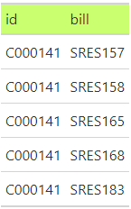
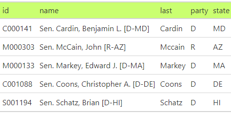
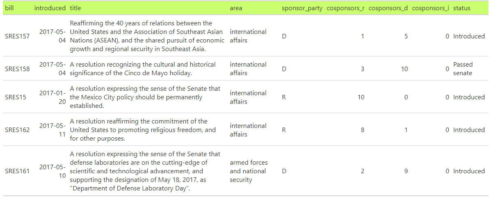
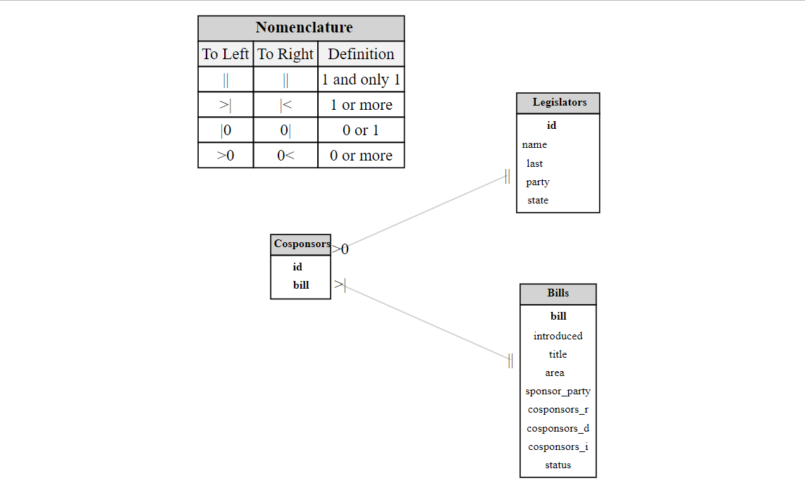
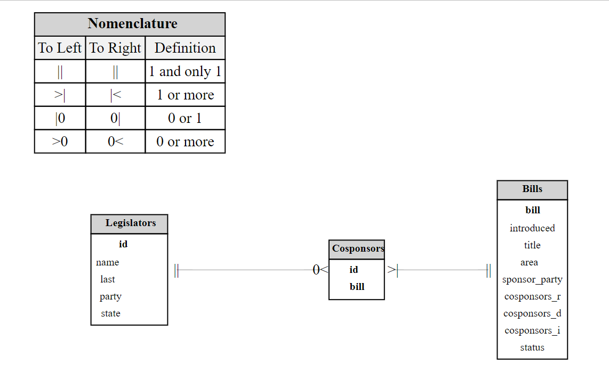
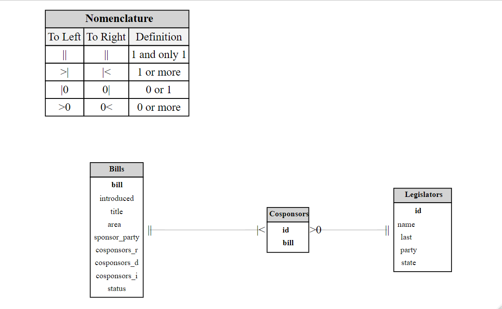

```{r, include = FALSE}
knitr::opts_chunk$set(
  collapse = TRUE,
  comment = "#>"
)
```

The order in which the attribute tables – or entities – appear in the ERD is determined by how the relationships are established.

| Bills                                      | Senators                                      |
|-----------------------------------|-------------------------------------|
|  |  |

| Cosponsors                                      |
|-------------------------------------------------|
|  |

## ERDs







## Code

```{r setup, message=FALSE}
```

```{r, eval = FALSE}
library(ERDbuilder)
library(incidentally)
library(janitor)
library(dplyr)
library(tidyr)
library(tibble)
library(gt)

# https://cran.r-project.org/web/packages/incidentally/vignettes/congress.html

I <- incidence.from.congress(
  session = 115, 
  types = c("sres"), 
  areas = c("All"), 
  format = "data", 
  narrative = TRUE)


legislators_tbl <- I$legislator |> as_tibble()
bills_tbl <- I$bills |> as_tibble() |> clean_names()

## 
cosponsors_tbl <- 
  I$matrix |> 
  as.data.frame() |>
  rownames_to_column(var = "name") |> 
  pivot_longer(-name, names_to = "bill", values_to = "sponsored") |> 
  filter(sponsored == 1) |> 
  left_join(legislators_tbl, by = join_by(name)) |> 
  select(id, bill)


my_gt <- function(df) {
  df |> 
    gt() |>
    tab_style(
      style = cell_fill(color = "darkolivegreen1"),
      locations = cells_column_labels()
    )
}

gt_group(
  cosponsors_tbl |> head(5) |> my_gt(),
  legislators_tbl |> head(5) |> my_gt(),
  bills_tbl |> head(5) |> my_gt()
)


relationships <- list(
  Cosponsors = list(
    Legislators = list(id = "id", relationship = c(">0", "||")),
    Bills = list(bill = "bill", relationship = c(">|", "||"))
  )
)

erd <- create_erd(
  list(
    Cosponsors = cosponsors_tbl, 
    Legislators = legislators_tbl, 
    Bills = bills_tbl
  ),
  relationships
)

render_erd(erd, label_distance = 0)

###   Legislators -> Cosponsors -> Bills

relationships <- list(
  Legislators = list(
    Cosponsors = list(id = "id", relationship = c("||", "0<"))
  ),
  Cosponsors = list(
    Bills = list(bill = "bill", relationship = c(">|", "||"))
  )
)

erd <- create_erd(
  list(
    Cosponsors = cosponsors_tbl, 
    Legislators = legislators_tbl, 
    Bills = bills_tbl
  ),
  relationships
)

render_erd(erd, label_distance = 0)

### Bills -> Cosponsors -> Legislators

relationships <- list(
    Bills = list(
    Cosponsors = list(bill = "bill", relationship = c("||", "|<"))
  ),
  Cosponsors = list(
    Legislators = list(id = "id", relationship = c(">0", "||"))
  )
)

erd <- create_erd(
  list(
    Cosponsors = cosponsors_tbl, 
    Legislators = legislators_tbl, 
    Bills = bills_tbl
  ),
  relationships
)

render_erd(erd, label_distance = 0)


```
